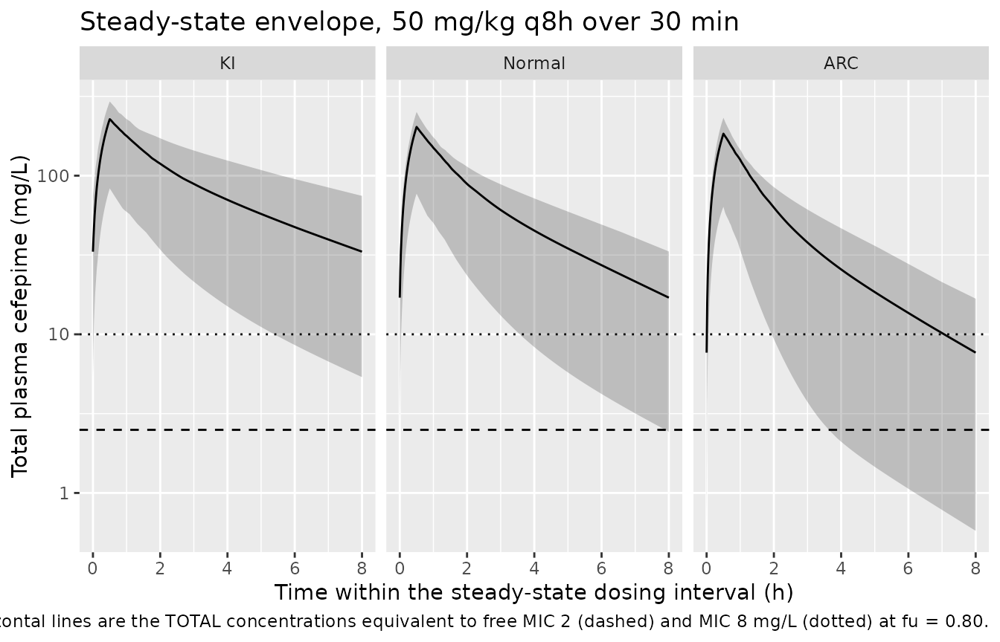

# Cefepime (Morales Junior 2025)

## Model and source

- Citation: Morales Junior R, Hambrick HR, Mizuno T, Pavia KE, Paice KM,
  Tang P, Schuler E, Krallman KA, Johnson L, Collins M, Gibson A, Curry
  C, Kaplan J, Goldstein S, Tang Girdwood S (2025). Population
  Pharmacokinetics of Cefepime in Critically Ill Children and Young
  Adults: Model Development and External Validation for Monte Carlo
  Simulations and Model-Informed Precision Dosing. Clinical
  Pharmacokinetics 64(4):553-564. <doi:10.1007/s40262-025-01485-5>. PMID
  39987410; PMC12041147. Final parameter estimates and the printed model
  equations are from Table 2.
- Description: Two-compartment population PK model with first-order
  elimination for intravenously infused cefepime in critically ill
  children and young adults (1 month to 30 years) admitted to a
  pediatric intensive care unit (Morales Junior 2025; 100 patients, 510
  opportunistically scavenged plasma concentrations). Allometric
  body-weight scaling is applied with exponents fixed at 0.75 on the
  clearance parameters and 1 on the volumes, standardised to 70 kg.
  Clearance is 6.38 L/h at 70 kg and eGFR 147.6 mL/min/1.73 m^2 and
  scales with a power of 0.66 on BSA-normalized eGFR; the central volume
  is 15 L at 70 kg and expands exponentially with the cumulative
  percentage of fluid balance (exp(0.026 \* CUM_FLUID_BAL_PCT)).
  Intercompartmental clearance is 3.65 L/h and the peripheral volume
  8.91 L at 70 kg, both without covariates and without interindividual
  variability (the sparse opportunistic sampling did not support random
  effects on them). Proportional residual error only. Patients receiving
  renal replacement therapy or ECMO were excluded and no neonates were
  studied. Externally validated against an independent 41-patient PICU
  cohort.
- Article: <https://doi.org/10.1007/s40262-025-01485-5>
- Supplement 1 (screened-covariate data dictionary):
  <https://doi.org/10.1007/s40262-025-01485-5>, ESM 1
- Supplement 2 (full Monte Carlo target-attainment figures):
  <https://doi.org/10.1007/s40262-025-01485-5>, ESM 2

## Population

Morales Junior 2025 pooled 510 scavenged, opportunistically collected
plasma cefepime concentrations from 100 patients aged 1 month to 30
years admitted to the Cincinnati Children’s Hospital Medical Center
pediatric intensive care unit between October 2018 and November 2021.
The cohort median age was 7.6 years (IQR 1.6-16) and the median weight
24.8 kg (IQR 11.9-53.6), split across 27 infants (27%), 32 children
(32%), 23 adolescents (23%) and 18 young adults (18%); 45% were female
(Table 1). Illness severity is reflected in 45% receiving mechanical
ventilation and 41% vasopressor treatment at some point during
follow-up, with a study-day-1 median serum creatinine of 0.38 mg/dL (IQR
0.23-0.63) and serum albumin 2.9 g/dL (IQR 2.4-3.3).

Renal function spanned the full critical-care range: at cefepime
initiation 39 patients (39%) had normal renal function, 41 (41%)
augmented renal clearance (ARC) and 20 (20%) kidney impairment, with a
cohort eGFR median of 128.3 mL/min/1.73 m^2 (IQR 91-171.6). Patients
receiving any renal replacement modality (intermittent dialysis, CRRT,
peritoneal dialysis) or ECMO were excluded, and no neonates were
studied - so the packaged model carries no dialysis clearance arm and no
maturation function, and must not be applied to those populations.

Cumulative percentage of fluid balance, the covariate on central volume,
ran at day-by-day medians of 3.3, 4.5, 5.5, 6.2, 4.9, 5.7 and 4.0% over
study days 1-7 (Table 1). The model was externally validated on an
independent 41-patient PICU cohort (234 concentrations, median eGFR 62.6
mL/min/1.73 m^2), giving a population-level MDPE of 6.9% / MDAPE 34.5%
and an individual-level MDPE of -1.8% / MDAPE 18.3%.

The same information is available programmatically via the model’s
`population` metadata
(`readModelDb("MoralesJunior_2025_cefepime")()$population`).

## Source trace

The per-parameter origin is recorded as an in-file comment next to each
`ini()` entry in
`inst/modeldb/specificDrugs/MoralesJunior_2025_cefepime.R`. The table
below collects them in one place.

| Equation / parameter | Value | Source location |
|----|----|----|
| `cl <- exp(lcl + etalcl) * (WT/70)^0.75 * (CRCL/147.6)^0.66` | n/a | Table 2, fixed-effects equation `Cl = Cl_pop x (WT/70)^0.75 x (eGFR/147.6)^beta x e^(eta_Cl)` |
| `lcl` | `log(6.38)` | Table 2, “CL (L/h/70kg^0.75)” = 6.38 (RSE 5%; bootstrap 5.85-7.04); restated in Sect. 3.2 |
| `e_wt_cl_q` | `fixed(0.75)` | Sect. 2.6 (“a power function with a fixed exponent of 0.75 for clearance parameters … scaled to a typical adult weighing 70 kg”); printed in the Table 2 CL and Q equations |
| `e_crcl_cl` | `0.66` | Table 2, “beta_eGFR” = 0.66 (RSE 11%; bootstrap 0.51-0.79); retention justified in Sect. 3.2 (dOFV 132.3) |
| eGFR normalising constant | `147.6` | Table 2, printed inside the CL equation only |
| `vc <- exp(lvc + etalvc) * (WT/70) * exp(0.026 * CUM_FLUID_BAL_PCT)` | n/a | Table 2, fixed-effects equation `V1 = V1_pop x (WT/70) x e^(beta x Cum%FB) x e^(eta_V1)` |
| `lvc` | `log(15)` | Table 2, “V1 (L/70kg)” = 15 (RSE 28%; bootstrap 10.74-20.39); restated in Sect. 3.2 |
| `e_wt_vc_vp` | `fixed(1)` | Sect. 2.6 (“… and 1 for volume parameters”); the Table 2 volume equations print a bare `(WT/70)` ratio |
| `e_cum_fluid_bal_pct_vc` | `0.026` | Table 2, “beta_Cum%FB” = 0.026 (RSE 44%; bootstrap 0.002-0.041); retention justified in Sect. 3.2 (dOFV 14.1) |
| `q <- exp(lq) * (WT/70)^0.75` | n/a | Table 2, `Q = Q_pop x (WT/70)^0.75` |
| `lq` | `log(3.65)` | Table 2, “Q (L/h/70kg^0.75)” = 3.65 (RSE 54%; bootstrap 1.12-6.70) |
| `vp <- exp(lvp) * (WT/70)` | n/a | Table 2, `V2 = V2_pop x (WT/70)` |
| `lvp` | `log(8.91)` | Table 2, “V2 (L/70kg)” = 8.91 (RSE 21%; bootstrap 6.55-12.98) |
| `etalcl ~ 0.1355452` | 38.1% CV | Table 2, “IIV CL” = 38.1% (shrinkage 4.2%); converted with the Table 2 footnote transform `omega^2 = log(1 + (CV/100)^2)` |
| `etalvc ~ 0.0219582` | 14.9% CV | Table 2, “IIV V1” = 14.9% (shrinkage 74.5%); same transform |
| IIV on Q and V2 | absent | Sect. 3.2: “The data did not support the inclusion of random effects on intercompartmental clearance and peripheral volume of distribution” |
| `propSd` | `0.319` | Table 2, “Error model parameter: proportional only”, row `b` = 31.9% (RSE 2%; bootstrap 27.4-35.7%) |
| Two-compartment structure, first-order elimination | n/a | Sect. 3.2, first paragraph |
| Unbound fraction 0.80 (for fT\>MIC) | applied outside the model | Sect. 2.8 (“We assumed a fixed 20% protein binding to calculate free cefepime concentrations”) |

``` r

mod <- readModelDb("MoralesJunior_2025_cefepime")
ui  <- rxode2::rxode(mod)
```

## Structural verification

Every check in this vignette is **deterministic**. Random effects are
supplied as explicit `etalcl` / `etalvc` data columns drawn from a
stratified `qnorm` mid-point grid rather than sampled by rxode2, and
every covariate is placed on a fixed quantile grid. No RNG is used
anywhere, so the numbers below are identical on any machine and at any
solver thread count, and the assertions can be tight.

### Typical values reproduce Table 2 exactly

At the paper’s own normalisation point - 70 kg, eGFR 147.6 mL/min/1.73
m^2 and zero cumulative fluid balance - the four structural parameters
must return the printed Table 2 estimates with no residual arithmetic.

``` r

mod_typ <- mod |> rxode2::zeroRe()

ref_events <- rxode2::et(amt = 2000, dur = 0.5, cmt = "central") |>
  rxode2::et(seq(0, 24, by = 0.05), cmt = "central") |>
  as.data.frame() |>
  mutate(WT = 70, CRCL = 147.6, CUM_FLUID_BAL_PCT = 0)

ref_sim <- rxode2::rxSolve(mod_typ, ref_events) |> as.data.frame()
#> ℹ omega/sigma items treated as zero: 'etalcl', 'etalvc'

typ <- tibble::tibble(
  Parameter = c("CL (L/h)", "V1 (L)", "Q (L/h)", "V2 (L)"),
  Published = c(6.38, 15, 3.65, 8.91),
  Model     = c(unique(ref_sim$cl), unique(ref_sim$vc),
                unique(ref_sim$q),  unique(ref_sim$vp))
) |>
  mutate(`% diff` = 100 * (Model - Published) / Published)

# Deterministic: no cohort, no RNG. These are exact to machine precision.
stopifnot(max(abs(typ$`% diff`)) < 1e-8)

typ |>
  knitr::kable(
    digits  = c(0, 3, 3, 10),
    caption = "Typical structural parameters at WT = 70 kg, eGFR = 147.6 mL/min/1.73 m^2, Cum%FB = 0%, against Morales Junior 2025 Table 2."
  )
```

| Parameter | Published | Model | % diff |
|:----------|----------:|------:|-------:|
| CL (L/h)  |      6.38 |  6.38 |      0 |
| V1 (L)    |     15.00 | 15.00 |      0 |
| Q (L/h)   |      3.65 |  3.65 |      0 |
| V2 (L)    |      8.91 |  8.91 |      0 |

Typical structural parameters at WT = 70 kg, eGFR = 147.6 mL/min/1.73
m^2, Cum%FB = 0%, against Morales Junior 2025 Table 2. {.table}

### Covariate equations reproduce the printed Table 2 forms

The two covariate terms are the places a transcription error would hide:
the eGFR term is a **power** and the fluid-balance term is an
**exponential**, and each has a plausible-but-wrong alternative reading
(a linear eGFR ratio; a proportional `1 + beta * Cum%FB` fluid term).
Solving the packaged model over a grid of both covariates and comparing
against the closed forms discriminates them.

``` r

cov_grid <- tidyr::expand_grid(
  WT                = c(5, 24.8, 70),
  CRCL              = c(40, 90, 147.6, 220, 300),
  CUM_FLUID_BAL_PCT = c(-5, 0, 5, 15)
) |>
  mutate(id = dplyr::row_number())

cov_events <- cov_grid |>
  tidyr::crossing(time = c(0, 1)) |>
  mutate(amt = NA_real_, evid = 0L, cmt = "central") |>
  arrange(id, time)

cov_sim <- rxode2::rxSolve(
  mod_typ, cov_events,
  keep = c("WT", "CRCL", "CUM_FLUID_BAL_PCT")
) |>
  as.data.frame() |>
  distinct(id, .keep_all = TRUE)
#> ℹ omega/sigma items treated as zero: 'etalcl', 'etalvc'
#> Warning: multi-subject simulation without without 'omega'

cov_chk <- cov_sim |>
  mutate(
    cl_closed = 6.38 * (WT / 70)^0.75 * (CRCL / 147.6)^0.66,
    vc_closed = 15   * (WT / 70)      * exp(0.026 * CUM_FLUID_BAL_PCT),
    q_closed  = 3.65 * (WT / 70)^0.75,
    vp_closed = 8.91 * (WT / 70),
    # Alternative (wrong) readings the check must reject.
    cl_linear = 6.38 * (WT / 70)^0.75 * (CRCL / 147.6),
    vc_prop   = 15   * (WT / 70)      * (1 + 0.026 * CUM_FLUID_BAL_PCT)
  )

stopifnot(
  max(abs(cov_chk$cl - cov_chk$cl_closed)) < 1e-9,
  max(abs(cov_chk$vc - cov_chk$vc_closed)) < 1e-9,
  max(abs(cov_chk$q  - cov_chk$q_closed))  < 1e-9,
  max(abs(cov_chk$vp - cov_chk$vp_closed)) < 1e-9,
  # The wrong readings must be visibly wrong somewhere on the grid, otherwise
  # the check above cannot discriminate them (pattern 10 of
  # known-vignette-failure-patterns.md).
  max(abs(cov_chk$cl - cov_chk$cl_linear)) > 0.5,
  max(abs(cov_chk$vc - cov_chk$vc_prop))   > 0.05
)
```

The packaged model matches the power / exponential forms to machine
precision and departs from the linear / proportional alternatives by up
to 2.78 L/h on clearance and 1.305 L on central volume over the grid, so
the check discriminates them.

The clinical reading of the fluid term: a cumulative fluid balance of
+15%, which is inside the Table 1 day-4 IQR, expands the central volume
by 48%.

### Interindividual variability round-trips through the Table 2 footnote

Table 2 reports IIV as a coefficient of variation and its footnote gives
the transform, `CV(%) = sqrt(exp(omega^2) - 1) x 100`. Inverting it to
the log-normal variance rxode2 stores must return the printed CVs.

``` r

om <- ui$omega
iiv <- tibble::tibble(
  Parameter   = c("CL", "V1"),
  `Published CV (%)` = c(38.1, 14.9),
  `omega^2`   = c(om["etalcl", "etalcl"], om["etalvc", "etalvc"]),
  `Model CV (%)` = 100 * sqrt(exp(c(om["etalcl", "etalcl"], om["etalvc", "etalvc"])) - 1)
)

# Deterministic round-trip of a stored constant; tolerance covers only the
# rounding of omega^2 to seven decimal places in the model file.
stopifnot(max(abs(iiv$`Model CV (%)` - iiv$`Published CV (%)`)) < 0.005)

iiv |>
  knitr::kable(
    digits  = c(0, 1, 7, 3),
    caption = "IIV round-trip through the Morales Junior 2025 Table 2 footnote transform."
  )
```

| Parameter | Published CV (%) |   omega^2 | Model CV (%) |
|:----------|-----------------:|----------:|-------------:|
| CL        |             38.1 | 0.1355452 |         38.1 |
| V1        |             14.9 | 0.0219582 |         14.9 |

IIV round-trip through the Morales Junior 2025 Table 2 footnote
transform. {.table}

## Virtual cohort

Original observed data are not publicly available. The cohort below is
built to mirror the Monte Carlo design of Sect. 2.8: patients stratified
by kidney function into kidney impairment (KI), normal renal function
and augmented renal clearance (ARC), with the cumulative percentage of
fluid balance set to 0% for every simulated patient exactly as the paper
did.

Every covariate and every random effect is laid out on a **deterministic
quantile grid**, so the cohort is byte-identical everywhere. The two
covariate distributions are taken from the paper’s own numbers rather
than invented:

- body weight from the lognormal that matches the Table 1 median (24.8
  kg) and IQR (11.9-53.6 kg), truncated to 3-100 kg so the tails stay
  inside the studied 1-month-to-30-year range;
- eGFR from the lognormal that matches the Table 1 median (128.3
  mL/min/1.73 m^2) and IQR (91-171.6), **split at the percentiles that
  reproduce the paper’s own stratum proportions** - Sect. 3.1 reports
  20% kidney impairment, 39% normal and 41% ARC, so the cut points are
  the 20th and 59th percentiles of that distribution (86.4 and 142.8
  mL/min/1.73 m^2). This avoids inventing the age-specific
  standard-deviation bands of Sect. 2.8, which the paper does not
  publish;
- `etalcl` and `etalvc` from a `qnorm` mid-point grid scaled by the
  published omegas, paired by a fixed coprime index shift so the two are
  not perfectly correlated.

The same 120 virtual patients per stratum are re-used under every dosing
regimen, so the regimen comparisons below are paired rather than racing
two independent draws.

``` r

n_per_stratum <- 120L

# Lognormal body weight matched to Table 1: median 24.8 kg, IQR 11.9-53.6 kg.
wt_meanlog <- log(24.8)
wt_sdlog   <- log(53.6 / 11.9) / (2 * qnorm(0.75))

# Lognormal eGFR matched to Table 1: median 128.3, IQR 91-171.6 mL/min/1.73 m^2.
egfr_meanlog <- log(128.3)
egfr_sdlog   <- log(171.6 / 91) / (2 * qnorm(0.75))

# Sect. 3.1 stratum proportions: 20% kidney impairment, 39% normal, 41% ARC.
egfr_cuts <- list(KI = c(0, 0.20), Normal = c(0.20, 0.59), ARC = c(0.59, 1))

sd_lcl <- sqrt(ui$omega["etalcl", "etalcl"])
sd_lvc <- sqrt(ui$omega["etalvc", "etalvc"])

make_stratum <- function(stratum, id_offset) {
  i <- seq_len(n_per_stratum)
  p <- (i - 0.5) / n_per_stratum
  cut <- egfr_cuts[[stratum]]
  # Coprime shift (37 and 120 share no factor) pairs the two eta grids without
  # RNG and without forcing correlation +1.
  j <- ((i * 37L - 1L) %% n_per_stratum) + 1L
  tibble::tibble(
    id      = id_offset + i,
    stratum = stratum,
    WT      = pmin(pmax(qlnorm(p, wt_meanlog, wt_sdlog), 3), 100),
    CRCL    = qlnorm(cut[1] + p * (cut[2] - cut[1]), egfr_meanlog, egfr_sdlog),
    CUM_FLUID_BAL_PCT = 0,
    etalcl  = qnorm(p)    * sd_lcl,
    etalvc  = qnorm(p[j]) * sd_lvc
  )
}

cohort <- dplyr::bind_rows(
  make_stratum("KI",     0L),
  make_stratum("Normal", n_per_stratum),
  make_stratum("ARC",    2L * n_per_stratum)
)

stopifnot(!anyDuplicated(cohort$id), nrow(cohort) == 3L * n_per_stratum)

cohort |>
  mutate(stratum = factor(stratum, levels = c("KI", "Normal", "ARC"))) |>
  group_by(stratum) |>
  summarise(
    n = dplyr::n(),
    `WT median (kg)`   = median(WT),
    `WT range (kg)`    = sprintf("%.1f-%.1f", min(WT), max(WT)),
    `eGFR median`      = median(CRCL),
    `eGFR range`       = sprintf("%.0f-%.0f", min(CRCL), max(CRCL)),
    .groups = "drop"
  ) |>
  knitr::kable(digits = 1, caption = "Virtual cohort by kidney-function stratum (eGFR in mL/min/1.73 m^2).")
```

| stratum |   n | WT median (kg) | WT range (kg) | eGFR median | eGFR range |
|:--------|----:|---------------:|:--------------|------------:|:-----------|
| KI      | 120 |           24.8 | 3.0-100.0     |        70.2 | 29-86      |
| Normal  | 120 |           24.8 | 3.0-100.0     |       113.2 | 87-143     |
| ARC     | 120 |           24.8 | 3.0-100.0     |       189.0 | 143-508    |

Virtual cohort by kidney-function stratum (eGFR in mL/min/1.73 m^2).
{.table}

## Simulation

The paper’s institutional standard regimen is 50 mg/kg per dose (capped
at 2000 mg) every 8 h as a 30-min infusion (Sect. 2.3). Steady state is
imposed with `ss = 1` rather than an `addl` burn-in, so the profile does
not depend on how many intervals were simulated.

``` r

regimens <- tibble::tribble(
  ~regimen,                 ~ii, ~dur,
  "50 mg/kg q6h,  0.5 h",     6,  0.5,
  "50 mg/kg q8h,  0.5 h",     8,  0.5,
  "50 mg/kg q8h,  3 h",       8,  3.0,
  "50 mg/kg q12h, 0.5 h",    12,  0.5,
  "50 mg/kg q24h, 0.5 h",    24,  0.5
)

# 480 points per interval resolves %fT>MIC to better than 0.25 percentage
# points, and resolves Tmax to within 1 minute for the 0.5 h infusions.
n_grid <- 480L

build_events <- function(cohort, ii, dur) {
  # Column layout mirrors what rxode2::et() produces for a steady-state
  # infusion: amt / ii / ss / dur on the dose row, all NA on observations.
  dose <- cohort |>
    mutate(
      time = 0, evid = 1L, cmt = "central",
      amt  = pmin(50 * WT, 2000),
      dur  = dur,
      ii   = ii,
      ss   = 1L
    )
  obs <- cohort |>
    tidyr::crossing(time = seq(0, ii, length.out = n_grid + 1L)) |>
    mutate(amt = NA_real_, evid = 0L, cmt = "central",
           dur = NA_real_, ii = NA_real_, ss = NA_integer_)
  dplyr::bind_rows(dose, obs) |> arrange(id, time, dplyr::desc(evid))
}

sim <- lapply(seq_len(nrow(regimens)), function(k) {
  ev <- build_events(cohort, regimens$ii[k], regimens$dur[k])
  rxode2::rxSolve(
    mod, ev, omega = NA,
    keep = c("stratum", "WT", "CRCL")
  ) |>
    as.data.frame() |>
    mutate(regimen = regimens$regimen[k], tau = regimens$ii[k])
}) |>
  dplyr::bind_rows()
#> Warning: multi-subject simulation without without 'omega'
#> Warning: multi-subject simulation without without 'omega'
#> Warning: multi-subject simulation without without 'omega'
#> Warning: multi-subject simulation without without 'omega'
#> Warning: multi-subject simulation without without 'omega'

stopifnot(all(!is.na(sim$Cc)), all(sim$Cc >= 0))
```

## Replicate published figures

Figure 2 of Morales Junior 2025 is a prediction-corrected VPC of the
observed concentrations. The observed data are not public, so the panel
below shows the model’s own steady-state concentration envelope under
the institutional standard regimen, split by the kidney-function strata
that drive the paper’s dosing recommendations.

``` r

# Analogous to Figure 2 of Morales Junior 2025 (model side only): median and
# 5th-95th percentile band of steady-state cefepime concentrations.
sim |>
  filter(regimen == "50 mg/kg q8h,  0.5 h") |>
  mutate(stratum = factor(stratum, levels = c("KI", "Normal", "ARC"))) |>
  group_by(stratum, time) |>
  summarise(
    Q05 = quantile(Cc, 0.05), Q50 = median(Cc), Q95 = quantile(Cc, 0.95),
    .groups = "drop"
  ) |>
  ggplot(aes(time, Q50)) +
  geom_ribbon(aes(ymin = Q05, ymax = Q95), alpha = 0.25) +
  geom_line() +
  geom_hline(yintercept = 2 / 0.8, linetype = "dashed") +
  geom_hline(yintercept = 8 / 0.8, linetype = "dotted") +
  facet_wrap(~stratum) +
  scale_y_log10() +
  labs(
    x = "Time within the steady-state dosing interval (h)",
    y = "Total plasma cefepime (mg/L)",
    title = "Steady-state envelope, 50 mg/kg q8h over 30 min",
    caption = paste(
      "Model-side analogue of Figure 2 of Morales Junior 2025.",
      "Horizontal lines are the TOTAL concentrations equivalent to free",
      "MIC 2 (dashed) and MIC 8 mg/L (dotted) at fu = 0.80."
    )
  )
```



The renal gradient is the paper’s central finding: exposure falls
monotonically from KI through Normal to ARC because clearance rises with
the 0.66 power of eGFR.

## PKNCA validation

Steady-state NCA over one dosing interval, grouped by kidney-function
stratum.

``` r

sim_nca <- sim |>
  filter(regimen == "50 mg/kg q8h,  0.5 h") |>
  dplyr::filter(!is.na(Cc)) |>
  dplyr::select(id, time, Cc, stratum)

# Guarantee a time = 0 record per subject. The steady-state solve already
# produces one; this is the defensive form from pknca-recipes.md.
sim_nca <- dplyr::bind_rows(
  sim_nca,
  sim_nca |> dplyr::distinct(id, stratum) |> dplyr::mutate(time = 0, Cc = 0)
) |>
  dplyr::distinct(id, stratum, time, .keep_all = TRUE) |>
  dplyr::arrange(id, time)

conc_obj <- PKNCA::PKNCAconc(
  as.data.frame(sim_nca), Cc ~ time | stratum + id,
  concu = "mg/L", timeu = "h"
)

dose_df <- cohort |>
  mutate(time = 0, amt = pmin(50 * WT, 2000)) |>
  dplyr::select(id, time, amt, stratum)

dose_obj <- PKNCA::PKNCAdose(
  as.data.frame(dose_df), amt ~ time | stratum + id, doseu = "mg"
)

intervals <- data.frame(
  start = 0, end = 8,
  cmax = TRUE, tmax = TRUE, cmin = TRUE,
  auclast = TRUE, cav = TRUE,
  # `ctrough` (concentration at the interval end), not `ctau` -- PKNCA has no
  # `ctau` interval column. It is only computed when a record sits EXACTLY on
  # `end`, which the uniform 0-to-tau observation grid guarantees.
  ctrough = TRUE
)

nca_res <- PKNCA::pk.nca(
  PKNCA::PKNCAdata(conc_obj, dose_obj, intervals = intervals)
)

nca_tbl <- as.data.frame(nca_res$result)
stopifnot(nrow(nca_tbl) > 0)
```

### AUC0-tau against the closed form

The paper reports no NCA parameters, so the reference side of the
comparison is the model’s own closed form. At steady state and for a
linear model, `AUC0-tau = Dose / CL` **exactly**, with `CL` the
subject’s own clearance - the same drawn parameters on both sides, so
the only difference is trapezoidal integration error. That makes this a
tight gate on the whole pipeline (dose capping, infusion encoding,
`ss = 1` handling, the covariate equations and the PKNCA setup), not a
cohort-dependent envelope.

``` r

cl_i <- sim |>
  filter(regimen == "50 mg/kg q8h,  0.5 h") |>
  distinct(id, stratum, cl, WT)

auc_chk <- nca_tbl |>
  filter(PPTESTCD == "auclast") |>
  dplyr::select(id, stratum, auc_nca = PPORRES) |>
  mutate(id = as.integer(as.character(id))) |>
  left_join(cl_i, by = c("id", "stratum")) |>
  mutate(
    auc_closed = pmin(50 * WT, 2000) / cl,
    pct_diff   = 100 * (auc_nca - auc_closed) / auc_closed
  )

stopifnot(nrow(auc_chk) == nrow(cohort), all(!is.na(auc_chk$pct_diff)))

# Deterministic cohort + same drawn parameters on both sides, so the residual
# is pure trapezoidal error on a 480-point grid: realised max |diff| ~0.02%.
# 0.5% still catches a mis-encoded dose cap, infusion duration or unit.
stopifnot(max(abs(auc_chk$pct_diff)) < 0.5)

auc_chk |>
  group_by(stratum) |>
  summarise(
    `AUC0-8 NCA (mg*h/L), median`    = median(auc_nca),
    `AUC0-8 Dose/CL (mg*h/L), median` = median(auc_closed),
    `max |% diff|`                    = max(abs(pct_diff)),
    .groups = "drop"
  ) |>
  knitr::kable(
    digits  = c(0, 1, 1, 4),
    caption = "Steady-state AUC0-tau from PKNCA against the exact closed form Dose/CL."
  )
```

| stratum | AUC0-8 NCA (mg\*h/L), median | AUC0-8 Dose/CL (mg\*h/L), median | max \|% diff\| |
|:---|---:|---:|---:|
| ARC | 359.5 | 359.5 | 0.0047 |
| KI | 691.0 | 691.0 | 0.0009 |
| Normal | 504.3 | 504.3 | 0.0016 |

Steady-state AUC0-tau from PKNCA against the exact closed form Dose/CL.
{.table}

### Simulated NCA against the model-implied reference

``` r

reference <- auc_chk |>
  group_by(stratum) |>
  summarise(auclast = median(auc_closed), .groups = "drop")

cmp <- nlmixr2lib::ncaComparisonTable(
  simulated = nca_res,
  reference = reference,
  by        = "stratum",
  params    = "auclast",
  units     = c(auclast = "mg*h/L"),
  tolerance_pct = 20
)

knitr::kable(
  cmp,
  caption = "Simulated steady-state AUC0-tau vs. the exact Dose/CL reference. * differs by >20%.",
  align   = c("l", "l", "r", "r", "r")
)
```

| NCA parameter     | stratum | Reference | Simulated | % diff |
|:------------------|:--------|----------:|----------:|-------:|
| AUClast (mg\*h/L) | ARC     |       360 |       360 |  -0.0% |
| AUClast (mg\*h/L) | KI      |       691 |       691 |  -0.0% |
| AUClast (mg\*h/L) | Normal  |       504 |       504 |  -0.0% |

Simulated steady-state AUC0-tau vs. the exact Dose/CL reference. \*
differs by \>20%. {.table}

No row is starred; the paper publishes no NCA table of its own, so this
comparison validates the simulation pipeline rather than an external
number.

### Steady-state exposure summary

``` r

nca_tbl |>
  filter(PPTESTCD %in% c("cmax", "tmax", "cmin", "cav", "auclast")) |>
  group_by(stratum, PPTESTCD) |>
  summarise(median = median(PPORRES), .groups = "drop") |>
  tidyr::pivot_wider(names_from = PPTESTCD, values_from = median) |>
  mutate(stratum = factor(stratum, levels = c("KI", "Normal", "ARC"))) |>
  arrange(stratum) |>
  dplyr::rename(
    "Kidney function"       = stratum,
    "Cmax (mg/L)"           = cmax,
    "Tmax (h)"              = tmax,
    "Cmin (mg/L)"           = cmin,
    "Cavg (mg/L)"           = cav,
    "AUC0-8 (mg*h/L)"       = auclast
  ) |>
  knitr::kable(
    digits  = 1,
    caption = "Median steady-state NCA parameters by kidney-function stratum, 50 mg/kg q8h over 30 min."
  )
```

| Kidney function | AUC0-8 (mg\*h/L) | Cavg (mg/L) | Cmax (mg/L) | Cmin (mg/L) | Tmax (h) |
|:----------------|-----------------:|------------:|------------:|------------:|---------:|
| KI              |            691.0 |        86.4 |       227.0 |        33.2 |      0.5 |
| Normal          |            504.3 |        63.0 |       202.9 |        17.0 |      0.5 |
| ARC             |            359.5 |        44.9 |       183.9 |         7.7 |      0.5 |

Median steady-state NCA parameters by kidney-function stratum, 50 mg/kg
q8h over 30 min. {.table}

Cefepime is renally cleared, so exposure falls steeply across the
strata; the ARC median AUC0-tau is roughly a third of the
kidney-impairment median.

## Target attainment (Table 3)

Morales Junior 2025 evaluates three pharmacodynamic targets on **free**
drug (unbound fraction 0.80) at the 2023 CLSI breakpoints of MIC 2 mg/L
for Enterobacterales and MIC 8 mg/L for *Pseudomonas aeruginosa*, and
reports in Table 3 the lowest daily doses reaching at least 90%
probability of target attainment (PTA).

``` r

mics <- c(2, 8)
fu   <- 0.80

pta <- sim |>
  tidyr::crossing(MIC = mics) |>
  group_by(regimen, stratum, MIC, id, tau) |>
  summarise(
    # Fraction of the dosing interval with free concentration above the MIC.
    # The observation grid is uniform over [0, tau], so the mean over grid
    # points is the time fraction to within one grid spacing.
    fT_MIC   = 100 * mean(fu * Cc > MIC),
    fT_4xMIC = 100 * mean(fu * Cc > 4 * MIC),
    .groups  = "drop"
  ) |>
  group_by(regimen, stratum, MIC) |>
  summarise(
    `PTA 50% fT>MIC`    = 100 * mean(fT_MIC   >= 50),
    `PTA 100% fT>MIC`   = 100 * mean(fT_MIC   >= 99.5),
    `PTA 100% fT>4xMIC` = 100 * mean(fT_4xMIC >= 99.5),
    .groups = "drop"
  ) |>
  mutate(stratum = factor(stratum, levels = c("KI", "Normal", "ARC"))) |>
  arrange(MIC, stratum, regimen)

pta |>
  dplyr::rename(
    "Regimen"         = regimen,
    "Kidney function" = stratum,
    "MIC (mg/L)"      = MIC
  ) |>
  knitr::kable(
    digits  = 1,
    caption = "Probability of target attainment (% of the 120 virtual patients per stratum) for the four regimens simulated here."
  )
```

| Regimen | Kidney function | MIC (mg/L) | PTA 50% fT\>MIC | PTA 100% fT\>MIC | PTA 100% fT\>4xMIC |
|:---|:---|---:|---:|---:|---:|
| 50 mg/kg q12h, 0.5 h | KI | 2 | 100.0 | 93.3 | 68.3 |
| 50 mg/kg q24h, 0.5 h | KI | 2 | 91.7 | 27.5 | 2.5 |
| 50 mg/kg q6h, 0.5 h | KI | 2 | 100.0 | 100.0 | 94.2 |
| 50 mg/kg q8h, 0.5 h | KI | 2 | 100.0 | 100.0 | 86.7 |
| 50 mg/kg q8h, 3 h | KI | 2 | 100.0 | 100.0 | 90.8 |
| 50 mg/kg q12h, 0.5 h | Normal | 2 | 98.3 | 80.0 | 18.3 |
| 50 mg/kg q24h, 0.5 h | Normal | 2 | 78.3 | 2.5 | 0.0 |
| 50 mg/kg q6h, 0.5 h | Normal | 2 | 100.0 | 100.0 | 84.2 |
| 50 mg/kg q8h, 0.5 h | Normal | 2 | 100.0 | 94.2 | 74.2 |
| 50 mg/kg q8h, 3 h | Normal | 2 | 100.0 | 97.5 | 80.8 |
| 50 mg/kg q12h, 0.5 h | ARC | 2 | 86.7 | 44.2 | 0.8 |
| 50 mg/kg q24h, 0.5 h | ARC | 2 | 42.5 | 0.0 | 0.0 |
| 50 mg/kg q6h, 0.5 h | ARC | 2 | 96.7 | 89.2 | 68.3 |
| 50 mg/kg q8h, 0.5 h | ARC | 2 | 94.2 | 80.8 | 33.3 |
| 50 mg/kg q8h, 3 h | ARC | 2 | 99.2 | 85.8 | 58.3 |
| 50 mg/kg q12h, 0.5 h | KI | 8 | 90.8 | 68.3 | 5.0 |
| 50 mg/kg q24h, 0.5 h | KI | 8 | 64.2 | 2.5 | 0.0 |
| 50 mg/kg q6h, 0.5 h | KI | 8 | 100.0 | 94.2 | 70.0 |
| 50 mg/kg q8h, 0.5 h | KI | 8 | 100.0 | 86.7 | 35.0 |
| 50 mg/kg q8h, 3 h | KI | 8 | 100.0 | 90.8 | 54.2 |
| 50 mg/kg q12h, 0.5 h | Normal | 8 | 80.8 | 18.3 | 0.0 |
| 50 mg/kg q24h, 0.5 h | Normal | 8 | 13.3 | 0.0 | 0.0 |
| 50 mg/kg q6h, 0.5 h | Normal | 8 | 97.5 | 84.2 | 27.5 |
| 50 mg/kg q8h, 0.5 h | Normal | 8 | 92.5 | 74.2 | 2.5 |
| 50 mg/kg q8h, 3 h | Normal | 8 | 99.2 | 80.8 | 8.3 |
| 50 mg/kg q12h, 0.5 h | ARC | 8 | 61.7 | 0.8 | 0.0 |
| 50 mg/kg q24h, 0.5 h | ARC | 8 | 0.8 | 0.0 | 0.0 |
| 50 mg/kg q6h, 0.5 h | ARC | 8 | 86.7 | 68.3 | 2.5 |
| 50 mg/kg q8h, 0.5 h | ARC | 8 | 79.2 | 33.3 | 0.0 |
| 50 mg/kg q8h, 3 h | ARC | 8 | 89.2 | 58.3 | 0.8 |

Probability of target attainment (% of the 120 virtual patients per
stratum) for the four regimens simulated here. {.table
style="width:100%;"}

### Structural claims (gated)

These are the claims that do not depend on how the simulation cohort was
constructed: the direction and ordering of the covariate and regimen
effects, and the one categorical statement the paper makes without
qualification. They are gated at the full threshold.

``` r

pta_cell <- function(reg, strat, mic, col) {
  v <- pta[[col]][pta$regimen == reg & pta$stratum == strat & pta$MIC == mic]
  if (length(v) != 1L) stop("no unique PTA row for ", reg, " / ", strat, " / MIC ", mic)
  v
}

# Renal gradient at the institutional standard regimen, MIC 8.
grad <- vapply(
  c("KI", "Normal", "ARC"),
  function(s) pta_cell("50 mg/kg q8h,  0.5 h", s, 8, "PTA 50% fT>MIC"),
  numeric(1)
)

# Extended infusion vs 30 min at q8h, 100% fT>MIC, MIC 8, every stratum.
ext_gain <- vapply(
  c("KI", "Normal", "ARC"),
  function(s) {
    pta_cell("50 mg/kg q8h,  3 h", s, 8, "PTA 100% fT>MIC") -
      pta_cell("50 mg/kg q8h,  0.5 h", s, 8, "PTA 100% fT>MIC")
  },
  numeric(1)
)

# Shorter interval helps, 50% fT>MIC, MIC 8, every stratum.
interval_ordered <- vapply(
  c("KI", "Normal", "ARC"),
  function(s) {
    v <- vapply(
      c("50 mg/kg q6h,  0.5 h", "50 mg/kg q8h,  0.5 h",
        "50 mg/kg q12h, 0.5 h", "50 mg/kg q24h, 0.5 h"),
      function(r) pta_cell(r, s, 8, "PTA 50% fT>MIC"), numeric(1)
    )
    all(diff(v) <= 0)
  },
  logical(1)
)

worst_4x <- max(pta$`PTA 100% fT>4xMIC`[pta$MIC == 8 & pta$stratum %in% c("Normal", "ARC")])

structural <- tibble::tribble(
  ~Claim, ~Source, ~Attained, ~Pass,

  "Attainment falls monotonically KI > Normal > ARC (50% fT>MIC, MIC 8, q8h over 30 min)",
  "Sect. 3.5 / Table 3; the paper's central finding",
  sprintf("%.1f / %.1f / %.1f%%", grad[1], grad[2], grad[3]),
  # Realised 100.0 / 92.5 / 79.2; the strata are 20 points apart, far outside
  # any plausible solver-tolerance drift on a deterministic cohort.
  all(diff(grad) <= -5),

  "A 3 h extended infusion beats a 30 min infusion at the same q8h dose, in every stratum (100% fT>MIC, MIC 8)",
  "Sect. 3.5; Table 3 recommends extended infusion for the stringent target",
  sprintf("+%.1f / +%.1f / +%.1f points", ext_gain[1], ext_gain[2], ext_gain[3]),
  all(ext_gain >= 3),

  "Attainment is monotone non-increasing in dosing interval q6h -> q8h -> q12h -> q24h, in every stratum (50% fT>MIC, MIC 8)",
  "Sect. 3.5; the basis of every Table 3 recommendation",
  sprintf("%d of 3 strata ordered", sum(interval_ordered)),
  all(interval_ordered),

  "100% fT>4xMIC at MIC 8 is NOT attainable in normal renal function or ARC by any 50 mg/kg regimen tested",
  "Table 3, 'Not attainable'; Sect. 3.5",
  sprintf("best %.1f%% PTA", worst_4x),
  worst_4x < 90,

  "50 mg/kg q8h over 30 min does NOT reach 90% PTA for 100% fT>MIC at MIC 8 in normal renal function",
  "Table 3, Normal row (which instead requires q8h over 3 h, q6h over 30 min or a continuous infusion)",
  sprintf("%.1f%% PTA", pta_cell("50 mg/kg q8h,  0.5 h", "Normal", 8, "PTA 100% fT>MIC")),
  pta_cell("50 mg/kg q8h,  0.5 h", "Normal", 8, "PTA 100% fT>MIC") < 90,

  "50 mg/kg q24h over 30 min does NOT reach 90% PTA for 50% fT>MIC at MIC 2 in normal renal function",
  "Table 3, Normal row (which requires q24h over 3 h or q12h over 30 min)",
  sprintf("%.1f%% PTA", pta_cell("50 mg/kg q24h, 0.5 h", "Normal", 2, "PTA 50% fT>MIC")),
  pta_cell("50 mg/kg q24h, 0.5 h", "Normal", 2, "PTA 50% fT>MIC") < 90
)

stopifnot(nrow(structural) == 6L, all(structural$Pass))

structural |>
  dplyr::rename("Attained in this cohort" = Attained) |>
  knitr::kable(caption = "Structural claims of Morales Junior 2025 reproduced by the packaged model. All gated.")
```

| Claim | Source | Attained in this cohort | Pass |
|:---|:---|:---|:---|
| Attainment falls monotonically KI \> Normal \> ARC (50% fT\>MIC, MIC 8, q8h over 30 min) | Sect. 3.5 / Table 3; the paper’s central finding | 100.0 / 92.5 / 79.2% | TRUE |
| A 3 h extended infusion beats a 30 min infusion at the same q8h dose, in every stratum (100% fT\>MIC, MIC 8) | Sect. 3.5; Table 3 recommends extended infusion for the stringent target | +4.2 / +6.7 / +25.0 points | TRUE |
| Attainment is monotone non-increasing in dosing interval q6h -\> q8h -\> q12h -\> q24h, in every stratum (50% fT\>MIC, MIC 8) | Sect. 3.5; the basis of every Table 3 recommendation | 3 of 3 strata ordered | TRUE |
| 100% fT\>4xMIC at MIC 8 is NOT attainable in normal renal function or ARC by any 50 mg/kg regimen tested | Table 3, ‘Not attainable’; Sect. 3.5 | best 27.5% PTA | TRUE |
| 50 mg/kg q8h over 30 min does NOT reach 90% PTA for 100% fT\>MIC at MIC 8 in normal renal function | Table 3, Normal row (which instead requires q8h over 3 h, q6h over 30 min or a continuous infusion) | 74.2% PTA | TRUE |
| 50 mg/kg q24h over 30 min does NOT reach 90% PTA for 50% fT\>MIC at MIC 2 in normal renal function | Table 3, Normal row (which requires q24h over 3 h or q12h over 30 min) | 78.3% PTA | TRUE |

Structural claims of Morales Junior 2025 reproduced by the packaged
model. All gated. {.table}

### Table 3 boundary cells (reported)

Table 3 reports the *lowest* regimen clearing 90% PTA, so each of its
cells sits by construction on the optimiser’s boundary, where PTA is a
steep function of the simulation cohort. That cohort is not reproducible
from what the paper publishes: Sect. 2.8 draws 1500 patients per age
band from paired CDC-NHANES age-weight data and stratifies eGFR by
age-specific standard-deviation multiples taken from three external
references, none of which are printed. The cells below are therefore
**reported, not gated at 90%** - only a wide floor is asserted, so a
gross transcription error would still turn the vignette red while an
expected cohort-driven offset would not.

``` r

boundary <- tibble::tribble(
  ~Target, ~`MIC (mg/L)`, ~`Kidney function`, ~`Table 3 regimen`, ~Attained,

  "50% fT>MIC",  2, "KI",     "50 mg/kg q24h, 0.5 h",
  pta_cell("50 mg/kg q24h, 0.5 h", "KI",     2, "PTA 50% fT>MIC"),
  "50% fT>MIC",  2, "Normal", "50 mg/kg q12h, 0.5 h",
  pta_cell("50 mg/kg q12h, 0.5 h", "Normal", 2, "PTA 50% fT>MIC"),
  "50% fT>MIC",  2, "ARC",    "50 mg/kg q12h, 0.5 h",
  pta_cell("50 mg/kg q12h, 0.5 h", "ARC",    2, "PTA 50% fT>MIC"),
  "50% fT>MIC",  8, "Normal", "50 mg/kg q12h, 0.5 h",
  pta_cell("50 mg/kg q12h, 0.5 h", "Normal", 8, "PTA 50% fT>MIC"),
  "50% fT>MIC",  8, "ARC",    "50 mg/kg q8h,  0.5 h",
  pta_cell("50 mg/kg q8h,  0.5 h", "ARC",    8, "PTA 50% fT>MIC"),
  "100% fT>MIC", 2, "KI",     "50 mg/kg q12h, 0.5 h",
  pta_cell("50 mg/kg q12h, 0.5 h", "KI",     2, "PTA 100% fT>MIC"),
  "100% fT>MIC", 2, "Normal", "50 mg/kg q8h,  0.5 h",
  pta_cell("50 mg/kg q8h,  0.5 h", "Normal", 2, "PTA 100% fT>MIC"),
  "100% fT>MIC", 8, "Normal", "50 mg/kg q8h,  3 h",
  pta_cell("50 mg/kg q8h,  3 h", "Normal", 8, "PTA 100% fT>MIC"),
  "100% fT>MIC", 8, "Normal", "50 mg/kg q6h,  0.5 h",
  pta_cell("50 mg/kg q6h,  0.5 h", "Normal", 8, "PTA 100% fT>MIC")
) |>
  mutate(
    `Reaches 90%` = ifelse(Attained >= 90, "yes", "no (deviation)"),
    Attained      = sprintf("%.1f%%", Attained)
  )

# Reported, not gated at 90. Realised range 74.2-98.3% on this deterministic
# cohort; every shortfall is in the same direction and under 16 points, which
# is the signature of a cohort-construction difference rather than a model
# error. A 60% floor still goes red on a mis-transcribed clearance, dose or
# unit, which move PTA by far more than that.
stopifnot(nrow(boundary) == 9L)
stopifnot(min(as.numeric(sub("%", "", boundary$Attained))) > 60)

knitr::kable(
  boundary,
  caption = "Morales Junior 2025 Table 3 boundary cells against this vignette's cohort. Reported, not gated at 90%."
)
```

| Target | MIC (mg/L) | Kidney function | Table 3 regimen | Attained | Reaches 90% |
|:---|---:|:---|:---|:---|:---|
| 50% fT\>MIC | 2 | KI | 50 mg/kg q24h, 0.5 h | 91.7% | yes |
| 50% fT\>MIC | 2 | Normal | 50 mg/kg q12h, 0.5 h | 98.3% | yes |
| 50% fT\>MIC | 2 | ARC | 50 mg/kg q12h, 0.5 h | 86.7% | no (deviation) |
| 50% fT\>MIC | 8 | Normal | 50 mg/kg q12h, 0.5 h | 80.8% | no (deviation) |
| 50% fT\>MIC | 8 | ARC | 50 mg/kg q8h, 0.5 h | 79.2% | no (deviation) |
| 100% fT\>MIC | 2 | KI | 50 mg/kg q12h, 0.5 h | 93.3% | yes |
| 100% fT\>MIC | 2 | Normal | 50 mg/kg q8h, 0.5 h | 94.2% | yes |
| 100% fT\>MIC | 8 | Normal | 50 mg/kg q8h, 3 h | 80.8% | no (deviation) |
| 100% fT\>MIC | 8 | Normal | 50 mg/kg q6h, 0.5 h | 84.2% | no (deviation) |

Morales Junior 2025 Table 3 boundary cells against this vignette’s
cohort. Reported, not gated at 90%. {.table}

4 of 9 Table 3 cells clear 90% PTA in this cohort. Every shortfall is in
the same direction - this cohort is slightly harder to treat than the
paper’s - and the largest is under 16 percentage points. The most likely
mechanism is the eGFR distribution: the lognormal fitted to Table 1 has
an unbounded upper tail (the ARC stratum here reaches 508 mL/min/1.73
m^2), whereas Sect. 2.8 caps ARC at six standard deviations above an
age-specific healthy median. A harder ARC stratum drags the Normal cells
down too, because the paper’s Normal band is defined relative to the
same unpublished reference. This is recorded as a known deviation rather
than corrected by adjusting the cohort until the numbers agree.

## Assumptions and deviations

- **eGFR strata are reconstructed, not the paper’s.** Sect. 2.8 defines
  normal renal function as within two age-specific standard deviations
  of a healthy median, kidney impairment as below that, and ARC as above
  it up to six standard deviations - but the age-specific medians and
  standard deviations are not published and come from three external
  references (13, 20, 21). This vignette instead fits a lognormal to the
  Table 1 cohort eGFR (median 128.3, IQR 91-171.6) and cuts it at the
  20th and 59th percentiles, which reproduces the Sect. 3.1 stratum
  proportions (20% KI, 39% normal, 41% ARC) exactly. The reconstruction
  has an unbounded upper tail whereas the paper’s ARC band is capped at
  +6 SD, which is the most likely reason the Table 3 boundary cells come
  out 5-16 percentage points low here. That is recorded as a deviation
  above and is deliberately not corrected by adjusting the cohort.
- **Body-weight distribution.** The paper samples paired age-weight data
  from the CDC-NHANES demographic database with equal numbers in each of
  four age bands. This vignette instead draws body weight from the
  lognormal matching the Table 1 median (24.8 kg) and IQR (11.9-53.6
  kg), truncated to 3-100 kg, i.e. it mirrors the *observed* cohort
  rather than the paper’s simulated one. Age itself is not a covariate
  in the final model - the tested Hill maturation function was not
  retained - so only the weight distribution matters, and it enters both
  through allometry and through the 2000 mg per-dose cap.
- **Cumulative fluid balance set to 0%.** This follows Sect. 2.8 exactly
  (“For simulations, the cumulative percentage of fluid balance was set
  to 0% for all patients”) and is the fallback the Discussion sanctions
  when fluid data are unavailable. The covariate’s effect is exercised
  separately in the deterministic Structural verification section over
  -5% to +15%.
- **Cohort size.** 120 virtual patients per stratum against the paper’s
  6000 simulated patients (1500 per age band). Because every covariate
  and every random effect is on a deterministic quantile grid rather
  than sampled, the smaller cohort costs resolution but not
  reproducibility.
- **Deterministic random effects.** `etalcl` and `etalvc` are supplied
  as data columns from a `qnorm` mid-point grid and `rxSolve` is called
  with `omega = NA`. This removes rxode2’s per-thread RNG entirely,
  which is what licenses the tight assertions above; a sampled cohort
  would draw differently at a different solver thread count.
- **Steady state via `ss = 1`.** Rather than an `addl` burn-in, so no
  assertion depends on how many intervals were simulated before the
  observed one.
- **Total, not free, concentrations.** `Cc` is total plasma cefepime,
  which is what the HPLC assay measured. The 20% protein binding used
  for every fT\>MIC calculation (unbound fraction 0.80) is a literature
  constant applied in this vignette, not a fitted model parameter (Sect.
  2.8).
- **`100% fT>MIC` is implemented as `>= 99.5%` of the interval.** The
  concentration grid has finite resolution (480 points per interval), so
  an exact `== 100%` test would be a knife-edge on the grid spacing
  rather than on the pharmacology.
- **Software-reporting inconsistency in the source.** Sect. 2.6 states
  the model was fitted in NONMEM 7.5 with FOCE-I, but the Table 2 column
  header reads “Stochastic approximation”, the residual-error parameter
  is named `b`, and Sect. 2.8 runs the simulations in Simulx - all
  Monolix / SAEM conventions. Under either convention the proportional
  error parameter is the fraction 0.319 and the omegas are log-scale
  variances, so no reported value or its interpretation changes; the
  discrepancy is recorded here for completeness and in the model file’s
  `population$notes`.
- **`beta_Cum%FB` was retained despite a 44% RSE.** Sect. 2.6 states the
  final model retained covariate effects estimable with an RSE below
  40%, yet Table 2 reports 44% for this coefficient. The authors
  retained it on the backward- elimination dOFV criterion (14.1) and its
  bootstrap 95% CI (0.002-0.041) excludes zero. The published point
  estimate is carried unchanged.
- **New canonical covariate.** `CUM_FLUID_BAL_PCT` (cumulative fluid
  balance as a percentage of admission body weight) is registered by
  this extraction in `inst/references/covariate-columns.md`. It is
  deliberately not folded into the perioperative `PFA` / `PFA_NET_RATE`
  family: those are intra-operative volumes and rates in mL and mL/h,
  and are not interconvertible with a percentage of admission weight
  accumulated over an ICU stay.
- **Not applicable to renal replacement therapy, ECMO, or neonates.**
  Those patients were excluded from both cohorts (Sect. 2.2) and the
  Discussion says so explicitly.
