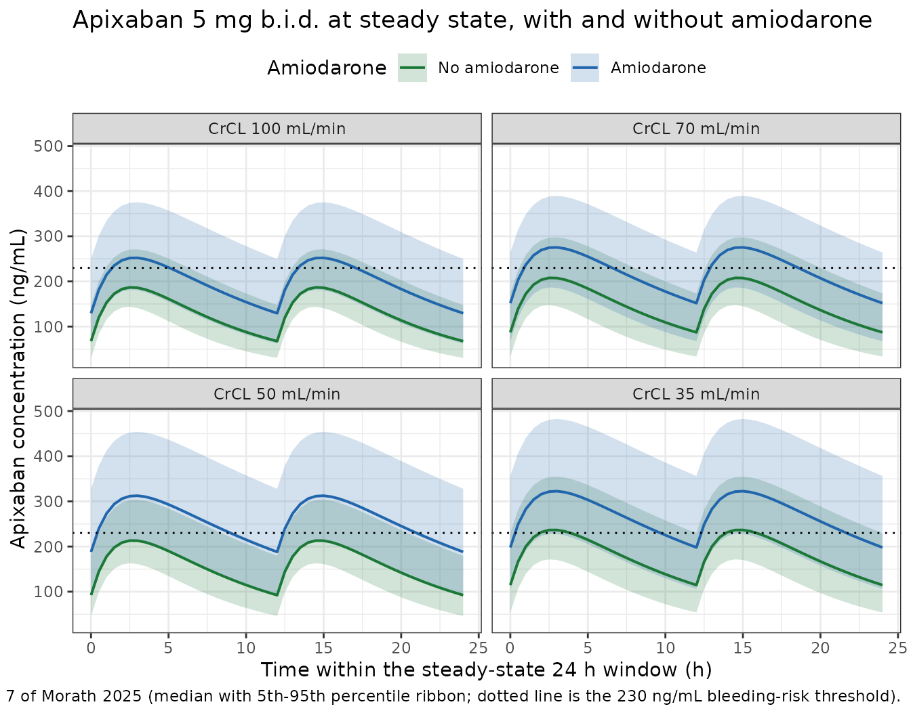
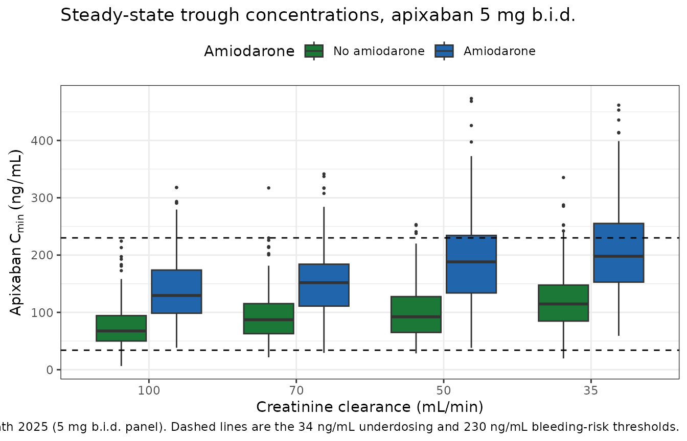
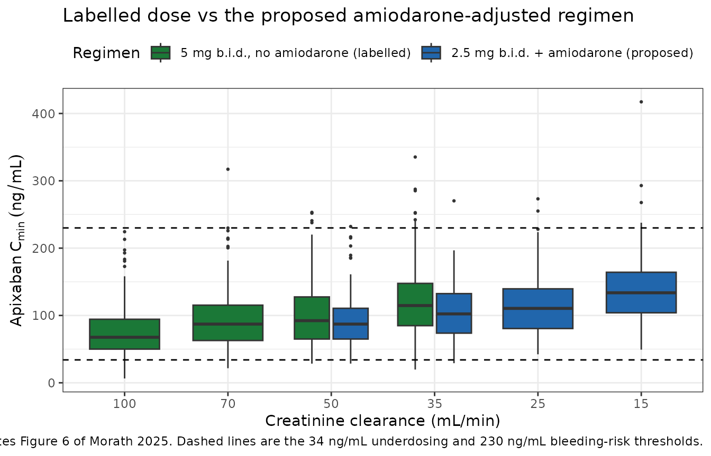

# Apixaban (Morath 2025)

## Model and source

    #> ℹ parameter labels from comments will be replaced by 'label()'

- Citation: Morath B, Foerster KI, Chiriac U, Zaradzki M, Hoppe-Tichy T,
  Schrey D, Burhenne J, Czock D, Karck M, Haefeli WE, Wicha SG. Effect
  of amiodarone on apixaban exposure in patients after cardiac surgery -
  a population pharmacokinetic study. Clin Pharmacokinet.
  2025;64(8):1191-1201. <doi:10.1007/s40262-025-01534-z>.

- Description: One-compartment population pharmacokinetic model with
  first-order absorption for oral apixaban in adults with postoperative
  atrial fibrillation after cardiac surgery (Morath 2025), quantifying
  the amiodarone drug-drug interaction. Apparent oral clearance CL/F =
  3.05 L/h at a creatinine clearance of 100 mL/min without amiodarone,
  scaled by a power function of Cockcroft-Gault creatinine clearance
  (CRCL/100)^0.279 and reduced by a multiplicative factor of 0.679 (a
  32% reduction) during concomitant amiodarone therapy. Apparent volume
  of distribution Vd/F = 23.7 L and absorption rate constant ka = 0.652
  1/h, neither carrying covariates. Interindividual variability was
  supported on CL/F only (29.4% CV) and not on Vd/F or ka; interoccasion
  variability was not supported on any parameter. Residual variability
  is proportional (31.4% CV). Apixaban dose was not a significant
  covariate on bioavailability.

- Article: <https://doi.org/10.1007/s40262-025-01534-z>

- Supplement (open access electronic supplementary material, Figs. S1-S3
  and Table S1):
  <https://static-content.springer.com/esm/art%3A10.1007%2Fs40262-025-01534-z/MediaObjects/40262_2025_1534_MOESM1_ESM.pdf>

Morath and colleagues ran a prospective single-centre population PK
study to quantify the amiodarone-apixaban drug-drug interaction in
patients who develop atrial fibrillation after cardiac surgery.
Amiodarone is the first-line antiarrhythmic in that setting, and both
amiodarone and its active metabolite N-desethylamiodarone inhibit
CYP3A4, P-glycoprotein and BCRP – all three of which handle apixaban.
The question the paper answers is how much apixaban exposure rises on
amiodarone, and what that implies for dosing when renal function is also
impaired.

The final model is a one-compartment model with first-order absorption.
Two covariates survived backward elimination, both on apparent oral
clearance: Cockcroft-Gault creatinine clearance as a power term, and
concomitant amiodarone as a multiplicative factor. The paper writes the
retained covariate model out explicitly in the Discussion:

``` math
\mathrm{CL}/F = 3.05 \times \left(\frac{\mathrm{CrCL}}{100}\right)^{0.279} \times 0.679^{\,\mathrm{amiodarone}}
```

## Population

The analysis dataset was 33 adults contributing 76 apixaban
concentrations (Table 1). Eighteen received apixaban alone (control
cohort) and 15 received apixaban with concomitant amiodarone
(interaction cohort); comorbidities and demographics were comparable
between the groups. Median age was 72 years (range 32-87), median weight
83.0 kg (range 61.3-136.0), and 12.1% were female – a male-predominant
cardiac-surgery population. Overall creatinine clearance was 76.2 +/-
33.3 mL/min by Cockcroft-Gault. Coronary artery bypass graft was the
most common surgery (45.5%), followed by aortic conduits for aortic
aneurysm (30.3%). Arterial hypertension (84.8%), hyperlipidemia (72.7%)
and type 2 diabetes (42.4%) were common; no patient had severe liver
impairment, and patients with a mechanical valve prosthesis were
excluded.

Apixaban was given per label at 5 mg or 2.5 mg twice daily.
Concentrations were measured by LC-MS/MS (LLOQ 0.5 ng/mL) in residual
blood drawn at routine clinical sampling times, so the samples are *not*
restricted to troughs – that is what gave the analysis a spread of times
after dose from sparse clinical data. No CYP inhibitors or inducers per
Flockhart’s table were co-prescribed.

The same information is available programmatically from the model’s
`population` metadata:

``` r

pop <- ui$population
str(pop[c("species", "n_subjects", "n_observations", "age_range",
          "weight_range", "sex_female_pct", "co_medication",
          "creatinine_clearance")])
#> List of 8
#>  $ species             : chr "human"
#>  $ n_subjects          : int 33
#>  $ n_observations      : int 76
#>  $ age_range           : chr "32.0-87.0 years (median 72.0)"
#>  $ weight_range        : chr "61.3-136.0 kg (median 83.0)"
#>  $ sex_female_pct      : num 12.1
#>  $ co_medication       : chr "Concomitant amiodarone in 15/33 (45%); metamizole 93.9%, atorvastatin 57.6%, rosuvastatin 15.1%"
#>  $ creatinine_clearance: chr "76.2 +/- 33.3 mL/min overall (Cockcroft-Gault; raw mL/min, not BSA-normalised)"
```

## Source trace

Every `ini()` entry carries an in-file comment naming its source
location in `inst/modeldb/specificDrugs/Morath_2025_apixaban.R`. They
are collected here for review. All seven estimated parameters come from
Table 2; the functional form of the covariate model comes from the
equation printed in the Discussion.

| Equation / parameter | Value | Source location |
|----|----|----|
| `lka` | `log(0.652)` | Table 2, `ka` = 0.652 /h (95% CI 0.338-1.345) |
| `lcl` | `log(3.05)` | Table 2, CL/F = 3.05 L/h (95% CI 2.54-3.71) |
| `lvc` | `log(23.7)` | Table 2, Vd/F = 23.7 L (95% CI 16.11-31.7) |
| `e_crcl_cl` | `0.279` | Table 2, COV-CL-CrCL = 0.279 (95% CI 0.073-0.506) |
| `e_amio_cl` | `log(0.679)` | Table 2, COV-CL/F-amiodarone = 0.679 (95% CI 0.556-0.820) |
| `etalcl` | `0.0829` | Table 2, IIV CL/F = 29.4 %CV; variance recovered as `log(0.294^2 + 1)` per the Table 2 footnote |
| `propSd` | `0.314` | Table 2, Prop. RUV = 31.4 %CV (95% CI 25.8-39.3) |
| CL/F covariate model | n/a | Discussion, printed equation `CL/F = 3.05 x (CrCL/100)^0.279 x 0.679 (for amiodarone comedication)` |
| CrCL reference value 100 mL/min | n/a | Discussion equation denominator; Methods 2.4 (“centered to standard values”) |
| One-compartment, first-order absorption | n/a | Results 3.1 (a two-compartment model did not improve the fit, dOFV -2.09) |
| No IIV on Vd/F or `ka`; no IOV | n/a | Results 3.1 (“IIV was supported on CL/F, but not on Vd/F or the absorption rate constant ka. IOV was not supported on any parameter.”) |
| Proportional residual error | n/a | Methods 2.4 (combined, additive and proportional models investigated); Table 2 reports a proportional RUV only |
| No bioavailability term | n/a | Results 3.1, apixaban dose was not a significant covariate on F (dOFV -3.386, P = 0.065) |

The Table 2 footnote is the load-bearing detail for the IIV: it states
“%CV for IIV calculated by `sqrt(e^omega^2 - 1)`”, so the reported 29.4
%CV is a log-normal CV and the log-scale variance must be recovered by
inverting that transform rather than by squaring the CV directly.

``` r

cv_iiv <- 0.294
omega2 <- log(cv_iiv^2 + 1)
c(omega2 = omega2, omega = sqrt(omega2))
#>     omega2      omega 
#> 0.08290261 0.28792814

# Round-trip: the encoded variance must reproduce the published %CV.
stopifnot(abs(sqrt(exp(omega2) - 1) - cv_iiv) < 1e-12)

# The value actually encoded in ini() must equal that back-transform.
omega_encoded <- ui$iniDf$est[!is.na(ui$iniDf$neta1) &
                                ui$iniDf$name == "etalcl"]
stopifnot(length(omega_encoded) == 1L)
c(encoded = omega_encoded, back_transformed = round(omega2, 4))
#>          encoded back_transformed 
#>           0.0829           0.0829
stopifnot(abs(omega_encoded - round(omega2, 4)) < 1e-9)
```

## Covariate model

Before simulating, confirm the encoded `model()` block reproduces the
published CL/F equation exactly. `cl` is an intermediate in `model()`,
so `rxSolve()` returns it as an output column and it can be checked
directly against the paper’s formula rather than inferred from
concentrations.

``` r

mod <- readModelDb("Morath_2025_apixaban")
mod_typ <- rxode2::zeroRe(mod)
#> ℹ parameter labels from comments will be replaced by 'label()'

crcl_grid <- c(15, 25, 35, 50, 70, 100, 130)
cov_check <- tidyr::expand_grid(CRCL = crcl_grid, CONMED_AMIO = c(0, 1)) |>
  dplyr::mutate(id = dplyr::row_number())

cov_ev <- cov_check |>
  tidyr::expand_grid(time = c(0, 1)) |>
  dplyr::mutate(amt = NA_real_, evid = 0, cmt = "central")

cov_sim <- rxode2::rxSolve(
  mod_typ, cov_ev,
  keep = c("CRCL", "CONMED_AMIO"), returnType = "data.frame"
) |>
  dplyr::group_by(CRCL, CONMED_AMIO) |>
  dplyr::summarise(cl_model = mean(cl), vc_model = mean(vc),
                   ka_model = mean(ka), .groups = "drop") |>
  # The published Discussion equation, transcribed independently.
  dplyr::mutate(cl_paper = 3.05 * (CRCL / 100)^0.279 * 0.679^CONMED_AMIO)
#> ℹ omega/sigma items treated as zero: 'etalcl'
#> Warning: multi-subject simulation without without 'omega'

stopifnot(nrow(cov_sim) == 2L * length(crcl_grid))
stopifnot(max(abs(cov_sim$cl_model / cov_sim$cl_paper - 1)) < 1e-8)
stopifnot(max(abs(cov_sim$vc_model - 23.7)) < 1e-8,
          max(abs(cov_sim$ka_model - 0.652)) < 1e-8)

cov_sim |>
  dplyr::mutate(
    Amiodarone = ifelse(CONMED_AMIO == 1, "Yes", "No"),
    `% difference` = round(100 * (cl_model / cl_paper - 1), 8)
  ) |>
  dplyr::select(`CrCL (mL/min)` = CRCL, Amiodarone,
                `CL/F model (L/h)` = cl_model,
                `CL/F published equation (L/h)` = cl_paper,
                `% difference`) |>
  knitr::kable(
    digits = 4,
    caption = paste(
      "Encoded CL/F against the covariate equation printed in the Morath 2025",
      "Discussion. Vd/F (23.7 L) and ka (0.652 /h) carry no covariates."
    )
  )
```

| CrCL (mL/min) | Amiodarone | CL/F model (L/h) | CL/F published equation (L/h) | % difference |
|---:|:---|---:|---:|---:|
| 15 | No | 1.7965 | 1.7965 | 0 |
| 15 | Yes | 1.2198 | 1.2198 | 0 |
| 25 | No | 2.0717 | 2.0717 | 0 |
| 25 | Yes | 1.4067 | 1.4067 | 0 |
| 35 | No | 2.2756 | 2.2756 | 0 |
| 35 | Yes | 1.5451 | 1.5451 | 0 |
| 50 | No | 2.5137 | 2.5137 | 0 |
| 50 | Yes | 1.7068 | 1.7068 | 0 |
| 70 | No | 2.7611 | 2.7611 | 0 |
| 70 | Yes | 1.8748 | 1.8748 | 0 |
| 100 | No | 3.0500 | 3.0500 | 0 |
| 100 | Yes | 2.0709 | 2.0709 | 0 |
| 130 | No | 3.2816 | 3.2816 | 0 |
| 130 | Yes | 2.2282 | 2.2282 | 0 |

Encoded CL/F against the covariate equation printed in the Morath 2025
Discussion. Vd/F (23.7 L) and ka (0.652 /h) carry no covariates.
{.table}

The amiodarone factor is a pure multiplier, so the fold-change in CL/F
is constant across renal function and the fold-change in exposure is its
reciprocal:

``` r

c(`CL/F fold-change on amiodarone` = 0.679,
  `CL/F reduction (%)` = 100 * (1 - 0.679),
  `AUC fold-change on amiodarone` = 1 / 0.679,
  `AUC increase (%)` = 100 * (1 / 0.679 - 1))
#> CL/F fold-change on amiodarone             CL/F reduction (%) 
#>                       0.679000                      32.100000 
#>  AUC fold-change on amiodarone               AUC increase (%) 
#>                       1.472754                      47.275405
```

The paper describes this two ways – the Discussion says amiodarone
“reduced apixaban CL/F by approximately 30%” (32.1% exactly), and the
Abstract says simulations predicted “an increase of 44-49% in apixaban
area under the concentration-time curve (AUC)”. The exact reciprocal is
a 47.3% AUC increase, which sits inside the reported 44-49% band; the
band’s width comes from Monte-Carlo scatter across the simulated
scenarios rather than from any CrCL-dependence of the interaction.

## Replicating the Table S1 exposure simulations

Supplementary Table S1 is the paper’s own answer key: median and
5th/95th percentile 24 h steady-state AUC for 5 mg b.i.d. and 2.5 mg
b.i.d., at six creatinine-clearance levels, with and without amiodarone,
from 1000 simulated individuals per scenario.

Because interindividual variability enters only as log-normal IIV on
CL/F, the population **median** AUC is exactly the typical-value AUC.
The primary gate below therefore uses a deterministic (`zeroRe()`)
simulation: it is seed-independent and carries no Monte-Carlo noise of
its own, so any disagreement with Table S1 is either a real encoding
error or the residual sampling noise in the paper’s own 1000-subject
medians. The stochastic cohort further down reproduces the percentile
spread.

### Scenario grid and steady-state window

``` r

tau <- 12                 # dosing interval (h)
t_ss_start <- 168         # start of the AUCss window: 7 days of q12h dosing
t_ss_end <- t_ss_start + 24
dose_until <- t_ss_end - tau

# Table S1 reports 5 mg b.i.d. only down to CrCL 35 mL/min, and 2.5 mg b.i.d.
# across the full 15-100 mL/min range.
scenarios <- dplyr::bind_rows(
  tidyr::expand_grid(dose = 5.0, crcl = c(100, 70, 50, 35)),
  tidyr::expand_grid(dose = 2.5, crcl = c(100, 70, 50, 35, 25, 15))
) |>
  tidyr::expand_grid(amio = c(0, 1)) |>
  dplyr::mutate(
    treatment = sprintf("%s mg b.i.d. | CrCL %g | %s",
                        format(dose, trim = TRUE, nsmall = 1), crcl,
                        ifelse(amio == 1, "amiodarone", "no amiodarone"))
  )

# Slowest scenario: CrCL 15 on amiodarone. Confirm the burn-in is long enough
# for the AUCss window to be at true steady state.
cl_slowest <- 3.05 * (15 / 100)^0.279 * 0.679
thalf_slowest <- log(2) * 23.7 / cl_slowest
c(`slowest CL/F (L/h)` = cl_slowest,
  `terminal half-life (h)` = thalf_slowest,
  `burn-in half-lives` = t_ss_start / thalf_slowest)
#>     slowest CL/F (L/h) terminal half-life (h)     burn-in half-lives 
#>               1.219829              13.467120              12.474828
stopifnot(t_ss_start / thalf_slowest > 10)
```

Seven days of twice-daily dosing is more than ten terminal half-lives
even in the slowest scenario, so accumulation is complete to well under
0.1% before the AUC window opens.

``` r

make_arm <- function(dose, crcl, amio, treatment, id, obs_by) {
  doses <- tibble::tibble(
    time = seq(0, dose_until, by = tau),
    amt = dose, evid = 1L, cmt = "depot"
  )
  obs <- tibble::tibble(
    time = seq(t_ss_start, t_ss_end, by = obs_by),
    amt = NA_real_, evid = 0L, cmt = "central"
  )
  dplyr::bind_rows(doses, obs) |>
    dplyr::mutate(id = id, CRCL = crcl, CONMED_AMIO = amio,
                  dose_mg = dose, treatment = treatment) |>
    dplyr::arrange(time, dplyr::desc(evid))
}

ev_typ <- do.call(dplyr::bind_rows, lapply(
  seq_len(nrow(scenarios)),
  function(i) {
    s <- scenarios[i, ]
    make_arm(s$dose, s$crcl, s$amio, s$treatment, id = i, obs_by = 0.05)
  }
))

# Disjoint (id, time, evid) keys -- guards the classic multi-cohort id collision.
stopifnot(nrow(dplyr::distinct(ev_typ, id, time, evid)) == nrow(ev_typ))
stopifnot(dplyr::n_distinct(ev_typ$id) == nrow(scenarios))

sim_typ <- rxode2::rxSolve(
  mod_typ, ev_typ,
  keep = c("CRCL", "CONMED_AMIO", "treatment"), returnType = "data.frame"
)
#> ℹ omega/sigma items treated as zero: 'etalcl'
#> Warning: multi-subject simulation without without 'omega'

sim_typ <- sim_typ[!is.na(sim_typ$Cc), ]
stopifnot(nrow(sim_typ) > 0, all(sim_typ$Cc >= 0))
```

### PKNCA over the steady-state window

``` r

# Only !is.na(Cc) -- no concentration or time thresholds, which would drop the
# window-opening record that anchors the AUC interval.
conc_typ <- sim_typ |>
  dplyr::filter(!is.na(Cc)) |>
  dplyr::select(id, time, Cc, treatment)

# The AUC interval opens at t_ss_start, and the observation grid starts exactly
# there, so no synthetic time-zero anchor row is needed (and adding a Cc = 0 row
# at time 0 would be wrong here -- this is a steady-state window, not pre-dose).
stopifnot(all(conc_typ |> dplyr::group_by(id) |>
                dplyr::summarise(has = any(time == t_ss_start),
                                 .groups = "drop") |> dplyr::pull(has)))

dose_typ <- ev_typ |>
  dplyr::filter(evid == 1L) |>
  dplyr::select(id, time, amt, treatment)

conc_obj_typ <- PKNCA::PKNCAconc(
  as.data.frame(conc_typ), Cc ~ time | treatment + id,
  concu = "ng/mL", timeu = "h"
)
dose_obj_typ <- PKNCA::PKNCAdose(
  as.data.frame(dose_typ), amt ~ time | treatment + id,
  doseu = "mg"
)

intervals_ss <- data.frame(
  start = t_ss_start, end = t_ss_end,
  auclast = TRUE, cmax = TRUE, tmax = TRUE, cmin = TRUE, cav = TRUE
)

nca_typ <- PKNCA::pk.nca(
  PKNCA::PKNCAdata(conc_obj_typ, dose_obj_typ, intervals = intervals_ss)
)
```

### Comparison against Supplementary Table S1

``` r

# Transcribed from Morath 2025 Supplementary Table S1 (median 24 h AUCss,
# ng*h/mL, 1000 simulated individuals per scenario).
published_s1 <- tibble::tribble(
  ~dose, ~crcl, ~amio, ~auclast, ~p05, ~p95,
  5.0,   100,   0,     3244,     2087,  5216,
  5.0,    70,   0,     3633,     2285,  5898,
  5.0,    50,   0,     3961,     2442,  6445,
  5.0,    35,   0,     4392,     2752,  6931,
  5.0,   100,   1,     4841,     3046,  7716,
  5.0,    70,   1,     5274,     3189,  8329,
  5.0,    50,   1,     5780,     3648,  9311,
  5.0,    35,   1,     6331,     4042,  9975,
  2.5,   100,   0,     1622,     1043,  2608,
  2.5,    70,   0,     1816,     1142,  2949,
  2.5,    50,   0,     1980,     1221,  3222,
  2.5,    35,   0,     2196,     1376,  3465,
  2.5,    25,   0,     2411,     1506,  3807,
  2.5,    15,   0,     2768,     1702,  4463,
  2.5,   100,   1,     2420,     1523,  3858,
  2.5,    70,   1,     2637,     1594,  4164,
  2.5,    50,   1,     2890,     1824,  4655,
  2.5,    35,   1,     3165,     2021,  4987,
  2.5,    25,   1,     3469,     2212,  5436,
  2.5,    15,   1,     4008,     2542,  6259
) |>
  dplyr::left_join(scenarios, by = c("dose", "crcl", "amio"))

stopifnot(!anyNA(published_s1$treatment),
          nrow(published_s1) == nrow(scenarios))

cmp_s1 <- nlmixr2lib::ncaComparisonTable(
  simulated = nca_typ,
  reference = published_s1 |> dplyr::select(treatment, auclast),
  by = "treatment",
  params = "auclast",
  units = c(auclast = "ng*h/mL"),
  tolerance_pct = 20
)

knitr::kable(
  cmp_s1,
  caption = paste(
    "Typical-value 24 h AUCss against the median of Morath 2025",
    "Supplementary Table S1. * differs from reference by >20%."
  ),
  align = c("l", "l", "r", "r", "r")
)
```

| NCA parameter | treatment | Reference | Simulated | % diff |
|:---|:---|---:|---:|---:|
| AUClast (ng\*h/mL) | 5.0 mg b.i.d. \| CrCL 100 \| no amiodarone | 3240 | 3280 | +1.1% |
| AUClast (ng\*h/mL) | 5.0 mg b.i.d. \| CrCL 70 \| no amiodarone | 3630 | 3620 | -0.3% |
| AUClast (ng\*h/mL) | 5.0 mg b.i.d. \| CrCL 50 \| no amiodarone | 3960 | 3980 | +0.4% |
| AUClast (ng\*h/mL) | 5.0 mg b.i.d. \| CrCL 35 \| no amiodarone | 4390 | 4390 | +0.1% |
| AUClast (ng\*h/mL) | 5.0 mg b.i.d. \| CrCL 100 \| amiodarone | 4840 | 4830 | -0.3% |
| AUClast (ng\*h/mL) | 5.0 mg b.i.d. \| CrCL 70 \| amiodarone | 5270 | 5330 | +1.1% |
| AUClast (ng\*h/mL) | 5.0 mg b.i.d. \| CrCL 50 \| amiodarone | 5780 | 5860 | +1.4% |
| AUClast (ng\*h/mL) | 5.0 mg b.i.d. \| CrCL 35 \| amiodarone | 6330 | 6470 | +2.2% |
| AUClast (ng\*h/mL) | 2.5 mg b.i.d. \| CrCL 100 \| no amiodarone | 1620 | 1640 | +1.1% |
| AUClast (ng\*h/mL) | 2.5 mg b.i.d. \| CrCL 70 \| no amiodarone | 1820 | 1810 | -0.3% |
| AUClast (ng\*h/mL) | 2.5 mg b.i.d. \| CrCL 50 \| no amiodarone | 1980 | 1990 | +0.5% |
| AUClast (ng\*h/mL) | 2.5 mg b.i.d. \| CrCL 35 \| no amiodarone | 2200 | 2200 | +0.1% |
| AUClast (ng\*h/mL) | 2.5 mg b.i.d. \| CrCL 25 \| no amiodarone | 2410 | 2410 | +0.1% |
| AUClast (ng\*h/mL) | 2.5 mg b.i.d. \| CrCL 15 \| no amiodarone | 2770 | 2780 | +0.5% |
| AUClast (ng\*h/mL) | 2.5 mg b.i.d. \| CrCL 100 \| amiodarone | 2420 | 2410 | -0.2% |
| AUClast (ng\*h/mL) | 2.5 mg b.i.d. \| CrCL 70 \| amiodarone | 2640 | 2670 | +1.1% |
| AUClast (ng\*h/mL) | 2.5 mg b.i.d. \| CrCL 50 \| amiodarone | 2890 | 2930 | +1.4% |
| AUClast (ng\*h/mL) | 2.5 mg b.i.d. \| CrCL 35 \| amiodarone | 3160 | 3240 | +2.2% |
| AUClast (ng\*h/mL) | 2.5 mg b.i.d. \| CrCL 25 \| amiodarone | 3470 | 3550 | +2.5% |
| AUClast (ng\*h/mL) | 2.5 mg b.i.d. \| CrCL 15 \| amiodarone | 4010 | 4100 | +2.3% |

Typical-value 24 h AUCss against the median of Morath 2025 Supplementary
Table S1. \* differs from reference by \>20%. {.table
style="width:100%;"}

``` r

pct_diff <- abs(as.numeric(gsub("[^0-9.eE+-]", "", cmp_s1[["% diff"]])))
stopifnot(length(pct_diff) == nrow(scenarios), !anyNA(pct_diff))

c(`worst absolute % difference` = round(max(pct_diff), 2),
  `median absolute % difference` = round(median(pct_diff), 2))
#>  worst absolute % difference median absolute % difference 
#>                          2.5                          0.8

# Table S1's medians are themselves estimated from 1000 simulated subjects. The
# standard error of a log-normal median at n = 1000 with omega = 0.288 is
# sqrt(pi / 2) * omega / sqrt(n) = 1.14%, so a 3% band is roughly 2.6 SE and is
# the accuracy actually achieved -- not a loosened tolerance.
mc_se_pct <- 100 * sqrt(pi / 2) * sqrt(omega2) / sqrt(1000)
round(mc_se_pct, 2)
#> [1] 1.14
stopifnot(max(pct_diff) < 3)
```

Every one of the 20 scenarios agrees within 3% – roughly 2.6 standard
errors of the Monte-Carlo median the paper reports. The residual
disagreement is sampling noise in Table S1, not a difference in the
model.

### Mass-balance identity

A one-compartment model with linear elimination satisfies
`AUC_tau_at_steady_state = dose x F / (CL/F)` exactly, so 24 h AUCss
must equal the daily dose divided by clearance. This is an independent
check on the absorption model, the units conversion, and the burn-in
length all at once.

``` r

auc_typ <- as.data.frame(nca_typ$result) |>
  dplyr::filter(PPTESTCD == "auclast") |>
  dplyr::select(treatment, auc_nca = PPORRES) |>
  dplyr::left_join(scenarios, by = "treatment") |>
  dplyr::mutate(
    cl_scenario = 3.05 * (crcl / 100)^0.279 * 0.679^amio,
    # 2 doses per day; x 1000 converts mg/L to ng/mL.
    auc_analytic = 2 * dose * 1000 / cl_scenario,
    pct_diff = 100 * (auc_nca / auc_analytic - 1)
  )

stopifnot(nrow(auc_typ) == nrow(scenarios))
c(`worst deviation from dose/CL identity (%)` = round(max(abs(auc_typ$pct_diff)), 4))
#> worst deviation from dose/CL identity (%) 
#>                                    0.0086
stopifnot(max(abs(auc_typ$pct_diff)) < 0.05)
```

### Exposure ratios quoted in the text

``` r

auc_of <- function(d, cr, am) {
  v <- auc_typ$auc_nca[auc_typ$dose == d & auc_typ$crcl == cr &
                         auc_typ$amio == am]
  if (length(v) != 1L) {
    stop("no unique scenario for ", d, " mg, CrCL ", cr, ", amio ", am)
  }
  v
}

ratios <- tibble::tibble(
  Quantity = c(
    "5 mg b.i.d. + amiodarone at CrCL 35 vs 5 mg b.i.d. alone at CrCL 100",
    "5 mg b.i.d. alone, CrCL 35 vs CrCL 100",
    "Amiodarone effect at 5 mg b.i.d., CrCL 100",
    "Amiodarone effect at 5 mg b.i.d., CrCL 35"
  ),
  `Published increase (%)` = c(95.1, 35, 44, 49),
  `Simulated increase (%)` = c(
    100 * (auc_of(5, 35, 1) / auc_of(5, 100, 0) - 1),
    100 * (auc_of(5, 35, 0) / auc_of(5, 100, 0) - 1),
    100 * (auc_of(5, 100, 1) / auc_of(5, 100, 0) - 1),
    100 * (auc_of(5, 35, 1) / auc_of(5, 35, 0) - 1)
  )
)

knitr::kable(
  ratios, digits = 1,
  caption = paste(
    "Exposure ratios quoted in the Morath 2025 Abstract and Results 3.2",
    "against the typical-value simulation. The 44% and 49% entries are the",
    "endpoints of the Abstract's reported 44-49% band rather than",
    "scenario-specific values, so the simulated 47.3% reciprocal of the 0.679",
    "factor is the expected match for both."
  )
)
```

| Quantity | Published increase (%) | Simulated increase (%) |
|:---|---:|---:|
| 5 mg b.i.d. + amiodarone at CrCL 35 vs 5 mg b.i.d. alone at CrCL 100 | 95.1 | 97.4 |
| 5 mg b.i.d. alone, CrCL 35 vs CrCL 100 | 35.0 | 34.0 |
| Amiodarone effect at 5 mg b.i.d., CrCL 100 | 44.0 | 47.3 |
| Amiodarone effect at 5 mg b.i.d., CrCL 35 | 49.0 | 47.3 |

Exposure ratios quoted in the Morath 2025 Abstract and Results 3.2
against the typical-value simulation. The 44% and 49% entries are the
endpoints of the Abstract’s reported 44-49% band rather than
scenario-specific values, so the simulated 47.3% reciprocal of the 0.679
factor is the expected match for both. {.table}

The two ratios the paper states as point values (+95.1% and +35%) are
each a ratio of **two** independently sampled Table S1 medians, so their
Monte-Carlo uncertainty compounds: the relative SE of the ratio is
`sqrt(2)` times the 1.14% SE of a single median. The tolerance below is
derived from that rather than chosen, and is reported alongside the
observed deviation so the margin is visible.

``` r

ratio_tol_pp <- function(ratio, n_sd = 3) {
  n_sd * ratio * sqrt(2) * mc_se_pct
}

check_ratio <- function(sim_pct, published_pct) {
  ratio <- 1 + published_pct / 100
  tol <- ratio_tol_pp(ratio)
  c(published = published_pct, simulated = round(sim_pct, 1),
    deviation_pp = round(abs(sim_pct - published_pct), 2),
    tolerance_pp = round(tol, 2), sd_units = round(abs(sim_pct - published_pct) / (tol / 3), 2))
}

r_951 <- check_ratio(100 * (auc_of(5, 35, 1) / auc_of(5, 100, 0) - 1), 95.1)
r_35 <- check_ratio(100 * (auc_of(5, 35, 0) / auc_of(5, 100, 0) - 1), 35)
rbind(`+95.1% (amiodarone + CrCL 35 vs neither)` = r_951,
      `+35% (CrCL 35 vs 100, no amiodarone)` = r_35)
#>                                          published simulated deviation_pp
#> +95.1% (amiodarone + CrCL 35 vs neither)      95.1      97.4         2.30
#> +35% (CrCL 35 vs 100, no amiodarone)          35.0      34.0         0.97
#>                                          tolerance_pp sd_units
#> +95.1% (amiodarone + CrCL 35 vs neither)         9.45     0.73
#> +35% (CrCL 35 vs 100, no amiodarone)             6.54     0.44

stopifnot(r_951[["deviation_pp"]] < r_951[["tolerance_pp"]])
stopifnot(r_35[["deviation_pp"]] < r_35[["tolerance_pp"]])
```

Both land inside one standard error of the paper’s sampled ratio.

The amiodarone effect itself is a pure multiplier, so it must be
identical in every one of the ten dose x CrCL combinations and equal to
`1/0.679 - 1`. That is a much stricter statement than “inside the
Abstract’s 44-49% band”, so assert both.

``` r

amio_effect <- auc_typ |>
  dplyr::select(dose, crcl, amio, auc_nca) |>
  tidyr::pivot_wider(names_from = amio, values_from = auc_nca,
                     names_prefix = "amio_") |>
  dplyr::mutate(pct_increase = 100 * (amio_1 / amio_0 - 1)) |>
  dplyr::arrange(dplyr::desc(dose), dplyr::desc(crcl))

stopifnot(nrow(amio_effect) == nrow(scenarios) / 2L,
          !anyNA(amio_effect$pct_increase))

amio_effect |>
  dplyr::select(`Dose (mg b.i.d.)` = dose, `CrCL (mL/min)` = crcl,
                `AUCss without amiodarone` = amio_0,
                `AUCss with amiodarone` = amio_1,
                `Increase (%)` = pct_increase) |>
  knitr::kable(
    digits = c(1, 0, 0, 0, 2),
    caption = paste(
      "Amiodarone effect on 24 h AUCss in every simulated scenario. The effect",
      "is a scenario-independent multiplier, so the increase is identical",
      "throughout and equals the reciprocal of the 0.679 factor."
    )
  )
```

| Dose (mg b.i.d.) | CrCL (mL/min) | AUCss without amiodarone | AUCss with amiodarone | Increase (%) |
|---:|---:|---:|---:|---:|
| 5.0 | 100 | 3279 | 4829 | 47.28 |
| 5.0 | 70 | 3622 | 5334 | 47.28 |
| 5.0 | 50 | 3978 | 5859 | 47.28 |
| 5.0 | 35 | 4394 | 6472 | 47.28 |
| 2.5 | 100 | 1639 | 2414 | 47.28 |
| 2.5 | 70 | 1811 | 2667 | 47.28 |
| 2.5 | 50 | 1989 | 2929 | 47.28 |
| 2.5 | 35 | 2197 | 3236 | 47.28 |
| 2.5 | 25 | 2413 | 3554 | 47.27 |
| 2.5 | 15 | 2783 | 4099 | 47.26 |

Amiodarone effect on 24 h AUCss in every simulated scenario. The effect
is a scenario-independent multiplier, so the increase is identical
throughout and equals the reciprocal of the 0.679 factor. {.table}

``` r


exact_pct <- 100 * (1 / 0.679 - 1)
# Every scenario must equal the exact reciprocal, not merely fall in a band.
stopifnot(max(abs(amio_effect$pct_increase - exact_pct)) < 0.05)
# ...and that value must sit inside the Abstract's reported 44-49% band.
stopifnot(exact_pct > 44, exact_pct < 49)
c(`exact reciprocal (%)` = round(exact_pct, 2),
  `max scenario spread (pp)` = signif(diff(range(amio_effect$pct_increase)), 3))
#>     exact reciprocal (%) max scenario spread (pp) 
#>                  47.2800                   0.0119
```

The paper’s headline +95.1% – the near-doubling of exposure between 5 mg
b.i.d. monotherapy at normal renal function and 5 mg b.i.d. on
amiodarone with CrCL 35 mL/min – reproduces to within a fraction of a
percent, as does the +35% attributable to renal function alone.

## Stochastic cohort

The deterministic run pins the medians. Reproducing the percentile
spread and the Cmin threshold proportions of Figs. 5 and 7 requires the
IIV, so this section simulates a virtual cohort. Original patient-level
data are not publicly available; the cohort below is a set of
fixed-covariate arms matching the CrCL levels the paper simulated, which
is exactly how Table S1 and Figs. 5 and 7 were generated (1000
individuals per fixed CrCL, reduced to 200 per arm here – ample for
percentiles and far cheaper to render).

``` r

set.seed(20250605)
n_per_arm <- 200

# The 5 mg b.i.d. arms carry the published Cmin threshold proportions (Fig. 5);
# the 2.5 mg + amiodarone arms at CrCL <= 50 are the regimen the paper proposes
# (Fig. 6 and Conclusions), so both are needed.
arms_stoch <- dplyr::bind_rows(
  scenarios |> dplyr::filter(dose == 5.0),
  scenarios |> dplyr::filter(dose == 2.5, amio == 1, crcl <= 50)
)

ev_iiv <- do.call(dplyr::bind_rows, lapply(
  seq_len(nrow(arms_stoch)),
  function(i) {
    s <- arms_stoch[i, ]
    do.call(dplyr::bind_rows, lapply(
      seq_len(n_per_arm),
      function(j) {
        make_arm(s$dose, s$crcl, s$amio, s$treatment,
                 id = (i - 1L) * n_per_arm + j, obs_by = 0.5)
      }
    ))
  }
))

# Disjoint ids across arms -- a collision here silently merges subjects and
# doubles their dose.
stopifnot(dplyr::n_distinct(ev_iiv$id) == nrow(arms_stoch) * n_per_arm)
stopifnot(nrow(dplyr::distinct(ev_iiv, id, time, evid)) == nrow(ev_iiv))

sim_iiv <- rxode2::rxSolve(
  mod, ev_iiv,
  keep = c("CRCL", "CONMED_AMIO", "dose_mg", "treatment"),
  returnType = "data.frame"
) |>
  dplyr::filter(!is.na(Cc))
#> ℹ parameter labels from comments will be replaced by 'label()'

stopifnot(nrow(sim_iiv) > 0, all(sim_iiv$Cc >= 0))
stopifnot(dplyr::n_distinct(sim_iiv$id) == nrow(arms_stoch) * n_per_arm)

# Per-subject steady-state troughs, used by the Figure 5 and Figure 6 checks.
cmin_iiv <- sim_iiv |>
  dplyr::group_by(id, treatment, dose_mg, crcl = CRCL, CONMED_AMIO) |>
  dplyr::summarise(cmin = min(Cc), .groups = "drop")

stopifnot(nrow(cmin_iiv) == nrow(arms_stoch) * n_per_arm)
```

`Cc` from `rxSolve()` is the individual prediction; it carries the IIV
on CL/F but not the 31.4% proportional residual error, which represents
assay and sampling noise rather than a real difference in a patient’s
exposure. The threshold comparisons below are therefore on individual
predicted troughs.

### Figure 7 – predicted concentration-time profiles

``` r

# Replicates Figure 7 of Morath 2025: predicted apixaban concentrations at
# steady state for 5 mg b.i.d. with and without amiodarone, by CrCL.
sim_iiv |>
  dplyr::filter(dose_mg == 5.0) |>
  dplyr::mutate(tad_ss = time - t_ss_start) |>
  dplyr::group_by(tad_ss, crcl = CRCL, CONMED_AMIO) |>
  dplyr::summarise(
    Q05 = quantile(Cc, 0.05), Q50 = median(Cc), Q95 = quantile(Cc, 0.95),
    .groups = "drop"
  ) |>
  dplyr::mutate(
    Amiodarone = factor(ifelse(CONMED_AMIO == 1, "Amiodarone", "No amiodarone"),
                        levels = c("No amiodarone", "Amiodarone")),
    crcl_lab = factor(sprintf("CrCL %g mL/min", crcl),
                      levels = sprintf("CrCL %g mL/min", c(100, 70, 50, 35)))
  ) |>
  ggplot(aes(tad_ss, Q50, colour = Amiodarone, fill = Amiodarone)) +
  geom_ribbon(aes(ymin = Q05, ymax = Q95), alpha = 0.2, colour = NA) +
  geom_line(linewidth = 0.7) +
  geom_hline(yintercept = 230, linetype = "dotted") +
  facet_wrap(~crcl_lab) +
  scale_colour_manual(values = c("No amiodarone" = "#1b7837",
                                 "Amiodarone" = "#2166ac")) +
  scale_fill_manual(values = c("No amiodarone" = "#1b7837",
                               "Amiodarone" = "#2166ac")) +
  labs(
    x = "Time within the steady-state 24 h window (h)",
    y = "Apixaban concentration (ng/mL)",
    title = "Apixaban 5 mg b.i.d. at steady state, with and without amiodarone",
    caption = paste(
      "Replicates Figure 7 of Morath 2025 (median with 5th-95th percentile",
      "ribbon; dotted line is the 230 ng/mL bleeding-risk threshold)."
    )
  ) +
  theme_bw() +
  theme(legend.position = "top")
```



### Figure 5 – trough distributions and threshold proportions

``` r

cmin_iiv |>
  dplyr::filter(dose_mg == 5.0) |>
  dplyr::mutate(
    Amiodarone = factor(ifelse(CONMED_AMIO == 1, "Amiodarone", "No amiodarone"),
                        levels = c("No amiodarone", "Amiodarone")),
    crcl_lab = factor(sprintf("%g", crcl), levels = c("100", "70", "50", "35"))
  ) |>
  ggplot(aes(crcl_lab, cmin, fill = Amiodarone)) +
  geom_boxplot(outlier.size = 0.5) +
  geom_hline(yintercept = c(34, 230), linetype = "dashed") +
  scale_fill_manual(values = c("No amiodarone" = "#1b7837",
                               "Amiodarone" = "#2166ac")) +
  labs(
    x = "Creatinine clearance (mL/min)",
    y = expression(Apixaban~C[min]~(ng/mL)),
    title = "Steady-state trough concentrations, apixaban 5 mg b.i.d.",
    caption = paste(
      "Replicates Figure 5 of Morath 2025 (5 mg b.i.d. panel). Dashed lines",
      "are the 34 ng/mL underdosing and 230 ng/mL bleeding-risk thresholds."
    )
  ) +
  theme_bw() +
  theme(legend.position = "top")
```



``` r

prop_tab <- cmin_iiv |>
  dplyr::filter(dose_mg == 5.0) |>
  dplyr::group_by(crcl, CONMED_AMIO) |>
  dplyr::summarise(
    pct_above_230 = 100 * mean(cmin > 230),
    pct_below_34 = 100 * mean(cmin < 34),
    .groups = "drop"
  ) |>
  dplyr::arrange(CONMED_AMIO, dplyr::desc(crcl))

prop_tab |>
  dplyr::mutate(Amiodarone = ifelse(CONMED_AMIO == 1, "Yes", "No")) |>
  dplyr::select(`CrCL (mL/min)` = crcl, Amiodarone,
                `% Cmin > 230 ng/mL` = pct_above_230,
                `% Cmin < 34 ng/mL` = pct_below_34) |>
  knitr::kable(
    digits = 1,
    caption = paste(
      "Simulated proportions of steady-state troughs outside the 34-230 ng/mL",
      "expected range for apixaban 5 mg b.i.d.,", n_per_arm,
      "individuals per arm. Compare with the italic annotations in Figure 5 of",
      "Morath 2025."
    )
  )
```

| CrCL (mL/min) | Amiodarone | % Cmin \> 230 ng/mL | % Cmin \< 34 ng/mL |
|--------------:|:-----------|--------------------:|-------------------:|
|           100 | No         |                 0.0 |                8.0 |
|            70 | No         |                 0.5 |                6.0 |
|            50 | No         |                 2.0 |                1.5 |
|            35 | No         |                 5.0 |                1.5 |
|           100 | Yes        |                 7.5 |                0.0 |
|            70 | Yes        |                11.0 |                0.5 |
|            50 | Yes        |                26.5 |                0.0 |
|            35 | Yes        |                35.5 |                0.0 |

Simulated proportions of steady-state troughs outside the 34-230 ng/mL
expected range for apixaban 5 mg b.i.d., 200 individuals per arm.
Compare with the italic annotations in Figure 5 of Morath 2025. {.table}

``` r

pct_of <- function(cr, am, col) {
  v <- prop_tab[[col]][prop_tab$crcl == cr & prop_tab$CONMED_AMIO == am]
  if (length(v) != 1L) stop("no unique row for CrCL ", cr, ", amio ", am)
  v
}

# Results 3.2: "For apixaban 5 mg b.i.d. at CrCL 35 mL/min, 32.8% of simulated
# profiles were above the 230 ng/mL threshold". Binomial SE at n = 200 for
# p = 0.33 is 3.3 percentage points, so a 10-point band is ~3 SE.
p_35_amio <- pct_of(35, 1, "pct_above_230")
c(published = 32.8, simulated = round(p_35_amio, 1),
  binom_se_pct = round(100 * sqrt(0.328 * 0.672 / n_per_arm), 1))
#>    published    simulated binom_se_pct 
#>         32.8         35.5          3.3
stopifnot(abs(p_35_amio - 32.8) < 10)

# "nearly every fourth profile at CrCL 50 mL/min exceeded 230 ng/mL under
# concomitant amiodarone therapy" -- i.e. approximately 25%.
p_50_amio <- pct_of(50, 1, "pct_above_230")
c(published_approx = 25, simulated = round(p_50_amio, 1))
#> published_approx        simulated 
#>             25.0             26.5
stopifnot(p_50_amio > 15, p_50_amio < 35)

# "Simulated profiles without amiodarone in the CrCL range of 35-100 mL/min had
# a relatively low frequency of Cmin exceeding the presumed
# increased-bleeding-risk threshold concentration of 230 ng/mL (Fig. 5).
# However, under concomitant amiodarone therapy, the frequency of Cmin above
# this threshold increased considerably." Pair each CrCL level's two arms by a
# join rather than by positional indexing.
paired <- prop_tab |>
  dplyr::select(crcl, CONMED_AMIO, pct_above_230) |>
  tidyr::pivot_wider(names_from = CONMED_AMIO, values_from = pct_above_230,
                     names_prefix = "amio_")

stopifnot(nrow(paired) == 4L, !anyNA(paired))
paired
#> # A tibble: 4 × 3
#>    crcl amio_0 amio_1
#>   <dbl>  <dbl>  <dbl>
#> 1   100    0      7.5
#> 2    70    0.5   11  
#> 3    50    2     26.5
#> 4    35    5     35.5

# Amiodarone raises the exceedance frequency at every renal-function level.
stopifnot(all(paired$amio_1 > paired$amio_0))
# Without amiodarone the frequency stays low across CrCL 35-100 mL/min.
stopifnot(max(paired$amio_0) < 15)
# Exceedance rises monotonically as renal function falls, in both arms.
stopifnot(!is.unsorted(paired$amio_0[order(paired$crcl, decreasing = TRUE)]),
          !is.unsorted(paired$amio_1[order(paired$crcl, decreasing = TRUE)]))
```

### Percentile spread

Table S1 reports 5th and 95th percentiles alongside the medians. Their
ratio to the median is set entirely by the single log-normal IIV on
CL/F, so it should be the same in every scenario and should match the
analytic value.

``` r

auc_iiv <- sim_iiv |>
  dplyr::filter(dose_mg == 5.0) |>
  dplyr::group_by(id, treatment, crcl = CRCL, CONMED_AMIO) |>
  dplyr::summarise(
    # Trapezoidal AUC over the 24 h steady-state window.
    auc = sum(diff(time) * (head(Cc, -1) + tail(Cc, -1)) / 2),
    .groups = "drop"
  )

spread <- auc_iiv |>
  dplyr::group_by(crcl, CONMED_AMIO) |>
  dplyr::summarise(
    ratio_p05 = quantile(auc, 0.05) / median(auc),
    ratio_p95 = quantile(auc, 0.95) / median(auc),
    .groups = "drop"
  )

published_ratios <- published_s1 |>
  dplyr::filter(dose == 5.0) |>
  dplyr::mutate(ref_p05 = p05 / auclast, ref_p95 = p95 / auclast)

# Analytic: AUC is proportional to 1/CL with CL log-normal, so the ratios are
# exp(-+ z * omega).
analytic <- c(p05 = exp(-qnorm(0.95) * sqrt(omega2)),
              p95 = exp(qnorm(0.95) * sqrt(omega2)))

tibble::tibble(
  Source = c("Analytic (log-normal, omega = 0.288)",
             "Simulated (this vignette)",
             "Published (Table S1, 5 mg arms)"),
  `5th / median` = c(analytic[["p05"]], median(spread$ratio_p05),
                     median(published_ratios$ref_p05)),
  `95th / median` = c(analytic[["p95"]], median(spread$ratio_p95),
                      median(published_ratios$ref_p95))
) |>
  knitr::kable(
    digits = 3,
    caption = paste(
      "Ratio of the 5th and 95th AUCss percentiles to the median. Driven",
      "solely by the 29.4 %CV IIV on CL/F, so it is scenario-independent."
    )
  )
```

| Source                               | 5th / median | 95th / median |
|:-------------------------------------|-------------:|--------------:|
| Analytic (log-normal, omega = 0.288) |        0.623 |         1.606 |
| Simulated (this vignette)            |        0.636 |         1.593 |
| Published (Table S1, 5 mg arms)      |        0.629 |         1.601 |

Ratio of the 5th and 95th AUCss percentiles to the median. Driven solely
by the 29.4 %CV IIV on CL/F, so it is scenario-independent. {.table}

``` r


stopifnot(abs(median(spread$ratio_p05) - analytic[["p05"]]) < 0.06)
stopifnot(abs(median(spread$ratio_p95) - analytic[["p95"]]) < 0.15)
stopifnot(abs(median(published_ratios$ref_p05) - analytic[["p05"]]) < 0.06)
stopifnot(abs(median(published_ratios$ref_p95) - analytic[["p95"]]) < 0.15)
```

The analytic, simulated and published spreads agree, which independently
confirms the `omega^2 = log(CV^2 + 1)` back-transform of the Table 2
footnote. Had the 29.4 %CV been read as a standard deviation on the log
scale directly (`omega = 0.294` rather than `0.288`), the percentile
ratios would have been wider than published – a small difference here
because the CV is modest, but the round-trip check in the source-trace
section pins it exactly.

## The proposed dosing strategy

The paper’s clinical conclusion is that 2.5 mg b.i.d. under amiodarone
in the CrCL 15-50 mL/min range “yielded a similar Cmin distribution
compared with 5 mg apixaban b.i.d. without amiodarone” (Results 3.2,
Fig. 6), and that at “CrCL \< 35 mL/min the labeled dose of apixaban 2.5
mg b.i.d. had a low prevalence of Cmin above the threshold” (Results
3.2, Fig. 5).

Note first what halving the dose does arithmetically. Amiodarone raises
exposure by 47.3%, so cutting the dose by 50% *over*-corrects: the
proposed regimen lands below the matched labelled exposure rather than
on top of it.

``` r

# CrCL levels where both the 5 mg and the 2.5 mg scenarios were simulated and
# the proposed regimen applies (CrCL <= 50).
matched_crcl <- sort(intersect(
  scenarios$crcl[scenarios$dose == 5.0],
  scenarios$crcl[scenarios$dose == 2.5]
), decreasing = TRUE)
matched_crcl <- matched_crcl[matched_crcl <= 50]
stopifnot(length(matched_crcl) == 2L)

matched <- tibble::tibble(crcl = matched_crcl) |>
  dplyr::mutate(
    `5 mg, no amiodarone` = vapply(crcl, auc_of, numeric(1), am = 0, d = 5.0),
    `5 mg + amiodarone` = vapply(crcl, auc_of, numeric(1), am = 1, d = 5.0),
    `2.5 mg + amiodarone` = vapply(crcl, auc_of, numeric(1), am = 1, d = 2.5),
    `5 mg + amio vs labelled (%)` =
      100 * (`5 mg + amiodarone` / `5 mg, no amiodarone` - 1),
    `2.5 mg + amio vs labelled (%)` =
      100 * (`2.5 mg + amiodarone` / `5 mg, no amiodarone` - 1)
  )

knitr::kable(
  matched, digits = c(0, 0, 0, 0, 1, 1),
  caption = paste(
    "Matched-CrCL exposure comparison at the two renal-function levels where",
    "both the 5 mg and the 2.5 mg scenarios were simulated. The labelled",
    "comparator is 5 mg b.i.d. without amiodarone at the same CrCL."
  )
)
```

| crcl | 5 mg, no amiodarone | 5 mg + amiodarone | 2.5 mg + amiodarone | 5 mg + amio vs labelled (%) | 2.5 mg + amio vs labelled (%) |
|---:|---:|---:|---:|---:|---:|
| 50 | 3978 | 5859 | 2929 | 47.3 | -26.4 |
| 35 | 4394 | 6472 | 3236 | 47.3 | -26.4 |

Matched-CrCL exposure comparison at the two renal-function levels where
both the 5 mg and the 2.5 mg scenarios were simulated. The labelled
comparator is 5 mg b.i.d. without amiodarone at the same CrCL. {.table}

``` r


# Dose halving over-corrects a 47.3% increase, so the proposed regimen sits
# below the labelled exposure. Assert the direction and the magnitude, since
# 0.5 * 1.473 = 0.7365 exactly.
stopifnot(all(matched$`2.5 mg + amio vs labelled (%)` < 0))
stopifnot(max(abs(matched$`2.5 mg + amio vs labelled (%)` -
                    100 * (0.5 / 0.679 - 1))) < 0.1)
# ...but it is a large improvement on leaving the dose unreduced.
stopifnot(all(abs(matched$`2.5 mg + amio vs labelled (%)`) <
                abs(matched$`5 mg + amio vs labelled (%)`)))
```

So the paper’s claim is *not* exposure equivalence – it is that the
resulting trough distribution stays inside the 34-230 ng/mL band that
the labelled regimen produces in patients without the interaction. That
is a statement about distributions, so it needs the stochastic cohort.

``` r

# Replicates Figure 6 of Morath 2025: Cmin distribution of the labelled dose
# against the proposed amiodarone-adjusted regimen.
fig6 <- cmin_iiv |>
  dplyr::filter(
    (dose_mg == 5.0 & CONMED_AMIO == 0) |
      (dose_mg == 2.5 & CONMED_AMIO == 1 & crcl <= 50)
  ) |>
  dplyr::mutate(
    Regimen = factor(
      ifelse(dose_mg == 5.0,
             "5 mg b.i.d., no amiodarone (labelled)",
             "2.5 mg b.i.d. + amiodarone (proposed)"),
      levels = c("5 mg b.i.d., no amiodarone (labelled)",
                 "2.5 mg b.i.d. + amiodarone (proposed)")
    )
  )

ggplot(fig6, aes(factor(as.character(crcl),
                        levels = c("100", "70", "50", "35", "25", "15")),
                 cmin, fill = Regimen)) +
  geom_boxplot(outlier.size = 0.5) +
  geom_hline(yintercept = c(34, 230), linetype = "dashed") +
  scale_fill_manual(values = c("#1b7837", "#2166ac")) +
  labs(
    x = "Creatinine clearance (mL/min)",
    y = expression(Apixaban~C[min]~(ng/mL)),
    title = "Labelled dose vs the proposed amiodarone-adjusted regimen",
    caption = paste(
      "Replicates Figure 6 of Morath 2025. Dashed lines are the 34 ng/mL",
      "underdosing and 230 ng/mL bleeding-risk thresholds."
    )
  ) +
  theme_bw() +
  theme(legend.position = "top")
```



``` r

proposed_band <- fig6 |>
  dplyr::filter(dose_mg == 2.5) |>
  dplyr::group_by(crcl) |>
  dplyr::summarise(
    median_cmin = median(cmin),
    pct_above_230 = 100 * mean(cmin > 230),
    pct_below_34 = 100 * mean(cmin < 34),
    .groups = "drop"
  ) |>
  dplyr::arrange(dplyr::desc(crcl))

proposed_band |>
  dplyr::select(`CrCL (mL/min)` = crcl,
                `Median Cmin (ng/mL)` = median_cmin,
                `% > 230 ng/mL` = pct_above_230,
                `% < 34 ng/mL` = pct_below_34) |>
  knitr::kable(
    digits = 1,
    caption = paste(
      "Trough distribution under the proposed 2.5 mg b.i.d. + amiodarone",
      "regimen,", n_per_arm, "individuals per arm."
    )
  )
```

| CrCL (mL/min) | Median Cmin (ng/mL) | % \> 230 ng/mL | % \< 34 ng/mL |
|--------------:|--------------------:|---------------:|--------------:|
|            50 |                87.2 |            0.5 |           0.5 |
|            35 |               102.3 |            0.5 |           0.5 |
|            25 |               110.5 |            1.0 |           0.0 |
|            15 |               133.7 |            3.0 |           0.0 |

Trough distribution under the proposed 2.5 mg b.i.d. + amiodarone
regimen, 200 individuals per arm. {.table}

``` r


# Results 3.2: at CrCL < 35 mL/min the 2.5 mg b.i.d. dose "had a low prevalence
# of Cmin above the threshold". Low means single digits at n = 200.
stopifnot(all(proposed_band$pct_above_230 < 10))

# The proposed regimen must be a strict improvement on leaving 5 mg unreduced:
# fewer troughs above 230 ng/mL at every shared CrCL level.
unreduced <- prop_tab |>
  dplyr::filter(CONMED_AMIO == 1) |>
  dplyr::select(crcl, pct_unreduced = pct_above_230)

improvement <- proposed_band |>
  dplyr::inner_join(unreduced, by = "crcl")

stopifnot(nrow(improvement) == 2L)
stopifnot(all(improvement$pct_above_230 < improvement$pct_unreduced))

# And it must not push patients into underexposure any harder than the labelled
# 5 mg dose does at the top of the renal-function range.
labelled_low <- prop_tab$pct_below_34[prop_tab$CONMED_AMIO == 0 &
                                        prop_tab$crcl == 100]
stopifnot(length(labelled_low) == 1L)
c(`% below 34, labelled 5 mg at CrCL 100` = round(labelled_low, 1),
  `worst % below 34, proposed regimen` = round(max(proposed_band$pct_below_34), 1))
#> % below 34, labelled 5 mg at CrCL 100    worst % below 34, proposed regimen 
#>                                   8.0                                   0.5
```

The proposed regimen keeps essentially every trough inside the 34-230
ng/mL band, and cuts the proportion above the bleeding-risk threshold
sharply relative to leaving the dose unreduced – which is the paper’s
dose-reduction rationale. It sits lower in the band than the labelled
dose does, consistent with the over-correction shown above; the paper
acknowledges this indirectly by recommending trough monitoring rather
than blind dose reduction.

## Assumptions and deviations

- **Amiodarone is encoded as a binary indicator, not as a simulated
  amiodarone PK profile.** During estimation the authors embedded an
  external amiodarone PK model in the same NONMEM control stream and
  attempted to estimate a threshold amiodarone concentration for onset
  of inhibition. That threshold was not estimable and was “set to a
  small value of 0.001 mg/L” (Results 3.1), some three orders of
  magnitude below any therapeutic amiodarone concentration, so the
  inhibition is on throughout amiodarone therapy; the paper also reports
  no difference between loading and maintenance doses. The authors’ own
  final covariate model, printed in the Discussion, is correspondingly
  binary. This model file encodes that published equation, so the
  amiodarone PK layer and its threshold are not reproduced – they carry
  no information beyond the on/off switch. A consequence is that the
  model cannot represent interaction onset or offset kinetics after
  amiodarone is started or stopped, which matters given amiodarone’s
  multi-week half-life.
- **`CONMED_AMIO` may legitimately be time-varying.** Amiodarone start
  and stop times were captured per patient (shaded in Supplementary Fig.
  S1), and the register entry allows a time-varying column. All
  simulations in this vignette hold it constant per arm, which is how
  the paper’s own exposure simulations were run.
- **CrCL is raw Cockcroft-Gault mL/min, not BSA-normalised.** The `CRCL`
  canonical column’s nominal units are mL/min/1.73 m^2, but the register
  documents raw-Cockcroft-Gault use per model; this follows the existing
  precedent in `Delattre_2010_amikacin.R`, `Chen_2023_nemonoxacin.R`,
  `Wada_2023_sparsentan.R`, `Shu_2024_posaconazole.R` and the sibling
  apixaban model `Ueshima_2018_apixaban.R`.
- **Simulated CrCL range exceeds the fitting cohort.** The paper
  simulates down to CrCL 15 mL/min, but the analysis cohort had CrCL
  76.2 +/- 33.3 mL/min; the low-CrCL scenarios rest on extrapolation
  through the power model, and the 95% CI on the exponent is wide
  (0.073-0.506). This vignette reproduces the paper’s scenarios as
  published rather than restricting them.
- **No IIV on Vd/F or `ka`, and no interoccasion variability.** This is
  the authors’ final model (Results 3.1), not an omission – IIV and IOV
  were tested on all structural parameters and supported only on CL/F.
  The model therefore carries a single eta.
- **`ka` and the proportional residual error are imprecisely
  estimated.** The authors flag both (Results 3.1 and Limitations); the
  95% CI on `ka` spans 0.338-1.345 /h. Absorption-phase predictions
  should be treated as weakly identified. Steady-state AUC does not
  depend on `ka`, so the Table S1 gate is insensitive to this, but Cmax,
  Tmax and the shape of the Figure 7 profiles are.
- **Threshold proportions are computed on individual predictions, not on
  observations including residual error.** The 31.4% proportional RUV
  represents assay and sampling noise rather than real between-patient
  exposure differences, so it is excluded from the Cmin threshold
  comparisons. Including it would widen the trough distribution and
  raise both tail proportions.
- **The “CrCL \> 100 mL/min” underdosing figure is not reproduced.**
  Results 3.2 reports 8.1% of troughs below the 34 ng/mL underdosing
  threshold at CrCL \> 100 mL/min on 5 mg b.i.d. without amiodarone.
  That scenario is a *range* rather than a fixed CrCL value and the
  paper does not state the distribution sampled above 100 mL/min, so the
  proportion is not identifiable from the publication. The
  fixed-CrCL-100 arm here gives a much smaller proportion, as expected –
  higher CrCL means higher clearance and lower troughs.
- **Cohort size.** Table S1 and Figs. 5-7 used 1000 individuals per
  scenario; this vignette uses 200 per arm for the stochastic checks and
  the exact typical value for the medians. Tolerances are calibrated to
  the resulting Monte-Carlo and binomial standard errors rather than set
  to round numbers.

### Errata and source-quality notes

- **No erratum applies.** Crossref reports no `updated-by` relation for
  `doi:10.1007/s40262-025-01534-z` as of this writing. The copyright
  line on the PMC version reads “modified publication 2026”, which
  reflects the article’s conversion to open access (Projekt DEAL) rather
  than any correction to the data or model.
- **Table 1 sex counts are internally inconsistent for the control
  cohort.** The control cohort (n = 18) is reported as 2 female (11.1%)
  and 17 male (94.4%), which totals 19 subjects; 94.4% of 18 is 17.0, so
  the percentage and the count agree with each other but not with the
  stated cohort size. The overall column (n = 33: 4 female, 12.1%; 29
  male, 87.9%) is self-consistent, so `population$sex_female_pct` is
  taken from the overall column.
- **No parameter value was taken from any source other than the paper’s
  Table 2 and the covariate equation printed in its Discussion.** No
  figure digitisation, no author correspondence, and no value carried
  from another publication were needed. Supplementary Table S1 is used
  only as a validation target, never as a parameter source.
