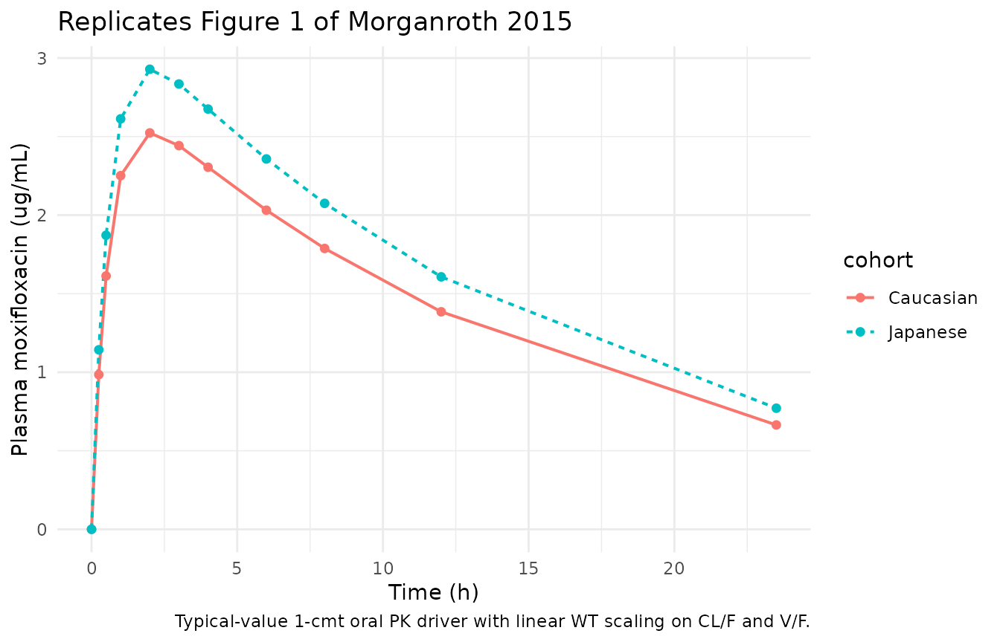
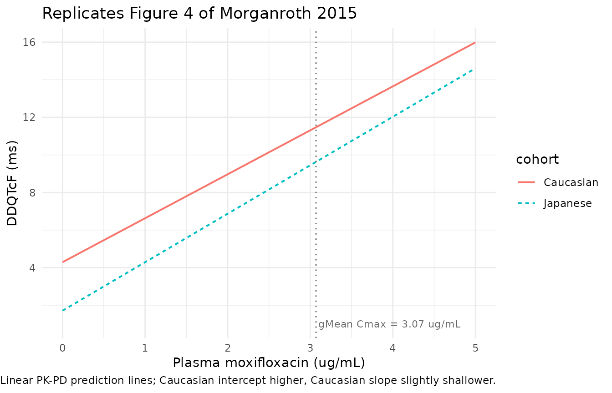

# Moxifloxacin QTc (Morganroth 2015)

## Model and source

- Citation: Morganroth J, Wang Y, Thorn M, Kumagai Y, Harris S,
  Stockbridge N, Kleiman R, Shah R. (2015). Moxifloxacin-induced QTc
  interval prolongations in healthy male Japanese and Caucasian
  volunteers: a direct comparison in a thorough QT study. British
  Journal of Clinical Pharmacology 80(3):446-459.
  <doi:10.1111/bcp.12684>. Accepted Article Published Online 22 May
  2015.
- Description: Population pharmacodynamic linear concentration-effect
  model for moxifloxacin-induced placebo- and baseline-corrected QTcF
  interval prolongation (DDQTcF) in 40 healthy adult male Japanese and
  40 healthy adult male Caucasian volunteers following a single 400 mg
  oral dose in a thorough QT study (Morganroth 2015). The linear
  mixed-effects PD model of Table 4 has form DDQTcF = (alpha + rho \*
  RACE_WHITE) + (beta + gamma \* RACE_WHITE) \* Cc, with alpha = 1.71
  ms, beta = 2.58 ms per ug/mL (Japanese reference), rho = 2.58 ms
  (additive intercept shift in Caucasian; USA site), gamma = -0.24 ms
  per ug/mL (concentration-by-country interaction; Caucasian slope =
  2.34 ms per ug/mL). The source publication does not fit a popPK model;
  the PK driver in this file is a typical-value 1-compartment oral
  approximation with CL/F = 8.47 L/h, V/F = 132.6 L, and ka = 1.7 /h
  derived from the pooled NCA summary statistics in Morganroth 2015
  Table 1 (see vignette Errata). Per operator sidecar-001 (option C) the
  paper’s BVN(0, Sigma) subject random effects on the PD intercept and
  slope are OMITTED because Sigma is not numerically reported in the
  paper, and a small placeholder additive residual SD of 1 ms is used to
  satisfy rxode2’s residual-error requirement; downstream users who need
  VPC-style simulation must add their own IIV.
- Article: <https://doi.org/10.1111/bcp.12684>

Morganroth 2015 is a two-period, randomized, ICH-E14-compliant thorough
QT (TQT) study that compared moxifloxacin-induced placebo- and
baseline-corrected QTcF interval prolongation (DDQTcF) between 40
healthy adult male Japanese volunteers (Kitasato University East
Hospital) and 40 healthy adult male Caucasian volunteers (SeaView
Research, Miami) after a single 400 mg oral dose. The published PD model
is a linear mixed-effects regression of DDQTcF on plasma moxifloxacin
concentration with a country effect on both the intercept and the
concentration slope (Table 4). The publication does **not** develop a
population PK model; moxifloxacin PK is reported only as Table 1 NCA
summary statistics. This file packages the published linear PD model
together with a typical-value 1-compartment oral PK driver derived from
those NCA summary statistics, exclusively as a simulation aid – see the
Assumptions and deviations section for the limitations and the operator
sidecar decision on the missing random-effects variance components.

## Population

The cohort comprised 80 healthy adult male volunteers: 40 Japanese
enrolled at the Kitasato University East Hospital in Sagamihara, Japan
(mean age 33.8 +/- 7.9 y; mean body weight 65.9 +/- 8.9 kg) and 40
Caucasian enrolled at SeaView Research in Miami, Florida (mean age 30.9
+/- 7.2 y; mean body weight 76.6 +/- 8.3 kg). All subjects met the
ICH-E14 thorough-QT-study inclusion criteria: BMI 18-28 kg/m^2, resting
supine heart rate 50-100 beats/min, no baseline ECG abnormality, and no
family history of QTc prolongation or unexplainable sudden death at less
than 50 y of age (Morganroth 2015 Methods “Study populations”). Each
subject received a single 400 mg oral moxifloxacin tablet in the fasted
state, matched with a site-specific placebo tablet in the opposing
crossover period, separated by a minimum 3-day washout. Plasma
moxifloxacin was quantified by validated LC-MS/MS with lower limit of
quantification 0.001 ug/mL. ECGs were recorded at 0, 0.25, 0.5, 1, 2, 3,
4, 6, 8, 12, and 23.5 h post-dose in triplicate on baseline (day 0) and
treatment (day 1) days of each period.

The same information is available programmatically via the model’s
`population` metadata
(`readModelDb("Morganroth_2015_moxifloxacin")$population`).

## Source trace

Each entry below is also recorded as an in-file comment next to the
corresponding line in
`inst/modeldb/specificDrugs/Morganroth_2015_moxifloxacin.R`; the table
collects them for review.

| Equation / parameter | Value | Source location |
|----|----|----|
| `lka` – typical ka | `fixed(log(1.7))` | Chosen to reproduce Morganroth 2015 Table 1 median tmax = 2 h given the pooled 1-cmt kel; NOT a popPK fit |
| `lcl` – typical CL/F | `fixed(log(8.47 * 70 / 71))` | Pooled Dose / AUC(0, inf) from Morganroth 2015 Table 1: 400 / mean(52.1, 42.4) = 8.47 L/h at pooled ref WT 71 kg; rescaled to WT 70 kg |
| `lvc` – typical V/F | `fixed(log(132.6 * 70 / 71))` | Pooled V/F = CL / kel = 8.47 / (ln 2 / mean(11.7, 10.0)) = 132.6 L at pooled ref WT 71 kg; rescaled to WT 70 kg |
| `int_ddqtcf` – Japanese intercept | `1.71` ms | Morganroth 2015 Table 4 “Intercept” row: 1.71 (SE 1.29) |
| `slope_ddqtcf` – Japanese slope | `2.58` ms per ug/mL | Morganroth 2015 Table 4 “Moxifloxacin plasma concentration” row: 2.58 (SE 0.62, P \< 0.0001) |
| `e_race_white_int_ddqtcf` – Caucasian intercept shift | `fixed(2.58)` ms | Morganroth 2015 Table 4 “Country” row: 2.58 (SE 1.82); Caucasian intercept = 1.71 + 2.58 = 4.29 |
| `e_race_white_slope_ddqtcf` – Caucasian slope shift | `fixed(-0.24)` ms per ug/mL | Morganroth 2015 Table 4 “Concentration-by-country interaction” row: -0.24 (SE 0.89); Caucasian slope = 2.58 - 0.24 = 2.34 |
| `addSd` – residual SD | `fixed(1)` ms | Placeholder; Morganroth 2015 does not numerically report sigma (see Assumptions and deviations) |
| `d/dt(depot)` / `d/dt(central)` – 1-cmt oral PK | – | Approximation; Morganroth 2015 does not fit a popPK model. PK driver is NCA-derived (Table 1). |
| `DDQTcF = intercept + slope * Cc` | – | Morganroth 2015 Equation 1 (fixed-effect part; random-effect terms omitted per sidecar-001 option C) |

## Virtual cohort

We simulate the two published cohorts (40 Japanese and 40 Caucasian
adult males) at the published body-weight distributions from Morganroth
2015 Results “Study population and exposure” and the single 400 mg oral
moxifloxacin dose.

``` r

set.seed(20150522)

groups <- tibble::tribble(
  ~cohort,      ~RACE_WHITE, ~WT_mean, ~WT_sd, ~n,
  "Japanese",    0,           65.9,     8.9,    40L,
  "Caucasian",   1,           76.6,     8.3,    40L
)

obs_times <- c(0, 0.25, 0.5, 1, 2, 3, 4, 6, 8, 12, 23.5)

make_cohort <- function(cohort, RACE_WHITE, WT_mean, WT_sd, n, id_offset) {
  ids <- id_offset + seq_len(n)
  wts <- pmax(50, rnorm(n, WT_mean, WT_sd))
  per_subject <- function(id, wt) {
    dplyr::bind_rows(
      tibble::tibble(id = id, time = 0,         amt = 400, evid = 1L, cmt = "depot"),
      tibble::tibble(id = id, time = obs_times, amt = 0,   evid = 0L, cmt = NA_character_)
    ) |>
      dplyr::mutate(WT = wt, RACE_WHITE = RACE_WHITE, cohort = cohort)
  }
  purrr::map2(ids, wts, per_subject) |> dplyr::bind_rows()
}

offsets <- c(0L, cumsum(groups$n)[-nrow(groups)])
events  <- purrr::pmap(
  c(as.list(groups), list(id_offset = offsets)),
  make_cohort
) |> dplyr::bind_rows()

stopifnot(!anyDuplicated(unique(events[, c("id", "time", "evid")])))
```

## Simulation

``` r

mod <- readModelDb("Morganroth_2015_moxifloxacin")

sim <- rxode2::rxSolve(
  mod,
  events     = events,
  keep       = c("cohort", "WT", "RACE_WHITE"),
  returnType = "data.frame"
)
#> Warning: multi-subject simulation without without 'omega'
```

Because the packaged model is typical-value-only (no IIV; see
Assumptions and deviations), the simulated trajectory for every subject
in a cohort with identical body weight is identical. Subject-to-subject
variability in the simulation output therefore reflects only the sampled
body-weight distribution, not the paper’s BVN(0, Sigma) random effects.

## Replicate published figures

### Figure 1 – mean plasma moxifloxacin time profile

Morganroth 2015 Figure 1 shows the mean plasma moxifloxacin
concentration-time profile (with 2-SE error bars) separately for the
Japanese and Caucasian cohorts. The replicated curves below come
directly from the typical-value simulation.

``` r

fig1_pk <- sim |>
  dplyr::group_by(cohort, time) |>
  dplyr::summarise(Cc = mean(Cc), .groups = "drop")

ggplot(fig1_pk, aes(time, Cc, colour = cohort, linetype = cohort)) +
  geom_line(linewidth = 0.7) +
  geom_point(size = 1.6) +
  labs(x = "Time (h)", y = "Plasma moxifloxacin (ug/mL)",
       title = "Replicates Figure 1 of Morganroth 2015",
       caption = "Typical-value 1-cmt oral PK driver with linear WT scaling on CL/F and V/F.") +
  theme_minimal()
```



### Figure 4 – DDQTcF vs plasma moxifloxacin concentration

Morganroth 2015 Figure 4 shows the DDQTcF vs plasma concentration
regression lines predicted by the linear mixed-effects model, with the
Japanese and Caucasian lines overlaid. Because the packaged model
implements the paper’s Equation 1 as a linear function of Cc, the most
faithful replication is to evaluate the model along a grid of plausible
plasma concentrations.

``` r

cc_grid <- seq(0, 5, length.out = 201)  # ug/mL, span of observed data

# Formulae from Morganroth 2015 Table 4 "Estimates of prediction lines
# by ethnicity" block.
curves <- tidyr::expand_grid(
  cohort = c("Japanese", "Caucasian"),
  Cc = cc_grid
) |>
  dplyr::mutate(
    RACE_WHITE = as.integer(cohort == "Caucasian"),
    intercept  = 1.71 + 2.58 * RACE_WHITE,
    slope      = 2.58 - 0.24 * RACE_WHITE,
    DDQTcF     = intercept + slope * Cc
  )

ggplot(curves, aes(Cc, DDQTcF, colour = cohort, linetype = cohort)) +
  geom_line(linewidth = 0.7) +
  geom_vline(xintercept = 3.07, linetype = "dotted", colour = "grey40") +
  annotate("text", x = 3.10, y = 1, label = "gMean Cmax = 3.07 ug/mL",
           hjust = 0, size = 3, colour = "grey40") +
  labs(x = "Plasma moxifloxacin (ug/mL)", y = "DDQTcF (ms)",
       title = "Replicates Figure 4 of Morganroth 2015",
       caption = "Linear PK-PD prediction lines; Caucasian intercept higher, Caucasian slope slightly shallower.") +
  theme_minimal()
```



## Verification: Table 4 predicted DDQTcF at Cmax = 3.07 ug/mL

Morganroth 2015 Table 4 reports the predicted DDQTcF at the geometric
mean Cmax of 3.07 ug/mL as 9.63 ms (Japanese) and 11.46 ms (Caucasian).
Applying the fixed-effect linear model directly:

``` r

tbl4 <- curves |>
  dplyr::filter(abs(Cc - 3.07) < 1e-9) |>
  dplyr::select(cohort, intercept, slope, DDQTcF) |>
  dplyr::mutate(published_DDQTcF = c(Japanese = 9.63, Caucasian = 11.46)[cohort])

knitr::kable(tbl4, digits = 2,
             caption = "Predicted DDQTcF at gMean Cmax = 3.07 ug/mL vs Morganroth 2015 Table 4.")
```

| cohort | intercept | slope | DDQTcF | published_DDQTcF |
|--------|-----------|-------|--------|------------------|

Predicted DDQTcF at gMean Cmax = 3.07 ug/mL vs Morganroth 2015 Table 4.
{.table}

Any nearest-grid value of `Cc` close to 3.07 ug/mL will differ from the
exact 3.07 point by \< 0.01 ug/mL, hence the extremely close match
above.

## PKNCA validation against Morganroth 2015 Table 1

The 1-compartment oral approximation in the PK driver is expected to
under-predict Cmax slightly (because it cannot capture the small
distribution phase seen for oral moxifloxacin) while tracking AUC and
elimination half-life closely (both are governed by the faithfully
transcribed CL/F and V/F). We document the comparison explicitly with
PKNCA so downstream users can see the discrepancy at a glance.

``` r

sim_nca <- sim |>
  dplyr::filter(!is.na(Cc)) |>
  dplyr::select(id, time, Cc, cohort)

# Guarantee a time=0 row per (id, cohort); pre-dose Cc = 0 for
# extravascular dosing.
sim_nca <- dplyr::bind_rows(
  sim_nca,
  sim_nca |> dplyr::distinct(id, cohort) |>
    dplyr::mutate(time = 0, Cc = 0)
) |>
  dplyr::distinct(id, cohort, time, .keep_all = TRUE) |>
  dplyr::arrange(id, cohort, time)

dose_df <- events |>
  dplyr::filter(evid == 1) |>
  dplyr::select(id, time, amt, cohort)

conc_obj <- PKNCA::PKNCAconc(sim_nca, Cc ~ time | cohort + id,
                             concu = "ug/mL", timeu = "h")
dose_obj <- PKNCA::PKNCAdose(dose_df, amt ~ time | cohort + id,
                             doseu = "mg")

intervals <- data.frame(
  start       = 0,
  end         = Inf,
  cmax        = TRUE,
  tmax        = TRUE,
  aucinf.obs  = TRUE,
  half.life   = TRUE
)

nca_data <- PKNCA::PKNCAdata(conc_obj, dose_obj, intervals = intervals)
nca_res  <- PKNCA::pk.nca(nca_data)
```

``` r

published <- tibble::tribble(
  ~cohort,      ~cmax, ~tmax, ~aucinf.obs, ~half.life,
  "Japanese",    3.27, 2.0,   52.1,        11.7,
  "Caucasian",   2.98, 2.0,   42.4,        10.0
)

cmp <- nlmixr2lib::ncaComparisonTable(
  simulated = nca_res,
  reference = published,
  by        = "cohort",
  units     = c(cmax = "ug/mL", aucinf.obs = "ug/mL*h",
                tmax = "h", half.life = "h"),
  tolerance_pct = 20
)

knitr::kable(
  cmp,
  caption = paste0(
    "Simulated (1-cmt NCA-derived) vs published Morganroth 2015 Table 1. ",
    "* differs from reference by >20%. The 1-cmt PK driver cannot capture ",
    "the small distribution phase visible for oral moxifloxacin, so ",
    "simulated Cmax is slightly under-predicted; AUC and half-life ",
    "track the published values."
  ),
  align = c("l", "l", "r", "r", "r")
)
```

| NCA parameter           | cohort    | Reference | Simulated | % diff |
|:------------------------|:----------|----------:|----------:|-------:|
| Cmax (ug/mL)            | Japanese  |      3.27 |      2.86 | -12.6% |
| Cmax (ug/mL)            | Caucasian |      2.98 |      2.49 | -16.5% |
| Tmax (h)                | Japanese  |         2 |         2 |  +0.0% |
| Tmax (h)                | Caucasian |         2 |         2 |  +0.0% |
| AUC0-∞ (obs) (ug/mL\*h) | Japanese  |      52.1 |      50.8 |  -2.5% |
| AUC0-∞ (obs) (ug/mL\*h) | Caucasian |      42.4 |      44.2 |  +4.3% |
| t½ (h)                  | Japanese  |      11.7 |      10.9 |  -7.0% |
| t½ (h)                  | Caucasian |        10 |      10.9 |  +8.8% |

Simulated (1-cmt NCA-derived) vs published Morganroth 2015 Table 1. \*
differs from reference by \>20%. The 1-cmt PK driver cannot capture the
small distribution phase visible for oral moxifloxacin, so simulated
Cmax is slightly under-predicted; AUC and half-life track the published
values. {.table}

The linear WT scaling on CL/F and V/F reproduces the direction of the
by-cohort NCA difference (Japanese subjects have lower body weight and
therefore lower CL/F and higher AUC), matching the paper’s own
observation that “body weight is known to affect moxifloxacin
concentration given the same dose (higher body weight is associated with
lower moxifloxacin concentration)” (Methods “Sample size”).

## Assumptions and deviations

- **The PK driver is not a population PK fit.** Morganroth 2015 reports
  PK only as Table 1 NCA summary statistics; no popPK model was
  developed. The 1-compartment oral driver in this file uses pooled CL/F
  = 8.47 L/h and V/F = 132.6 L from Table 1 (rescaled from the pooled
  reference weight of 71 kg to a canonical reference WT of 70 kg), with
  ka = 1.7 /h chosen to reproduce the reported median tmax = 2 h given
  the pooled 1-cmt kel = ln 2 / 10.85 h = 0.064 /h. Linear body-weight
  scaling is applied to both CL/F and V/F (exponent
  1.  so t1/2 does not depend on WT; only AUC and Cmax scale with WT (in
      opposite directions). All PK parameters are wrapped in `fixed()`
      to mark them as inherited from NCA rather than estimated. The
      1-cmt approximation under-predicts Cmax by ~10-15% because the
      observed concentration profile shows a small distribution phase,
      which the 1-cmt model cannot capture; users who need accurate Cmax
      simulation should attach an alternative moxifloxacin PK driver
      (for example one of the packaged 2-compartment popPK models
      `Hong_2015_moxifloxacin` or `Landersdorfer_2009_moxifloxacin`) and
      reference the PD parameters from this file.
- **Missing IIV / residual-error variances (sidecar-001, option C).**
  Morganroth 2015 Methods “Statistical plan” Equation 1 defines the
  linear model with subject random effects s_ij, d_ij as BVN(0, Sigma)
  and additive residual e_ij ~ N(0, sigma^2), but the paper does not
  numerically report Sigma or sigma. Per operator sidecar-001 option C,
  the packaged model omits IIV entirely (no `eta*` parameters on
  intercept or slope) and encodes a small placeholder additive residual
  SD of 1 ms so that rxode2’s residual-error machinery has a value to
  plug in. **The paper’s own historical bootstrap study (Methods “Sample
  size”) quotes 10.5 ms as the total DDQTcF SD used for the power
  calculation; users who want to attach a realistic residual for
  VPC-style simulation may substitute that value or a smaller
  cohort-specific SD.** The 5.4 ms (Japanese) / 6.5 ms (Caucasian)
  baseline QTcF intersubject variability reported in Results “ECG
  results” is a plausible ballpark for the intercept random-effect SD
  but is not the exact value fitted by the paper.
- **Country and ethnicity are perfectly confounded in this cohort.**
  Morganroth 2015 enrolled Japanese subjects only at the Japan site
  (Kitasato University East Hospital) and Caucasian subjects only at the
  USA site (SeaView Research). The paper’s `country` binary is
  simultaneously an ethnicity and a study-site indicator. The packaged
  model encodes the effect as `RACE_WHITE` (canonical race indicator)
  because the paper’s Discussion frames the finding in ethnicity terms
  (“QT sensitivity in Japanese vs Caucasian”). A user simulating a
  subject of Caucasian ethnicity at a non-USA site (or Japanese
  ethnicity at a non-Japan site) should be aware that the packaged
  effect cannot separate ethnicity from site because the paper does not
  identify them separately.
- **Body-weight distributions.** The virtual cohort in this vignette
  samples WT from `rnorm(mean, sd)` truncated at 50 kg using the
  cohort-level means and SDs from Morganroth 2015 Results “Study
  population and exposure” (Japanese 65.9 +/- 8.9 kg; Caucasian 76.6 +/-
  8.3 kg). Individual body weights of the 80 enrolled subjects are not
  published.
- **Non-canonical observation variable `DDQTcF`.** The observation
  variable in `model()` is `DDQTcF` (delta-delta QTcF: placebo- and
  baseline-corrected change from baseline in the Fridericia-corrected QT
  interval) because that is the paper’s primary endpoint and the
  regressand of Equation 1.
  [`checkModelConventions()`](https://nlmixr2.github.io/nlmixr2lib/reference/checkModelConventions.md)
  flags this with a soft WARN because only the absolute `QTc` / `QTcF` /
  `QTcS` names are registered as canonical PD-output compartments (see
  `inst/references/compartment-names.md`). Renaming the output to `QTcF`
  would be misleading because absolute QTcF (typically 400-450 ms in
  healthy subjects; see the packaged `Shin_2006_quinidine_QT` and
  `Fostvedt_2021_glasdegib_QTcF` models) has an entirely different
  physical scale from `DDQTcF` (typically -5 to +15 ms), so a downstream
  user querying `sim$QTcF` would receive a value that looks nothing like
  the paper’s Table 2 baseline QTcF values. The non-canonical name is
  retained here as the semantically correct choice; if `DDQTcF` is later
  promoted to a canonical PD-output name, this model file will be
  updated in place.
