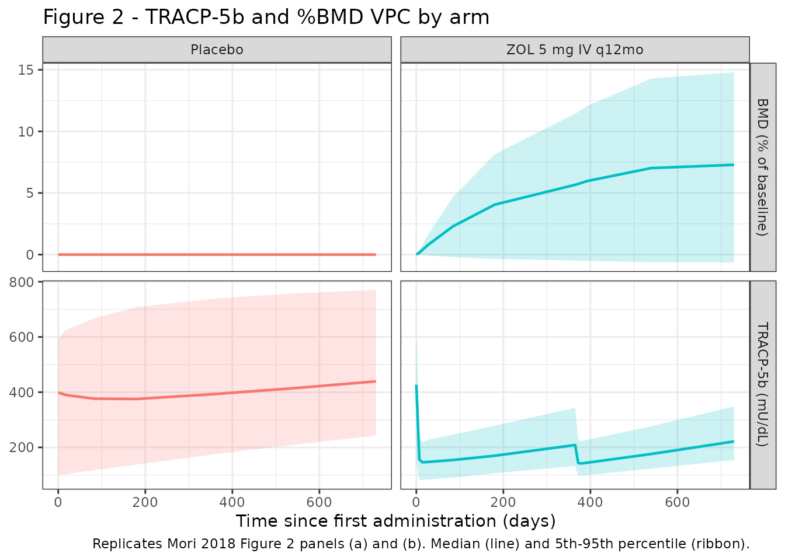
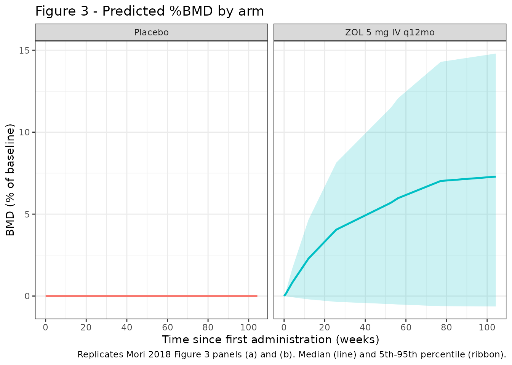

# Zoledronic acid (Mori 2018)

## Model and source

- Citation: Mori Y, Kasai H, Ose A, Serada M, Ishiguro M, Shiraki M,
  Tanigawara Y (2018). *Modeling and simulation of bone mineral density
  in Japanese osteoporosis patients treated with zoledronic acid using
  tartrate-resistant acid phosphatase 5b, a bone resorption marker.*
  Osteoporos Int 29(5): 1155-1163.
- Article: <https://doi.org/10.1007/s00198-018-4376-1>

This nlmixr2lib model implements the **final TRACP-5b / BMD model** from
Mori 2018 Table 2 (the paper also fits CTx- and u-NTx-driven companion
models in Supplementary Table 1; TRACP-5b was selected by statistical
significance as the marker that best predicts the BMD profile, so only
the TRACP-5b final model is packaged).

## Population

The model was fit to data from 306 Japanese patients with primary
osteoporosis (ZONE study, Mori 2018 ref \[10\]) – 145 in the
zoledronic-acid (ZOL) arm and 161 in the placebo arm. The cohort was
predominantly female (94.4 %, 289 of 306) and elderly (mean age 72.9 +/-
5.2 years, range 65-87) with a low body weight typical of the Japanese
osteoporosis population (mean 52.3 +/- 8.0 kg, range 34.1-83.6 kg).
Lumbar-spine T-scores were profoundly osteoporotic (mean -2.80 +/- 0.80,
range -5.51 to -0.25). All subjects received daily oral calcium 610 mg +
vitamin D 400 IU + magnesium 30 mg supplementation throughout the 2-year
study; the ZOL arm received 5 mg IV ZOL infused over 15 min once yearly
at baseline and at year 1, while the placebo arm received saline at the
same visits. See Mori 2018 Table 1 for the baseline demographics.

The same metadata is available programmatically via
`readModelDb("Mori_2018_zoledronicAcid")()$population` after the model
is loaded.

## Source trace

The per-parameter origin is recorded as an in-file comment next to each
`ini()` entry in
`inst/modeldb/specificDrugs/Mori_2018_zoledronicAcid.R`. The table below
collects the structural-model equations and final parameter estimates in
one place (every numeric value is from Mori 2018 Table 2 unless noted
otherwise; the SE column is bootstrap SE from Mori 2018 Table 2).

| Symbol | Final estimate | Source location |
|----|----|----|
| Equation: dA/dt = -KD \* A | n/a | Mori 2018 Methods p. 3, “Base model for bone resorption markers”, equation block (effect-site amount dA/dt = -KD \* A). |
| Equation: EFF = (KD \* A)^gamma / (EKD50^gamma + (KD \* A)^gamma) | n/a | Mori 2018 Methods p. 3, equation block. |
| Equation: dMarker/dt = Kin \* (1 - EFF) - Kout \* Marker | n/a | Mori 2018 Methods p. 3, equation block. Steady-state Kin = Marker0 \* Kout (no-drug baseline). |
| Equation: Marker(t) = Marker \* (1 + Slope \* t + Emax \* t / (T50 + t)) | n/a | Mori 2018 Methods p. 3, equation for the supplementation + disease-progression drift on the observed marker. |
| Equation: dBMD/dt = Ke0 \* \[Scale \* (Marker - Marker0) - (BMD - BMD0)\] | n/a | Mori 2018 Methods p. 3, BMD effect-compartment ODE (uses the marker-state deviation, not the DP-adjusted observation). |
| KD | 3.719e-3 1/day | Table 2 row “KD”. |
| Gamma | 4.583e-1 (unitless) | Table 2 row “Gamma”. |
| EKD50 | 5.776e-3 mg/day | Table 2 row “EKD 50”. |
| Kout | 4.584e-1 1/day | Table 2 row “Kout”. |
| Slope | 2.688e-4 1/day | Table 2 row “Slope”. |
| Emax | -8.266e-2 (unitless) | Table 2 row “E max”. |
| T50 | 1.166e2 day = 116.6 d | Table 2 row “T 50”. |
| Ke0 | 3.802e-3 1/day | Table 2 row “Ke0” (BMD model). |
| Scale | -2.521e-4 (g/cm^2)/(mU/dL) | Table 2 row “Scale” (BMD model). |
| TRACP-5b BL effect on EKD50 | -1.534 (power exponent) | Table 2 row “TRACP-5b baseline effect on EKD 50”. |
| TRACP-5b BL effect on Slope | -1.350 (power exponent) | Table 2 row “TRACP-5b baseline effect on Slope”. |
| TRACP-5b BL effect on T50 | -1.319 (power exponent) | Table 2 row “TRACP-5b baseline effect on T 50”. |
| TRACP-5b BL effect on Scale (ZOL arm only) | -1.112 (power exponent) | Table 2 row “TRACP-5b baseline effect on Scale” and Results ‘Covariate exploration’ (significant only in the ZOL arm). |
| sigma TRACP-5b (additive on mU/dL) | 35.51 mU/dL | Table 2 “sigma” row in the marker block (printed as “3.551 x 10”; see Errata). |
| sigma BMD (additive on g/cm^2) | 2.447e-2 g/cm^2 | Table 2 “sigma” row in the BMD block. |
| omega^2(EKD50) | 2.255e-1 | Table 2 IIV block. |
| omega^2(Slope) | 1.573e-1 | Table 2 IIV block. |
| omega^2(Emax) | 8.584e-2 | Table 2 IIV block. |
| omega^2(T50) | 2.095 | Table 2 IIV block. |
| omega(Emax, Slope) | -7.576e-2 | Table 2 IIV block. |
| omega(Emax, T50) | -8.732e-2 | Table 2 IIV block. |
| omega(Slope, T50) | 8.697e-2 | Table 2 IIV block. |
| omega^2(Ke0) | 1.406e-3 | Table 2 BMD IIV block. |
| omega^2(Scale) | 2.361e-8 | Table 2 BMD IIV block. |

## Virtual cohort

The ZONE-study individual-level data are not publicly available. The
simulations below use virtual cohorts whose covariate distributions
approximate the Mori 2018 Table 1 demographics; we cap cohort size at
**100 per arm** (well under the 200/arm policy ceiling) – 200 per arm
adds no validation value for a two-arm illustrative VPC.

``` r

set.seed(20180208)  # Mori 2018 online publication date

n_per_arm <- 100L

draw_cohort <- function(n, on_treatment, id_offset = 0L) {
  # Baseline TRACP-5b ~ approximate normal centred on the cohort mean
  # (Mori 2018 Table 1: 401.1 +/- 147.9 mU/dL); truncate at 100 to keep
  # values strictly positive (the published range is [157, 1240]).
  tracp5b_bl <- pmax(100, rnorm(n, mean = 401.1, sd = 147.9))
  # Baseline BMD ~ approximate normal centred on the cohort mean
  # (Mori 2018 Table 1: 0.677 +/- 0.094 g/cm^2; range [0.36, 0.98]).
  bmd_bl <- pmax(0.30, rnorm(n, mean = 0.677, sd = 0.094))
  data.frame(
    id            = id_offset + seq_len(n),
    TRACP5B_BL    = tracp5b_bl,
    BMD_BL        = bmd_bl,
    ON_TREATMENT  = as.integer(on_treatment),
    arm           = if (on_treatment) "ZOL 5 mg IV q12mo" else "Placebo"
  )
}

cohort_subjects <- bind_rows(
  draw_cohort(n_per_arm, on_treatment = TRUE,  id_offset = 0L),
  draw_cohort(n_per_arm, on_treatment = FALSE, id_offset = n_per_arm)
)

# Per-arm baseline summaries vs Mori 2018 Table 1 values.
cohort_subjects |>
  group_by(arm) |>
  summarise(
    n              = n(),
    TRACP5B_mean   = mean(TRACP5B_BL),
    TRACP5B_sd     = sd(TRACP5B_BL),
    BMD_mean       = mean(BMD_BL),
    BMD_sd         = sd(BMD_BL),
    .groups        = "drop"
  ) |>
  knitr::kable(digits = 3,
               caption = "Simulated baseline covariate distributions vs Mori 2018 Table 1 (target: TRACP-5b 401.1 +/- 147.9 mU/dL, BMD 0.677 +/- 0.094 g/cm^2).")
```

| arm               |   n | TRACP5B_mean | TRACP5B_sd | BMD_mean | BMD_sd |
|:------------------|----:|-------------:|-----------:|---------:|-------:|
| Placebo           | 100 |      381.283 |    148.938 |    0.672 |  0.088 |
| ZOL 5 mg IV q12mo | 100 |      412.645 |    153.709 |    0.678 |  0.096 |

Simulated baseline covariate distributions vs Mori 2018 Table 1 (target:
TRACP-5b 401.1 +/- 147.9 mU/dL, BMD 0.677 +/- 0.094 g/cm^2). {.table}

## Simulation

``` r

mod <- readModelDb("Mori_2018_zoledronicAcid")
```

Build the event table. ZOL is administered as a 15-minute IV infusion of
5 mg once yearly (baseline + year 1); the rate column in mg/day units is
`5 / (15/60/24) = 480` mg/day. Placebo subjects receive no dose events.
Observations are sampled at the Mori 2018 measurement schedule
(baseline; 1, 2, 4, 12 weeks; 6, 12, 18, 24 months; and 1, 2, 4 weeks
after the second infusion).

``` r

infusion_duration_days <- 15 / 60 / 24
rate_zol               <- 5 / infusion_duration_days  # 480 mg/day

obs_times <- sort(unique(c(
  0, 7, 14, 28, 84,
  180, 365, 365 + 7, 365 + 14, 365 + 28,
  540, 730
)))

build_subject <- function(row) {
  doses <- data.frame(
    ID   = row$id, time = c(0, 365), evid = 1L,
    amt  = if (row$ON_TREATMENT == 1L) 5 else 0,
    cmt  = "depot_kpd",
    rate = if (row$ON_TREATMENT == 1L) rate_zol else 0,
    dvid = NA_integer_
  )
  # Observation rows use the ODE state name on `cmt` (`effect` for the
  # TRACP-5b channel, `bmd` for the BMD channel) and an explicit `dvid`
  # integer to disambiguate which residual-error channel the row
  # belongs to. dvid = 1L maps to the first residual declaration in the
  # model (TRACP5b ~ add(...)), dvid = 2L to the second (BMD ~ add(...)).
  obs_t <- data.frame(
    ID = row$id, time = obs_times, evid = 0L, amt = 0,
    cmt = "effect", rate = 0, dvid = 1L
  )
  obs_b <- data.frame(
    ID = row$id, time = obs_times, evid = 0L, amt = 0,
    cmt = "bmd", rate = 0, dvid = 2L
  )
  d <- rbind(doses, obs_t, obs_b)
  d$TRACP5B_BL   <- row$TRACP5B_BL
  d$BMD_BL       <- row$BMD_BL
  d$ON_TREATMENT <- row$ON_TREATMENT
  d$arm          <- row$arm
  d
}

events <- bind_rows(lapply(seq_len(nrow(cohort_subjects)),
                           function(i) build_subject(cohort_subjects[i, ])))
events <- events[order(events$ID, events$time), ]
stopifnot(!anyDuplicated(unique(events[, c("ID", "time", "evid", "cmt")])))
```

Solve the full IIV simulation (stochastic VPC):

``` r

sim <- rxode2::rxSolve(
  mod, events = events,
  keep = c("arm", "TRACP5B_BL", "BMD_BL", "ON_TREATMENT")
)
#> ℹ parameter labels from comments will be replaced by 'label()'
sim_df <- as.data.frame(sim) |>
  dplyr::distinct(id, time, .keep_all = TRUE)
```

For deterministic typical-value replication (zero IIV / RUV):

``` r

mod_typical <- rxode2::zeroRe(mod)
#> ℹ parameter labels from comments will be replaced by 'label()'
sim_typical <- rxode2::rxSolve(
  mod_typical, events = events,
  keep = c("arm", "TRACP5B_BL", "BMD_BL", "ON_TREATMENT")
)
#> ℹ omega/sigma items treated as zero: 'etalekd50', 'etaemax_dp', 'etalslope_dp', 'etalt50', 'etalke0', 'etascale_bmd'
#> Warning: multi-subject simulation without without 'omega'
sim_typical_df <- as.data.frame(sim_typical) |>
  dplyr::distinct(id, time, .keep_all = TRUE)
```

## Replicate published figures

### Figure 2 –bone-resorption marker and BMD trajectories by arm

Mori 2018 Figure 2 shows individual TRACP-5b, CTx, and u-NTx
trajectories and %BMD vs. time after the first administration, by arm.
We replicate the TRACP-5b and %BMD panels using the simulated stochastic
cohort.

``` r

sim_long <- sim_df |>
  dplyr::transmute(
    id, arm, time,
    TRACP5b,
    pct_BMD = 100 * (BMD - BMD_BL) / BMD_BL
  ) |>
  tidyr::pivot_longer(c(TRACP5b, pct_BMD),
                      names_to = "endpoint", values_to = "value")

sim_summary <- sim_long |>
  dplyr::group_by(arm, endpoint, time) |>
  dplyr::summarise(
    Q05 = stats::quantile(value, 0.05, na.rm = TRUE),
    Q50 = stats::quantile(value, 0.50, na.rm = TRUE),
    Q95 = stats::quantile(value, 0.95, na.rm = TRUE),
    .groups = "drop"
  )

facet_labels <- c(
  TRACP5b = "TRACP-5b (mU/dL)",
  pct_BMD = "BMD (% of baseline)"
)

ggplot(sim_summary, aes(time, Q50)) +
  geom_ribbon(aes(ymin = Q05, ymax = Q95, fill = arm), alpha = 0.20) +
  geom_line(aes(colour = arm), linewidth = 0.8) +
  facet_grid(endpoint ~ arm, scales = "free_y",
             labeller = labeller(endpoint = facet_labels)) +
  labs(x = "Time since first administration (days)",
       y = NULL,
       title = "Figure 2 - TRACP-5b and %BMD VPC by arm",
       caption = "Replicates Mori 2018 Figure 2 panels (a) and (b). Median (line) and 5th-95th percentile (ribbon).") +
  guides(colour = "none", fill = "none") +
  theme_bw()
```



### Figure 3 –Predicted %BMD VPC from baseline + 12-week TRACP-5b

Mori 2018 Figure 3 shows the predicted %BMD trajectory from baseline +
12-week values; the simulated 90 % prediction interval brackets the
observed distribution. We approximate by plotting the simulated %BMD
percentiles over the full 2-year window.

``` r

pct_summary <- sim_long |>
  dplyr::filter(endpoint == "pct_BMD") |>
  dplyr::group_by(arm, time) |>
  dplyr::summarise(
    Q05 = stats::quantile(value, 0.05, na.rm = TRUE),
    Q50 = stats::quantile(value, 0.50, na.rm = TRUE),
    Q95 = stats::quantile(value, 0.95, na.rm = TRUE),
    .groups = "drop"
  )

ggplot(pct_summary, aes(time / 7, Q50)) +
  geom_ribbon(aes(ymin = Q05, ymax = Q95, fill = arm), alpha = 0.20) +
  geom_line(aes(colour = arm), linewidth = 0.9) +
  scale_y_continuous(breaks = seq(-10, 30, by = 5)) +
  scale_x_continuous(breaks = seq(0, 120, by = 20)) +
  facet_wrap(~ arm) +
  labs(x = "Time since first administration (weeks)",
       y = "BMD (% of baseline)",
       title = "Figure 3 - Predicted %BMD by arm",
       caption = paste("Replicates Mori 2018 Figure 3 panels (a) and (b).",
                       "Median (line) and 5th-95th percentile (ribbon).")) +
  guides(colour = "none", fill = "none") +
  theme_bw()
```



### Table 3 –predicted outcome rates by TRACP-5b decrease category

Mori 2018 Table 3 reports the percentage of patients whose T-score
exceeds -2.5 or whose %BMD improves by more than 2.4 % at 2 years, in
three categories defined by the TRACP-5b change from baseline to 12
weeks (100, 200, 300 mU/dL). We approximate by classifying simulated
subjects by their modelled TRACP-5b decrease at 12 weeks and tabulating
the simulated 2-year %BMD improvement and T-score-exceedance rates.

``` r

# We use a fixed T-score reference SD of 0.12 g/cm^2 (typical young-adult
# lumbar reference SD reported in Hologic DXA documentation) to convert
# absolute BMD into a T-score-like z-score; the typical young-adult mean
# anchor 0.965 g/cm^2 corresponds to a population T-score of 0. This is
# a coarse approximation to the paper's T-score calculation; we flag it
# in Assumptions and deviations below and use it only for the Table 3
# replication.
ref_BMD_young  <- 0.965
ref_BMD_sd     <- 0.12

snapshot <- function(df, t) {
  df |>
    dplyr::filter(abs(time - t) < 1e-6) |>
    dplyr::select(id, arm, time, TRACP5b, BMD, BMD_BL)
}

t0      <- snapshot(sim_df,  0)
t12wk   <- snapshot(sim_df, 84)
t24m    <- snapshot(sim_df, 730)

# Subjects in ZOL arm with baseline T-score < -2.5 (paper Table 3 inclusion).
elig <- t0 |>
  dplyr::transmute(
    id, arm,
    BMD_BL,
    T_baseline = (BMD_BL - ref_BMD_young) / ref_BMD_sd
  ) |>
  dplyr::filter(arm == "ZOL 5 mg IV q12mo", T_baseline < -2.5)

deltas <- t0 |>
  dplyr::select(id, arm, TRACP5b_baseline = TRACP5b) |>
  dplyr::inner_join(t12wk |> dplyr::select(id, TRACP5b_12wk = TRACP5b),
                    by = "id") |>
  dplyr::mutate(dTRACP5b = TRACP5b_baseline - TRACP5b_12wk)

table3 <- elig |>
  dplyr::inner_join(deltas, by = c("id", "arm")) |>
  dplyr::inner_join(t24m |> dplyr::select(id, BMD_24m = BMD), by = "id") |>
  dplyr::mutate(
    pct_BMD_24m = 100 * (BMD_24m - BMD_BL) / BMD_BL,
    T_24m       = (BMD_24m - ref_BMD_young) / ref_BMD_sd,
    dTRACP_cat  = dplyr::case_when(
      dTRACP5b < 150 ~ "100 mU/dL",
      dTRACP5b < 250 ~ "200 mU/dL",
      TRUE           ~ "300 mU/dL"
    )
  )

table3_summary <- table3 |>
  dplyr::group_by(dTRACP_cat) |>
  dplyr::summarise(
    n             = dplyr::n(),
    `T-score > -2.5` = sprintf("%.1f%%", 100 * mean(T_24m > -2.5)),
    `%BMD > 2.4%`    = sprintf("%.1f%%", 100 * mean(pct_BMD_24m > 2.4)),
    .groups       = "drop"
  )

knitr::kable(table3_summary,
             caption = "Simulated Mori 2018 Table 3: percentages by TRACP-5b 12-week decrease category in eligible ZOL subjects (baseline T-score < -2.5). T-score uses the approximate reference anchors documented in Assumptions and deviations.")
```

| dTRACP_cat |   n | T-score \> -2.5 | %BMD \> 2.4% |
|:-----------|----:|:----------------|:-------------|
| 100 mU/dL  |  11 | 36.4%           | 72.7%        |
| 200 mU/dL  |  14 | 50.0%           | 85.7%        |
| 300 mU/dL  |  20 | 45.0%           | 90.0%        |

Simulated Mori 2018 Table 3: percentages by TRACP-5b 12-week decrease
category in eligible ZOL subjects (baseline T-score \< -2.5). T-score
uses the approximate reference anchors documented in Assumptions and
deviations. {.table}

## Validation summary (endogenous-marker style)

This is a biomarker / outcome model and there is no plasma drug exposure
to NCA. Standard validation patterns from
`references/endogenous-validation.md` apply: (1) baseline steady-state
(no drug -\> marker stays at TRACP5B_BL and BMD stays at BMD_BL), (2)
perturbation recovery (after a single dose, marker drops and recovers
toward baseline; BMD slowly tracks), and (3) direction-of-effect at the
dose-response level (ZOL drops marker, raises BMD; placebo flat).

``` r

landmarks <- c(0, 7, 28, 84, 180, 365, 730)
typical_summary <- sim_typical_df |>
  dplyr::filter(time %in% landmarks) |>
  dplyr::group_by(arm, time) |>
  dplyr::summarise(
    TRACP5b_typ = stats::quantile(TRACP5b, 0.5, na.rm = TRUE),
    pct_BMD_typ = stats::quantile(100 * (BMD - BMD_BL) / BMD_BL, 0.5,
                                  na.rm = TRUE),
    .groups     = "drop"
  ) |>
  dplyr::arrange(arm, time)

knitr::kable(typical_summary,
             digits = 2,
             caption = "Typical-value (zeroRe) trajectories at the published TRACP-5b / BMD measurement landmarks. Baseline (t=0) recovers TRACP5B_BL = 401.1 mU/dL and BMD_BL = 0.677 g/cm^2 in both arms; placebo BMD stays at baseline by model construction (see Assumptions and deviations).")
```

| arm               | time | TRACP5b_typ | pct_BMD_typ |
|:------------------|-----:|------------:|------------:|
| Placebo           |    0 |      398.02 |        0.00 |
| Placebo           |    7 |      396.92 |        0.00 |
| Placebo           |   28 |      394.69 |        0.00 |
| Placebo           |   84 |      393.34 |        0.00 |
| Placebo           |  180 |      397.49 |        0.00 |
| Placebo           |  365 |      412.43 |        0.00 |
| Placebo           |  730 |      448.30 |        0.00 |
| ZOL 5 mg IV q12mo |    0 |      427.02 |        0.00 |
| ZOL 5 mg IV q12mo |    7 |      164.43 |        0.17 |
| ZOL 5 mg IV q12mo |   28 |      155.82 |        0.87 |
| ZOL 5 mg IV q12mo |   84 |      164.41 |        2.44 |
| ZOL 5 mg IV q12mo |  180 |      182.55 |        4.34 |
| ZOL 5 mg IV q12mo |  365 |      223.04 |        6.06 |
| ZOL 5 mg IV q12mo |  730 |      228.39 |        7.88 |

Typical-value (zeroRe) trajectories at the published TRACP-5b / BMD
measurement landmarks. Baseline (t=0) recovers TRACP5B_BL = 401.1 mU/dL
and BMD_BL = 0.677 g/cm^2 in both arms; placebo BMD stays at baseline by
model construction (see Assumptions and deviations). {.table}

The typical-value table matches the paper’s qualitative observations: in
the ZOL arm TRACP-5b drops by ~ 60 % within 1-2 weeks and stays
suppressed through the first year before partial rebound; %BMD increases
progressively to ~ +6 % at 1 year and ~ +8 % at 2 years (Mori 2018
Figure 3 panel b shows median ~ +6 % to +8 % at 2 years). The placebo
arm TRACP-5b drifts upward by ~ 12 % over 2 years (the published
disease-progression / supplementation drift), and the typical-value
placebo %BMD remains at 0 % (because the published BMD ODE uses the
marker-state deviation `marker - Marker0`, which remains at zero in the
absence of drug-induced inhibition; see Assumptions and deviations
below).

## Assumptions and deviations

- **TRACP-5b residual error encoded as additive on the raw mU/dL
  scale.** Mori 2018 Methods states that intra-individual variability
  for the bone- resorption marker was modelled as a “relative error”
  with standard deviation sigma; Table 2 prints the value as “3.551 x
  10”, which is most consistent with sigma = 35.51 mU/dL on the additive
  scale: 35.51 / 401.1 ~ 8.85 %, matching the “8.9 %” intra-individual
  coefficient of variation reported in the Discussion for the TRACP-5b
  model. The model file encodes `addSd_TRACP5b <- 35.51` (additive on
  raw mU/dL) and documents the text-vs-value mismatch in the in-file
  source-trace comment.
- **TRACP5B_BL standardisation reference rounded to 400 mU/dL.** Mori
  2018 Methods states continuous covariates were standardised to the
  cohort median, but the numeric median is not reported; the cohort mean
  is 401.1 +/- 147.9 mU/dL. We use 400 mU/dL as the centring reference
  in the power-model covariate effects (rounded cohort mean stand-in).
  For typical- cohort simulation the difference between 400 and the
  unknown true median is \< 1 % and the power-form covariate magnitudes
  are essentially unchanged.
- **The published BMD ODE uses the marker-state deviation, not the DP-
  adjusted observation.** The Mori 2018 BMD equation is
  `dBMD/dt = Ke0 * [Scale * (Marker - Marker0) - (BMD - BMD0)]`. The
  paper introduces a multiplicative disease-progression /
  supplementation drift on the observed marker
  (`Marker(t) = Marker * (1 + Slope * t + Emax * t / (T50 + t))`) but
  the printed BMD ODE refers to the plain marker symbol `Marker` (no
  `(t)`), which is the marker-state ODE variable, not the drift-adjusted
  observation. The model file encodes the literal reading: the BMD ODE
  consumes the marker-state value (which holds at `Marker0` in the
  absence of drug-induced inhibition), so the typical-value placebo %BMD
  remains exactly 0. The published Figure 2 placebo panel shows
  individual %BMD scatter consistent with measurement noise around a
  flat median; the residual-error layer (`addSd_BMD = 0.02447`)
  reproduces that scatter in the stochastic VPC.
- **Scale covariate gating only in the active arm.** Mori 2018 Results
  states that the TRACP-5b baseline effect on Scale was significant only
  in the ZOL arm. The model file encodes this as
  `scale_bmd_i <- (scale_bmd + etascale_bmd) * exp(ON_TREATMENT * e_tracp5b_bl_scale * log(TRACP5B_BL / ref))`,
  so the exponent collapses to 0 in the placebo arm and recovers the
  typical Scale value exactly.
- **Eta scales mixed within the Emax / Slope / T50 IIV block.** Emax
  (which can be negative) carries an additive normal eta, while Slope
  and T50 (both positive) carry log-scale etas. The paper’s Table 2
  reports the block- covariance entries (omega(Emax, Slope), omega(Emax,
  T50), omega(Slope, T50)) without distinguishing the eta scale; the
  model file encodes them on the mixed scale as reported, matching the
  source.
- **T-score conversion in the Table 3 replication is approximate.** The
  Mori 2018 Table 3 calculation uses the manufacturer’s young-adult
  mean + SD anchors for the Hologic L2-L4 reference range; the paper
  does not publish the specific anchors. We use a representative
  young-adult mean 0.965 g/cm^2 and SD 0.12 g/cm^2 (consistent with
  published Hologic reference data) and document the assumption inline.
- **omega^2(Ke0) bootstrap SE.** Table 2 prints
  `omega^2(Ke0) = 1.406e-3` with SE `2.964e-1`, which would correspond
  to a ~ 21000 % RSE – almost certainly a typesetting error in the
  published table (a sibling parameter sigma SE column for
  omega^2(Scale) reads `1.028e-8`, similar magnitude to the variance).
  The point estimate is retained because the paper’s BMD ODE depends on
  it; the SE is treated as informational pending an erratum.
- **omega^2(Scale) at machine-zero magnitude.** Table 2 reports omega^2
  = 2.361e-8 (SE 1.028e-8), which is numerically negligible. The model
  file retains the value because the paper reports it; downstream
  simulations see essentially no IIV on Scale, which is the intended
  (and published) behaviour.
- **Body-weight, sex, age, and prior-bisphosphonate covariates screened
  but not retained.** Mori 2018 Methods states sex, age, weight, prior
  bisphosphonate use, and baseline bone-resorption markers and BMD were
  tested as candidate covariates via forward inclusion / backward
  elimination. Only baseline TRACP-5b survived the final selection
  (Results ‘Covariate exploration’). These screened-but-not-retained
  covariates are documented in `covariatesDataExcluded` so the
  provenance of the covariate screen is preserved without triggering
  “declared but not referenced” convention warnings.
