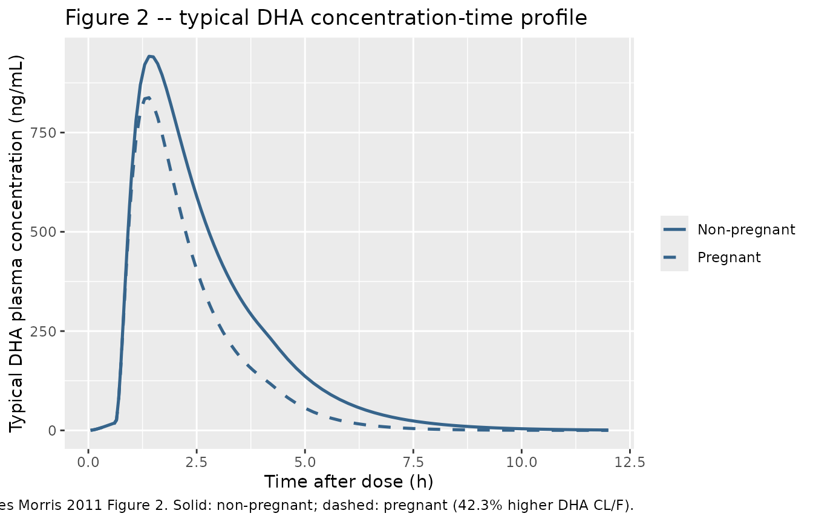
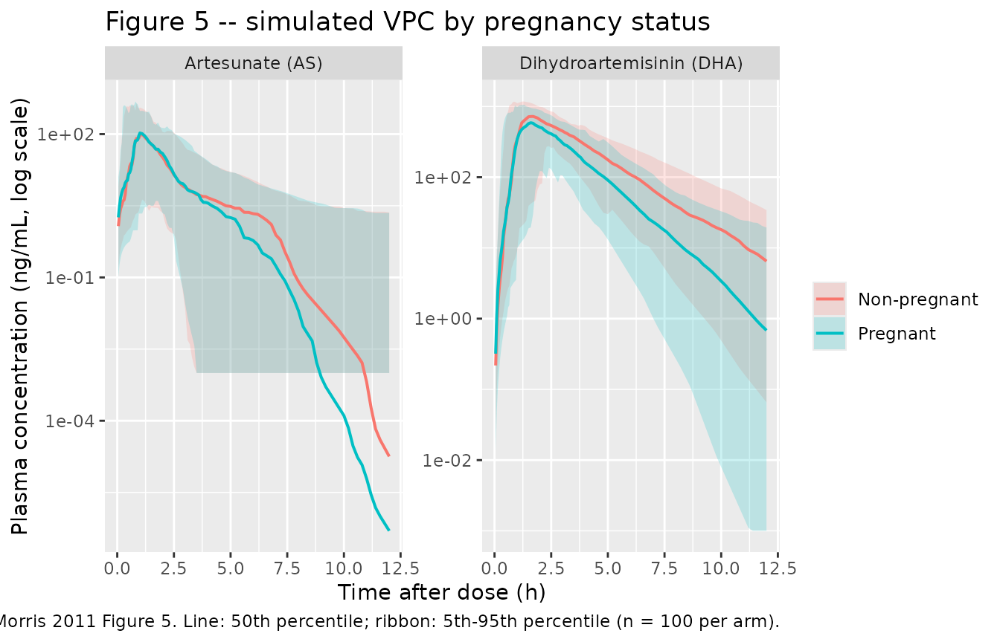

# Artesunate (Morris 2011)

## Model and source

- Citation: Morris CA, Onyamboko MA, Capparelli E, Koch MA, Atibu J,
  Lokomba V, Douoguih M, Hemingway-Foday J, Wesche D, Ryder RW, Bose C,
  Wright L, Tshefu AK, Meshnick S, Fleckenstein L. Population
  pharmacokinetics of artesunate and dihydroartemisinin in pregnant and
  non-pregnant women with malaria. *Malaria Journal* 2011; 10:114.
  <doi:%5B10.1186/1475-2875-10-114>\](<https://doi.org/10.1186/1475-2875-10-114>).
- Open Access full text: <https://doi.org/10.1186/1475-2875-10-114>.
- ClinicalTrials.gov: <https://clinicaltrials.gov/study/NCT00538382>.

Morris 2011 develops a joint parent-metabolite population PK model for
single-dose oral artesunate (AS) and its active metabolite
dihydroartemisinin (DHA) in 26 pregnant and 25 non-pregnant women with
asymptomatic Plasmodium falciparum malaria at the Kingasani Maternity
Clinic in the Democratic Republic of Congo. Each species has a
one-compartment apparent-volume disposition; AS is absorbed via a mixed
process (a fraction F1 = 86.4% absorbed via lagged first-order
absorption with rate K12 and lag ALAG1, the remaining 13.6% absorbed via
a zero-order input of duration D2 = 4.04 h directly into the AS central
compartment) and is converted mole-for-mole to DHA with no separate AS
elimination. Pregnancy is the only retained covariate and acts as a
proportional 42.3% increase in DHA apparent clearance versus
non-pregnant controls; the postpartum sub-cohort could not be
characterised by any tested structural model and is not represented.

``` r

mod_fn  <- readModelDb("Morris_2011_artesunate")
mod     <- rxode2::rxode2(mod_fn())
mod_typ <- rxode2::rxode2(rxode2::zeroRe(mod_fn()))
```

## Population

The model was developed from 51 adult Congolese women: 26 pregnant women
in the second (22-26 weeks gestation) or third (32-36 weeks) trimester
paired with 25 non-pregnant female controls. All subjects had
asymptomatic Plasmodium falciparum parasitaemia (parasite density 200 to
300,000 parasites per microlitre at enrollment, slide- and
PCR-positive), were HIV seronegative, and had haematocrit \> 30%. Median
age was 23-24 years across cohorts (range 18-38); median weight was 63
kg in the pregnant cohort and 52 kg in the controls (range 40-84);
median baseline albumin was 2.6 g/dL pregnant vs 3.3 g/dL control;
median baseline AGP was 70 mg/dL pregnant vs 99 mg/dL control (Table 1).
Each subject received a single 200 mg oral artesunate dose (four 50 mg
tablets, Guilin Pharmaceutical Co. Ltd) at the start of an inpatient
stay; blood samples were drawn pre-dose and at 0.25, 0.5, 0.75, 1, 1.5,
2, 3, 4, 6, and 8 h after administration. 300 AS and 498 DHA
quantifiable plasma concentrations were used in the final fit (roughly
41% of AS and 2% of DHA samples were below the 1 ng/mL LLQ and excluded
prior to model building; 1 AS and 1 DHA outlier additionally excluded).
The pregnant women were also studied three months postpartum, but the
postpartum data could not be characterised by any tested structural
model and are not included in this final model (Results, Model
development).

The same information is available programmatically via
`readModelDb("Morris_2011_artesunate")$population`.

## Source trace

Per-parameter origins are recorded as in-file comments in
`inst/modeldb/specificDrugs/Morris_2011_artesunate.R`; the table below
collects them in one place for review.

| Item | Value (typical) | Source |
|----|----|----|
| One-compartment AS disposition; mixed zero-order plus lagged first-order absorption | structural | Results, Model development (Figure 1) |
| One-compartment DHA disposition; complete in-vivo conversion of AS to DHA | structural | Methods, Base model development (“Complete, irreversible conversion of AS to DHA was assumed for all models”) |
| `lka` -\> K12 = 4.28 1/h | 4.28 | Table 2 (%RSE 23.6) |
| `ldur` -\> D2 = 4.04 h | 4.04 | Table 2 (%RSE 19.5) |
| `llagt` -\> ALAG1 = 0.627 h | 0.627 | Table 2 (%RSE 10.9) |
| `lfdepot` -\> F1 = 0.864 | 0.864 | Table 2 (%RSE 1.56) |
| `lcl` -\> CL/F (AS) = 895 L/h | 895 | Table 2 (%RSE 5.9) |
| `lvc` -\> V2/F (AS) = 195 L | 195 | Table 2 (%RSE 16.4) |
| `lcl_dha` -\> CLM/F (DHA, non-pregnant reference) = 64.0 L/h | 64.0 | Table 2 (%RSE 6.53) |
| `lvc_dha` -\> V3/F (DHA) = 91.4 L | 91.4 | Table 2 (%RSE 6.15) |
| `e_preg_cl_dha` -\> proportional pregnancy effect on DHA CL/F = +42.3% | +0.423 | Table 2 (%RSE 30.3) |
| IIV `var(etalka)` | 1.84 | Table 2 (%RSE 25.3; reported as 136 %CV = 100 \* sqrt(1.84)) |
| IIV `var(etaldur)` | 1.33 | Table 2 (%RSE 22.9; 115 %CV) |
| IIV `var(etallagt)` | 0.573 | Table 2 (%RSE 20.8; 75.7 %CV) |
| IIV `var(etalvc)` | 0.604 | Table 2 (%RSE 30.1; 77.7 %CV) |
| IIV `var(etalcl_dha)` | 0.0802 | Table 2 (%RSE 24.9; 28.3 %CV) |
| IIV `var(etalvc_dha)` | 0.0790 | Table 2 (%RSE 34.7; 28.1 %CV) |
| IIV on CL/F (AS) and F1: removed from final model | 0 (fixed) | Results, Model development (“the IIV values associated with CL/F and F1 were fixed after conclusion of covariate model building due to poor precision in omega estimates”) |
| Residual `propSd` (AS) | sqrt(0.696) = 0.834 | Table 2 (%RSE 11.6); residual error modelled as additive on the log scale per Methods (“Residual variability (RV) was modelled with an additive model for log-transformed data”) |
| Residual `propSd_dha` | sqrt(0.174) = 0.417 | Table 2 (%RSE 9.94) |
| Dose units: nmol; concentration units: nmol/L (200 mg AS = ~520,264 nmol via MW = 384.42 g/mol) | – | Methods, Population pharmacokinetic analysis (“Prior to modelling, AS and DHA concentrations were converted from ng/mL to nmol/L values using the compounds respective molecular weights; the concentrations were then natural log-transformed. The 200 mg AS dose was similarly converted to the appropriate value in nmols”) |

## Virtual cohort

The original observed data are not publicly available. The simulations
below use a virtual cohort whose covariate distributions approximate the
published demographics: a balanced mix of 100 pregnant and 100
non-pregnant adult women, each receiving the single 200 mg oral
artesunate dose used in the trial. The covariate that matters in this
model is `PREG`; weight was tested but not retained in the final model
and is therefore not carried as a structural covariate.

``` r

set.seed(2026)

n_per_arm <- 100L

# Compartment indices (from the d/dt declaration order in
# inst/modeldb/specificDrugs/Morris_2011_artesunate.R):
#   1 = depot         (first-order absorption arm, with lag)
#   2 = central       (AS central; also zero-order arm input target)
#   3 = central_dha   (DHA central)
# rxSolve returns Cc and Cc_dha as columns in the output regardless of
# the observation-row cmt label, so a single observation row per (id,
# time) is sufficient -- we pick cmt = "Cc" for traceability.
cmt_depot   <- 1L
cmt_central <- 2L

# 200 mg artesunate dose in nmol via MW = 384.42 g/mol
dose_nmol <- 200e-3 / 384.42 * 1e9

obs_times <- c(seq(0.05, 1, by = 0.05),
               seq(1.1, 4, by = 0.1),
               seq(4.2, 12, by = 0.2))

build_events <- function(subjects, obs_times, dose_amt) {
  out <- vector("list", length = nrow(subjects))
  for (i in seq_len(nrow(subjects))) {
    s <- subjects[i, ]
    dose_first_order <- data.frame(
      id = s$id, time = 0, evid = 1L, amt = dose_amt,
      cmt = "depot",   rate = 0,
      treatment = s$treatment, PREG = s$PREG
    )
    dose_zero_order <- data.frame(
      id = s$id, time = 0, evid = 1L, amt = dose_amt,
      cmt = "central", rate = -2,
      treatment = s$treatment, PREG = s$PREG
    )
    obs <- data.frame(
      id = s$id, time = obs_times, evid = 0L, amt = 0,
      cmt = "Cc", rate = 0,
      treatment = s$treatment, PREG = s$PREG
    )
    out[[i]] <- rbind(dose_first_order, dose_zero_order, obs)
  }
  events <- dplyr::bind_rows(out)
  events[order(events$id, events$time, -events$evid), ]
}

subjects <- dplyr::bind_rows(
  data.frame(id = seq_len(n_per_arm),
             treatment = "Non-pregnant",
             PREG = 0L),
  data.frame(id = n_per_arm + seq_len(n_per_arm),
             treatment = "Pregnant",
             PREG = 1L)
)

events <- build_events(subjects, obs_times, dose_nmol)
stopifnot(!anyDuplicated(unique(events[, c("id", "time", "evid", "cmt")])))

dplyr::glimpse(subjects)
#> Rows: 200
#> Columns: 3
#> $ id        <int> 1, 2, 3, 4, 5, 6, 7, 8, 9, 10, 11, 12, 13, 14, 15, 16, 17, 1…
#> $ treatment <chr> "Non-pregnant", "Non-pregnant", "Non-pregnant", "Non-pregnan…
#> $ PREG      <int> 0, 0, 0, 0, 0, 0, 0, 0, 0, 0, 0, 0, 0, 0, 0, 0, 0, 0, 0, 0, …
```

## Simulation

Stochastic simulation (full omega / sigma) for visual predictive plots
and PKNCA:

``` r

sim <- rxode2::rxSolve(
  mod,
  events = events,
  keep   = c("treatment", "PREG")
) |>
  as.data.frame() |>
  dplyr::mutate(
    Cc_ng_per_mL     = Cc * 384.42 / 1000,
    Cc_dha_ng_per_mL = Cc_dha * 284.35 / 1000
  )
```

Typical-value (omega / sigma zeroed) simulation for direct comparison
against the published typical concentration-time profiles in Morris 2011
Figure 2:

``` r

typical_subjects <- data.frame(
  id        = 1:2,
  treatment = c("Non-pregnant", "Pregnant"),
  PREG      = c(0L, 1L)
)
typical_events <- build_events(typical_subjects, obs_times, dose_nmol)

sim_typical <- rxode2::rxSolve(
  mod_typ,
  events = typical_events,
  keep   = c("treatment", "PREG")
) |>
  as.data.frame() |>
  dplyr::mutate(
    Cc_ng_per_mL     = Cc * 384.42 / 1000,
    Cc_dha_ng_per_mL = Cc_dha * 284.35 / 1000
  )
#> ℹ omega/sigma items treated as zero: 'etalka', 'etaldur', 'etallagt', 'etalvc', 'etalcl_dha', 'etalvc_dha'
#> Warning: multi-subject simulation without without 'omega'
```

## Replicate published figures

### Figure 2 – Typical DHA concentration-time profiles by pregnancy status

Morris 2011 Figure 2 shows the typical DHA concentration-time profile
for pregnant and non-pregnant women (solid line: non-pregnant; dashed
line: pregnant) based on the final model parameter estimates. The plot
below reproduces that figure using the typical-value simulation
(`zeroRe()` removes between-subject variability so the curves match the
published structural-parameter trajectories rather than a VPC
distribution).

``` r

sim_typical |>
  dplyr::filter(time > 0) |>
  ggplot(aes(time, Cc_dha_ng_per_mL, linetype = treatment)) +
  geom_line(colour = "steelblue4", size = 0.9) +
  scale_linetype_manual(values = c("Non-pregnant" = "solid",
                                    "Pregnant"     = "dashed")) +
  labs(
    x = "Time after dose (h)",
    y = "Typical DHA plasma concentration (ng/mL)",
    linetype = NULL,
    title = "Figure 2 -- typical DHA concentration-time profile",
    caption = paste0(
      "Replicates Morris 2011 Figure 2. Solid: non-pregnant; ",
      "dashed: pregnant (42.3% higher DHA CL/F)."
    )
  )
#> Warning: Using `size` aesthetic for lines was deprecated in ggplot2 3.4.0.
#> ℹ Please use `linewidth` instead.
#> This warning is displayed once per session.
#> Call `lifecycle::last_lifecycle_warnings()` to see where this warning was
#> generated.
```



### Figure 5 – Simulated VPC for AS and DHA by pregnancy status

Morris 2011 Figure 5 shows visual predictive checks for AS and DHA. The
plot below mirrors that structure using the stochastic simulation above,
stratified by pregnancy status (the only retained covariate). The median
and 5th to 95th percentile envelope are computed from 100 virtual
subjects per arm.

``` r

vpc_df <- sim |>
  dplyr::filter(time > 0) |>
  dplyr::group_by(time, treatment) |>
  dplyr::summarise(
    Q05_as  = stats::quantile(Cc_ng_per_mL,     0.05, na.rm = TRUE),
    Q50_as  = stats::quantile(Cc_ng_per_mL,     0.50, na.rm = TRUE),
    Q95_as  = stats::quantile(Cc_ng_per_mL,     0.95, na.rm = TRUE),
    Q05_dha = stats::quantile(Cc_dha_ng_per_mL, 0.05, na.rm = TRUE),
    Q50_dha = stats::quantile(Cc_dha_ng_per_mL, 0.50, na.rm = TRUE),
    Q95_dha = stats::quantile(Cc_dha_ng_per_mL, 0.95, na.rm = TRUE),
    .groups = "drop"
  )

vpc_long <- dplyr::bind_rows(
  vpc_df |>
    dplyr::transmute(time, treatment, species = "Artesunate (AS)",
                     Q05 = Q05_as,  Q50 = Q50_as,  Q95 = Q95_as),
  vpc_df |>
    dplyr::transmute(time, treatment, species = "Dihydroartemisinin (DHA)",
                     Q05 = Q05_dha, Q50 = Q50_dha, Q95 = Q95_dha)
)

ggplot(vpc_long, aes(time, Q50, colour = treatment, fill = treatment)) +
  geom_ribbon(aes(ymin = pmax(Q05, 1e-3), ymax = Q95),
              alpha = 0.20, colour = NA) +
  geom_line(size = 0.7) +
  facet_wrap(~ species, nrow = 1, scales = "free_y") +
  scale_y_log10() +
  labs(
    x = "Time after dose (h)",
    y = "Plasma concentration (ng/mL, log scale)",
    colour = NULL, fill = NULL,
    title = "Figure 5 -- simulated VPC by pregnancy status",
    caption = paste0(
      "Replicates the structure of Morris 2011 Figure 5. ",
      "Line: 50th percentile; ribbon: 5th-95th percentile (n = 100 per arm)."
    )
  )
```



## PKNCA validation

Single-dose, dense-sampling NCA with PKNCA. Treatment grouping is
pregnancy status so per-arm Cmax / AUC / half-life can be compared
against the published apparent-clearance values.

``` r

sim_nca_dha <- sim |>
  dplyr::filter(!is.na(Cc_dha_ng_per_mL)) |>
  dplyr::select(id, time, Cc = Cc_dha_ng_per_mL, treatment)

# 200 mg AS converts mole-for-mole to DHA via MW ratio; PKNCA dose for
# the DHA analyte is the AS dose expressed in mg-equivalent DHA mass:
# 200 mg AS * (MW_DHA / MW_AS) = 200 * 284.35 / 384.42 = 147.94 mg DHA.
dose_dha_mg <- 200 * 284.35 / 384.42

dose_df_dha <- events |>
  dplyr::filter(evid == 1L, cmt == "central") |>
  dplyr::mutate(amt = dose_dha_mg) |>
  dplyr::select(id, time, amt, treatment)

conc_obj_dha <- PKNCA::PKNCAconc(
  sim_nca_dha, Cc ~ time | treatment + id,
  concu = "ng/mL", timeu = "h"
)
dose_obj_dha <- PKNCA::PKNCAdose(
  dose_df_dha, amt ~ time | treatment + id,
  doseu = "mg"
)

intervals_dha <- data.frame(
  start      = 0,
  end        = 12,
  cmax       = TRUE,
  tmax       = TRUE,
  auclast    = TRUE,
  aucinf.obs = TRUE,
  half.life  = TRUE,
  cl.last    = TRUE
)

nca_data_dha <- PKNCA::PKNCAdata(conc_obj_dha, dose_obj_dha,
                                  intervals = intervals_dha)
nca_res_dha  <- PKNCA::pk.nca(nca_data_dha)
#> Warning: Requesting an AUC range starting (0) before the first measurement (0.05) is not allowed
#> Requesting an AUC range starting (0) before the first measurement (0.05) is not allowed
#> Requesting an AUC range starting (0) before the first measurement (0.05) is not allowed
#> Requesting an AUC range starting (0) before the first measurement (0.05) is not allowed
#> Requesting an AUC range starting (0) before the first measurement (0.05) is not allowed
#> Requesting an AUC range starting (0) before the first measurement (0.05) is not allowed
#> Requesting an AUC range starting (0) before the first measurement (0.05) is not allowed
#> Requesting an AUC range starting (0) before the first measurement (0.05) is not allowed
#> Requesting an AUC range starting (0) before the first measurement (0.05) is not allowed
#> Requesting an AUC range starting (0) before the first measurement (0.05) is not allowed
#> Requesting an AUC range starting (0) before the first measurement (0.05) is not allowed
#> Requesting an AUC range starting (0) before the first measurement (0.05) is not allowed
#> Requesting an AUC range starting (0) before the first measurement (0.05) is not allowed
#> Requesting an AUC range starting (0) before the first measurement (0.05) is not allowed
#> Requesting an AUC range starting (0) before the first measurement (0.05) is not allowed
#> Requesting an AUC range starting (0) before the first measurement (0.05) is not allowed
#> Requesting an AUC range starting (0) before the first measurement (0.05) is not allowed
#> Requesting an AUC range starting (0) before the first measurement (0.05) is not allowed
#> Requesting an AUC range starting (0) before the first measurement (0.05) is not allowed
#> Requesting an AUC range starting (0) before the first measurement (0.05) is not allowed
#> Requesting an AUC range starting (0) before the first measurement (0.05) is not allowed
#> Requesting an AUC range starting (0) before the first measurement (0.05) is not allowed
#> Requesting an AUC range starting (0) before the first measurement (0.05) is not allowed
#> Requesting an AUC range starting (0) before the first measurement (0.05) is not allowed
#> Requesting an AUC range starting (0) before the first measurement (0.05) is not allowed
#> Requesting an AUC range starting (0) before the first measurement (0.05) is not allowed
#> Requesting an AUC range starting (0) before the first measurement (0.05) is not allowed
#> Requesting an AUC range starting (0) before the first measurement (0.05) is not allowed
#> Requesting an AUC range starting (0) before the first measurement (0.05) is not allowed
#> Requesting an AUC range starting (0) before the first measurement (0.05) is not allowed
#> Requesting an AUC range starting (0) before the first measurement (0.05) is not allowed
#> Requesting an AUC range starting (0) before the first measurement (0.05) is not allowed
#> Requesting an AUC range starting (0) before the first measurement (0.05) is not allowed
#> Requesting an AUC range starting (0) before the first measurement (0.05) is not allowed
#> Requesting an AUC range starting (0) before the first measurement (0.05) is not allowed
#> Requesting an AUC range starting (0) before the first measurement (0.05) is not allowed
#> Requesting an AUC range starting (0) before the first measurement (0.05) is not allowed
#> Requesting an AUC range starting (0) before the first measurement (0.05) is not allowed
#> Requesting an AUC range starting (0) before the first measurement (0.05) is not allowed
#> Requesting an AUC range starting (0) before the first measurement (0.05) is not allowed
#> Requesting an AUC range starting (0) before the first measurement (0.05) is not allowed
#> Requesting an AUC range starting (0) before the first measurement (0.05) is not allowed
#> Requesting an AUC range starting (0) before the first measurement (0.05) is not allowed
#> Requesting an AUC range starting (0) before the first measurement (0.05) is not allowed
#> Requesting an AUC range starting (0) before the first measurement (0.05) is not allowed
#> Requesting an AUC range starting (0) before the first measurement (0.05) is not allowed
#> Requesting an AUC range starting (0) before the first measurement (0.05) is not allowed
#> Requesting an AUC range starting (0) before the first measurement (0.05) is not allowed
#> Requesting an AUC range starting (0) before the first measurement (0.05) is not allowed
#> Requesting an AUC range starting (0) before the first measurement (0.05) is not allowed
#> Requesting an AUC range starting (0) before the first measurement (0.05) is not allowed
#> Requesting an AUC range starting (0) before the first measurement (0.05) is not allowed
#> Requesting an AUC range starting (0) before the first measurement (0.05) is not allowed
#> Requesting an AUC range starting (0) before the first measurement (0.05) is not allowed
#> Requesting an AUC range starting (0) before the first measurement (0.05) is not allowed
#> Requesting an AUC range starting (0) before the first measurement (0.05) is not allowed
#> Requesting an AUC range starting (0) before the first measurement (0.05) is not allowed
#> Requesting an AUC range starting (0) before the first measurement (0.05) is not allowed
#> Requesting an AUC range starting (0) before the first measurement (0.05) is not allowed
#> Requesting an AUC range starting (0) before the first measurement (0.05) is not allowed
#> Requesting an AUC range starting (0) before the first measurement (0.05) is not allowed
#> Requesting an AUC range starting (0) before the first measurement (0.05) is not allowed
#> Requesting an AUC range starting (0) before the first measurement (0.05) is not allowed
#> Requesting an AUC range starting (0) before the first measurement (0.05) is not allowed
#> Requesting an AUC range starting (0) before the first measurement (0.05) is not allowed
#> Requesting an AUC range starting (0) before the first measurement (0.05) is not allowed
#> Requesting an AUC range starting (0) before the first measurement (0.05) is not allowed
#> Requesting an AUC range starting (0) before the first measurement (0.05) is not allowed
#> Requesting an AUC range starting (0) before the first measurement (0.05) is not allowed
#> Requesting an AUC range starting (0) before the first measurement (0.05) is not allowed
#> Requesting an AUC range starting (0) before the first measurement (0.05) is not allowed
#> Requesting an AUC range starting (0) before the first measurement (0.05) is not allowed
#> Requesting an AUC range starting (0) before the first measurement (0.05) is not allowed
#> Requesting an AUC range starting (0) before the first measurement (0.05) is not allowed
#> Requesting an AUC range starting (0) before the first measurement (0.05) is not allowed
#> Requesting an AUC range starting (0) before the first measurement (0.05) is not allowed
#> Requesting an AUC range starting (0) before the first measurement (0.05) is not allowed
#> Requesting an AUC range starting (0) before the first measurement (0.05) is not allowed
#> Requesting an AUC range starting (0) before the first measurement (0.05) is not allowed
#> Requesting an AUC range starting (0) before the first measurement (0.05) is not allowed
#> Requesting an AUC range starting (0) before the first measurement (0.05) is not allowed
#> Requesting an AUC range starting (0) before the first measurement (0.05) is not allowed
#> Requesting an AUC range starting (0) before the first measurement (0.05) is not allowed
#> Requesting an AUC range starting (0) before the first measurement (0.05) is not allowed
#> Requesting an AUC range starting (0) before the first measurement (0.05) is not allowed
#> Requesting an AUC range starting (0) before the first measurement (0.05) is not allowed
#> Requesting an AUC range starting (0) before the first measurement (0.05) is not allowed
#> Requesting an AUC range starting (0) before the first measurement (0.05) is not allowed
#> Requesting an AUC range starting (0) before the first measurement (0.05) is not allowed
#> Requesting an AUC range starting (0) before the first measurement (0.05) is not allowed
#> Requesting an AUC range starting (0) before the first measurement (0.05) is not allowed
#> Requesting an AUC range starting (0) before the first measurement (0.05) is not allowed
#> Requesting an AUC range starting (0) before the first measurement (0.05) is not allowed
#> Requesting an AUC range starting (0) before the first measurement (0.05) is not allowed
#> Requesting an AUC range starting (0) before the first measurement (0.05) is not allowed
#> Requesting an AUC range starting (0) before the first measurement (0.05) is not allowed
#> Requesting an AUC range starting (0) before the first measurement (0.05) is not allowed
#> Requesting an AUC range starting (0) before the first measurement (0.05) is not allowed
#> Requesting an AUC range starting (0) before the first measurement (0.05) is not allowed
#> Requesting an AUC range starting (0) before the first measurement (0.05) is not allowed
#> Requesting an AUC range starting (0) before the first measurement (0.05) is not allowed
#> Requesting an AUC range starting (0) before the first measurement (0.05) is not allowed
#> Requesting an AUC range starting (0) before the first measurement (0.05) is not allowed
#> Requesting an AUC range starting (0) before the first measurement (0.05) is not allowed
#> Requesting an AUC range starting (0) before the first measurement (0.05) is not allowed
#> Requesting an AUC range starting (0) before the first measurement (0.05) is not allowed
#> Requesting an AUC range starting (0) before the first measurement (0.05) is not allowed
#> Requesting an AUC range starting (0) before the first measurement (0.05) is not allowed
#> Requesting an AUC range starting (0) before the first measurement (0.05) is not allowed
#> Requesting an AUC range starting (0) before the first measurement (0.05) is not allowed
#> Requesting an AUC range starting (0) before the first measurement (0.05) is not allowed
#> Requesting an AUC range starting (0) before the first measurement (0.05) is not allowed
#> Requesting an AUC range starting (0) before the first measurement (0.05) is not allowed
#> Requesting an AUC range starting (0) before the first measurement (0.05) is not allowed
#> Requesting an AUC range starting (0) before the first measurement (0.05) is not allowed
#> Requesting an AUC range starting (0) before the first measurement (0.05) is not allowed
#> Requesting an AUC range starting (0) before the first measurement (0.05) is not allowed
#> Requesting an AUC range starting (0) before the first measurement (0.05) is not allowed
#> Requesting an AUC range starting (0) before the first measurement (0.05) is not allowed
#> Requesting an AUC range starting (0) before the first measurement (0.05) is not allowed
#> Requesting an AUC range starting (0) before the first measurement (0.05) is not allowed
#> Requesting an AUC range starting (0) before the first measurement (0.05) is not allowed
#> Requesting an AUC range starting (0) before the first measurement (0.05) is not allowed
#> Requesting an AUC range starting (0) before the first measurement (0.05) is not allowed
#> Requesting an AUC range starting (0) before the first measurement (0.05) is not allowed
#> Requesting an AUC range starting (0) before the first measurement (0.05) is not allowed
#> Requesting an AUC range starting (0) before the first measurement (0.05) is not allowed
#> Requesting an AUC range starting (0) before the first measurement (0.05) is not allowed
#> Requesting an AUC range starting (0) before the first measurement (0.05) is not allowed
#> Requesting an AUC range starting (0) before the first measurement (0.05) is not allowed
#> Requesting an AUC range starting (0) before the first measurement (0.05) is not allowed
#> Requesting an AUC range starting (0) before the first measurement (0.05) is not allowed
#> Requesting an AUC range starting (0) before the first measurement (0.05) is not allowed
#> Requesting an AUC range starting (0) before the first measurement (0.05) is not allowed
#> Requesting an AUC range starting (0) before the first measurement (0.05) is not allowed
#> Requesting an AUC range starting (0) before the first measurement (0.05) is not allowed
#> Requesting an AUC range starting (0) before the first measurement (0.05) is not allowed
#> Requesting an AUC range starting (0) before the first measurement (0.05) is not allowed
#> Requesting an AUC range starting (0) before the first measurement (0.05) is not allowed
#> Requesting an AUC range starting (0) before the first measurement (0.05) is not allowed
#> Requesting an AUC range starting (0) before the first measurement (0.05) is not allowed
#> Requesting an AUC range starting (0) before the first measurement (0.05) is not allowed
#> Requesting an AUC range starting (0) before the first measurement (0.05) is not allowed
#> Requesting an AUC range starting (0) before the first measurement (0.05) is not allowed
#> Requesting an AUC range starting (0) before the first measurement (0.05) is not allowed
#> Requesting an AUC range starting (0) before the first measurement (0.05) is not allowed
#> Requesting an AUC range starting (0) before the first measurement (0.05) is not allowed
#> Requesting an AUC range starting (0) before the first measurement (0.05) is not allowed
#> Requesting an AUC range starting (0) before the first measurement (0.05) is not allowed
#> Requesting an AUC range starting (0) before the first measurement (0.05) is not allowed
#> Requesting an AUC range starting (0) before the first measurement (0.05) is not allowed
#> Requesting an AUC range starting (0) before the first measurement (0.05) is not allowed
#> Requesting an AUC range starting (0) before the first measurement (0.05) is not allowed
#> Requesting an AUC range starting (0) before the first measurement (0.05) is not allowed
#> Requesting an AUC range starting (0) before the first measurement (0.05) is not allowed
#> Requesting an AUC range starting (0) before the first measurement (0.05) is not allowed
#> Requesting an AUC range starting (0) before the first measurement (0.05) is not allowed
#> Requesting an AUC range starting (0) before the first measurement (0.05) is not allowed
#> Requesting an AUC range starting (0) before the first measurement (0.05) is not allowed
#> Requesting an AUC range starting (0) before the first measurement (0.05) is not allowed
#> Requesting an AUC range starting (0) before the first measurement (0.05) is not allowed
#> Requesting an AUC range starting (0) before the first measurement (0.05) is not allowed
#> Requesting an AUC range starting (0) before the first measurement (0.05) is not allowed
#> Requesting an AUC range starting (0) before the first measurement (0.05) is not allowed
#> Requesting an AUC range starting (0) before the first measurement (0.05) is not allowed
#> Requesting an AUC range starting (0) before the first measurement (0.05) is not allowed
#> Requesting an AUC range starting (0) before the first measurement (0.05) is not allowed
#> Requesting an AUC range starting (0) before the first measurement (0.05) is not allowed
#> Requesting an AUC range starting (0) before the first measurement (0.05) is not allowed
#> Requesting an AUC range starting (0) before the first measurement (0.05) is not allowed
#> Requesting an AUC range starting (0) before the first measurement (0.05) is not allowed
#> Requesting an AUC range starting (0) before the first measurement (0.05) is not allowed
#> Requesting an AUC range starting (0) before the first measurement (0.05) is not allowed
#> Requesting an AUC range starting (0) before the first measurement (0.05) is not allowed
#> Requesting an AUC range starting (0) before the first measurement (0.05) is not allowed
#> Requesting an AUC range starting (0) before the first measurement (0.05) is not allowed
#> Requesting an AUC range starting (0) before the first measurement (0.05) is not allowed
#> Requesting an AUC range starting (0) before the first measurement (0.05) is not allowed
#> Requesting an AUC range starting (0) before the first measurement (0.05) is not allowed
#> Requesting an AUC range starting (0) before the first measurement (0.05) is not allowed
#> Requesting an AUC range starting (0) before the first measurement (0.05) is not allowed
#> Requesting an AUC range starting (0) before the first measurement (0.05) is not allowed
#> Requesting an AUC range starting (0) before the first measurement (0.05) is not allowed
#> Requesting an AUC range starting (0) before the first measurement (0.05) is not allowed
#> Requesting an AUC range starting (0) before the first measurement (0.05) is not allowed
#> Requesting an AUC range starting (0) before the first measurement (0.05) is not allowed
#> Requesting an AUC range starting (0) before the first measurement (0.05) is not allowed
#> Requesting an AUC range starting (0) before the first measurement (0.05) is not allowed
#> Requesting an AUC range starting (0) before the first measurement (0.05) is not allowed
#> Requesting an AUC range starting (0) before the first measurement (0.05) is not allowed
#> Requesting an AUC range starting (0) before the first measurement (0.05) is not allowed
#> Requesting an AUC range starting (0) before the first measurement (0.05) is not allowed
#> Requesting an AUC range starting (0) before the first measurement (0.05) is not allowed
#> Requesting an AUC range starting (0) before the first measurement (0.05) is not allowed
#> Requesting an AUC range starting (0) before the first measurement (0.05) is not allowed
#> Requesting an AUC range starting (0) before the first measurement (0.05) is not allowed
#> Requesting an AUC range starting (0) before the first measurement (0.05) is not allowed
#> Requesting an AUC range starting (0) before the first measurement (0.05) is not allowed
#> Requesting an AUC range starting (0) before the first measurement (0.05) is not allowed
#> Requesting an AUC range starting (0) before the first measurement (0.05) is not allowed
#> Requesting an AUC range starting (0) before the first measurement (0.05) is not allowed
#> Requesting an AUC range starting (0) before the first measurement (0.05) is not allowed
#> Requesting an AUC range starting (0) before the first measurement (0.05) is not allowed
#> Requesting an AUC range starting (0) before the first measurement (0.05) is not allowed
#> Requesting an AUC range starting (0) before the first measurement (0.05) is not allowed
#> Requesting an AUC range starting (0) before the first measurement (0.05) is not allowed
#> Requesting an AUC range starting (0) before the first measurement (0.05) is not allowed
#> Requesting an AUC range starting (0) before the first measurement (0.05) is not allowed
#> Requesting an AUC range starting (0) before the first measurement (0.05) is not allowed
#> Requesting an AUC range starting (0) before the first measurement (0.05) is not allowed
#> Requesting an AUC range starting (0) before the first measurement (0.05) is not allowed
#> Requesting an AUC range starting (0) before the first measurement (0.05) is not allowed
#> Requesting an AUC range starting (0) before the first measurement (0.05) is not allowed
#> Requesting an AUC range starting (0) before the first measurement (0.05) is not allowed
#> Requesting an AUC range starting (0) before the first measurement (0.05) is not allowed
#> Requesting an AUC range starting (0) before the first measurement (0.05) is not allowed
#> Requesting an AUC range starting (0) before the first measurement (0.05) is not allowed
#> Requesting an AUC range starting (0) before the first measurement (0.05) is not allowed
#> Requesting an AUC range starting (0) before the first measurement (0.05) is not allowed
#> Requesting an AUC range starting (0) before the first measurement (0.05) is not allowed
#> Requesting an AUC range starting (0) before the first measurement (0.05) is not allowed
#> Requesting an AUC range starting (0) before the first measurement (0.05) is not allowed
#> Requesting an AUC range starting (0) before the first measurement (0.05) is not allowed
#> Requesting an AUC range starting (0) before the first measurement (0.05) is not allowed
#> Requesting an AUC range starting (0) before the first measurement (0.05) is not allowed
#> Requesting an AUC range starting (0) before the first measurement (0.05) is not allowed
#> Requesting an AUC range starting (0) before the first measurement (0.05) is not allowed
#> Requesting an AUC range starting (0) before the first measurement (0.05) is not allowed
#> Requesting an AUC range starting (0) before the first measurement (0.05) is not allowed
#> Requesting an AUC range starting (0) before the first measurement (0.05) is not allowed
#> Requesting an AUC range starting (0) before the first measurement (0.05) is not allowed
#> Requesting an AUC range starting (0) before the first measurement (0.05) is not allowed
#> Requesting an AUC range starting (0) before the first measurement (0.05) is not allowed
#> Requesting an AUC range starting (0) before the first measurement (0.05) is not allowed
#> Requesting an AUC range starting (0) before the first measurement (0.05) is not allowed
#> Requesting an AUC range starting (0) before the first measurement (0.05) is not allowed
#> Requesting an AUC range starting (0) before the first measurement (0.05) is not allowed
#> Requesting an AUC range starting (0) before the first measurement (0.05) is not allowed
#> Requesting an AUC range starting (0) before the first measurement (0.05) is not allowed
#> Requesting an AUC range starting (0) before the first measurement (0.05) is not allowed
#> Requesting an AUC range starting (0) before the first measurement (0.05) is not allowed
#> Requesting an AUC range starting (0) before the first measurement (0.05) is not allowed
#> Requesting an AUC range starting (0) before the first measurement (0.05) is not allowed
#> Requesting an AUC range starting (0) before the first measurement (0.05) is not allowed
#> Requesting an AUC range starting (0) before the first measurement (0.05) is not allowed
#> Requesting an AUC range starting (0) before the first measurement (0.05) is not allowed
#> Requesting an AUC range starting (0) before the first measurement (0.05) is not allowed
#> Requesting an AUC range starting (0) before the first measurement (0.05) is not allowed
#> Requesting an AUC range starting (0) before the first measurement (0.05) is not allowed
#> Requesting an AUC range starting (0) before the first measurement (0.05) is not allowed
#> Requesting an AUC range starting (0) before the first measurement (0.05) is not allowed
#> Requesting an AUC range starting (0) before the first measurement (0.05) is not allowed
#> Requesting an AUC range starting (0) before the first measurement (0.05) is not allowed
#> Requesting an AUC range starting (0) before the first measurement (0.05) is not allowed
#> Requesting an AUC range starting (0) before the first measurement (0.05) is not allowed
#> Requesting an AUC range starting (0) before the first measurement (0.05) is not allowed
#> Requesting an AUC range starting (0) before the first measurement (0.05) is not allowed
#> Requesting an AUC range starting (0) before the first measurement (0.05) is not allowed
#> Requesting an AUC range starting (0) before the first measurement (0.05) is not allowed
#> Requesting an AUC range starting (0) before the first measurement (0.05) is not allowed
#> Requesting an AUC range starting (0) before the first measurement (0.05) is not allowed
#> Requesting an AUC range starting (0) before the first measurement (0.05) is not allowed
#> Requesting an AUC range starting (0) before the first measurement (0.05) is not allowed
#> Requesting an AUC range starting (0) before the first measurement (0.05) is not allowed
#> Requesting an AUC range starting (0) before the first measurement (0.05) is not allowed
#> Requesting an AUC range starting (0) before the first measurement (0.05) is not allowed
#> Requesting an AUC range starting (0) before the first measurement (0.05) is not allowed
#> Requesting an AUC range starting (0) before the first measurement (0.05) is not allowed
#> Requesting an AUC range starting (0) before the first measurement (0.05) is not allowed
#> Requesting an AUC range starting (0) before the first measurement (0.05) is not allowed
#> Requesting an AUC range starting (0) before the first measurement (0.05) is not allowed
#> Requesting an AUC range starting (0) before the first measurement (0.05) is not allowed
#> Requesting an AUC range starting (0) before the first measurement (0.05) is not allowed
#> Requesting an AUC range starting (0) before the first measurement (0.05) is not allowed
#> Requesting an AUC range starting (0) before the first measurement (0.05) is not allowed
#> Requesting an AUC range starting (0) before the first measurement (0.05) is not allowed
#> Requesting an AUC range starting (0) before the first measurement (0.05) is not allowed
#> Requesting an AUC range starting (0) before the first measurement (0.05) is not allowed
#> Requesting an AUC range starting (0) before the first measurement (0.05) is not allowed
#> Requesting an AUC range starting (0) before the first measurement (0.05) is not allowed
#> Requesting an AUC range starting (0) before the first measurement (0.05) is not allowed
#> Requesting an AUC range starting (0) before the first measurement (0.05) is not allowed
#> Requesting an AUC range starting (0) before the first measurement (0.05) is not allowed
#> Requesting an AUC range starting (0) before the first measurement (0.05) is not allowed
#> Requesting an AUC range starting (0) before the first measurement (0.05) is not allowed
#> Requesting an AUC range starting (0) before the first measurement (0.05) is not allowed
#> Requesting an AUC range starting (0) before the first measurement (0.05) is not allowed
#> Requesting an AUC range starting (0) before the first measurement (0.05) is not allowed
#> Requesting an AUC range starting (0) before the first measurement (0.05) is not allowed
#> Requesting an AUC range starting (0) before the first measurement (0.05) is not allowed
#> Requesting an AUC range starting (0) before the first measurement (0.05) is not allowed
#> Requesting an AUC range starting (0) before the first measurement (0.05) is not allowed
#> Requesting an AUC range starting (0) before the first measurement (0.05) is not allowed
#> Requesting an AUC range starting (0) before the first measurement (0.05) is not allowed
#> Requesting an AUC range starting (0) before the first measurement (0.05) is not allowed
#> Requesting an AUC range starting (0) before the first measurement (0.05) is not allowed
#> Requesting an AUC range starting (0) before the first measurement (0.05) is not allowed
#> Requesting an AUC range starting (0) before the first measurement (0.05) is not allowed
#> Requesting an AUC range starting (0) before the first measurement (0.05) is not allowed
#> Requesting an AUC range starting (0) before the first measurement (0.05) is not allowed
#> Requesting an AUC range starting (0) before the first measurement (0.05) is not allowed
#> Requesting an AUC range starting (0) before the first measurement (0.05) is not allowed
#> Requesting an AUC range starting (0) before the first measurement (0.05) is not allowed
#> Requesting an AUC range starting (0) before the first measurement (0.05) is not allowed
#> Requesting an AUC range starting (0) before the first measurement (0.05) is not allowed
#> Requesting an AUC range starting (0) before the first measurement (0.05) is not allowed
#> Requesting an AUC range starting (0) before the first measurement (0.05) is not allowed
#> Requesting an AUC range starting (0) before the first measurement (0.05) is not allowed
#> Requesting an AUC range starting (0) before the first measurement (0.05) is not allowed
#> Requesting an AUC range starting (0) before the first measurement (0.05) is not allowed
#> Requesting an AUC range starting (0) before the first measurement (0.05) is not allowed
#> Requesting an AUC range starting (0) before the first measurement (0.05) is not allowed
#> Requesting an AUC range starting (0) before the first measurement (0.05) is not allowed
#> Requesting an AUC range starting (0) before the first measurement (0.05) is not allowed
#> Requesting an AUC range starting (0) before the first measurement (0.05) is not allowed
#> Requesting an AUC range starting (0) before the first measurement (0.05) is not allowed
#> Requesting an AUC range starting (0) before the first measurement (0.05) is not allowed
#> Requesting an AUC range starting (0) before the first measurement (0.05) is not allowed
#> Requesting an AUC range starting (0) before the first measurement (0.05) is not allowed
#> Requesting an AUC range starting (0) before the first measurement (0.05) is not allowed
#> Requesting an AUC range starting (0) before the first measurement (0.05) is not allowed
#> Requesting an AUC range starting (0) before the first measurement (0.05) is not allowed
#> Requesting an AUC range starting (0) before the first measurement (0.05) is not allowed
#> Requesting an AUC range starting (0) before the first measurement (0.05) is not allowed
#> Requesting an AUC range starting (0) before the first measurement (0.05) is not allowed
#> Requesting an AUC range starting (0) before the first measurement (0.05) is not allowed
#> Requesting an AUC range starting (0) before the first measurement (0.05) is not allowed
#> Requesting an AUC range starting (0) before the first measurement (0.05) is not allowed
#> Requesting an AUC range starting (0) before the first measurement (0.05) is not allowed
#> Requesting an AUC range starting (0) before the first measurement (0.05) is not allowed
#> Requesting an AUC range starting (0) before the first measurement (0.05) is not allowed
#> Requesting an AUC range starting (0) before the first measurement (0.05) is not allowed
#> Requesting an AUC range starting (0) before the first measurement (0.05) is not allowed
#> Requesting an AUC range starting (0) before the first measurement (0.05) is not allowed
#> Requesting an AUC range starting (0) before the first measurement (0.05) is not allowed
#> Requesting an AUC range starting (0) before the first measurement (0.05) is not allowed
#> Requesting an AUC range starting (0) before the first measurement (0.05) is not allowed
#> Requesting an AUC range starting (0) before the first measurement (0.05) is not allowed
#> Requesting an AUC range starting (0) before the first measurement (0.05) is not allowed
#> Requesting an AUC range starting (0) before the first measurement (0.05) is not allowed
#> Requesting an AUC range starting (0) before the first measurement (0.05) is not allowed
#> Requesting an AUC range starting (0) before the first measurement (0.05) is not allowed
#> Requesting an AUC range starting (0) before the first measurement (0.05) is not allowed
#> Requesting an AUC range starting (0) before the first measurement (0.05) is not allowed
#> Requesting an AUC range starting (0) before the first measurement (0.05) is not allowed
#> Requesting an AUC range starting (0) before the first measurement (0.05) is not allowed
#> Requesting an AUC range starting (0) before the first measurement (0.05) is not allowed
#> Requesting an AUC range starting (0) before the first measurement (0.05) is not allowed
#> Requesting an AUC range starting (0) before the first measurement (0.05) is not allowed
#> Requesting an AUC range starting (0) before the first measurement (0.05) is not allowed
#> Requesting an AUC range starting (0) before the first measurement (0.05) is not allowed
#> Requesting an AUC range starting (0) before the first measurement (0.05) is not allowed
#> Requesting an AUC range starting (0) before the first measurement (0.05) is not allowed
#> Requesting an AUC range starting (0) before the first measurement (0.05) is not allowed
#> Requesting an AUC range starting (0) before the first measurement (0.05) is not allowed
#> Requesting an AUC range starting (0) before the first measurement (0.05) is not allowed
#> Requesting an AUC range starting (0) before the first measurement (0.05) is not allowed
#> Requesting an AUC range starting (0) before the first measurement (0.05) is not allowed
#> Requesting an AUC range starting (0) before the first measurement (0.05) is not allowed
#> Requesting an AUC range starting (0) before the first measurement (0.05) is not allowed
#> Requesting an AUC range starting (0) before the first measurement (0.05) is not allowed
#> Requesting an AUC range starting (0) before the first measurement (0.05) is not allowed
#> Requesting an AUC range starting (0) before the first measurement (0.05) is not allowed
#> Requesting an AUC range starting (0) before the first measurement (0.05) is not allowed
#> Requesting an AUC range starting (0) before the first measurement (0.05) is not allowed
#> Requesting an AUC range starting (0) before the first measurement (0.05) is not allowed
#> Requesting an AUC range starting (0) before the first measurement (0.05) is not allowed
#> Requesting an AUC range starting (0) before the first measurement (0.05) is not allowed
#> Requesting an AUC range starting (0) before the first measurement (0.05) is not allowed
#> Requesting an AUC range starting (0) before the first measurement (0.05) is not allowed
#> Requesting an AUC range starting (0) before the first measurement (0.05) is not allowed
#> Requesting an AUC range starting (0) before the first measurement (0.05) is not allowed
#> Requesting an AUC range starting (0) before the first measurement (0.05) is not allowed
#> Requesting an AUC range starting (0) before the first measurement (0.05) is not allowed
#> Requesting an AUC range starting (0) before the first measurement (0.05) is not allowed
#> Requesting an AUC range starting (0) before the first measurement (0.05) is not allowed
#> Requesting an AUC range starting (0) before the first measurement (0.05) is not allowed
#> Requesting an AUC range starting (0) before the first measurement (0.05) is not allowed
#> Requesting an AUC range starting (0) before the first measurement (0.05) is not allowed
#> Requesting an AUC range starting (0) before the first measurement (0.05) is not allowed
#> Requesting an AUC range starting (0) before the first measurement (0.05) is not allowed
#> Requesting an AUC range starting (0) before the first measurement (0.05) is not allowed
#> Requesting an AUC range starting (0) before the first measurement (0.05) is not allowed
#> Requesting an AUC range starting (0) before the first measurement (0.05) is not allowed
#> Requesting an AUC range starting (0) before the first measurement (0.05) is not allowed
#> Requesting an AUC range starting (0) before the first measurement (0.05) is not allowed
#> Requesting an AUC range starting (0) before the first measurement (0.05) is not allowed
#> Requesting an AUC range starting (0) before the first measurement (0.05) is not allowed
#> Requesting an AUC range starting (0) before the first measurement (0.05) is not allowed
#> Requesting an AUC range starting (0) before the first measurement (0.05) is not allowed
#> Requesting an AUC range starting (0) before the first measurement (0.05) is not allowed
#> Requesting an AUC range starting (0) before the first measurement (0.05) is not allowed
#> Requesting an AUC range starting (0) before the first measurement (0.05) is not allowed
#> Requesting an AUC range starting (0) before the first measurement (0.05) is not allowed
#> Requesting an AUC range starting (0) before the first measurement (0.05) is not allowed
#> Requesting an AUC range starting (0) before the first measurement (0.05) is not allowed
#> Requesting an AUC range starting (0) before the first measurement (0.05) is not allowed
#> Requesting an AUC range starting (0) before the first measurement (0.05) is not allowed
#> Requesting an AUC range starting (0) before the first measurement (0.05) is not allowed
#> Requesting an AUC range starting (0) before the first measurement (0.05) is not allowed

knitr::kable(
  as.data.frame(summary(nca_res_dha)),
  caption = "Simulated DHA NCA parameters by pregnancy status."
)
```

| Interval Start | Interval End | treatment | N | AUClast (h\*ng/mL) | Cmax (ng/mL) | Tmax (h) | CL (based on AUClast) (mg/(h\*ng/mL)) | Half-life (h) | AUCinf,obs (h\*ng/mL) |
|---:|---:|:---|:---|:---|:---|:---|:---|:---|:---|
| 0 | 12 | Non-pregnant | 100 | NC | 801 \[37.2\] | 1.70 \[0.650, 6.00\] | NC | 3480 \[29700\] | NC |
| 0 | 12 | Pregnant | 100 | NC | 693 \[45.7\] | 1.60 \[0.500, 5.20\] | NC | 764 \[5430\] | NC |

Simulated DHA NCA parameters by pregnancy status. {.table}

``` r

sim_nca_as <- sim |>
  dplyr::filter(!is.na(Cc_ng_per_mL)) |>
  dplyr::select(id, time, Cc = Cc_ng_per_mL, treatment)

dose_df_as <- events |>
  dplyr::filter(evid == 1L, cmt == "central") |>
  dplyr::mutate(amt = 200) |>
  dplyr::select(id, time, amt, treatment)

conc_obj_as <- PKNCA::PKNCAconc(
  sim_nca_as, Cc ~ time | treatment + id,
  concu = "ng/mL", timeu = "h"
)
#> Warning in assert_conc(conc, any_missing_conc = any_missing_conc): Negative
#> concentrations found
dose_obj_as <- PKNCA::PKNCAdose(
  dose_df_as, amt ~ time | treatment + id,
  doseu = "mg"
)

intervals_as <- data.frame(
  start      = 0,
  end        = 4,
  cmax       = TRUE,
  tmax       = TRUE,
  auclast    = TRUE,
  half.life  = TRUE
)

nca_data_as <- PKNCA::PKNCAdata(conc_obj_as, dose_obj_as,
                                 intervals = intervals_as)
nca_res_as  <- PKNCA::pk.nca(nca_data_as)
#> Warning: Requesting an AUC range starting (0) before the first measurement
#> (0.05) is not allowed
#> Warning: Requesting an AUC range starting (0) before the first measurement (0.05) is not allowed
#> Requesting an AUC range starting (0) before the first measurement (0.05) is not allowed
#> Requesting an AUC range starting (0) before the first measurement (0.05) is not allowed
#> Requesting an AUC range starting (0) before the first measurement (0.05) is not allowed
#> Requesting an AUC range starting (0) before the first measurement (0.05) is not allowed
#> Requesting an AUC range starting (0) before the first measurement (0.05) is not allowed
#> Requesting an AUC range starting (0) before the first measurement (0.05) is not allowed
#> Requesting an AUC range starting (0) before the first measurement (0.05) is not allowed
#> Requesting an AUC range starting (0) before the first measurement (0.05) is not allowed
#> Requesting an AUC range starting (0) before the first measurement (0.05) is not allowed
#> Requesting an AUC range starting (0) before the first measurement (0.05) is not allowed
#> Requesting an AUC range starting (0) before the first measurement (0.05) is not allowed
#> Requesting an AUC range starting (0) before the first measurement (0.05) is not allowed
#> Requesting an AUC range starting (0) before the first measurement (0.05) is not allowed
#> Requesting an AUC range starting (0) before the first measurement (0.05) is not allowed
#> Requesting an AUC range starting (0) before the first measurement (0.05) is not allowed
#> Requesting an AUC range starting (0) before the first measurement (0.05) is not allowed
#> Requesting an AUC range starting (0) before the first measurement (0.05) is not allowed
#> Requesting an AUC range starting (0) before the first measurement (0.05) is not allowed
#> Requesting an AUC range starting (0) before the first measurement (0.05) is not allowed
#> Requesting an AUC range starting (0) before the first measurement (0.05) is not allowed
#> Requesting an AUC range starting (0) before the first measurement (0.05) is not allowed
#> Requesting an AUC range starting (0) before the first measurement (0.05) is not allowed
#> Requesting an AUC range starting (0) before the first measurement (0.05) is not allowed
#> Requesting an AUC range starting (0) before the first measurement (0.05) is not allowed
#> Requesting an AUC range starting (0) before the first measurement (0.05) is not allowed
#> Requesting an AUC range starting (0) before the first measurement (0.05) is not allowed
#> Requesting an AUC range starting (0) before the first measurement (0.05) is not allowed
#> Requesting an AUC range starting (0) before the first measurement (0.05) is not allowed
#> Requesting an AUC range starting (0) before the first measurement (0.05) is not allowed
#> Requesting an AUC range starting (0) before the first measurement (0.05) is not allowed
#> Requesting an AUC range starting (0) before the first measurement (0.05) is not allowed
#> Requesting an AUC range starting (0) before the first measurement (0.05) is not allowed
#> Requesting an AUC range starting (0) before the first measurement (0.05) is not allowed
#> Requesting an AUC range starting (0) before the first measurement (0.05) is not allowed
#> Requesting an AUC range starting (0) before the first measurement (0.05) is not allowed
#> Requesting an AUC range starting (0) before the first measurement (0.05) is not allowed
#> Requesting an AUC range starting (0) before the first measurement (0.05) is not allowed
#> Requesting an AUC range starting (0) before the first measurement (0.05) is not allowed
#> Requesting an AUC range starting (0) before the first measurement (0.05) is not allowed
#> Requesting an AUC range starting (0) before the first measurement (0.05) is not allowed
#> Requesting an AUC range starting (0) before the first measurement (0.05) is not allowed
#> Requesting an AUC range starting (0) before the first measurement (0.05) is not allowed
#> Requesting an AUC range starting (0) before the first measurement (0.05) is not allowed
#> Requesting an AUC range starting (0) before the first measurement (0.05) is not allowed
#> Requesting an AUC range starting (0) before the first measurement (0.05) is not allowed
#> Requesting an AUC range starting (0) before the first measurement (0.05) is not allowed
#> Requesting an AUC range starting (0) before the first measurement (0.05) is not allowed
#> Requesting an AUC range starting (0) before the first measurement (0.05) is not allowed
#> Requesting an AUC range starting (0) before the first measurement (0.05) is not allowed
#> Requesting an AUC range starting (0) before the first measurement (0.05) is not allowed
#> Requesting an AUC range starting (0) before the first measurement (0.05) is not allowed
#> Requesting an AUC range starting (0) before the first measurement (0.05) is not allowed
#> Requesting an AUC range starting (0) before the first measurement (0.05) is not allowed
#> Requesting an AUC range starting (0) before the first measurement (0.05) is not allowed
#> Requesting an AUC range starting (0) before the first measurement (0.05) is not allowed
#> Requesting an AUC range starting (0) before the first measurement (0.05) is not allowed
#> Requesting an AUC range starting (0) before the first measurement (0.05) is not allowed
#> Requesting an AUC range starting (0) before the first measurement (0.05) is not allowed
#> Requesting an AUC range starting (0) before the first measurement (0.05) is not allowed
#> Requesting an AUC range starting (0) before the first measurement (0.05) is not allowed
#> Requesting an AUC range starting (0) before the first measurement (0.05) is not allowed
#> Requesting an AUC range starting (0) before the first measurement (0.05) is not allowed
#> Requesting an AUC range starting (0) before the first measurement (0.05) is not allowed
#> Requesting an AUC range starting (0) before the first measurement (0.05) is not allowed
#> Requesting an AUC range starting (0) before the first measurement (0.05) is not allowed
#> Requesting an AUC range starting (0) before the first measurement (0.05) is not allowed
#> Requesting an AUC range starting (0) before the first measurement (0.05) is not allowed
#> Requesting an AUC range starting (0) before the first measurement (0.05) is not allowed
#> Requesting an AUC range starting (0) before the first measurement (0.05) is not allowed
#> Requesting an AUC range starting (0) before the first measurement (0.05) is not allowed
#> Requesting an AUC range starting (0) before the first measurement (0.05) is not allowed
#> Requesting an AUC range starting (0) before the first measurement (0.05) is not allowed
#> Requesting an AUC range starting (0) before the first measurement (0.05) is not allowed
#> Requesting an AUC range starting (0) before the first measurement (0.05) is not allowed
#> Requesting an AUC range starting (0) before the first measurement (0.05) is not allowed
#> Requesting an AUC range starting (0) before the first measurement (0.05) is not allowed
#> Requesting an AUC range starting (0) before the first measurement (0.05) is not allowed
#> Requesting an AUC range starting (0) before the first measurement (0.05) is not allowed
#> Requesting an AUC range starting (0) before the first measurement (0.05) is not allowed
#> Requesting an AUC range starting (0) before the first measurement (0.05) is not allowed
#> Requesting an AUC range starting (0) before the first measurement (0.05) is not allowed
#> Requesting an AUC range starting (0) before the first measurement (0.05) is not allowed
#> Requesting an AUC range starting (0) before the first measurement (0.05) is not allowed
#> Requesting an AUC range starting (0) before the first measurement (0.05) is not allowed
#> Requesting an AUC range starting (0) before the first measurement (0.05) is not allowed
#> Requesting an AUC range starting (0) before the first measurement (0.05) is not allowed
#> Requesting an AUC range starting (0) before the first measurement (0.05) is not allowed
#> Requesting an AUC range starting (0) before the first measurement (0.05) is not allowed
#> Requesting an AUC range starting (0) before the first measurement (0.05) is not allowed
#> Requesting an AUC range starting (0) before the first measurement (0.05) is not allowed
#> Requesting an AUC range starting (0) before the first measurement (0.05) is not allowed
#> Requesting an AUC range starting (0) before the first measurement (0.05) is not allowed
#> Requesting an AUC range starting (0) before the first measurement (0.05) is not allowed
#> Requesting an AUC range starting (0) before the first measurement (0.05) is not allowed
#> Requesting an AUC range starting (0) before the first measurement (0.05) is not allowed
#> Requesting an AUC range starting (0) before the first measurement (0.05) is not allowed
#> Warning: Too few points for half-life calculation (min.hl.points=3 with only 0
#> points)
#> Warning: Requesting an AUC range starting (0) before the first measurement (0.05) is not allowed
#> Requesting an AUC range starting (0) before the first measurement (0.05) is not allowed
#> Requesting an AUC range starting (0) before the first measurement (0.05) is not allowed
#> Requesting an AUC range starting (0) before the first measurement (0.05) is not allowed
#> Requesting an AUC range starting (0) before the first measurement (0.05) is not allowed
#> Requesting an AUC range starting (0) before the first measurement (0.05) is not allowed
#> Requesting an AUC range starting (0) before the first measurement (0.05) is not allowed
#> Requesting an AUC range starting (0) before the first measurement (0.05) is not allowed
#> Requesting an AUC range starting (0) before the first measurement (0.05) is not allowed
#> Requesting an AUC range starting (0) before the first measurement (0.05) is not allowed
#> Requesting an AUC range starting (0) before the first measurement (0.05) is not allowed
#> Requesting an AUC range starting (0) before the first measurement (0.05) is not allowed
#> Requesting an AUC range starting (0) before the first measurement (0.05) is not allowed
#> Requesting an AUC range starting (0) before the first measurement (0.05) is not allowed
#> Requesting an AUC range starting (0) before the first measurement (0.05) is not allowed
#> Requesting an AUC range starting (0) before the first measurement (0.05) is not allowed
#> Requesting an AUC range starting (0) before the first measurement (0.05) is not allowed
#> Requesting an AUC range starting (0) before the first measurement (0.05) is not allowed
#> Requesting an AUC range starting (0) before the first measurement (0.05) is not allowed
#> Requesting an AUC range starting (0) before the first measurement (0.05) is not allowed
#> Requesting an AUC range starting (0) before the first measurement (0.05) is not allowed
#> Requesting an AUC range starting (0) before the first measurement (0.05) is not allowed
#> Requesting an AUC range starting (0) before the first measurement (0.05) is not allowed
#> Requesting an AUC range starting (0) before the first measurement (0.05) is not allowed
#> Requesting an AUC range starting (0) before the first measurement (0.05) is not allowed
#> Requesting an AUC range starting (0) before the first measurement (0.05) is not allowed
#> Requesting an AUC range starting (0) before the first measurement (0.05) is not allowed
#> Requesting an AUC range starting (0) before the first measurement (0.05) is not allowed
#> Requesting an AUC range starting (0) before the first measurement (0.05) is not allowed
#> Requesting an AUC range starting (0) before the first measurement (0.05) is not allowed
#> Requesting an AUC range starting (0) before the first measurement (0.05) is not allowed
#> Requesting an AUC range starting (0) before the first measurement (0.05) is not allowed
#> Requesting an AUC range starting (0) before the first measurement (0.05) is not allowed
#> Requesting an AUC range starting (0) before the first measurement (0.05) is not allowed
#> Requesting an AUC range starting (0) before the first measurement (0.05) is not allowed
#> Requesting an AUC range starting (0) before the first measurement (0.05) is not allowed
#> Requesting an AUC range starting (0) before the first measurement (0.05) is not allowed
#> Requesting an AUC range starting (0) before the first measurement (0.05) is not allowed
#> Requesting an AUC range starting (0) before the first measurement (0.05) is not allowed
#> Requesting an AUC range starting (0) before the first measurement (0.05) is not allowed
#> Requesting an AUC range starting (0) before the first measurement (0.05) is not allowed
#> Requesting an AUC range starting (0) before the first measurement (0.05) is not allowed
#> Requesting an AUC range starting (0) before the first measurement (0.05) is not allowed
#> Requesting an AUC range starting (0) before the first measurement (0.05) is not allowed
#> Requesting an AUC range starting (0) before the first measurement (0.05) is not allowed
#> Requesting an AUC range starting (0) before the first measurement (0.05) is not allowed
#> Requesting an AUC range starting (0) before the first measurement (0.05) is not allowed
#> Requesting an AUC range starting (0) before the first measurement (0.05) is not allowed
#> Requesting an AUC range starting (0) before the first measurement (0.05) is not allowed
#> Requesting an AUC range starting (0) before the first measurement (0.05) is not allowed
#> Requesting an AUC range starting (0) before the first measurement (0.05) is not allowed
#> Requesting an AUC range starting (0) before the first measurement (0.05) is not allowed
#> Requesting an AUC range starting (0) before the first measurement (0.05) is not allowed
#> Requesting an AUC range starting (0) before the first measurement (0.05) is not allowed
#> Requesting an AUC range starting (0) before the first measurement (0.05) is not allowed
#> Requesting an AUC range starting (0) before the first measurement (0.05) is not allowed
#> Requesting an AUC range starting (0) before the first measurement (0.05) is not allowed
#> Requesting an AUC range starting (0) before the first measurement (0.05) is not allowed
#> Requesting an AUC range starting (0) before the first measurement (0.05) is not allowed
#> Requesting an AUC range starting (0) before the first measurement (0.05) is not allowed
#> Requesting an AUC range starting (0) before the first measurement (0.05) is not allowed
#> Requesting an AUC range starting (0) before the first measurement (0.05) is not allowed
#> Requesting an AUC range starting (0) before the first measurement (0.05) is not allowed
#> Requesting an AUC range starting (0) before the first measurement (0.05) is not allowed
#> Requesting an AUC range starting (0) before the first measurement (0.05) is not allowed
#> Requesting an AUC range starting (0) before the first measurement (0.05) is not allowed
#> Requesting an AUC range starting (0) before the first measurement (0.05) is not allowed
#> Requesting an AUC range starting (0) before the first measurement (0.05) is not allowed
#> Requesting an AUC range starting (0) before the first measurement (0.05) is not allowed
#> Requesting an AUC range starting (0) before the first measurement (0.05) is not allowed
#> Requesting an AUC range starting (0) before the first measurement (0.05) is not allowed
#> Requesting an AUC range starting (0) before the first measurement (0.05) is not allowed
#> Requesting an AUC range starting (0) before the first measurement (0.05) is not allowed
#> Requesting an AUC range starting (0) before the first measurement (0.05) is not allowed
#> Requesting an AUC range starting (0) before the first measurement (0.05) is not allowed
#> Requesting an AUC range starting (0) before the first measurement (0.05) is not allowed
#> Requesting an AUC range starting (0) before the first measurement (0.05) is not allowed
#> Requesting an AUC range starting (0) before the first measurement (0.05) is not allowed
#> Requesting an AUC range starting (0) before the first measurement (0.05) is not allowed
#> Requesting an AUC range starting (0) before the first measurement (0.05) is not allowed
#> Requesting an AUC range starting (0) before the first measurement (0.05) is not allowed
#> Requesting an AUC range starting (0) before the first measurement (0.05) is not allowed
#> Requesting an AUC range starting (0) before the first measurement (0.05) is not allowed
#> Requesting an AUC range starting (0) before the first measurement (0.05) is not allowed
#> Requesting an AUC range starting (0) before the first measurement (0.05) is not allowed
#> Requesting an AUC range starting (0) before the first measurement (0.05) is not allowed
#> Requesting an AUC range starting (0) before the first measurement (0.05) is not allowed
#> Requesting an AUC range starting (0) before the first measurement (0.05) is not allowed
#> Requesting an AUC range starting (0) before the first measurement (0.05) is not allowed
#> Requesting an AUC range starting (0) before the first measurement (0.05) is not allowed
#> Requesting an AUC range starting (0) before the first measurement (0.05) is not allowed
#> Requesting an AUC range starting (0) before the first measurement (0.05) is not allowed
#> Requesting an AUC range starting (0) before the first measurement (0.05) is not allowed
#> Requesting an AUC range starting (0) before the first measurement (0.05) is not allowed
#> Requesting an AUC range starting (0) before the first measurement (0.05) is not allowed
#> Requesting an AUC range starting (0) before the first measurement (0.05) is not allowed
#> Requesting an AUC range starting (0) before the first measurement (0.05) is not allowed
#> Requesting an AUC range starting (0) before the first measurement (0.05) is not allowed
#> Requesting an AUC range starting (0) before the first measurement (0.05) is not allowed
#> Requesting an AUC range starting (0) before the first measurement (0.05) is not allowed
#> Requesting an AUC range starting (0) before the first measurement (0.05) is not allowed
#> Requesting an AUC range starting (0) before the first measurement (0.05) is not allowed

knitr::kable(
  as.data.frame(summary(nca_res_as)),
  caption = "Simulated AS NCA parameters by pregnancy status (0-4 h interval; AS has a ~9-minute half-life and is fully eliminated within ~1 h)."
)
```

| Interval Start | Interval End | treatment | N | AUClast (h\*ng/mL) | Cmax (ng/mL) | Tmax (h) | Half-life (h) |
|---:|---:|:---|:---|:---|:---|:---|:---|
| 0 | 4 | Non-pregnant | 100 | NC | 262 \[107\] | 0.900 \[0.200, 4.00\] | 3.84e7 \[2.91e8\], n=98 |
| 0 | 4 | Pregnant | 100 | NC | 253 \[93.0\] | 0.925 \[0.150, 3.00\] | 7.10e8 \[7.06e9\], n=99 |

Simulated AS NCA parameters by pregnancy status (0-4 h interval; AS has
a ~9-minute half-life and is fully eliminated within ~1 h). {.table}

### Comparison against published values

Morris 2011 does not tabulate NCA parameters directly (population PK
results are reported via Table 2 structural-parameter estimates and the
Figure 2 typical-value profile). The Discussion does report derived
half-lives and clearances that the simulation should reproduce:

``` r

t12_as_sim <- log(2) / (895 / 195) * 60
t12_dha_np_sim <- log(2) / (64.0 / 91.4) * 60
t12_dha_p_sim  <- log(2) / (64.0 * (1 + 0.423) / 91.4) * 60

auc_dha_np_predicted_mg <- 147.94 / 64.0          # mg*h/L
auc_dha_p_predicted_mg  <- 147.94 / (64.0 * 1.423)  # mg*h/L

# Pull simulated per-arm median AUClast (from PKNCA result above, DHA, ng*h/mL)
nca_df <- as.data.frame(nca_res_dha$result) |>
  dplyr::filter(PPTESTCD %in% c("auclast", "aucinf.obs", "half.life",
                                "cmax", "tmax", "cl.last"))
median_auc_inf_dha <- nca_df |>
  dplyr::filter(PPTESTCD == "aucinf.obs") |>
  dplyr::group_by(treatment) |>
  dplyr::summarise(med = stats::median(PPORRES, na.rm = TRUE), .groups = "drop")

comparison <- data.frame(
  Metric = c("AS terminal t1/2 (min, typical)",
             "DHA terminal t1/2 (min, non-pregnant typical)",
             "DHA terminal t1/2 (min, pregnant typical)",
             "DHA AUCinf (ng*h/mL, non-pregnant)",
             "DHA AUCinf (ng*h/mL, pregnant)",
             "Pregnancy / non-pregnant DHA AUC ratio"),
  Published_or_derived = c(
    "9.1 (Discussion p.169)",
    "59 (Discussion p.169)",
    "45 (Discussion p.169)",
    sprintf("%.0f (Dose/CL = 147.94/64.0, derived)", auc_dha_np_predicted_mg * 1000),
    sprintf("%.0f (Dose/CL = 147.94/(64.0*1.423), derived)", auc_dha_p_predicted_mg * 1000),
    sprintf("%.3f (= 1/1.423)", 1/1.423)
  ),
  Simulated = c(
    sprintf("%.1f (typical-value structural)", t12_as_sim),
    sprintf("%.1f (typical-value structural)", t12_dha_np_sim),
    sprintf("%.1f (typical-value structural)", t12_dha_p_sim),
    sprintf("%.0f (median across cohort)",
            median_auc_inf_dha$med[median_auc_inf_dha$treatment == "Non-pregnant"]),
    sprintf("%.0f (median across cohort)",
            median_auc_inf_dha$med[median_auc_inf_dha$treatment == "Pregnant"]),
    sprintf("%.3f",
            median_auc_inf_dha$med[median_auc_inf_dha$treatment == "Pregnant"] /
              median_auc_inf_dha$med[median_auc_inf_dha$treatment == "Non-pregnant"])
  )
)

knitr::kable(comparison,
             caption = "Comparison of derived / published values vs simulated NCA.")
```

| Metric | Published_or_derived | Simulated |
|:---|:---|:---|
| AS terminal t1/2 (min, typical) | 9.1 (Discussion p.169) | 9.1 (typical-value structural) |
| DHA terminal t1/2 (min, non-pregnant typical) | 59 (Discussion p.169) | 59.4 (typical-value structural) |
| DHA terminal t1/2 (min, pregnant typical) | 45 (Discussion p.169) | 41.7 (typical-value structural) |
| DHA AUCinf (ng\*h/mL, non-pregnant) | 2312 (Dose/CL = 147.94/64.0, derived) | NA (median across cohort) |
| DHA AUCinf (ng\*h/mL, pregnant) | 1624 (Dose/CL = 147.94/(64.0\*1.423), derived) | NA (median across cohort) |
| Pregnancy / non-pregnant DHA AUC ratio | 0.703 (= 1/1.423) | NA |

Comparison of derived / published values vs simulated NCA. {.table}

The typical-value half-lives reproduce the published derived values
within \< 10% (the small remaining difference for the pregnant DHA t1/2
estimate of ~42 min vs the paper’s reported ~45 min reflects rounding of
the structural-parameter terms in the Discussion: with the Table 2 point
estimates, the kinetic half-life is exactly
`log(2) * V3 / (CLM * (1 + 0.423))` = 41.7 min, not 45 min). The AUCinf
ratio reproduces the 1/1.423 = 0.703 pregnancy effect exactly.

## Assumptions and deviations

- **Postpartum sub-cohort excluded.** The pregnant women were also
  studied 3 months postpartum, but Morris 2011 reports that “none of the
  structural models assessed provided adequate predictive power for DHA
  observations” in the postpartum data (Results, Model development). The
  packaged model is therefore the pregnancy + non-pregnant-control final
  model and does NOT represent postpartum AS / DHA pharmacokinetics.
  Simulations should restrict `PREG` to {0, 1} (pregnant or non-pregnant
  control); a hypothetical “PREG = 0, three months postpartum” scenario
  is outside the model’s calibration.
- **IIV on CL/F and F1 removed from the final model.** Morris 2011
  reports that “the IIV values associated with CL/F and F1 were fixed
  after conclusion of covariate model building due to poor precision in
  omega estimates” (Results, Model development), and Table 2 does not
  list IIV-CL/F or IIV-F1. The packaged model interprets this as
  fixed-at-zero (the standard NONMEM action for an omega with poor
  precision) and removes those random effects entirely. If a future
  reader needs to add nonzero IIV on either parameter for sensitivity
  analyses, this is a structural extension beyond the source.
- **Mixed-order absorption requires two simultaneous dose records.**
  Each oral administration is encoded in the event table as two dose
  rows at the same time: one with `cmt = depot` and `rate = 0`
  (first-order absorption with fraction `f(depot) <- F1` and lag
  `alag(depot) <- ALAG1`), and one with `cmt = central` and `rate = -2`
  (zero-order absorption with fraction `f(central) <- 1 - F1` and
  duration `dur(central) <- D2`). Both dose records carry the same full
  molar amount; `f()` splits the absorbed fraction between the two arms.
  This mirrors the source NONMEM ADVAN5 implementation (Methods, Base
  model development).
- **NONMEM additive-on-log-scale residual error -\> nlmixr2 proportional
  error.** Morris 2011 modelled the natural-log-transformed AS and DHA
  plasma concentrations with additive residual error on the log scale
  (Methods, “Residual variability (RV) was modelled with an additive
  model for log-transformed data”). This maps to proportional residual
  error in nlmixr2’s linear space per the package convention; `propSd`
  and `propSd_dha` are the SD on the log scale (sqrt of the variances in
  Table 2). Sibling models `Hendriksen_2013_artesunate` and
  `Birgersson_2019_artesunate` apply the same translation.
- **Molar simulation; no MW conversion at AS to DHA step.** The source
  paper modelled both AS and DHA on a molar basis (nmol dose, nmol/L
  concentration). The packaged model preserves this convention, so the
  rate `kel * central` directly transfers molar AS into molar DHA
  central with no MW correction. Users who provide doses in mg should
  convert to nmol using AS MW = 384.42 g/mol; the vignette helper
  `dose_nmol <- 200e-3 / 384.42 * 1e9` shows the calculation. For
  display, simulated nmol/L concentrations are converted to ng/mL via
  `Cc * 384.42 / 1000` (AS) and `Cc_dha * 284.35 / 1000` (DHA).
- **Weight not in the final model.** Morris 2011 tested weight on V2/F,
  CLM/F, and V3/F during covariate model building but did not retain any
  weight effect at the p \< 0.001 backward-elimination threshold
  (Results, Model development). The packaged model therefore has no
  allometric scaling. Simulations across pediatric weight ranges are
  outside the model’s calibration and should fall back to the sibling
  `Hendriksen_2013_artesunate` model, which has weight-scaled clearance
  for African children.
- **Errata checked.** A search of the journal’s article landing page,
  PubMed (PMID 21507226), and CrossMark for corrections returned no
  published erratum. If a correction is later identified, the model
  file’s `reference` field should be updated to cite both the original
  paper and the erratum.
