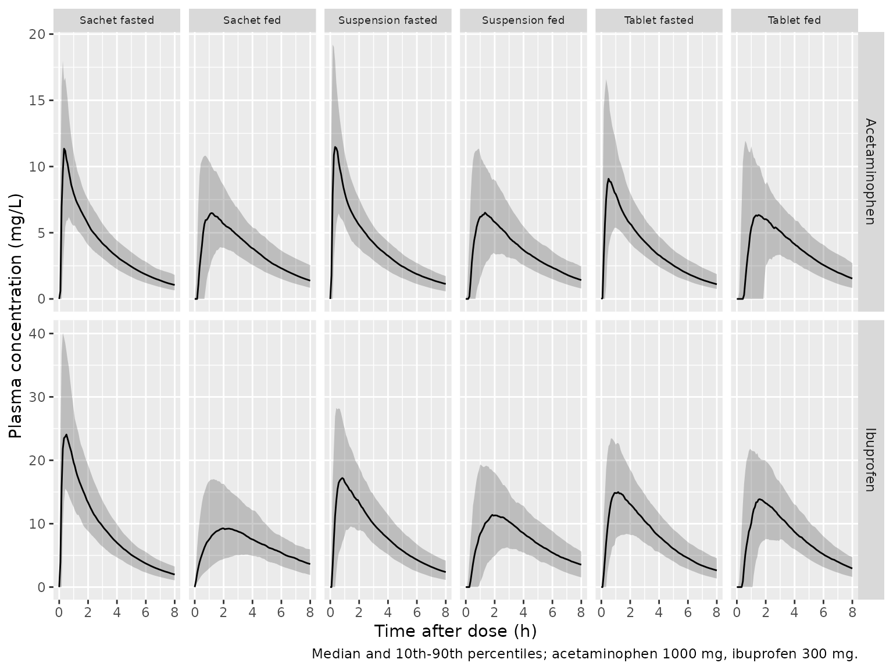
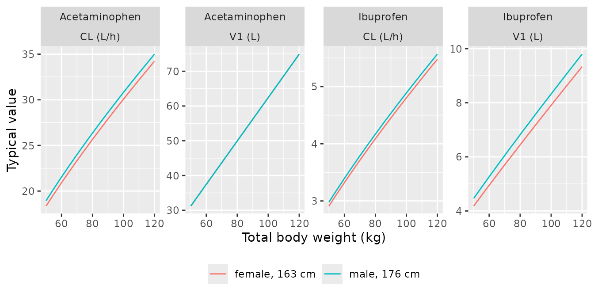

# Acetaminophen and ibuprofen formulation and food effects (Morse 2022)

## Model and source

Morse 2022 fitted two independent population PK models to the same
pooled healthy-volunteer data set, one for acetaminophen and one for
ibuprofen. Both are packaged here and share this article.

- Citation: Morse JD, Stanescu I, Atkinson HC, Anderson BJ. Population
  Pharmacokinetic Modelling of Acetaminophen and Ibuprofen: the
  Influence of Body Composition, Formulation and Feeding in Healthy
  Adult Volunteers. Eur J Drug Metab Pharmacokinet. 2022;47(4):497-507.
  <doi:10.1007/s13318-022-00766-9>
- Acetaminophen model: Two-compartment population PK model for
  acetaminophen (paracetamol) in healthy adult volunteers given
  intravenous, tablet, oral-suspension and sachet formulations of an
  acetaminophen + ibuprofen combination under fasted and fed conditions
  (Morse 2022). First-order absorption with a lag time from a depot;
  absorption half-life and lag time carry formulation-specific factors
  when fasted and formulation-specific factors when fed, all relative to
  the fasted tablet. Clearances scale allometrically (exponent 3/4) with
  normal fat mass (Ffat = 0.816) and volumes linearly with total body
  weight (Ffat fixed to 1), standardised to a 70 kg, 1.76 m male;
  fat-free mass is predicted from weight, height and sex
  (Janmahasatian). Combined additive + proportional residual error with
  between-subject variability on the residual magnitude.
- Ibuprofen model: Two-compartment population PK model for ibuprofen in
  healthy adult volunteers given intravenous, tablet, oral-suspension
  and sachet formulations of an acetaminophen + ibuprofen combination
  (and intravenous ibuprofen alone) under fasted and fed conditions
  (Morse 2022). First-order absorption with a lag time from a depot;
  absorption half-life and lag time carry formulation-specific factors
  when fasted and formulation-specific factors when fed, all relative to
  the fasted tablet. Clearances scale allometrically (exponent 3/4) with
  normal fat mass (Ffat = 0.863) and volumes linearly with normal fat
  mass (Ffat = 0.718), standardised to a 70 kg, 1.76 m male; fat-free
  mass is predicted from weight, height and sex (Janmahasatian).
  Combined additive + proportional residual error with between-subject
  variability on the residual magnitude.
- Article (open access): <https://doi.org/10.1007/s13318-022-00766-9>
- Electronic supplementary material (correlation matrices, Table S2; the
  pharmacodynamic parameters used for the pain-score simulations, Table
  S3):
  <https://static-content.springer.com/esm/art%3A10.1007%2Fs13318-022-00766-9/MediaObjects/13318_2022_766_MOESM1_ESM.pdf>

## Population

Data were pooled from four single-centre, single-dose, randomised
crossover studies in 116 healthy adults (Morse 2022 Section 2.1):
MXIV-01 (n = 30) and MXIV-06 (n = 30) compared intravenous acetaminophen
and ibuprofen (alone or combined, 15 min infusions; 30 min for the 400
mg ibuprofen product) with combination tablets, fasted; MX-14a (n = 28)
and MX-14b (n = 28) compared the combination as film-coated tablets,
ready-to-use oral suspension and a sachet (powder dissolved in 200 mL
water), fasted in MX-14a and fed in MX-14b. The pooled participants
(Table 1) were 18-49 years old (median 24), weighed 49-116 kg (median
70.8), were 156-199 cm tall (median 173) and 93 were male and 23 female.
The analysis used 6095 acetaminophen and 6046 ibuprofen concentrations.

The same information is available programmatically through each model’s
`population` metadata, e.g.
`readModelDb("Morse_2022_ibuprofen")()$population`.

## Model structure

Both drugs use a two-compartment disposition model with first-order
elimination. Oral doses enter a depot with bioavailability `F`, a lag
time `TLAG` and a first-order absorption rate `ka = ln(2) / T1/2ABS`;
intravenous doses are infusions into the central compartment.

*Size and body composition.* Fat-free mass is predicted from weight,
height and sex (Janmahasatian; Eq. 2). Normal fat mass is
`NFM = FFM + Ffat * (WT - FFM)` (Eqs. 3-4), and each parameter is scaled
by `(NFM / NFM_STD)^EXP` with `EXP` fixed at 3/4 for clearances and 1
for volumes (Eqs. 1 and 5). The standard individual is a 70 kg, 1.76 m
male whose FFM is 56.1 kg, so `NFM_STD = 56.1 + Ffat * (70 - 56.1)`.
Acetaminophen uses `Ffat = 0.816` for clearances and `Ffat = 1` (total
body weight) for volumes; ibuprofen uses 0.863 and 0.718.

*Formulation and food.* The fasted tablet is the reference for `T1/2ABS`
and `TLAG`. In the fasted state the suspension and the sachet each carry
their own factor; in the fed state each of the three oral formulations
carries its own factor, again relative to the fasted tablet (the fed
factor replaces, rather than multiplies, the fasted formulation factor).
The section “Which reference do the fed factors use?” below shows why.

*Residual error* is combined additive and proportional with a
between-subject random effect on its magnitude (Eq. 8):
`SD = sqrt((Cc * propSd)^2 + addSd^2) * exp(etaRUV)`.

## Source trace

Every `ini()` value carries an in-file source comment in
`inst/modeldb/specificDrugs/Morse_2022_acetaminophen.R` and
`inst/modeldb/specificDrugs/Morse_2022_ibuprofen.R`. They are collected
here.

| Parameter | Acetaminophen | Ibuprofen | Source |
|----|----|----|----|
| `lcl` (CL, L/h/70 kg) | 24.0 | 3.79 | Tables 2 / 3 |
| `lvc` (V1, L/70 kg) | 43.7 | 6.05 | Tables 2 / 3 |
| `lq` (Q2, L/h/70 kg) | 43.5 | 10.5 | Tables 2 / 3 |
| `lvp` (V2, L/70 kg) | 29.7 | 4.37 | Tables 2 / 3 |
| `lfdepot` (F) | 0.859 | 0.941 | Tables 2 / 3 (FPARA, FIBU) |
| `ltabs` (T1/2ABS, min) | 11.5 | 26.7 | Tables 2 / 3 |
| `ltlag` (TLAG, min) | 5.30 | 6.66 | Tables 2 / 3 |
| `ffat_cl` | 0.816 | 0.863 | Tables 2 / 3 (FFATCL) |
| `ffat_v` | 1 (fixed) | 0.718 | Tables 2 / 3 (FFATV) |
| `e_wt_cl`, `e_wt_vc` | 0.75, 1 (fixed) | 0.75, 1 (fixed) | Section 2.3 |
| `e_form_apapibu_susp_tabs` / `_tlag` | 0.394 / 0.743 | 0.719 / 0.984 | Tables 2 / 3 (F_FAST, suspension) |
| `e_form_powder_tabs` / `_tlag` | 0.462 / 0.845 | 0.235 / 0.539 | Tables 2 / 3 (F_FAST, sachet) |
| `e_fed_tabs_tablet` / `e_fed_tlag_tablet` | 1.87 / 4.63 | 1.59 / 3.65 | Tables 2 / 3 (F_FED, tablet) |
| `e_fed_tabs_susp` / `e_fed_tlag_susp` | 2.52 / 2.93 | 2.45 / 2.52 | Tables 2 / 3 (F_FED, suspension) |
| `e_fed_tabs_powder` / `e_fed_tlag_powder` | 2.30 / 2.10 | 3.79 / 0.178 | Tables 2 / 3 (F_FED, sachet) |
| IIV SD on CL, V1, Q2, V2 | 0.173, 0.537, 0.615, 0.466 | 0.221, 0.302, 0.660, 0.530 | Tables 2 / 3 (PPV%) |
| IIV correlations CL-V1-Q2-V2 | see model file | see model file | Supplementary Table S2 |
| IIV SD on F, T1/2ABS, TLAG | 0.145, 0.856, 0.960 | 0.051, 0.787, 0.809 | Tables 2 / 3 (PPV%) |
| `etaRUV` SD | 1.05 | 0.597 | Tables 2 / 3 (RUV PPV%) |
| `addSd` (mg/L) | 0.064 | 0.422 | Tables 2 / 3 (RUV ADD) |
| `propSd` | 0.070 | 0.240 | Tables 2 / 3 (RUV PROP) |
| FFM equation, WHS constants | – | – | Eq. 2 and Section 2.3 |
| NFM, NFM_STD, allometry | – | – | Eqs. 1, 3-5; Section 2.3 |
| Residual error with `etaRUV` | – | – | Eq. 8 |

The paper reports between-subject variability as `PPV% = sqrt(omega^2)`
(Section 2.4.1 and the table footnotes), so each variance is
`(PPV/100)^2`.

## Which reference do the fed factors use?

The table footnotes state that the fasted tablet is the baseline for
`T1/2ABS` and `TLAG`, but a reader could still multiply a fed factor
onto the fasted formulation factor. The two readings give very different
absorption for the fed suspension and sachet, and Table 4’s simulated
`TMAX` separates them. The check below solves the typical 70 kg, 1.76 m
male under each reading. The alternative reading is produced by
overriding the fed factors with the product of the fasted and fed
factors.

``` r

mod_apap <- readModelDb("Morse_2022_acetaminophen")
mod_ibu <- readModelDb("Morse_2022_ibuprofen")

scenarios <- tibble::tribble(
  ~formulation, ~FED,
  "Tablet", 0L,
  "Suspension", 0L,
  "Sachet", 0L,
  "Tablet", 1L,
  "Suspension", 1L,
  "Sachet", 1L
) |>
  mutate(
    scenario = paste(formulation, ifelse(FED == 1L, "fed", "fasted")),
    FORM_APAPIBU_SUSP = as.integer(formulation == "Suspension"),
    FORM_POWDER = as.integer(formulation == "Sachet")
  )

typical_events <- function(dose, tgrid = seq(0, 6, by = 1 / 120)) {
  doses <- scenarios |>
    mutate(id = row_number(), time = 0, amt = dose, evid = 1L, cmt = "depot")
  obs <- tidyr::crossing(doses |> select(-time, -amt, -evid, -cmt), time = tgrid) |>
    mutate(amt = 0, evid = 0L, cmt = "central")
  bind_rows(doses, obs) |>
    mutate(WT = 70, HT = 176, SEXF = 0L) |>
    arrange(id, time, desc(evid))
}

typical_tmax <- function(mod, dose, params = NULL) {
  ev <- typical_events(dose)
  s <- rxode2::rxSolve(rxode2::zeroRe(mod), ev,
    params = params,
    keep = "scenario", returnType = "data.frame"
  )
  s |>
    group_by(scenario) |>
    summarise(cmax = max(Cc), tmax = time[which.max(Cc)], .groups = "drop")
}

# Alternative: fed factor multiplied onto the fasted formulation factor
alt_params <- function(mod) {
  th <- rxode2::rxode(mod)$theta
  c(
    e_fed_tabs_susp = unname(th["e_fed_tabs_susp"] * th["e_form_apapibu_susp_tabs"]),
    e_fed_tlag_susp = unname(th["e_fed_tlag_susp"] * th["e_form_apapibu_susp_tlag"]),
    e_fed_tabs_powder = unname(th["e_fed_tabs_powder"] * th["e_form_powder_tabs"]),
    e_fed_tlag_powder = unname(th["e_fed_tlag_powder"] * th["e_form_powder_tlag"])
  )
}

table4 <- tibble::tribble(
  ~drug, ~scenario, ~cmax_med, ~cmax_p10, ~cmax_p90, ~tmax_med, ~tmax_p10, ~tmax_p90,
  "Acetaminophen", "Tablet fed", 10.9, 5.45, 19.8, 0.88, 0.42, 1.82,
  "Acetaminophen", "Suspension fed", 9.53, 4.81, 19.0, 1.10, 0.50, 2.17,
  "Acetaminophen", "Sachet fed", 9.91, 5.01, 19.4, 1.03, 0.51, 1.99,
  "Acetaminophen", "Tablet fasted", 12.8, 6.76, 24.2, 0.61, 0.26, 1.24,
  "Acetaminophen", "Suspension fasted", 15.08, 7.35, 31.2, 0.31, 0.13, 0.72,
  "Acetaminophen", "Sachet fasted", 14.4, 7.56, 28.6, 0.35, 0.16, 0.86,
  "Ibuprofen", "Tablet fed", 20.1, 10.3, 33.3, 1.2, 0.68, 2.17,
  "Ibuprofen", "Suspension fed", 16.2, 8.00, 30.3, 1.55, 0.82, 2.63,
  "Ibuprofen", "Sachet fed", 12.6, 6.14, 23.8, 1.90, 1.12, 3.21,
  "Ibuprofen", "Tablet fasted", 24.1, 13.3, 40.8, 0.94, 0.48, 1.67,
  "Ibuprofen", "Suspension fasted", 26.6, 14.8, 45.0, 0.77, 0.40, 1.50,
  "Ibuprofen", "Sachet fasted", 34.4, 20.8, 55.7, 0.38, 0.19, 0.80
)

interp <- bind_rows(
  full_join(
    typical_tmax(mod_apap, 1000) |> rename(cmax_packaged = cmax, tmax_packaged = tmax),
    typical_tmax(mod_apap, 1000, alt_params(mod_apap)) |>
      rename(cmax_alternative = cmax, tmax_alternative = tmax),
    by = "scenario"
  ) |> mutate(drug = "Acetaminophen"),
  full_join(
    typical_tmax(mod_ibu, 300) |> rename(cmax_packaged = cmax, tmax_packaged = tmax),
    typical_tmax(mod_ibu, 300, alt_params(mod_ibu)) |>
      rename(cmax_alternative = cmax, tmax_alternative = tmax),
    by = "scenario"
  ) |> mutate(drug = "Ibuprofen")
) |>
  left_join(table4 |> select(drug, scenario, cmax_med, tmax_med), by = c("drug", "scenario")) |>
  mutate(
    ratio_packaged = cmax_packaged / cmax_med,
    ratio_alternative = cmax_alternative / cmax_med
  )
#> ℹ parameter labels from comments will be replaced by 'label()'
#> Warning: No sigma parameters in the model
#> ℹ omega/sigma items treated as zero: 'etalcl', 'etalvc', 'etalq', 'etalvp', 'etalfdepot', 'etaltabs', 'etaltlag', 'etaRUV'
#> Warning: multi-subject simulation without without 'omega'
#> ℹ parameter labels from comments will be replaced by 'label()'
#> Warning: No sigma parameters in the model
#> ℹ parameter labels from comments will be replaced by 'label()'
#> ℹ omega/sigma items treated as zero: 'etalcl', 'etalvc', 'etalq', 'etalvp', 'etalfdepot', 'etaltabs', 'etaltlag', 'etaRUV'
#> Warning: multi-subject simulation without without 'omega'
#> ℹ parameter labels from comments will be replaced by 'label()'
#> Warning: No sigma parameters in the model
#> ℹ omega/sigma items treated as zero: 'etalcl', 'etalvc', 'etalq', 'etalvp', 'etalfdepot', 'etaltabs', 'etaltlag', 'etaRUV'
#> Warning: multi-subject simulation without without 'omega'
#> ℹ parameter labels from comments will be replaced by 'label()'
#> Warning: No sigma parameters in the model
#> ℹ parameter labels from comments will be replaced by 'label()'
#> ℹ omega/sigma items treated as zero: 'etalcl', 'etalvc', 'etalq', 'etalvp', 'etalfdepot', 'etaltabs', 'etaltlag', 'etaRUV'
#> Warning: multi-subject simulation without without 'omega'

interp |>
  select(drug, scenario, tmax_med, tmax_packaged, tmax_alternative, ratio_packaged, ratio_alternative) |>
  rename(
    "Drug" = drug,
    "Scenario" = scenario,
    "Table 4 median TMAX (h)" = tmax_med,
    "Typical TMAX, fed factor vs fasted tablet (h)" = tmax_packaged,
    "Typical TMAX, fed x fasted factors (h)" = tmax_alternative,
    "Typical CMAX / Table 4, fed factor vs fasted tablet" = ratio_packaged,
    "Typical CMAX / Table 4, fed x fasted factors" = ratio_alternative
  ) |>
  knitr::kable(digits = 2, caption = "Typical-value TMAX and CMAX (relative to the Table 4 median) under the two readings of the fed factors. The readings differ only for the fed suspension and fed sachet.")
```

| Drug | Scenario | Table 4 median TMAX (h) | Typical TMAX, fed factor vs fasted tablet (h) | Typical TMAX, fed x fasted factors (h) | Typical CMAX / Table 4, fed factor vs fasted tablet | Typical CMAX / Table 4, fed x fasted factors |
|:---|:---|---:|---:|---:|---:|---:|
| Acetaminophen | Sachet fasted | 0.35 | 0.35 | 0.35 | 0.94 | 0.94 |
| Acetaminophen | Sachet fed | 1.03 | 1.05 | 0.65 | 0.84 | 1.09 |
| Acetaminophen | Suspension fasted | 0.31 | 0.32 | 0.32 | 0.93 | 0.93 |
| Acetaminophen | Suspension fed | 1.10 | 1.19 | 0.67 | 0.84 | 1.16 |
| Acetaminophen | Tablet fasted | 0.61 | 0.57 | 0.57 | 0.86 | 0.86 |
| Acetaminophen | Tablet fed | 0.88 | 1.15 | 1.15 | 0.82 | 0.82 |
| Ibuprofen | Sachet fasted | 0.38 | 0.34 | 0.34 | 0.81 | 0.81 |
| Ibuprofen | Sachet fed | 1.90 | 2.44 | 0.84 | 0.82 | 1.46 |
| Ibuprofen | Suspension fasted | 0.77 | 0.80 | 0.80 | 0.74 | 0.74 |
| Ibuprofen | Suspension fed | 1.55 | 2.12 | 1.74 | 0.78 | 0.89 |
| Ibuprofen | Tablet fasted | 0.94 | 1.03 | 1.03 | 0.73 | 0.73 |
| Ibuprofen | Tablet fed | 1.20 | 1.76 | 1.76 | 0.74 | 0.74 |

Typical-value TMAX and CMAX (relative to the Table 4 median) under the
two readings of the fed factors. The readings differ only for the fed
suspension and fed sachet. {.table}

``` r


# Deterministic (no random effects). Fasted rows do not depend on the
# reading, so their CMAX ratio is the yardstick for the fed rows.
fasted_ratio <- interp |>
  filter(grepl("fasted", scenario)) |>
  group_by(drug) |>
  summarise(yardstick = median(ratio_packaged), .groups = "drop")
fed_test <- interp |>
  filter(grepl("fed", scenario), !grepl("Tablet", scenario)) |>
  left_join(fasted_ratio, by = "drug")
stopifnot(
  # Summed TMAX error over the four discriminating rows
  sum(abs(fed_test$tmax_packaged - fed_test$tmax_med)) <
    sum(abs(fed_test$tmax_alternative - fed_test$tmax_med)),
  # Fed CMAX ratios stay close to the drug's fasted ratio only under the
  # packaged reading
  max(abs(fed_test$ratio_packaged - fed_test$yardstick)) <
    max(abs(fed_test$ratio_alternative - fed_test$yardstick))
)
```

The printed parameters do not reproduce the Table 4 `CMAX` medians
exactly under either reading (the next sections discuss why), but the
fasted rows, which do not depend on the reading, show how far off they
are: a median of about 0.93 of Table 4 for acetaminophen and 0.74 for
ibuprofen at the typical-value level. Under the packaged reading (each
fed factor relative to the fasted tablet) the fed suspension and sachet
rows stay within 0.09 of those ratios, and the summed `TMAX` error over
the four rows is smaller. Under the alternative the ibuprofen fed sachet
would peak at 0.8 h with a `CMAX` 1.46 times the published median,
whereas Table 4 shows it as the slowest and lowest of all oral
scenarios. The alternative is closer only for the ibuprofen fed
suspension `TMAX`, where the fasted suspension factors (0.719 and 0.984)
are near 1 and the two readings barely differ. The packaged reading also
matches the abstract (“Feeding increased both absorption half-life and
absorption lag time when compared to the tablet formulation under
fasting conditions”).

## Virtual cohort

Table 4 was simulated from the pooled demographics resampled with
replacement. The individual data are not public, so the virtual cohort
draws sex, weight and height to match Table 1: 23 of 116 female,
log-normal weight around the 70.8 kg median truncated to the observed
49-116 kg, and normal height with sex-specific means truncated to the
observed 156-199 cm. Each of the six oral scenarios has its own cohort
of 200 participants, for each drug.

``` r

# set.seed() fixes the covariate draws below. rxode2's random effects use
# their own RNG (rxSetSeed), whose stream depends on the number of solver
# threads, so the simulated cohort differs between machines. Every assertion
# below is on a cohort median and has headroom for that.
set.seed(20220402)
rxode2::rxSetSeed(20220402)

n_per_arm <- 200L
clinical_grid <- c(5, 15, 30, 45) / 60
clinical_grid <- c(clinical_grid, 1, 1.25, 1.5, 2, 3, 6, 8, 10, 12)
fine_grid <- seq(0, 12, by = 1 / 12)

make_cohort <- function(i, dose, id_offset) {
  sc <- scenarios[i, ]
  sexf <- rbinom(n_per_arm, 1, 23 / 116)
  covs <- tibble(
    id = id_offset + seq_len(n_per_arm),
    SEXF = sexf,
    WT = pmin(pmax(exp(rnorm(n_per_arm, log(70.8), 0.17)), 49), 116),
    HT = pmin(pmax(rnorm(n_per_arm, ifelse(sexf == 1, 163, 175), 7), 156), 199),
    FED = sc$FED,
    FORM_APAPIBU_SUSP = sc$FORM_APAPIBU_SUSP,
    FORM_POWDER = sc$FORM_POWDER,
    scenario = sc$scenario
  )
  doses <- covs |> mutate(time = 0, amt = dose, evid = 1L, cmt = "depot")
  obs <- tidyr::crossing(covs, time = sort(unique(c(fine_grid, clinical_grid)))) |>
    mutate(amt = 0, evid = 0L, cmt = "central")
  bind_rows(doses, obs) |> arrange(id, time, desc(evid))
}

make_events <- function(dose) {
  bind_rows(lapply(seq_len(nrow(scenarios)), function(i) {
    make_cohort(i, dose, id_offset = (i - 1L) * n_per_arm)
  }))
}

events_apap <- make_events(1000)
events_ibu <- make_events(300)
stopifnot(!anyDuplicated(events_apap[, c("id", "time", "evid")]))
```

## Simulation

``` r

sim_apap <- rxode2::rxSolve(mod_apap, events_apap,
  keep = "scenario", returnType = "data.frame"
)
#> ℹ parameter labels from comments will be replaced by 'label()'
sim_ibu <- rxode2::rxSolve(mod_ibu, events_ibu,
  keep = "scenario", returnType = "data.frame"
)
#> ℹ parameter labels from comments will be replaced by 'label()'
sim_all <- bind_rows(
  sim_apap |> mutate(drug = "Acetaminophen"),
  sim_ibu |> mutate(drug = "Ibuprofen")
)
```

### Concentration-time profiles by formulation and food

``` r

sim_all |>
  filter(time <= 8) |>
  group_by(drug, scenario, time) |>
  summarise(
    Q10 = quantile(Cc, 0.10),
    Q50 = median(Cc),
    Q90 = quantile(Cc, 0.90),
    .groups = "drop"
  ) |>
  ggplot(aes(time, Q50)) +
  geom_ribbon(aes(ymin = Q10, ymax = Q90), alpha = 0.25) +
  geom_line() +
  facet_grid(drug ~ scenario, scales = "free_y") +
  labs(
    x = "Time after dose (h)", y = "Plasma concentration (mg/L)",
    caption = "Median and 10th-90th percentiles; acetaminophen 1000 mg, ibuprofen 300 mg."
  ) +
  theme(strip.text.x = element_text(size = 7))
```



## Replicate Table 4: simulated CMAX and TMAX

Table 4 reports medians and 10th / 90th percentiles of simulated `CMAX`
and `TMAX` after acetaminophen 1000 mg and ibuprofen 300 mg. Two
summaries of the virtual cohort are shown: the noise-free individual
prediction on a 5 min grid, and the observation with residual error read
off the paper’s sampling grid (Section 2.7). The largest observation on
a sparse grid overstates the true peak when the residual error is large,
which matters for ibuprofen (proportional error 24% with 60%
between-subject variability on its magnitude).

``` r

cmax_tmax <- function(d, value) {
  d |>
    group_by(drug, scenario, id) |>
    summarise(cmax = max(.data[[value]]), tmax = time[which.max(.data[[value]])], .groups = "drop") |>
    group_by(drug, scenario) |>
    summarise(
      cmax_med = median(cmax), cmax_p10 = quantile(cmax, 0.1), cmax_p90 = quantile(cmax, 0.9),
      tmax_med = median(tmax), tmax_p10 = quantile(tmax, 0.1), tmax_p90 = quantile(tmax, 0.9),
      .groups = "drop"
    )
}

on_clinical_grid <- sim_all |>
  filter(round(time * 60) %in% round(clinical_grid * 60))

sim_ipred <- cmax_tmax(sim_all, "Cc")
sim_obs <- cmax_tmax(on_clinical_grid, "sim")

fmt <- function(m, lo, hi, digits) {
  sprintf(paste0("%.", digits, "f (%.", digits, "f, %.", digits, "f)"), m, lo, hi)
}

table4_cmp <- table4 |>
  left_join(sim_ipred, by = c("drug", "scenario"), suffix = c("", "_ipred")) |>
  left_join(sim_obs, by = c("drug", "scenario"), suffix = c("", "_obs"))

table4_cmp |>
  transmute(
    drug, scenario,
    cmax_pub = fmt(cmax_med, cmax_p10, cmax_p90, 1),
    cmax_ipred = fmt(cmax_med_ipred, cmax_p10_ipred, cmax_p90_ipred, 1),
    cmax_obs = fmt(cmax_med_obs, cmax_p10_obs, cmax_p90_obs, 1),
    tmax_pub = fmt(tmax_med, tmax_p10, tmax_p90, 2),
    tmax_ipred = fmt(tmax_med_ipred, tmax_p10_ipred, tmax_p90_ipred, 2),
    tmax_obs = fmt(tmax_med_obs, tmax_p10_obs, tmax_p90_obs, 2)
  ) |>
  rename(
    "Drug" = drug,
    "Scenario" = scenario,
    "CMAX Table 4 (mg/L)" = cmax_pub,
    "CMAX simulated, IPRED (mg/L)" = cmax_ipred,
    "CMAX simulated, with RUV on sampling grid (mg/L)" = cmax_obs,
    "TMAX Table 4 (h)" = tmax_pub,
    "TMAX simulated, IPRED (h)" = tmax_ipred,
    "TMAX simulated, with RUV on sampling grid (h)" = tmax_obs
  ) |>
  knitr::kable(caption = "Median (10th, 90th percentile) CMAX and TMAX: Table 4 of Morse 2022 versus the packaged models.")
```

| Drug | Scenario | CMAX Table 4 (mg/L) | CMAX simulated, IPRED (mg/L) | CMAX simulated, with RUV on sampling grid (mg/L) | TMAX Table 4 (h) | TMAX simulated, IPRED (h) | TMAX simulated, with RUV on sampling grid (h) |
|:---|:---|:---|:---|:---|:---|:---|:---|
| Acetaminophen | Tablet fed | 10.9 (5.5, 19.8) | 7.8 (4.6, 14.5) | 7.7 (4.3, 15.5) | 0.88 (0.42, 1.82) | 1.50 (0.58, 3.50) | 1.50 (0.50, 3.00) |
| Acetaminophen | Suspension fed | 9.5 (4.8, 19.0) | 7.0 (4.0, 12.0) | 7.2 (4.2, 13.1) | 1.10 (0.50, 2.17) | 1.33 (0.66, 2.83) | 1.25 (0.75, 3.00) |
| Acetaminophen | Sachet fed | 9.9 (5.0, 19.4) | 7.2 (4.6, 12.5) | 7.5 (4.4, 13.1) | 1.03 (0.51, 1.99) | 1.25 (0.50, 2.76) | 1.25 (0.50, 3.00) |
| Acetaminophen | Tablet fasted | 12.8 (6.8, 24.2) | 10.2 (5.9, 17.8) | 10.8 (6.3, 18.6) | 0.61 (0.26, 1.24) | 0.58 (0.25, 1.26) | 0.75 (0.25, 1.25) |
| Acetaminophen | Suspension fasted | 15.1 (7.3, 31.2) | 12.8 (7.2, 19.8) | 13.3 (7.2, 20.3) | 0.31 (0.13, 0.72) | 0.33 (0.17, 0.75) | 0.50 (0.25, 1.00) |
| Acetaminophen | Sachet fasted | 14.4 (7.6, 28.6) | 12.8 (7.0, 19.4) | 12.7 (7.3, 20.0) | 0.35 (0.16, 0.86) | 0.42 (0.17, 0.75) | 0.50 (0.25, 1.00) |
| Ibuprofen | Tablet fed | 20.1 (10.3, 33.3) | 15.3 (8.6, 23.2) | 18.3 (8.8, 28.3) | 1.20 (0.68, 2.17) | 1.75 (0.83, 3.00) | 1.50 (1.00, 3.00) |
| Ibuprofen | Suspension fed | 16.2 (8.0, 30.3) | 12.7 (6.7, 20.9) | 14.1 (7.0, 25.6) | 1.55 (0.82, 2.63) | 2.12 (1.00, 3.92) | 2.00 (1.00, 3.00) |
| Ibuprofen | Sachet fed | 12.6 (6.1, 23.8) | 9.9 (5.4, 17.7) | 11.3 (6.0, 22.0) | 1.90 (1.12, 3.21) | 2.54 (1.17, 4.33) | 2.00 (0.98, 6.00) |
| Ibuprofen | Tablet fasted | 24.1 (13.3, 40.8) | 16.0 (8.9, 25.7) | 19.2 (10.4, 32.1) | 0.94 (0.48, 1.67) | 1.25 (0.58, 2.42) | 1.25 (0.50, 2.00) |
| Ibuprofen | Suspension fasted | 26.6 (14.8, 45.0) | 18.9 (10.4, 30.5) | 23.2 (12.1, 37.0) | 0.77 (0.40, 1.50) | 0.92 (0.42, 2.01) | 1.00 (0.50, 2.00) |
| Ibuprofen | Sachet fasted | 34.4 (20.8, 55.7) | 27.1 (17.5, 44.5) | 30.5 (18.4, 53.1) | 0.38 (0.19, 0.80) | 0.42 (0.17, 0.75) | 0.50 (0.25, 1.02) |

Median (10th, 90th percentile) CMAX and TMAX: Table 4 of Morse 2022
versus the packaged models. {.table style="width:100%;"}

``` r

chk <- table4_cmp |>
  mutate(
    cmax_ratio_obs = cmax_med_obs / cmax_med,
    tmax_ratio_ipred = tmax_med_ipred / tmax_med
  )
knitr::kable(
  chk |>
    select(drug, scenario, cmax_ratio_obs, tmax_ratio_ipred) |>
    rename(
      "Drug" = drug,
      "Scenario" = scenario,
      "CMAX ratio, simulated with RUV / Table 4" = cmax_ratio_obs,
      "TMAX ratio, simulated IPRED / Table 4" = tmax_ratio_ipred
    ),
  digits = 2,
  caption = "Ratios of the simulated medians to the Table 4 medians."
)
```

| Drug | Scenario | CMAX ratio, simulated with RUV / Table 4 | TMAX ratio, simulated IPRED / Table 4 |
|:---|:---|---:|---:|
| Acetaminophen | Tablet fed | 0.71 | 1.70 |
| Acetaminophen | Suspension fed | 0.76 | 1.21 |
| Acetaminophen | Sachet fed | 0.75 | 1.21 |
| Acetaminophen | Tablet fasted | 0.84 | 0.96 |
| Acetaminophen | Suspension fasted | 0.88 | 1.08 |
| Acetaminophen | Sachet fasted | 0.88 | 1.19 |
| Ibuprofen | Tablet fed | 0.91 | 1.46 |
| Ibuprofen | Suspension fed | 0.87 | 1.37 |
| Ibuprofen | Sachet fed | 0.90 | 1.34 |
| Ibuprofen | Tablet fasted | 0.80 | 1.33 |
| Ibuprofen | Suspension fasted | 0.87 | 1.19 |
| Ibuprofen | Sachet fasted | 0.89 | 1.10 |

Ratios of the simulated medians to the Table 4 medians. {.table}

``` r

# Medians over the 12 cells. The packaged models run about 15% below the
# Table 4 CMAX medians (see text); a mis-transcribed volume, bioavailability,
# dose or unit moves CMAX by a factor approaching 2 and leaves this band.
# TMAX: the fed scenarios run later than Table 4; a swapped fed-factor
# reference or a minutes-for-hours slip moves the median ratio far outside.
stopifnot(
  median(chk$cmax_ratio_obs) > 0.70,
  median(chk$cmax_ratio_obs) < 1.00,
  median(chk$tmax_ratio_ipred) > 0.85,
  median(chk$tmax_ratio_ipred) < 1.50
)
```

The simulated `CMAX` medians (with residual error, on the sampling grid)
are about 10-30% lower than Table 4, and the fed `TMAX` medians are
20-70% later; the fasted acetaminophen `TMAX` medians agree to within
20%. The packaged parameters were not adjusted. Two observations from
the paper itself suggest that Table 4 does not follow directly from the
printed parameters:

- Even for the typical individual (no random effects), the printed
  parameters give an acetaminophen fasted-tablet `CMAX` of about 11.0
  mg/L and an ibuprofen fasted-tablet `CMAX` of about 17.6 mg/L, below
  the Table 4 medians of 12.8 and 24.1 mg/L.
- Table 4’s upper percentiles exceed the observed concentrations in
  Supplementary Figures S3 and S4. The ibuprofen sachet 90th percentile
  is 55.7 mg/L, while no observed sachet concentration (fasted and fed
  pooled) exceeds about 38 mg/L; the fasted ibuprofen suspension median
  is 26.6 mg/L, about the largest observed suspension concentration. The
  simulated percentiles from the packaged models sit inside the observed
  ranges.

The ordering of the scenarios (fasted sachet and suspension fastest;
feeding lowering `CMAX` and delaying `TMAX` for every formulation) is
reproduced.

## PKNCA validation

PKNCA on the noise-free individual predictions, grouped by drug and
scenario. The paper reports no NCA of its own beyond Table 4, so the
PKNCA medians are compared with the Table 4 medians.

``` r

sim_nca <- sim_all |>
  filter(!is.na(Cc)) |>
  select(id, time, Cc, drug, scenario)
sim_nca <- bind_rows(
  sim_nca,
  sim_nca |> distinct(id, drug, scenario) |> mutate(time = 0, Cc = 0)
) |>
  distinct(id, drug, scenario, time, .keep_all = TRUE) |>
  arrange(drug, scenario, id, time)

dose_nca <- bind_rows(
  events_apap |> filter(evid == 1) |> mutate(drug = "Acetaminophen"),
  events_ibu |> filter(evid == 1) |> mutate(drug = "Ibuprofen")
) |>
  select(id, time, amt, drug, scenario)

conc_obj <- PKNCA::PKNCAconc(sim_nca, Cc ~ time | drug + scenario + id)
dose_obj <- PKNCA::PKNCAdose(dose_nca, amt ~ time | drug + scenario + id)
intervals <- data.frame(
  start = 0, end = 12,
  cmax = TRUE, tmax = TRUE, auclast = TRUE
)
nca_res <- PKNCA::pk.nca(PKNCA::PKNCAdata(conc_obj, dose_obj, intervals = intervals))

reference <- table4 |>
  transmute(drug, scenario, cmax = cmax_med, tmax = tmax_med)

cmp <- nlmixr2lib::ncaComparisonTable(
  simulated = nca_res,
  reference = reference,
  by = c("drug", "scenario"),
  units = c(cmax = "mg/L", tmax = "h"),
  tolerance_pct = 20
)
knitr::kable(cmp, caption = "PKNCA medians of the noise-free simulations versus the Table 4 medians. * differs from the reference by more than 20%.")
```

| NCA parameter | drug          | scenario          | Reference | Simulated | % diff   |
|:--------------|:--------------|:------------------|:----------|:----------|:---------|
| Cmax (mg/L)   | Acetaminophen | Tablet fed        | 10.9      | 7.78      | -28.6%\* |
| Cmax (mg/L)   | Acetaminophen | Suspension fed    | 9.53      | 7.01      | -26.5%\* |
| Cmax (mg/L)   | Acetaminophen | Sachet fed        | 9.91      | 7.22      | -27.1%\* |
| Cmax (mg/L)   | Acetaminophen | Tablet fasted     | 12.8      | 10.2      | -20.3%\* |
| Cmax (mg/L)   | Acetaminophen | Suspension fasted | 15.1      | 12.8      | -14.9%   |
| Cmax (mg/L)   | Acetaminophen | Sachet fasted     | 14.4      | 12.8      | -10.9%   |
| Cmax (mg/L)   | Ibuprofen     | Tablet fed        | 20.1      | 15.3      | -24.1%\* |
| Cmax (mg/L)   | Ibuprofen     | Suspension fed    | 16.2      | 12.7      | -21.7%\* |
| Cmax (mg/L)   | Ibuprofen     | Sachet fed        | 12.6      | 9.86      | -21.8%\* |
| Cmax (mg/L)   | Ibuprofen     | Tablet fasted     | 24.1      | 16        | -33.5%\* |
| Cmax (mg/L)   | Ibuprofen     | Suspension fasted | 26.6      | 18.9      | -28.9%\* |
| Cmax (mg/L)   | Ibuprofen     | Sachet fasted     | 34.4      | 27.1      | -21.2%\* |
| Tmax (h)      | Acetaminophen | Tablet fed        | 0.88      | 1.5       | +70.5%\* |
| Tmax (h)      | Acetaminophen | Suspension fed    | 1.1       | 1.33      | +21.2%\* |
| Tmax (h)      | Acetaminophen | Sachet fed        | 1.03      | 1.25      | +21.4%\* |
| Tmax (h)      | Acetaminophen | Tablet fasted     | 0.61      | 0.583     | -4.4%    |
| Tmax (h)      | Acetaminophen | Suspension fasted | 0.31      | 0.333     | +7.5%    |
| Tmax (h)      | Acetaminophen | Sachet fasted     | 0.35      | 0.417     | +19.0%   |
| Tmax (h)      | Ibuprofen     | Tablet fed        | 1.2       | 1.75      | +45.8%\* |
| Tmax (h)      | Ibuprofen     | Suspension fed    | 1.55      | 2.12      | +37.1%\* |
| Tmax (h)      | Ibuprofen     | Sachet fed        | 1.9       | 2.54      | +33.8%\* |
| Tmax (h)      | Ibuprofen     | Tablet fasted     | 0.94      | 1.25      | +33.0%\* |
| Tmax (h)      | Ibuprofen     | Suspension fasted | 0.77      | 0.917     | +19.0%   |
| Tmax (h)      | Ibuprofen     | Sachet fasted     | 0.38      | 0.417     | +9.6%    |

PKNCA medians of the noise-free simulations versus the Table 4 medians.
\* differs from the reference by more than 20%. {.table}

The starred rows are the `CMAX` and fed `TMAX` differences discussed in
the previous section. The noise-free `CMAX` medians are lower than the
residual-error summaries above, because the largest of several noisy
observations overstates the true peak. Table 4’s footnote says `CMAX`
and `TMAX` were calculated from simulations; it does not say whether
residual error was included.

## Total body composition: typical clearance and volume across weight

``` r

size_grid <- tidyr::crossing(WT = seq(50, 120, by = 5), SEXF = c(0L, 1L)) |>
  mutate(id = row_number(), HT = ifelse(SEXF == 1L, 163, 176), time = 0, amt = 0, evid = 0L, cmt = "central",
         FED = 0L, FORM_APAPIBU_SUSP = 0L, FORM_POWDER = 0L)
size_par <- bind_rows(
  rxode2::rxSolve(rxode2::zeroRe(mod_apap), size_grid, keep = c("WT", "SEXF"), returnType = "data.frame") |>
    mutate(drug = "Acetaminophen"),
  rxode2::rxSolve(rxode2::zeroRe(mod_ibu), size_grid, keep = c("WT", "SEXF"), returnType = "data.frame") |>
    mutate(drug = "Ibuprofen")
) |>
  select(drug, WT, SEXF, cl, vc) |>
  tidyr::pivot_longer(c(cl, vc), names_to = "parameter") |>
  mutate(parameter = ifelse(parameter == "cl", "CL (L/h)", "V1 (L)"), sex = ifelse(SEXF == 1, "female, 163 cm", "male, 176 cm"))
#> ℹ parameter labels from comments will be replaced by 'label()'
#> Warning: No sigma parameters in the model
#> ℹ omega/sigma items treated as zero: 'etalcl', 'etalvc', 'etalq', 'etalvp', 'etalfdepot', 'etaltabs', 'etaltlag', 'etaRUV'
#> Warning: multi-subject simulation without without 'omega'
#> ℹ parameter labels from comments will be replaced by 'label()'
#> Warning: No sigma parameters in the model
#> ℹ omega/sigma items treated as zero: 'etalcl', 'etalvc', 'etalq', 'etalvp', 'etalfdepot', 'etaltabs', 'etaltlag', 'etaRUV'
#> Warning: multi-subject simulation without without 'omega'

ggplot(size_par, aes(WT, value, colour = sex)) +
  geom_line() +
  facet_wrap(drug ~ parameter, scales = "free_y", nrow = 1) +
  labs(x = "Total body weight (kg)", y = "Typical value", colour = NULL) +
  theme(legend.position = "bottom")
```



## Pain-score simulation (Supplementary Table S4)

Morse 2022 simulated the time to a 2-point reduction in a 0-10 pain
score for a typical 70 kg individual, using the PK models above and the
acetaminophen + ibuprofen pharmacodynamic model of Hannam 2018
(*Paediatr Anaesth* 28:841-851, reproduced as Supplementary Table S3).
The pharmacodynamic model belongs to Hannam 2018 and is not part of the
packaged models; it is coded here only to check the absorption
parameters against Supplementary Table S4. Each drug is simulated alone
with an effect compartment and a sigmoid Emax model,
`E = EMAX * Ce^HILL / (C50^HILL + Ce^HILL)`, and the pain-score
reduction is taken as `10 * E` (a baseline of 10 is an assumption; the
supplement does not state the baseline score).

``` r

# Hannam 2018 parameters (Supplementary Table S3) enter as data columns:
# tkeo = equilibration half-time (h), c50 (mg/L); EMAX 0.648 and HILL 1.48
# are shared by both drugs.
pd_layer <- function(mod) {
  mod |>
    rxode2::zeroRe() |>
    rxode2::model(d / dt(ce) <- log(2) / tkeo * (Cc - ce), append = TRUE) |>
    rxode2::model(pain_red <- 10 * 0.648 * ce^1.48 / (c50^1.48 + ce^1.48), append = TRUE)
}

time_to_2 <- function(mod, dose, tkeo, c50, params = NULL) {
  ev <- typical_events(dose, tgrid = seq(0, 3, by = 1 / 600)) |>
    filter(FED == 0L) |>
    mutate(tkeo = tkeo, c50 = c50)
  s <- rxode2::rxSolve(mod, ev, params = params, keep = "scenario", returnType = "data.frame")
  s |>
    group_by(scenario) |>
    summarise(minutes = 60 * time[which(pain_red >= 2)[1]], .groups = "drop")
}

pd_apap <- pd_layer(mod_apap)
#> ℹ parameter labels from comments will be replaced by 'label()'
#> Warning: No sigma parameters in the model
#> ℹ promote `tkeo` to population parameter with initial estimate 1
pd_ibu <- pd_layer(mod_ibu)
#> ℹ parameter labels from comments will be replaced by 'label()'
#> Warning: No sigma parameters in the model
#> ℹ promote `tkeo` to population parameter with initial estimate 1
no_lag <- c(ltlag = log(1e-6))

pain <- bind_rows(
  full_join(time_to_2(pd_apap, 1000, 0.34, 7.06) |> rename(with_lag = minutes),
    time_to_2(pd_apap, 1000, 0.34, 7.06, no_lag) |> rename(no_lag = minutes),
    by = "scenario"
  ) |> mutate(drug = "Acetaminophen"),
  full_join(time_to_2(pd_ibu, 300, 1.04, 3.95) |> rename(with_lag = minutes),
    time_to_2(pd_ibu, 300, 1.04, 3.95, no_lag) |> rename(no_lag = minutes),
    by = "scenario"
  ) |> mutate(drug = "Ibuprofen")
) |>
  left_join(
    tibble::tribble(
      ~drug, ~scenario, ~published,
      "Acetaminophen", "Tablet fasted", 21.8,
      "Acetaminophen", "Suspension fasted", 14.3,
      "Acetaminophen", "Sachet fasted", 15.0,
      "Ibuprofen", "Tablet fasted", 24.0,
      "Ibuprofen", "Suspension fasted", 24.8,
      "Ibuprofen", "Sachet fasted", 14.3
    ),
    by = c("drug", "scenario")
  )
#> ℹ omega/sigma items treated as zero: 'etalcl', 'etalvc', 'etalq', 'etalvp', 'etalfdepot', 'etaltabs', 'etaltlag', 'etaRUV'
#> Warning: multi-subject simulation without without 'omega'
#> ℹ omega/sigma items treated as zero: 'etalcl', 'etalvc', 'etalq', 'etalvp', 'etalfdepot', 'etaltabs', 'etaltlag', 'etaRUV'
#> Warning: multi-subject simulation without without 'omega'
#> ℹ omega/sigma items treated as zero: 'etalcl', 'etalvc', 'etalq', 'etalvp', 'etalfdepot', 'etaltabs', 'etaltlag', 'etaRUV'
#> Warning: multi-subject simulation without without 'omega'
#> ℹ omega/sigma items treated as zero: 'etalcl', 'etalvc', 'etalq', 'etalvp', 'etalfdepot', 'etaltabs', 'etaltlag', 'etaRUV'
#> Warning: multi-subject simulation without without 'omega'

pain |>
  select(drug, scenario, published, with_lag, no_lag) |>
  rename(
    "Drug" = drug,
    "Scenario" = scenario,
    "Table S4 (min)" = published,
    "Simulated, with lag time (min)" = with_lag,
    "Simulated, lag time removed (min)" = no_lag
  ) |>
  knitr::kable(digits = 1, caption = "Time to a 2-point pain-score reduction for a typical 70 kg individual, fasted.")
```

| Drug | Scenario | Table S4 (min) | Simulated, with lag time (min) | Simulated, lag time removed (min) |
|:---|:---|---:|---:|---:|
| Acetaminophen | Sachet fasted | 15.0 | 19.6 | 15.2 |
| Acetaminophen | Suspension fasted | 14.3 | 18.2 | 14.2 |
| Acetaminophen | Tablet fasted | 21.8 | 27.0 | 21.7 |
| Ibuprofen | Sachet fasted | 14.3 | 15.7 | 12.1 |
| Ibuprofen | Suspension fasted | 24.8 | 27.2 | 20.6 |
| Ibuprofen | Tablet fasted | 24.0 | 31.2 | 24.5 |

Time to a 2-point pain-score reduction for a typical 70 kg individual,
fasted. {.table}

``` r


# Deterministic typical-value checks: with the lag time every time is within
# 10 min of Supplementary Table S4; without it the acetaminophen times are
# within 1 min.
acet_no_lag <- pain |> filter(drug == "Acetaminophen")
stopifnot(
  all(abs(pain$with_lag - pain$published) < 10),
  all(abs(acet_no_lag$no_lag - acet_no_lag$published) < 1)
)
```

The acetaminophen times in Supplementary Table S4 are reproduced to
within 0.2 min when the lag time is removed from the simulation, and are
about 4-5 min later with the lag time. This suggests the published
pain-score simulations omitted the absorption lag time for
acetaminophen. The ibuprofen tablet is also reproduced (to within 0.5
min) without the lag time, but the ibuprofen suspension and sachet are
not reproduced by either variant; the source of that difference could
not be identified from the paper.

## Assumptions and deviations

- **Scaling of Q2 and V2.** The paper gives the size and
  body-composition model for “clearance” and “volume of distribution”
  (Eqs. 1-5) and reports Q2 in L/h/70 kg and V2 in L/70 kg. The packaged
  models apply the clearance size factor (Ffat for CL, exponent 3/4) to
  Q2 and the volume size factor (Ffat for V, exponent 1) to V2, which is
  the usual convention of this group of authors.
- **NFM standard value.** `NFM_STD = 56.1 + Ffat * (70 - 56.1)` follows
  the paper’s definition (a 70 kg, 1.76 m male with FFM 56.1 kg). The
  packaged Janmahasatian equation gives 56.1 kg for that individual.
- **Random effect on bioavailability.** Eq. 6 states that every random
  effect is exponential, so `F = F_pop * exp(eta)`. With the ibuprofen
  `F = 0.941` and a 5.1% PPV, about one subject in eight has an
  individual `F` slightly above 1. The paper does not report a logit or
  capped form.
- **Residual error.** Eq. 8 writes the proportional term on the
  observation (`Obs`); it is implemented on the model prediction, as
  NONMEM residual error models are. The additive and proportional SDs
  are combined as a sum of variances, as in Eq. 8, and both are scaled
  by `exp(etaRUV)`.
- **Tablet strengths.** The 500/150 mg and 325/97.5 mg film-coated
  tablets are modelled as one tablet formulation, as in the paper.
- **Abstract values.** The abstract gives the acetaminophen and
  ibuprofen central volumes as 43.5 and 10.5 L/70 kg; those are the Q2
  values of Tables 2 and 3. The packaged models use the table values (V1
  43.7 and 6.05 L/70 kg). The abstract and Discussion also give the
  acetaminophen bioavailability as 86% and 87%; Table 2 gives 0.859,
  which is used.
- **Ibuprofen RUV PROP.** Table 3 prints 24.0% with a bootstrap 95% CI
  of 19.9-22.1%, which excludes the estimate; the point estimate is
  used.
- **Virtual cohort.** Weight, height and sex are drawn to match Table 1
  (no individual demographics are published). Ages are not needed by the
  models.
- **Pain-score model.** The Hannam 2018 pharmacodynamic layer is used
  only in this article, with an assumed baseline pain score of 10, to
  check Supplementary Table S4. It is not part of the packaged models.
- **Errata.** No correction notice for this article was found in Europe
  PMC (checked 2026-10-02).
