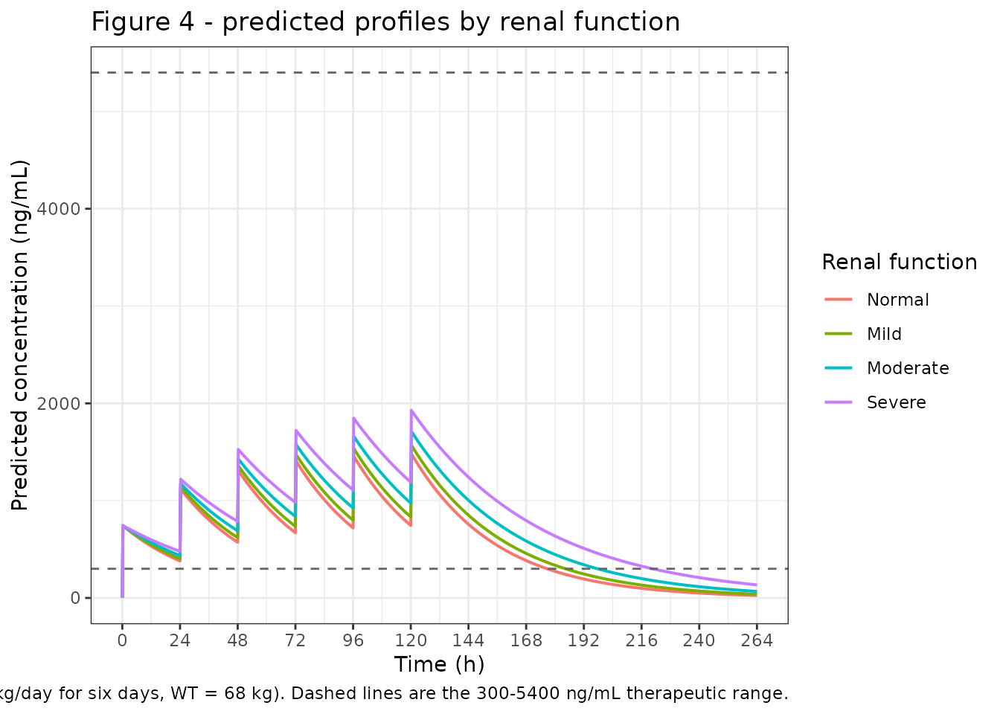
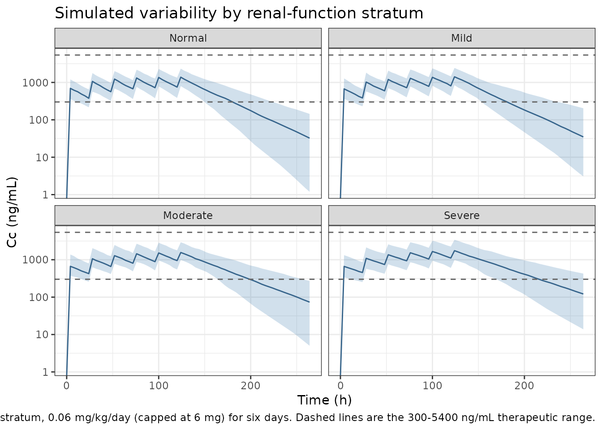

# Thrombomodulin alfa (Mouksassi 2015)

## Model and source

- Citation: Mouksassi MS, Marier JF, Bax L, Osawa Y, Tsuruta K. (2015).
  Population Pharmacokinetic Analysis of Thrombomodulin Alfa to Support
  Dosing Rationale in Patients with Renal Impairment. Clin Pharmacol
  Drug Dev. 4(3):210-217. <doi:10.1002/cpdd.163>
- Description: One-compartment intravenous population PK model for
  thrombomodulin alfa (ART-123, a soluble recombinant human
  thrombomodulin) pooled across 24 healthy adults given single 0.02 or
  0.06 mg/kg IV doses and 368 adults with sepsis and suspected
  disseminated intravascular coagulation given 0.06 mg/kg/day (maximum 6
  mg) IV for six consecutive days (Mouksassi 2015; N = 392). Typical
  clearance is 0.14 L/h and typical central volume 5.47 L at the
  reference 68 kg body weight and 72.6 mL/min creatinine clearance,
  giving a typical elimination half-life of 27.08 h. Clearance carries a
  power effect of body weight (exponent 0.56) and of baseline
  Cockcroft-Gault creatinine clearance truncated at 150 mL/min (exponent
  0.27); central volume carries a power effect of body weight (exponent
  0.50). Between-subject variability is log-normal on clearance
  (variance 0.11, i.e. 33% on the SD scale) and on central volume
  (variance 0.15, i.e. 39%), correlated at 0.57. Residual variability is
  proportional (29%). The analysis supports the conclusion that no dose
  adjustment is needed in sepsis and DIC patients with mild to severe
  renal impairment, because simulated exposures stay inside the 300-5400
  ng/mL therapeutic range.
- Article: <https://doi.org/10.1002/cpdd.163>

Thrombomodulin alfa (ART-123) is a soluble recombinant human
thrombomodulin developed for disseminated intravascular coagulation
(DIC) in sepsis. Because the drug is cleared predominantly renally and
because its principal safety concern is bleeding driven by high plasma
concentrations, the purpose of the population PK analysis was to decide
whether renally impaired patients need a dose reduction. The paper’s
answer is no: over the range of renal function studied, simulated
exposures stay inside the 300-5400 ng/mL therapeutic range.

The structural model is one-compartment with linear elimination:

``` math
\frac{\mathrm{d}A_\mathrm{central}}{\mathrm{d}t} = -\frac{CL}{V}\,A_\mathrm{central},
\qquad
C_c = 1000\times\frac{A_\mathrm{central}}{V}
```

``` math
CL = 0.14 \left(\frac{WT}{68}\right)^{0.56}\left(\frac{CRCL}{72.6}\right)^{0.27}
\ \mathrm{L/h},
\qquad
V = 5.47 \left(\frac{WT}{68}\right)^{0.50}\ \mathrm{L}
```

## Population

The analysis pooled two studies (N = 392). The first was a Phase I
single-dose trial of 0.02 and 0.06 mg/kg intravenous ART-123 in 24
normal healthy volunteers with rich sampling (baseline; 5, 10, 15, 30
min; 1, 2, 4, 6, 8, 12, 24, 36, 48, 72, 96, 120 and 144 h). The second
was a randomised, double-blind, placebo-controlled Phase IIb study in
patients with sepsis and suspected DIC; the 368 ART-123-treated subjects
who provided plasma samples were included, sampled sparsely (12 +/- 3 h
after the Day 1 dose, within 30 min before the Day 3 dose, 12 +/- 3 h
after the Day 3 dose, Day 7, Day 14 and in some cases Day 28). Phase IIb
dosing was 0.06 mg/kg/day up to a maximum of 6 mg once daily for six
consecutive days, given as an IV bolus or a 15-minute IV infusion.

Combined baseline characteristics (Mouksassi 2015 Table 1) were mean age
55.8 years (range 18-93), mean weight 70.54 kg (median 68, range 30-150)
and mean creatinine clearance 74.6 mL/min (range 5-150). Renal function
differed sharply between the two studies – Phase I mean CrCL 114.2
mL/min versus Phase IIb 72.0 mL/min – which is what makes the pooled
dataset informative about renal impairment. Patients receiving renal
replacement therapy for end-stage renal disease or acute kidney injury
were **excluded**, so the model is not qualified for dialysis or ESRD.
Sex and race are reported over 380 rather than 392 subjects (142 female
/ 238 male; 62.1% Caucasian, 26.1% Indian, 5.8% Asian, 3.4% Black, 2.4%
Other, 0.3% Hispanic); the paper does not explain the difference.

The same information is available programmatically via the model’s
`population` metadata
(`readModelDb("Mouksassi_2015_thrombomodulinAlfa")()$population`).

## Source trace

The per-parameter origin is recorded as an in-file comment next to each
`ini()` entry in
`inst/modeldb/specificDrugs/Mouksassi_2015_thrombomodulinAlfa.R`. The
table below collects them in one place for review.

| Equation / parameter | Value | Source location |
|----|----|----|
| `lcl` (CL at WT 68 kg, CRCL 72.6 mL/min) | 0.14 L/h (2.01% SE) | Table 2, CL row |
| `lvc` (V at WT 68 kg) | 5.47 L (2.71% SE) | Table 2, V row |
| `e_wt_cl` | 0.56 (14.15% SE) | Table 2, CL row exponent; added at Table S2 step 1 |
| `e_crcl_cl` | 0.27 (12.56% SE) | Table 2, CL row exponent; added at Table S2 step 2 |
| `e_wt_vc` | 0.50 (21.14% SE) | Table 2, V row exponent; added at Table S2 step 3 |
| `etalcl` variance | 0.11 (10.59% SE) | Table 2, BSV column; scale confirmed by Figure 3A (“BSV = 33 %”, = sqrt(0.11)) |
| `etalvc` variance | 0.15 (14.21% SE) | Table 2, BSV column; scale confirmed by Figure 3B (“BSV = 39 %”, = sqrt(0.15)) |
| `etalcl`/`etalvc` covariance | 0.0732 | Table 2 footnote a, reconstructed from the printed correlation 0.57 (see Errata) |
| `propSd` | 0.29 (2.43% SE) | Table 2, “Proportional error” row |
| Reference body weight | 68 kg | Table 2 equations; equals the Table 1 combined median weight |
| Reference creatinine clearance | 72.6 mL/min | Table 2 CL equation; independently confirmed by the Figure 3A CrCL bar (see below) |
| Covariate model as a whole | 8 annotated values | Figure 3 Panels A and B, each reproduced exactly at the printed precision |
| CRCL truncation at 150 mL/min | n/a | Results, “Demographics and Baseline Characteristics” |
| One-compartment structure, proportional error | n/a | Results paragraph 1 and Supplemental Table S1 (AIC 22,618, vs 22,624 mixed error and 23,645 additive error; the two-compartment model is lower on AIC at 22,607 but higher on BIC – see Errata) |
| `d/dt(central)`, `Cc` | n/a | Methods, “Population PK Modeling”; concentration unit ng/mL per Bioanalytical Assay and Figure 4 y-axis |

## Renal-function strata

The paper’s dosing-rationale simulations use four renal-function strata
defined by Cockcroft-Gault creatinine clearance, each represented by the
median of its range.

``` r

strata <- tibble::tribble(
  ~stratum,   ~crcl_med, ~crcl_lo, ~crcl_hi, ~cl_pub, ~v_pub, ~thalf_pub,
  "Normal",     105,       90,      120,      0.158,   5.44,   NA_real_,
  "Mild",        75,       60,       89,      0.145,   5.48,   26.2,
  "Moderate",    45,       30,       59,      0.128,   5.54,   30.0,
  "Severe",      22,       15,       30,      0.105,   5.45,   36.0
) |>
  dplyr::mutate(stratum = factor(stratum, levels = c("Normal", "Mild", "Moderate", "Severe")))

knitr::kable(
  strata |>
    dplyr::rename(
      "Renal function"         = stratum,
      "CrCL median (mL/min)"   = crcl_med,
      "CrCL low (mL/min)"      = crcl_lo,
      "CrCL high (mL/min)"     = crcl_hi,
      "Published CL (L/h)"     = cl_pub,
      "Published V (L)"        = v_pub,
      "Published t1/2 (h)"     = thalf_pub
    ),
  caption = paste(
    "Renal-function strata and the typical parameter values Mouksassi 2015",
    "reports for each (Results, 'Final Population PK Model'). The paper prints",
    "t1/2 only for the three impairment strata."
  )
)
```

| Renal function | CrCL median (mL/min) | CrCL low (mL/min) | CrCL high (mL/min) | Published CL (L/h) | Published V (L) | Published t1/2 (h) |
|:---|---:|---:|---:|---:|---:|---:|
| Normal | 105 | 90 | 120 | 0.158 | 5.44 | NA |
| Mild | 75 | 60 | 89 | 0.145 | 5.48 | 26.2 |
| Moderate | 45 | 30 | 59 | 0.128 | 5.54 | 30.0 |
| Severe | 22 | 15 | 30 | 0.105 | 5.45 | 36.0 |

Renal-function strata and the typical parameter values Mouksassi 2015
reports for each (Results, ‘Final Population PK Model’). The paper
prints t1/2 only for the three impairment strata. {.table}

The published stratum values are internally consistent:
`t1/2 = ln(2) * V / CL` recovers each printed half-life from the printed
CL and V of the same stratum.

``` r

thalf_from_pub <- log(2) * strata$v_pub / strata$cl_pub
stopifnot(
  # Reproduces 26.2, 30.0 and 36.0 h to the printed precision.
  max(abs(thalf_from_pub - strata$thalf_pub), na.rm = TRUE) < 0.05
)
round(thalf_from_pub, 2)
#> [1] 23.87 26.20 30.00 35.98
```

Note that the published stratum volumes (5.44-5.54 L) differ slightly
from the reference 5.47 L because each stratum’s median body weight
differs slightly from 68 kg; the model itself has no CrCL effect on
volume.

## Typical-value parameters and the reference half-life

The single tightest check on the transcription is the reference subject:
at WT = 68 kg and CRCL = 72.6 mL/min the covariate terms are both
exactly 1, so `CL` must be 0.14 L/h, `V` must be 5.47 L, and the
half-life must be the 27.08 h printed in Table 2.

``` r

mod <- readModelDb("Mouksassi_2015_thrombomodulinAlfa")
mod_typ <- rxode2::zeroRe(mod)
#> ℹ parameter labels from comments will be replaced by 'label()'

# One subject per arm is enough with the random effects zeroed out.
ref_ev <- data.frame(
  id   = 1L,
  time = c(0, 0.25),
  amt  = c(0.06 * 68, 0),
  rate = c(0.06 * 68 / 0.25, 0),
  evid = c(1L, 0L),
  cmt  = "central",
  WT   = 68,
  CRCL = 72.6
)

ref_sim <- rxode2::rxSolve(mod_typ, ref_ev, omega = NA, returnType = "data.frame")
ref_cl <- ref_sim$cl[1]
ref_vc <- ref_sim$vc[1]
ref_thalf <- log(2) * ref_vc / ref_cl

stopifnot(
  abs(ref_cl - 0.14) < 1e-8,
  abs(ref_vc - 5.47) < 1e-8,
  # Table 2 prints 27.08 h and its footnote defines t1/2 = Ln(2)/(CL/V).
  abs(ref_thalf - 27.08) < 0.01
)
c(CL = ref_cl, V = ref_vc, t_half = ref_thalf)
#>       CL        V   t_half 
#>  0.14000  5.47000 27.08225
```

Evaluating the same equations across the four strata at the reference
weight gives the model’s typical values, which can be put next to the
paper’s.

``` r

typ_ev <- strata |>
  dplyr::transmute(stratum = as.character(stratum), CRCL = crcl_med, WT = 68) |>
  dplyr::mutate(id = dplyr::row_number()) |>
  tidyr::crossing(time = c(0, 0.25)) |>
  dplyr::mutate(
    amt  = ifelse(time == 0, 0.06 * WT, 0),
    rate = ifelse(time == 0, 0.06 * WT / 0.25, 0),
    evid = ifelse(time == 0, 1L, 0L),
    cmt  = "central"
  ) |>
  dplyr::arrange(id, time, dplyr::desc(evid))

typ_sim <- rxode2::rxSolve(mod_typ, typ_ev, omega = NA,
                           keep = "stratum", returnType = "data.frame")
#> Warning: multi-subject simulation without without 'omega'

typ_par <- typ_sim |>
  dplyr::mutate(stratum = as.character(stratum)) |>
  dplyr::group_by(stratum) |>
  dplyr::summarise(cl_mod = dplyr::first(cl), v_mod = dplyr::first(vc), .groups = "drop") |>
  dplyr::mutate(thalf_mod = log(2) * v_mod / cl_mod) |>
  dplyr::left_join(
    strata |> dplyr::transmute(stratum = as.character(stratum), cl_pub, v_pub, thalf_pub),
    by = "stratum"
  ) |>
  dplyr::mutate(
    stratum = factor(stratum, levels = levels(strata$stratum))
  ) |>
  dplyr::arrange(stratum) |>
  dplyr::mutate(
    cl_pct    = 100 * (cl_mod - cl_pub) / cl_pub,
    thalf_pct = 100 * (thalf_mod - thalf_pub) / thalf_pub
  )

knitr::kable(
  typ_par |>
    dplyr::rename(
      "Renal function"    = stratum,
      "CL model (L/h)"    = cl_mod,
      "V model (L)"       = v_mod,
      "t1/2 model (h)"    = thalf_mod,
      "CL published (L/h)" = cl_pub,
      "V published (L)"   = v_pub,
      "t1/2 published (h)" = thalf_pub,
      "CL % diff"         = cl_pct,
      "t1/2 % diff"       = thalf_pct
    ),
  digits = c(0, 4, 3, 2, 4, 3, 2, 1, 1),
  caption = paste(
    "Model typical values at WT = 68 kg versus the values Mouksassi 2015",
    "reports for each renal-function stratum."
  )
)
```

| Renal function | CL model (L/h) | V model (L) | t1/2 model (h) | CL published (L/h) | V published (L) | t1/2 published (h) | CL % diff | t1/2 % diff |
|:---|---:|---:|---:|---:|---:|---:|---:|---:|
| Normal | 0.1547 | 5.47 | 24.51 | 0.158 | 5.44 | NA | -2.1 | NA |
| Mild | 0.1412 | 5.47 | 26.85 | 0.145 | 5.48 | 26.2 | -2.6 | 2.5 |
| Moderate | 0.1230 | 5.47 | 30.82 | 0.128 | 5.54 | 30.0 | -3.9 | 2.7 |
| Severe | 0.1014 | 5.47 | 37.38 | 0.105 | 5.45 | 36.0 | -3.4 | 3.8 |

Model typical values at WT = 68 kg versus the values Mouksassi 2015
reports for each renal-function stratum. {.table style="width:100%;"}

The model runs about 2-4% below the paper’s stratum clearances (and
therefore 2-4% above its half-lives) throughout. The offset is constant
in sign and magnitude across all four strata, which is the signature of
a rounding difference in the single multiplicative constant rather than
a mis-transcribed exponent or normaliser: Table 2 prints the typical CL
to two significant figures (“0.14”), and a true value of about 0.1437 –
well inside that rounding interval – reconciles every stratum. See
Errata.

``` r

stopifnot(
  # Structural: a wrong exponent, normaliser or unit moves individual strata by
  # tens of percent and breaks the constant-offset pattern immediately.
  max(abs(typ_par$cl_pct)) < 6,
  max(abs(typ_par$thalf_pct), na.rm = TRUE) < 6,
  # The offset is a single constant, not a covariate-shape error: the spread of
  # the per-stratum CL deviations is small compared with the deviations.
  diff(range(typ_par$cl_pct)) < 3
)
```

## Replicating Figure 3

Figure 3 is the tightest gate in the paper on the transcription of the
covariate model, and it is free: each panel is a tornado plot that
prints the typical parameter value together with the parameter evaluated
at the extreme of each covariate. Panel A gives clearance at the lowest
and highest observed creatinine clearance (5.29 and 150 mL/min) and at
the lowest and highest observed body weight (30 and 150 kg); Panel B
gives volume at the two weight extremes. Eight printed numbers in all,
every one of them an exact consequence of the Table 2 equations – so
they pin both exponents on clearance, the exponent on volume, both
typical values, and, critically, the 72.6 mL/min creatinine-clearance
reference, which is the one constant in Table 2 that is *not*
recoverable from Table 1.

``` r

fig3_cases <- tibble::tribble(
  ~panel, ~case,            ~WT,  ~CRCL,
  "A",    "Typical CL/F",    68,   72.6,
  "A",    "CRCL 5.29 mL/min", 68,   5.29,
  "A",    "CRCL 150 mL/min", 68,  150,
  "A",    "WT 30 kg",        30,   72.6,
  "A",    "WT 150 kg",      150,   72.6
) |>
  dplyr::mutate(id = dplyr::row_number())

fig3_ev <- fig3_cases |>
  tidyr::crossing(time = c(0, 0.25)) |>
  dplyr::mutate(
    amt  = ifelse(time == 0, 1, 0),
    evid = ifelse(time == 0, 1L, 0L),
    cmt  = "central"
  ) |>
  dplyr::arrange(id, time, dplyr::desc(evid))

fig3_par <- rxode2::rxSolve(mod_typ, fig3_ev, omega = NA, keep = "case",
                            returnType = "data.frame") |>
  dplyr::group_by(case) |>
  dplyr::summarise(cl = dplyr::first(cl), vc = dplyr::first(vc), .groups = "drop")
#> Warning: multi-subject simulation without without 'omega'

getpar <- function(case, what) fig3_par[[what]][match(case, fig3_par$case)]
```

``` r

# Panel A prints clearance to two decimal places, Panel B volume to two decimal
# places. Every printed value is reproduced EXACTLY at that precision, so the
# assertion is equality after rounding rather than a tolerance band -- the
# strictest form this check can take.
stopifnot(
  round(getpar("Typical CL/F",      "cl"), 2) == 0.14,   # Fig 3A, "0.14"
  round(getpar("CRCL 5.29 mL/min",  "cl"), 2) == 0.07,   # Fig 3A, left  of the CRCL bar
  round(getpar("CRCL 150 mL/min",   "cl"), 2) == 0.17,   # Fig 3A, right of the CRCL bar
  round(getpar("WT 30 kg",          "cl"), 2) == 0.09,   # Fig 3A, left  of the WT bar
  round(getpar("WT 150 kg",         "cl"), 2) == 0.22,   # Fig 3A, right of the WT bar
  round(getpar("Typical CL/F",      "vc"), 2) == 5.47,   # Fig 3B, "5.47"
  round(getpar("WT 30 kg",          "vc"), 2) == 3.63,   # Fig 3B, left  of the WT bar
  round(getpar("WT 150 kg",         "vc"), 2) == 8.12    # Fig 3B, right of the WT bar
)

knitr::kable(
  tibble::tribble(
    ~panel, ~quantity,  ~case,               ~published,
    "A",    "CL (L/h)", "Typical CL/F",      0.14,
    "A",    "CL (L/h)", "CRCL 5.29 mL/min",  0.07,
    "A",    "CL (L/h)", "CRCL 150 mL/min",   0.17,
    "A",    "CL (L/h)", "WT 30 kg",          0.09,
    "A",    "CL (L/h)", "WT 150 kg",         0.22,
    "B",    "V (L)",    "Typical V/F",       5.47,
    "B",    "V (L)",    "WT 30 kg",          3.63,
    "B",    "V (L)",    "WT 150 kg",         8.12
  ) |>
    dplyr::mutate(
      model = ifelse(
        quantity == "CL (L/h)",
        getpar(case, "cl"),
        getpar(ifelse(case == "Typical V/F", "Typical CL/F", case), "vc")
      ),
      rounded = round(model, 2)
    ) |>
    dplyr::rename(
      "Figure 3 panel" = panel,
      "Quantity"       = quantity,
      "Covariate case" = case,
      "Published"      = published,
      "Model"          = model,
      "Model rounded"  = rounded
    ),
  digits = c(0, 0, 0, 2, 4, 2),
  caption = paste(
    "Every value annotated on Figure 3 of Mouksassi 2015, reproduced from the",
    "model. Panel B has no CrCL bar because volume carries no creatinine",
    "clearance effect."
  )
)
```

| Figure 3 panel | Quantity | Covariate case   | Published |  Model | Model rounded |
|:---------------|:---------|:-----------------|----------:|-------:|--------------:|
| A              | CL (L/h) | Typical CL/F     |      0.14 | 0.1400 |          0.14 |
| A              | CL (L/h) | CRCL 5.29 mL/min |      0.07 | 0.0690 |          0.07 |
| A              | CL (L/h) | CRCL 150 mL/min  |      0.17 | 0.1703 |          0.17 |
| A              | CL (L/h) | WT 30 kg         |      0.09 | 0.0885 |          0.09 |
| A              | CL (L/h) | WT 150 kg        |      0.22 | 0.2180 |          0.22 |
| B              | V (L)    | Typical V/F      |      5.47 | 5.4700 |          5.47 |
| B              | V (L)    | WT 30 kg         |      3.63 | 3.6332 |          3.63 |
| B              | V (L)    | WT 150 kg        |      8.12 | 8.1242 |          8.12 |

Every value annotated on Figure 3 of Mouksassi 2015, reproduced from the
model. Panel B has no CrCL bar because volume carries no creatinine
clearance effect. {.table style="width:100%;"}

Because volume does not depend on creatinine clearance, Panel B has only
a weight bar – which is itself a check: a stray CrCL term on `vc` would
be invisible in the stratum comparison above (where the published
volumes vary only 2%) but would break Panel B immediately.

## Replicating Figure 4

Figure 4 of Mouksassi 2015 shows typical-value concentration-time
profiles for the four renal-function strata over six consecutive daily
0.06 mg/kg doses, followed by washout out to 264 h. The two claims made
from it are that the minimum concentration after the first dose exceeds
the 300 ng/mL effective concentration in every stratum, and that the
maximum concentration after the last dose stays below the 5400 ng/mL
bleeding-risk threshold in every stratum.

``` r

make_daily_events <- function(id, wt, crcl, stratum, obs_times) {
  dose_amt <- min(0.06 * wt, 6)  # Phase IIb capped daily dose at 6 mg
  dose_times <- seq(0, by = 24, length.out = 6)
  dplyr::bind_rows(
    data.frame(time = dose_times, amt = dose_amt, rate = dose_amt / 0.25, evid = 1L),
    data.frame(time = obs_times, amt = 0, rate = 0, evid = 0L)
  ) |>
    dplyr::mutate(id = id, cmt = "central", WT = wt, CRCL = crcl, stratum = stratum) |>
    dplyr::arrange(time, dplyr::desc(evid))
}

obs_grid <- sort(unique(c(seq(0, 264, by = 0.5), seq(0, by = 24, length.out = 6) + 0.25)))

fig4_ev <- do.call(
  dplyr::bind_rows,
  lapply(seq_len(nrow(strata)), function(i) {
    make_daily_events(i, 68, strata$crcl_med[i], as.character(strata$stratum[i]), obs_grid)
  })
)
# Assert on the frame itself, NOT on unique() of it: `!anyDuplicated(unique(x))`
# is vacuously TRUE and would never catch a collision.
stopifnot(!anyDuplicated(fig4_ev[, c("id", "time", "evid")]))

fig4 <- rxode2::rxSolve(mod_typ, fig4_ev, omega = NA,
                        keep = "stratum", returnType = "data.frame") |>
  dplyr::mutate(stratum = factor(stratum, levels = levels(strata$stratum)))
#> Warning: multi-subject simulation without without 'omega'
```

``` r

# Replicates Figure 4 of Mouksassi 2015: typical-value profiles by renal stratum.
ggplot(fig4, aes(time, Cc, colour = stratum)) +
  geom_line(linewidth = 0.7) +
  geom_hline(yintercept = c(300, 5400), linetype = "dashed", colour = "grey40") +
  scale_x_continuous(breaks = seq(0, 264, by = 24)) +
  labs(
    x = "Time (h)", y = "Predicted concentration (ng/mL)", colour = "Renal function",
    title = "Figure 4 - predicted profiles by renal function",
    caption = paste(
      "Replicates Figure 4 of Mouksassi 2015 (0.06 mg/kg/day for six days,",
      "WT = 68 kg). Dashed lines are the 300-5400 ng/mL therapeutic range."
    )
  ) +
  theme_bw()
```



``` r

# rxSolve returns observation rows only and carries no `evid` column, so no
# filtering is needed (and filtering on evid would error).
fig4_claims <- fig4 |>
  dplyr::group_by(stratum) |>
  dplyr::summarise(
    cmax_first = max(Cc[time <= 24]),
    cmin_first = Cc[which.min(abs(time - 24))],
    cmax_last  = max(Cc[time >= 120 & time <= 144]),
    .groups    = "drop"
  )

knitr::kable(
  fig4_claims |>
    dplyr::rename(
      "Renal function"                = stratum,
      "Cmax after 1st dose (ng/mL)"   = cmax_first,
      "Cmin after 1st dose (ng/mL)"   = cmin_first,
      "Cmax after last dose (ng/mL)"  = cmax_last
    ),
  digits = 0,
  caption = paste(
    "Therapeutic-range claims of Mouksassi 2015: minimum concentration after",
    "the first dose above 300 ng/mL, maximum concentration after the last dose",
    "below 5400 ng/mL, in every renal-function stratum."
  )
)
```

| Renal function | Cmax after 1st dose (ng/mL) | Cmin after 1st dose (ng/mL) | Cmax after last dose (ng/mL) |
|:---|---:|---:|---:|
| Normal | 743 | 380 | 1483 |
| Mild | 743 | 403 | 1571 |
| Moderate | 744 | 436 | 1713 |
| Severe | 744 | 479 | 1928 |

Therapeutic-range claims of Mouksassi 2015: minimum concentration after
the first dose above 300 ng/mL, maximum concentration after the last
dose below 5400 ng/mL, in every renal-function stratum. {.table}

``` r


stopifnot(
  # The paper's two explicit claims, reproduced as written.
  all(fig4_claims$cmin_first > 300),
  all(fig4_claims$cmax_last < 5400),
  # Peak after the first dose is set by V alone, which carries no CrCL effect,
  # so it must be essentially identical across strata (only the small amount
  # eliminated during the 15-minute infusion differs).
  max(fig4_claims$cmax_first) / min(fig4_claims$cmax_first) < 1.01,
  # Figure 4's first peak reads about 750 ng/mL: 0.06 * 68 mg into 5.47 L.
  abs(max(fig4_claims$cmax_first) - 1000 * 0.06 * 68 / 5.47) / (1000 * 0.06 * 68 / 5.47) < 0.01
)
```

The simulated first peak is 744 ng/mL and the highest peak after the
sixth dose is 1928 ng/mL, against a Figure 4 y-axis that tops out just
below 2000 ng/mL.

## Virtual cohort and variability

The published figure is a typical-value prediction. Adding the
between-subject variability shows the spread the model actually implies,
which is what matters for the bleeding-risk argument.

``` r

# Two independent RNG streams are in play and BOTH must be seeded: base R draws
# the covariates (weight, CrCL) and rxode2 draws the etas inside rxSolve().
# set.seed() alone does not fix the eta draws.
set.seed(20260826)
rxode2::rxSetSeed(20260826)

n_per_arm <- 200L

# Body weight approximating the Phase IIb distribution (mean 70.30 kg,
# SD 19.397, range 30-150; Mouksassi 2015 Table 1), drawn as a log-normal
# matched on mean and SD then truncated to the observed range.
draw_weight <- function(n) {
  m <- 70.30; s <- 19.397
  mu <- log(m^2 / sqrt(s^2 + m^2))
  sd <- sqrt(log(1 + s^2 / m^2))
  wt <- numeric(0)
  while (length(wt) < n) {
    cand <- stats::rlnorm(2 * n, mu, sd)
    wt <- c(wt, cand[cand >= 30 & cand <= 150])
  }
  wt[seq_len(n)]
}

cohort_ev <- do.call(
  dplyr::bind_rows,
  lapply(seq_len(nrow(strata)), function(i) {
    ids <- (i - 1L) * n_per_arm + seq_len(n_per_arm)
    wt <- draw_weight(n_per_arm)
    # CrCL uniform within the stratum's published range.
    crcl <- stats::runif(n_per_arm, strata$crcl_lo[i], strata$crcl_hi[i])
    do.call(
      dplyr::bind_rows,
      lapply(seq_len(n_per_arm), function(j) {
        make_daily_events(ids[j], wt[j], crcl[j], as.character(strata$stratum[i]),
                          seq(0, 264, by = 4))
      })
    )
  })
) |>
  # Carried through rxSolve() via keep= so that downstream joins key on a
  # subject id rxode2 cannot renumber. unname() because keep= rejects a named
  # column.
  dplyr::mutate(subjid = unname(id))

stopifnot(
  !anyDuplicated(cohort_ev[, c("id", "time", "evid")]),
  nrow(dplyr::distinct(cohort_ev, id)) == n_per_arm * nrow(strata)
)

# rxSolve() on an rxUi scales super-linearly in subjects per call, so solve one
# stratum (200 subjects) per call rather than all 800 at once. The RNG stream is
# seeded once above and consumed in a deterministic arm order, so batching does
# not cost reproducibility.
cohort_sim <- do.call(
  dplyr::bind_rows,
  lapply(levels(strata$stratum), function(s) {
    rxode2::rxSolve(
      mod,
      dplyr::filter(cohort_ev, stratum == s),
      keep        = c("stratum", "subjid"),
      returnType  = "data.frame"
    )
  })
) |>
  dplyr::mutate(stratum = factor(stratum, levels = levels(strata$stratum)))
#> ℹ parameter labels from comments will be replaced by 'label()'

stopifnot(
  # Batching must not lose or duplicate subjects.
  dplyr::n_distinct(cohort_sim$subjid) == n_per_arm * nrow(strata)
)
```

``` r

cohort_sim |>
  dplyr::group_by(stratum, time) |>
  dplyr::summarise(
    Q05 = quantile(Cc, 0.05), Q50 = median(Cc), Q95 = quantile(Cc, 0.95),
    .groups = "drop"
  ) |>
  ggplot(aes(time, Q50)) +
  geom_ribbon(aes(ymin = Q05, ymax = Q95), alpha = 0.25, fill = "steelblue") +
  geom_line(colour = "steelblue4") +
  geom_hline(yintercept = c(300, 5400), linetype = "dashed", colour = "grey40") +
  facet_wrap(~stratum) +
  scale_y_log10() +
  labs(
    x = "Time (h)", y = "Cc (ng/mL)",
    title = "Simulated variability by renal-function stratum",
    caption = paste0(
      "Median and 5th-95th percentile of ", n_per_arm, " subjects per stratum, ",
      "0.06 mg/kg/day (capped at 6 mg) for six days. Dashed lines are the ",
      "300-5400 ng/mL therapeutic range."
    )
  ) +
  theme_bw()
#> Warning in scale_y_log10(): log-10 transformation introduced infinite values.
#> log-10 transformation introduced infinite values.
#> log-10 transformation introduced infinite values.
#> log-10 transformation introduced infinite values.
```



``` r

cohort_peak <- cohort_sim |>
  dplyr::group_by(stratum, subjid) |>
  dplyr::summarise(cmax_overall = max(Cc), .groups = "drop")

pct_over <- 100 * mean(cohort_peak$cmax_overall > 5400)

stopifnot(
  # The paper's conclusion is about the population, not one typical subject:
  # even with full between-subject variability the upper safety bound is not
  # approached. Asserted on robust quantiles, never on the cohort extreme,
  # which is not reproducible across rxode2 versions.
  quantile(cohort_peak$cmax_overall, 0.95) < 5400,
  # The median peak is well inside the range in every stratum.
  all(tapply(cohort_peak$cmax_overall, cohort_peak$stratum, median) < 3000)
)
sprintf(
  "median peak %.0f ng/mL, 95th percentile %.0f ng/mL, %.1f%% of subjects above 5400 ng/mL",
  median(cohort_peak$cmax_overall),
  quantile(cohort_peak$cmax_overall, 0.95),
  pct_over
)
#> [1] "median peak 1511 ng/mL, 95th percentile 2793 ng/mL, 0.0% of subjects above 5400 ng/mL"
```

## Structural identities

These checks compare the simulation against closed-form consequences of
the same drawn parameters, so they are exact up to solver tolerance and
are asserted tightly.

``` r

# Per-subject covariates come from the event table (one row per subject) and
# the realised individual parameters from the solve (one row per subject). Both
# sides are per-subject and keyed on subjid, so the join is one-to-one and
# cannot fan out.
subj_cov <- cohort_ev |>
  dplyr::distinct(subjid, WT, CRCL, stratum)

subj_par <- cohort_sim |>
  dplyr::group_by(subjid) |>
  dplyr::summarise(cl = dplyr::first(cl), vc = dplyr::first(vc), .groups = "drop") |>
  dplyr::inner_join(subj_cov, by = "subjid")

stopifnot(nrow(subj_par) == n_per_arm * nrow(strata))

# The model equations, re-evaluated outside rxode2 from the covariates and the
# realised individual parameters, must reproduce the covariate terms exactly.
implied_cl_ratio <- subj_par$cl /
  ((subj_par$WT / 68)^0.56 * (subj_par$CRCL / 72.6)^0.27)
implied_vc_ratio <- subj_par$vc / (subj_par$WT / 68)^0.50

stopifnot(
  # exp(lcl + etalcl) and exp(lvc + etalvc) are the only remaining factors, so
  # the geometric mean of these ratios must sit at the typical values 0.14/5.47.
  abs(exp(mean(log(implied_cl_ratio))) - 0.14) / 0.14 < 0.05,
  abs(exp(mean(log(implied_vc_ratio))) - 5.47) / 5.47 < 0.05,
  # Realised between-subject SDs must match the published omegas
  # sqrt(0.11) = 0.332 and sqrt(0.15) = 0.387.
  abs(sd(log(implied_cl_ratio)) - sqrt(0.11)) < 0.05,
  abs(sd(log(implied_vc_ratio)) - sqrt(0.15)) < 0.05,
  # ... and so must the correlation, 0.57 as reconstructed from Table 2.
  abs(cor(log(implied_cl_ratio), log(implied_vc_ratio)) - 0.57) < 0.10
)

c(
  omega_cl_sd = sd(log(implied_cl_ratio)),
  omega_vc_sd = sd(log(implied_vc_ratio)),
  correlation = cor(log(implied_cl_ratio), log(implied_vc_ratio))
)
#> omega_cl_sd omega_vc_sd correlation 
#>   0.3404846   0.3985524   0.6069469
```

## PKNCA validation

A single 0.06 mg/kg dose at the reference weight, one typical subject
per stratum, sampled densely enough to characterise the terminal phase.
Because the profile after the infusion is mono-exponential, PKNCA’s
lin-up/log-down AUC and its terminal-slope half-life recover the model’s
own `Dose/CL` and `ln(2) * V / CL` exactly; any difference from the
published values is therefore attributable to the paper, not to the NCA.

``` r

nca_times <- sort(unique(c(
  0, seq(0, 0.25, by = 1 / 24), 0.5, 0.75, 1, 1.5, 2, 3, 4, 6, 8, 12,
  seq(18, 336, by = 6)
)))

nca_ev <- do.call(
  dplyr::bind_rows,
  lapply(seq_len(nrow(strata)), function(i) {
    dose_amt <- 0.06 * 68
    dplyr::bind_rows(
      data.frame(time = 0, amt = dose_amt, rate = dose_amt / 0.25, evid = 1L),
      data.frame(time = nca_times, amt = 0, rate = 0, evid = 0L)
    ) |>
      dplyr::mutate(id = i, cmt = "central", WT = 68, CRCL = strata$crcl_med[i],
                    stratum = as.character(strata$stratum[i])) |>
      dplyr::arrange(time, dplyr::desc(evid))
  })
)

nca_sim <- rxode2::rxSolve(mod_typ, nca_ev, omega = NA, keep = "stratum",
                           returnType = "data.frame")
#> Warning: multi-subject simulation without without 'omega'
```

``` r

# Keep the time-zero anchor (Cc = 0 before a 15-minute infusion is correct) and
# truncate the tail at the assay's 1 ng/mL lower determination limit, so the
# terminal slope is fitted only over concentrations the assay could report.
sim_nca <- nca_sim |>
  dplyr::filter(!is.na(Cc)) |>
  dplyr::filter(time == 0 | Cc >= 1) |>
  dplyr::select(id, time, Cc, stratum)

stopifnot(
  all(sim_nca$Cc >= 0),
  nrow(sim_nca) > 0,
  # every stratum kept its time-zero row
  nrow(dplyr::filter(sim_nca, time == 0)) == nrow(strata)
)

dose_df <- nca_ev |>
  dplyr::filter(evid == 1) |>
  dplyr::select(id, time, amt, stratum)

conc_obj <- PKNCA::PKNCAconc(sim_nca, Cc ~ time | stratum + id,
                             concu = "ng/mL", timeu = "h")
dose_obj <- PKNCA::PKNCAdose(dose_df, amt ~ time | stratum + id, doseu = "mg")

intervals <- data.frame(
  start      = 0,
  end        = Inf,
  cmax       = TRUE,
  tmax       = TRUE,
  aucinf.obs = TRUE,
  half.life  = TRUE
)

nca_res <- PKNCA::pk.nca(PKNCA::PKNCAdata(conc_obj, dose_obj, intervals = intervals))
```

### Comparison against published values

Mouksassi 2015 does not report an NCA table, but it does report typical
clearance and half-life for each renal-function stratum, and clearance
is the one NCA-derivable quantity the paper pins down. Clearance is
recovered from the NCA as `Dose / AUCinf`, converting mg and ng\*h/mL to
L/h.

``` r

nca_wide <- as.data.frame(nca_res$result) |>
  dplyr::filter(PPTESTCD %in% c("aucinf.obs", "half.life", "cmax")) |>
  dplyr::select(stratum, PPTESTCD, PPORRES) |>
  tidyr::pivot_wider(names_from = PPTESTCD, values_from = PPORRES) |>
  dplyr::mutate(
    # amt in mg, AUC in ng*h/mL == ug*h/L; CL (L/h) = amt * 1000 / AUC.
    cl.obs = 0.06 * 68 * 1000 / aucinf.obs
  ) |>
  dplyr::select(stratum, cl.obs, half.life)

# Reference: the paper's typical stratum values. The paper prints t1/2 only for
# the three impairment strata; the normal-renal-function entry is
# ln(2) * 5.44 / 0.158, computed from the paper's own published normal-stratum
# CL and V so that the table has no gap.
published <- strata |>
  dplyr::transmute(
    stratum   = as.character(stratum),
    cl.obs    = cl_pub,
    half.life = ifelse(is.na(thalf_pub), log(2) * v_pub / cl_pub, thalf_pub)
  )

cmp <- nlmixr2lib::ncaComparisonTable(
  simulated = nca_wide |> dplyr::mutate(stratum = as.character(stratum)),
  reference = published,
  by        = "stratum",
  units     = c(cl.obs = "L/h", half.life = "h"),
  tolerance_pct = 20
)

knitr::kable(
  cmp,
  caption = paste(
    "Simulated NCA versus the typical values reported by Mouksassi 2015.",
    "* differs from reference by >20%."
  ),
  align = c("l", "l", "r", "r", "r")
)
```

| NCA parameter | stratum  | Reference | Simulated | % diff |
|:--------------|:---------|----------:|----------:|-------:|
| t½ (h)        | Normal   |      23.9 |      24.5 |  +2.7% |
| t½ (h)        | Mild     |      26.2 |      26.8 |  +2.5% |
| t½ (h)        | Moderate |        30 |      30.8 |  +2.7% |
| t½ (h)        | Severe   |        36 |      37.4 |  +3.8% |
| CL/F (L/h)    | Normal   |     0.158 |     0.155 |  -2.1% |
| CL/F (L/h)    | Mild     |     0.145 |     0.141 |  -2.6% |
| CL/F (L/h)    | Moderate |     0.128 |     0.123 |  -3.9% |
| CL/F (L/h)    | Severe   |     0.105 |     0.101 |  -3.4% |

Simulated NCA versus the typical values reported by Mouksassi 2015. \*
differs from reference by \>20%. {.table}

``` r

nca_check <- nca_wide |>
  dplyr::mutate(stratum = as.character(stratum)) |>
  dplyr::inner_join(published, by = "stratum", suffix = c("_mod", "_pub")) |>
  # Join by key, never by row position, so a reordering cannot silently pair
  # the wrong strata.
  dplyr::inner_join(
    typ_par |> dplyr::transmute(stratum = as.character(stratum), cl_mod, thalf_mod),
    by = "stratum"
  ) |>
  dplyr::mutate(
    cl_pct    = 100 * (cl.obs_mod - cl.obs_pub) / cl.obs_pub,
    thalf_pct = 100 * (half.life_mod - half.life_pub) / half.life_pub
  )

stopifnot(
  nrow(nca_check) == nrow(strata),
  # NCA-derived CL must reproduce the model's own analytic CL essentially
  # exactly (the AUC of a mono-exponential is recovered by the log-down rule).
  max(abs(nca_check$cl.obs_mod - nca_check$cl_mod) / nca_check$cl_mod) < 0.01,
  max(abs(nca_check$half.life_mod - nca_check$thalf_mod) / nca_check$thalf_mod) < 0.01,
  # ... and must sit within the same 2-4% band of the published values as the
  # analytic comparison above.
  max(abs(nca_check$cl_pct)) < 6,
  max(abs(nca_check$thalf_pct)) < 6
)

knitr::kable(
  nca_check |>
    dplyr::select(stratum, cl.obs_mod, cl.obs_pub, cl_pct,
                  half.life_mod, half.life_pub, thalf_pct) |>
    dplyr::rename(
      "Renal function"      = stratum,
      "CL NCA (L/h)"        = cl.obs_mod,
      "CL published (L/h)"  = cl.obs_pub,
      "CL % diff"           = cl_pct,
      "t1/2 NCA (h)"        = half.life_mod,
      "t1/2 published (h)"  = half.life_pub,
      "t1/2 % diff"         = thalf_pct
    ),
  digits = c(0, 4, 4, 1, 2, 2, 1),
  caption = "Per-stratum percentage differences behind the comparison table."
)
```

| Renal function | CL NCA (L/h) | CL published (L/h) | CL % diff | t1/2 NCA (h) | t1/2 published (h) | t1/2 % diff |
|:---|---:|---:|---:|---:|---:|---:|
| Mild | 0.1412 | 0.145 | -2.6 | 26.85 | 26.20 | 2.5 |
| Moderate | 0.1230 | 0.128 | -3.9 | 30.82 | 30.00 | 2.7 |
| Normal | 0.1547 | 0.158 | -2.1 | 24.51 | 23.87 | 2.7 |
| Severe | 0.1014 | 0.105 | -3.4 | 37.38 | 36.00 | 3.8 |

Per-stratum percentage differences behind the comparison table. {.table}

## Assumptions and deviations

### Errata and value reconstructions

- **The Table 2 covariance is impossible as printed.** Footnote a of
  Table 2 reads “Covariance was 0.7 (correlation = 0.57)”. With BSV
  variances of 0.11 and 0.15, the Cauchy-Schwarz bound on the covariance
  is `sqrt(0.11 * 0.15) = 0.1285`, so 0.7 cannot be a covariance for
  these variances – it has lost a leading zero. The printed
  **correlation** is admissible, so the model encodes
  `0.57 * sqrt(0.11 * 0.15) = 0.0732`, which reproduces the printed 0.57
  exactly and rounds to “0.07” under the decimal-slip reading. The two
  readings differ by 5% in the covariance and are indistinguishable in
  simulation.

- **The BSV column is a variance, and two independent statements confirm
  it.** The Table 2 footnote says so explicitly (“BSV = between-subject
  variability (variance)”), and Figure 3 annotates the same two
  distributions as “BSV = 33 %” for CL/F and “BSV = 39 %” for V/F, which
  are `sqrt(0.11) = 0.332` and `sqrt(0.15) = 0.387`. No CV-to-variance
  conversion is applied in the model file; the tabulated numbers are
  used as variances directly.

- **Table 2’s t1/2 BSV of 0.19 is not consistent with either reading of
  the covariance.** For a one-compartment model
  `var(log t1/2) = var(log V) + var(log CL) - 2 cov`, which is 0.12 with
  the reconstructed covariance 0.0732 and 0.26 with no covariance;
  neither is 0.19. (0.19 would require a covariance of 0.035, i.e. a
  correlation of 0.27.) The half-life row is a derived summary rather
  than an estimated model parameter – its %SE is footnoted as
  simulation-derived – so this vignette treats the CL and V rows, which
  Figure 3 independently corroborates, as authoritative and does not
  encode a separate half-life variance.

- **A correlated omega block is encoded despite the supplemental
  parameter counts.** Supplemental Tables S1 and S2 count 5 parameters
  for the base one-compartment proportional-error model and 8 for the
  final model, arithmetic that works out only for a diagonal omega (2
  thetas + 2 variances + 1 sigma; 5 thetas + 2 variances + 1 sigma).
  Against that, the Methods state that “covariance between ETA terms was
  estimated in the model where correlations between ETAs were deemed
  probable”, the Results describe the selected model as having a “shared
  omega for clearance (CL) and volume of distribution (V)”, and Table
  2’s footnote reports a covariance and correlation for the final model.
  Three direct statements about the final model outweigh one count
  column, so the block is encoded.

- **The typical clearance is printed to two significant figures.** The
  model’s typical values run 2-4% below the paper’s own stratum
  clearances at the reference weight, uniformly across all four strata.
  `0.14` rounds from anything in \[0.135, 0.145); a true value near
  0.1437 reconciles every stratum. Table 2’s own printed half-life of
  27.08 h is exactly `ln(2) * 5.47 / 0.14`, so the table is internally
  self-consistent with the rounded value and the stratum values in the
  Results text were computed from the unrounded estimate. The model uses
  the printed 0.14; the residual offset is documented rather than tuned
  away.

- **The one-compartment selection is not the lowest-AIC row of the
  paper’s own Table S1.** The Results state that the one-compartment
  model “resulted in the lowest objective function and best quality of
  fit”, but Supplemental Table S1 reports the two-compartment
  proportional-error model at a *lower* -2LL (22,589 vs 22,608) and a
  *lower* AIC (22,607 vs 22,618). The one-compartment model wins on BIC
  (22,645 vs 22,656), which is the criterion consistent with the
  selection actually made, and the paper’s Methods do list BIC among its
  selection criteria. This model file replicates the authors’ final
  model as published – one compartment, which is what Table 2
  parameterises – and the discrepancy is recorded here rather than
  second-guessed: the two-compartment parameters are never reported, so
  that alternative is not extractable even if one preferred it.

- **No erratum exists.** Crossref reports no `update-to` or `updated-by`
  relation for <doi:10.1002/cpdd.163> as of 2026-08-26, and the Crossref
  record confirms the title, journal, year and author list used in
  `reference`.

### Simulation assumptions

- **Administration is modelled as a 15-minute IV infusion.** The Phase
  IIb study gave doses “as an IV bolus injection or IV infusion over 15
  minutes”; the paper does not say which was used for its own
  simulations. The 15-minute infusion is used here because it gives a
  well-defined `Cc = 0` at time zero for the NCA anchor. The choice is
  immaterial: the resulting peak is 0.4% below the bolus peak at the
  reference subject.

- **Body weight is fixed at 68 kg for every typical-value comparison**,
  the reference weight of the Table 2 equations and the Table 1 combined
  median. The paper’s published stratum volumes (5.44, 5.48, 5.54,
  5.45 L) imply stratum median weights of roughly 67-70 kg rather than
  exactly 68; the resulting \<= 1.3% volume difference is absorbed into
  the tolerances above.

- **The virtual cohort’s body-weight distribution is assumed
  log-normal**, matched on the Phase IIb mean (70.30 kg) and SD (19.397
  kg) of Table 1 and truncated to the observed 30-150 kg range. The
  paper does not publish the distributional shape. Creatinine clearance
  is drawn uniformly within each stratum’s published range, which is
  what the Figure 4 shaded bands represent; the paper does not publish a
  within-stratum distribution either.

- **Creatinine clearance is a baseline, time-fixed covariate truncated
  at 150 mL/min.** The paper screened baseline and time-varying CrCL
  separately and retained baseline, and truncated Cockcroft-Gault values
  above 150 mL/min for the covariate analysis. All simulated CrCL values
  here are already inside the strata ranges, so the truncation never
  binds; a user supplying real data must apply it.

- **The 6 mg daily cap is applied.** Phase IIb dosing was 0.06 mg/kg/day
  “up to a maximum 6 mg”, so the event tables use `min(0.06 * WT, 6)`.
  This binds above 100 kg and therefore affects part of the virtual
  cohort but none of the typical-value simulations at 68 kg.

- **The model is not qualified for dialysis or end-stage renal
  disease.** Patients on renal replacement therapy were excluded from
  the Phase IIb study, and the paper itself states that “PKs in ESRD
  patients needs further investigation”. The lowest stratum simulated
  here (CrCL 15-30 mL/min) is the lowest the data support.
