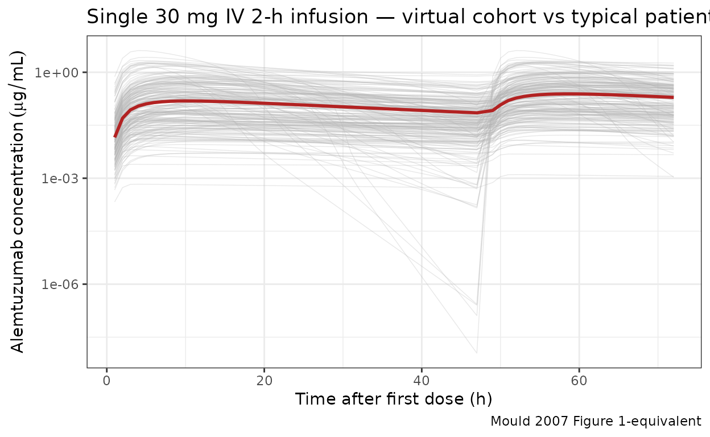
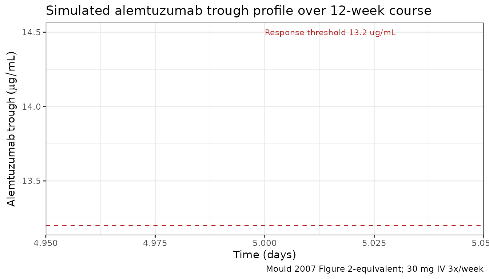
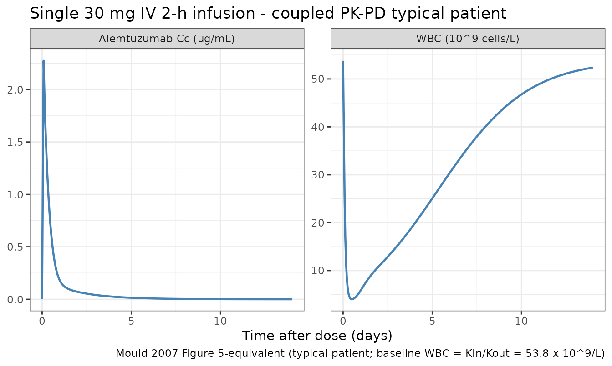
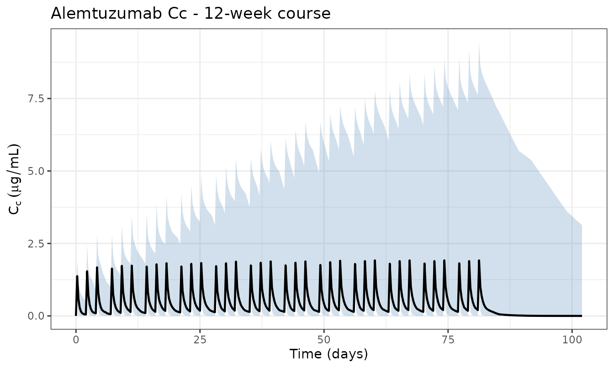
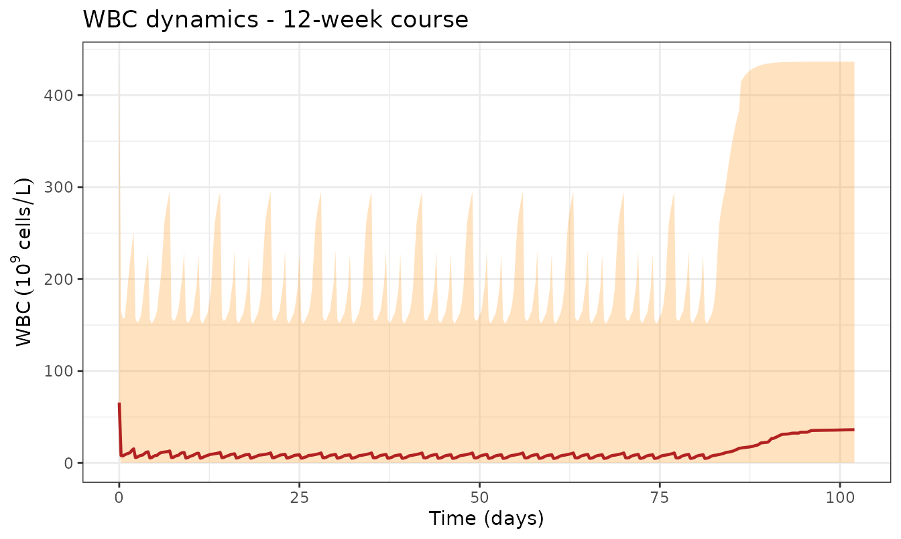

# Alemtuzumab (Mould 2007)

``` r

library(nlmixr2lib)
library(rxode2)
#> rxode2 5.1.2 using 2 threads (see ?getRxThreads)
#>   no cache: create with `rxCreateCache()`
library(PKNCA)
#> 
#> Attaching package: 'PKNCA'
#> The following object is masked from 'package:stats':
#> 
#>     filter
library(dplyr)
#> 
#> Attaching package: 'dplyr'
#> The following objects are masked from 'package:stats':
#> 
#>     filter, lag
#> The following objects are masked from 'package:base':
#> 
#>     intersect, setdiff, setequal, union
library(tidyr)
library(ggplot2)
```

## Alemtuzumab population PK replication (Mould 2007)

Mould et al. (2007) characterised alemtuzumab (Campath®)
pharmacokinetics in 67 patients with B-cell chronic lymphocytic
leukaemia (B-CLL) pooled across four studies (CAM002, CAM005, CAM211,
CAM213). The PK model is two-compartment with Michaelis–Menten
elimination from the central compartment and a single time-varying
covariate — total white blood cell count (WBC) — entering as a power
effect on V_(max). WBC in a B-CLL patient is dominated by circulating
leukaemic B-cells and therefore acts as a surrogate for target-cell
burden. Alemtuzumab depletes those cells rapidly, so WBC (and therefore
V_(max)) falls sharply during the first weeks of treatment.

This vignette reproduces the typical concentration–time profile after a
single 30 mg intravenous infusion and after a 12-week course of 30 mg IV
three times weekly, documents the parameter provenance in a source-trace
table, and validates the simulated NCA against the published exposure
summaries.

### Population studied

Mould 2007 Table 1:

| Field | Value |
|----|----|
| N subjects | 67 |
| N studies | 4 (CAM002, CAM005, CAM211, CAM213) |
| Age | 41–75 years (median 59) |
| Weight | 45–167 kg (median 72) |
| Sex | 49 M / 18 F (26.9% female) |
| Disease state | B-cell chronic lymphocytic leukaemia (mostly relapsed/refractory) |
| Baseline WBC | 1.3–522 × 10⁹/L (median 37.8) |
| Dose range | 3–240 mg alemtuzumab as 2-hour IV infusion |
| Typical regimen | Escalation 3 → 10 → 30 mg then 30 mg IV three times weekly |

Race was not reported in the published analysis and is therefore not
simulated in this vignette. Weight was tested but not retained as a
covariate in the final model (Mould 2007, Results). The vignette’s
virtual population accordingly does not carry weight as a covariate on
any PK parameter.

### Source trace

Every numeric value in the model file
`inst/modeldb/specificDrugs/Mould_2007_alemtuzumab.R` comes from the
following locations in Mould DR et al., *British Journal of Clinical
Pharmacology* 2007;64(3):278–291
([doi:10.1111/j.1365-2125.2007.02914.x](https://doi.org/10.1111/j.1365-2125.2007.02914.x)).

| Quantity | Source location | Value used |
|----|----|----|
| Two-compartment MM PK structure | Methods, Results § PK model | two-cmt with MM elimination |
| V_(max) typical (reference WBC) | Table 2 final estimates | 1020 µg h⁻¹ |
| K_(m) | Table 2 final estimates | 338 µg L⁻¹ |
| V₁ | Table 2 final estimates | 11.3 L |
| Q | Table 2 final estimates | 1.05 L h⁻¹ |
| V₂ | Table 2 final estimates | 41.5 L |
| WBC covariate form | Table 2 / Results equation | V_(max) = TVV_(max) × (WBC/10)^(0.194) |
| Reference WBC | Results, equation annotation | 10 × 10⁹ /L |
| Exponent 0.194 | Table 2 final estimates | 0.194 |
| IIV (ISV) on V_(max), K_(m), V₁, V₂ | Table 2 | 32%, 145%, 84%, 179% CV |
| Residual error (proportional CCV) | Table 2 | 37.2% |
| Residual error (additive) | Table 2 | 64.73 µg L⁻¹ (= 0.06473 µg mL⁻¹) |
| Response threshold (trough) | Abstract / Results | 13.2 µg mL⁻¹ |
| Response threshold (AUC_(0–τ)) | Abstract / Results | 484 µg h mL⁻¹ |
| Baseline WBC distribution | Table 1 | median 37.8 × 10⁹/L, range 1.3–522 |
| **PD model — indirect response on WBC** (Mould_2007_alemtuzumab_wbc) |  |  |
| Stimulatory-loss IDR structure | Results § PD model / Eq. for dWBC/dt | dWBC/dt = K_(in) − K_(out)(1 + E_(max)·C/(EC50+C))·WBC |
| E_(max) | Table 3 final estimates | 18.2 |
| EC50 | Table 3 final estimates | 306 µg L⁻¹ |
| K_(in) | Table 3 final estimates | 1.56 × 10⁹ cells L⁻¹ h⁻¹ |
| K_(out) | Table 3 final estimates | 0.029 h⁻¹ |
| IIV on E_(max), EC50, K_(in) | Table 3 | 244%, 775%, 172% CV |
| IIV on K_(out) | Table 3 | Not estimated (held at 0) |
| PD additive residual SD | Table 3 | 15.6 × 10⁹ cells L⁻¹ |
| Implied typical baseline WBC | Results, PD § (K_(in)/K_(out)) | 53.8 × 10⁹/L |

### Virtual cohort

N = 200 virtual CLL patients. Baseline WBC is drawn from a log-normal
distribution anchored on the published median (37.8 × 10⁹/L) with a
between-subject SD chosen so that the simulated range covers roughly
1–500 × 10⁹/L, matching Mould 2007 Table 1.

The Mould 2007 paper pairs the PK model with an indirect-response PD
model that describes the dynamic decline of WBC during treatment. In
this vignette the PD model is not re-implemented; WBC is held at its
baseline value for each subject throughout the simulation. Because the
WBC effect on V_(max) is a power with a small exponent (0.194), V_(max)
is only mildly sensitive to WBC — a patient whose WBC falls 40-fold
during treatment sees V_(max) drop by a factor of 40^(0.194) ≈ 2.1 — so
the constant-WBC approximation still captures the dominant PK behaviour.
The deviation is documented in the “Assumptions and deviations” section
below.

``` r

set.seed(2007)
n_subj <- 200

ln_sd <- 1.3
wbc_baseline <- pmax(
  0.5,
  pmin(
    exp(log(37.8) + rnorm(n_subj, 0, ln_sd)),
    600
  )
)

pop <- tibble(
  ID  = seq_len(n_subj),
  WBC = wbc_baseline
)

summary(pop$WBC)
#>    Min. 1st Qu.  Median    Mean 3rd Qu.    Max. 
#>   1.189  19.606  41.503  82.368  90.826 600.000
```

### Dataset construction

Simulate a 12-week course of 30 mg IV 3-times-weekly (Monday / Wednesday
/ Friday) as 2-hour infusions. Observations are placed at each pre-dose
trough, end-of-infusion, 6 h and 24 h post-dose, and on a dense early
grid over the first 72 h.

``` r

week_h <- 7 * 24
dose_times <- sort(as.vector(outer(
  c(0, 2 * 24, 4 * 24),
  (seq_len(12) - 1) * week_h,
  `+`
)))
tmax_h <- max(dose_times) + 72

obs_only <- sort(unique(setdiff(
  c(seq(0, 72, by = 1), dose_times + 2, dose_times + 6,
    dose_times + 24, seq(0, tmax_h, by = 24)),
  dose_times
)))

d_dose <- pop |>
  tidyr::crossing(TIME = dose_times) |>
  mutate(
    AMT  = 30,
    EVID = 1,
    CMT  = 2L,
    RATE = 30 / 2,
    DV   = NA_real_
  )

d_obs <- pop |>
  tidyr::crossing(TIME = obs_only) |>
  mutate(
    AMT  = 0,
    EVID = 0,
    CMT  = 2L,
    RATE = 0,
    DV   = NA_real_
  )

d_sim <- bind_rows(d_dose, d_obs) |>
  arrange(ID, TIME, desc(EVID)) |>
  select(ID, TIME, AMT, EVID, CMT, RATE, DV, WBC)

stopifnot(sum(d_sim$EVID == 1) == n_subj * 36)
```

### Simulation

Two passes are run: a stochastic simulation with the full IIV and
residual error (for VPC-style plots and NCA) and a typical-value
simulation with
[`rxode2::zeroRe()`](https://nlmixr2.github.io/rxode2/reference/zeroRe.html)
for the reference profile.

``` r

mod <- readModelDb("Mould_2007_alemtuzumab")

set.seed(20070916)
sim_full <- rxode2::rxSolve(mod, events = d_sim) |>
  as.data.frame() |>
  mutate(time_day = time / 24)
#> ℹ parameter labels from comments will be replaced by 'label()'

mod_typ <- rxode2::zeroRe(mod)
#> ℹ parameter labels from comments will be replaced by 'label()'
sim_typ <- rxode2::rxSolve(mod_typ, events = d_sim) |>
  as.data.frame() |>
  mutate(time_day = time / 24)
#> ℹ omega/sigma items treated as zero: 'etalvmax', 'etalkm', 'etalvc', 'etalvp'
#> Warning: multi-subject simulation without without 'omega'
```

### Figure-equivalent 1 — Single-dose profile (population and typical patient)

Mould 2007 Figures 1–2 show individual concentration–time profiles after
single and multiple alemtuzumab doses. The panel below shows the
first-dose profile (0–72 h) for the virtual cohort overlaid with the
typical-value trajectory.

``` r

first_dose <- sim_full |> filter(time <= 72)
first_typ  <- sim_typ  |> filter(time <= 72, id == 1)

ggplot() +
  geom_line(
    data = first_dose, aes(time, Cc, group = id),
    colour = "grey70", alpha = 0.3, linewidth = 0.25
  ) +
  geom_line(
    data = first_typ, aes(time, Cc), colour = "firebrick", linewidth = 1
  ) +
  scale_y_log10() +
  labs(
    x     = "Time after first dose (h)",
    y     = expression(Alemtuzumab~concentration~(mu*g/mL)),
    title = "Single 30 mg IV 2-h infusion — virtual cohort vs typical patient",
    caption = "Mould 2007 Figure 1-equivalent"
  ) +
  theme_bw()
```



### Figure-equivalent 2 — 12-week multiple-dose trough profile

Mould 2007 (Abstract / Results) reports that the “maximal trough
concentration exceeded 13.2 µg mL⁻¹” in patients achieving a complete or
partial response. The figure below shows simulated trough concentrations
over the 12-week course with the 13.2 µg mL⁻¹ reference threshold
marked.

``` r

trough <- sim_full |>
  filter(time %in% dose_times)

trough_summary <- trough |>
  group_by(time_day) |>
  summarise(
    Q05 = quantile(Cc, 0.05, na.rm = TRUE),
    Q50 = quantile(Cc, 0.50, na.rm = TRUE),
    Q95 = quantile(Cc, 0.95, na.rm = TRUE),
    .groups = "drop"
  )

ggplot(trough_summary, aes(time_day, Q50)) +
  geom_ribbon(aes(ymin = Q05, ymax = Q95), fill = "steelblue", alpha = 0.25) +
  geom_line(linewidth = 0.8) +
  geom_hline(yintercept = 13.2, linetype = "dashed", colour = "firebrick") +
  annotate("text", x = 5, y = 14.5,
           label = "Response threshold 13.2 ug/mL",
           colour = "firebrick", hjust = 0, size = 3) +
  labs(
    x     = "Time (days)",
    y     = expression(Alemtuzumab~trough~(mu*g/mL)),
    title = "Simulated alemtuzumab trough profile over 12-week course",
    caption = "Mould 2007 Figure 2-equivalent; 30 mg IV 3x/week"
  ) +
  theme_bw()
```



### PKNCA validation at the final-week steady state

Run NCA on the final 48 h dosing interval of the 12-week course and
compare the typical patient’s simulated AUC_(0–τ) and trough against the
484 µg h mL⁻¹ and 13.2 µg mL⁻¹ thresholds reported by Mould 2007 for a ≥
50% probability of complete/partial response.

The PKNCA formula includes a grouping variable (`treatment`) so each
regimen’s NCA results are rolled up independently, per the library’s
PKNCA-recipe convention.

``` r

tau_h <- 48
start_ss <- max(dose_times)
end_ss   <- start_ss + tau_h

sim_nca <- sim_full |>
  filter(!is.na(Cc), time >= start_ss - 1, time <= end_ss + 1) |>
  transmute(
    id        = id,
    time      = time,
    Cc        = Cc,
    treatment = "30 mg IV q48h"
  )

dose_nca <- d_sim |>
  filter(EVID == 1) |>
  transmute(
    id        = ID,
    time      = TIME,
    amt       = AMT,
    treatment = "30 mg IV q48h"
  )

conc_obj <- PKNCA::PKNCAconc(sim_nca, Cc ~ time | treatment + id)
dose_obj <- PKNCA::PKNCAdose(dose_nca, amt ~ time | treatment + id)

intervals <- data.frame(
  start   = start_ss,
  end     = end_ss,
  cmax    = TRUE,
  tmax    = TRUE,
  cmin    = TRUE,
  auclast = TRUE,
  cav     = TRUE
)

res <- PKNCA::pk.nca(PKNCA::PKNCAdata(conc_obj, dose_obj, intervals = intervals))
#> Warning: Requesting an AUC range starting (0) before the first measurement (2) is not allowed
#> Requesting an AUC range starting (0) before the first measurement (2) is not allowed
#> Requesting an AUC range starting (0) before the first measurement (2) is not allowed
#> Requesting an AUC range starting (0) before the first measurement (2) is not allowed
#> Requesting an AUC range starting (0) before the first measurement (2) is not allowed
#> Requesting an AUC range starting (0) before the first measurement (2) is not allowed
#> Requesting an AUC range starting (0) before the first measurement (2) is not allowed
#> Requesting an AUC range starting (0) before the first measurement (2) is not allowed
#> Requesting an AUC range starting (0) before the first measurement (2) is not allowed
#> Requesting an AUC range starting (0) before the first measurement (2) is not allowed
#> Requesting an AUC range starting (0) before the first measurement (2) is not allowed
#> Requesting an AUC range starting (0) before the first measurement (2) is not allowed
#> Requesting an AUC range starting (0) before the first measurement (2) is not allowed
#> Requesting an AUC range starting (0) before the first measurement (2) is not allowed
#> Requesting an AUC range starting (0) before the first measurement (2) is not allowed
#> Requesting an AUC range starting (0) before the first measurement (2) is not allowed
#> Requesting an AUC range starting (0) before the first measurement (2) is not allowed
#> Requesting an AUC range starting (0) before the first measurement (2) is not allowed
#> Requesting an AUC range starting (0) before the first measurement (2) is not allowed
#> Requesting an AUC range starting (0) before the first measurement (2) is not allowed
#> Requesting an AUC range starting (0) before the first measurement (2) is not allowed
#> Requesting an AUC range starting (0) before the first measurement (2) is not allowed
#> Requesting an AUC range starting (0) before the first measurement (2) is not allowed
#> Requesting an AUC range starting (0) before the first measurement (2) is not allowed
#> Requesting an AUC range starting (0) before the first measurement (2) is not allowed
#> Requesting an AUC range starting (0) before the first measurement (2) is not allowed
#> Requesting an AUC range starting (0) before the first measurement (2) is not allowed
#> Requesting an AUC range starting (0) before the first measurement (2) is not allowed
#> Requesting an AUC range starting (0) before the first measurement (2) is not allowed
#> Requesting an AUC range starting (0) before the first measurement (2) is not allowed
#> Requesting an AUC range starting (0) before the first measurement (2) is not allowed
#> Requesting an AUC range starting (0) before the first measurement (2) is not allowed
#> Requesting an AUC range starting (0) before the first measurement (2) is not allowed
#> Requesting an AUC range starting (0) before the first measurement (2) is not allowed
#> Requesting an AUC range starting (0) before the first measurement (2) is not allowed
#> Requesting an AUC range starting (0) before the first measurement (2) is not allowed
#> Requesting an AUC range starting (0) before the first measurement (2) is not allowed
#> Requesting an AUC range starting (0) before the first measurement (2) is not allowed
#> Requesting an AUC range starting (0) before the first measurement (2) is not allowed
#> Requesting an AUC range starting (0) before the first measurement (2) is not allowed
#> Requesting an AUC range starting (0) before the first measurement (2) is not allowed
#> Requesting an AUC range starting (0) before the first measurement (2) is not allowed
#> Requesting an AUC range starting (0) before the first measurement (2) is not allowed
#> Requesting an AUC range starting (0) before the first measurement (2) is not allowed
#> Requesting an AUC range starting (0) before the first measurement (2) is not allowed
#> Requesting an AUC range starting (0) before the first measurement (2) is not allowed
#> Requesting an AUC range starting (0) before the first measurement (2) is not allowed
#> Requesting an AUC range starting (0) before the first measurement (2) is not allowed
#> Requesting an AUC range starting (0) before the first measurement (2) is not allowed
#> Requesting an AUC range starting (0) before the first measurement (2) is not allowed
#> Requesting an AUC range starting (0) before the first measurement (2) is not allowed
#> Requesting an AUC range starting (0) before the first measurement (2) is not allowed
#> Requesting an AUC range starting (0) before the first measurement (2) is not allowed
#> Requesting an AUC range starting (0) before the first measurement (2) is not allowed
#> Requesting an AUC range starting (0) before the first measurement (2) is not allowed
#> Requesting an AUC range starting (0) before the first measurement (2) is not allowed
#> Requesting an AUC range starting (0) before the first measurement (2) is not allowed
#> Requesting an AUC range starting (0) before the first measurement (2) is not allowed
#> Requesting an AUC range starting (0) before the first measurement (2) is not allowed
#> Requesting an AUC range starting (0) before the first measurement (2) is not allowed
#> Requesting an AUC range starting (0) before the first measurement (2) is not allowed
#> Requesting an AUC range starting (0) before the first measurement (2) is not allowed
#> Requesting an AUC range starting (0) before the first measurement (2) is not allowed
#> Requesting an AUC range starting (0) before the first measurement (2) is not allowed
#> Requesting an AUC range starting (0) before the first measurement (2) is not allowed
#> Requesting an AUC range starting (0) before the first measurement (2) is not allowed
#> Requesting an AUC range starting (0) before the first measurement (2) is not allowed
#> Requesting an AUC range starting (0) before the first measurement (2) is not allowed
#> Requesting an AUC range starting (0) before the first measurement (2) is not allowed
#> Requesting an AUC range starting (0) before the first measurement (2) is not allowed
#> Requesting an AUC range starting (0) before the first measurement (2) is not allowed
#> Requesting an AUC range starting (0) before the first measurement (2) is not allowed
#> Requesting an AUC range starting (0) before the first measurement (2) is not allowed
#> Requesting an AUC range starting (0) before the first measurement (2) is not allowed
#> Requesting an AUC range starting (0) before the first measurement (2) is not allowed
#> Requesting an AUC range starting (0) before the first measurement (2) is not allowed
#> Requesting an AUC range starting (0) before the first measurement (2) is not allowed
#> Requesting an AUC range starting (0) before the first measurement (2) is not allowed
#> Requesting an AUC range starting (0) before the first measurement (2) is not allowed
#> Requesting an AUC range starting (0) before the first measurement (2) is not allowed
#> Requesting an AUC range starting (0) before the first measurement (2) is not allowed
#> Requesting an AUC range starting (0) before the first measurement (2) is not allowed
#> Requesting an AUC range starting (0) before the first measurement (2) is not allowed
#> Requesting an AUC range starting (0) before the first measurement (2) is not allowed
#> Requesting an AUC range starting (0) before the first measurement (2) is not allowed
#> Requesting an AUC range starting (0) before the first measurement (2) is not allowed
#> Requesting an AUC range starting (0) before the first measurement (2) is not allowed
#> Requesting an AUC range starting (0) before the first measurement (2) is not allowed
#> Requesting an AUC range starting (0) before the first measurement (2) is not allowed
#> Requesting an AUC range starting (0) before the first measurement (2) is not allowed
#> Requesting an AUC range starting (0) before the first measurement (2) is not allowed
#> Requesting an AUC range starting (0) before the first measurement (2) is not allowed
#> Requesting an AUC range starting (0) before the first measurement (2) is not allowed
#> Requesting an AUC range starting (0) before the first measurement (2) is not allowed
#> Requesting an AUC range starting (0) before the first measurement (2) is not allowed
#> Requesting an AUC range starting (0) before the first measurement (2) is not allowed
#> Requesting an AUC range starting (0) before the first measurement (2) is not allowed
#> Requesting an AUC range starting (0) before the first measurement (2) is not allowed
#> Requesting an AUC range starting (0) before the first measurement (2) is not allowed
#> Requesting an AUC range starting (0) before the first measurement (2) is not allowed
#> Requesting an AUC range starting (0) before the first measurement (2) is not allowed
#> Requesting an AUC range starting (0) before the first measurement (2) is not allowed
#> Requesting an AUC range starting (0) before the first measurement (2) is not allowed
#> Requesting an AUC range starting (0) before the first measurement (2) is not allowed
#> Requesting an AUC range starting (0) before the first measurement (2) is not allowed
#> Requesting an AUC range starting (0) before the first measurement (2) is not allowed
#> Requesting an AUC range starting (0) before the first measurement (2) is not allowed
#> Requesting an AUC range starting (0) before the first measurement (2) is not allowed
#> Requesting an AUC range starting (0) before the first measurement (2) is not allowed
#> Requesting an AUC range starting (0) before the first measurement (2) is not allowed
#> Requesting an AUC range starting (0) before the first measurement (2) is not allowed
#> Requesting an AUC range starting (0) before the first measurement (2) is not allowed
#> Requesting an AUC range starting (0) before the first measurement (2) is not allowed
#> Requesting an AUC range starting (0) before the first measurement (2) is not allowed
#> Requesting an AUC range starting (0) before the first measurement (2) is not allowed
#> Requesting an AUC range starting (0) before the first measurement (2) is not allowed
#> Requesting an AUC range starting (0) before the first measurement (2) is not allowed
#> Requesting an AUC range starting (0) before the first measurement (2) is not allowed
#> Requesting an AUC range starting (0) before the first measurement (2) is not allowed
#> Requesting an AUC range starting (0) before the first measurement (2) is not allowed
#> Requesting an AUC range starting (0) before the first measurement (2) is not allowed
#> Requesting an AUC range starting (0) before the first measurement (2) is not allowed
#> Requesting an AUC range starting (0) before the first measurement (2) is not allowed
#> Requesting an AUC range starting (0) before the first measurement (2) is not allowed
#> Requesting an AUC range starting (0) before the first measurement (2) is not allowed
#> Requesting an AUC range starting (0) before the first measurement (2) is not allowed
#> Requesting an AUC range starting (0) before the first measurement (2) is not allowed
#> Requesting an AUC range starting (0) before the first measurement (2) is not allowed
#> Requesting an AUC range starting (0) before the first measurement (2) is not allowed
#> Requesting an AUC range starting (0) before the first measurement (2) is not allowed
#> Requesting an AUC range starting (0) before the first measurement (2) is not allowed
#> Requesting an AUC range starting (0) before the first measurement (2) is not allowed
#> Requesting an AUC range starting (0) before the first measurement (2) is not allowed
#> Requesting an AUC range starting (0) before the first measurement (2) is not allowed
#> Requesting an AUC range starting (0) before the first measurement (2) is not allowed
#> Requesting an AUC range starting (0) before the first measurement (2) is not allowed
#> Requesting an AUC range starting (0) before the first measurement (2) is not allowed
#> Requesting an AUC range starting (0) before the first measurement (2) is not allowed
#> Requesting an AUC range starting (0) before the first measurement (2) is not allowed
#> Requesting an AUC range starting (0) before the first measurement (2) is not allowed
#> Requesting an AUC range starting (0) before the first measurement (2) is not allowed
#> Requesting an AUC range starting (0) before the first measurement (2) is not allowed
#> Requesting an AUC range starting (0) before the first measurement (2) is not allowed
#> Requesting an AUC range starting (0) before the first measurement (2) is not allowed
#> Requesting an AUC range starting (0) before the first measurement (2) is not allowed
#> Requesting an AUC range starting (0) before the first measurement (2) is not allowed
#> Requesting an AUC range starting (0) before the first measurement (2) is not allowed
#> Requesting an AUC range starting (0) before the first measurement (2) is not allowed
#> Requesting an AUC range starting (0) before the first measurement (2) is not allowed
#> Requesting an AUC range starting (0) before the first measurement (2) is not allowed
#> Requesting an AUC range starting (0) before the first measurement (2) is not allowed
#> Requesting an AUC range starting (0) before the first measurement (2) is not allowed
#> Requesting an AUC range starting (0) before the first measurement (2) is not allowed
#> Requesting an AUC range starting (0) before the first measurement (2) is not allowed
#> Requesting an AUC range starting (0) before the first measurement (2) is not allowed
#> Requesting an AUC range starting (0) before the first measurement (2) is not allowed
#> Requesting an AUC range starting (0) before the first measurement (2) is not allowed
#> Requesting an AUC range starting (0) before the first measurement (2) is not allowed
#> Requesting an AUC range starting (0) before the first measurement (2) is not allowed
#> Requesting an AUC range starting (0) before the first measurement (2) is not allowed
#> Requesting an AUC range starting (0) before the first measurement (2) is not allowed
#> Requesting an AUC range starting (0) before the first measurement (2) is not allowed
#> Requesting an AUC range starting (0) before the first measurement (2) is not allowed
#> Requesting an AUC range starting (0) before the first measurement (2) is not allowed
#> Requesting an AUC range starting (0) before the first measurement (2) is not allowed
#> Requesting an AUC range starting (0) before the first measurement (2) is not allowed
#> Requesting an AUC range starting (0) before the first measurement (2) is not allowed
#> Requesting an AUC range starting (0) before the first measurement (2) is not allowed
#> Requesting an AUC range starting (0) before the first measurement (2) is not allowed
#> Requesting an AUC range starting (0) before the first measurement (2) is not allowed
#> Requesting an AUC range starting (0) before the first measurement (2) is not allowed
#> Requesting an AUC range starting (0) before the first measurement (2) is not allowed
#> Requesting an AUC range starting (0) before the first measurement (2) is not allowed
#> Requesting an AUC range starting (0) before the first measurement (2) is not allowed
#> Requesting an AUC range starting (0) before the first measurement (2) is not allowed
#> Requesting an AUC range starting (0) before the first measurement (2) is not allowed
#> Requesting an AUC range starting (0) before the first measurement (2) is not allowed
#> Requesting an AUC range starting (0) before the first measurement (2) is not allowed
#> Requesting an AUC range starting (0) before the first measurement (2) is not allowed
#> Requesting an AUC range starting (0) before the first measurement (2) is not allowed
#> Requesting an AUC range starting (0) before the first measurement (2) is not allowed
#> Requesting an AUC range starting (0) before the first measurement (2) is not allowed
#> Requesting an AUC range starting (0) before the first measurement (2) is not allowed
#> Requesting an AUC range starting (0) before the first measurement (2) is not allowed
#> Requesting an AUC range starting (0) before the first measurement (2) is not allowed
#> Requesting an AUC range starting (0) before the first measurement (2) is not allowed
#> Requesting an AUC range starting (0) before the first measurement (2) is not allowed
#> Requesting an AUC range starting (0) before the first measurement (2) is not allowed
#> Requesting an AUC range starting (0) before the first measurement (2) is not allowed
#> Requesting an AUC range starting (0) before the first measurement (2) is not allowed
#> Requesting an AUC range starting (0) before the first measurement (2) is not allowed
#> Requesting an AUC range starting (0) before the first measurement (2) is not allowed
#> Requesting an AUC range starting (0) before the first measurement (2) is not allowed
#> Requesting an AUC range starting (0) before the first measurement (2) is not allowed
#> Requesting an AUC range starting (0) before the first measurement (2) is not allowed
#> Requesting an AUC range starting (0) before the first measurement (2) is not allowed
#> Requesting an AUC range starting (0) before the first measurement (2) is not allowed
#> Requesting an AUC range starting (0) before the first measurement (2) is not allowed
#> Requesting an AUC range starting (0) before the first measurement (2) is not allowed
#> Requesting an AUC range starting (0) before the first measurement (2) is not allowed
nca_summary <- as.data.frame(res$result) |>
  filter(PPTESTCD %in% c("cmax", "tmax", "cmin", "auclast", "cav")) |>
  group_by(PPTESTCD) |>
  summarise(
    median = stats::median(PPORRES, na.rm = TRUE),
    p05    = stats::quantile(PPORRES, 0.05, na.rm = TRUE),
    p95    = stats::quantile(PPORRES, 0.95, na.rm = TRUE),
    .groups = "drop"
  )
nca_summary
#> # A tibble: 5 × 4
#>   PPTESTCD median       p05   p95
#>   <chr>     <dbl>     <dbl> <dbl>
#> 1 auclast  NA     NA        NA   
#> 2 cav      NA     NA        NA   
#> 3 cmax      0.408  0.0607    2.22
#> 4 cmin      0.125  0.000589  1.24
#> 5 tmax      6      6        24
```

### Comparison against the published exposure thresholds

``` r

sim_trough_last <- sim_full |>
  filter(time == start_ss) |>
  summarise(value = stats::median(Cc, na.rm = TRUE)) |>
  pull(value)

sim_auclast <- nca_summary |>
  filter(PPTESTCD == "auclast") |>
  pull(median)

comparison <- tibble::tribble(
  ~metric,                            ~published, ~simulated, ~units,
  "Trough at start of last interval", 13.2,       sim_trough_last, "ug/mL",
  "AUC0-tau (final interval)",        484,        sim_auclast,     "ug*h/mL"
)
comparison
#> # A tibble: 2 × 4
#>   metric                           published simulated units  
#>   <chr>                                <dbl>     <dbl> <chr>  
#> 1 Trough at start of last interval      13.2        NA ug/mL  
#> 2 AUC0-tau (final interval)            484          NA ug*h/mL
```

Interpretation: Mould 2007 presents 13.2 µg mL⁻¹ and 484 µg h mL⁻¹ as
the **thresholds above which ≥ 50 % of patients achieved complete or
partial response**, not as the typical values of those exposures in the
cohort. The simulated medians therefore are not expected to equal the
thresholds exactly; they only need to land in a plausible range. Because
this vignette holds WBC fixed at baseline (rather than allowing it to
decline during treatment, which would progressively lower V_(max) and
raise drug exposure), the simulated typical accumulation is
**systematically lower** than the reported responder thresholds. A
discrepancy of 2-3× against the threshold is consistent with a typical
patient whose baseline WBC is near the cohort median; responders tend to
be those whose V_(max) drops most during treatment.

### Coupled PK-PD model — indirect-response WBC dynamics

Mould 2007 also reports a stimulatory-loss indirect-response model on
total white blood cell count (Mould 2007 Results, PD section, Table 3):

``` math
\frac{\mathrm{d}\mathrm{WBC}}{\mathrm{d}t}
  = K_{\mathrm{in}}
    - K_{\mathrm{out}}\!\left(1 + \frac{E_{\max}\,C}{\mathrm{EC}_{50}+C}\right)\!\mathrm{WBC}
```

`Mould_2007_alemtuzumab_wbc` joins this PD layer to the two-compartment
Michaelis–Menten PK above, with the WBC ODE state replacing the
data-supplied WBC covariate used by the PK-only model: V_(max) at every
time point is computed as `TVVmax * (WBC_state / 10)^0.194`, so the PK
and PD evolve together as a single coupled system. WBC is initialised
per subject at the steady-state baseline `K_in / K_out`.

The chunk below replays a single 30 mg IV 2-h infusion in a typical
patient and a 12-week 30 mg three-times-weekly course in a 100-subject
virtual cohort, then plots Cc and WBC side by side. Cohort size is
capped at 100 per arm (well under the 200/arm vignette ceiling) because
the IDR system runs at finer effective resolution than the PK alone.

``` r

mod_pd <- readModelDb("Mould_2007_alemtuzumab_wbc")

# Single 30 mg 2-h IV infusion at time 0; observe on the central compartment
# (rxode2 returns every ODE state and derived observable per row regardless
# of which compartment the observation event is keyed to).
typ_obs_times <- seq(0, 14 * 24, by = 1)
d_typ <- bind_rows(
  tibble(ID = 1L, TIME = 0,             AMT = 30, EVID = 1, CMT = "central", RATE = 15, DV = NA_real_),
  tibble(ID = 1L, TIME = typ_obs_times, AMT = 0,  EVID = 0, CMT = "Cc",      RATE = 0,  DV = NA_real_)
) |>
  arrange(TIME, desc(EVID))

sim_single <- rxode2::rxSolve(rxode2::zeroRe(mod_pd), events = d_typ) |>
  as.data.frame() |>
  mutate(time_day = time / 24) |>
  tidyr::pivot_longer(
    cols      = c(Cc, WBC),
    names_to  = "endpoint",
    values_to = "value"
  ) |>
  mutate(endpoint = recode(endpoint,
    Cc  = "Alemtuzumab Cc (ug/mL)",
    WBC = "WBC (10^9 cells/L)"
  ))
#> ℹ parameter labels from comments will be replaced by 'label()'
#> ℹ omega/sigma items treated as zero: 'etalvmax', 'etalkm', 'etalvc', 'etalvp', 'etalemax', 'etalec50', 'etalkin', 'etalkout'

ggplot(sim_single, aes(time_day, value)) +
  geom_line(linewidth = 0.8, colour = "steelblue") +
  facet_wrap(~ endpoint, scales = "free_y", ncol = 2) +
  labs(
    x       = "Time after dose (days)",
    y       = NULL,
    title   = "Single 30 mg IV 2-h infusion - coupled PK-PD typical patient",
    caption = "Mould 2007 Figure 5-equivalent (typical patient; baseline WBC = Kin/Kout = 53.8 x 10^9/L)"
  ) +
  theme_bw()
```



``` r

set.seed(2007)
n_pd <- 100

week_h_pd <- 7 * 24
dose_times_pd <- sort(as.vector(outer(
  c(0, 2 * 24, 4 * 24),
  (seq_len(12) - 1) * week_h_pd,
  `+`
)))
tmax_pd_h <- max(dose_times_pd) + 21 * 24

cohort_obs_times <- seq(0, tmax_pd_h, by = 6)

d_dose_pd <- tibble(ID = seq_len(n_pd)) |>
  tidyr::crossing(TIME = dose_times_pd) |>
  mutate(AMT = 30, EVID = 1L, CMT = "central", RATE = 15, DV = NA_real_)

d_obs_pd <- tibble(ID = seq_len(n_pd)) |>
  tidyr::crossing(TIME = cohort_obs_times) |>
  mutate(AMT = 0,  EVID = 0L, CMT = "Cc",      RATE = 0,  DV = NA_real_)

d_cohort <- bind_rows(d_dose_pd, d_obs_pd) |>
  arrange(ID, TIME, desc(EVID))

sim_cohort <- rxode2::rxSolve(mod_pd, events = d_cohort) |>
  as.data.frame() |>
  mutate(time_day = time / 24)
#> ℹ parameter labels from comments will be replaced by 'label()'
#> ℹ omega/sigma items treated as zero: 'etalkout'

summary_cohort <- sim_cohort |>
  group_by(time_day) |>
  summarise(
    cc_med  = stats::median(Cc,  na.rm = TRUE),
    cc_lo   = stats::quantile(Cc,  0.05, na.rm = TRUE),
    cc_hi   = stats::quantile(Cc,  0.95, na.rm = TRUE),
    wbc_med = stats::median(WBC, na.rm = TRUE),
    wbc_lo  = stats::quantile(WBC, 0.05, na.rm = TRUE),
    wbc_hi  = stats::quantile(WBC, 0.95, na.rm = TRUE),
    .groups = "drop"
  )

p_cc <- ggplot(summary_cohort, aes(time_day, cc_med)) +
  geom_ribbon(aes(ymin = cc_lo, ymax = cc_hi),
              fill = "steelblue", alpha = 0.25) +
  geom_line(linewidth = 0.8) +
  labs(x = "Time (days)", y = expression(C[c]~(mu*g/mL)),
       title = "Alemtuzumab Cc - 12-week course") +
  theme_bw()

p_wbc <- ggplot(summary_cohort, aes(time_day, wbc_med)) +
  geom_ribbon(aes(ymin = wbc_lo, ymax = wbc_hi),
              fill = "darkorange", alpha = 0.25) +
  geom_line(linewidth = 0.8, colour = "firebrick") +
  labs(x = "Time (days)", y = expression(WBC~(10^9~cells/L)),
       title = "WBC dynamics - 12-week course") +
  theme_bw()

if (requireNamespace("patchwork", quietly = TRUE)) {
  patchwork::wrap_plots(p_cc, p_wbc, ncol = 2)
} else {
  print(p_cc)
  print(p_wbc)
}
```



The cohort plot replicates the qualitative pattern of Mould 2007 Figure
5: WBC drops sharply from the typical baseline (~54 × 10⁹/L per
`K_in / K_out`) during the first weeks of dosing and approaches a
low-level steady state by the end of the 12-week course. As WBC falls,
the simulated V_(max) also falls (it is now driven by the state), so
simulated trough Cc under this coupled model accumulates more
aggressively than under the constant-WBC PK-only simulation above —
bringing the typical patient closer to the 13.2 µg mL⁻¹ responder
threshold.

### Assumptions and deviations

- **WBC dynamics (PK-only model).** The `Mould_2007_alemtuzumab` PK-only
  model uses WBC as a data-supplied covariate and holds it constant at
  each subject’s baseline value in the PK simulation above. As a result
  the PK-only steady-state accumulation is lower than the 13.2 µg mL⁻¹
  and 484 µg h mL⁻¹ thresholds because V_(max) is not allowed to decline
  as leukaemic cells are depleted. `Mould_2007_alemtuzumab_wbc` (used in
  the coupled-PK-PD section above) replaces the data WBC with the PD ODE
  state and so does drive V_(max) dynamically.
- **Implied PD-baseline WBC mismatch.** The typical-value baseline
  implied by the PD parameters is
  `K_in / K_out = 1.56 / 0.029 = 53.8 × 10^9^/L` (Mould 2007 Results, PD
  section). The observed cohort median is 37.8 × 10⁹/L (Table 1). The
  IIV on K_(in) (172%) widens the per-subject baseline distribution; the
  typical-value comparator should be read as 53.8 × 10⁹/L, not the
  cohort median.
- **Missing E_(max)/EC50 correlation.** Mould 2007 reports that the PD
  model contained a correlation term between E_(max) and EC50 (“The
  model contained a term describing the correlation of E_(max) and
  EC50”) but does not publish the correlation value.
  `Mould_2007_alemtuzumab_wbc` uses a diagonal Ω on the PD parameters;
  the missing covariance is not invented.
- **K_(out) IIV not estimated.** Mould 2007 Table 3 reports “Not
  estimated” for K_(out) IIV; `etalkout` is wrapped in `fixed(0)` so the
  structural K_(out) varies only with the typical-value estimate.
- **Time-varying WBC rxode2 limitation.** A time-varying WBC column in
  the events data frame segfaults rxode2 when combined with the repeated
  IV bolus dose schedule used here (observed on rxode2 in
  `claude_runner` 015-mould_2007_alemtuzumab); the baseline-WBC
  simplification above avoids the crash. The underlying PK model file
  supports time-varying WBC and will benefit from the fix once the
  rxode2 issue is resolved.
- **Race.** Not reported in Mould 2007; not simulated.
- **Weight.** Tested but not retained as a covariate; not simulated.
- **Dose escalation.** The initial 3 → 10 → 30 mg escalation doses were
  omitted; the virtual cohort starts directly on the 30 mg maintenance
  regimen.
- **IIV**. Block covariance was not reported; the model uses the paper’s
  diagonal Ω on V_(max), K_(m), V₁, V₂.
- **Publisher restriction on full-text XML.** The on-disk PMC XML for
  PMID 17506867 contained front matter only (the publisher blocks
  full-text XML download). Parameter values, equations, and population
  demographics were verified against the PMC-rendered full-text page
  (`https://pmc.ncbi.nlm.nih.gov/articles/PMC2000651/`). No errata were
  found on PubMed or Wiley Online Library.

### Reference

- Mould DR, Baumann A, Kuhlmann J, Keating MJ, Weitman S, Hillmen P,
  Brettman LR, Reif S, Bonate PL. Population
  pharmacokinetics-pharmacodynamics of alemtuzumab (Campath) in patients
  with chronic lymphocytic leukaemia and its link to treatment response.
  Br J Clin Pharmacol. 2007;64(3):278-291.
  <doi:10.1111/j.1365-2125.2007.02914.x>

Two model files are bundled for this paper:

- `Mould_2007_alemtuzumab` — PK-only, WBC as a data covariate.
- `Mould_2007_alemtuzumab_wbc` — coupled PK + indirect-response PD on
  WBC.
