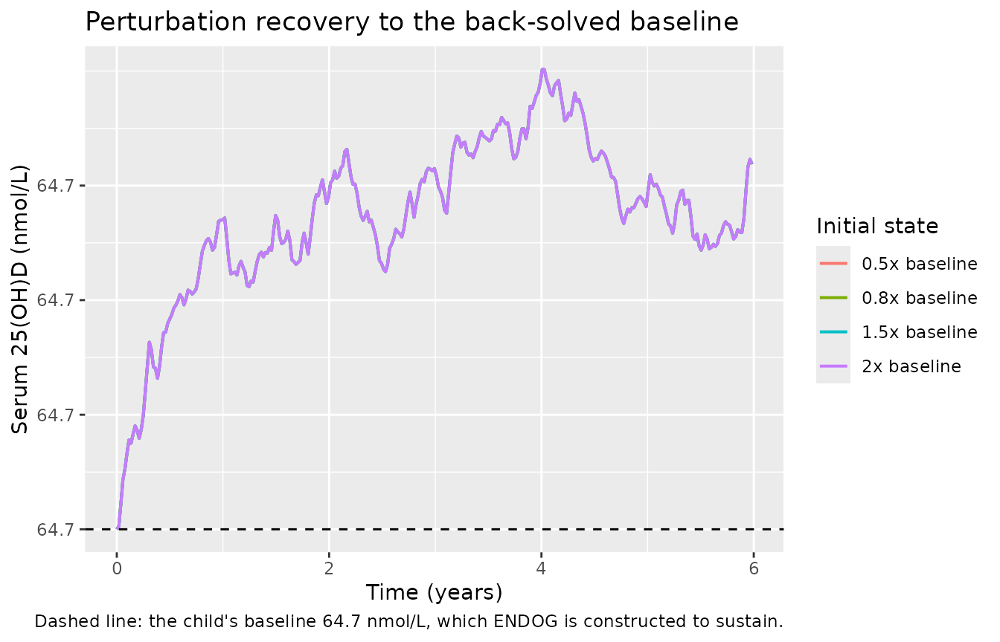
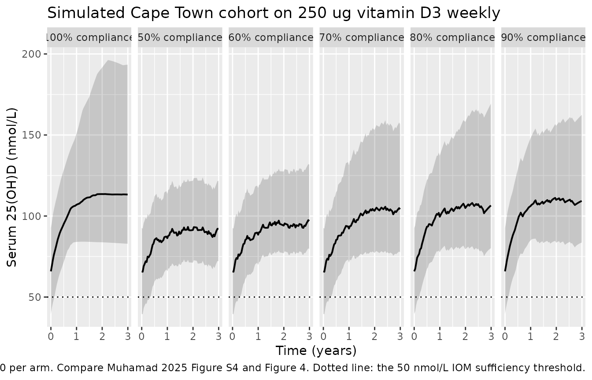
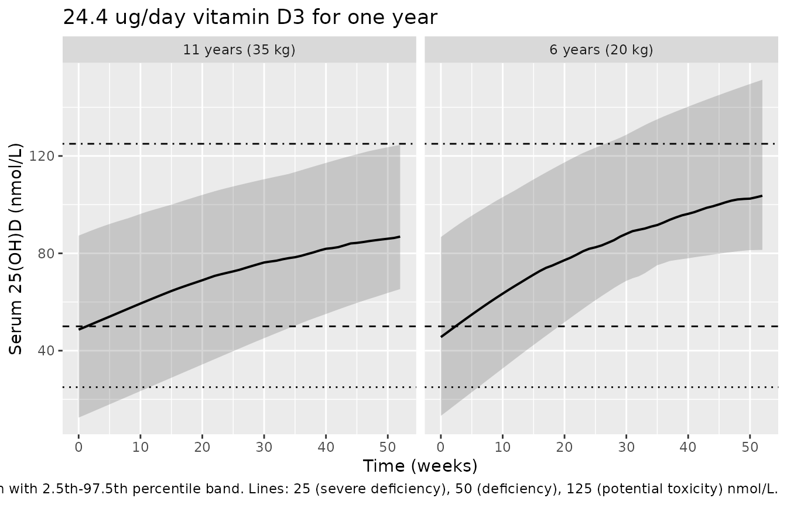
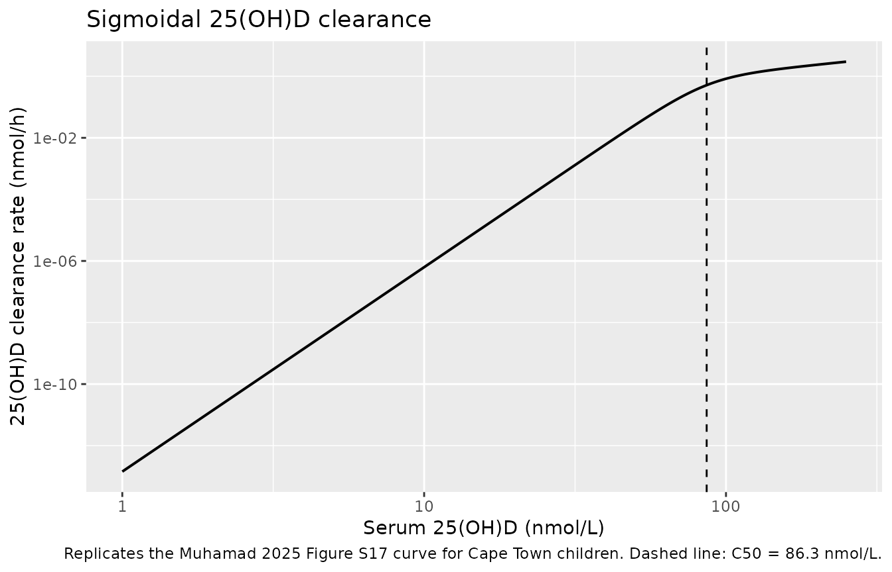
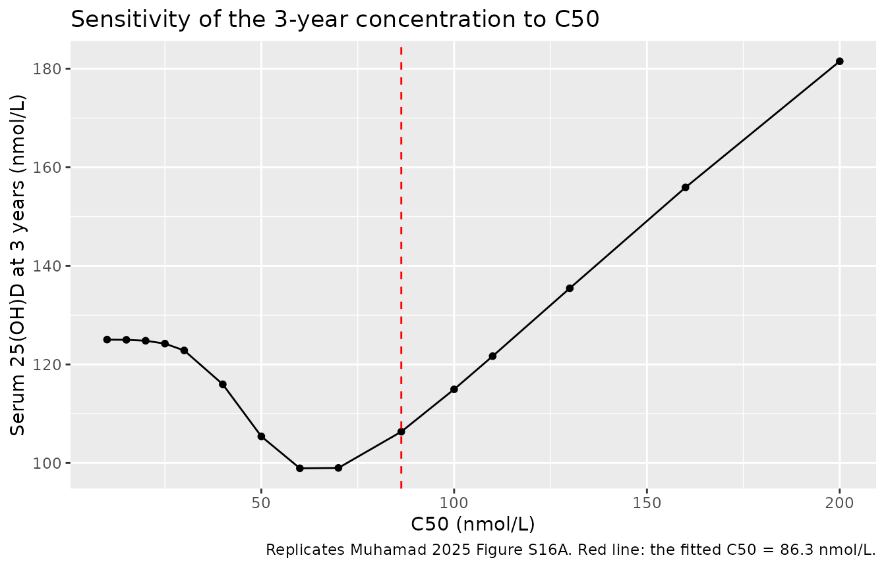

# Vitamin D3 / 25-hydroxyvitamin D PBPK in schoolchildren (Muhamad 2025)

## Model and source

- Citation: Muhamad N, Walker N, Middelkoop K, Ganmaa D, Martineau AR,
  You T. Physiologically Based Pharmacokinetic Modelling of Serum
  25-Hydroxyvitamin D Concentrations in Schoolchildren Receiving Weekly
  Oral Vitamin D3 Supplementation. Nutrients. 2025;17(19):3028.
  <doi:10.3390/nu17193028>.
- Article: <https://doi.org/10.3390/nu17193028>
- Supplement: <https://www.mdpi.com/article/10.3390/nu17193028/s1>

PBPK (lumped whole-body, nlmixr2/rxode2). Serum 25-hydroxyvitamin D3 in
77 healthy Cape Town schoolchildren aged 6-11 years given 250 ug (10,000
IU) oral vitamin D3 weekly for 3 years (Muhamad 2025, final Model 9d).
Vitamin D3 moves from a gastrointestinal depot into the liver, where a
fixed fraction (1/3) of hepatic elimination forms 25(OH)D3; the
remaining vitamin D3 distributes into venous blood and a lumped
rest-of-body pool that is held in quasi-steady state with venous blood.
25(OH)D3 is carried as five compartments - venous blood, arterial blood,
liver, fat mass and lean mass - and is eliminated from the liver by a
sigmoidal, concentration-dependent clearance that rises with 25(OH)D3
and so produces the less than dose-proportional exposure that vitamin D
is known for. A per-child constant input ENDOG, representing combined
cutaneous synthesis and dietary intake, is back-calculated so the whole
system starts exactly at that child’s measured baseline 25(OH)D3.
Compartment volumes scale linearly with body weight (30 kg reference)
and the maximum clearance rate constant allometrically with an exponent
of 0.75; the fat-mass and lean-mass split is driven by the BMI-for-age
Z-score. Only the maximum clearance rate constant and the fat-mass
partition coefficient were estimated - every other value was fixed from
the authors’ earlier healthy-adult model. Combined additive and
proportional residual error; interindividual variability on the maximum
clearance rate constant only.

This is the final model of the paper, **Model 9d** in the supplement’s
model ladder (Table S5), the one Table 2 reports parameter estimates for
and the one Table S5 marks “Best model”.

## Population

| Field | Value |
|:---|:---|
| species | human |
| n_subjects | 77 |
| n_studies | 1 |
| age_range | 6-11 years |
| age_median | 8.94 years (mean; SD 1.29) |
| weight_median | 30.57 kg (mean; SD 8.99) |
| height_median | 149 cm (mean; SD 10.91) |
| bmi_median | 17.75 kg/m^2 (mean; SD 3.46) |
| sex_female_pct | 61.04 |
| disease_state | healthy schoolchildren (no vitamin D-related disease) |
| dose_range | 250 ug (10,000 IU) oral vitamin D3 once weekly for 3 years |
| regions | Klipfontein district, Cape Town, South Africa |
| notes | Baseline characteristics from Muhamad 2025 Table S1 (n = 77, the children with serum 25(OH)D at baseline and at 1, 2 and 3 years, who were used to fit the model). Baseline serum 25(OH)D 64.67 nmol/L, SD 14.85. Drawn from the intervention arm of the ViDiKids Cape Town trial safety sub-study (NCT02880982); baseline samples were collected March-September 2017. The published model was additionally tested, without refitting, against 463 further Cape Town children from the same trial (Section 3.3) and against 1756 Mongolian schoolchildren given 350 ug weekly in the sister ViDiKids Ulaanbaatar trial (NCT02276755, Section 3.5), whose 25(OH)D rise the model overpredicted. |

Population metadata carried in the model file (Muhamad 2025 Table S1).
{.table}

The model was fitted to the 77 children in the intervention arm of the
ViDiKids Cape Town safety sub-study who had serum 25(OH)D measured at
baseline and at 1, 2 and 3 years (Muhamad 2025 Figure 1). Each received
a weekly oral capsule of 250 ug (10,000 IU) vitamin D3 for three years.
Serum 25(OH)D3 was quantified by LC-MS/MS; serum 25(OH)D2 ran at about
1% of 25(OH)D3 and was not consistently detected, so only the D3 species
is modelled. The 6-month sampling time point was excluded from modelling
as confounded by season.

The same information is available programmatically via
`readModelDb("Muhamad_2025_cholecalciferol_pbpk")()$population`.

## Source trace

Every `ini()` entry in
`inst/modeldb/specificDrugs/Muhamad_2025_cholecalciferol_pbpk.R` carries
an in-file comment naming its source location. They are collected here.

| Quantity | Value | Source location |
|----|----|----|
| `lclmax` (CLmax) | -4.43 log h^-1 = 0.0119 (0.0102, 0.0139) | Table 2, estimated |
| `lkp_adipose_25d3` (Kp25fm) | 1.54 log = 4.66 (3.6, 6.11) | Table 2, estimated |
| `lka` (Ka) | 0.19 h^-1, fixed | Table S4 |
| `lmclh` (MCLH) | 0.222, fixed | Table S4 |
| `lkp_liver` (Kpl) | 1, fixed | Table S4 |
| `lkp_other` (Kprb) | 0.09, fixed | Table S4 |
| `lkp_liver_25d3` (Kp25l) | 1, fixed | Table S4 |
| `lkp_other_25d3` (Kp25lm) | 4, fixed | Section 3.1 + Figure S7 scan; Table S6 model 9d “FIXED” |
| `lc50` (C50) | 86.3 nmol/L, fixed | Table S4; Table S6 model 9d “FIXED” |
| `lhill` (gamma) | 5.64, fixed | Table S4; Table S6 model 9d “FIXED” |
| `fm_25d3` (Fm) | 1/3, fixed | Section 2.3 (“assumed to be 0.33”); Figures S2/S3 equations use 3 and 1/3 |
| `e_wt_clmax` | 0.75, fixed | Section 2.3; Table S5 models 3-11 |
| `etalclmax` | variance 0.332 | Table 2 footnote |
| `propSd` | 0.109 | Table 2 |
| `addSd` | 0.00249 nmol/L | Table 2 |
| Cardiac output Qco | 273 L/h | Section 2.2; Table S3 |
| Hepatic flow Ql | 61.97 L/h | Table S2, Table S3 |
| Rest-of-body flow Qrb | 211.03 L/h | Table S3 (`Qrb = Qco - Ql`) |
| Adipose flow Qfm | 14.20 L/h | Table S2, Adipose row |
| Vven, Vl, Vart, Vrb at 30 kg | 1.80, 0.77, 0.60, 26.83 L | Table S3 |
| Vitamin D3 ODEs, ENDOG, initial conditions | n/a | Figure S3 (models 9-10) |
| Volume and CLmax weight scaling | n/a | Table S5, models 7-10 |
| Fat / lean mass from ZBMI | n/a | Table S5 footnote (after Monasor-Ortola 2021) |
| Sigmoidal 25(OH)D clearance | n/a | Section 2.3; Figure S17 |

### Units of every ODE term

Mechanistic models mix concentrations, amounts, flows and rate
constants, so the units are tabulated explicitly.

| Symbol | Meaning | Units |
|----|----|----|
| `depot`, `venous`, `liver` | vitamin D3 amounts | nmol |
| `venous_25d3`, `arterial_25d3`, `liver_25d3`, `adipose_25d3`, `other_25d3` | 25(OH)D3 amounts | nmol |
| `q_co`, `q_liver`, `q_other`, `q_adipose`, `q_lean` | blood flows | L/h |
| `v_venous`, `v_arterial`, `v_liver`, `v_adipose`, `v_lean` | volumes | L |
| `ka` | absorption rate constant | 1/h |
| `mclh`, `clmax` | hepatic clearances | L/h (see Errata) |
| `c50` | half-maximal 25(OH)D3 concentration | nmol/L |
| `hill`, `fm_25d3`, `kp_*`, `ffm` | shape / partition / fraction | unitless |
| `endog` | endogenous vitamin D3 input | nmol/h |
| `Cc` | serum 25(OH)D3 | nmol/L |

Each transport term is `flow x concentration` = `L/h x nmol/L` =
`nmol/h`, matching `d/dt(amount)`. Each elimination term is
`clearance x concentration`, also `nmol/h`. `endog` is
`clearance x concentration` as well, since the sigmoid and `fm_25d3` are
unitless. Every ODE line therefore balances at `nmol/h`. The one caveat
is that Table S4 and Table 2 *label* `MCLH` and `CLmax` as `h^-1`; the
published equations require them to multiply a concentration and yield
an amount rate, i.e. L/h. See Errata.

## Structural identities

These check the packaged numbers against arithmetic the paper states
independently of any simulation.

``` r

ini_df <- ui$iniDf
th <- function(nm) ini_df$est[match(nm, ini_df$name)]

clmax_30 <- exp(th("lclmax"))
clmax_70 <- clmax_30 * (70 / 30)^th("e_wt_clmax")
omega_clmax <- ini_df$est[ini_df$name == "etalclmax" &
                            !is.na(ini_df$neta1)][1]
iiv_cv <- sqrt(exp(omega_clmax) - 1) * 100

# Body composition of the average fitted child (Muhamad 2025 Section 4.1).
ffm_of <- function(z) ifelse(z > 6.19, 0.49,
                             pmax((28.61 + 7.82 * z - 0.91 * z^2 + 0.03 * z^3) / 100, 0.05))
wt0 <- 30
fm_kg <- wt0 * ffm_of(0)
lm_kg <- wt0 * (1 - ffm_of(0)) - (1.80 + 0.77 + 0.60) * wt0 / 30

vd_table2  <- 1.80 + 0.60 + 0.77 * exp(th("lkp_liver_25d3")) +
  fm_kg * exp(th("lkp_adipose_25d3")) + lm_kg * exp(th("lkp_other_25d3"))
vd_sec41   <- 1.80 + 0.60 + 0.77 * 1 + fm_kg * 4 + lm_kg * 4.71

tibble::tribble(
  ~Quantity,                                  ~Packaged,          ~Published,                 ~Source,
  "CLmax at 30 kg (1/h)",                     round(clmax_30, 5),  0.0119,                    "Table 2",
  "CLmax at 70 kg (1/h)",                     round(clmax_70, 5),  0.0225,                    "Section 4.2",
  "IIV on CLmax (%CV)",                       round(iiv_cv, 1),    62.8,                      "Table 2",
  "Fat mass, 30 kg child at ZBMI 0 (kg)",     round(fm_kg, 2),     8.58,                      "Section 4.1",
  "Lean mass, 30 kg child at ZBMI 0 (kg)",    round(lm_kg, 2),    18.25,                      "Section 4.1",
  "Vd for 25(OH)D (L), Table 2 partitions",   round(vd_table2, 1), NA_real_,                  "derived",
  "Vd for 25(OH)D (L), Section 4.1 as printed", round(vd_sec41, 1), 123,                      "Section 4.1"
) |>
  knitr::kable(caption = "Structural identities: packaged model vs. published values.")
```

| Quantity                                   |  Packaged | Published | Source      |
|:-------------------------------------------|----------:|----------:|:------------|
| CLmax at 30 kg (1/h)                       |   0.01191 |    0.0119 | Table 2     |
| CLmax at 70 kg (1/h)                       |   0.02249 |    0.0225 | Section 4.2 |
| IIV on CLmax (%CV)                         |  62.70000 |   62.8000 | Table 2     |
| Fat mass, 30 kg child at ZBMI 0 (kg)       |   8.58000 |    8.5800 | Section 4.1 |
| Lean mass, 30 kg child at ZBMI 0 (kg)      |  18.25000 |   18.2500 | Section 4.1 |
| Vd for 25(OH)D (L), Table 2 partitions     | 116.20000 |        NA | derived     |
| Vd for 25(OH)D (L), Section 4.1 as printed | 123.40000 |  123.0000 | Section 4.1 |

Structural identities: packaged model vs. published values. {.table}

``` r


stopifnot(
  abs(clmax_30 - 0.0119) < 5e-5,     # Table 2 rounds to 3 significant figures
  abs(clmax_70 - 0.0225) < 5e-5,     # Section 4.2 allometric extrapolation
  abs(iiv_cv - 62.8) < 0.1,          # Table 2 footnote back-transform
  abs(fm_kg - 8.58) < 0.01,          # Section 4.1 body composition
  abs(lm_kg - 18.25) < 0.01,
  abs(vd_sec41 - 123) < 0.5          # Section 4.1 reproduces only with its own (swapped) partitions
)
```

The last two rows are the one place where the paper contradicts itself:
the Discussion’s volume-of-distribution arithmetic reproduces its stated
123 L only if the fat-mass partition is 4 and the lean-mass partition
4.71, i.e. with the two coefficients exchanged relative to Table 2
(`Kp25fm` = 4.66 estimated, `Kp25lm` = 4 fixed) and with 4.71 =
exp(1.55) rather than exp(1.54). Table 2, Table 1, Table S6 model 9d,
Figure S7 and the Section 4.2 prose all agree with each other, so the
packaged model follows them; the Discussion arithmetic is treated as the
outlier. With the Table 2 partitions the same calculation gives 116 L,
which remains inside the 97-122 L range the paper compares itself
against.

### Body-composition mass balance

The supplement prints `LM3Y` using the *baseline* weight while the
`FM3Y` directly above it uses the 3-year weight. Read literally, lean
mass would be frozen while fat mass grew and total body volume would no
longer equal body weight. Using the terminal weight in both restores the
identity exactly.

``` r

mass_balance <- tidyr::crossing(WT = c(15, 20, 30, 45, 60), ZBMI = c(-3, -1, 0, 1, 2, 3, 7)) |>
  mutate(
    fFM   = ffm_of(ZBMI),
    Vfm   = WT * fFM,
    Vlm   = WT * (1 - fFM) - (1.80 + 0.77 + 0.60) * WT / 30,
    Vblood_liver = (1.80 + 0.77 + 0.60) * WT / 30,
    total = Vfm + Vlm + Vblood_liver,
    resid = total - WT
  )
stopifnot(max(abs(mass_balance$resid)) < 1e-10, all(mass_balance$Vlm > 0))
cat(sprintf("Vfm + Vlm + Vven + Vl + Vart equals body weight to %.2e kg over %d (WT, ZBMI) combinations.\n",
            max(abs(mass_balance$resid)), nrow(mass_balance)))
#> Vfm + Vlm + Vven + Vl + Vart equals body weight to 7.11e-15 kg over 35 (WT, ZBMI) combinations.
```

## Validation 1 – the untreated system holds at baseline

The defining feature of this model is that the per-child endogenous
vitamin D3 input `ENDOG` is back-solved so that formation and the
sigmoidal clearance balance exactly at that child’s measured baseline.
With no supplement, serum 25(OH)D3 must therefore sit flat at `D25OH_BL`
forever. This is the single strongest check on the transcription: it
fails if any rate constant has the wrong sign, if a term is missing, if
an initial condition is mis-scaled by a volume or partition coefficient,
or if the `3` and `1/3` stoichiometry factors do not cancel.

``` r

mod <- ui
mod_typ <- rxode2::zeroRe(mod)

hold_grid <- tidyr::crossing(
  D25OH_BL = c(20, 40, 64.7, 90, 120),
  WT       = c(18, 30, 50),
  BMIZ     = c(-2, 0, 2)
) |>
  mutate(id = row_number())

hold_ev <- hold_grid |>
  tidyr::crossing(time = seq(0, H_3Y, by = 24 * 14)) |>
  mutate(evid = 0L, amt = NA_real_, cmt = "venous_25d3") |>
  arrange(id, time)

hold <- SOLVE(mod_typ, hold_ev) |> as.data.frame()
#> ℹ omega/sigma items treated as zero: 'etalclmax'
#> Warning: multi-subject simulation without without 'omega'
if (is.null(hold$id)) hold$id <- 1L
hold$baseline <- hold_grid$D25OH_BL[match(hold$id, hold_grid$id)]
stopifnot(!anyNA(hold$baseline))

hold_dev <- hold |>
  group_by(id) |>
  summarise(baseline = first(baseline), max_abs_dev = max(abs(Cc - first(baseline))),
            .groups = "drop")

cat(sprintf("Largest absolute drift over 3 years across %d (baseline, weight, ZBMI) combinations: %.3e nmol/L\n",
            nrow(hold_dev), max(hold_dev$max_abs_dev)))
#> Largest absolute drift over 3 years across 45 (baseline, weight, ZBMI) combinations: 1.728e-10 nmol/L

# Both sides of this comparison use the same drawn parameters, so the
# difference is pure numerical-integration error: a tight bound is correct
# here and is what makes the check able to catch a regression.
stopifnot(max(hold_dev$max_abs_dev) < 1e-6)
```

## Validation 2 – perturbation recovery

Displacing the 25(OH)D3 compartments away from the balanced baseline
should send the system back to it, because the clearance is a
monotonically increasing function of 25(OH)D3 while the endogenous input
is constant.

``` r

pert_ev <- tibble::tibble(id = 1L) |>
  tidyr::crossing(time = seq(0, H_3Y * 2, by = 24 * 7)) |>
  mutate(evid = 0L, amt = NA_real_, cmt = "venous_25d3",
         WT = 30, BMIZ = 0, D25OH_BL = 64.7)

bl <- 64.7
scale_states <- function(f) {
  v_ven <- 1.80; v_liv <- 0.77; v_art <- 0.60
  ffm <- ffm_of(0); v_fm <- 30 * ffm; v_lm <- 30 * (1 - ffm) - 3.17
  c(venous_25d3   = f * bl * v_ven,
    liver_25d3    = f * bl * v_liv * exp(th("lkp_liver_25d3")),
    adipose_25d3  = f * bl * v_fm  * exp(th("lkp_adipose_25d3")),
    other_25d3    = f * bl * v_lm  * exp(th("lkp_other_25d3")),
    arterial_25d3 = f * bl * v_art)
}

pert <- bind_rows(lapply(c(0.5, 0.8, 1.5, 2.0), function(f) {
  s <- SOLVE(mod_typ, pert_ev, inits = scale_states(f)) |> as.data.frame()
  s$start <- paste0(f, "x baseline")
  s
}))
#> ℹ omega/sigma items treated as zero: 'etalclmax'
#> ℹ omega/sigma items treated as zero: 'etalclmax'
#> ℹ omega/sigma items treated as zero: 'etalclmax'
#> ℹ omega/sigma items treated as zero: 'etalclmax'

ggplot(pert, aes(time / H_YEAR, Cc, colour = start)) +
  geom_line(linewidth = 0.7) +
  geom_hline(yintercept = bl, linetype = "dashed") +
  labs(x = "Time (years)", y = "Serum 25(OH)D (nmol/L)", colour = "Initial state",
       title = "Perturbation recovery to the back-solved baseline",
       caption = "Dashed line: the child's baseline 64.7 nmol/L, which ENDOG is constructed to sustain.")
```



``` r


recovery <- pert |>
  group_by(start) |>
  summarise(final = last(Cc), .groups = "drop") |>
  mutate(pct_from_baseline = 100 * (final - bl) / bl)
knitr::kable(recovery, digits = 3,
             caption = "All perturbations return to the baseline the model was built to hold.")
```

| start         | final | pct_from_baseline |
|:--------------|------:|------------------:|
| 0.5x baseline |  64.7 |                 0 |
| 0.8x baseline |  64.7 |                 0 |
| 1.5x baseline |  64.7 |                 0 |
| 2x baseline   |  64.7 |                 0 |

All perturbations return to the baseline the model was built to hold.
{.table}

``` r

stopifnot(max(abs(recovery$pct_from_baseline)) < 1)
```

## Validation 3 – flux balance at baseline

At the balanced baseline the 25(OH)D3 formation flux (a fraction `Fm` of
hepatic vitamin D3 elimination) must equal the sigmoidal clearance flux.
The paper’s `ENDOG` equation and its initial conditions imply this
algebraically; here it is confirmed numerically from the packaged
parameters.

``` r

flux_check <- function(bl_conc) {
  clmax <- exp(th("lclmax"))
  c50 <- exp(th("lc50")); hill <- exp(th("lhill")); fm <- th("fm_25d3")
  sig <- bl_conc^hill / (c50^hill + bl_conc^hill)
  endog <- clmax * sig * bl_conc / fm            # nmol/h, vitamin D3 input
  formation <- endog * fm                        # nmol/h into 25(OH)D3
  elimination <- clmax * sig * bl_conc           # nmol/h out of 25(OH)D3
  tibble::tibble(baseline = bl_conc, endog = endog,
                 formation = formation, elimination = elimination,
                 imbalance = formation - elimination)
}
fb <- bind_rows(lapply(c(20, 40, 64.7, 90, 120), flux_check))
knitr::kable(fb, digits = 8,
             caption = "25(OH)D3 formation and elimination fluxes at baseline (nmol/h).")
```

| baseline |      endog |  formation | elimination | imbalance |
|---------:|-----------:|-----------:|------------:|----------:|
|     20.0 | 0.00018742 | 0.00006247 |  0.00006247 |         0 |
|     40.0 | 0.01845574 | 0.00615191 |  0.00615191 |         0 |
|     64.7 | 0.38055471 | 0.12685157 |  0.12685157 |         0 |
|     90.0 | 1.79798668 | 0.59932889 |  0.59932889 |         0 |
|    120.0 | 3.71109296 | 1.23703099 |  1.23703099 |         0 |

25(OH)D3 formation and elimination fluxes at baseline (nmol/h). {.table}

``` r

stopifnot(max(abs(fb$imbalance)) < 1e-12)
```

## Validation 4 – the fitted Cape Town cohort

The paper’s headline observation for the 77 fitted children is a mean
three-year rise of 32.2 nmol/L (95% CI -3.2 to 65.8), against 25.8
nmol/L (8.3 to 47.2) in the 463 children reserved for testing (Sections
3.3 and 3.5, Figures S13B and S13G).

Doses were dispensed during school terms and supervised by parents
during holidays and COVID-19 lockdowns, so real compliance was below
100%; the paper reports the compliance distribution only graphically
(Figure S13I) and gives no summary number. Rather than invent one, the
simulation is run across a range of compliance levels so the observed
rise can be located within it.

``` r

set.seed(20250923)
N <- 150

# ZBMI bands and frequencies, Muhamad 2025 Table S1.
zbands <- tibble::tribble(
  ~lo, ~hi, ~pct,
  -3,  -2,  1.30,
  -2,  -1,  9.09,
  -1,   1, 63.64,
   1,   2, 18.18,
   2,   3,  7.79
)
band <- sample(seq_len(nrow(zbands)), N, replace = TRUE, prob = zbands$pct)
subj <- tibble::tibble(
  id       = seq_len(N),
  BMIZ     = runif(N, zbands$lo[band], zbands$hi[band]),
  # Table S1: weight 30.57 (SD 8.99) kg, baseline 25(OH)D 64.67 (SD 14.85) nmol/L
  WT0      = pmax(12, rnorm(N, 30.57, 8.99)),
  D25OH_BL = pmax(10, rnorm(N, 64.67, 14.85)),
  # Table S1: 30 of 77 male. Section 2.6 growth rates: boys 3.0, girls 3.4 kg/year.
  female   = runif(N) < (1 - 30 / 77)
) |>
  mutate(growth_kg_yr = ifelse(female, 3.4, 3.0))

# Dose times for one compliance level: thin the weekly schedule at random,
# which reflects missed capsules better than truncating the tail would. One
# random priority order is drawn once and each compliance level takes a prefix
# of it, so the schedules are NESTED -- a 70% child receives every dose a 60%
# child received, plus more. That makes the sweep a common-random-numbers
# comparison and monotone by construction, instead of confounding compliance
# with a fresh random draw at each level.
all_dose_times <- seq(0, H_3Y - 1, by = 24 * 7)
dose_priority <- sample(seq_along(all_dose_times))
dose_times <- function(comp) {
  sort(all_dose_times[dose_priority[seq_len(round(length(all_dose_times) * comp))]])
}

build_events <- function(comp, id_offset) {
  obs_t <- seq(0, H_3Y, by = 24 * 14)
  dt <- dose_times(comp)
  s <- subj |> mutate(id = id + id_offset)
  doses <- s |> tidyr::crossing(time = dt) |>
    mutate(evid = 1L, amt = ug_to_nmol(250), cmt = "depot")
  obs <- s |> tidyr::crossing(time = obs_t) |>
    mutate(evid = 0L, amt = NA_real_, cmt = "venous_25d3")
  bind_rows(doses, obs) |>
    mutate(WT = WT0 + growth_kg_yr * time / H_YEAR,
           compliance = comp) |>
    arrange(id, time, desc(evid)) |>
    select(id, time, evid, amt, cmt, WT, BMIZ, D25OH_BL, compliance)
}

comp_levels <- c(0.5, 0.6, 0.7, 0.8, 0.9, 1.0)
events <- bind_rows(lapply(seq_along(comp_levels), function(i)
  build_events(comp_levels[i], (i - 1L) * N)))
stopifnot(!anyDuplicated(unique(events[, c("id", "time", "evid")])))

sim <- SOLVE(mod, events, keep = "compliance") |> as.data.frame()
```

``` r

# rxSolve returns one row per observation record and no `evid` column, so no
# filtering is needed here.
delta <- sim |>
  # Cc at time 0 is exactly D25OH_BL (Validation 1), so the first observation
  # is the child's baseline; no covariate needs to be carried through.
  group_by(compliance, id) |>
  summarise(rise = last(Cc) - first(Cc), .groups = "drop") |>
  group_by(compliance) |>
  summarise(mean_rise = mean(rise),
            lo = quantile(rise, 0.025), hi = quantile(rise, 0.975),
            .groups = "drop")

knitr::kable(delta, digits = 1,
             caption = paste("Simulated mean 3-year rise in serum 25(OH)D by compliance.",
                             "Observed: 32.2 nmol/L (fitted cohort), 25.8 nmol/L (test cohort)."))
```

| compliance | mean_rise |   lo |    hi |
|-----------:|----------:|-----:|------:|
|        0.5 |      27.7 |  7.9 |  57.8 |
|        0.6 |      33.9 | 10.8 |  67.2 |
|        0.7 |      41.6 | 14.9 |  92.4 |
|        0.8 |      46.6 | 13.2 | 110.7 |
|        0.9 |      49.6 | 13.4 | 110.6 |
|        1.0 |      57.9 | 14.0 | 157.9 |

Simulated mean 3-year rise in serum 25(OH)D by compliance. Observed:
32.2 nmol/L (fitted cohort), 25.8 nmol/L (test cohort). {.table}

``` r


obs_fit <- 32.2
bracket_lo <- min(delta$mean_rise); bracket_hi <- max(delta$mean_rise)
cat(sprintf("Simulated mean rise spans %.1f to %.1f nmol/L over compliance %.0f-%.0f%%; observed %.1f nmol/L.\n",
            bracket_lo, bracket_hi, 100 * min(comp_levels), 100 * max(comp_levels), obs_fit))
#> Simulated mean rise spans 27.7 to 57.9 nmol/L over compliance 50-100%; observed 32.2 nmol/L.

stopifnot(
  # The observed rise must fall inside the compliance range the trial plausibly
  # spans -- this is the substantive check that the dose, the molar conversion,
  # the clearance and the volumes are all right. A transcription error of any
  # size moves the whole family of curves off the observed value.
  bracket_lo < obs_fit, obs_fit < bracket_hi,
  # Monotone in compliance, as it must be.
  all(diff(delta$mean_rise) > 0)
)
```

``` r

sim |>
  group_by(compliance, time) |>
  summarise(Q05 = quantile(Cc, 0.05), Q50 = median(Cc), Q95 = quantile(Cc, 0.95),
            .groups = "drop") |>
  mutate(compliance = paste0(100 * compliance, "% compliance")) |>
  ggplot(aes(time / H_YEAR, Q50)) +
  geom_ribbon(aes(ymin = Q05, ymax = Q95), alpha = 0.2) +
  geom_line(linewidth = 0.7) +
  geom_hline(yintercept = 50, linetype = "dotted") +
  facet_wrap(~compliance, nrow = 1) +
  labs(x = "Time (years)", y = "Serum 25(OH)D (nmol/L)",
       title = "Simulated Cape Town cohort on 250 ug vitamin D3 weekly",
       caption = paste("Median with 5th-95th percentile band; n =", N,
                       "per arm. Compare Muhamad 2025 Figure S4 and Figure 4.",
                       "Dotted line: the 50 nmol/L IOM sufficiency threshold."))
```



## Validation 5 – Cashman’s 24.4 ug/day in European children (Figure 6)

Section 3.4 simulates the 24.4 ug/day intake that Cashman 2021 derived
as the requirement for 97.5% of children aged 2-17 to hold serum 25(OH)D
above 50 nmol/L, and reports that 6-year-olds cross the threshold within
about 21 weeks and 11-year-olds around 39 weeks – the older, heavier
children taking longer because their larger volume of distribution damps
the rise.

The exact cohort cannot be rebuilt here: the baseline 25(OH)D
percentiles come from Wolters 2022 and the weights from the WHO growth
standards, neither of which is on disk. Baseline is therefore sampled
uniformly over the 10-90 nmol/L bounds the paper itself assumed, and the
two ages are represented by their approximate WHO median weights (see
Assumptions). Those choices make the threshold test *harder* than the
paper’s, because a uniform draw puts more children near 10 nmol/L than
the real distribution does. What is asserted below is therefore the
claim that does not depend on them: the ordering of the two age groups,
and that both reach sufficiency inside a year.

``` r

set.seed(4242)
NC <- 150
cashman_cohort <- function(wt, label, id_offset) {
  s <- tibble::tibble(
    id = id_offset + seq_len(NC),
    WT = wt,
    BMIZ = rnorm(NC, 0, 1),
    D25OH_BL = runif(NC, 10, 90),      # paper's assumed bounds, Section 2.5
    agegrp = label
  )
  doses <- s |> tidyr::crossing(time = seq(0, H_YEAR - 1, by = 24)) |>
    mutate(evid = 1L, amt = ug_to_nmol(24.4), cmt = "depot")
  obs <- s |> tidyr::crossing(time = seq(0, H_YEAR, by = 24 * 7)) |>
    mutate(evid = 0L, amt = NA_real_, cmt = "venous_25d3")
  bind_rows(doses, obs) |> arrange(id, time, desc(evid))
}
cash_ev <- bind_rows(
  cashman_cohort(20, "6 years (20 kg)", 0L),
  cashman_cohort(35, "11 years (35 kg)", NC)
)
stopifnot(!anyDuplicated(unique(cash_ev[, c("id", "time", "evid")])))

cash <- SOLVE(mod, cash_ev, keep = c("agegrp")) |> as.data.frame()

cash_q <- cash |>
  group_by(agegrp, time) |>
  summarise(Q025 = quantile(Cc, 0.025), Q50 = median(Cc), Q975 = quantile(Cc, 0.975),
            .groups = "drop")

ggplot(cash_q, aes(time / (24 * 7), Q50)) +
  geom_ribbon(aes(ymin = Q025, ymax = Q975), alpha = 0.2) +
  geom_line(linewidth = 0.7) +
  # One layer per threshold: geom_hline takes `linetype` as a scalar
  # parameter, so a length-3 vector is an aesthetics-length error.
  geom_hline(yintercept = 25, linetype = "dotted") +
  geom_hline(yintercept = 50, linetype = "dashed") +
  geom_hline(yintercept = 125, linetype = "dotdash") +
  facet_wrap(~agegrp) +
  labs(x = "Time (weeks)", y = "Serum 25(OH)D (nmol/L)",
       title = "24.4 ug/day vitamin D3 for one year",
       caption = paste("Replicates Muhamad 2025 Figure 6. Median with 2.5th-97.5th percentile band.",
                       "Lines: 25 (severe deficiency), 50 (deficiency), 125 (potential toxicity) nmol/L."))
```



``` r


week_cross <- cash_q |>
  group_by(agegrp) |>
  summarise(week_2p5_crosses_50 = {
    w <- time[Q025 >= 50] / (24 * 7)
    if (length(w)) min(w) else NA_real_
  },
  median_at_1y = Q50[which.max(time)],
  pct_above_50_at_1y = NA_real_, .groups = "drop")

pct_1y <- cash |> filter(time == max(time)) |>
  group_by(agegrp) |> summarise(p = 100 * mean(Cc >= 50), .groups = "drop")
week_cross$pct_above_50_at_1y <- pct_1y$p[match(week_cross$agegrp, pct_1y$agegrp)]

knitr::kable(week_cross, digits = 1,
             caption = paste("Week at which the 2.5th percentile crosses 50 nmol/L.",
                             "Muhamad 2025 Section 3.4 reports about 21 weeks at 6 years",
                             "and about 39 weeks at 11 years."))
```

| agegrp           | week_2p5_crosses_50 | median_at_1y | pct_above_50_at_1y |
|:-----------------|--------------------:|-------------:|-------------------:|
| 11 years (35 kg) |                  35 |         86.9 |                100 |
| 6 years (20 kg)  |                  20 |        103.7 |                100 |

Week at which the 2.5th percentile crosses 50 nmol/L. Muhamad 2025
Section 3.4 reports about 21 weeks at 6 years and about 39 weeks at 11
years. {.table}

``` r


w6  <- week_cross$week_2p5_crosses_50[week_cross$agegrp == "6 years (20 kg)"]
w11 <- week_cross$week_2p5_crosses_50[week_cross$agegrp == "11 years (35 kg)"]
stopifnot(
  # The paper's mechanistic claim: heavier children take longer. Robust to the
  # baseline distribution and to the exact weights assumed. The assertions stay
  # off the crossing weeks themselves: a 2.5th percentile of 150 subjects is a
  # tail statistic, and the extreme of a random cohort is not reproducible
  # across rxode2 versions even under a fixed seed.
  is.finite(w6), is.finite(w11), w6 < w11, w6 <= 52, w11 <= 52,
  # Both age groups reach sufficiency inside the simulated year, and neither
  # median approaches the 125 nmol/L potential-toxicity line.
  all(week_cross$pct_above_50_at_1y > 97.5),
  all(week_cross$median_at_1y < 125)
)
```

## Validation 6 – the Mongolian cohort is overpredicted (Figure S14)

Section 3.5 is the paper’s negative result: applying the Cape Town model
to 1756 Mongolian children on 350 ug weekly *overpredicts* their rise.
The observed Mongolian rise was 40.6 nmol/L (95% CI -2.9 to 88.9) from a
mean baseline of 38 nmol/L, against a Cape Town baseline of 64 nmol/L,
at similar weights. Raising CLmax four-fold to 0.048 h^-1 reduces but
does not remove the overprediction (Figure S14B).

``` r

set.seed(1756)
NM <- 150
mong <- tibble::tibble(
  id = seq_len(NM),
  BMIZ = rnorm(NM, 0, 1),
  WT0 = pmax(12, rnorm(NM, 30.57, 8.99)),   # "mean baseline weight was similar for both studies"
  D25OH_BL = pmax(14.2, rnorm(NM, 38, 14))  # mean 38 nmol/L; LLOQ gate 14.2 nmol/L
)
mong_ev <- bind_rows(
  mong |> tidyr::crossing(time = seq(0, H_3Y - 1, by = 24 * 7)) |>
    mutate(evid = 1L, amt = ug_to_nmol(350), cmt = "depot"),
  mong |> tidyr::crossing(time = seq(0, H_3Y, by = 24 * 30)) |>
    mutate(evid = 0L, amt = NA_real_, cmt = "venous_25d3")
) |>
  mutate(WT = WT0 + 3.16 * time / H_YEAR) |>
  arrange(id, time, desc(evid)) |>
  select(id, time, evid, amt, cmt, WT, BMIZ, D25OH_BL)

mong_rise <- function(model, label) {
  s <- SOLVE(model, mong_ev) |> as.data.frame()
  s |> group_by(id) |>
    summarise(rise = last(Cc) - first(Cc), .groups = "drop") |>
    summarise(scenario = label, mean_rise = mean(rise),
              lo = quantile(rise, 0.025), hi = quantile(rise, 0.975))
}

mod_4x <- rxode2::ini(mod, lclmax = log(0.048))  # Section 3.5 / Figure S14B: CLmax raised 4-fold to 0.048 1/h
#> ℹ change initial estimate of `lclmax` to `-3.03655426807425`
mong_res <- bind_rows(
  mong_rise(mod, "Cape Town model (CLmax = 0.0119 1/h)"),
  mong_rise(mod_4x, "4x CLmax (0.048 1/h)")
) |>
  bind_rows(tibble::tibble(scenario = "Observed (Muhamad 2025 Figure S13B)",
                           mean_rise = 40.6, lo = -2.9, hi = 88.9))

knitr::kable(mong_res, digits = 1,
             caption = "Mean 3-year rise in serum 25(OH)D, Mongolian children on 350 ug weekly.")
```

| scenario                             | mean_rise |   lo |    hi |
|:-------------------------------------|----------:|-----:|------:|
| Cape Town model (CLmax = 0.0119 1/h) |     101.7 | 34.2 | 197.8 |
| 4x CLmax (0.048 1/h)                 |      44.7 | 16.1 |  75.3 |
| Observed (Muhamad 2025 Figure S13B)  |      40.6 | -2.9 |  88.9 |

Mean 3-year rise in serum 25(OH)D, Mongolian children on 350 ug weekly.
{.table}

``` r


sim_base <- mong_res$mean_rise[mong_res$scenario == "Cape Town model (CLmax = 0.0119 1/h)"]
sim_4x   <- mong_res$mean_rise[mong_res$scenario == "4x CLmax (0.048 1/h)"]
cat(sprintf("Overprediction: %+.1f nmol/L at the fitted CLmax, %+.1f nmol/L at 4x CLmax (observed %.1f).\n",
            sim_base - 40.6, sim_4x - 40.6, 40.6))
#> Overprediction: +61.1 nmol/L at the fitted CLmax, +4.1 nmol/L at 4x CLmax (observed 40.6).
stopifnot(
  sim_base > 40.6,          # the model overpredicts, as the paper reports
  sim_4x < sim_base,        # 4x CLmax reduces the overprediction
  sim_4x > 40.6             # but does not remove it (Section 3.5, Figure S14B)
)
```

## Validation 7 – nonlinear clearance and the non-monotone C50 response

The sigmoidal clearance is what makes vitamin D exposure rise less than
in proportion to dose (Section 4.4). Figure S17 plots the clearance rate
against 25(OH)D; Figure S16 sweeps C50 and reports the distinctive
finding that the three-year concentration is “sensitive to C50 \>= 30
nmol/L but the relationship was not monotonic”.

``` r

conc <- seq(1, 250, length.out = 400)
clmax <- exp(th("lclmax")); c50 <- exp(th("lc50")); hill <- exp(th("lhill"))
tibble::tibble(conc = conc,
               rate = clmax * conc^hill / (c50^hill + conc^hill) * conc) |>
  ggplot(aes(conc, rate)) +
  geom_line(linewidth = 0.7) +
  geom_vline(xintercept = c50, linetype = "dashed") +
  scale_x_log10() + scale_y_log10() +
  labs(x = "Serum 25(OH)D (nmol/L)", y = "25(OH)D clearance rate (nmol/h)",
       title = "Sigmoidal 25(OH)D clearance",
       caption = "Replicates the Muhamad 2025 Figure S17 curve for Cape Town children. Dashed line: C50 = 86.3 nmol/L.")
```



``` r

# Figure S16A: baseline weight 30 kg, baseline 25(OH)D 50 nmol/L,
# 250 ug/week, 100% compliance, weight rising 3.16 kg/year.
s16_ev <- bind_rows(
  tibble::tibble(id = 1L, time = seq(0, H_3Y - 1, by = 24 * 7),
                 evid = 1L, amt = ug_to_nmol(250), cmt = "depot"),
  tibble::tibble(id = 1L, time = seq(0, H_3Y, by = 24 * 28),
                 evid = 0L, amt = NA_real_, cmt = "venous_25d3")
) |>
  mutate(WT = 30 + 3.16 * time / H_YEAR, BMIZ = 0, D25OH_BL = 50) |>
  arrange(time, desc(evid))

c50_grid <- c(10, 15, 20, 25, 30, 40, 50, 60, 70, 86.3, 100, 110, 130, 160, 200)
s16 <- bind_rows(lapply(c50_grid, function(v) {
  s <- SOLVE(rxode2::zeroRe(rxode2::ini(mod, lc50 = log(v))), s16_ev) |> as.data.frame()
  tibble::tibble(C50 = v, final = s$Cc[nrow(s)])
}))
#> ℹ change initial estimate of `lc50` to `2.30258509299405`
#> ℹ omega/sigma items treated as zero: 'etalclmax'
#> ℹ change initial estimate of `lc50` to `2.70805020110221`
#> ℹ omega/sigma items treated as zero: 'etalclmax'
#> ℹ change initial estimate of `lc50` to `2.99573227355399`
#> ℹ omega/sigma items treated as zero: 'etalclmax'
#> ℹ change initial estimate of `lc50` to `3.2188758248682`
#> ℹ omega/sigma items treated as zero: 'etalclmax'
#> ℹ change initial estimate of `lc50` to `3.40119738166216`
#> ℹ omega/sigma items treated as zero: 'etalclmax'
#> ℹ change initial estimate of `lc50` to `3.68887945411394`
#> ℹ omega/sigma items treated as zero: 'etalclmax'
#> ℹ change initial estimate of `lc50` to `3.91202300542815`
#> ℹ omega/sigma items treated as zero: 'etalclmax'
#> ℹ change initial estimate of `lc50` to `4.0943445622221`
#> ℹ omega/sigma items treated as zero: 'etalclmax'
#> ℹ change initial estimate of `lc50` to `4.24849524204936`
#> ℹ omega/sigma items treated as zero: 'etalclmax'
#> ℹ change initial estimate of `lc50` to `4.45782959808938`
#> ℹ omega/sigma items treated as zero: 'etalclmax'
#> ℹ change initial estimate of `lc50` to `4.60517018598809`
#> ℹ omega/sigma items treated as zero: 'etalclmax'
#> ℹ change initial estimate of `lc50` to `4.70048036579242`
#> ℹ omega/sigma items treated as zero: 'etalclmax'
#> ℹ change initial estimate of `lc50` to `4.86753445045558`
#> ℹ omega/sigma items treated as zero: 'etalclmax'
#> ℹ change initial estimate of `lc50` to `5.07517381523383`
#> ℹ omega/sigma items treated as zero: 'etalclmax'
#> ℹ change initial estimate of `lc50` to `5.29831736654804`
#> ℹ omega/sigma items treated as zero: 'etalclmax'

ggplot(s16, aes(C50, final)) +
  geom_line() + geom_point(size = 1.4) +
  geom_vline(xintercept = 86.3, linetype = "dashed", colour = "red") +
  labs(x = "C50 (nmol/L)", y = "Serum 25(OH)D at 3 years (nmol/L)",
       title = "Sensitivity of the 3-year concentration to C50",
       caption = "Replicates Muhamad 2025 Figure S16A. Red line: the fitted C50 = 86.3 nmol/L.")
```



``` r


flat_lo <- s16 |> filter(C50 <= 25)
d <- diff(s16$final)
cat(sprintf("Spread of the 3-year value over C50 in [10, 25]: %.2f nmol/L; over C50 in [30, 200]: %.1f nmol/L.\n",
            diff(range(flat_lo$final)), diff(range(s16$final[s16$C50 >= 30]))))
#> Spread of the 3-year value over C50 in [10, 25]: 0.81 nmol/L; over C50 in [30, 200]: 82.6 nmol/L.
stopifnot(
  # "sensitive to C50 >= 30 nmol/L": the low-C50 arm is essentially flat while
  # the response above 30 nmol/L spans an order of magnitude more.
  diff(range(flat_lo$final)) < 0.1 * diff(range(s16$final[s16$C50 >= 30])),
  # "the relationship was not monotonic": the sweep changes direction.
  any(d > 0) && any(d < 0)
)
```

## Validation 8 – the fat / lean blood-flow split is immaterial

Figure S3 introduces separate blood flows to fat mass and lean mass, but
no table gives their split of the 211.03 L/h rest-of-body flow. The
model file takes `Qfm` from the adipose row of Table S2 (5.2% of cardiac
output = 14.20 L/h) and gives `Qlm` the remainder, preserving the mass
balance `Qco = Ql + Qfm + Qlm` that the arterial equation requires. That
choice is shown here to be immaterial: both tissues equilibrate far
faster than 25(OH)D3 is cleared, so the three-year prediction is
insensitive to it across two orders of magnitude.

``` r

split_ev <- s16_ev |> mutate(D25OH_BL = 64.7)
# Deparse the packaged model function, substitute the adipose flow, and
# re-evaluate. This keeps the sweep honest: every other line is the shipped
# model, byte for byte.
# NB: deparse() normalises the model file's literal `14.20` to `14.2`, so the
# needle must be the deparsed form. The stopifnot() is what makes this sweep
# honest -- if the model file ever renames or re-values q_adipose, this fails
# loudly instead of silently sweeping six identical models.
model_src <- paste(deparse(readModelDb(MODEL)), collapse = "\n")
stopifnot(grepl("q_adipose <- 14.2", model_src, fixed = TRUE))

flow_sweep <- bind_rows(lapply(c(2, 5, 14.20, 40, 105, 200), function(qf) {
  txt <- sub("q_adipose <- 14.2", sprintf("q_adipose <- %.10g", qf),
             model_src, fixed = TRUE)
  f <- rxode2::rxode(eval(parse(text = txt)))
  s <- SOLVE(rxode2::zeroRe(f), split_ev) |> as.data.frame()
  tibble::tibble(Qfm = qf, Qlm = 211.03 - qf, final_3y = s$Cc[nrow(s)])
}))
#> ℹ parameter labels from comments are typically ignored in non-interactive mode
#> ℹ Need to run with the source intact to parse comments
#> ℹ omega/sigma items treated as zero: 'etalclmax'
#> ℹ parameter labels from comments are typically ignored in non-interactive mode
#> ℹ Need to run with the source intact to parse comments
#> ℹ omega/sigma items treated as zero: 'etalclmax'
#> ℹ parameter labels from comments are typically ignored in non-interactive mode
#> ℹ Need to run with the source intact to parse comments
#> ℹ omega/sigma items treated as zero: 'etalclmax'
#> ℹ parameter labels from comments are typically ignored in non-interactive mode
#> ℹ Need to run with the source intact to parse comments
#> ℹ omega/sigma items treated as zero: 'etalclmax'
#> ℹ parameter labels from comments are typically ignored in non-interactive mode
#> ℹ Need to run with the source intact to parse comments
#> ℹ omega/sigma items treated as zero: 'etalclmax'
#> ℹ parameter labels from comments are typically ignored in non-interactive mode
#> ℹ Need to run with the source intact to parse comments
#> ℹ omega/sigma items treated as zero: 'etalclmax'
knitr::kable(flow_sweep, digits = 3,
             caption = "Three-year serum 25(OH)D across a 100-fold range of the fat-mass blood flow.")
```

|   Qfm |    Qlm | final_3y |
|------:|-------:|---------:|
|   2.0 | 209.03 |  111.032 |
|   5.0 | 206.03 |  111.077 |
|  14.2 | 196.83 |  111.097 |
|  40.0 | 171.03 |  111.104 |
| 105.0 | 106.03 |  111.104 |
| 200.0 |  11.03 |  111.064 |

Three-year serum 25(OH)D across a 100-fold range of the fat-mass blood
flow. {.table}

``` r

rel_spread <- diff(range(flow_sweep$final_3y)) / mean(flow_sweep$final_3y)
cat(sprintf("Relative spread across a 100-fold change in Qfm: %.3f%%\n", 100 * rel_spread))
#> Relative spread across a 100-fold change in Qfm: 0.066%
stopifnot(rel_spread < 0.005)
```

## Why no NCA

The standard nlmixr2lib validation compares PKNCA-derived Cmax / Tmax /
AUC / half-life against published values. Muhamad 2025 reports none: the
design is one blood sample per year for three years, the analyte is an
endogenous metabolite that never returns to zero, and clearance is
deliberately concentration-dependent, so a terminal slope and an AUC
extrapolated to infinity have no published counterparts to be compared
against. Following `references/endogenous-validation.md`, the PKNCA
section is replaced by the steady-state, perturbation-recovery,
flux-balance and dimensional checks above, plus the published
quantitative claims the paper does make.

## Assumptions and deviations

**Assumptions made here, not in the paper**

- **Weight trajectory as a covariate column.** The paper interpolates
  weight linearly between the baseline and the 3-year measurement. The
  model file takes the current weight directly as the time-varying `WT`
  column, which is algebraically identical and lets the caller supply
  any trajectory; the simulations above use the paper’s own sex-specific
  growth rates (boys 3.0 kg/year, girls 3.4 kg/year, Section 2.6) and
  3.16 kg/year for the average child (Figure S16).
- **Compliance.** Reported only graphically (Figure S13). Validation 4
  sweeps 60-100% rather than assuming a value, and models missed doses
  as a random thinning of the weekly schedule.
- **Cape Town virtual cohort.** Weight and baseline 25(OH)D drawn as
  normal with the Table S1 means and SDs, ZBMI drawn uniformly inside
  the Table S1 bands. The individual patient data are not public.
- **European cohort (Validation 5).** Baseline 25(OH)D drawn uniformly
  on the 10-90 nmol/L bounds the paper assumed, because the Wolters 2022
  percentiles are not on disk; weights fixed at approximate WHO medians
  of 20 kg (6 years) and 35 kg (11 years), because the WHO tables are
  not on disk either. The assertions are restricted to the claims that
  do not depend on these choices.
- **Mongolian cohort (Validation 6).** Baseline 25(OH)D drawn normal
  with the stated mean of 38 nmol/L and truncated at the 14.2 nmol/L
  limit of quantification; the SD is not published, so 14 nmol/L was
  used. Weights taken as similar to Cape Town, per Section 3.5.
- **Molar conversion.** Doses stated in ug are converted with the
  cholecalciferol molar mass 384.64 g/mol. The paper does not state the
  conversion, but the model’s nmol/L concentration scale and the 1/3
  molar stoichiometry require it. The paper’s own 250 ug = 10,000 IU
  equivalence confirms the mass basis.

**Errata and internal inconsistencies in the source**

- **Section 4.1 volume-of-distribution arithmetic.** Reproduces its
  stated 123 L only with the fat-mass and lean-mass partition
  coefficients exchanged relative to Table 2, and with 4.71 = exp(1.55)
  in place of the tabulated exp(1.54) = 4.66. Table 1, Table 2, Table S6
  model 9d, Figure S7 and the Section 4.2 prose are mutually consistent
  and are what the model file follows. See the Structural identities
  section.
- **Supplement `LM3Y` equation.** Printed with the baseline weight where
  the neighbouring `FM3Y` uses the 3-year weight. Taken literally, lean
  mass would not grow and the body-composition identity would break; the
  terminal weight is used in both, which restores it exactly at every
  weight and ZBMI. See the mass-balance check.
- **Main-text Equations 1 and 2.** Both are garbled in the article PDF:
  Equation 1 places `Vart` in the denominator (giving nmol/L^2 rather
  than nmol) and Equation 2 renders the rest-of-body fraction inverted.
  The supplement’s Figure S2/S3 forms are dimensionally correct and are
  the ones implemented.
- **Units of MCLH and CLmax.** Table S4 labels `MCLH` and Table 2 labels
  `CLmax` as `h^-1`, but in the Figure S2/S3 equations both multiply a
  concentration to give an amount rate, which requires L/h. The
  equations are implemented exactly as printed; only the label is
  inconsistent. That the printed system is the intended one is confirmed
  by the baseline hold (Validation 1) and by the fitted cohort
  reproducing the observed three-year rise (Validation 4) – reading the
  terms as whole-body rate constants instead gives a three-year rise
  near zero.
- **Additive residual error.** Table 2 gives 0.00249 nmol/L; Table S6
  model 9d gives 0.00282. Table 2, the paper’s designated final-model
  table, is used. Both are negligible next to the 0.109 proportional
  term.
- **Fm.** Section 2.3 states 0.33, while the Figure S2/S3 equations use
  the factors 3 and 1/3. The model uses 1/3 in both places so that the
  endogenous balance closes exactly; using 0.33 and 3 would leave a 1%
  baseline drift.
- **Fat / lean blood flows.** Not tabulated. Derived from Table S2 as
  described in Validation 8, which also shows the choice does not
  matter.

**Scope**

The model is built for multi-year trajectories from sparse annual
sampling. As Section 4.3 notes, it was never calibrated against
short-term kinetics, does not represent seasonal variation (the paper
infers an 11.5 nmol/L sinusoidal amplitude in the Cape Town control
arm), was not calibrated against serum vitamin D3 itself because that
was never measured, and does not carry 1,25-dihydroxyvitamin D.
