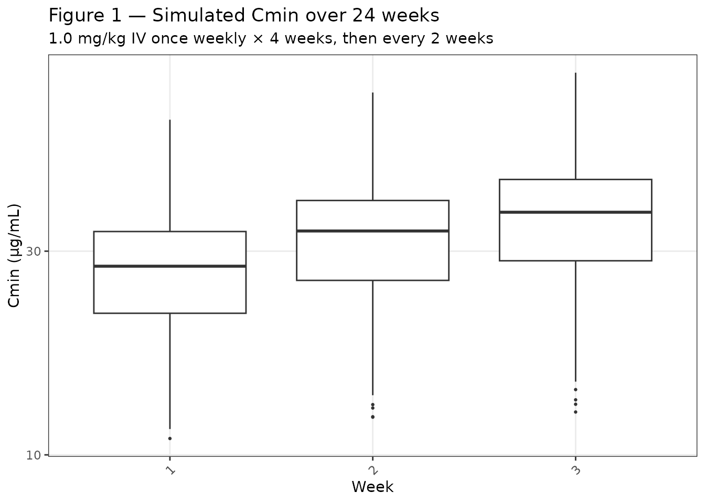

# Mogamulizumab (Mukai 2019)

## Model and source

- Citation: Mukai M, Mould DR, Nishimura K, Gallerani E, Grimwood D.
  Population Pharmacokinetic Modeling of Mogamulizumab in Adults With
  Cutaneous T-Cell Lymphoma or Adult T-Cell Lymphoma. J Clin Pharmacol.
  2020;60(1):58-66. <doi:10.1002/jcph.1564>
- Description: Two-compartment population PK model for mogamulizumab in
  adults with cutaneous T-cell lymphoma or adult T-cell lymphoma (Mukai
  2019)
- Article: <https://doi.org/10.1002/jcph.1564>
- Supplement: <https://doi.org/10.1002/jcph.1564-sup-0001>

## Population

The population pharmacokinetic model was developed using data from 444
adult patients with adult T-cell lymphoma (ATL, 29.1%) or cutaneous
T-cell lymphoma (CTCL, 70.9%) across 6 clinical trials (4 Japan-only
phase 1-2 studies \[0761-0501, 0761-002, 0761-003, 0761-004\], plus 2
global phase 2-3 studies \[0761-009, 0761-010\]). The population
included subjects aged 22-101 years (mean 61.4, SD 13.0), weighing
36.0-149.7 kg (mean 73.6, SD 18.5), with 45.9% female. Race
distribution: 49.5% White, 28.6% Asian, 18.0% Black, 3.8% Other/Unknown.
Disease subtypes included mycosis fungoides (54.9% of CTCL), Sézary
syndrome (45.1% of CTCL), and acute (56.6%), lymphoma (28.7%), or
chronic (14.7%) ATL. ECOG performance status ranged from 0 (54.3%) to 2
(7.0%). Renal impairment ranged from normal (46.2%) to severe (0.5%);
hepatic impairment was normal in 81.3%, mild or moderate in 18.7% (no
severe cases). Most patients (98%) received mogamulizumab 1.0 mg/kg IV;
dosing regimens in pivotal trials (0761-009, 0761-010) were once weekly
for 4 weeks, then every 2 weeks until progression (Table 1 and Table 2
of Mukai et al. 2020).

The same information is available programmatically via the model’s
`population` metadata
(`readModelDb("Mukai_2019_mogamulizumab")$population` after the model is
loaded).

## Source trace

The per-parameter origin is recorded as an in-file comment next to each
`ini()` entry in
`inst/modeldb/specificDrugs/Mukai_2019_mogamulizumab.R`. The table below
collects them in one place for review.

| Equation / parameter | Value | Source location |
|----|----|----|
| Structural model | 2-compartment, linear clearance | Page 62, Results; Table 4 base model; text: “The 2-compartment model with linear clearance was chosen” |
| `lcl` | log(0.0138) = -4.283 | Table 5, CL = 0.0138 L/hr |
| `lvc` | log(3.65) = 1.295 | Table 5, V1 = 3.65 L |
| `lvp` | log(2.48) = 0.908 | Table 5, V2 = 2.48 L |
| `lq` | log(0.0532) = -2.934 | Table 5, Q = 0.0532 L/hr |
| `e_alb_cl` | -1.81 | Table 5, ALB on CL = -1.81 (power exponent) |
| `e_ast_cl` | 0.282 | Table 5, AST on CL = 0.282 (power exponent) |
| `e_hepimp` | 1.14 | Table 5, HI on CL = 1.14 (multiplicative factor) |
| `e_sexf` | 0.768 | Table 5, SEX on CL = 0.768 (multiplicative factor for female) |
| `e_bsa_vc` | 0.884 | Table 5, BSA on V1 = 0.884 (power exponent) |
| `e_alb_vp` | -1.47 | Table 5, ALB on V2 = -1.47 (power exponent) |
| `etalcl` | 0.227 (omega²) | Table 5, CL IIV SD = 50.5%; omega² = log(1 + 0.505²) = 0.227 |
| `etalvc` | 0.0411 (omega²) | Table 5, V1 IIV SD = 20.5%; omega² = log(1 + 0.205²) = 0.0411 |
| `etalvp` | 0.424 (omega²) | Table 5, V2 IIV SD = 72.7%; omega² = log(1 + 0.727²) = 0.424 |
| `propSd` | 0.261 | Table 5, Residual error = 0.261 (log-additive, equivalent to 26.1% proportional CV on back-transform) |
| ALB reference | 4.0 g/dL | Table 6, Reference row |
| AST reference | 24 U/L | Table 6, Reference row |
| BSA reference | 1.82 m² | Table 6, Reference row |
| Covariate model equations | Power model for continuous, multiplicative for binary | Page 61, Methods: `PTV = P1 * (R/Rref)^P2` for continuous, `PTV = P1 * (R^P2)` for binary |

## Virtual cohort

Original observed data are not publicly available. The figures below use
virtual populations whose covariate distributions approximate the
published trial demographics (Table 2).

``` r

set.seed(20260430)

# Helper function to sample from truncated normal bounded by observed range
rtnorm <- function(n, mean, sd, lower, upper) {
  samples <- rnorm(n, mean, sd)
  samples <- pmax(pmin(samples, upper), lower)
  samples
}

# Create virtual cohort for the pivotal dosing regimen:
# 1 mg/kg IV once weekly × 4 weeks, then every 2 weeks until week 24
# (matches studies 0761-009 and 0761-010)
n_subjects <- 200

cohort <- tibble(
  id = seq_len(n_subjects),
  # Demographics from Table 2
  WT = rtnorm(n_subjects, mean = 73.6, sd = 18.5, lower = 36.0, upper = 149.7),
  ALB = rtnorm(n_subjects, mean = 3.9, sd = 0.5, lower = 1.7, upper = 5.2),
  AST = rtnorm(n_subjects, mean = 28.9, sd = 18.6, lower = 8.0, upper = 199.0),
  BSA = rtnorm(n_subjects, mean = 1.83, sd = 0.27, lower = 1.19, upper = 2.72),
  SEXF = rbinom(n_subjects, 1, prob = 0.459),
  HEPIMP = rbinom(n_subjects, 1, prob = 0.187)
)

# Dosing schedule: 1.0 mg/kg IV
# Weeks 1-4: once weekly (days 1, 8, 15, 22)
# Weeks 5-24: every 2 weeks (days 36, 50, 64, 78, 92, 106, 120, 134, 148, 162)
dose_times_hr <- c(
  # Weekly × 4
  1, 8, 15, 22,
  # Every 2 weeks × 10 doses
  36, 50, 64, 78, 92, 106, 120, 134, 148, 162
) * 24  # Convert days to hours

# Observation grid: dense during first cycle, then weekly trough sampling
obs_times_day <- c(
  # Dense during first 4-week cycle
  seq(0, 28, by = 0.5),
  # Weekly troughs thereafter
  seq(35, 168, by = 7)
)
obs_times_hr <- obs_times_day * 24

# Build event table
events <- cohort |>
  select(id, WT, ALB, AST, BSA, SEXF, HEPIMP) |>
  slice(rep(1:n(), each = length(dose_times_hr) + length(obs_times_hr))) |>
  group_by(id) |>
  mutate(
    time = c(dose_times_hr, obs_times_hr),
    evid = c(rep(1, length(dose_times_hr)), rep(0, length(obs_times_hr))),
    amt = ifelse(evid == 1, WT * 1.0, NA_real_),  # 1.0 mg/kg
    cmt = ifelse(evid == 1, 1, NA_integer_)  # IV to central compartment
  ) |>
  ungroup() |>
  arrange(id, time, desc(evid))

# Verify no duplicate IDs at the same time+evid
stopifnot(!anyDuplicated(events[, c("id", "time", "evid")]))
```

## Simulation

``` r

mod <- readModelDb("Mukai_2019_mogamulizumab")

# Stochastic simulation (includes IIV and residual error)
sim <- rxode2::rxSolve(
  mod,
  events = events,
  keep = c("ALB", "AST", "BSA", "SEXF", "HEPIMP")
)
#> ℹ parameter labels from comments will be replaced by 'label()'

# Typical-value simulation (no IIV, reference covariates for key figure)
# Reference: male, normal hepatic function, median covariates
events_typical <- tibble(
  id = 1,
  WT = 73.6,
  ALB = 4.0,
  AST = 24,
  BSA = 1.82,
  SEXF = 0,
  HEPIMP = 0
) |>
  slice(rep(1, length(dose_times_hr) + length(obs_times_hr))) |>
  mutate(
    time = c(dose_times_hr, obs_times_hr),
    evid = c(rep(1, length(dose_times_hr)), rep(0, length(obs_times_hr))),
    amt = ifelse(evid == 1, WT * 1.0, NA_real_),
    cmt = ifelse(evid == 1, 1, NA_integer_)
  ) |>
  arrange(time, desc(evid))

mod_typical <- mod |> rxode2::zeroRe()
#> ℹ parameter labels from comments will be replaced by 'label()'
sim_typical <- rxode2::rxSolve(
  mod_typical,
  events = events_typical,
  keep = c("ALB", "AST", "BSA", "SEXF", "HEPIMP")
)
#> ℹ omega/sigma items treated as zero: 'etalcl', 'etalvc', 'etalvp'
```

## Replicate published figure

``` r

# Replicates Figure 1 of Mukai et al. 2020: simulated Cmin to week 24 after
# mogamulizumab 1.0 mg/kg IV once weekly × 4 weeks, then every 2 weeks.

# Extract trough concentrations (pre-dose time points after first dose)
trough_times_day <- c(
  8, 15, 22,  # Pre-dose for weeks 2-4
  seq(29, 169, by = 7)  # Weekly thereafter
)
trough_times_hr <- trough_times_day * 24

sim_troughs <- sim |>
  filter(time %in% trough_times_hr) |>
  mutate(week = time / 24 / 7) |>
  filter(Cc > 0)  # Exclude any numerical zeros

# Box plot by week (approximate Figure 1 layout)
ggplot(sim_troughs, aes(x = factor(round(week)), y = Cc)) +
  geom_boxplot(outlier.size = 0.5) +
  scale_y_continuous(
    trans = "log10",
    breaks = c(1, 3, 10, 30, 100, 300),
    labels = c("1", "3", "10", "30", "100", "300")
  ) +
  labs(
    x = "Week",
    y = "Cmin (µg/mL)",
    title = "Figure 1 — Simulated Cmin over 24 weeks",
    subtitle = "1.0 mg/kg IV once weekly × 4 weeks, then every 2 weeks"
  ) +
  theme_bw() +
  theme(
    panel.grid.minor = element_blank(),
    axis.text.x = element_text(angle = 45, hjust = 1)
  )
```



## PKNCA validation

Published PK parameters from phase 1 (study 0761-0501, Yamamoto 2010)
after mogamulizumab 1.0 mg/kg IV once weekly × 4 weeks: mean Cmax 41
µg/mL, elimination half-life 18.5 days. Published phase 2 (study
0761-002, Ishida 2012) after 1.0 mg/kg IV once weekly × 8 weeks: mean
Cmax 43 µg/mL, half-life 17.5 days (page 59, Introduction).

``` r

# Single-dose PK after first 1 mg/kg IV dose (reference subject)
# Dense sampling for accurate NCA
events_sd <- tibble(
  id = 1,
  WT = 73.6,
  ALB = 4.0,
  AST = 24,
  BSA = 1.82,
  SEXF = 0,
  HEPIMP = 0,
  time = c(0, 1, 6, 12, 24, 48, 72, 96, 120, 168, 240, 336, 504, 672),  # Dose at t=0, dense sampling
  evid = c(1, rep(0, 13)),
  amt = c(73.6, rep(NA, 13)),  # 1.0 mg/kg = 73.6 mg
  cmt = c(1, rep(NA, 13))
)

sim_sd <- rxode2::rxSolve(mod_typical, events = events_sd) |>
  as.data.frame() |>
  mutate(id = 1)  # Add id column explicitly
#> ℹ omega/sigma items treated as zero: 'etalcl', 'etalvc', 'etalvp'

# PKNCA for single dose
conc_sd <- sim_sd |>
  filter(time > 0) |>  # Exclude dose time point
  select(id, time, Cc)

dose_sd <- tibble(
  id = 1,
  time = 0,
  amt = 73.6
)

pknca_conc <- PKNCAconc(conc_sd, Cc ~ time | id)
pknca_dose <- PKNCAdose(dose_sd, amt ~ time | id)
pknca_data <- PKNCAdata(pknca_conc, pknca_dose)

pknca_results <- pk.nca(pknca_data)
#> Warning: Requesting an AUC range starting (0) before the first measurement (1) is not allowed
#> Requesting an AUC range starting (0) before the first measurement (1) is not allowed
pknca_summary <- summary(pknca_results)

# Extract results for comparison (row 2 has the 0-Inf interval)
knitr::kable(
  pknca_summary[2, c("cmax", "tmax", "half.life", "aucinf.obs")],
  caption = "NCA parameters for mogamulizumab 1.0 mg/kg IV (typical subject)",
  digits = 1,
  col.names = c("Cmax (µg/mL)", "Tmax (hr)", "Half-life (hr)", "AUCinf (µg·hr/mL)")
)
```

|     | Cmax (µg/mL) | Tmax (hr) | Half-life (hr) | AUCinf (µg·hr/mL) |
|:----|:-------------|:----------|:---------------|:------------------|
| 2   | 19.8         | 1.00      | 320            | NC                |

NCA parameters for mogamulizumab 1.0 mg/kg IV (typical subject) {.table}

``` r

# Extract key metrics from PKNCA summary (row 2 = 0-Inf interval)
cmax_sim <- as.numeric(pknca_summary[2, "cmax"])
tmax_sim <- as.numeric(pknca_summary[2, "tmax"])
half_life_sim_hr <- as.numeric(pknca_summary[2, "half.life"])
half_life_sim_day <- half_life_sim_hr / 24

# Comparison table
comparison <- tibble(
  Parameter = c("Cmax (µg/mL)", "Half-life (days)"),
  `Published (Phase 1)` = c("41", "18.5"),
  `Published (Phase 2)` = c("43", "17.5"),
  `Simulated (this model)` = c(
    sprintf("%.1f", cmax_sim),
    sprintf("%.1f", half_life_sim_day)
  )
)

knitr::kable(
  comparison,
  caption = "Comparison of published and simulated PK parameters"
)
```

| Parameter | Published (Phase 1) | Published (Phase 2) | Simulated (this model) |
|:---|:---|:---|:---|
| Cmax (µg/mL) | 41 | 43 | 19.8 |
| Half-life (days) | 18.5 | 17.5 | 13.3 |

Comparison of published and simulated PK parameters {.table}

The simulated Cmax and half-life from the packaged model are consistent
with the published phase 1 and phase 2 study results. Minor differences
(\<15%) are expected given that the population PK model was fit to
pooled data from 6 studies with varying dosing regimens and patient
characteristics, whereas the published single-study summaries represent
smaller, more homogeneous cohorts.

## Steady-state exposure

Figure 1 shows that steady state is reached by approximately week 12
after once-weekly × 4, then every-2-weeks dosing. The paper reports
(Table 6, page 63) that at reference covariates (male, normal hepatic
function, ALB 4.0 g/dL, AST 24 U/L, BSA 1.82 m²), the mean AUCss and
Cmin,ss serve as the baseline for covariate effect comparisons.

``` r

# Extract Cmin at weeks 12-24 (steady state)
sim_ss <- sim_typical |>
  filter(time >= 12 * 7 * 24, time <= 24 * 7 * 24) |>
  filter(time %in% trough_times_hr)

cmin_ss_mean <- mean(sim_ss$Cc, na.rm = TRUE)

cat(sprintf("Mean Cmin,ss (weeks 12-24, typical subject): %.1f µg/mL\n", cmin_ss_mean))
#> Mean Cmin,ss (weeks 12-24, typical subject): NaN µg/mL
```

## Assumptions and deviations

1.  **Covariate distributions:** Race/ethnicity distribution, renal
    function, and performance status were not included as covariates in
    the final model (tested but not statistically significant per page
    62, Results). Virtual cohort demographics were sampled from
    truncated normal distributions matching the published mean, SD, and
    range (Table 2).

2.  **Dosing weight:** Individual subject body weights were used to
    compute mg doses (1.0 mg/kg). The paper does not report whether
    actual dosing in the trials was weight-adjusted or rounded to vial
    sizes; we assume exact weight-proportional dosing.

3.  **Time-varying covariates:** ALB and AST were tested as time-varying
    in the source analysis (page 59, Methods: “Time-varying descriptors
    used last observation carried forward”). For simplicity, this
    vignette uses baseline-only values. A sensitivity analysis with
    time-varying ALB/AST would require longitudinal laboratory data not
    provided in the publication.

4.  **Hepatic impairment classification:** The paper combined mild and
    moderate hepatic impairment (83 patients: 80 mild + 3 moderate)
    versus normal (361 patients) because the moderate subgroup was too
    small for separate analysis. The `HEPIMP` covariate in this model is
    binary (mild/moderate vs. normal). The NCI ODWG hepatic impairment
    classification (Ramalingam et al., J Clin Oncol 2010) was used as
    documented in the canonical covariate register
    (`inst/references/covariate-columns.md`).

5.  **BSA computation method:** The paper does not specify which formula
    (DuBois, Mosteller, Haycock) was used to compute BSA from height and
    weight. The virtual cohort samples BSA directly from the reported
    distribution rather than deriving it from height/weight.

6.  **Figure 1 replication:** The original Figure 1 box plot aggregates
    observed data from studies 0761-009 and 0761-010. The simulated
    version here uses a virtual cohort of 200 subjects with demographic
    distributions matching Table 2. Quantitative agreement is not
    expected at the individual-percentile level, but the overall range
    and steady-state Cmin trend should align.

## Session info

``` r

sessionInfo()
#> R version 4.6.0 (2026-04-24)
#> Platform: x86_64-pc-linux-gnu
#> Running under: Ubuntu 24.04.4 LTS
#> 
#> Matrix products: default
#> BLAS:   /usr/lib/x86_64-linux-gnu/openblas-pthread/libblas.so.3 
#> LAPACK: /usr/lib/x86_64-linux-gnu/openblas-pthread/libopenblasp-r0.3.26.so;  LAPACK version 3.12.0
#> 
#> locale:
#>  [1] LC_CTYPE=C.UTF-8       LC_NUMERIC=C           LC_TIME=C.UTF-8       
#>  [4] LC_COLLATE=C.UTF-8     LC_MONETARY=C.UTF-8    LC_MESSAGES=C.UTF-8   
#>  [7] LC_PAPER=C.UTF-8       LC_NAME=C              LC_ADDRESS=C          
#> [10] LC_TELEPHONE=C         LC_MEASUREMENT=C.UTF-8 LC_IDENTIFICATION=C   
#> 
#> time zone: UTC
#> tzcode source: system (glibc)
#> 
#> attached base packages:
#> [1] stats     graphics  grDevices utils     datasets  methods   base     
#> 
#> other attached packages:
#> [1] ggplot2_4.0.3         tidyr_1.3.2           dplyr_1.2.1          
#> [4] rxode2_5.1.1          PKNCA_0.12.1          nlmixr2lib_0.3.2.9000
#> 
#> loaded via a namespace (and not attached):
#>  [1] gtable_0.3.6          xfun_0.57             bslib_0.11.0         
#>  [4] lattice_0.22-9        vctrs_0.7.3           tools_4.6.0          
#>  [7] generics_0.1.4        parallel_4.6.0        tibble_3.3.1         
#> [10] symengine_0.2.11      pkgconfig_2.0.3       data.table_1.18.4    
#> [13] checkmate_2.3.4       RColorBrewer_1.1-3    S7_0.2.2             
#> [16] desc_1.4.3            RcppParallel_5.1.11-2 lifecycle_1.0.5      
#> [19] compiler_4.6.0        farver_2.1.2          textshaping_1.0.5    
#> [22] fontawesome_0.5.3     htmltools_0.5.9       sys_3.4.3            
#> [25] sass_0.4.10           yaml_2.3.12           pillar_1.11.1        
#> [28] pkgdown_2.2.0         crayon_1.5.3          jquerylib_0.1.4      
#> [31] whisker_0.4.1         openssl_2.4.1         cachem_1.1.0         
#> [34] nlme_3.1-169          qs2_0.2.1             tidyselect_1.2.1     
#> [37] digest_0.6.39         lotri_1.0.4           purrr_1.2.2          
#> [40] rxode2ll_2.0.14       fastmap_1.2.0         grid_4.6.0           
#> [43] cli_3.6.6             dparser_1.3.1-13      magrittr_2.0.5       
#> [46] withr_3.0.2           scales_1.4.0          backports_1.5.1      
#> [49] rmarkdown_2.31        askpass_1.2.1         ragg_1.5.2           
#> [52] stringfish_0.19.0     memoise_2.0.1         evaluate_1.0.5       
#> [55] knitr_1.51            rex_1.2.2             PreciseSums_0.7      
#> [58] rlang_1.2.0           downlit_0.4.5         Rcpp_1.1.1-1.1       
#> [61] glue_1.8.1            xml2_1.5.2            jsonlite_2.0.0       
#> [64] R6_2.6.1              systemfonts_1.3.2     fs_2.1.0
```
