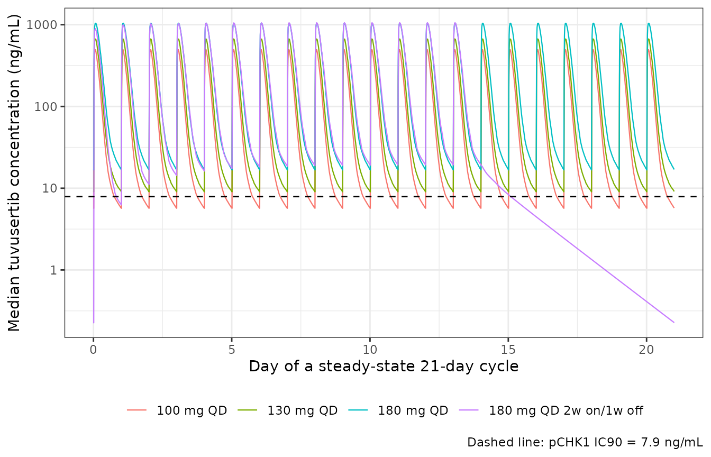
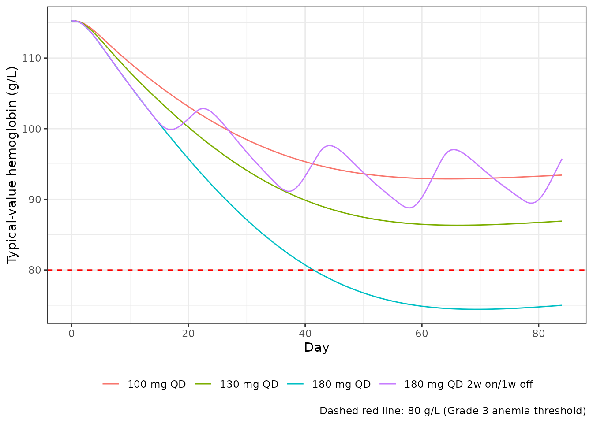
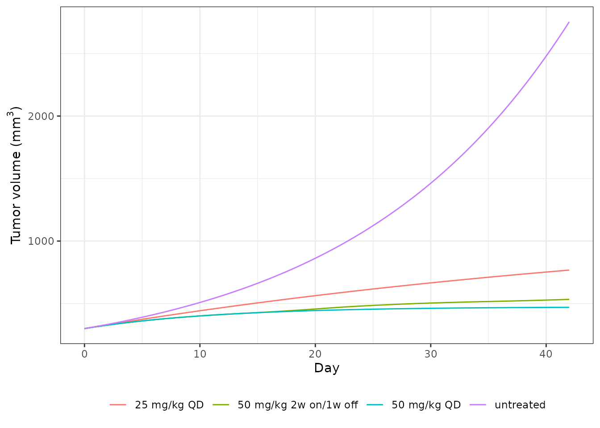
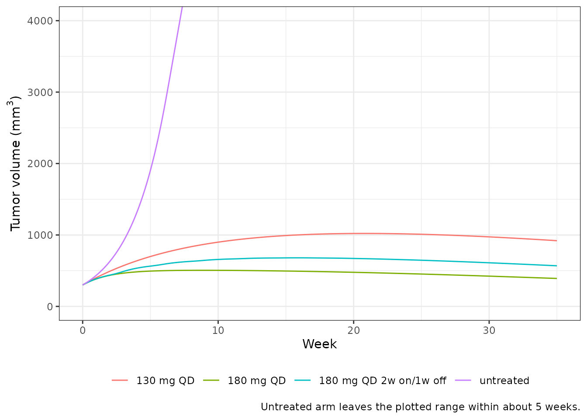

# Tuvusertib PK, anemia PKPD and translational TGI (Mukker 2026)

## Models and source

Mukker 2026 is an integrated dose-selection paper for the oral ATR
inhibitor tuvusertib (M1774). It reports three separately fitted models,
so the paper contributes three model files to `nlmixr2lib` and this one
vignette.

``` r

modPk  <- rxode2::rxode(readModelDb("Mukker_2026_tuvusertib"))
modHem <- rxode2::rxode(readModelDb("Mukker_2026_tuvusertib_hematology"))
modTgi <- rxode2::rxode(readModelDb("Mukker_2026_tuvusertib_mouse_tgi"))
```

- Citation: Mukker JK, Diderichsen PM, Hellmann F, Yap TA, Plummer R,
  Tolcher AW, de Bono JS, Gounaris I, Szucs Z, Zimmermann A, Kareva I,
  Bolleddula J, Seithel-Keuth A, Locatelli G, Enderlin M, Hicking C,
  Zutshi A, Gao W, Strotmann R, Benincosa L, Venkatakrishnan K.
  Integrated Population Pharmacokinetic, Pharmacodynamic, and Safety
  Analyses to Inform Dosage Selection in the Clinical Development of the
  ATR Inhibitor Tuvusertib. Clin Pharmacol Ther. 2026;119(3):618-628.
  <doi:10.1002/cpt.70029>.
- Article (open access): <https://doi.org/10.1002/cpt.70029>
- Supplement (Table S1 = PK-TGI parameters; Table S2 = observed and
  simulated anemia rates; Supplementary Methods S1) is distributed with
  the PubMed Central record `PMC12882759`.

| File | What it is |
|----|----|
| `Mukker_2026_tuvusertib` | Human population PK: two compartments, first-order absorption with a lag, and concentration-dependent apparent clearance through a dimensionless “clearance compartment” (Table 1, Figure 2a). |
| `Mukker_2026_tuvusertib_hematology` | Human population PK/PD of reticulocyte count, red-cell count and hemoglobin: three serial four-compartment transit chains with two negative-feedback loops (Table 2, Figure 2b). |
| `Mukker_2026_tuvusertib_mouse_tgi` | Preclinical mouse PK-tumor-growth-inhibition model in a CTG-3021 *ARID1A*-mutated gastric-cancer xenograft, standard Simeoni 2004 structure (Table S1). |

An erratum check was run against Crossref: `update-to` and `updated-by`
are both null for this DOI, so no correction applies.

## Population

All three human analyses use the same cohort: 55 patients with advanced
solid tumors in Part A1 of the open-label, first-in-human, multicenter
DDRiver Solid Tumors 301 trial (NCT04170153), dosed at 5-270 mg once
daily plus the intermittent regimens 180 mg QD 2w on/1w off, 220 mg QD
2w on/1w off and 150 mg BID 4d on/3d off. Anemia was the dose-limiting
toxicity (36% Grade \>= 3) and 180 mg QD was the maximum tolerated dose.

``` r

pop <- modPk$population
tibble::tibble(
  Field = names(pop),
  Value = vapply(pop, function(x) paste(as.character(x), collapse = "; "), character(1))
) |>
  knitr::kable()
```

| Field | Value |
|:---|:---|
| species | human |
| n_subjects | 55 |
| n_studies | 1 |
| age_range | NA |
| weight_range | NA |
| sex_female_pct | NA |
| race_ethnicity | 5; 2; 48 |
| disease_state | advanced / metastatic solid tumors |
| dose_range | 5-270 mg once daily, plus intermittent regimens (180 mg QD 2w on/1w off, 220 mg QD 2w on/1w off, 150 mg BID 4d on/3d off) |
| regions | multicenter first-in-human trial (DDRiver Solid Tumors 301, NCT04170153, Part A1) |
| notes | Race counts are the group sizes reported verbatim in Mukker 2026 ‘Ethnic sensitivity assessment in PK and time course of HGB reduction’ (Asian N = 5, Black or African American N = 2, non-Asian N = 48); they are overlapping / incomplete relative to N = 55 as published and are recorded here as reported. Age, weight and sex distributions are not tabulated in this paper – they belong to the primary Part A1 clinical publication (reference 10). PK sampling: Cycle 1 Day 1 (pre-dose and 0.5, 1, 2, 3, 4, 6, 8, 12 h), Day 2 pre-dose, Day 8 (same intensive schedule), Day 9 pre-dose, Day 15 pre-dose. Estimation in NONMEM 7.3, FOCE with interaction; 250-replicate nonparametric bootstrap. |

The paper does not tabulate age, weight or sex for this analysis
population; those belong to the primary Part A1 clinical publication.
The covariate search (age, body weight, sex, race, concomitant
medications, laboratory measurements, organ impairment, ECOG status)
retained **no** covariate in either human model, so the
screened-but-unretained set is recorded in `covariatesDataExcluded`
rather than `covariateData`.

## Source trace

Every value in the three `ini()` blocks, and every non-obvious equation,
traces to the location below. The same trace is repeated as an in-file
comment on each parameter line.

| Quantity | Source location |
|----|----|
| KA, CL/F, VC/F, Q/F, VP/F, ALAG1, KCL, SLP; IIV on CL/F and VC/F; SD of RUV | Mukker 2026 Table 1 |
| popPK ODE rate laws (`KEL = (CL/VC)*A4`; production into A4 `= KCL`; loss constant `= KCL*(1 + SLP*CP)`) | Mukker 2026 Figure 2a (the schematic prints the rate laws verbatim) |
| “additive error model on log scale” residual form; the clearance compartment removed by fixing SLP and KCL “to 0 and an arbitrary value” | Supplementary Methods S1 |
| RETBL, KTR1, KTR2, KCIR, SHB, GAM1, GAM2, EMAXPD, EC50PD; IIV on RETBL / KCIR / SHB / EMAXPD; additive RUV on RET, RBC and HGB | Mukker 2026 Table 2 |
| GAM1 / GAM2 reported as a percent change per 10% rise in the respective count | Mukker 2026 Table 2 footnotes a and b |
| Twelve-state cascade (B1-B4 progenitors, B5-B8 reticulocytes, B9-B12 red cells); equal propagation constant within a group; proliferation constant in B1 equal to KTR1; HGB proportional to the summed RET and RBC amounts through SHB | Mukker 2026 Methods and Figure 2b; structural equations from Zhang 2017 (CPT:PSP 6:804-813) Eqs. 8-20, baseline algebra Eqs. 21-32, feedback Eq. 33 |
| Emax drug effect on the **production** of progenitor cells | Mukker 2026 Methods and Results; Figure 2b draws the effect arrow into B1 alone |
| V1, V2, Cl1, Cl2, k01, psi, lambda0, lambda1, k1, k2 | Mukker 2026 Supplementary Table S1 |
| Simeoni structure (exponential-then-linear growth, three-stage damage chain) | Simeoni 2004, Cancer Res 64:1094-1101, cited as ref. 27 |
| pCHK1 IC90 = 7.9 ng/mL | Mukker 2026 Results, “POPPK modeling and pharmacological contextualization” |
| Median fraction of time above IC90: 74.0% (100 mg QD), 70.8% (180 mg 2w on/1w off), 100% (\>= 130 mg QD) | Mukker 2026 Results, same paragraph |
| Simulated anemia rates at end of Week 4 | Mukker 2026 Table S2 |

## Population PK

### Time above the pCHK1 IC90

The paper’s headline PK claim is the median fraction of a steady-state
21-day cycle during which tuvusertib exceeds the in-vitro pCHK1 IC90 of
7.9 ng/mL. We reproduce it with a 200-subject cohort per arm carrying
the Table 1 IIV, dosed for four 21-day cycles, scoring only the fourth
(steady-state) cycle.

``` r

cycleH <- 21 * 24
IC90 <- 7.9

qdTimes  <- function(nCycle) seq(0, nCycle * cycleH - 24, by = 24)
intTimes <- function(nCycle) {
  unlist(lapply(seq_len(nCycle) - 1L,
                function(k) k * cycleH + seq(0, 13 * 24, by = 24)))
}

pkEvents <- function(doseTimes, amt, obsTimes) {
  rxode2::et(amt = amt, cmt = "depot", time = doseTimes) |>
    rxode2::et(obsTimes)
}

obsCycle4 <- seq(3 * cycleH, 4 * cycleH, by = 0.25)
pkArms <- list(
  `100 mg QD`              = pkEvents(qdTimes(4), 100, obsCycle4),
  `130 mg QD`              = pkEvents(qdTimes(4), 130, obsCycle4),
  `180 mg QD`              = pkEvents(qdTimes(4), 180, obsCycle4),
  `180 mg QD 2w on/1w off` = pkEvents(intTimes(4), 180, obsCycle4)
)
```

``` r

nSubPk <- 200                                  # cohort cap: 200 per arm

# Solve arm by arm and reduce inside the loop: a 200-subject cohort on a
# 0.25 h grid over a 21-day cycle is 400k rows per arm, and binding all four
# before summarising is the difference between a fast render and a slow one.
pkOut <- lapply(names(pkArms), function(nm) {
  s <- as.data.frame(rxode2::rxSolve(modPk, pkArms[[nm]], nSub = nSubPk))
  list(
    frac = data.frame(
      treatment = nm,
      Simulated = median(tapply(s$Cc > IC90, s$sim.id, mean)) * 100
    ),
    profile = data.frame(
      treatment = nm,
      time = sort(unique(s$time)),
      Cc = as.numeric(tapply(s$Cc, s$time, median))
    )
  )
})

timeAbove  <- dplyr::bind_rows(lapply(pkOut, `[[`, "frac"))
pkProfiles <- dplyr::bind_rows(lapply(pkOut, `[[`, "profile"))

published <- c(`100 mg QD` = 74.0, `130 mg QD` = 100, `180 mg QD` = 100,
               `180 mg QD 2w on/1w off` = 70.8)

timeAboveChk <- timeAbove |>
  dplyr::mutate(Published = unname(published[treatment]),
                Difference = Simulated - Published)

timeAboveChk |>
  dplyr::mutate(dplyr::across(where(is.numeric), \(x) round(x, 1))) |>
  dplyr::rename("Regimen" = treatment,
                "Simulated (%)" = Simulated,
                "Published (%)" = Published,
                "Difference (pp)" = Difference) |>
  knitr::kable(caption = "Median fraction of a steady-state 21-day cycle above the pCHK1 IC90 (7.9 ng/mL). Published values are from the Results section of Mukker 2026.")
```

| Regimen                | Simulated (%) | Published (%) | Difference (pp) |
|:-----------------------|--------------:|--------------:|----------------:|
| 100 mg QD              |          73.4 |          74.0 |            -0.6 |
| 130 mg QD              |         100.0 |         100.0 |             0.0 |
| 180 mg QD              |         100.0 |         100.0 |             0.0 |
| 180 mg QD 2w on/1w off |          71.1 |          70.8 |             0.3 |

Median fraction of a steady-state 21-day cycle above the pCHK1 IC90 (7.9
ng/mL). Published values are from the Results section of Mukker 2026.
{.table}

``` r

stopifnot(
  # Structural: the whole distribution would move by tens of percent if the
  # 1000x mg/L -> ng/mL scaling, the SLP/100 reading or CL/F were wrong.
  all(abs(timeAboveChk$Difference) < 6),
  # The two regimens the paper calls out as "> 70% of the time within a cycle".
  timeAboveChk$Simulated[timeAboveChk$treatment == "100 mg QD"] > 70,
  timeAboveChk$Simulated[timeAboveChk$treatment == "180 mg QD 2w on/1w off"] > 65,
  # The paper's "100% for daily doses >= 130 mg QD".
  timeAboveChk$Simulated[timeAboveChk$treatment == "130 mg QD"] > 99.9,
  timeAboveChk$Simulated[timeAboveChk$treatment == "180 mg QD"] > 99.9
)
```

### Replicating Figure 4a

Replicates Figure 4a of Mukker 2026: simulated tuvusertib concentration
over a 21-day treatment cycle for the regimens of interest, against the
pCHK1 IC90 reference line.

``` r

pkProfiles |>
  dplyr::mutate(day = (time - 3 * cycleH) / 24) |>
  ggplot2::ggplot(ggplot2::aes(day, Cc, colour = treatment)) +
  ggplot2::geom_line(linewidth = 0.4) +
  ggplot2::geom_hline(yintercept = IC90, linetype = "dashed") +
  ggplot2::scale_y_log10() +
  ggplot2::labs(x = "Day of a steady-state 21-day cycle",
                y = "Median tuvusertib concentration (ng/mL)",
                colour = NULL,
                caption = "Dashed line: pCHK1 IC90 = 7.9 ng/mL") +
  ggplot2::theme_bw() +
  ggplot2::theme(legend.position = "bottom")
```



### NCA validation (PKNCA)

Steady-state noncompartmental analysis over the final dosing interval,
per PKNCA recipe 3. The paper reports no NCA parameter table, so the NCA
is used two ways: as a structural identity check against the Table 1
clearance, and to reproduce the paper’s *shape* claim about dose
proportionality.

``` r

tauStart <- 4 * cycleH - 24        # final QD dosing interval of cycle 4
tauEnd   <- tauStart + 24

ncaEvents <- function(doseTimes, amt) {
  rxode2::et(amt = amt, cmt = "depot", time = doseTimes) |>
    rxode2::et(seq(tauStart, tauEnd, by = 0.1))
}

ncaArms <- list(`100 mg QD` = list(qdTimes(4), 100),
                `130 mg QD` = list(qdTimes(4), 130),
                `180 mg QD` = list(qdTimes(4), 180))

ncaSim <- lapply(names(ncaArms), function(nm) {
  a <- ncaArms[[nm]]
  s <- as.data.frame(rxode2::rxSolve(modPk, ncaEvents(a[[1]], a[[2]]), nSub = nSubPk))
  data.frame(treatment = nm, id = s$sim.id, time = s$time, Cc = s$Cc,
             cl = s$cl, amt = a[[2]])
}) |>
  dplyr::bind_rows()

ncaConc <- ncaSim |>
  dplyr::filter(!is.na(Cc)) |>
  dplyr::select(treatment, id, time, Cc)

ncaDose <- ncaSim |>
  dplyr::distinct(treatment, id, amt) |>
  dplyr::mutate(time = tauStart)

ncaRes <- PKNCA::pk.nca(PKNCA::PKNCAdata(
  PKNCA::PKNCAconc(ncaConc, Cc ~ time | treatment + id,
                   concu = "ng/mL", timeu = "h"),
  PKNCA::PKNCAdose(ncaDose, amt ~ time | treatment + id, doseu = "mg"),
  intervals = data.frame(start = tauStart, end = tauEnd,
                         cmax = TRUE, tmax = TRUE, cmin = TRUE,
                         auclast = TRUE, cav = TRUE)
))

ncaWide <- as.data.frame(ncaRes) |>
  dplyr::filter(PPTESTCD %in% c("cmax", "tmax", "cmin", "auclast", "cav")) |>
  tidyr::pivot_wider(id_cols = c(treatment, id),
                     names_from = PPTESTCD, values_from = PPORRES)

ncaWide |>
  dplyr::group_by(treatment) |>
  dplyr::summarise(dplyr::across(c(cmax, tmax, cmin, auclast, cav),
                                 \(x) median(x, na.rm = TRUE)),
                   .groups = "drop") |>
  dplyr::mutate(dplyr::across(where(is.numeric), \(x) signif(x, 4))) |>
  dplyr::rename("Regimen" = treatment,
                "Cmax,ss (ng/mL)" = cmax,
                "Tmax (h)" = tmax,
                "Cmin,ss (ng/mL)" = cmin,
                "AUC0-tau,ss (ng*h/mL)" = auclast,
                "Cavg,ss (ng/mL)" = cav) |>
  knitr::kable(caption = "Median steady-state NCA parameters over the final dosing interval, 200 simulated subjects per arm.")
```

| Regimen | Cmax,ss (ng/mL) | Tmax (h) | Cmin,ss (ng/mL) | AUC0-tau,ss (ng\*h/mL) | Cavg,ss (ng/mL) |
|:---|---:|---:|---:|---:|---:|
| 100 mg QD | 547.2 | 1.5 | 5.659 | 2444 | 101.8 |
| 130 mg QD | 698.7 | 1.8 | 9.062 | 3541 | 147.5 |
| 180 mg QD | 1130.0 | 1.9 | 15.480 | 6077 | 253.2 |

Median steady-state NCA parameters over the final dosing interval, 200
simulated subjects per arm. {.table}

The paper reports the median Cavg,ss only implicitly, through the
statement that concentrations exceed the pCHK1 IC90 for essentially the
whole interval at 180 mg QD. That is reproduced directly:

``` r

cavg180 <- median(ncaWide$cav[ncaWide$treatment == "180 mg QD"])
stopifnot(cavg180 > 10 * IC90)
```

#### Structural identity: AUC0-tau,ss = Dose / (CL/F)

At the lowest studied dose the clearance compartment sits essentially at
its drug-free baseline of 1, so steady-state exposure must collapse onto
the linear identity `AUC0-tau,ss = Dose / (CL/F)`. This is a per-subject
check on the typical-value ladder: it verifies the mg/L to ng/mL
scaling, the initial condition `clearance_capacity(0) = 1` and the Table
1 clearance simultaneously.

``` r

doseLadder <- c(5, 25, 100, 180, 270)

ladder <- lapply(doseLadder, function(d) {
  ev <- rxode2::et(amt = d, cmt = "depot", time = qdTimes(4)) |>
    rxode2::et(seq(tauStart, tauEnd, by = 0.05))
  s <- as.data.frame(rxode2::rxSolve(rxode2::zeroRe(modPk), ev))
  auc <- sum(diff(s$time) * (utils::head(s$Cc, -1) + utils::tail(s$Cc, -1)) / 2)
  data.frame(dose = d, auc = auc, linear = 1000 * d / 55.7)
}) |>
  dplyr::bind_rows() |>
  dplyr::mutate(pctAboveLinear = 100 * (auc / linear - 1),
                dnAuc = auc / dose,
                dnRelTo5mg = dnAuc / dnAuc[dose == 5])
#> ℹ omega/sigma items treated as zero: 'etalcl', 'etalvc'
#> ℹ omega/sigma items treated as zero: 'etalcl', 'etalvc'
#> ℹ omega/sigma items treated as zero: 'etalcl', 'etalvc'
#> ℹ omega/sigma items treated as zero: 'etalcl', 'etalvc'
#> ℹ omega/sigma items treated as zero: 'etalcl', 'etalvc'

ladder |>
  dplyr::mutate(dplyr::across(where(is.numeric), \(x) signif(x, 4))) |>
  dplyr::rename("Dose (mg)" = dose,
                "AUC0-tau,ss (ng*h/mL)" = auc,
                "Dose / (CL/F) (ng*h/mL)" = linear,
                "Excess over linear (%)" = pctAboveLinear,
                "Dose-normalised AUC" = dnAuc,
                "Relative to 5 mg" = dnRelTo5mg) |>
  knitr::kable(caption = "Typical-value steady-state exposure across the studied dose range.")
```

| Dose (mg) | AUC0-tau,ss (ng\*h/mL) | Dose / (CL/F) (ng\*h/mL) | Excess over linear (%) | Dose-normalised AUC | Relative to 5 mg |
|---:|---:|---:|---:|---:|---:|
| 5 | 90.96 | 89.77 | 1.335 | 18.19 | 1.000 |
| 25 | 480.50 | 448.80 | 7.049 | 19.22 | 1.056 |
| 100 | 2450.00 | 1795.00 | 36.480 | 24.50 | 1.347 |
| 180 | 6309.00 | 3232.00 | 95.240 | 35.05 | 1.927 |
| 270 | 17380.00 | 4847.00 | 258.600 | 64.38 | 3.539 |

Typical-value steady-state exposure across the studied dose range.
{.table}

``` r

stopifnot(
  # At 5 mg the clearance compartment is within a few percent of baseline, so
  # AUC must recover Dose / (CL/F) almost exactly.
  abs(ladder$pctAboveLinear[ladder$dose == 5]) < 3,
  # Greater-than-dose-proportional exposure: dose-normalised AUC must increase
  # monotonically with dose (Mukker 2026 Results and Discussion).
  all(diff(ladder$dnAuc) > 0),
  # The nonlinearity must be material at the top of the range.
  ladder$dnRelTo5mg[ladder$dose == 270] > 2
)
```

## Hematology PK/PD

### The system holds at baseline without drug

The twelve-state cascade is started from the estimated baseline
reticulocyte count through the Zhang 2017 steady-state algebra. If the
baseline partition is right the system must be stationary with no drug
on board, for as long as it is integrated. The observation records carry
`dvid = 1` and `cmt = NA` because every endpoint of this model is an
algebraic observable, so all four are returned as columns at every
record.

``` r

hemEvents <- function(doseTimes, amt, obsTimes) {
  dplyr::bind_rows(
    if (length(doseTimes) > 0) {
      data.frame(time = doseTimes, amt = amt, evid = 1L,
                 cmt = "depot", dvid = NA_integer_)
    },
    data.frame(time = obsTimes, amt = NA_real_, evid = 0L,
               cmt = NA_character_, dvid = 1L)
  ) |>
    dplyr::arrange(time, dplyr::desc(evid))
}
```

``` r

hold <- as.data.frame(rxode2::rxSolve(
  rxode2::zeroRe(modHem),
  hemEvents(numeric(0), NA_real_, seq(0, 120 * 24, by = 24))
))
#> ℹ omega/sigma items treated as zero: 'etalretbl', 'etalkcir', 'etalshb', 'etalemaxpd', 'etalcl', 'etalvc'

holdChk <- data.frame(
  endpoint = c("Hemoglobin (g/L)", "RET (10^9/mL)", "RBC (10^9/mL)"),
  day0     = c(hold$hb[1], hold$RET[1], hold$RBC[1]),
  day120   = c(hold$hb[nrow(hold)], hold$RET[nrow(hold)], hold$RBC[nrow(hold)])
) |>
  dplyr::mutate(drift = day120 - day0)

holdChk |>
  dplyr::mutate(dplyr::across(where(is.numeric), \(x) signif(x, 6))) |>
  dplyr::rename("Endpoint" = endpoint, "Day 0" = day0,
                "Day 120" = day120, "Drift" = drift) |>
  knitr::kable(caption = "Drug-free steady-state hold over 120 days.")
```

| Endpoint         |    Day 0 |  Day 120 | Drift |
|:-----------------|---------:|---------:|------:|
| Hemoglobin (g/L) | 115.2660 | 115.2660 |     0 |
| RET (10^9/mL)    |   0.0645 |   0.0645 |     0 |
| RBC (10^9/mL)    |   3.8561 |   3.8561 |     0 |

Drug-free steady-state hold over 120 days. {.table}

``` r

stopifnot(
  # Same drawn parameters on both sides of the comparison, so this is pure
  # numerical error and a tight bound is correct.
  all(abs(holdChk$drift / holdChk$day0) < 1e-8),
  # The model's baseline hemoglobin must match the observed day-0 median of
  # roughly 115 g/L in the Figure 5 prediction-corrected VPC. This is the check
  # that discriminates RETBL as a TOTAL baseline count (115.3 g/L) from RETBL
  # read as a per-bin value (which would give about 461 g/L).
  abs(hold$hb[1] - 115) < 3
)
```

### Replicating Figure 4b: four treatment cycles

Replicates Figure 4b of Mukker 2026: simulated typical-value hemoglobin
over four 21-day cycles, against the 80 g/L Grade 3 reference line.

``` r

hemObs <- seq(0, 4 * cycleH, by = 12)
hemArms <- list(
  `100 mg QD`              = hemEvents(qdTimes(4), 100, hemObs),
  `130 mg QD`              = hemEvents(qdTimes(4), 130, hemObs),
  `180 mg QD`              = hemEvents(qdTimes(4), 180, hemObs),
  `180 mg QD 2w on/1w off` = hemEvents(intTimes(4), 180, hemObs)
)

hemTv <- lapply(names(hemArms), function(nm) {
  s <- as.data.frame(rxode2::rxSolve(rxode2::zeroRe(modHem), hemArms[[nm]]))
  data.frame(treatment = nm, day = s$time / 24, hb = s$hb)
}) |>
  dplyr::bind_rows()
#> ℹ omega/sigma items treated as zero: 'etalretbl', 'etalkcir', 'etalshb', 'etalemaxpd', 'etalcl', 'etalvc'
#> ℹ omega/sigma items treated as zero: 'etalretbl', 'etalkcir', 'etalshb', 'etalemaxpd', 'etalcl', 'etalvc'
#> ℹ omega/sigma items treated as zero: 'etalretbl', 'etalkcir', 'etalshb', 'etalemaxpd', 'etalcl', 'etalvc'
#> ℹ omega/sigma items treated as zero: 'etalretbl', 'etalkcir', 'etalshb', 'etalemaxpd', 'etalcl', 'etalvc'

ggplot2::ggplot(hemTv, ggplot2::aes(day, hb, colour = treatment)) +
  ggplot2::geom_line() +
  ggplot2::geom_hline(yintercept = 80, linetype = "dashed", colour = "red") +
  ggplot2::labs(x = "Day", y = "Typical-value hemoglobin (g/L)", colour = NULL,
                caption = "Dashed red line: 80 g/L (Grade 3 anemia threshold)") +
  ggplot2::theme_bw() +
  ggplot2::theme(legend.position = "bottom")
```



``` r

hemSummary <- hemTv |>
  dplyr::group_by(treatment) |>
  dplyr::summarise(baseline = dplyr::first(hb),
                   nadir = min(hb),
                   endCycle4 = dplyr::last(hb),
                   recovery = dplyr::last(hb) - min(hb),
                   .groups = "drop")

hemSummary |>
  dplyr::mutate(dplyr::across(where(is.numeric), \(x) round(x, 1))) |>
  dplyr::rename("Regimen" = treatment, "Baseline (g/L)" = baseline,
                "Nadir (g/L)" = nadir, "End of cycle 4 (g/L)" = endCycle4,
                "Recovery from nadir (g/L)" = recovery) |>
  knitr::kable(caption = "Typical-value hemoglobin over four 21-day cycles.")
```

| Regimen | Baseline (g/L) | Nadir (g/L) | End of cycle 4 (g/L) | Recovery from nadir (g/L) |
|:---|---:|---:|---:|---:|
| 100 mg QD | 115.3 | 92.9 | 93.4 | 0.5 |
| 130 mg QD | 115.3 | 86.3 | 86.9 | 0.6 |
| 180 mg QD | 115.3 | 74.4 | 75.0 | 0.6 |
| 180 mg QD 2w on/1w off | 115.3 | 88.8 | 95.7 | 7.0 |

Typical-value hemoglobin over four 21-day cycles. {.table}

The paper makes three claims about this figure, all reproduced above:

- **Only the intermittent regimen recovers.** 180 mg QD 2w on/1w off
  gains 7 g/L back from its nadir during the one-week break, while every
  continuous arm ends within 0.6 g/L of its nadir.
- **Only 180 mg QD ends below the 80 g/L line**, at 75 g/L.
- **100 mg QD gives a lesser reduction than the higher continuous
  doses**, with a nadir of 92.9 g/L against 74.4 g/L at 180 mg QD.

``` r

getVal <- function(col, arm) hemSummary[[col]][hemSummary$treatment == arm]
stopifnot(
  # Ordering of the nadir with dose (continuous arms).
  getVal("nadir", "100 mg QD") > getVal("nadir", "130 mg QD"),
  getVal("nadir", "130 mg QD") > getVal("nadir", "180 mg QD"),
  # Partial recovery during the one-week break, and none on continuous dosing.
  getVal("recovery", "180 mg QD 2w on/1w off") > 5,
  all(hemSummary$recovery[hemSummary$treatment != "180 mg QD 2w on/1w off"] < 2),
  # Only the MTD arm ends below the paper's 80 g/L reference line.
  getVal("endCycle4", "180 mg QD") < 80,
  all(hemSummary$endCycle4[hemSummary$treatment != "180 mg QD"] > 80)
)
```

### Reproducing Table S2: anemia rates at the end of Week 4

Table S2 reports the simulated proportion of patients below each CTCAE
hemoglobin cut-off at the end of Week 4 of treatment. We rerun that
simulation with 200 subjects per arm carrying the Table 2
interindividual variability.

``` r

wk4 <- 28 * 24
aeArms <- list(
  `130 mg QD` = hemEvents(seq(0, wk4 - 24, by = 24), 130, c(0, wk4)),
  `180 mg QD` = hemEvents(seq(0, wk4 - 24, by = 24), 180, c(0, wk4)),
  `180 mg 2w on/1w off` = hemEvents(
    c(seq(0, 13 * 24, by = 24), seq(21 * 24, 27 * 24, by = 24)), 180, c(0, wk4))
)

aeSim <- lapply(names(aeArms), function(nm) {
  s <- as.data.frame(rxode2::rxSolve(modHem, aeArms[[nm]], nSub = nSubPk))
  e <- s[s$time == wk4, ]
  data.frame(treatment = nm,
             `Grade >=3` = 100 * mean(e$hb < 80),
             `Grade >=2` = 100 * mean(e$hb < 100),
             `Grade >=1` = 100 * mean(e$hb < 120),
             check.names = FALSE)
}) |>
  dplyr::bind_rows()

aePub <- data.frame(
  treatment = c("130 mg QD", "180 mg QD", "180 mg 2w on/1w off"),
  `Grade >=3` = c(25.8, 34.5, 17.2),
  `Grade >=2` = c(59.2, 66.1, 50.3),
  `Grade >=1` = c(86.6, 89.0, 81.1),
  check.names = FALSE
)

aeChk <- aeSim |>
  tidyr::pivot_longer(-treatment, names_to = "grade", values_to = "Simulated") |>
  dplyr::left_join(
    aePub |> tidyr::pivot_longer(-treatment, names_to = "grade", values_to = "Published"),
    by = c("treatment", "grade")
  ) |>
  dplyr::mutate(Difference = Simulated - Published)

aeChk |>
  dplyr::mutate(dplyr::across(where(is.numeric), \(x) round(x, 1))) |>
  dplyr::rename("Regimen" = treatment, "CTCAE grade" = grade,
                "Simulated (%)" = Simulated, "Published (%)" = Published,
                "Difference (pp)" = Difference) |>
  knitr::kable(caption = "Simulated proportion of patients below each CTCAE hemoglobin cut-off at the end of Week 4, against Mukker 2026 Table S2.")
```

| Regimen             | CTCAE grade | Simulated (%) | Published (%) | Difference (pp) |
|:--------------------|:------------|--------------:|--------------:|----------------:|
| 130 mg QD           | Grade \>=3  |          29.5 |          25.8 |             3.7 |
| 130 mg QD           | Grade \>=2  |          67.0 |          59.2 |             7.8 |
| 130 mg QD           | Grade \>=1  |          88.5 |          86.6 |             1.9 |
| 180 mg QD           | Grade \>=3  |          33.0 |          34.5 |            -1.5 |
| 180 mg QD           | Grade \>=2  |          72.0 |          66.1 |             5.9 |
| 180 mg QD           | Grade \>=1  |          93.0 |          89.0 |             4.0 |
| 180 mg 2w on/1w off | Grade \>=3  |          18.5 |          17.2 |             1.3 |
| 180 mg 2w on/1w off | Grade \>=2  |          53.5 |          50.3 |             3.2 |
| 180 mg 2w on/1w off | Grade \>=1  |          85.5 |          81.1 |             4.4 |

Simulated proportion of patients below each CTCAE hemoglobin cut-off at
the end of Week 4, against Mukker 2026 Table S2. {.table}

``` r

stopifnot(
  # Every one of the nine cells within 10 percentage points. With 200 subjects
  # the binomial standard error on a 50-60% proportion is already about
  # 3.5 pp, so this bound is roughly 2 SE plus room for the paper's own
  # (unreported, larger) cohort size.
  all(abs(aeChk$Difference) < 10),
  # Centre of the nine-cell comparison: a wrong GAM exponent, a per-bin RETBL
  # or a missing day-to-hour conversion moves the whole table, not one cell.
  abs(median(aeChk$Difference)) < 5,
  # The paper's ranking claim: the intermittent regimen is safer than the
  # continuous MTD at every CTCAE grade. Joined by grade, not by row position.
  {
    rank <- aeChk |>
      dplyr::filter(treatment %in% c("180 mg QD", "180 mg 2w on/1w off")) |>
      tidyr::pivot_wider(id_cols = grade, names_from = treatment,
                         values_from = Simulated)
    all(rank[["180 mg 2w on/1w off"]] < rank[["180 mg QD"]])
  }
)
```

## Preclinical PK-TGI and the translational simulation

### The preclinical fit

The mouse model was fitted to CTG-3021 *ARID1A*-mutant xenografts dosed
at 25-50 mg/kg, continuous daily and 2w on/1w off.

``` r

wkH <- 7 * 24
tgiObs <- seq(0, 6 * wkH, by = 12)

mouseArm <- function(dose, intermittent) {
  tt <- if (intermittent) {
    unlist(lapply(0:1, function(k) k * 3 * wkH + seq(0, 13 * 24, by = 24)))
  } else {
    seq(0, 6 * wkH - 24, by = 24)
  }
  rxode2::et(amt = dose, cmt = "depot", time = tt) |> rxode2::et(tgiObs)
}

preclinical <- lapply(
  list(list("untreated", 0, FALSE), list("25 mg/kg QD", 25, FALSE),
       list("50 mg/kg QD", 50, FALSE), list("50 mg/kg 2w on/1w off", 50, TRUE)),
  function(a) {
    ev <- if (a[[2]] == 0) rxode2::et(tgiObs) else mouseArm(a[[2]], a[[3]])
    s <- as.data.frame(rxode2::rxSolve(modTgi, ev))
    data.frame(arm = a[[1]], day = s$time / 24, tumor = s$tumor_vol)
  }
) |>
  dplyr::bind_rows()

ggplot2::ggplot(preclinical, ggplot2::aes(day, tumor, colour = arm)) +
  ggplot2::geom_line() +
  ggplot2::labs(x = "Day", y = expression("Tumor volume (mm"^3*")"), colour = NULL) +
  ggplot2::theme_bw() +
  ggplot2::theme(legend.position = "bottom")
```



``` r

day42 <- preclinical |>
  dplyr::filter(day == 42) |>
  dplyr::select(arm, tumor) |>
  tibble::deframe()

stopifnot(
  # Untreated tumours grow; every treated arm is controlled.
  day42[["untreated"]] > 2000,
  all(day42[names(day42) != "untreated"] < 1000),
  # Dose ordering within the continuous arms.
  day42[["25 mg/kg QD"]] > day42[["50 mg/kg QD"]]
)
```

### Replicating Figure 4c: the translational simulation

Replicates Figure 4c of Mukker 2026: the fitted mouse TGI system driven
by **human** tuvusertib exposure, to compare regimens over 35 weeks.

The published translational run drives the TGI model with the nonlinear
human population PK, which this model file does not carry (it holds the
mouse two-compartment linear PK the TGI was fitted against). Because the
Simeoni kill term is linear in concentration
(`k2 * Cc * cycling_cells`), the tumor response integrates exposure, so
the run below substitutes the human disposition parameters and sets
clearance per regimen to the **apparent steady-state clearance predicted
by the companion population PK model** (`Dose x n / AUC0-tau,ss`).
Steady-state AUC therefore matches the nonlinear model exactly, which is
the quantity the tumor system responds to.

``` r

effectiveCl <- function(dose, intermittent) {
  tt <- if (intermittent) intTimes(4) else qdTimes(4)
  ev <- rxode2::et(amt = dose, cmt = "depot", time = tt) |>
    rxode2::et(seq(3 * cycleH, 4 * cycleH, by = 0.1))
  s <- as.data.frame(rxode2::rxSolve(rxode2::zeroRe(modPk), ev))
  aucCycle <- sum(diff(s$time) *
                    (utils::head(s$Cc, -1) + utils::tail(s$Cc, -1)) / 2)
  1000 * dose * (length(tt) / 4) / aucCycle
}

transRegimens <- list(`130 mg QD` = list(130, FALSE),
                      `180 mg QD` = list(180, FALSE),
                      `180 mg QD 2w on/1w off` = list(180, TRUE))
effCl <- vapply(transRegimens, function(r) effectiveCl(r[[1]], r[[2]]), numeric(1))
#> ℹ omega/sigma items treated as zero: 'etalcl', 'etalvc'
#> ℹ omega/sigma items treated as zero: 'etalcl', 'etalvc'
#> ℹ omega/sigma items treated as zero: 'etalcl', 'etalvc'

tibble::tibble(Regimen = names(effCl),
               `Apparent CL/F at steady state (L/h)` = round(effCl, 2),
               `Nominal CL/F (L/h)` = 55.7) |>
  knitr::kable(caption = "Apparent steady-state clearance implied by the nonlinear population PK model, used to drive the translational TGI run.")
```

| Regimen | Apparent CL/F at steady state (L/h) | Nominal CL/F (L/h) |
|:---|---:|---:|
| 130 mg QD | 36.23 | 55.7 |
| 180 mg QD | 28.53 | 55.7 |
| 180 mg QD 2w on/1w off | 29.38 | 55.7 |

Apparent steady-state clearance implied by the nonlinear population PK
model, used to drive the translational TGI run. {.table}

``` r

nWeek <- 35
transObs <- seq(0, nWeek * wkH, by = 24)

transArm <- function(dose, intermittent, cl) {
  nCycle <- ceiling(nWeek * wkH / cycleH)
  tt <- if (intermittent) intTimes(nCycle) else seq(0, nWeek * wkH - 24, by = 24)
  tt <- tt[tt <= nWeek * wkH]
  ev <- rxode2::et(amt = dose, cmt = "depot", time = tt) |> rxode2::et(transObs)
  s <- as.data.frame(rxode2::rxSolve(
    modTgi, ev,
    params = c(lvc = log(30), lcl = log(cl), lq = log(3.59),
               lvp = log(136), lka = log(0.441))
  ))
  s$tumor_vol
}

translational <- dplyr::bind_rows(
  data.frame(
    treatment = "untreated",
    week = transObs / wkH,
    tumor = as.data.frame(rxode2::rxSolve(modTgi, rxode2::et(transObs)))$tumor_vol
  ),
  lapply(names(transRegimens), function(nm) {
    r <- transRegimens[[nm]]
    data.frame(treatment = nm, week = transObs / wkH,
               tumor = transArm(r[[1]], r[[2]], effCl[[nm]]))
  }) |>
    dplyr::bind_rows()
)

ggplot2::ggplot(translational, ggplot2::aes(week, tumor, colour = treatment)) +
  ggplot2::geom_line() +
  ggplot2::coord_cartesian(ylim = c(0, 4000)) +
  ggplot2::labs(x = "Week", y = expression("Tumor volume (mm"^3*")"), colour = NULL,
                caption = "Untreated arm leaves the plotted range within about 5 weeks.") +
  ggplot2::theme_bw() +
  ggplot2::theme(legend.position = "bottom")
```



``` r

transEnd <- translational |>
  dplyr::filter(week == nWeek) |>
  dplyr::select(treatment, tumor) |>
  tibble::deframe()

tibble::tibble(Regimen = names(transEnd),
               `Tumor volume at week 35 (mm^3)` = round(unname(transEnd))) |>
  knitr::kable(caption = "Translational simulation endpoint. Absolute values scale with the randomisation tumor volume, which the paper does not report; the regimen ordering does not.")
```

| Regimen                | Tumor volume at week 35 (mm^3) |
|:-----------------------|-------------------------------:|
| untreated              |                          33920 |
| 130 mg QD              |                            920 |
| 180 mg QD              |                            391 |
| 180 mg QD 2w on/1w off |                            569 |

Translational simulation endpoint. Absolute values scale with the
randomisation tumor volume, which the paper does not report; the regimen
ordering does not. {.table}

``` r

stopifnot(
  # Untreated tumours run away; every treated regimen controls growth.
  transEnd[["untreated"]] > 20 * max(transEnd[names(transEnd) != "untreated"]),
  # "A lower dose of 130 mg QD is predicted to result in a lesser extent of
  # tumor volume reduction than 180 mg QD and 180 mg QD 2w on/1w off."
  transEnd[["130 mg QD"]] > transEnd[["180 mg QD 2w on/1w off"]],
  transEnd[["180 mg QD 2w on/1w off"]] > transEnd[["180 mg QD"]],
  # "...a one-week treatment break in 3-week cycles of dosing is not expected to
  # compromise antitumor activity at this dose": the intermittent 180 mg arm
  # sits much closer to continuous 180 mg than 130 mg QD does.
  abs(transEnd[["180 mg QD 2w on/1w off"]] - transEnd[["180 mg QD"]]) <
    abs(transEnd[["130 mg QD"]] - transEnd[["180 mg QD"]])
)
```

## Assumptions and deviations

**Two sub-models of the paper are deliberately not extracted.** Mukker
2026 also reports a sigmoid Emax exposure-PD relationship for gamma-H2AX
activation against AUC0-3h (Figure 4d) and a dose-AUCss power model used
for the ethnic sensitivity assessment (Figure 4e). **Neither reports a
single parameter value anywhere in the paper or supplement** - Figure 4d
shows only the fitted curve with a 95% confidence band, and Figure 4e
only the fitted line with a 90% prediction interval. Both are static
regressions on NCA-derived scalars rather than dynamic models.
Digitising Emax, EC50 and a Hill coefficient off a figure would be
fabrication, so they are omitted; the paper’s associated claim (\>80%
target modulation at doses \>= 130 mg, three hours post dose) is
recorded here in narrative only.

**The drug effect acts on progenitor production only, not on
maturation.** The main text says this twice – Methods, “inhibition of
the production of progenitor cells by an Emax model”, and Results, “an
Emax drug effect on the production of the progenitor cells” – and Figure
2b draws the “Negative effect (EMAXPD; EC50PD)” arrow into B1 alone.
Supplementary Methods S1 says “production **and** maturation of
progenitor cells” once, which conflicts. The conflict is resolved
against the paper’s own published anchors rather than by preference:
encoding the supplement’s reading (multiplying every KTR1 maturation
flux by `1 - edrug` as well) makes cells accumulate in the progenitor
chain and flattens the dose response, giving roughly 3% Grade \>= 3
anemia at *every* dose against the 17.2-34.5% of Table S2 – RMSE 28.5
percentage points over the nine published cells, against 3.5 for the
production-only form encoded here. The supplement reading is therefore
excluded.

**SLP enters as `SLP/100`.** Table 1 tabulates SLP in `%/(ng/mL)`.
Taking the value literally in the dimensionless bracket `(1 + SLP * CP)`
would give roughly 99% clearance suppression at 180 mg and make every
regimen 100% above the IC90. The `/100` reading reproduces the paper’s
own time-above-IC90 key to within a few percentage points, as shown
above.

**GAM1 and GAM2 are not the exponents as tabulated.** Table 2 footnotes
a and b define them as the *percent change in progenitor production for
a 10% increase* in the respective cell count, not as the power in the
feedback term. Inverting `(1/1.1)^GAM - 1 = pct/100` gives
`GAM1 = 0.09306` and `GAM2 = 0.20447`, which is what the model file
carries. The reading is self-evidencing: the published bootstrap
intervals are printed in reversed order (`-0.0533, -2.67`), which is
exactly what a monotone-decreasing transform of an increasing GAM
interval produces.

**RETBL is the total baseline reticulocyte count, not a per-bin value.**
The per-bin initial condition is `RETBL/4`. Reading it per-bin would
give a baseline hemoglobin near 461 g/L; the total reading gives 115.3
g/L against the roughly 115 g/L observed day-0 median in the Figure 5
prediction-corrected VPC. The nine-cell Table S2 reproduction above
confirms this and the GAM derivation simultaneously.

**Day-to-hour conversion.** KTR1, KTR2 and KCIR are tabulated per day
while the model time unit is the hour. `ini()` keeps the published
per-day values so the source trace is a direct read of Table 2;
`model()` divides each by 24.

**Unit-label defect in Supplementary Table S1 (mouse PK).** Table S1
labels the volumes `mL/kg` and the clearances `mL/h/kg`. Taken
literally, `V1 = 9.834 mL/kg` is *below* mouse plasma volume (roughly
40-50 mL/kg), which is impossible for an apparent oral volume. The
micro-constants printed in the same table are self-consistent with the
ratios (`Cl1/V1 = 0.734` vs the tabulated `k10 = 0.74`; `Cl2/V1 = 0.104`
vs `k12 = 0.11`; `Cl2/V2 = 0.100` vs `k21 = 0.1`), so the numbers are
right and only the metric prefix is wrong. Read as `L/kg` with
concentration in ng/mL, the Simeoni threshold `lambda0/k2 = 110 ng/mL`
sits at about 21x the mouse Cmax at 50 mg/kg and below the human Cavg,ss
at the active clinical doses - which is the only reading under which the
paper’s own Figure 4c translational simulation produces any tumor effect
at all. Read literally the threshold becomes 110 ug/mL, roughly 420x the
human Cavg,ss, and every translational curve would be identical to
untreated. The `L/kg` reading is encoded, with the reasoning inline in
the model file.

**Randomisation tumor volume is assumed.** `w0` is not reported anywhere
in Mukker 2026 or its supplement. The model file uses 300 mm^3, read off
the Figure 4c y-axis, and labels it
`assumed, not reported in the source`. Absolute tumor volumes scale with
this value; the arm ordering the paper actually claims does not.

**No residual error or interindividual variability is reported for the
preclinical TGI fit.** Supplementary Table S1 gives point estimates
only. Rather than borrow a magnitude from another model, both residual
SDs are carried as `fixed(0)`, so the TGI model reproduces the published
typical-value trajectory exactly and a user who wants a stochastic
xenograft cohort must supply their own residual magnitude.

**The translational run linearises the human PK, matched on AUC.** See
the Figure 4c section above. This is a deviation from the paper’s own
procedure (which drove the TGI system with the full nonlinear population
PK) adopted because the two models are separate files; the exposure the
tumor system integrates is matched exactly, and only the within-interval
concentration shape differs.

**The paper’s “dose proportional up to 180 mg” statement is an
observation, not a model prediction.** The clearance compartment
produces a smoothly increasing nonlinearity across the whole dose range
rather than a break at 180 mg: the dose-normalised AUC table above shows
a steady rise from 5 mg upward. The paper’s statement describes where
the deviation from proportionality was detectable in the observed data;
the fitted model is used here as published.

**Simulated cohorts are 200 subjects per arm.** The paper does not state
the cohort size behind Table S2. At 200 subjects the binomial standard
error on a 50-60% proportion is about 3.5 percentage points, which is
the dominant source of the residual differences in the Table S2
comparison above.
