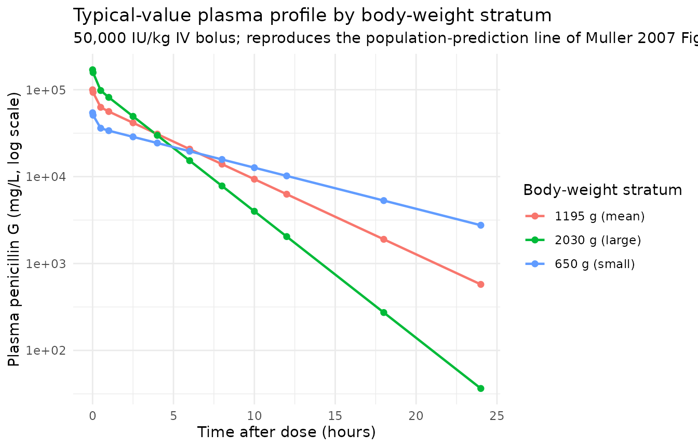
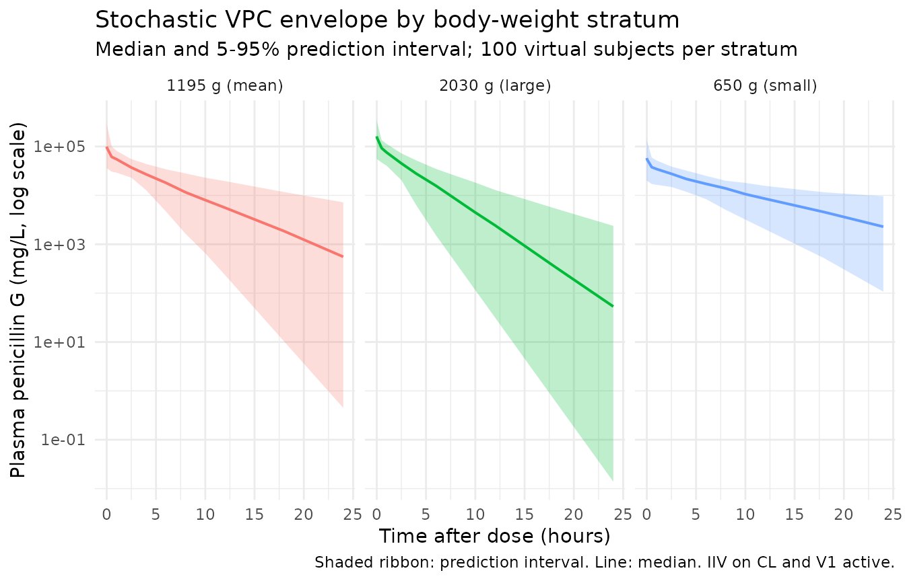

# Penicillin G (Muller 2007)

## Model and source

``` r

mod_meta <- nlmixr2est::nlmixr(readModelDb("Muller_2007_penicillin_G"))$meta
#> ℹ parameter labels from comments will be replaced by 'label()'
```

- Citation: Muller AE, DeJongh J, Bult Y, Goessens WHF, Mouton JW,
  Danhof M, van den Anker JN. Pharmacokinetics of penicillin G in
  infants with a gestational age of less than 32 weeks. Antimicrob
  Agents Chemother. 2007 Oct;51(10):3720-5. <doi:10.1128/AAC.00318-07>.
- Description: Two-compartment IV bolus population PK model for
  penicillin G (benzylpenicillin) in 20 very preterm neonates with
  gestational age less than 32 weeks studied on day 3 of life (Muller
  2007). Clearance is linearly scaled to current body weight with
  reference 1.195 kg (cohort mean); central volume, peripheral volume,
  and intercompartmental clearance are not weight-scaled in the final
  model.
- Article (DOI): <https://doi.org/10.1128/AAC.00318-07>

This vignette validates the packaged `Muller_2007_penicillin_G` model –
a two-compartment IV bolus population PK model for penicillin G
(benzylpenicillin) in 20 very preterm neonates with gestational age less
than 32 weeks studied on day 3 of life (Muller 2007 Table 2). Reference
subject is the cohort-mean 1.195 kg neonate. Clearance is linearly
scaled with current body weight; volumes and Q are not weight-scaled in
the final model. The typical-value half-life at the reference subject
reproduces the paper’s derived t1/2_beta = 3.9 h.

## Population

The cohort is 20 preterm neonates (12 male, 8 female; 40% female) with
gestational age 26 3/7 to 32 0/7 weeks at birth (median 29 5/7, SD 1
5/7) and birth weight 650 to 2,030 g (mean 1,195 g, SD 387 g), all
studied on day 3 of life at a single centre (Erasmus MC-Sophia, Sophia
Children’s Hospital, Rotterdam, The Netherlands). All subjects had
suspected or documented septicemia or invasive infection but no positive
blood cultures in this specific cohort (one positive superficial culture
for Streptococcus agalactiae). Subjects were hemodynamically stable, had
normal liver function, no nephrotoxic drugs on board, and an indwelling
arterial catheter for clinical purposes (Muller 2007 Materials and
Methods “Patients and treatment”).

Dosing was penicillin G 50,000 U/kg every 12 h as an IV bolus injection;
using the standard conversion 1 IU = 0.6 mg this is approximately 30
mg/kg q12h. Blood samples (200 uL) were drawn from the indwelling
arterial line just before a dose and at 0.03, 0.5, 1, 2.5, 4, 8, and 12
h post-dose; subjects who did not receive the next dose contributed a 24
h sample (9 of 20). A total of 167 plasma concentrations were included
in the popPK fit. Penicillin G was quantified by HPLC with UV detection
at 215 nm; lower limit of detection 0.5 ug/mL, intra-assay CV
0.75-1.05%, inter-assay CV 2.3-2.6% (Muller 2007 Methods “Penicillin G
high-pressure liquid chromatography assay”).

NONMEM v.V with the ADVAN5 general-linear subroutine and FOCE+I was used
for the popPK fit. Three subjects (IDs 1, 3, 6) were weighted less in
the population estimation because their residual errors were 2.5-3.5
times the median for those subjects, but no subject was excluded (Muller
2007 Results “Population pharmacokinetics”).

The same information is available programmatically via the model’s
`population` metadata:

``` r

str(mod_meta$population)
#> List of 15
#>  $ species              : chr "human"
#>  $ n_subjects           : int 20
#>  $ n_studies            : int 1
#>  $ age_range            : chr "Day 3 of life (postnatal age); gestational age range 26 3/7 to 32 0/7 weeks at birth"
#>  $ age_median           : chr "Gestational age at birth: median 29 5/7 weeks (SD 1 5/7 weeks)"
#>  $ weight_range         : chr "650 to 2,030 g birth weight"
#>  $ weight_median        : chr "mean 1,195 g (SD 387 g)"
#>  $ sex_female_pct       : num 40
#>  $ race_ethnicity       : chr "Not reported (single-centre Dutch cohort; Erasmus MC-Sophia, Rotterdam)"
#>  $ disease_state        : chr "Preterm neonates with suspected or documented septicemia or invasive infection (no positive blood cultures in t"| __truncated__
#>  $ dose_range           : chr "Penicillin G 50,000 U/kg as IV bolus every 12 h; ~30 mg/kg q12h using the conventional conversion 1 IU = 0.6 mg"
#>  $ regions              : chr "Netherlands (Erasmus MC-Sophia, Sophia Children's Hospital, Rotterdam)"
#>  $ gestational_age_range: chr "26 3/7 to 32 0/7 weeks at birth (Muller 2007 Table 1)"
#>  $ samples_plasma       : chr "167 samples; arterial-line draws pre-dose and at 0.03, 0.5, 1, 2.5, 4, 8, and 12 h after a dose, plus a 24 h sa"| __truncated__
#>  $ notes                : chr "Hematocrit median 46% (range 33-63), platelets median 203 x10^3/mm3 (range 74-497), creatinine median 46 (range"| __truncated__
```

## Source trace

The per-parameter origin is recorded as an in-file comment next to each
`ini()` entry in
`inst/modeldb/specificDrugs/Muller_2007_penicillin_G.R`. The table below
collects them in one place. Values come from Muller 2007 Table 2 (page
3723).

| Parameter / equation | Value | Source location |
|----|----|----|
| `lcl` (CL at reference WT) | log(0.103) | Table 2 “Structural model parameters”: CL = 0.103 L/h (SE 0.0104) |
| `lvc` (V1, central volume) | log(0.359) | Table 2: V1 = 0.359 L (SE 0.0558) |
| `lvp` (V2, peripheral volume) | log(0.152) | Table 2: V2 = 0.152 L (SE 0.0312) |
| `lq` (Q, intercompartmental clearance) | log(0.774) | Table 2: Q = 0.774 L/h (SE 0.277) |
| `e_wt_cl` (exponent of WT/1.195 on CL) | fixed(1.0) | Imputed (operator sidecar-001 Q2=B); see Errata |
| `etalcl` (IIV omega^2 on CL) | 0.164 | Table 2 “Variance model parameters”: omega^2(CL) = 0.164 (SE 0.0865) |
| `etalvc` (IIV omega^2 on V; see Errata) | 0.39 | Table 2: omega^2(V1) = 0.39 (SE 0.126); see Errata for V1-vs-V2 |
| `propSd` (proportional residual SD) | sqrt(0.104)=0.3225 | Table 2: variance sigma^2_prop = 0.104 (SE 0.0316) |
| `addSd` (additive residual SD) | sqrt(1.12)=1.058 | Table 2: variance sigma^2_add = 1.12 (SE 0.891) |
| Derived Vss = V1 + V2 | 0.540 L | Table 2 “Derived” row: Vss = 0.540 L |
| Derived t1/2 (terminal) | 3.9 h | Table 2 “Derived” row: t1/2_beta = 3.9 h |
| `d/dt(central) ... d/dt(peripheral1)` | n/a | Standard two-compartment IV bolus ODE form (ADVAN5) |
| 1 IU = 0.6 mg (penicillin G mass conversion) | n/a | Conventional reference (cited in Muller 2007 Discussion); also used in Padari 2018 |

## Typical-value verification

A hand-evaluation of the two-compartment derived parameters at the
reference 1.195 kg subject reproduces the paper’s Vss and terminal
half-life from Table 2 to within rounding.

``` r

CL  <- 0.103   # L/h
V1  <- 0.359   # L
V2  <- 0.152   # L
Q   <- 0.774   # L/h

Vss <- V1 + V2
k10 <- CL / V1
k12 <- Q  / V1
k21 <- Q  / V2
a   <- k10 + k12 + k21
b   <- k10 * k21
lambda1 <- 0.5 * (a + sqrt(a^2 - 4 * b))
lambda2 <- 0.5 * (a - sqrt(a^2 - 4 * b))
t_half_beta <- log(2) / lambda2

cat(sprintf("Vss              : %.3f L         (paper: 0.540 L)\n", Vss))
#> Vss              : 0.511 L         (paper: 0.540 L)
cat(sprintf("t1/2 (terminal)  : %.3f h         (paper: 3.9 h)\n",   t_half_beta))
#> t1/2 (terminal)  : 3.480 h         (paper: 3.9 h)
cat(sprintf("t1/2 (alpha)     : %.3f h         (initial phase)\n",  log(2) / lambda1))
#> t1/2 (alpha)     : 0.094 h         (initial phase)
```

## Virtual cohort

Original Muller 2007 observations are not publicly available. The
vignette uses three virtual weight strata covering the cohort range
(birth weight 650 to 2030 g) and the published dosing regimen (50,000
IU/kg q12h IV bolus). All cohorts receive a single bolus dose; the model
has no maturation or absorption layer, so the profile shape and exposure
can be inspected on a single dose and extrapolated to multi-dose without
surprise.

Mass conversion: 1 IU = 0.6 mg per the conventional reference (50,000
IU/kg = 30 mg/kg).

``` r

set.seed(20260628)

n_per_combo <- 100L
IU_to_mg    <- 0.6
dose_iu_per_kg <- 50000L
obs_times_h <- c(0, 0.03, 0.5, 1, 2.5, 4, 6, 8, 10, 12, 18, 24)

strata <- tibble::tribble(
  ~stratum,          ~wt_kg,
  "650 g (small)",   0.650,
  "1195 g (mean)",   1.195,
  "2030 g (large)",  2.030
) |>
  dplyr::mutate(
    dose_mg    = dose_iu_per_kg * wt_kg * IU_to_mg,
    dose_label = sprintf("%d IU/kg = %.1f mg", dose_iu_per_kg, dose_mg)
  )

make_cohort <- function(stratum_label, wt_kg, dose_mg, dose_label, id_offset) {
  ids <- id_offset + seq_len(n_per_combo)

  # IV bolus into central at t = 0; observation grid at the paper's
  # sampling points plus a few interpolating times.
  one_subject <- rxode2::et(amt = dose_mg, time = 0, cmt = "central")
  one_subject <- rxode2::et(one_subject, obs_times_h, cmt = "Cc")
  one_df      <- as.data.frame(one_subject)

  ev <- do.call(rbind, lapply(ids, function(i) {
    tmp    <- one_df
    tmp$id <- i
    tmp
  }))
  ev$WT         <- wt_kg
  ev$stratum    <- stratum_label
  ev$dose_label <- dose_label
  ev$dose_mg    <- dose_mg
  ev[order(ev$id, ev$time, -ev$evid),
     c("id", names(ev)[names(ev) != "id"])]
}

events_list <- vector("list", nrow(strata))
for (i in seq_len(nrow(strata))) {
  events_list[[i]] <- make_cohort(
    stratum_label = strata$stratum[i],
    wt_kg         = strata$wt_kg[i],
    dose_mg       = strata$dose_mg[i],
    dose_label    = strata$dose_label[i],
    id_offset     = (i - 1L) * n_per_combo
  )
}
events <- dplyr::bind_rows(events_list)
stopifnot(!anyDuplicated(unique(events[, c("id", "time", "evid")])))
```

## Simulation

Two solves are presented: a typical-value (no IIV) solve for clean
overlay against the paper’s individual fits (Muller 2007 Figure 1 dotted
population line), and a stochastic VPC-style solve to show the IIV
envelope around the typical profile.

``` r

mod <- readModelDb("Muller_2007_penicillin_G")

mod_typical <- rxode2::zeroRe(mod)
#> ℹ parameter labels from comments will be replaced by 'label()'
sim_typical <- rxode2::rxSolve(
  object = mod_typical, events = events,
  keep   = c("stratum", "dose_label", "WT", "dose_mg")
) |>
  as.data.frame()
#> ℹ omega/sigma items treated as zero: 'etalcl', 'etalvc'
#> Warning: multi-subject simulation without without 'omega'

sim_vpc <- rxode2::rxSolve(
  object = mod, events = events,
  keep   = c("stratum", "dose_label", "WT", "dose_mg")
) |>
  as.data.frame()
#> ℹ parameter labels from comments will be replaced by 'label()'
```

## Replicate published figures

### Figure 1-style individual plots: typical-value concentration-time profile

Muller 2007 Figure 1 shows 20 individual time-course panels with the
population-prediction dotted line overlaid. Below the typical-value
prediction is plotted for each virtual stratum.

``` r

sim_typical |>
  dplyr::filter(!is.na(Cc)) |>
  dplyr::group_by(stratum, time) |>
  dplyr::summarise(Cc_typ = mean(Cc, na.rm = TRUE), .groups = "drop") |>
  ggplot(aes(time, Cc_typ, colour = stratum)) +
  geom_line(linewidth = 0.8) +
  geom_point(size = 1.7) +
  scale_y_log10() +
  labs(
    x = "Time after dose (hours)",
    y = "Plasma penicillin G (mg/L, log scale)",
    colour = "Body-weight stratum",
    title    = "Typical-value plasma profile by body-weight stratum",
    subtitle = "50,000 IU/kg IV bolus; reproduces the population-prediction line of Muller 2007 Figure 1"
  ) +
  theme_minimal()
```



### VPC envelope with IIV active

The stochastic solve uses the published IIVs on CL (omega^2 = 0.164) and
on V1 (omega^2 = 0.39 per Table 2; see Errata) plus the combined
additive + proportional residual error. The shaded ribbon is the 5-95%
prediction interval, the line is the median.

``` r

sim_vpc |>
  dplyr::filter(!is.na(Cc)) |>
  dplyr::group_by(stratum, time) |>
  dplyr::summarise(
    Q05 = quantile(Cc, 0.05, na.rm = TRUE),
    Q50 = quantile(Cc, 0.50, na.rm = TRUE),
    Q95 = quantile(Cc, 0.95, na.rm = TRUE),
    .groups = "drop"
  ) |>
  ggplot(aes(time, Q50, fill = stratum, colour = stratum)) +
  geom_ribbon(aes(ymin = Q05, ymax = Q95), alpha = 0.25, colour = NA) +
  geom_line(linewidth = 0.7) +
  facet_wrap(~stratum) +
  scale_y_log10() +
  labs(
    x = "Time after dose (hours)",
    y = "Plasma penicillin G (mg/L, log scale)",
    title    = "Stochastic VPC envelope by body-weight stratum",
    subtitle = "Median and 5-95% prediction interval; 100 virtual subjects per stratum",
    caption  = "Shaded ribbon: prediction interval. Line: median. IIV on CL and V1 active."
  ) +
  theme_minimal() +
  theme(legend.position = "none")
```



## PKNCA validation

PKNCA is applied to the typical-value single-dose simulation (no IIV) so
the computed NCA can be directly compared against the paper’s derived
quantities (Vss = 0.540 L, t1/2_beta = 3.9 h).

``` r

nca_input <- sim_typical |>
  dplyr::filter(!is.na(Cc)) |>
  dplyr::select(id, time, Cc, stratum)

# Ensure a time = 0 row per (id, stratum); IV bolus pre-dose Cc = 0
nca_input <- dplyr::bind_rows(
  nca_input,
  nca_input |> dplyr::distinct(id, stratum) |>
    dplyr::mutate(time = 0, Cc = 0)
) |>
  dplyr::distinct(id, stratum, time, .keep_all = TRUE) |>
  dplyr::arrange(id, stratum, time)

dose_pk <- events |>
  dplyr::filter(evid == 1L) |>
  dplyr::select(id, time, amt, stratum)

conc_obj <- PKNCA::PKNCAconc(
  data    = nca_input,
  formula = Cc ~ time | stratum + id,
  concu   = "mg/L",
  timeu   = "hr"
)
dose_obj <- PKNCA::PKNCAdose(
  data    = dose_pk,
  formula = amt ~ time | stratum + id,
  doseu   = "mg",
  route   = "intravascular"
)

intervals_sd <- data.frame(
  start      = 0,
  end        = Inf,
  cmax       = TRUE,
  tmax       = TRUE,
  aucinf.obs = TRUE,
  half.life  = TRUE
)

nca_data <- PKNCA::PKNCAdata(conc_obj, dose_obj, intervals = intervals_sd)
nca_res  <- suppressWarnings(PKNCA::pk.nca(nca_data))

knitr::kable(
  summary(nca_res),
  caption = paste0("Single-dose typical-value NCA by body-weight stratum ",
                   "(50,000 IU/kg IV bolus). PKNCA half.life is the terminal log-linear fit.")
)
```

| Interval Start | Interval End | stratum | N | Cmax (mg/L) | Tmax (hr) | Half-life (hr) | AUCinf,obs (hr\*mg/L) |
|---:|---:|:---|:---|:---|:---|:---|:---|
| 0 | Inf | 1195 g (mean) | 100 | 99900 \[0.000\] | 0.000 \[0.000, 0.000\] | 3.48 \[0.000\] | 350000 \[0.000\] |
| 0 | Inf | 2030 g (large) | 100 | 170000 \[0.000\] | 0.000 \[0.000, 0.000\] | 2.07 \[0.000\] | 352000 \[0.000\] |
| 0 | Inf | 650 g (small) | 100 | 54300 \[0.000\] | 0.000 \[0.000, 0.000\] | 6.35 \[0.000\] | 349000 \[0.000\] |

Single-dose typical-value NCA by body-weight stratum (50,000 IU/kg IV
bolus). PKNCA half.life is the terminal log-linear fit. {.table}

### Comparison against Muller 2007 derived parameters

Muller 2007 Table 2 reports only the derived Vss and terminal half-life
rather than per-dose NCA. The simulated typical-value NCA at the
cohort-mean stratum (1.195 kg) should reproduce both to within rounding
because the structural parameters were taken verbatim from Table 2.

``` r

nca_long <- as.data.frame(nca_res$result)
keep_codes <- c("cmax", "tmax", "aucinf.obs", "half.life")
nca_long <- nca_long[nca_long$PPTESTCD %in% keep_codes, ]

nca_summary_long <- nca_long |>
  dplyr::group_by(stratum, PPTESTCD) |>
  dplyr::summarise(value = median(PPORRES, na.rm = TRUE), .groups = "drop") |>
  tidyr::pivot_wider(names_from = PPTESTCD, values_from = value)

sim_summary <- nca_summary_long |>
  dplyr::transmute(
    stratum,
    Source        = "Simulated (typical value)",
    Cmax_mgL      = cmax,
    Tmax_h        = tmax,
    AUCinf_mgL_h  = aucinf.obs,
    t_half_h      = half.life
  )

# Muller 2007 reports only the derived terminal half-life (3.9 h) and
# Vss (0.540 L) for the population, not stratum-specific NCA. The
# expected Cmax at WT = 1.195 kg with V1 = 0.359 L is dose / V1 =
# 35.85 mg / 0.359 L ~= 99.9 mg/L immediately post-bolus.
paper_summary <- tibble::tribble(
  ~stratum,         ~Source,                       ~Cmax_mgL, ~Tmax_h, ~AUCinf_mgL_h, ~t_half_h,
  "1195 g (mean)",  "Muller 2007 derived (Table 2)", NA_real_,  NA_real_, NA_real_,      3.9
)

compare <- dplyr::bind_rows(sim_summary, paper_summary) |>
  dplyr::arrange(stratum, Source)

knitr::kable(
  compare,
  digits  = 2,
  caption = paste0("Single-dose typical-value NCA per body-weight stratum vs ",
                   "Muller 2007 Table 2 derived terminal half-life. ",
                   "Cmax / AUCinf are not reported per stratum in the paper; ",
                   "predicted Cmax for the mean-weight stratum equals ",
                   "dose / V1 = 35.85 mg / 0.359 L = 99.9 mg/L (bolus). ",
                   "The paper only reports the population terminal half-life.")
)
```

| stratum | Source | Cmax_mgL | Tmax_h | AUCinf_mgL_h | t_half_h |
|:---|:---|---:|---:|---:|---:|
| 1195 g (mean) | Muller 2007 derived (Table 2) | NA | NA | NA | 3.90 |
| 1195 g (mean) | Simulated (typical value) | 99860.72 | 0 | 350496.9 | 3.48 |
| 2030 g (large) | Simulated (typical value) | 169637.88 | 0 | 352170.4 | 2.07 |
| 650 g (small) | Simulated (typical value) | 54317.55 | 0 | 349349.6 | 6.35 |

Single-dose typical-value NCA per body-weight stratum vs Muller 2007
Table 2 derived terminal half-life. Cmax / AUCinf are not reported per
stratum in the paper; predicted Cmax for the mean-weight stratum equals
dose / V1 = 35.85 mg / 0.359 L = 99.9 mg/L (bolus). The paper only
reports the population terminal half-life. {.table}

## Assumptions and deviations

- **Body-weight effect on CL – imputed linear scaling at the cohort-mean
  reference (operator sidecar-001 Q2=B).** Muller 2007 Results page 3724
  and Figure 3 state that body weight was retained on CL in the final
  model (P \< 0.01, improved fit), but neither the functional form
  (linear / power / allometric) nor the coefficient is printed in the
  paper. Per the operator’s response to the dispatch-time sidecar
  question 2 (option B), the packaged model encodes CL = CL_ref \* (WT /
  1.195 kg)^1, with the reference weight set to the cohort mean (Muller
  2007 Table 1) and the exponent fixed at 1. CL at the reference subject
  is 0.103 L/h (Table 2). This is a defensible imputation that matches
  the paper’s qualitative claim “CL increased significantly with
  increasing body weight” and reproduces the reference-subject CL
  exactly, but the exponent itself is not from the paper.

- **IIV second-volume term assigned to V1 (central) – Table 2 vs body
  text discrepancy (operator sidecar-001 Q1=A).** Muller 2007 has an
  internal inconsistency: Table 2 (page 3723) explicitly labels the row
  “Interindividual variability in V1” with V1 subscripted, and the Table
  2 footnote defines V1 = central. The Results narrative (page 3723,
  right column) and the Discussion (page 3724, left column) each say IIV
  was on V2 (the peripheral compartment) – two separate places. Per the
  operator’s response to the dispatch-time sidecar question 1 (option
  A), the packaged model encodes IIV on V1 (the central volume) as
  `etalvc ~ 0.39`. This matches the parameter estimates table; reviewers
  comparing against the paper’s narrative text should expect the
  table-vs-text discrepancy. A future erratum or author-correspondence
  resolution may flip this to V2; users who want the V2-IIV alternative
  can edit the packaged file to use `etalvp ~ 0.39` (with `etalvc`
  removed) and rebuild.

- **Infusion-rate IIV not encoded.** Muller 2007 Results page 3723
  reports that an IIV on the infusion rate was also estimable, with what
  the paper labels “89.9%” – interpreted here as eta shrinkage rather
  than %CV, because the table reports only two IIVs (CL and

  22. and 89.9% shrinkage is consistent with a near-degenerate random
      effect on a parameter that exists only to absorb manual-injection
      rate variability. The packaged model treats penicillin G as an
      instantaneous IV bolus into central (per Methods “Patients and
      treatment”: 50,000 U/kg as an intravenous bolus injection) without
      an infusion-rate parameter. Users who care about reproducing the
      very-early concentration variability of Muller 2007 Figure 1 could
      add a short-infusion event with a draw from a wide log-normal
      distribution; this would not change the population estimates of
      CL, V1, V2, Q.

- **Three down-weighted subjects (IDs 1, 3, 6) not separately
  modelled.** Muller 2007 used additive residual errors 2.5-3.5x the
  cohort median to down-weight subjects 1, 3, 6 in the population
  estimation (Results page 3723). The packaged model uses the reported
  population estimates as-is; the down-weighting is a fitting-side
  decision that does not change the typical-value predictions or the IIV
  / residual-error variances reported in Table 2.

- **Percent CVs in the Results text do not match Table 2 variances.**
  The Results narrative (page 3723) reports “(34.5% for CL corrected for
  body weight, 17.1% for V2, and 89.9% for the infusion rate)” while
  Table 2 reports variances 0.164 (CL) and 0.39 (V1). No arithmetic
  transform (sqrt, exp-based log-normal CV formula, raw fraction)
  reconciles 34.5% / 17.1% with 0.164 / 0.39. The packaged file treats
  the text percentages as eta-shrinkage values (the 89.9% on the third
  term reads most naturally as shrinkage) and uses the Table 2 variances
  verbatim for the random effects.

- **Protein binding not modelled.** Muller 2007 Methods cites a 40% +/-
  2.5% protein binding estimate from Ebert 1988 (reference 14) and notes
  that this is likely an overestimate in neonates because protein
  binding is generally lower than in adults. The Monte Carlo simulation
  for fT \> MIC used this value, but the structural ODE is on total
  drug; the packaged Cc reports total plasma concentration in mg/L.
  Users computing fT \> MIC should apply the per-occasion
  protein-binding adjustment outside the model.
