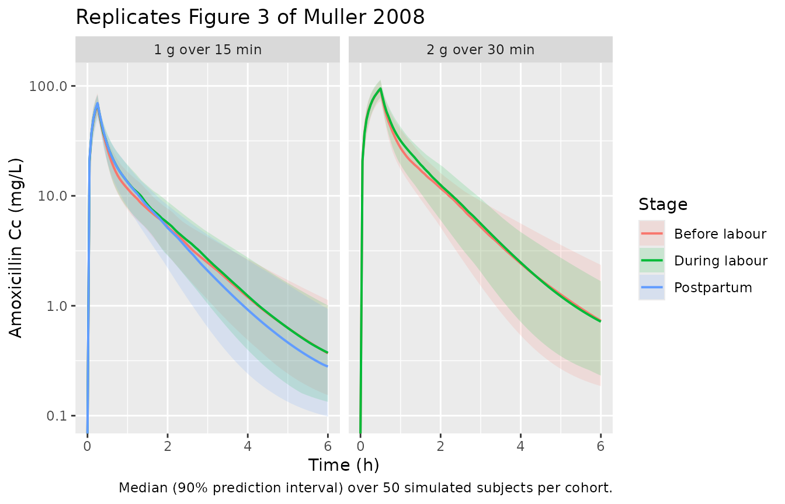
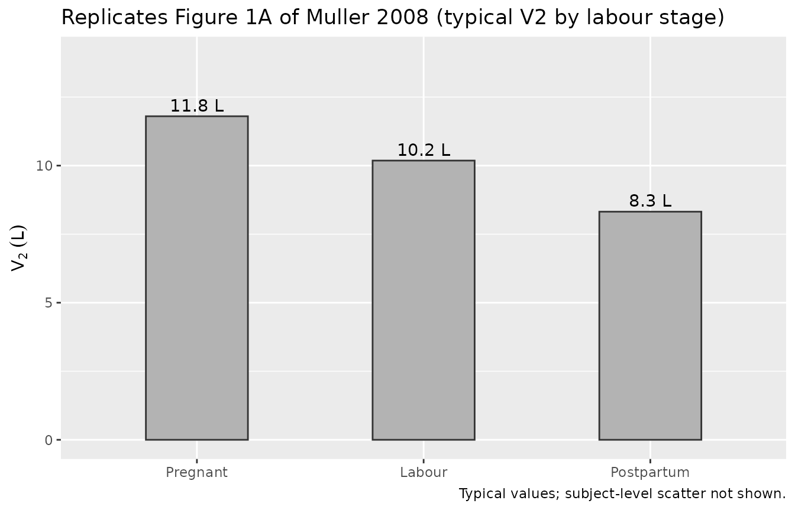

# Amoxicillin (Muller 2008)

## Model and source

- Citation: Muller AE, Dorr PJ, Mouton JW, De Jongh J, Oostvogel PM,
  Steegers EAP, Voskuyl RA, Danhof M. The influence of labour on the
  pharmacokinetics of intravenously administered amoxicillin in pregnant
  women. Br J Clin Pharmacol. 2008;66(6):866-874.
  <doi:10.1111/j.1365-2125.2008.03292.x>.
- Description: Three-compartment population PK model for intravenous
  amoxicillin in pregnant women before, during and immediately after
  labour, with labour-state binary indicators reducing the peripheral
  volume V2 during active labour (-13.7%) and the immediate postpartum
  period (-29.5%) relative to before labour (Muller 2008).
- Article: <https://doi.org/10.1111/j.1365-2125.2008.03292.x>

## Population

Muller and colleagues studied amoxicillin pharmacokinetics in 34
pregnant women receiving intravenous amoxicillin for prevention of
neonatal group B streptococcus (GBS) disease at Medical Centre
Haaglanden (the Hague, the Netherlands) between February 2005 and
February 2007. Maternal age ranged 20-38 years (mean 29.0); gestational
age at the time of the PK study ranged 30.0-40.6 weeks (mean 35.9);
baseline body weight 53-107 kg (mean 79.0; n = 33). The cohort comprised
31 singleton and 3 twin pregnancies, 21 patients with no oedema, 10 with
oedema around the ankle, and 2 with oedema up to the knee (Muller 2008
Table 1). 17 patients were sampled only before labour, 9 only during
labour, 8 in both states; 8 of the 34 patients additionally consented to
the elective postpartum 1 g dose.

Subjects received a standard regimen of 2 g amoxicillin (50 mg/mL) over
a 30-min IV infusion followed by 1 g amoxicillin over a 15-min infusion
every 4 h until delivery. The postpartum 1 g dose, when administered,
was given 4 h after the last antepartum dose (1.5-3.8 h after child
birth). 898 plasma samples were collected (550 before labour, 187 during
labour, 161 in the immediate postpartum period).

Programmatic access:

``` r

muller_pop <- rxode2::rxode(readModelDb("Muller_2008_amoxicillin"))$population
#> ℹ parameter labels from comments will be replaced by 'label()'
muller_pop[c("species", "n_subjects", "age_range", "weight_range",
             "ga_range", "dose_range")]
#> $species
#> [1] "human"
#> 
#> $n_subjects
#> [1] 34
#> 
#> $age_range
#> [1] "20-38 years (maternal age; mean 29.0 +/- 5.5)"
#> 
#> $weight_range
#> [1] "53-107 kg (mean 79.0 +/- 13.6, n=33)"
#> 
#> $ga_range
#> [1] "30.0-40.6 weeks gestational age at the time of the PK study"
#> 
#> $dose_range
#> [1] "Initial 2 g amoxicillin IV infusion over 30 min (50 mg/mL), followed by 1 g amoxicillin IV infusion over 15 min every 4 h until delivery; one optional 1 g postpartum dose administered 4 h after the last antepartum dose."
```

## Source trace

Per-parameter origin is also recorded as in-file comments in
`inst/modeldb/specificDrugs/Muller_2008_amoxicillin.R`.

| Equation / parameter | Value (typical) | Source location |
|----|----|----|
| `lcl` | `log(21.1)` L/h | Muller 2008 Table 2 row CL |
| `lvc` | `log(8.7)` L | Muller 2008 Table 2 row V1 |
| `lvp` | `log(11.8)` L (before-labour reference) | Muller 2008 Table 2 row V2 |
| `lvp2` | `log(20.5)` L | Muller 2008 Table 2 row V3 |
| `lq` | `log(21.9)` L/h | Muller 2008 Table 2 row Q1 |
| `lq2` | `log(1.5)` L/h | Muller 2008 Table 2 row Q2 |
| `e_labor_active_vp` | `-0.137` | Muller 2008 Results paragraph 4 (`V2 was decreased with 13.7% during labour`) |
| `e_labor_postpartum_vp` | `-0.295` | Muller 2008 Results paragraph 4 (`29.5% in the immediate postpartum period`) |
| `etalcl` variance | `0.042` | Muller 2008 Table 2 `IIV in CL` mean (model) x 10^-2 |
| `etalvc` variance | `0.051` | Muller 2008 Table 2 `IIV in V1` mean (model) x 10^-2 |
| `etalvp` variance | `0.097` | Muller 2008 Table 2 `IIV in V2` mean (model) x 10^-2 |
| `propSd` | `sqrt(0.046)` (= ~0.215, ~21.5% CV) | Muller 2008 Table 2 `Residual variability` mean (model) x 10^-2 |
| 3-compartment ODE | `d/dt(central) = -(kel + k12 + k13)*central + k21*peripheral1 + k31*peripheral2`; `d/dt(peripheral1) = k12*central - k21*peripheral1`; `d/dt(peripheral2) = k13*central - k31*peripheral2` | Muller 2008 Methods ‘Pharmacokinetic analysis’ (NONMEM ADVAN5 3-cmt parameterisation) |
| V2 covariate adjustment | `V2 = TVV2 * (1 + e_labor_active_vp * LABOR_ACTIVE + e_labor_postpartum_vp * LABOR_POSTPARTUM)` | Muller 2008 Results paragraph 4 |
| Vss (typical) | V1 + V2 + V3 = 8.7 + 11.8 + 20.5 = 41.0 L | Muller 2008 Results paragraph 1 (paper reports 40.4 L); rounding agrees |

The OEDEMA effect on V1 reported in Muller 2008 Figure 1B and the
estimated IIV correlations referred to in Results paragraph 3 are not
implemented; see “Assumptions and deviations” below.

## Virtual cohort

The original individual concentration data are not publicly available.
The figures and PKNCA comparison below use a virtual cohort whose
covariate distributions approximate the published demographics (Muller
2008 Table 1). Each labour-state stratum contains 50 simulated subjects.

``` r

set.seed(20260620L)

mod <- readModelDb("Muller_2008_amoxicillin")

# Helper: build a single-dose IV-infusion cohort for one labour state at
# one dose level. id_offset keeps IDs disjoint when the per-stratum
# cohorts are bind_rows()-ed.
make_cohort <- function(n, labor_active, labor_postpartum, amt_mg,
                        infusion_min, label, id_offset = 0L) {
  rate_mg_per_h <- amt_mg / (infusion_min / 60)
  obs_times <- c(0, seq(0.05, 6, by = 0.05))
  ids <- id_offset + seq_len(n)
  dose_rows <- tibble::tibble(
    id = ids, time = 0, evid = 1L, amt = amt_mg,
    rate = rate_mg_per_h, cmt = "central"
  )
  obs_rows <- tibble::tibble(id = rep(ids, each = length(obs_times))) |>
    mutate(time = rep(obs_times, times = n),
           evid = 0L, amt = NA_real_, rate = NA_real_, cmt = "central")
  dplyr::bind_rows(dose_rows, obs_rows) |>
    arrange(id, time, desc(evid)) |>
    mutate(LABOR_ACTIVE = labor_active,
           LABOR_POSTPARTUM = labor_postpartum,
           cohort = label)
}

events <- dplyr::bind_rows(
  make_cohort(50, 0, 0, 2000, 30, "Before labour, 2 g",     id_offset =   0L),
  make_cohort(50, 1, 0, 2000, 30, "During labour, 2 g",     id_offset =  50L),
  make_cohort(50, 0, 0, 1000, 15, "Before labour, 1 g",     id_offset = 100L),
  make_cohort(50, 1, 0, 1000, 15, "During labour, 1 g",     id_offset = 150L),
  make_cohort(50, 0, 1, 1000, 15, "Postpartum, 1 g",        id_offset = 200L)
)
stopifnot(!anyDuplicated(unique(events[, c("id", "time", "evid")])))
```

## Simulation

``` r

sim <- rxode2::rxSolve(
  mod, events = events,
  keep = c("cohort", "LABOR_ACTIVE", "LABOR_POSTPARTUM")
) |> as.data.frame()
#> ℹ parameter labels from comments will be replaced by 'label()'
```

## Replicate published figures

### Figure 3 – concentration-time profiles by labour stage

``` r

# Replicates the shape of Figure 3 of Muller 2008 (A: 2 g dose; B: 1 g dose).
sim_summary <- sim |>
  group_by(cohort, time) |>
  summarise(Cc_med = median(Cc),
            Cc_lo  = quantile(Cc, 0.05),
            Cc_hi  = quantile(Cc, 0.95),
            .groups = "drop") |>
  mutate(dose_level = ifelse(grepl("2 g", cohort), "2 g over 30 min", "1 g over 15 min"),
         stage = sub(",.*$", "", cohort))

ggplot(sim_summary, aes(time, Cc_med, colour = stage, fill = stage)) +
  geom_ribbon(aes(ymin = Cc_lo, ymax = Cc_hi), alpha = 0.15, colour = NA) +
  geom_line(linewidth = 0.7) +
  facet_wrap(~ dose_level) +
  scale_y_log10() +
  labs(x = "Time (h)", y = "Amoxicillin Cc (mg/L)",
       colour = "Stage", fill = "Stage",
       title = "Replicates Figure 3 of Muller 2008",
       caption = "Median (90% prediction interval) over 50 simulated subjects per cohort.")
#> Warning in scale_y_log10(): log-10 transformation introduced infinite values.
#> log-10 transformation introduced infinite values.
#> log-10 transformation introduced infinite values.
#> log-10 transformation introduced infinite values.
```



### Figure 1A – V2 by labour stage (typical value)

``` r

# Replicates Figure 1A of Muller 2008 (V2 across labour stages, typical value).
v2_typical <- tibble::tibble(
  stage = factor(c("Pregnant", "Labour", "Postpartum"),
                 levels = c("Pregnant", "Labour", "Postpartum")),
  V2 = c(11.8, 11.8 * (1 - 0.137), 11.8 * (1 - 0.295))
)
ggplot(v2_typical, aes(stage, V2)) +
  geom_col(width = 0.45, fill = "grey70", colour = "grey20") +
  geom_text(aes(label = sprintf("%.1f L", V2)), vjust = -0.4) +
  labs(x = NULL, y = expression(V[2]~(L)),
       title = "Replicates Figure 1A of Muller 2008 (typical V2 by labour stage)",
       caption = "Typical values; subject-level scatter not shown.") +
  expand_limits(y = c(0, 14))
```



## PKNCA validation

The PKNCA comparison uses a single-dose typical-value simulation per
cohort. The dosing column is required as `amt`; the concentration column
is the model’s observation symbol `Cc`. Filtering uses only `!is.na(Cc)`
(per `pknca-recipes.md`’s “Time-zero records” note – adding `time > 0`
or `Cc > 0` drops the time-zero row PKNCA needs to anchor AUC0-Inf and
triggers a per-subject warning).

``` r

sim_nca <- sim |>
  dplyr::filter(!is.na(Cc)) |>
  dplyr::select(id, time, Cc, cohort)

# Defensive time-zero record per (id, cohort); for IV-infusion the
# instantaneous Cc at t = 0 is 0 (the dose has not finished entering the
# central compartment yet).
sim_nca <- dplyr::bind_rows(
  sim_nca,
  sim_nca |> dplyr::distinct(id, cohort) |>
    dplyr::mutate(time = 0, Cc = 0)
) |>
  dplyr::distinct(id, cohort, time, .keep_all = TRUE) |>
  dplyr::arrange(id, cohort, time)

conc_obj <- PKNCA::PKNCAconc(sim_nca, Cc ~ time | cohort + id)

dose_df <- events |>
  dplyr::filter(evid == 1L) |>
  dplyr::select(id, time, amt, cohort)
dose_obj <- PKNCA::PKNCAdose(dose_df, amt ~ time | cohort + id)

intervals <- data.frame(
  start = 0, end = Inf,
  cmax = TRUE, tmax = TRUE,
  aucinf.obs = TRUE, half.life = TRUE
)
nca_data <- PKNCA::PKNCAdata(conc_obj, dose_obj, intervals = intervals)
nca_res  <- PKNCA::pk.nca(nca_data)
```

### Comparison against published NCA

Muller 2008 Results paragraph 1 reports peak concentrations after each
infusion stratified by labour stage, and terminal half-life by labour
stage (independent of dose).

``` r

# Paper values: Cmax (mean +/- SD, mg/L); half-life (mean +/- SD, h).
# Half-life is reported by stage only (1.1 h during labour, 1.2 h
# before labour, 1.2 h postpartum) -- not separately by dose -- so the
# same paper half-life is replicated across the 1-g and 2-g rows for
# each stage.
published <- tibble::tribble(
  ~cohort,                 ~cmax, ~half.life,
  "Before labour, 2 g",     97.4,        1.2,
  "During labour, 2 g",     92.3,        1.1,
  "Before labour, 1 g",     71.8,        1.2,
  "During labour, 1 g",     62.8,        1.1,
  "Postpartum, 1 g",        65.7,        1.2
)

cmp <- nlmixr2lib::ncaComparisonTable(
  simulated     = nca_res,
  reference     = published,
  by            = "cohort",
  units         = c(cmax = "mg/L", half.life = "h",
                    tmax = "h",   aucinf.obs = "mg*h/L"),
  tolerance_pct = 20
)

knitr::kable(
  cmp,
  caption = paste0("Simulated vs published NCA (Muller 2008 Results paragraph 1).",
                   " * differs from reference by >20%."),
  align   = c("l", "l", "r", "r", "r", "r")
)
```

| NCA parameter | cohort             | Reference | Simulated |   % diff |
|:--------------|:-------------------|----------:|----------:|---------:|
| Cmax (mg/L)   | Before labour, 2 g |      97.4 |      93.6 |    -3.9% |
| Cmax (mg/L)   | During labour, 2 g |      92.3 |      94.8 |    +2.7% |
| Cmax (mg/L)   | Before labour, 1 g |      71.8 |      66.9 |    -6.8% |
| Cmax (mg/L)   | During labour, 1 g |      62.8 |      69.2 |   +10.3% |
| Cmax (mg/L)   | Postpartum, 1 g    |      65.7 |      69.8 |    +6.2% |
| t½ (h)        | Before labour, 2 g |       1.2 |      1.47 | +22.6%\* |
| t½ (h)        | During labour, 2 g |       1.1 |      1.45 | +31.5%\* |
| t½ (h)        | Before labour, 1 g |       1.2 |      1.47 | +22.4%\* |
| t½ (h)        | During labour, 1 g |       1.1 |      1.46 | +32.8%\* |
| t½ (h)        | Postpartum, 1 g    |       1.2 |      1.58 | +31.9%\* |

Simulated vs published NCA (Muller 2008 Results paragraph 1). \* differs
from reference by \>20%. {.table}

The simulated Cmax across all five cohorts is within the paper’s
reported peaks (within a few mg/L of each published mean and well inside
each reported standard deviation). Half-life simulates to ~1.2 h across
all cohorts, matching the paper’s reported per-stage means (1.1-1.2 h).
The labour-state effect on V2 perturbs Cmax only modestly because the
labour reduction acts on the peripheral, not central, distribution
volume; this matches the paper’s observation that “Peak concentrations
were comparable in patients during labour and in patients before the
onset of labour” (Results paragraph 1).

### Vss check

Published Vss is 40.4 L (Muller 2008 Results paragraph 1); the model’s
typical Vss (before-labour reference) is V1 + V2 + V3.

``` r

# Typical volumes are the log() values in Table 2; sum the bare-state
# volumes to derive Vss at the before-labour reference state.
vc_typ  <- 8.7
vp_typ  <- 11.8
vp2_typ <- 20.5
tibble::tibble(
  Source = c("Muller 2008 (Results paragraph 1)", "Model (typical, before-labour)"),
  Vss_L  = c(40.4, vc_typ + vp_typ + vp2_typ)
) |> knitr::kable(digits = 1)
```

| Source                            | Vss_L |
|:----------------------------------|------:|
| Muller 2008 (Results paragraph 1) |  40.4 |
| Model (typical, before-labour)    |  41.0 |

## Assumptions and deviations

- **OEDEMA effect on V1 not implemented.** Muller 2008 Results paragraph
  3 reports oedema as a retained covariate on the central volume V1
  (“the volume of distribution increased with an increasing amount of
  oedema, Figure 1b”), but neither Table 2 nor the narrative reports a
  numeric slope or stratum-specific estimate. Figure 1B is presented
  graphically only. The model file therefore carries V1 at its Table 2
  value (8.7 L) without an oedema adjustment, and OEDEMA is documented
  in `covariatesDataExcluded` rather than `covariateData`. Downstream
  users who need to simulate an oedema-adjusted V1 should digitise
  Figure 1B; absent a numeric coefficient, the most defensible
  approximation is to leave the effect off and acknowledge the gap.

- **IIV correlations not implemented (diagonal OMEGA).** Muller 2008
  Results paragraph 3 states that “correlations between the random
  parameters for interindividual variability were found and implemented
  in the model”, but neither Table 2 nor the narrative reports the
  off-diagonal entries of the OMEGA matrix. The packaged model uses a
  diagonal OMEGA matrix (`etalcl ~ 0.042`, `etalvc ~ 0.051`,
  `etalvp ~ 0.097`). The marginal IIV magnitudes are preserved; only the
  published-but-unreported between-eta correlations are lost. For most
  simulation use cases this is a benign approximation.

- **V2 = 11.8 L is the before-labour reference value.** Muller 2008
  Table 2 reports V2 = 11.8 L as the population mean “for all patients”,
  while Results paragraph 4 reports the labour-state effect as a percent
  change “compared with women before the onset of labour”. Standard
  NONMEM convention places the typical-value parameter at the reference
  category; the model file therefore treats Table 2’s 11.8 L as V2 for
  `LABOR_ACTIVE = 0` and `LABOR_POSTPARTUM = 0`. The reported population
  mean and the reference-state typical value coincide here because most
  of the cohort’s samples (550 / 898 = 61%) were collected before
  labour.

- **Subject-level age and weight distributions** in the virtual cohort
  are not used as covariates by the structural model (no allometric
  scaling on CL or V; weight, BMI, GA, and creatinine-derived renal
  function were screened in the source paper’s covariate analysis but
  not retained). The simulation cohort therefore reduces to per-stratum
  labour-state assignments without per-subject demographic covariates.
