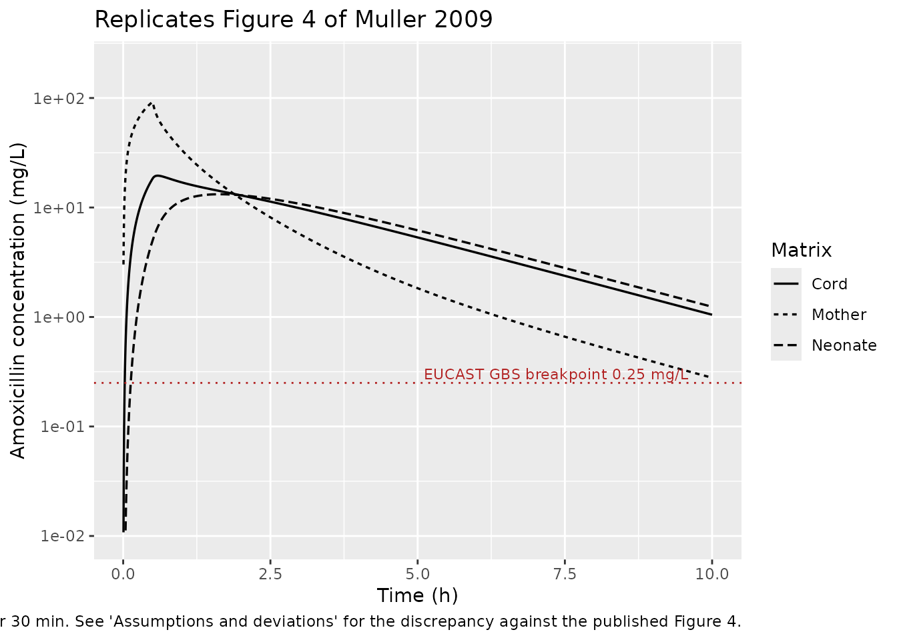
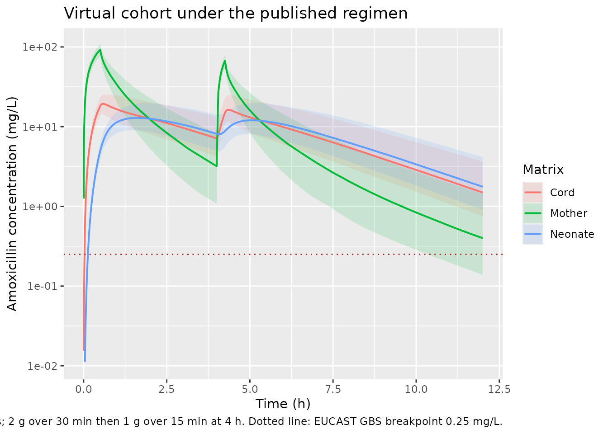

# Amoxicillin in maternal, umbilical cord and neonatal serum (Muller 2009)

## Model and source

- Citation: Muller AE, Oostvogel PM, DeJongh J, Mouton JW, Steegers EAP,
  Dorr PJ, Danhof M, Voskuyl RA. Pharmacokinetics of amoxicillin in
  maternal, umbilical cord, and neonatal sera. Antimicrob Agents
  Chemother. 2009;53(4):1574-1580. <doi:10.1128/AAC.00119-08>.
- Description: Five-compartment population PK model for intravenous
  amoxicillin in labouring women, the venous umbilical cord and the
  neonate, fitted simultaneously to maternal, arterial and venous
  umbilical cord and neonatal serum concentrations. Three maternal
  compartments (central V1 plus two peripheral compartments constrained
  to a common volume V2 = V3) exchange with a venous umbilical cord
  compartment V4 via the transplacental rate constants k14 / k41; a
  neonatal compartment V5 hangs off the cord compartment via k45 / k54
  and eliminates drug from the system via k50. Central volume increases
  4.2% per week of gestational age (Muller 2009).
- Article: <https://doi.org/10.1128/AAC.00119-08>

This is the first published model in which maternal, umbilical cord and
neonatal amoxicillin concentrations were fitted **simultaneously**. It
is the successor to `Muller_2008_amoxicillin`, the three-compartment
maternal model developed in women with preterm premature rupture of
membranes; the 2009 analysis reuses 416 of those maternal samples and
adds the cord and neonatal data that the earlier analysis did not use.

## Population

Between 7 February 2005 and 28 February 2007, 44 pregnant women at
Medical Centre Haaglanden (The Hague, the Netherlands) received
intravenous amoxicillin (or co-amoxiclav) shortly before or during
labour, for prevention of neonatal group B streptococcal (GBS) disease
or for suspected intra-amniotic infection. Maternal age was 30.0 +/-
6.85 years, body weight 79.4 +/- 13.9 kg, body mass index 29.4 +/- 5.3
kg/m^2, and mean amenorrhoea 36 6/7 weeks (SD 2.7); deliveries occurred
at gestational ages of 30.0 to 42.4 weeks and neonatal birth weights of
1340 to 4470 g (Muller 2009 Table 1, Results paragraph 1).

The amoxicillin regimen was 2 g (50 mg/mL) over a 30-min IV infusion
followed 4 h later by 1 g over 15 min; the co-amoxiclav regimen was 1 g
amoxicillin with 200 mg clavulanic acid over 15 min every 8 h. The two
groups were pooled because clavulanic acid does not alter intravenous
amoxicillin PK.

The analysis dataset comprised 904 maternal serum samples (3-41 per
patient), 53 umbilical cord samples (25 arterial and 28 venous; both
from 23 women), and 14 neonatal heel-puncture samples from 13 neonates
taken 14.2-199.8 min after birth. The interval between the last maternal
dose and birth ranged from 24.4 to 316.8 min. The assay LLOQ was 0.2
mg/L with a between-run CV below 4%.

Programmatic access:

``` r

muller_pop <- rxode2::rxode(readModelDb("Muller_2009_amoxicillin"))$population
#> ℹ parameter labels from comments will be replaced by 'label()'
muller_pop[c("species", "n_subjects", "n_observations", "age_range",
             "weight_range", "ga_range", "dose_range")]
#> $species
#> [1] "human"
#> 
#> $n_subjects
#> [1] 44
#> 
#> $n_observations
#> [1] 971
#> 
#> $age_range
#> [1] "mean 30.0 +/- 6.85 years (maternal age, n = 44)"
#> 
#> $weight_range
#> [1] "mean 79.4 +/- 13.9 kg (n = 43)"
#> 
#> $ga_range
#> [1] "30.0-42.4 weeks at delivery; cohort mean amenorrhoea 36 6/7 weeks (SD 2.7)"
#> 
#> $dose_range
#> [1] "Amoxicillin 2 g IV over 30 min followed after 4 h by 1 g IV over 15 min; or co-amoxiclav (1 g amoxicillin with 200 mg clavulanic acid) IV over 15 min every 8 h. All infusions at 50 mg/mL."
```

## Model structure

Muller 2009 Figure 2 draws a five-compartment mass-transfer system:

- the maternal central compartment `central` (V1), from which
  amoxicillin is cleared with CL and into which the infusion is
  delivered;
- two maternal peripheral compartments `peripheral1` (V2) and
  `peripheral2` (V3), exchanging with `central` through Q1 and Q2. Their
  volumes were “comparable (difference in the final model with separate
  estimates for V2 and V3, \< 0.5 liter)” with coefficients of variation
  above 51%, so V3 was constrained equal to V2;
- the venous umbilical cord compartment `cord_venous` (V4), exchanging
  with the maternal central compartment through the transplacental rate
  constants `k14` and `k41`;
- the neonatal compartment `neonate` (V5), hanging off `cord_venous`
  through `k45` and `k54` and eliminating drug from the system through
  `k50`.

Because “only venous cord blood enters the umbilical cord after passage
through the placenta, the antibiotic exchange between the compartments
might not be equal”, the authors parameterised the fetal side with
first-order rate constants rather than intercompartmental clearances
(Methods, “PK analysis”). The subscripts are the NONMEM ADVAN5 slot
indices of Figure 2 and are kept verbatim as the model’s parameter
names.

Two structural simplifications carried over from the paper are worth
noting. Arterial and venous cord concentrations were not separated,
because their ratio was not significantly different from 1 (Figure 1)
and “the differences … were too small for analysis of these
concentrations by the use of two separate compartments”. The arterial
cord samples were then pooled with the neonatal samples into compartment
5, since “arterial cord blood originates directly from the fetal
circulation”.

## Source trace

Per-parameter origin is also recorded as in-file comments in
`inst/modeldb/specificDrugs/Muller_2009_amoxicillin.R`.

| Equation / parameter | Value (typical) | Source location |
|----|----|----|
| `lcl` | `log(19.7)` L/h | Table 2 row CL (SE 0.99, CI 17.8-21.6); Abstract |
| `lvc` | `log(6.40)` L | Table 2 row V1 (SE 0.61, CI 5.2-7.6); Abstract |
| `lvp` | `log(5.88)` L | Table 2 row V2 (SE 0.83, CI 4.2-7.5); Abstract |
| `lvp2` | `log(5.88)` L | Table 2 row V3, constrained V3 = V2 (Results paragraph 3) |
| `lq` | `log(56.6)` L/h | Table 2 row Q1 (SE 9.5, CI 38.0-75.2) |
| `lq2` | `log(10.7)` L/h | Table 2 row Q2 (SE 2.2, CI 6.3-15.1) |
| `lk14` | `log(0.76)` 1/h | Table 2 row k14 (SE 0.28, CI 0.21-1.3) |
| `lk41` | `log(1.4)` 1/h | Table 2 row k41 (SE 0.31, CI 0.83-2.1) |
| `lk45` | `log(5.1)` 1/h | Table 2 row k45 (SE 2, CI 1.1-9.1) |
| `lk54` | `log(1.4)` 1/h | Table 2 row k54 (SE 0.31, CI 0.83-2.1) |
| `lk50` | `log(0.16)` 1/h | Table 2 row k50 (SE 0.033, CI 0.098-0.23) |
| `lv4` | `fixed(log(3.4))` L | Results paragraph 4 (“3.4 liters for the venous umbilical cord”) |
| `lv5` | `fixed(log(11.9))` L | Results paragraph 4 (“11.9 liters for the neonate”) |
| `e_ga_vc` | `0.042` per week | Results paragraph 4 (“An increase in V1 of 4.2% per week”) |
| `etalcl` variance | `0.076` | Table 2 row `Interindividual variability in CL` (SE 0.026, CI 0.026-0.13) |
| `etalvc` variance | `0.038` | Table 2 row `Interindividual variability in V1` (SE 0.013, CI 0.014-0.063) |
| `propSd`, `propSd_Ccord`, `propSd_Cneonate` | `sqrt(0.03)` (= 0.173, 17.3%) | Table 2 row `Residual variability` (SE 0.004, CI 0.022-0.037); one proportional model shared by all matrices (Methods “PK analysis”) |
| Five-compartment ODE system | see `model()` | Figure 2 and Results paragraph 3 |
| V1 covariate adjustment | `V1 = theta2 * [1 + theta12 * (GA - 36.8)] * exp(eta2)` | Results paragraph 4, printed equation |

Every 95% confidence interval in Table 2 is a Wald interval
`Mean +/- 1.96 * SE`, which is used below as an independent
transcription check on the rotated (landscape) table.

The check has to respect the table’s own precision. Every entry is
printed to two significant figures, so each printed number stands for an
interval (`k45`’s SE of `2` means anything in \[1.5, 2.5\]), and a naive
`Mean - 1.96 * SE` computed from the *rounded* values need not land on
the *rounded* bound. The comparison below is therefore interval-valued:
the range of `Mean +/- 1.96 * SE` attainable over the rounding intervals
of the mean and the SE must overlap the rounding interval of the printed
bound. This is strictly tighter than a blanket tolerance – a single
mistyped digit in any of the four columns breaks the overlap – and all
14 rows satisfy it.

``` r

# Values are carried as the strings Table 2 actually prints, so the
# rounding interval of each can be recovered from its precision.
tab2 <- tibble::tribble(
  ~parameter, ~mean,   ~se,     ~lo,     ~hi,
  "CL",       "19.7",  "0.99",  "17.8",  "21.6",
  "V1",       "6.4",   "0.61",  "5.2",   "7.6",
  "V2",       "5.88",  "0.83",  "4.2",   "7.5",
  "V3",       "5.88",  "0.83",  "4.2",   "7.5",
  "Q1",       "56.6",  "9.5",   "38.0",  "75.2",
  "Q2",       "10.7",  "2.2",   "6.3",   "15.1",
  "k14",      "0.76",  "0.28",  "0.21",  "1.3",
  "k41",      "1.4",   "0.31",  "0.83",  "2.1",
  "k45",      "5.1",   "2",     "1.1",   "9.1",
  "k54",      "1.4",   "0.31",  "0.83",  "2.1",
  "k50",      "0.16",  "0.033", "0.098", "0.23",
  "IIV CL",   "0.076", "0.026", "0.026", "0.13",
  "IIV V1",   "0.038", "0.013", "0.014", "0.063",
  "Residual", "0.03",  "0.004", "0.022", "0.037"
)

# Half-width of the rounding interval implied by a printed number's own
# precision: "38.0" -> 0.05, "2" -> 0.5, "0.033" -> 0.0005.
round_halfwidth <- function(x) {
  dec <- ifelse(grepl(".", x, fixed = TRUE),
                nchar(sub("^[^.]*\\.", "", x)), 0L)
  0.5 * 10^(-dec)
}

ci_chk <- tab2 |>
  mutate(across(c(mean, se, lo, hi), as.numeric,        .names = "{.col}_v"),
         across(c(mean, se, lo, hi), round_halfwidth,   .names = "{.col}_h")) |>
  mutate(
    # Range of Mean -/+ 1.96*SE over the rounding intervals of both.
    lo_min = mean_v - mean_h - 1.96 * (se_v + se_h),
    lo_max = mean_v + mean_h - 1.96 * (se_v - se_h),
    hi_min = mean_v - mean_h + 1.96 * (se_v - se_h),
    hi_max = mean_v + mean_h + 1.96 * (se_v + se_h),
    # ... must overlap the rounding interval of the printed bound.
    lo_ok  = lo_min <= lo_v + lo_h & lo_max >= lo_v - lo_h,
    hi_ok  = hi_min <= hi_v + hi_h & hi_max >= hi_v - hi_h
  )

# Deterministic check on the transcribed table, not on any simulation.
stopifnot(all(ci_chk$lo_ok), all(ci_chk$hi_ok))

ci_chk |>
  mutate(across(c(lo_min, lo_max, hi_min, hi_max), \(x) signif(x, 3))) |>
  select(parameter, mean, se, lo, lo_min, lo_max, lo_ok,
         hi, hi_min, hi_max, hi_ok) |>
  rename("Parameter" = parameter, "Mean" = mean, "SE" = se,
         "CI lower (printed)" = lo,
         "Attainable lower, min" = lo_min,
         "Attainable lower, max" = lo_max,
         "Lower OK" = lo_ok,
         "CI upper (printed)" = hi,
         "Attainable upper, min" = hi_min,
         "Attainable upper, max" = hi_max,
         "Upper OK" = hi_ok) |>
  knitr::kable()
```

| Parameter | Mean | SE | CI lower (printed) | Attainable lower, min | Attainable lower, max | Lower OK | CI upper (printed) | Attainable upper, min | Attainable upper, max | Upper OK |
|:---|:---|:---|:---|---:|---:|:---|:---|---:|---:|:---|
| CL | 19.7 | 0.99 | 17.8 | 17.7000 | 17.8000 | TRUE | 21.6 | 21.6000 | 21.7000 | TRUE |
| V1 | 6.4 | 0.61 | 5.2 | 5.1400 | 5.2600 | TRUE | 7.6 | 7.5400 | 7.6600 | TRUE |
| V2 | 5.88 | 0.83 | 4.2 | 4.2400 | 4.2700 | TRUE | 7.5 | 7.4900 | 7.5200 | TRUE |
| V3 | 5.88 | 0.83 | 4.2 | 4.2400 | 4.2700 | TRUE | 7.5 | 7.4900 | 7.5200 | TRUE |
| Q1 | 56.6 | 9.5 | 38.0 | 37.8000 | 38.1000 | TRUE | 75.2 | 75.1000 | 75.4000 | TRUE |
| Q2 | 10.7 | 2.2 | 6.3 | 6.2400 | 6.5400 | TRUE | 15.1 | 14.9000 | 15.2000 | TRUE |
| k14 | 0.76 | 0.28 | 0.21 | 0.1960 | 0.2260 | TRUE | 1.3 | 1.2900 | 1.3200 | TRUE |
| k41 | 1.4 | 0.31 | 0.83 | 0.7330 | 0.8520 | TRUE | 2.1 | 1.9500 | 2.0700 | TRUE |
| k45 | 5.1 | 2 | 1.1 | 0.1500 | 2.2100 | TRUE | 9.1 | 7.9900 | 10.0000 | TRUE |
| k54 | 1.4 | 0.31 | 0.83 | 0.7330 | 0.8520 | TRUE | 2.1 | 1.9500 | 2.0700 | TRUE |
| k50 | 0.16 | 0.033 | 0.098 | 0.0893 | 0.1010 | TRUE | 0.23 | 0.2190 | 0.2310 | TRUE |
| IIV CL | 0.076 | 0.026 | 0.026 | 0.0236 | 0.0265 | TRUE | 0.13 | 0.1250 | 0.1280 | TRUE |
| IIV V1 | 0.038 | 0.013 | 0.014 | 0.0110 | 0.0140 | TRUE | 0.063 | 0.0620 | 0.0650 | TRUE |
| Residual | 0.03 | 0.004 | 0.022 | 0.0162 | 0.0281 | TRUE | 0.037 | 0.0319 | 0.0438 | TRUE |

## The two derived fetal-side volumes

ADVAN5 estimates only rate constants for the fetal-side slots, so V4 and
V5 are not in Table 2. Results paragraph 4 states that they “were
calculated and were found to be 3.4 liters for the venous umbilical cord
and 11.9 liters for the neonate”, without printing the formula. Both are
recovered by the flow-balance identity implied by Figure 2 – passive
exchange across a boundary carries the same clearance in each direction,
so `k14 * V1 = k41 * V4` and `k45 * V4 = k54 * V5`.

This is also the check that fixes the *direction* of every rate
constant: transposing `k14` and `k41` would give V4 = 11.8 L, three and
a half times the published value.

``` r

k <- list(V1 = 6.4, k14 = 0.76, k41 = 1.4, k45 = 5.1, k54 = 1.4)
v4_calc <- k$k14 * k$V1 / k$k41
v5_calc <- k$k45 * 3.4 / k$k54

stopifnot(
  # Deterministic arithmetic on published point estimates -- no
  # simulation, no cohort, so the bounds are tight. The residual gap is
  # entirely the two-significant-figure rounding of the k values.
  abs(v4_calc - 3.4)  / 3.4  < 0.03,
  abs(v5_calc - 11.9) / 11.9 < 0.05
)
tibble::tibble(
  Volume = c("V4 (venous umbilical cord)", "V5 (neonate)"),
  `Flow-balance identity` = c("k14 * V1 / k41", "k45 * V4 / k54"),
  `Recomputed (L)` = signif(c(v4_calc, v5_calc), 4),
  `Published (L)` = c(3.4, 11.9)
) |>
  knitr::kable()
```

| Volume | Flow-balance identity | Recomputed (L) | Published (L) |
|:---|:---|---:|---:|
| V4 (venous umbilical cord) | k14 \* V1 / k41 | 3.474 | 3.4 |
| V5 (neonate) | k45 \* V4 / k54 | 12.390 | 11.9 |

Transposing `k14` and `k41` is ruled out explicitly:

``` r

stopifnot(abs(k$k41 * k$V1 / k$k14 - 3.4) / 3.4 > 2)
signif(k$k41 * k$V1 / k$k14, 4)
#> [1] 11.79
```

## Typical-value simulation of the published scenario

Muller 2009 Figure 4 simulates a single 2 g maternal infusion over 30
min and follows all three matrices. The chunk below reproduces that
scenario from the library model with the between-subject random effects
zeroed.

The event table doses `cmt = "central"` (an ODE state) and places
observation records on the `Cc` endpoint. This model declares three
endpoints (`Cc`, `Ccord`, `Cneonate`), so rxode2 requires observation
rows to name an endpoint rather than an ODE state; one endpoint
suffices, because every algebraic observable is returned as its own
column at every observation row.

``` r

mod <- readModelDb("Muller_2009_amoxicillin")
mod_typ <- rxode2::zeroRe(mod)
#> ℹ parameter labels from comments will be replaced by 'label()'

obs_times <- sort(unique(c(seq(0, 4, by = 0.005), seq(4, 72, by = 0.02))))
ev_typ <- rxode2::et(amt = 2000, dur = 0.5, cmt = "central")
ev_typ <- rxode2::et(ev_typ, obs_times, cmt = "Cc")
ev_typ <- as.data.frame(ev_typ)
ev_typ$GA <- 36.8  # the median GA on which the covariate model is centred

sim_typ <- rxode2::rxSolve(mod_typ, ev_typ, returnType = "data.frame") |>
  dplyr::filter(!is.na(Cc))
#> ℹ omega/sigma items treated as zero: 'etalcl', 'etalvc'

peak_of <- function(x, t) c(cmax = max(x), tmax = t[which.max(x)])
peaks <- rbind(
  Maternal = peak_of(sim_typ$Cc, sim_typ$time),
  Cord     = peak_of(sim_typ$Ccord, sim_typ$time),
  Neonate  = peak_of(sim_typ$Cneonate, sim_typ$time)
)
signif(peaks, 4)
#>           cmax  tmax
#> Maternal 92.25 0.500
#> Cord     19.53 0.585
#> Neonate  13.21 1.640
```

### Replicates Figure 4 of Muller 2009

``` r

sim_typ |>
  dplyr::select(time, Mother = Cc, Cord = Ccord, Neonate = Cneonate) |>
  tidyr::pivot_longer(-time, names_to = "Matrix", values_to = "conc") |>
  dplyr::filter(time <= 10, conc >= 0.01) |>
  ggplot(aes(time, conc, linetype = Matrix)) +
  geom_line(linewidth = 0.6) +
  geom_hline(yintercept = 0.25, colour = "firebrick", linetype = "dotted") +
  annotate("text", x = 9.6, y = 0.30, hjust = 1, size = 3, colour = "firebrick",
           label = "EUCAST GBS breakpoint 0.25 mg/L") +
  scale_y_log10(limits = c(0.01, 200)) +
  labs(x = "Time (h)", y = "Amoxicillin concentration (mg/L)",
       title = "Replicates Figure 4 of Muller 2009",
       caption = paste("Typical-value profiles after a single 2 g maternal",
                       "infusion over 30 min. See 'Assumptions and",
                       "deviations' for the discrepancy against the",
                       "published Figure 4."))
```



### Qualitative behaviour reported in the text

Two qualitative statements in Results paragraph 6 and Discussion
paragraph 1 are reproduced: the cord peak lags the maternal peak, and
the neonatal concentration overtakes the cord concentration and stays
above it thereafter.

``` r

cross <- with(sim_typ, {
  d <- Cneonate - Ccord
  time[which(d[-1] > 0 & d[-length(d)] <= 0)[1] + 1]
})

stopifnot(
  # Deterministic (typical-value) profile, so these are exact orderings,
  # not cohort quantiles.
  peaks["Maternal", "tmax"] == 0.5,                       # peak at end of infusion
  peaks["Cord", "tmax"] > peaks["Maternal", "tmax"],      # cord peak is delayed
  peaks["Cord", "cmax"] < peaks["Maternal", "cmax"],      # and lower
  peaks["Neonate", "tmax"] > peaks["Cord", "tmax"],       # neonatal peak later still
  cross > 1, cross < 3,                                   # neonate overtakes cord
  all(sim_typ$Cneonate[sim_typ$time > cross] >
        sim_typ$Ccord[sim_typ$time > cross])              # and stays above
)
sprintf("Cneonate exceeds Ccord from t = %.2f h onward", cross)
#> [1] "Cneonate exceeds Ccord from t = 1.99 h onward"
```

### Comparison against the published simulated peaks

The values below are reported in Results paragraphs 5-7 as outputs of a
**separate** Berkeley Madonna simulation (Methods, “Simulations”), not
as parameter estimates. They are reported here for transparency; see
“Assumptions and deviations” for why they are not asserted.

``` r

tibble::tibble(
  Quantity = c("Maternal Cmax (mg/L)", "Maternal tmax (h)",
               "Cord Cmax (mg/L)", "Cord peak delay after maternal peak (min)",
               "Cord/maternal peak ratio (%)", "Neonatal Cmax (mg/L)"),
  `Published (Berkeley Madonna)` = c(88.7, 0.5, 16.0, 3.3, 18, 8.0),
  `This model (rxode2)` = signif(c(
    peaks["Maternal", "cmax"], peaks["Maternal", "tmax"],
    peaks["Cord", "cmax"],
    60 * (peaks["Cord", "tmax"] - peaks["Maternal", "tmax"]),
    100 * peaks["Cord", "cmax"] / peaks["Maternal", "cmax"],
    peaks["Neonate", "cmax"]
  ), 4)
) |>
  mutate(`% diff` = signif(
    100 * (`This model (rxode2)` - `Published (Berkeley Madonna)`) /
      `Published (Berkeley Madonna)`, 3)) |>
  knitr::kable()
```

| Quantity | Published (Berkeley Madonna) | This model (rxode2) | % diff |
|:---|---:|---:|---:|
| Maternal Cmax (mg/L) | 88.7 | 92.25 | 4.0 |
| Maternal tmax (h) | 0.5 | 0.50 | 0.0 |
| Cord Cmax (mg/L) | 16.0 | 19.53 | 22.1 |
| Cord peak delay after maternal peak (min) | 3.3 | 5.10 | 54.5 |
| Cord/maternal peak ratio (%) | 18.0 | 21.17 | 17.6 |
| Neonatal Cmax (mg/L) | 8.0 | 13.21 | 65.1 |

## Mass balance

Every milligram of the maternal dose leaves the system either through
the maternal clearance CL or through the neonatal elimination rate
constant `k50`. That gives an exact identity linking the two AUCs to the
dose,

`Dose = CL * AUC(0-Inf, maternal) + k50 * V5 * AUC(0-Inf, neonatal)`,

which is an unusually sharp check because it exercises the ODE
right-hand sides, both scaling volumes and the solver simultaneously. It
is evaluated below from PKNCA output rather than from an inline
trapezoid.

## PKNCA validation

The source paper reports no NCA parameters, so PKNCA is used here for
structural verification rather than for a published-vs-simulated
comparison. The filter is `!is.na(Cc)` only, so the time-zero record
that anchors AUC(0-Inf) is retained.

``` r

nca_conc <- dplyr::bind_rows(
  tibble::tibble(id = 1L, matrix = "Maternal serum",
                 time = sim_typ$time, conc = sim_typ$Cc),
  tibble::tibble(id = 1L, matrix = "Venous umbilical cord serum",
                 time = sim_typ$time, conc = sim_typ$Ccord),
  tibble::tibble(id = 1L, matrix = "Neonatal serum",
                 time = sim_typ$time, conc = sim_typ$Cneonate)
) |>
  dplyr::filter(!is.na(conc))

nca_dose <- tibble::tibble(id = 1L, matrix = unique(nca_conc$matrix),
                           time = 0, amt = 2000)

# PKNCAdose() rejects slash grouping; use `+` on the dose side.
nca_res <- PKNCA::pk.nca(PKNCA::PKNCAdata(
  PKNCA::PKNCAconc(nca_conc, conc ~ time | id / matrix),
  PKNCA::PKNCAdose(nca_dose, amt ~ time | id + matrix),
  intervals = data.frame(start = 0, end = Inf,
                         cmax = TRUE, tmax = TRUE,
                         aucinf.obs = TRUE, half.life = TRUE,
                         lambda.z = TRUE)
))

nca_tab <- as.data.frame(nca_res) |>
  dplyr::filter(PPTESTCD %in% c("cmax", "tmax", "aucinf.obs",
                                "half.life", "lambda.z")) |>
  dplyr::select(matrix, PPTESTCD, PPORRES)

nca_tab |>
  tidyr::pivot_wider(names_from = PPTESTCD, values_from = PPORRES) |>
  dplyr::mutate(across(where(is.numeric), \(x) signif(x, 4))) |>
  dplyr::rename("Matrix" = matrix, "Cmax (mg/L)" = cmax, "Tmax (h)" = tmax,
                "AUC0-Inf (mg*h/L)" = aucinf.obs, "t1/2 (h)" = half.life,
                "lambda-z (1/h)" = lambda.z) |>
  knitr::kable()
```

| Matrix | Cmax (mg/L) | Tmax (h) | lambda-z (1/h) | t1/2 (h) | AUC0-Inf (mg\*h/L) |
|:---|---:|---:|---:|---:|---:|
| Maternal serum | 92.25 | 0.500 | 0.3295 | 2.104 | 95.13 |
| Neonatal serum | 13.21 | 1.640 | 0.3266 | 2.122 | 66.10 |
| Venous umbilical cord serum | 19.53 | 0.585 | 0.3271 | 2.119 | 70.77 |

``` r

getp <- function(mx, p) {
  nca_tab$PPORRES[nca_tab$matrix == mx & nca_tab$PPTESTCD == p]
}

auc_mat <- getp("Maternal serum", "aucinf.obs")
auc_neo <- getp("Neonatal serum", "aucinf.obs")
recovered <- 19.7 * auc_mat + 0.16 * 11.9 * auc_neo

# The slowest eigenvalue of the 5x5 rate matrix is the terminal slope of
# every compartment in a linear system; it is computed here from the
# published estimates, independently of the ODE solve.
rate_matrix <- local({
  CL <- 19.7; V1 <- 6.4; V2 <- 5.88; V3 <- 5.88; Q1 <- 56.6; Q2 <- 10.7
  k10 <- CL / V1; k12 <- Q1 / V1; k21 <- Q1 / V2
  k13 <- Q2 / V1; k31 <- Q2 / V3
  k14 <- 0.76; k41 <- 1.4; k45 <- 5.1; k54 <- 1.4; k50 <- 0.16
  matrix(c(
    -(k10 + k12 + k13 + k14), k21,  k31,  k41,          0,
     k12,                    -k21,    0,    0,          0,
     k13,                       0, -k31,    0,          0,
     k14,                       0,    0, -(k41 + k45),  k54,
       0,                       0,    0,  k45,        -(k54 + k50)
  ), nrow = 5, byrow = TRUE)
})
lambda_z_analytic <- -max(Re(eigen(rate_matrix)$values))

stopifnot(
  # Exact conservation identity on a deterministic single-subject solve.
  abs(recovered - 2000) / 2000 < 0.001,
  # Terminal slope is a property of the rate matrix, so all three
  # matrices must share it exactly.
  abs(getp("Venous umbilical cord serum", "lambda.z") /
        getp("Maternal serum", "lambda.z") - 1) < 0.01,
  abs(getp("Neonatal serum", "lambda.z") /
        getp("Maternal serum", "lambda.z") - 1) < 0.01,
  # ... and must equal the analytic slowest eigenvalue.
  abs(getp("Maternal serum", "lambda.z") / lambda_z_analytic - 1) < 0.02,
  # Cord and neonatal AUCs are the placental-transfer signal; both are
  # non-trivial fractions of the maternal AUC.
  getp("Venous umbilical cord serum", "aucinf.obs") > 0,
  getp("Neonatal serum", "aucinf.obs") > 0
)

tibble::tibble(
  Check = c("Dose recovered from CL*AUCmat + k50*V5*AUCneo (mg)",
            "Dose administered (mg)",
            "Fraction eliminated by the mother (%)",
            "Fraction eliminated by the neonate (%)",
            "Terminal lambda-z, PKNCA (1/h)",
            "Terminal lambda-z, slowest eigenvalue of the rate matrix (1/h)"),
  Value = signif(c(recovered, 2000,
                   100 * 19.7 * auc_mat / 2000,
                   100 * 0.16 * 11.9 * auc_neo / 2000,
                   getp("Maternal serum", "lambda.z"),
                   lambda_z_analytic), 6)
) |>
  knitr::kable()
```

| Check | Value |
|:---|---:|
| Dose recovered from CL*AUCmat + k50*V5\*AUCneo (mg) | 1999.990000 |
| Dose administered (mg) | 2000.000000 |
| Fraction eliminated by the mother (%) | 93.706500 |
| Fraction eliminated by the neonate (%) | 6.293140 |
| Terminal lambda-z, PKNCA (1/h) | 0.329500 |
| Terminal lambda-z, slowest eigenvalue of the rate matrix (1/h) | 0.328105 |

## Time above the GBS breakpoint

The paper’s headline clinical claim (Results paragraph 8) is that after
a single 2 g maternal dose, amoxicillin exceeds the EUCAST GBS
breakpoint of 0.25 mg/L for more than 90% of the 4-h dosing interval in
all three matrices. This is reproduced in a virtual cohort below.

## Virtual cohort

The individual concentration data are not publicly available. The cohort
below draws gestational age from a normal distribution matched to the
published mean amenorrhoea (36 6/7 weeks, SD 2.7) truncated to the
observed delivery range of 30.0-42.4 weeks, and applies the paper’s own
regimen: 2 g over 30 min followed at 4 h by 1 g over 15 min.

``` r

rxode2::rxSetSeed(20260901L)
set.seed(20260901L)

n_subj <- 200L  # single arm; at or below the 200-per-arm cap
ga_draw <- pmin(pmax(rnorm(n_subj, mean = 36.857, sd = 2.7), 30.0), 42.4)

obs_grid <- sort(unique(c(seq(0, 0.6, by = 0.002),
                          seq(0.6, 4, by = 0.02),
                          seq(4, 12, by = 0.05))))
ev_coh <- rxode2::et(amt = 2000, dur = 0.5, cmt = "central")
ev_coh <- rxode2::et(ev_coh, amt = 1000, dur = 0.25, time = 4, cmt = "central")
ev_coh <- rxode2::et(ev_coh, obs_grid, cmt = "Cc")
ev_coh <- rxode2::et(ev_coh, id = seq_len(n_subj))
ev_coh <- as.data.frame(ev_coh) |>
  dplyr::mutate(GA = ga_draw[id])

sim_coh <- rxode2::rxSolve(mod, ev_coh, keep = "GA",
                           returnType = "data.frame") |>
  dplyr::filter(!is.na(Cc))
#> ℹ parameter labels from comments will be replaced by 'label()'

stopifnot(
  dplyr::n_distinct(sim_coh$id) == n_subj,
  # GA is a covariate, not a random draw of the solver, so the cohort
  # median is a stable target.
  abs(median(ga_draw) - 36.857) < 1
)
```

``` r

sim_coh |>
  dplyr::select(id, time, Mother = Cc, Cord = Ccord, Neonate = Cneonate) |>
  tidyr::pivot_longer(c(Mother, Cord, Neonate),
                      names_to = "Matrix", values_to = "conc") |>
  dplyr::group_by(Matrix, time) |>
  dplyr::summarise(med = median(conc),
                   lo = quantile(conc, 0.05),
                   hi = quantile(conc, 0.95), .groups = "drop") |>
  dplyr::filter(med > 0.01) |>
  ggplot(aes(time, med, colour = Matrix, fill = Matrix)) +
  geom_ribbon(aes(ymin = lo, ymax = hi), alpha = 0.15, colour = NA) +
  geom_line(linewidth = 0.7) +
  geom_hline(yintercept = 0.25, colour = "firebrick", linetype = "dotted") +
  scale_y_log10() +
  labs(x = "Time (h)", y = "Amoxicillin concentration (mg/L)",
       title = "Virtual cohort under the published regimen",
       caption = paste("Median (90% prediction interval) over", n_subj,
                       "simulated subjects; 2 g over 30 min then 1 g over",
                       "15 min at 4 h. Dotted line: EUCAST GBS breakpoint",
                       "0.25 mg/L."))
```



``` r

frac_above <- function(conc, time, mic = 0.25, tmax_int = 4) {
  keep <- time <= tmax_int
  conc <- conc[keep]; time <- time[keep]
  above <- conc > mic
  sum(diff(time) * (head(above, -1) & tail(above, -1))) / tmax_int * 100
}

ftmic <- sim_coh |>
  dplyr::group_by(id) |>
  dplyr::summarise(
    Maternal = frac_above(Cc, time),
    Cord     = frac_above(Ccord, time),
    Neonatal = frac_above(Cneonate, time),
    cmax_mat = max(Cc[time <= 4]),
    .groups = "drop"
  )

ftmic_summary <- ftmic |>
  dplyr::select(Maternal, Cord, Neonatal) |>
  tidyr::pivot_longer(everything(), names_to = "Matrix",
                      values_to = "pct") |>
  dplyr::group_by(Matrix) |>
  dplyr::summarise(median = median(pct),
                   q10 = quantile(pct, 0.10),
                   q90 = quantile(pct, 0.90), .groups = "drop")

stopifnot(
  # Cohort-derived, so asserted on the centre and a robust lower
  # quantile rather than on the per-subject minimum (which is not
  # reproducible across rxode2 builds / thread counts).
  all(ftmic_summary$median > 90),
  all(ftmic_summary$q10 > 90),
  # Median maternal Cmax must track the typical-value profile closely;
  # the eta on CL and V1 is modest (CV 28% and 20% on the log scale).
  abs(median(ftmic$cmax_mat) / peaks["Maternal", "cmax"] - 1) < 0.10
)

ftmic_summary |>
  dplyr::mutate(across(c(median, q10, q90), \(x) signif(x, 4))) |>
  dplyr::rename("Matrix" = Matrix,
                "Median %T > 0.25 mg/L" = median,
                "10th percentile" = q10,
                "90th percentile" = q90) |>
  knitr::kable()
```

| Matrix   | Median %T \> 0.25 mg/L | 10th percentile | 90th percentile |
|:---------|-----------------------:|----------------:|----------------:|
| Cord     |                  99.35 |           99.30 |           99.35 |
| Maternal |                  99.95 |           99.95 |           99.95 |
| Neonatal |                  96.75 |           96.60 |           96.85 |

All three matrices exceed the breakpoint for more than 90% of the 4-h
dosing interval, reproducing the paper’s conclusion that “in a first
approximation, the 2-g infusion to the mother appears to be adequate for
the prevention of group B streptococcal disease”.

## Assumptions and deviations

**The published Figure 4 and the simulated peak concentrations quoted in
Results cannot be reproduced from Table 2.** This is the most important
caveat for a user of this model, and it is a property of the source, not
of the transcription. Three lines of evidence:

1.  *Terminal slope.* Digitised from Figure 4, the maternal curve falls
    from its 88.7 mg/L peak at 0.5 h to the 0.01 mg/L axis floor at
    roughly 9.4 h – about 3.95 log10 units in 8.9 h, a terminal
    half-life near 0.68 h. The slowest eigenvalue of the rate matrix
    built from Table 2 is 0.328 /h, a terminal half-life of 2.11 h. The
    maternal-only three-compartment sub-model (dropping `k14` / `k41`)
    gives 0.832 /h, i.e. 0.83 h, which is close to the figure. Figure
    4’s maternal curve therefore behaves as though the fetal
    compartments returned no drug to the mother.
2.  *Curve ordering.* In Figure 4 the cord and neonatal curves lie
    **below** the maternal curve at every time shown. In any linear
    system in which the fetal compartments are fed from, and drain more
    slowly than, the maternal compartment, they must eventually lie
    **above** it; the model of Figure 2 crosses over at about 2 h.
3.  *Peak magnitudes.* The neonatal peak simulates at 13.2 mg/L against
    a published 8.0 mg/L (+65%), and the two are reported to become
    similar at 1.1 h whereas this model crosses at about 2.0 h. The
    maternal peak (92.2 vs 88.7, +4.0%) and the cord/maternal peak ratio
    (21.2% vs 18%) are much closer.

Methods, “Simulations” states that the simulations were run in Berkeley
Madonna, i.e. in a second implementation separate from the NONMEM fit,
and its equations are not published. The model shipped here is the one
that was **fitted**: Figure 2’s structure with Table 2’s estimates,
under NONMEM ADVAN5’s amount-based mass-transfer semantics.

Three independent points fix that reading, and each of them argues
against the alternative in which the fetal compartments are
concentration-driven “sensor” compartments that return no mass to the
mother (an alternative that would reproduce Figure 4’s steep, parallel
terminal slopes):

- Methods, “PK analysis” states that “the model was implemented in the
  NONMEM ADVAN5 subroutine”. ADVAN5 is the general linear
  **mass**-transfer routine; its `K<i><j>` are amount-based first-order
  rate constants, which is what the ODEs above encode.
- Discussion paragraph 1 states that the total maternal CL here (19.7
  L/h) is lower than the 22.8 L/h of the same authors’ three-compartment
  PPROM model, and that this “can be explained by the additional route
  of elimination toward the neonate”. Drug must physically leave the
  maternal compartment for its apparent clearance to fall; a sensor
  compartment removes no mass and would leave CL unchanged.
- The flow-balance recovery of the “calculated” volumes V4 = 3.4 L and
  V5 = 11.9 L above only works for amount-based transfer in the
  direction Figure 2 draws.

No parameter was adjusted to move the simulation toward the published
peaks.

Other deviations and assumptions:

- **IIV correlation not implemented.** Results paragraph 3 states that
  “A correlation between the random parameters for interindividual
  variability was found and was accounted for in the model”, but the
  off-diagonal covariance between `etalcl` and `etalvc` is not reported
  in Table 2 or anywhere else in the paper. A diagonal OMEGA is used.
  Simulated cohorts will therefore have a slightly different joint CL /
  V1 spread than the published model.
- **`k41` and `k54` share a point estimate, SE and confidence
  interval.** Table 2 gives both as 1.4 (SE 0.31, CI 0.83-2.1) –
  identical to every printed digit. That is strong evidence they were a
  single constrained THETA, but the paper never says so. They are
  encoded here as two separate parameters carrying the same value, which
  is numerically identical for simulation and leaves the choice open for
  anyone re-fitting the model.
- **V4 and V5 are `fixed()`.** They are reported without a standard
  error, were “calculated” rather than estimated, and are scaling
  constants for the concentration observables only; they do not enter
  the amount dynamics.
- **The gestational-age coefficient is a prose value.**
  `e_ga_vc = 0.042` comes from the sentence “An increase in V1 of 4.2%
  per week was found”, not from a table row, and carries no reported
  uncertainty. The centring value 36.8 weeks is printed inside the
  covariate equation itself and agrees with the Table 1 mean amenorrhoea
  of 36 6/7 (= 36.857) weeks.
- **Body mass index is not implemented.** It was significant on V on its
  own (dOFV = -8.5) but was dropped in favour of gestational age; no
  coefficient is reported, so it could not be implemented even as an
  alternative. It is recorded in `covariatesDataExcluded`.
- **Arterial cord and neonatal serum share one compartment.** This is
  the authors’ own simplification (Discussion paragraph 3), forced by
  the small number of neonatal samples. The paper notes the consequence
  explicitly: “Because elimination from the neonate to the mother was
  included in the model, the model-predicted neonatal concentrations
  were slightly lower than the observed concentrations, as seen in Fig.
  3.”
- **`cord_venous` and `neonate` are declared as
  `paper_specific_compartments`.** Neither is a member of a canonical
  compartment family. They follow the precedent of
  `Fauchet_2015_lopinavir_placental.R` (`fetal`, `amniotic`) rather than
  opening a new canonical namespace for maternal-fetal matrices.
- **Rate constants keep the paper’s slot-index names** (`k14`, `k41`,
  `k45`, `k54`, `k50`). The indices refer to Figure 2’s ADVAN5 slots: 1
  = maternal central, 4 = venous umbilical cord, 5 = neonate, 0 =
  eliminated. The mapping is recorded in the model file’s
  `compartmentData` and in the parameter labels.
- **Cohort covariate distribution is assumed.** Gestational age is drawn
  from a truncated normal matched to the published mean and SD; the
  paper reports summary statistics only. Race and ethnicity are not
  reported at all.
- **No published NCA to compare against.** The paper reports no
  non-compartmental parameters, so the PKNCA section verifies internal
  identities (dose recovery, shared terminal slope) rather than
  reproducing a published table.
