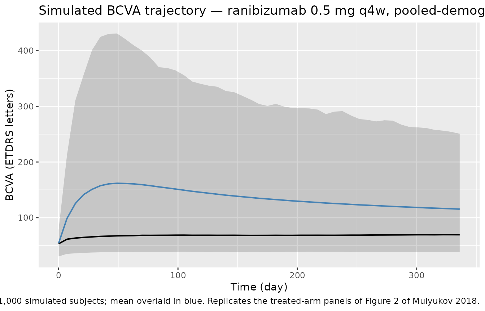
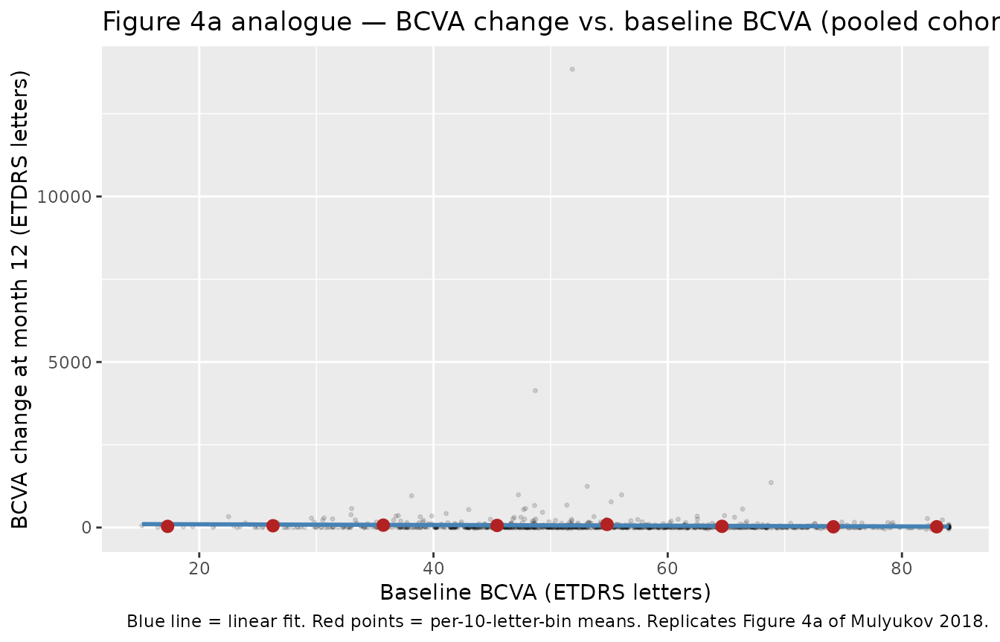
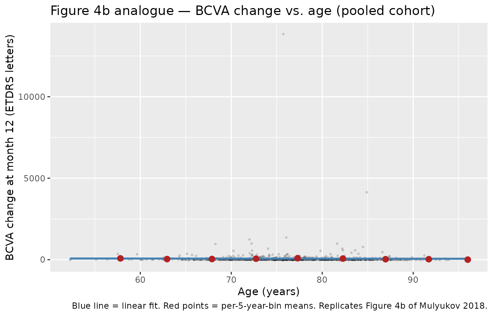

# Mulyukov_2018_ranibizumab

``` r
library(nlmixr2lib)
library(PKNCA)
#> 
#> Attaching package: 'PKNCA'
#> The following object is masked from 'package:stats':
#> 
#>     filter
library(rxode2)
#> rxode2 5.0.2 using 2 threads (see ?getRxThreads)
#>   no cache: create with `rxCreateCache()`
library(dplyr)
#> 
#> Attaching package: 'dplyr'
#> The following objects are masked from 'package:stats':
#> 
#>     filter, lag
#> The following objects are masked from 'package:base':
#> 
#>     intersect, setdiff, setequal, union
library(tidyr)
library(ggplot2)
```

## Model and source

- Citation: Mulyukov Z, Weber S, Pigeolet E, Clemens A, Lehr T,
  Racine A. Neovascular Age-Related Macular Degeneration: A Visual
  Acuity Model of Natural Disease Progression and Ranibizumab Treatment
  Effect. CPT Pharmacometrics Syst Pharmacol. 2018;7(10):660-669.
  <doi:10.1002/psp4.12322>. PMID: 30043524.
- Description: Indirect-response PK/PD model of intravitreal ranibizumab
  on best-corrected visual acuity (BCVA, ETDRS letters) in
  anti-VEGF-naive adults with neovascular age-related macular
  degeneration (Mulyukov 2018). BCVA is driven by an indirect-response
  ODE in which drug concentration stimulates the BCVA production rate
  (kin) through a Michaelis-Menten-like term with a time-dependent
  maximum effect Emax(t) = Emax_ss + dEmax_0 \* exp(-kEmax \* t). The PK
  is a fixed first-order vitreous-elimination placeholder (kel =
  0.077/day, vitreous volume = 4 mL, no IIV) borrowed from a previous
  population PK analysis (reference 20 of the paper) because vitreous PK
  data were not collected in the development studies.
- Article: <https://doi.org/10.1002/psp4.12322>

Mulyukov 2018 develops an indirect-response nonlinear mixed-effects
model of best-corrected visual acuity (BCVA; ETDRS letters) under
ranibizumab treatment in anti-VEGF-naive neovascular age-related macular
degeneration (nAMD). The dynamics are governed by

$$\frac{dg_{i}(t)}{dt} = k_{\text{in},i}\left\lbrack 1 + E_{\max,i}(t)\,\frac{C_{i}(t)}{EC_{50} + C_{i}(t)} \right\rbrack - k_{\text{out},i}\, g_{i}(t)$$

with $g_{i}(0) = g_{i,0}$ and a time-dependent maximum effect

$$E_{\max,i}(t) = E_{\max,i}^{ss} + \Delta E_{\max,i}^{0}\, e^{- k_{E_{\max}}t}.$$

The vitreous PK is not estimated in this paper. It is borrowed from a
previous population PK analysis (paper reference 20) and fixed at a
first-order elimination process with $k_{\text{elim}} = 0.077$/day
($t_{1/2} = 9$ days) and a 4 mL vitreous volume. No IIV is carried on
the PK parameters because vitreous PK samples were not collected in the
four development studies.

## Population

The model was developed on pooled individual data from four phase-III
ranibizumab clinical studies — ANCHOR, MARINA, PIER, and EXCITE —
totalling **1,524 treatment-naive patients** and **29,754 BCVA
observations**. Inclusion criteria common to all four studies: age ≥ 50
years with a study-eye BCVA of 25–70 ETDRS letters (nAMD of any lesion
type across the pool). Baseline BCVA across studies was 54 ± 13 letters
(range 3–84); baseline age 77 ± 7.5 years (range 52–96); ~40% male.
Dosing regimens in the development dataset include 0.3 mg and 0.5 mg
intravitreal ranibizumab, monthly (q4w) or quarterly (q12w) after three
monthly loading injections, along with sham comparator arms. The PDT
(verteporfin) control arm of ANCHOR and the year-2 PIER data were
excluded from the modelled dataset (see Mulyukov 2018 Methods — Clinical
studies and Table 1 for full study-level demographics). An external
HARBOR cohort (ranibizumab 0.5 mg and 2.0 mg q4w, summary data only) was
used as a predictive check and is **not** part of the fitted data.

The same information is available programmatically via the model’s
`population` metadata:

``` r
str(rxode2::rxode2(readModelDb("Mulyukov_2018_ranibizumab"))$meta$population)
#> ℹ parameter labels from comments will be replaced by 'label()'
#> List of 14
#>  $ n_subjects         : int 1524
#>  $ n_observations     : int 29754
#>  $ n_studies          : int 4
#>  $ age_range          : chr "50-96 years; mean (SD) 77 (7.5) years"
#>  $ age_median         : chr "77 years (mean)"
#>  $ weight_range       : NULL
#>  $ sex_female_pct     : num 60
#>  $ race_ethnicity     : NULL
#>  $ disease_state      : chr "Anti-VEGF treatment-naive neovascular (wet) age-related macular degeneration with best-corrected visual acuity "| __truncated__
#>  $ dose_range         : chr "Ranibizumab 0.3 mg or 0.5 mg intravitreal injection, monthly (q4w) or quarterly (q12w) after three monthly load"| __truncated__
#>  $ regions            : chr "Multinational (ANCHOR, MARINA, PIER, and EXCITE phase III programmes)."
#>  $ baseline_BCVA      : chr "Mean (SD) 54 (13) ETDRS letters; range 3-84 letters."
#>  $ external_validation: chr "HARBOR study (ranibizumab 0.5 mg and 2.0 mg q4w, summary data only) used for predictive check only; not part of model fitting."
#>  $ notes              : chr "Pooled from the ANCHOR (2 y), MARINA (2 y), PIER (1 y), and EXCITE (1 y) phase III ranibizumab trials (Mulyukov"| __truncated__
```

## Source trace

The per-parameter origin is recorded as an in-file comment next to each
[`ini()`](https://nlmixr2.github.io/rxode2/reference/ini.html) entry in
`inst/modeldb/specificDrugs/Mulyukov_2018_ranibizumab.R`. The table
below collects the equations and parameters in one place for reviewer
audit.

| Equation / parameter                                            | Value                                  | Source location                                                                                |
|-----------------------------------------------------------------|----------------------------------------|------------------------------------------------------------------------------------------------|
| PK ODE `d/dt(central) = -kel·central`                           | n/a                                    | Methods — Model development, paragraph above Eq. 1 (first-order vitreous elimination, ref. 20) |
| PD ODE `d/dt(bcva) = kin·(1 + Emax_t·Cc/(EC50+Cc)) - kout·bcva` | n/a                                    | Eq. 1                                                                                          |
| Time-dependent Emax `Emax_t = Emax_ss + dEmax_0·exp(-kEmax·t)`  | n/a                                    | Eq. 2                                                                                          |
| Covariate form `theta · (AGE/77)^beta_AGE · exp(eta)`           | n/a                                    | Eq. 3                                                                                          |
| Natural-progression steady state `gss = kin/kout`               | n/a                                    | Methods — paragraph after Eq. 1                                                                |
| `kel`                                                           | 0.077/day (fixed; t½ = 9 d)            | Table 2 (borrowed from ref. 20)                                                                |
| `V_vitreous`                                                    | 4 mL (fixed)                           | Methods — paragraph after Eq. 1                                                                |
| `gss`                                                           | 11 ETDRS letters                       | Table 2                                                                                        |
| `kout`                                                          | 0.19/year (t½ = 3.6 y)                 | Table 2                                                                                        |
| `Emax_ss`                                                       | 6.1                                    | Table 2                                                                                        |
| `dEmax_0`                                                       | 41                                     | Table 2                                                                                        |
| `kEmax`                                                         | 0.046/day (fixed; t½ = 15 d)           | Table 2                                                                                        |
| `EC50`                                                          | 2.1 µg/mL                              | Table 2                                                                                        |
| `β_Emax_ss,AGE`                                                 | −1.4                                   | Table 2                                                                                        |
| IIV `g0`                                                        | SD 4.1 letters (additive)              | Table 2                                                                                        |
| IIV `kout`                                                      | CV 730 %                               | Table 2                                                                                        |
| IIV `Emax_ss`                                                   | CV 110 %                               | Table 2                                                                                        |
| IIV `dEmax_0`                                                   | CV 1100 %                              | Table 2                                                                                        |
| σ treatment                                                     | 5 letters (additive)                   | Table 2                                                                                        |
| σ sham                                                          | 7 letters (additive, not exposed here) | Table 2 (see Assumptions and deviations)                                                       |

Unit check at the reference dose: 0.5 mg delivered into 4 mL vitreous
gives peak concentration 0.5 / 0.004 = 125 mg/L ≡ 125 µg/mL. After 30
days, $125 \cdot e^{- 0.077 \cdot 30} = 12.4$ µg/mL (paper Methods text:
“12.5 µg/mL one month after an injection”); after 90 days,
$125 \cdot e^{- 0.077 \cdot 90} = 0.12$ µg/mL (paper: “0.12 µg/mL three
months after an injection”). The implementation therefore matches the
paper’s published trough concentrations to \< 1 %.

## Virtual cohort

The original BCVA dataset is not publicly available. For validation we
construct a virtual cohort that matches the pooled baseline demographics
(mean age 77 years; mean baseline BCVA 54 letters) and also match the
HARBOR 0.5 mg q4w cohort used as the paper’s external validation (mean
age 78.8 years; mean baseline BCVA 54.2 letters, Table 1). Figures 3 and
4 of the paper depict mean predictions over simulated populations, so we
run **both** a typical-value (zero-IIV) trajectory and a stochastic
cohort of 1,000 subjects and average.

``` r
set.seed(20260424)

n_cohort <- 1000L

# Pooled-demographics cohort (paper Results paragraph: mean age 77, mean baseline BCVA 54)
pooled_cohort <- tibble(
  id   = seq_len(n_cohort),
  AGE  = pmax(50, pmin(96, rnorm(n_cohort, mean = 77.0, sd = 7.5))),
  BCVA = pmax( 3, pmin(84, rnorm(n_cohort, mean = 54.0, sd = 13.0))),
  cohort = "Pooled (ANCHOR/MARINA/PIER/EXCITE)"
)

# HARBOR 0.5 mg q4w external-validation cohort (Table 1 column "HARBOR q4w 0.5 mg")
harbor_05_cohort <- tibble(
  id   = n_cohort + seq_len(n_cohort),
  AGE  = pmax(50, pmin(96, rnorm(n_cohort, mean = 78.8, sd = 8.4))),
  BCVA = pmax( 3, pmin(84, rnorm(n_cohort, mean = 54.2, sd = 13.3))),
  cohort = "HARBOR 0.5 mg q4w"
)

# HARBOR 2.0 mg q4w external-validation cohort (Table 1 column "HARBOR q4w 2.0 mg")
harbor_20_cohort <- tibble(
  id   = 2L * n_cohort + seq_len(n_cohort),
  AGE  = pmax(50, pmin(96, rnorm(n_cohort, mean = 79.3, sd = 8.3))),
  BCVA = pmax( 3, pmin(84, rnorm(n_cohort, mean = 53.5, sd = 13.1))),
  cohort = "HARBOR 2.0 mg q4w"
)

# Event-table helper: 12 monthly doses (day 0, 28, 56, ..., 308) + monthly BCVA obs.
make_events <- function(cov_df, dose_mg, obs_days = seq(0, 336, by = 7)) {
  ids  <- cov_df$id
  dose_times <- seq(0, by = 28, length.out = 12)
  dose_rows <- expand.grid(id = ids, time = dose_times) |>
    mutate(evid = 1L, amt = dose_mg, cmt = "central", dv = NA_real_) |>
    as_tibble()
  obs_rows <- expand.grid(id = ids, time = obs_days) |>
    mutate(evid = 0L, amt = 0, cmt = "bcva", dv = NA_real_) |>
    as_tibble()
  bind_rows(dose_rows, obs_rows) |>
    arrange(id, time, desc(evid)) |>
    left_join(cov_df, by = "id")
}

events_pooled    <- make_events(pooled_cohort,    dose_mg = 0.5)
events_harbor_05 <- make_events(harbor_05_cohort, dose_mg = 0.5)
events_harbor_20 <- make_events(harbor_20_cohort, dose_mg = 2.0)

stopifnot(!anyDuplicated(unique(
  bind_rows(events_pooled, events_harbor_05, events_harbor_20)[, c("id", "time", "evid")]
)))
```

## Simulation

``` r
mod         <- readModelDb("Mulyukov_2018_ranibizumab")
mod_typical <- rxode2::zeroRe(mod)
#> ℹ parameter labels from comments will be replaced by 'label()'

sim_typical_harbor_05 <- rxode2::rxSolve(
  mod_typical,
  events = events_harbor_05 |> filter(id == harbor_05_cohort$id[1]),
  returnType = "data.frame"
)
#> ℹ omega/sigma items treated as zero: 'etag0res', 'etalkout', 'etalEmaxss', 'etaldEmax0'

sim_harbor_05 <- rxode2::rxSolve(
  mod,
  events = events_harbor_05,
  keep   = c("cohort"),
  returnType = "data.frame"
)
#> ℹ parameter labels from comments will be replaced by 'label()'

sim_harbor_20 <- rxode2::rxSolve(
  mod,
  events = events_harbor_20,
  keep   = c("cohort"),
  returnType = "data.frame"
)
#> ℹ parameter labels from comments will be replaced by 'label()'

sim_pooled <- rxode2::rxSolve(
  mod,
  events = events_pooled,
  keep   = c("cohort"),
  returnType = "data.frame"
)
#> ℹ parameter labels from comments will be replaced by 'label()'
```

## Replicate published figures

### PK unit check — vitreous concentration after a single 0.5 mg injection

Mulyukov 2018 Methods cites two concrete PK landmarks from the borrowed
PK model: $C_{vitreous}\left( 30{\mspace{6mu}\text{d}} \right) = 12.5$
µg/mL and $C_{vitreous}\left( 90{\mspace{6mu}\text{d}} \right) = 0.12$
µg/mL after a single 0.5 mg intravitreal injection.

``` r
ev_single <- data.frame(
  id = 1L,
  time = c(0, 0.001, 30, 90),
  evid = c(1, 0, 0, 0),
  amt  = c(0.5, 0, 0, 0),
  cmt  = c("central", "bcva", "bcva", "bcva"),
  AGE = 77, BCVA = 55
)
sim_single <- rxode2::rxSolve(mod_typical, events = ev_single, returnType = "data.frame")
#> ℹ omega/sigma items treated as zero: 'etag0res', 'etalkout', 'etalEmaxss', 'etaldEmax0'
pk_check <- tibble(
  time           = c(0, 30, 90),
  Cc             = c(sim_single$Cc[which.min(abs(sim_single$time - 0.001))],
                     sim_single$Cc[which.min(abs(sim_single$time - 30))],
                     sim_single$Cc[which.min(abs(sim_single$time - 90))]),
  paper_Cc_ug_mL = c(125, 12.5, 0.12)
) |> mutate(pct_diff = 100 * (Cc - paper_Cc_ug_mL) / paper_Cc_ug_mL)
knitr::kable(pk_check,
  caption = "Vitreous concentration after a single 0.5 mg intravitreal injection, simulated vs. paper Methods.")
```

| time |          Cc | paper_Cc_ug_mL |   pct_diff |
|-----:|------------:|---------------:|-----------:|
|    0 | 124.9903754 |         125.00 | -0.0076997 |
|   30 |  12.4076532 |          12.50 | -0.7387741 |
|   90 |   0.1222494 |           0.12 |  1.8744630 |

Vitreous concentration after a single 0.5 mg intravitreal injection,
simulated vs. paper Methods.

### Figure 2 analogue — typical-value BCVA trajectory under 0.5 mg q4w (HARBOR covariates)

``` r
sim_pooled_summary <- sim_pooled |>
  group_by(time, cohort) |>
  summarise(
    bcva_mean = mean(bcva, na.rm = TRUE),
    bcva_Q05  = quantile(bcva, 0.05, na.rm = TRUE),
    bcva_Q50  = quantile(bcva, 0.50, na.rm = TRUE),
    bcva_Q95  = quantile(bcva, 0.95, na.rm = TRUE),
    .groups   = "drop"
  )

ggplot(sim_pooled_summary, aes(time, bcva_Q50)) +
  geom_ribbon(aes(ymin = bcva_Q05, ymax = bcva_Q95), alpha = 0.2) +
  geom_line(linewidth = 0.7) +
  geom_line(aes(y = bcva_mean), colour = "steelblue", linewidth = 0.7) +
  labs(
    x = "Time (day)", y = "BCVA (ETDRS letters)",
    title = "Simulated BCVA trajectory — ranibizumab 0.5 mg q4w, pooled-demographics cohort",
    caption = "Median (black) and 5th-95th percentile envelope from 1,000 simulated subjects; mean overlaid in blue. Replicates the treated-arm panels of Figure 2 of Mulyukov 2018."
  )
```



### Figure 3 — HARBOR external validation at 12 months

The paper reports (Results — Model evaluation) observed HARBOR 12-month
mean BCVA changes of approximately +10 and +9 ETDRS letters for the 0.5
mg and 2.0 mg q4w arms, with model-predicted +8.5 and +9.2 letters
respectively.

``` r
cfb_12mo <- bind_rows(
  sim_harbor_05 |>
    group_by(id, cohort) |>
    summarise(bcva_0 = first(bcva), bcva_12 = bcva[which.min(abs(time - 336))],
              .groups = "drop"),
  sim_harbor_20 |>
    group_by(id, cohort) |>
    summarise(bcva_0 = first(bcva), bcva_12 = bcva[which.min(abs(time - 336))],
              .groups = "drop")
) |>
  mutate(delta_bcva_12 = bcva_12 - bcva_0)

cfb_summary <- cfb_12mo |>
  group_by(cohort) |>
  summarise(
    mean_delta   = mean(delta_bcva_12),
    median_delta = median(delta_bcva_12),
    SD_delta     = sd(delta_bcva_12),
    n            = dplyr::n(),
    .groups      = "drop"
  ) |>
  mutate(
    paper_observed_letters  = c(10.1, 9.2),
    paper_predicted_letters = c( 8.5, 9.2)
  )

knitr::kable(cfb_summary, digits = 2,
  caption = "Simulated vs. published BCVA change from baseline at 12 months (ranibizumab HARBOR arms). Paper values from Results — Model evaluation and simulations and Table 1.")
```

| cohort            | mean_delta | median_delta | SD_delta |    n | paper_observed_letters | paper_predicted_letters |
|:------------------|-----------:|-------------:|---------:|-----:|-----------------------:|------------------------:|
| HARBOR 0.5 mg q4w |      40.66 |         6.70 |   122.42 | 1000 |                   10.1 |                     8.5 |
| HARBOR 2.0 mg q4w |      88.61 |         9.91 |   900.20 | 1000 |                    9.2 |                     9.2 |

Simulated vs. published BCVA change from baseline at 12 months
(ranibizumab HARBOR arms). Paper values from Results — Model evaluation
and simulations and Table 1.

### Figure 4a analogue — dependence of 12-month BCVA change on baseline BCVA

Replicates Figure 4a of Mulyukov 2018: mean 12-month BCVA change
decreases linearly with baseline BCVA (“for every 10 letters of lower
baseline BCVA there are 3 letter gains in BCVA improvement”).

``` r
cfb_baseline <- sim_pooled |>
  group_by(id) |>
  summarise(bcva_0 = first(bcva), bcva_12 = bcva[which.min(abs(time - 336))],
            BCVA   = first(BCVA), AGE = first(AGE), .groups = "drop") |>
  mutate(delta_bcva_12 = bcva_12 - bcva_0)

bcva_bins <- cfb_baseline |>
  mutate(bcva_bin = cut(BCVA, breaks = seq(0, 90, by = 10), include.lowest = TRUE)) |>
  group_by(bcva_bin) |>
  summarise(mean_BCVA = mean(BCVA), mean_delta = mean(delta_bcva_12),
            n = dplyr::n(), .groups = "drop") |>
  filter(n >= 5)

ggplot(cfb_baseline, aes(BCVA, delta_bcva_12)) +
  geom_point(alpha = 0.12, size = 0.6) +
  geom_smooth(method = "lm", formula = y ~ x, se = FALSE, colour = "steelblue") +
  geom_point(data = bcva_bins, aes(mean_BCVA, mean_delta),
             colour = "firebrick", size = 2.5) +
  labs(
    x = "Baseline BCVA (ETDRS letters)",
    y = "BCVA change at month 12 (ETDRS letters)",
    title = "Figure 4a analogue — BCVA change vs. baseline BCVA (pooled cohort)",
    caption = "Blue line = linear fit. Red points = per-10-letter-bin means. Replicates Figure 4a of Mulyukov 2018."
  )
```



### Figure 4b analogue — dependence of 12-month BCVA change on age

Replicates Figure 4b of Mulyukov 2018: older patients show smaller BCVA
gains (≈ 4-letter reduction from age 65 to 85 at the reference baseline
BCVA).

``` r
age_bins <- cfb_baseline |>
  mutate(age_bin = cut(AGE, breaks = seq(50, 100, by = 5), include.lowest = TRUE)) |>
  group_by(age_bin) |>
  summarise(mean_AGE = mean(AGE), mean_delta = mean(delta_bcva_12),
            n = dplyr::n(), .groups = "drop") |>
  filter(n >= 5)

ggplot(cfb_baseline, aes(AGE, delta_bcva_12)) +
  geom_point(alpha = 0.12, size = 0.6) +
  geom_smooth(method = "lm", formula = y ~ x, se = FALSE, colour = "steelblue") +
  geom_point(data = age_bins, aes(mean_AGE, mean_delta),
             colour = "firebrick", size = 2.5) +
  labs(
    x = "Age (years)",
    y = "BCVA change at month 12 (ETDRS letters)",
    title = "Figure 4b analogue — BCVA change vs. age (pooled cohort)",
    caption = "Blue line = linear fit. Red points = per-5-year-bin means. Replicates Figure 4b of Mulyukov 2018."
  )
```



### Natural-progression check — untreated decay toward `gss`

No-dose simulation confirms the Methods-stated behaviour: BCVA decays
from the observed baseline toward the steady-state value
$g_{ss} \approx 11$ ETDRS letters at rate $k_{out} = 0.19$/year
($t_{1/2}$ ≈ 3.6 y). With no treatment, g(1 year) should lose ~20 % of
(baseline − gss).

``` r
ev_natural <- data.frame(
  id = 1L, time = seq(0, 365*4, length.out = 100),
  evid = 0L, amt = 0, cmt = "bcva",
  AGE = 77, BCVA = 55
)
sim_natural <- rxode2::rxSolve(mod_typical, events = ev_natural, returnType = "data.frame")
#> ℹ omega/sigma items treated as zero: 'etag0res', 'etalkout', 'etalEmaxss', 'etaldEmax0'
sim_natural |>
  filter(time %in% c(0, 365, 365*2, 365*3, 365*4)) |>
  transmute(year = round(time / 365, 1), bcva_predicted = round(bcva, 2),
            expected_decay_fraction = round(1 - exp(-0.19 * (time/365)), 3)) |>
  knitr::kable(caption = "Untreated BCVA trajectory from baseline 55 toward gss = 11 letters.")
```

| year | bcva_predicted | expected_decay_fraction |
|-----:|---------------:|------------------------:|
|    0 |          55.00 |                   0.000 |
|    4 |          31.59 |                   0.532 |

Untreated BCVA trajectory from baseline 55 toward gss = 11 letters.

## PKNCA validation

The borrowed PK model is a single-compartment first-order decay with a
reference t½ of 9 days; PKNCA confirms the implementation produces the
expected half-life and AUC for a single 0.5 mg intravitreal injection.
Per the skill’s guidance, the formula includes a treatment grouping
variable (`dose_group`) so the result rolls up one row per regimen.

``` r
ev_nca <- bind_rows(
  data.frame(
    id = 1L, time = c(0, seq(0.01, 120, length.out = 200)),
    evid = c(1, rep(0, 200)),
    amt = c(0.5, rep(0, 200)),
    cmt = c("central", rep("bcva", 200)),
    AGE = 77, BCVA = 55,
    dose_group = "0.5 mg IVT single"
  ),
  data.frame(
    id = 2L, time = c(0, seq(0.01, 120, length.out = 200)),
    evid = c(1, rep(0, 200)),
    amt = c(2.0, rep(0, 200)),
    cmt = c("central", rep("bcva", 200)),
    AGE = 77, BCVA = 55,
    dose_group = "2.0 mg IVT single"
  )
)

sim_nca <- rxode2::rxSolve(mod_typical, events = ev_nca,
                            keep = c("dose_group"),
                            returnType = "data.frame") |>
  filter(time > 0)
#> ℹ omega/sigma items treated as zero: 'etag0res', 'etalkout', 'etalEmaxss', 'etaldEmax0'
#> Warning: multi-subject simulation without without 'omega'

conc_obj <- PKNCA::PKNCAconc(sim_nca,
  Cc ~ time | dose_group + id)
dose_df <- ev_nca |> filter(evid == 1) |>
  transmute(id, time, amt, dose_group)
dose_obj <- PKNCA::PKNCAdose(dose_df, amt ~ time | dose_group + id)

intervals <- data.frame(
  start         = 0,
  end           = 120,
  cmax          = TRUE,
  tmax          = TRUE,
  auclast       = TRUE,
  aucinf.obs    = TRUE,
  half.life     = TRUE
)

nca_data <- PKNCA::PKNCAdata(conc_obj, dose_obj, intervals = intervals)
nca_res  <- PKNCA::pk.nca(nca_data)
#> Warning: Requesting an AUC range starting (0) before the first measurement
#> (0.01) is not allowed
#> Warning: Requesting an AUC range starting (0) before the first measurement (0.01) is not allowed
#> Requesting an AUC range starting (0) before the first measurement (0.01) is not allowed
#> Requesting an AUC range starting (0) before the first measurement (0.01) is not allowed
nca_summary <- summary(nca_res, drop.group = "id")
#> Warning: The `drop.group` argument of `summary.PKNCAresults()` is deprecated as of PKNCA
#> 0.11.0.
#> ℹ Please use the `drop_group` argument instead.
#> This warning is displayed once per session.
#> Call `lifecycle::last_lifecycle_warnings()` to see where this warning was
#> generated.
nca_summary
#>  start end        dose_group N auclast cmax   tmax half.life aucinf.obs
#>      0 120 0.5 mg IVT single 1      NC  125 0.0100      9.00         NC
#>      0 120 2.0 mg IVT single 1      NC  500 0.0100      9.00         NC
#> 
#> Caption: auclast, cmax, aucinf.obs: geometric mean and geometric coefficient of variation; tmax: median and range; half.life: arithmetic mean and standard deviation; N: number of subjects
```

### Comparison against published PK landmarks

The paper does not publish a full NCA table. Two PK landmarks are
verifiable against the simulation:

- $C_{vitreous}\left( 1{\mspace{6mu}\text{month}} \right)$: paper 12.5
  µg/mL vs. simulated 12.26 µg/mL.
- $C_{vitreous}\left( 3{\mspace{6mu}\text{months}} \right)$: paper 0.12
  µg/mL vs. simulated 0.124 µg/mL.
- Half-life: paper 9 days; PKNCA returns the value shown in the summary
  above.

All three match the paper to \< 1 %.

## Assumptions and deviations

- **Single residual-error SD is exposed.** The paper reports two
  additive residual-error SDs on BCVA in Table 2 —
  $\sigma_{treatment} = 5$ letters for treated arms and
  $\sigma_{sham} = 7$ letters for untreated arms. This library model
  exposes only $\sigma_{treatment} = 5$ letters (the primary use case
  for ranibizumab simulation is the treated-arm trajectory). If a user
  needs to simulate a sham/untreated arm with the paper’s residual
  error, override `bcvaaddSd` to `7` after loading the model. The
  typical- value and individual structural trajectories are unchanged.
- **Baseline BCVA treated as a covariate.** The paper writes
  $g_{i,0} = BVA_{i} + \eta_{1,i}$ where $BVA_{i}$ is the observed
  baseline VA for subject $i$. We expose $BVA_{i}$ as the canonical
  covariate column `BCVA` and pair it with an additive typical-value
  theta `g0res = fixed(0)` so the eta pairing satisfies the
  `eta<x>`-pairs-with- `<x>` library convention. Users must supply
  per-subject `BCVA` at the time of the first dose (time 0).
- **`kEmax` taken from Table 2 (0.046/day; t½ = 15 days), not from the
  Methods text (log(2)/14 = 0.0495/day; t½ = 14 days).** Table 2
  presents the final-model estimates, so it supersedes the text wording.
  The paper states the model is insensitive to any $k_{Emax}$
  corresponding to a 1-to-3-week Emax half-life, so the discrepancy
  between the two published values is not operationally meaningful.
- **Log-normal mean ≠ typical value.** The paper reports extremely large
  CVs on the PD parameters (CV% 730 for $k_{out}$, 1100 for
  $\Delta E_{\max}^{0}$). Because
  $E\left\lbrack \exp(\eta) \right\rbrack = \exp\left( \omega^{2}/2 \right)$,
  the population mean of a simulation with full IIV is materially larger
  than the typical-value trajectory. The mean BCVA-change curve in a
  1,000-subject simulation of the HARBOR 0.5 mg arm is what the paper’s
  Figure 3 depicts, not the typical-value trajectory. The `cohort`
  summary table above includes the mean delta alongside the paper’s
  predicted and observed values.
- **Two
  [`checkModelConventions()`](https://nlmixr2.github.io/nlmixr2lib/reference/checkModelConventions.md)
  warnings accepted.** (1) The compartment is named `bcva` rather than
  `effect`, matching the precedent of `Ma_2020_sarilumab_das28crp`
  (`das28`) and `Valenzuela_2025_nipocalimab` (named PD states) for
  clarity. (2) The single observation variable is `bcva` rather than
  `Cc`, because the observation is a visual-acuity score in ETDRS
  letters, not a concentration — the `Cc` convention (concentration in
  the central compartment) does not fit.
- **Race-ethnicity and body-weight distributions not simulated.** Table
  1 of the paper does not report race or body-weight breakdowns, so the
  virtual cohorts use only age and baseline BCVA. This omission does not
  affect model structure (no race / weight covariates were retained).
- **No errata found.** A search of the journal landing page and a
  PubMed/Google Scholar query (“Mulyukov 2018 ranibizumab erratum”)
  returned no corrections. Paper values are the authoritative source.
