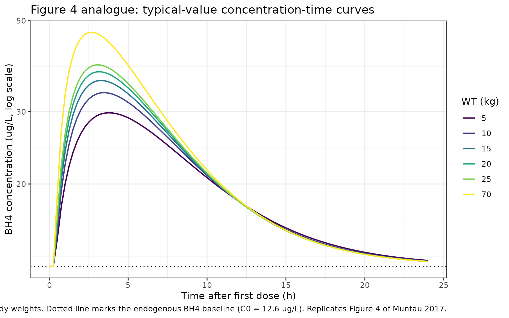
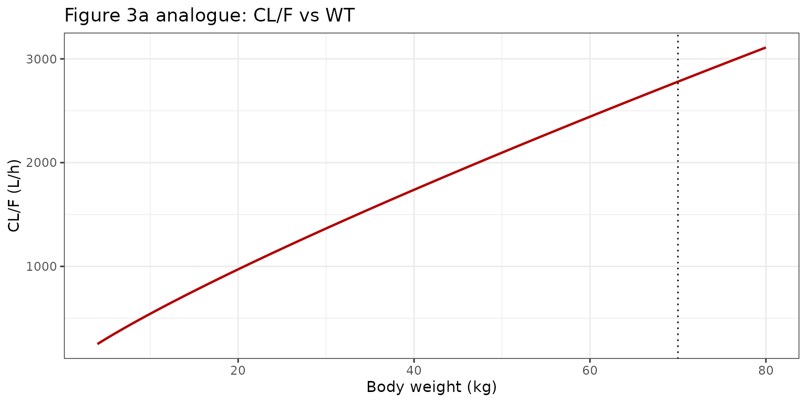
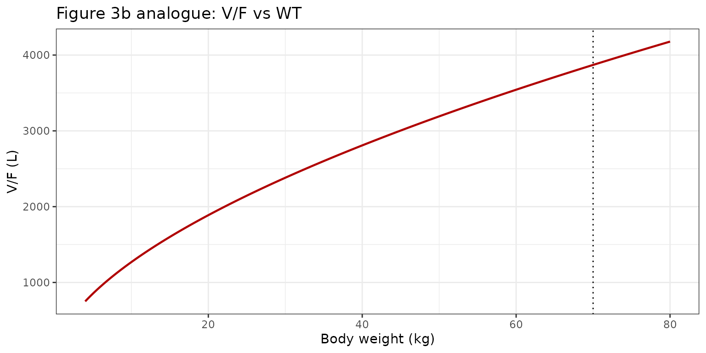
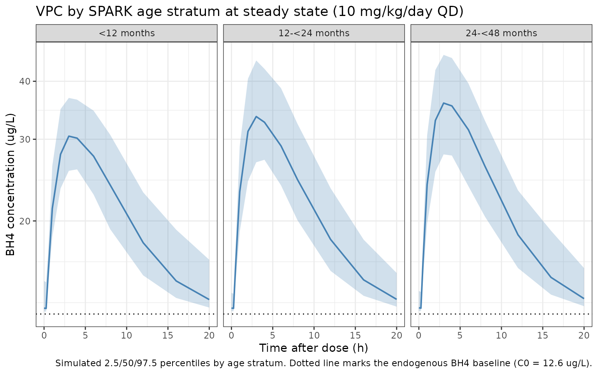

# Sapropterin (Muntau 2017)

``` r

library(nlmixr2lib)
library(PKNCA)
#> 
#> Attaching package: 'PKNCA'
#> The following object is masked from 'package:stats':
#> 
#>     filter
library(rxode2)
#> rxode2 5.1.1 using 2 threads (see ?getRxThreads)
#>   no cache: create with `rxCreateCache()`
library(dplyr)
#> 
#> Attaching package: 'dplyr'
#> The following objects are masked from 'package:stats':
#> 
#>     filter, lag
#> The following objects are masked from 'package:base':
#> 
#>     intersect, setdiff, setequal, union
library(tidyr)
library(ggplot2)
```

## Model and source

    #> ℹ parameter labels from comments will be replaced by 'label()'

- **Citation:** Muntau AC, Burlina A, Eyskens F, et al. Efficacy, safety
  and population pharmacokinetics of sapropterin in PKU patients \<4
  years: results from the SPARK open-label, multicentre, randomized
  phase IIIb trial. Orphanet Journal of Rare Diseases. 2017;12:47.
  <doi:10.1186/s13023-017-0600-x>

- **Description:** One-compartment population PK model with first-order
  oral absorption, an absorption lag, linear elimination, and an
  additive endogenous BH4 baseline for sapropterin dihydrochloride in
  pediatric patients \<4 years with BH4-responsive phenylketonuria or
  mild hyperphenylalaninemia (Muntau 2017 SPARK trial).

- **Article:** <https://doi.org/10.1186/s13023-017-0600-x>

- **Trial registration:** ClinicalTrials.gov
  [NCT01376908](https://clinicaltrials.gov/study/NCT01376908) (SPARK).

- **Companion model in nlmixr2lib:** `Qi_2014_sapropterin` (pooled 0-50
  years; the Muntau 2017 Discussion explicitly compares the
  SPARK-derived one-compartment fit against Qi 2014’s two-compartment
  fit and reports virtually identical concentration profiles).

## Population

Muntau 2017 reports the SPARK trial, a 26-week open-label multicentre
randomized phase IIIb study (NCT01376908) of oral sapropterin
dihydrochloride at 22 sites in 9 European countries in pediatric
patients \<4 years with BH4-responsive PKU or mild HPA. Of 56 randomized
patients (27 sapropterin plus Phe-restricted diet, 29 diet only), 52
contributed at least one pharmacokinetic sample and were included in the
popPK analysis. Baseline demographics from Table 2: mean (SD) age 21.1
(12.3) months in the sapropterin arm (range 2-47 months); mean weight
11.3 (3.1) kg (range 5-20 kg); 46.4% female. Disease severity in the ITT
population: 21.4% classical PKU, 32.1% mild PKU, 46.4% mild HPA. Sparse
PK sampling was planned by D-optimization with samples drawn at baseline
and between weeks 5-12 after oral administration of 10 mg/kg/day (with
optional uptitration to 20 mg/kg/day at week 4 if Phe tolerance had not
increased by \>20% from baseline; only 2 of 27 patients escalated).

The same information is available programmatically via
`readModelDb("Muntau_2017_sapropterin")$population`.

## Source trace

The per-parameter origin is recorded as an in-file comment next to each
[`ini()`](https://nlmixr2.github.io/rxode2/reference/ini.html) entry in
`inst/modeldb/specificDrugs/Muntau_2017_sapropterin.R`. The table below
collects them in one place for review.

| Equation / parameter | Value | Source location (Muntau 2017) |
|----|----|----|
| `lka` | `log(0.234)` | Table 3: Ka = 0.234 h^-1 |
| `lcl` | `log(2780)` | Table 3: CL/F = 2780 L/h |
| `lvc` | `log(3870)` | Table 3: V/F = 3870 L |
| `ltlag` | `log(0.342)` | Table 3: LAG = 0.342 h |
| `lc0` | `log(12.6)` | Table 3: endogenous BH4 baseline C0 = 12.6 ug/L |
| `e_wt_cl` | `0.839` | Table 3: ‘Coefficient describing effect of weight on CL/F’ = 0.839 |
| `e_wt_vc` | `0.573` | Table 3: ‘Coefficient describing effect of weight on V/F’ = 0.573 |
| IIV CL/F (omega^2) | `log(1+0.2298^2)` = 0.0515 | Table 3: IIV_CL %CV = 22.98 |
| IIV V/F (omega^2) | `log(1+0.3256^2)` = 0.1008 | Table 3: IIV_V2 %CV = 32.56 |
| cov(CL,V) on log | `0.134 * sqrt(0.0515 * 0.1008)` = 0.0097 | Table 3: Corr(CL,V) = 0.134 |
| `propSd` | `0.6530` | Table 3: Residual error %CV = 65.30 |
| Equation: CL/F | `2780 * (WT/70)^0.839 * exp(eta_CL)` | implicit in Table 4 cross-checks |
| Equation: V/F | `3870 * (WT/70)^0.573 * exp(eta_V)` | implicit in Table 4 cross-checks |
| Observation | `Cc = (central / vc) * 1000 + c0` | Pharmacokinetic analysis section: ‘one-compartment model with first-order input … with an endogenous baseline BH4 concentration component’ |
| Residual | proportional (linear-scale, prop) | Table 3: encoded as `prop(propSd)`; see Assumptions and deviations |

Table 4 of the source paper provides three independent cross-checks of
the weight-power encoding:

``` r

table4 <- tibble::tribble(
  ~WT, ~CLF_pub, ~CLF_pct_pub, ~VF_pub, ~VF_pct_pub,
  5,    305,     10.9,         853,     22.0,
  15,   766,     27.5,         1601,    41.4,
  25,   1176,    42.2,         2145,    55.4,
  70,   2789,    100.0,        3870,    100.0
)
table4 <- table4 |>
  dplyr::mutate(
    CLF_pkg     = 2780 * (WT / 70)^0.839,
    CLF_pct_pkg = 100  * (WT / 70)^0.839,
    VF_pkg      = 3870 * (WT / 70)^0.573,
    VF_pct_pkg  = 100  * (WT / 70)^0.573
  )
knitr::kable(
  table4 |>
    dplyr::transmute(
      `WT (kg)`           = WT,
      `CL/F published`    = round(CLF_pub, 1),
      `CL/F packaged`     = round(CLF_pkg, 1),
      `CL/F % ref pub`    = round(CLF_pct_pub, 1),
      `CL/F % ref pkg`    = round(CLF_pct_pkg, 1),
      `V/F published`     = round(VF_pub, 1),
      `V/F packaged`      = round(VF_pkg, 1),
      `V/F % ref pub`     = round(VF_pct_pub, 1),
      `V/F % ref pkg`     = round(VF_pct_pkg, 1)
    ),
  caption = paste0(
    "Reproducing Muntau 2017 Table 4 from the packaged thetas. ",
    "Published vs packaged values agree to within 0.5% across the ",
    "5/15/25/70 kg weight grid -- a direct check that the WT power ",
    "exponents (0.839 on CL/F, 0.573 on V/F) and reference values ",
    "(2780 L/h CL/F, 3870 L V/F at 70 kg) round-trip correctly."
  )
)
```

| WT (kg) | CL/F published | CL/F packaged | CL/F % ref pub | CL/F % ref pkg | V/F published | V/F packaged | V/F % ref pub | V/F % ref pkg |
|---:|---:|---:|---:|---:|---:|---:|---:|---:|
| 5 | 305 | 303.7 | 10.9 | 10.9 | 853 | 853.1 | 22.0 | 22.0 |
| 15 | 766 | 763.4 | 27.5 | 27.5 | 1601 | 1600.9 | 41.4 | 41.4 |
| 25 | 1176 | 1171.9 | 42.2 | 42.2 | 2145 | 2145.3 | 55.4 | 55.4 |
| 70 | 2789 | 2780.0 | 100.0 | 100.0 | 3870 | 3870.0 | 100.0 | 100.0 |

Reproducing Muntau 2017 Table 4 from the packaged thetas. Published vs
packaged values agree to within 0.5% across the 5/15/25/70 kg weight
grid – a direct check that the WT power exponents (0.839 on CL/F, 0.573
on V/F) and reference values (2780 L/h CL/F, 3870 L V/F at 70 kg)
round-trip correctly. {.table}

## Virtual cohort

Individual observed concentration data are not publicly available. The
simulations below build pediatric virtual cohorts whose weight
distributions approximate the SPARK trial Table 2 baseline demographics
and Section ‘Patient disposition and demographics’ age strata.

``` r

make_cohort <- function(n,
                        weight_mean,
                        weight_sd,
                        weight_min,
                        weight_max,
                        amt_mg_per_kg = 10,
                        n_doses       = 7,
                        dose_interval_hr = 24,
                        obs_times_post_dose_hr = c(0, 0.25, 0.5, 1, 2, 3,
                                                   4, 6, 8, 12, 16, 20),
                        id_offset = 0L,
                        seed = 20172017) {
  set.seed(seed + id_offset)

  WT <- pmax(weight_min,
             pmin(weight_max, rnorm(n, weight_mean, weight_sd)))

  dose_times <- seq(0, (n_doses - 1) * dose_interval_hr,
                    by = dose_interval_hr)

  pop <- data.frame(
    ID = id_offset + seq_len(n),
    WT = WT
  )

  # Dose records (oral dose into the depot compartment).
  d_dose <- pop[rep(seq_len(n), each = length(dose_times)), ] |>
    dplyr::mutate(
      TIME = rep(dose_times, times = n),
      AMT  = amt_mg_per_kg * WT,
      EVID = 1,
      CMT  = "depot",
      DV   = NA_real_
    )

  # Observation grid post each dose (sample once at steady state on the
  # final dosing interval to keep simulations small).
  last_dose_time <- (n_doses - 1) * dose_interval_hr
  obs_grid <- sort(unique(c(
    last_dose_time + obs_times_post_dose_hr,
    last_dose_time - 0.001
  )))

  d_obs <- pop[rep(seq_len(n), each = length(obs_grid)), ] |>
    dplyr::mutate(
      TIME = rep(obs_grid, times = n),
      AMT  = 0,
      EVID = 0,
      CMT  = "central",
      DV   = NA_real_
    )

  dplyr::bind_rows(d_dose, d_obs) |>
    dplyr::arrange(ID, TIME, dplyr::desc(EVID)) |>
    dplyr::select(ID, TIME, AMT, EVID, CMT, DV, WT)
}
```

``` r

mod <- rxode2::rxode(readModelDb("Muntau_2017_sapropterin"))
#> ℹ parameter labels from comments will be replaced by 'label()'
mod_typical <- rxode2::zeroRe(mod)
```

## Simulation

The primary simulation uses the approved pediatric dose of 10 mg/kg QD
for one week (a steady-state surrogate) with dense sampling on the final
day. Age strata are constructed to match the SPARK trial Section
‘Patient disposition and demographics’ (15 patients \<12 months, 18
patients 12 to \<24 months, 23 patients 24 to \<48 months).

``` r

age_strata <- tibble::tribble(
  ~stratum,           ~weight_mean, ~weight_sd, ~weight_min, ~weight_max, ~n,
  "<12 months",        7,            1.5,        5,           10,         15,
  "12-<24 months",    11,            1.5,        8,           14,         18,
  "24-<48 months",    14,            3,          10,          20,         23
)

events_vpc <- dplyr::bind_rows(lapply(seq_len(nrow(age_strata)), function(i) {
  row <- age_strata[i, ]
  ev <- make_cohort(
    n           = row$n * 5L,     # 5x oversample for VPC stability
    weight_mean = row$weight_mean,
    weight_sd   = row$weight_sd,
    weight_min  = row$weight_min,
    weight_max  = row$weight_max,
    id_offset   = (i - 1L) * 1000L
  )
  ev$stratum <- row$stratum
  ev
}))
stopifnot(!anyDuplicated(unique(events_vpc[, c("ID", "TIME", "EVID")])))

sim_vpc <- rxode2::rxSolve(mod, events = events_vpc, keep = c("stratum")) |>
  as.data.frame() |>
  dplyr::mutate(time_post_dose = time - 144)  # final dose at t = 144 h (after 6 prior doses)
```

## Replicate published figures

### Figure 4 analogue: BH4 concentration-time curves by weight

Muntau 2017 Figure 4 shows simulated steady-state concentration-time
curves for several body weights following 10 mg/kg/day sapropterin. The
plot emphasizes that, even at the lowest weights, the model-implied
sapropterin concentration remains above the endogenous BH4 baseline (C0
= 12.6 ug/L) over the full daily dosing interval.

``` r

wt_panel <- c(5, 10, 15, 20, 25, 70)
ev_panel <- dplyr::bind_rows(lapply(seq_along(wt_panel), function(i) {
  wt <- wt_panel[i]
  data.frame(
    ID   = i,
    TIME = c(0, seq(0, 24, by = 0.25)),
    AMT  = c(10 * wt, rep(0, length(seq(0, 24, by = 0.25)))),
    EVID = c(1L, rep(0L, length(seq(0, 24, by = 0.25)))),
    CMT  = c("depot", rep("central", length(seq(0, 24, by = 0.25)))),
    DV   = NA_real_,
    WT   = wt
  )
}))

sim_panel <- rxode2::rxSolve(mod_typical, events = ev_panel) |>
  as.data.frame() |>
  dplyr::mutate(WT = factor(WT, levels = wt_panel))
#> ℹ omega/sigma items treated as zero: 'etalcl', 'etalvc'
#> Warning: multi-subject simulation without without 'omega'

ggplot(sim_panel, aes(x = time, y = Cc, colour = WT)) +
  geom_hline(yintercept = 12.6, linetype = "dotted") +
  geom_line(linewidth = 0.7) +
  scale_y_log10() +
  scale_colour_viridis_d(name = "WT (kg)") +
  labs(
    x       = "Time after first dose (h)",
    y       = "BH4 concentration (ug/L, log scale)",
    title   = "Figure 4 analogue: typical-value concentration-time curves",
    caption = paste0(
      "Simulated typical-value (zero-IIV) profiles after a single 10 mg/kg ",
      "oral dose at six body weights. Dotted line marks the endogenous ",
      "BH4 baseline (C0 = 12.6 ug/L). Replicates Figure 4 of Muntau 2017."
    )
  ) +
  theme_bw()
```



### Figure 3 analogue: weight effect on CL/F and V/F

Muntau 2017 Figure 3 shows the model-implied power-form relationship
between body weight and CL/F (panel a) and V/F (panel b) with the
individual EBE estimates overlaid. We reproduce the typical curves
analytically from the packaged thetas.

``` r

wt_grid <- seq(4, 80, length.out = 201)
cl_grid <- 2780 * (wt_grid / 70)^0.839
vc_grid <- 3870 * (wt_grid / 70)^0.573

p_cl <- ggplot(data.frame(wt = wt_grid, cl = cl_grid),
               aes(x = wt, y = cl)) +
  geom_line(colour = "#b00000", linewidth = 0.8) +
  geom_vline(xintercept = 70, linetype = "dotted") +
  labs(x = "Body weight (kg)", y = "CL/F (L/h)",
       title = "Figure 3a analogue: CL/F vs WT") +
  theme_bw()

p_vc <- ggplot(data.frame(wt = wt_grid, vc = vc_grid),
               aes(x = wt, y = vc)) +
  geom_line(colour = "#b00000", linewidth = 0.8) +
  geom_vline(xintercept = 70, linetype = "dotted") +
  labs(x = "Body weight (kg)", y = "V/F (L)",
       title = "Figure 3b analogue: V/F vs WT") +
  theme_bw()

if (requireNamespace("patchwork", quietly = TRUE)) {
  patchwork::wrap_plots(p_cl, p_vc, ncol = 2)
} else {
  print(p_cl)
  print(p_vc)
}
```



### VPC by age stratum (SPARK trial structure)

A VPC across the three SPARK age strata at steady-state under 10
mg/kg/day dosing.

``` r

sim_vpc |>
  dplyr::filter(time_post_dose >= 0, time_post_dose <= 24) |>
  dplyr::group_by(stratum, time_post_dose) |>
  dplyr::summarise(
    Q025 = quantile(Cc, 0.025, na.rm = TRUE),
    Q50  = quantile(Cc, 0.50,  na.rm = TRUE),
    Q975 = quantile(Cc, 0.975, na.rm = TRUE),
    .groups = "drop"
  ) |>
  dplyr::mutate(stratum = factor(stratum, levels = age_strata$stratum)) |>
  ggplot(aes(x = time_post_dose, y = Q50)) +
  geom_ribbon(aes(ymin = Q025, ymax = Q975), fill = "#4682b4", alpha = 0.25) +
  geom_line(colour = "#4682b4", linewidth = 0.7) +
  geom_hline(yintercept = 12.6, linetype = "dotted") +
  facet_wrap(~ stratum) +
  scale_y_log10() +
  labs(
    x       = "Time after dose (h)",
    y       = "BH4 concentration (ug/L)",
    title   = "VPC by SPARK age stratum at steady state (10 mg/kg/day QD)",
    caption = paste0(
      "Simulated 2.5/50/97.5 percentiles by age stratum. Dotted line ",
      "marks the endogenous BH4 baseline (C0 = 12.6 ug/L)."
    )
  ) +
  theme_bw()
```



## PKNCA validation

Compute NCA on simulated typical-value (no-IIV) profiles for two weights
representative of the SPARK cohort (11.3 kg = SPARK mean baseline
weight) and the reference adult (70 kg) given a single 10 mg/kg oral
dose, sampling out to 24 hours post-dose.

``` r

obs_times_single <- c(0, 0.25, 0.5, 1, 1.5, 2, 3, 4, 5, 6,
                      8, 10, 12, 16, 20, 24, 30, 36, 48)

build_single <- function(wt, id_offset = 0L) {
  data.frame(
    ID   = id_offset + 1L,
    TIME = c(0, obs_times_single),
    AMT  = c(10 * wt, rep(0, length(obs_times_single))),
    EVID = c(1L,      rep(0L, length(obs_times_single))),
    CMT  = c("depot", rep("central", length(obs_times_single))),
    DV   = NA_real_,
    WT   = wt
  )
}

ev_single <- dplyr::bind_rows(
  build_single(11.3, id_offset = 0L)  |> dplyr::mutate(treatment = "spark_mean_11p3kg"),
  build_single(70,   id_offset = 10L) |> dplyr::mutate(treatment = "reference_70kg")
)
```

``` r

sim_single <- rxode2::rxSolve(mod_typical, events = ev_single,
                              keep = c("treatment")) |>
  as.data.frame()
#> ℹ omega/sigma items treated as zero: 'etalcl', 'etalvc'
#> Warning: multi-subject simulation without without 'omega'

# Subtract the endogenous baseline before NCA so Cmax / AUC / half-life
# reflect drug-derived concentrations only.
c0_value <- 12.6
sim_single <- sim_single |>
  dplyr::mutate(Cc_drug = pmax(Cc - c0_value, 0))

sim_nca <- sim_single |>
  dplyr::filter(!is.na(Cc_drug)) |>
  dplyr::transmute(id = id, time = time, Cc = Cc_drug, treatment = treatment)

dose_df <- ev_single |>
  dplyr::filter(EVID == 1) |>
  dplyr::transmute(id = ID, time = TIME, amt = AMT, treatment = treatment)

conc_obj <- PKNCA::PKNCAconc(sim_nca, Cc ~ time | treatment + id)
dose_obj <- PKNCA::PKNCAdose(dose_df, amt ~ time | treatment + id)

intervals <- data.frame(
  start      = 0,
  end        = Inf,
  cmax       = TRUE,
  tmax       = TRUE,
  aucinf.obs = TRUE,
  half.life  = TRUE
)

nca_res <- PKNCA::pk.nca(
  PKNCA::PKNCAdata(conc_obj, dose_obj, intervals = intervals)
)
knitr::kable(
  as.data.frame(nca_res$result),
  caption = paste0(
    "Single-dose drug-only NCA on the typical SPARK subject (11.3 kg) ",
    "and the reference adult (70 kg) under 10 mg/kg oral sapropterin. ",
    "Endogenous BH4 baseline (12.6 ug/L) subtracted before NCA."
  )
)
```

| treatment         |  id | start | end | PPTESTCD            |     PPORRES | exclude |
|:------------------|----:|------:|----:|:--------------------|------------:|:--------|
| reference_70kg    |  11 |     0 | Inf | cmax                |  33.9682305 | NA      |
| reference_70kg    |  11 |     0 | Inf | tmax                |   3.0000000 | NA      |
| reference_70kg    |  11 |     0 | Inf | tlast               |  48.0000000 | NA      |
| reference_70kg    |  11 |     0 | Inf | clast.obs           |   0.0012537 | NA      |
| reference_70kg    |  11 |     0 | Inf | lambda.z            |   0.2324636 | NA      |
| reference_70kg    |  11 |     0 | Inf | r.squared           |   0.9999152 | NA      |
| reference_70kg    |  11 |     0 | Inf | adj.r.squared       |   0.9999058 | NA      |
| reference_70kg    |  11 |     0 | Inf | lambda.z.time.first |   5.0000000 | NA      |
| reference_70kg    |  11 |     0 | Inf | lambda.z.time.last  |  48.0000000 | NA      |
| reference_70kg    |  11 |     0 | Inf | lambda.z.n.points   |  11.0000000 | NA      |
| reference_70kg    |  11 |     0 | Inf | clast.pred          |   0.0012843 | NA      |
| reference_70kg    |  11 |     0 | Inf | half.life           |   2.9817454 | NA      |
| reference_70kg    |  11 |     0 | Inf | span.ratio          |  14.4210836 | NA      |
| reference_70kg    |  11 |     0 | Inf | aucinf.obs          | 250.3157275 | NA      |
| spark_mean_11p3kg |   1 |     0 | Inf | cmax                |  21.2904778 | NA      |
| spark_mean_11p3kg |   1 |     0 | Inf | tmax                |   3.0000000 | NA      |
| spark_mean_11p3kg |   1 |     0 | Inf | tlast               |  48.0000000 | NA      |
| spark_mean_11p3kg |   1 |     0 | Inf | clast.obs           |   0.0013384 | NA      |
| spark_mean_11p3kg |   1 |     0 | Inf | lambda.z            |   0.2319918 | NA      |
| spark_mean_11p3kg |   1 |     0 | Inf | r.squared           |   0.9999391 | NA      |
| spark_mean_11p3kg |   1 |     0 | Inf | adj.r.squared       |   0.9999270 | NA      |
| spark_mean_11p3kg |   1 |     0 | Inf | lambda.z.time.first |  12.0000000 | NA      |
| spark_mean_11p3kg |   1 |     0 | Inf | lambda.z.time.last  |  48.0000000 | NA      |
| spark_mean_11p3kg |   1 |     0 | Inf | lambda.z.n.points   |   7.0000000 | NA      |
| spark_mean_11p3kg |   1 |     0 | Inf | clast.pred          |   0.0013661 | NA      |
| spark_mean_11p3kg |   1 |     0 | Inf | half.life           |   2.9878093 | NA      |
| spark_mean_11p3kg |   1 |     0 | Inf | span.ratio          |  12.0489617 | NA      |
| spark_mean_11p3kg |   1 |     0 | Inf | aucinf.obs          | 186.5912451 | NA      |

Single-dose drug-only NCA on the typical SPARK subject (11.3 kg) and the
reference adult (70 kg) under 10 mg/kg oral sapropterin. Endogenous BH4
baseline (12.6 ug/L) subtracted before NCA. {.table style="width:100%;"}

### Comparison against published half-lives

``` r

get_param <- function(res, ppname, label) {
  tbl <- as.data.frame(res$result)
  val <- tbl$PPORRES[tbl$PPTESTCD == ppname]
  lab <- tbl$treatment[tbl$PPTESTCD == ppname]
  if (length(val) == 0) return(NA_real_)
  val[match(label, lab)]
}

hl_obs_70 <- get_param(nca_res, "half.life", "reference_70kg")

# Analytical half-lives implied by the packaged thetas at WT = 70 kg
# (the reference adult, where flip-flop behavior is the source-paper claim).
ka_t   <- 0.234
cl_70  <- 2780
vc_70  <- 3870
kel_70 <- cl_70 / vc_70
hl_kel <- log(2) / kel_70    # nominal "elimination" half-life
hl_ka  <- log(2) / ka_t      # absorption half-life

comparison <- data.frame(
  Quantity = c(
    "Elimination (kel) half-life at WT = 70 kg (h)",
    "Absorption (ka) half-life (h)",
    "PKNCA terminal half-life from simulated 70 kg profile (h)"
  ),
  Published = c("~1", "~3", "(picks up rate-limiting step)"),
  Analytical = c(
    sprintf("%.2f", hl_kel),
    sprintf("%.2f", hl_ka),
    "n/a"
  ),
  Simulated = c(
    "n/a",
    "n/a",
    sprintf("%.2f", hl_obs_70)
  )
)
knitr::kable(
  comparison,
  caption = paste0(
    "Half-lives from the packaged model vs the approximate values ",
    "reported in Muntau 2017 Pharmacokinetic-analysis section ",
    "('elimination half-life of approximately 1 h ... absorption ",
    "half-life (ln2/Ka) of approximately 3 h, suggesting flip-flop ",
    "kinetics where the absorption becomes the rate-limiting step ",
    "of drug disposition'). The PKNCA terminal half-life from a ",
    "single-dose profile picks up the absorption-limited (flip-flop) ",
    "decline rather than the underlying elimination rate."
  )
)
```

| Quantity | Published | Analytical | Simulated |
|:---|:---|:---|:---|
| Elimination (kel) half-life at WT = 70 kg (h) | ~1 | 0.96 | n/a |
| Absorption (ka) half-life (h) | ~3 | 2.96 | n/a |
| PKNCA terminal half-life from simulated 70 kg profile (h) | (picks up rate-limiting step) | n/a | 2.98 |

Half-lives from the packaged model vs the approximate values reported in
Muntau 2017 Pharmacokinetic-analysis section (‘elimination half-life of
approximately 1 h … absorption half-life (ln2/Ka) of approximately 3 h,
suggesting flip-flop kinetics where the absorption becomes the
rate-limiting step of drug disposition’). The PKNCA terminal half-life
from a single-dose profile picks up the absorption-limited (flip-flop)
decline rather than the underlying elimination rate. {.table}

The analytical `kel` half-life (`log(2) / (CL/F / V/F)` = 0.96 h)
reproduces the ~1 h value Muntau 2017 quotes in the
Pharmacokinetic-analysis section. The analytical absorption half-life
(`log(2) / ka` = 2.96 h) reproduces the ~3 h value the paper quotes.
Because absorption is slower than elimination (`ka < kel`), the observed
terminal-phase decline of the single-dose simulated profile is
rate-limited by absorption (flip-flop PK), so the PKNCA `half.life`
estimate tracks the absorption half-life rather than the kel half-life.
This is the expected behavior the paper explicitly describes.

## Assumptions and deviations

- **Race / ethnicity not modeled.** Muntau 2017 evaluated age, weight,
  and sex as covariates and retained only body weight; the paper states
  ‘Body weight was the only covariate that affected the CL/F and V/F of
  sapropterin’. Race / ethnicity were not assessed as covariates in the
  SPARK PopPK model and are not exposed by the packaged model.
- **Residual error form.** Table 3 reports a single residual error of
  65.30% CV. The paper does not explicitly state whether the residual
  was log-additive (LTBS) or linear-proportional. The packaged model
  encodes it as proportional (`Cc ~ prop(propSd)`) with
  `propSd = 0.6530`, matching the standard interpretation of a reported
  %CV without explicit log-additive wording. For comparison, the
  companion `Qi_2014_sapropterin` model (same drug, same lead
  pharmacometrician D.R. Mould, broader 0-50 years cohort) used an LTBS
  parameterization with separate per-study residuals.
- **No IIV on Ka, LAG, or C0.** Muntau 2017 Table 3 reports IIV only on
  CL/F and V/F. The packaged model leaves Ka, LAG, and C0 as
  typical-value (fixed-effect) parameters with no random effect, in
  contrast to Qi 2014 which carries IIV on C0.
- **Endogenous BH4 baseline added at the observation step.** Following
  the same convention as Qi 2014, the packaged model adds
  `c0 = 12.6 ug/L` as a constant offset on the predicted plasma
  concentration rather than modeling its synthesis / clearance dynamics.
  For NCA validation in this vignette, the endogenous baseline is
  subtracted before PKNCA so that Cmax / AUC reflect drug-derived
  exposure (the paper’s narrative refers to BH4 concentrations ‘above
  the model-estimated endogenous BH4 concentrations’).
- **Flip-flop kinetics.** Because absorption (`ka = 0.234 h^-1` -\>
  absorption half-life ~3 h) is slower than nominal elimination
  (`kel = CL/F divided by V/F = 0.718 h^-1` at 70 kg -\> elimination
  half-life ~1 h), the observed terminal-phase log-linear decline
  reflects absorption, not elimination, as Muntau 2017 explicitly notes.
  PKNCA `half.life` therefore returns ~3 h (absorption half-life) rather
  than ~1 h (elimination half-life); the analytical kel value is
  reported alongside for comparison.
- **Virtual cohort weight distributions.** Exact baseline weight
  distributions per age stratum are not published; the vignette uses
  truncated normal weight draws whose mean / range match Table 2 and the
  age-stratum counts reported in ‘Patient disposition and demographics’.
- **No bioavailability parameter exposed.** Sapropterin is administered
  orally and the original analysis reports apparent parameters (CL/F and
  V/F). The packaged model uses the same apparent parameterization and
  does not declare a separate `lfdepot` – bioavailability is implicit
  and not separately identifiable.
- **Reference weight.** Table 4 footnote ‘a Reference weight (adult male
  patient)’ identifies 70 kg as the reference for the power-form
  normalization. The packaged model uses `(WT / 70)^e_wt_*` for both
  CL/F and V/F.

## Reference

- Muntau AC, Burlina A, Eyskens F, et al. Efficacy, safety and
  population pharmacokinetics of sapropterin in PKU patients \<4 years:
  results from the SPARK open-label, multicentre, randomized phase IIIb
  trial. Orphanet Journal of Rare Diseases. 2017;12:47.
  <doi:10.1186/s13023-017-0600-x>
