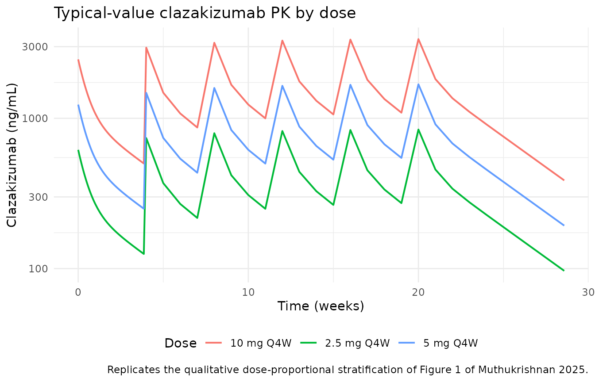
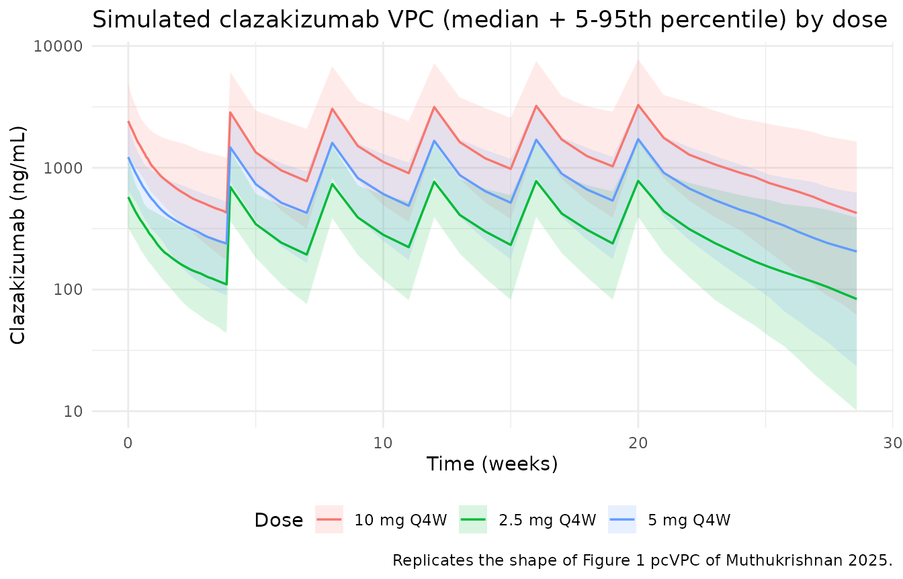
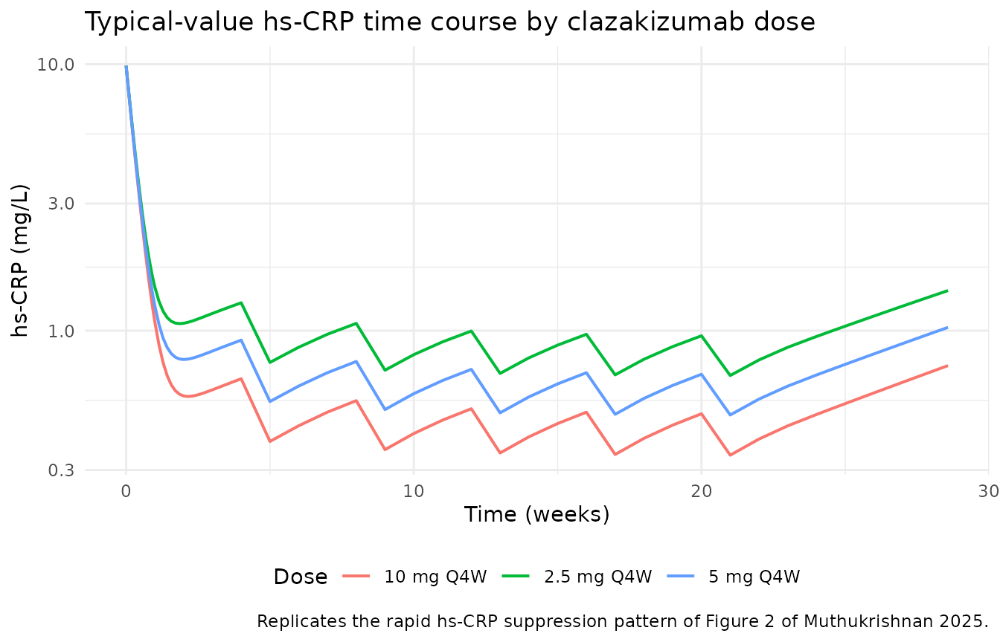
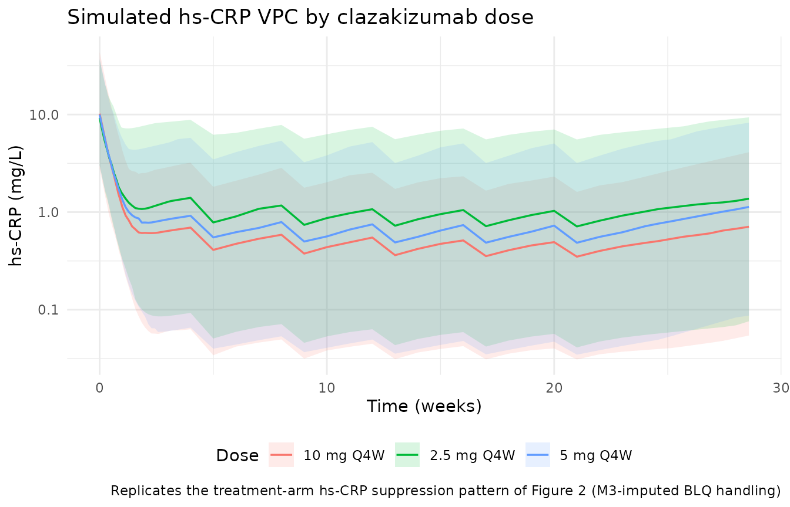

# Clazakizumab (Muthukrishnan 2025)

## Model and source

- Citation: Muthukrishnan VY, Kerbusch T, Strong LE, Kleijn HJ, Pfister
  M, Chang AM, Acharya M, Nandy P, McCune JS. Population Pharmacokinetic
  and Pharmacokinetic-Pharmacodynamic Analysis for Clazakizumab in
  Patients With End-Stage Kidney Disease Undergoing Dialysis. Clin
  Transl Sci. 2025. <doi:10.1111/cts.70381>
- Description: Population PK and PK-PD model for the anti-interleukin-6
  monoclonal antibody clazakizumab given as a 3-minute IV bolus to
  adults with end-stage kidney disease undergoing maintenance dialysis
  (POSIBIL 6 ESKD phase 2b, NCT05485961; Muthukrishnan 2025).
  Two-compartment linear PK with allometric weight scaling on CL and V1
  and a baseline free IL-6 covariate on CL; sequential-fit
  indirect-response inhibition of hs-CRP zero-order production (kin)
  with Imax fixed to 1, an estimated Hill coefficient, and a
  Manly-transformed IIV on IC50. Baseline hs-CRP enters kin as a power
  covariate so the pre-dose steady state E0 = kin/kout tracks the
  observed baseline distribution.
- Article: <https://doi.org/10.1111/cts.70381>

Clazakizumab is a high-affinity, humanized IgG1 monoclonal antibody
targeting the interleukin-6 (IL-6) ligand. Muthukrishnan 2025 reports
the population PK and longitudinal PK-PD analysis for the phase 2b
component of POSIBIL 6 ESKD (NCT05485961), a placebo-controlled
dose-finding trial of clazakizumab 2.5, 5, or 10 mg IV every 4 weeks in
adults with end-stage kidney disease undergoing maintenance dialysis,
cardiovascular disease and/or diabetes, and baseline hs-CRP \>= 2 mg/L.
The modelling supported dose selection (5 mg IV Q4W) for the phase 3
cardiovascular outcomes portion of the same trial.

## Population

The PK analysis dataset included **95 subjects** who received
clazakizumab (2.5 mg N=31; 5 mg N=32; 10 mg N=32) with 891 measurable
clazakizumab concentrations. The PD analysis dataset included **126
subjects** (adding the N=31 placebo arm) with 1401 measurable hs-CRP
observations; 8.9% of post-first-dose hs-CRP observations were below
quantitation and handled by M3 imputation.

Baseline demographics from Muthukrishnan 2025 Table S1/S2 (PK and PD
datasets respectively): median body weight 95 kg (range 53-163), median
age 65-66 years (range 31-86), 66-67% male, 58% White, 36-39% Black or
African American, remainder distributed across Asian / American Indian
or Alaska Native / Native Hawaiian or Pacific Islander / Other /
Multiple. Median baseline free IL-6 6.80 ng/L (range 1.5-48). Median
baseline hs-CRP (predose Day 1) 8.15 mg/L (range 0.7-215); enrolment
required hs-CRP \>= 2 mg/L.

Clazakizumab was administered as a **3-minute IV bolus via the return
venous line of the hemodialysis circuit** with dosing beginning at least
1 h after the start of dialysis and no later than 1 h before its
completion. The minimum treatment period was 12 weeks (3 doses).

The same population summary is available programmatically via
`readModelDb("Muthukrishnan_2025_clazakizumab")$population`.

## Source trace

Per-parameter in-file source-trace comments live next to every `ini()`
entry in `inst/modeldb/specificDrugs/Muthukrishnan_2025_clazakizumab.R`.
The table below collects them in one place for review.

| Equation / parameter | Value / form | Source location |
|----|----|----|
| `lcl` | log(0.228 L/day) | Muthukrishnan 2025 Table 1 (CL) |
| `lvc` | log(4.05 L) | Table 1 (V1) |
| `lq` | log(0.443 L/day) | Table 1 (Q) |
| `lvp` | log(3.51 L) | Table 1 (V2) |
| `e_wt_cl` | 0.979 (ref 95 kg) | Table 1 (WT~CL exponent); ref median from Table S1 |
| `e_wt_vc` | 0.784 (ref 95 kg) | Table 1 (WT~V1 exponent) |
| `e_il6_cl` | 0.19 (ref 6.80 ng/L) | Table 1 (Free IL-6~CL); ref median from Table S1 |
| IIV block (CL, V1) | omega^2 back-transformed from CV% via ln(1+CV^2); cov(CL,V1) = 0.152 | Table 1 IIV rows + Table 1 footnote |
| IIV (V2) | omega^2 = ln(1 + 0.724^2) = 0.42156 | Table 1 IIV on V2 (CV% 72.4) |
| Q | no eta | Results 3.1 (“IIV was … not able to be reliably estimated on Q”) |
| `addSd`, `propSd` | 23.1 ng/mL, 0.266 | Table 1 residual error rows |
| PK ODE (2-compartment) | n/a | Results 3.1 (“A 2-compartment model with linear elimination”) |
| `lkout` | log(0.381 /day) | Muthukrishnan 2025 Table 2 (kout) |
| `lkin` | log(3.76 \[mg/L\]/day) | Table 2 (kin) |
| `lic50` | log(3.39 ng/mL) | Table 2 (IC50) |
| `limax` | fixed at log(1) | Table 2 (Imax “1.00 Fixed”) |
| `lhill` | log(0.523) | Table 2 (Hill factor) |
| `e_crp_kin` | 0.809 (ref 8.15 mg/L) | Table 2 (Baseline hs-CRP~kin); ref median from Table S2 predose D1 |
| `manly_ic50` | -0.143 | Table 2 (Shape parameter on IC50 IIV) |
| IIV (IC50) | omega^2 = ln(1 + 10.02^2) = 4.61932 (Manly-transformed) | Table 2 (IIV on IC50 CV% 1002) + Table 2 footnote |
| `expSd_hsCRP` | 0.6508 (back-transformed from 72.6% linear CV) | Table 2 residual (Proportional 72.6%) + “additive on log scale” note |
| PD ODE (indirect response, kin) | n/a | Results 3.2 (indirect-response inhibitory equation) |
| E(0) = kin / kout (steady state) | n/a | Results 3.2 (steady-state pre-dose equation) |

## Virtual cohort

Original observed data are not publicly available. The figures below use
a virtual cohort whose covariate distributions approximate the pooled PD
analysis dataset (Muthukrishnan 2025 Table S2): body weight and free
IL-6 sampled log-normally about the reported medians and constrained to
the reported ranges; baseline hs-CRP sampled log-normally about 8.15
mg/L and constrained to the reported range 0.7-215 mg/L.

**Cohort size: 150 participants per active arm x 3 dose arms = 450
participants total** (the skill caps at 200/arm; keeping some headroom
below the cap for render-time safety with the multi-output ODE system).

``` r

set.seed(2025)

per_arm <- 150L

sample_lognormal_bounded <- function(n, median, lo, hi, cv = 0.35) {
  # log-normal about the target median, truncated (rejection sample) to (lo, hi)
  sd_log <- sqrt(log(1 + cv^2))
  out <- numeric(0)
  tries <- 0L
  while (length(out) < n && tries < 100L) {
    draw <- median * exp(rnorm(3 * n, mean = 0, sd = sd_log))
    keep <- draw[draw >= lo & draw <= hi]
    out <- c(out, keep)
    tries <- tries + 1L
  }
  out[seq_len(n)]
}

# Dose observation grid (in days). Dense in first week to capture the IV bolus
# peak and the initial hs-CRP decline; weekly through Week 20 (final dose at
# Week 20 per max 6-dose regimen); a final observation at Week 24 to match the
# study's follow-up.
obs_times <- sort(unique(c(
  seq(0, 7,      by = 0.25),   # first 7 days at 6-hourly-ish resolution
  seq(7, 28,     by = 1),      # first dose interval, daily
  seq(28, 168,   by = 7),      # weekly through Week 24
  seq(168, 200,  by = 4)
)))

# 6 Q4W doses: Day 0, 28, 56, 84, 112, 140 (Week 20 = last dose per protocol).
dose_times <- c(0, 28, 56, 84, 112, 140)

make_cohort <- function(dose_mg, label, id_offset) {
  n <- per_arm
  covariates <- tibble::tibble(
    id  = id_offset + seq_len(n),
    WT  = sample_lognormal_bounded(n, median = 95,   lo = 53,  hi = 163, cv = 0.28),
    IL6 = sample_lognormal_bounded(n, median = 6.80, lo = 1.5, hi = 48,  cv = 0.90),
    CRP = sample_lognormal_bounded(n, median = 8.15, lo = 0.7, hi = 215, cv = 1.30),
    treatment = label
  )

  # Doses: 6 Q4W IV bolus into `central` (ODE state). dvid = NA on dose rows.
  dose_rows <- covariates |>
    tidyr::crossing(time = dose_times) |>
    dplyr::mutate(amt = dose_mg, evid = 1L, cmt = "central",
                  dvid = NA_integer_)

  # PK observations. cmt = ODE state that yields the observable;
  # dvid = 1L picks the first residual channel (Cc ~ add + prop).
  obs_pk_rows <- covariates |>
    tidyr::crossing(time = obs_times) |>
    dplyr::mutate(amt = 0, evid = 0L, cmt = "central", dvid = 1L)

  # PD observations. cmt = ODE state (effect) for hsCRP;
  # dvid = 2L picks the second residual channel (hsCRP ~ lnorm).
  obs_pd_rows <- covariates |>
    tidyr::crossing(time = obs_times) |>
    dplyr::mutate(amt = 0, evid = 0L, cmt = "effect", dvid = 2L)

  dplyr::bind_rows(dose_rows, obs_pk_rows, obs_pd_rows) |>
    dplyr::arrange(id, time, dplyr::desc(evid)) |>
    dplyr::select(id, time, amt, evid, cmt, dvid, WT, IL6, CRP, treatment)
}

events <- dplyr::bind_rows(
  make_cohort(2.5, "2.5 mg Q4W", id_offset = 0L),
  make_cohort(5.0, "5 mg Q4W",   id_offset = per_arm),
  make_cohort(10.0, "10 mg Q4W", id_offset = 2L * per_arm)
)
```

## Simulation

We run two simulations:

1.  **Typical-value profiles**
    ([`rxode2::zeroRe()`](https://nlmixr2.github.io/rxode2/reference/zeroRe.html))
    – for reproducing the qualitative shape of paper Figures 1 and 2 by
    dose group.
2.  **Stochastic profiles** with the full IIV/RUV – used for the PKNCA
    validation against paper Table 3 (a per-subject NCA over post-hoc
    PK).

``` r

mod <- rxode2::rxode2(readModelDb("Muthukrishnan_2025_clazakizumab"))
#> ℹ parameter labels from comments will be replaced by 'label()'
#> Warning: some etas defaulted to non-mu referenced, possible parsing error: etalic50
#> as a work-around try putting the mu-referenced expression on a simple line

# Typical-value simulation (deterministic; ~1 subject per treatment).
typ_events <- events |>
  dplyr::filter(id %in% c(1L, per_arm + 1L, 2L * per_arm + 1L)) |>
  dplyr::mutate(WT = 95, IL6 = 6.80, CRP = 8.15)
mod_typ <- rxode2::zeroRe(mod)
#> Warning: some etas defaulted to non-mu referenced, possible parsing error: etalic50
#> as a work-around try putting the mu-referenced expression on a simple line
sim_typ <- rxode2::rxSolve(mod_typ, events = typ_events,
                           keep = c("treatment", "WT", "IL6", "CRP"))
#> ℹ omega/sigma items treated as zero: 'etalcl', 'etalvc', 'etalvp', 'etalic50'
#> Warning: multi-subject simulation without without 'omega'

# Stochastic full-cohort simulation for NCA + summary statistics.
sim <- rxode2::rxSolve(mod, events = events,
                       keep = c("treatment", "WT", "IL6", "CRP"))
```

## Replicate published figures

### Figure 1 – clazakizumab PK by dose group

Paper Figure 1 is a prediction-corrected VPC of serum clazakizumab. The
simulation below reproduces the same doses (2.5, 5, 10 mg IV Q4W) as
typical-value trajectories and as pooled median / 5th / 95th percentiles
across the stochastic cohort. The multi-exponential shape (rapid
distribution phase followed by a slower elimination phase) and the
~1.5-2x accumulation between the first dose and steady state are the
qualitative features to reproduce.

``` r

sim_typ |>
  as.data.frame() |>
  dplyr::filter(!is.na(Cc)) |>
  ggplot(aes(time / 7, Cc, colour = treatment)) +
  geom_line(linewidth = 0.7) +
  scale_y_log10() +
  labs(x = "Time (weeks)", y = "Clazakizumab (ng/mL)",
       title = "Typical-value clazakizumab PK by dose",
       caption = "Replicates the qualitative dose-proportional stratification of Figure 1 of Muthukrishnan 2025.",
       colour = "Dose") +
  theme_minimal() +
  theme(legend.position = "bottom")
```



``` r

sim |>
  as.data.frame() |>
  dplyr::filter(!is.na(Cc)) |>
  dplyr::group_by(treatment, time) |>
  dplyr::summarise(
    q05 = quantile(Cc, 0.05, na.rm = TRUE),
    q50 = quantile(Cc, 0.50, na.rm = TRUE),
    q95 = quantile(Cc, 0.95, na.rm = TRUE),
    .groups = "drop"
  ) |>
  dplyr::filter(q50 > 0) |>
  ggplot(aes(time / 7, q50, colour = treatment, fill = treatment)) +
  geom_ribbon(aes(ymin = pmax(q05, 0.1), ymax = q95), alpha = 0.15, colour = NA) +
  geom_line(linewidth = 0.6) +
  scale_y_log10() +
  labs(x = "Time (weeks)", y = "Clazakizumab (ng/mL)",
       title = "Simulated clazakizumab VPC (median + 5-95th percentile) by dose",
       caption = "Replicates the shape of Figure 1 pcVPC of Muthukrishnan 2025.",
       colour = "Dose", fill = "Dose") +
  theme_minimal() +
  theme(legend.position = "bottom")
```



### Figure 2 – hs-CRP response by treatment

Paper Figure 2 shows serum hs-CRP by treatment group over 12 weeks, with
a rapid initial decline (achieved within the first days) followed by
sustained suppression at all clazakizumab doses. The typical-value
curves below reproduce that qualitative pattern.

``` r

sim_typ |>
  as.data.frame() |>
  dplyr::filter(!is.na(hsCRP)) |>
  ggplot(aes(time / 7, hsCRP, colour = treatment)) +
  geom_line(linewidth = 0.7) +
  scale_y_log10() +
  labs(x = "Time (weeks)", y = "hs-CRP (mg/L)",
       title = "Typical-value hs-CRP time course by clazakizumab dose",
       caption = "Replicates the rapid hs-CRP suppression pattern of Figure 2 of Muthukrishnan 2025.",
       colour = "Dose") +
  theme_minimal() +
  theme(legend.position = "bottom")
```



``` r

sim |>
  as.data.frame() |>
  dplyr::filter(!is.na(hsCRP), hsCRP > 0) |>
  dplyr::group_by(treatment, time) |>
  dplyr::summarise(
    q05 = quantile(hsCRP, 0.05, na.rm = TRUE),
    q50 = quantile(hsCRP, 0.50, na.rm = TRUE),
    q95 = quantile(hsCRP, 0.95, na.rm = TRUE),
    .groups = "drop"
  ) |>
  ggplot(aes(time / 7, q50, colour = treatment, fill = treatment)) +
  geom_ribbon(aes(ymin = q05, ymax = q95), alpha = 0.15, colour = NA) +
  geom_line(linewidth = 0.6) +
  scale_y_log10() +
  labs(x = "Time (weeks)", y = "hs-CRP (mg/L)",
       title = "Simulated hs-CRP VPC by clazakizumab dose",
       caption = "Replicates the treatment-arm hs-CRP suppression pattern of Figure 2 (M3-imputed BLQ handling)",
       colour = "Dose", fill = "Dose") +
  theme_minimal() +
  theme(legend.position = "bottom")
```



### Paper Section 3.3 – Week 12 hs-CRP outcomes

Muthukrishnan 2025 Section 3.3 reports two Week 12 outcomes from the
1000-subject Monte-Carlo simulation using the final PK-PD model:

- Percent of subjects with **\>= 80% decrease** in hs-CRP from baseline
  at Week 12: 80.9% / 83.4% / 88.1% for 2.5 / 5 / 10 mg Q4W.
- Percent of subjects with **hs-CRP \< 2 mg/L** at Week 12: 67.7% /
  76.7% / 82.6% for 2.5 / 5 / 10 mg Q4W.

The comparable outcomes from this vignette’s 450-subject cohort:

``` r

wk12 <- sim |>
  as.data.frame() |>
  dplyr::filter(!is.na(hsCRP)) |>
  dplyr::mutate(day = time) |>
  # nearest observation to Week 12 (day 84)
  dplyr::group_by(id, treatment) |>
  dplyr::mutate(dist = abs(day - 84)) |>
  dplyr::filter(dist == min(dist)) |>
  dplyr::slice(1L) |>
  dplyr::ungroup() |>
  dplyr::transmute(id, treatment, hsCRP_wk12 = hsCRP)

baseline <- sim |>
  as.data.frame() |>
  dplyr::filter(!is.na(hsCRP), time == 0) |>
  dplyr::group_by(id, treatment) |>
  dplyr::summarise(hsCRP_baseline = dplyr::first(hsCRP), .groups = "drop")

wk12_out <- dplyr::inner_join(wk12, baseline, by = c("id", "treatment")) |>
  dplyr::group_by(treatment) |>
  dplyr::summarise(
    n              = dplyr::n(),
    pct_ge80drop   = 100 * mean((hsCRP_baseline - hsCRP_wk12) / hsCRP_baseline >= 0.80, na.rm = TRUE),
    pct_lt2mg      = 100 * mean(hsCRP_wk12 < 2, na.rm = TRUE),
    .groups = "drop"
  )

wk12_out |>
  dplyr::rename(
    "Dose"                                          = treatment,
    "N (simulated)"                                 = n,
    "% with >= 80% hs-CRP drop from baseline"       = pct_ge80drop,
    "% with hs-CRP < 2 mg/L"                        = pct_lt2mg
  ) |>
  knitr::kable(
    digits  = 1,
    caption = "Simulated Week-12 hs-CRP outcomes by clazakizumab dose (comparable to Muthukrishnan 2025 Section 3.3 Monte-Carlo simulation)."
  )
```

| Dose | N (simulated) | % with \>= 80% hs-CRP drop from baseline | % with hs-CRP \< 2 mg/L |
|:---|---:|---:|---:|
| 10 mg Q4W | 150 | 95.3 | 91.3 |
| 2.5 mg Q4W | 150 | 71.3 | 71.3 |
| 5 mg Q4W | 150 | 91.3 | 84.0 |

Simulated Week-12 hs-CRP outcomes by clazakizumab dose (comparable to
Muthukrishnan 2025 Section 3.3 Monte-Carlo simulation). {.table
style="width:100%;"}

## PKNCA validation

Muthukrishnan 2025 Table 3 reports single-dose and steady-state exposure
estimates per dose group (2.5 / 5 / 10 mg Q4W). We run PKNCA on the
simulated clazakizumab profiles restricted to the first dose interval
(0-28 days) for the single-dose comparison and to the sixth dose
interval (140-168 days) for the steady-state comparison.

``` r

sim_nca_single <- sim |>
  as.data.frame() |>
  dplyr::filter(!is.na(Cc), time <= 28) |>
  dplyr::distinct(id, time, .keep_all = TRUE) |>
  dplyr::select(id, time, Cc, treatment)

# Guarantee a time = 0 row per (id, treatment); pre-dose Cc = 0 for IV.
sim_nca_single <- dplyr::bind_rows(
  sim_nca_single,
  sim_nca_single |>
    dplyr::distinct(id, treatment) |>
    dplyr::mutate(time = 0, Cc = 0)
) |>
  dplyr::distinct(id, treatment, time, .keep_all = TRUE) |>
  dplyr::arrange(id, treatment, time)

dose_single <- events |>
  dplyr::filter(evid == 1, time == 0) |>
  dplyr::select(id, time, amt, treatment)

conc_single <- PKNCA::PKNCAconc(sim_nca_single, Cc ~ time | treatment + id)
dose_obj    <- PKNCA::PKNCAdose(dose_single, amt ~ time | treatment + id)

intervals_single <- data.frame(
  start        = 0,
  end          = 28,
  cmax         = TRUE,
  tmax         = TRUE,
  auclast      = TRUE
)

nca_single <- PKNCA::pk.nca(
  PKNCA::PKNCAdata(conc_single, dose_obj, intervals = intervals_single)
)
```

``` r

# Steady-state interval: dose 6 window (day 140 - 168). Use the sixth dose
# only as the anchoring dose for AUCtau at steady state.
sim_nca_ss <- sim |>
  as.data.frame() |>
  dplyr::filter(!is.na(Cc), time >= 140, time <= 168) |>
  dplyr::mutate(time_ss = time - 140) |>
  dplyr::distinct(id, time_ss, .keep_all = TRUE) |>
  dplyr::select(id, time_ss, Cc, treatment) |>
  dplyr::rename(time = time_ss)

sim_nca_ss <- dplyr::bind_rows(
  sim_nca_ss,
  sim_nca_ss |>
    dplyr::distinct(id, treatment) |>
    dplyr::mutate(time = 0, Cc = 0)
) |>
  dplyr::distinct(id, treatment, time, .keep_all = TRUE) |>
  dplyr::arrange(id, treatment, time)

dose_ss <- events |>
  dplyr::filter(evid == 1, time == 140) |>
  dplyr::mutate(time = 0) |>
  dplyr::select(id, time, amt, treatment)

conc_ss <- PKNCA::PKNCAconc(sim_nca_ss, Cc ~ time | treatment + id)
dose_ss_obj <- PKNCA::PKNCAdose(dose_ss, amt ~ time | treatment + id)

intervals_ss <- data.frame(
  start        = 0,
  end          = 28,
  cmax         = TRUE,
  auclast      = TRUE
)

nca_ss <- PKNCA::pk.nca(
  PKNCA::PKNCAdata(conc_ss, dose_ss_obj, intervals = intervals_ss)
)
```

### Comparison against Muthukrishnan 2025 Table 3

Simulated exposures per dose group vs the paper’s reported mean and
geometric-mean values (Table 3). Discrepancies \> 20% are flagged with
`*`.

``` r

extract_nca <- function(nca_obj, param_lookup) {
  res <- as.data.frame(nca_obj$result)
  # PKNCA groups per treatment + id; roll up by treatment.
  res |>
    dplyr::filter(PPTESTCD %in% names(param_lookup)) |>
    dplyr::group_by(treatment, PPTESTCD) |>
    dplyr::summarise(
      mean_sim   = mean(PPORRES, na.rm = TRUE),
      geomean_sim = exp(mean(log(pmax(PPORRES, 1e-12)), na.rm = TRUE)),
      .groups = "drop"
    ) |>
    dplyr::mutate(param = unname(param_lookup[PPTESTCD])) |>
    dplyr::select(treatment, param, mean_sim, geomean_sim)
}

single_summary <- extract_nca(
  nca_single,
  c(cmax = "Cmax single dose (ng/mL)",
    auclast = "AUC0-4wk single dose (day*ng/mL)")
)

ss_summary <- extract_nca(
  nca_ss,
  c(cmax = "Cmax steady state (ng/mL)",
    auclast = "AUCtau steady state (day*ng/mL)")
)

nca_summary <- dplyr::bind_rows(single_summary, ss_summary)

# Paper Table 3 mean and geo mean values.
published <- tibble::tribble(
  ~treatment,    ~param,                                ~mean_pub, ~geomean_pub,
  "2.5 mg Q4W",  "Cmax single dose (ng/mL)",             721,       649,
  "5 mg Q4W",    "Cmax single dose (ng/mL)",             1410,      1300,
  "10 mg Q4W",   "Cmax single dose (ng/mL)",             2450,      2370,
  "2.5 mg Q4W",  "AUC0-4wk single dose (day*ng/mL)",     11700,     9880,
  "5 mg Q4W",    "AUC0-4wk single dose (day*ng/mL)",     23000,     20300,
  "10 mg Q4W",   "AUC0-4wk single dose (day*ng/mL)",     38600,     36400,
  "2.5 mg Q4W",  "Cmax steady state (ng/mL)",            1010,      882,
  "5 mg Q4W",    "Cmax steady state (ng/mL)",            2050,      1820,
  "10 mg Q4W",   "Cmax steady state (ng/mL)",            3410,      3250,
  "2.5 mg Q4W",  "AUCtau steady state (day*ng/mL)",      13400,     11100,
  "5 mg Q4W",    "AUCtau steady state (day*ng/mL)",      27700,     23500,
  "10 mg Q4W",   "AUCtau steady state (day*ng/mL)",      44300,     41200
)

cmp <- nca_summary |>
  dplyr::inner_join(published, by = c("treatment", "param")) |>
  dplyr::mutate(
    ratio_mean    = mean_sim    / mean_pub,
    ratio_geomean = geomean_sim / geomean_pub,
    flag_mean     = ifelse(abs(ratio_mean - 1)    > 0.20, "*", ""),
    flag_geomean  = ifelse(abs(ratio_geomean - 1) > 0.20, "*", "")
  )

cmp |>
  dplyr::arrange(param, treatment) |>
  dplyr::mutate(
    mean_sim    = round(mean_sim),
    mean_pub    = round(mean_pub),
    geomean_sim = round(geomean_sim),
    geomean_pub = round(geomean_pub),
    ratio_mean    = round(ratio_mean,    2),
    ratio_geomean = round(ratio_geomean, 2)
  ) |>
  dplyr::rename(
    "NCA parameter"        = param,
    "Dose"                 = treatment,
    "Simulated mean"       = mean_sim,
    "Paper mean"           = mean_pub,
    "Mean ratio"           = ratio_mean,
    "Mean flag"            = flag_mean,
    "Simulated geo. mean"  = geomean_sim,
    "Paper geo. mean"      = geomean_pub,
    "Geo. mean ratio"      = ratio_geomean,
    "Geo. flag"            = flag_geomean
  ) |>
  knitr::kable(
    caption = "Simulated vs published clazakizumab exposures per dose group (Muthukrishnan 2025 Table 3). * = > 20% relative difference."
  )
```

| Dose | NCA parameter | Simulated mean | Simulated geo. mean | Paper mean | Paper geo. mean | Mean ratio | Geo. mean ratio | Mean flag | Geo. flag |
|:---|:---|---:|---:|---:|---:|---:|---:|:---|:---|
| 10 mg Q4W | AUC0-4wk single dose (day\*ng/mL) | 27684 | 25796 | 38600 | 36400 | 0.72 | 0.71 | \* | \* |
| 2.5 mg Q4W | AUC0-4wk single dose (day\*ng/mL) | 6663 | 6207 | 11700 | 9880 | 0.57 | 0.63 | \* | \* |
| 5 mg Q4W | AUC0-4wk single dose (day\*ng/mL) | 13895 | 12992 | 23000 | 20300 | 0.60 | 0.64 | \* | \* |
| 10 mg Q4W | AUCtau steady state (day\*ng/mL) | 49298 | 43379 | 44300 | 41200 | 1.11 | 1.05 |  |  |
| 2.5 mg Q4W | AUCtau steady state (day\*ng/mL) | 11631 | 10114 | 13400 | 11100 | 0.87 | 0.91 |  |  |
| 5 mg Q4W | AUCtau steady state (day\*ng/mL) | 24169 | 21388 | 27700 | 23500 | 0.87 | 0.91 |  |  |
| 10 mg Q4W | Cmax single dose (ng/mL) | 3168 | 2900 | 2450 | 2370 | 1.29 | 1.22 | \* | \* |
| 2.5 mg Q4W | Cmax single dose (ng/mL) | 759 | 697 | 721 | 649 | 1.05 | 1.07 |  |  |
| 5 mg Q4W | Cmax single dose (ng/mL) | 1563 | 1450 | 1410 | 1300 | 1.11 | 1.12 |  |  |
| 10 mg Q4W | Cmax steady state (ng/mL) | 3707 | 3337 | 3410 | 3250 | 1.09 | 1.03 |  |  |
| 2.5 mg Q4W | Cmax steady state (ng/mL) | 883 | 793 | 1010 | 882 | 0.87 | 0.90 |  |  |
| 5 mg Q4W | Cmax steady state (ng/mL) | 1816 | 1657 | 2050 | 1820 | 0.89 | 0.91 |  |  |

Simulated vs published clazakizumab exposures per dose group
(Muthukrishnan 2025 Table 3). \* = \> 20% relative difference. {.table
style="width:100%;"}

## Assumptions and deviations

- **Sequential 2-stage PK/PD fit**. The paper fit the PK-PD stage using
  individual post-hoc PK from the popPK model, not a joint likelihood;
  the packaged model exposes both structural components in one nlmixr2
  model file for simulation convenience, but any refit should use a
  sequential fit to reproduce the paper’s estimation strategy.
- **Manly-transformed IIV on IC50**. The paper reports a Manly
  transformation on the eta of IC50 (shape parameter -0.143) to
  normalise a heavy-tailed empirical eta distribution. The packaged
  model encodes the transformation inline as
  `eta_manly_ic50 = (exp(-0.143 * etalic50) - 1) / -0.143` and then
  `ic50 = IC50 * exp(eta_manly_ic50)`. Because the eta enters through
  [`exp()`](https://rdrr.io/r/base/Log.html), nlmixr2 emits a “some etas
  defaulted to non-mu referenced” warning at model parse time; this is
  expected and does not affect simulation via `rxSolve()`. A refit via
  `nlmixr2()` would need the mu-ref workaround suggested by the warning.
- **Steady-state initial condition**. The paper’s Methods 2.4 sets E(0)
  = kin / kout at steady state pre-dose, where kin scales with the
  observed baseline hs-CRP via `kin = 3.76 * (CRP / 8.15)^0.809`.
  Because the exponent is 0.809 \< 1, the model-implied E(0) does not
  exactly reproduce each subject’s observed baseline; the PD residual
  absorbs the offset. This is a faithful encoding of the paper’s
  structural model, not a simplification.
- **Cohort composition**. The virtual cohort uses per-arm N = 150 with
  covariates log-normally sampled around the paper’s Table S2 medians
  and truncated to the reported ranges. Correlations between WT, IL6,
  and CRP are not modelled (the paper reports them only as marginal
  summaries in Table S1/S2). The paper’s own dose simulations (Section
  3.3) used resampling of individual post-hoc parameters from N = 95
  (PK) and N = 126 (PD) – a related but not identical approach.
- **Placebo arm and covariate drift are not modelled**. The paper
  reports that placebo hs-CRP was approximately stable over 12 weeks
  (Figure 2 panel A) and time-varying covariate handling is not
  described. This vignette treats WT, IL6, and CRP as baseline-only
  covariates.
- **BLQ handling**. The paper used M3 imputation for BLQ hs-CRP samples
  (8.9% of post-first-dose observations). The packaged model does not
  encode BLQ handling; the simulation returns positive hs-CRP values on
  the linear scale and the vignette figures / NCA do not censor them.
  This is appropriate for simulation but a refit against real data would
  need the M3 or M6 method.
- **Table 3 comparison caveat**. Muthukrishnan 2025 Table 3 exposures
  are computed from **individual post-hoc PK parameters** for the actual
  trial subjects (N = 31 / 32 / 32 per active arm), not from a virtual
  cohort. The vignette simulates a larger 150-per-arm virtual cohort
  with covariate distributions matched to the trial medians / ranges, so
  exact reproduction of the paper’s mean and geometric-mean values is
  not expected; the relevant validation is that dose-proportionality
  holds and the simulated exposures fall within a factor of ~1.5 of the
  paper’s values. Discrepancies \> 20% are flagged in the comparison
  table above but do not necessarily indicate a modelling error.
