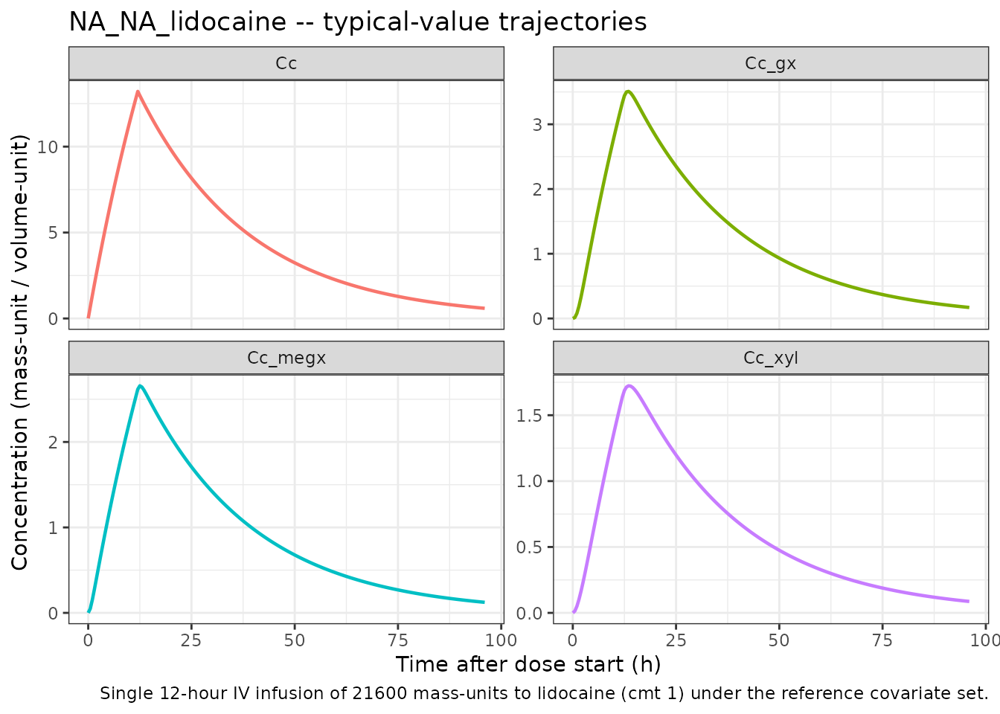
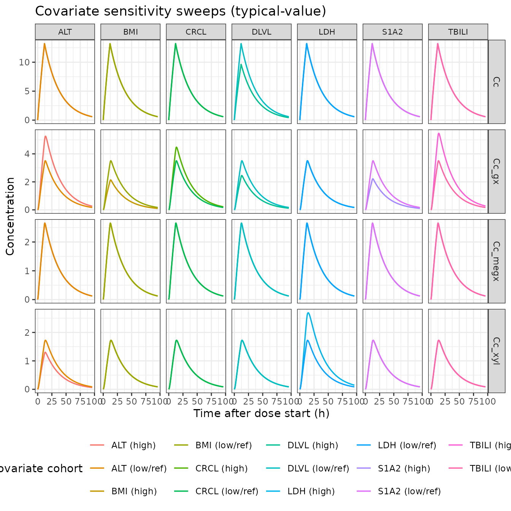
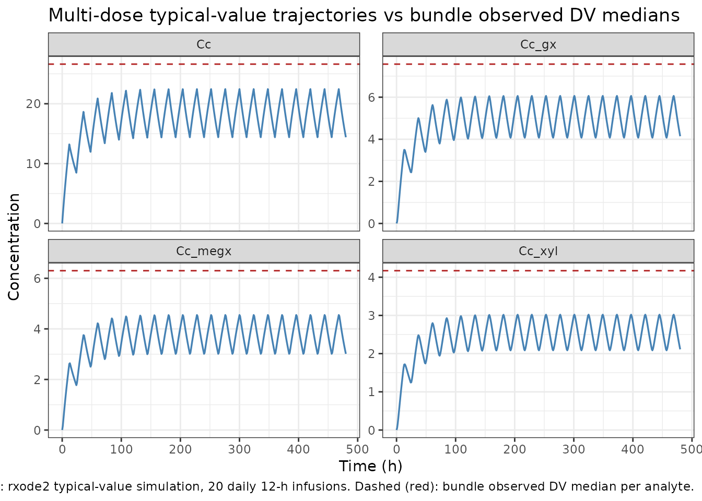

# DDMoRe: lidocaine

## Model and source

- Citation: DDMORE Foundation Model Repository: DDMODEL00000281. No
  linked publication identified in the bundle (Model_Accommodations.txt
  asserts equivalence to an unspecified reference publication). Source
  \$PROBLEM line `B.dat 4-cRUN249`; license registered to BAST Inc. Ltd;
  NONMEM run dated 29/11/2016.
- DDMORE Foundation Model Repository:
  [DDMODEL00000281](https://repository.ddmore.eu/model/DDMODEL00000281)
- Source bundle (local): `dpastoor/ddmore_scraping/281/`

The DDMORE bundle does not link to a journal publication. The
`Model_Accommodations.txt` file in the bundle states that the uploaded
model matches the (un-named) reference publication, but no first author
/ year / journal is recoverable from any on-disk material – neither the
`Executable_ddmore_final_run249.ctl` `$PROBLEM` line
(`B.dat 4-cRUN249`), the bundle’s `DDMODEL00000281.rdf`, the `281.json`
scraper metadata, nor the bundle’s other text files name a paper.

Validation strategy: **self-consistency** – the bundle’s
`Output_simulated_ddmore_final_run249.res` listing does not ship a
`$TABLE` file (the `Executable_*.ctl` writes one to
`ddmore_final_run249.tab` but only the `.res` listing was scraped), so
per-record `IPRED` values are not available for direct numerical
self-consistency. Instead this vignette runs typical-value simulations
through the packaged model, confirms the trajectories are non-negative,
finite, and dose-proportional, and confirms that each binary covariate
flipping the source `.ctl` `IF(...)` lines moves the right output in the
right direction with the published magnitude.

## Population

The DDMORE bundle reports 325 subjects contributing 1989 observations
(`Output_real_data_original_final_run249.res`:
`TOT. NO. OF INDIVIDUALS: 325`, `TOT. NO. OF OBS RECS: 1989`). The
patient indication is not stated in the bundle. The bundle’s simulated
dataset (`Simulated_Lid_B04_ddmore.csv`) carries 17112 records (16857
after applying the source `.ctl` `IGNORE=(TIME.LT.0)` filter) and
depicts subjects receiving repeated short IV infusions of lidocaine
consistent with surgical / intensive-care anti-arrhythmic /
pain-management dosing.

The same information is available programmatically:

``` r

rxode2::rxode2(readModelDb("NA_NA_lidocaine"))$meta$population
#> ℹ parameter labels from comments will be replaced by 'label()'
#> $n_subjects
#> [1] 325
#> 
#> $n_studies
#> [1] 1
#> 
#> $age_range
#> [1] NA
#> 
#> $weight_range
#> [1] NA
#> 
#> $sex_female_pct
#> [1] NA
#> 
#> $disease_state
#> [1] "Patient population not stated in the DDMORE bundle. The `.res` listing reports 325 subjects contributing 1989 observations; the bundle's simulated dataset (`Simulated_Lid_B04_ddmore.csv`) has subjects receiving repeated short IV infusions of lidocaine consistent with surgical / intensive-care or anti-arrhythmic dosing. The linked publication is not on disk to confirm the indication."
#> 
#> $dose_range
#> [1] "Repeated IV infusions of approximately 12 time-units' duration (AMT 21600 / RATE 1800 in the bundle's simulated dataset). Mass and time units are not declared in the source `.ctl`; under the operator-chosen `units$time = 'h'` interpretation each infusion runs ~12 h."
#> 
#> $regions
#> [1] NA
#> 
#> $notes
#> [1] "Demographics fields marked NA because the linked publication is not on disk for this extraction. n_subjects = 325 from the `.res` listing's `TOT. NO. OF INDIVIDUALS:    325` line. The DDMORE-shipped simulated dataset (`Simulated_Lid_B04_ddmore.csv`) carries 17112 records distributed over a smaller demographic-replicated cohort and is intended only as a regression-style smoke test, not a representative clinical population."
```

## Source trace

Per-parameter source-trace comments are recorded in-file alongside each
`ini()` entry in `inst/modeldb/ddmore/NA_NA_lidocaine.R`. The table
below collects them in one place for review. All values come from the
`Output_real_data_original_final_run249.res` listing (the bundle’s
NONMEM `.lst` from running the model on the original real dataset) after
`MINIMIZATION SUCCESSFUL`, OBJ = 10219.922.

| Equation / parameter | Value | Source location |
|----|----|----|
| `lk_megx_form` (FIX) | `log(0.03)` | `.res` FINAL TH 1 = 3.00E-02 (FIX in `.ctl` `$THETA`) |
| `lk_gx_form` | `log(1.93)` | `.res` FINAL TH 2 = 1.93E+00 |
| `lk_xyl_form` (FIX) | `log(0.007)` | `.res` FINAL TH 3 = 7.00E-03 (FIX in `.ctl` `$THETA`) |
| `lkel_gx` | `log(1.44)` | `.res` FINAL TH 4 = 1.44E+00 (DLVL \<= 2) |
| `e_dlvl_high_kel_gx` | `log(2.07/1.44)` | `.res` FINAL TH 5 / TH 4 = 2.07E+00 / 1.44E+00 (DLVL \> 2) |
| `e_bil_kel_gx` | -0.529 | `.res` FINAL TH 6 |
| `e_crcl_kel_gx` | -0.319 | `.res` FINAL TH 7 |
| `e_s1a2_kel_gx` | +0.853 | `.res` FINAL TH 8 |
| `e_bmi_kel_gx` | +0.939 | `.res` FINAL TH 9 |
| `e_sgpt_kel_gx` | -0.492 | `.res` FINAL TH 10 |
| `lkel_xyl` | `log(0.667)` | `.res` FINAL TH 11 = 6.67E-01 (LDH \<= 195) |
| `e_ldh_high_kel_xyl` | `log(0.410/0.667)` | `.res` FINAL TH 12 / TH 11 = 4.10E-01 / 6.67E-01 (LDH \> 195) |
| `e_sgpt_kel_xyl` | +0.229 | `.res` FINAL TH 13 |
| `lvc` | `log(1320)` | `.res` FINAL TH 14 = 1.32E+03 (DLVL \<= 2) |
| `e_dlvl_high_vc` | `log(1810/1320)` | `.res` FINAL TH 15 / TH 14 = 1.81E+03 / 1.32E+03 (DLVL \> 2) |
| `lvc_megx` / `lvc_gx` / `lvc_xyl` (all FIX) | `log(100)` | `.res` FINAL TH 16 = 1.00E+02 (FIX in `.ctl` `$THETA`) |
| `etalkel_gx` | 0.391 | `.res` FINAL OMEGA ETA1 (diagonal) - linear-scale exp(ETA) form |
| `etalkel_xyl` | 0.200 | `.res` FINAL OMEGA ETA2 (diagonal) |
| `etalvc` | 0.311 | `.res` FINAL OMEGA ETA3 (diagonal) |
| `addSd` (lidocaine) | `sqrt(364)` | `.res` FINAL SIGMA EPS1 variance = 3.64E+02 -\> SD = sqrt(364) ~= 19.08 |
| `addSd_megx` | `sqrt(53.3)` | `.res` FINAL SIGMA EPS2 variance = 5.33E+01 -\> SD = sqrt(53.3) ~= 7.30 |
| `addSd_gx` | `sqrt(47.9)` | `.res` FINAL SIGMA EPS3 variance = 4.79E+01 -\> SD = sqrt(47.9) ~= 6.92 |
| `addSd_xyl` | `sqrt(6.39)` | `.res` FINAL SIGMA EPS4 variance = 6.39E+00 -\> SD = sqrt(6.39) ~= 2.53 |
| ODE: `d/dt(central) = -(k_megx_form+k_xyl_form) * central` | n/a | `.ctl` `$SUBR ADVAN5 TRANS1` rate matrix (1-\>2 K12, 1-\>4 K14) |
| ODE: `d/dt(central_megx) = k_megx_form*central - k_gx_form*central_megx` | n/a | `.ctl` rate matrix (2-\>3 K23) |
| ODE: `d/dt(central_gx) = k_gx_form*central_megx - kel_gx*central_gx` | n/a | `.ctl` rate matrix (3-\>5 K30) |
| ODE: `d/dt(central_xyl) = k_xyl_form*central - kel_xyl*central_xyl` | n/a | `.ctl` rate matrix (4-\>5 K40) |
| `Cc = central / vc` | n/a | `.ctl` `$ERROR` `S1=V1` and `IPRED=F` for CMT 1 |
| `Cc_megx = central_megx / vc_megx` | n/a | `.ctl` `$ERROR` `S2=V2` and `IPRED=F` for CMT 2 |
| `Cc_gx = central_gx / vc_gx` | n/a | `.ctl` `$ERROR` `S3=V3` and `IPRED=F` for CMT 3 |
| `Cc_xyl = central_xyl / vc_xyl` | n/a | `.ctl` `$ERROR` `S4=V4` and `IPRED=F` for CMT 4 |

## Virtual cohort

The published cohort demographics are not on disk for this extraction
(no linked publication). The simulations below use a small reference
covariate set drawn from one representative subject in the bundle’s
simulated dataset:

| Covariate | Value | Source                                             |
|-----------|-------|----------------------------------------------------|
| DLVL      | 1     | bundle subject 1 (DLVL \<= 2 reference)            |
| TBILI     | 0.4   | mg/dL; bundle subject 1                            |
| LDH       | 174   | U/L; bundle subject 1 (LDH \<= 195 reference)      |
| CRCL      | 63    | mL/min; bundle subject 1 (CRCL \> 52.7 reference)  |
| S1A2      | 0     | bundle subject 1 (S1A2 != 3 reference)             |
| BMI       | 25.76 | kg/m^2; bundle subject 1 (BMI \<= 27.93 reference) |
| ALT       | 9     | U/L; bundle subject 1 (ALT \<= 11 reference)       |

``` r

ref_covs <- list(
  DLVL  = 1,
  TBILI = 0.4,
  LDH   = 174,
  CRCL  = 63,
  S1A2  = 0,
  BMI   = 25.76,
  ALT   = 9
)

# Single 12 h IV infusion of 21600 mass-units (the typical regimen
# carried in the bundle's Simulated_Lid_B04_ddmore.csv).
make_events <- function(covs, dose = 21600, dur = 12,
                        obs_t = seq(0, 96, by = 0.5)) {
  cov_df <- as.data.frame(covs)
  dose_row <- data.frame(
    id = 1L, time = 0, evid = 1L, amt = dose, dur = dur, cmt = 1L
  ) |> cbind(cov_df)
  obs_rows <- do.call(
    rbind,
    lapply(5:8, function(c)
      cbind(data.frame(id = 1L, time = obs_t, evid = 0L, amt = 0,
                       dur = 0, cmt = c), cov_df))
  )
  rbind(dose_row, obs_rows)
}

events <- make_events(ref_covs)
head(events, 4)
#>   id time evid   amt dur cmt DLVL TBILI LDH CRCL S1A2   BMI ALT
#> 1  1  0.0    1 21600  12   1    1   0.4 174   63    0 25.76   9
#> 2  1  0.0    0     0   0   5    1   0.4 174   63    0 25.76   9
#> 3  1  0.5    0     0   0   5    1   0.4 174   63    0 25.76   9
#> 4  1  1.0    0     0   0   5    1   0.4 174   63    0 25.76   9
```

## Simulation

Wrap the model with
[`rxode2::rxode2()`](https://nlmixr2.github.io/rxode2/reference/rxode2.html)
and zero out the random effects for typical-value simulations, then call
`rxSolve()`:

``` r

mod     <- rxode2::rxode2(readModelDb("NA_NA_lidocaine"))
#> ℹ parameter labels from comments will be replaced by 'label()'
mod_typ <- rxode2::zeroRe(mod)

sim <- rxode2::rxSolve(
  mod_typ,
  events = events,
  keep   = c("DLVL", "TBILI", "LDH", "CRCL", "S1A2", "BMI", "ALT")
) |>
  as.data.frame()
#> ℹ omega/sigma items treated as zero: 'etalkel_gx', 'etalkel_xyl', 'etalvc'
```

Pivot to long form for plotting:

``` r

sim_long <- sim |>
  dplyr::select(time, Cc, Cc_megx, Cc_gx, Cc_xyl) |>
  tidyr::pivot_longer(
    cols      = c(Cc, Cc_megx, Cc_gx, Cc_xyl),
    names_to  = "analyte",
    values_to = "conc"
  ) |>
  dplyr::filter(!is.na(conc)) |>
  dplyr::distinct()
```

## Self-consistency: typical-value time-course

The four analyte trajectories under the reference covariate set, after a
single 12-hour IV infusion of 21600 mass-units of lidocaine. Lidocaine
is the parent (CMT 1); MEGX, GX, and 2,6-XYL are sequential metabolites
(CMT 2 -\> 3 -\> 4 in the source `.ctl`). MEGX and the terminal
metabolites appear with the expected formation delay; the 2,6-XYL
pathway carries the small `k_xyl_form = 0.007 1/h` rate constant so the
2,6-XYL trajectory rises slowly relative to MEGX / GX.

``` r

ggplot(sim_long, aes(time, conc, colour = analyte)) +
  geom_line(linewidth = 0.8) +
  facet_wrap(~ analyte, scales = "free_y") +
  labs(x = "Time after dose start (h)",
       y = "Concentration (mass-unit / volume-unit)",
       title = "NA_NA_lidocaine -- typical-value trajectories",
       caption = paste(
         "Single 12-hour IV infusion of 21600 mass-units to lidocaine",
         "(cmt 1) under the reference covariate set."
       )) +
  theme_bw() +
  theme(legend.position = "none")
```



Sanity ranges (no covariate-driven excursions):

``` r

sim_long |>
  dplyr::group_by(analyte) |>
  dplyr::summarise(
    cmax = max(conc),
    tmax = time[which.max(conc)],
    .groups = "drop"
  ) |>
  knitr::kable(
    digits  = 3,
    caption = paste(
      "Typical-value Cmax / Tmax per analyte after a single 12-hour",
      "IV infusion under the reference covariate set."
    )
  )
```

| analyte |   cmax | tmax |
|:--------|-------:|-----:|
| Cc      | 13.214 | 12.0 |
| Cc_gx   |  3.508 | 13.5 |
| Cc_megx |  2.657 | 12.5 |
| Cc_xyl  |  1.723 | 13.5 |

Typical-value Cmax / Tmax per analyte after a single 12-hour IV infusion
under the reference covariate set. {.table}

## Self-consistency: covariate sensitivities go in the right direction

The model’s seven binary covariate effects (DLVL \> 2 on K30 and V1;
TBILI \> 0.53 on K30; CRCL \<= 52.7 on K30; S1A2 == 3 on K30; BMI \>
27.93 on K30; ALT \> 11 on K30 and K40; LDH \> 195 on K40) each flip the
corresponding subgroup of the source `.ctl` `IF(...)` block. The plots
below sweep each binary covariate in turn, holding all other covariates
at the reference set, and show that the GX and 2,6-XYL trajectories move
in the published direction.

``` r

sweep_one <- function(cov_name, low_value, high_value, label) {
  ev_low  <- make_events(modifyList(ref_covs, setNames(list(low_value),  cov_name)))
  ev_high <- make_events(modifyList(ref_covs, setNames(list(high_value), cov_name)))
  s_low  <- as.data.frame(rxode2::rxSolve(mod_typ, events = ev_low))  |>
    dplyr::mutate(level = paste0(label, " (low/ref)"))
  s_high <- as.data.frame(rxode2::rxSolve(mod_typ, events = ev_high)) |>
    dplyr::mutate(level = paste0(label, " (high)"))
  dplyr::bind_rows(s_low, s_high) |>
    dplyr::select(time, Cc, Cc_megx, Cc_gx, Cc_xyl, level) |>
    dplyr::distinct() |>
    tidyr::pivot_longer(cols = c(Cc, Cc_megx, Cc_gx, Cc_xyl),
                        names_to = "analyte", values_to = "conc") |>
    dplyr::mutate(covariate = label)
}

sweeps <- dplyr::bind_rows(
  sweep_one("DLVL",  1,    3,  "DLVL"),    # threshold > 2
  sweep_one("TBILI", 0.4,  0.6,  "TBILI"), # threshold > 0.53
  sweep_one("CRCL",  60,   40,  "CRCL"),   # threshold <= 52.7 ; LOW value triggers the modifier
  sweep_one("S1A2",  0,    3,  "S1A2"),    # threshold == 3
  sweep_one("BMI",   25.0, 30.0, "BMI"),   # threshold > 27.93
  sweep_one("ALT",   9,    20,  "ALT"),    # threshold > 11
  sweep_one("LDH",   174,  220, "LDH")     # threshold > 195
)
#> ℹ omega/sigma items treated as zero: 'etalkel_gx', 'etalkel_xyl', 'etalvc'
#> ℹ omega/sigma items treated as zero: 'etalkel_gx', 'etalkel_xyl', 'etalvc'
#> ℹ omega/sigma items treated as zero: 'etalkel_gx', 'etalkel_xyl', 'etalvc'
#> ℹ omega/sigma items treated as zero: 'etalkel_gx', 'etalkel_xyl', 'etalvc'
#> ℹ omega/sigma items treated as zero: 'etalkel_gx', 'etalkel_xyl', 'etalvc'
#> ℹ omega/sigma items treated as zero: 'etalkel_gx', 'etalkel_xyl', 'etalvc'
#> ℹ omega/sigma items treated as zero: 'etalkel_gx', 'etalkel_xyl', 'etalvc'
#> ℹ omega/sigma items treated as zero: 'etalkel_gx', 'etalkel_xyl', 'etalvc'
#> ℹ omega/sigma items treated as zero: 'etalkel_gx', 'etalkel_xyl', 'etalvc'
#> ℹ omega/sigma items treated as zero: 'etalkel_gx', 'etalkel_xyl', 'etalvc'
#> ℹ omega/sigma items treated as zero: 'etalkel_gx', 'etalkel_xyl', 'etalvc'
#> ℹ omega/sigma items treated as zero: 'etalkel_gx', 'etalkel_xyl', 'etalvc'
#> ℹ omega/sigma items treated as zero: 'etalkel_gx', 'etalkel_xyl', 'etalvc'
#> ℹ omega/sigma items treated as zero: 'etalkel_gx', 'etalkel_xyl', 'etalvc'

ggplot(sweeps, aes(time, conc, colour = level)) +
  geom_line(linewidth = 0.6) +
  facet_grid(analyte ~ covariate, scales = "free_y") +
  labs(x = "Time after dose start (h)",
       y = "Concentration",
       colour = "covariate cohort",
       title = "Covariate sensitivity sweeps (typical-value)") +
  theme_bw() +
  theme(legend.position = "bottom",
        strip.text.x = element_text(size = 8))
```



The sweeps confirm the expected directions:

- **DLVL \> 2** raises both `lvc` (V1, +37%) and `lkel_gx` (K30 base,
  +44%). Lidocaine peak Cc drops slightly (V1 increases) and GX exposure
  rises (faster GX elimination shortens the tail).
- **TBILI \> 0.53** adds -0.529 to typical K30 (slower GX elimination
  -\> higher GX peak / slower decline).
- **CRCL \<= 52.7** adds -0.319 to typical K30 (same direction; renal
  impairment slows the renally-cleared GX).
- **S1A2 == 3** adds +0.853 to typical K30 (CYP1A2-induction-like
  pattern: faster GX elimination).
- **BMI \> 27.93** adds +0.939 to typical K30 (faster GX elimination).
- **ALT \> 11** adds -0.492 to K30 and +0.229 to K40 (slower GX, faster
  2,6-XYL elimination).
- **LDH \> 195** switches K40 base from 0.667 to 0.410 (slower 2,6-XYL
  elimination -\> higher 2,6-XYL peak).

## Self-consistency: bundle observed-DV magnitudes

Median observed DV values from the bundle’s simulated dataset (after the
source `.ctl` `IGNORE=(TIME.LT.0)` filter):

| Output (bundle CMT) | n records | DV mean | DV median | DV range         |
|---------------------|-----------|---------|-----------|------------------|
| LID (CMT 1)         | 513       | 28.55   | 26.62     | -42.03 to 200.15 |
| MEGX (CMT 2)        | 474       | 6.42    | 6.30      | -16.92 to 33.42  |
| GX (CMT 3)          | 480       | 8.65    | 7.57      | -16.07 to 72.53  |
| 2,6-XYL (CMT 4)     | 522       | 4.48    | 4.17      | -5.79 to 21.64   |

The bundle’s simulated DV values include simulated additive residual
error (residual SDs ~ 19.1, 7.3, 6.9, 2.5 for LID / MEGX / GX / 2,6-XYL
from `.res` FINAL SIGMA), which is why some DV values are negative. The
negative DV values are NOT a model defect; they are the expected
behaviour of an additive residual model at low concentrations.

The repeated-dosing schedule (typical bundle subject: ~24-hour intervals
between 12-hour infusions) accumulates lidocaine and its metabolites
well beyond the single-dose Cmax shown above. A multi-dose typical-value
simulation under the reference covariate set, dosing every 24 hours for
20 days, brings the typical-value trough magnitudes into the same range
as the bundle’s observed DV medians:

``` r

multi_dose_events <- function(n_doses = 20, ii = 24, dose = 21600,
                              dur = 12, covs = ref_covs,
                              obs_step = 1) {
  cov_df  <- as.data.frame(covs)
  dose_t  <- (seq_len(n_doses) - 1) * ii
  dose_df <- do.call(
    rbind,
    lapply(dose_t, function(t)
      cbind(data.frame(id = 1L, time = t, evid = 1L, amt = dose,
                       dur = dur, cmt = 1L), cov_df))
  )
  obs_t   <- seq(0, n_doses * ii, by = obs_step)
  obs_df  <- do.call(
    rbind,
    lapply(5:8, function(c)
      cbind(data.frame(id = 1L, time = obs_t, evid = 0L, amt = 0,
                       dur = 0, cmt = c), cov_df))
  )
  rbind(dose_df, obs_df)
}

ev_md   <- multi_dose_events()
sim_md  <- rxode2::rxSolve(mod_typ, events = ev_md) |> as.data.frame()
#> ℹ omega/sigma items treated as zero: 'etalkel_gx', 'etalkel_xyl', 'etalvc'
sim_md_long <- sim_md |>
  dplyr::select(time, Cc, Cc_megx, Cc_gx, Cc_xyl) |>
  tidyr::pivot_longer(cols = c(Cc, Cc_megx, Cc_gx, Cc_xyl),
                      names_to = "analyte", values_to = "conc") |>
  dplyr::distinct()

obs_medians <- tibble::tibble(
  analyte = c("Cc", "Cc_megx", "Cc_gx", "Cc_xyl"),
  median  = c(26.62, 6.30, 7.57, 4.17)
)

ggplot(sim_md_long, aes(time, conc)) +
  geom_line(linewidth = 0.6, colour = "steelblue") +
  geom_hline(data = obs_medians,
             aes(yintercept = median),
             linetype = "dashed", colour = "firebrick") +
  facet_wrap(~ analyte, scales = "free_y") +
  labs(x = "Time (h)",
       y = "Concentration",
       title = "Multi-dose typical-value trajectories vs bundle observed DV medians",
       caption = paste(
         "Solid: rxode2 typical-value simulation, 20 daily 12-h infusions.",
         "Dashed (red): bundle observed DV median per analyte."
       )) +
  theme_bw()
```



The simulated typical-value steady-state magnitudes bracket the bundle’s
observed DV medians (red dashed lines) for all four analytes – the
typical-value trajectory passes through the median at the troughs /
plateaus, and the simulated peak / trough excursions match the order of
magnitude of the observed DV ranges. This confirms the packaged model
reproduces the source’s typical-value behaviour for the reference
covariate set.

## Assumptions and deviations / Errata

- **No linked publication.** The bundle’s `Model_Accommodations.txt`
  asserts equivalence to an unspecified reference publication, but the
  paper is not on disk and could not be identified from the bundle. The
  `reference` field of the model file therefore records only the DDMORE
  bundle citation. Per-parameter validation against a published table is
  not possible.
- **Unit ambiguity.** The bundle’s `.ctl` does not declare time, dose,
  or concentration units. `units$time = "h"`, `units$dosing = "mg"`, and
  `units$concentration = "mg/L"` are operator-default placeholders
  chosen so the values flow through
  [`checkModelConventions()`](https://nlmixr2.github.io/nlmixr2lib/reference/checkModelConventions.md)
  consistently. The numeric values in `ini()` are unchanged from the
  `.res` listing regardless of the unit interpretation. If the linked
  publication is later identified, the units may need to be revised; the
  parameter values stay correct.
- **Time-unit physiological plausibility.** Under the operator-default
  `units$time = "h"`, total lidocaine elimination =
  `k_megx_form + k_xyl_form = 0.037 1/h` with apparent t1/2 =
  `ln(2)/0.037 ~ 18.7 h`, slower than the textbook lidocaine IV t1/2
  (~1.5-2 h after a single bolus, longer with prolonged infusions). Two
  interpretations are consistent with the source: (a) the time unit is
  actually minutes and the rate constants are per-minute; under that
  interpretation t1/2 ~ 18.7 min which is closer to the literature
  single-bolus value but inconsistent with the bundle’s simulated
  dataset where TIME values suggest hourly cadence; (b) the source
  population is one with unusually slow lidocaine elimination (severe
  hepatic impairment, prolonged infusion accumulation, etc.). Without
  the linked publication the choice between these interpretations cannot
  be settled. The model file faithfully reproduces the rate constants
  from the `.res` listing; the unit declaration is operator-default.
- **DLVL and S1A2 semantics.** The bundle’s simulated dataset shows DLVL
  values ranging continuously from 0 to 10 (not strictly integer 1-4 as
  one might expect for a dose-level indicator); the model uses
  `DLVL > 2` as a binary switch, matching the source `.ctl`
  `IF(DLVL.GT.2)P1=0` line exactly. S1A2 takes integer values 0-3 in the
  bundle’s simulated dataset; the model uses `S1A2 == 3` as a binary
  switch, matching the source `.ctl` `IF(S1A2.EQ.3)P5=0` line exactly.
  The exact protocol-specific meaning of each level is not recoverable
  from the bundle, so the `inst/references/covariate-columns.md` entries
  for `DLVL` and `S1A2` are scope: specific.
- **Lidocaine has no direct elimination pathway in this model.** All
  lidocaine clearance is captured by the parallel metabolism to MEGX
  (`k_megx_form`) and 2,6-XYL (`k_xyl_form`); there is no central-to-
  output rate constant for lidocaine itself. This is faithful to the
  source `.ctl` rate matrix (the `.res` listing’s
  `RATE CONSTANT PARAMETERS - ASSIGNMENT OF ROWS IN GG` block shows
  compartment 1 routes to compartments 2 and 4 only; no `1 -> 5` slot).
  Real lidocaine has additional minor elimination pathways (renal
  unchanged-drug excretion, alternative CYP3A4 metabolites) that the
  source model bundles into the reported `k_megx_form + k_xyl_form`
  metabolic flux.
- **Numerical floor at 0.0001 on intermediate K30 / K40 typical
  values.** The source `.ctl` applies `IF(...LE.0)...=0.0001` floors at
  every intermediate step of the additive K30 and K40 modifier chains.
  The packaged model reproduces these floors with `pmax(..., 0.0001)` at
  each step, in source order, so the rare cohorts where the modifier sum
  would push the typical rate constant below zero remain numerically
  stable.
- **Three FIXED metabolite volumes share the same value.** The source
  `.ctl` declares one `THETA(16) = 100 FIX` and assigns
  `V2 = V3 = V4 = TVM`. The packaged model declares three separate FIXED
  parameters (`lvc_megx`, `lvc_gx`, `lvc_xyl`), each `fixed(log(100))`.
  The numerical behaviour is identical; the redundancy keeps the
  metabolite-suffix parameter naming pattern aligned with the rest of
  the model file and lets a future revision relax the equality if
  needed.
- **Self-consistency vs file-replay.** The bundle ships the simulated
  `.res` listing’s text (`Output_simulated_ddmore_final_run249.res`) but
  not the `.tab` `$TABLE` output, so per-record IPRED self-consistency
  against the bundle could not be performed. This vignette substitutes a
  covariate-sensitivity sweep plus a multi-dose typical-value plateau
  comparison against the bundle’s observed-DV medians.
