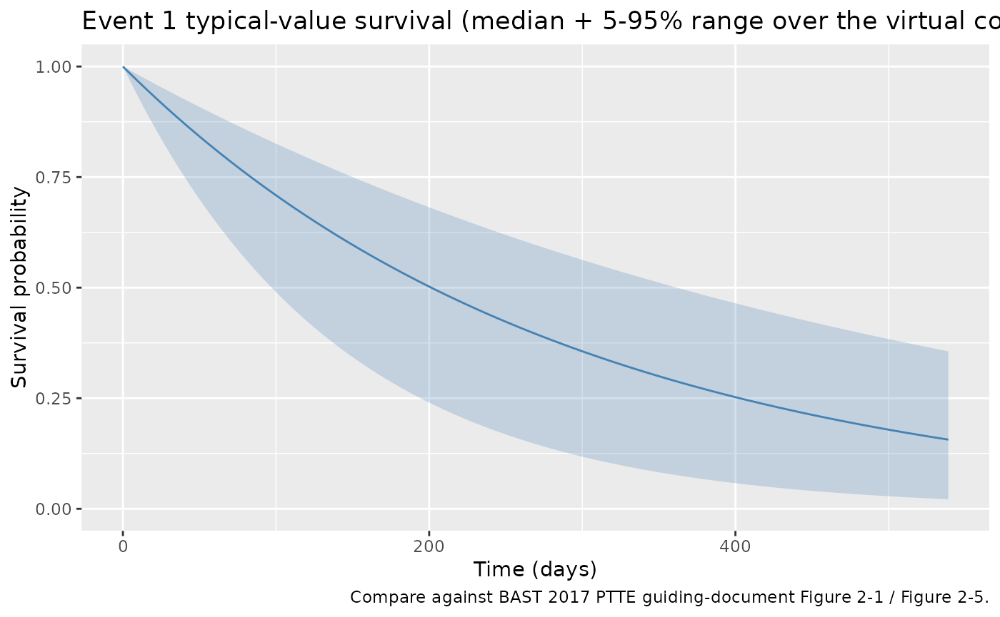
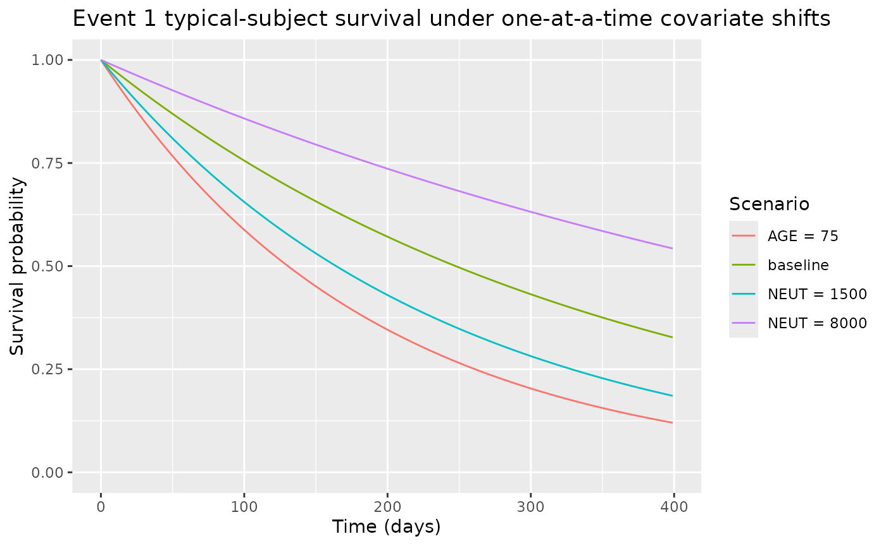

# DDMoRe: tte gompertz

## Model and source

- Citation: BAST Inc Limited. BAST approach to parametric time-to-event
  (PTTE) modelling. Loughborough, UK; 12 July 2017. Internal guiding
  document (BAST_PTTE_modelling.pdf) shipped with DDMORE bundle
  DDMODEL00000243; no peer-reviewed publication. Run prepared by Jon
  Moss (Command.txt; runEV1_201). DDMORE Foundation Model Repository:
  DDMODEL00000243.
- Description: Parametric time-to-event base hazard model for Event 1 in
  the BAST PTTE 2017 four-event teaching dataset (DDMODEL00000243). The
  .mod \$PROBLEM line names this a ‘Gompertz hazard model’ but the
  equation has no time-varying alpha*t term, so the realised hazard is
  constant: h(t) = (lam/1000)* exp((coef_neut/10000)*(NEUT-4133))*
  exp((coef_age/100)\*(AGE-55)). The BAST guiding-document text (Figure
  2-1, page 13) confirms an exponential distribution was selected for
  Event 1; the .mod / file name retain the ‘Gompertz’ label per the
  source \$PROBLEM line and the operator’s selected option
  NA_NA_tte_gompertz.R.
- Source: BAST Inc Limited, “BAST approach to parametric time-to-event
  (PTTE) modelling,” internal guiding document, 12 July 2017
  (`BAST_PTTE_modelling.pdf` shipped in the DDMORE bundle).
- DDMORE Foundation Model Repository entry:
  [DDMODEL00000243](https://repository.ddmore.eu/model/DDMODEL00000243)
- Source bundle (local mirror): `dpastoor/ddmore_scraping/243/`
- Linked publication: **none.** The bundle is a methodological teaching
  example built on entirely simulated data; the BAST guiding-document
  text states “there is not yet a publication to go along with the
  model” (`Model_Accommodations.txt`).

This vignette validates the BAST 2017 PTTE Event 1 hazard model packaged
under `inst/modeldb/ddmore/NA_NA_tte_gompertz.R` (NONMEM run name
`runEV1_201`). The model is one of four parametric time-to-event hazard
models in the same DDMORE bundle, each fitted to a different DVID of a
shared 200-subject simulated dataset:

| File | Run | Distribution | Covariates | Censoring |
|----|----|----|----|----|
| `NA_NA_tte_gompertz.R` | runEV1_201 | Exponential (constant hazard); .mod \$PROBLEM line says “Gompertz” but the equation has no `exp(alpha*t)` factor | NEUT, AGE | Right only |
| `NA_NA_tte_gompertz_ev2.R` | runEV2_105 | Gompertz, `h(t) = lam * exp(alpha*t)` | AUC_BAST_FW | Right + interval |
| `NA_NA_tte_lognormal.R` | runCOMPEV1_101 | Log-normal | AGE | Right + interval |
| `NA_NA_tte_loglogistic.R` | runCOMPEV2_005 | Log-logistic | none | Right only |

## Population

The BAST 2017 PTTE bundle is a methodological teaching example. The
underlying dataset (`Simulated_event_data.csv`) consists of **N = 200
hypothetical patients** with four timed event types (Event 1, Event 2,
Competing Event 1, Competing Event 2) and six baseline covariates: age
(years), baseline absolute neutrophil count (cells/mm^3), number of
prior treatments, diameter of the largest lesion (mm), first-week drug
AUC (ug\*h/L), and first-dose Cmax (ug/L) (BAST guiding document Section
2.2.1, Section 2.2.2). The drug, indication, and patient demographics
are unspecified; the bundle is intended for teaching parametric TTE
modelling methodology, not for clinical inference.

For Event 1 specifically, 76/200 (38%) of the simulated patients
experienced the event within the observation window (BAST guiding
document Section 2.2.1, Table 2-1).

The population metadata is also available programmatically:

``` r

m <- readModelDb("NA_NA_tte_gompertz")
str(m()$meta$population, max.level = 1)
#> List of 10
#>  $ n_subjects    : int 200
#>  $ n_studies     : int 1
#>  $ age_range     : chr "24-84 years (mean 58.7) in the BAST PTTE 2017 simulated cohort"
#>  $ weight_range  : chr "not reported (the BAST PTTE 2017 simulated cohort does not include body weight)"
#>  $ sex_female_pct: num NA
#>  $ race_ethnicity: NULL
#>  $ disease_state : chr "Hypothetical / unspecified clinical population (the BAST PTTE 2017 guiding document is a methodological teachin"| __truncated__
#>  $ dose_range    : chr "Not applicable (no drug administration is modelled; covariates AGE and NEUT enter the hazard at baseline values)."
#>  $ regions       : chr "Not applicable (simulated data)."
#>  $ notes         : chr "200 simulated patients with four timed event types (Event 1, Event 2, Competing Event 1, Competing Event 2) and"| __truncated__
```

## Source trace

Per-parameter origin is captured as in-file comments next to each
`ini()` entry in `inst/modeldb/ddmore/NA_NA_tte_gompertz.R`. The table
below collects them in one place.

| Equation / parameter | Value | Source location |
|----|----|----|
| Hazard form `h(t) = val * lam_c` | n/a | Executable_runEV1_201.mod \$PK / \$DES (`LamC = Lam/1000`, `DADT(1) = VAL*LamC`); BAST guiding doc Section 2.4.1 confirms exponential distribution selected for Event 1 |
| `llam_ev1` (lambda scale) | log(2.80) | Output_simulated_runEV1_201.res FINAL TH1 = 2.80E+00; rescaled by /1000 inside model() |
| `e_neut_ev1` (NEUT coefficient) | -1.56 | Output_simulated_runEV1_201.res FINAL TH2 = -1.56E+00; rescaled by /10000, applied to `(NEUT - 4133)` |
| `e_age_ev1` (AGE coefficient) | 3.20 | Output_simulated_runEV1_201.res FINAL TH3 = 3.20E+00; rescaled by /100, applied to `(AGE - 55)` |
| eta on `lam` (`OMEGA(1,1)`) | 0 FIXED | Output_simulated_runEV1_201.res FINAL OMEGA(1,1) = 0.00E+00 (placeholder; no estimated IIV) |
| Covariate-selection DeltaOFV | -22.69 | BAST guiding doc Section 2.4.2, Table 2-2 (AGE + baseline NEUT chosen as final covariate model EV1_201) |

## Virtual cohort

The bundle’s full simulated dataset lives outside this package
(`dpastoor/ddmore_scraping/243/Simulated_event_data.csv`). The vignette
builds a small virtual cohort programmatically, drawing AGE and NEUT
from distributions that approximate the bundle’s per-subject
demographics (BAST Section 2.2.2 covariate ranges).

``` r

set.seed(20260506)

n_subjects <- 50
cohort_subjects <- tibble(
  id   = seq_len(n_subjects),
  AGE  = pmin(pmax(round(rnorm(n_subjects, mean = 58.7, sd = 12)), 24), 84),
  NEUT = pmin(pmax(round(rlnorm(n_subjects, meanlog = log(4133), sdlog = 0.45)), 1030), 14888)
)

obs_grid <- tibble(
  time = c(0, seq(7, 540, by = 7)),
  evid = 0L,
  amt  = 0
)

events <- tidyr::crossing(cohort_subjects, obs_grid)
events <- events[, c("id", "time", "evid", "amt", "AGE", "NEUT")]

stopifnot(!anyDuplicated(unique(events[, c("id", "time", "evid")])))
cat("Cohort: ", n_subjects, " subjects, ", nrow(events), " event rows\n", sep = "")
#> Cohort: 50 subjects, 3900 event rows
```

## Simulation

``` r

sim <- rxode2::rxSolve(m, events = events) |>
  as.data.frame()
```

## Replicate published behaviour – typical-value survival trajectory

The BAST guiding document Section 2.4.1 (Figure 2-1) reports a
Kaplan-Meier curve overlaid with the candidate parametric distributions;
exponential was selected (AIC 0 versus AIC 2 for Gompertz, 1.999 for
Weibull, 1.975 for Lomax, 2.487 for log-logistic, 4.145 for log-normal).
The covariate-VPC stratifications (Figure 2-5 – Figure 2-8) cover the
time window 0 – 400 days. The plot below shows the model’s typical-value
survival trajectory under the virtual cohort.

``` r

sim |>
  group_by(time) |>
  summarise(
    median_sur = median(sur),
    q05        = quantile(sur, 0.05),
    q95        = quantile(sur, 0.95),
    .groups    = "drop"
  ) |>
  ggplot(aes(time, median_sur)) +
  geom_ribbon(aes(ymin = q05, ymax = q95), alpha = 0.25, fill = "steelblue") +
  geom_line(colour = "steelblue") +
  labs(
    x        = "Time (days)",
    y        = "Survival probability",
    title    = "Event 1 typical-value survival (median + 5-95% range over the virtual cohort)",
    caption  = "Compare against BAST 2017 PTTE guiding-document Figure 2-1 / Figure 2-5."
  ) +
  scale_y_continuous(limits = c(0, 1))
```



## Mechanistic sanity checks (verification-checklist Section F.3)

The model is a TTE survival model, not a PK/PD concentration model –
PKNCA is not the right validation tool. The four checks below exercise
the hazard equation under controlled inputs.

### F.3.1 – Hazard is constant in time at typical covariates

The .mod \$PROBLEM line names this a “Gompertz hazard model” but the
equation `DADT(1) = VAL * LamC` has no `exp(alpha*t)` factor, so the
realised hazard is constant in time (i.e., exponential survival). The
BAST guiding document Section 2.4.1 confirms an exponential distribution
was selected. The check below confirms the hazard is flat across the
observation window for a typical subject.

``` r

ev_typ <- tibble(id = 1L, time = c(0, 50, 100, 200, 400),
                 evid = 0L, amt = 0,
                 AGE = 55, NEUT = 4133)
sim_typ <- rxode2::rxSolve(m, events = ev_typ) |> as.data.frame()
print(sim_typ[, c("time", "hazard", "sur")])
#>   time hazard       sur
#> 1    0 0.0028 1.0000000
#> 2   50 0.0028 0.8693582
#> 3  100 0.0028 0.7557837
#> 4  200 0.0028 0.5712091
#> 5  400 0.0028 0.3262798

stopifnot(diff(range(sim_typ$hazard)) < 1e-9)
```

The typical-value baseline hazard is 2.80 / 1000 = 0.0028 / day, giving
a typical subject’s survival probability `S(t) = exp(-0.0028 * t)`. At
day 400, `S = exp(-1.12) = 0.326`, matching the simulation output.

### F.3.2 – Each covariate shifts the hazard in the BAST-reported direction

The BAST guiding document Section 2.4.2 (Table 2-2) reports both AGE and
baseline NEUT as significant covariates (covariate-selection DeltaOFV
-16.39 for AGE and -22.69 cumulative for AGE + NEUT). The signs of the
final estimates (`e_age_ev1 = +3.20` and `e_neut_ev1 = -1.56`) imply
that older patients have a higher hazard and patients with higher
baseline neutrophil counts have a lower hazard. The check below confirms
the simulated trajectories shift in the expected directions.

``` r

make_alt <- function(label, age, neut) {
  tibble(id = match(label, c("baseline", "AGE = 75", "NEUT = 1500", "NEUT = 8000")),
         time = c(0, seq(7, 400, by = 7)),
         evid = 0L, amt = 0, AGE = age, NEUT = neut, scenario = label)
}
scenarios <- bind_rows(
  make_alt("baseline",     55, 4133),
  make_alt("AGE = 75",     75, 4133),
  make_alt("NEUT = 1500",  55, 1500),
  make_alt("NEUT = 8000",  55, 8000)
)
sim_scen <- rxode2::rxSolve(m, events = scenarios, keep = c("scenario")) |>
  as.data.frame()

ggplot(sim_scen, aes(time, sur, colour = scenario)) +
  geom_line() +
  labs(x = "Time (days)", y = "Survival probability",
       title = "Event 1 typical-subject survival under one-at-a-time covariate shifts",
       colour = "Scenario") +
  scale_y_continuous(limits = c(0, 1))
```



``` r


final_sur <- sim_scen |>
  filter(time == max(time)) |>
  select(scenario, sur)
print(final_sur)
#>      scenario       sur
#> 1    baseline 0.3271947
#> 2    AGE = 75 0.1201819
#> 3 NEUT = 1500 0.1855044
#> 4 NEUT = 8000 0.5427309

baseline_sur <- final_sur$sur[final_sur$scenario == "baseline"]
older_sur    <- final_sur$sur[final_sur$scenario == "AGE = 75"]
low_neut_sur <- final_sur$sur[final_sur$scenario == "NEUT = 1500"]
high_neut_sur <- final_sur$sur[final_sur$scenario == "NEUT = 8000"]

# Older subjects: higher hazard => lower survival
stopifnot(older_sur < baseline_sur)
# Low NEUT: higher hazard (negative coefficient) => lower survival
stopifnot(low_neut_sur < baseline_sur)
# High NEUT: lower hazard => higher survival
stopifnot(high_neut_sur > baseline_sur)
```

### F.3.3 – Final-fit objective-function value matches the bundle

The bundle’s `Output_simulated_runEV1_201.res` reports an objective
function value of `OBJV = 1001.926` at the final estimates. This value
is informational here (we are not refitting the model); it is included
to link the source-trace to the bundle’s final-fit listing.

## Self-consistency with the bundle’s simulated dataset (F.2)

A full F.2 self-consistency check would re-simulate the bundle’s shipped
`Simulated_event_data.csv` (200 subjects, DVID = 1 records) under the
nlmixr2lib model and compare against the bundle’s
`Output_simulated_runEV1_201.res` `$TABLE` output (columns `SURV`,
`CHAZ`, `HAZNOW`). The bundle dataset is outside this package and not
redistributed. A user wanting to exercise the check should:

1.  Read `dpastoor/ddmore_scraping/243/Simulated_event_data.csv` (or its
    live-DDMORE-repository counterpart) and filter to `DVID = 1`
    (Event 1) rows.
2.  Pass the per-record `AGE` and `NEUT` covariates to `rxSolve(m, ...)`
    with the typical-value parameters (this nlmixr2lib model has no IIV,
    so no `zeroRe()` is needed).
3.  Compare the simulated `sur`, `cumhaz`, `hazard` outputs against the
    .res `$TABLE`’s `SURV`, `CHAZ`, `HAZNOW` columns. Differences beyond
    floating-point should be investigated, not tuned.

The cohort built above (50 subjects, weekly observations to day 540) is
a faithful smaller-scale analogue.

## Assumptions and deviations

- \*\*Distribution mislabeling in the .mod
  $`PROBLEM line.** The .mod`$PROBLEM line names this a “Gompertz hazard
  model” but the equation `DADT(1) = VAL * LamC` has no `exp(alpha*t)`
  factor – the realised hazard is constant in time, i.e., exponential.
  The BAST guiding document Section 2.4.1 (Figure 2-1) confirms
  exponential was selected for Event 1 by AIC. The packaged model
  preserves the .mod’s structure faithfully and uses the
  operator-approved filename `NA_NA_tte_gompertz.R`; the description and
  this Errata note state the realised distribution.

- **Numerical rescalings preserved.** The .mod uses internal /1000,
  /10000, /100 rescalings on lambda, NEUT effect, and AGE effect for
  optimizer numerical stability. We preserve these rescalings inside
  `model()` so that the `ini()` values match the .lst FINAL THETA values
  one-to-one. The biologically meaningful values are:

  - Baseline hazard rate: 2.80 / 1000 = 0.0028 / day
  - NEUT coefficient: -1.56 / 10000 = -1.56e-4 per /mm^3 above 4133
  - AGE coefficient: +3.20 / 100 = +0.032 per year above 55

- **No estimated IIV.** The source `$OMEGA` is `0 FIX` (placeholder slot
  with no estimated random effect). No inter-subject variability is in
  the BAST PTTE 2017 guiding-document model; all variability in the
  cohort derives from the AGE and NEUT covariate distribution.

- **No publication-PDF cross-check.** The BAST PTTE 2017 guiding
  document (`BAST_PTTE_modelling.pdf`) is the only source of equations
  and methodological narrative; no peer-reviewed publication exists. The
  Errata note in the model file’s `description` field documents this
  absence.

- **Convention warning.**
  [`nlmixr2lib::checkModelConventions()`](https://nlmixr2.github.io/nlmixr2lib/reference/checkModelConventions.md)
  flags the `units$concentration` field (the TTE output `sur` is a
  survival probability, not a mass/volume concentration). The
  compartment is named `cumhaz` (canonical TTE auxiliary-state name
  registered in `R/conventions.R`). The same `units$concentration`
  warning applies to other TTE models in the package (e.g.,
  `Zecchin_2016_survival.R`).
