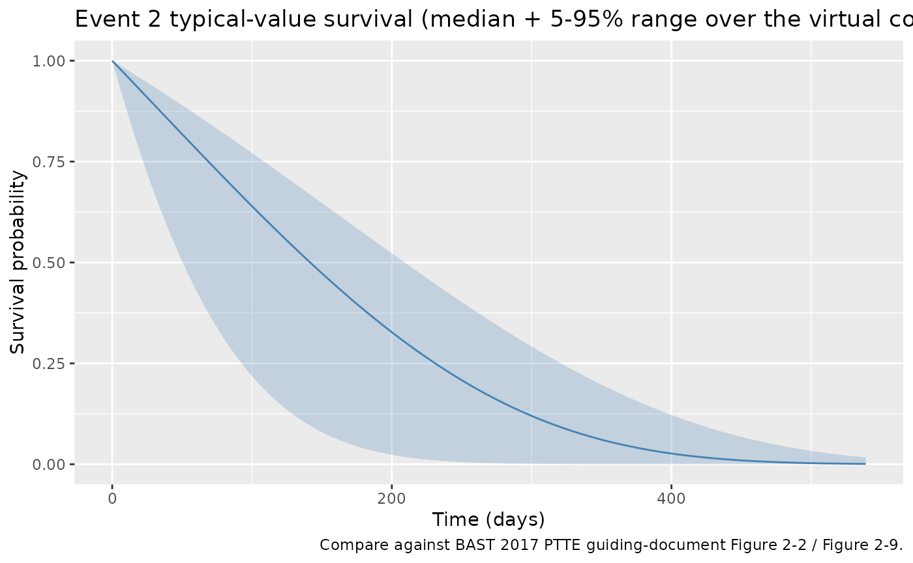
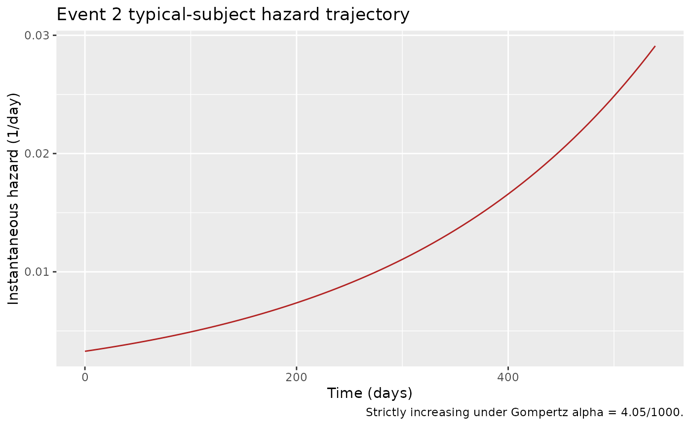
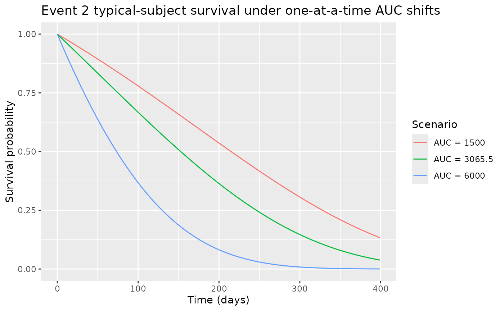

# NA_NA_tte_gompertz_ev2

## Model and source

- Citation: BAST Inc Limited. BAST approach to parametric time-to-event
  (PTTE) modelling. Loughborough, UK; 12 July 2017. Internal guiding
  document (BAST_PTTE_modelling.pdf) shipped with DDMORE bundle
  DDMODEL00000243; no peer-reviewed publication. Run prepared by Jon
  Moss (Command.txt; runEV2_105). DDMORE Foundation Model Repository:
  DDMODEL00000243.
- Description: Parametric time-to-event Gompertz hazard model for Event
  2 in the BAST PTTE 2017 four-event teaching dataset (DDMODEL00000243).
  Hazard h(t) = (lam/1000) \* exp((alpha/1000)*t)*
  exp((coef_auc/1000)\*(AUC_BAST_FW - 3065.5)). Event 2 in the bundle’s
  simulated dataset is interval-censored (CENSORING = 2), assessed at
  scheduled visits rather than observed exactly; the BAST
  guiding-document Section 2.4.1 (Figure 2-2) selected Gompertz as the
  base distribution by AIC, then Section 2.4.2 (Table 2-3) retained
  first-week AUC as the only covariate.
- Source: BAST Inc Limited, “BAST approach to parametric time-to-event
  (PTTE) modelling,” internal guiding document, 12 July 2017
  (`BAST_PTTE_modelling.pdf` shipped in the DDMORE bundle).
- DDMORE Foundation Model Repository entry:
  [DDMODEL00000243](https://repository.ddmore.eu/model/DDMODEL00000243)
- Source bundle (local mirror): `dpastoor/ddmore_scraping/243/`
- Linked publication: **none.** The bundle is a methodological teaching
  example built on entirely simulated data; the BAST guiding-document
  text states “there is not yet a publication to go along with the
  model” (`Model_Accommodations.txt`).

This vignette validates the BAST 2017 PTTE Event 2 hazard model packaged
under `inst/modeldb/ddmore/NA_NA_tte_gompertz_ev2.R` (NONMEM run name
`runEV2_105`). Event 2 in the bundle is interval-censored; the BAST
guiding document Section 2.4.1 (Figure 2-2) selected Gompertz as the
base distribution by AIC, and Section 2.4.2 (Table 2-3) retained
first-week AUC as the only covariate.

For sibling Event 1, Competing Event 1, and Competing Event 2 hazard
models from the same bundle, see `NA_NA_tte_gompertz.R`,
`NA_NA_tte_lognormal.R`, and `NA_NA_tte_loglogistic.R`.

## Population

The BAST 2017 PTTE bundle is a methodological teaching example with N =
200 simulated patients, four timed event types, and six baseline
covariates (BAST Section 2.2.2). Of the 200 simulated patients, 104
(52%) experienced Event 2 (BAST Table 2-1). Event 2 is
**interval-censored**: exact event times are unknown, only that the
event occurred between two scheduled assessment visits.

``` r

m <- readModelDb("NA_NA_tte_gompertz_ev2")
str(m()$meta$population, max.level = 1)
#> List of 10
#>  $ n_subjects    : int 200
#>  $ n_studies     : int 1
#>  $ age_range     : chr "24-84 years (mean 58.7) in the BAST PTTE 2017 simulated cohort"
#>  $ weight_range  : chr "not reported (the BAST PTTE 2017 simulated cohort does not include body weight)"
#>  $ sex_female_pct: num NA
#>  $ race_ethnicity: NULL
#>  $ disease_state : chr "Hypothetical / unspecified clinical population (the BAST PTTE 2017 guiding document is a methodological teachin"| __truncated__
#>  $ dose_range    : chr "Not applicable (no drug administration is modelled; the AUC_BAST_FW covariate is a per-subject baseline summary"| __truncated__
#>  $ regions       : chr "Not applicable (simulated data)."
#>  $ notes         : chr "200 simulated patients; 104 (52%) had Event 2. Event 2 is interval-censored: exact event times are unknown, onl"| __truncated__
```

## Source trace

| Equation / parameter | Value | Source location |
|----|----|----|
| Hazard form `h(t) = val * lam_1 * exp(alpha_1 * t)` | n/a | Executable_runEV2_105.mod \$PK / \$DES (`Lam1 = Lam/1000`, `alpha1 = alpha/1000`, `DADT(1) = VAL*Lam1*exp(alpha1*T)`); BAST guiding doc Section 2.4.1 confirms Gompertz selected |
| `llam_ev2` (Gompertz lambda) | log(3.28) | Output_simulated_runEV2_105.res FINAL TH1 = 3.28E+00; rescaled by /1000 inside model() |
| `lalpha_ev2` (Gompertz alpha) | log(4.05) | Output_simulated_runEV2_105.res FINAL TH2 = 4.05E+00; rescaled by /1000 inside model() |
| `e_auc_ev2` (AUC coefficient) | 0.309 | Output_simulated_runEV2_105.res FINAL TH3 = 3.09E-01; rescaled by /1000, applied to `(AUC_BAST_FW - 3065.5)` |
| eta on `lam` (`OMEGA(1,1)`) | 0 FIXED | Output_simulated_runEV2_105.res FINAL OMEGA(1,1) = 0.00E+00 (placeholder; no estimated IIV) |
| Covariate-selection DeltaOFV | -9.775 | BAST guiding doc Section 2.4.2, Table 2-3 (1st-week AUC chosen as final covariate model EV2_105) |

## Virtual cohort

``` r

set.seed(20260506)

n_subjects <- 50
cohort_subjects <- tibble(
  id          = seq_len(n_subjects),
  AUC_BAST_FW = pmin(pmax(rlnorm(n_subjects, meanlog = log(3065.5), sdlog = 0.45), 858), 7674)
)

obs_grid <- tibble(
  time = c(0, seq(7, 540, by = 7)),
  evid = 0L,
  amt  = 0
)

events <- tidyr::crossing(cohort_subjects, obs_grid)
events <- events[, c("id", "time", "evid", "amt", "AUC_BAST_FW")]

stopifnot(!anyDuplicated(unique(events[, c("id", "time", "evid")])))
cat("Cohort: ", n_subjects, " subjects, ", nrow(events), " event rows\n", sep = "")
#> Cohort: 50 subjects, 3900 event rows
```

## Simulation

``` r

sim <- rxode2::rxSolve(m, events = events) |>
  as.data.frame()
```

## Replicate published behaviour – typical-value survival trajectory

The BAST guiding document Section 2.4.1 (Figure 2-2) reports a
Kaplan-Meier curve of Event 2 vs. the candidate parametric
distributions; Gompertz was chosen (AIC -6.655 vs. exponential 0). The
covariate-VPC stratifications by 1st-week AUC (Figure 2-9, Figure 2-10)
cover the window 0 – 400 days. Event 2 has the most aggressive late-time
hazard of the four events: at the typical AUC (3065.5 ug\*h/L), the
model’s typical-value survival drops from `S(0) = 1` to
`S(400) ~= 0.04`.

``` r

sim |>
  group_by(time) |>
  summarise(
    median_sur = median(sur),
    q05        = quantile(sur, 0.05),
    q95        = quantile(sur, 0.95),
    .groups    = "drop"
  ) |>
  ggplot(aes(time, median_sur)) +
  geom_ribbon(aes(ymin = q05, ymax = q95), alpha = 0.25, fill = "steelblue") +
  geom_line(colour = "steelblue") +
  labs(
    x        = "Time (days)",
    y        = "Survival probability",
    title    = "Event 2 typical-value survival (median + 5-95% range over the virtual cohort)",
    caption  = "Compare against BAST 2017 PTTE guiding-document Figure 2-2 / Figure 2-9."
  ) +
  scale_y_continuous(limits = c(0, 1))
```



## Mechanistic sanity checks (verification-checklist Section F.3)

### F.3.1 – Hazard increases monotonically with time (Gompertz alpha \> 0)

The Gompertz form `h(t) = lam_1 * exp(alpha_1 * t)` with `alpha_1 > 0`
implies a hazard that rises exponentially with time. The check below
confirms the hazard is strictly increasing across the observation window
for a typical subject.

``` r

ev_typ <- tibble(id = 1L, time = c(0, seq(7, 540, by = 7)),
                 evid = 0L, amt = 0, AUC_BAST_FW = 3065.5)
sim_typ <- rxode2::rxSolve(m, events = ev_typ) |> as.data.frame()
ggplot(sim_typ, aes(time, hazard)) +
  geom_line(colour = "firebrick") +
  labs(x = "Time (days)", y = "Instantaneous hazard (1/day)",
       title = "Event 2 typical-subject hazard trajectory",
       caption = "Strictly increasing under Gompertz alpha = 4.05/1000.")
```



``` r

stopifnot(all(diff(sim_typ$hazard) > -1e-12))
```

### F.3.2 – Higher AUC increases the hazard (positive coefficient)

The BAST guiding document Section 2.4.2 (Table 2-3) reports a +0.309
coefficient on the centred `(AUC_BAST_FW - 3065.5)/1000` term, meaning
higher first-week drug exposure increases the Event 2 hazard. The check
below confirms the simulated trajectories shift in the expected
direction.

``` r

make_alt <- function(label, auc) {
  tibble(id = match(label, c("AUC = 1500", "AUC = 3065.5", "AUC = 6000")),
         time = c(0, seq(7, 400, by = 7)),
         evid = 0L, amt = 0, AUC_BAST_FW = auc, scenario = label)
}
scenarios <- bind_rows(
  make_alt("AUC = 1500",   1500),
  make_alt("AUC = 3065.5", 3065.5),
  make_alt("AUC = 6000",   6000)
)
sim_scen <- rxode2::rxSolve(m, events = scenarios, keep = c("scenario")) |>
  as.data.frame()

ggplot(sim_scen, aes(time, sur, colour = scenario)) +
  geom_line() +
  labs(x = "Time (days)", y = "Survival probability",
       title = "Event 2 typical-subject survival under one-at-a-time AUC shifts",
       colour = "Scenario") +
  scale_y_continuous(limits = c(0, 1))
```



``` r


final_sur <- sim_scen |>
  filter(time == max(time)) |>
  select(scenario, sur)
print(final_sur)
#>       scenario         sur
#> 1   AUC = 1500 0.133536557
#> 2 AUC = 3065.5 0.038160202
#> 3   AUC = 6000 0.000307369

low_auc_sur  <- final_sur$sur[final_sur$scenario == "AUC = 1500"]
ref_auc_sur  <- final_sur$sur[final_sur$scenario == "AUC = 3065.5"]
high_auc_sur <- final_sur$sur[final_sur$scenario == "AUC = 6000"]

# Higher AUC -> higher hazard -> lower survival
stopifnot(high_auc_sur < ref_auc_sur)
stopifnot(low_auc_sur  > ref_auc_sur)
```

### F.3.3 – Final-fit objective-function value matches the bundle

`Output_simulated_runEV2_105.res` reports `OBJV = 1040443.295` at the
final estimates. This value is informational here (we are not
refitting); it is included to link the source-trace to the bundle’s
final-fit listing.

## Self-consistency with the bundle’s simulated dataset (F.2)

A full F.2 self-consistency check would re-simulate the bundle’s shipped
`Simulated_event_data.csv` (200 subjects, DVID = 2 records) under the
nlmixr2lib model and compare against the bundle’s
`Output_simulated_runEV2_105.res` `$TABLE` output. The bundle dataset is
outside this package and not redistributed. The cohort built above (50
subjects, weekly observations to day 540) is a faithful smaller-scale
analogue.

## Assumptions and deviations

- **Numerical rescalings preserved.** The .mod uses internal /1000
  rescalings on lambda, alpha, and AUC effect for optimizer numerical
  stability. We preserve these rescalings inside
  [`model()`](https://nlmixr2.github.io/rxode2/reference/model.html) so
  that the
  [`ini()`](https://nlmixr2.github.io/rxode2/reference/ini.html) values
  match the .lst FINAL THETA values one-to-one. The biologically
  meaningful values are:

  - Gompertz lambda: 3.28 / 1000 = 0.00328 / day
  - Gompertz alpha: 4.05 / 1000 = 0.00405 / day
  - AUC coefficient: 0.309 / 1000 = 3.09e-4 per ug\*h/L above 3065.5

- **No estimated IIV.** The source `$OMEGA` is `0 FIX` (placeholder slot
  with no estimated random effect). No inter-subject variability is in
  the BAST PTTE 2017 guiding-document model; all variability in the
  cohort derives from the AUC_BAST_FW covariate distribution.

- **Interval-censored event times.** Event 2 events are observed only
  between scheduled assessment visits. The likelihood form in
  `Executable_runEV2_105.mod` \$ERROR is conditional on `CENSORING = 2`
  (right + interval). The packaged nlmixr2lib model is intended for
  forward simulation; the likelihood-evaluation logic is not reproduced
  here (it would only be needed for re-fitting the model on the original
  data). Forward-simulation users who want to honour the
  interval-censoring convention should snap simulated event times to the
  next assessment visit (BAST guiding doc Section 2.3.3).

- **Underestimate at low first-week AUC.** BAST Section 2.4.2 (page 18)
  notes that the model “appears to underestimate the event rate for
  those patients with a first week AUC less than the median.” This is a
  known model limitation in the source.

- **No publication-PDF cross-check.** The BAST PTTE 2017 guiding
  document is the only source of equations and methodological narrative;
  no peer-reviewed publication exists.

- **Convention warning.**
  [`nlmixr2lib::checkModelConventions()`](https://nlmixr2.github.io/nlmixr2lib/reference/checkModelConventions.md)
  flags the `units$concentration` field (the TTE output `sur` is a
  survival probability, not a mass/volume concentration). The
  compartment is named `cumhaz` (canonical TTE auxiliary-state name).
