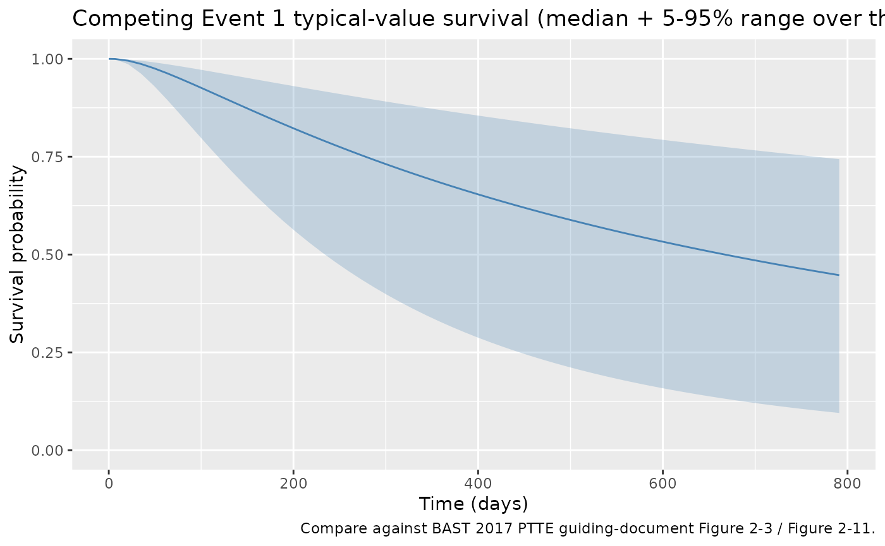
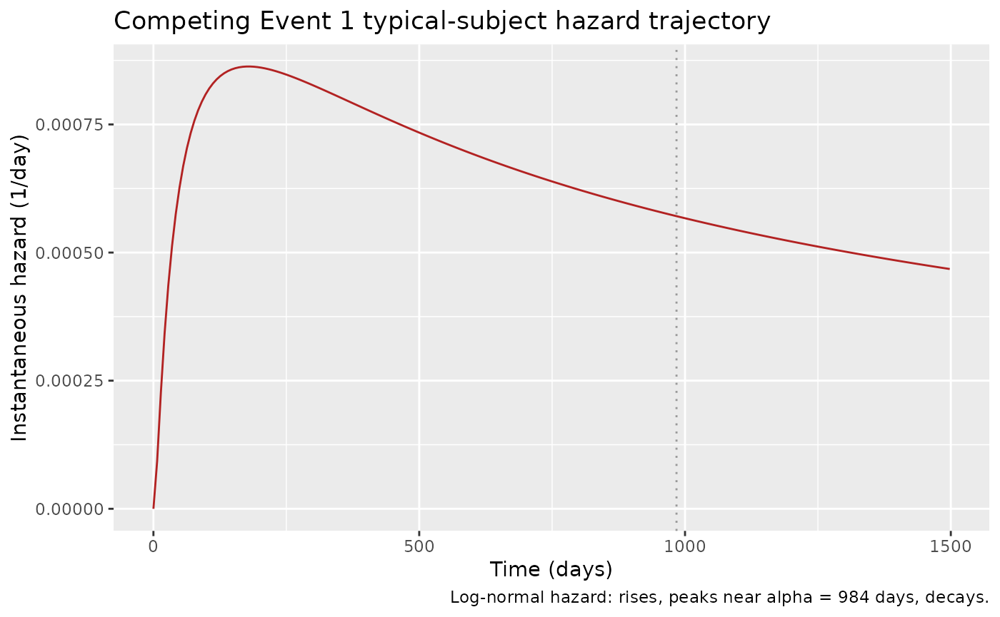
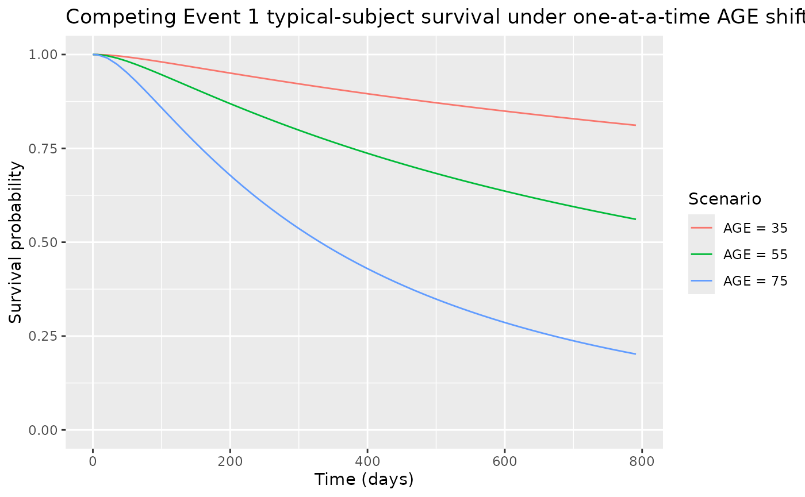

# DDMoRe: tte lognormal

## Model and source

- Citation: BAST Inc Limited. BAST approach to parametric time-to-event
  (PTTE) modelling. Loughborough, UK; 12 July 2017. Internal guiding
  document (BAST_PTTE_modelling.pdf) shipped with DDMORE bundle
  DDMODEL00000243; no peer-reviewed publication. Run prepared by Jon
  Moss (Command.txt; runCOMPEV1_101). DDMORE Foundation Model
  Repository: DDMODEL00000243.
- Description: Parametric time-to-event log-normal hazard model for
  Competing Event 1 in the BAST PTTE 2017 four-event teaching dataset
  (DDMODEL00000243). Hazard h(t) = val \* pdf(t) / (1 -
  Phi(log((t+DEL)/alpha) / lambda)), where pdf(t) is the log-normal
  probability density with shape lambda (sigma) and time-scale alpha,
  val = exp((coef_age/1000) \* (AGE - 55)) is the multiplicative AGE
  effect, and Phi is the standard normal CDF. Competing Event 1 is
  interval-censored; the BAST guiding-document Section 2.4.1 (Figure
  2-3) selected log-normal as the base distribution, then Section 2.4.2
  (Table 2-4) retained AGE as the only covariate.
- Source: BAST Inc Limited, “BAST approach to parametric time-to-event
  (PTTE) modelling,” internal guiding document, 12 July 2017
  (`BAST_PTTE_modelling.pdf` shipped in the DDMORE bundle).
- DDMORE Foundation Model Repository entry:
  [DDMODEL00000243](https://repository.ddmore.eu/model/DDMODEL00000243)
- Source bundle (local mirror): `dpastoor/ddmore_scraping/243/`
- Linked publication: **none.** The bundle is a methodological teaching
  example built on entirely simulated data; the BAST guiding-document
  text states “there is not yet a publication to go along with the
  model” (`Model_Accommodations.txt`).

This vignette validates the BAST 2017 PTTE Competing Event 1 hazard
model packaged under `inst/modeldb/ddmore/NA_NA_tte_lognormal.R` (NONMEM
run name `runCOMPEV1_101`). Competing Event 1 in the bundle is
interval-censored; the BAST guiding document Section 2.4.1 (Figure 2-3)
selected log-normal as the base distribution by AIC, and Section 2.4.2
(Table 2-4) retained AGE as the only covariate.

For sibling Event 1, Event 2, and Competing Event 2 hazard models from
the same bundle, see `NA_NA_tte_gompertz.R`, `NA_NA_tte_gompertz_ev2.R`,
and `NA_NA_tte_loglogistic.R`.

## Population

The BAST 2017 PTTE bundle is a methodological teaching example with N =
200 simulated patients, four timed event types, and six baseline
covariates (BAST Section 2.2.2). Of the 200 simulated patients, 36 (18%)
experienced Competing Event 1 (BAST Table 2-1) – the lowest event
incidence of the four event types. Competing Event 1 is **interval-
censored**: exact event times are unknown, only that the event occurred
between two scheduled assessment visits.

``` r

m <- readModelDb("NA_NA_tte_lognormal")
str(m()$meta$population, max.level = 1)
#> List of 10
#>  $ n_subjects    : int 200
#>  $ n_studies     : int 1
#>  $ age_range     : chr "24-84 years (mean 58.7) in the BAST PTTE 2017 simulated cohort"
#>  $ weight_range  : chr "not reported (the BAST PTTE 2017 simulated cohort does not include body weight)"
#>  $ sex_female_pct: num NA
#>  $ race_ethnicity: NULL
#>  $ disease_state : chr "Hypothetical / unspecified clinical population (the BAST PTTE 2017 guiding document is a methodological teachin"| __truncated__
#>  $ dose_range    : chr "Not applicable (no drug administration is modelled)."
#>  $ regions       : chr "Not applicable (simulated data)."
#>  $ notes         : chr "200 simulated patients; 36 (18%) had Competing Event 1. Competing Event 1 is interval-censored: exact event tim"| __truncated__
```

## Source trace

| Equation / parameter | Value | Source location |
|----|----|----|
| Hazard form `h(t) = val * pdf(t) / (1 - Phi(num))` | n/a | Executable_runCOMPEV1_101.mod \$PK / \$DES (`pdf = (1/(fac*lambda*(T+DEL)))*exp(-(num**2)/(2*lambda*lambda))`, `DADT(1) = VAL*pdf/(1-phi(num/lambda))`); BAST guiding doc Section 2.4.1 confirms log-normal selected |
| `llambda_compev1` (sigma) | log(1.42) | Output_simulated_runCOMPEV1_101.res FINAL TH1 = 1.42E+00; not rescaled |
| `lalpha_compev1` (median scale) | log(984) | Output_simulated_runCOMPEV1_101.res FINAL TH2 = 9.84E+02; not rescaled |
| `e_age_compev1` (AGE coefficient) | 50.9 | Output_simulated_runCOMPEV1_101.res FINAL TH3 = 5.09E+01; rescaled by /1000, applied to `(AGE - 55)` |
| eta on `lambda` (`OMEGA(1,1)`) | 0 FIXED | Output_simulated_runCOMPEV1_101.res FINAL OMEGA(1,1) = 0.00E+00 (placeholder; no estimated IIV) |
| Covariate-selection DeltaOFV | -14.822 | BAST guiding doc Section 2.4.2, Table 2-4 (AGE chosen as final covariate model COMPEV1_101) |

## Virtual cohort

``` r

set.seed(20260506)

n_subjects <- 50
cohort_subjects <- tibble(
  id  = seq_len(n_subjects),
  AGE = pmin(pmax(round(rnorm(n_subjects, mean = 58.7, sd = 12)), 24), 84)
)

obs_grid <- tibble(
  time = c(0, seq(7, 800, by = 14)),
  evid = 0L,
  amt  = 0
)

events <- tidyr::crossing(cohort_subjects, obs_grid)
events <- events[, c("id", "time", "evid", "amt", "AGE")]

stopifnot(!anyDuplicated(unique(events[, c("id", "time", "evid")])))
cat("Cohort: ", n_subjects, " subjects, ", nrow(events), " event rows\n", sep = "")
#> Cohort: 50 subjects, 2900 event rows
```

## Simulation

``` r

sim <- rxode2::rxSolve(m, events = events) |>
  as.data.frame()
```

## Replicate published behaviour – typical-value survival trajectory

The BAST guiding document Section 2.4.1 (Figure 2-3) reports a
Kaplan-Meier curve of Competing Event 1 vs. the candidate parametric
distributions; log-normal was chosen (AIC -2.144 vs. exponential 0). The
covariate- VPC stratifications by patient age (Figure 2-11, Figure 2-12)
cover the window 0 – 400 days. Competing Event 1 has the slowest event
rate of the four events; at the typical AGE (55 years), the model’s
typical-value survival drops from `S(0) = 1` to about `S(800) ~= 0.57`.

``` r

sim |>
  group_by(time) |>
  summarise(
    median_sur = median(sur),
    q05        = quantile(sur, 0.05),
    q95        = quantile(sur, 0.95),
    .groups    = "drop"
  ) |>
  ggplot(aes(time, median_sur)) +
  geom_ribbon(aes(ymin = q05, ymax = q95), alpha = 0.25, fill = "steelblue") +
  geom_line(colour = "steelblue") +
  labs(
    x        = "Time (days)",
    y        = "Survival probability",
    title    = "Competing Event 1 typical-value survival (median + 5-95% range over the virtual cohort)",
    caption  = "Compare against BAST 2017 PTTE guiding-document Figure 2-3 / Figure 2-11."
  ) +
  scale_y_continuous(limits = c(0, 1))
```



## Mechanistic sanity checks (verification-checklist Section F.3)

### F.3.1 – Hazard has the characteristic log-normal shape (rises then falls)

The log-normal hazard rises from 0 at `t = 0`, peaks near `t = alpha`
(the median time scale), and decays at long times. The check below
confirms this characteristic non-monotonic shape for a typical subject.

``` r

ev_typ <- tibble(id = 1L, time = c(0, seq(7, 1500, by = 7)),
                 evid = 0L, amt = 0, AGE = 55)
sim_typ <- rxode2::rxSolve(m, events = ev_typ) |> as.data.frame()
ggplot(sim_typ, aes(time, hazard)) +
  geom_line(colour = "firebrick") +
  geom_vline(xintercept = 984, colour = "grey60", linetype = "dotted") +
  labs(x = "Time (days)", y = "Instantaneous hazard (1/day)",
       title = "Competing Event 1 typical-subject hazard trajectory",
       caption = "Log-normal hazard: rises, peaks near alpha = 984 days, decays.")
```



``` r


# The hazard at the peak should be larger than at both early (t = 50)
# and late (t = 1500) times.
hazard_peak  <- max(sim_typ$hazard)
hazard_early <- sim_typ$hazard[sim_typ$time == 50]
hazard_late  <- sim_typ$hazard[sim_typ$time == 1500]
stopifnot(hazard_peak > hazard_early)
stopifnot(hazard_peak > hazard_late)
```

### F.3.2 – Older patients have higher hazard (positive AGE coefficient)

The BAST guiding document Section 2.4.2 (Table 2-4) reports a +50.9
coefficient on the centred `(AGE - 55)/1000` term, meaning older
patients have a higher hazard. The check below confirms the simulated
trajectories shift in the expected direction.

``` r

make_alt <- function(label, age) {
  tibble(id = match(label, c("AGE = 35", "AGE = 55", "AGE = 75")),
         time = c(0, seq(7, 800, by = 14)),
         evid = 0L, amt = 0, AGE = age, scenario = label)
}
scenarios <- bind_rows(
  make_alt("AGE = 35", 35),
  make_alt("AGE = 55", 55),
  make_alt("AGE = 75", 75)
)
sim_scen <- rxode2::rxSolve(m, events = scenarios, keep = c("scenario")) |>
  as.data.frame()

ggplot(sim_scen, aes(time, sur, colour = scenario)) +
  geom_line() +
  labs(x = "Time (days)", y = "Survival probability",
       title = "Competing Event 1 typical-subject survival under one-at-a-time AGE shifts",
       colour = "Scenario") +
  scale_y_continuous(limits = c(0, 1))
```



``` r


final_sur <- sim_scen |>
  filter(time == max(time)) |>
  select(scenario, sur)
print(final_sur)
#>   scenario       sur
#> 1 AGE = 35 0.8115650
#> 2 AGE = 55 0.5610974
#> 3 AGE = 75 0.2020340

young_sur <- final_sur$sur[final_sur$scenario == "AGE = 35"]
ref_sur   <- final_sur$sur[final_sur$scenario == "AGE = 55"]
old_sur   <- final_sur$sur[final_sur$scenario == "AGE = 75"]

# Older patients -> higher hazard -> lower survival
stopifnot(old_sur < ref_sur)
stopifnot(young_sur > ref_sur)
```

### F.3.3 – Final-fit objective-function value matches the bundle

`Output_simulated_runCOMPEV1_101.res` reports `OBJV = 360253.678` at the
final estimates. This value is informational here.

## Self-consistency with the bundle’s simulated dataset (F.2)

A full F.2 self-consistency check would re-simulate the bundle’s shipped
`Simulated_event_data.csv` (200 subjects, DVID = 3 records) under the
nlmixr2lib model and compare against the bundle’s
`Output_simulated_runCOMPEV1_101.res` `$TABLE` output. The bundle
dataset is outside this package and not redistributed.

## Assumptions and deviations

- **Numerical rescalings preserved.** The .mod uses an internal /1000
  rescaling on the AGE coefficient only; lambda and alpha enter the
  hazard at their raw THETA values. The biologically meaningful values
  are:

  - Log-normal lambda (sigma): 1.42 (unitless)
  - Log-normal alpha (median time scale): 984 days
  - AGE coefficient: 50.9 / 1000 = 0.0509 per year above 55

- **[`pnorm()`](https://rdrr.io/r/stats/Normal.html) used in place of
  NONMEM
  [`phi()`](https://nlmixr2.github.io/rxode2/reference/phi.html).** The
  .mod \$DES uses NONMEM’s intrinsic
  [`phi()`](https://nlmixr2.github.io/rxode2/reference/phi.html) for the
  standard normal CDF. rxode2’s equivalent is
  [`pnorm()`](https://rdrr.io/r/stats/Normal.html); the two are
  mathematically identical.

- **Small-time offset DEL = 1e-8 preserved.** The .mod \$DES adds a
  small offset to t inside `log((t+DEL)/alpha)` to keep the expression
  finite at `t = 0`. We preserve the offset.

- **No estimated IIV.** The source `$OMEGA` is `0 FIX`. No inter-
  subject variability is in the BAST PTTE 2017 guiding-document model.

- **Interval-censored event times.** Competing Event 1 events are
  observed only between scheduled assessment visits. The packaged
  nlmixr2lib model is intended for forward simulation; users who want to
  honour the interval-censoring convention should snap simulated event
  times to the next assessment visit (BAST guiding doc Section 2.3.3).

- **No publication-PDF cross-check.** The BAST PTTE 2017 guiding
  document is the only source of equations and methodological narrative;
  no peer-reviewed publication exists.

- **Convention warning.**
  [`nlmixr2lib::checkModelConventions()`](https://nlmixr2.github.io/nlmixr2lib/reference/checkModelConventions.md)
  flags the `units$concentration` field (the TTE output `sur` is a
  survival probability, not a mass/volume concentration). The
  compartment is named `cumhaz` (canonical TTE auxiliary-state name).
