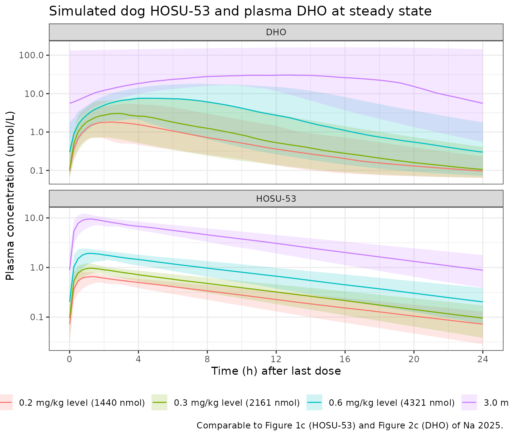
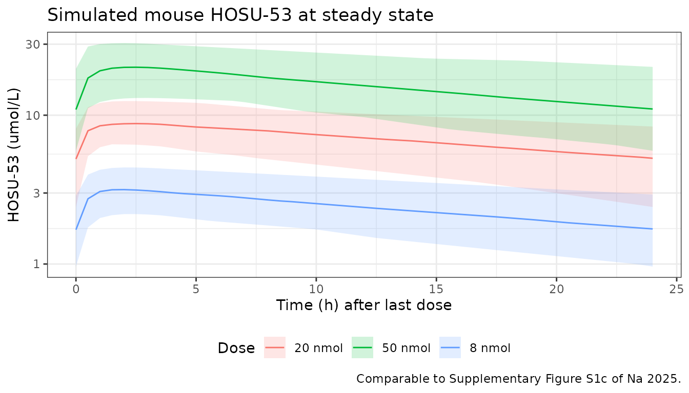

# HOSU-53 (JBZ-001) DHODH inhibition in mouse and dog (Na 2025)

## Model and source

Na 2025 reports two independently fitted preclinical population PK/PD
models for the oral dihydroorotate dehydrogenase (DHODH) inhibitor
HOSU-53 (JBZ-001) and its plasma pharmacodynamic biomarker
dihydroorotate (DHO) – one in mice and one in beagle dogs. Following the
“replicate the author’s structure” policy each is a separate model file,
and this single vignette walks the paper as a unit.

``` r

dog_mod   <- readModelDb("Na_2025_hosu53_dog")
mouse_mod <- readModelDb("Na_2025_hosu53_mouse")
dog_ui    <- rxode2::rxode(dog_mod)
#> ℹ parameter labels from comments will be replaced by 'label()'
mouse_ui  <- rxode2::rxode(mouse_mod)
#> ℹ parameter labels from comments will be replaced by 'label()'
```

- Citation: Na JY, Hai M, Kim K, Vibhute SM, Bennett CE, Coss CC, Phelps
  MA. Translational Pharmacokinetic-Pharmacodynamic Modeling of a Novel
  Oral Dihydroorotate Dehydrogenase (DHODH) Inhibitor, HOSU-53
  (JBZ-001). Pharmaceutics. 2025;17(4):412.
  <doi:10.3390/pharmaceutics17040412>
- Article: <https://doi.org/10.3390/pharmaceutics17040412>
- Dog model: `Na_2025_hosu53_dog` (Na 2025 Table 3)
- Mouse model: `Na_2025_hosu53_mouse` (Na 2025 Supplementary Table S3)

A rat dataset was collected but Na 2025 Section 3.3 explicitly excluded
it from the population modelling because dose proportionality was not
met, so there is no rat model file. Na 2025 also reports whole-body PBPK
models built in PK-Sim v11.0; those are not extracted here (see
*Assumptions and deviations*).

## Population

The dog model was built from 507 HOSU-53 PK samples and 431 plasma DHO
PD samples in 39 male and female beagle dogs across four studies at 0.2,
0.3, 0.6, and 3 mg/kg PO (8, 12, 10, and 9 dogs respectively), with an
initial single-dose study at 10 mg/kg PO and 3 mg/kg IV. The 1 mg/kg PO
once-daily arm of the 28-day GLP study was excluded from the modelling
dataset because of adverse gastrointestinal findings (Na 2025 Section
3.1). 92 of the 431 DHO samples (21.3%), including pre-dose samples,
were below the limit of quantification and were excluded.

The mouse model was built from 309 PK samples and 253 PD samples in 45
mice across three studies at 3 mg/kg IV and 4 and 10 mg/kg PO (9, 9, and
27 mice), a mixture of non-tumour-bearing mice and
triple-immunodeficient NCG mice carrying MOLM-13 disseminated AML
xenografts. Fewer than 4% of DHO samples were below the limit of
quantification.

Study-level detail is in Na 2025 Supplementary Table S1. Both models
were fitted with the SAEM algorithm in Monolix 2024R1 and evaluated by
goodness-of-fit plots, prediction-corrected VPCs, and a nonparametric
bootstrap.

``` r

str(dog_ui$population, max.level = 1)
#> List of 13
#>  $ species      : chr "beagle dog"
#>  $ n_subjects   : int 39
#>  $ n_studies    : int 4
#>  $ n_pk_samples : int 507
#>  $ n_pd_samples : int 431
#>  $ sex          : chr "male and female"
#>  $ disease_state: chr "healthy beagle dogs (non-GLP PK/PD and GLP toxicokinetic/toxicodynamic studies)"
#>  $ dose_range   : chr "0.2, 0.3, 0.6, and 3 mg/kg PO (0.2/0.3/0.6/3 mg/kg = 8/12/10/9 dogs); an initial single-dose study used 10 mg/k"| __truncated__
#>  $ excluded_arms: chr "The 1 mg/kg PO QD arm of the 28-day GLP study was excluded from the modelling dataset because of adverse findin"| __truncated__
#>  $ blq_handling : chr "No HOSU-53 PK samples were below the limit of quantification (excluding pre-dose). 92 of 431 DHO PD samples (21"| __truncated__
#>  $ assay_range  : chr "UHPLC-MS/MS calibration range 5.0-5000 ng/mL for HOSU-53 and 10.0-30,000 ng/mL for DHO in dog plasma (Na 2025 S"| __truncated__
#>  $ noael        : chr "0.6 mg/kg PO QD in the 28-day GLP repeat-dose study; the highest non-severely toxic dose (HNSTD) was 0.6 mg/kg/"| __truncated__
#>  $ notes        : chr "Study-level detail is in Na 2025 Supplementary Table S1. Modelling was performed with the SAEM algorithm in Mon"| __truncated__
```

## Model structure

Both species share the same structure: two-compartment disposition with
first-order absorption, logit-normal bioavailability and linear
elimination (Na 2025 Section 2.5), coupled to an indirect-response
turnover model for plasma DHO in which HOSU-53 inhibits DHO degradation
(Na 2025 Section 3.4, printed equation):

``` math
\frac{dR}{dt} \;=\; k_{in} \;-\; k_{out}\cdot\left(1 - \frac{C_p^{\gamma}}{C_p^{\gamma} + IC_{50}^{\gamma}}\right)\cdot R,
\qquad k_{in} = R_0 \cdot k_{out}, \qquad R(0) = R_0
```

The printed final-model equation carries no $`I_{max}`$ term,
i.e. $`I_{max} = 1`$; the general form with $`I_{max}`$ appears only in
Section 2.11 (the human prediction). It is encoded as
`limax <- fixed(log(1))` so the structure stays explicit.

### Units

Na 2025 reports the volumes in mL and mL/h (Table 3, Table S3) and both
concentrations in umol/L (Table 3 units for `R0` and `IC50`; the Figure
1 and Figure 2 axis labels). The model amount unit is therefore
**nmol**, because nmol / mL = umol/L. The paper does not state the
dose-amount unit used in its Monolix dataset and does not report the
HOSU-53 molecular weight, so mg/kg doses cannot be converted to model
units from on-disk sources. Simulated doses below are given in model
amount units and anchored to a published observation (see *Dog dose
anchoring*).

``` r

dog_ui$units
#> $time
#> [1] "h"
#> 
#> $dosing
#> [1] "nmol"
#> 
#> $concentration
#> [1] "umol/L"
```

## Source trace

The per-parameter origin is recorded as an in-file comment next to each
`ini()` entry in `inst/modeldb/specificDrugs/Na_2025_hosu53_dog.R` and
`inst/modeldb/specificDrugs/Na_2025_hosu53_mouse.R`. The table below
collects them in one place.

| Equation / parameter | Dog value | Mouse value | Source location |
|----|----|----|----|
| Two-compartment PK, first-order absorption, linear elimination | – | – | Section 3.3 (“two-compartment disposition models with first-order absorption and linear elimination”) |
| DHO turnover with degradation inhibition (`d/dt(dho)`) | – | – | Section 3.4, printed equation (p. 10) |
| `logitfdepot` (F) | 0.67 | 0.53 | Table 3 / Table S3, row “F (%)”; logit scale per Section 2.5 |
| `lka` (Ka, 1/h) | 1.53 | 1.0 | Table 3 / Table S3, row “Ka (/h)” |
| `lcl` (CL, mL/h) | 150 (fixed) | 0.07 | Table 3 / Table S3, row “CL/F (mL/h)” |
| `lvc` (V1, mL) | 980 (fixed) | 1.2 | Table 3 / Table S3, row “V1 (mL)” |
| `lq` (Q, mL/h) | 400 (fixed) | 1.6 | Table 3 / Table S3, row “Q (mL/h)” |
| `lvp` (V2, mL) | 490 (fixed) | 1.2 | Table 3 / Table S3, row “V2 (mL)” |
| `lrbase` (R0, umol/L) | 0.06 | 0.01 | Table 3 / Table S3, row “R0 (umol/L)” |
| `lkout` (Kout, 1/h) | 52 | 155 | Table 3 / Table S3, row “Kout (/h)” |
| `lic50` (IC50, umol/L) | 0.1 | 1.55 | Table 3 / Table S3, row “IC50 (umol/L)” |
| `lhill` (gamma) | 1.9 | 1.71 | Table 3 / Table S3, row “gamma” |
| `limax` (Imax) | 1 (fixed) | 1 (fixed) | Section 3.4 equation carries no Imax term |
| `etalogitfdepot` | 0.24 (SD) | not estimated | Table 3, row “IIV F” |
| `etalka` | 0.59 (SD) | not estimated | Table 3, row “IIV Ka” |
| `etalcl` | 0.2 (SD, fixed) | 0.32 (SD) | Table 3 / Table S3, row “IIV CL” |
| `etalvc` | not estimated | 0.53 (SD) | Table S3, row “IIV V1” |
| `etalvp` | not estimated | 0.16 (SD) | Table S3, row “IIV V2” |
| `etalkout` | 0.42 (SD) | 0.62 (SD) | Table 3 / Table S3, row “IIV Kout” |
| `etalic50` | 0.44 (SD) | 0.53 (SD) | Table 3 / Table S3, row “IIV IC50” |
| `addSd` | 0.0033 (fixed) | not in model | Table 3, row “Additive residual error (PK)” |
| `propSd` | 0.45 (fixed) | 0.18 | Table 3 / Table S3, row “Proportional residual error (PK)” |
| `propSd_dho` | 0.55 | 0.46 | Table 3 / Table S3, row “Proportional residual error (PD)” |

Na 2025 was fitted in Monolix, whose results table reports `omega` on
the **standard-deviation** scale of the random effect – the same scale
as the “proportional residual error” rows of the same tables, which are
the SD-scale `b` parameter of the Monolix error model. `nlmixr2`’s
`ini()` takes the variance, so each tabulated omega is squared in the
model files (`etalka ~ 0.59^2`).

``` r

show_ini <- function(ui, species) {
  ui$iniDf |>
    dplyr::transmute(
      Species   = species,
      Parameter = name,
      Estimate  = ifelse(is.na(est), NA_real_, est),
      Fixed     = fix,
      Label     = ifelse(is.na(label), "", label)
    )
}
dplyr::bind_rows(show_ini(dog_ui, "dog"), show_ini(mouse_ui, "mouse")) |>
  knitr::kable(digits = 4, caption = "ini() entries of both packaged models.")
```

| Species | Parameter | Estimate | Fixed | Label |
|:---|:---|---:|:---|:---|
| dog | logitfdepot | 0.7082 | FALSE | Logit of oral bioavailability F (unitless; F = 0.67) |
| dog | lka | 0.4253 | FALSE | First-order absorption rate constant (Ka, 1/h) |
| dog | lcl | 5.0106 | TRUE | Clearance (CL, mL/h) |
| dog | lvc | 6.8876 | TRUE | Central volume of distribution (V1, mL) |
| dog | lq | 5.9915 | TRUE | Intercompartmental clearance (Q, mL/h) |
| dog | lvp | 6.1944 | TRUE | Peripheral volume of distribution (V2, mL) |
| dog | lrbase | -2.8134 | FALSE | Baseline (steady-state) plasma DHO concentration (R0, umol/L) |
| dog | lkout | 3.9512 | FALSE | First-order DHO degradation rate constant (Kout, 1/h) |
| dog | lic50 | -2.3026 | FALSE | HOSU-53 concentration giving half-maximal inhibition of DHO degradation (IC50, umol/L) |
| dog | lhill | 0.6419 | FALSE | Sigmoidicity (Hill) exponent of the inhibitory function (gamma, unitless) |
| dog | limax | 0.0000 | TRUE | Maximum fractional inhibition of DHO degradation (Imax, unitless) |
| dog | addSd | 0.0033 | TRUE | Additive residual SD for HOSU-53 (umol/L) |
| dog | propSd | 0.4500 | TRUE | Proportional residual SD for HOSU-53 (fraction) |
| dog | propSd_dho | 0.5500 | FALSE | Proportional residual SD for plasma DHO (fraction) |
| dog | etalogitfdepot | 0.0576 | FALSE | Table 3 (IIV F = 0.24, RSE 60.1%) |
| dog | etalka | 0.3481 | FALSE | Table 3 (IIV Ka = 0.59, RSE 20.1%) |
| dog | etalcl | 0.0400 | TRUE | Table 3 (IIV CL = 0.2, from the IV-only fit) |
| dog | etalkout | 0.1764 | FALSE | Table 3 (IIV Kout = 0.42, RSE 14.9%) |
| dog | etalic50 | 0.1936 | FALSE | Table 3 (IIV IC50 = 0.44, RSE 12.9%) |
| mouse | logitfdepot | 0.1201 | FALSE | Logit of oral bioavailability F (unitless; F = 0.53) |
| mouse | lka | 0.0000 | FALSE | First-order absorption rate constant (Ka, 1/h) |
| mouse | lcl | -2.6593 | FALSE | Clearance (CL, mL/h) |
| mouse | lvc | 0.1823 | FALSE | Central volume of distribution (V1, mL) |
| mouse | lq | 0.4700 | FALSE | Intercompartmental clearance (Q, mL/h) |
| mouse | lvp | 0.1823 | FALSE | Peripheral volume of distribution (V2, mL) |
| mouse | lrbase | -4.6052 | FALSE | Baseline (steady-state) plasma DHO concentration (R0, umol/L) |
| mouse | lkout | 5.0434 | FALSE | First-order DHO degradation rate constant (Kout, 1/h) |
| mouse | lic50 | 0.4383 | FALSE | HOSU-53 concentration giving half-maximal inhibition of DHO degradation (IC50, umol/L) |
| mouse | lhill | 0.5365 | FALSE | Sigmoidicity (Hill) exponent of the inhibitory function (gamma, unitless) |
| mouse | limax | 0.0000 | TRUE | Maximum fractional inhibition of DHO degradation (Imax, unitless) |
| mouse | propSd | 0.1800 | FALSE | Proportional residual SD for HOSU-53 (fraction) |
| mouse | propSd_dho | 0.4600 | FALSE | Proportional residual SD for plasma DHO (fraction) |
| mouse | etalcl | 0.1024 | FALSE | Table S3 (IIV CL = 0.32, RSE 11.6%) |
| mouse | etalvc | 0.2809 | FALSE | Table S3 (IIV V1 = 0.53, RSE 12.1%) |
| mouse | etalvp | 0.0256 | FALSE | Table S3 (IIV V2 = 0.16, RSE 41.8%) |
| mouse | etalkout | 0.3844 | FALSE | Table S3 (IIV Kout = 0.62, RSE 12.7%) |
| mouse | etalic50 | 0.2809 | FALSE | Table S3 (IIV IC50 = 0.53, RSE 8.9%) |

ini() entries of both packaged models. {.table}

## Structural identity checks

These checks are exact consequences of the published equations, so they
are asserted rather than eyeballed. All simulations here are
typical-value (`omega = NA`, `sigma = NA`).

``` r

# Both models carry two residual-error endpoints (`Cc` and `dho`), and rxode2
# appends one pseudo-compartment per endpoint AFTER the ODE states, then
# requires every observation row to select one of them. The selector is `dvid`,
# not `cmt`: with `dvid` absent, an observation row naming an ODE state fails
# with "'dvid'->'cmt' or 'cmt' on observation record". Naming a single endpoint
# is sufficient -- rxSolve returns every output column (both `Cc` and `dho`) on
# those rows regardless of which endpoint `dvid` selects. So observation rows
# keep an ODE-state name in `cmt` and carry `dvid = 1L`; naming an algebraic
# observable in `cmt` instead would auto-inject a `cmt()` slot for it and
# renumber the ODE states, which is the failure mode this avoids.
add_obs <- function(ev, times) {
  rxode2::et(ev, times, cmt = "central")
}
with_dvid <- function(ev) {
  d <- as.data.frame(ev)
  d$dvid <- ifelse(d$evid == 0, 1L, NA_integer_)
  d
}
solve_typical <- function(mod, ev) {
  out <- rxode2::rxSolve(mod, with_dvid(ev), omega = NA, sigma = NA,
                         returnType = "data.frame")
  out[!duplicated(out$time), , drop = FALSE]
}
trap_auc <- function(time, conc) {
  sum(diff(time) * (utils::head(conc, -1) + utils::tail(conc, -1)) / 2)
}
```

### 1. Terminal half-life matches the analytic two-compartment solution

``` r

analytic_thalf <- function(cl, vc, q, vp) {
  k10 <- cl / vc; k12 <- q / vc; k21 <- q / vp
  s <- k10 + k12 + k21
  log(2) / (0.5 * (s - sqrt(s^2 - 4 * k21 * k10)))
}
thalf_dog_analytic   <- analytic_thalf(150, 980, 400, 490)
thalf_mouse_analytic <- analytic_thalf(0.07, 1.2, 1.6, 1.2)

sim_thalf <- function(mod, amt, tmax, tfit) {
  s <- solve_typical(mod, add_obs(rxode2::et(amt = amt, cmt = "central"),
                                  seq(0, tmax, by = tmax / 2000)))
  s <- s[s$time >= tfit & s$Cc > 0, ]
  unname(log(2) / -stats::coef(stats::lm(log(Cc) ~ time, data = s))[2])
}
thalf_dog_sim   <- sim_thalf(dog_mod,   20000, 96,  48)
#> ℹ parameter labels from comments will be replaced by 'label()'
thalf_mouse_sim <- sim_thalf(mouse_mod, 20,    336, 168)
#> ℹ parameter labels from comments will be replaced by 'label()'

stopifnot(
  abs(thalf_dog_sim   - thalf_dog_analytic)   < 0.01 * thalf_dog_analytic,
  abs(thalf_mouse_sim - thalf_mouse_analytic) < 0.01 * thalf_mouse_analytic
)
c(dog_analytic = thalf_dog_analytic, dog_simulated = thalf_dog_sim,
  mouse_analytic = thalf_mouse_analytic, mouse_simulated = thalf_mouse_sim)
#>    dog_analytic   dog_simulated  mouse_analytic mouse_simulated 
#>        7.100397        7.100397       24.027819       24.027781
```

### 2. Bioavailability is recovered exactly from the AUC ratio

`f(depot) <- fdepot` must make the oral-to-intravenous AUC ratio equal
the tabulated `F` for these linear models.

``` r

auc_route <- function(mod, cmtname, amt, tmax) {
  s <- solve_typical(mod, add_obs(rxode2::et(amt = amt, cmt = cmtname),
                                  seq(0, tmax, by = tmax / 4000)))
  trap_auc(s$time, s$Cc)
}
# Integrate over ~25 terminal half-lives per species. A much longer window
# lets the tail decay into solver noise and corrupts the trapezoid.
f_dog_recovered   <- auc_route(dog_mod,   "depot", 20000, 180) /
                     auc_route(dog_mod,   "central", 20000, 180)
f_mouse_recovered <- auc_route(mouse_mod, "depot", 20, 600) /
                     auc_route(mouse_mod, "central", 20, 600)

stopifnot(abs(f_dog_recovered   - 0.67) < 1e-3,
          abs(f_mouse_recovered - 0.53) < 1e-3)
c(dog = f_dog_recovered, mouse = f_mouse_recovered)
#>       dog     mouse 
#> 0.6699638 0.5298614
```

### 3. DHO holds at baseline with no drug on board

`kin = R0 * kout` and `dho(0) <- rbase` must make the undosed turnover
system sit exactly at `R0`.

``` r

hold <- function(mod) {
  s <- solve_typical(mod, add_obs(rxode2::et(), seq(0, 240, by = 1)))
  range(s$dho)
}
hold_dog   <- hold(dog_mod)
hold_mouse <- hold(mouse_mod)
stopifnot(all(abs(hold_dog - 0.06) < 1e-8), all(abs(hold_mouse - 0.01) < 1e-8))
rbind(dog = hold_dog, mouse = hold_mouse)
#>       [,1] [,2]
#> dog   0.06 0.06
#> mouse 0.01 0.01
```

### 4. The DHO rise rate is capped by kin

Because the drug acts only on the *loss* term, the fastest DHO can rise
– even under complete DHODH inhibition – is `kin = R0 * kout`. This is
what makes the dog response markedly slower than its `kout` of 52/h
would suggest.

``` r

kin_dog   <- 0.06 * 52
kin_mouse <- 0.01 * 155
max_rise <- function(mod, amt) {
  s <- solve_typical(mod, add_obs(rxode2::et(amt = amt, cmt = "depot"),
                                  seq(0, 48, by = 0.01)))
  max(diff(s$dho) / diff(s$time))
}
# Deliberately supra-therapeutic amounts, so the inhibition term saturates and
# the rise rate is pushed against its kin ceiling.
rise_dog   <- max_rise(dog_mod,   240000)
rise_mouse <- max_rise(mouse_mod, 1000)
stopifnot(rise_dog <= kin_dog * 1.001, rise_mouse <= kin_mouse * 1.001)
data.frame(
  species  = c("dog", "mouse"),
  kin      = c(kin_dog, kin_mouse),
  max_rise = c(rise_dog, rise_mouse)
) |>
  knitr::kable(digits = 3, caption = "Maximum simulated dDHO/dt versus the kin ceiling (umol/L/h).")
```

| species |  kin | max_rise |
|:--------|-----:|---------:|
| dog     | 3.12 |    3.120 |
| mouse   | 1.55 |    1.492 |

Maximum simulated dDHO/dt versus the kin ceiling (umol/L/h). {.table}

## Dog dose anchoring

Model amounts are in nmol and the mg/kg-to-nmol conversion is
unpublished (see *Units*). To place the simulations on the scale the
dogs were actually studied at, the top dog arm is anchored to a
**published observation**: Na 2025 Section 4 reports a maximum observed
plasma DHO of about 5850 ng/mL in dogs. Converting that to the model’s
umol/L needs the molecular weight of dihydroorotic acid, 158.11 g/mol –
a standard chemical constant for C5H6N2O4, **not** a value taken from Na
2025 (see *Assumptions and deviations*) – giving 37.0 umol/L. The
once-daily amount whose steady-state DHO Cmax equals that value is
solved for below and treated as the 3 mg/kg arm; the remaining arms are
scaled by the published dose ratios (0.2 : 0.3 : 0.6 : 3 mg/kg).

Two things this anchoring is **not**. It is not a molecular-weight
conversion – the mg/kg labels below identify which published dose
*level* each arm represents, and the nmol amount beside them is a
simulation scale, not a verified equivalent. And it assumes the paper’s
maximum observed dog DHO came from the highest included dog arm (3 mg/kg
once daily), which Na 2025 does not state explicitly. Everything
downstream that depends on absolute dose is therefore conditional on
that assumption; the half-life, bioavailability, dose-proportionality,
and baseline checks are not.

``` r

dho_cmax_ss <- function(amt, ndose = 6L) {
  ev <- add_obs(rxode2::et(amt = amt, cmt = "depot", ii = 24, addl = ndose - 1L),
                seq(24 * (ndose - 1L), 24 * ndose, by = 0.1))
  max(solve_typical(dog_mod, ev)$dho)
}
# 5850 ng/mL is Na 2025 Section 4. The 158.11 g/mol divisor is the standard
# molecular weight of dihydroorotic acid (C5H6N2O4), NOT a paper-reported value.
dho_target <- 5850 / 158.11   # umol/L
dog_top_amt <- stats::uniroot(
  function(a) dho_cmax_ss(a) - dho_target,
  interval = c(5000, 60000), tol = 50
)$root

dog_arms <- tibble::tibble(
  mgkg = c(0.2, 0.3, 0.6, 3),
  amt  = round(dog_top_amt * mgkg / 3)
) |>
  dplyr::mutate(treatment = sprintf("%.1f mg/kg level (%.0f nmol)", mgkg, amt))
dog_arms |>
  dplyr::rename("Published dose level (mg/kg)" = mgkg,
                "Model amount (nmol)" = amt,
                "Arm label" = treatment) |>
  knitr::kable(digits = 1, caption = "Anchored dog dose arms.")
```

| Published dose level (mg/kg) | Model amount (nmol) | Arm label |
|---:|---:|:---|
| 0.2 | 1440 | 0.2 mg/kg level (1440 nmol) |
| 0.3 | 2161 | 0.3 mg/kg level (2161 nmol) |
| 0.6 | 4321 | 0.6 mg/kg level (4321 nmol) |
| 3.0 | 21606 | 3.0 mg/kg level (21606 nmol) |

Anchored dog dose arms. {.table}

## Virtual cohorts and simulation

Original observed data are not publicly available. No covariate was
retained in either final model (Na 2025 Section 3.3), so the virtual
cohorts carry no covariates – the spread below is the models’ published
inter-individual variability alone.

``` r

set.seed(20250325)
n_per_arm <- 60L

make_arms <- function(arms, ii, addl, obs_times) {
  out <- list()
  for (i in seq_len(nrow(arms))) {
    ev <- rxode2::et(amt = arms$amt[i], cmt = "depot", ii = ii, addl = addl) |>
      add_obs(obs_times) |>
      rxode2::et(id = seq_len(n_per_arm)) |>
      with_dvid()
    ev$id <- ev$id + (i - 1L) * n_per_arm
    ev$treatment <- arms$treatment[i]
    out[[i]] <- ev
  }
  dplyr::bind_rows(out)
}

# Coarse grid over the accumulation phase, fine grid over the last dosing
# interval (which is what Figures 1c / 2c plot).
dog_obs_times <- sort(unique(c(seq(0, 120, by = 2), seq(120, 144, by = 0.25))))
dog_events <- make_arms(dog_arms, ii = 24, addl = 5L, obs_times = dog_obs_times)
stopifnot(anyDuplicated(dog_events[, c("id", "time", "evid", "cmt")]) == 0L)

dog_sim <- rxode2::rxSolve(dog_mod, events = dog_events, keep = "treatment") |>
  as.data.frame() |>
  dplyr::distinct(id, time, .keep_all = TRUE)
stopifnot(!anyNA(dog_sim$Cc), !anyNA(dog_sim$dho))
```

``` r

set.seed(20250326)
mouse_arms <- tibble::tibble(
  amt = c(8, 20, 50),
  treatment = sprintf("%.0f nmol", c(8, 20, 50))
)
mouse_obs_times <- sort(unique(c(seq(0, 144, by = 4), seq(144, 168, by = 0.5))))
mouse_events <- make_arms(mouse_arms, ii = 24, addl = 6L, obs_times = mouse_obs_times)
stopifnot(anyDuplicated(mouse_events[, c("id", "time", "evid", "cmt")]) == 0L)
mouse_sim <- rxode2::rxSolve(mouse_mod, events = mouse_events, keep = "treatment") |>
  as.data.frame() |>
  dplyr::distinct(id, time, .keep_all = TRUE)
stopifnot(!anyNA(mouse_sim$Cc), !anyNA(mouse_sim$dho))
```

## Replicate published figures

Na 2025 Figure 1c and Figure 2c are prediction-corrected VPCs of dog
HOSU-53 and dog plasma DHO plotted against time after the last dose,
both on a umol/L axis spanning roughly 0.01-100 umol/L. The panels below
plot the simulated median and 5th/95th percentiles over the same window;
the reproduction is of the concentration range and shape, not of the
prediction correction itself (the observed data behind the published
pcVPC are not available).

``` r

last_dose_t <- 24 * 5
dog_last <- dog_sim |>
  dplyr::filter(time >= last_dose_t, time <= last_dose_t + 24) |>
  dplyr::mutate(tald = time - last_dose_t) |>
  dplyr::select(id, treatment, tald, `HOSU-53` = Cc, DHO = dho) |>
  tidyr::pivot_longer(c(`HOSU-53`, DHO), names_to = "analyte", values_to = "conc") |>
  dplyr::group_by(analyte, treatment, tald) |>
  dplyr::summarise(
    Q05 = stats::quantile(conc, 0.05),
    Q50 = stats::quantile(conc, 0.50),
    Q95 = stats::quantile(conc, 0.95),
    .groups = "drop"
  )

ggplot(dog_last, aes(tald, Q50, colour = treatment, fill = treatment)) +
  geom_ribbon(aes(ymin = Q05, ymax = Q95), alpha = 0.18, colour = NA) +
  geom_line() +
  facet_wrap(~analyte, ncol = 1, scales = "free_y") +
  scale_y_log10() +
  scale_x_continuous(breaks = seq(0, 24, by = 4)) +
  labs(
    x = "Time (h) after last dose", y = "Plasma concentration (umol/L)",
    colour = "Dose arm", fill = "Dose arm",
    title = "Simulated dog HOSU-53 and plasma DHO at steady state",
    caption = "Comparable to Figure 1c (HOSU-53) and Figure 2c (DHO) of Na 2025."
  ) +
  theme_bw() +
  theme(legend.position = "bottom")
```



``` r

mouse_sim |>
  dplyr::filter(time >= 144, time <= 168) |>
  dplyr::mutate(tald = time - 144) |>
  dplyr::group_by(treatment, tald) |>
  dplyr::summarise(
    Q05 = stats::quantile(Cc, 0.05), Q50 = stats::quantile(Cc, 0.50),
    Q95 = stats::quantile(Cc, 0.95), .groups = "drop"
  ) |>
  ggplot(aes(tald, Q50, colour = treatment, fill = treatment)) +
  geom_ribbon(aes(ymin = Q05, ymax = Q95), alpha = 0.18, colour = NA) +
  geom_line() +
  scale_y_log10() +
  labs(x = "Time (h) after last dose", y = "HOSU-53 (umol/L)",
       colour = "Dose", fill = "Dose",
       title = "Simulated mouse HOSU-53 at steady state",
       caption = "Comparable to Supplementary Figure S1c of Na 2025.") +
  theme_bw() +
  theme(legend.position = "bottom")
```



## PKNCA validation

Na 2025 Section 3.2 reports the non-compartmental results the models
must be consistent with: a mean elimination half-life of 6-8 h in dogs
and 30 h in mice after a single IV (3 mg/kg) and oral (10 mg/kg) dose,
with mean bioavailability of about 50% in dogs and 86% in mice. The NCA
below is run on typical-value single-dose profiles for each species and
route.

``` r

single_dose <- function(mod, amt, tmax, route, species) {
  s <- solve_typical(mod, add_obs(
    rxode2::et(amt = amt, cmt = if (route == "IV") "central" else "depot"),
    seq(0, tmax, by = tmax / 400)))
  data.frame(id = 1L, time = s$time, Cc = s$Cc,
             treatment = paste(species, route), amt = amt)
}

nca_conc <- dplyr::bind_rows(
  single_dose(dog_mod,   20000, 100, "IV", "dog"),
  single_dose(dog_mod,   20000, 100, "PO", "dog"),
  single_dose(mouse_mod, 20,    336, "IV", "mouse"),
  single_dose(mouse_mod, 20,    336, "PO", "mouse")
) |>
  dplyr::filter(!is.na(Cc))

# Time-zero guarantee (extravascular pre-dose Cc = 0).
nca_conc <- dplyr::bind_rows(
  nca_conc,
  nca_conc |> dplyr::distinct(id, treatment, amt) |> dplyr::mutate(time = 0, Cc = 0)
) |>
  dplyr::distinct(treatment, id, time, .keep_all = TRUE) |>
  dplyr::arrange(treatment, id, time)

conc_obj <- PKNCA::PKNCAconc(nca_conc, Cc ~ time | treatment + id)
dose_obj <- PKNCA::PKNCAdose(
  nca_conc |> dplyr::distinct(treatment, id, amt) |> dplyr::mutate(time = 0),
  amt ~ time | treatment + id
)
intervals <- data.frame(
  start = 0, end = Inf,
  cmax = TRUE, tmax = TRUE, auclast = TRUE, aucinf.obs = TRUE, half.life = TRUE
)
nca_res <- PKNCA::pk.nca(PKNCA::PKNCAdata(conc_obj, dose_obj, intervals = intervals))
nca_wide <- as.data.frame(nca_res) |>
  dplyr::filter(PPTESTCD %in% c("cmax", "tmax", "auclast", "aucinf.obs", "half.life")) |>
  dplyr::select(treatment, PPTESTCD, PPORRES) |>
  tidyr::pivot_wider(names_from = PPTESTCD, values_from = PPORRES)
nca_wide |> knitr::kable(digits = 3, caption = "PKNCA results on the typical-value single-dose profiles.")
```

| treatment | auclast |   cmax | tmax | half.life | aucinf.obs |
|:----------|--------:|-------:|-----:|----------:|-----------:|
| dog IV    | 133.361 | 20.408 | 0.00 |     7.087 |    133.368 |
| dog PO    |  89.215 |  8.325 | 1.25 |     7.094 |     89.220 |
| mouse IV  | 286.591 | 16.667 | 0.00 |    24.023 |    286.609 |
| mouse PO  | 150.926 |  3.990 | 2.52 |    24.029 |    150.936 |

PKNCA results on the typical-value single-dose profiles. {.table}

### Comparison against published NCA

``` r

published <- tibble::tribble(
  ~treatment,  ~half.life,
  "dog IV",    7.0,     # Section 3.2: "mean elimination half-life (T1/2) of 6 to 8 h" (rats and dogs)
  "dog PO",    7.0,
  "mouse IV", 30.0,     # Section 3.2: "a longer mean T1/2 of 30 h" (mice)
  "mouse PO", 30.0
)

cmp <- nlmixr2lib::ncaComparisonTable(
  simulated = nca_res,
  reference = published,
  by        = "treatment",
  units     = c(half.life = "h"),
  tolerance_pct = 20
)
knitr::kable(cmp, caption = "Simulated vs. published half-life. * differs from reference by >20%.")
```

| NCA parameter | treatment | Reference | Simulated | % diff |
|:--------------|:----------|:----------|:----------|:-------|
| t½ (h)        | dog IV    | 7         | 7.09      | +1.2%  |
| t½ (h)        | dog PO    | 7         | 7.09      | +1.3%  |
| t½ (h)        | mouse IV  | 30        | 24        | -19.9% |
| t½ (h)        | mouse PO  | 30        | 24        | -19.9% |

Simulated vs. published half-life. \* differs from reference by \>20%.
{.table}

``` r

if (!is.null(attr(cmp, "footnote"))) attr(cmp, "footnote")
```

The dog model returns a terminal half-life of 7.1 h, inside the 6-8 h
range Na 2025 reports for dogs.

The mouse model returns 24.0 h against the reported mean NCA half-life
of 30 h – about 20% short, right at the flagging tolerance. This is a
property of the published parameters, not of the extraction:
`log(2)/beta` computed analytically from the Table S3 values of CL, V1,
Q, and V2 is 24.0 h, which the simulation reproduces to four significant
figures. The 30 h figure is a mean NCA value from the single-dose study,
whereas Table S3 is a simultaneous PK/PD SAEM fit pooling three studies.
Na 2025 itself flags the mouse half-life as the anomaly in the dataset
(Section 4: mouse elimination was much slower than in rats and dogs,
possibly through higher plasma protein binding, and “this did not fully
explain the PK differences in mice”). No parameter was adjusted.

### Bioavailability against the published NCA estimate

`F` is a structural parameter rather than an NCA parameter, so it is
compared separately.

``` r

f_from_nca <- function(sp) {
  po <- nca_wide$aucinf.obs[nca_wide$treatment == paste(sp, "PO")]
  iv <- nca_wide$aucinf.obs[nca_wide$treatment == paste(sp, "IV")]
  stopifnot(length(po) == 1L, length(iv) == 1L)
  po / iv
}
tibble::tibble(
  Species                      = c("dog", "mouse"),
  `Model F (Table 3 / S3)`     = c(0.67, 0.53),
  `F recovered from simulated AUC` = c(f_from_nca("dog"), f_from_nca("mouse")),
  `Published NCA F (Section 3.2)`  = c(0.50, 0.86)
) |>
  knitr::kable(digits = 3, caption = "Bioavailability: model parameter, simulated AUC ratio, and the paper's own NCA estimate.")
```

| Species | Model F (Table 3 / S3) | F recovered from simulated AUC | Published NCA F (Section 3.2) |
|:---|---:|---:|---:|
| dog | 0.67 | 0.669 | 0.50 |
| mouse | 0.53 | 0.527 | 0.86 |

Bioavailability: model parameter, simulated AUC ratio, and the paper’s
own NCA estimate. {.table}

The packaged models reproduce their own `F` exactly. The population
estimates differ from the paper’s NCA-derived values in opposite
directions (dog 0.67 vs about 0.50; mouse 0.53 vs 0.86). This is a
discrepancy **within** Na 2025, not an extraction error: the NCA figures
come from the single initial 10 mg/kg PO / 3 mg/kg IV study in 40%
HPBCD, while the population estimates pool every study, salt form, and
vehicle. No parameter was tuned.

## Dose proportionality in dogs

Na 2025 Section 3.2 reports that dog exposure “increased in a
dose-proportional manner” over 0.3-3 mg/kg. Linear elimination makes
this exact, which is a useful regression guard on the model file.

``` r

dose_prop <- dog_arms |>
  dplyr::rowwise() |>
  dplyr::mutate(
    auc24_ss = {
      s <- solve_typical(dog_mod, add_obs(
        rxode2::et(amt = amt, cmt = "depot", ii = 24, addl = 5L),
        seq(120, 144, by = 0.1)))
      trap_auc(s$time, s$Cc)
    }
  ) |>
  dplyr::ungroup() |>
  dplyr::mutate(dose_normalised_auc = auc24_ss / amt)

stopifnot(diff(range(dose_prop$dose_normalised_auc)) <
            1e-6 * mean(dose_prop$dose_normalised_auc))
dose_prop |>
  dplyr::select(treatment, auc24_ss, dose_normalised_auc) |>
  dplyr::rename("Dose arm" = treatment,
                "AUC(0-24,ss) (umol*h/L)" = auc24_ss,
                "Dose-normalised AUC" = dose_normalised_auc) |>
  knitr::kable(digits = 6, caption = "Dog steady-state AUC is exactly dose-proportional.")
```

| Dose arm                     | AUC(0-24,ss) (umol\*h/L) | Dose-normalised AUC |
|:-----------------------------|-------------------------:|--------------------:|
| 0.2 mg/kg level (1440 nmol)  |                 6.430740 |            0.004466 |
| 0.3 mg/kg level (2161 nmol)  |                 9.650571 |            0.004466 |
| 0.6 mg/kg level (4321 nmol)  |                19.296683 |            0.004466 |
| 3.0 mg/kg level (21606 nmol) |                96.487903 |            0.004466 |

Dog steady-state AUC is exactly dose-proportional. {.table}

Na 2025 reports *less-than*-dose-proportional exposure in mice over 4-30
mg/kg (Section 3.2), which a linear-elimination model cannot reproduce;
the mouse model was nevertheless fitted only over 3-10 mg/kg, where the
linear assumption holds.

## DHO exposure and the toxicity threshold

The paper’s central translational claim (Sections 3.2 and 4) is that
severe toxicity occurred in every species once the steady-state plasma
DHO exposure `AUCtau,ss` exceeded 1000 umol*h/L, that the optimal
efficacy window is roughly 300-1000 umol*h/L, and that the highest DHO
concentration observed **without** toxicity in dogs was about 5850 ng/mL
(37.0 umol/L). The dog model must place that anchored exposure below the
toxicity threshold.

``` r

dho_exposure <- function(mod, amt, ndose = 6L) {
  s <- solve_typical(mod, add_obs(
    rxode2::et(amt = amt, cmt = "depot", ii = 24, addl = ndose - 1L),
    seq(24 * (ndose - 1L), 24 * ndose, by = 0.05)))
  data.frame(amt = amt, dho_cmax = max(s$dho),
             dho_auctau = trap_auc(s$time, s$dho))
}
dog_dho <- dplyr::bind_rows(lapply(dog_arms$amt, function(a) dho_exposure(dog_mod, a))) |>
  dplyr::mutate(treatment = dog_arms$treatment)

anchored <- dog_dho[nrow(dog_dho), ]
stopifnot(
  abs(anchored$dho_cmax - dho_target) < 0.02 * dho_target, # anchor solved correctly
  anchored$dho_auctau < 1000,                              # non-toxic per Section 4
  anchored$dho_auctau > 300                                # inside the efficacy window
)

dog_dho |>
  dplyr::select(treatment, dho_cmax, dho_auctau) |>
  dplyr::rename("Dose arm" = treatment,
                "DHO Cmax,ss (umol/L)" = dho_cmax,
                "DHO AUCtau,ss (umol*h/L)" = dho_auctau) |>
  knitr::kable(digits = 1,
               caption = "Simulated steady-state plasma DHO exposure in dogs. The toxicity threshold is 1000 umol*h/L and the efficacy window is 300-1000 umol*h/L (Na 2025 Sections 3.2 and 4).")
```

| Dose arm | DHO Cmax,ss (umol/L) | DHO AUCtau,ss (umol\*h/L) |
|:---|---:|---:|
| 0.2 mg/kg level (1440 nmol) | 2.0 | 13.7 |
| 0.3 mg/kg level (2161 nmol) | 3.5 | 26.6 |
| 0.6 mg/kg level (4321 nmol) | 8.2 | 78.3 |
| 3.0 mg/kg level (21606 nmol) | 37.0 | 625.5 |

Simulated steady-state plasma DHO exposure in dogs. The toxicity
threshold is 1000 umol*h/L and the efficacy window is 300-1000 umol*h/L
(Na 2025 Sections 3.2 and 4). {.table}

At the anchored top arm the model predicts a DHO `AUCtau,ss` of 626
umol*h/L – inside the paper’s stated 300-1000 umol*h/L therapeutic
window and below the 1000 umol\*h/L toxicity threshold, consistent with
Na 2025’s report that no toxicity accompanied the 5850 ng/mL maximum DHO
observation.

``` r

threshold_amt <- stats::uniroot(
  function(a) dho_exposure(dog_mod, a)$dho_auctau - 1000,
  interval = c(dog_top_amt, 4 * dog_top_amt), tol = 50
)$root
c(anchored_top_dose_nmol = dog_top_amt,
  threshold_dose_nmol    = threshold_amt,
  fold_margin            = threshold_amt / dog_top_amt)
#> anchored_top_dose_nmol    threshold_dose_nmol            fold_margin 
#>           21606.217104           29156.705141               1.349459
```

The 1000 umol\*h/L threshold is crossed at only 1.35-fold the anchored
top arm. The steepness comes from the `gamma` of 1.9 combined with the
near-zero residual degradation once `Cc` is far above the 0.1 umol/L
`IC50`: DHO accumulation goes from partially cleared to
production-limited over a narrow dose band. That is the same narrow
margin Na 2025 describes clinically, where the dog NOAEL of 0.6 mg/kg
once daily sits one dose level below the adverse 1 mg/kg once-daily arm.

### Species comparison of the PD parameters

``` r

tibble::tibble(
  Parameter = c("R0 (umol/L)", "Kout (1/h)", "kin = R0*Kout (umol/L/h)",
                "IC50 (umol/L)", "gamma"),
  Dog   = c(0.06, 52, 0.06 * 52, 0.10, 1.90),
  Mouse = c(0.01, 155, 0.01 * 155, 1.55, 1.71)
) |>
  dplyr::mutate(`Mouse / dog` = Mouse / Dog) |>
  knitr::kable(digits = 3, caption = "DHO turnover parameters by species (Na 2025 Table 3 and Table S3).")
```

| Parameter                 |   Dog |  Mouse | Mouse / dog |
|:--------------------------|------:|-------:|------------:|
| R0 (umol/L)               |  0.06 |   0.01 |       0.167 |
| Kout (1/h)                | 52.00 | 155.00 |       2.981 |
| kin = R0\*Kout (umol/L/h) |  3.12 |   1.55 |       0.497 |
| IC50 (umol/L)             |  0.10 |   1.55 |      15.500 |
| gamma                     |  1.90 |   1.71 |       0.900 |

DHO turnover parameters by species (Na 2025 Table 3 and Table S3).
{.table}

The Discussion states that the mouse and dog PD parameters “showed
overall comparability”. On the published numbers only the sigmoidicity
`gamma` is close (1.71 vs 1.90); the baseline `R0` differs 6-fold,
`Kout` 3-fold, and `IC50` 15-fold. The values above are transcribed
verbatim from Table 3 and Supplementary Table S3 and were re-checked
against the supplement PDF.

## Assumptions and deviations

- **Dose-amount units are not published.** Na 2025 reports volumes in mL
  and concentrations in umol/L but never states the amount unit of its
  Monolix dataset, and does not report the HOSU-53 molecular weight. The
  model files declare `units$dosing = "nmol"` because nmol / mL = umol/L
  is the only dimensionally consistent reading of the published tables.
  Converting a mg/kg dose into model units requires the unpublished
  molecular weight, so the dog arms in this vignette are anchored to the
  paper’s reported maximum observed dog DHO concentration (5850 ng/mL =
  37.0 umol/L, Section 4) rather than stated in mg/kg. That anchoring
  additionally assumes the maximum observed DHO came from the highest
  included dog arm (3 mg/kg once daily), which Na 2025 does not state;
  the mg/kg labels on the simulated arms identify the published dose
  *level* each represents and are not a molecular-weight conversion. The
  mouse arms are given in model units only. Nothing in the model files
  depends on this anchoring – it affects only the illustrative dose
  scale in this vignette.
- **One non-paper constant is used, and only in this vignette.** The
  5850 ng/mL to 37.0 umol/L conversion above divides by 158.11 g/mol,
  the standard molecular weight of dihydroorotic acid (C5H6N2O4). That
  constant is *not* reported in Na 2025; it is standard chemistry,
  introduced here solely to put the paper’s ng/mL observation on the
  models’ umol/L scale. No parameter in either model file depends on it.
  Na 2025 does contain one internal ng/mL to micromolar pairing –
  Section 4’s “~25 uM DHO (or ~3200 ng/mL)”, quoted for a different
  compound’s mouse study – which implies about 128 g/mol and so
  disagrees with the true molecular weight by roughly 24%; both numbers
  in that parenthetical are tilde-prefixed approximations, so it is read
  as the paper rounding loosely rather than as a competing value. The
  choice does not change any conclusion drawn here: re-anchoring the dog
  arms with 128 g/mol instead of 158.11 raises the top arm’s DHO
  `AUCtau,ss` from 626 to 826 umol*h/L, which is still inside the
  paper’s 300-1000 umol*h/L window and still below the 1000 umol\*h/L
  toxicity threshold.
- **`dho` and `DHO` were registered as new canonical compartment
  names.** The plasma-dihydroorotate turnover state had no canonical
  name. Rather than declaring it per-paper, `dho` (the lowercase ODE
  state) and `DHO` (the uppercase observation-output sibling) were added
  to `inst/references/compartment-names.md` under *Endogenous metabolic
  species*, with these two model files as the founding examples, so that
  later DHODH-inhibitor extractions reuse the name. The lowercase-state
  / uppercase-observable split follows the registered `ANC` / `anc` and
  `PRU` / `pru` pairs and is required because
  [`checkModelConventions()`](https://nlmixr2.github.io/nlmixr2lib/reference/checkModelConventions.md)
  enforces lowercase ODE-state names. These models observe the lowercase
  state directly (`dho ~ prop(propSd_dho)`), which is equally permitted.
- **The mouse half-life runs about 20% short of the published NCA
  value.** Analytically, `log(2)/beta` from the Table S3 disposition
  parameters is 24.0 h against the 30 h mean NCA half-life quoted in
  Section 3.2. The discrepancy is in the published numbers (a pooled
  three-study SAEM fit versus a single-study mean NCA), not in the
  transcription, and Na 2025 Section 4 already identifies mouse PK as
  the unexplained part of its dataset. No parameter was tuned.
- **IIV is on the standard-deviation scale.** Na 2025 was fitted in
  Monolix, whose results table reports `omega` as the standard deviation
  of the random effect – the same scale as the “proportional residual
  error” rows of Table 3 and Table S3, which are the SD-scale `b`
  parameter of the Monolix error model. The paper does not say so
  explicitly. `nlmixr2` takes the variance, so each tabulated value is
  squared in `ini()`.
- **`Imax` is fixed at 1.** The final-model equation printed in Section
  3.4 carries no `Imax` term. The general form including `Imax` appears
  only in Section 2.11 (human PD prediction). `limax <- fixed(log(1))`
  records this explicitly rather than dropping the term.
- **`CL/F` is encoded as `CL`.** Table 3 and Table S3 label the
  clearance row “CL/F”, but both tables also report `F` as a separate
  estimated parameter, and both fits used pooled IV and PO data (the dog
  disposition parameters came from an IV-only fit). The value is
  therefore a true clearance. The dimensional check supports this: the
  resulting terminal half-lives are 7.1 h (dog) and 24.0 h (mouse),
  matching the 6-8 h and 30 h NCA values in Section 3.2. Reading it as
  `CL/F` instead would shorten both half-lives by a factor of `F`.
- **`Q` is in mL/h, not L/h.** The `Q` row header of Table 3 and Table
  S3 reads “Q (mL/h)”, but the abbreviation footnote of both tables
  reads “Q, intercompartment clearance (L/h)”. mL/h is the correct
  reading: it is the unit consistent with `CL` and `V1` in the same
  tables, 400 L/h is physiologically impossible in a dog, and only mL/h
  reproduces the published NCA half-lives.
- **No erratum applies.** PubMed (PMID 40284407) and Europe PMC list no
  correction, corrigendum, or erratum for this article as of the
  extraction date.
- **No covariates.** Sex, dose level, salt form, and vehicle formulation
  were screened (Section 2.7) and none were retained (Section 3.3). They
  are recorded in each model file’s `covariatesDataExcluded` metadata so
  the screen’s provenance survives, but they are absent from `model()`.
- **The rat model does not exist.** Na 2025 Section 3.3 excluded the rat
  data from the population modelling because dose proportionality was
  not met.
- **The PK-Sim PBPK models are not extracted.** Na 2025 built whole-body
  PBPK models for rat, dog, and human in PK-Sim v11.0, but the only
  model inputs published are the compound-specific properties in Table 1
  and Supplementary Table S2 (lipophilicity, fu, pKa, solubility,
  intestinal permeability, specific clearance, blood:plasma ratio). The
  physiological structure, organ volumes, blood flows, partition
  coefficients, and cellular permeabilities are supplied by the PK-Sim
  platform and are not written out in any on-disk source, so the PBPK
  models are not reproducible here without substituting platform
  defaults. Table 4 (time above the 669 pM hepatic target) and Figure 3
  (human plasma and hepatic profiles) are PBPK outputs and are likewise
  not reproduced.
- **The human PD prediction is not reproduced.** Section 2.11 predicts
  human DHO by driving the dog PD parameters with the PBPK-predicted
  human HOSU-53 plasma profile. That driving profile is a PBPK output
  (see above), so the quoted human results – DHO Cmax of about 791 ng/mL
  at 5 mg and 5500 ng/mL at 25 mg, and an `AUCtau,ss` of 623 umol\*h/L
  at 25 mg once daily – cannot be regenerated from the packaged models
  alone.
- **The published pcVPCs are not prediction-corrected here.** Figures 1c
  and 2c of Na 2025 are prediction-corrected VPCs against observed data
  that are not publicly available. The figures above show the simulated
  median and 5th/95th percentiles over the same time-after-last-dose
  window, which reproduces the concentration range and shape but not the
  correction.
- **Multi-endpoint event tables select the endpoint with `dvid`.** Both
  models carry two residual-error endpoints (`Cc` and `dho`), and rxode2
  appends one pseudo-compartment per endpoint after the ODE states, then
  requires every observation row to select one of them. The selector is
  the `dvid` column, not `cmt`: with `dvid` absent, an observation row
  naming an ODE state fails with
  `'dvid'->'cmt' or 'cmt' on observation record`. Every event table here
  therefore keeps ODE-state names in `cmt` (`depot` / `central`) on both
  dose and observation rows and adds `dvid = 1L` on the observation
  rows. Selecting one endpoint is sufficient – rxSolve returns both `Cc`
  and `dho` on those rows. Putting an algebraic observable name in `cmt`
  also runs, but it auto-injects a compartment slot for that observable
  and renumbers the ODE states, so it is avoided here.
- **Baseline DHO relative to the assay.** The dog `R0` of 0.06 umol/L is
  essentially the dog DHO assay LLOQ of 10 ng/mL (0.063 umol/L),
  consistent with Section 3.1’s report that 21.3% of dog DHO samples –
  including pre-dose samples – were below quantification. The mouse `R0`
  of 0.01 umol/L (1.6 ng/mL) sits below the 10 ng/mL mouse assay LLOQ
  and is therefore an extrapolated baseline identified mainly by
  post-dose data. Both are used as published.
