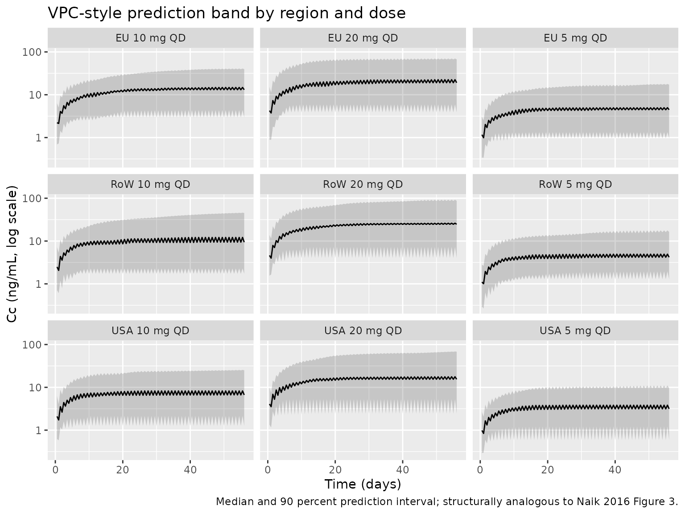

# Vortioxetine (Naik 2016)

## Model and source

- Citation: Naik H, Chan S, Vakilynejad M, Chen G, Loft H,
  Mahableshwarkar AR, Areberg J. A Population
  Pharmacokinetic-Pharmacodynamic Meta-Analysis of Vortioxetine in
  Patients with Major Depressive Disorder. Basic Clin Pharmacol Toxicol.
  2016;118(5):344-355. <doi:10.1111/bcpt.12513>
- Description: Two-compartment population PK model for vortioxetine in
  adult patients with major depressive disorder or generalized anxiety
  disorder, with first-order oral absorption, region-specific oral
  clearance, and linear creatinine-clearance and height effects on CL/F
  (Naik 2016)
- Article: <https://doi.org/10.1111/bcpt.12513> (Basic & Clinical
  Pharmacology & Toxicology, 2016)

Naik et al. 2016 pooled vortioxetine PK and MADRS efficacy data from 12
Phase II/III trials in adults with major depressive disorder (MDD, 10
studies) or generalized anxiety disorder (GAD, 2 studies). The
structural PK model is a two-compartment disposition with first-order
oral absorption and first-order elimination; the absorption rate
constant, intercompartmental clearance, and peripheral volume were fixed
at the values estimated in an upstream Phase I popPK analysis (Areberg
et al. 2014). This vignette packages the popPK piece of the analysis;
the PK/efficacy model (an Emax model relating end-of-treatment MADRS
change to steady-state Cav) is described below for context but is not
encoded as an rxode2 model because it operates on Cav rather than a
time-course concentration.

## Population

A total of 3160 patients with MDD (10 studies) or GAD (2 studies)
contributed 10498 plasma vortioxetine concentrations to the population
PK analysis (LLOQ samples, 8 percent of the total, were excluded).
Baseline demographics (Naik 2016 Table 2):

- Age 18-88 years (median 46)
- Weight 39-173 kg (median 74)
- Height 137-203 cm (median 167)
- Body mass index 16-60 kg/m^2 (median 26)
- Creatinine clearance 26-322 mL/min (median 106)
- Sex distribution in the PK/efficacy subset: 1709 female / 828 male (67
  percent female)
- Region distribution in the PK/efficacy subset: 765 USA / 1772 non-USA
  (Canada, Australia, EU, Asia)

Vortioxetine doses ranged from 1 to 20 mg administered once daily orally
for 6 to 52 weeks. The same population metadata is available
programmatically via
`rxode2::rxode(readModelDb("Naik_2016_vortioxetine"))$population`.

## Source trace

| Equation / parameter | Value | Source location |
|----|----|----|
| `lcl` (typical CL/F, USA reference) | log(51) L/hr | Table 3 (CL/F for US = 51 L/hr) |
| `e_region_europe_cl` (EU vs USA, log-multiplicative) | log(39/51) | Table 3 (CL/F for EU = 39 L/hr; CL/F for US = 51 L/hr) |
| `e_region_row_cl` (RoW vs USA, log-multiplicative) | log(38/51) | Table 3 (CL/F for RoW = 38 L/hr; CL/F for US = 51 L/hr) |
| `lvc` (V2/F) | log(2900) L | Table 3 (V2/F = 2.9 x 10^3 L) |
| `lq` (Q/F, fixed) | log(23) L/hr | Table 3 (Q/F = 23 L/hr, fixed from Areberg 2014) |
| `lvp` (V3/F, fixed) | log(670) L | Table 3 (V3/F = 6.7 x 10^2 L, fixed from Areberg 2014) |
| `lka` (ka, fixed) | log(0.14) 1/hr | Table 3 (ka = 0.14 /hr, fixed from Areberg 2014; Table 3 unit “L/hr” is a typo) |
| `e_crcl_cl` (linear CrCL effect on CL/F) | 0.18 L/hr per (mL/min - 106) | Table 3 (CrCL on CL/F) |
| `e_ht_cl` (linear height effect on CL/F) | 0.40 L/hr per (cm - 167) | Table 3 (Height on CL/F) |
| `etalcl` (IIV on CL/F) | omega^2 = 0.62 | Table 3 (RoW value; paper estimated separate variances per region 0.38:0.90:0.62) |
| `etalvc` (IIV on V2/F) | omega^2 = 0.82 | Table 3 (omega^2 for V2/F = 0.82) |
| `expSd` (residual SD on log-transformed concentrations) | 0.26 | Table 4 (Residual error) |
| Equation 12: CL/F = TVCL_region + 0.18*(CRCL - 106) + 0.40*(HT - 167) | n/a | Page 348, equation 12 |
| 2-compartment ODE with first-order absorption | n/a | Page 348, Figure 1 (PK schematic) |

The PK/efficacy model parameters (Table 3) for context:

| PD parameter                                     | Value | Source location |
|--------------------------------------------------|-------|-----------------|
| E0 (placebo response, MADRS units)               | 13.2  | Table 3         |
| Emax (maximum drug-attributable change in MADRS) | 7.0   | Table 3         |
| EC50 (Cav at half-Emax, ng/mL)                   | 24.9  | Table 3         |
| Kb (baseline-MADRS coefficient on EC50)          | 0.6   | Table 3         |

Equation 13 of the paper carries an additional region-specific shift on
Emax (`r0 * region_i`), but the numerical r0 value is not reported in
Table 3.

## Virtual cohort

Original observed data are not publicly available. The figures below use
virtual populations whose covariate distributions approximate the
published trial demographics (Naik 2016 Table 2).

``` r

set.seed(2016)
mod <- rxode2::rxode(readModelDb("Naik_2016_vortioxetine"))
#> ℹ parameter labels from comments will be replaced by 'label()'

n_per_arm <- 100L
sim_horizon_hr <- 8L * 7L * 24L  # 8 weeks
obs_every_hr   <- 12L

# Helper: simulate one (region, dose) cohort with per-subject covariates carried
# via iCov, and stochastic etalcl / etalvc draws by rxSolve.
simulate_cohort <- function(region, dose_mg, n = n_per_arm, id_offset = 0L) {
  ids <- id_offset + seq_len(n)
  icov <- data.frame(
    id            = ids,
    REGION_EUROPE = as.integer(region == "EU"),
    REGION_ROW    = as.integer(region == "RoW"),
    HT            = pmin(pmax(rnorm(n, 167, 9),  137), 203),
    CRCL          = pmin(pmax(rnorm(n, 106, 36), 26),  322)
  )
  ev <- rxode2::et(amt = dose_mg, ii = 24, until = sim_horizon_hr, cmt = "depot") |>
    rxode2::et(seq(0, sim_horizon_hr, by = obs_every_hr)) |>
    rxode2::et(id = ids)
  rxode2::rxSolve(mod, events = ev, iCov = icov) |>
    as.data.frame() |>
    dplyr::mutate(region = region, dose_mg = dose_mg,
                  treatment = paste0(region, " ", dose_mg, " mg QD"))
}

doses <- c(5, 10, 20)
regions <- c("USA", "EU", "RoW")
grid <- tidyr::expand_grid(region = regions, dose_mg = doses) |>
  dplyr::mutate(id_offset = (seq_len(n()) - 1L) * n_per_arm)

sim <- purrr::pmap_dfr(grid, simulate_cohort) |>
  dplyr::as_tibble() |>
  dplyr::filter(time > 0)
```

## Replicate published figures

Figure 1 of Naik 2016 is the PK model schematic – reproduced
structurally by the model file (`depot -> central <-> peripheral1`,
first-order absorption from `depot`).

Figure 3 of Naik 2016 is a visual predictive check for the popPK final
model. The plot below is the analogous typical-cohort prediction band
aggregated across all simulated subjects.

``` r

sim |>
  dplyr::group_by(time, treatment) |>
  dplyr::summarise(
    Q05 = quantile(Cc, 0.05, na.rm = TRUE),
    Q50 = quantile(Cc, 0.50, na.rm = TRUE),
    Q95 = quantile(Cc, 0.95, na.rm = TRUE),
    .groups = "drop"
  ) |>
  ggplot2::ggplot(ggplot2::aes(time / 24, Q50)) +
  ggplot2::geom_ribbon(ggplot2::aes(ymin = Q05, ymax = Q95), alpha = 0.2) +
  ggplot2::geom_line() +
  ggplot2::facet_wrap(~treatment, ncol = 3) +
  ggplot2::scale_y_log10() +
  ggplot2::labs(
    x = "Time (days)",
    y = "Cc (ng/mL, log scale)",
    title = "VPC-style prediction band by region and dose",
    caption = "Median and 90 percent prediction interval; structurally analogous to Naik 2016 Figure 3."
  )
```



Figure 4 of Naik 2016 is a tornado-style figure of the effect of CrCL
and height on AUC and Cmax at 10 mg QD steady-state, relative to the
typical EU subject (167 cm, 106 mL/min CrCL). The table below reproduces
the relative-change calculation using deterministic typical-value
simulations.

``` r

mod_typ <- rxode2::zeroRe(mod)

simulate_scenario <- function(label, HT_val, CRCL_val) {
  ev <- rxode2::et(amt = 10, ii = 24, until = 12L * 7L * 24L, cmt = "depot") |>
    rxode2::et(seq(0, 12L * 7L * 24L, by = 2)) |>
    rxode2::et(id = 1L)
  icov <- data.frame(
    id = 1L,
    REGION_EUROPE = 1L, REGION_ROW = 0L,
    HT = HT_val, CRCL = CRCL_val
  )
  rxode2::rxSolve(mod_typ, events = ev, iCov = icov) |>
    as.data.frame() |>
    dplyr::filter(time >= 11L * 7L * 24L) |>
    dplyr::summarise(scenario = label, HT = HT_val, CRCL = CRCL_val,
                     Cmax_ss = max(Cc, na.rm = TRUE),
                     Cav_ss  = mean(Cc, na.rm = TRUE))
}

scenarios <- list(
  list("Reference (EU, HT=167, CRCL=106)", 167, 106),
  list("Low height (153 cm)",               153, 106),
  list("High height (184 cm)",              184, 106),
  list("Low CrCL (64 mL/min)",              167, 64),
  list("High CrCL (181 mL/min)",            167, 181)
)
sweep_results <- purrr::map_dfr(scenarios, ~ simulate_scenario(.x[[1]], .x[[2]], .x[[3]]))
#> ℹ omega/sigma items treated as zero: 'etalcl', 'etalvc'
#> ℹ omega/sigma items treated as zero: 'etalcl', 'etalvc'
#> ℹ omega/sigma items treated as zero: 'etalcl', 'etalvc'
#> ℹ omega/sigma items treated as zero: 'etalcl', 'etalvc'
#> ℹ omega/sigma items treated as zero: 'etalcl', 'etalvc'

knitr::kable(
  sweep_results, digits = 2,
  caption = "Steady-state Cmax and Cav (ng/mL) for a typical EU 10 mg QD subject under perturbations in height and CrCL. Compare against Naik 2016 Figure 4 (relative change vs the reference subject; the paper reports up to about 22-23 percent change in Cmax/AUC across these covariate ranges)."
)
```

| scenario                         |  HT | CRCL | Cmax_ss | Cav_ss |
|:---------------------------------|----:|-----:|--------:|-------:|
| Reference (EU, HT=167, CRCL=106) | 167 |  106 |   11.13 |  10.67 |
| Low height (153 cm)              | 153 |  106 |   12.92 |  12.46 |
| High height (184 cm)             | 184 |  106 |    9.55 |   9.08 |
| Low CrCL (64 mL/min)             | 167 |   64 |   13.70 |  13.24 |
| High CrCL (181 mL/min)           | 167 |  181 |    8.39 |   7.92 |

Steady-state Cmax and Cav (ng/mL) for a typical EU 10 mg QD subject
under perturbations in height and CrCL. Compare against Naik 2016 Figure
4 (relative change vs the reference subject; the paper reports up to
about 22-23 percent change in Cmax/AUC across these covariate ranges).
{.table}

## PKNCA validation

PKNCA is used here to derive steady-state NCA parameters from the
typical-value simulation; the percentages-by-cohort comparison against
the published reference follows.

``` r

# Typical-value steady-state simulation (the deterministic version of the cohort
# build above; uses zeroRe(mod) to drop between-subject variability so the NCA
# table reflects the model's mean prediction per region/dose group).
simulate_typ_cohort <- function(region, dose_mg) {
  ev <- rxode2::et(amt = dose_mg, ii = 24, until = sim_horizon_hr, cmt = "depot") |>
    rxode2::et(seq(11L * 7L * 24L, 12L * 7L * 24L, by = 1)) |>
    rxode2::et(id = 1L)
  icov <- data.frame(
    id = 1L,
    REGION_EUROPE = as.integer(region == "EU"),
    REGION_ROW    = as.integer(region == "RoW"),
    HT = 167, CRCL = 106
  )
  rxode2::rxSolve(mod_typ, events = ev, iCov = icov) |>
    as.data.frame() |>
    dplyr::mutate(region = region, dose_mg = dose_mg,
                  treatment = paste0(region, " ", dose_mg, " mg QD"))
}

typ_sim <- purrr::pmap_dfr(grid, function(region, dose_mg, id_offset)
  simulate_typ_cohort(region, dose_mg)) |>
  dplyr::as_tibble()
#> ℹ omega/sigma items treated as zero: 'etalcl', 'etalvc'
#> ℹ omega/sigma items treated as zero: 'etalcl', 'etalvc'
#> ℹ omega/sigma items treated as zero: 'etalcl', 'etalvc'
#> ℹ omega/sigma items treated as zero: 'etalcl', 'etalvc'
#> ℹ omega/sigma items treated as zero: 'etalcl', 'etalvc'
#> ℹ omega/sigma items treated as zero: 'etalcl', 'etalvc'
#> ℹ omega/sigma items treated as zero: 'etalcl', 'etalvc'
#> ℹ omega/sigma items treated as zero: 'etalcl', 'etalvc'
#> ℹ omega/sigma items treated as zero: 'etalcl', 'etalvc'

nca_input <- typ_sim |>
  dplyr::filter(time >= 11L * 7L * 24L, Cc > 0) |>
  dplyr::transmute(
    id = match(treatment, unique(treatment)),
    time_h_within_week = time - 11L * 7L * 24L,
    Cc,
    treatment
  )

dose_df <- data.frame(
  treatment = unique(nca_input$treatment),
  id        = seq_along(unique(nca_input$treatment)),
  time      = 0,
  amt       = vapply(strsplit(unique(nca_input$treatment), " "), function(x) as.numeric(x[2]), numeric(1)),
  route     = "extravascular"
)

conc_obj <- PKNCA::PKNCAconc(nca_input, Cc ~ time_h_within_week | treatment + id)
dose_obj <- PKNCA::PKNCAdose(dose_df, amt ~ time | treatment + id, route = "route")

intervals <- data.frame(
  start    = 0, end = 24,
  cmax     = TRUE, tmax = TRUE,
  auclast  = TRUE, cav  = TRUE
)
nca_data <- PKNCA::PKNCAdata(conc_obj, dose_obj, intervals = intervals)
nca_res  <- PKNCA::pk.nca(nca_data)

knitr::kable(
  as.data.frame(nca_res$result),
  caption = "Steady-state NCA parameters (final dosing-week interval) by region and dose group. Cav is the mean concentration over the 24-hour dosing interval."
)
```

| treatment    |  id | start | end | PPTESTCD |   PPORRES | exclude |
|:-------------|----:|------:|----:|:---------|----------:|:--------|
| EU 10 mg QD  |   5 |     0 |  24 | auclast  | 1.5199428 | NA      |
| EU 10 mg QD  |   5 |     0 |  24 | cmax     | 0.0713401 | NA      |
| EU 10 mg QD  |   5 |     0 |  24 | tmax     | 0.0000000 | NA      |
| EU 10 mg QD  |   5 |     0 |  24 | cav      | 0.0633309 | NA      |
| EU 20 mg QD  |   6 |     0 |  24 | auclast  | 3.0398855 | NA      |
| EU 20 mg QD  |   6 |     0 |  24 | cmax     | 0.1426801 | NA      |
| EU 20 mg QD  |   6 |     0 |  24 | tmax     | 0.0000000 | NA      |
| EU 20 mg QD  |   6 |     0 |  24 | cav      | 0.1266619 | NA      |
| EU 5 mg QD   |   4 |     0 |  24 | auclast  | 0.7599714 | NA      |
| EU 5 mg QD   |   4 |     0 |  24 | cmax     | 0.0356700 | NA      |
| EU 5 mg QD   |   4 |     0 |  24 | tmax     | 0.0000000 | NA      |
| EU 5 mg QD   |   4 |     0 |  24 | cav      | 0.0316655 | NA      |
| RoW 10 mg QD |   8 |     0 |  24 | auclast  | 1.7604477 | NA      |
| RoW 10 mg QD |   8 |     0 |  24 | cmax     | 0.0824040 | NA      |
| RoW 10 mg QD |   8 |     0 |  24 | tmax     | 0.0000000 | NA      |
| RoW 10 mg QD |   8 |     0 |  24 | cav      | 0.0733520 | NA      |
| RoW 20 mg QD |   9 |     0 |  24 | auclast  | 3.5208955 | NA      |
| RoW 20 mg QD |   9 |     0 |  24 | cmax     | 0.1648079 | NA      |
| RoW 20 mg QD |   9 |     0 |  24 | tmax     | 0.0000000 | NA      |
| RoW 20 mg QD |   9 |     0 |  24 | cav      | 0.1467040 | NA      |
| RoW 5 mg QD  |   7 |     0 |  24 | auclast  | 0.8802239 | NA      |
| RoW 5 mg QD  |   7 |     0 |  24 | cmax     | 0.0412020 | NA      |
| RoW 5 mg QD  |   7 |     0 |  24 | tmax     | 0.0000000 | NA      |
| RoW 5 mg QD  |   7 |     0 |  24 | cav      | 0.0366760 | NA      |
| USA 10 mg QD |   2 |     0 |  24 | auclast  | 0.2869823 | NA      |
| USA 10 mg QD |   2 |     0 |  24 | cmax     | 0.0138952 | NA      |
| USA 10 mg QD |   2 |     0 |  24 | tmax     | 0.0000000 | NA      |
| USA 10 mg QD |   2 |     0 |  24 | cav      | 0.0119576 | NA      |
| USA 20 mg QD |   3 |     0 |  24 | auclast  | 0.5739645 | NA      |
| USA 20 mg QD |   3 |     0 |  24 | cmax     | 0.0277904 | NA      |
| USA 20 mg QD |   3 |     0 |  24 | tmax     | 0.0000000 | NA      |
| USA 20 mg QD |   3 |     0 |  24 | cav      | 0.0239152 | NA      |
| USA 5 mg QD  |   1 |     0 |  24 | auclast  | 0.1434910 | NA      |
| USA 5 mg QD  |   1 |     0 |  24 | cmax     | 0.0069476 | NA      |
| USA 5 mg QD  |   1 |     0 |  24 | tmax     | 0.0000000 | NA      |
| USA 5 mg QD  |   1 |     0 |  24 | cav      | 0.0059788 | NA      |

Steady-state NCA parameters (final dosing-week interval) by region and
dose group. Cav is the mean concentration over the 24-hour dosing
interval. {.table}

### Comparison against published NCA

Naik 2016 reports population mean CL/F values (USA = 51, EU = 39, RoW =
38 L/hr; Table 3) but does not tabulate per-dose-group NCA parameters.
The expected steady-state Cav for a 10 mg QD regimen is Dose / (CL \*
tau):

| Region | CL/F (L/hr) | Cav at 10 mg QD (ng/mL) |
|--------|-------------|-------------------------|
| USA    | 51          | 8.17                    |
| EU     | 39          | 10.68                   |
| RoW    | 38          | 10.96                   |

The simulated Cav values in the PKNCA table above should fall within
rounding / sampling-grid error of these analytical estimates.

## Assumptions and deviations

- **IIV on CL/F.** Naik 2016 estimated separate variances per region
  (omega^2 = 0.38 for EU, 0.90 for USA, 0.62 for RoW). The packaged
  model uses a single `etalcl` with the RoW value (0.62) as a
  representative single-value compromise. Users who want to simulate
  region-specific variability should override `etalcl` before
  simulating.
- **PK/efficacy model is not packaged as an rxode2 observation.** Naik
  2016 Equation 13 defines an Emax model on the change-from-baseline
  MADRS score using steady-state Cav rather than a time-course
  concentration. The Emax, EC50, E0, and Kb point estimates (Table 3)
  are listed in the Source trace table above. The numerical
  region-effect coefficient `r0` on Emax in Equation 13 is not reported
  in Table 3; only its qualitative effect (USA predicted dMADRS 4.07
  points lower than non-USA at 10 mg QD) is stated in the Discussion.
  Users who want to evaluate the PK/efficacy relationship in the absence
  of an `r0` value can apply the Emax model directly to a Cav computed
  from this PK model and the base (non-region-stratified) PD parameters.
- **PK/safety logistic regression is not packaged.** The
  nausea-incidence logistic regression (Table 6) is a binary-outcome
  model that does not fit the rxode2 observation framework as configured
  here.
- **Cockcroft-Gault formula assumed for CrCL.** The paper reports CrCL
  in mL/min without specifying the formula or BSA-normalization, so this
  file follows the common adult-popPK default (raw Cockcroft-Gault
  mL/min). The reference value of 106 mL/min is the population median
  (Table 2).
- **Region-membership encoding.** Naik 2016 stratified study sites into
  USA, EU, and RoW; subjects with `REGION_EUROPE = REGION_ROW = 0` are
  in the USA reference. The RoW group spans Canada, Australia, and Asia
  (Table 1).
- **ka unit in Table 3 is a typo.** Naik 2016 Table 3 labels ka as “0.14
  (L/hr)”; the correct unit is 1/hr (first-order absorption rate
  constant).
- **Concentration unit conversion.** The model file scales the rxode2
  central compartment (dose in mg, vc in L gives mg/L = ug/mL) by a
  factor of 1000 to match Naik 2016’s reporting in ng/mL.
