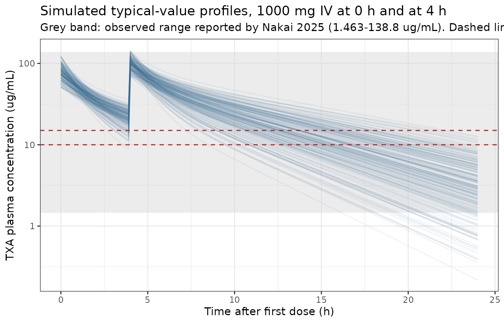
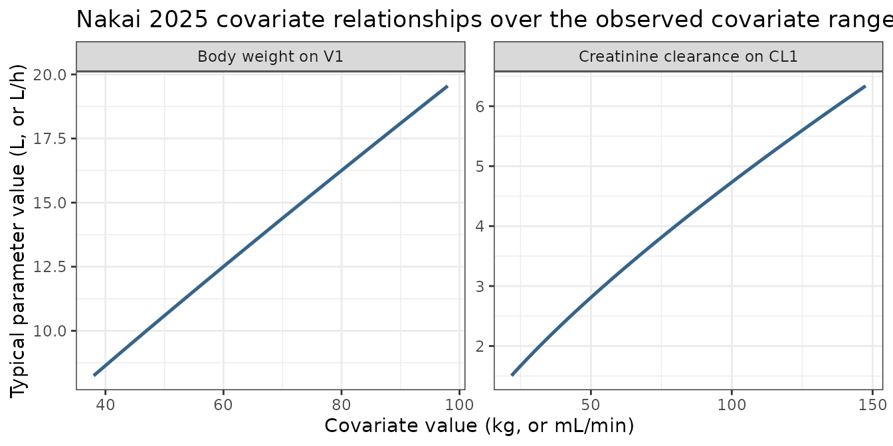

# Tranexamic acid (Nakai 2025)

## Model and source

- Citation: Nakai T, Tamura T, Miyagawa Y, Inagaki T, Mutsuga M, Yamada
  S, Yamada K, Nishiwaki K, Mizoguchi H. Population pharmacokinetic
  model of tranexamic acid in patients who undergo cardiac surgery with
  cardiopulmonary bypass. Eur J Clin Pharmacol. 2025;81(3):441-449.
  <doi:10.1007/s00228-025-03802-0>
- Description: Two-compartment population PK model for intravenous
  tranexamic acid (TXA) with first-order elimination, in adults
  undergoing cardiac surgery with cardiopulmonary bypass; body weight on
  central volume and Cockcroft-Gault creatinine clearance on clearance
  (Nakai 2025).
- Article: [Eur J Clin Pharmacol
  2025;81(3):441-449](https://doi.org/10.1007/s00228-025-03802-0)

## Population

The model was developed from 453 tranexamic acid (TXA) plasma
concentrations prospectively collected from 77 adults who underwent
cardiac surgery with cardiopulmonary bypass (CPB) at Nagoya University
Hospital between August 2021 and August 2022. Of 88 patients screened,
11 were excluded (8 receiving haemodialysis, 2 without CPB, 1 on a
different dosing regimen). The cohort was 51 male / 26 female (33.8%
female), with median age 69 years (IQR 60-75; range 26-84), median body
weight 61.4 kg (IQR 54.6-75.2; range 38.0-97.6), median height 161.8 cm
and mean BMI 24.0 kg/m^2 (range 15.1-35.0). Renal function spanned a
wide range: median serum creatinine 85.7 umol/L (range 38.0-271.4) and
median Cockcroft-Gault creatinine clearance 61.0 mL/min (IQR 48.1-76.3;
range 21.8-147.5). Surgery types were CABG (16), single valve (35),
complex valve (2), aortic (15), combined (6) and other (3), with median
CPB duration 170 min (range 76-424) (Nakai 2025 Table 1).

Every patient received the same double-bolus regimen: 1000 mg of
intravenous TXA at the start of the operative procedure and a further
1000 mg after CPB was discontinued (Nakai 2025 Methods, Study design).
Blood samples were drawn at approximately 0.5, 1, 2 and 5 h after the
first dose and at 1, 6 and 16 h after re-administration.

The same information is available programmatically via
`readModelDb("Nakai_2025_tranexamicAcid")()$population`.

## Source trace

Every numeric value in `ini()` carries an in-file comment pointing to
the Nakai 2025 source location. The table below collects them in one
place for review.

| Equation / parameter | Value | Source location |
|----|----|----|
| `lvc` (V1) | 12.77 L | Table 3, row “V1 (L)” (%RSE 3.582); repeated in Results / Conclusions summary equation |
| `lvp` (V2) | 6.857 L | Table 3, row “V2 (L)” (%RSE 13.82); repeated in Results / Conclusions summary equation |
| `lcl` (CL1) | 3.263 L/h | Table 3, row “CL1 (L/h)” (%RSE 4.198); repeated in Results / Conclusions summary equation |
| `lq` (CL2) | 2.859 L/h | Table 3, row “CL2 (L/h)” (%RSE 13.93); repeated in Results / Conclusions summary equation |
| `e_wt_vc` | 0.911 | Table 3, row “BW on V1” (%RSE 16.51) |
| `e_crcl_cl` | 0.752 | Table 3, row “CLcr on CL1” (%RSE 16.55) |
| Reference WT | 61.4 kg | Table 1 median body weight; the normalizing constant in the Results summary equation `V1 = 12.77 x (BW/61.4)^0.911` |
| Reference CRCL | 61.0 mL/min | Table 1 median creatinine clearance; the normalizing constant in `CL1 = 3.263 x [CLcr/61.0]^0.752` |
| `etalvc`, `etalvp`, `etalcl`, `etalq` | `fixed(0)` | Methods, Base model: exponential IIV declared (`P_i = TV(P) x exp(eta_i)`); no omega value reported anywhere in the paper |
| `addSd`, `propSd` | `fixed(0)` | Methods, Base model: combined additive + multiplicative residual error declared; neither sigma reported |
| Two-compartment structure, first-order elimination from central | n/a | Methods, Base model; Table 2 model 2 (dOFV -109.550 vs the one-compartment model) |
| BW on V1 only, CLcr on CL1 only | n/a | Table 2 model 7 (the final model), and the Results summary equation in which V2 and CL2 carry no covariate |
| IV bolus into `central` | n/a | Methods, Study design (1000 mg IV at start of surgery, 1000 mg after CPB discontinued); Discussion “double-bolus regimen with a 1 g bolus” |

### The unreported variance parameters

Nakai 2025 declares both an exponential inter-individual variability
model and a combined additive-plus-multiplicative residual error model
in Methods, but reports **no** omega or sigma estimate anywhere. Two
independent checks confirm this is the paper’s own omission rather than
a text-extraction artefact:

1.  Table 3 contains exactly six rows (V1, V2, CL1, CL2, BW on V1, CLcr
    on CL1) in both the PDF and the trimmed text.
2.  The Results state that “the RSE of all the parameters was
    3.582-16.55%”. Those endpoints are exactly the smallest (V1, 3.582)
    and largest (CLcr on CL1, 16.55) of the six tabulated %RSE values,
    so the six estimates are the complete published parameter set.

The only cited supplementary item, Supplemental Table S1, holds the
characteristics of three low-concentration patients, not a parameter
table.

All four etas and both residual-error terms are therefore encoded as
`fixed(0)`. That records the structure the authors declared while
stating that no magnitude was published; it is not a claim that
variability was estimated to be zero. Substituting an invented or
class-typical variance would misrepresent the source. Every simulation
below is consequently a **typical-value** simulation, driven only by
covariate variation across the cohort, and every `rxSolve()` call passes
`omega = NA` explicitly so a previously-solved model’s omega cannot leak
in.

## Model equations as implemented

``` r

mod <- readModelDb("Nakai_2025_tranexamicAcid")
ui  <- rxode2::rxode(mod)
#> ℹ parameter labels from comments will be replaced by 'label()'
ui$iniDf[, c("name", "est", "fix", "label")]
#>         name      est   fix
#> 1        lvc 2.547099 FALSE
#> 2        lvp 1.925270 FALSE
#> 3        lcl 1.182647 FALSE
#> 4         lq 1.050472 FALSE
#> 5    e_wt_vc 0.911000 FALSE
#> 6  e_crcl_cl 0.752000 FALSE
#> 7      addSd 0.000000  TRUE
#> 8     propSd 0.000000  TRUE
#> 9     etalvc 0.000000  TRUE
#> 10    etalvp 0.000000  TRUE
#> 11    etalcl 0.000000  TRUE
#> 12     etalq 0.000000  TRUE
#>                                                                                     label
#> 1                                     Central volume of distribution V1 at WT 61.4 kg (L)
#> 2                                                Peripheral volume of distribution V2 (L)
#> 3                                                 Clearance CL1 at CRCL 61.0 mL/min (L/h)
#> 4                                                 Inter-compartmental clearance CL2 (L/h)
#> 5                                           Power exponent on (WT/61.4) for V1 (unitless)
#> 6                                        Power exponent on (CRCL/61.0) for CL1 (unitless)
#> 7         Additive residual error (ug/mL; ZERO - declared by the source but not reported)
#> 8  Proportional residual error (fraction; ZERO - declared by the source but not reported)
#> 9       Nakai 2025 Methods, Base model (exponential IIV declared; magnitude not reported)
#> 10      Nakai 2025 Methods, Base model (exponential IIV declared; magnitude not reported)
#> 11      Nakai 2025 Methods, Base model (exponential IIV declared; magnitude not reported)
#> 12      Nakai 2025 Methods, Base model (exponential IIV declared; magnitude not reported)
```

## Falsifier: the paper’s own worked example

The Discussion states: “Assuming a body weight of 61.4 kg (median
weight) and CLcr of 60.0 mL/min, our model estimates the CL1 as 3.223
L/h (53.72 mL/min) and V1 as 12.77 L.” That is an independent arithmetic
check on both covariate relationships, published separately from Table
3, and it pins the units of the `CLcr / 61.0` ratio: forming the ratio
in mL/min reproduces 3.223 L/h exactly, whereas the literal reading of
the summary equation’s “CLcr (L/h)” annotation would not.

``` r

ini_val <- function(nm) ui$iniDf$est[ui$iniDf$name == nm]

cl_worked <- exp(ini_val("lcl")) * (60.0 / 61.0)^ini_val("e_crcl_cl")
vc_worked <- exp(ini_val("lvc")) * (61.4 / 61.4)^ini_val("e_wt_vc")

worked <- tibble::tibble(
  Quantity   = c("CL1 (L/h)", "CL1 (mL/min)", "V1 (L)"),
  Model      = c(cl_worked, cl_worked * 1000 / 60, vc_worked),
  Published  = c(3.223, 53.72, 12.77)
) |>
  mutate(`Difference (%)` = 100 * (Model - Published) / Published)

knitr::kable(worked, digits = 3)
```

| Quantity     |  Model | Published | Difference (%) |
|:-------------|-------:|----------:|---------------:|
| CL1 (L/h)    |  3.223 |     3.223 |         -0.010 |
| CL1 (mL/min) | 53.712 |    53.720 |         -0.016 |
| V1 (L)       | 12.770 |    12.770 |          0.000 |

``` r


# Strict assertion: the model must reproduce the paper's own arithmetic to
# within its printed precision (4 significant figures).
stopifnot(
  abs(cl_worked - 3.223)  < 0.001,
  abs(cl_worked * 1000 / 60 - 53.72) < 0.01,
  abs(vc_worked - 12.77)  < 0.001
)
```

## Virtual cohort

Individual patient data are not publicly available. The cohort below
draws body weight and creatinine clearance from log-normal distributions
matched to the published medians and interquartile ranges, truncated at
the published minimum and maximum (Nakai 2025 Table 1). Because all
random effects are `fixed(0)`, between-subject differences in the
simulation come entirely from these covariates.

``` r

set.seed(20250116)

n_subj <- 200L

# Log-normal parameters chosen so exp(meanlog) is the published median and
# the interquartile ratio matches the published IQR.
sd_from_iqr <- function(q1, q3) (log(q3) - log(q1)) / (2 * stats::qnorm(0.75))

wt_med <- 61.4; wt_q1 <- 54.6; wt_q3 <- 75.2; wt_lo <- 38.0; wt_hi <-  97.6
cr_med <- 61.0; cr_q1 <- 48.1; cr_q3 <- 76.3; cr_lo <- 21.8; cr_hi <- 147.5

subj <- tibble::tibble(
  id   = seq_len(n_subj),
  WT   = pmin(pmax(stats::rlnorm(n_subj, log(wt_med), sd_from_iqr(wt_q1, wt_q3)), wt_lo), wt_hi),
  CRCL = pmin(pmax(stats::rlnorm(n_subj, log(cr_med), sd_from_iqr(cr_q1, cr_q3)), cr_lo), cr_hi)
)

cohort_summary <- tibble::tibble(
  Covariate  = c("Body weight (kg)", "Creatinine clearance (mL/min)"),
  `Simulated median` = c(median(subj$WT), median(subj$CRCL)),
  `Simulated IQR`    = c(
    paste0(round(quantile(subj$WT,   0.25), 1), "-", round(quantile(subj$WT,   0.75), 1)),
    paste0(round(quantile(subj$CRCL, 0.25), 1), "-", round(quantile(subj$CRCL, 0.75), 1))
  ),
  `Published median` = c(wt_med, cr_med),
  `Published IQR`    = c("54.6-75.2", "48.1-76.3")
)
knitr::kable(cohort_summary, digits = 1)
```

| Covariate | Simulated median | Simulated IQR | Published median | Published IQR |
|:---|---:|:---|---:|:---|
| Body weight (kg) | 60.9 | 52.4-72 | 61.4 | 54.6-75.2 |
| Creatinine clearance (mL/min) | 64.5 | 49-77.7 | 61.0 | 48.1-76.3 |

## Simulation of the published double-bolus regimen

Both doses are 1000 mg IV boluses into `central`. The paper does not
give the exact re-administration time; it states that “most patients
undergoing CABG and valve surgeries were separated from CPB within 5 h
and TXA was re-administered before 5 h”, and reports a median CPB
duration of 170 min. A re-dose at 4 h after the first dose is used here
as a representative value consistent with both statements (see
Assumptions and deviations).

``` r

redose_time <- 4  # h after the first dose; see Assumptions and deviations

# Sampling times: the paper's nominal schedule (0.5, 1, 2, 5 h after dose 1;
# 1, 6, 16 h after re-administration) plus a dense grid for the profile plot.
obs_times <- sort(unique(c(
  seq(0, 24, by = 0.1),
  c(0.5, 1, 2, 5),
  redose_time + c(1, 6, 16)
)))

dose_rows <- subj |>
  tidyr::crossing(time = c(0, redose_time)) |>
  mutate(amt = 1000, evid = 1L, cmt = "central")

obs_rows <- subj |>
  tidyr::crossing(time = obs_times) |>
  mutate(amt = NA_real_, evid = 0L, cmt = "central")

events <- bind_rows(dose_rows, obs_rows) |>
  arrange(id, time, desc(evid)) |>
  as.data.frame()

sim <- rxode2::rxSolve(mod, events = events, keep = c("WT", "CRCL"), omega = NA) |>
  as.data.frame()
#> ℹ parameter labels from comments will be replaced by 'label()'
#> Warning: multi-subject simulation without without 'omega'

# rxSolve has been observed to drop subjects silently; assert the count.
stopifnot(dplyr::n_distinct(sim$id) == n_subj)

# With every eta fixed at 0 the individual parameters must be an exact
# deterministic function of the covariates -- if rxSolve had sampled random
# effects, this would fail.
chk <- sim |>
  distinct(id, WT, CRCL, cl, vc) |>
  mutate(
    cl_expected = exp(ini_val("lcl")) * (CRCL / 61.0)^ini_val("e_crcl_cl"),
    vc_expected = exp(ini_val("lvc")) * (WT   / 61.4)^ini_val("e_wt_vc")
  )
stopifnot(
  nrow(chk) == n_subj,
  max(abs(chk$cl - chk$cl_expected)) < 1e-8,
  max(abs(chk$vc - chk$vc_expected)) < 1e-8
)
```

### Concentration-time profile (replicates the shape of Nakai 2025 Figure 1)

Figure 1 of Nakai 2025 plots the observed TXA concentrations against
time for all 77 patients. The paper does not publish the underlying
data, but it does report the observed concentration ranges: 3.488-118.3
ug/mL during surgery with CPB, and 1.463-138.8 ug/mL after CPB
interruption and TXA re-administration. Those ranges are drawn as
reference bands below.

``` r

ggplot(sim, aes(x = time, y = Cc, group = id)) +
  annotate("rect", xmin = -Inf, xmax = Inf, ymin = 1.463, ymax = 138.8,
           fill = "grey85", alpha = 0.5) +
  geom_line(alpha = 0.08, colour = "steelblue4") +
  geom_hline(yintercept = c(10, 15), linetype = "dashed", colour = "firebrick") +
  scale_y_log10() +
  labs(
    x = "Time after first dose (h)",
    y = "TXA plasma concentration (ug/mL)",
    title = "Simulated typical-value profiles, 1000 mg IV at 0 h and at 4 h",
    subtitle = paste(
      "Grey band: observed range reported by Nakai 2025 (1.463-138.8 ug/mL).",
      "Dashed lines: the 10-15 ug/mL effective range discussed by the authors."
    )
  ) +
  theme_bw()
```



The observed envelope is not a containment bound for this simulation,
and the check below is written accordingly. Nakai 2025 reports the range
of *measured* concentrations, which carry residual error and were drawn
only from the patients who happened to be sampled at each nominal time;
the simulation here is deterministic (all etas `fixed(0)`) but sweeps
the **full** published covariate range, including patients at the
maximum creatinine clearance of 147.5 mL/min whose 16 h post-re-dose
concentration is lower than anything the study measured. The directional
check that is genuinely falsifiable is over-prediction: the model must
not exceed the observed maximum anywhere.

``` r

# De-duplicate: with a 4 h re-dose, "1 h after re-administration" coincides with
# the 5 h post-first-dose sample, so the nominal schedule has 6 distinct times.
nominal_times <- sort(unique(c(0.5, 1, 2, 5, redose_time + c(1, 6, 16))))
sim_nominal <- sim |> filter(time %in% nominal_times, !is.na(Cc))

obs_lo <- 1.463   # Nakai 2025 Results, observed minimum after re-administration
obs_hi <- 138.8   # Nakai 2025 Results, observed maximum after re-administration

by_time <- sim_nominal |>
  group_by(time) |>
  summarise(
    Minimum = min(Cc), Median = median(Cc), Maximum = max(Cc),
    .groups = "drop"
  )
knitr::kable(by_time, digits = 2,
             caption = "Simulated typical-value concentrations at the nominal sampling times (ug/mL)")
```

| time | Minimum | Median | Maximum |
|-----:|--------:|-------:|--------:|
|  0.5 |   42.64 |  61.93 |   87.35 |
|  1.0 |   35.94 |  50.45 |   68.04 |
|  2.0 |   21.25 |  34.92 |   50.67 |
|  5.0 |   46.35 |  67.37 |   99.00 |
| 10.0 |    6.62 |  23.03 |   46.65 |
| 20.0 |    0.57 |   5.46 |   18.37 |

Simulated typical-value concentrations at the nominal sampling times
(ug/mL) {.table}

``` r


below <- sum(sim_nominal$Cc < obs_lo)
range_check <- tibble::tibble(
  Quantity = c("Minimum at nominal sampling times",
               "Maximum at nominal sampling times",
               "Points below the observed minimum"),
  Simulated = c(min(sim_nominal$Cc), max(sim_nominal$Cc), below),
  `Nakai 2025 observed` = c(obs_lo, obs_hi, NA_real_)
)
knitr::kable(range_check, digits = 2)
```

| Quantity                          | Simulated | Nakai 2025 observed |
|:----------------------------------|----------:|--------------------:|
| Minimum at nominal sampling times |      0.57 |                1.46 |
| Maximum at nominal sampling times |     99.00 |              138.80 |
| Points below the observed minimum |     10.00 |                  NA |

``` r


stopifnot(
  # Every subject contributes every nominal time point.
  nrow(sim_nominal) == n_subj * length(nominal_times),
  # No over-prediction anywhere: the strict, one-sided containment check.
  max(sim_nominal$Cc) <= obs_hi,
  # Through 10 h -- the window in which essentially every study patient was
  # sampled -- the whole simulated cohort lies inside the observed envelope.
  all(sim_nominal$Cc[sim_nominal$time <= 10] >= obs_lo),
  # The cohort median lies inside the envelope at every nominal time,
  # including the terminal 20 h sample.
  min(by_time$Median) >= obs_lo, max(by_time$Median) <= obs_hi,
  # Only the fast-clearance tail of the 20 h sample falls below the observed
  # minimum, and it is a small fraction of the cohort.
  all(sim_nominal$time[sim_nominal$Cc < obs_lo] == 20),
  below / nrow(sim_nominal) < 0.02
)
```

## PKNCA validation

The paper reports no NCA table, so the NCA below is validated against
identities that follow exactly from the fitted structural parameters
rather than against a published NCA summary. A single 1000 mg IV bolus
is simulated over a long window so the terminal phase is fully
characterised.

``` r

nca_times <- sort(unique(c(seq(0, 2, by = 0.02), seq(2, 48, by = 0.1))))

nca_events <- bind_rows(
  subj |> mutate(time = 0, amt = 1000, evid = 1L, cmt = "central"),
  subj |> tidyr::crossing(time = nca_times) |>
    mutate(amt = NA_real_, evid = 0L, cmt = "central")
) |>
  mutate(regimen = "1000 mg IV bolus") |>
  arrange(id, time, desc(evid)) |>
  as.data.frame()

sim_nca_raw <- rxode2::rxSolve(
  mod, events = nca_events, keep = c("WT", "CRCL", "regimen"), omega = NA
) |>
  as.data.frame()
#> Warning: multi-subject simulation without without 'omega'

stopifnot(dplyr::n_distinct(sim_nca_raw$id) == n_subj)
# Solver noise in the far tail can push concentrations slightly negative, which
# would make log-linear lambda.z fitting return NaN.
stopifnot(all(sim_nca_raw$Cc >= 0, na.rm = TRUE))
```

``` r

sim_nca <- sim_nca_raw |>
  filter(!is.na(Cc)) |>
  select(id, time, Cc, regimen)

dose_df <- nca_events |>
  filter(evid == 1) |>
  select(id, time, amt, regimen)

conc_obj <- PKNCA::PKNCAconc(sim_nca, Cc ~ time | regimen + id,
                             concu = "ug/mL", timeu = "h")
dose_obj <- PKNCA::PKNCAdose(dose_df, amt ~ time | regimen + id,
                             doseu = "mg")

intervals <- data.frame(
  start       = 0,
  end         = Inf,
  cmax        = TRUE,
  tmax        = TRUE,
  aucinf.obs  = TRUE,
  half.life   = TRUE,
  clast.obs   = TRUE,
  lambda.z    = TRUE
)

res <- PKNCA::pk.nca(PKNCA::PKNCAdata(conc_obj, dose_obj, intervals = intervals))
summary(res)
#>  Interval Start Interval End          regimen   N Cmax (ug/mL)
#>               0          Inf 1000 mg IV bolus 200  78.7 [21.0]
#>              Tmax (h) Clast (ug/mL) Half-life (h) $\\lambda_z$ (1/h)
#>  0.000 [0.000, 0.000]  0.0312 [418]   4.99 [1.14]       0.143 [23.0]
#>  AUCinf,obs (h*ug/mL)
#>            299 [26.5]
#> 
#> Caption: Cmax, Clast, $\lambda_z$, AUCinf,obs: geometric mean and geometric coefficient of variation; Tmax: median and range; Half-life: arithmetic mean and standard deviation; N: number of subjects
```

### Per-subject identity: AUC0-inf = Dose / CL1

For a linear model with intravenous input, `AUC0-inf` must equal
`Dose / CL` for every individual. This is a strict per-subject check,
not a comparison of cohort medians.

``` r

nca_wide <- as.data.frame(res) |>
  filter(PPTESTCD %in% c("aucinf.obs", "cmax", "tmax", "half.life")) |>
  select(id, PPTESTCD, PPORRES) |>
  tidyr::pivot_wider(names_from = PPTESTCD, values_from = PPORRES) |>
  mutate(id = as.integer(as.character(id))) |>
  left_join(chk, by = "id") |>
  mutate(
    auc_expected = 1000 / cl,
    auc_pct_err  = 100 * (aucinf.obs - auc_expected) / auc_expected,
    c0_expected  = 1000 / vc,
    cmax_pct_err = 100 * (cmax - c0_expected) / c0_expected
  )

stopifnot(nrow(nca_wide) == n_subj)

identity_tab <- tibble::tibble(
  Check = c(
    "AUC0-inf vs Dose / CL1 (max |% error|)",
    "Cmax vs Dose / V1 (max |% error|)"
  ),
  `Max absolute error (%)` = c(
    max(abs(nca_wide$auc_pct_err)),
    max(abs(nca_wide$cmax_pct_err))
  )
)
knitr::kable(identity_tab, digits = 3)
```

| Check                                    | Max absolute error (%) |
|:-----------------------------------------|-----------------------:|
| AUC0-inf vs Dose / CL1 (max \|% error\|) |                  0.008 |
| Cmax vs Dose / V1 (max \|% error\|)      |                  0.000 |

``` r


# AUC is exact for a linear system; Cmax is read from the first sampled time
# (0.02 h) rather than t = 0, so it sits a fraction of a percent below Dose/V1.
stopifnot(
  max(abs(nca_wide$auc_pct_err))  < 0.5,
  max(abs(nca_wide$cmax_pct_err)) < 2
)
```

### Terminal half-life against the analytic two-compartment solution

The terminal rate constant of a two-compartment model is the smaller
root `beta` of `x^2 - (k10 + k12 + k21) x + k10 k21 = 0`, giving
`t1/2,beta = log(2) / beta`. PKNCA estimates it numerically from the
simulated profile; the two must agree.

``` r

analytic_beta <- function(cl, vc, q, vp) {
  k10 <- cl / vc; k12 <- q / vc; k21 <- q / vp
  s <- k10 + k12 + k21
  (s - sqrt(s^2 - 4 * k10 * k21)) / 2
}

q_val  <- exp(ini_val("lq"))
vp_val <- exp(ini_val("lvp"))

hl_cmp <- nca_wide |>
  mutate(
    hl_analytic = log(2) / analytic_beta(cl, vc, q_val, vp_val),
    hl_pct_err  = 100 * (half.life - hl_analytic) / hl_analytic
  )

hl_tab <- tibble::tibble(
  Quantity = c("Terminal half-life, PKNCA (h)", "Terminal half-life, analytic (h)"),
  Median   = c(median(hl_cmp$half.life), median(hl_cmp$hl_analytic)),
  Minimum  = c(min(hl_cmp$half.life),    min(hl_cmp$hl_analytic)),
  Maximum  = c(max(hl_cmp$half.life),    max(hl_cmp$hl_analytic))
)
knitr::kable(hl_tab, digits = 3)
```

| Quantity                         | Median | Minimum | Maximum |
|:---------------------------------|-------:|--------:|--------:|
| Terminal half-life, PKNCA (h)    |  4.832 |   2.840 |   8.251 |
| Terminal half-life, analytic (h) |  4.857 |   2.851 |   8.294 |

``` r


stopifnot(max(abs(hl_cmp$hl_pct_err)) < 2)
```

### Comparison against reference values derived from the published parameters

The reference column below is computed from Table 3 of Nakai 2025 for
the reference subject (61.4 kg, CRCL 61.0 mL/min), independently of the
simulation. The simulated column is a dedicated single-subject solve at
exactly those covariates, run through the same PKNCA pipeline; that
makes the comparison like-for-like rather than a cohort statistic set
against a reference-subject value.

``` r

cl_ref <- 3.263   # Nakai 2025 Table 3, CL1 at the reference covariates
vc_ref <- 12.77   # Nakai 2025 Table 3, V1 at the reference covariates
q_ref  <- 2.859   # Nakai 2025 Table 3, CL2
vp_ref <- 6.857   # Nakai 2025 Table 3, V2

reference_nca <- tibble::tibble(
  regimen     = "1000 mg IV bolus",
  cmax        = 1000 / vc_ref,
  aucinf.obs  = 1000 / cl_ref,
  half.life   = log(2) / analytic_beta(cl_ref, vc_ref, q_ref, vp_ref)
)

ref_subj <- tibble::tibble(id = 1L, WT = 61.4, CRCL = 61.0)

ref_events <- bind_rows(
  ref_subj |> mutate(time = 0, amt = 1000, evid = 1L, cmt = "central"),
  ref_subj |> tidyr::crossing(time = nca_times) |>
    mutate(amt = NA_real_, evid = 0L, cmt = "central")
) |>
  mutate(regimen = "1000 mg IV bolus") |>
  arrange(id, time, desc(evid)) |>
  as.data.frame()

sim_ref <- rxode2::rxSolve(
  mod, events = ref_events, keep = c("WT", "CRCL", "regimen"), omega = NA
) |>
  as.data.frame()

# rxSolve omits `id` for a single-subject event table; restore it for PKNCA.
if (is.null(sim_ref$id)) sim_ref$id <- 1L
stopifnot(all(sim_ref$Cc >= 0, na.rm = TRUE))

ref_conc <- PKNCA::PKNCAconc(
  sim_ref |> filter(!is.na(Cc)) |> select(id, time, Cc, regimen),
  Cc ~ time | regimen + id, concu = "ug/mL", timeu = "h"
)
ref_dose <- PKNCA::PKNCAdose(
  ref_events |> filter(evid == 1) |> select(id, time, amt, regimen),
  amt ~ time | regimen + id, doseu = "mg"
)
ref_res <- PKNCA::pk.nca(PKNCA::PKNCAdata(ref_conc, ref_dose, intervals = intervals))

simulated_nca <- as.data.frame(ref_res) |>
  filter(PPTESTCD %in% c("cmax", "aucinf.obs", "half.life")) |>
  select(PPTESTCD, PPORRES) |>
  tidyr::pivot_wider(names_from = PPTESTCD, values_from = PPORRES) |>
  mutate(regimen = "1000 mg IV bolus")

stopifnot(nrow(simulated_nca) == 1L)

nlmixr2lib::ncaComparisonTable(
  simulated = simulated_nca,
  reference = reference_nca,
  by        = "regimen",
  units     = c(cmax = "ug/mL", aucinf.obs = "ug*h/mL", half.life = "h")
)
#>            NCA parameter          regimen Reference Simulated % diff
#> 1           Cmax (ug/mL) 1000 mg IV bolus      78.3      78.3  -0.0%
#> 2 AUC0-∞ (obs) (ug*h/mL) 1000 mg IV bolus       306       306  +0.0%
#> 3                 t½ (h) 1000 mg IV bolus      4.91      4.89  -0.5%
```

``` r

# The reference subject's covariates are exactly the normalizing constants, so
# both covariate factors are 1 and the simulated NCA must reproduce the Table 3
# parameters. AUC and half-life are exact for a linear system; Cmax is read at
# the first sampled time (0.02 h) rather than t = 0, so it sits a little below
# Dose / V1.
cmp <- tibble::tibble(
  Quantity = c("Cmax (ug/mL)", "AUC0-inf (ug*h/mL)", "Terminal half-life (h)"),
  Simulated = c(simulated_nca$cmax, simulated_nca$aucinf.obs, simulated_nca$half.life),
  Reference = c(reference_nca$cmax, reference_nca$aucinf.obs, reference_nca$half.life)
) |>
  mutate(`Difference (%)` = 100 * (Simulated - Reference) / Reference)
knitr::kable(cmp, digits = 3)
```

| Quantity               | Simulated | Reference | Difference (%) |
|:-----------------------|----------:|----------:|---------------:|
| Cmax (ug/mL)           |    78.309 |    78.309 |          0.000 |
| AUC0-inf (ug\*h/mL)    |   306.469 |   306.466 |          0.001 |
| Terminal half-life (h) |     4.889 |     4.914 |         -0.509 |

``` r


stopifnot(
  abs(cmp$`Difference (%)`[cmp$Quantity == "AUC0-inf (ug*h/mL)"]) < 0.5,
  abs(cmp$`Difference (%)`[cmp$Quantity == "Terminal half-life (h)"]) < 1,
  abs(cmp$`Difference (%)`[cmp$Quantity == "Cmax (ug/mL)"]) < 2
)
```

## Covariate effects (replicates the Results summary equation)

``` r

cov_grid <- bind_rows(
  tibble::tibble(
    Covariate = "Body weight on V1",
    x         = seq(38, 98, length.out = 100)
  ) |>
    mutate(y = exp(ini_val("lvc")) * (x / 61.4)^ini_val("e_wt_vc")),
  tibble::tibble(
    Covariate = "Creatinine clearance on CL1",
    x         = seq(21.8, 147.5, length.out = 100)
  ) |>
    mutate(y = exp(ini_val("lcl")) * (x / 61.0)^ini_val("e_crcl_cl"))
)

ggplot(cov_grid, aes(x = x, y = y)) +
  geom_line(colour = "steelblue4", linewidth = 0.9) +
  facet_wrap(~Covariate, scales = "free") +
  labs(
    x = "Covariate value (kg, or mL/min)",
    y = "Typical parameter value (L, or L/h)",
    title = "Nakai 2025 covariate relationships over the observed covariate ranges"
  ) +
  theme_bw()
```



At the extremes of the published creatinine-clearance range the model
predicts a substantial spread in clearance, which is the paper’s
motivation for including renal function:

``` r

extremes <- tibble::tibble(
  Scenario = c("CRCL 21.8 mL/min (cohort minimum)",
               "CRCL 61.0 mL/min (cohort median)",
               "CRCL 147.5 mL/min (cohort maximum)"),
  CRCL     = c(21.8, 61.0, 147.5)
) |>
  mutate(
    `CL1 (L/h)` = exp(ini_val("lcl")) * (CRCL / 61.0)^ini_val("e_crcl_cl"),
    `Ratio to median` = `CL1 (L/h)` / exp(ini_val("lcl"))
  )
knitr::kable(extremes, digits = 3)
```

| Scenario                           |  CRCL | CL1 (L/h) | Ratio to median |
|:-----------------------------------|------:|----------:|----------------:|
| CRCL 21.8 mL/min (cohort minimum)  |  21.8 |     1.505 |           0.461 |
| CRCL 61.0 mL/min (cohort median)   |  61.0 |     3.263 |           1.000 |
| CRCL 147.5 mL/min (cohort maximum) | 147.5 |     6.338 |           1.943 |

## Assumptions and deviations

- **No published inter-individual variability.** Nakai 2025 declares an
  exponential IIV model in Methods but reports no omega estimate; see
  “The unreported variance parameters” above for the two checks that
  confirm the omission is the paper’s own. All four etas are encoded as
  `fixed(0)`. Simulations from this model are therefore typical-value
  profiles that vary only with covariates, and will understate the
  spread in real patients. A user who needs a stochastic VPC must supply
  their own omega.
- **No published residual error.** The combined additive-plus-
  multiplicative error model is declared in Methods but neither sigma is
  reported, so `addSd` and `propSd` are both `fixed(0)`. The `Cc` output
  therefore carries no residual noise.
- **Re-administration time.** The paper gives the second dose as “after
  CPB was discontinued” without a numeric time. The simulation uses 4 h
  after the first dose, consistent with the paper’s statement that most
  patients were separated from CPB within 5 h and that TXA was
  re-administered before 5 h, and with the median CPB duration of 170
  min. Users replicating a specific surgical course should set this time
  from their own data.
- **Creatinine clearance units.** The Abstract, Results and Conclusions
  summary equation annotates the covariate as “CLcr (L/h)” while
  dividing by 61.0, which is the median creatinine clearance in
  **mL/min** from Table 1. The Discussion’s worked example (61.4 kg,
  CLcr 60.0 mL/min, CL1 = 3.223 L/h) resolves the inconsistency: the
  ratio is formed in mL/min. The model uses mL/min, and the worked-
  example falsifier above asserts the reproduction to four significant
  figures. This follows the standing convention of trusting the
  quantitative check over an annotation.
- **Non-BSA-normalized CRCL.** The canonical `CRCL` column is documented
  in mL/min/1.73 m^2, but Nakai 2025 uses raw Cockcroft- Gault
  creatinine clearance computed with actual body weight and no BSA
  normalization. The per-model `covariateData[[CRCL]]` entry records
  this, matching the precedent in `Delattre_2010_amikacin.R`,
  `Chen_2023_nemonoxacin.R`, `Wada_2023_sparsentan.R` and
  `Shu_2024_posaconazole.R`.
- **Virtual cohort distributions.** Body weight and creatinine clearance
  are drawn as truncated log-normals matched to the published medians
  and IQRs; the true joint distribution (and its correlation with age
  and sex, both Cockcroft-Gault inputs) is not published. Age and sex
  are not covariates in the final model, so they are not simulated.
- **Dosing as an instantaneous bolus.** The paper describes a
  “double-bolus regimen” with 1 g boluses and does not report an
  infusion duration, so doses are encoded as instantaneous IV boluses
  into `central`.
- **The observed concentration range is not a containment bound.** The
  reported 1.463-138.8 ug/mL envelope describes *measured*
  concentrations, which carry residual error and come only from the
  patients actually sampled at each nominal time. The simulation here is
  deterministic and sweeps the full published covariate range, so the
  fastest-clearance subjects (CRCL up to 147.5 mL/min) fall below the
  observed minimum at the 16 h post-re-dose sample. The validation
  therefore asserts the one-sided over-prediction bound (nothing exceeds
  the observed maximum), full two-sided containment through 10 h,
  containment of the cohort median at every nominal time, and that the
  sub-minimum points are confined to the 20 h sample and are under 2% of
  the cohort. Roughly 1% of nominal-time points sit below 1.463 ug/mL,
  all at 20 h.
- **No published NCA table.** Nakai 2025 reports no Cmax / AUC /
  half-life summary, so the NCA section validates against identities
  derived from the fitted structural parameters (`AUC0-inf = Dose/CL1`,
  `Cmax = Dose/V1`, and the analytic two-compartment terminal half-life)
  plus the paper’s own worked example, rather than against a published
  NCA summary.
