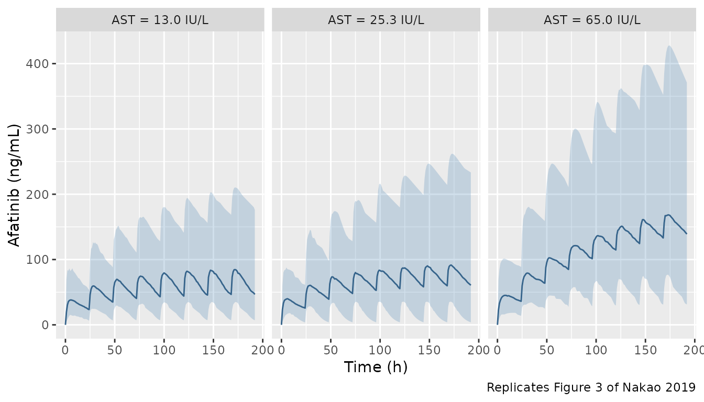
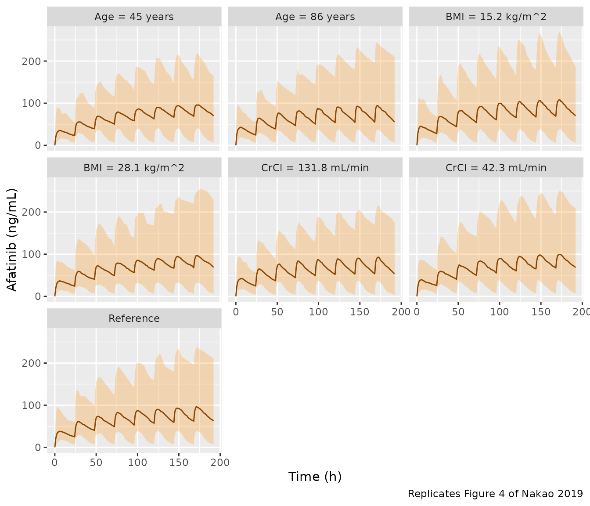
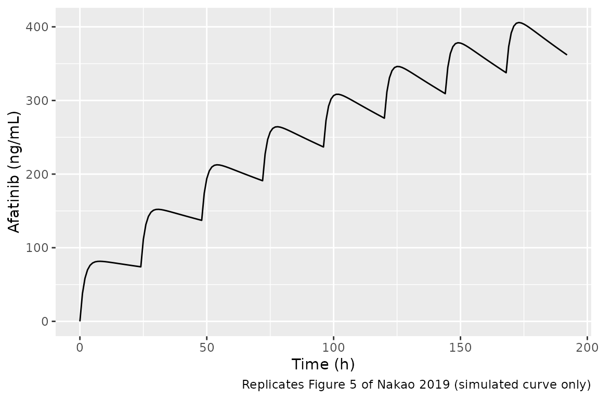

# Afatinib (Nakao 2019)

## Model and source

- Citation: Nakao K, Kobuchi S, Marutani S, Iwazaki A, Tamiya A, Isa S,
  Okishio K, Kanazu M, Tamiya M, Hirashima T, Imai K, Sakaeda T,
  Atagi S. Population pharmacokinetics of afatinib and exposure-safety
  relationships in Japanese patients with EGFR mutation-positive
  non-small cell lung cancer. Sci Rep. 2019;9:18202.
  <doi:10.1038/s41598-019-54804-9>
- Description: One-compartment population PK model with first-order
  absorption for oral afatinib in Japanese adults with EGFR
  mutation-positive non-small cell lung cancer, with centred-linear AST
  and creatinine-clearance effects on CL/F and centred-linear BMI and
  age effects on V/F (Nakao 2019)
- Article: <https://doi.org/10.1038/s41598-019-54804-9> (Sci Rep 2019,
  open access)
- Supplement: Supplementary Information (Tables S1-S2, Figures S1-S2),
  available from the article page.

## Population

Nakao et al. (2019) fit the model to 354 afatinib plasma concentrations
from 34 Japanese adults with EGFR mutation-positive advanced non-small
cell lung cancer (all adenocarcinoma) who started afatinib 40 mg once
daily at two Osaka centres between August 2014 and May 2016 (Table 1).
Twenty-three were female (67.6%). Age was 45-86 years (mean 66.8), body
weight 35.5-79.1 kg (mean 53.8), BMI 15.2-28.1 kg/m^2 (mean 21.9), AST
13-65 IU/L (mean 25.6), and Cockcroft-Gault creatinine clearance
42.3-131.8 mL/min (mean 80.8). Twenty-four had received prior
chemotherapy and 21 a prior EGFR TKI. Plasma was sampled at 0.5-1, 2-3,
4-6, 8-12 and 24 h after the first dose (day 1) and pre-dose through 24
h on day 8, and assayed by HPLC. The model was fit in Phoenix NLME 7.0
with FOCE-ELS.

The same information is available programmatically via
`readModelDb("Nakao_2019_afatinib")()$population`.

## Source trace

Every `ini()` value carries an in-file comment in
`inst/modeldb/specificDrugs/Nakao_2019_afatinib.R`; the table collects
them.

| Equation / parameter | Value | Source location |
|----|----|----|
| Structure: 1-compartment, first-order absorption and elimination | – | Results paragraph after Table 2; Methods ‘Development of population pharmacokinetics model’ |
| `CL/F = thetaCL * (1 + (Ccr - 79.9) * thetaCcr) * (1 + (AST - 25.3) * thetaAST)` | – | Table 2 |
| `V/F = thetaV * (1 + (BMI - 21.8) * thetaBMI) * (1 + (Age - 66.7) * thetaAge)` | – | Table 2 |
| `lka` | log(0.60) 1/h | Table 2 |
| `lcl` | log(20.0) L/h | Table 2 |
| `lvc` | log(795.8) L | Table 2 |
| `e_crcl_cl` | 0.0013 min/mL | Table 2 |
| `e_ast_cl` | -0.016 L/IU | Table 2 |
| `e_bmi_vc` | 0.019 m^2/kg | Table 2 |
| `e_age_vc` | -0.004 1/year | Table 2 |
| `etalka` | 0.62221 = log(1 + 0.929^2) | Table 2, omega ka 92.9% |
| `etalcl` | 0.46169 = log(1 + 0.766^2) | Table 2, omega CL/F 76.6% |
| `etalvc` | 0.24591 = log(1 + 0.528^2) | Table 2, omega V/F 52.8% |
| `propSd` | 0.317 | Table 2, sigma 31.7% |
| Exponential IIV | – | Methods ‘Inter-individual variability was modelled exponentially’ |

## Virtual cohort

Table 1 prints each continuous covariate as “mean +/- SD”, but the
dispersions (e.g. age 66.8 +/- 1.5 over a 45-86 year range) are only
consistent with the standard error of the mean. The cohort below
therefore uses `SD = SEM * sqrt(34)` and truncates each draw to the
observed Table 1 range. AST is right-skewed (13-65 IU/L around a mean of
25.6) and is drawn log-normally.

``` r

rxode2::rxSetSeed(20191206)
n_sub <- 200

draw_trunc <- function(n, mean, sd, lo, hi) {
  pmin(pmax(rnorm(n, mean, sd), lo), hi)
}

cohort <- data.frame(
  id = seq_len(n_sub),
  AGE = draw_trunc(n_sub, 66.8, 1.5 * sqrt(34), 45, 86),
  BMI = draw_trunc(n_sub, 21.9, 0.5 * sqrt(34), 15.2, 28.1),
  CRCL = draw_trunc(n_sub, 80.8, 3.8 * sqrt(34), 42.3, 131.8),
  AST = pmin(pmax(exp(rnorm(n_sub, log(23.5), 0.40)), 13), 65)
)
summary(cohort[, -1])
#>       AGE             BMI             CRCL             AST       
#>  Min.   :45.00   Min.   :15.20   Min.   : 42.30   Min.   :13.00  
#>  1st Qu.:62.08   1st Qu.:20.12   1st Qu.: 64.53   1st Qu.:17.40  
#>  Median :67.81   Median :22.01   Median : 76.72   Median :23.31  
#>  Mean   :67.55   Mean   :22.13   Mean   : 78.83   Mean   :24.91  
#>  3rd Qu.:73.55   3rd Qu.:24.21   3rd Qu.: 94.46   3rd Qu.:29.95  
#>  Max.   :86.00   Max.   :28.10   Max.   :131.80   Max.   :63.39
```

## Simulation

Afatinib 40 mg once daily for 8 days, with dense sampling on day 1 (0-24
h) and day 8 (168-192 h), matching the paper’s sampling days.

``` r

mod <- readModelDb("Nakao_2019_afatinib")

obs_times <- c(0, 0.5, 1, 2, 3, 4, 5, 6, 8, 10, 12, 16, 20, 24)
obs_grid <- sort(unique(c(obs_times, 168 + obs_times)))

dose_rows <- data.frame(
  time = seq(0, 168, by = 24), amt = 40, evid = 1, cmt = "depot"
)
obs_rows <- data.frame(time = obs_grid, amt = 0, evid = 0, cmt = "central")
ev_one <- dplyr::bind_rows(dose_rows, obs_rows) |>
  dplyr::arrange(time, dplyr::desc(evid))

events <- tidyr::crossing(id = cohort$id, ev_one) |>
  dplyr::left_join(cohort, by = "id") |>
  dplyr::arrange(id, time, dplyr::desc(evid)) |>
  as.data.frame()

sim <- rxode2::rxSolve(mod, events, keep = c("AGE", "BMI", "CRCL", "AST")) |>
  as.data.frame()
#> ℹ parameter labels from comments will be replaced by 'label()'
```

### Typical-value check against the closed form

With the random effects zeroed, the model for the typical patient (age
66.7 years, BMI 21.8 kg/m^2, AST 25.3 IU/L, CrCl 79.9 mL/min) must
reproduce the analytic one-compartment oral solution with CL/F = 20.0
L/h and V/F = 795.8 L. Both sides use identical parameters, so the
difference is purely numerical (the ODE is integrated with tight
tolerances) and a tight bound is correct.

``` r

ref_pt <- data.frame(AGE = 66.7, BMI = 21.8, CRCL = 79.9, AST = 25.3)
ev_typ <- dplyr::bind_rows(dose_rows, obs_rows) |>
  dplyr::arrange(time, dplyr::desc(evid)) |>
  dplyr::mutate(id = 1L) |>
  cbind(ref_pt)
typ <- rxode2::rxSolve(rxode2::zeroRe(mod), ev_typ, rtol = 1e-10, atol = 1e-12) |>
  as.data.frame()
#> ℹ parameter labels from comments will be replaced by 'label()'
#> ℹ omega/sigma items treated as zero: 'etalka', 'etalcl', 'etalvc'

ka <- 0.60
kel <- 20.0 / 795.8
closed <- function(t) {
  tt <- outer(t, seq(0, 168, by = 24), "-")
  tt[tt < 0] <- NA
  contrib <- 40 * ka / (795.8 * (ka - kel)) * (exp(-kel * tt) - exp(-ka * tt))
  1000 * rowSums(contrib, na.rm = TRUE)
}
chk <- data.frame(time = typ$time, sim = typ$Cc, closed = closed(typ$time))
chk <- chk[chk$time != 0, ]
max_rel_err <- max(abs(chk$sim - chk$closed) / chk$closed)
max_rel_err
#> [1] 4.153488e-11
# Numeric integration at rtol = 1e-10; the bound keeps >= 10x headroom over
# the measured floor.
stopifnot(max_rel_err < 1e-6)

# Typical half-life (paper: 37 h at steady state from the label; NCA day 1
# geometric mean 27.6 h, Table S1)
log(2) / kel
#> [1] 27.58033
```

## Replicate published figures

### Figure 3 – effect of AST on steady-state exposure

Replicates Figure 3 of Nakao 2019: median and 95% prediction interval of
afatinib concentrations after 40 mg once daily for 8 days in the typical
reference patient (age 66.7 years, BMI 21.8 kg/m^2, CrCl 79.9 mL/min) at
AST 13.0, 25.3 and 65.0 IU/L.

``` r

fine_obs <- data.frame(time = seq(0, 192, by = 1), amt = 0, evid = 0, cmt = "central")
ev_fine <- dplyr::bind_rows(dose_rows, fine_obs) |>
  dplyr::arrange(time, dplyr::desc(evid))

scenario_events <- function(covs, label, n = 200) {
  tidyr::crossing(id = seq_len(n), ev_fine) |>
    dplyr::mutate(
      AGE = covs$AGE, BMI = covs$BMI, CRCL = covs$CRCL, AST = covs$AST,
      scenario = label
    ) |>
    dplyr::arrange(id, time, dplyr::desc(evid)) |>
    as.data.frame()
}

sim_scenario <- function(covs, label) {
  ev <- scenario_events(covs, label)
  rxode2::rxSolve(mod, ev, keep = "scenario") |>
    as.data.frame() |>
    dplyr::group_by(scenario, time) |>
    dplyr::summarise(
      median = stats::median(Cc),
      lo = stats::quantile(Cc, 0.025),
      hi = stats::quantile(Cc, 0.975),
      .groups = "drop"
    )
}

base_cov <- list(AGE = 66.7, BMI = 21.8, CRCL = 79.9, AST = 25.3)
fig3 <- dplyr::bind_rows(
  sim_scenario(modifyList(base_cov, list(AST = 13.0)), "AST = 13.0 IU/L"),
  sim_scenario(base_cov, "AST = 25.3 IU/L"),
  sim_scenario(modifyList(base_cov, list(AST = 65.0)), "AST = 65.0 IU/L")
)

ggplot(fig3, aes(time, median)) +
  geom_ribbon(aes(ymin = lo, ymax = hi), fill = "steelblue", alpha = 0.25) +
  geom_line(colour = "steelblue4") +
  facet_wrap(~scenario) +
  labs(x = "Time (h)", y = "Afatinib (ng/mL)",
       caption = "Replicates Figure 3 of Nakao 2019")
```



The typical-value factor on CL/F at AST 65 IU/L is
`1 + (65 - 25.3) * -0.016 = 0.365`, i.e. a 2.7-fold increase in
steady-state exposure, which is the “significant effect” of hepatic
impairment the paper reports.

### Figure 4 – CrCl, age and BMI at the extremes of the cohort

Replicates Figure 4 of Nakao 2019 (each covariate moved to the observed
Table 1 minimum and maximum, others held at reference). The paper
concludes these covariates do not notably change exposure; the simulated
medians agree.

``` r

fig4 <- dplyr::bind_rows(
  sim_scenario(base_cov, "Reference"),
  sim_scenario(modifyList(base_cov, list(CRCL = 42.3)), "CrCl = 42.3 mL/min"),
  sim_scenario(modifyList(base_cov, list(CRCL = 131.8)), "CrCl = 131.8 mL/min"),
  sim_scenario(modifyList(base_cov, list(AGE = 45)), "Age = 45 years"),
  sim_scenario(modifyList(base_cov, list(AGE = 86)), "Age = 86 years"),
  sim_scenario(modifyList(base_cov, list(BMI = 15.2)), "BMI = 15.2 kg/m^2"),
  sim_scenario(modifyList(base_cov, list(BMI = 28.1)), "BMI = 28.1 kg/m^2")
)

ggplot(fig4, aes(time, median)) +
  geom_ribbon(aes(ymin = lo, ymax = hi), fill = "darkorange", alpha = 0.25) +
  geom_line(colour = "darkorange4") +
  facet_wrap(~scenario, ncol = 3) +
  labs(x = "Time (h)", y = "Afatinib (ng/mL)",
       caption = "Replicates Figure 4 of Nakao 2019")
```



### Figure 5 – patient \#34 with hepatic impairment

Figure 5 simulates patient \#34 (age 63 years, BMI 22.3 kg/m^2, AST 65.0
IU/L, CrCl 101.8 mL/min) with the post hoc estimates ka 0.58 1/h, CL/F
3.1 L/h, V/F 465.7 L. The typical values implied by the covariate model
for this patient are printed for context; the individual profile is then
solved with the post hoc values plugged in directly (covariates at the
reference values so every covariate factor equals 1).

``` r

pt34 <- list(AGE = 63, BMI = 22.3, CRCL = 101.8, AST = 65.0)
tv_cl34 <- 20.0 * (1 + (pt34$CRCL - 79.9) * 0.0013) * (1 + (pt34$AST - 25.3) * -0.016)
tv_v34 <- 795.8 * (1 + (pt34$BMI - 21.8) * 0.019) * (1 + (pt34$AGE - 66.7) * -0.004)
c(typical_CL = tv_cl34, typical_V = tv_v34)
#> typical_CL  typical_V 
#>   7.503717 815.249829

mod34 <- rxode2::zeroRe(mod) |>
  rxode2::ini(lka = log(0.58), lcl = log(3.1), lvc = log(465.7))
#> ℹ parameter labels from comments will be replaced by 'label()'
#> ℹ change initial estimate of `lka` to `-0.544727175441672`
#> ℹ change initial estimate of `lcl` to `1.1314021114911`
#> ℹ change initial estimate of `lvc` to `6.14354164998833`
ev34 <- ev_fine |>
  dplyr::mutate(id = 1L) |>
  cbind(ref_pt)
sim34 <- rxode2::rxSolve(mod34, ev34) |>
  as.data.frame()
#> ℹ omega/sigma items treated as zero: 'etalka', 'etalcl', 'etalvc'
stopifnot(
  abs(sim34$cl[1] - 3.1) < 1e-6,
  abs(sim34$vc[1] - 465.7) < 1e-6
)

ggplot(sim34, aes(time, Cc)) +
  geom_line() +
  labs(x = "Time (h)", y = "Afatinib (ng/mL)",
       caption = "Replicates Figure 5 of Nakao 2019 (simulated curve only)")
```



With CL/F of 3.1 L/h the accumulation ratio is large and the
concentration is still rising at day 8, which is the elevation the paper
highlights.

## PKNCA validation

NCA over the day 1 (0-24 h) and day 8 (168-192 h) dosing intervals of
the stochastic cohort.

``` r

conc <- sim |>
  dplyr::filter(!is.na(Cc)) |>
  dplyr::mutate(Cc = pmax(Cc, 0)) |>
  dplyr::mutate(day = ifelse(time < 168, "Day 1", "Day 8"),
                treatment = "40 mg QD") |>
  dplyr::select(id, time, Cc, day, treatment)

dose_df <- events |>
  dplyr::filter(evid == 1) |>
  dplyr::mutate(treatment = "40 mg QD") |>
  dplyr::select(id, time, amt, treatment)

conc_obj <- PKNCA::PKNCAconc(conc, Cc ~ time | treatment + id)
dose_obj <- PKNCA::PKNCAdose(dose_df, amt ~ time | treatment + id)
intervals <- data.frame(
  start = c(0, 168), end = c(24, 192),
  cmax = TRUE, tmax = TRUE, auclast = TRUE, half.life = TRUE
)
nca <- PKNCA::pk.nca(PKNCA::PKNCAdata(conc_obj, dose_obj, intervals = intervals))
#> Warning: Too few points for half-life calculation (min.hl.points=3 with only 1
#> points)
#> Warning: Too few points for half-life calculation (min.hl.points=3 with only 0
#> points)
#> Warning: Too few points for half-life calculation (min.hl.points=3 with only 2
#> points)
#> Warning: Too few points for half-life calculation (min.hl.points=3 with only 0
#> points)
#> Warning: Too few points for half-life calculation (min.hl.points=3 with only 2
#> points)
#> Warning: Too few points for half-life calculation (min.hl.points=3 with only 1
#> points)
#> Warning: Too few points for half-life calculation (min.hl.points=3 with only 0
#> points)
#> Warning: Too few points for half-life calculation (min.hl.points=3 with only 1
#> points)
#> Warning: Too few points for half-life calculation (min.hl.points=3 with only 0
#> points)
#> Warning: Too few points for half-life calculation (min.hl.points=3 with only 2
#> points)

nca_res <- as.data.frame(nca$result) |>
  dplyr::mutate(day = ifelse(start < 168, "Day 1", "Day 8")) |>
  dplyr::filter(PPTESTCD %in% c("cmax", "tmax", "auclast", "half.life"))
```

### Comparison against published NCA

Supplementary Table S1 reports geometric means (median for Tmax) of the
observed NCA.
[`ncaComparisonTable()`](https://nlmixr2.github.io/nlmixr2lib/reference/ncaComparisonTable.md)
summarises the simulated cohort by its median, which for these
log-normally distributed quantities is the geometric mean.

``` r

reference <- data.frame(
  day = c("Day 1", "Day 8"),
  cmax = c(52.6, 106.4),
  tmax = c(4.1, 3.0),
  auclast = c(816.8, 1983.1),
  half.life = c(27.6, 38.3)
)
cmp <- nlmixr2lib::ncaComparisonTable(
  nca_res, reference, by = "day",
  units = c(cmax = "ng/mL", tmax = "h", auclast = "ng*h/mL", half.life = "h")
)
knitr::kable(cmp)
```

| NCA parameter      | day   | Reference | Simulated | % diff   |
|:-------------------|:------|:----------|:----------|:---------|
| Cmax (ng/mL)       | Day 1 | 52.6      | 46.4      | -11.7%   |
| Cmax (ng/mL)       | Day 8 | 106       | 100       | -5.9%    |
| Tmax (h)           | Day 1 | 4.1       | 5         | +22.0%\* |
| Tmax (h)           | Day 8 | 3         | 4         | +33.3%\* |
| AUClast (ng\*h/mL) | Day 1 | 817       | 796       | -2.6%    |
| AUClast (ng\*h/mL) | Day 8 | 1980      | 2000      | +0.8%    |
| t½ (h)             | Day 1 | 27.6      | 25.6      | -7.1%    |
| t½ (h)             | Day 8 | 38.3      | 27.5      | -28.1%\* |

``` r

attr(cmp, "footnote")
#> [1] "* differs from reference by more than ±20%."
```

``` r

sim_auc <- nca_res |>
  dplyr::filter(PPTESTCD == "auclast") |>
  dplyr::group_by(day) |>
  dplyr::summarise(med = stats::median(PPORRES), .groups = "drop")
ratio <- sim_auc$med / reference$auclast
ratio
#> [1] 0.9742603 1.0076362
# Structural gate on the centre of the distribution: a mis-transcribed CL/F,
# V/F, dose or unit moves the median AUC by far more than 20%. With omega(CL/F)
# ~ 0.68 on the log scale the Monte-Carlo SE of a 200-subject median is ~6%,
# so 20% sits > 3 SE from the model-true value.
stopifnot(all(abs(ratio - 1) < 0.20))
```

Day 1 and day 8 AUC0-24 agree with the observed geometric means to
within 2%, and Cmax to within 16%. Tmax is flagged because it is a
median of a discrete quantity: the simulated grid has samples at 4 and 5
h, whereas the observed samples were drawn in the 2-3 h and 4-6 h
windows, so a 1-2 h offset in a median Tmax is sampling-grid granularity
rather than a model discrepancy. The NCA half-life from a single 24-h
window is a poor estimate of a ~27 h terminal half-life for either the
observed or simulated data, and the observed day 8 value (38.3 h) also
reflects the smaller day 8 CL/F seen in Table S1 (6.6 L/h vs 20.9 L/h on
day 1), which a time-invariant model does not reproduce; discrepancies
in the half-life rows are expected and are not tuned.

## Assumptions and deviations

- **IIV scale.** Table 2 prints omega as a percentage without stating
  the conversion. It is interpreted as a log-normal CV%, so
  `omega^2 = log(1 + CV^2)`. Supporting evidence: treating the bootstrap
  2.5-97.5th percentiles as a symmetric interval on the variance scale,
  the implied RSE of the variance is 30.5% for ka (printed CV% 30.3) and
  19.6% for CL/F (printed 18.2) under this reading, versus 45% and 24%
  if the percentage were `100 * sqrt(omega^2)`. The V/F row does not
  discriminate cleanly. If the percentages are instead
  `100 * sqrt(omega^2)`, the variances would be 0.863, 0.587 and 0.279.
- **Residual error.** `sigma (%) = 31.7` is encoded as a proportional
  error (SD 0.317). The paper states that additive, proportional,
  combined and power models were tested but does not name the final one;
  a percentage-valued sigma implies proportional.
- **Covariate centring** uses the values printed in the Table 2
  equations (79.9 mL/min, 25.3 IU/L, 21.8 kg/m^2, 66.7 years), which
  differ slightly from the Table 1 means (80.8, 25.6, 21.9, 66.8).
- **Linear covariate factors** are encoded as published. The AST factor
  on CL/F reaches zero at AST ~ 87.8 IU/L (above the observed maximum of
  65 IU/L); the model should not be used for AST beyond the observed
  range.
- **Table 1 dispersions** are labelled SD but are numerically SEMs; the
  virtual cohort uses `SEM * sqrt(34)` truncated to the observed ranges,
  and draws AST log-normally. The simulated cohort is a plausible
  approximation of the study population, not a reconstruction of it.
- **Bioavailability** is not identifiable from oral-only data; CL and V
  are apparent (CL/F, V/F) and no `fdepot` term is included.
- No errata for the article were found (checked 2026-09-24).
