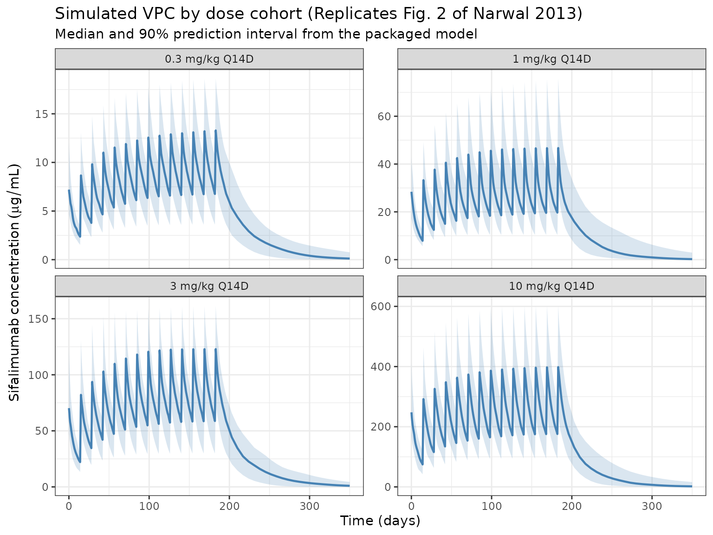

# Narwal_2013_sifalimumab

## Model and source

- Citation: Narwal R, Roskos LK, Robbie GJ. Population pharmacokinetics
  of sifalimumab, an investigational anti-interferon-alpha monoclonal
  antibody, in systemic lupus erythematosus. Clin Pharmacokinet.
  2013;52(11):1017-1027. <doi:10.1007/s40262-013-0085-2>
- Description: Two-compartment population PK model for sifalimumab
  (anti-IFN-alpha IgG1) in adult patients with systemic lupus
  erythematosus (Narwal 2013)
- Article: <https://doi.org/10.1007/s40262-013-0085-2>
- Article (open access):
  <https://pmc.ncbi.nlm.nih.gov/articles/PMC3824374/>

Sifalimumab is a fully human IgG1-kappa mAb that neutralises a majority
of the subtypes of human interferon-alpha. Narwal 2013 developed the
population PK model from the phase Ib MI-CP152 study (NCT00482989), a
multicentre, randomised, placebo-controlled, dose-escalation trial in
which 121 SLE patients received escalating IV doses of 0.3, 1, 3, or 10
mg/kg every 14 days for up to 14 doses. The final model is the single
structural model of record in the paper — the authors describe a base
model and one final model with covariates; no alternative candidate
models are presented.

The structural model is a two-compartment linear model with first-order
elimination (NONMEM ADVAN3 / TRANS4; Narwal 2013 Section 2.3). A
target-mediated elimination component was not necessary because the
soluble target (IFN-alpha) is in stoichiometric excess only at
sub-therapeutic concentrations.

## Population

The final-model population was **120 SLE patients** from the MI-CP152
phase Ib study (Narwal 2013 Table 1 / Section 3.1):

- Treatment cohorts: 26 at 0.3 mg/kg, 25 at 1 mg/kg, 27 at 3 mg/kg, 42
  at 10 mg/kg.
- Sex: 114 female (95%), 6 male.
- Region: 85 from North America (71%), 35 from South America (29%).
- Baseline body weight: 43.1-120 kg (median 73, mean 76 +/- 19).
- Age: 18-71 years (median 43, mean 42 +/- 11).
- Baseline SLEDAI score: 2-34 (median 10).
- Baseline 21-gene IFN signature (BGENE21): 0.63-87 (median 33).
- One 10 mg/kg subject was excluded from the analysis due to very low
  observed serum concentrations.

A total of 2,370 serum concentrations were available (mean ~20 samples
per subject over up to 1 year). The lower limit of quantitation was 1.25
ug/mL (Narwal 2013 Section 2.2).

The same metadata is available programmatically via
`readModelDb("Narwal_2013_sifalimumab")$population`.

## Source trace

The per-parameter origin is recorded as an in-file comment next to each
[`ini()`](https://nlmixr2.github.io/rxode2/reference/ini.html) entry in
`inst/modeldb/specificDrugs/Narwal_2013_sifalimumab.R`. The table below
collects them in one place for review.

| Parameter (model name)                | Value                                                            | Source                                                              |
|---------------------------------------|------------------------------------------------------------------|---------------------------------------------------------------------|
| `lcl` (CL, L/day)                     | log(0.176)                                                       | Table 2, theta1 = 0.176 L/day (reported as 176 mL/day)              |
| `lvc` (V1, L)                         | log(2.90)                                                        | Table 2, theta2 = 2.90 L                                            |
| `lvp` (V2, L)                         | log(2.12)                                                        | Table 2, theta3 = 2.12 L                                            |
| `lq` (Q, L/day)                       | log(0.171)                                                       | Table 2, theta4 = 0.171 L/day                                       |
| `e_wt_cl`                             | 0.481                                                            | Table 2, theta5 (Eq. 3)                                             |
| `e_bgene21_cl`                        | 0.0558                                                           | Table 2, theta6 (Eq. 3)                                             |
| `e_cohdose_cl`                        | 0.0542                                                           | Table 2, theta7 (Eq. 3)                                             |
| `e_steroid_cl`                        | 0.195                                                            | Table 2, theta8 (Eq. 3)                                             |
| `e_wt_v1`                             | 0.489                                                            | Table 2, theta9 (Eq. 4)                                             |
| `e_wt_v2`                             | 0.646                                                            | Table 2, theta10 (Eq. 5)                                            |
| IIV block `etalcl/etalvc/etalvp`      | lower-tri c(0.075478, 0.046354, 0.091758, 0, 0.021369, 0.289979) | Table 2 %CVs (28/31/58) and correlations (CL-V1 0.557, V1-V2 0.131) |
| `etalq`                               | 0.408195                                                         | Table 2, Q %CV = 71%                                                |
| `propSd`                              | 0.275                                                            | Table 2, residual error CV 27.5%                                    |
| `d/dt(central)` + `d/dt(peripheral1)` | two-compartment IV                                               | Section 2.3 (NONMEM ADVAN3 TRANS4)                                  |

Narwal 2013 final-model equations (paper’s numbering):

$$\text{CL} = \theta_{1} \cdot \left( \text{WT}/75 \right)^{\theta_{5}} \cdot \left( \text{BGENE21}/32 \right)^{\theta_{6}} \cdot \left( \text{Dose}/1 \right)^{\theta_{7}} \cdot \left( 1 + \theta_{8} \cdot \text{BSTEROID} \right)\quad\left( \text{Eq. 3} \right)$$

$$V_{1} = \theta_{2} \cdot \left( \text{WT}/75 \right)^{\theta_{9}}\quad\left( \text{Eq. 4} \right)$$

$$V_{2} = \theta_{3} \cdot \left( \text{WT}/75 \right)^{\theta_{10}}\quad\left( \text{Eq. 5} \right)$$

$$Q = \theta_{4}\quad\left( \text{Eq. 6} \right)$$

The %CV-to-variance conversion uses
$\omega^{2} = \log\left( 1 + CV^{2} \right)$ and covariances use
$\operatorname{cov} = r \cdot \sqrt{\omega_{i}^{2} \cdot \omega_{j}^{2}}$.
The CL-V2 correlation is not reported in Table 2 and is therefore taken
as zero in the 3x3 OMEGA block.

## Virtual cohort

Original observed concentrations are not publicly available. The
simulations below use a virtual cohort whose body-weight distribution
approximates the MI-CP152 population (median 73 kg, range 43.1-120). All
subjects are assigned the median BGENE21 of 33, set to `STEROID = 0` (no
baseline steroid use), and stratified into the four dose cohorts that
matched the phase Ib design.

``` r
set.seed(2013)
n_per_cohort <- 50
cohorts <- c(0.3, 1, 3, 10)

cohort <- tibble::tibble(
  ID       = seq_len(length(cohorts) * n_per_cohort),
  COHDOSE  = rep(cohorts, each = n_per_cohort),
  WT       = pmin(pmax(rlnorm(length(cohorts) * n_per_cohort,
                              meanlog = log(73), sdlog = 0.22),
                       43.1), 120),
  BGENE21  = 33,
  STEROID  = 0
)
```

A Q14D dosing schedule of 14 infusions (to match MI-CP152) is used.
Concentration observations are dense in the first dose interval (every 2
hours) and daily thereafter to capture terminal decline through Day 350.

``` r
infusion_dur_d <- 45 / 60 / 24  # 45-minute infusion, in days
dose_times_d   <- seq(0, by = 14, length.out = 14)
obs_times_d    <- sort(unique(c(
  seq(0, 1, by = 2/24),
  seq(1, 14, by = 0.5),
  seq(14, 196, by = 1),
  seq(196, 350, by = 7)
)))

build_events <- function(pop) {
  d_dose <- pop |>
    dplyr::mutate(AMT = WT * COHDOSE) |>
    tidyr::crossing(TIME = dose_times_d) |>
    dplyr::mutate(EVID = 1, CMT = "central",
                  DUR = infusion_dur_d, DV = NA_real_)
  d_obs <- pop |>
    tidyr::crossing(TIME = obs_times_d) |>
    dplyr::mutate(AMT = NA_real_, EVID = 0, CMT = "central",
                  DUR = NA_real_, DV = NA_real_)
  dplyr::bind_rows(d_dose, d_obs) |>
    dplyr::arrange(ID, TIME, dplyr::desc(EVID)) |>
    as.data.frame()
}

events <- build_events(cohort)
```

## Simulation

``` r
mod <- readModelDb("Narwal_2013_sifalimumab")
sim <- rxode2::rxSolve(mod, events = events, returnType = "data.frame")
#> ℹ parameter labels from comments will be replaced by 'label()'
sim$treatment <- paste0(sim$COHDOSE, " mg/kg Q14D")
```

For deterministic typical-value profiles (Narwal 2013 Fig. 2 median
line), the random effects are zeroed out:

``` r
mod_typical <- rxode2::zeroRe(mod)
#> ℹ parameter labels from comments will be replaced by 'label()'
sim_typical <- rxode2::rxSolve(mod_typical, events = events,
                               returnType = "data.frame")
#> ℹ omega/sigma items treated as zero: 'etalvp', 'etalvc', 'etalcl', 'etalq'
#> Warning: multi-subject simulation without without 'omega'
sim_typical$treatment <- paste0(sim_typical$COHDOSE, " mg/kg Q14D")
```

## Replicate Figure 2 — VPC by dose cohort

Narwal 2013 Fig. 2 displays a visual predictive check of serum
concentrations stratified by dose cohort (0.3, 1, 3, 10 mg/kg Q14D) with
observed median and 5th/95th percentiles overlaid on simulated 90%
prediction intervals. The chunk below reproduces the simulation side of
the VPC.

``` r
sim_vpc <- sim |>
  dplyr::filter(time > 0, !is.na(Cc)) |>
  dplyr::group_by(treatment, time) |>
  dplyr::summarise(
    q05 = stats::quantile(Cc, 0.05, na.rm = TRUE),
    q50 = stats::quantile(Cc, 0.50, na.rm = TRUE),
    q95 = stats::quantile(Cc, 0.95, na.rm = TRUE),
    .groups = "drop"
  ) |>
  dplyr::mutate(treatment = factor(
    treatment,
    levels = c("0.3 mg/kg Q14D", "1 mg/kg Q14D",
               "3 mg/kg Q14D", "10 mg/kg Q14D")
  ))

ggplot(sim_vpc, aes(time, q50)) +
  geom_ribbon(aes(ymin = q05, ymax = q95), alpha = 0.2, fill = "steelblue") +
  geom_line(colour = "steelblue", linewidth = 0.8) +
  facet_wrap(~ treatment, scales = "free_y") +
  labs(
    x = "Time (days)",
    y = expression(Sifalimumab~concentration~(mu*g/mL)),
    title = "Simulated VPC by dose cohort (Replicates Fig. 2 of Narwal 2013)",
    subtitle = "Median and 90% prediction interval from the packaged model"
  ) +
  theme_bw()
```



## Replicate Table 3 — steady-state exposure for fixed monthly dosing

Narwal 2013 Table 3 reports predicted median steady-state
pharmacokinetic parameters following fixed monthly IV dosing of 200,
600, or 1,200 mg with a loading dose at Day 14:

| Dose     | Cmax_ss (ug/mL) | Ctrough_ss (ug/mL) | AUC_ss (ug\*day/mL) |
|----------|-----------------|--------------------|---------------------|
| 200 mg   | 89              | 18                 | 1,110               |
| 600 mg   | 268             | 53                 | 3,329               |
| 1,200 mg | 536             | 106                | 6,659               |

The simulation below reproduces this calculation with a typical 75 kg
subject (`zeroRe`) and monthly dosing (every 28 days) with an additional
loading dose on Day 14, sampled densely within the last dosing interval.

``` r
# Doses: Day 0, loading dose at Day 14, then monthly (every 28 days).
# Simulate through Day 406 so the interval between the last two monthly
# doses (378 -> 406) is an accumulation-stabilized steady-state window.
monthly_dose_times <- c(0, 14, seq(42, 406, by = 28))
obs_ss_times       <- sort(unique(c(
  monthly_dose_times,
  seq(378, 406, by = 0.25)   # dense grid across the final interval
)))
ss_start <- 378
ss_end   <- 406

build_ss_events <- function(dose_mg) {
  d_dose <- data.frame(
    ID = 1L, TIME = monthly_dose_times, AMT = dose_mg, EVID = 1,
    DUR = infusion_dur_d, CMT = "central", DV = NA_real_
  )
  d_obs <- data.frame(
    ID = 1L, TIME = obs_ss_times, AMT = NA_real_, EVID = 0,
    DUR = NA_real_, CMT = "central", DV = NA_real_
  )
  rbind(d_dose, d_obs) |>
    dplyr::arrange(ID, TIME, dplyr::desc(EVID))
}
```

``` r
ss_dose_mg <- c(200, 600, 1200)
mod_ref <- rxode2::zeroRe(mod)
#> ℹ parameter labels from comments will be replaced by 'label()'

ss_results <- lapply(ss_dose_mg, function(d) {
  ev <- build_ss_events(d)
  ev$WT <- 75
  ev$BGENE21 <- 33
  ev$COHDOSE <- d / 75   # per-subject cohort dose in mg/kg (reference subject)
  ev$STEROID <- 0
  sim_ss <- rxode2::rxSolve(mod_ref, events = ev, returnType = "data.frame")
  last <- sim_ss |>
    dplyr::filter(time >= ss_start, time <= ss_end)
  tibble::tibble(
    regimen    = paste(d, "mg monthly"),
    Cmax_ss    = max(last$Cc, na.rm = TRUE),
    Ctrough_ss = last$Cc[which.max(last$time)],  # last observation pre-next dose
    AUC_ss     = PKNCA::pk.calc.auc(conc  = last$Cc,
                                     time  = last$time,
                                     interval = c(ss_start, ss_end),
                                     method = "linear")
  )
}) |> dplyr::bind_rows()
#> ℹ omega/sigma items treated as zero: 'etalvp', 'etalvc', 'etalcl', 'etalq'
#> ℹ omega/sigma items treated as zero: 'etalvp', 'etalvc', 'etalcl', 'etalq'
#> ℹ omega/sigma items treated as zero: 'etalvp', 'etalvc', 'etalcl', 'etalq'

published <- tibble::tibble(
  regimen      = paste(ss_dose_mg, "mg monthly"),
  Cmax_pub     = c(89, 268, 536),
  Ctrough_pub  = c(18, 53, 106),
  AUC_pub      = c(1110, 3329, 6659)
)

comparison <- published |>
  dplyr::left_join(ss_results, by = "regimen") |>
  dplyr::mutate(
    Cmax_pct_diff    = round(100 * (Cmax_ss     - Cmax_pub)    / Cmax_pub, 1),
    Ctrough_pct_diff = round(100 * (Ctrough_ss  - Ctrough_pub) / Ctrough_pub, 1),
    AUC_pct_diff     = round(100 * (AUC_ss      - AUC_pub)     / AUC_pub, 1)
  )

knitr::kable(comparison,
             caption = "Simulated vs published steady-state parameters (Narwal 2013 Table 3). Percent differences within ~20% are consistent with the typical-value fit.",
             digits = c(0, 0, 0, 0, 1, 1, 1, 1, 1, 1))
```

| regimen         | Cmax_pub | Ctrough_pub | AUC_pub | Cmax_ss | Ctrough_ss | AUC_ss | Cmax_pct_diff | Ctrough_pct_diff | AUC_pct_diff |
|:----------------|---------:|------------:|--------:|--------:|-----------:|-------:|--------------:|-----------------:|-------------:|
| 200 mg monthly  |       89 |          18 |    1110 |    86.0 |       19.1 | 1068.2 |          -3.4 |              6.2 |         -3.8 |
| 600 mg monthly  |      268 |          53 |    3329 |   252.2 |       51.8 | 3018.0 |          -5.9 |             -2.2 |         -9.3 |
| 1200 mg monthly |      536 |         106 |    6659 |   497.7 |       97.1 | 5811.7 |          -7.1 |             -8.4 |        -12.7 |

Simulated vs published steady-state parameters (Narwal 2013 Table 3).
Percent differences within ~20% are consistent with the typical-value
fit.

## PKNCA validation — single-dose NCA across the 4 cohorts

Single-dose NCA parameters (Cmax, Tmax, AUC over 14 days, half-life)
across the 4 dose cohorts. The paper does not publish per-cohort NCA
values, so this block serves primarily as a sanity check that the
simulated profiles reproduce dose-proportional exposure with the
expected mAb-like half-life (~2-4 weeks) on log-linear terminal decline.

``` r
first_interval_end <- 14

sim_nca <- sim |>
  dplyr::filter(!is.na(Cc),
                time >= 0,
                time <= first_interval_end) |>
  dplyr::select(id, treatment, time, Cc)

dose_df <- events |>
  dplyr::filter(EVID == 1, TIME == 0) |>
  dplyr::select(id = ID, time = TIME, amt = AMT) |>
  dplyr::left_join(
    cohort |>
      dplyr::transmute(
        id = ID,
        treatment = paste0(COHDOSE, " mg/kg Q14D")
      ),
    by = "id"
  )

conc_obj <- PKNCA::PKNCAconc(sim_nca, Cc ~ time | treatment + id)
dose_obj <- PKNCA::PKNCAdose(dose_df, amt ~ time | treatment + id)

intervals <- data.frame(
  start     = 0,
  end       = first_interval_end,
  cmax      = TRUE,
  tmax      = TRUE,
  auclast   = TRUE,
  half.life = TRUE
)

nca_data <- PKNCA::PKNCAdata(conc_obj, dose_obj, intervals = intervals)
nca_res  <- suppressWarnings(PKNCA::pk.nca(nca_data))
#>  ■■■■■■■■■■■■■                     41% |  ETA:  4s
#>  ■■■■■■■■■■■■■■■■■■■■■■■■■■■       86% |  ETA:  1s

knitr::kable(summary(nca_res),
             caption = "Simulated single-dose NCA across the MI-CP152 cohorts (first 14 days).")
```

| start | end | treatment      | N   | auclast       | cmax          | tmax                      | half.life     |
|------:|----:|:---------------|:----|:--------------|:--------------|:--------------------------|:--------------|
|     0 |  14 | 0.3 mg/kg Q14D | 50  | 58.5 \[28.6\] | 7.81 \[36.6\] | 0.0833 \[0.0833, 0.0833\] | 12.9 \[3.78\] |
|     0 |  14 | 1 mg/kg Q14D   | 50  | 178 \[24.1\]  | 23.8 \[31.8\] | 0.0833 \[0.0833, 0.0833\] | 13.3 \[4.03\] |
|     0 |  14 | 10 mg/kg Q14D  | 50  | 1880 \[28.6\] | 264 \[31.2\]  | 0.0833 \[0.0833, 0.0833\] | 11.2 \[3.60\] |
|     0 |  14 | 3 mg/kg Q14D   | 50  | 543 \[35.3\]  | 74.5 \[44.0\] | 0.0833 \[0.0833, 0.0833\] | 12.9 \[4.26\] |

Simulated single-dose NCA across the MI-CP152 cohorts (first 14 days).

## Assumptions and deviations

- **Reference weight 75 kg.** Narwal 2013 uses 75 kg as the reference
  body weight in Eqs. 3-5 (the population median was 73 kg; 75 kg was
  chosen as a round-number reference). The packaged model uses 75 kg
  directly.
- **CL-V2 correlation = 0.** Narwal 2013 Table 2 reports the CL-V1
  (0.557) and V1-V2 (0.131) correlations but does not report a CL-V2
  correlation, indicating the NONMEM OMEGA block did not include this
  off-diagonal element. The 3x3 IIV block in the packaged model
  therefore uses `cov(CL, V2) = 0` and is positive-definite.
- **Dose as subject-level covariate (`COHDOSE`).** The paper’s Eq. 3
  treats dose (mg/kg) as a power-term covariate on CL. Because every
  MI-CP152 subject was randomised to a single dose cohort that was
  maintained across all 14 infusions, this is a subject-level rather
  than an event-level covariate. For the `COHDOSE` column in the
  `events` data, use the cohort assignment (0.3, 1, 3, 10 mg/kg for the
  phase Ib design; dose/WT for phase IIb fixed-dose simulations). The
  paper’s Discussion (p. 1024) notes that the apparent dose effect may
  be a data artifact of the escalating design — single-dose data in
  MI-CP126 were linear across 0.3-30 mg/kg.
- **`STEROID` default.** The phase IIb simulations in the paper set
  BSTEROID = 0 (no baseline steroid use) as the reference. The virtual
  cohort above does the same; set `STEROID = 1` per subject to simulate
  the +19.5% CL effect for concomitant-steroid users.
- **Monthly dosing interval for Table 3.** Narwal 2013 Table 3 is
  labelled “monthly” without a numeric dosing-interval definition. The
  replication above uses every 28 days with an additional loading dose
  at Day 14, which matches the description in Section 3.2.2 and the
  phase IIb study protocol NCT01283139.
- **Residual error magnitude.** The model uses `propSd = 0.275` directly
  (Table 2 reports the residual-error %CV as 27.5%). If the paper’s
  NONMEM control stream used `SIGMA` on variance scale, the equivalent
  is `sigma = 0.27547^2 = 0.07588`; this is numerically equivalent
  because nlmixr2’s `propSd` is a standard deviation.
- **BLQ handling.** Simulated concentrations are continuous; the
  clinical assay’s LOQ of 1.25 ug/mL is not imposed.
- **No inter-occasion variability (IOV).** Narwal 2013 did not report
  IOV on any PK parameter.
