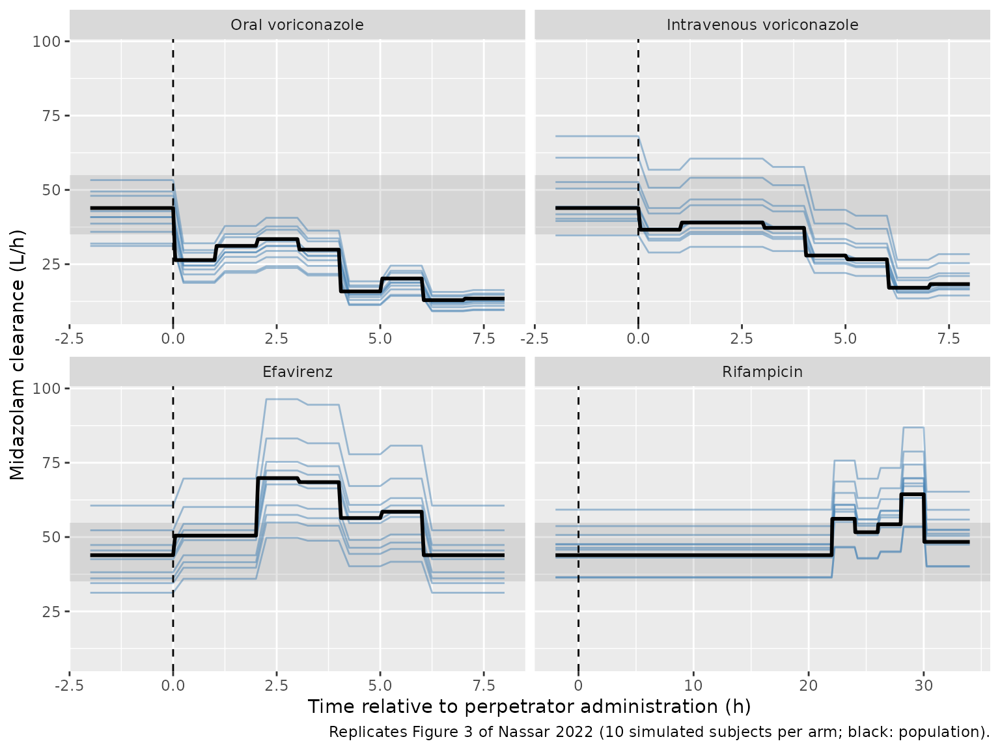
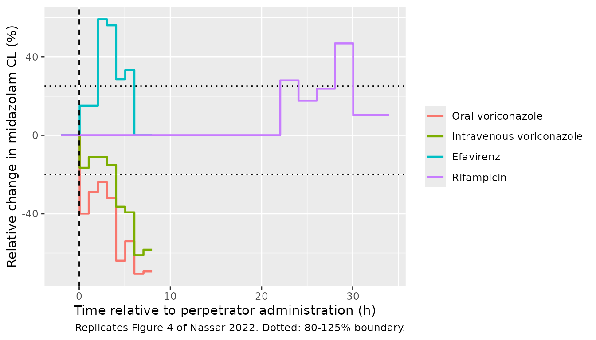
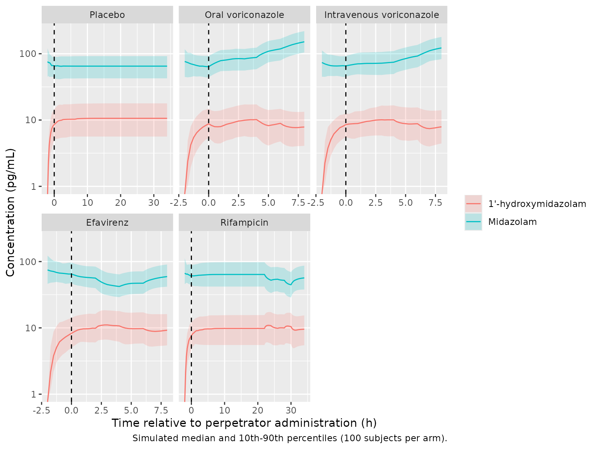

# Midazolam CYP3A perpetrator time course (Nassar 2022)

## Model and source

- Citation: Nassar YM, Hohmann N, Michelet R, Gottwalt K, Meid AD,
  Burhenne J, Huisinga W, Haefeli WE, Mikus G, Kloft C. Quantification
  of the Time Course of CYP3A Inhibition, Activation, and Induction
  Using a Population Pharmacokinetic Model of Microdosed Midazolam
  Continuous Infusion. Clin Pharmacokinet. 2022;61(11):1595-1607.
  <doi:10.1007/s40262-022-01175-6>. Final estimates from Table 1; model
  structure and perpetrator time windows from the NONMEM control stream
  in the Electronic Supplementary Material (ESM 4).
- Description: Joint parent-metabolite population PK model for
  intravenous microdosed midazolam and 1’-hydroxymidazolam in healthy
  adults, with time-resolved CYP3A perpetrator effects on midazolam
  clearance (Nassar 2022). One compartment for each analyte with linear
  elimination; a fixed 92% of midazolam clearance forms
  1’-hydroxymidazolam (mass-converted by the molar-mass ratio
  341.77/325.78). Oral voriconazole and intravenous voriconazole
  (inhibition), oral efavirenz (activation) and oral rifampicin
  (induction) each shift midazolam clearance by a separately estimated
  fraction in each of a set of discrete time intervals after the first
  perpetrator dose, CL = CLpop \* (1 + theta_ij). Doses are micrograms
  and concentrations pg/mL.
- Article: <https://doi.org/10.1007/s40262-022-01175-6> (open access, CC
  BY-NC 4.0)

Nassar et al. gave 24 healthy adults an intravenous microdose of
midazolam as a bolus followed by a constant-rate infusion, and 2 h later
a single CYP3A perpetrator: voriconazole 400 mg orally or as a 2-hour
intravenous infusion (inhibition), efavirenz 400 mg orally (activation),
or rifampicin 600 mg orally every 24 h for 2 days (induction). Instead
of a single DDI ratio, the joint midazolam / 1’-hydroxymidazolam model
estimates a separate fractional change in midazolam clearance for each
of a set of discrete time intervals after the perpetrator dose (Eq. 1):

``` math
CL_{ij} = CL_{pop} \cdot (1 + \theta_{ij}) \cdot e^{\eta_{CL}}
```

The perpetrator is not itself dosed in the model. Each subject carries
one perpetrator indicator (`CONMED_VORICONAZOLE_ORAL`,
`CONMED_VORICONAZOLE_IV`, `CONMED_EFV` or `CONMED_RIFAMPICIN`; all 0 for
placebo) and the time of the first perpetrator dose on the model time
axis, `T_CONMED` (2 h in the trial), from which the model computes the
time since the perpetrator dose.

## Population

Twenty-four healthy adults (12 female, 12 male) aged 22-54 years (mean
29.6) weighing 55.3-90.5 kg (mean 71.3) (ESM Table S3), enrolled at
Heidelberg University Hospital (EudraCT 2013-004869-14). Each of four
randomised arms had four perpetrator subjects and two placebo subjects;
the eight placebo subjects were pooled into a fifth arm. Midazolam bolus
doses ranged from 2.70 to 6.10 ug and infusion rates from 2.00 to 4.40
ug/h (ESM Table S2), individualised from a preceding 3 ug bolus period
to a target of about 100 pg/mL. Plasma was sampled every 15 min for 10 h
(hourly for 36 h in the rifampicin arm); 1858 concentrations were split
evenly between the two analytes, none below the limit of quantification.
No demographic covariate was retained.

The same information is available programmatically via
`readModelDb("Nassar_2022_midazolam")()$population`.

## Source trace

| Equation / parameter | Value | Source location |
|----|----|----|
| One compartment per analyte, linear elimination | n/a | Results 3.2, Fig. 2; ESM 4 `$DES` |
| `kel = (1 - fm) * cl / vc`, `kmet = fm * cl / vc`, `kel_1ohm = cl_1ohm / vc_1ohm` | n/a | ESM 4 `$PK` (K10, K12, K20) |
| Metabolite formation scaled by 341.77 / 325.78 | 1.049 | Methods 2.3.1; ESM 4 `$DES` |
| `Cc = 1000 * central / vc` (ug/L to pg/mL) | n/a | ESM 4 `S1 = V1/1000` |
| `cl = CLpop * (1 + theta_ij)` | n/a | Eq. 1; ESM 4 `CLFLAGMED` |
| Perpetrator windows, left-open right-closed | n/a | ESM 4 `TIME.GT.a.AND.TIME.LE.b`; Results 3.2 interval list |
| `lcl` | log(43.9) L/h | Table 1 ‘CL MDZ’ |
| `lvc` | log(56.7) L | Table 1 ‘V MDZ’ |
| `lcl_1ohm` | log(264) L/h | Table 1 ‘CL 1’-OH-MDZ’ |
| `lvc_1ohm` | log(300) L | Table 1 ‘V 1’-OH-MDZ’ |
| `fm` | 0.92 (fixed) | Table 1 ‘Fm’, footnote b; Methods 2.3.1 |
| `e_conmed_voriconazole_oral_cl_t0to1` … `_t7to8` | -0.399, -0.290, -0.238, -0.319, -0.639, -0.540, -0.706, -0.694 | Table 1 ‘Oral voriconazole’ |
| `e_conmed_voriconazole_iv_cl_t0to1` … `_t7to8` | -0.166, -0.111, -0.152, -0.364, -0.393, -0.611, -0.583 | Table 1 ‘Intravenous voriconazole’ |
| `e_conmed_efv_cl_t0to2` … `_t5to6` | 0.150, 0.591, 0.560, 0.285, 0.333 | Table 1 ‘Efavirenz’ |
| `e_conmed_rifampicin_cl_t22to24` … `_t30to34` | 0.279, 0.176, 0.237, 0.467, 0.102 | Table 1 ‘Rifampicin’ |
| `etalcl`, `etalvc`, `etalcl_1ohm`, `etalvc_1ohm` | 0.04685, 0.08563, 0.16246, 0.14773 | Table 1 IIV 21.9, 29.9, 42.0, 39.9 %CV, as log(CV^2 + 1) |
| `propSd`, `propSd_1ohm` | 0.126, 0.226 | Table 1 residual variability 12.6 and 22.6 %CV |

## Typical-value checks

These checks solve the model without random effects. Because both sides
use the same parameters, the only difference is numerical, and the
tolerances are tight.

``` r

mod <- readModelDb("Nassar_2022_midazolam")

arm_levels <- c(
  "Placebo", "Oral voriconazole", "Intravenous voriconazole",
  "Efavirenz", "Rifampicin"
)

# One subject's events: midazolam bolus + constant-rate infusion into
# `central` at time 0, perpetrator indicators per arm, perpetrator at
# T_CONMED = 2 h. Observation rows sit on the ODE state `central` with
# dvid = 1; rxode2 returns both Cc and Cc_1ohm on every row.
make_subject <- function(id, arm, bolus, rate, dur, dt = 0.25, t_conmed = 2) {
  doses <- data.frame(
    id = id, time = 0, amt = c(bolus, rate * dur), rate = c(0, rate),
    evid = 1L, cmt = "central", dvid = NA_integer_
  )
  obs <- data.frame(
    id = id, time = seq(0, dur, by = dt), amt = NA_real_, rate = NA_real_,
    evid = 0L, cmt = "central", dvid = 1L
  )
  dplyr::bind_rows(doses, obs) |>
    dplyr::mutate(
      CONMED_VORICONAZOLE_ORAL = as.integer(arm == "Oral voriconazole"),
      CONMED_VORICONAZOLE_IV = as.integer(arm == "Intravenous voriconazole"),
      CONMED_EFV = as.integer(arm == "Efavirenz"),
      CONMED_RIFAMPICIN = as.integer(arm == "Rifampicin"),
      T_CONMED = t_conmed,
      arm = arm
    )
}

# Typical subject per arm at the ESM Table S2 mean regimen (4.30 ug bolus,
# 2.87 ug/h); 36 h for placebo and rifampicin, 10 h otherwise.
ev_typ <- dplyr::bind_rows(lapply(seq_along(arm_levels), function(i) {
  dur <- if (arm_levels[i] %in% c("Placebo", "Rifampicin")) 36 else 10
  make_subject(i, arm_levels[i], bolus = 4.30, rate = 2.87, dur = dur, dt = 0.05)
}))

sim_typ <- rxode2::rxSolve(
  mod, ev_typ,
  omega = NA, sigma = NA, useLinCmt = FALSE,
  returnType = "data.frame", keep = "arm"
) |>
  dplyr::mutate(arm = factor(arm, levels = arm_levels), tconmed = time - 2)
#> ℹ parameter labels from comments will be replaced by 'label()'
```

### Derived rate constants

The Discussion reports a 1’-hydroxymidazolam formation rate constant of
0.712 1/h and an elimination rate constant of 0.880 1/h, the basis of
the authors’ flip-flop argument for the metabolite.

``` r

pbo0 <- sim_typ |> dplyr::filter(arm == "Placebo", time == 1)
rate_check <- data.frame(
  quantity = c("Formation rate constant kmet (1/h)", "Metabolite elimination kel_1ohm (1/h)"),
  model = c(pbo0$kmet, pbo0$kel_1ohm),
  paper = c(0.712, 0.880)
)
knitr::kable(rate_check, digits = 4, caption = "Derived rate constants vs Nassar 2022 Discussion.")
```

| quantity                              |  model | paper |
|:--------------------------------------|-------:|------:|
| Formation rate constant kmet (1/h)    | 0.7123 | 0.712 |
| Metabolite elimination kel_1ohm (1/h) | 0.8800 | 0.880 |

Derived rate constants vs Nassar 2022 Discussion. {.table}

``` r

stopifnot(all(abs(rate_check$model - rate_check$paper) < 0.0006))
```

### Clearance per time interval (ESM Table S4)

ESM Table S4 lists the typical midazolam clearance in every time
interval of every arm. Reading `cl` at each interval midpoint from the
typical solve tests the interval boundaries and the `(1 + theta)` form
at once.

``` r

table_s4 <- tibble::tribble(
  ~arm, ~lo, ~hi, ~cl_paper,
  "Oral voriconazole", 0, 1, 26.4,
  "Oral voriconazole", 1, 2, 31.2,
  "Oral voriconazole", 2, 3, 33.5,
  "Oral voriconazole", 3, 4, 29.9,
  "Oral voriconazole", 4, 5, 15.8,
  "Oral voriconazole", 5, 6, 20.2,
  "Oral voriconazole", 6, 7, 12.9,
  "Oral voriconazole", 7, 8, 13.4,
  "Intravenous voriconazole", 0, 1, 36.6,
  "Intravenous voriconazole", 1, 3, 39.0,
  "Intravenous voriconazole", 3, 4, 37.2,
  "Intravenous voriconazole", 4, 5, 27.9,
  "Intravenous voriconazole", 5, 6, 26.7,
  "Intravenous voriconazole", 6, 7, 17.1,
  "Intravenous voriconazole", 7, 8, 18.3,
  "Efavirenz", 0, 2, 50.5,
  "Efavirenz", 2, 3, 69.8,
  "Efavirenz", 3, 4, 68.5,
  "Efavirenz", 4, 5, 56.4,
  "Efavirenz", 5, 6, 58.5,
  "Efavirenz", 6, 8, 43.9,
  "Rifampicin", 0, 22, 43.9,
  "Rifampicin", 22, 24, 56.1,
  "Rifampicin", 24, 26, 51.6,
  "Rifampicin", 26, 28, 54.3,
  "Rifampicin", 28, 30, 64.4,
  "Rifampicin", 30, 34, 48.4,
  "Placebo", -2, 8, 43.9
)

cl_at <- function(a, t) {
  d <- sim_typ |> dplyr::filter(arm == a)
  d$cl[which.min(abs(d$tconmed - t))]
}
table_s4 <- table_s4 |>
  dplyr::mutate(
    mid = (lo + hi) / 2,
    cl_model = mapply(cl_at, arm, mid),
    pct_diff = 100 * (cl_model - cl_paper) / cl_paper
  )

table_s4 |>
  dplyr::mutate(interval = sprintf("(%g, %g]", lo, hi)) |>
  dplyr::select(arm, interval, cl_paper, cl_model, pct_diff) |>
  dplyr::rename(
    "Arm" = arm, "Interval after perpetrator (h)" = interval,
    "Table S4 CL (L/h)" = cl_paper, "Model CL (L/h)" = cl_model,
    "Difference (%)" = pct_diff
  ) |>
  knitr::kable(digits = 2, caption = "Typical midazolam clearance per interval vs ESM Table S4.")
```

| Arm | Interval after perpetrator (h) | Table S4 CL (L/h) | Model CL (L/h) | Difference (%) |
|:---|:---|---:|---:|---:|
| Oral voriconazole | (0, 1\] | 26.4 | 26.38 | -0.06 |
| Oral voriconazole | (1, 2\] | 31.2 | 31.17 | -0.10 |
| Oral voriconazole | (2, 3\] | 33.5 | 33.45 | -0.14 |
| Oral voriconazole | (3, 4\] | 29.9 | 29.90 | -0.01 |
| Oral voriconazole | (4, 5\] | 15.8 | 15.85 | 0.30 |
| Oral voriconazole | (5, 6\] | 20.2 | 20.19 | -0.03 |
| Oral voriconazole | (6, 7\] | 12.9 | 12.91 | 0.05 |
| Oral voriconazole | (7, 8\] | 13.4 | 13.43 | 0.25 |
| Intravenous voriconazole | (0, 1\] | 36.6 | 36.61 | 0.03 |
| Intravenous voriconazole | (1, 3\] | 39.0 | 39.03 | 0.07 |
| Intravenous voriconazole | (3, 4\] | 37.2 | 37.23 | 0.07 |
| Intravenous voriconazole | (4, 5\] | 27.9 | 27.92 | 0.07 |
| Intravenous voriconazole | (5, 6\] | 26.7 | 26.65 | -0.20 |
| Intravenous voriconazole | (6, 7\] | 17.1 | 17.08 | -0.13 |
| Intravenous voriconazole | (7, 8\] | 18.3 | 18.31 | 0.03 |
| Efavirenz | (0, 2\] | 50.5 | 50.48 | -0.03 |
| Efavirenz | (2, 3\] | 69.8 | 69.84 | 0.06 |
| Efavirenz | (3, 4\] | 68.5 | 68.48 | -0.02 |
| Efavirenz | (4, 5\] | 56.4 | 56.41 | 0.02 |
| Efavirenz | (5, 6\] | 58.5 | 58.52 | 0.03 |
| Efavirenz | (6, 8\] | 43.9 | 43.90 | 0.00 |
| Rifampicin | (0, 22\] | 43.9 | 43.90 | 0.00 |
| Rifampicin | (22, 24\] | 56.1 | 56.15 | 0.09 |
| Rifampicin | (24, 26\] | 51.6 | 51.63 | 0.05 |
| Rifampicin | (26, 28\] | 54.3 | 54.30 | 0.01 |
| Rifampicin | (28, 30\] | 64.4 | 64.40 | 0.00 |
| Rifampicin | (30, 34\] | 48.4 | 48.38 | -0.05 |
| Placebo | (-2, 8\] | 43.9 | 43.90 | 0.00 |

Typical midazolam clearance per interval vs ESM Table S4. {.table
style="width:100%;"}

``` r


# Table S4 is printed to three significant figures.
stopifnot(max(abs(table_s4$pct_diff)) < 0.5)
```

### Steady state

Midazolam is at steady state within a few hours (half-life
`log(2) * 56.7 / 43.9` = 0.90 h), so in the placebo arm the typical
concentration must equal `R / CL` and the metabolite
`fm * R * 1.049 / CL_1ohm`.

``` r

pbo_ss <- sim_typ |> dplyr::filter(arm == "Placebo", time == 10)
ss_check <- data.frame(
  analyte = c("Midazolam", "1'-hydroxymidazolam"),
  model = c(pbo_ss$Cc, pbo_ss$Cc_1ohm),
  closed_form = c(1000 * 2.87 / 43.9, 1000 * 0.92 * 2.87 * (341.77 / 325.78) / 264)
)
knitr::kable(ss_check, digits = 3, caption = "Placebo steady state at 2.87 ug/h (pg/mL).")
```

| analyte             |  model | closed_form |
|:--------------------|-------:|------------:|
| Midazolam           | 65.380 |      65.376 |
| 1’-hydroxymidazolam | 10.495 |      10.492 |

Placebo steady state at 2.87 ug/h (pg/mL). {.table}

``` r

stopifnot(all(abs(ss_check$model / ss_check$closed_form - 1) < 0.002))
```

## Virtual cohort

Observed data are not public. Each simulated arm has 100 subjects whose
bolus / infusion pairs are drawn with replacement from the 24
individualised regimens of ESM Table S2. Placebo subjects receive 36 h
of infusion so the placebo arm covers both the 10-h and the rifampicin
windows. No demographic covariate enters the model.

``` r

set.seed(20221004)
rxode2::rxSetSeed(20221004)

table_s2 <- data.frame(
  bolus = c(
    4.40, 5.10, 4.10, 4.60, 5.70, 5.60, 3.30, 3.40, 4.90, 3.40, 3.60, 3.30,
    2.70, 5.40, 2.90, 4.30, 5.90, 4.20, 4.40, 3.70, 3.40, 4.40, 4.30, 6.10
  ),
  rate = c(
    2.80, 3.10, 2.90, 3.60, 4.40, 3.50, 2.40, 2.10, 3.30, 2.10, 2.40, 2.60,
    2.00, 4.40, 2.70, 3.30, 3.10, 2.40, 2.70, 2.50, 2.30, 2.30, 2.90, 3.00
  )
)
stopifnot(abs(mean(table_s2$bolus) - 4.30) < 0.01, abs(mean(table_s2$rate) - 2.87) < 0.01)

n_per_arm <- 100L
make_arm <- function(arm, id_offset) {
  dur <- if (arm %in% c("Placebo", "Rifampicin")) 36 else 10
  pick <- sample(nrow(table_s2), n_per_arm, replace = TRUE)
  dplyr::bind_rows(lapply(seq_len(n_per_arm), function(k) {
    make_subject(
      id_offset + k, arm,
      bolus = table_s2$bolus[pick[k]], rate = table_s2$rate[pick[k]], dur = dur
    )
  }))
}
events <- dplyr::bind_rows(lapply(seq_along(arm_levels), function(i) {
  make_arm(arm_levels[i], id_offset = (i - 1L) * n_per_arm)
}))
# Each id belongs to exactly one arm (disjoint id ranges per arm).
stopifnot(!anyDuplicated(dplyr::distinct(events, id, arm)$id))
```

## Simulation

``` r

sim <- rxode2::rxSolve(
  mod, events,
  useLinCmt = FALSE, returnType = "data.frame", keep = "arm"
) |>
  dplyr::mutate(arm = factor(arm, levels = arm_levels), tconmed = time - 2)
stopifnot(!anyNA(sim$Cc), !anyNA(sim$Cc_1ohm))
```

## Replicate published figures

### Figure 3: individual clearance-time profiles

``` r

# Replicates Figure 3 of Nassar 2022: individual midazolam clearance vs time
# relative to perpetrator administration, with the population clearance per
# arm and the 80-125% band around the placebo value (35.1-54.9 L/h).
cl_ind <- sim |>
  dplyr::filter(arm != "Placebo", id %% 10 == 1)
cl_pop <- sim_typ |>
  dplyr::filter(arm != "Placebo", tconmed <= ifelse(arm == "Rifampicin", 34, 8))
ggplot() +
  annotate("rect", xmin = -Inf, xmax = Inf, ymin = 35.1, ymax = 54.9, alpha = 0.15) +
  geom_line(
    data = cl_ind |> dplyr::filter(tconmed <= ifelse(arm == "Rifampicin", 34, 8)),
    aes(tconmed, cl, group = id), colour = "steelblue", alpha = 0.5
  ) +
  geom_line(data = cl_pop, aes(tconmed, cl), linewidth = 1) +
  geom_vline(xintercept = 0, linetype = "dashed") +
  facet_wrap(~arm, scales = "free_x") +
  labs(
    x = "Time relative to perpetrator administration (h)",
    y = "Midazolam clearance (L/h)",
    caption = "Replicates Figure 3 of Nassar 2022 (10 simulated subjects per arm; black: population)."
  )
```



### Figure 4: relative change in midazolam clearance

``` r

# Replicates Figure 4 of Nassar 2022: relative change in typical midazolam
# clearance vs the placebo value, per perpetrator arm.
sim_typ |>
  dplyr::filter(arm != "Placebo", tconmed >= -2, tconmed <= ifelse(arm == "Rifampicin", 34, 8)) |>
  dplyr::mutate(rel_change = 100 * (cl / 43.9 - 1)) |>
  ggplot(aes(tconmed, rel_change, colour = arm)) +
  geom_hline(yintercept = c(-20, 25), linetype = "dotted") +
  geom_step(linewidth = 0.8) +
  geom_vline(xintercept = 0, linetype = "dashed") +
  labs(
    x = "Time relative to perpetrator administration (h)",
    y = "Relative change in midazolam CL (%)", colour = NULL,
    caption = "Replicates Figure 4 of Nassar 2022. Dotted: 80-125% boundary."
  )
```



The maximum relative changes are those of the abstract: +59.1%
(efavirenz), +46.7% (rifampicin), -70.6% (oral voriconazole) and -61.1%
(intravenous voriconazole).

``` r

max_change <- sim_typ |>
  dplyr::filter(arm != "Placebo") |>
  dplyr::mutate(rel_change = 100 * (cl / 43.9 - 1)) |>
  dplyr::group_by(arm) |>
  dplyr::summarise(model = rel_change[which.max(abs(rel_change))], .groups = "drop") |>
  dplyr::mutate(paper = c(-70.6, -61.1, 59.1, 46.7)[match(arm, arm_levels[-1])])
knitr::kable(max_change, digits = 1, caption = "Maximum relative change in midazolam CL (%).")
```

| arm                      | model | paper |
|:-------------------------|------:|------:|
| Oral voriconazole        | -70.6 | -70.6 |
| Intravenous voriconazole | -61.1 | -61.1 |
| Efavirenz                |  59.1 |  59.1 |
| Rifampicin               |  46.7 |  46.7 |

Maximum relative change in midazolam CL (%). {.table}

``` r

stopifnot(all(abs(max_change$model - max_change$paper) < 0.05))
```

### Onset of a clinically relevant change

The paper defines a relevant change as typical clearance outside 80-125%
of the placebo value (below 35.1 or above 54.9 L/h) and reports its
onset as immediate for oral voriconazole, 4 h for intravenous
voriconazole, 2 h for efavirenz and 28 h for rifampicin.

``` r

onset <- sim_typ |>
  dplyr::filter(arm != "Placebo", tconmed > 0) |>
  dplyr::group_by(arm) |>
  dplyr::summarise(
    # Windows have integer bounds, so the floor of the first excursion
    # time is the start of the first relevant interval.
    model_onset_h = floor(min(tconmed[cl < 35.1 | cl > 54.9])),
    .groups = "drop"
  ) |>
  dplyr::mutate(paper_onset_h = c(0, 4, 2, 28)[match(arm, arm_levels[-1])])
knitr::kable(onset, digits = 2, caption = "Onset of a change beyond 80-125% of placebo CL (h after perpetrator).")
```

| arm                      | model_onset_h | paper_onset_h |
|:-------------------------|--------------:|--------------:|
| Oral voriconazole        |             0 |             0 |
| Intravenous voriconazole |             4 |             4 |
| Efavirenz                |             2 |             2 |
| Rifampicin               |            22 |            28 |

Onset of a change beyond 80-125% of placebo CL (h after perpetrator).
{.table}

The model reproduces the paper’s onsets for both voriconazole arms and
for efavirenz. For rifampicin the typical clearance of the (22, 24\] h
interval, 43.9 x 1.279 = 56.1 L/h (ESM Table S4), already lies above
54.9 L/h, so by the stated criterion the onset is 22 h, not the 28 h of
the Results text. The paper’s 28 h matches the (28, 30\] h interval that
ESM Table S4 shades as the first significant one; the text and table
disagree, and the model follows the table.

### Concentration-time profiles (ESM Figure S3)

``` r

# Analogue of ESM Figure S3 (visual predictive check): simulated individual
# predictions per arm, median and 10th-90th percentiles.
sim |>
  dplyr::select(arm, tconmed, Cc, Cc_1ohm) |>
  tidyr::pivot_longer(c(Cc, Cc_1ohm), names_to = "analyte", values_to = "conc") |>
  dplyr::mutate(analyte = ifelse(analyte == "Cc", "Midazolam", "1'-hydroxymidazolam")) |>
  dplyr::group_by(arm, analyte, tconmed) |>
  dplyr::summarise(
    q10 = quantile(conc, 0.10), q50 = median(conc), q90 = quantile(conc, 0.90),
    .groups = "drop"
  ) |>
  ggplot(aes(tconmed, q50, colour = analyte, fill = analyte)) +
  geom_ribbon(aes(ymin = q10, ymax = q90), alpha = 0.2, colour = NA) +
  geom_line() +
  geom_vline(xintercept = 0, linetype = "dashed") +
  facet_wrap(~arm, scales = "free_x") +
  scale_y_log10() +
  labs(
    x = "Time relative to perpetrator administration (h)",
    y = "Concentration (pg/mL)", colour = NULL, fill = NULL,
    caption = "Simulated median and 10th-90th percentiles (100 subjects per arm)."
  )
#> Warning in scale_y_log10(): log-10 transformation introduced infinite values.
#> log-10 transformation introduced infinite values.
#> log-10 transformation introduced infinite values.
#> log-10 transformation introduced infinite values.
```



The paper reports observed midazolam concentrations from 28.3 to 187
pg/mL and 1’-hydroxymidazolam from 0.550 to 30.7 pg/mL (Results 3.1).
The simulated centre of both analytes sits inside those ranges.

``` r

centre <- sim |>
  dplyr::summarise(mdz = median(Cc[time > 0]), ohm = median(Cc_1ohm[time > 0]))
knitr::kable(centre, digits = 2, caption = "Median simulated concentration, all arms and times (pg/mL).")
```

|   mdz |  ohm |
|------:|-----:|
| 64.85 | 9.36 |

Median simulated concentration, all arms and times (pg/mL). {.table}

``` r

stopifnot(
  centre$mdz > 28.3, centre$mdz < 187,
  centre$ohm > 0.55, centre$ohm < 30.7
)
```

## PKNCA validation

### Exposure during the perpetrator window

The paper reports no NCA for the perpetrator period. The block below
computes the midazolam AUC over the observation window after the
perpetrator (0-8 h; 22-34 h for rifampicin) per arm, and the ratio to
placebo over the same window.

``` r

win <- tibble::tribble(
  ~arm, ~start, ~end,
  "Placebo", 2, 10,
  "Placebo", 24, 36,
  "Oral voriconazole", 2, 10,
  "Intravenous voriconazole", 2, 10,
  "Efavirenz", 2, 10,
  "Rifampicin", 24, 36
) |>
  dplyr::mutate(auclast = TRUE, cav = TRUE)

conc_win <- sim |>
  dplyr::filter(!is.na(Cc)) |>
  dplyr::mutate(arm = as.character(arm)) |>
  dplyr::select(id, arm, time, Cc)
dose_win <- events |>
  dplyr::filter(evid == 1, rate == 0) |>
  dplyr::select(id, arm, time, amt)

nca_win <- PKNCA::pk.nca(PKNCA::PKNCAdata(
  PKNCA::PKNCAconc(conc_win, Cc ~ time | arm + id),
  PKNCA::PKNCAdose(dose_win, amt ~ time | arm + id),
  intervals = as.data.frame(win)
))

win_summary <- as.data.frame(nca_win) |>
  dplyr::filter(PPTESTCD == "auclast") |>
  dplyr::group_by(arm, start, end) |>
  dplyr::summarise(auc_median = median(PPORRES), .groups = "drop")
pbo_auc <- win_summary |> dplyr::filter(arm == "Placebo") |> dplyr::select(start, pbo = auc_median)
win_summary <- win_summary |>
  dplyr::left_join(pbo_auc, by = "start") |>
  dplyr::mutate(ratio_to_placebo = auc_median / pbo)

win_summary |>
  dplyr::rename(
    "Arm" = arm, "Start (h)" = start, "End (h)" = end,
    "Median AUC (pg*h/mL)" = auc_median, "Ratio to placebo" = ratio_to_placebo
  ) |>
  dplyr::select(-pbo) |>
  knitr::kable(digits = 2, caption = "Midazolam AUC over the perpetrator window (model time; perpetrator at 2 h).")
```

| Arm | Start (h) | End (h) | Median AUC (pg\*h/mL) | Ratio to placebo |
|:---|---:|---:|---:|---:|
| Efavirenz | 2 | 10 | 412.12 | 0.79 |
| Intravenous voriconazole | 2 | 10 | 670.20 | 1.29 |
| Oral voriconazole | 2 | 10 | 807.73 | 1.55 |
| Placebo | 2 | 10 | 521.54 | 1.00 |
| Placebo | 24 | 36 | 778.90 | 1.00 |
| Rifampicin | 24 | 36 | 635.56 | 0.82 |

Midazolam AUC over the perpetrator window (model time; perpetrator at 2
h). {.table}

``` r


# Oral voriconazole roughly halves midazolam clearance over the window, so
# exposure must rise by far more than the between-arm sampling noise.
stopifnot(win_summary$ratio_to_placebo[win_summary$arm == "Oral voriconazole"] > 1.3)
```

### Comparison against the published bolus-period NCA

Before the perpetrator period, the same 24 subjects received a single 3
ug intravenous bolus, analysed by NCA (ESM Table S1: mean AUC0-inf 110
pg\*h/mL, half-life 2.09 h, CL 475 mL/min = 28.5 L/h). Those data were
**not** used to fit the model, which was built on the perpetrator-period
infusion data only (Methods 2.3), so this is an out-of-sample
comparison.

``` r

bolus_events <- dplyr::bind_rows(lapply(seq_len(n_per_arm), function(k) {
  obs_t <- c(0, 0.0333, 0.0833, 0.167, 0.25, 0.5, 0.75, 1, 1.5, 2, 3, 4, 5, 6)
  dplyr::bind_rows(
    data.frame(id = k, time = 0, amt = 3, rate = 0, evid = 1L, cmt = "central", dvid = NA_integer_),
    data.frame(id = k, time = obs_t, amt = NA_real_, rate = NA_real_, evid = 0L, cmt = "central", dvid = 1L)
  )
})) |>
  dplyr::mutate(
    CONMED_VORICONAZOLE_ORAL = 0L, CONMED_VORICONAZOLE_IV = 0L,
    CONMED_EFV = 0L, CONMED_RIFAMPICIN = 0L, T_CONMED = 2, arm = "Bolus 3 ug"
  )
sim_bolus <- rxode2::rxSolve(
  mod, bolus_events,
  useLinCmt = FALSE, returnType = "data.frame", keep = "arm"
)

nca_bolus <- PKNCA::pk.nca(PKNCA::PKNCAdata(
  PKNCA::PKNCAconc(
    sim_bolus |> dplyr::filter(!is.na(Cc)) |> dplyr::select(id, arm, time, Cc),
    Cc ~ time | arm + id
  ),
  PKNCA::PKNCAdose(
    bolus_events |> dplyr::filter(evid == 1) |> dplyr::select(id, arm, time, amt),
    amt ~ time | arm + id,
    route = "intravascular"
  ),
  intervals = data.frame(start = 0, end = Inf, aucinf.obs = TRUE, half.life = TRUE)
))

published_bolus <- tibble::tribble(
  ~arm, ~aucinf.obs, ~half.life,
  "Bolus 3 ug", 110, 2.09
)
cmp <- nlmixr2lib::ncaComparisonTable(
  simulated = nca_bolus,
  reference = published_bolus,
  by = "arm",
  units = c(aucinf.obs = "pg*h/mL", half.life = "h"),
  tolerance_pct = 20
)
knitr::kable(cmp, caption = "Simulated vs ESM Table S1 bolus-period NCA. * differs from reference by >20%.")
```

| NCA parameter           | arm        | Reference | Simulated | % diff   |
|:------------------------|:-----------|:----------|:----------|:---------|
| AUC0-∞ (obs) (pg\*h/mL) | Bolus 3 ug | 110       | 69.2      | -37.1%\* |
| t½ (h)                  | Bolus 3 ug | 2.09      | 0.959     | -54.1%\* |

Simulated vs ESM Table S1 bolus-period NCA. \* differs from reference by
\>20%. {.table}

Both rows are expected to differ, and they do. The one-compartment model
gives a 3 ug bolus an AUC of 3 / 43.9 = 68 pg*h/mL and a half-life of
0.90 h, against the NCA’s 110 pg*h/mL and 2.09 h. Two things drive this.
The authors chose one compartment because the long infusion masks
distribution (Discussion), so a bolus, which reveals a multi-exponential
decline, falls outside what the model is meant to describe. And the
infusion-period clearance of 43.9 L/h is higher than the bolus-period
NCA clearance of 28.5 L/h. The infusion rates were set from the
bolus-period clearance to reach about 100 pg/mL; with the model’s
clearance the typical steady state at the mean rate is 65 pg/mL, which
is within the observed 28.3-187 pg/mL. Use this model for
continuous-infusion midazolam as a CYP3A activity marker, not for bolus
profiles.

## Assumptions and deviations

- **Between-subject variability.** Table 1 reports IIV as %CV. The
  variances are `log(CV^2 + 1)` for the exponential IIV of the control
  stream. Reading the %CV as `sqrt(omega^2)` instead would give 0.048,
  0.089, 0.176 and 0.159; the paper does not say which it used.
- **Residual error.** Table 1’s proportional %CV is used directly as the
  proportional SD of each analyte.
- **Perpetrator time axis.** The control stream hard-codes the windows
  on its midazolam-time axis with the perpetrator at 2 h. The model
  takes the perpetrator time as the covariate `T_CONMED`, so the windows
  apply to any regimen start; `T_CONMED = 2` reproduces the trial.
- **Interval endpoints.** Windows are left-open, right-closed, as coded
  (`TIME.GT.a.AND.TIME.LE.b`). The text writes the first interval of
  each arm with a closed bracket (“\[0, 1\]”); at exactly the
  perpetrator time the control stream leaves the placebo value in place,
  and so does the model.
- **Open-ended last intervals.** As in the control stream, the last
  voriconazole and rifampicin fractions apply to every time after 7 h
  and 30 h; sampling ended at 8 h and 34 h, so later predictions
  extrapolate the final interval. The efavirenz effect ends at 6 h (the
  authors pooled (6, 8\] h with placebo).
- **Table 1 typesetting.** Two cells print a doubled minus sign (“–69.4”
  and the CI bound “–2.90”); ESM Table S4 confirms -69.4%.
- **Onset of rifampicin induction.** See “Onset of a clinically relevant
  change”: the text’s 28 h conflicts with the stated 80-125% criterion
  applied to ESM Table S4; the model follows the estimates.
- **Virtual cohort.** Regimens are resampled from ESM Table S2; no
  demographics are needed because no covariate was retained.
- No correction notice for this article was found in Europe PMC as of
  2026-10-10.
