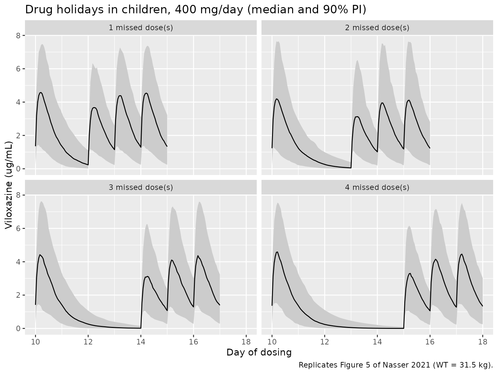
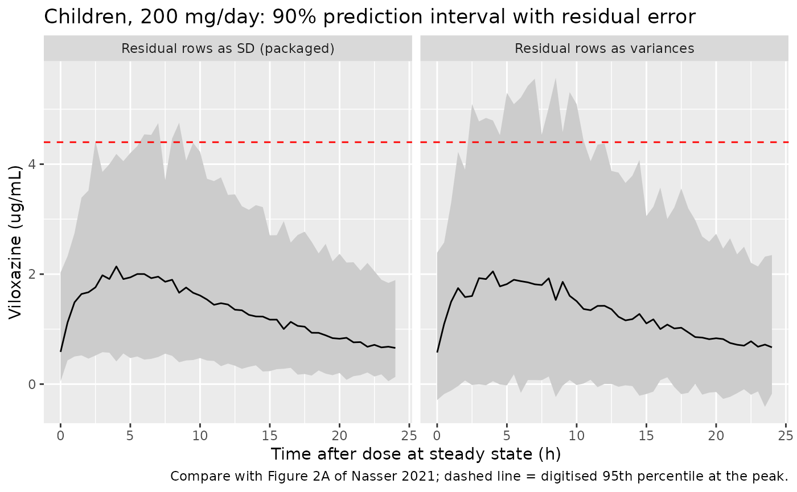

# Viloxazine (Nasser 2021)

## Model and source

- Citation: Nasser A, Gomeni R, Wang Z, Kosheleff AR, Xie L, Adeojo LW,
  Schwabe S. Population Pharmacokinetics of Viloxazine Extended-Release
  Capsules in Pediatric Subjects With Attention Deficit/Hyperactivity
  Disorder. J Clin Pharmacol. 2021;61(12):1626-1637.
  <doi:10.1002/jcph.1940>.
- Description: Joint parent (viloxazine) + metabolite
  (5-hydroxyviloxazine glucuronide, 5-HVLX-gluc) population PK model for
  once-daily oral viloxazine extended-release capsules in children (6-11
  years) and adolescents (12-17 years) with ADHD (Nasser 2021, pooled
  phase 3 studies P301-P304). Viloxazine is one-compartment with
  first-order absorption (ka = 0.068 1/h, so the terminal phase is
  absorption-limited) and two parallel first-order elimination routes
  from the central compartment: formation of 5-HVLX-gluc (CLV) and all
  remaining viloxazine elimination (CLL). 5-HVLX-gluc is one-compartment
  with first-order elimination (CLM) and shares the viloxazine apparent
  volume (assumed by the authors for identifiability). Body weight
  enters as power functions centred on the 36.35 kg median on the shared
  volume, CLV and CLM; F is fixed to 1.
- Article: <https://doi.org/10.1002/jcph.1940> (open access;
  supplementary Tables S1-S3 and Figures S1-S3 in the online supporting
  information)

## Population

Nasser 2021 pooled sparse steady-state samples from four phase 3,
randomized, double-blind, placebo-controlled trials of once-daily
viloxazine extended-release (ER) capsules in ADHD: P301 and P303 in
children aged 6-11 years (100, 200 or 400 mg/day) and P302 and P304 in
adolescents aged 12-17 years (200, 400 or 600 mg/day). 495 subjects
contributed samples (86 at 100 mg, 197 at 200 mg, 164 at 400 mg, 48 at
600 mg): 263 children and 232 adolescents, mean age 11.2 years, mean
weight 44.5 kg (range 20-92.5 kg; median 36.35 kg), 68% male, 52% White
and 43% Black or African American, 23% Hispanic or Latino (Table 1). Up
to five samples per subject (pre-dose and 1, 2, 4 and 6 h post-dose)
were assayed for viloxazine and its major metabolite 5-hydroxyviloxazine
glucuronide (5-HVLX-gluc).

The same information is available programmatically via
`readModelDb("Nasser_2021_viloxazine")()$population`.

## Source trace

Every `ini()` entry in
`inst/modeldb/specificDrugs/Nasser_2021_viloxazine.R` carries an in-file
comment naming its source; the table below collects them.

| Equation / parameter | Value | Source location |
|----|----|----|
| `lka` (ka) | log(0.068) 1/h | Table 2 |
| `lvc` (V2/F = V3/F) | log(14.60) L at 36.35 kg | Table 2; Methods ‘Population Pharmacokinetic Analysis’ (V2/F and V3/F identical) |
| `lcl_nonmet` (CLL, viloxazine clearance) | log(0.87) L/h | Table 2; Figure 1 |
| `lcl_met` (CLV, viloxazine metabolic clearance) | log(4.72) L/h at 36.35 kg | Table 2; Figure 1 |
| `lcl_gluc` (CLM, 5-HVLX-gluc clearance) | log(6.75) L/h at 36.35 kg | Table 2; Figure 1 |
| `e_wt_vc` (WT,V) | 0.78 | Table 2 |
| `e_wt_cl_met` (WT,CLV) | 0.59 | Table 2 |
| `e_wt_cl_gluc` (WT,CLM) | 0.70 | Table 2 |
| `etalvc`, `etalcl_nonmet`, `etalka`, `etalcl_met`, `etalcl_gluc` | 0.10, 3.03, 0.17, 0.11, 0.08 (variances) | Table 2 ‘Random effect’ |
| `addSd`, `addSd_gluc` | 0.12 ug/mL | Table 2 ‘Residual error, Additive’ |
| `propSd`, `propSd_gluc` | 0.29 | Table 2 ‘Residual error, Proportional’ |
| `P = Pref * (WT / 36.35)^g` | n/a | Methods ‘Covariate Analysis’ equation; median weight 36.35 kg |
| Weight on V, CLV, CLM only | n/a | Results; Table S1 model 10 (final) |
| `d/dt(depot)`, `d/dt(central)`, `d/dt(central_gluc)` | n/a | Figure 1; Methods (1-compartment parent, first-order absorption, first-order formation and elimination of the metabolite) |
| F = 1 | n/a | Methods ‘Population Pharmacokinetic Analysis’ |

## Simulation design

The paper’s own validation targets are its Monte Carlo drug-holiday
simulations (Tables S2 and S3, Figure 5): 10 days of once-daily dosing,
1-4 missed days, then dosing resumed, with weight fixed at the median of
each age group (children 31.5 kg, adolescents 57.25 kg; Methods ‘Impact
of Missed Doses’). The vignette simulates the same design at 400 mg/day
for both age groups, 200 virtual subjects per scenario, without residual
error (the tables report medians of the predicted concentrations).

``` r

mod <- readModelDb("Nasser_2021_viloxazine")

tau <- 24
n_per_arm <- 200L

# One scenario = age group x number of missed days. Doses on days 1-10, then
# `missed` days without a dose, then 10 more daily doses.
make_holiday <- function(age_group, wt, missed, dose, id_offset) {
  dose_times <- c(seq(0, 9) * tau, (10 + missed + seq(0, 9)) * tau)
  # Observe only the windows the tables summarise: the last steady-state
  # interval (day 10), the holiday, and the three days after restarting.
  t_ss <- 9 * tau
  t_end <- (10 + missed + 3) * tau
  obs_times <- seq(t_ss, t_end, by = 1)
  ids <- id_offset + seq_len(n_per_arm)
  doses <- expand.grid(id = ids, time = dose_times) |>
    mutate(evid = 1L, amt = dose, cmt = "depot", dvid = NA_integer_)
  obs <- expand.grid(id = ids, time = obs_times) |>
    mutate(evid = 0L, amt = NA_real_, cmt = "central", dvid = 1L)
  bind_rows(doses, obs) |>
    mutate(
      WT = wt, age_group = age_group, missed = missed, dose = dose,
      scenario = paste0(age_group, ", ", missed, " missed")
    ) |>
    arrange(id, time, desc(evid))
}

scen <- expand.grid(
  age_group = c("Children", "Adolescents"), missed = 1:4,
  stringsAsFactors = FALSE
) |>
  mutate(
    wt = ifelse(age_group == "Children", 31.5, 57.25),
    id_offset = (seq_len(n()) - 1L) * n_per_arm
  )

events <- bind_rows(lapply(seq_len(nrow(scen)), function(i) {
  make_holiday(
    scen$age_group[i], scen$wt[i], scen$missed[i],
    dose = 400, id_offset = scen$id_offset[i]
  )
}))
stopifnot(!anyDuplicated(unique(events[, c("id", "time", "evid")])))
```

``` r

rxode2::rxSetSeed(20211201)
sim <- rxode2::rxSolve(
  rxode2::zeroRe(mod, "sigma"),
  events = events,
  keep = c("age_group", "missed", "dose", "WT", "scenario")
) |>
  as.data.frame()
#> ℹ parameter labels from comments will be replaced by 'label()'
```

## Typical-value check against the closed form

Viloxazine is linear, so the typical steady-state average concentration
is `Dose / ((CLL + CLV) * tau)` and the metabolite average is
`Dose * CLV / ((CLL + CLV) * CLM * tau)` (equal parent and metabolite
volumes, 1:1 mass formation). Both sides use the same parameters, so the
difference is pure numerical error and the bound is tight.

``` r

typ <- rxode2::rxSolve(
  rxode2::zeroRe(mod),
  events = events |> filter(missed == 1, (id - 1) %% n_per_arm == 0),
  keep = c("age_group")
) |>
  as.data.frame() |>
  filter(time >= 9 * tau, time <= 10 * tau) |>
  group_by(age_group, WT) |>
  summarise(
    cav_sim = mean(Cc[time < 10 * tau]),
    cav_gluc_sim = mean(Cc_gluc[time < 10 * tau]),
    .groups = "drop"
  ) |>
  mutate(
    cl_par = 0.87 + 4.72 * (WT / 36.35)^0.59,
    cl_met = 4.72 * (WT / 36.35)^0.59,
    cl_gluc = 6.75 * (WT / 36.35)^0.70,
    cav_closed = 400 / (cl_par * tau),
    cav_gluc_closed = 400 * cl_met / (cl_par * cl_gluc * tau)
  )
#> ℹ parameter labels from comments will be replaced by 'label()'
#> ℹ omega/sigma items treated as zero: 'etalvc', 'etalcl_nonmet', 'etalka', 'etalcl_met', 'etalcl_gluc'
#> Warning: multi-subject simulation without without 'omega'

typ |>
  select(age_group, WT, cav_sim, cav_closed, cav_gluc_sim, cav_gluc_closed) |>
  rename(
    "Age group" = age_group, "WT (kg)" = WT,
    "Viloxazine Cavg sim (ug/mL)" = cav_sim,
    "Viloxazine Cavg closed form" = cav_closed,
    "5-HVLX-gluc Cavg sim (ug/mL)" = cav_gluc_sim,
    "5-HVLX-gluc Cavg closed form" = cav_gluc_closed
  ) |>
  knitr::kable(digits = 3, caption = "Typical-value steady-state Cavg at 400 mg/day.")
```

| Age group | WT (kg) | Viloxazine Cavg sim (ug/mL) | Viloxazine Cavg closed form | 5-HVLX-gluc Cavg sim (ug/mL) | 5-HVLX-gluc Cavg closed form |
|:---|---:|---:|---:|---:|---:|
| Adolescents | 57.25 | 2.363 | 2.367 | 1.575 | 1.575 |
| Children | 31.50 | 3.193 | 3.200 | 2.273 | 2.273 |

Typical-value steady-state Cavg at 400 mg/day. {.table
style="width:100%;"}

``` r


# Day 10 is not fully at steady state for the slow absorption phase and the
# 1-h grid mean is a rectangle rule, so allow 2%.
stopifnot(
  all(abs(typ$cav_sim / typ$cav_closed - 1) < 0.02),
  all(abs(typ$cav_gluc_sim / typ$cav_gluc_closed - 1) < 0.02)
)
```

## Replicate Tables S2 and S3 (drug holidays)

The windows are read from the tables’ structure: “Steady-state” is the
dosing interval before the holiday (day 10); “Holiday” is the whole
off-drug period (the holiday Cavg falls roughly as 1 / number of days,
and the holiday Cmin falls by the one-day decay factor per extra day, so
it is the concentration at the end of the holiday); “Day k after” is the
k-th dosing interval after restarting. Cavg (PKNCA `cav`) and Cmin,
taken as the concentration at the end of each window (PKNCA `clast.obs`,
i.e. the trough before the next dose), are computed per subject with
PKNCA, one call per scenario. PKNCA’s `cmin` is not used here: it
includes the first time point of the window, which after a holiday is
the pre-restart trough.

``` r

holiday_windows <- function(missed) {
  t_ss <- 9 * tau
  t_restart <- (10 + missed) * tau
  data.frame(
    window = c("Steady-state", "Holiday", "Day 1 after", "Day 2 after", "Day 3 after"),
    start = c(t_ss, 10 * tau, t_restart, t_restart + tau, t_restart + 2 * tau),
    end = c(10 * tau, t_restart, t_restart + tau, t_restart + 2 * tau, t_restart + 3 * tau)
  )
}

run_nca <- function(sim_df, conc_col) {
  out <- list()
  for (sc in unique(sim_df$scenario)) {
    d <- sim_df |> filter(scenario == sc)
    d$conc <- d[[conc_col]]
    d <- d |> filter(!is.na(conc))
    missed <- d$missed[1]
    w <- holiday_windows(missed)
    conc_obj <- PKNCA::PKNCAconc(d, conc ~ time | scenario + id)
    dose_df <- events |>
      filter(scenario == sc, evid == 1) |>
      select(id, time, amt, scenario)
    dose_obj <- PKNCA::PKNCAdose(dose_df, amt ~ time | scenario + id)
    intervals <- data.frame(start = w$start, end = w$end, cav = TRUE, clast.obs = TRUE)
    res <- as.data.frame(PKNCA::pk.nca(PKNCA::PKNCAdata(conc_obj, dose_obj, intervals = intervals)))
    res$window <- w$window[match(res$start, w$start)]
    res$missed <- missed
    res$age_group <- d$age_group[1]
    out[[sc]] <- res
  }
  bind_rows(out)
}

nca_hol <- run_nca(sim, "Cc")

sim_hol <- nca_hol |>
  group_by(age_group, missed, window, PPTESTCD) |>
  summarise(sim = median(PPORRES, na.rm = TRUE), .groups = "drop")
```

The paper tabulates the medians at 100, 200, 400 and 600 mg/day, each
from a separate Monte Carlo draw. Viloxazine is linear, so all four are
estimates of the same dose-normalised median; their spread (about +/-7%
between doses) is the paper’s own Monte Carlo noise. The comparison
below uses the 400 mg/day column and, as a less noisy reference, the
mean of the four dose-normalised columns scaled to 400 mg/day.

``` r

windows <- c("Steady-state", "Holiday", "Day 1 after", "Day 2 after", "Day 3 after")
# Table S2 (Cavg, ug/mL) and Table S3 (Cmin, ug/mL); columns are
# 1/2/3/4 missed doses x Child/Adol, rows are the five windows.
s2 <- list(
  `100` = c(0.70, 0.51, 0.67, 0.52, 0.71, 0.57, 0.71, 0.53,
            0.17, 0.12, 0.09, 0.07, 0.06, 0.05, 0.05, 0.04,
            0.55, 0.41, 0.49, 0.39, 0.52, 0.43, 0.52, 0.38,
            0.66, 0.48, 0.62, 0.49, 0.66, 0.54, 0.67, 0.49,
            0.69, 0.50, 0.65, 0.51, 0.70, 0.56, 0.70, 0.51),
  `200` = c(1.34, 1.07, 1.27, 1.03, 1.50, 1.03, 1.45, 1.10,
            0.28, 0.30, 0.16, 0.14, 0.13, 0.11, 0.12, 0.10,
            1.10, 0.84, 0.98, 0.79, 1.07, 0.72, 1.02, 0.76,
            1.28, 1.01, 1.21, 0.98, 1.38, 0.94, 1.32, 1.00,
            1.32, 1.06, 1.26, 1.02, 1.46, 1.00, 1.40, 1.07),
  `400` = c(2.97, 2.05, 2.61, 1.98, 2.78, 2.05, 2.79, 2.17,
            0.67, 0.45, 0.35, 0.25, 0.26, 0.19, 0.17, 0.14,
            2.42, 1.64, 1.93, 1.52, 1.99, 1.46, 2.11, 1.60,
            2.84, 1.94, 2.42, 1.88, 2.57, 1.90, 2.63, 2.05,
            2.94, 2.01, 2.54, 1.95, 2.71, 2.02, 2.76, 2.13),
  `600` = c(4.26, 3.19, 4.15, 3.03, 4.13, 3.20, 4.25, 3.11,
            0.89, 0.72, 0.56, 0.44, 0.35, 0.33, 0.32, 0.26,
            3.46, 2.56, 3.16, 2.26, 3.12, 2.30, 3.03, 2.15,
            4.09, 3.03, 3.94, 2.81, 3.90, 2.96, 3.89, 2.78,
            4.20, 3.13, 4.08, 2.96, 4.05, 3.13, 4.13, 2.98)
)
s3 <- list(
  `100` = c(0.344, 0.240, 0.308, 0.235, 0.315, 0.254, 0.332, 0.240,
            0.066, 0.048, 0.010, 0.007, 0.002, 0.001, 0.001, 0.000,
            0.290, 0.202, 0.242, 0.191, 0.241, 0.208, 0.258, 0.172,
            0.333, 0.229, 0.294, 0.221, 0.303, 0.236, 0.317, 0.220,
            0.342, 0.234, 0.305, 0.232, 0.311, 0.250, 0.327, 0.233),
  `200` = c(0.582, 0.567, 0.536, 0.498, 0.707, 0.520, 0.704, 0.553,
            0.101, 0.130, 0.019, 0.013, 0.004, 0.005, 0.002, 0.001,
            0.512, 0.460, 0.456, 0.385, 0.542, 0.394, 0.540, 0.433,
            0.565, 0.539, 0.521, 0.466, 0.655, 0.471, 0.651, 0.517,
            0.576, 0.559, 0.528, 0.492, 0.686, 0.496, 0.690, 0.547),
  `400` = c(1.389, 0.918, 1.173, 0.866, 1.275, 0.991, 1.200, 0.951,
            0.261, 0.163, 0.054, 0.028, 0.010, 0.008, 0.001, 0.002,
            1.152, 0.831, 0.958, 0.689, 1.030, 0.789, 0.985, 0.776,
            1.338, 0.898, 1.105, 0.823, 1.213, 0.943, 1.171, 0.902,
            1.372, 0.904, 1.154, 0.852, 1.250, 0.986, 1.194, 0.927),
  `600` = c(1.812, 1.429, 1.760, 1.420, 1.823, 1.588, 1.974, 1.520,
            0.364, 0.270, 0.087, 0.068, 0.010, 0.013, 0.003, 0.004,
            1.563, 1.228, 1.447, 1.108, 1.520, 1.206, 1.521, 1.164,
            1.751, 1.378, 1.639, 1.345, 1.734, 1.490, 1.845, 1.432,
            1.798, 1.409, 1.686, 1.406, 1.784, 1.563, 1.966, 1.491)
)
to_long <- function(tab, testcd) {
  bind_rows(lapply(names(tab), function(d) {
    expand.grid(
      age_group = c("Children", "Adolescents"), missed = 1:4, window = windows,
      stringsAsFactors = FALSE
    ) |>
      mutate(dose = as.numeric(d), value = tab[[d]], PPTESTCD = testcd)
  }))
}
paper <- bind_rows(to_long(s2, "cav"), to_long(s3, "clast.obs")) |>
  group_by(age_group, missed, window, PPTESTCD) |>
  summarise(
    paper_400 = value[dose == 400],
    paper_pooled = mean(value / dose) * 400,
    .groups = "drop"
  )

cmp_hol <- paper |>
  inner_join(sim_hol, by = c("age_group", "missed", "window", "PPTESTCD")) |>
  mutate(
    pct_vs_pooled = 100 * (sim - paper_pooled) / paper_pooled,
    window = factor(window, levels = windows)
  ) |>
  arrange(PPTESTCD, age_group, missed, window)

cmp_hol |>
  mutate(PPTESTCD = ifelse(PPTESTCD == "cav", "Cavg", "Cmin")) |>
  select(PPTESTCD, age_group, missed, window, paper_400, paper_pooled, sim, pct_vs_pooled) |>
  rename(
    "Metric" = PPTESTCD, "Age group" = age_group, "Missed days" = missed,
    "Window" = window, "Paper, 400 mg (ug/mL)" = paper_400,
    "Paper, pooled doses (ug/mL)" = paper_pooled,
    "Simulated median (ug/mL)" = sim, "Difference vs pooled (%)" = pct_vs_pooled
  ) |>
  knitr::kable(
    digits = 3,
    caption = "Median viloxazine Cavg (Table S2) and Cmin (Table S3) at 400 mg/day: paper vs. simulation."
  )
```

| Metric | Age group | Missed days | Window | Paper, 400 mg (ug/mL) | Paper, pooled doses (ug/mL) | Simulated median (ug/mL) | Difference vs pooled (%) |
|:---|:---|---:|:---|---:|---:|---:|---:|
| Cavg | Adolescents | 1 | Steady-state | 2.050 | 2.089 | 1.999 | -4.325 |
| Cavg | Adolescents | 1 | Holiday | 0.450 | 0.502 | 0.459 | -8.684 |
| Cavg | Adolescents | 1 | Day 1 after | 1.640 | 1.667 | 1.622 | -2.651 |
| Cavg | Adolescents | 1 | Day 2 after | 1.940 | 1.975 | 1.899 | -3.860 |
| Cavg | Adolescents | 1 | Day 3 after | 2.010 | 2.054 | 1.990 | -3.136 |
| Cavg | Adolescents | 2 | Steady-state | 1.980 | 2.035 | 2.170 | 6.646 |
| Cavg | Adolescents | 2 | Holiday | 0.250 | 0.276 | 0.279 | 1.177 |
| Cavg | Adolescents | 2 | Day 1 after | 1.520 | 1.542 | 1.648 | 6.922 |
| Cavg | Adolescents | 2 | Day 2 after | 1.880 | 1.918 | 2.058 | 7.276 |
| Cavg | Adolescents | 2 | Day 3 after | 1.950 | 2.001 | 2.149 | 7.390 |
| Cavg | Adolescents | 3 | Steady-state | 2.050 | 2.131 | 2.289 | 7.422 |
| Cavg | Adolescents | 3 | Holiday | 0.190 | 0.208 | 0.235 | 13.281 |
| Cavg | Adolescents | 3 | Day 1 after | 1.460 | 1.538 | 1.653 | 7.429 |
| Cavg | Adolescents | 3 | Day 2 after | 1.900 | 1.978 | 2.126 | 7.459 |
| Cavg | Adolescents | 3 | Day 3 after | 2.020 | 2.087 | 2.238 | 7.261 |
| Cavg | Adolescents | 4 | Steady-state | 2.170 | 2.141 | 1.982 | -7.403 |
| Cavg | Adolescents | 4 | Holiday | 0.140 | 0.168 | 0.128 | -23.887 |
| Cavg | Adolescents | 4 | Day 1 after | 1.600 | 1.518 | 1.465 | -3.506 |
| Cavg | Adolescents | 4 | Day 2 after | 2.050 | 1.966 | 1.878 | -4.469 |
| Cavg | Adolescents | 4 | Day 3 after | 2.130 | 2.074 | 1.962 | -5.422 |
| Cavg | Children | 1 | Steady-state | 2.970 | 2.822 | 3.077 | 9.001 |
| Cavg | Children | 1 | Holiday | 0.670 | 0.626 | 0.646 | 3.208 |
| Cavg | Children | 1 | Day 1 after | 2.420 | 2.282 | 2.526 | 10.712 |
| Cavg | Children | 1 | Day 2 after | 2.840 | 2.692 | 2.946 | 9.446 |
| Cavg | Children | 1 | Day 3 after | 2.940 | 2.785 | 3.027 | 8.705 |
| Cavg | Children | 2 | Steady-state | 2.610 | 2.649 | 2.815 | 6.270 |
| Cavg | Children | 2 | Holiday | 0.350 | 0.351 | 0.409 | 16.583 |
| Cavg | Children | 2 | Day 1 after | 1.930 | 1.989 | 2.119 | 6.541 |
| Cavg | Children | 2 | Day 2 after | 2.420 | 2.487 | 2.631 | 5.793 |
| Cavg | Children | 2 | Day 3 after | 2.540 | 2.595 | 2.758 | 6.273 |
| Cavg | Children | 3 | Steady-state | 2.780 | 2.843 | 2.946 | 3.611 |
| Cavg | Children | 3 | Holiday | 0.260 | 0.248 | 0.273 | 9.753 |
| Cavg | Children | 3 | Day 1 after | 1.990 | 2.073 | 2.162 | 4.332 |
| Cavg | Children | 3 | Day 2 after | 2.570 | 2.642 | 2.770 | 4.814 |
| Cavg | Children | 3 | Day 3 after | 2.710 | 2.782 | 2.905 | 4.402 |
| Cavg | Children | 4 | Steady-state | 2.790 | 2.841 | 2.970 | 4.549 |
| Cavg | Children | 4 | Holiday | 0.170 | 0.206 | 0.199 | -3.312 |
| Cavg | Children | 4 | Day 1 after | 2.110 | 2.062 | 2.261 | 9.623 |
| Cavg | Children | 4 | Day 2 after | 2.630 | 2.636 | 2.825 | 7.164 |
| Cavg | Children | 4 | Day 3 after | 2.760 | 2.778 | 2.961 | 6.574 |
| Cmin | Adolescents | 1 | Steady-state | 0.918 | 0.991 | 0.870 | -12.261 |
| Cmin | Adolescents | 1 | Holiday | 0.163 | 0.199 | 0.182 | -8.628 |
| Cmin | Adolescents | 1 | Day 1 after | 0.831 | 0.844 | 0.767 | -9.118 |
| Cmin | Adolescents | 1 | Day 2 after | 0.898 | 0.953 | 0.843 | -11.507 |
| Cmin | Adolescents | 1 | Day 3 after | 0.904 | 0.974 | 0.861 | -11.592 |
| Cmin | Adolescents | 2 | Steady-state | 0.866 | 0.937 | 1.016 | 8.462 |
| Cmin | Adolescents | 2 | Holiday | 0.028 | 0.032 | 0.044 | 38.154 |
| Cmin | Adolescents | 2 | Day 1 after | 0.689 | 0.740 | 0.846 | 14.305 |
| Cmin | Adolescents | 2 | Day 2 after | 0.823 | 0.884 | 0.975 | 10.325 |
| Cmin | Adolescents | 2 | Day 3 after | 0.852 | 0.925 | 1.000 | 8.101 |
| Cmin | Adolescents | 3 | Steady-state | 0.991 | 1.026 | 1.111 | 8.242 |
| Cmin | Adolescents | 3 | Holiday | 0.008 | 0.008 | 0.009 | 12.186 |
| Cmin | Adolescents | 3 | Day 1 after | 0.789 | 0.803 | 0.835 | 3.959 |
| Cmin | Adolescents | 3 | Day 2 after | 0.943 | 0.956 | 1.047 | 9.520 |
| Cmin | Adolescents | 3 | Day 3 after | 0.986 | 1.005 | 1.108 | 10.233 |
| Cmin | Adolescents | 4 | Steady-state | 0.951 | 1.008 | 0.884 | -12.307 |
| Cmin | Adolescents | 4 | Holiday | 0.002 | 0.002 | 0.001 | -51.594 |
| Cmin | Adolescents | 4 | Day 1 after | 0.776 | 0.776 | 0.654 | -15.807 |
| Cmin | Adolescents | 4 | Day 2 after | 0.902 | 0.943 | 0.838 | -11.063 |
| Cmin | Adolescents | 4 | Day 3 after | 0.927 | 0.987 | 0.869 | -11.962 |
| Cmin | Children | 1 | Steady-state | 1.389 | 1.284 | 1.354 | 5.423 |
| Cmin | Children | 1 | Holiday | 0.261 | 0.242 | 0.236 | -2.519 |
| Cmin | Children | 1 | Day 1 after | 1.152 | 1.094 | 1.146 | 4.660 |
| Cmin | Children | 1 | Day 2 after | 1.338 | 1.242 | 1.293 | 4.160 |
| Cmin | Children | 1 | Day 3 after | 1.372 | 1.273 | 1.330 | 4.530 |
| Cmin | Children | 2 | Steady-state | 1.173 | 1.163 | 1.232 | 5.990 |
| Cmin | Children | 2 | Holiday | 0.054 | 0.048 | 0.053 | 11.679 |
| Cmin | Children | 2 | Day 1 after | 0.958 | 0.951 | 1.013 | 6.515 |
| Cmin | Children | 2 | Day 2 after | 1.105 | 1.104 | 1.186 | 7.402 |
| Cmin | Children | 2 | Day 3 after | 1.154 | 1.138 | 1.226 | 7.700 |
| Cmin | Children | 3 | Steady-state | 1.275 | 1.291 | 1.415 | 9.625 |
| Cmin | Children | 3 | Holiday | 0.010 | 0.008 | 0.012 | 42.564 |
| Cmin | Children | 3 | Day 1 after | 1.030 | 1.023 | 1.070 | 4.651 |
| Cmin | Children | 3 | Day 2 after | 1.213 | 1.223 | 1.291 | 5.547 |
| Cmin | Children | 3 | Day 3 after | 1.250 | 1.264 | 1.393 | 10.244 |
| Cmin | Children | 4 | Steady-state | 1.200 | 1.313 | 1.363 | 3.793 |
| Cmin | Children | 4 | Holiday | 0.001 | 0.003 | 0.002 | -35.308 |
| Cmin | Children | 4 | Day 1 after | 0.985 | 1.028 | 1.056 | 2.771 |
| Cmin | Children | 4 | Day 2 after | 1.171 | 1.243 | 1.276 | 2.690 |
| Cmin | Children | 4 | Day 3 after | 1.194 | 1.298 | 1.329 | 2.365 |

Median viloxazine Cavg (Table S2) and Cmin (Table S3) at 400 mg/day:
paper vs. simulation. {.table}

The holiday Cmin after three or four missed days is 0.001-0.01 ug/mL in
the paper, below the assay LLOQ and printed to one significant figure,
so those cells are reported but kept out of the gate. Everything else
enters it.

``` r

gate_hol <- cmp_hol |>
  filter(!(PPTESTCD == "clast.obs" & window == "Holiday" & missed >= 3))
gate_hol |>
  group_by(PPTESTCD) |>
  summarise(
    n_cells = n(),
    median_pct = median(pct_vs_pooled),
    p90_abs_pct = unname(quantile(abs(pct_vs_pooled), 0.9)),
    .groups = "drop"
  ) |>
  rename(
    "Metric" = PPTESTCD, "Cells" = n_cells,
    "Median difference (%)" = median_pct,
    "90th percentile of |difference| (%)" = p90_abs_pct
  ) |>
  knitr::kable(digits = 1)
```

| Metric    | Cells | Median difference (%) | 90th percentile of \|difference\| (%) |
|:----------|------:|----------------------:|--------------------------------------:|
| cav       |    40 |                   6.3 |                                   9.8 |
| clast.obs |    36 |                   4.7 |                                  12.3 |

``` r


# A transcription error in a clearance, the volume or ka moves every cell by
# tens of percent; the paper's own dose-to-dose Monte Carlo spread is about
# +/-7%, and n = 200 per scenario adds about 4% on a median.
stopifnot(
  abs(median(gate_hol$pct_vs_pooled[gate_hol$PPTESTCD == "cav"])) < 10,
  abs(median(gate_hol$pct_vs_pooled[gate_hol$PPTESTCD == "clast.obs"])) < 12,
  quantile(abs(gate_hol$pct_vs_pooled), 0.9) < 25
)
```

### Figure 5 (children, 400 mg/day)

``` r

sim |>
  filter(age_group == "Children") |>
  group_by(missed, time) |>
  summarise(
    Q05 = quantile(Cc, 0.05), Q50 = median(Cc), Q95 = quantile(Cc, 0.95),
    .groups = "drop"
  ) |>
  mutate(missed = paste(missed, "missed dose(s)")) |>
  ggplot(aes(time / 24 + 1, Q50)) +
  geom_ribbon(aes(ymin = Q05, ymax = Q95), fill = "grey80") +
  geom_line() +
  facet_wrap(~missed) +
  labs(
    x = "Day of dosing", y = "Viloxazine (ug/mL)",
    title = "Drug holidays in children, 400 mg/day (median and 90% PI)",
    caption = "Replicates Figure 5 of Nasser 2021 (WT = 31.5 kg)."
  )
```



As in the paper, the median returns to within about 10% of its
steady-state level after two doses whatever the length of the holiday.

``` r

restart <- cmp_hol |>
  filter(PPTESTCD == "cav", window %in% c("Steady-state", "Day 2 after")) |>
  select(age_group, missed, window, sim) |>
  pivot_wider(names_from = window, values_from = sim) |>
  mutate(ratio = `Day 2 after` / `Steady-state`)
knitr::kable(
  restart |> rename("Age group" = age_group, "Missed days" = missed, "Day 2 / steady state" = ratio),
  digits = 3
)
```

| Age group   | Missed days | Steady-state | Day 2 after | Day 2 / steady state |
|:------------|------------:|-------------:|------------:|---------------------:|
| Adolescents |           1 |        1.999 |       1.899 |                0.950 |
| Adolescents |           2 |        2.170 |       2.058 |                0.948 |
| Adolescents |           3 |        2.289 |       2.126 |                0.929 |
| Adolescents |           4 |        1.982 |       1.878 |                0.947 |
| Children    |           1 |        3.077 |       2.946 |                0.958 |
| Children    |           2 |        2.815 |       2.631 |                0.934 |
| Children    |           3 |        2.946 |       2.770 |                0.940 |
| Children    |           4 |        2.970 |       2.825 |                0.951 |

``` r

# Paper: 'reached nominal steady-state levels after approximately 2 days';
# its own Table S2 ratios are 0.87-0.97.
stopifnot(all(restart$ratio > 0.8 & restart$ratio < 1.02))
```

## Table 3: steady-state NCA

Table 3 reports mean (SD) steady-state viloxazine exposures for children
(31.5 kg) and adolescents (57.25 kg) at each dose. Those values come
from the empirical Bayes estimates of the observed subjects (Results
‘Final Model Evaluation’), not from a fresh draw of the population
model, so they are a weaker target than Tables S2 and S3. The simulation
uses the last pre-holiday interval (day 10) scaled to each dose (the
model is linear).

``` r

ss_sim <- sim |> filter(missed == 1, time >= 9 * tau, time <= 10 * tau)
conc_ss <- PKNCA::PKNCAconc(ss_sim, Cc ~ time | age_group + id)
dose_ss <- events |>
  filter(missed == 1, evid == 1) |>
  select(id, time, amt, age_group)
dose_obj_ss <- PKNCA::PKNCAdose(dose_ss, amt ~ time | age_group + id)
int_ss <- data.frame(
  start = 9 * tau, end = 10 * tau,
  cmax = TRUE, cmin = TRUE, cav = TRUE, auclast = TRUE
)
nca_ss <- as.data.frame(PKNCA::pk.nca(PKNCA::PKNCAdata(conc_ss, dose_obj_ss, intervals = int_ss)))

# Arithmetic means per age group at 400 mg, scaled to each dose.
sim_means <- nca_ss |>
  group_by(age_group, PPTESTCD) |>
  summarise(m400 = mean(PPORRES), .groups = "drop") |>
  tidyr::crossing(dose = c(100, 200, 400, 600)) |>
  mutate(
    PPORRES = m400 * dose / 400,
    group = paste0(age_group, ", ", dose, " mg")
  ) |>
  select(group, PPTESTCD, PPORRES)

published_t3 <- tibble::tribble(
  ~group,                   ~cmax, ~cmin, ~cav, ~auclast,
  "Children, 100 mg",        1.60,  0.21, 0.80,    19.29,
  "Children, 200 mg",        2.83,  0.49, 1.45,    34.72,
  "Children, 400 mg",        5.61,  0.94, 2.83,    68.00,
  "Children, 600 mg",        8.89,  1.50, 4.46,   106.96,
  "Adolescents, 100 mg",     1.16,  0.14, 0.59,    14.15,
  "Adolescents, 200 mg",     2.06,  0.36, 1.07,    25.78,
  "Adolescents, 400 mg",     4.08,  0.70, 2.12,    50.80,
  "Adolescents, 600 mg",     6.49,  1.15, 3.33,    79.97
)

cmp_t3 <- nlmixr2lib::ncaComparisonTable(
  simulated = sim_means,
  reference = published_t3,
  by = "group",
  params = c("cmax", "cmin", "cav", "auclast"),
  units = c(cmax = "ug/mL", cmin = "ug/mL", cav = "ug/mL", auclast = "ug*h/mL"),
  tolerance_pct = 20
)
knitr::kable(
  cmp_t3,
  caption = "Mean steady-state viloxazine NCA: simulation vs. Table 3. * differs by >20%."
)
```

| NCA parameter      | group               | Reference | Simulated | % diff   |
|:-------------------|:--------------------|:----------|:----------|:---------|
| Cmax (ug/mL)       | Children, 100 mg    | 1.6       | 1.17      | -26.9%\* |
| Cmax (ug/mL)       | Children, 200 mg    | 2.83      | 2.34      | -17.3%   |
| Cmax (ug/mL)       | Children, 400 mg    | 5.61      | 4.68      | -16.6%   |
| Cmax (ug/mL)       | Children, 600 mg    | 8.89      | 7.02      | -21.0%\* |
| Cmax (ug/mL)       | Adolescents, 100 mg | 1.16      | 0.771     | -33.6%\* |
| Cmax (ug/mL)       | Adolescents, 200 mg | 2.06      | 1.54      | -25.2%\* |
| Cmax (ug/mL)       | Adolescents, 400 mg | 4.08      | 3.08      | -24.4%\* |
| Cmax (ug/mL)       | Adolescents, 600 mg | 6.49      | 4.62      | -28.7%\* |
| Cmin (ug/mL)       | Children, 100 mg    | 0.21      | 0.379     | +80.7%\* |
| Cmin (ug/mL)       | Children, 200 mg    | 0.49      | 0.759     | +54.8%\* |
| Cmin (ug/mL)       | Children, 400 mg    | 0.94      | 1.52      | +61.4%\* |
| Cmin (ug/mL)       | Children, 600 mg    | 1.5       | 2.28      | +51.8%\* |
| Cmin (ug/mL)       | Adolescents, 100 mg | 0.14      | 0.264     | +88.4%\* |
| Cmin (ug/mL)       | Adolescents, 200 mg | 0.36      | 0.528     | +46.6%\* |
| Cmin (ug/mL)       | Adolescents, 400 mg | 0.7       | 1.06      | +50.7%\* |
| Cmin (ug/mL)       | Adolescents, 600 mg | 1.15      | 1.58      | +37.6%\* |
| AUClast (ug\*h/mL) | Children, 100 mg    | 19.3      | 18.6      | -3.4%    |
| AUClast (ug\*h/mL) | Children, 200 mg    | 34.7      | 37.3      | +7.3%    |
| AUClast (ug\*h/mL) | Children, 400 mg    | 68        | 74.5      | +9.6%    |
| AUClast (ug\*h/mL) | Children, 600 mg    | 107       | 112       | +4.5%    |
| AUClast (ug\*h/mL) | Adolescents, 100 mg | 14.2      | 12.6      | -11.2%   |
| AUClast (ug\*h/mL) | Adolescents, 200 mg | 25.8      | 25.1      | -2.5%    |
| AUClast (ug\*h/mL) | Adolescents, 400 mg | 50.8      | 50.2      | -1.1%    |
| AUClast (ug\*h/mL) | Adolescents, 600 mg | 80        | 75.4      | -5.7%    |
| Cavg (ug/mL)       | Children, 100 mg    | 0.8       | 0.776     | -3.0%    |
| Cavg (ug/mL)       | Children, 200 mg    | 1.45      | 1.55      | +7.1%    |
| Cavg (ug/mL)       | Children, 400 mg    | 2.83      | 3.11      | +9.7%    |
| Cavg (ug/mL)       | Children, 600 mg    | 4.46      | 4.66      | +4.4%    |
| Cavg (ug/mL)       | Adolescents, 100 mg | 0.59      | 0.523     | -11.3%   |
| Cavg (ug/mL)       | Adolescents, 200 mg | 1.07      | 1.05      | -2.2%    |
| Cavg (ug/mL)       | Adolescents, 400 mg | 2.12      | 2.09      | -1.2%    |
| Cavg (ug/mL)       | Adolescents, 600 mg | 3.33      | 3.14      | -5.7%    |

Mean steady-state viloxazine NCA: simulation vs. Table 3. \* differs by
\>20%. {.table}

``` r

t3_long <- sim_means |>
  inner_join(
    published_t3 |> pivot_longer(-group, names_to = "PPTESTCD", values_to = "paper"),
    by = c("group", "PPTESTCD")
  ) |>
  mutate(pct = 100 * (PPORRES - paper) / paper)
# Exposure (AUC0-24 and Cavg) is set by CL/F alone and reproduces Table 3.
expo <- t3_long |> filter(PPTESTCD %in% c("auclast", "cav"))
stopifnot(abs(median(expo$pct)) < 10, quantile(abs(expo$pct), 0.9) < 20)
t3_long |>
  group_by(PPTESTCD) |>
  summarise(median_pct = median(pct), .groups = "drop") |>
  rename("Parameter" = PPTESTCD, "Median difference vs. Table 3 (%)" = median_pct) |>
  knitr::kable(digits = 1)
```

| Parameter | Median difference vs. Table 3 (%) |
|:----------|----------------------------------:|
| auclast   |                              -1.8 |
| cav       |                              -1.7 |
| cmax      |                             -24.8 |
| cmin      |                              53.3 |

AUC0-24 and Cavg agree with Table 3 on the model’s predicted
concentrations, but Cmax is about 25% lower and Cmin about 50% higher,
i.e. the predicted profiles fluctuate less (about 100% versus the
160-190% that Table 3 prints). The paper’s own Monte Carlo trough
medians in Table S3 are reproduced (previous section), so the model’s
trough is not the problem.

The pattern is the one produced by taking Cmax and Cmin over
concentrations that carry residual error: the maximum of several noisy
points is biased up, the minimum biased down, while AUC and Cavg average
the noise out. The check below adds the packaged combined residual error
to the day-10 profiles and repeats the NCA. The paper does not state the
time grid of its NCA; a 2-h grid is used here (a 1-h grid gives about 7%
higher Cmax and 9% lower Cmin). The additive part does not scale with
dose, so only the simulated 400 mg/day cohorts are compared.

``` r

set.seed(20211204)
ss_ruv <- ss_sim |>
  filter(time %% 2 == 0) |>
  mutate(Cc_obs = Cc * (1 + 0.29 * rnorm(n())) + 0.12 * rnorm(n()))
conc_ruv <- PKNCA::PKNCAconc(ss_ruv, Cc_obs ~ time | age_group + id)
#> Warning in assert_conc(conc, any_missing_conc = any_missing_conc): Negative
#> concentrations found
nca_ruv <- as.data.frame(PKNCA::pk.nca(PKNCA::PKNCAdata(
  conc_ruv, dose_obj_ss,
  intervals = data.frame(start = 9 * tau, end = 10 * tau, cmax = TRUE, cmin = TRUE)
)))
#> Warning in assert_conc(conc = conc): Negative concentrations found
#> Warning in assert_conc(conc = conc): Negative concentrations found
#> Warning in assert_conc(conc = conc): Negative concentrations found
#> Warning in assert_conc(conc = conc): Negative concentrations found
#> Warning in assert_conc(conc = conc): Negative concentrations found
#> Warning in assert_conc(conc = conc): Negative concentrations found
#> Warning in assert_conc(conc = conc): Negative concentrations found
#> Warning in assert_conc(conc = conc): Negative concentrations found
#> Warning in assert_conc(conc = conc): Negative concentrations found
#> Warning in assert_conc(conc = conc): Negative concentrations found
#> Warning in assert_conc(conc = conc): Negative concentrations found
#> Warning in assert_conc(conc = conc): Negative concentrations found
#> Warning in assert_conc(conc = conc): Negative concentrations found
#> Warning in assert_conc(conc = conc): Negative concentrations found
#> Warning in assert_conc(conc = conc): Negative concentrations found
#> Warning in assert_conc(conc = conc): Negative concentrations found
#> Warning in assert_conc(conc = conc): Negative concentrations found
#> Warning in assert_conc(conc = conc): Negative concentrations found
#> Warning in assert_conc(conc = conc): Negative concentrations found
#> Warning in assert_conc(conc = conc): Negative concentrations found
#> Warning in assert_conc(conc = conc): Negative concentrations found
#> Warning in assert_conc(conc = conc): Negative concentrations found
#> Warning in assert_conc(conc = conc): Negative concentrations found
#> Warning in assert_conc(conc = conc): Negative concentrations found
#> Warning in assert_conc(conc = conc): Negative concentrations found
#> Warning in assert_conc(conc = conc): Negative concentrations found
ruv_tab <- nca_ruv |>
  filter(PPTESTCD %in% c("cmax", "cmin")) |>
  group_by(age_group, PPTESTCD) |>
  summarise(sim_mean = mean(PPORRES), sim_sd = sd(PPORRES), .groups = "drop") |>
  left_join(
    tibble::tribble(
      ~age_group,    ~PPTESTCD, ~paper_mean, ~paper_sd,
      "Children",    "cmax",    5.61,        2.48,
      "Children",    "cmin",    0.94,        0.63,
      "Adolescents", "cmax",    4.08,        1.67,
      "Adolescents", "cmin",    0.70,        0.47
    ),
    by = c("age_group", "PPTESTCD")
  ) |>
  mutate(pct = 100 * (sim_mean - paper_mean) / paper_mean)
ruv_tab |>
  rename(
    "Age group" = age_group, "Parameter" = PPTESTCD,
    "Simulated mean (ug/mL)" = sim_mean, "Simulated SD" = sim_sd,
    "Table 3 mean (ug/mL)" = paper_mean, "Table 3 SD" = paper_sd,
    "Difference in mean (%)" = pct
  ) |>
  knitr::kable(digits = 2, caption = "400 mg/day steady-state Cmax and Cmin with residual error added, vs. Table 3.")
```

| Age group | Parameter | Simulated mean (ug/mL) | Simulated SD | Table 3 mean (ug/mL) | Table 3 SD | Difference in mean (%) |
|:---|:---|---:|---:|---:|---:|---:|
| Adolescents | cmax | 3.90 | 1.74 | 4.08 | 1.67 | -4.43 |
| Adolescents | cmin | 0.69 | 0.56 | 0.70 | 0.47 | -2.09 |
| Children | cmax | 5.77 | 2.45 | 5.61 | 2.48 | 2.80 |
| Children | cmin | 1.04 | 0.74 | 0.94 | 0.63 | 10.59 |

400 mg/day steady-state Cmax and Cmin with residual error added,
vs. Table 3. {.table}

``` r

# The predicted-concentration comparison above is 25% (Cmax) and 50% (Cmin)
# off; with residual error both close to within a few percent. Read as
# variances, the residual rows push the mean Cmin to about zero.
stopifnot(all(abs(ruv_tab$pct) < 20))
```

Adding the residual error closes both gaps and reproduces the Table 3
SDs as well, so Table 3’s Cmax and Cmin are read as NCA over
residual-perturbed concentrations. Reading the Table 2 residual rows as
variances instead drives the mean Cmin to about zero, which Table 3
rules out.

## Figure 2 and Figure S2: visual predictive check

Figure 2A shows the 90% prediction interval for children on 200 mg/day
in study P303. The paper’s VPCs are simulations of 100 subjects from the
final model, stratified by age group because weight is the retained
covariate (Methods ‘Model Diagnostics’; Results ‘Final Model
Evaluation’), so the vignette simulates 200 children at the children’s
median weight of 31.5 kg. The VPC includes residual error. The
maintainers read the band off the figure at steady state: median peak
about 1.95 ug/mL, median trough about 0.55 ug/mL, 95th percentile at the
peak about 4.4 ug/mL, and a 5th percentile that reaches zero at each
trough.

``` r

make_vpc <- function(n, dose, wt, id_offset) {
  ids <- id_offset + seq_len(n)
  doses <- expand.grid(id = ids, time = seq(0, 13) * tau) |>
    mutate(evid = 1L, amt = dose, cmt = "depot", dvid = NA_integer_)
  obs <- expand.grid(id = ids, time = seq(13 * tau, 14 * tau, by = 0.5)) |>
    mutate(evid = 0L, amt = NA_real_, cmt = "central", dvid = 1L)
  bind_rows(doses, obs) |>
    mutate(WT = wt) |>
    arrange(id, time, desc(evid))
}
ev_vpc <- make_vpc(200, dose = 200, wt = 31.5, id_offset = 0L)

rxode2::rxSetSeed(20211203)
vpc_ipred <- rxode2::rxSolve(rxode2::zeroRe(mod, "sigma"), events = ev_vpc) |>
  as.data.frame()
#> ℹ parameter labels from comments will be replaced by 'label()'

# Add the combined residual error, Y = IPRED * (1 + propSd * e1) + addSd * e2,
# under the packaged reading (Table 2 rows are SDs) and the alternative one
# (rows are variances), with the same standard-normal draws for both.
set.seed(20211202)
e1 <- rnorm(nrow(vpc_ipred))
e2 <- rnorm(nrow(vpc_ipred))
vpc_obs <- vpc_ipred |>
  mutate(
    tad = time - 13 * tau,
    y_sd = Cc * (1 + 0.29 * e1) + 0.12 * e2,
    y_var = Cc * (1 + sqrt(0.29) * e1) + sqrt(0.12) * e2
  )

vpc_summary <- function(d, col, label) {
  d |>
    group_by(tad) |>
    summarise(
      Q05 = quantile(.data[[col]], 0.05), Q50 = median(.data[[col]]),
      Q95 = quantile(.data[[col]], 0.95), .groups = "drop"
    ) |>
    mutate(reading = label)
}
vpc_both <- bind_rows(
  vpc_summary(vpc_obs, "y_sd", "Residual rows as SD (packaged)"),
  vpc_summary(vpc_obs, "y_var", "Residual rows as variances")
)

ggplot(vpc_both, aes(tad, Q50)) +
  geom_ribbon(aes(ymin = Q05, ymax = Q95), fill = "grey80") +
  geom_line() +
  geom_hline(yintercept = 4.4, linetype = 2, colour = "red") +
  facet_wrap(~reading) +
  labs(
    x = "Time after dose at steady state (h)", y = "Viloxazine (ug/mL)",
    title = "Children, 200 mg/day: 90% prediction interval with residual error",
    caption = "Compare with Figure 2A of Nasser 2021; dashed line = digitised 95th percentile at the peak."
  )
```



``` r


peak_tab <- vpc_both |>
  group_by(reading) |>
  summarise(
    median_peak = max(Q50), median_trough = Q50[tad == 0],
    p95_peak = max(Q95), p05_trough = Q05[tad == 0], .groups = "drop"
  )
knitr::kable(
  peak_tab |>
    rename(
      "Reading" = reading, "Median peak" = median_peak,
      "Median trough" = median_trough, "95th pct at peak" = p95_peak,
      "5th pct at trough" = p05_trough
    ),
  digits = 2,
  caption = "Figure 2A digitised: median peak ~1.95, trough ~0.55, 95th percentile at peak ~4.4 ug/mL."
)
```

| Reading | Median peak | Median trough | 95th pct at peak | 5th pct at trough |
|:---|---:|---:|---:|---:|
| Residual rows as SD (packaged) | 2.14 | 0.59 | 4.75 | 0.05 |
| Residual rows as variances | 2.05 | 0.57 | 5.57 | -0.29 |

Figure 2A digitised: median peak ~1.95, trough ~0.55, 95th percentile at
peak ~4.4 ug/mL. {.table}

``` r

# For the gate, pool the peak window (3-6 h after the dose) rather than take
# the maximum over time points of a 200-subject percentile, which is biased up
# and varies with the simulated cohort.
peak_win <- vpc_obs |> filter(tad >= 3, tad <= 6)
p95_sd <- unname(quantile(peak_win$y_sd, 0.95))
p95_var <- unname(quantile(peak_win$y_var, 0.95))
round(c("95th pct, 3-6 h, SD reading" = p95_sd, "95th pct, 3-6 h, variance reading" = p95_var), 2)
#>       95th pct, 3-6 h, SD reading 95th pct, 3-6 h, variance reading 
#>                              4.18                              4.96
med_peak <- peak_tab$median_peak[peak_tab$reading == "Residual rows as SD (packaged)"]
# Digitising the figure is good to about 0.1-0.2 ug/mL at these levels.
stopifnot(
  abs(med_peak / 1.95 - 1) < 0.15,
  abs(p95_sd / 4.4 - 1) < 0.15,
  abs(p95_var / 4.4 - 1) > abs(p95_sd / 4.4 - 1)
)
```

In the metabolite VPC of Figure S2 (study P303, 200 mg/day) the median
oscillates between about 0.55 and 1.3 ug/mL over each dosing interval at
steady state.

``` r

met_band <- vpc_obs |>
  group_by(tad) |>
  summarise(Q50 = median(Cc_gluc), .groups = "drop") |>
  summarise(min_median = min(Q50), max_median = max(Q50))
met_band |>
  rename("Lowest median (ug/mL)" = min_median, "Highest median (ug/mL)" = max_median) |>
  knitr::kable(digits = 2, caption = "Simulated 5-HVLX-gluc median over the steady-state interval, children 200 mg/day.")
```

| Lowest median (ug/mL) | Highest median (ug/mL) |
|----------------------:|-----------------------:|
|                  0.61 |                   1.49 |

Simulated 5-HVLX-gluc median over the steady-state interval, children
200 mg/day. {.table}

``` r

# Digitised Figure S2: about 0.55 to 1.3 ug/mL. A molar-mass factor between the
# analytes (429/237 = 1.8) would move both ends by 80%.
stopifnot(
  abs(met_band$min_median / 0.55 - 1) < 0.3,
  abs(met_band$max_median / 1.3 - 1) < 0.3
)
```

## Assumptions and deviations

- **IIV scale.** Table 2 prints the random effects without a scale. The
  maintainers read them as log-scale variances (NONMEM OMEGA). On that
  reading the closed-form median steady-state Cavg at 400 mg/day is 2.85
  ug/mL for children and 2.13 ug/mL for adolescents, against Table S2
  means of 2.79 and 2.06; reading them as SDs gives 3.08 and 2.26, and a
  mean CL/F above 100 L/h against the 6-8 L/h of Table 3.
- **Residual error scale and sharing.** Table 2 prints one Additive
  (0.12) and one Proportional (0.29) row for the joint parent +
  metabolite fit. They are read as SDs, because the Figure 2A prediction
  interval is reproduced on that reading at the children’s median weight
  and overshot on the variance reading (section above). Drawing weights
  from the children’s distribution in Table 1 (mean 32.8, SD 8.9 kg)
  instead widens both bands, to a 95th percentile at the peak of about
  5.1 (SD reading) and 5.9 ug/mL (variance reading), so the SD reading
  remains the closer one. Table 3’s Cmax and Cmin, which carry the
  residual error, independently support the SD reading (Table 3
  section). The same pair is applied to both analytes as separate
  parameters with equal values; the paper does not say whether the
  analytes shared one error model.
- **Metabolite units.** The paper states no molecular-weight correction
  between viloxazine (237.3 g/mol) and 5-HVLX-gluc. The metabolite state
  is formed 1:1 in mass and `Cc_gluc` is in ug/mL, as reported; the
  fitted CLV and CLM absorb any molar ratio. The Figure S2 metabolite
  median is reproduced on this basis.
- **Table 3.** Table 3’s Cmax and Cmin are reproduced only when residual
  error is added to the profiles before the NCA (2-h grid assumed; the
  paper does not state its grid). On the model’s predicted
  concentrations Cmax is about 25% lower and Cmin about 50% higher,
  while AUC and Cavg agree either way.
- **Holiday windows.** Tables S2 and S3 do not define their windows. The
  vignette uses the dosing interval before the holiday, the whole
  holiday period (Cavg) or its end (Cmin), and the first three dosing
  intervals after restarting, which is what the tables’ day-to-day
  pattern implies.
- **Figure 2 cohort.** P303 used a 3-week titration before maintenance;
  the VPC here simulates steady state on a fixed 200 mg/day at the
  children’s median weight (31.5 kg).
- No erratum or correction notice for <doi:10.1002/jcph.1940> was found
  as of 2026-10-02.
