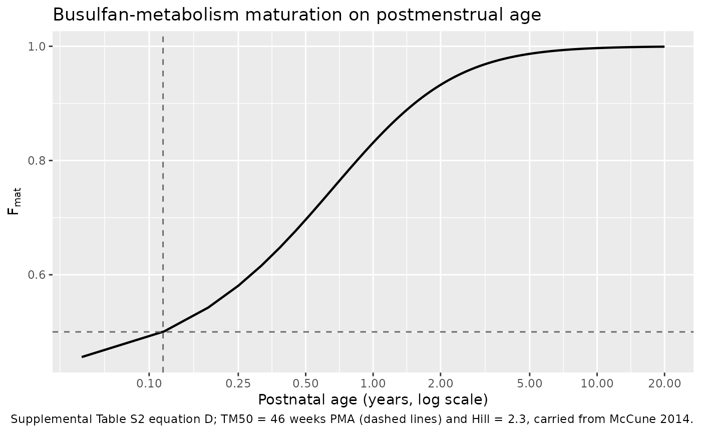
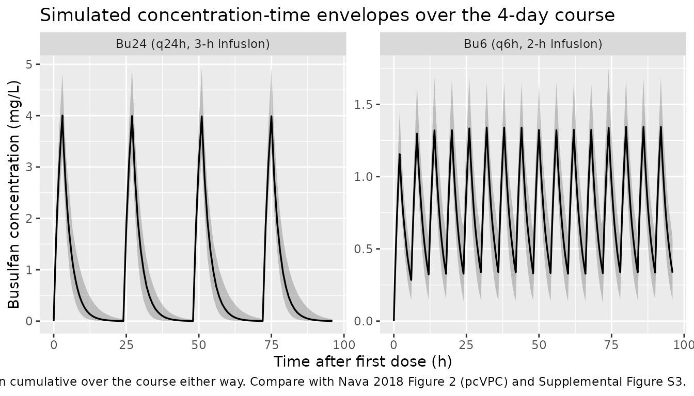
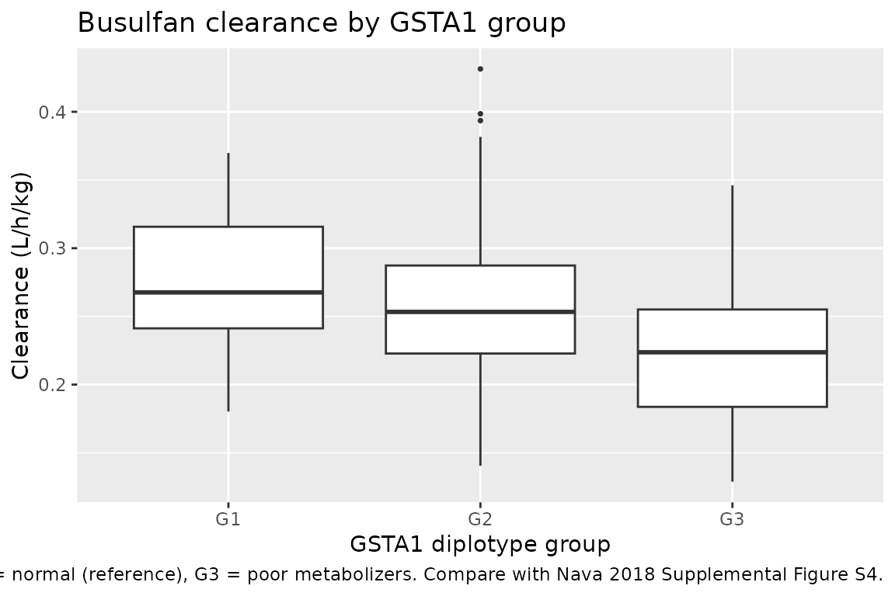

# Busulfan (Nava 2018)

## Model and source

- Citation: Nava T, Kassir N, Rezgui MA, Uppugunduri CRS, Huezo-Diaz
  Curtis P, Duval M, Theoret Y, Daudt LE, Litalien C, Ansari M,
  Krajinovic M, Bittencourt H. Incorporation of GSTA1 genetic variations
  into a population pharmacokinetic model for IV busulfan in paediatric
  hematopoietic stem cell transplantation. Br J Clin Pharmacol.
  2018;84(7):1494-1504. <doi:10.1111/bcp.13566>. The maturation function
  is Equation D of the paper’s Supplemental Material Table S2, which
  reproduces McCune JS, Bemer MJ, Barrett JS, Scott Baker K, Gamis AS,
  Holford NH. Clin Cancer Res 2014;20(3):754-763.
  <doi:10.1158/1078-0432.CCR-13-1960>.
- Description: One-compartment IV population PK model with first-order
  elimination for intravenous busulfan in children and adolescents
  (0.1-20 years) undergoing conditioning before haematopoietic stem cell
  transplantation. Theory-based allometric scaling of actual body weight
  (exponent 0.75 on CL, 1 on V) referenced to 70 kg; a sigmoid Emax
  maturation function of postmenstrual age on clearance carried over
  unchanged from McCune 2014 (TM50 = 46 weeks, Hill = 2.3); a power
  effect of postmenstrual age on volume; and a three-level GSTA1
  diplotype effect on clearance (rapid metabolizers 7% faster, poor
  metabolizers 12% slower than normal metabolizers). Between-subject
  variability on CL and V, between-occasion variability on CL and V
  across the four days of busulfan dosing, and a proportional residual
  error. This is the first paediatric busulfan popPK model to
  incorporate a pharmacogenetic covariate (Nava 2018).
- Article: <https://doi.org/10.1111/bcp.13566>
- Supplement (Tables S1-S6, Figures S1-S5, and the maturation / size
  equations used in the model):
  <https://pmc.ncbi.nlm.nih.gov/articles/PMC6005620/> (Supporting
  Information file `BCP-84-1494-s001.docx`). Every value this vignette
  attributes to the supplement was read from that file directly; the
  quoted Table S2 row labels below are verbatim.

Nava 2018 is the first paediatric population PK model for intravenous
busulfan to carry a pharmacogenetic covariate. Busulfan is conjugated to
glutathione by glutathione S-transferase A1, and promoter variants of
*GSTA1* change how much enzyme is expressed. The authors genotyped four
*GSTA1* promoter loci, built diplotypes from them, and grouped patients
into rapid (G1), normal (G2) and poor (G3) metabolizers. Group
membership turned out to be a significant covariate on busulfan
clearance, and adding it cut the unexplained between-subject variability
in clearance by 27%.

## Population

The model was built from 199 PK profiles and 1735 plasma busulfan
concentrations contributed by 112 children and adolescents (median 5.4
years, range 0.1-20) conditioned for autologous or allogeneic
haematopoietic stem cell transplantation at CHU Sainte-Justine
(Montreal) between April 2002 and August 2016 (Nava 2018 Table 1 and
Results). 52.7% were female; 83.9% Caucasian, 10.7% African and 5.4%
other; 66.1% had a malignant diagnosis. *GSTA1* diplotype groups were G1
14.3%, G2 71.4% and G3 14.3%.

Two dosing schedules are represented. Until April 2012 busulfan was
given as a 2-h infusion every 6 h (Bu6); from May 2012 as a 3-h infusion
every 24 h (Bu24) at four times the corresponding Bu6 dose. Both run for
four consecutive days. Regimens in which another chemotherapeutic drug
was given before or during the busulfan infusion days were excluded, so
that fludarabine-associated clearance changes could not bias the fit.

Nava 2018 Table 1 reports no body-weight summary – only weight adequacy
(12.5% overweight, 6.3% obese among children older than 2 years) – so
the virtual cohort below derives weight from age; see “Assumptions and
deviations”.

The same information is available programmatically via the model’s
`population` metadata:

``` r

pop <- rxode2::rxode(readModelDb("Nava_2018_busulfan"))$population
#> ℹ parameter labels from comments will be replaced by 'label()'
#> Warning: some etas defaulted to non-mu referenced, possible parsing error: etaiov_cl_1, etaiov_cl_2, etaiov_cl_3, etaiov_cl_4, etaiov_vc_1, etaiov_vc_2, etaiov_vc_3, etaiov_vc_4
#> as a work-around try putting the mu-referenced expression on a simple line
str(pop, max.level = 1)
#> List of 11
#>  $ species       : chr "human"
#>  $ n_subjects    : int 112
#>  $ n_studies     : int 1
#>  $ age_range     : chr "0.1-20 years"
#>  $ age_median    : chr "5.4 years"
#>  $ sex_female_pct: num 52.7
#>  $ race_ethnicity: Named num [1:3] 83.9 10.7 5.4
#>   ..- attr(*, "names")= chr [1:3] "Caucasian" "African" "Other"
#>  $ disease_state : chr "Children and adolescents receiving intravenous busulfan as part of the conditioning regimen before autologous o"| __truncated__
#>  $ dose_range    : chr "Intravenous busulfan for four consecutive days on one of two schedules. Bu6 (April 2002 - April 2012): 2-h infu"| __truncated__
#>  $ regions       : chr "Canada (single centre: CHU Sainte-Justine, Montreal, Quebec)"
#>  $ notes         : chr "Retrospective chart review of paediatric transplants performed between April 2002 and August 2016; part of NCT0"| __truncated__
```

## Source trace

The per-parameter origin is recorded as an in-file comment next to each
`ini()` entry in `inst/modeldb/specificDrugs/Nava_2018_busulfan.R`. The
table below collects them in one place.

| Equation / parameter | Value | Source location |
|----|----|----|
| `lcl` (CL at 70 kg) | 13.70 L/h | Table 2, Final model (RSE 2.43%); also the displayed clearance equation, p. 1497 |
| `lvc` (V at 70 kg) | 49.57 L | Table 2, Final model (RSE 1.15%) |
| `e_wt_cl` | 0.75 (fixed) | Displayed clearance equation, p. 1497: `CL = 13.7 * (ABW/70)^0.75 * Fmat * F_GSTA1`; Supplemental Table S2 equation C row label |
| `e_wt_vc` | 1 (fixed) | Supplemental Table S2, equation C row label `Fsize, where pwr = 1 for V and 0.75 for CL`; Results, “Base model” – “theoretical allometric scaling of the actual body weight (ABW)” |
| `tm50_mat` | 46 weeks (fixed) | Supplemental Table S2, row label `Fmat, where TM50=46; Hill's coefficient=2.3`; restated in Discussion, p. 1499 |
| `hill_mat` | 2.3 (fixed) | Supplemental Table S2, same row label |
| `e_page_vc` | -0.06 | Table 2, Final model, “PMA on V” (RSE 23.40%) |
| `pma_ref` | 320.8 weeks (fixed) | **Not printed.** Derived from Table 1 median age 5.4 y via Supplemental Table S2 equation E (`PMA = 52 * AGE + 40`); see “Assumptions and deviations” |
| `e_gsta1_rm_cl` | 1.07 | Table 2, Final model, G1 (RSE 4.40%); p. 1497 “`F_GSTA1` = 1.07 for G1” |
| `e_gsta1_pm_cl` | 0.88 | Table 2, Final model, G3 (RSE 0.40%); p. 1497 “0.88 for G3 patients” |
| `etalcl` (BSV CL) | 13.30% CV | Table 2, Final model (RSE 8.80%, shrinkage 6.00%); restated in Discussion, p. 1500 |
| `etalvc` (BSV V) | 7.00% CV | Table 2, Final model (RSE 19.20%, shrinkage 24.60%); restated in Discussion, p. 1500 |
| `etaiov_cl_*` (BOV CL) | 7.30% CV | Table 2, Final model (RSE 8.10%, shrinkage 46.60%) |
| `etaiov_vc_*` (BOV V) | 9.60% CV | Table 2, Final model (RSE 16.40%, shrinkage 9.30%) |
| `propSd` | 7.40% | Table 2, Final model, sigma \[Proportional error (%)\] (RSE 7.90%) |
| `Fmat = 1 / (1 + (PMA/TM50)^-Hill)` | n/a | Supplemental Table S2 equation D (reproducing McCune 2014) |
| `PMA[weeks] = 52 * AGE[years] + 40` | n/a | Supplemental Table S2 equation E |
| `d/dt(central) = -kel * central` | n/a | Results, “Base model” – one-compartment model with first-order elimination |
| AUC unit conversion 0.0041 | n/a | Supplemental Table S3 footnote a |
| Target AUC windows | 3600-6000 / 900-1500 uM.min | Methods, “Comparison with other available PopPK models”; Table 3 heading |

## Unit conventions and their internal consistency

Busulfan exposure is conventionally reported in uM.min while the model
works in mg/L and hours. The paper states the conversion three separate
ways, and all three agree with the molecular weight of busulfan (246.29
g/mol). Reproducing that agreement is the cheapest possible check that
the exposure targets used below are on the model’s scale.

``` r

mw_busulfan <- 246.29  # g/mol

# 1 uM.min expressed in mg*h/L.
uMmin_to_mghL <- mw_busulfan / 1000 / 60

# Supplemental Table S3 footnote a: "0.0041 is the conversion factor to convert
# the AUC units from uM.min/L to mg.h/L".
stopifnot(abs(uMmin_to_mghL - 0.0041) < 0.00005)

# Supplemental Table S3 footnote b: "4.72 mg/h/L = 1150 uM.min".
stopifnot(abs(1150 * uMmin_to_mghL - 4.72) < 0.01)

# Methods: a target Css of 0.77 mg/L is "equivalent to AUC24h of 4500 uM min
# or AUC6h of 1125 uM min".
css_target_mgL <- 0.77
stopifnot(
  abs(css_target_mgL * 24 / uMmin_to_mghL - 4500) < 25,
  abs(css_target_mgL *  6 / uMmin_to_mghL - 1125) < 10
)

auc24_target_mghL <- 4500 * uMmin_to_mghL
auc6_target_mghL  <- 1125 * uMmin_to_mghL
auc24_window_mghL <- c(3600, 6000) * uMmin_to_mghL
auc6_window_mghL  <- c( 900, 1500) * uMmin_to_mghL

# Methods, "Treatment regimen": PK-guided dose adjustment aimed "for a total
# cumulative AUC of 18 000 uM min every 4 days". Over four days the Bu24
# schedule delivers 4 doses at the AUC24h target and the Bu6 schedule delivers
# 16 doses at the AUC6h target, and both arrive at the same cumulative figure --
# and at the same cumulative therapeutic window. That the paper's per-interval
# and cumulative numbers agree exactly is a check on the transcription of all
# five of them.
stopifnot(
  4 * 4500 == 18000,
  16 * 1125 == 18000,
  all(4 * c(3600, 6000) == 16 * c(900, 1500))
)

auc_cum_target_mghL <- 18000 * uMmin_to_mghL
auc_cum_window_mghL <- 4 * c(3600, 6000) * uMmin_to_mghL

tibble::tibble(
  Quantity = c("1 uM.min", "AUC24h target 4500 uM.min",
               "AUC24h window 3600-6000 uM.min",
               "AUC6h target 1125 uM.min",
               "AUC6h window 900-1500 uM.min"),
  `mg*h/L` = c(
    sprintf("%.6f", uMmin_to_mghL),
    sprintf("%.2f", auc24_target_mghL),
    sprintf("%.2f-%.2f", auc24_window_mghL[1], auc24_window_mghL[2]),
    sprintf("%.2f", auc6_target_mghL),
    sprintf("%.2f-%.2f", auc6_window_mghL[1], auc6_window_mghL[2])
  )
) |>
  knitr::kable(caption = "Busulfan exposure units, from the paper's own conversion factors.")
```

| Quantity                       | mg\*h/L     |
|:-------------------------------|:------------|
| 1 uM.min                       | 0.004105    |
| AUC24h target 4500 uM.min      | 18.47       |
| AUC24h window 3600-6000 uM.min | 14.78-24.63 |
| AUC6h target 1125 uM.min       | 4.62        |
| AUC6h window 900-1500 uM.min   | 3.69-6.16   |

Busulfan exposure units, from the paper’s own conversion factors.
{.table}

## Replicating the published clearance equation

Nava 2018 prints its individualized clearance on p. 1497:

``` math
\mathrm{CL}\ (\mathrm{L/h}) = 13.7 \times \left(\frac{\mathrm{ABW}}{70}\right)^{0.75} \times F_{\mathrm{mat}} \times F_{GSTA1}
```

with `F_GSTA1` = 1.07 (G1), 1 (G2), 0.88 (G3), and
`Fmat = 1 / (1 + (PMA/46)^-2.3)` from Supplemental Table S2 equation D.
The check below evaluates that expression independently in R and
compares it with the clearance the packaged model computes for the same
subject. This is a deterministic comparison – both sides use the same
fixed parameters and no random effects – so the tolerance is tight.

``` r

mod_ui  <- rxode2::rxode(readModelDb("Nava_2018_busulfan"))
#> ℹ parameter labels from comments will be replaced by 'label()'
#> Warning: some etas defaulted to non-mu referenced, possible parsing error: etaiov_cl_1, etaiov_cl_2, etaiov_cl_3, etaiov_cl_4, etaiov_vc_1, etaiov_vc_2, etaiov_vc_3, etaiov_vc_4
#> as a work-around try putting the mu-referenced expression on a simple line
mod_typ <- rxode2::zeroRe(mod_ui)
#> Warning: some etas defaulted to non-mu referenced, possible parsing error: etaiov_cl_1, etaiov_cl_2, etaiov_cl_3, etaiov_cl_4, etaiov_vc_1, etaiov_vc_2, etaiov_vc_3, etaiov_vc_4
#> as a work-around try putting the mu-referenced expression on a simple line

pma_from_age <- function(age_years) 52 * age_years + 40  # Suppl. Table S2 eq. E

# The paper's equation, transcribed directly.
cl_paper <- function(abw, age_years, gsta1_group) {
  pma   <- pma_from_age(age_years)
  fmat  <- 1 / (1 + (pma / 46)^(-2.3))
  fgst  <- c(G1 = 1.07, G2 = 1.00, G3 = 0.88)[gsta1_group]
  unname(13.7 * (abw / 70)^0.75 * fmat * fgst)
}

probe <- tidyr::expand_grid(
  age_years   = c(0.1, 0.5, 1, 2, 5.4, 10, 16, 20),
  gsta1_group = c("G1", "G2", "G3")
) |>
  mutate(
    WT       = c(4.5, 7.6, 9.6, 12.2, 19.5, 32.0, 57.5, 65.0)[
      match(age_years, c(0.1, 0.5, 1, 2, 5.4, 10, 16, 20))],
    PAGE     = pma_from_age(age_years),
    GSTA1_RM = as.integer(gsta1_group == "G1"),
    GSTA1_PM = as.integer(gsta1_group == "G3"),
    OCC      = 1L,
    id       = row_number()
  )

# A single dose plus one observation is enough to make rxode2 report `cl`.
probe_ev <- bind_rows(
  probe |> mutate(time = 0, evid = 1L, amt = 1, dur = 1, cmt = "central"),
  probe |> mutate(time = 2, evid = 0L, amt = NA_real_, dur = NA_real_,
                  cmt = "central")
) |>
  arrange(id, time, desc(evid))

probe_sim <- rxode2::rxSolve(
  mod_typ, probe_ev,
  keep = c("gsta1_group", "age_years"),
  covsInterpolation = "locf", useLinCmt = FALSE,
  returnType = "data.frame"
)
#> ℹ omega/sigma items treated as zero: 'etalcl', 'etalvc', 'etaiov_cl_1', 'etaiov_cl_2', 'etaiov_cl_3', 'etaiov_cl_4', 'etaiov_vc_1', 'etaiov_vc_2', 'etaiov_vc_3', 'etaiov_vc_4'
#> Warning: multi-subject simulation without without 'omega'

cl_chk <- probe_sim |>
  group_by(id, gsta1_group, age_years) |>
  summarise(cl_model = first(cl), .groups = "drop") |>
  left_join(probe |> select(id, WT), by = "id") |>
  mutate(
    cl_equation = cl_paper(WT, age_years, gsta1_group),
    pct_diff    = 100 * (cl_model - cl_equation) / cl_equation
  )

# Deterministic: same fixed parameters on both sides, no random effects, so the
# only difference possible is numerical round-off.
stopifnot(max(abs(cl_chk$pct_diff)) < 1e-6)

cl_chk |>
  filter(gsta1_group == "G2") |>
  transmute(
    `Age (years)`        = age_years,
    `Weight (kg)`        = WT,
    `PMA (weeks)`        = pma_from_age(age_years),
    `Fmat`               = round(1 / (1 + (pma_from_age(age_years) / 46)^(-2.3)), 4),
    `CL, paper eq (L/h)` = round(cl_equation, 3),
    `CL, model (L/h)`    = round(cl_model, 3)
  ) |>
  knitr::kable(
    digits  = 3,
    caption = "Model clearance vs the p. 1497 equation, normal metabolizers (G2)."
  )
```

| Age (years) | Weight (kg) | PMA (weeks) |  Fmat | CL, paper eq (L/h) | CL, model (L/h) |
|------------:|------------:|------------:|------:|-------------------:|----------------:|
|         0.1 |         4.5 |        45.2 | 0.490 |              0.857 |           0.857 |
|         0.5 |         7.6 |        66.0 | 0.696 |              1.805 |           1.805 |
|         1.0 |         9.6 |        92.0 | 0.831 |              2.566 |           2.566 |
|         2.0 |        12.2 |       144.0 | 0.932 |              3.446 |           3.446 |
|         5.4 |        19.5 |       320.8 | 0.989 |              5.194 |           5.194 |
|        10.0 |        32.0 |       560.0 | 0.997 |              7.592 |           7.592 |
|        16.0 |        57.5 |       872.0 | 0.999 |             11.807 |          11.807 |
|        20.0 |        65.0 |      1080.0 | 0.999 |             12.950 |          12.950 |

Model clearance vs the p. 1497 equation, normal metabolizers (G2).
{.table}

The *GSTA1* effect is a pure multiplier on clearance, so the ratios
reproduce the abstract’s “7% faster in rapid metabolizers and 12% slower
in poor metabolizers”.

``` r

# Pivot on age_years, not id: `id` is unique per (age, GSTA1 group) pair, so
# pivoting on it would put each group in its own row and leave the other two
# columns NA.
gsta1_ratio <- cl_chk |>
  select(age_years, gsta1_group, cl_model) |>
  tidyr::pivot_wider(names_from = gsta1_group, values_from = cl_model) |>
  mutate(ratio_G1 = G1 / G2, ratio_G3 = G3 / G2)

stopifnot(nrow(gsta1_ratio) == dplyr::n_distinct(cl_chk$age_years),
          !anyNA(gsta1_ratio))

stopifnot(
  max(abs(gsta1_ratio$ratio_G1 - 1.07)) < 1e-6,
  max(abs(gsta1_ratio$ratio_G3 - 0.88)) < 1e-6
)

c(`G1 / G2` = unique(round(gsta1_ratio$ratio_G1, 4)),
  `G3 / G2` = unique(round(gsta1_ratio$ratio_G3, 4)))
#> G1 / G2 G3 / G2 
#>    1.07    0.88
```

### Maturation and size over the paediatric age range

``` r

mat_curve <- tibble::tibble(age_years = seq(0.05, 20, length.out = 300)) |>
  mutate(
    PAGE = pma_from_age(age_years),
    Fmat = 1 / (1 + (PAGE / 46)^(-2.3))
  )

ggplot(mat_curve, aes(age_years, Fmat)) +
  geom_line(linewidth = 0.8) +
  geom_hline(yintercept = 0.5, linetype = "dashed", colour = "grey40") +
  geom_vline(xintercept = (46 - 40) / 52, linetype = "dashed", colour = "grey40") +
  scale_x_log10(breaks = c(0.1, 0.25, 0.5, 1, 2, 5, 10, 20)) +
  labs(
    x = "Postnatal age (years, log scale)",
    y = expression(F[mat]),
    title = "Busulfan-metabolism maturation on postmenstrual age",
    caption = paste(
      "Supplemental Table S2 equation D; TM50 = 46 weeks PMA (dashed lines)",
      "and Hill = 2.3, carried from McCune 2014."
    )
  )
```



## Virtual cohort

Original observed data are not publicly available. The cohort below
approximates the published demographics: median age 5.4 years over a
0.1-20 year range (Table 1), *GSTA1* groups 14.3% / 71.4% / 14.3%, and
weight derived from age because the paper reports none.

``` r

# `set.seed()` seeds R's RNG. It does NOT seed rxode2's simulation RNG, and
# rxode2's streams are partitioned per solver thread, so the sampled etas differ
# between a 2-thread CI runner and a 16-thread workstation. Every assertion
# downstream is written to hold for any cohort this model can produce.
set.seed(20180209)

n_subj <- 200

# Age: log-normal centred on the Table 1 median of 5.4 years, truncated to the
# reported 0.1-20 year range.
age_years <- pmin(pmax(exp(rnorm(n_subj, log(5.4), 1.0)), 0.1), 20)

# Weight-for-age. Nava 2018 reports no weights, so the cohort uses approximate
# 50th-percentile CDC weight-for-age (sexes pooled) with 15% CV log-normal
# scatter. See "Assumptions and deviations".
wfa_age <- c(0, 0.25, 0.5, 1, 2, 3, 4, 6, 8, 10, 12, 14, 16, 18, 20)
wfa_kg  <- c(3.4, 6.0, 7.6, 9.6, 12.2, 14.3, 16.3, 20.8, 25.8,
             32.0, 40.5, 50.0, 57.5, 62.0, 65.0)
wt_median <- stats::approx(wfa_age, wfa_kg, xout = age_years, rule = 2)$y
WT <- pmax(wt_median * exp(rnorm(n_subj, 0, 0.15)), 2.5)

# GSTA1 diplotype group per Table 1.
gsta1_group <- sample(c("G1", "G2", "G3"), n_subj, replace = TRUE,
                      prob = c(0.143, 0.714, 0.143))

cohort <- tibble::tibble(
  id          = seq_len(n_subj),
  age_years   = age_years,
  WT          = WT,
  PAGE        = pma_from_age(age_years),
  gsta1_group = gsta1_group,
  GSTA1_RM    = as.integer(gsta1_group == "G1"),
  GSTA1_PM    = as.integer(gsta1_group == "G3")
)

cohort |>
  summarise(
    n            = n(),
    `Age median` = round(median(age_years), 2),
    `Age min`    = round(min(age_years), 2),
    `Age max`    = round(max(age_years), 2),
    `WT median`  = round(median(WT), 1),
    `% G1`       = round(100 * mean(GSTA1_RM), 1),
    `% G3`       = round(100 * mean(GSTA1_PM), 1)
  ) |>
  knitr::kable(caption = "Virtual cohort (target: median age 5.4 y, 14.3% G1, 14.3% G3).")
```

|   n | Age median | Age min | Age max | WT median | % G1 | % G3 |
|----:|-----------:|--------:|--------:|----------:|-----:|-----:|
| 200 |       5.04 |    0.24 |      20 |      19.5 | 13.5 |   11 |

Virtual cohort (target: median age 5.4 y, 14.3% G1, 14.3% G3). {.table}

## Simulation

The paper’s dose-selection logic is “estimate the first dose from the
model-predicted individual clearance and the target AUC” (Methods,
“Comparison with other available PopPK models”):
`Dose = AUC_target x CL`. A first dose is chosen before any
concentration has been measured, so the clearance available at that
moment is the *population* prediction for the subject’s covariates – no
random effects. Each subject then receives that dose and is simulated
with the full between-subject and between-occasion variability.

Both schedules are simulated as separate arms with disjoint subject IDs.

``` r

# Population-predicted clearance (no random effects) for dose selection.
dose_probe_ev <- bind_rows(
  cohort |> mutate(time = 0, evid = 1L, amt = 1, dur = 1, cmt = "central",
                   OCC = 1L),
  cohort |> mutate(time = 2, evid = 0L, amt = NA_real_, dur = NA_real_,
                   cmt = "central", OCC = 1L)
) |>
  arrange(id, time, desc(evid))

cl_pop <- rxode2::rxSolve(
  mod_typ, dose_probe_ev,
  covsInterpolation = "locf", useLinCmt = FALSE, returnType = "data.frame"
) |>
  group_by(id) |>
  summarise(cl_pop = first(cl), .groups = "drop")
#> ℹ omega/sigma items treated as zero: 'etalcl', 'etalvc', 'etaiov_cl_1', 'etaiov_cl_2', 'etaiov_cl_3', 'etaiov_cl_4', 'etaiov_vc_1', 'etaiov_vc_2', 'etaiov_vc_3', 'etaiov_vc_4'
#> Warning: multi-subject simulation without without 'omega'

cohort_dosed <- cohort |>
  left_join(cl_pop, by = "id") |>
  mutate(
    dose_bu24_mg = auc24_target_mghL * cl_pop,
    dose_bu6_mg  = auc6_target_mghL  * cl_pop
  )

# Observation grids: fine over the first dosing interval (where the NCA is
# taken), coarse afterwards so the four-day profile can still be plotted.
grid_bu24 <- sort(unique(c(seq(0, 24, by = 0.25), seq(25, 96, by = 1))))
grid_bu6  <- sort(unique(c(seq(0, 6,  by = 0.10), seq(6.5, 96, by = 0.5))))

# Occasion = busulfan dosing day, 1-4 (see the model's covariateData$OCC).
occ_for_time <- function(tm) pmin(pmax(floor(tm / 24) + 1L, 1L), 4L)

build_arm <- function(dose_mg, dur_h, ii_h, addl, obs_grid, regimen,
                      id_offset = 0L) {
  covs <- cohort_dosed |>
    mutate(id = id + id_offset, amt_mg = dose_mg) |>
    select(id, WT, PAGE, GSTA1_RM, GSTA1_PM, gsta1_group, amt_mg)

  doses <- tidyr::expand_grid(
    covs, time = seq(0, by = ii_h, length.out = addl + 1L)
  ) |>
    mutate(evid = 1L, amt = amt_mg, dur = dur_h, cmt = "central", ii = 0,
           addl = 0L)

  obs <- tidyr::expand_grid(covs, time = obs_grid) |>
    mutate(evid = 0L, amt = NA_real_, dur = NA_real_, cmt = "central",
           ii = 0, addl = 0L)

  bind_rows(doses, obs) |>
    mutate(OCC = occ_for_time(time), regimen = regimen) |>
    arrange(id, time, desc(evid))
}

events <- bind_rows(
  build_arm(cohort_dosed$dose_bu24_mg, dur_h = 3, ii_h = 24, addl = 3L,
            obs_grid = grid_bu24, regimen = "Bu24 (q24h, 3-h infusion)",
            id_offset = 0L),
  build_arm(cohort_dosed$dose_bu6_mg,  dur_h = 2, ii_h = 6,  addl = 15L,
            obs_grid = grid_bu6,  regimen = "Bu6 (q6h, 2-h infusion)",
            id_offset = 1000L)
)

stopifnot(!anyDuplicated(unique(events[, c("id", "time", "evid")])))
c(subjects = dplyr::n_distinct(events$id), records = nrow(events))
#> subjects  records 
#>      400    86000
```

``` r

# `useLinCmt = FALSE`: the between-occasion variability makes CL and V change at
# each 24-h occasion boundary, and rxode2's automatic ODE-to-linCmt conversion
# would freeze them at their t = 0 values.
# `covsInterpolation = "locf"`: OCC is a step function; linear interpolation
# would produce fractional occasion numbers between records and silently zero
# out every occasion indicator.
sim <- rxode2::rxSolve(
  mod_ui, events,
  keep = c("regimen", "gsta1_group", "WT", "PAGE"),
  covsInterpolation = "locf", useLinCmt = FALSE,
  returnType = "data.frame"
)

stopifnot(all(sim$Cc >= 0))
```

## Replicate published figures

Nava 2018 Figure 2 is a prediction-corrected VPC of busulfan
concentration against time after the last dose, split by the Q6H and
Q24H schedules, and Supplemental Figure S3 shows the raw
concentration-time profiles for the same two schedules. Neither can be
reproduced numerically without the observed data, but the simulated
envelopes below show the shape and scale the model predicts for each
schedule over the four-day course.

``` r

# `sim` holds observation records only -- rxSolve() does not return the dosing
# rows (and so has no `evid` column) unless `addDosing = TRUE`.
sim |>
  group_by(regimen, time) |>
  summarise(
    Q025 = quantile(Cc, 0.025),
    Q50  = quantile(Cc, 0.500),
    Q975 = quantile(Cc, 0.975),
    .groups = "drop"
  ) |>
  ggplot(aes(time, Q50)) +
  geom_ribbon(aes(ymin = Q025, ymax = Q975), alpha = 0.25) +
  geom_line(linewidth = 0.6) +
  facet_wrap(~regimen, scales = "free_y") +
  labs(
    x = "Time after first dose (h)", y = "Busulfan concentration (mg/L)",
    title = "Simulated concentration-time envelopes over the 4-day course",
    caption = paste(
      "Median and 2.5th-97.5th percentiles of 200 virtual subjects per arm,",
      "each dosed from their population-predicted clearance to the paper's",
      "per-interval target (4500 uM.min per 24 h for Bu24; 1125 uM.min per 6 h",
      "for Bu6), i.e. 18 000 uM.min cumulative over the course either way.",
      "Compare with Nava 2018 Figure 2 (pcVPC) and Supplemental Figure S3."
    )
  )
```



Supplemental Figure S4 is a box plot of the clearance random effects by
*GSTA1* group *before* the covariate was added to the model – i.e. the
diagnostic that motivated the covariate. The analogue below plots
weight-normalised clearance by group in the final model, where the same
ordering is now structural.

``` r

cl_by_group <- sim |>
  group_by(id, regimen, gsta1_group, WT) |>
  summarise(cl = first(cl), .groups = "drop") |>
  mutate(cl_per_kg = cl / WT)

ggplot(cl_by_group, aes(gsta1_group, cl_per_kg)) +
  geom_boxplot(outlier.size = 0.6) +
  labs(
    x = "GSTA1 diplotype group",
    y = "Clearance (L/h/kg)",
    title = "Busulfan clearance by GSTA1 group",
    caption = paste(
      "G1 = rapid, G2 = normal (reference), G3 = poor metabolizers.",
      "Compare with Nava 2018 Supplemental Figure S4."
    )
  )
```



## PKNCA validation

Two intervals are taken per arm.

- **The first dosing interval** – 0-24 h for Bu24, 0-6 h for Bu6. This
  is the interval the mass-balance identity above is checked on.
- **The whole four-day course**, 0-96 h. This is the interval the
  paper’s exposure target is compared on, because the paper’s AUC24h /
  AUC6h targets describe a *repeated-dose* exposure, whereas the first
  interval necessarily falls short of it by whatever is still in the
  body when the interval ends – as much as 42% of the dose in the
  youngest subjects. Summed over four days the two schedules converge on
  the same cumulative target of 18 000 uM min, which the paper states
  directly.

`Cc` in the rxode2 output is the individual prediction, so these are
model-predicted exposures without residual error.

``` r

sim_nca <- sim |>
  dplyr::filter(!is.na(Cc)) |>
  dplyr::select(id, time, Cc, regimen)

# Guarantee a time = 0 record per subject. Busulfan is given intravenously with
# no pre-dose drug present, so Cc = 0 at time 0 is the correct anchor.
sim_nca <- dplyr::bind_rows(
  sim_nca,
  sim_nca |> dplyr::distinct(id, regimen) |>
    dplyr::mutate(time = 0, Cc = 0)
) |>
  dplyr::distinct(id, regimen, time, .keep_all = TRUE) |>
  dplyr::arrange(id, regimen, time)

conc_obj <- PKNCA::PKNCAconc(sim_nca, Cc ~ time | regimen + id)

dose_df <- events |>
  dplyr::filter(evid == 1, time == 0) |>
  dplyr::select(id, time, amt, regimen)

dose_obj <- PKNCA::PKNCAdose(dose_df, amt ~ time | regimen + id)

# First dosing interval per arm, plus the whole four-day course for both.
first_interval_end <- c("Bu24 (q24h, 3-h infusion)" = 24, "Bu6 (q6h, 2-h infusion)" = 6)

intervals <- data.frame(
  regimen   = rep(names(first_interval_end), each = 2L),
  start     = 0,
  end       = as.vector(rbind(unname(first_interval_end), 96)),
  auclast   = TRUE,
  cmax      = TRUE,
  tmax      = TRUE,
  half.life = TRUE,
  stringsAsFactors = FALSE
)

nca_res <- PKNCA::pk.nca(
  PKNCA::PKNCAdata(conc_obj, dose_obj, intervals = intervals)
)

nca_tbl <- as.data.frame(nca_res$result)
stopifnot(nrow(nca_tbl) > 0, all(c("start", "end") %in% names(nca_tbl)))

# Split the two interval families apart once, by name rather than by position.
nca_first <- nca_tbl |>
  dplyr::filter(end == unname(first_interval_end[regimen]))
nca_cum <- nca_tbl |>
  dplyr::filter(end == 96)

stopifnot(nrow(nca_first) > 0, nrow(nca_cum) > 0)
```

### AUC against the mass-balance closed form

For a one-compartment model with linear elimination held constant over
an interval, integrating `dA/dt = -CL/V * A` from 0 to `T` gives an
*exact* identity between the eliminated mass and the exposure:

``` math
\mathrm{AUC}(0,T) \;=\; \frac{\mathrm{Dose} - A(T)}{\mathrm{CL}}
```

where `A(T)` is the amount left in `central` at the end of the interval.
Both sides use the *same drawn parameters* for the same subject, so the
only difference admissible is the trapezoidal discretization error of
the NCA – there is no between-subject noise in this comparison and the
bound below is correspondingly tight. Checking it exercises the whole
chain at once: dose units, infusion handling, the clearance and volume
construction, the between-occasion variability, and the PKNCA setup.

The naive version of this check – comparing against `Dose / CL`,
i.e. the `T -> infinity` limit – is *not* tight, because the fraction of
the dose still in the body at the end of the first interval varies
enormously across this cohort: from essentially nothing to 42% of the
dose. That spread is a real physical mechanism (a neonate’s maturation
factor halves clearance, doubling the half-life), so it is reported
below as a diagnostic rather than asserted on.

``` r

auc_first <- nca_first |>
  filter(PPTESTCD == "auclast") |>
  select(id, regimen, auc_nca = PPORRES)

# Individual CL actually realised on occasion 1 for each subject. Both arms'
# first interval lies inside occasion 1 (OCC changes only at 24 h), so a single
# CL applies throughout.
cl_occ1 <- sim |>
  filter(time <= 6) |>
  group_by(id, regimen) |>
  summarise(cl_i = first(cl), .groups = "drop")

dose_lookup <- dose_df |> select(id, regimen, amt)

# Amount remaining in `central` at the end of the NCA interval.
amt_end <- sim |>
  mutate(t_end = unname(first_interval_end[regimen])) |>
  filter(abs(time - t_end) < 1e-9) |>
  group_by(id, regimen) |>
  summarise(central_end = dplyr::last(central), .groups = "drop")

auc_chk <- auc_first |>
  left_join(cl_occ1,     by = c("id", "regimen")) |>
  left_join(dose_lookup, by = c("id", "regimen")) |>
  left_join(amt_end,     by = c("id", "regimen")) |>
  mutate(
    frac_remaining = central_end / amt,
    auc_exact      = (amt - central_end) / cl_i,   # mass-balance closed form
    ratio          = auc_nca / auc_exact,
    ratio_dose_cl  = auc_nca / (amt / cl_i)        # diagnostic only
  )

stopifnot(!anyNA(auc_chk$ratio))

auc_chk_summary <- auc_chk |>
  group_by(regimen) |>
  summarise(
    n                     = n(),
    `Ratio min`           = round(min(ratio), 5),
    `Ratio median`        = round(median(ratio), 5),
    `Ratio max`           = round(max(ratio), 5),
    `% dose left at T, median` = round(100 * median(frac_remaining), 1),
    `% dose left at T, max`    = round(100 * max(frac_remaining), 1),
    .groups = "drop"
  ) |>
  dplyr::rename(Regimen = regimen, N = n)

knitr::kable(
  auc_chk_summary,
  caption = paste(
    "Trapezoidal first-interval AUC divided by the mass-balance closed form",
    "(Dose - A(T)) / CL, with the fraction of the dose still in the body at",
    "the end of the interval alongside."
  )
)
```

| Regimen | N | Ratio min | Ratio median | Ratio max | % dose left at T, median | % dose left at T, max |
|:---|---:|---:|---:|---:|---:|---:|
| Bu24 (q24h, 3-h infusion) | 200 | 0.99897 | 0.99959 | 0.99992 | 0.0 | 1.3 |
| Bu6 (q6h, 2-h infusion) | 200 | 0.99981 | 0.99991 | 0.99997 | 17.5 | 42.5 |

Trapezoidal first-interval AUC divided by the mass-balance closed form
(Dose - A(T)) / CL, with the fraction of the dose still in the body at
the end of the interval alongside. {.table}

``` r


# Deterministic identity: same drawn parameters on both sides, so the only
# admissible difference is trapezoidal discretization error. Observed span is
# 0.99897-0.99997 across both arms; the bound below is a factor of ~5 wider on
# the low side and still goes red for any dose-unit, infusion, clearance or
# NCA-interval error, all of which move the ratio by percent, not 1e-4.
stopifnot(
  all(auc_chk$ratio > 0.995),
  all(auc_chk$ratio < 1.0005)
)

# The naive Dose / CL comparison, by contrast, spans roughly 0.58-1.00 -- it is
# reported, not asserted on.
stopifnot(all(auc_chk$ratio_dose_cl < 1.0005))
```

### Comparison against the published exposure targets

Nava 2018 reports no observed NCA summary table; what it does report are
the therapeutic AUC windows and the target exposure the model-based
doses were computed against (Methods, “Treatment regimen” and
“Comparison with other available PopPK models”; Table 3 heading). Those
targets are the reference below, taken on the cumulative four-day
exposure so that both schedules are compared against the same 18 000 uM
min figure the paper names. Because each subject was dosed from their
population-predicted clearance, the median simulated AUC should land on
the target, with the spread coming from BSV and BOV alone.

``` r

auc_cum <- nca_cum |>
  filter(PPTESTCD == "auclast") |>
  select(id, regimen, auc_nca = PPORRES)

published <- tibble::tribble(
  ~regimen,                     ~auclast,
  "Bu24 (q24h, 3-h infusion)",  auc_cum_target_mghL,
  "Bu6 (q6h, 2-h infusion)",    auc_cum_target_mghL
)

cmp <- nlmixr2lib::ncaComparisonTable(
  simulated = nca_cum |> select(regimen, PPTESTCD, PPORRES),
  reference = published,
  by        = "regimen",
  params    = "auclast",
  units     = c(auclast = "mg*h/L"),
  tolerance_pct = 20
)

knitr::kable(
  cmp,
  caption = paste(
    "Median simulated cumulative four-day AUC vs the paper's stated target",
    "of 18 000 uM.min per 4 days. * marks a difference above 20%."
  ),
  align = c("l", "l", "r", "r", "r")
)
```

| NCA parameter     | regimen                   | Reference | Simulated | % diff |
|:------------------|:--------------------------|----------:|----------:|-------:|
| AUClast (mg\*h/L) | Bu24 (q24h, 3-h infusion) |      73.9 |        73 |  -1.2% |
| AUClast (mg\*h/L) | Bu6 (q6h, 2-h infusion)   |      73.9 |      72.7 |  -1.5% |

Median simulated cumulative four-day AUC vs the paper’s stated target of
18 000 uM.min per 4 days. \* marks a difference above 20%. {.table
style="width:100%;"}

``` r

auc_centre <- auc_cum |>
  group_by(regimen) |>
  summarise(
    median_auc = median(auc_nca),
    q10        = quantile(auc_nca, 0.10),
    q90        = quantile(auc_nca, 0.90),
    .groups    = "drop"
  ) |>
  mutate(
    target      = auc_cum_target_mghL,
    pct_diff    = 100 * (median_auc - target) / target,
    q10_pct     = 100 * (q10 - target) / target,
    q90_pct     = 100 * (q90 - target) / target
  )

knitr::kable(
  auc_centre |>
    transmute(
      Regimen                  = regimen,
      `Target (mg*h/L)`        = round(target, 2),
      `Median AUC (mg*h/L)`    = round(median_auc, 2),
      `Median % diff`          = round(pct_diff, 1),
      `10th pct % diff`        = round(q10_pct, 1),
      `90th pct % diff`        = round(q90_pct, 1)
    ),
  caption = "Simulated cumulative four-day AUC relative to the model-based dosing target."
)
```

| Regimen | Target (mg\*h/L) | Median AUC (mg\*h/L) | Median % diff | 10th pct % diff | 90th pct % diff |
|:---|---:|---:|---:|---:|---:|
| Bu24 (q24h, 3-h infusion) | 73.89 | 72.97 | -1.2 | -17.3 | 19.8 |
| Bu6 (q6h, 2-h infusion) | 73.89 | 72.75 | -1.5 | -16.8 | 19.3 |

Simulated cumulative four-day AUC relative to the model-based dosing
target. {.table style="width:100%;"}

``` r


# Structural: a mis-transcribed clearance, volume, dose or unit conversion moves
# the whole distribution by tens of percent. Over the full course essentially
# all drug is eliminated, so the centre should sit within a few percent of the
# target -- the only systematic shortfall is the last dose's tail beyond 96 h.
# Observed: -1.2% (Bu24) and -1.5% (Bu6).
stopifnot(all(abs(auc_centre$pct_diff) < 5))
# Envelope: robust to which subjects land in the tails. BSV CL 13.3% and BOV CL
# 7.3% give a combined ~15% CV, so the 10th-90th band spans roughly +/- 20%
# about the centre.
stopifnot(all(abs(auc_centre$q10_pct) < 40), all(abs(auc_centre$q90_pct) < 40))
```

### Target-window attainment

Table 3 of the paper reports that first doses computed from this model’s
parameters put 85.2% of patients (95% CI 78.7-91.7%) inside the
therapeutic window. That figure is measured against *observed* AUCs in
the development cohort, so it also absorbs covariate misspecification
and assay error. The simulation below runs the same dose-selection loop
entirely inside the model, which isolates the contribution of the
model’s own BSV and BOV – an upper bound on what the paper could have
achieved.

``` r

attain <- auc_cum |>
  mutate(
    lo     = auc_cum_window_mghL[1],
    hi     = auc_cum_window_mghL[2],
    within = auc_nca >= lo & auc_nca <= hi
  ) |>
  group_by(regimen) |>
  summarise(
    n            = n(),
    `Within (%)` = round(100 * mean(within), 1),
    `Below (%)`  = round(100 * mean(auc_nca < lo), 1),
    `Above (%)`  = round(100 * mean(auc_nca > hi), 1),
    .groups      = "drop"
  )

knitr::kable(
  attain,
  caption = paste(
    "Simulated cumulative four-day target attainment when the dose is set from",
    "the population-predicted clearance (window 14 400-24 000 uM.min, i.e. the",
    "paper's per-interval window summed over the course). Nava 2018 Table 3",
    "reports 85.2% (95% CI 78.7-91.7%) against observed AUCs."
  )
)
```

| regimen                   |   n | Within (%) | Below (%) | Above (%) |
|:--------------------------|----:|-----------:|----------:|----------:|
| Bu24 (q24h, 3-h infusion) | 200 |       90.0 |       7.0 |         3 |
| Bu6 (q6h, 2-h infusion)   | 200 |       92.5 |       6.5 |         1 |

Simulated cumulative four-day target attainment when the dose is set
from the population-predicted clearance (window 14 400-24 000 uM.min,
i.e. the paper’s per-interval window summed over the course). Nava 2018
Table 3 reports 85.2% (95% CI 78.7-91.7%) against observed AUCs.
{.table}

``` r


# The model's internal attainment must be high -- that is the whole point of
# model-based dosing -- but not perfect, because BSV and BOV remain. With a
# combined ~15% CV against a -20% / +33% window the analytic expectation is
# roughly 90%, and that is what is observed (90.0% Bu24, 92.5% Bu6). n = 200
# per arm puts three binomial standard errors at about +/- 6 points, so the
# bounds below clear the sampling spread on both sides while still going red if
# a mis-transcribed variance, dose or unit shifts the distribution.
#
# Attainment computed inside the model lands above the paper's 85.2% (95% CI
# 78.7-91.7%), which is the expected direction: the paper's figure is measured
# against observed AUCs and so also absorbs covariate misspecification and
# assay error, neither of which exists in this closed loop. That ordering is
# NOT asserted on -- three binomial standard errors on n = 200 reach below
# 85.2%, so an assertion on it would be a coin flip across rxode2 versions
# rather than a check on the model.
stopifnot(all(attain$`Within (%)` > 80), all(attain$`Within (%)` < 99))
```

## Assumptions and deviations

- **The postmenstrual-age effect on volume is a power model, centred at
  the cohort median PMA of 320.8 weeks.** Table 2 reports the
  coefficient (-0.06, RSE 23.40%) but the paper never prints the
  equation the coefficient sits in, and neither does the supplement.
  Three readings were tested against the paper’s own numbers:

  - *Exponential*, `V ~ exp(-0.06 * PMA)`: impossible. The cohort spans
    PMA 45-1080 weeks, over which this factor varies by `exp(-62)`.
  - *Linear*, `V ~ (1 - 0.06 * PMA)`: impossible. It turns negative
    above PMA = 17 weeks, below every subject in the cohort.
  - *Power*, `V ~ (PMA / PMA_ref)^-0.06`: admissible, dimensionless, and
    physiologically the right size and direction – a neonate gets about
    13% more volume per kilogram than a subject at the cohort’s central
    PMA, which is what a higher body-water fraction predicts.

  The centring value is likewise unprinted. It is pinned by Table 2
  itself: adding the PMA term moved the 70 kg volume only from 50.05 L
  (base model) to 49.57 L (final model), a 1.0% shift. Centring at an
  adult PMA of about 2000 weeks would have forced an 11% drop in that
  parameter to hold the cohort predictions fixed, and no such drop
  occurred – so the centring is at the cohort’s own central PMA. That
  value is computed from the paper’s numbers: Table 1 gives a median age
  of 5.4 years, and Supplemental Table S2 equation E gives
  `PMA[weeks] = 52 * AGE + 40`, hence 320.8 weeks. Because the exponent
  is small, the choice is not very consequential: moving the centring to
  an adult PMA would raise `lvc` by about 11% and leave every prediction
  inside the cohort essentially unchanged.

- **The residual error is 7.40%, not the 27.20% in the bootstrap
  column.** Table 2’s “sigma \[Proportional error (%)\]” row reads 7.40
  in both the base and the final Estimate columns (RSE 7.90%) but 27.20
  (95% CI 25.00-29.00) in the bootstrap column. The two cannot both
  describe this model. The final-model Estimate column is what the model
  is built from, and the reported shrinkage settles it independently:
  with 9-28 samples per profile the standard error of an individual
  clearance is roughly `sigma / sqrt(n)`, so `sigma = 7.4%` gives about
  2.5% and an eta-shrinkage near `0.025^2 / (0.025^2 + 0.133^2)` = 3%,
  close to the 6.0% Table 2 reports; `sigma = 27.2%` would imply about
  31% shrinkage, five times what was observed. A 27% proportional
  residual would also exceed the between-subject variability on
  clearance (13.3%), which is not consistent with the goodness-of-fit
  plots in Figure 1.

- **The bootstrap column of Table 2 disagrees with the final model for
  BSV on clearance as well.** It reports a median of 18.80% (95% CI
  15.00-21.20) against a final-model estimate of 13.30% – but 18.80% is
  essentially the *base*-model value (18.30%). The Discussion resolves
  it twice in favour of 13.30%: “as much as 13% and 7% of the
  variability between subjects (BSV) on CL and V, respectively, remained
  unexplained”, and “the incorporation of the GSTA1 diplotypes seemed to
  reduce the overall BSV of CL by 27% (from 18.3% to 13.3%)”. The model
  uses 13.30%. A third row is internally inconsistent in a way that does
  not affect the model: the bootstrap 95% CI for V at 70 kg
  (49.72-50.76 L) does not contain either the final estimate or the
  bootstrap median, both of which are 49.57 L.

- **The number of occasions for the between-occasion variability is
  four.** The paper reports BOV on CL and V but never states the
  occasion count. Busulfan was “administered intravenously (IV) for four
  consecutive days” and the once-daily cohort contributed a mean of 3.7
  PK profiles per conditioning regimen, so one occasion per dosing day
  is the reading consistent with both. A single shared magnitude is used
  across the four occasions.

- **Body weight in the virtual cohort is derived from age.** Nava 2018
  Table 1 reports no weight distribution at all, only weight adequacy
  among children older than two. The cohort therefore samples age from a
  log-normal matched to the reported median (5.4 years) and range
  (0.1-20 years), maps it through approximate 50th-percentile CDC
  weight-for-age values (sexes pooled), and adds 15% CV log-normal
  scatter. This is a property of the *vignette’s* cohort, not of the
  model: the model itself takes `WT` and `PAGE` as independent inputs.

- **Gestational age is 40 weeks for every subject.** This is the paper’s
  own assumption, not an addition: “The PMA is calculated from the first
  day of the last menstruation period of the mother prior to the birth,
  which is set to 40 weeks due to missing information” (Discussion).
  Supplemental Table S2 equation E encodes it as
  `PMA[weeks] = 52 * AGE[years] + 40`.

- **The maturation function is inherited, not fitted here.** `TM50 = 46`
  weeks and `Hill = 2.3` come from McCune 2014 by way of Supplemental
  Table S2, whose row label prints both –
  `Fmat, where TM50=46; Hill's coefficient=2.3` – above equation D,
  `Fmat = 1 / (1 + (PMA/TM50)^-Hill)`. Nava 2018 neither re-estimates
  them nor gives them an RSE, so both are encoded as `fixed()`. Note
  that only the 46-week value is restated in the main text (Discussion);
  the Hill coefficient appears **nowhere outside the supplement**, so
  the supplement is a required source for this model rather than an
  optional extra.

- **Table 2’s minus signs do not survive text extraction.** The PDF’s
  symbol font drops the leading minus from the `PMA on V` row, so a
  `pdftotext` pass reads the estimate as `0.06` and the bootstrap
  interval as `0.18-0.09`. Rendering page 6 as an image confirms the
  printed values are `-0.06` and `-0.18-0.09`. The extracted interval is
  self-falsifying either way – as printed its lower bound would exceed
  its upper bound – but the sign of the *estimate* is only settled by
  looking at the page, and it is load-bearing: it sets whether volume
  per kilogram falls or rises with postmenstrual age.

- **Non-paper-derived parameter values.** One: `pma_ref = 320.8` weeks,
  the centring postmenstrual age for the volume covariate. It is not
  printed anywhere in the paper or its supplement and is derived here
  from the paper’s own median age and its own PMA equation, as argued in
  the first bullet. Every other value in `ini()` is transcribed directly
  from Nava 2018 Table 2, the displayed clearance equation on p. 1497,
  or Supplemental Table S2.

- **The exposure comparison is taken on the cumulative four-day AUC, not
  the first dosing interval.** The paper’s AUC24h / AUC6h targets
  describe a repeated-dose exposure, and `Dose = AUC_target x CL`
  reproduces them only once the interval’s input and output are in
  balance. Over the *first* interval the simulated AUC necessarily falls
  short by whatever is still in the body when the interval closes – a
  median 17.5% of the dose in the Bu6 arm and up to 42.5% in the
  youngest subjects, whose maturation factor roughly halves clearance
  and so doubles the half-life. Comparing the first interval against a
  steady-state target would therefore read as a 17% model error that is
  really a definitional mismatch. The cumulative 0-96 h AUC avoids it,
  is what the paper names directly (“a total cumulative AUC of 18 000 uM
  min every 4 days”, Methods), and gives the same target and the same
  therapeutic window for both schedules – 4 x 4500 = 16 x 1125 = 18 000,
  and 4 x (3600-6000) = 16 x (900-1500) = 14 400-24 000. The first
  interval is still used, for the mass-balance identity, where it is
  exact.

- **What is not reproduced.** Table 3’s per-age-group comparison against
  the Bartelink, McCune, Long-Boyle, Paci, Nguyen and Booth models needs
  the observed individual AUCs of the development cohort, which are not
  published. Figures 1 and 2 are goodness-of-fit and
  prediction-corrected VPC plots of the same unavailable data. The Table
  1 “Ethnic groups” block is also internally inconsistent as printed –
  the once-daily column (n = 31) lists 65 Caucasian subjects and the
  four-times-daily column (n = 81) lists 29, i.e. the two columns appear
  transposed – so only the “Overall” column is carried into the model’s
  `population` metadata.
