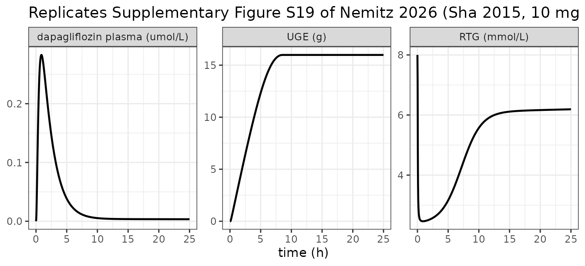
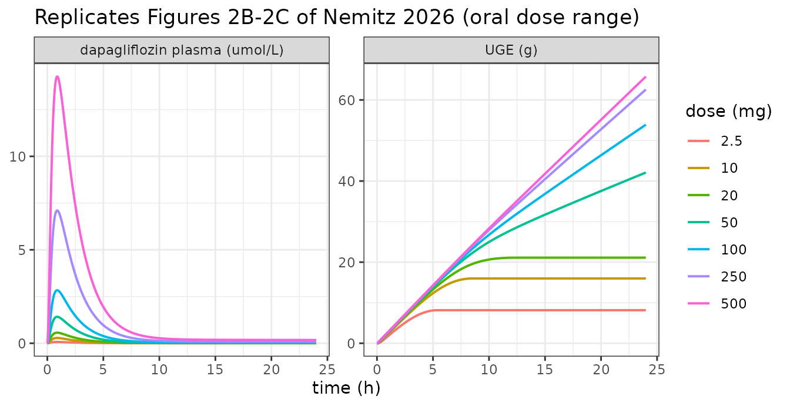
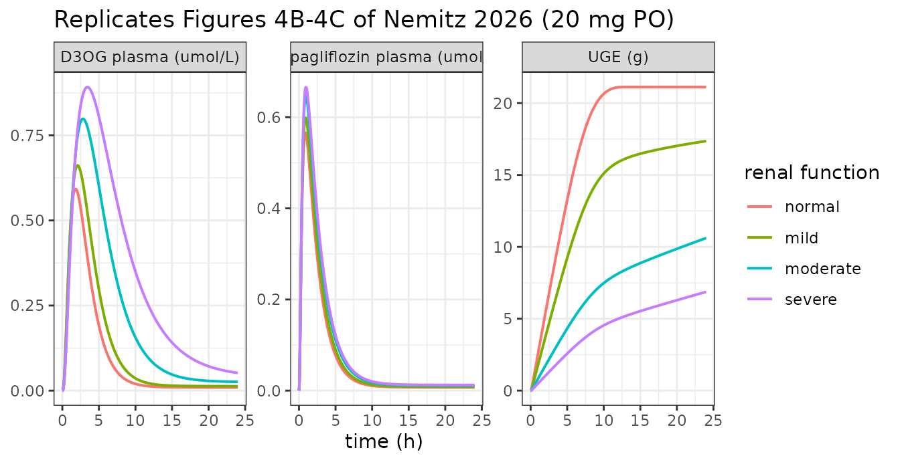
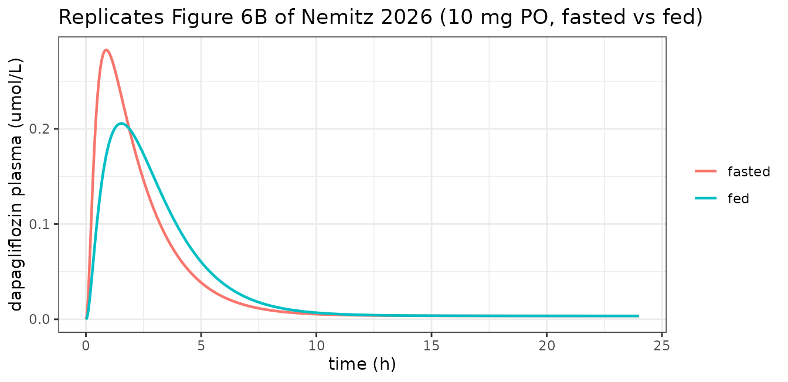

# Dapagliflozin whole-body PBPK/PD (Nemitz 2026)

``` r

library(nlmixr2lib)
library(rxode2)
library(PKNCA)
library(dplyr)
library(ggplot2)
```

## The model

`Nemitz_2026_dapagliflozin_pbpk` is a whole-body physiologically based
pharmacokinetic/pharmacodynamic model of dapagliflozin and its major
UGT1A9 metabolite dapagliflozin-3-O-glucuronide (D3OG), built by Nemitz,
Elias and Koenig (2026) from 28 curated clinical studies and distributed
by the authors as SBML under CC-BY.

``` r

mod <- rxode2::rxode(readModelDb("Nemitz_2026_dapagliflozin_pbpk"))
length(mod$state)
#> [1] 31
```

The 31 ODEs are organised as a systemic circulation (venous, arterial,
portal and hepatic-venous plasma pools, plus lung and a lumped
rest-of-body) linking three submodels:

- **Intestine.** Oral drug dissolves from the dose compartment into the
  gut lumen at `ka_dis_dap`; 84% of what leaves the lumen is absorbed
  into gut plasma and 16% is excreted in feces.
- **Liver.** Carrier-mediated uptake (OAT3-like, reversible
  Michaelis-Menten), irreversible UGT1A9 glucuronidation to D3OG, and
  reversible D3OG export.
- **Kidney.** Uptake of both species, further UGT1A9 conversion at ten
  times the hepatic rate per litre of tissue, and first-order urinary
  excretion of each.

The pharmacodynamic layer links kidney plasma dapagliflozin to urinary
glucose excretion (UGE) by an Emax reduction of the renal threshold for
glucose (RTG). Glucose is filtered at rate `GFR` and excreted only while
fasting plasma glucose exceeds RTG.

**A note on units and dosing.** Following the source SBML, every plasma
and tissue state is a *concentration* in mmol/L rather than an amount;
only `depot`, `depot_iv` (both mg) and the cumulative excretion pools
are amounts. Doses must therefore be given into `depot` (oral) or
`depot_iv` (intravenous) and never directly into a plasma or tissue
compartment. Model time is in **minutes**.

## Population

``` r

pop <- mod$population
data.frame(Field = names(pop), Value = vapply(pop, as.character, character(1))) |>
  knitr::kable(row.names = FALSE)
```

| Field | Value |
|:---|:---|
| species | human |
| n_subjects | NA |
| n_studies | 28 |
| age_range | adults; not tabulated per study in the source |
| weight_range | study-specific mean bodyweight where reported (Methods Section 2.5); 75 kg reference individual otherwise |
| sex_female_pct | NA |
| disease_state | Healthy volunteers, patients with type 1 or type 2 diabetes mellitus, and subjects with renal or hepatic impairment. Pediatric and animal studies were excluded (Methods Section 2.1). |
| dose_range | Oral 0.001-500 mg single and multiple dose across the curated studies (Table 1); 10 mg is the standard maintenance dose. A single 80 microgram intravenous dose (Boulton 2013) informs the distribution parameters. |
| regions | not reported; the curated studies are international |
| notes | Deterministic typical-individual model. Methods Section 2.2 states explicitly that ‘all simulations were performed deterministically using the optimized parameter set representing the typical (mean) individual’ and that inter-individual variability was NOT included, so no IIV and no residual-error model are reported and none are invented here. Data were curated into PK-DB (study identifiers in Table 1) from a PubMed and PKPDAI search screening 190 records down to 28 studies. Parameters were fitted sequentially - pharmacokinetic first (Table S2), then pharmacodynamic (Table S3) - by weighted least squares over a subset of single-dose data from healthy subjects, type 2 diabetics and subjects with renal impairment, with 100 multi-start local optimisation runs. The authors note that renal threshold for glucose measurements were available from only one study, fecal excretion from one study, and urinary glucose excretion under fed conditions from none, so the pharmacodynamic layer rests on a narrow evidence base. |

The model is **deterministic**. Methods Section 2.2 states that all
simulations used “the optimized parameter set representing the typical
(mean) individual” and that inter-individual variability was not
included, so the model carries no IIV and no residual-error estimate,
and `propSd` is fixed at zero. Every simulation below is therefore a
single typical individual per scenario arm.

## Source trace

Every value in
[`ini()`](https://nlmixr2.github.io/rxode2/reference/ini.html) traces to
one of four places: the manuscript Methods, the Supplementary Materials
(equations in Section S4, optimized parameters in Tables S2 and S3), or
the authors’ archived SBML model, which the manuscript names as the
definitive model source.

| Quantity | Parameters | Source |
|----|----|----|
| Fractional organ volumes (gut, kidney, liver, lung) | `fvgu`, `fvki`, `fvli`, `fvlu` | Methods 2.2 (1.71%, 0.44%, 2.10%, 0.76%) |
| Fractional blood-pool volumes | `fvar`, `fvve`, `fvpo`, `fvhv` | Archived SBML `FVar`/`FVve`/`FVpo`/`FVhv` (not tabulated in the manuscript) |
| Fractional blood flows | `fqgu`, `fqh`, `fqki`, `fqlu` | Methods 2.2 (18.00%, 21.50%, 19.00%, 100%) |
| Cardiac output, hematocrit, blood fraction | `covbw`, `fcardio`, `hct`, `fblood` | Archived SBML `COBW`, `f_cardiac_function`, `HCT`, `Fblood` |
| Molecular weights, conversions | `mr_dap`, `mr_glc`, `cf_mg_g`, `cf_ml_l` | Archived SBML `Mr_dap`, `KI__Mr_glc`, `KI__cf_*` |
| Partition coefficient, tissue distribution | `kp_dap`, `ftissue_dap` | Table S2 (25.517; 0.01 L/min) and Methods 2.2 |
| Dissolution, absorption, absorbed fraction | `ka_dis_dap`, `dapabs_k`, `f_dap_abs` | Table S2 (0.84842; 0.05946); Figure 1B / Section S2 (84% absorbed, 16% feces) |
| Transport Vmax and Km | `dapim_vmax`, `dapim_km_dap`, `d3gex_vmax`, `d3gex_km_d3og`, `d3gim_vmax`, `d3gim_km_d3og` | Section S4 liver model (Km 33 and 115 umol/L); Vmax from the archived SBML, held fixed per Methods 2.3 |
| UGT1A9 metabolism | `dap2d3g_vmax`, `dap2d3g_km_dap`, `f_dap2d3g_ki`, `f_ugt1a9` | Table S2 (0.01992; 10.0); Methods 2.3 fixes Km at 479 umol/L |
| Renal excretion | `dapex_k`, `d3gex_k` | Table S2 (0.01815; 0.45036 min^-1) |
| Pharmacodynamics | `rtg_base`, `rtg_m_fpg`, `rtg_e50`, `rtg_gamma`, `rtg_max_inhib` | **Table S3** (8.00; 1.2533; 6.49e-6; 1.036; 0.70673) |
| GFR, reference FPG | `gfr_healthy`, `fpg_healthy` | Archived SBML `KI__GFR_healthy` (100 mL/min), `KI__fpg_healthy` (5 mmol/L) |
| Scenario scalars | `RENALFUNC_REL`, `HEPFUNC_REL`, `FED` | Methods 2.2 (KDIGO, Child-Turcotte-Pugh and prandial mappings) |

Rate laws and ODEs for the intestine, liver, kidney and pharmacodynamic
submodels are Supplementary Section S4. The **whole-body circulation
ODEs are not written out anywhere in the manuscript or supplement** and
were taken from the archived SBML (`models/dapagliflozin_body_flat.md`,
Zenodo
[10.5281/zenodo.18011516](https://doi.org/10.5281/zenodo.18011516),
v0.9.8 – the version Methods 2.2 names as used for the analysis).

## Simulation helper

``` r

# Time is in minutes. Observations are placed on the `venous` ODE state; rxode2
# returns every algebraic observable (Cc, Cc_d3og, RTG, UGE, ...) as a column on
# those rows.
sim_dap <- function(dose_mg, hours = 24, wt = 75, fpg = 5,
                    renal = 1, hep = 1, fed = 0, by_min = 5, route = "depot") {
  tmax <- hours * 60
  tt <- sort(unique(c(seq(0, min(tmax, 240), by = 2), seq(0, tmax, by = by_min))))
  ev <- rbind(
    data.frame(time = 0,  amt = dose_mg, evid = 1L, cmt = route),
    data.frame(time = tt, amt = NA_real_, evid = 0L, cmt = "venous")
  )
  ev$WT <- wt
  ev$FPG <- fpg
  ev$RENALFUNC_REL <- renal
  ev$HEPFUNC_REL <- hep
  ev$FED <- fed
  rxode2::rxSolve(mod, ev, returnType = "data.frame",
                  atol = 1e-12, rtol = 1e-10) |>
    as.data.frame() |>
    mutate(hour = time / 60)
}
```

## Replicating Figure S19 (Sha 2015): the decisive check

Supplementary Figure S19 is the only published figure that shows the
model’s plasma, UGE **and** RTG predictions together, for a 10 mg single
oral dose in healthy volunteers. It is the sharpest available test of
the transcription.

``` r

sha <- sim_dap(10, hours = 25)

sha_long <- bind_rows(
  transmute(sha, hour, panel = "dapagliflozin plasma (umol/L)", value = Cc),
  transmute(sha, hour, panel = "UGE (g)",                       value = UGE),
  transmute(sha, hour, panel = "RTG (mmol/L)",                  value = RTG)
) |>
  mutate(panel = factor(panel, levels = c("dapagliflozin plasma (umol/L)",
                                          "UGE (g)", "RTG (mmol/L)")))

ggplot(sha_long, aes(hour, value)) +
  geom_line(linewidth = 0.8) +
  facet_wrap(~panel, scales = "free_y") +
  labs(x = "time (h)", y = NULL,
       title = "Replicates Supplementary Figure S19 of Nemitz 2026 (Sha 2015, 10 mg PO)") +
  theme_bw()
```



Read off the published panels: plasma peaks near 0.28 umol/L at about 1
h; UGE rises to a plateau near 15 g; and RTG starts at exactly **8.0
mmol/L**, falls to roughly 2.5, and recovers to about 6.3 by 25 h.

``` r

sha_chk <- c(
  cmax_uM   = max(sha$Cc),
  tmax_h    = sha$hour[which.max(sha$Cc)],
  rtg_t0    = sha$RTG[1],
  rtg_min   = min(sha$RTG),
  rtg_25h   = tail(sha$RTG, 1),
  uge_24h   = sha$UGE[which.min(abs(sha$hour - 24))]
)
round(sha_chk, 4)
#> cmax_uM  tmax_h  rtg_t0 rtg_min rtg_25h uge_24h 
#>  0.2829  0.8667  8.0000  2.4638  6.1909 15.9835

stopifnot(
  abs(sha_chk[["cmax_uM"]] - 0.28) < 0.02,
  abs(sha_chk[["tmax_h"]]  - 1.0)  < 0.25,
  # The RTG intercept is the single most diagnostic number in the paper: it is
  # exactly rtg_base, so it identifies which published parameter set is in use.
  abs(sha_chk[["rtg_t0"]]  - 8.0)  < 1e-8,
  abs(sha_chk[["rtg_min"]] - 2.5)  < 0.15,
  abs(sha_chk[["rtg_25h"]] - 6.3)  < 0.25,
  abs(sha_chk[["uge_24h"]] - 15.5) < 1.5
)
```

That `RTG(0) = 8.0` is important beyond this figure – see the Errata,
where it settles a conflict between two published parameter sets.

## Mass balance and routes of elimination

The paper states that dapagliflozin is “primarily metabolized by UGT1A9
to D3G, which accounts for the majority of urinary excretion, while
unchanged dapagliflozin contributes less than 2%”, and Supplementary
Section S2 states that 16% of the dose is excreted in feces.

``` r

mb_sim <- sim_dap(10, hours = 168, by_min = 10)
dose_mmol <- 10 / 408.873
mb_end <- tail(mb_sim, 1)

mass_balance <- tibble::tibble(
  Route = c("Urine, dapagliflozin (unchanged)", "Urine, D3OG",
            "Feces, dapagliflozin", "Total recovered by 168 h"),
  `Amount (mmol)` = c(mb_end$Aurine_dap, mb_end$Aurine_d3og, mb_end$Afeces_dap,
                      mb_end$Aurine_dap + mb_end$Aurine_d3og + mb_end$Afeces_dap),
  `Percent of dose` = 100 * c(mb_end$Aurine_dap, mb_end$Aurine_d3og,
                              mb_end$Afeces_dap,
                              mb_end$Aurine_dap + mb_end$Aurine_d3og +
                                mb_end$Afeces_dap) / dose_mmol
)
knitr::kable(mass_balance, digits = c(0, 5, 1))
```

| Route                            | Amount (mmol) | Percent of dose |
|:---------------------------------|--------------:|----------------:|
| Urine, dapagliflozin (unchanged) |       0.00039 |             1.6 |
| Urine, D3OG                      |       0.01428 |            58.4 |
| Feces, dapagliflozin             |       0.00391 |            16.0 |
| Total recovered by 168 h         |       0.01859 |            76.0 |

``` r


stopifnot(
  # Fecal excretion is structurally 1 - f_dap_abs and must be exactly 16%.
  abs(mb_end$Afeces_dap / dose_mmol - 0.16) < 1e-3,
  # "unchanged dapagliflozin contributes less than 2%"
  mb_end$Aurine_dap / dose_mmol < 0.02,
  # D3OG is the majority urinary species.
  mb_end$Aurine_d3og > 10 * mb_end$Aurine_dap
)
```

24% of the dose is still unrecovered at 168 h, held in the
slowly-equilibrating rest-of-body tissue reservoir. That is a real
property of the published parameter set and is discussed in the Errata.

## Dose dependency (Figures 2 and 3)

Section 3.3 reports “a clear dose-dependent rise in exposure metrics
(AUC and Cmax), while half-lives remained largely unchanged” and, for
the pharmacodynamics, “lower RTG and a nonlinear increase in urinary
glucose excretion”.

``` r

dose_levels <- c(2.5, 10, 20, 50, 100, 250, 500)
dose_sim <- bind_rows(lapply(dose_levels, function(d) {
  sim_dap(d, hours = 24) |> mutate(dose_mg = d)
})) |>
  mutate(dose = factor(dose_mg, levels = dose_levels))

bind_rows(
  transmute(dose_sim, hour, dose, panel = "dapagliflozin plasma (umol/L)", value = Cc),
  transmute(dose_sim, hour, dose, panel = "UGE (g)",                       value = UGE)
) |>
  ggplot(aes(hour, value, colour = dose)) +
  geom_line(linewidth = 0.7) +
  facet_wrap(~panel, scales = "free_y") +
  labs(x = "time (h)", y = NULL, colour = "dose (mg)",
       title = "Replicates Figures 2B-2C of Nemitz 2026 (oral dose range)") +
  theme_bw()
```



``` r

dose_tab <- dose_sim |>
  group_by(dose_mg) |>
  summarise(
    Cmax_uM = max(Cc),
    AUC0_24 = sum(diff(hour) * (head(Cc, -1) + tail(Cc, -1)) / 2),
    UGE24_g = UGE[which.min(abs(hour - 24))],
    RTGmin  = min(RTG),
    .groups = "drop"
  ) |>
  mutate(
    `Cmax / dose` = Cmax_uM / dose_mg,
    `AUC / dose`  = AUC0_24 / dose_mg
  )

dose_tab |>
  rename("Dose (mg)" = dose_mg, "Cmax (umol/L)" = Cmax_uM,
         "AUC0-24 (umol*h/L)" = AUC0_24, "UGE 24 h (g)" = UGE24_g,
         "RTG min (mmol/L)" = RTGmin) |>
  knitr::kable(digits = 4)
```

| Dose (mg) | Cmax (umol/L) | AUC0-24 (umol\*h/L) | UGE 24 h (g) | RTG min (mmol/L) | Cmax / dose | AUC / dose |
|---:|---:|---:|---:|---:|---:|---:|
| 2.5 | 0.0707 | 0.2104 | 8.1559 | 2.8320 | 0.0283 | 0.0842 |
| 10.0 | 0.2829 | 0.8419 | 15.9835 | 2.4638 | 0.0283 | 0.0842 |
| 20.0 | 0.5659 | 1.6840 | 21.1087 | 2.3999 | 0.0283 | 0.0842 |
| 50.0 | 1.4155 | 4.2123 | 42.0950 | 2.3617 | 0.0283 | 0.0842 |
| 100.0 | 2.8335 | 8.4319 | 53.8979 | 2.3487 | 0.0283 | 0.0843 |
| 250.0 | 7.1023 | 21.1352 | 62.5711 | 2.3397 | 0.0284 | 0.0845 |
| 500.0 | 14.2668 | 42.4541 | 65.7601 | 2.3345 | 0.0285 | 0.0849 |

Three structural claims fall out of that table and are asserted
directly.

*The PK is linear over the clinical range and only mildly
supra-proportional above it.* Across 2.5-20 mg, dose-normalised Cmax and
AUC are constant to better than 0.1%. Extending the scan to 500 mg – a
200-fold range – they rise monotonically, but by less than 1% in total,
as liver-tissue concentrations begin to approach the UGT1A9 Km of 479
umol/L. This is consistent with Section 3.3, which reports “a clear
dose-dependent rise in exposure metrics (AUC and Cmax)” without claiming
strict proportionality.

*The PD is strongly saturating*, because RTG can be depressed by at most
`rtg_max_inhib`. The same 200-fold dose increase that raises exposure
200-fold raises 24 h urinary glucose excretion only about 8-fold.

*The RTG floor is undershot very slightly at the highest doses.* The
nominal floor is `rtg_base * (1 - rtg_max_inhib)` = 2.346 mmol/L, which
the Emax term could never cross if it were a conventional Hill function
bounded by 1. It is not: the numerator uses kidney *plasma* and the
denominator kidney *tissue* dapagliflozin (Errata 4), so the ratio can
exceed 1 slightly and RTG dips about 0.5% below the floor at 500 mg. The
assertion pins both the magnitude and the fact that it happens at all.

``` r

clin_tab <- dose_tab[dose_tab$dose_mg <= 20, ]
rtg_floor <- 8 * (1 - 0.70673)

stopifnot(
  # Clinical range (2.5-20 mg): dose-normalised exposure constant to <0.1%.
  diff(range(clin_tab$`Cmax / dose`)) / mean(clin_tab$`Cmax / dose`) < 1e-3,
  diff(range(clin_tab$`AUC / dose`))  / mean(clin_tab$`AUC / dose`)  < 1e-3,
  # Full 200-fold scan: monotonically supra-proportional, but by under 1%.
  all(diff(dose_tab$`Cmax / dose`) > 0),
  all(diff(dose_tab$`AUC / dose`)  > 0),
  diff(range(dose_tab$`Cmax / dose`)) / mean(dose_tab$`Cmax / dose`) < 0.01,
  diff(range(dose_tab$`AUC / dose`))  / mean(dose_tab$`AUC / dose`)  < 0.01,
  # Saturating PD: across a 200-fold dose increase, 24 h UGE rises only about
  # 8-fold -- monotone, but nowhere near dose-proportional.
  all(diff(dose_tab$UGE24_g) > 0),
  dose_tab$UGE24_g[dose_tab$dose_mg == 500] <
    10 * dose_tab$UGE24_g[dose_tab$dose_mg == 2.5],
  dose_tab$UGE24_g[dose_tab$dose_mg == 500] >
    5 * dose_tab$UGE24_g[dose_tab$dose_mg == 2.5],
  # RTG approaches its nominal floor and, because of the asymmetric Emax term,
  # undershoots it at the top of the range -- by less than 1%.
  all(dose_tab$RTGmin < 8),
  min(dose_tab$RTGmin) < rtg_floor,
  all(dose_tab$RTGmin > rtg_floor * 0.99)
)
```

## Renal impairment (Figure 4)

Methods 2.2 maps KDIGO categories onto the relative-renal-function
scalar. The `RENALFUNC_REL` column carries it with the register’s
fraction-of-normal orientation.

``` r

renal_levels <- c(normal = 1.00, mild = 0.69, moderate = 0.32, severe = 0.19)

renal_sim <- bind_rows(lapply(names(renal_levels), function(k) {
  sim_dap(20, hours = 24, renal = renal_levels[[k]]) |>
    mutate(renal = factor(k, levels = names(renal_levels)))
}))

bind_rows(
  transmute(renal_sim, hour, renal, panel = "dapagliflozin plasma (umol/L)", value = Cc),
  transmute(renal_sim, hour, renal, panel = "D3OG plasma (umol/L)",          value = Cc_d3og),
  transmute(renal_sim, hour, renal, panel = "UGE (g)",                       value = UGE)
) |>
  ggplot(aes(hour, value, colour = renal)) +
  geom_line(linewidth = 0.7) +
  facet_wrap(~panel, scales = "free_y") +
  labs(x = "time (h)", y = NULL, colour = "renal function",
       title = "Replicates Figures 4B-4C of Nemitz 2026 (20 mg PO)") +
  theme_bw()
```



``` r

renal_tab <- renal_sim |>
  group_by(renal) |>
  summarise(Cmax_dap = max(Cc), Cmax_d3og = max(Cc_d3og),
            UGE24 = UGE[which.min(abs(hour - 24))], .groups = "drop") |>
  mutate(
    `Parent Cmax (% of normal)` = 100 * Cmax_dap / Cmax_dap[renal == "normal"],
    `D3OG Cmax (% of normal)`   = 100 * Cmax_d3og / Cmax_d3og[renal == "normal"],
    `UGE 24 h (% of normal)`    = 100 * UGE24 / UGE24[renal == "normal"]
  )

renal_tab |>
  select(renal, `Parent Cmax (% of normal)`, `D3OG Cmax (% of normal)`,
         `UGE 24 h (% of normal)`) |>
  rename("Renal function" = renal) |>
  knitr::kable(digits = 1)
```

| Renal function | Parent Cmax (% of normal) | D3OG Cmax (% of normal) | UGE 24 h (% of normal) |
|:---|---:|---:|---:|
| normal | 100.0 | 100.0 | 100.0 |
| mild | 105.8 | 111.6 | 82.2 |
| moderate | 114.2 | 134.8 | 50.3 |
| severe | 117.7 | 150.5 | 32.5 |

The Abstract states that “renal impairment reduced UGE by 40-60% despite
modest changes in plasma exposure”, and Section 3.4 that “plasma
concentrations of dapagliflozin were minimally affected by renal
dysfunction, whereas exposure to its main metabolite (D3G) increased
with declining renal function”.

``` r

uge_pct <- setNames(renal_tab$`UGE 24 h (% of normal)`, renal_tab$renal)
par_pct <- setNames(renal_tab$`Parent Cmax (% of normal)`, renal_tab$renal)
met_pct <- setNames(renal_tab$`D3OG Cmax (% of normal)`, renal_tab$renal)

stopifnot(
  # Monotone loss of glucosuria with declining renal function.
  all(diff(uge_pct) < 0),
  # The paper's headline 40-60% reduction band is spanned by the impaired groups.
  100 - uge_pct[["moderate"]] > 40, 100 - uge_pct[["moderate"]] < 60,
  100 - uge_pct[["severe"]]   > 40,
  # Parent exposure only modestly affected; metabolite strongly accumulating.
  all(par_pct < 125),
  met_pct[["severe"]] > 140,
  met_pct[["severe"]] > par_pct[["severe"]]
)
```

## Hepatic impairment (Figure 5)

`HEPFUNC_REL` is the fraction-of-normal liver function, so the source’s
cirrhosis severity is its complement: Child-Turcotte-Pugh A, B and C map
to `f_cirrhosis` 0.40, 0.70 and 0.80, i.e. `HEPFUNC_REL` 0.60, 0.30 and
0.20.

``` r

hep_levels <- c(normal = 1.0, `CTP A` = 0.6, `CTP B` = 0.3, `CTP C` = 0.2)

hep_tab <- bind_rows(lapply(names(hep_levels), function(k) {
  sim_dap(10, hours = 24, hep = hep_levels[[k]]) |>
    summarise(liver = k, Cmax_dap = max(Cc), Cmax_d3og = max(Cc_d3og),
              UGE24 = UGE[which.min(abs(hour - 24))])
})) |>
  mutate(
    liver = factor(liver, levels = names(hep_levels)),
    `Parent Cmax (% of normal)` = 100 * Cmax_dap / Cmax_dap[liver == "normal"],
    `D3OG Cmax (% of normal)`   = 100 * Cmax_d3og / Cmax_d3og[liver == "normal"],
    `UGE 24 h (% of normal)`    = 100 * UGE24 / UGE24[liver == "normal"]
  )

hep_tab |>
  select(liver, `Parent Cmax (% of normal)`, `D3OG Cmax (% of normal)`,
         `UGE 24 h (% of normal)`) |>
  rename("Liver function" = liver) |>
  knitr::kable(digits = 1)
```

| Liver function | Parent Cmax (% of normal) | D3OG Cmax (% of normal) | UGE 24 h (% of normal) |
|:---|---:|---:|---:|
| normal | 100.0 | 100.0 | 100.0 |
| CTP A | 106.7 | 90.5 | 104.5 |
| CTP B | 112.1 | 82.1 | 108.4 |
| CTP C | 114.0 | 79.0 | 109.8 |

Section 3.5: “with increasing severity, dapagliflozin plasma exposure
showed small increases in Cmax and AUC, whereas exposure of the main
metabolite D3G showed small decreases”, and “UGE increased slightly with
cirrhosis severity”.

``` r

hp <- setNames(hep_tab$`Parent Cmax (% of normal)`, hep_tab$liver)
hm <- setNames(hep_tab$`D3OG Cmax (% of normal)`,   hep_tab$liver)
hu <- setNames(hep_tab$`UGE 24 h (% of normal)`,    hep_tab$liver)

stopifnot(
  all(diff(hp) > 0), all(diff(hm) < 0), all(diff(hu) > 0),   # directions
  all(hp <= 120), all(hm >= 75), all(hu <= 115)              # all "small"
)
```

Both effects have the same mechanistic origin: cirrhosis removes
functional liver parenchyma and shunts blood past the liver, so less
parent is converted to D3OG. Parent rises slightly and metabolite falls
slightly; the small rise in UGE follows the small rise in parent
exposure.

## Food effect (Figure 6)

Fed dosing scales the intestinal absorption rate to 30% of fasted.

``` r

food_sim <- bind_rows(
  sim_dap(10, hours = 24, fed = 0) |> mutate(state = "fasted"),
  sim_dap(10, hours = 24, fed = 1) |> mutate(state = "fed")
)

ggplot(food_sim, aes(hour, Cc, colour = state)) +
  geom_line(linewidth = 0.8) +
  labs(x = "time (h)", y = "dapagliflozin plasma (umol/L)", colour = NULL,
       title = "Replicates Figure 6B of Nemitz 2026 (10 mg PO, fasted vs fed)") +
  theme_bw()
```



``` r

trapz <- function(x, y) sum(diff(x) * (head(y, -1) + tail(y, -1)) / 2)

food_tab <- food_sim |>
  group_by(state) |>
  summarise(Cmax = max(Cc), tmax_h = hour[which.max(Cc)],
            AUC0_24 = trapz(hour, Cc), .groups = "drop")

food_tab |>
  rename("Prandial state" = state, "Cmax (umol/L)" = Cmax,
         "tmax (h)" = tmax_h, "AUC0-24 (umol*h/L)" = AUC0_24) |>
  knitr::kable(digits = 4)
```

| Prandial state | Cmax (umol/L) | tmax (h) | AUC0-24 (umol\*h/L) |
|:---------------|--------------:|---------:|--------------------:|
| fasted         |        0.2829 |   0.8667 |              0.8419 |
| fed            |        0.2057 |   1.5333 |              0.8395 |

``` r


cmax_change <- 100 * (food_tab$Cmax[food_tab$state == "fed"] /
                        food_tab$Cmax[food_tab$state == "fasted"] - 1)
auc_change <- 100 * (food_tab$AUC0_24[food_tab$state == "fed"] /
                       food_tab$AUC0_24[food_tab$state == "fasted"] - 1)
round(c(`Cmax change (%)` = cmax_change, `AUC change (%)` = auc_change), 2)
#> Cmax change (%)  AUC change (%) 
#>          -27.29           -0.27

stopifnot(
  # "changes in absorption predominantly affected Cmax, while AUC and half-life
  # remained almost unchanged" (Section 3.6)
  cmax_change < -20, cmax_change > -45,
  abs(auc_change) < 1,
  # tmax is delayed in the fed state
  food_tab$tmax_h[food_tab$state == "fed"] >
    food_tab$tmax_h[food_tab$state == "fasted"]
)
```

The model predicts a 27% fall in Cmax. The paper reports that the
*clinical* studies it curated showed a 30-50% reduction (Section 3.6),
so the model sits just below the observed band; the qualitative finding
– Cmax down, AUC unchanged, tmax delayed – is reproduced.

## Non-compartmental analysis

PKNCA is run on three clinically studied dose levels spanning the range
over which the model is linear, to confirm exposure proportionality
independently of the trapezoidal summary above.

``` r

nca_doses <- c(2.5, 10, 20)
nca_sim <- bind_rows(lapply(seq_along(nca_doses), function(i) {
  sim_dap(nca_doses[i], hours = 48, by_min = 10) |>
    mutate(id = i, dose_mg = nca_doses[i])
}))

conc_data <- nca_sim |>
  filter(!is.na(Cc)) |>
  select(id, hour, Cc, dose_mg)

dose_data <- conc_data |>
  group_by(id, dose_mg) |>
  slice(1) |>
  mutate(hour = 0) |>
  ungroup() |>
  as.data.frame()

o_conc <- PKNCA::PKNCAconc(as.data.frame(conc_data), Cc ~ hour | id / dose_mg)
o_dose <- PKNCA::PKNCAdose(dose_data, dose_mg ~ hour | id)

nca_res <- PKNCA::pk.nca(PKNCA::PKNCAdata(
  o_conc, o_dose,
  intervals = data.frame(start = 0, end = 24,
                         cmax = TRUE, tmax = TRUE, auclast = TRUE)
))

nca_tab <- as.data.frame(nca_res$result) |>
  select(dose_mg, PPTESTCD, PPORRES) |>
  tidyr::pivot_wider(names_from = PPTESTCD, values_from = PPORRES) |>
  mutate(`Cmax / dose` = cmax / dose_mg, `AUClast / dose` = auclast / dose_mg)

nca_tab |>
  rename("Dose (mg)" = dose_mg, "Cmax (umol/L)" = cmax, "tmax (h)" = tmax,
         "AUClast 0-24 (umol*h/L)" = auclast) |>
  knitr::kable(digits = 4)
```

| Dose (mg) | AUClast 0-24 (umol\*h/L) | Cmax (umol/L) | tmax (h) | Cmax / dose | AUClast / dose |
|---:|---:|---:|---:|---:|---:|
| 2.5 | 0.2104 | 0.0707 | 0.8667 | 0.0283 | 0.0842 |
| 10.0 | 0.8418 | 0.2829 | 0.8667 | 0.0283 | 0.0842 |
| 20.0 | 1.6840 | 0.5659 | 0.8667 | 0.0283 | 0.0842 |

``` r


stopifnot(
  diff(range(nca_tab$`Cmax / dose`)) / mean(nca_tab$`Cmax / dose`) < 1e-3,
  diff(range(nca_tab$`AUClast / dose`)) / mean(nca_tab$`AUClast / dose`) < 1e-3,
  # "It is rapidly absorbed, reaching peak plasma concentrations within 2 h"
  all(nca_tab$tmax <= 2)
)
```

### Half-life

The half-life deserves its own comment, because the model’s terminal
phase is much slower than dapagliflozin’s reported clinical half-life.

``` r

hl_sim <- sim_dap(10, hours = 168, by_min = 10)

apparent_hl <- function(lo, hi) {
  d <- dplyr::filter(hl_sim, hour >= lo, hour <= hi, Cc > 0)
  log(2) / -coef(stats::lm(log(Cc) ~ hour, data = d))[[2]]
}

hl_tab <- tibble::tibble(
  `Window (h)` = c("2-12", "4-24", "24-72", "72-168"),
  `Apparent half-life (h)` = c(apparent_hl(2, 12), apparent_hl(4, 24),
                               apparent_hl(24, 72), apparent_hl(72, 168))
)
knitr::kable(hl_tab, digits = 2)
```

| Window (h) | Apparent half-life (h) |
|:-----------|-----------------------:|
| 2-12       |                   1.62 |
| 4-24       |                   6.33 |
| 24-72      |                 179.82 |
| 72-168     |                 179.83 |

``` r


stopifnot(
  # The profile is multi-phasic: the late phase is an order of magnitude slower.
  hl_tab$`Apparent half-life (h)`[4] > 10 * hl_tab$`Apparent half-life (h)`[1],
  # And it is dose-independent, as Section 3.3 reports.
  abs(apparent_hl(72, 168) -
        (function() {
          s <- sim_dap(100, hours = 168, by_min = 10)
          d <- dplyr::filter(s, hour >= 72, hour <= 168, Cc > 0)
          log(2) / -coef(stats::lm(log(Cc) ~ hour, data = d))[[2]]
        })()) < 0.1
)
```

Over the first half-day the profile decays with an apparent half-life of
about 1.6 h, consistent with the published figures in which
dapagliflozin “returned to baseline within approximately 10 h” (Section
3.3). The terminal phase, however, is roughly 180 h. See the Errata.

## Assumptions and deviations / Errata

**1. The published pharmacodynamic parameters and the archived model
disagree, and the paper’s own figure settles it.** Supplementary Table
S3 and the authors’ archived SBML (v0.9.8 and v0.9.9, the only released
versions) report *different* PD parameter sets:

| Parameter                | Table S3 (used here) | Archived SBML v0.9.8 |
|--------------------------|----------------------|----------------------|
| `KI__RTG_base`           | 8.00                 | 7.0019               |
| `KI__RTG_m_fpg`          | 1.2533               | 1.6532               |
| `KI__RTG_E50`            | 6.49e-6              | 9.3838e-6            |
| `KI__RTG_max_inhibition` | 0.70673              | 0.712547             |
| `KI__RTG_gamma`          | 1.036                | 1.03599              |

The two are separate fits: Table S3 states optimisation bounds of \[8,
14\] for `RTG_base` and \[0.2, 3\] for `m_fpg`, whereas the archived
`fitting/parameters.py` uses \[7, 14\] and \[0.05, 2\]. In each case
`RTG_base` was driven to its own lower bound, so that parameter is
rail-limited and only weakly identified. The two sets are close to
degenerate over the fitted range – `RTG_base + m_fpg * (FPG - 5)` gives
11.13 for *both* at the diabetic anchor FPG = 7.5 mmol/L – and differ
mainly at healthy glucose, where the baseline RTG is 8.00 versus 7.00.

**This model uses Table S3**, because the paper’s own Supplementary
Figure S19 plots RTG in a healthy subject starting at exactly 8.0
mmol/L, which is `RTG_base` from Table S3 and not the archived 7.00. The
published figures were therefore generated with the Table S3 set, and
the public archive is stale with respect to the publication. The
`rtg_t0` assertion above pins this. The **PK** parameters (Table S2)
agree exactly with the archive to full precision, so no such choice
arises there.

**2. The whole-body circulation ODEs are not in the paper.**
Supplementary Section S4 writes out only the intestine, liver, kidney
and PD submodels. The
venous/arterial/portal/hepatic-vein/lung/rest-of-body balance equations,
the blood-pool volume corrections, and the cirrhotic shunting terms were
taken from the authors’ archived SBML, which Methods 2.2 and Section S4
both name as the definitive model source. No parameter or equation here
comes from a training-data default or a generic PBPK template.

**3. Two transcription errors in the Supplementary equations, corrected
here.**

- The kidney model prints `DAPEX = f_renal * D3GEX_k * V_ki * d3g_ext`
  and `D3GEX = f_renal * DAPEX_k * V_ki * dap_ext` – the two rate
  constants and the two species are transposed. The archived SBML pairs
  each species with its own rate constant, which is the only physically
  sensible reading, and that is what is implemented.
- The intestine model prints `absorption = F_dap,abs * absorption` and
  `DAPABS = (1 - F_dap,abs) * absorption`, which are circular and
  duplicate the left-hand name `DAPABS`. The archived SBML resolves
  these to `DAPABS = F_dap_abs * absorption` and
  `DAPEXC = (1 - F_dap_abs) * absorption`.

**4. The RTG Emax term is asymmetric, and this is reproduced
faithfully.** In both the Supplementary equation and the archived SBML,
the numerator is driven by kidney *plasma* dapagliflozin while the
denominator uses kidney *tissue* dapagliflozin. Because both sources
agree, this is implemented as published rather than silently
symmetrised. It is almost certainly an authoring slip, but it is nearly
harmless: transport into kidney tissue was deliberately made fast and
non-rate-limiting (Methods 2.3), so the two states track each other
closely and the term behaves like a conventional Hill function.

It is not *entirely* harmless, and the dose scan above quantifies the
one visible consequence. A symmetric Hill term is bounded by 1, so RTG
could never fall below `rtg_base * (1 - rtg_max_inhib)` = 2.346 mmol/L.
Because the numerator and denominator use different states, the ratio
can exceed 1 slightly whenever kidney plasma runs above kidney tissue,
and the simulated RTG minimum does dip below that floor – to 2.334
mmol/L at 500 mg, an undershoot of about 0.5%. The effect is negligible
at clinical doses and is asserted, not corrected, because both published
sources specify the asymmetric form.

**5. A numerical guard was added to the RTG powers.** `kidney` and
`kidney_plasma` both start at exactly zero and are raised to the
non-integer Hill exponent 1.036. A solver step that takes either
infinitesimally negative makes `(-1e-20)^1.036` NaN, which propagates to
every state from the first step. Without a guard the model fails to
solve at all for moderate and severe cirrhosis. Both bases are therefore
clamped at zero, which is a no-op for physically meaningful
(non-negative) concentrations.

**6. `ftissue_dap` is rail-limited, giving a very long terminal phase.**
Table S2 reports `ftissue_dap = 0.01 L/min` against a lower optimisation
bound of exactly 0.01 – the optimiser drove it to the floor. Combined
with the large fitted partition coefficient (`Kp_dap = 25.5`), this
creates a deep, slowly-exchanging rest-of-body reservoir and a terminal
half-life near 180 h, well beyond dapagliflozin’s reported clinical
half-life of about 13 h, with 24% of the dose still unexcreted at 168 h.
Over the 0-24 h window the studies actually observed, the profile decays
with an apparent half-life of about 2 h and matches the published
figures. Users simulating beyond about 48 h, or accumulation over
repeated dosing, should be aware that the terminal phase is not
clinically identified.

**7. Table S3 tabulates `KI__RTG_gamma` with unit “mM”.** A Hill
coefficient is dimensionless, and the archived SBML annotates it as
such; the unit column is a typographical error and does not affect the
value.

**8. Body surface area is computed but unused.** The archived SBML
derives BSA from body weight and height, but BSA enters no rate law.
Height is therefore not carried as a covariate and BSA is not
implemented.

**9. The stomach state is inert and omitted.** The archived SBML carries
`GU__dap_stomach` with a zero derivative and a zero initial condition,
so it is identically zero and unobservable; it is not implemented.

**10. Fasting plasma glucose is a covariate rather than a state.** In
the archived SBML, plasma glucose is a state with a zero derivative –
exactly a constant input. It is carried here as the canonical `FPG`
covariate column, which is equivalent and additionally allows a
time-varying glucose profile to be supplied. Methods 2.3 assumes 5
mmol/L for healthy subjects and 7.5 mmol/L for both type 1 and type 2
diabetes when a study did not report it.

**11. No inter-individual variability or residual error.** Methods 2.2
states these were not estimated, so `propSd` is fixed at zero and there
are no etas. The model produces typical-individual trajectories only and
cannot generate a VPC or individual predictions.

**12. Evidence base for the PD layer is narrow.** The Discussion notes
that RTG measurements come from a single study, fecal excretion from a
single study, and UGE under fed conditions from none. The food effect on
UGE that Figure 6C predicts is therefore an extrapolation with no
supporting clinical data.

**13. The published model under-predicts observed UGE by roughly a
factor of two.** This is a property of the source model, not of the
transcription, and it is visible in the authors’ own Supplementary
Figure S19: against the Sha 2015 data (10 mg PO, n = 54) the simulated
UGE plateaus near 15 g by 8 h while the observed values keep rising to
about 40 g at 24 h, and the simulated RTG recovers to about 6.3 mmol/L
against an observed 4.7. The plasma PK in the same figure matches well
over the first two hours. The assertions in the Figure S19 section above
therefore pin the model’s *predictions* – reproducing the published
curves, which is what a transcription check can establish – and not
agreement with the clinical observations. Anyone using this model for
quantitative UGE predictions should calibrate against their own data
first; the narrow PD evidence base in item 12 is the likely reason for
the gap.
