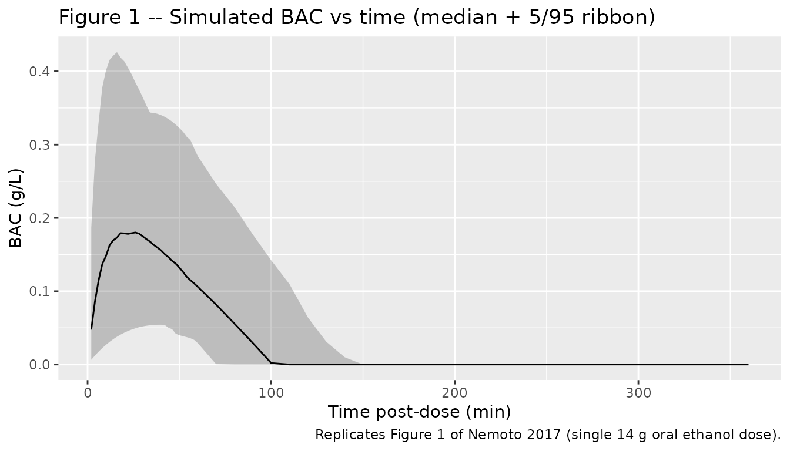
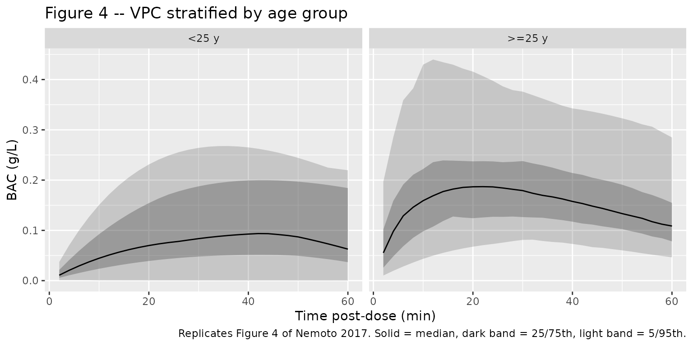

# Ethanol (Nemoto 2017)

## Model and source

- Citation: Nemoto A, Masaaki M, Yamaoka K. A Bayesian Approach for
  Population Pharmacokinetic Modeling of Alcohol in Japanese
  Individuals. Curr Ther Res Clin Exp. 2017;85:1-7.
  <doi:10.1016/j.curtheres.2017.04.001>
- Description: Bayesian population PK model for orally ingested ethanol
  (alcohol) in 34 healthy Japanese adults (Nemoto 2017). One-compartment
  model with first-order absorption and Michaelis-Menten elimination;
  covariates: sex, age, body weight, ALDH2 and ADH1B genotypes. Final
  model fit by a fully conditional MCMC Bayesian analysis with
  informative priors derived from Seng et al. 2014 (Chinese + Indian
  cohort).
- Article: <https://doi.org/10.1016/j.curtheres.2017.04.001>

The Nemoto 2017 paper is open access (CC BY-NC-ND) and is the final
model listed in Table II (“final model” column). The previously
published Seng et al. 2014 popPK of ethanol in a Chinese + Indian cohort
(their “base model” prior in Nemoto 2017) is not packaged here
separately because all of its parameters appear directly in Nemoto 2017
Table II (“Mean (SD) of normal prior” column).

## Population

The Nemoto 2017 analysis cohort comprised 34 healthy Japanese adults (21
men, 13 women) aged 20-62 years recruited at the Osaka University
Hospital (Nemoto 2017 Methods, “Dataset”). Each subject ingested 14 g
ethanol (350 mL beer) over 10 minutes in the fasted state. Blood alcohol
concentration (BAC) was sampled at 5, 10, 20, 30, and 60 minutes
post-dose, yielding 157 observations across the cohort (Nemoto 2017
Table I). The ALDH2 genotype distribution was 21/34 (62%) ALDH2*1/*1
wild-type and 13/34 (38%) ALDH2*1/*2 heterozygous; no ALDH2*2/*2
homozygotes were enrolled. ADH1B genotype frequencies in the cohort are
not reported. The paper centres age on the cohort median 29.4 years and
body weight on 61.3 kg.

The same information is available programmatically:

``` r

rxode2::rxode(readModelDb("Nemoto_2017_ethanol"))$meta$population
#> ℹ parameter labels from comments will be replaced by 'label()'
#> $species
#> [1] "human"
#> 
#> $n_subjects
#> [1] 34
#> 
#> $n_observations
#> [1] 157
#> 
#> $n_studies
#> [1] 1
#> 
#> $age_range
#> [1] "20-62 years"
#> 
#> $age_median
#> [1] "29.4 years (centring value used in the model)"
#> 
#> $weight_range
#> [1] "not reported; reference WT 61.3 kg used as centring value"
#> 
#> $weight_median
#> [1] "61.3 kg (centring value used in the model)"
#> 
#> $sex_female_pct
#> [1] 38.2
#> 
#> $race_ethnicity
#> [1] "Japanese (single-cohort)"
#> 
#> $disease_state
#> [1] "Healthy adult volunteers"
#> 
#> $dose_range
#> [1] "14 g ethanol (350 mL beer) ingested over 10 minutes in the fasted state"
#> 
#> $regions
#> [1] "Japan (Osaka University cohort)"
#> 
#> $notes
#> [1] "ALDH2 distribution: 21/34 (62%) *1/*1, 13/34 (38%) *1/*2, 0/34 (0%) *2/*2 (Nemoto 2017 Methods 'Dataset', page 2). ADH1B genotype distribution within the Nemoto 2017 cohort is not tabulated; the Vmax structural model uses two values, one per *2/*1 vs *2/*2 ADH1B genotype, with no value provided for ADH1B*1/*1. Blood alcohol concentration observations sampled at 5, 10, 20, 30, and 60 minutes post-dose (early-absorption and around the peak); no elimination-phase data available (Nemoto 2017 Table I and Methods). Posterior estimates from a fully conditional MCMC Bayesian analysis with priors derived from Seng et al. 2014 popPK of ethanol in Chinese + Indian subjects (Nemoto 2017 'Prior information' and Table II)."
```

## Source trace

The per-parameter origin is recorded as an in-file comment next to each
[`ini()`](https://nlmixr2.github.io/rxode2/reference/ini.html) entry in
`inst/modeldb/specificDrugs/Nemoto_2017_ethanol.R`. The table below
collects them for review.

| Quantity | Value | Source location |
|----|----|----|
| `lka` (ka, 29.4 y male) | log(3.0); ka = 3.0 (95% CI 2.4-3.9) | Nemoto 2017 Table II final-model row “ka (1/h)” |
| `lvc` (Vd/F, 29.4 y, 61.3 kg, ALDH2*1/*1 male) | log(49.3); Vd/F = 49.3 L (47.4-51.2) | Nemoto 2017 Table II final-model row “Vd/F (L)” |
| `lvmax` (Vmax, ADH1B*2/*1, 61.3 kg) | log(7790); Vmax = 7790 mg/h (7403-8264) | Nemoto 2017 Table II final-model row “VmaxADH1B*2/*1” |
| `e_adh1b_s2_hom_vmax` | +176 mg/h (= 7966 - 7790) | Nemoto 2017 Table II VmaxADH1B*2/*2 = 7966 mg/h (7422-8483) minus VmaxADH1B*2/*1 = 7790 |
| `lkm` | log(0.074); Km = 0.074 mg/L (0.001-0.391) | Nemoto 2017 Table II final-model row “Km (mg/L)” |
| `e_sexf_ka` | -1.3 1/h | Nemoto 2017 Table II final-model row “theta_SEX(ka)” (-2.1 to -0.56) |
| `e_sexf_vc` | -12.2 L | Nemoto 2017 Table II final-model row “theta_SEX(Vd/F)” (-15.0 to -9.41) |
| `e_aldh2_s2_carrier_vc` | -20.4 L | Nemoto 2017 Table II final-model row “theta_ALDH2(Vd/F)” (-27.7 to -10.9) |
| `e_age_ka` | 2.7 | Nemoto 2017 Table II final-model row “theta_AGE(ka)” (2.1-3.4) |
| `e_age_vc` | 0.52 | Nemoto 2017 Table II final-model row “theta_AGE(Vd/F)” (0.19-0.83) |
| `e_wt_vc` | 0.78 | Nemoto 2017 Table II final-model row “theta_WT(Vd/F)” (0.60-0.95) |
| `e_wt_vmax` | 0.78 | Nemoto 2017 Table II final-model row “theta_WT(Vmax)” (0.66-0.90) |
| `etalka` IIV variance | 0.37 | Nemoto 2017 Table II final-model row “omega^2 ka” (0.24-0.55) |
| `etalvc` IIV variance | 0.029 | Nemoto 2017 Table II final-model row “omega^2 Vd/F” (0.018-0.048) |
| `etalvmax` IIV variance | 0.027 | Nemoto 2017 Table II final-model row “omega^2 Vmax” (0.017-0.042) |
| `etalkm` IIV variance | 1.13 | Nemoto 2017 Table II final-model row “omega^2 Km” (0.69-1.83) |
| `propSd` (residual SD) | sqrt(0.028) ~ 0.167 | Nemoto 2017 Table II final-model row “sigma^2” (0.020-0.038) |
| Structural model (ka, Vd/F, Vmax, Km) | additive sex / ALDH2 / ADH1B effects on the linear scale, power-form WT / AGE effects | Nemoto 2017 Table II “Structural model for PK parameters and covariates in the final model” footnote |

## Typical-value parameter checks

Replicate the narrative parameter values stated in the Results section
of Nemoto 2017 (pages 4-5). The model file’s
[`ini()`](https://nlmixr2.github.io/rxode2/reference/ini.html) is
encoded for a reference 29.4-year-old, 61.3-kg, ALDH2*1/*1 wild-type,
ADH1B*2/*1 heterozygous male, matching the centring used by the paper.

``` r

mod <- rxode2::rxode(readModelDb("Nemoto_2017_ethanol"))
#> ℹ parameter labels from comments will be replaced by 'label()'

# Look up THETA point estimates directly from the parsed iniDf table.
theta <- setNames(mod$iniDf$est, mod$iniDf$name)

typical_pk <- function(age, sexf, aldh2_s2_carrier,
                       wt = 61.3, adh1b_s2_hom = 0) {
  ka_typ <- (exp(theta["lka"]) + theta["e_sexf_ka"] * sexf) *
            (age / 29.4)^theta["e_age_ka"]
  vc_typ <- (exp(theta["lvc"]) +
             theta["e_sexf_vc"] * sexf +
             theta["e_aldh2_s2_carrier_vc"] * aldh2_s2_carrier) *
            (wt / 61.3)^theta["e_wt_vc"] *
            (age / 29.4)^theta["e_age_vc"]
  vmax_typ <- (exp(theta["lvmax"]) +
               theta["e_adh1b_s2_hom_vmax"] * adh1b_s2_hom) *
              (wt / 61.3)^theta["e_wt_vmax"]
  list(ka = unname(ka_typ),
       vc = unname(vc_typ),
       vmax = unname(vmax_typ))
}

checks <- data.frame(
  scenario = c(
    "29.4-y male, ALDH2*1/*1",
    "40-y male, ALDH2*1/*1",
    "29.4-y male, ALDH2*1/*2",
    "29.4-y female, ALDH2*1/*1",
    "29.4-y female, ALDH2*1/*2"
  ),
  age      = c(29.4, 40,   29.4, 29.4, 29.4),
  sexf     = c(0,    0,    0,    1,    1),
  aldh2    = c(0,    0,    1,    0,    1)
)
checks$ka <- mapply(
  function(a, s, l) typical_pk(a, s, l)$ka,
  checks$age, checks$sexf, checks$aldh2
)
checks$vc <- mapply(
  function(a, s, l) typical_pk(a, s, l)$vc,
  checks$age, checks$sexf, checks$aldh2
)

knitr::kable(checks, digits = 2,
             caption = "Typical-value parameter checks vs Nemoto 2017 narrative.")
```

| scenario                  |  age | sexf | aldh2 |   ka |    vc |
|:--------------------------|-----:|-----:|------:|-----:|------:|
| 29.4-y male, ALDH2*1/*1   | 29.4 |    0 |     0 | 3.00 | 49.30 |
| 40-y male, ALDH2*1/*1     | 40.0 |    0 |     0 | 6.89 | 57.86 |
| 29.4-y male, ALDH2*1/*2   | 29.4 |    0 |     1 | 3.00 | 28.90 |
| 29.4-y female, ALDH2*1/*1 | 29.4 |    1 |     0 | 1.70 | 37.10 |
| 29.4-y female, ALDH2*1/*2 | 29.4 |    1 |     1 | 1.70 | 16.70 |

Typical-value parameter checks vs Nemoto 2017 narrative. {.table}

The paper-reported typical values for comparison (Nemoto 2017 Results
pages 4-5):

- ka = 3.0 1/h for a 29-year-old man; ka = 6.9 1/h for a 40-year-old
  man. Computed: 3 and 6.89.
- Vd/F = 49.3 L for a 29-year-old man with ALDH2*1/*1; Vd/F = 28.9 L for
  a 29-year-old man with ALDH2*1/*2. Computed: 49.3 and 28.9.
- Vd/F = 57.9 L for a 40-year-old man (ALDH2*1/*1, WT 61.3 kg). Computed
  via `typical_pk(age = 40, sexf = 0, aldh2_s2_carrier = 0)`: 57.86.

## Virtual cohort

Original observed data are not publicly available. The simulation below
uses a virtual cohort whose covariate distributions approximate the
published Nemoto 2017 demographics (n = 34, 21 men + 13 women, age 20-62
y, ALDH2 distribution 62% wild-type vs 38% heterozygous, ADH1B
distribution unknown in source – assumed Japanese-typical 49% *2/*2
homozygous vs 42% *2/*1 heterozygous vs 9% *1/*1 wild-type, with *1/*1
subjects assigned `ADH1B_S2_HOM = 0` per the model file’s documented
convention).

``` r

set.seed(1234)

n_virtual <- 200L  # larger than the 34-subject source for smoother percentiles

make_cohort <- function(n, id_offset = 0L) {
  tibble::tibble(
    id   = id_offset + seq_len(n),
    AGE  = round(runif(n, 20, 62), 1),
    WT   = round(rnorm(n, 61.3, 8), 1),  # mass approximate to source reference; SD assumed
    SEXF = rbinom(n, 1, 13/34),
    ALDH2_S2_CARRIER = rbinom(n, 1, 13/34),
    # Japanese-typical ADH1B distribution: *2 allele freq ~70%, so
    # P(*2/*2) ~ 0.49, P(*1/*2) ~ 0.42, P(*1/*1) ~ 0.09. The model only
    # distinguishes *2/*2 (HOM = 1) vs everything else (HOM = 0).
    ADH1B_S2_HOM = rbinom(n, 1, 0.49)
  )
}

cohort <- make_cohort(n_virtual)

# Build event table: single 14000 mg (14 g) dose into depot at t = 0;
# observations every 2 min for the first hour then every 10 min to 6 h.
dose_rows <- cohort |>
  mutate(time = 0, amt = 14000, evid = 1L, cmt = "depot") |>
  select(id, time, amt, evid, cmt, AGE, WT, SEXF,
         ALDH2_S2_CARRIER, ADH1B_S2_HOM)

obs_times <- c(seq(0, 60, by = 2), seq(70, 360, by = 10))  # minutes
obs_rows <- tidyr::expand_grid(
  id   = cohort$id,
  time = obs_times / 60   # hours (model time unit)
) |>
  left_join(cohort, by = "id") |>
  mutate(amt = 0, evid = 0L, cmt = "central") |>
  select(id, time, amt, evid, cmt, AGE, WT, SEXF,
         ALDH2_S2_CARRIER, ADH1B_S2_HOM)

events <- bind_rows(dose_rows, obs_rows) |>
  arrange(id, time, desc(evid))

stopifnot(!anyDuplicated(events[, c("id", "time", "evid")]))
```

## Simulation

``` r

sim <- rxode2::rxSolve(
  mod, events = events,
  keep = c("AGE", "WT", "SEXF", "ALDH2_S2_CARRIER", "ADH1B_S2_HOM")
) |>
  as.data.frame() |>
  mutate(
    Cc_g_L = Cc / 1000,        # convert mg/L to g/L (paper's units for BAC)
    age_group = ifelse(AGE < 25, "<25 y", ">=25 y")
  )
```

## Replicate published figures

### Figure 1 – BAC vs time post-dose (single-dose profiles)

Nemoto 2017 Figure 1 shows the raw BAC vs time scatter for 34 subjects
(157 observations) over the 0-60 min sampling window. Below is the
median + 5/95 percentile envelope from the virtual cohort over the same
window plus a longer 6-hour extension showing the saturable elimination.

``` r

sim |>
  filter(time > 0) |>                          # drop the t = 0 zeros
  group_by(time) |>
  summarise(
    Q05 = quantile(Cc_g_L, 0.05, na.rm = TRUE),
    Q50 = quantile(Cc_g_L, 0.50, na.rm = TRUE),
    Q95 = quantile(Cc_g_L, 0.95, na.rm = TRUE),
    .groups = "drop"
  ) |>
  ggplot(aes(time * 60, Q50)) +                # convert h back to min
  geom_ribbon(aes(ymin = Q05, ymax = Q95), alpha = 0.25) +
  geom_line() +
  labs(x = "Time post-dose (min)", y = "BAC (g/L)",
       title = "Figure 1 -- Simulated BAC vs time (median + 5/95 ribbon)",
       caption = "Replicates Figure 1 of Nemoto 2017 (single 14 g oral ethanol dose).")
```



### Figure 4 – VPC stratified by age group

``` r

sim |>
  filter(time > 0, time * 60 <= 60) |>
  group_by(age_group, time) |>
  summarise(
    Q05 = quantile(Cc_g_L, 0.05, na.rm = TRUE),
    Q25 = quantile(Cc_g_L, 0.25, na.rm = TRUE),
    Q50 = quantile(Cc_g_L, 0.50, na.rm = TRUE),
    Q75 = quantile(Cc_g_L, 0.75, na.rm = TRUE),
    Q95 = quantile(Cc_g_L, 0.95, na.rm = TRUE),
    .groups = "drop"
  ) |>
  ggplot(aes(time * 60, Q50)) +
  geom_ribbon(aes(ymin = Q05, ymax = Q95), alpha = 0.20) +
  geom_ribbon(aes(ymin = Q25, ymax = Q75), alpha = 0.30) +
  geom_line() +
  facet_wrap(~ age_group) +
  labs(x = "Time post-dose (min)", y = "BAC (g/L)",
       title = "Figure 4 -- VPC stratified by age group",
       caption = "Replicates Figure 4 of Nemoto 2017. Solid = median, dark band = 25/75th, light band = 5/95th.")
```



## PKNCA validation

Single oral dose of 14 g ethanol; PKNCA computes Cmax and Tmax. AUC and
half-life have ambiguous meaning under Michaelis-Menten elimination (the
terminal slope is dose-dependent and not log-linear), so they are not
reported here – the Nemoto 2017 paper itself does not report NCA
parameters.

``` r

sim_nca <- sim |>
  filter(!is.na(Cc), time > 0) |>
  mutate(treatment = "14 g ethanol oral") |>
  select(id, time, Cc, treatment)

dose_df <- events |>
  filter(evid == 1) |>
  mutate(treatment = "14 g ethanol oral") |>
  select(id, time, amt, treatment)

conc_obj <- PKNCA::PKNCAconc(sim_nca, Cc ~ time | treatment + id,
                             concu = "mg/L", timeu = "hour")
#> Warning in assert_conc(conc, any_missing_conc = any_missing_conc): Negative
#> concentrations found
dose_obj <- PKNCA::PKNCAdose(dose_df, amt ~ time | treatment + id,
                             doseu = "mg")

intervals <- data.frame(
  start  = 0,
  end    = 1,           # 0-1 h covers the observed Tmax window
  cmax   = TRUE,
  tmax   = TRUE
)

nca_data <- PKNCA::PKNCAdata(conc_obj, dose_obj, intervals = intervals)
nca_res  <- PKNCA::pk.nca(nca_data)

knitr::kable(as.data.frame(summary(nca_res)),
             caption = "Simulated NCA Cmax / Tmax over 0-1 h after a single 14 g oral ethanol dose.")
```

| Interval Start | Interval End | treatment | N | Cmax (mg/L) | Tmax (hour) |
|---:|---:|:---|:---|:---|:---|
| 0 | 1 | 14 g ethanol oral | 200 | 158 \[143\] | 0.367 \[0.0333, 0.967\] |

Simulated NCA Cmax / Tmax over 0-1 h after a single 14 g oral ethanol
dose. {.table}

### Comparison against published BAC range

Nemoto 2017 reports the observed peak BAC range across the 34 subjects
as 0.025 to 0.41 g/L (Discussion paragraph 2). The simulated cohort Cmax
range (median, 5th-95th percentiles) is:

``` r

cmax_summary <- sim |>
  group_by(id) |>
  summarise(cmax_g_L = max(Cc_g_L, na.rm = TRUE), .groups = "drop") |>
  summarise(
    n          = dplyr::n(),
    min        = min(cmax_g_L),
    p05        = quantile(cmax_g_L, 0.05),
    median     = median(cmax_g_L),
    p95        = quantile(cmax_g_L, 0.95),
    max        = max(cmax_g_L)
  )

knitr::kable(cmax_summary, digits = 3,
             caption = "Simulated per-subject Cmax (g/L) over 0-6 h. Compare against Nemoto 2017 observed range 0.025 to 0.41 g/L.")
```

|   n | min |   p05 | median |   p95 |   max |
|----:|----:|------:|-------:|------:|------:|
| 200 |   0 | 0.054 |   0.19 | 0.447 | 0.616 |

Simulated per-subject Cmax (g/L) over 0-6 h. Compare against Nemoto 2017
observed range 0.025 to 0.41 g/L. {.table}

## Assumptions and deviations

- **ADH1B genotype distribution.** Nemoto 2017 does not tabulate the
  cohort’s ADH1B genotype frequencies. The virtual cohort uses
  Japanese-typical allele frequencies (*2 allele frequency ~ 70%, giving
  ~49%* 2/*2 homozygous, ~42%* 2/*1 heterozygous, ~9%* 1/*1 wild-type).
  ADH1B*1/\*1 subjects fall outside the published Vmax parameterization
  and are assigned the heterozygous Vmax value (ADH1B_S2_HOM = 0).
- **Body weight distribution.** The paper reports a reference centring
  value of 61.3 kg but does not publish a per-subject weight
  distribution. The virtual cohort uses a Gaussian approximation N(61.3,
  8 kg). Adjust this if the user has the underlying Osaka University
  cohort weights.
- **No ALDH2*2/*2 homozygotes.** The Nemoto 2017 cohort had zero
  subjects with the homozygous variant ALDH2*2/*2 genotype, so the
  indicator `ALDH2_S2_CARRIER = 1` is informed only by
  heterozygous-vs-wild-type contrast. Extrapolation to *2/*2 homozygotes
  is an untested assumption.
- **Concentration units.** The model file uses mg/L internally (units
  consistent with Vmax in mg/h and Km in mg/L). The paper reports BAC in
  g/L; the vignette displays both forms (`Cc` in mg/L, `Cc_g_L` =
  `Cc / 1000` in g/L).
- **Sampling and elimination phase.** The Nemoto 2017 observation window
  (0-60 min post-dose) covers only the absorption phase and the peak.
  The Michaelis-Menten elimination constants Vmax and Km are only weakly
  informed by these data; the paper inherits informative priors from
  Seng et al. 2014. Extrapolated simulations past 60 min (as shown in
  the 6-hour Figure 1 panel) rely on the prior-informed posterior and
  should be interpreted with caution.
- **PKNCA AUC / half-life omitted.** Under Michaelis-Menten elimination
  the apparent terminal slope is dose-dependent and not log-linear, so
  NCA AUC0-inf and half-life are not meaningful. Nemoto 2017 does not
  report NCA parameters; only Cmax / Tmax are extracted here.
