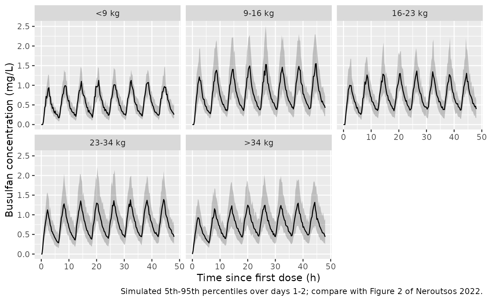
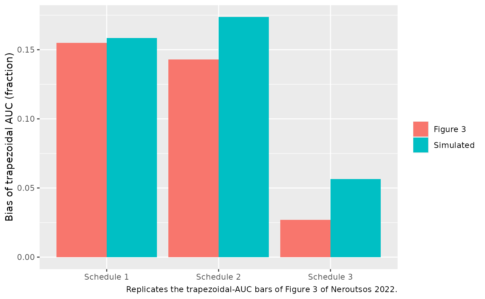

# Busulfan (Neroutsos 2022)

## Model and source

- Citation: Neroutsos E, Nalda-Molina R, Paisiou A, Zisaki K, Goussetis
  E, Spyridonidis A, Kitra V, Grafakos S, Valsami G, Dokoumetzidis A.
  (2022). Development of a Population Pharmacokinetic Model of Busulfan
  in Children and Evaluation of Different Sampling Schedules for
  Precision Dosing. Pharmaceutics 14(3):647.
  <doi:10.3390/pharmaceutics14030647>.
- Description: Two-compartment population PK model for intravenous
  busulfan in children undergoing haematopoietic stem cell
  transplantation (Neroutsos 2022), with a per-patient syringe-pump
  infusion lag time supplied as data, allometric body-weight scaling
  (fixed exponents 0.75 on CL and Q, 1 on V1 and V2) relative to a 70 kg
  reference, correlated inter-individual variability on CL and V1,
  three-occasion inter-occasion variability on CL, and a proportional
  residual error.
- Article: <https://doi.org/10.3390/pharmaceutics14030647> (open access)
- Supplement (Table S1 base model, Figure S1, and the NONMEM control
  script of the final model):
  <https://www.mdpi.com/article/10.3390/pharmaceutics14030647/s1>

Neroutsos 2022 fitted a population PK model to intravenous busulfan
concentrations from children conditioned for haematopoietic stem cell
transplantation in Athens. Small children receive busulfan through a
syringe pump at low infusion volumes, and the line dead space delays the
drug’s arrival in the circulation by 5-40 min. The authors measured that
delay in vitro for each body-weight dosing band and entered it in the
dataset as a known lag on the infusion. They then used the model to show
that a trapezoidal AUC computed from samples up to 6 h underestimates
the true AUC by about 15%, because the last three samples still sit in
the distribution phase of a two-compartment profile.

## Population

Seventy-six paediatric patients (49 male) were treated at the Bone
Marrow Transplantation Unit of the ‘Agia Sofia’ Children’s Hospital of
Athens between July 2014 and January 2017 (Neroutsos 2022 Section 2.1
and Table 1). Mean age was 7.6 years (SD 5.1, range 0.5-19) and mean
body weight 30.6 kg (SD 21.6, range 7.38-104). Mean CKD-EPI creatinine
clearance was 197 mL/min/1.73 m^2. Diagnoses covered malignant and
non-malignant indications (acute leukaemias, myelodysplastic syndrome,
neuroblastoma, Ewing sarcoma, non-Hodgkin lymphoma, thalassaemia,
Blackfan-Diamond anaemia, Wiskott-Aldrich syndrome,
adrenoleukodystrophy). Every patient received busulfan (Busilvex) as a 2
h infusion every 6 h for 16 doses, at 0.8-1.2 mg/kg chosen by
body-weight band (Table 2). Plasma was sampled before and at 2, 2.5, 4
and 6 h after the start of the first infusion on day 1 and, for most
patients, on day 2 (596 samples in total).

The same information is available programmatically via the model’s
`population` metadata:

``` r

pop <- rxode2::rxode(readModelDb("Neroutsos_2022_busulfan"))$population
#> ℹ parameter labels from comments will be replaced by 'label()'
#> Warning: some etas defaulted to non-mu referenced, possible parsing error: etaiov_cl_1, etaiov_cl_2, etaiov_cl_3
#> as a work-around try putting the mu-referenced expression on a simple line
str(pop, max.level = 1)
#> List of 13
#>  $ species       : chr "human"
#>  $ n_subjects    : int 76
#>  $ n_studies     : int 1
#>  $ age_range     : chr "0.5-19 years"
#>  $ age_mean      : chr "7.6 years (SD 5.1)"
#>  $ weight_range  : chr "7.38-104 kg"
#>  $ weight_mean   : chr "30.6 kg (SD 21.6)"
#>  $ sex_female_pct: num 35.5
#>  $ disease_state : chr "Paediatric patients undergoing haematopoietic stem cell (bone marrow) transplantation after busulfan-containing"| __truncated__
#>  $ dose_range    : chr "Intravenous busulfan (Busilvex) 0.8-1.2 mg/kg by body-weight band (Table 2: <9 kg 1 mg/kg; 9-16 kg 1.2; 16-23 k"| __truncated__
#>  $ regions       : chr "Greece ('Agia Sofia' Children's Hospital of Athens, July 2014 - January 2017)."
#>  $ renal_function: chr "CKD-EPI 197 mL/min/1.73 m^2 (SD 41), range 107-346; serum creatinine 0.36 mg/dL (SD 0.15)."
#>  $ notes         : chr "596 plasma busulfan concentrations (HPLC-PDA) sampled at nominal 0, 2, 2.5, 4 and 6 h after the start of the fi"| __truncated__
```

## Source trace

The per-parameter origin is recorded as an in-file comment next to each
`ini()` entry in `inst/modeldb/specificDrugs/Neroutsos_2022_busulfan.R`.
The table below collects them in one place.

| Equation / parameter | Value | Source location |
|----|----|----|
| `lcl` (CL at 70 kg) | 10.7 L/h | Table 3, NONMEM Estimate (RSE 4.05%); abstract |
| `lvc` (V1 at 70 kg) | 39.5 L | Table 3 (RSE 6.84%) |
| `lq` (Q at 70 kg) | 4.68 L/h | Table 3 (RSE 15.2%) |
| `lvp` (V2 at 70 kg) | 17.5 L | Table 3 (RSE 17.2%) |
| `e_wt_cl_q` | 0.75 (fixed) | Supplement control script `THETA(5)` `(0 0.75) FIX`, used on CL and Q; Section 3.2 |
| `e_wt_vc` | 1 (fixed) | Supplement control script `THETA(6)` `(0 1) FIX`, used on V1; Section 3.2 |
| V2 exponent | 1 (hard-coded) | Supplement control script `V2=THETA(3)*(BW/70)` |
| `etalcl`, `etalvc` block | 0.080656, 0.078870, 0.167281 | Table 3 ‘CL IIV’ 0.284, ‘V1 IIV’ 0.409 (SDs), ‘Cor. CL-V1’ 0.679; control script `$OMEGA BLOCK(2)` |
| `etaiov_cl_1..3` | 0.011025 each | Table 3 ‘CL IOV’ 0.105 (SD); control script `$OMEGA BLOCK(1)` then two `BLOCK(1) SAME` |
| `propSd` | 0.126 | Table 3 ‘Prop. RE’ (RSE 1.65%); control script `Y=F+F*EPS(1)` |
| Occasion structure | `OCC` 1-3 | Control script `OCC1 = OC1*ETA(3) + OC2*ETA(4) + OC3*ETA(5)` |
| Infusion lag | `alag(central) <- T_INFUSION_LAG` | Control script `ALAG1=Tlag`; Section 2.2; values per band from Table 2 |
| Structure | 2-compartment, IV | Section 2.2 and 3.1; control script `ADVAN3 TRANS4`, `S1=V1` |

## Virtual cohort

The individual data are not public. The virtual cohort below is built
from Table 2: each subject is assigned a body-weight band with
probability equal to the band’s share of the 76 patients, a weight drawn
log-uniformly over the band’s printed weight range, the band’s mg/kg
dose and the band’s infusion lag. Bands whose lag is printed as two
values (16-23 kg: 35/25 min; \>34 kg: 10/5 min) take either value with
equal probability.

``` r

set.seed(20220315)
rxode2::rxSetSeed(20220315)

bands <- tibble::tribble(
  ~band,      ~n_pat, ~dose_mgkg, ~wt_lo, ~wt_hi, ~lag1_min, ~lag2_min,
  "<9 kg",         4,       1.00,    7.4,    8.7,       40,        40,
  "9-16 kg",      20,       1.20,    9.2,   15.0,       40,        40,
  "16-23 kg",     13,       1.10,   16.0,   23.0,       35,        25,
  "23-34 kg",     16,       0.95,   25.0,   34.0,       20,        20,
  ">34 kg",       23,       0.80,   34.5,  104.0,       10,         5
)

make_subjects <- function(n, id_offset = 0L) {
  b <- bands[sample(seq_len(nrow(bands)), n, replace = TRUE, prob = bands$n_pat), ]
  tibble(
    id = id_offset + seq_len(n),
    band = factor(b$band, levels = bands$band),
    WT = exp(runif(n, log(b$wt_lo), log(b$wt_hi))),
    dose_mgkg = b$dose_mgkg,
    T_INFUSION_LAG = ifelse(runif(n) < 0.5, b$lag1_min, b$lag2_min) / 60
  )
}

subjects <- make_subjects(200)

# Two days of the q6h regimen (8 doses, 2 h infusions). OCC = 1 on day 1 and
# OCC = 2 on day 2, as in the sampling design (Section 2.1).
make_events <- function(subj, dose_times, obs_times, inf_dur = 2) {
  doses <- tidyr::crossing(subj, time = dose_times) |>
    dplyr::mutate(evid = 1L, amt = dose_mgkg * WT, rate = amt / inf_dur)
  obs <- tidyr::crossing(subj, time = obs_times) |>
    dplyr::mutate(evid = 0L, amt = 0, rate = 0)
  dplyr::bind_rows(doses, obs) |>
    dplyr::mutate(cmt = "central", OCC = ifelse(time < 24, 1L, 2L)) |>
    dplyr::arrange(id, time, dplyr::desc(evid)) |>
    as.data.frame()
}

events <- make_events(
  subjects,
  dose_times = seq(0, 42, by = 6),
  obs_times = sort(unique(c(seq(0, 48, by = 0.25))))
)
stopifnot(!anyDuplicated(events[, c("id", "time", "evid")]))
table(subjects$band)
#> 
#>    <9 kg  9-16 kg 16-23 kg 23-34 kg   >34 kg 
#>       11       53       24       52       60
```

## Simulation

``` r

mod <- readModelDb("Neroutsos_2022_busulfan")
sim <- rxode2::rxSolve(
  mod,
  events = events,
  keep = c("band", "WT", "T_INFUSION_LAG")
) |>
  as.data.frame()
#> ℹ parameter labels from comments will be replaced by 'label()'
#> Warning: some etas defaulted to non-mu referenced, possible parsing error: etaiov_cl_1, etaiov_cl_2, etaiov_cl_3
#> as a work-around try putting the mu-referenced expression on a simple line
stopifnot(!anyNA(sim$Cc))
```

## Replicate published results

### Typical-value parameters across the weight range (Section 3.2 and Discussion)

Section 3.2 states that over the observed weight range (7.38-104 kg) the
typical CL spans 1.98-14.4 L/h and V1 spans 4.16-58.7 L; the Discussion
gives CL 3.4 L/h and V1 8.64 L for a 15.3 kg child. Section 3.2 also
reports a terminal half-life of about 3 h at 10 kg and about 5 h above
50 kg.

``` r

typ_wt <- c(7.38, 10, 15.3, 50, 70, 104)
ev_typ <- data.frame(
  id = seq_along(typ_wt), time = 0, evid = 0, amt = 0, cmt = "central",
  WT = typ_wt, T_INFUSION_LAG = 0, OCC = 1
)
typ <- rxode2::rxSolve(rxode2::zeroRe(mod), events = ev_typ) |>
  as.data.frame() |>
  dplyr::mutate(
    WT = typ_wt[id],
    beta = 0.5 * ((kel + k12 + k21) - sqrt((kel + k12 + k21)^2 - 4 * kel * k21)),
    thalf = log(2) / beta
  )
#> ℹ parameter labels from comments will be replaced by 'label()'
#> Warning: some etas defaulted to non-mu referenced, possible parsing error: etaiov_cl_1, etaiov_cl_2, etaiov_cl_3
#> as a work-around try putting the mu-referenced expression on a simple line
#> Warning: some etas defaulted to non-mu referenced, possible parsing error: etaiov_cl_1, etaiov_cl_2, etaiov_cl_3
#> as a work-around try putting the mu-referenced expression on a simple line
#> ℹ omega/sigma items treated as zero: 'etalcl', 'etalvc', 'etaiov_cl_1', 'etaiov_cl_2', 'etaiov_cl_3'
#> Warning: multi-subject simulation without without 'omega'

published_typ <- tibble::tribble(
  ~WT,   ~cl_pub, ~vc_pub, ~thalf_pub,
  7.38,     1.98,    4.16,    NA,
  10,         NA,      NA,     3,
  15.3,      3.4,    8.64,    NA,
  50,         NA,      NA,     5,
  104,      14.4,    58.7,    NA
)
typ_cmp <- typ |>
  dplyr::select(WT, cl, vc, thalf) |>
  dplyr::inner_join(published_typ, by = "WT")

typ_cmp |>
  dplyr::rename(
    "Body weight (kg)" = WT,
    "CL model (L/h)" = cl, "CL published (L/h)" = cl_pub,
    "V1 model (L)" = vc, "V1 published (L)" = vc_pub,
    "t1/2 model (h)" = thalf, "t1/2 published (h)" = thalf_pub
  ) |>
  knitr::kable(digits = 2, caption = "Typical-value CL, V1 and terminal half-life against the values quoted in Neroutsos 2022.")
```

| Body weight (kg) | CL model (L/h) | V1 model (L) | t1/2 model (h) | CL published (L/h) | V1 published (L) | t1/2 published (h) |
|---:|---:|---:|---:|---:|---:|---:|
| 7.38 | 1.98 | 4.16 | 2.82 | 1.98 | 4.16 | NA |
| 10.00 | 2.49 | 5.64 | 3.04 | NA | NA | 3 |
| 15.30 | 3.42 | 8.63 | 3.38 | 3.40 | 8.64 | NA |
| 50.00 | 8.31 | 28.21 | 4.54 | NA | NA | 5 |
| 104.00 | 14.40 | 58.69 | 5.46 | 14.40 | 58.70 | NA |

Typical-value CL, V1 and terminal half-life against the values quoted in
Neroutsos 2022. {.table}

``` r


# Same parameters on both sides (Table 3 values vs the paper's own derived
# numbers), so only rounding separates them.
chk_cl <- dplyr::filter(typ_cmp, !is.na(cl_pub))
stopifnot(
  max(abs(chk_cl$cl / chk_cl$cl_pub - 1)) < 0.02,
  max(abs(chk_cl$vc / chk_cl$vc_pub - 1)) < 0.02
)
# 'about 3 h' and 'near 5 h' are rounded statements.
chk_th <- dplyr::filter(typ_cmp, !is.na(thalf_pub))
stopifnot(max(abs(chk_th$thalf - chk_th$thalf_pub)) < 0.5)
```

The paper also reports a mean terminal half-life of about 4 h (CV 22%)
across all its patients. Over the virtual cohort (weights drawn from
Table 2, with between-subject variability on CL and V1):

``` r

indiv <- sim |>
  dplyr::filter(time == 0) |>
  dplyr::mutate(
    beta = 0.5 * ((kel + k12 + k21) - sqrt((kel + k12 + k21)^2 - 4 * kel * k21)),
    thalf = log(2) / beta
  )
thalf_summary <- c(
  mean = mean(indiv$thalf),
  cv_pct = 100 * sd(indiv$thalf) / mean(indiv$thalf)
)
round(thalf_summary, 2)
#>   mean cv_pct 
#>   3.99  24.73
# Centre of the distribution against the published 'about 4 h'; the CV is
# reported for comparison with the published 22% but not gated (it depends on
# the weight mix of the virtual cohort).
stopifnot(abs(median(indiv$thalf) - 4) < 0.75)
```

### Concentration-time profiles (Figure 2)

Figure 2 of the paper is a prediction-corrected VPC against time after
dose. The plot below shows the 5th, 50th and 95th percentiles of the
simulated concentrations, with residual error, over the first two days
of dosing, split by weight band. The infusion lag is visible as the
delayed rise in the lighter bands.

``` r

sim |>
  dplyr::filter(time <= 48) |>
  dplyr::group_by(band, time) |>
  dplyr::summarise(
    Q05 = quantile(sim, 0.05),
    Q50 = quantile(sim, 0.50),
    Q95 = quantile(sim, 0.95),
    .groups = "drop"
  ) |>
  ggplot(aes(time, Q50)) +
  geom_ribbon(aes(ymin = Q05, ymax = Q95), alpha = 0.25) +
  geom_line() +
  facet_wrap(~band) +
  labs(
    x = "Time since first dose (h)",
    y = "Busulfan concentration (mg/L)",
    caption = "Simulated 5th-95th percentiles over days 1-2; compare with Figure 2 of Neroutsos 2022."
  )
```



### Exposure against the therapeutic range (Section 3.3)

The busulfan label targets a per-dose AUC of 900-1500 uM x min. Using
the Bayesian clearance estimates of the real patients, Neroutsos 2022
found 19% below, 58.9% within and 21.9% above that range. The per-dose
AUC of the virtual cohort at the first occasion is dose / CL (busulfan
molar mass 246.3 g/mol).

``` r

mw <- 246.3
tr <- indiv |>
  dplyr::left_join(dplyr::select(subjects, id, dose_mgkg), by = "id") |>
  dplyr::mutate(
    auc_umolmin = (dose_mgkg * WT / cl) / mw * 1000 * 60,
    category = cut(auc_umolmin, c(-Inf, 900, 1500, Inf),
                   labels = c("below", "within", "above"))
  )
tr_tab <- tibble::tibble(
  category = c("below", "within", "above"),
  simulated_pct = as.numeric(100 * prop.table(table(tr$category))),
  published_pct = c(19, 58.9, 21.9)
)
tr_tab |>
  dplyr::rename(
    "AUC vs 900-1500 uM x min" = category,
    "Simulated (%)" = simulated_pct,
    "Published, Bayesian AUC (%)" = published_pct
  ) |>
  knitr::kable(digits = 1, caption = "Share of patients below, within and above the therapeutic range after the first dose.")
```

| AUC vs 900-1500 uM x min | Simulated (%) | Published, Bayesian AUC (%) |
|:-------------------------|--------------:|----------------------------:|
| below                    |          14.5 |                        19.0 |
| within                   |          66.5 |                        58.9 |
| above                    |          19.0 |                        21.9 |

Share of patients below, within and above the therapeutic range after
the first dose. {.table}

``` r


# The published split comes from 76 real patients; this checks only that the
# model places the bulk of the first-dose exposures inside the range.
stopifnot(
  median(tr$auc_umolmin) > 900,
  median(tr$auc_umolmin) < 1500
)
```

## PKNCA validation: trapezoidal AUC against the true AUC (Figure 3)

Neroutsos 2022 simulated 1000 patients under three sampling schedules
and compared a trapezoidal AUC (log-linear rule, terminal slope from the
last three samples) with the true AUC = dose / CL. Schedules 1 (2.5, 3,
4, 6 h) and 2 (2.5, 4, 6 h) follow the first dose of the q6h regimen.
Schedule 3 (3, 6, 9, 12 h) follows a once-daily 3 h infusion of four
times the q6h dose, for which the lag is negligible. Figure 3 of the
paper shows, for the trapezoidal AUC, a bias of about 0.155, 0.143 and
0.027 and an imprecision of about 0.205, 0.192 and 0.095 for Schedules
1, 2 and 3 (read from the bar chart by the maintainers; the values are
on the fractional scale, relative to the true AUC).

The PKNCA calculation below reproduces that exercise on the virtual
cohort. It uses observations with residual error at the schedule times,
and times measured from the actual start of drug entry (the dose time
plus the known lag).

``` r

sch_qid <- make_events(subjects, dose_times = 0, obs_times = c(2.5, 3, 4, 6)) |>
  dplyr::mutate(OCC = 1L)
sim_qid <- rxode2::rxSolve(mod, events = sch_qid, keep = c("band", "T_INFUSION_LAG")) |>
  as.data.frame()

sch_qd <- subjects |>
  dplyr::mutate(dose_mgkg = 4 * dose_mgkg, T_INFUSION_LAG = 0) |>
  make_events(dose_times = 0, obs_times = c(3, 6, 9, 12), inf_dur = 3) |>
  dplyr::mutate(OCC = 1L)
sim_qd <- rxode2::rxSolve(mod, events = sch_qd, keep = c("band", "T_INFUSION_LAG")) |>
  as.data.frame()

sparse <- dplyr::bind_rows(
  sim_qid |> dplyr::mutate(schedule = "Schedule 1"),
  sim_qid |> dplyr::filter(time != 3) |> dplyr::mutate(schedule = "Schedule 2"),
  sim_qd |> dplyr::mutate(schedule = "Schedule 3")
) |>
  dplyr::mutate(time = time - T_INFUSION_LAG, Cc = sim) |>
  dplyr::select(id, schedule, time, Cc, cl)

# True AUC per subject and schedule (dose / individual CL).
dose_df <- dplyr::bind_rows(
  sch_qid |> dplyr::filter(evid == 1) |> dplyr::mutate(schedule = "Schedule 1"),
  sch_qid |> dplyr::filter(evid == 1) |> dplyr::mutate(schedule = "Schedule 2"),
  sch_qd |> dplyr::filter(evid == 1) |> dplyr::mutate(schedule = "Schedule 3")
) |>
  dplyr::select(id, schedule, time, amt)

truth <- sparse |>
  dplyr::distinct(id, schedule, cl) |>
  dplyr::left_join(dose_df, by = c("id", "schedule")) |>
  dplyr::mutate(auc_true = amt / cl)

# Pre-dose record at the start of drug entry, then PKNCA with the terminal
# slope forced onto the last three samples.
conc_nca <- dplyr::bind_rows(
  sparse,
  sparse |> dplyr::distinct(id, schedule) |> dplyr::mutate(time = 0, Cc = 0)
) |>
  dplyr::filter(!is.na(Cc)) |>
  dplyr::distinct(id, schedule, time, .keep_all = TRUE) |>
  dplyr::arrange(schedule, id, time) |>
  dplyr::group_by(schedule, id) |>
  dplyr::mutate(last3 = dplyr::row_number() > dplyr::n() - 3) |>
  dplyr::ungroup()

conc_obj <- PKNCA::PKNCAconc(
  conc_nca, Cc ~ time | schedule + id,
  include_half.life = "last3"
)
dose_obj <- PKNCA::PKNCAdose(dose_df, amt ~ time | schedule + id)
intervals <- data.frame(start = 0, end = Inf, aucinf.obs = TRUE, cmax = TRUE)
nca_res <- PKNCA::pk.nca(PKNCA::PKNCAdata(
  conc_obj, dose_obj,
  intervals = intervals,
  options = list(auc.method = "lin up/log down")
))
```

`include_half.life` fixes the terminal-slope points to the last three
samples of each profile, as in Section 3.4 of the paper, instead of
letting PKNCA choose them by adjusted r-squared.

``` r

auc_trap <- as.data.frame(nca_res) |>
  dplyr::filter(PPTESTCD == "aucinf.obs") |>
  dplyr::select(id, schedule, auc_trap = PPORRES)

perf <- truth |>
  dplyr::inner_join(auc_trap, by = c("id", "schedule")) |>
  dplyr::filter(!is.na(auc_trap)) |>
  dplyr::mutate(rel_err = (auc_true - auc_trap) / auc_true) |>
  dplyr::group_by(schedule) |>
  dplyr::summarise(
    n = dplyr::n(),
    bias = mean(rel_err),
    imprecision = sqrt(mean(rel_err^2)),
    .groups = "drop"
  ) |>
  dplyr::left_join(
    tibble::tibble(
      schedule = c("Schedule 1", "Schedule 2", "Schedule 3"),
      bias_pub = c(0.155, 0.143, 0.027),
      imprecision_pub = c(0.205, 0.192, 0.095)
    ),
    by = "schedule"
  )

perf |>
  dplyr::rename(
    "Schedule" = schedule, "Subjects" = n,
    "Bias (sim)" = bias, "Bias (Figure 3)" = bias_pub,
    "Imprecision (sim)" = imprecision, "Imprecision (Figure 3)" = imprecision_pub
  ) |>
  knitr::kable(digits = 3, caption = "Trapezoidal AUC relative to the true AUC: bias = mean((true - trap) / true), imprecision = root-mean-square of the same relative error.")
```

| Schedule | Subjects | Bias (sim) | Imprecision (sim) | Bias (Figure 3) | Imprecision (Figure 3) |
|:---|---:|---:|---:|---:|---:|
| Schedule 1 | 200 | 0.158 | 0.202 | 0.155 | 0.205 |
| Schedule 2 | 200 | 0.174 | 0.198 | 0.143 | 0.192 |
| Schedule 3 | 200 | 0.056 | 0.098 | 0.027 | 0.095 |

Trapezoidal AUC relative to the true AUC: bias = mean((true - trap) /
true), imprecision = root-mean-square of the same relative error.
{.table}

``` r


ggplot(
  perf |>
    dplyr::select(schedule, Simulated = bias, `Figure 3` = bias_pub) |>
    tidyr::pivot_longer(-schedule, names_to = "source", values_to = "bias"),
  aes(schedule, bias, fill = source)
) +
  geom_col(position = "dodge") +
  labs(x = NULL, y = "Bias of trapezoidal AUC (fraction)", fill = NULL,
       caption = "Replicates the trapezoidal-AUC bars of Figure 3 of Neroutsos 2022.")
```



The six-hour schedules underestimate the true AUC because the last three
samples still include the distribution phase, so the terminal slope is
too steep. The 12 h schedule reaches the terminal phase and is nearly
unbiased. Those are the paper’s findings, and both follow from the
two-compartment disposition parameters. Schedules 1 and 2 land close to
the published bars. For Schedule 3 the simulated bias comes out around
twice the published 0.027, though still small next to the 6 h schedules.
The paper does not print the details of its trapezoidal calculation (see
“Assumptions and deviations”), so the gate below checks only that the 12
h schedule removes most of the bias.

``` r

b <- setNames(perf$bias, perf$schedule)
stopifnot(
  # Sampling to 6 h: a clear underestimate of roughly the published size.
  b[["Schedule 1"]] > 0.08, b[["Schedule 1"]] < 0.25,
  b[["Schedule 2"]] > 0.08, b[["Schedule 2"]] < 0.25,
  # Sampling to 12 h: much smaller bias.
  abs(b[["Schedule 3"]]) < 0.08
)
```

The Bayesian (model-based) AUC bars of Figure 3 need a posthoc
estimation step for every simulated patient and are not reproduced here.

## Assumptions and deviations

- **Covariate cohort.** The paper sampled covariates from its own
  dataset, which is not public. The virtual cohort is built from Table 2
  (band shares, per-band weight ranges, doses and lags). The weight
  range printed for the 16-23 kg band (16.0-66.7 kg) cannot be right for
  that band; the virtual cohort draws 16-23 kg.
- **Two-valued lag bands.** Table 2 gives the lag for the 16-23 kg band
  as ‘35/25’ min and for the \>34 kg band as ‘10/5’ min without saying
  which patients received which value. The virtual cohort assigns each
  value with probability 0.5. Users with patient-level information
  should supply the actual lag in `T_INFUSION_LAG` (in hours).
- **Scale of the random effects.** Table 3 reports the IIV, IOV and
  residual error as standard deviations (the abstract’s 28% and 41% for
  CL and V1 IIV and 11% for CL IOV match 0.284, 0.409 and 0.105). The
  model’s variances are their squares, and the CL-V1 covariance is 0.679
  x 0.284 x 0.409. The initial estimates in the supplement control
  script (`$OMEGA BLOCK(2) 0.0697 0.0662 0.106`, IOV 0.0125,
  `$SIGMA 0.0136`) are on the same scale.
- **Occasions.** The control script assigns separate IOV etas to
  occasions 1-3. It also builds an unused `OC4` indicator, so occasion 4
  has no IOV. The paper does not define the occasions beyond sampling on
  day 1 and, for most patients, day 2. The simulations use occasion 1
  for day 1 and occasion 2 for day 2.
- **Concentration units.** The paper does not print the concentration
  unit. With doses in mg and `S1 = V1` in litres, the model predicts
  mg/L. The resulting first-dose AUCs fall within the 900-1500 uM x min
  target range, which supports that reading.
- **Trapezoidal method.** The paper cites its own earlier work for the
  trapezoidal method with the lag and does not print the details. Here
  the sample times are shifted by the known lag and a zero pre-dose
  concentration is placed at the start of drug entry. The half-life uses
  the last three samples, as in Section 3.4.
- **Figure 3 values** were read from the bar chart by the maintainers,
  so they carry roughly +/-0.005 reading uncertainty.
- **Typographical issues in the source**, none of which affect the
  model: Table 3’s bootstrap CI for CL is printed as ‘9.79-1.47’
  (presumably 9.79-11.47); Table 1’s height range ‘0.71-207’ cm is
  implausible; and the Section 3.2 equation for V1 is printed with the
  typical value on both sides. No correction notice for the article was
  found as of 2026-09-30.
