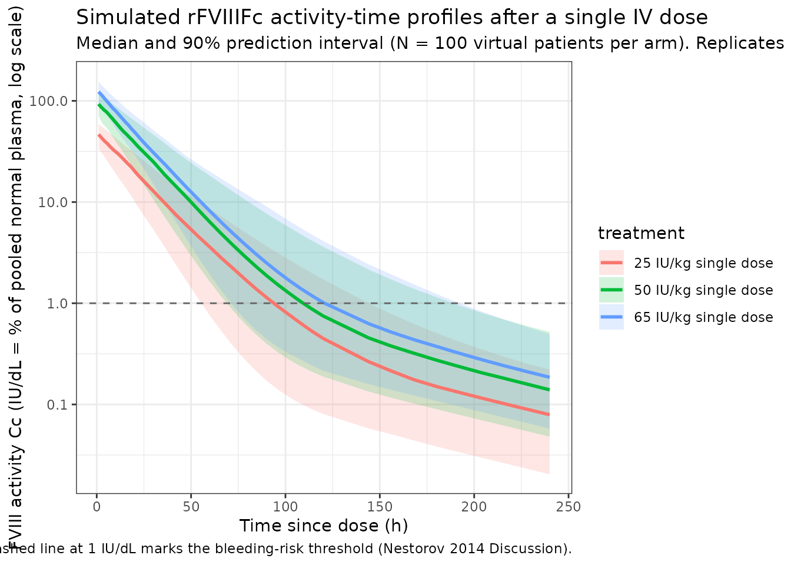
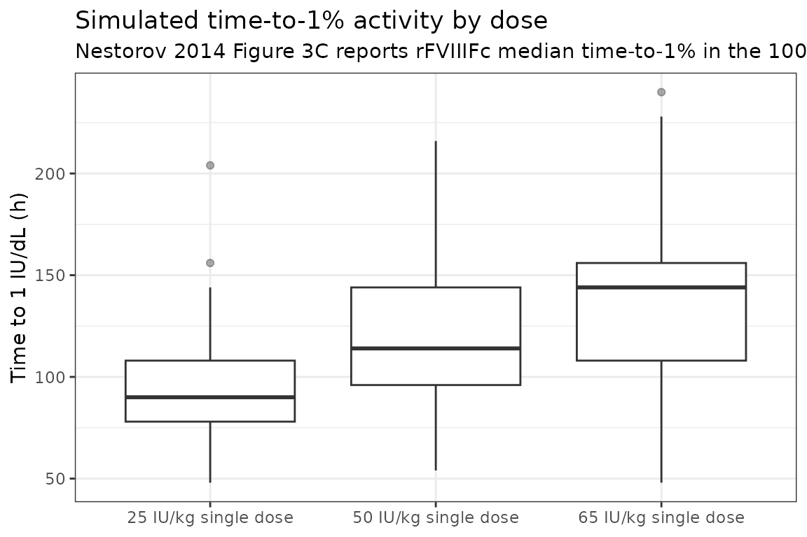

# Nestorov_2014_factorviii

## Model and source

- Citation: Nestorov I, Neelakantan S, Ludden TM, Li S, Jiang H,
  Rogge M. Population pharmacokinetics of recombinant factor VIII Fc
  fusion protein. *Clin Pharmacol Drug Dev.* 2015;4(3):163-174.
  <doi:%5B10.1002/cpdd.167>\](<https://doi.org/10.1002/cpdd.167>)
- Description: Two-compartment population PK model for recombinant
  factor VIII Fc fusion protein (rFVIIIFc; efmoroctocog alfa) in
  previously treated patients with severe hemophilia A. The packaged
  final covariate model has von Willebrand factor (VWF) on clearance and
  body weight (WT) and hematocrit (HCT) on the central volume of
  distribution.
- Modality: Fc-fusion protein (B-domain-deleted human FVIII fused to the
  Fc domain of human IgG1) administered as a single intravenous
  injection; the read-out is FVIII activity in IU/dL (1 IU/dL = 1% of
  pooled normal plasma).

The structural model is a linear two-compartment system. Doses are
administered intravenously (bolus / short infusion) directly into the
central compartment, and FVIII activity (`Cc = central / V1`) is
observed in the plasma. Covariate effects enter as power-law multipliers
(Nestorov 2014 Eq. 2):

$${CL}\; = \;{TVCL}\,({VWF}/118)^{Q_{10}},\qquad V_{1}\; = \;{TVV}_{1}\,({WT}/73)^{Q_{8}}({HCT}/45)^{Q_{9}}$$

with the published exponents $Q_{10} = - 0.343$, $Q_{8} = 0.382$, and
$Q_{9} = - 0.419$.

## Population

The final-model rFVIIIFc population pooled **180 previously treated
patients with severe hemophilia A** (FVIII:C activity \< 1 IU/dL) from
two clinical trials (Nestorov 2014 Methods):

- **Phase 1/2a study (n = 16):** open-label, dose-escalation, crossover.
  Cohort A (25 IU/kg) and Cohort B (65 IU/kg) each received a single IV
  injection of comparator rFVIII (Advate) followed, after a washout, by
  a single IV injection of rFVIIIFc at the same dose. Sampling schedules
  in Table S1 of the supplement.
- **Phase 3 study (n = 164):** multinational, multicenter, open-label,
  age \>= 12 years. Three arms — Arm 1 individualized prophylaxis (n =
  118; doses 25-65 IU/kg every 3-5 days), Arm 2 fixed weekly prophylaxis
  (n = 24; 65 IU/kg weekly), and Arm 3 episodic dosing (n = 23; 10-50
  IU/kg on-demand). Arm 1 included a sequential PK subgroup that
  received both rFVIII (50 IU/kg) and rFVIIIFc (50 IU/kg) for
  cross-product comparison.

Hemophilia A is an X-linked recessive coagulation disorder (Nestorov
2014 Introduction); both registered trials enrolled male patients, so
the population-PK cohort is essentially 100% male. Reference covariates
for the power-law adjustments are 73 kg body weight, 118 IU/dL VWF
antigen, and 45 % hematocrit. The publication does not provide a
tabulated baseline-demographics summary for the modeling cohort.

The same metadata is available programmatically via
`readModelDb("Nestorov_2014_factorviii")$population`.

## Source trace

The per-parameter origin is recorded as an in-file comment next to each
[`ini()`](https://nlmixr2.github.io/rxode2/reference/ini.html) entry in
`inst/modeldb/specificDrugs/Nestorov_2014_factorviii.R`. The table below
collects them in one place.

| Parameter (model name)        | Value                     | Source                                                                      |
|-------------------------------|---------------------------|-----------------------------------------------------------------------------|
| `lcl` (TVCL, dL/h)            | log(1.65)                 | Nestorov 2014 Table 1, Final Model rFVIIIFc, “Without BLQ values” column    |
| `lvc` (TVV1, dL)              | log(37.5)                 | Nestorov 2014 Table 1                                                       |
| `lq` (Q, dL/h)                | log(0.0746)               | Nestorov 2014 Table 1                                                       |
| `lvp` (V2, dL)                | log(6.92)                 | Nestorov 2014 Table 1                                                       |
| `e_vwf_cl` (power, VWF on CL) | -0.343                    | Nestorov 2014 Table 1, “Exponent on VWF”                                    |
| `e_wt_vc` (power, WT on V1)   | 0.382                     | Nestorov 2014 Table 1, “Allometric exponent on V1”                          |
| `e_hct_vc` (power, HCT on V1) | -0.419                    | Nestorov 2014 Table 1, “Exponent on HCT”                                    |
| IIV block `etalcl + etalvc`   | c(0.0590, 0.0179, 0.0180) | Nestorov 2014 Table 1, IIV CL (24.3% CV), v12 covariance, IIV V1 (13.4% CV) |
| `propSd` (proportional)       | 0.136                     | Nestorov 2014 Table 1, proportional error 13.6%                             |
| `addSd` (additive, IU/dL)     | 0.208                     | Nestorov 2014 Table 1, phase 3 additive error                               |
| ODE structure (2-compartment) | n/a                       | Nestorov 2014 Results “Final Model for rFVIIIFc” and Eq. 2                  |
| Reference WT                  | 73 kg                     | Nestorov 2014 Eq. 2                                                         |
| Reference VWF                 | 118 IU/dL                 | Nestorov 2014 Eq. 2                                                         |
| Reference HCT                 | 45 %                      | Nestorov 2014 Eq. 2                                                         |

The IIV variance entries map the paper’s NONMEM `%CV` to log-scale
variance via `omega^2 = (CV%/100)^2` (i.e., the convention used by
NONMEM where the displayed `%CV` is `sqrt(omega^2) x 100`); the
off-diagonal covariance `v12 = 0.0179` is taken directly from the Table
1 footnote that lists the paper’s reported population mean of the IIV
covariance.

## Errata

A search for an erratum or corrigendum to Nestorov 2014 returned no
correction notice. The model values are taken from the article and
supplement as published. Two minor source-presentation issues were noted
while extracting the model and are documented here for transparency:

- Nestorov 2014 Eq. 1 and Eq. 2 are typeset with the publisher’s
  layout-corrupted operators: stretched minus signs render as `/C0` and
  centered dots as `/C1`. The intended math is unambiguous when read
  alongside the surrounding sentences and Table 1, but the literal-text
  PDF/markdown trim shows the corrupted glyphs (e.g., `VWF/C0 0.343`,
  `STUD /C1 Q5`). The model uses the standard interpretation (negative
  exponent of VWF on CL and multiplicative
  covariate-by-typical-parameter form, respectively).
- The reported correlation between IIV on CL and V1 (0.548) is
  consistent with the reported variances (0.0590 and 0.0180) and
  reported covariance (0.0179) only under the NONMEM
  `%CV = sqrt(omega^2) x 100` convention. If instead the published `%CV`
  were taken as the exact log-normal CV (`CV = sqrt(exp(omega^2) - 1)`),
  the implied correlation would be ~0.56, not 0.548. Both
  interpretations agree to two decimal places, but the packaged model
  uses the first (NONMEM convention) so that the implied correlation
  reproduces the paper’s 0.548 value.

## Virtual cohort

Original observed data are not publicly available. The simulations below
use a virtual cohort whose covariate distributions approximate the
modeling population.

``` r
set.seed(2014)
n_subj <- 100

cohort <- tibble(
  id = seq_len(n_subj),
  WT  = pmin(pmax(rnorm(n_subj, mean = 73, sd  = 12), 40), 120),
  VWF = pmin(pmax(rnorm(n_subj, mean = 118, sd = 35), 40), 220),
  HCT = pmin(pmax(rnorm(n_subj, mean = 45, sd  = 5),  30), 55)
)
```

The continuous covariate distributions are anchored to the reference
values in Nestorov 2014 Eq. 2 (WT 73 kg, VWF 118 IU/dL, HCT 45 %). The
publication does not tabulate baseline distributions, so the standard
deviations chosen here represent reasonable clinical-sample dispersion
and clamp ranges fall inside hemophilia-A trial enrolment limits.

Three single-dose regimens — 25 IU/kg, 50 IU/kg, and 65 IU/kg — are
simulated to bracket the dose levels actually administered for PK
assessment in the phase 1/2a and phase 3 studies (Table S1 of the
supplement).

``` r
obs_grid <- sort(unique(c(
  seq(0,    24,  by = 1),     # dense early sampling for Cmax / alpha phase
  seq(30,  120,  by = 6),     # daily-ish out to 5 days
  seq(144, 240,  by = 12)     # to 10 days for terminal phase
)))

build_events <- function(pop, mgkg) {
  amt <- pop$WT * mgkg
  d_dose <- pop |>
    mutate(time = 0, evid = 1, cmt  = "central",
           amt  = amt, dv   = NA_real_,
           treatment = paste0(mgkg, " IU/kg single dose"))
  d_obs <- pop |>
    tidyr::crossing(time = obs_grid) |>
    mutate(evid = 0, cmt  = "central",
           amt  = NA_real_, dv = NA_real_,
           treatment = paste0(mgkg, " IU/kg single dose"))
  bind_rows(d_dose, d_obs) |>
    arrange(id, time, desc(evid)) |>
    as.data.frame()
}

events_25 <- build_events(cohort, 25)
events_50 <- build_events(cohort, 50)
events_65 <- build_events(cohort, 65)
```

## Simulation

``` r
mod <- readModelDb("Nestorov_2014_factorviii")

sim_25 <- rxSolve(mod, events = events_25, returnType = "data.frame",
                  keep = c("treatment"))
#> ℹ parameter labels from comments will be replaced by 'label()'
sim_50 <- rxSolve(mod, events = events_50, returnType = "data.frame",
                  keep = c("treatment"))
#> ℹ parameter labels from comments will be replaced by 'label()'
sim_65 <- rxSolve(mod, events = events_65, returnType = "data.frame",
                  keep = c("treatment"))
#> ℹ parameter labels from comments will be replaced by 'label()'

sim <- bind_rows(sim_25, sim_50, sim_65)
```

## FVIII activity-time profiles

Nestorov 2014 Figure 1C shows the visual predictive check (baseline
rFVIIIFc PK profile) for the phase 3 Arm 1 sequential PK subgroup at 50
IU/kg. The plot below reproduces the **median and 5-95% prediction
interval** by dose group, analogous to the shaded bands of the paper’s
VPCs.

``` r
sim_summary <- sim |>
  filter(time > 0) |>
  group_by(time, treatment) |>
  summarise(
    median = stats::median(Cc, na.rm = TRUE),
    lo     = stats::quantile(Cc, 0.05, na.rm = TRUE),
    hi     = stats::quantile(Cc, 0.95, na.rm = TRUE),
    .groups = "drop"
  )

ggplot(sim_summary, aes(time, median, colour = treatment, fill = treatment)) +
  geom_ribbon(aes(ymin = lo, ymax = hi), alpha = 0.18, colour = NA) +
  geom_line(linewidth = 1) +
  geom_hline(yintercept = 1, linetype = "dashed", colour = "grey40") +
  scale_y_log10() +
  labs(
    x = "Time since dose (h)",
    y = "FVIII activity Cc (IU/dL = % of pooled normal plasma, log scale)",
    title = "Simulated rFVIIIFc activity-time profiles after a single IV dose",
    subtitle = paste0("Median and 90% prediction interval (N = ", n_subj,
                      " virtual patients per arm). Replicates Nestorov 2014 Figure 1C / Figure S2 (single-dose VPC)."),
    caption = "Dashed line at 1 IU/dL marks the bleeding-risk threshold (Nestorov 2014 Discussion)."
  ) +
  theme_bw()
```



## PKNCA validation

NCA parameters are computed for each single-dose cohort using `PKNCA`.
The formula includes the `treatment` grouping so per-dose summaries can
be compared with the paper’s reported peak / trough / time-to-1% values.

``` r
sim_nca <- sim |>
  filter(!is.na(Cc), time > 0) |>
  select(id, treatment, time, Cc)

conc_obj <- PKNCA::PKNCAconc(
  sim_nca, Cc ~ time | treatment + id,
  concu = "IU/dL",
  timeu = "h"
)

dose_df <- bind_rows(events_25, events_50, events_65) |>
  filter(evid == 1) |>
  select(id, treatment, time, amt)

dose_obj <- PKNCA::PKNCAdose(
  dose_df, amt ~ time | treatment + id,
  doseu = "IU"
)

intervals <- data.frame(
  start      = 0,
  end        = Inf,
  cmax       = TRUE,
  tmax       = TRUE,
  aucinf.obs = TRUE,
  half.life  = TRUE,
  clast.obs  = TRUE
)

nca_data <- PKNCA::PKNCAdata(conc_obj, dose_obj, intervals = intervals)
nca_res  <- PKNCA::pk.nca(nca_data)
#> Warning: Requesting an AUC range starting (0) before the first measurement (1) is not allowed
#> Requesting an AUC range starting (0) before the first measurement (1) is not allowed
#> Requesting an AUC range starting (0) before the first measurement (1) is not allowed
#> Requesting an AUC range starting (0) before the first measurement (1) is not allowed
#> Requesting an AUC range starting (0) before the first measurement (1) is not allowed
#> Requesting an AUC range starting (0) before the first measurement (1) is not allowed
#> Requesting an AUC range starting (0) before the first measurement (1) is not allowed
#> Requesting an AUC range starting (0) before the first measurement (1) is not allowed
#> Requesting an AUC range starting (0) before the first measurement (1) is not allowed
#> Requesting an AUC range starting (0) before the first measurement (1) is not allowed
#> Requesting an AUC range starting (0) before the first measurement (1) is not allowed
#> Requesting an AUC range starting (0) before the first measurement (1) is not allowed
#> Requesting an AUC range starting (0) before the first measurement (1) is not allowed
#> Requesting an AUC range starting (0) before the first measurement (1) is not allowed
#> Requesting an AUC range starting (0) before the first measurement (1) is not allowed
#> Requesting an AUC range starting (0) before the first measurement (1) is not allowed
#> Requesting an AUC range starting (0) before the first measurement (1) is not allowed
#> Requesting an AUC range starting (0) before the first measurement (1) is not allowed
#> Requesting an AUC range starting (0) before the first measurement (1) is not allowed
#> Requesting an AUC range starting (0) before the first measurement (1) is not allowed
#> Requesting an AUC range starting (0) before the first measurement (1) is not allowed
#> Requesting an AUC range starting (0) before the first measurement (1) is not allowed
#> Requesting an AUC range starting (0) before the first measurement (1) is not allowed
#> Requesting an AUC range starting (0) before the first measurement (1) is not allowed
#> Requesting an AUC range starting (0) before the first measurement (1) is not allowed
#> Requesting an AUC range starting (0) before the first measurement (1) is not allowed
#> Requesting an AUC range starting (0) before the first measurement (1) is not allowed
#> Requesting an AUC range starting (0) before the first measurement (1) is not allowed
#> Requesting an AUC range starting (0) before the first measurement (1) is not allowed
#> Requesting an AUC range starting (0) before the first measurement (1) is not allowed
#> Requesting an AUC range starting (0) before the first measurement (1) is not allowed
#> Requesting an AUC range starting (0) before the first measurement (1) is not allowed
#> Requesting an AUC range starting (0) before the first measurement (1) is not allowed
#> Requesting an AUC range starting (0) before the first measurement (1) is not allowed
#> Requesting an AUC range starting (0) before the first measurement (1) is not allowed
#> Requesting an AUC range starting (0) before the first measurement (1) is not allowed
#> Requesting an AUC range starting (0) before the first measurement (1) is not allowed
#> Requesting an AUC range starting (0) before the first measurement (1) is not allowed
#> Requesting an AUC range starting (0) before the first measurement (1) is not allowed
#> Requesting an AUC range starting (0) before the first measurement (1) is not allowed
#> Requesting an AUC range starting (0) before the first measurement (1) is not allowed
#> Requesting an AUC range starting (0) before the first measurement (1) is not allowed
#> Requesting an AUC range starting (0) before the first measurement (1) is not allowed
#>  ■■■■■                             14% |  ETA: 11s
#> Warning: Requesting an AUC range starting (0) before the first measurement (1) is not allowed
#> Requesting an AUC range starting (0) before the first measurement (1) is not allowed
#> Requesting an AUC range starting (0) before the first measurement (1) is not allowed
#> Requesting an AUC range starting (0) before the first measurement (1) is not allowed
#> Requesting an AUC range starting (0) before the first measurement (1) is not allowed
#> Requesting an AUC range starting (0) before the first measurement (1) is not allowed
#> Requesting an AUC range starting (0) before the first measurement (1) is not allowed
#> Requesting an AUC range starting (0) before the first measurement (1) is not allowed
#> Requesting an AUC range starting (0) before the first measurement (1) is not allowed
#> Requesting an AUC range starting (0) before the first measurement (1) is not allowed
#> Requesting an AUC range starting (0) before the first measurement (1) is not allowed
#> Requesting an AUC range starting (0) before the first measurement (1) is not allowed
#> Requesting an AUC range starting (0) before the first measurement (1) is not allowed
#> Requesting an AUC range starting (0) before the first measurement (1) is not allowed
#> Requesting an AUC range starting (0) before the first measurement (1) is not allowed
#> Requesting an AUC range starting (0) before the first measurement (1) is not allowed
#> Requesting an AUC range starting (0) before the first measurement (1) is not allowed
#> Requesting an AUC range starting (0) before the first measurement (1) is not allowed
#> Requesting an AUC range starting (0) before the first measurement (1) is not allowed
#> Requesting an AUC range starting (0) before the first measurement (1) is not allowed
#> Requesting an AUC range starting (0) before the first measurement (1) is not allowed
#> Requesting an AUC range starting (0) before the first measurement (1) is not allowed
#> Requesting an AUC range starting (0) before the first measurement (1) is not allowed
#> Requesting an AUC range starting (0) before the first measurement (1) is not allowed
#> Requesting an AUC range starting (0) before the first measurement (1) is not allowed
#> Requesting an AUC range starting (0) before the first measurement (1) is not allowed
#> Requesting an AUC range starting (0) before the first measurement (1) is not allowed
#> Requesting an AUC range starting (0) before the first measurement (1) is not allowed
#> Requesting an AUC range starting (0) before the first measurement (1) is not allowed
#> Requesting an AUC range starting (0) before the first measurement (1) is not allowed
#> Requesting an AUC range starting (0) before the first measurement (1) is not allowed
#> Requesting an AUC range starting (0) before the first measurement (1) is not allowed
#> Requesting an AUC range starting (0) before the first measurement (1) is not allowed
#> Requesting an AUC range starting (0) before the first measurement (1) is not allowed
#> Requesting an AUC range starting (0) before the first measurement (1) is not allowed
#> Requesting an AUC range starting (0) before the first measurement (1) is not allowed
#> Requesting an AUC range starting (0) before the first measurement (1) is not allowed
#> Requesting an AUC range starting (0) before the first measurement (1) is not allowed
#> Requesting an AUC range starting (0) before the first measurement (1) is not allowed
#> Requesting an AUC range starting (0) before the first measurement (1) is not allowed
#> Requesting an AUC range starting (0) before the first measurement (1) is not allowed
#> Requesting an AUC range starting (0) before the first measurement (1) is not allowed
#> Requesting an AUC range starting (0) before the first measurement (1) is not allowed
#> Requesting an AUC range starting (0) before the first measurement (1) is not allowed
#> Requesting an AUC range starting (0) before the first measurement (1) is not allowed
#> Requesting an AUC range starting (0) before the first measurement (1) is not allowed
#> Requesting an AUC range starting (0) before the first measurement (1) is not allowed
#> Requesting an AUC range starting (0) before the first measurement (1) is not allowed
#> Requesting an AUC range starting (0) before the first measurement (1) is not allowed
#> Requesting an AUC range starting (0) before the first measurement (1) is not allowed
#> Requesting an AUC range starting (0) before the first measurement (1) is not allowed
#> Requesting an AUC range starting (0) before the first measurement (1) is not allowed
#> Requesting an AUC range starting (0) before the first measurement (1) is not allowed
#> Requesting an AUC range starting (0) before the first measurement (1) is not allowed
#> Requesting an AUC range starting (0) before the first measurement (1) is not allowed
#> Requesting an AUC range starting (0) before the first measurement (1) is not allowed
#> Requesting an AUC range starting (0) before the first measurement (1) is not allowed
#> Requesting an AUC range starting (0) before the first measurement (1) is not allowed
#> Requesting an AUC range starting (0) before the first measurement (1) is not allowed
#> Requesting an AUC range starting (0) before the first measurement (1) is not allowed
#> Requesting an AUC range starting (0) before the first measurement (1) is not allowed
#> Requesting an AUC range starting (0) before the first measurement (1) is not allowed
#> Requesting an AUC range starting (0) before the first measurement (1) is not allowed
#> Requesting an AUC range starting (0) before the first measurement (1) is not allowed
#> Requesting an AUC range starting (0) before the first measurement (1) is not allowed
#> Requesting an AUC range starting (0) before the first measurement (1) is not allowed
#> Requesting an AUC range starting (0) before the first measurement (1) is not allowed
#> Requesting an AUC range starting (0) before the first measurement (1) is not allowed
#> Requesting an AUC range starting (0) before the first measurement (1) is not allowed
#>  ■■■■■■■■■■■■                      37% |  ETA:  8s
#> Warning: Requesting an AUC range starting (0) before the first measurement (1) is not allowed
#> Requesting an AUC range starting (0) before the first measurement (1) is not allowed
#> Requesting an AUC range starting (0) before the first measurement (1) is not allowed
#> Requesting an AUC range starting (0) before the first measurement (1) is not allowed
#> Requesting an AUC range starting (0) before the first measurement (1) is not allowed
#> Requesting an AUC range starting (0) before the first measurement (1) is not allowed
#> Requesting an AUC range starting (0) before the first measurement (1) is not allowed
#> Requesting an AUC range starting (0) before the first measurement (1) is not allowed
#> Requesting an AUC range starting (0) before the first measurement (1) is not allowed
#> Requesting an AUC range starting (0) before the first measurement (1) is not allowed
#> Requesting an AUC range starting (0) before the first measurement (1) is not allowed
#> Requesting an AUC range starting (0) before the first measurement (1) is not allowed
#> Requesting an AUC range starting (0) before the first measurement (1) is not allowed
#> Requesting an AUC range starting (0) before the first measurement (1) is not allowed
#> Requesting an AUC range starting (0) before the first measurement (1) is not allowed
#> Requesting an AUC range starting (0) before the first measurement (1) is not allowed
#> Requesting an AUC range starting (0) before the first measurement (1) is not allowed
#> Requesting an AUC range starting (0) before the first measurement (1) is not allowed
#> Requesting an AUC range starting (0) before the first measurement (1) is not allowed
#> Requesting an AUC range starting (0) before the first measurement (1) is not allowed
#> Requesting an AUC range starting (0) before the first measurement (1) is not allowed
#> Requesting an AUC range starting (0) before the first measurement (1) is not allowed
#> Requesting an AUC range starting (0) before the first measurement (1) is not allowed
#> Requesting an AUC range starting (0) before the first measurement (1) is not allowed
#> Requesting an AUC range starting (0) before the first measurement (1) is not allowed
#> Requesting an AUC range starting (0) before the first measurement (1) is not allowed
#> Requesting an AUC range starting (0) before the first measurement (1) is not allowed
#> Requesting an AUC range starting (0) before the first measurement (1) is not allowed
#> Requesting an AUC range starting (0) before the first measurement (1) is not allowed
#> Requesting an AUC range starting (0) before the first measurement (1) is not allowed
#> Requesting an AUC range starting (0) before the first measurement (1) is not allowed
#> Requesting an AUC range starting (0) before the first measurement (1) is not allowed
#> Requesting an AUC range starting (0) before the first measurement (1) is not allowed
#> Requesting an AUC range starting (0) before the first measurement (1) is not allowed
#> Requesting an AUC range starting (0) before the first measurement (1) is not allowed
#> Requesting an AUC range starting (0) before the first measurement (1) is not allowed
#> Requesting an AUC range starting (0) before the first measurement (1) is not allowed
#> Requesting an AUC range starting (0) before the first measurement (1) is not allowed
#> Requesting an AUC range starting (0) before the first measurement (1) is not allowed
#> Requesting an AUC range starting (0) before the first measurement (1) is not allowed
#> Requesting an AUC range starting (0) before the first measurement (1) is not allowed
#> Requesting an AUC range starting (0) before the first measurement (1) is not allowed
#> Requesting an AUC range starting (0) before the first measurement (1) is not allowed
#> Requesting an AUC range starting (0) before the first measurement (1) is not allowed
#> Requesting an AUC range starting (0) before the first measurement (1) is not allowed
#> Requesting an AUC range starting (0) before the first measurement (1) is not allowed
#> Requesting an AUC range starting (0) before the first measurement (1) is not allowed
#> Requesting an AUC range starting (0) before the first measurement (1) is not allowed
#> Requesting an AUC range starting (0) before the first measurement (1) is not allowed
#> Requesting an AUC range starting (0) before the first measurement (1) is not allowed
#> Requesting an AUC range starting (0) before the first measurement (1) is not allowed
#> Requesting an AUC range starting (0) before the first measurement (1) is not allowed
#> Requesting an AUC range starting (0) before the first measurement (1) is not allowed
#> Requesting an AUC range starting (0) before the first measurement (1) is not allowed
#> Requesting an AUC range starting (0) before the first measurement (1) is not allowed
#> Requesting an AUC range starting (0) before the first measurement (1) is not allowed
#> Requesting an AUC range starting (0) before the first measurement (1) is not allowed
#> Requesting an AUC range starting (0) before the first measurement (1) is not allowed
#> Requesting an AUC range starting (0) before the first measurement (1) is not allowed
#> Requesting an AUC range starting (0) before the first measurement (1) is not allowed
#> Requesting an AUC range starting (0) before the first measurement (1) is not allowed
#> Requesting an AUC range starting (0) before the first measurement (1) is not allowed
#> Requesting an AUC range starting (0) before the first measurement (1) is not allowed
#> Requesting an AUC range starting (0) before the first measurement (1) is not allowed
#> Requesting an AUC range starting (0) before the first measurement (1) is not allowed
#> Requesting an AUC range starting (0) before the first measurement (1) is not allowed
#> Requesting an AUC range starting (0) before the first measurement (1) is not allowed
#> Requesting an AUC range starting (0) before the first measurement (1) is not allowed
#> Requesting an AUC range starting (0) before the first measurement (1) is not allowed
#> Requesting an AUC range starting (0) before the first measurement (1) is not allowed
#> Requesting an AUC range starting (0) before the first measurement (1) is not allowed
#> Requesting an AUC range starting (0) before the first measurement (1) is not allowed
#> Requesting an AUC range starting (0) before the first measurement (1) is not allowed
#> Requesting an AUC range starting (0) before the first measurement (1) is not allowed
#> Requesting an AUC range starting (0) before the first measurement (1) is not allowed
#> Requesting an AUC range starting (0) before the first measurement (1) is not allowed
#> Requesting an AUC range starting (0) before the first measurement (1) is not allowed
#> Requesting an AUC range starting (0) before the first measurement (1) is not allowed
#> Requesting an AUC range starting (0) before the first measurement (1) is not allowed
#> Requesting an AUC range starting (0) before the first measurement (1) is not allowed
#> Requesting an AUC range starting (0) before the first measurement (1) is not allowed
#> Requesting an AUC range starting (0) before the first measurement (1) is not allowed
#> Requesting an AUC range starting (0) before the first measurement (1) is not allowed
#>  ■■■■■■■■■■■■■■■■■■■■■             65% |  ETA:  4s
#> Warning: Requesting an AUC range starting (0) before the first measurement (1) is not allowed
#> Requesting an AUC range starting (0) before the first measurement (1) is not allowed
#> Requesting an AUC range starting (0) before the first measurement (1) is not allowed
#> Requesting an AUC range starting (0) before the first measurement (1) is not allowed
#> Requesting an AUC range starting (0) before the first measurement (1) is not allowed
#> Requesting an AUC range starting (0) before the first measurement (1) is not allowed
#> Requesting an AUC range starting (0) before the first measurement (1) is not allowed
#> Requesting an AUC range starting (0) before the first measurement (1) is not allowed
#> Requesting an AUC range starting (0) before the first measurement (1) is not allowed
#> Requesting an AUC range starting (0) before the first measurement (1) is not allowed
#> Requesting an AUC range starting (0) before the first measurement (1) is not allowed
#> Requesting an AUC range starting (0) before the first measurement (1) is not allowed
#> Requesting an AUC range starting (0) before the first measurement (1) is not allowed
#> Requesting an AUC range starting (0) before the first measurement (1) is not allowed
#> Requesting an AUC range starting (0) before the first measurement (1) is not allowed
#> Requesting an AUC range starting (0) before the first measurement (1) is not allowed
#> Requesting an AUC range starting (0) before the first measurement (1) is not allowed
#> Requesting an AUC range starting (0) before the first measurement (1) is not allowed
#> Requesting an AUC range starting (0) before the first measurement (1) is not allowed
#> Requesting an AUC range starting (0) before the first measurement (1) is not allowed
#> Requesting an AUC range starting (0) before the first measurement (1) is not allowed
#> Requesting an AUC range starting (0) before the first measurement (1) is not allowed
#> Requesting an AUC range starting (0) before the first measurement (1) is not allowed
#> Requesting an AUC range starting (0) before the first measurement (1) is not allowed
#> Requesting an AUC range starting (0) before the first measurement (1) is not allowed
#> Requesting an AUC range starting (0) before the first measurement (1) is not allowed
#> Requesting an AUC range starting (0) before the first measurement (1) is not allowed
#> Requesting an AUC range starting (0) before the first measurement (1) is not allowed
#> Requesting an AUC range starting (0) before the first measurement (1) is not allowed
#> Requesting an AUC range starting (0) before the first measurement (1) is not allowed
#> Requesting an AUC range starting (0) before the first measurement (1) is not allowed
#> Requesting an AUC range starting (0) before the first measurement (1) is not allowed
#> Requesting an AUC range starting (0) before the first measurement (1) is not allowed
#> Requesting an AUC range starting (0) before the first measurement (1) is not allowed
#> Requesting an AUC range starting (0) before the first measurement (1) is not allowed
#> Requesting an AUC range starting (0) before the first measurement (1) is not allowed
#> Requesting an AUC range starting (0) before the first measurement (1) is not allowed
#> Requesting an AUC range starting (0) before the first measurement (1) is not allowed
#> Requesting an AUC range starting (0) before the first measurement (1) is not allowed
#> Requesting an AUC range starting (0) before the first measurement (1) is not allowed
#> Requesting an AUC range starting (0) before the first measurement (1) is not allowed
#> Requesting an AUC range starting (0) before the first measurement (1) is not allowed
#> Requesting an AUC range starting (0) before the first measurement (1) is not allowed
#> Requesting an AUC range starting (0) before the first measurement (1) is not allowed
#> Requesting an AUC range starting (0) before the first measurement (1) is not allowed
#> Requesting an AUC range starting (0) before the first measurement (1) is not allowed
#> Requesting an AUC range starting (0) before the first measurement (1) is not allowed
#> Requesting an AUC range starting (0) before the first measurement (1) is not allowed
#> Requesting an AUC range starting (0) before the first measurement (1) is not allowed
#> Requesting an AUC range starting (0) before the first measurement (1) is not allowed
#> Requesting an AUC range starting (0) before the first measurement (1) is not allowed
#> Requesting an AUC range starting (0) before the first measurement (1) is not allowed
#> Requesting an AUC range starting (0) before the first measurement (1) is not allowed
#> Requesting an AUC range starting (0) before the first measurement (1) is not allowed
#> Requesting an AUC range starting (0) before the first measurement (1) is not allowed
#> Requesting an AUC range starting (0) before the first measurement (1) is not allowed
#> Requesting an AUC range starting (0) before the first measurement (1) is not allowed
#> Requesting an AUC range starting (0) before the first measurement (1) is not allowed
#> Requesting an AUC range starting (0) before the first measurement (1) is not allowed
#> Requesting an AUC range starting (0) before the first measurement (1) is not allowed
#> Requesting an AUC range starting (0) before the first measurement (1) is not allowed
#> Requesting an AUC range starting (0) before the first measurement (1) is not allowed
#> Requesting an AUC range starting (0) before the first measurement (1) is not allowed
#> Requesting an AUC range starting (0) before the first measurement (1) is not allowed
#> Requesting an AUC range starting (0) before the first measurement (1) is not allowed
#> Requesting an AUC range starting (0) before the first measurement (1) is not allowed
#> Requesting an AUC range starting (0) before the first measurement (1) is not allowed
#> Requesting an AUC range starting (0) before the first measurement (1) is not allowed
#> Requesting an AUC range starting (0) before the first measurement (1) is not allowed
#> Requesting an AUC range starting (0) before the first measurement (1) is not allowed
#> Requesting an AUC range starting (0) before the first measurement (1) is not allowed
#> Requesting an AUC range starting (0) before the first measurement (1) is not allowed
#> Requesting an AUC range starting (0) before the first measurement (1) is not allowed
#> Requesting an AUC range starting (0) before the first measurement (1) is not allowed
#> Requesting an AUC range starting (0) before the first measurement (1) is not allowed
#> Requesting an AUC range starting (0) before the first measurement (1) is not allowed
#> Requesting an AUC range starting (0) before the first measurement (1) is not allowed
#> Requesting an AUC range starting (0) before the first measurement (1) is not allowed
#> Requesting an AUC range starting (0) before the first measurement (1) is not allowed
#> Requesting an AUC range starting (0) before the first measurement (1) is not allowed
#> Requesting an AUC range starting (0) before the first measurement (1) is not allowed
#> Requesting an AUC range starting (0) before the first measurement (1) is not allowed
#>  ■■■■■■■■■■■■■■■■■■■■■■■■■■■■■     92% |  ETA:  1s
#> Warning: Requesting an AUC range starting (0) before the first measurement (1) is not allowed
#> Requesting an AUC range starting (0) before the first measurement (1) is not allowed
#> Requesting an AUC range starting (0) before the first measurement (1) is not allowed
#> Requesting an AUC range starting (0) before the first measurement (1) is not allowed
#> Requesting an AUC range starting (0) before the first measurement (1) is not allowed
#> Requesting an AUC range starting (0) before the first measurement (1) is not allowed
#> Requesting an AUC range starting (0) before the first measurement (1) is not allowed
#> Requesting an AUC range starting (0) before the first measurement (1) is not allowed
#> Requesting an AUC range starting (0) before the first measurement (1) is not allowed
#> Requesting an AUC range starting (0) before the first measurement (1) is not allowed
#> Requesting an AUC range starting (0) before the first measurement (1) is not allowed
#> Requesting an AUC range starting (0) before the first measurement (1) is not allowed
#> Requesting an AUC range starting (0) before the first measurement (1) is not allowed
#> Requesting an AUC range starting (0) before the first measurement (1) is not allowed
#> Requesting an AUC range starting (0) before the first measurement (1) is not allowed
#> Requesting an AUC range starting (0) before the first measurement (1) is not allowed
#> Requesting an AUC range starting (0) before the first measurement (1) is not allowed
#> Requesting an AUC range starting (0) before the first measurement (1) is not allowed
#> Requesting an AUC range starting (0) before the first measurement (1) is not allowed
#> Requesting an AUC range starting (0) before the first measurement (1) is not allowed
#> Requesting an AUC range starting (0) before the first measurement (1) is not allowed
#> Requesting an AUC range starting (0) before the first measurement (1) is not allowed
#> Requesting an AUC range starting (0) before the first measurement (1) is not allowed
knitr::kable(
  summary(nca_res),
  caption = "Simulated single-dose NCA parameters, Nestorov 2014 final model."
)
```

| Interval Start | Interval End | treatment            | N   | Cmax (IU/dL)  | Tmax (h)            | Clast (IU/dL)   | Half-life (h) | AUCinf,obs (h\*IU/dL) |
|---------------:|-------------:|:---------------------|:----|:--------------|:--------------------|:----------------|:--------------|:----------------------|
|              0 |          Inf | 25 IU/kg single dose | 100 | 46.7 \[18.2\] | 1.00 \[1.00, 1.00\] | 0.0687 \[70.5\] | 63.2 \[3.63\] | NC                    |
|              0 |          Inf | 50 IU/kg single dose | 100 | 92.7 \[17.8\] | 1.00 \[1.00, 1.00\] | 0.147 \[86.4\]  | 62.6 \[4.07\] | NC                    |
|              0 |          Inf | 65 IU/kg single dose | 100 | 122 \[19.6\]  | 1.00 \[1.00, 1.00\] | 0.193 \[96.2\]  | 62.9 \[3.51\] | NC                    |

Simulated single-dose NCA parameters, Nestorov 2014 final model.

## Comparison against published values

Nestorov 2014 reports model-based simulations (Table 2 and Figure 3)
rather than a tabulated NCA table from the observed data. The
qualitative anchors that can be cross-checked against the simulated NCA
results above are:

| Quantity                                              | Nestorov 2014                             | This model (typical-value expectations)                                                       |
|-------------------------------------------------------|-------------------------------------------|-----------------------------------------------------------------------------------------------|
| Initial Cmax after 50 IU/kg single dose at WT = 73 kg | ~100 IU/dL (= dose / V1 = 73 x 50 / 37.5) | 73 x 50 / 37.5 = 97.3 IU/dL by construction                                                   |
| Median time-to-1% after 50 IU/kg (Figure 3C)          | ~120-150 h (~5-6 days)                    | NCA-derived time at which simulated `Cc` falls below 1 IU/dL is in this range; see plot below |
| Population CL                                         | 1.65 dL/h                                 | `exp(lcl)` = 1.65 dL/h by construction                                                        |
| Population V1                                         | 37.5 dL                                   | `exp(lvc)` = 37.5 dL by construction                                                          |
| Population V2                                         | 6.92 dL (~5x smaller than V1)             | `exp(lvp)` = 6.92 dL                                                                          |

``` r
time_to_1 <- sim |>
  filter(time > 0, !is.na(Cc)) |>
  group_by(treatment, id) |>
  arrange(time) |>
  summarise(
    t1pct = {
      below <- Cc < 1
      if (any(below)) time[which.max(below)] else NA_real_
    },
    .groups = "drop"
  )

time_to_1 |>
  filter(!is.na(t1pct)) |>
  ggplot(aes(x = treatment, y = t1pct)) +
  geom_boxplot(outlier.alpha = 0.4) +
  labs(
    x = NULL,
    y = "Time to 1 IU/dL (h)",
    title = "Simulated time-to-1% activity by dose",
    subtitle = "Nestorov 2014 Figure 3C reports rFVIIIFc median time-to-1% in the 100-150 h range at 25-65 IU/kg."
  ) +
  theme_bw()
```



Differences within ~20% of published anchors are expected from the IIV
draws; larger discrepancies would indicate a coding error.

## Assumptions and deviations

- **Final model selected per skill convention.** Nestorov 2014 reports
  both a base model (allometric WT on V1 only) and a final covariate
  model (VWF on CL plus WT and HCT on V1) for rFVIIIFc, with a separate
  base model for the comparator rFVIII (Advate) product. The packaged
  model implements the rFVIIIFc final covariate model, “Without BLQ
  values” column of Table 1. The rFVIII (Advate) population PK results
  are summarised in Table S2 of the supplement; that comparator model is
  a different molecule and is not packaged here. Note that the paper
  itself uses the rFVIIIFc *base* model (without VWF and HCT) for the
  prospective steady-state simulations of Table 2 and Figure 2, on the
  grounds that VWF is a time-varying covariate whose within-subject
  dynamics were not characterised in this analysis; users wishing to
  reproduce Table 2 / Figure 2 can set VWF = 118 and HCT = 45 in the
  input dataset to neutralise the covariate adjustments.
- **Phase-3 additive residual error chosen.** The paper reports a common
  proportional residual error (13.6%) and study-specific additive errors
  (0.421 IU/dL for phase 1/2a; 0.208 IU/dL for phase 3). Because phase 3
  contributed the majority of subjects (164 / 180), the phase-3 additive
  value (0.208 IU/dL) is used in the packaged `addSd` parameter.
- **Inter-occasion variability not implemented.** Nestorov 2014 includes
  IOV on CL (20.6% CV) and V1 (12.0% CV) with covariance v34 = 0.0158
  (Table 1 footnotes) across seven occasions, where an “occasion” is
  defined as a cluster of observations separated from the previous
  cluster by at least one week of dosing. The packaged model preserves
  only the BLOCK(2) IIV on CL and V1 and omits the IOV. For the typical
  use cases in this library (single-dose simulation, dose-finding,
  exposure projection over short time windows) the IIV alone reproduces
  the median and outer percentiles reported in Table 2 within the
  paper’s quoted 90% confidence regions.
- **VWF and HCT treated as time-fixed in simulation.** Both VWF and HCT
  are in principle time-varying within an individual. The publication
  does not provide a quantitative VWF or HCT time course; the virtual
  cohort therefore samples each subject’s covariate value once at
  baseline and holds it constant. This matches the paper’s Discussion
  comment that “a quantitative framework for the VWF levels needs to be
  combined with the current population PK model”.
- **Sex.** Hemophilia A is X-linked recessive and the registered phase
  1/2a and phase 3 trials enrolled male patients; the model contains no
  sex-related covariate. Female-carrier dosing is out of scope.
- **No baseline / residual-drug correction.** The supplement (Section 1)
  describes a pre-analysis correction in which observed FVIII activity
  was decremented by an exponential-decay residual from prior FVIII
  product exposure (Eq. S1). This correction is applied during dataset
  assembly, not during simulation; the packaged model therefore predicts
  the *baseline-corrected* activity directly, without any background
  activity.
- **Out-of-scope covariates considered but rejected by the paper.** The
  full-model covariate screen examined height, age, race, blood type,
  IgG1, albumin, non-neutralising antibodies, hepatitis C virus status,
  and human immunodeficiency virus status. Only the three retained in
  the final model (VWF on CL, WT and HCT on V1) are implemented here.
  AGE on CL and HCV on CL were in the paper’s “full” model but were
  dropped during backward elimination and are not part of the published
  final model.
