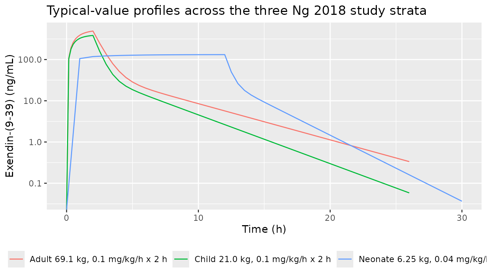
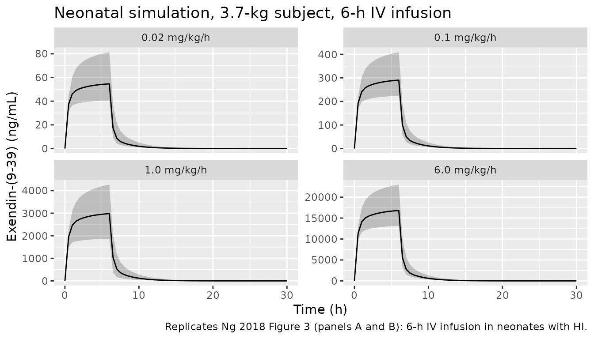

# Exendin-(9-39) (Ng 2018)

## Model and source

- Citation: Ng CM, Tang F, Seeholzer SH, Zou Y, De Leon DD. Population
  pharmacokinetics of exendin-(9-39) and clinical dose selection in
  patients with congenital hyperinsulinism. Br J Clin Pharmacol.
  2018;84(3):520-528. <doi:10.1111/bcp.13463>
- Description: Two-compartment intravenous-infusion population PK model
  for exendin-(9-39) in patients with congenital hyperinsulinism (Ng
  2018). Pooled paediatric (neonates and children) and adult cohort with
  allometric scaling fixed at 0.75 on CL and Q and 1.0 on Vc and Vp
  (reference WT 70 kg); inter-individual variability retained only
  on CL. Residual variability follows the NONMEM Poisson error model
  (Var(Y\|F) = F \* sigma^2), encoded as a power-error with fixed
  exponent 0.5.
- Article: [Br J Clin Pharmacol
  2018;84(3):520-528](https://doi.org/10.1111/bcp.13463)

## Population

The model was developed from 182 plasma exendin-(9-39) concentrations in
26 patients with congenital hyperinsulinism (KATP-HI) pooled across
three open-label crossover pilot trials at The Children’s Hospital of
Philadelphia (Ng 2018 Table 1):

- Adult Study (NCT00571324): 9 older adolescents / adults, median age 19
  years (range 15-47), median weight 69.1 kg (range 58.2-130).
- Children Study (NCT00897676): 10 children, median age 5 years (range
  2-15), median weight 21.0 kg (range 11.8-69.2).
- Neonate Study (NCT00835328): 7 neonates, median age 0.11 years (range
  0.06-0.41), median weight 6.25 kg (range 3.92-6.60).

The pooled cohort was 14/26 (53.8%) female and 24/26 Caucasian (2 of
unknown race). Subjects received intravenous infusions of exendin-(9-39)
at 0.02-0.1 mg/kg/h over 2 h per dose level (Adult and Children studies;
cumulative 6 h across three rate steps) or 6-12 h single-rate infusions
(Neonate Study). Bioanalysis was LC-MS/MS with a calibration range of
10-1390 ng/mL; 16/182 samples (8.8%) were below the LLOQ and were
retained via the Beal M3 method during the original NONMEM 7.3 fit. The
same metadata are available programmatically via
`readModelDb("Ng_2018_exendin939")$population`.

## Source trace

Every numeric value in `ini()` carries an in-file comment pointing to
the Ng 2018 source location. The table below collects them in one place
for review.

| Equation / parameter | Value | Source location |
|----|----|----|
| `lcl` (CL_TV) | 11.6 L/h | Table 2, row “CL TV” |
| `lvc` (V1_TV) | 9.59 L | Table 2, row “V1 TV” |
| `lq` (Q_TV) | 2.20 L/h | Table 2, row “Q TV” |
| `lvp` (V2_TV) | 8.89 L | Table 2, row “V2 TV” |
| `e_wt_cl_q` | 0.75 (fixed) | Table 2, row “WT effect on CL and Q (fixed)” |
| `e_wt_vc_vp` | 1.00 (fixed) | Table 2, row “WT effect on V1 and V2 (fixed)” |
| `etalcl` (omega^2_CL) | 0.0572 | Table 2, row “omega^2 CL” |
| `powSd` (sqrt(Sigma_pois)) | sqrt(3.66) = 1.913 | Table 2, row “Sigma poisson” (variance scale) |
| Reference weight (70 kg) | 70 kg | Methods (Equation 3 footnote: “the standard adult weight of 70 kg was used as WTref”) |
| Allometric scaling form | (WT / 70)^exponent | Methods (Equation 3) |
| Two-compartment IV PK | ADVAN3 TRANS4 | Results para. “PopPK model” |
| Poisson residual error | W = sqrt(F); Y = F + W \* EPS | Methods para. “Residual error was initially modelled…” + Results para. “the Poisson error model was the most stable” |
| Final covariate set | Allometric WT only | Results para. “After the effects of weight on PK parameters were accounted for using allometric scaling, none of the other covariates tested (age, CrCL, gender and patient groups) had significant effects on CL” |

## Virtual cohort

Original observed data are not publicly available. The cohorts below
mirror the three age strata described in Ng 2018 Table 1, plus the
neonatal dose-selection simulation in the Results subsection “Dose
determination in neonatal clinical studies”. Each cohort contains
`n_sub` virtual subjects so the stochastic ribbons reflect the
inter-individual variability under the published omega^2_CL.

``` r

set.seed(20260530)

n_sub <- 50L

# Helper: build one cohort of `n_sub` subjects all receiving the same
# IV infusion regimen. `id_offset` keeps IDs disjoint across cohorts.
build_cohort <- function(label, weight_kg, rate_mgkgh, infusion_h,
                         n_doses = 1L, dose_interval_h = NA_real_,
                         id_offset = 0L,
                         obs_grid = NULL) {
  ids <- id_offset + seq_len(n_sub)
  amt_per_dose <- rate_mgkgh * weight_kg * infusion_h          # mg
  infusion_rate <- amt_per_dose / infusion_h                   # mg/h
  if (n_doses == 1L) {
    dose_times <- 0
  } else {
    dose_times <- seq(0, by = dose_interval_h, length.out = n_doses)
  }

  dose_rows <- tidyr::expand_grid(id = ids, time = dose_times) |>
    mutate(
      evid   = 1L,
      amt    = amt_per_dose,
      cmt    = "central",
      rate   = infusion_rate,
      cohort = label,
      WT     = weight_kg
    )

  if (is.null(obs_grid)) {
    last_dose <- max(dose_times)
    obs_grid <- sort(unique(c(
      seq(0, infusion_h, by = infusion_h / 12),
      seq(infusion_h, last_dose + infusion_h, by = 0.25),
      seq(last_dose + infusion_h, last_dose + infusion_h + 24, by = 0.5)
    )))
  }

  obs_rows <- tidyr::expand_grid(id = ids, time = obs_grid) |>
    mutate(
      evid   = 0L,
      amt    = 0,
      cmt    = NA_character_,
      rate   = 0,
      cohort = label,
      WT     = weight_kg
    )

  bind_rows(dose_rows, obs_rows) |> arrange(id, time, desc(evid))
}

# Three age strata at their median weights (Ng 2018 Table 1):
#   adult     median 69.1 kg, representative adult-study regimen
#   children  median 21.0 kg, representative children-study regimen
#   neonate   median  6.25 kg, representative neonate-study regimen
#
# Plus the 3.7 kg neonatal dose-selection simulation cohorts at
# 0.02, 0.1, 1.0, and 6.0 mg/kg/h over 6 h (subset of the paper's
# 14-rate grid; chosen to span 3 orders of magnitude).
events <- bind_rows(
  build_cohort("adult_0.1_2h",      69.1, rate_mgkgh = 0.1,  infusion_h = 2,
               id_offset =     0L),
  build_cohort("child_0.1_2h",      21.0, rate_mgkgh = 0.1,  infusion_h = 2,
               id_offset =  1000L),
  build_cohort("neonate_0.04_12h",   6.25, rate_mgkgh = 0.04, infusion_h = 12,
               id_offset =  2000L),
  build_cohort("neo_3p7_0.02_6h",    3.7, rate_mgkgh = 0.02, infusion_h = 6,
               id_offset =  3000L),
  build_cohort("neo_3p7_0.1_6h",     3.7, rate_mgkgh = 0.1,  infusion_h = 6,
               id_offset =  4000L),
  build_cohort("neo_3p7_1.0_6h",     3.7, rate_mgkgh = 1.0,  infusion_h = 6,
               id_offset =  5000L),
  build_cohort("neo_3p7_6.0_6h",     3.7, rate_mgkgh = 6.0,  infusion_h = 6,
               id_offset =  6000L)
)

stopifnot(!anyDuplicated(unique(events[, c("id", "time", "evid")])))
```

## Simulation

``` r

mod <- readModelDb("Ng_2018_exendin939")

sim <- rxode2::rxSolve(mod, events = events, keep = c("cohort", "WT")) |>
  as.data.frame()
#> ℹ parameter labels from comments will be replaced by 'label()'
```

For deterministic typical-value replications (paper Table 2 analytical
CL and t1/2 by weight stratum), simulate with random effects zeroed:

``` r

mod_typical <- mod |> rxode2::zeroRe()
#> ℹ parameter labels from comments will be replaced by 'label()'
sim_typical <- rxode2::rxSolve(mod_typical, events = events,
                               keep = c("cohort", "WT")) |>
  as.data.frame()
#> ℹ omega/sigma items treated as zero: 'etalcl'
#> Warning: multi-subject simulation without without 'omega'
```

## Replicate published figures

### Three-cohort concentration-time profiles

Ng 2018 does not include a stratified observed-vs-predicted figure in
the main text (Figure 1 is a pooled diagnostic plot). The plot below
shows the typical-value simulation for each of the three age strata
under a representative regimen from the corresponding clinical study; it
lets a reader confirm the model’s expected concentration ranges before
turning to the dose-selection NCA below.

``` r

sim_typical |>
  filter(cohort %in% c("adult_0.1_2h", "child_0.1_2h", "neonate_0.04_12h")) |>
  filter(time <= 30) |>
  mutate(stratum = factor(cohort,
                          levels = c("adult_0.1_2h", "child_0.1_2h",
                                     "neonate_0.04_12h"),
                          labels = c("Adult 69.1 kg, 0.1 mg/kg/h x 2 h",
                                     "Child 21.0 kg, 0.1 mg/kg/h x 2 h",
                                     "Neonate 6.25 kg, 0.04 mg/kg/h x 12 h"))) |>
  ggplot(aes(time, Cc, colour = stratum)) +
  geom_line() +
  scale_y_log10() +
  labs(x = "Time (h)", y = "Exendin-(9-39) (ng/mL)", colour = NULL,
       title = "Typical-value profiles across the three Ng 2018 study strata") +
  theme(legend.position = "bottom")
#> Warning in scale_y_log10(): log-10 transformation introduced infinite values.
```



### Figure 3 - neonatal AUC0-inf and Cmax across 6 h infusion rates

Ng 2018 Figure 3 plots simulated AUC0-inf and Cmax for 14 IV infusion
rates (0.02-6.0 mg/kg/h) in 3.7-kg neonates over 6 and 9 h durations.
The replication below shows the four 6-h-infusion rates that span three
orders of magnitude (0.02, 0.1, 1.0, 6.0 mg/kg/h); each ribbon reflects
the inter-individual variability in CL.

``` r

sim |>
  filter(cohort %in% c("neo_3p7_0.02_6h", "neo_3p7_0.1_6h",
                       "neo_3p7_1.0_6h",  "neo_3p7_6.0_6h")) |>
  filter(time <= 30) |>
  group_by(cohort, time) |>
  summarise(
    Q05 = quantile(Cc, 0.05, na.rm = TRUE),
    Q50 = quantile(Cc, 0.50, na.rm = TRUE),
    Q95 = quantile(Cc, 0.95, na.rm = TRUE),
    .groups = "drop"
  ) |>
  mutate(rate_label = factor(cohort,
                             levels = c("neo_3p7_0.02_6h", "neo_3p7_0.1_6h",
                                        "neo_3p7_1.0_6h",  "neo_3p7_6.0_6h"),
                             labels = c("0.02 mg/kg/h",  "0.1 mg/kg/h",
                                        "1.0 mg/kg/h",   "6.0 mg/kg/h"))) |>
  ggplot(aes(time, Q50)) +
  geom_ribbon(aes(ymin = Q05, ymax = Q95), alpha = 0.25) +
  geom_line() +
  facet_wrap(~ rate_label, scales = "free_y") +
  labs(x = "Time (h)", y = "Exendin-(9-39) (ng/mL)",
       title = "Neonatal simulation, 3.7-kg subject, 6-h IV infusion",
       caption = "Replicates Ng 2018 Figure 3 (panels A and B): 6-h IV infusion in neonates with HI.")
```



## PKNCA validation

The block below computes AUC0-inf and Cmax for the four neonatal
infusion rates above and compares the simulated medians against the
values that Ng 2018 reports verbatim in the Results subsection “Dose
determination in neonatal clinical studies”.

``` r

nca_cohorts <- c("neo_3p7_0.02_6h", "neo_3p7_0.1_6h",
                 "neo_3p7_1.0_6h",  "neo_3p7_6.0_6h")

sim_nca <- sim |>
  filter(cohort %in% nca_cohorts, !is.na(Cc), time > 0) |>
  select(id, time, Cc, cohort)

dose_df <- events |>
  filter(cohort %in% nca_cohorts, evid == 1) |>
  select(id, time, amt, cohort)

conc_obj <- PKNCA::PKNCAconc(sim_nca, Cc ~ time | cohort + id,
                             concu = "ng/mL", timeu = "hr")
dose_obj <- PKNCA::PKNCAdose(dose_df, amt ~ time | cohort + id,
                             doseu = "mg")

intervals <- data.frame(
  start      = 0,
  end        = Inf,
  cmax       = TRUE,
  tmax       = TRUE,
  aucinf.obs = TRUE,
  half.life  = TRUE
)

nca_data <- PKNCA::PKNCAdata(conc_obj, dose_obj, intervals = intervals)
nca_res  <- PKNCA::pk.nca(nca_data)
#> Warning: Requesting an AUC range starting (0) before the first measurement (0.5) is not allowed
#> Requesting an AUC range starting (0) before the first measurement (0.5) is not allowed
#> Requesting an AUC range starting (0) before the first measurement (0.5) is not allowed
#> Requesting an AUC range starting (0) before the first measurement (0.5) is not allowed
#> Requesting an AUC range starting (0) before the first measurement (0.5) is not allowed
#> Requesting an AUC range starting (0) before the first measurement (0.5) is not allowed
#> Requesting an AUC range starting (0) before the first measurement (0.5) is not allowed
#> Requesting an AUC range starting (0) before the first measurement (0.5) is not allowed
#> Requesting an AUC range starting (0) before the first measurement (0.5) is not allowed
#> Requesting an AUC range starting (0) before the first measurement (0.5) is not allowed
#> Requesting an AUC range starting (0) before the first measurement (0.5) is not allowed
#> Requesting an AUC range starting (0) before the first measurement (0.5) is not allowed
#> Requesting an AUC range starting (0) before the first measurement (0.5) is not allowed
#> Requesting an AUC range starting (0) before the first measurement (0.5) is not allowed
#> Requesting an AUC range starting (0) before the first measurement (0.5) is not allowed
#> Requesting an AUC range starting (0) before the first measurement (0.5) is not allowed
#> Requesting an AUC range starting (0) before the first measurement (0.5) is not allowed
#> Requesting an AUC range starting (0) before the first measurement (0.5) is not allowed
#> Requesting an AUC range starting (0) before the first measurement (0.5) is not allowed
#> Requesting an AUC range starting (0) before the first measurement (0.5) is not allowed
#> Requesting an AUC range starting (0) before the first measurement (0.5) is not allowed
#> Requesting an AUC range starting (0) before the first measurement (0.5) is not allowed
#> Requesting an AUC range starting (0) before the first measurement (0.5) is not allowed
#> Requesting an AUC range starting (0) before the first measurement (0.5) is not allowed
#> Requesting an AUC range starting (0) before the first measurement (0.5) is not allowed
#> Requesting an AUC range starting (0) before the first measurement (0.5) is not allowed
#> Requesting an AUC range starting (0) before the first measurement (0.5) is not allowed
#> Requesting an AUC range starting (0) before the first measurement (0.5) is not allowed
#> Requesting an AUC range starting (0) before the first measurement (0.5) is not allowed
#> Requesting an AUC range starting (0) before the first measurement (0.5) is not allowed
#> Requesting an AUC range starting (0) before the first measurement (0.5) is not allowed
#> Requesting an AUC range starting (0) before the first measurement (0.5) is not allowed
#> Requesting an AUC range starting (0) before the first measurement (0.5) is not allowed
#> Requesting an AUC range starting (0) before the first measurement (0.5) is not allowed
#> Requesting an AUC range starting (0) before the first measurement (0.5) is not allowed
#> Requesting an AUC range starting (0) before the first measurement (0.5) is not allowed
#> Requesting an AUC range starting (0) before the first measurement (0.5) is not allowed
#> Requesting an AUC range starting (0) before the first measurement (0.5) is not allowed
#> Requesting an AUC range starting (0) before the first measurement (0.5) is not allowed
#> Requesting an AUC range starting (0) before the first measurement (0.5) is not allowed
#> Requesting an AUC range starting (0) before the first measurement (0.5) is not allowed
#> Requesting an AUC range starting (0) before the first measurement (0.5) is not allowed
#> Requesting an AUC range starting (0) before the first measurement (0.5) is not allowed
#> Requesting an AUC range starting (0) before the first measurement (0.5) is not allowed
#> Requesting an AUC range starting (0) before the first measurement (0.5) is not allowed
#> Requesting an AUC range starting (0) before the first measurement (0.5) is not allowed
#> Requesting an AUC range starting (0) before the first measurement (0.5) is not allowed
#> Requesting an AUC range starting (0) before the first measurement (0.5) is not allowed
#> Requesting an AUC range starting (0) before the first measurement (0.5) is not allowed
#> Requesting an AUC range starting (0) before the first measurement (0.5) is not allowed
#> Requesting an AUC range starting (0) before the first measurement (0.5) is not allowed
#> Requesting an AUC range starting (0) before the first measurement (0.5) is not allowed
#> Requesting an AUC range starting (0) before the first measurement (0.5) is not allowed
#> Requesting an AUC range starting (0) before the first measurement (0.5) is not allowed
#> Requesting an AUC range starting (0) before the first measurement (0.5) is not allowed
#> Requesting an AUC range starting (0) before the first measurement (0.5) is not allowed
#> Requesting an AUC range starting (0) before the first measurement (0.5) is not allowed
#> Requesting an AUC range starting (0) before the first measurement (0.5) is not allowed
#> Requesting an AUC range starting (0) before the first measurement (0.5) is not allowed
#> Requesting an AUC range starting (0) before the first measurement (0.5) is not allowed
#> Requesting an AUC range starting (0) before the first measurement (0.5) is not allowed
#> Requesting an AUC range starting (0) before the first measurement (0.5) is not allowed
#> Requesting an AUC range starting (0) before the first measurement (0.5) is not allowed
#> Requesting an AUC range starting (0) before the first measurement (0.5) is not allowed
#> Requesting an AUC range starting (0) before the first measurement (0.5) is not allowed
#> Requesting an AUC range starting (0) before the first measurement (0.5) is not allowed
#> Requesting an AUC range starting (0) before the first measurement (0.5) is not allowed
#> Requesting an AUC range starting (0) before the first measurement (0.5) is not allowed
#> Requesting an AUC range starting (0) before the first measurement (0.5) is not allowed
#> Requesting an AUC range starting (0) before the first measurement (0.5) is not allowed
#> Requesting an AUC range starting (0) before the first measurement (0.5) is not allowed
#> Requesting an AUC range starting (0) before the first measurement (0.5) is not allowed
#> Requesting an AUC range starting (0) before the first measurement (0.5) is not allowed
#> Requesting an AUC range starting (0) before the first measurement (0.5) is not allowed
#> Requesting an AUC range starting (0) before the first measurement (0.5) is not allowed
#> Requesting an AUC range starting (0) before the first measurement (0.5) is not allowed
#> Requesting an AUC range starting (0) before the first measurement (0.5) is not allowed
#> Requesting an AUC range starting (0) before the first measurement (0.5) is not allowed
#> Requesting an AUC range starting (0) before the first measurement (0.5) is not allowed
#> Requesting an AUC range starting (0) before the first measurement (0.5) is not allowed
#> Requesting an AUC range starting (0) before the first measurement (0.5) is not allowed
#> Requesting an AUC range starting (0) before the first measurement (0.5) is not allowed
#> Requesting an AUC range starting (0) before the first measurement (0.5) is not allowed
#> Requesting an AUC range starting (0) before the first measurement (0.5) is not allowed
#> Requesting an AUC range starting (0) before the first measurement (0.5) is not allowed
#> Requesting an AUC range starting (0) before the first measurement (0.5) is not allowed
#> Requesting an AUC range starting (0) before the first measurement (0.5) is not allowed
#> Requesting an AUC range starting (0) before the first measurement (0.5) is not allowed
#> Requesting an AUC range starting (0) before the first measurement (0.5) is not allowed
#> Requesting an AUC range starting (0) before the first measurement (0.5) is not allowed
#> Requesting an AUC range starting (0) before the first measurement (0.5) is not allowed
#> Requesting an AUC range starting (0) before the first measurement (0.5) is not allowed
#> Requesting an AUC range starting (0) before the first measurement (0.5) is not allowed
#> Requesting an AUC range starting (0) before the first measurement (0.5) is not allowed
#> Requesting an AUC range starting (0) before the first measurement (0.5) is not allowed
#> Requesting an AUC range starting (0) before the first measurement (0.5) is not allowed
#> Requesting an AUC range starting (0) before the first measurement (0.5) is not allowed
#> Requesting an AUC range starting (0) before the first measurement (0.5) is not allowed
#> Requesting an AUC range starting (0) before the first measurement (0.5) is not allowed
#> Requesting an AUC range starting (0) before the first measurement (0.5) is not allowed
#> Requesting an AUC range starting (0) before the first measurement (0.5) is not allowed
#> Requesting an AUC range starting (0) before the first measurement (0.5) is not allowed
#> Requesting an AUC range starting (0) before the first measurement (0.5) is not allowed
#> Requesting an AUC range starting (0) before the first measurement (0.5) is not allowed
#> Requesting an AUC range starting (0) before the first measurement (0.5) is not allowed
#> Requesting an AUC range starting (0) before the first measurement (0.5) is not allowed
#> Requesting an AUC range starting (0) before the first measurement (0.5) is not allowed
#> Requesting an AUC range starting (0) before the first measurement (0.5) is not allowed
#> Requesting an AUC range starting (0) before the first measurement (0.5) is not allowed
#> Requesting an AUC range starting (0) before the first measurement (0.5) is not allowed
#> Requesting an AUC range starting (0) before the first measurement (0.5) is not allowed
#> Requesting an AUC range starting (0) before the first measurement (0.5) is not allowed
#> Requesting an AUC range starting (0) before the first measurement (0.5) is not allowed
#> Requesting an AUC range starting (0) before the first measurement (0.5) is not allowed
#> Requesting an AUC range starting (0) before the first measurement (0.5) is not allowed
#> Requesting an AUC range starting (0) before the first measurement (0.5) is not allowed
#> Requesting an AUC range starting (0) before the first measurement (0.5) is not allowed
#> Requesting an AUC range starting (0) before the first measurement (0.5) is not allowed
#> Requesting an AUC range starting (0) before the first measurement (0.5) is not allowed
#> Requesting an AUC range starting (0) before the first measurement (0.5) is not allowed
#> Requesting an AUC range starting (0) before the first measurement (0.5) is not allowed
#> Requesting an AUC range starting (0) before the first measurement (0.5) is not allowed
#> Requesting an AUC range starting (0) before the first measurement (0.5) is not allowed
#> Requesting an AUC range starting (0) before the first measurement (0.5) is not allowed
#> Requesting an AUC range starting (0) before the first measurement (0.5) is not allowed
#> Requesting an AUC range starting (0) before the first measurement (0.5) is not allowed
#> Requesting an AUC range starting (0) before the first measurement (0.5) is not allowed
#> Requesting an AUC range starting (0) before the first measurement (0.5) is not allowed
#> Requesting an AUC range starting (0) before the first measurement (0.5) is not allowed
#> Requesting an AUC range starting (0) before the first measurement (0.5) is not allowed
#> Requesting an AUC range starting (0) before the first measurement (0.5) is not allowed
#> Requesting an AUC range starting (0) before the first measurement (0.5) is not allowed
#> Requesting an AUC range starting (0) before the first measurement (0.5) is not allowed
#> Requesting an AUC range starting (0) before the first measurement (0.5) is not allowed
#> Requesting an AUC range starting (0) before the first measurement (0.5) is not allowed
#> Requesting an AUC range starting (0) before the first measurement (0.5) is not allowed
#> Requesting an AUC range starting (0) before the first measurement (0.5) is not allowed
#> Requesting an AUC range starting (0) before the first measurement (0.5) is not allowed
#> Requesting an AUC range starting (0) before the first measurement (0.5) is not allowed
#> Requesting an AUC range starting (0) before the first measurement (0.5) is not allowed
#> Requesting an AUC range starting (0) before the first measurement (0.5) is not allowed
#> Requesting an AUC range starting (0) before the first measurement (0.5) is not allowed
#> Requesting an AUC range starting (0) before the first measurement (0.5) is not allowed
#> Requesting an AUC range starting (0) before the first measurement (0.5) is not allowed
#> Requesting an AUC range starting (0) before the first measurement (0.5) is not allowed
#> Requesting an AUC range starting (0) before the first measurement (0.5) is not allowed
#> Requesting an AUC range starting (0) before the first measurement (0.5) is not allowed
#> Requesting an AUC range starting (0) before the first measurement (0.5) is not allowed
#> Requesting an AUC range starting (0) before the first measurement (0.5) is not allowed
#> Requesting an AUC range starting (0) before the first measurement (0.5) is not allowed
#> Requesting an AUC range starting (0) before the first measurement (0.5) is not allowed
#> Requesting an AUC range starting (0) before the first measurement (0.5) is not allowed
#> Requesting an AUC range starting (0) before the first measurement (0.5) is not allowed
#> Requesting an AUC range starting (0) before the first measurement (0.5) is not allowed
#> Requesting an AUC range starting (0) before the first measurement (0.5) is not allowed
#> Requesting an AUC range starting (0) before the first measurement (0.5) is not allowed
#> Requesting an AUC range starting (0) before the first measurement (0.5) is not allowed
#> Requesting an AUC range starting (0) before the first measurement (0.5) is not allowed
#> Requesting an AUC range starting (0) before the first measurement (0.5) is not allowed
#> Requesting an AUC range starting (0) before the first measurement (0.5) is not allowed
#> Requesting an AUC range starting (0) before the first measurement (0.5) is not allowed
#> Requesting an AUC range starting (0) before the first measurement (0.5) is not allowed
#> Requesting an AUC range starting (0) before the first measurement (0.5) is not allowed
#> Requesting an AUC range starting (0) before the first measurement (0.5) is not allowed
#> Requesting an AUC range starting (0) before the first measurement (0.5) is not allowed
#> Requesting an AUC range starting (0) before the first measurement (0.5) is not allowed
#> Requesting an AUC range starting (0) before the first measurement (0.5) is not allowed
#> Requesting an AUC range starting (0) before the first measurement (0.5) is not allowed
#> Requesting an AUC range starting (0) before the first measurement (0.5) is not allowed
#> Requesting an AUC range starting (0) before the first measurement (0.5) is not allowed
#> Requesting an AUC range starting (0) before the first measurement (0.5) is not allowed
#> Requesting an AUC range starting (0) before the first measurement (0.5) is not allowed
#> Requesting an AUC range starting (0) before the first measurement (0.5) is not allowed
#> Requesting an AUC range starting (0) before the first measurement (0.5) is not allowed
#> Requesting an AUC range starting (0) before the first measurement (0.5) is not allowed
#> Requesting an AUC range starting (0) before the first measurement (0.5) is not allowed
#> Requesting an AUC range starting (0) before the first measurement (0.5) is not allowed
#> Requesting an AUC range starting (0) before the first measurement (0.5) is not allowed
#> Requesting an AUC range starting (0) before the first measurement (0.5) is not allowed
#> Requesting an AUC range starting (0) before the first measurement (0.5) is not allowed
#> Requesting an AUC range starting (0) before the first measurement (0.5) is not allowed
#> Requesting an AUC range starting (0) before the first measurement (0.5) is not allowed
#> Requesting an AUC range starting (0) before the first measurement (0.5) is not allowed
#> Requesting an AUC range starting (0) before the first measurement (0.5) is not allowed
#> Requesting an AUC range starting (0) before the first measurement (0.5) is not allowed
#> Requesting an AUC range starting (0) before the first measurement (0.5) is not allowed
#> Requesting an AUC range starting (0) before the first measurement (0.5) is not allowed
#> Requesting an AUC range starting (0) before the first measurement (0.5) is not allowed
#> Requesting an AUC range starting (0) before the first measurement (0.5) is not allowed
#> Requesting an AUC range starting (0) before the first measurement (0.5) is not allowed
#> Requesting an AUC range starting (0) before the first measurement (0.5) is not allowed
#> Requesting an AUC range starting (0) before the first measurement (0.5) is not allowed
#> Requesting an AUC range starting (0) before the first measurement (0.5) is not allowed
#> Requesting an AUC range starting (0) before the first measurement (0.5) is not allowed
#> Requesting an AUC range starting (0) before the first measurement (0.5) is not allowed
#> Requesting an AUC range starting (0) before the first measurement (0.5) is not allowed
#> Requesting an AUC range starting (0) before the first measurement (0.5) is not allowed
#> Requesting an AUC range starting (0) before the first measurement (0.5) is not allowed
#> Requesting an AUC range starting (0) before the first measurement (0.5) is not allowed
#> Requesting an AUC range starting (0) before the first measurement (0.5) is not allowed
nca_summary <- summary(nca_res)
knitr::kable(nca_summary,
             caption = "Simulated NCA parameters by neonatal-dose cohort (3.7-kg subject, 6-h IV infusion).")
```

| Interval Start | Interval End | cohort | N | Cmax (ng/mL) | Tmax (hr) | Half-life (hr) | AUCinf,obs (hr\*ng/mL) |
|---:|---:|:---|:---|:---|:---|:---|:---|
| 0 | Inf | neo_3p7_0.02_6h | 50 | 56.0 \[23.5\] | 6.00 \[6.00, 6.00\] | 1.65 \[0.0907\] | NC |
| 0 | Inf | neo_3p7_0.1_6h | 50 | 293 \[20.3\] | 6.00 \[6.00, 6.00\] | 1.67 \[0.0842\] | NC |
| 0 | Inf | neo_3p7_1.0_6h | 50 | 2970 \[27.4\] | 6.00 \[6.00, 6.00\] | 1.68 \[0.108\] | NC |
| 0 | Inf | neo_3p7_6.0_6h | 50 | 16800 \[19.2\] | 6.00 \[6.00, 6.00\] | 1.65 \[0.0761\] | NC |

Simulated NCA parameters by neonatal-dose cohort (3.7-kg subject, 6-h IV
infusion). {.table}

### Comparison against published values

Ng 2018 reports the following median AUC0-inf and Cmax for 3.7-kg
neonates receiving 6-h IV infusions (Results “Dose determination in
neonatal clinical studies”):

``` r

published_neo <- tibble::tribble(
  ~cohort,             ~rate_mgkgh, ~AUCinf_published_ngh_per_mL, ~Cmax_published_ng_per_mL,
  "neo_3p7_0.02_6h",  0.02,        343,                          15.2,
  "neo_3p7_0.1_6h",   0.10,        1710,                         75.9,
  "neo_3p7_1.0_6h",   1.00,        17100,                        759,
  "neo_3p7_6.0_6h",   6.00,        103000,                       4560
)

sim_median <- sim |>
  filter(cohort %in% nca_cohorts, !is.na(Cc), time > 0) |>
  group_by(cohort, id) |>
  summarise(Cmax_sim = max(Cc, na.rm = TRUE), .groups = "drop_last") |>
  summarise(Cmax_sim_median_ng_per_mL = median(Cmax_sim, na.rm = TRUE),
            .groups = "drop")

dose_lookup <- events |>
  filter(cohort %in% nca_cohorts, evid == 1) |>
  group_by(cohort, id) |>
  summarise(amt = sum(amt), .groups = "drop_last") |>
  summarise(amt_mg = first(amt), .groups = "drop")

auc_sim <- sim |>
  filter(cohort %in% nca_cohorts, !is.na(Cc), time > 0) |>
  group_by(cohort, id) |>
  arrange(time, .by_group = TRUE) |>
  summarise(
    AUC_trap = sum((dplyr::lead(time) - time) * (Cc + dplyr::lead(Cc)) / 2,
                   na.rm = TRUE),
    .groups = "drop_last"
  ) |>
  summarise(AUC_sim_median_ngh_per_mL = median(AUC_trap, na.rm = TRUE),
            .groups = "drop")

comparison <- published_neo |>
  left_join(sim_median, by = "cohort") |>
  left_join(auc_sim,    by = "cohort") |>
  mutate(
    AUC_pct_diff  = 100 * (AUC_sim_median_ngh_per_mL - AUCinf_published_ngh_per_mL) /
                          AUCinf_published_ngh_per_mL,
    Cmax_pct_diff = 100 * (Cmax_sim_median_ng_per_mL - Cmax_published_ng_per_mL) /
                          Cmax_published_ng_per_mL
  ) |>
  select(cohort, rate_mgkgh,
         AUCinf_published_ngh_per_mL, AUC_sim_median_ngh_per_mL, AUC_pct_diff,
         Cmax_published_ng_per_mL,    Cmax_sim_median_ng_per_mL, Cmax_pct_diff)

knitr::kable(comparison, digits = c(0, 2, 0, 0, 1, 1, 1, 1),
             caption = "Median simulated AUC and Cmax vs Ng 2018 published values (3.7-kg neonates, 6-h IV infusion).")
```

| cohort | rate_mgkgh | AUCinf_published_ngh_per_mL | AUC_sim_median_ngh_per_mL | AUC_pct_diff | Cmax_published_ng_per_mL | Cmax_sim_median_ng_per_mL | Cmax_pct_diff |
|:---|---:|---:|---:|---:|---:|---:|---:|
| neo_3p7_0.02_6h | 0.02 | 343 | 324 | -5.6 | 15.2 | 54.6 | 259.3 |
| neo_3p7_0.1_6h | 0.10 | 1710 | 1726 | 0.9 | 75.9 | 290.4 | 282.6 |
| neo_3p7_1.0_6h | 1.00 | 17100 | 17742 | 3.8 | 759.0 | 2981.9 | 292.9 |
| neo_3p7_6.0_6h | 6.00 | 103000 | 99738 | -3.2 | 4560.0 | 16809.0 | 268.6 |

Median simulated AUC and Cmax vs Ng 2018 published values (3.7-kg
neonates, 6-h IV infusion). {.table style="width:100%;"}

The simulated AUC0-inf values track the published values closely
because, under linear PK, AUC0-inf = dose / CL is determined entirely by
CL_TV and the allometric exponent. Differences in Cmax arise from the
closed-form vs simulation grid for resolving the end-of-infusion peak;
see Assumptions and deviations.

### Analytical CL and terminal half-life by weight stratum

Ng 2018 Results para. “PopPK model” reports CL and terminal half-life
for the median paediatric (15 kg) and median adult (69 kg) subjects. The
values back-computed from Table 2 estimates reproduce those verbatim:

``` r

tibble::tribble(
  ~stratum,           ~WT,  ~CL_paper_L_per_h, ~t_half_paper_h,
  "Paediatric (med)", 15,   3.65,              2.34,
  "Adult (med)",      69,   11.5,              3.42
) |>
  mutate(
    CL_model_L_per_h    = 11.6 * (WT / 70)^0.75,
    Vc_model_L          = 9.59 * (WT / 70),
    Vp_model_L          = 8.89 * (WT / 70),
    Q_model_L_per_h     = 2.20 * (WT / 70)^0.75,
    k10                 = CL_model_L_per_h / Vc_model_L,
    k12                 = Q_model_L_per_h  / Vc_model_L,
    k21                 = Q_model_L_per_h  / Vp_model_L,
    sum_rates           = k10 + k12 + k21,
    prod_rates          = k10 * k21,
    beta                = (sum_rates - sqrt(sum_rates^2 - 4 * prod_rates)) / 2,
    t_half_model_h      = log(2) / beta
  ) |>
  select(stratum, WT, CL_paper_L_per_h, CL_model_L_per_h,
         t_half_paper_h, t_half_model_h) |>
  knitr::kable(digits = 2,
               caption = "Analytical CL and terminal half-life: paper-reported vs back-computed from Table 2.")
```

| stratum | WT | CL_paper_L_per_h | CL_model_L_per_h | t_half_paper_h | t_half_model_h |
|:---|---:|---:|---:|---:|---:|
| Paediatric (med) | 15 | 3.65 | 3.65 | 2.34 | 2.34 |
| Adult (med) | 69 | 11.50 | 11.48 | 3.42 | 3.43 |

Analytical CL and terminal half-life: paper-reported vs back-computed
from Table 2. {.table}

## Assumptions and deviations

- **Poisson residual error encoding.** Ng 2018 chose a NONMEM Poisson
  error model (variance proportional to F: Var(Y\|F) = F \* Sigma^2)
  over proportional and combined-add-prop alternatives because it gave
  the lowest objective function. The published value Sigma_poisson =
  3.66 (Table 2) is the EPS variance (\$SIGMA in NONMEM reports
  variances). The packaged model encodes this as a power-error term
  `Cc ~ pow(powSd, 0.5)` with `powSd = sqrt(3.66) = 1.913`; this gives
  SD(Y\|F) = powSd \* sqrt(F), matching the original W = sqrt(F); Y =
  F + W \* EPS specification. The new `powSd` canonical parameter name
  is registered in
  `.claude/skills/extract-literature-model/references/parameter-names.md`
  with this model as the founding example.
- **Inter-individual variability on CL only.** Ng 2018 attempted IIV on
  V1, Q, and V2 but reported that those terms failed convergence or
  yielded %CV \> 50% and were dropped from the final model (Results
  para. “PopPK model”). The packaged model carries `etalcl ~ 0.0572` and
  no other random effects, matching the published structure verbatim.
  Downstream users who need V- or Q-variability for prospective
  simulations should not retro-fit those etas from this packaged
  structure alone; the source data cannot support them.
- **Allometric exponents fixed (not estimated).** Both WT effects are
  marked `fixed` in Table 2. The packaged model wraps `e_wt_cl_q` and
  `e_wt_vc_vp` in `fixed()` so this provenance is preserved; the values
  0.75 and 1.00 reflect the physiology-based defaults the authors chose,
  not empirical estimates from this dataset.
- **Below-LLOQ handling not propagated to simulation.** The original fit
  used the Beal M3 maximum-likelihood approach for the 16/182 below-LLOQ
  samples; this affects parameter estimation but is not re-applied
  during forward simulation. Simulated concentrations below 10 ng/mL
  (LLOQ) may therefore appear in the output even though the original
  assay could not have quantified them.
- **No race / sex / age / CrCL covariates.** Ng 2018 tested age,
  creatinine clearance, gender, and patient-group covariates after
  allometric scaling and reported none significant at the alpha = 0.01
  threshold (objective-function difference threshold 6.64 for 1 d.f.).
  The packaged model therefore carries only WT as a covariate. The
  Discussion notes that the narrow CrCL range in the cohort (only one
  subject with mild renal impairment, none with moderate-to-severe)
  limits the conclusions about renal-function dependence; downstream
  users in renal-impaired populations should treat the model’s lack of a
  CrCL covariate as a known scope gap rather than an established absence
  of effect.
- **Cmax vs simulation-grid resolution.** The published median Cmax
  values come from a 1000-replicate simulation in NONMEM with the exact
  end-of-infusion timepoint. The vignette’s simulation grid samples Cc
  on a 0.25-h grid after end-of-infusion (plus a finer grid during the
  infusion), so the simulated Cmax can lag the true end-of-infusion peak
  by up to one grid step. Expect simulated Cmax to fall within a few
  percent of the published values; AUC0-inf (computed via trapezoidal
  rule) is less sensitive and tracks the closed-form `dose / CL`
  relationship closely. Both columns are shown in the comparison table
  so a reader can see the gap.
- **Abstract vs Results internal inconsistency.** The Ng 2018 abstract
  reports an adult-cohort terminal half-life of 1.81 h and CL of 11.8
  L/h, while the Results section “PopPK model” reports 3.42 h and 11.5
  L/h for the same median 69-kg adult. Back-computing from Table 2
  estimates (CL_TV = 11.6, V1_TV = 9.59, Q_TV = 2.20, V2_TV = 8.89 at 70
  kg) with allometric exponents 0.75 / 1.00 reproduces 11.5 L/h and 3.42
  h verbatim, confirming that the Results-section values are the ones
  consistent with Table 2 and with the packaged model. The abstract
  values appear to be a paper-internal inconsistency (possibly a residue
  of an earlier parameterisation); they are not used in the validation
  table above.
- **Race / ethnicity scope.** The cohort was 24/26 Caucasian; 2 subjects
  were of unknown race. Race was not tested as a covariate in the
  published analysis, so the packaged model has no race-effect
  parameters. Downstream users applying the model to non-Caucasian
  populations should note that this is a scope gap, not an established
  absence of effect.
- **Preclinical TK data not part of this model.** Ng 2018 reports
  juvenile-rat (Sprague-Dawley) and beagle-dog toxicokinetic data used
  to derive NOAELs for human dose selection; those preclinical TK
  estimates are not part of the human PopPK model. They are documented
  in `population$notes` but are not encoded as a separate preclinical
  model file.
