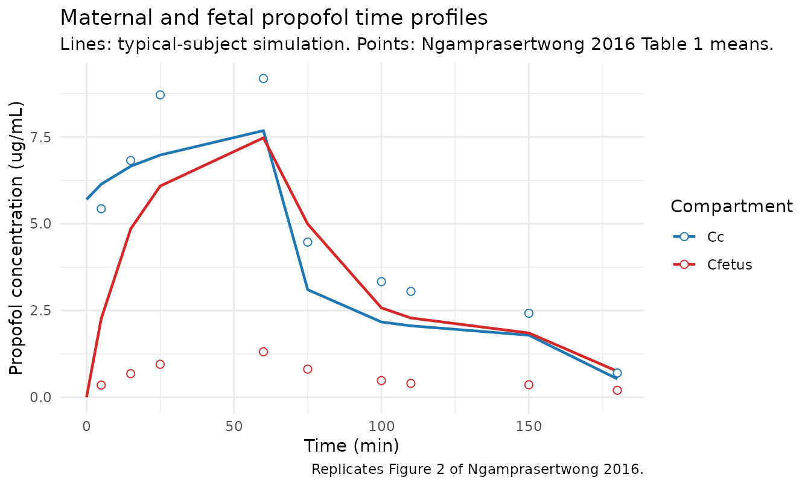

# Propofol (Ngamprasertwong 2016) -- maternal-fetal sheep

## Model and source

- Citation: Ngamprasertwong P, Dong M, Niu J, Venkatasubramanian R,
  Vinks AA, Sadhasivam S. Propofol pharmacokinetics and estimation of
  fetal propofol exposure during mid-gestational fetal surgery: a
  maternal-fetal sheep model. PLoS ONE 2016;11(1):e0146563.
  <doi:10.1371/journal.pone.0146563>.
- Description: Preclinical (sheep). Maternal-fetal population PK model
  of propofol in mid-gestational pregnant Dorset ewes (Ngamprasertwong
  2016; N = 8 ewe-fetus pairs at 110-125 days gestation; term ~147-150
  days). Two-compartment maternal disposition (central + peripheral1)
  linked to a single fetal compartment via a reversible
  inter-compartmental clearance QM-F; fetal clearance was tested but
  estimated near zero (\<0.001 L/min, RSE \>100%) and set to zero in the
  final model. Maternal clearance scales with heart rate via the
  normalised power model CL = theta1 \* (HR/158)^theta2; no other
  covariate (gestational age, body weight, blood pressure, uterine blood
  flow) reached statistical significance. Inter-individual variability
  was estimated on CL and QM-F; IIV on Vc, Q, Vp, and VFetus was fixed
  to zero in the source and is omitted here. Residual error is purely
  proportional, with separate variances for maternal-ewe and fetal
  observations.
- Article (open access):
  [doi:10.1371/journal.pone.0146563](https://doi.org/10.1371/journal.pone.0146563)
- Data: [doi:10.5281/zenodo.35672](https://doi.org/10.5281/zenodo.35672)
  – per-animal propofol concentration data deposited by the authors.

## Population

Ngamprasertwong 2016 developed the propofol popPK model from 8 singleton
pregnant Dorset ewes at 110-125 days gestation (term ~147-150 days, i.e.
mid-gestation), used as a maternal-fetal model for open fetal surgery.
Ewes were instrumented with maternal femoral arterial / venous
catheters, fetal femoral arterial / venous catheters, an
umbilical-artery flow probe, and bilateral uterine-artery flow probes;
instrumentation methods are described in detail in the paper’s Methods
(Instrumentation) and in the prior reference \[2\]. After a recovery of
at least 4 days, the PK study was conducted under general anesthesia
with propofol, remifentanil and desflurane. Mean body weight at the PK
study was 71.6 kg (range 60-82 kg, median 72.5 kg); mean gestational age
was 115.8 days (range 111-118 days, median 116.5 days).

The full population summary is available programmatically via
`rxode2::rxode(readModelDb("Ngamprasertwong_2016_propofol_sheep"))$population`.

## Source trace

The per-parameter origin is recorded as an in-file comment next to each
`ini()` entry in
`inst/modeldb/specificDrugs/Ngamprasertwong_2016_propofol_sheep.R`. The
table below collects them in one place.

| Equation / parameter | Value | Source location |
|----|----|----|
| `lcl` (theta1, CL at HR=158) | 4.17 L/min | Table 2 |
| `lvc` (Vc) | 37.7 L | Table 2 |
| `lq` (Q) | 1.22 L/min | Table 2 |
| `lvp` (Vp) | 60.8 L | Table 2 |
| `lqmf` (QM-F) | 0.0138 L/min | Table 2 |
| `lvfetus` (VFetus) | 0.144 L | Table 2 + Fig 3 caption |
| `e_hr_cl` (theta2) | 0.764 | Table 2 |
| `etalcl` (omega1, CL IIV) | 21.8 %CV | Table 2 |
| `etalqmf` (omega5, QM-F IIV) | 66.5 %CV | Table 2 |
| `propSd` (sigma ewe) | 26.0 %CV | Table 2 |
| `propSd_Cfetus` (sigma fetus) | 21.8 %CV | Table 2 |
| `CL = theta1 * (HR/158)^theta2` | n/a | Table 2 (equation row) |
| Two maternal compartments + one fetal compartment, dosing into maternal central | n/a | Results page 4 + Fig 3 caption |
| Reversible inter-compartmental clearance between maternal central and fetus via QM-F; fetal clearance set to zero | n/a | Results page 4 (paragraph beginning “The maternal propofol plasma concentrations were best fitted”) |
| Combined proportional + additive residual error tested; final model uses proportional only with separate maternal-ewe and fetal variances | n/a | Methods Eq (2) + Table 2 |
| IIVs on Vc, Q, Vp, VFetus are 0 FIX in the source | n/a | Table 2 (rows omega2^2, omega3^2, omega4^2, omega6^2) |

## Virtual cohort

The validation virtual cohort matches the cohort-mean ewe in
Ngamprasertwong 2016 Methods: body weight 71.6 kg, median heart rate 135
beats/min (the typical-subject median reported in the Results
narrative). Note that the Table 2 covariate equation
`CL = theta1 * (HR/158)^theta2` normalises to HR = 158 beats/min, so the
typical CL at HR = 135 in this model is `4.17 * (135/158)^0.764 = 3.69`
L/min.

``` r

set.seed(2016L)

WT  <- 71.6   # cohort-mean ewe body weight, kg
HR0 <- 135    # cohort-median ewe heart rate, beats/min (Methods)

# Dosing protocol (Ngamprasertwong 2016 Methods / Anesthetic Regimen):
#   Induction:        propofol 3 mg/kg IV bolus.
#   Anesthesia phase 1 (0-60 min):  propofol 450 ug/kg/min IV infusion.
#   Anesthesia phase 2 (60-150 min): propofol  75 ug/kg/min IV infusion.
#   Stop infusion at 150 min; final sample at 180 min.
bolus_mg     <- 3 * WT                       # mg
inf1_rate_mg <- 450 * WT / 1000              # mg/min (450 ug/kg/min * WT kg)
inf1_amt_mg  <- inf1_rate_mg * 60            # mg total over 0-60 min
inf2_rate_mg <-  75 * WT / 1000              # mg/min
inf2_amt_mg  <- inf2_rate_mg * 90            # mg total over 60-150 min

obs_times <- c(0, 5, 15, 25, 60, 75, 100, 110, 150, 180)

# Observe at the ODE state `central` with dvid = 1L. The model body has
# two algebraic observables (Cc from central, Cfetus from the fetus
# state) in residual tildes; rxUi auto-injects compartment slots for
# them after the ODE-state slots, so `cmt = "Cc"` would target an
# injected slot rather than an ODE state. rxSolve still returns both Cc
# and Cfetus as columns on every observation row.
events <- dplyr::bind_rows(
  data.frame(id = 1L, time = 0L,  evid = 1L, amt = bolus_mg,    rate = 0,
             cmt  = "central", HR = HR0, dvid = NA_integer_),
  data.frame(id = 1L, time = 0L,  evid = 1L, amt = inf1_amt_mg, rate = inf1_rate_mg,
             cmt  = "central", HR = HR0, dvid = NA_integer_),
  data.frame(id = 1L, time = 60L, evid = 1L, amt = inf2_amt_mg, rate = inf2_rate_mg,
             cmt  = "central", HR = HR0, dvid = NA_integer_),
  data.frame(id = 1L, time = obs_times, evid = 0L, amt = 0, rate = 0,
             cmt = "central", HR = HR0, dvid = 1L)
) |>
  dplyr::arrange(id, time, dplyr::desc(evid))
```

## Simulation

``` r

mod <- readModelDb("Ngamprasertwong_2016_propofol_sheep") |> rxode2::rxode()
#> ℹ parameter labels from comments will be replaced by 'label()'

# Typical-subject simulation: zero out random effects to reproduce the
# cohort-mean concentration time course shown in Table 1 / Fig 2.
mod_typ <- rxode2::zeroRe(mod)
sim_typ <- rxode2::rxSolve(mod_typ, events = events, keep = "HR") |>
  as.data.frame()
#> ℹ omega/sigma items treated as zero: 'etalcl', 'etalqmf'
```

## Comparison against published mean concentrations (Table 1)

``` r

paper_table1 <- tibble::tibble(
  time         = c(5, 15, 25, 60, 75, 100, 110, 150, 180),
  Cc_paper     = c(5.43, 6.82, 8.71, 9.18, 4.47, 3.33, 3.05, 2.42, 0.70),
  Cc_paper_sd  = c(2.06, 2.57, 1.60, 3.25, 1.95, 1.75, 1.56, 0.93, 0.41),
  Cfetus_paper = c(0.35, 0.68, 0.95, 1.31, 0.81, 0.48, 0.40, 0.36, 0.20),
  Cfetus_paper_sd = c(0.21, 0.31, 0.41, 0.51, 0.25, 0.12, 0.15, 0.15, 0.06)
)

sim_at_sampling <- sim_typ |>
  dplyr::filter(time %in% paper_table1$time) |>
  dplyr::select(time, Cc_sim = Cc, Cfetus_sim = Cfetus)

comparison <- paper_table1 |>
  dplyr::left_join(sim_at_sampling, by = "time") |>
  dplyr::mutate(
    FM_paper = round(Cfetus_paper / Cc_paper, 3),
    FM_sim   = round(Cfetus_sim   / Cc_sim,   3)
  ) |>
  dplyr::select(time, Cc_paper, Cc_sim, Cfetus_paper, Cfetus_sim,
                FM_paper, FM_sim)

knitr::kable(
  comparison,
  digits  = 3,
  caption = paste(
    "Typical-subject simulation vs Ngamprasertwong 2016 Table 1.",
    "Concentrations in ug/mL (= mg/L). F/M is the fetal-to-maternal ratio."
  )
)
```

| time | Cc_paper | Cc_sim | Cfetus_paper | Cfetus_sim | FM_paper | FM_sim |
|-----:|---------:|-------:|-------------:|-----------:|---------:|-------:|
|    5 |     5.43 |  6.138 |         0.35 |      2.266 |    0.064 |  0.369 |
|   15 |     6.82 |  6.655 |         0.68 |      4.853 |    0.100 |  0.729 |
|   25 |     8.71 |  6.978 |         0.95 |      6.085 |    0.109 |  0.872 |
|   60 |     9.18 |  7.680 |         1.31 |      7.474 |    0.143 |  0.973 |
|   75 |     4.47 |  3.100 |         0.81 |      4.990 |    0.181 |  1.610 |
|  100 |     3.33 |  2.168 |         0.48 |      2.575 |    0.144 |  1.188 |
|  110 |     3.05 |  2.058 |         0.40 |      2.284 |    0.131 |  1.109 |
|  150 |     2.42 |  1.789 |         0.36 |      1.851 |    0.149 |  1.035 |
|  180 |     0.70 |  0.529 |         0.20 |      0.750 |    0.286 |  1.416 |

Typical-subject simulation vs Ngamprasertwong 2016 Table 1.
Concentrations in ug/mL (= mg/L). F/M is the fetal-to-maternal ratio.
{.table}

## Replicate Figure 2 – maternal and fetal concentration time profiles

``` r

sim_long <- sim_typ |>
  dplyr::select(time, Cc, Cfetus) |>
  tidyr::pivot_longer(c(Cc, Cfetus),
                      names_to  = "compartment",
                      values_to = "conc")

paper_long <- paper_table1 |>
  tidyr::pivot_longer(
    cols      = c(Cc_paper, Cfetus_paper),
    names_to  = "compartment",
    values_to = "conc"
  ) |>
  dplyr::mutate(
    compartment = dplyr::recode(compartment,
                                Cc_paper = "Cc",
                                Cfetus_paper = "Cfetus")
  )

ggplot() +
  geom_line(data = sim_long, aes(time, conc, colour = compartment), linewidth = 0.8) +
  geom_point(data = paper_long, aes(time, conc, colour = compartment), shape = 21,
             fill = "white", size = 2) +
  scale_colour_manual(values = c(Cc = "#1f77b4", Cfetus = "#d62728")) +
  scale_y_continuous() +
  labs(
    x = "Time (min)", y = "Propofol concentration (ug/mL)",
    colour = "Compartment",
    title  = "Maternal and fetal propofol time profiles",
    subtitle = "Lines: typical-subject simulation. Points: Ngamprasertwong 2016 Table 1 means.",
    caption  = "Replicates Figure 2 of Ngamprasertwong 2016."
  ) +
  theme_minimal()
```



## PKNCA validation – maternal Cc and fetal Cfetus

The source paper does not tabulate Cmax / Tmax / AUC NCA for the
maternal or fetal observations, so the table below is a forward
simulated NCA – not a side-by-side comparison against published NCA
values.

``` r

# Simulate a stochastic cohort for the NCA. Use 50 virtual ewes at the
# cohort-mean weight and heart rate to keep the vignette under the
# 5-minute pkgdown render budget.
set.seed(295L)
n_sim <- 50L
events_cohort <- purrr::map_dfr(seq_len(n_sim), function(i) {
  data.frame(id = i, time = 0L,  evid = 1L, amt = bolus_mg,    rate = 0,
             cmt = "central", HR = HR0, treatment = "ewe", dvid = NA_integer_) |>
    dplyr::bind_rows(
      data.frame(id = i, time = 0L,  evid = 1L, amt = inf1_amt_mg, rate = inf1_rate_mg,
                 cmt = "central", HR = HR0, treatment = "ewe", dvid = NA_integer_),
      data.frame(id = i, time = 60L, evid = 1L, amt = inf2_amt_mg, rate = inf2_rate_mg,
                 cmt = "central", HR = HR0, treatment = "ewe", dvid = NA_integer_),
      data.frame(id = i, time = c(0, seq(2, 180, by = 2)), evid = 0L, amt = 0, rate = 0,
                 cmt = "central", HR = HR0, treatment = "ewe", dvid = 1L)
    )
}) |>
  dplyr::arrange(id, time, dplyr::desc(evid))

sim_cohort <- rxode2::rxSolve(mod, events = events_cohort,
                              keep = c("HR", "treatment")) |>
  as.data.frame()

# Maternal Cc NCA: AUClast over 0-180 min (the observation window) plus
# Cmax and Tmax. PKNCA needs one row per observation.
maternal_nca <- sim_cohort |>
  dplyr::filter(!is.na(Cc)) |>
  dplyr::select(id, time, Cc, treatment)

dose_df <- events_cohort |>
  dplyr::filter(evid == 1L, time == 0, rate == 0) |>
  dplyr::select(id, time, amt, treatment)

maternal_conc_obj <- PKNCA::PKNCAconc(maternal_nca, Cc ~ time | treatment + id,
                                      concu = "ug/mL", timeu = "min")
dose_obj <- PKNCA::PKNCAdose(dose_df, amt ~ time | treatment + id,
                             doseu = "mg")

intervals <- data.frame(
  start    = 0,
  end      = max(maternal_nca$time),
  cmax     = TRUE,
  tmax     = TRUE,
  auclast  = TRUE,
  clast.obs = TRUE
)

maternal_res <- PKNCA::pk.nca(
  PKNCA::PKNCAdata(maternal_conc_obj, dose_obj, intervals = intervals)
)
maternal_summary <- summary(maternal_res)
knitr::kable(maternal_summary,
             caption = "Simulated NCA on maternal Cc (50 typical-subject ewes, HR = 135).")
```

| Interval Start | Interval End | treatment | N | AUClast (min\*ug/mL) | Cmax (ug/mL) | Tmax (min) | Clast (ug/mL) |
|---:|---:|:---|:---|:---|:---|:---|:---|
| 0 | 180 | ewe | 50 | 705 \[21.1\] | 7.97 \[18.5\] | 60.0 \[0.000, 60.0\] | 0.581 \[49.7\] |

Simulated NCA on maternal Cc (50 typical-subject ewes, HR = 135).
{.table}

``` r

# Fetal Cfetus NCA: same intervals, separate concentration formula.
fetal_nca <- sim_cohort |>
  dplyr::filter(!is.na(Cfetus)) |>
  dplyr::select(id, time, Cfetus, treatment)

fetal_conc_obj <- PKNCA::PKNCAconc(fetal_nca, Cfetus ~ time | treatment + id,
                                   concu = "ug/mL", timeu = "min")
fetal_res <- PKNCA::pk.nca(
  PKNCA::PKNCAdata(fetal_conc_obj, dose_obj, intervals = intervals)
)
fetal_summary <- summary(fetal_res)
knitr::kable(fetal_summary,
             caption = "Simulated NCA on fetal Cfetus (50 typical-subject ewes, HR = 135).")
```

| Interval Start | Interval End | treatment | N | AUClast (min\*ug/mL) | Cmax (ug/mL) | Tmax (min) | Clast (ug/mL) |
|---:|---:|:---|:---|:---|:---|:---|:---|
| 0 | 180 | ewe | 50 | 692 \[21.2\] | 7.58 \[19.6\] | 60.0 \[60.0, 62.0\] | 0.861 \[43.9\] |

Simulated NCA on fetal Cfetus (50 typical-subject ewes, HR = 135).
{.table style="width:100%;"}

## Assumptions and deviations

- **Reference heart rate.** Ngamprasertwong 2016 Table 2 normalises the
  CL-vs-HR covariate equation to HR = 158 beats/min
  (`CL = theta1 * (HR/158)^theta2`), whereas the Results narrative
  describes the typical ewe as having a median heart rate of 135
  beats/min (mean body weight 71.6 kg, typical CL reported as 4.17
  L/min). The Table 2 equation is the authoritative form for the model;
  the typical CL at HR = 135 in this model is therefore
  `4.17 * (135/158)^0.764 = 3.69` L/min, slightly lower than the 4.17
  L/min quoted in the Results narrative. This is a paper-internal
  inconsistency between the Table 2 equation reference (158 beats/min)
  and the typical-subject median reported in the text (135 beats/min);
  the modelled value used here follows the Table 2 equation.

- **Residual error.** Methods Eq (2) describes a combined proportional +
  additive residual error model; Table 2 reports only the proportional
  components for the final model fit, so the model file encodes
  proportional-only residual error per Table 2 (this is the standard
  pattern for popPK papers that test combined error and retain only the
  significant component in the final model).

- **Fixed IIVs.** Inter-individual variability on Vc, Q, Vp, and VFetus
  is reported as 0 FIX in Ngamprasertwong 2016 Table 2; per the
  nlmixr2lib convention (see `Przybylowski_2015_propofol.R`), those etas
  are omitted entirely from the model file. The corresponding fixed
  effects therefore have no per-subject variability in this
  implementation.

- **Simulated F/M ratio diverges from the published F/M.**
  Ngamprasertwong 2016 Results report a mean fetal/maternal propofol
  concentration ratio of 0.14 +/- 0.06 (range 0.03-0.32) during the
  propofol infusion, rising to 0.37 +/- 0.22 at 30 minutes after the end
  of the infusion. The typical-subject simulation in this vignette
  (table and figure above) gives an F/M ratio that approaches 1.0 within
  ~60 minutes of dosing, much higher than the published 0.14. Plotting
  Cc and Cfetus against the Table 1 paper means in the Figure 2 panel
  above makes the divergence visible: simulated Cfetus tracks Cc,
  whereas the paper’s Cfetus stays well below Cc throughout the
  observation window. This vignette reports the discrepancy without
  speculating about its source; the operator-followups register
  (`from_people/operator_followups/single_paper_followups.md`) carries
  an entry directing manual verification of the fetal-vs-maternal
  figures after the branch lands on `origin/main`.
