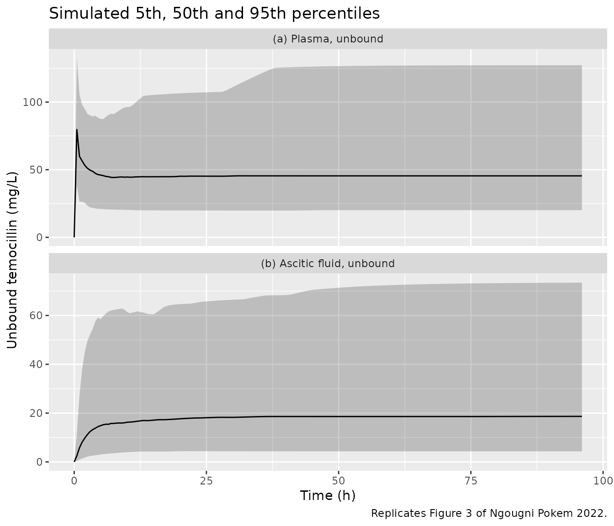
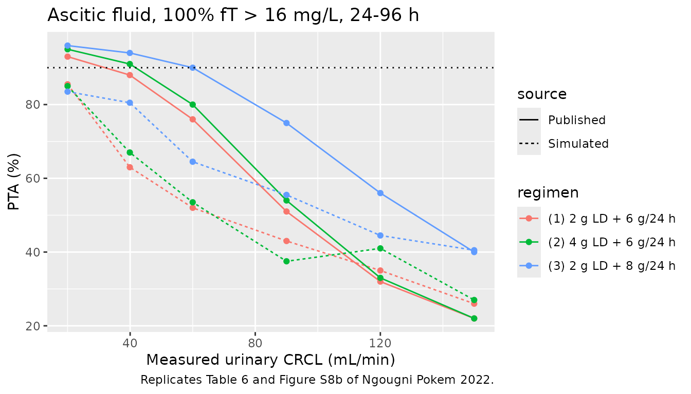

# Temocillin (Ngougni Pokem 2022)

## Model and source

- Citation: Ngougni Pokem P, Wittebole X, Collienne C,
  Rodriguez-Villalobos H, Tulkens PM, Elens L, Van Bambeke F, Laterre
  PF. Population Pharmacokinetics of Temocillin Administered by
  Continuous Infusion in Patients with Septic Shock Associated with
  Intra-Abdominal Infection and Ascitic Fluid Effusion. Antibiotics
  (Basel) 2022;11(7):898. <doi:10.3390/antibiotics11070898>. Parameter
  estimates from Table 4; model structure, covariate equation and error
  model from Supplementary Table S1 (Pmetrics model file).
- Description: Three-compartment intravenous population PK model for
  UNBOUND temocillin in plasma and ascitic fluid of critically ill
  adults with septic shock associated with complicated intra-abdominal
  infection and ascitic fluid effusion, given a 2 g loading dose over 30
  min followed by a continuous infusion of 6 g/24 h. Plasma disposition
  is two-compartment (central plus one peripheral compartment,
  parameterised with first-order distribution rate constants); a third
  compartment with its own volume represents the ascitic fluid,
  exchanging with the central compartment by first-order rate constants
  and drained by a non-renal clearance (the abdominal drain). Clearance
  from the central compartment is proportional to measured urinary
  creatinine clearance normalised to the cohort median of 39.9 mL/min.
  Fitted in Pmetrics with the non-parametric adaptive grid (NPAG)
  algorithm; the discrete joint density is approximated here by
  independent lognormal marginals centred on the published medians with
  variances from the published CV%, so the shape of the joint density is
  not recoverable from this encoding. Residual error is the Pmetrics
  lambda model on the published assay SD polynomial.
- Article: <https://doi.org/10.3390/antibiotics11070898>
- Supplement (Pmetrics model file, Table S1):
  <https://www.mdpi.com/article/10.3390/antibiotics11070898/s1>

The model describes **unbound** temocillin. The authors measured unbound
concentrations directly by ultrafiltration and modelled only those,
because temocillin protein binding is saturable and the unbound fraction
cannot be computed linearly from total concentration.

## Population

Nineteen critically ill adults in septic shock associated with a
complicated intra-abdominal infection and ascitic fluid effusion were
enrolled in the intensive care unit of the Cliniques universitaires
Saint-Luc (Brussels, Belgium). Median age was 56 years (21-74), median
weight 67 kg (45-95), and 6 patients (31.6%) were male. Renal function
was low: measured urinary creatinine clearance had a median of 39.9
mL/min (20.55-149.3). Plasma albumin was 22.3 g/L (13.7-30.8). Eleven
patients had spontaneous bacterial peritonitis (all cirrhotic), four had
secondary peritonitis, three had infected pancreatic necrosis and one
had a liver abscess (Table 1). Every patient received a 2 g loading dose
over 30 min followed by a continuous infusion of 6 g/24 h, and
contributed plasma and ascitic fluid samples between 0.5 and 96 h (114
unbound concentrations in total). Ascitic fluid was collected through
the abdominal drain.

The same information is available programmatically via
`readModelDb("NgougniPokem_2022_temocillin")()$population`.

## Source trace

| Equation / parameter | Value | Source location |
|----|----|----|
| `lvc` (V) | log(13.90) L | Table 4, V row, median |
| `lcl` (CLi) | log(2.56) L/h | Table 4, CLi row, median |
| `lk12` | log(4.62) 1/h | Table 4, K12 row, median |
| `lk21` | log(5.85) 1/h | Table 4, K21 row, median |
| `lk13` | log(0.24) 1/h | Table 4, K13 row, median |
| `lk31` | log(0.15) 1/h | Table 4, K31 row, median |
| `lv_ascites` (V3) | log(28.93) L | Table 4, V3 row, median |
| `lcl_ascites` (CL30) | log(2.94) L/h | Table 4, CL30 row, median |
| `etalvc` … `etalcl_ascites` | log(CV^2 + 1) | Table 4, CV (%) column: 29.15, 37.33, 58.47, 67.20, 110.67, 137.94, 55.87, 48.75 |
| `addSd`, `propSd` (plasma) | 0.1 mg/L, 0.1 | Table S1 \#Err, first polynomial row; Results section 2.4 |
| `addSd_Cascites`, `propSd_Cascites` | 0.1 mg/L, 0.1 | Table S1 \#Err, second polynomial row |
| `lambdaSd` | 2.26 mg/L | Table S1 \#Err, `L=2.26`; Results section 2.4 |
| `cl = CLi * (CRCL / 39.9)` | n/a | Table S1 \#Sec, `Ke = CLi*(CLCRurinary/39.9)/V`; Results section 2.4 |
| `k30 = CL30 / V3` | n/a | Table S1 \#Sec, `K30 = CL30/V3` |
| `d/dt(central)`, `d/dt(peripheral1)`, `d/dt(ascites)` | n/a | Table S1 \#Dif, XP(1)-XP(3); Figure 1 |
| `Cc = central / vc`, `Cascites = ascites / v_ascites` | n/a | Table S1 \#Out, Y(1) = X(1)/V, Y(2) = X(3)/V3 |
| Error `sqrt((C0 + C1*Y)^2 + lambda^2)` | n/a | Table S1 legend; section 4.6.1 |

## Typical-value checks against closed forms

With the random effects removed, a constant infusion at rate `R0` has an
exact steady state. The ascitic compartment’s drain adds elimination on
top of the central clearance:

- `Cc_ss = R0 / (CL + Vc * k13 * k30 / (k31 + k30))`
- `Cascites_ss / Cc_ss = k13 * Vc / ((k31 + k30) * V3)`

``` r

mod <- readModelDb("NgougniPokem_2022_temocillin")
mod_typ <- rxode2::zeroRe(mod)
#> Warning: No sigma parameters in the model

# Event helper: loading dose over 30 min into central, then a continuous
# infusion from 0.5 h. The infusion is split into 24 h records so it can run
# for as long as needed. Observation rows carry dvid = 1 and no cmt: the model
# has two error endpoints (Cc, Cascites), and a forward solve returns both
# columns at every observation time.
make_events <- function(ld_mg, inf_mg_per_day, t_end, obs_times) {
  n_inf <- ceiling((t_end - 0.5) / 24)
  doses <- tibble(
    time = c(0, 0.5 + 24 * (seq_len(n_inf) - 1)),
    amt = c(ld_mg, rep(inf_mg_per_day, n_inf)),
    rate = c(ld_mg / 0.5, rep(inf_mg_per_day / 24, n_inf)),
    evid = 1L, cmt = "central", dvid = NA_integer_
  )
  obs <- tibble(
    time = obs_times, amt = NA_real_, rate = NA_real_,
    evid = 0L, cmt = NA_character_, dvid = 1L
  )
  bind_rows(doses, obs) |> arrange(time, desc(evid))
}

ev_typ <- make_events(2000, 6000, 480, c(0.5, 24, 96, 480)) |>
  mutate(id = 1L, CRCL = 39.9)
sim_typ <- rxode2::rxSolve(mod_typ, events = ev_typ, useLinCmt = FALSE) |>
  as.data.frame()
#> ℹ omega/sigma items treated as zero: 'etalvc', 'etalcl', 'etalk12', 'etalk21', 'etalk13', 'etalk31', 'etalv_ascites', 'etalcl_ascites'

p <- c(vc = 13.90, cl = 2.56, k12 = 4.62, k21 = 5.85, k13 = 0.24,
       k31 = 0.15, v3 = 28.93, cl30 = 2.94)
k30 <- p[["cl30"]] / p[["v3"]]
r0 <- 6000 / 24
cl_drain <- p[["vc"]] * p[["k13"]] * k30 / (p[["k31"]] + k30)
css_cf <- r0 / (p[["cl"]] + cl_drain)
ratio_cf <- p[["k13"]] * p[["vc"]] / ((p[["k31"]] + k30) * p[["v3"]])

ss <- sim_typ[sim_typ$time == 480, ]
check_typ <- tibble(
  Quantity = c("Plasma Cc at steady state (mg/L)",
               "Ascitic / plasma concentration ratio at steady state",
               "Effective drain clearance from central (L/h)"),
  `Closed form` = c(css_cf, ratio_cf, cl_drain),
  `Simulated (480 h)` = c(ss$Cc, ss$Cascites / ss$Cc, NA)
)
knitr::kable(check_typ, digits = 3)
```

| Quantity | Closed form | Simulated (480 h) |
|:---|---:|---:|
| Plasma Cc at steady state (mg/L) | 63.982 | 63.982 |
| Ascitic / plasma concentration ratio at steady state | 0.458 | 0.458 |
| Effective drain clearance from central (L/h) | 1.347 | NA |

``` r


# Same parameters on both sides, so the difference is numerical error only.
stopifnot(
  abs(ss$Cc / css_cf - 1) < 1e-3,
  abs((ss$Cascites / ss$Cc) / ratio_cf - 1) < 1e-3
)
```

For a typical patient at the cohort median CRCL, the drain adds 1.35 L/h
to the 2.56 L/h central clearance. The steady-state unbound plasma
concentration is 64 mg/L. The ascitic/plasma unbound concentration ratio
of 0.46 matches the paper’s reported ascitic fluid penetration (AUC
ratio) of 46.0% (Results section 2.3). Because the unbound fractions in
plasma (56.4%) and ascitic fluid (57.4%) were nearly equal, the total
and unbound ratios coincide.

## Virtual cohort

The observed data are not public. The virtual cohort draws measured
urinary creatinine clearance from a log-normal distribution with median
39.9 mL/min, truncated to the observed range 20.55-149.3 mL/min (Table
1). The log-scale SD of 0.75 is an assumption chosen to give the
right-skewed shape the paper describes. The Discussion reports a cohort
mean of 58.1 +/- 37.4 mL/min.

``` r

set.seed(2022)
draw_crcl <- function(n) {
  x <- numeric(0)
  while (length(x) < n) {
    y <- exp(rnorm(2 * n, log(39.9), 0.75))
    x <- c(x, y[y >= 20.55 & y <= 149.3])
  }
  x[seq_len(n)]
}

n_vpc <- 200
grid <- c(seq(0, 12, by = 0.5), seq(13, 96, by = 1))
ev1 <- make_events(2000, 6000, 96, grid)
cohort <- tibble(id = seq_len(n_vpc), CRCL = draw_crcl(n_vpc))
events_vpc <- tidyr::crossing(cohort, ev1) |>
  mutate(regimen = "2 g LD + 6 g/24 h") |>
  arrange(id, time, desc(evid))

summary(cohort$CRCL)
#>    Min. 1st Qu.  Median    Mean 3rd Qu.    Max. 
#>   20.94   33.72   51.15   57.82   77.81  142.88
```

## Simulation

``` r

rxode2::rxSetSeed(2022)
sim <- rxode2::rxSolve(
  mod, events = events_vpc, keep = c("regimen", "CRCL"),
  useLinCmt = FALSE
) |> as.data.frame()
```

### Figure 3: visual predictive check

``` r

# Replicates Figure 3 of Ngougni Pokem 2022: unbound plasma (a) and ascitic
# fluid (b) after 2 g over 30 min then 6 g/24 h, 5th/50th/95th percentiles.
vpc <- sim |>
  select(id, time, Cc, Cascites) |>
  pivot_longer(c(Cc, Cascites), names_to = "matrix", values_to = "conc") |>
  mutate(matrix = recode(matrix,
                         Cc = "(a) Plasma, unbound",
                         Cascites = "(b) Ascitic fluid, unbound")) |>
  group_by(matrix, time) |>
  summarise(
    Q05 = quantile(conc, 0.05), Q50 = quantile(conc, 0.50),
    Q95 = quantile(conc, 0.95), .groups = "drop"
  )

ggplot(vpc, aes(time, Q50)) +
  geom_ribbon(aes(ymin = Q05, ymax = Q95), alpha = 0.25) +
  geom_line() +
  facet_wrap(~matrix, ncol = 1, scales = "free_y") +
  labs(x = "Time (h)", y = "Unbound temocillin (mg/L)",
       title = "Simulated 5th, 50th and 95th percentiles",
       caption = "Replicates Figure 3 of Ngougni Pokem 2022.")
```



The paper’s Figure 3 VPC simulates each enrolled patient’s own
covariates and sampling times. From 24 to 96 h its plasma median runs
between about 35 and 75 mg/L, and its ascitic-fluid median between about
17 and 35 mg/L. The simulated medians here (about 45 and 18 mg/L) fall
inside those bands. The simulated 5th percentiles stay near 20 mg/L
(plasma) and 4 mg/L (ascitic fluid). The paper’s 5th percentiles
approach zero. The approximation of the non-parametric density by
log-normal marginals changes the tails more than the centre (see
Assumptions and deviations).

### Early concentrations

``` r

early <- sim |>
  filter(time == 0.5) |>
  summarise(
    plasma_median = median(Cc), plasma_min = min(Cc), plasma_max = max(Cc),
    ascites_median = median(Cascites), ascites_min = min(Cascites),
    ascites_max = max(Cascites)
  )
tibble(
  Matrix = c("Plasma, unbound", "Ascitic fluid, unbound"),
  `Observed median (range), 30 min after LD` = c("85.9 (35.9-125.5)", "3.0 (1.0-15.7)"),
  `Simulated median (range)` = c(
    sprintf("%.1f (%.1f-%.1f)", early$plasma_median, early$plasma_min, early$plasma_max),
    sprintf("%.1f (%.1f-%.1f)", early$ascites_median, early$ascites_min, early$ascites_max)
  )
) |>
  knitr::kable(caption = "Observed values from Results section 2.3.")
```

| Matrix | Observed median (range), 30 min after LD | Simulated median (range) |
|:---|:---|:---|
| Plasma, unbound | 85.9 (35.9-125.5) | 79.7 (23.9-161.3) |
| Ascitic fluid, unbound | 3.0 (1.0-15.7) | 2.5 (0.3-25.6) |

Observed values from Results section 2.3. {.table}

``` r


stopifnot(
  # Structural: the end-of-loading-dose plasma level is set by the dose and
  # Vc/k12; a mis-transcribed volume or dose shifts it by tens of percent.
  abs(early$plasma_median / 85.9 - 1) < 0.25
)
```

## PKNCA validation

The paper reports no formal NCA table. The Discussion gives the mean
steady-state unbound plasma concentration observed in this cohort (61.8
+/- 25.7 mg/L), and Results section 2.3 gives the ascitic/plasma AUC
ratio (46.0%). PKNCA computes the average concentration over 72-96 h for
each matrix and the 0-96 h AUC used for the ratio.

``` r

doses <- events_vpc |>
  filter(evid == 1) |>
  select(id, time, amt, regimen)
dose_obj <- PKNCA::PKNCAdose(doses, amt ~ time | regimen + id)

intervals <- data.frame(
  start = c(0, 72), end = c(96, 96),
  auclast = c(TRUE, FALSE), cav = c(FALSE, TRUE)
)

# Plasma
conc_pl <- sim |>
  filter(!is.na(Cc)) |>
  select(id, time, Cc, regimen)
nca_pl <- PKNCA::pk.nca(PKNCA::PKNCAdata(
  PKNCA::PKNCAconc(conc_pl, Cc ~ time | regimen + id),
  dose_obj, intervals = intervals
))

# Ascitic fluid
conc_as <- sim |>
  filter(!is.na(Cascites)) |>
  select(id, time, Cascites, regimen)
nca_as <- PKNCA::pk.nca(PKNCA::PKNCAdata(
  PKNCA::PKNCAconc(conc_as, Cascites ~ time | regimen + id),
  dose_obj, intervals = intervals
))

# The published 61.8 mg/L is a cohort MEAN, so compare it with the mean of the
# per-subject simulated values (ncaComparisonTable() would otherwise take the
# median, which for this right-skewed exposure sits well below the mean).
cav_mean <- as.data.frame(nca_pl) |>
  filter(PPTESTCD == "cav", start == 72) |>
  group_by(regimen) |>
  summarise(cav = mean(PPORRES), .groups = "drop")
published <- tibble(regimen = "2 g LD + 6 g/24 h", cav = 61.8)
cmp <- nlmixr2lib::ncaComparisonTable(
  simulated = cav_mean,
  reference = published,
  by = "regimen",
  units = c(cav = "mg/L"),
  tolerance_pct = 20
)
knitr::kable(cmp, caption = paste(
  "Unbound plasma average concentration, 72-96 h: observed cohort mean",
  "(Discussion) vs. mean of the virtual cohort.",
  "* differs from reference by >20%."
))
```

| NCA parameter | regimen           | Reference | Simulated | % diff |
|:--------------|:------------------|:----------|:----------|:-------|
| Cavg (mg/L)   | 2 g LD + 6 g/24 h | 61.8      | 56.4      | -8.7%  |

Unbound plasma average concentration, 72-96 h: observed cohort mean
(Discussion) vs. mean of the virtual cohort. \* differs from reference
by \>20%. {.table}

``` r


# Ascitic / plasma AUC0-96 ratio, per virtual patient.
auc_ratio <- as.data.frame(nca_pl) |>
  filter(PPTESTCD == "auclast", start == 0) |>
  select(id, auc_pl = PPORRES) |>
  inner_join(
    as.data.frame(nca_as) |>
      filter(PPTESTCD == "auclast", start == 0) |>
      select(id, auc_as = PPORRES),
    by = "id"
  ) |>
  mutate(ratio = auc_as / auc_pl)

# The same ratio for the typical patient (no random effects, CRCL 39.9).
ev_typ96 <- make_events(2000, 6000, 96, grid) |>
  mutate(id = 1L, CRCL = 39.9, regimen = "2 g LD + 6 g/24 h")
sim_typ96 <- rxode2::rxSolve(mod_typ, events = ev_typ96, keep = "regimen",
                             useLinCmt = FALSE) |>
  as.data.frame() |>
  mutate(id = 1L) # a single-subject solve returns no id column
#> ℹ omega/sigma items treated as zero: 'etalvc', 'etalcl', 'etalk12', 'etalk21', 'etalk13', 'etalk31', 'etalv_ascites', 'etalcl_ascites'
dose_typ <- PKNCA::PKNCAdose(
  ev_typ96 |> filter(evid == 1) |> select(id, time, amt, regimen),
  amt ~ time | regimen + id
)
int_typ <- data.frame(start = 0, end = 96, auclast = TRUE)
auc_typ_pl <- PKNCA::pk.nca(PKNCA::PKNCAdata(
  PKNCA::PKNCAconc(sim_typ96 |> select(id, time, Cc, regimen),
                   Cc ~ time | regimen + id),
  dose_typ, intervals = int_typ
)) |> as.data.frame() |> pull(PPORRES)
auc_typ_as <- PKNCA::pk.nca(PKNCA::PKNCAdata(
  PKNCA::PKNCAconc(sim_typ96 |> select(id, time, Cascites, regimen),
                   Cascites ~ time | regimen + id),
  dose_typ, intervals = int_typ
)) |> as.data.frame() |> pull(PPORRES)
ratio_typ <- auc_typ_as / auc_typ_pl

tibble(
  Quantity = c("Typical patient (CRCL 39.9 mL/min)",
               "Virtual cohort, median (5th-95th percentile)"),
  `Published median (range)` = "46.0 (30.0-61.6)",
  `Simulated ascitic / plasma AUC0-96 (%)` = c(
    sprintf("%.1f", 100 * ratio_typ),
    sprintf("%.1f (%.1f-%.1f)", 100 * median(auc_ratio$ratio),
            100 * quantile(auc_ratio$ratio, 0.05),
            100 * quantile(auc_ratio$ratio, 0.95))
  )
) |> knitr::kable()
```

| Quantity | Published median (range) | Simulated ascitic / plasma AUC0-96 (%) |
|:---|:---|:---|
| Typical patient (CRCL 39.9 mL/min) | 46.0 (30.0-61.6) | 43.9 |
| Virtual cohort, median (5th-95th percentile) | 46.0 (30.0-61.6) | 36.2 (5.5-202.4) |

``` r


stopifnot(
  # Centre of the cohort: a mis-transcribed CL, V or covariate reference
  # moves the mean exposure by tens of percent.
  abs(cav_mean$cav / 61.8 - 1) < 0.25,
  # Deterministic typical-value ratio (no cohort draw involved).
  abs(ratio_typ - 0.46) < 0.05
)
```

For the typical patient the 0-96 h AUC ratio is slightly below the
steady-state concentration ratio of the closed-form check above. That is
expected: the ascitic compartment takes several hours to fill, and the
paper reports that peak ascitic concentrations were reached between 12
and 96 h. The virtual cohort’s median ratio is lower and its spread much
wider than the observed 30-62% range. Large CVs on K13 (111%) and K31
(138%) make individual penetration very variable under independent
log-normal marginals. That is the same limitation discussed for the PTA
below.

## Probability of target attainment (Tables 5 and 6)

The paper simulated three regimens and six CRCL values and reported the
probability that unbound concentrations stay above the MIC for the whole
window (100% fT \> MIC). Plasma was evaluated from 0 to 96 h (here from
the end of the loading infusion, 0.5 h, because concentrations are zero
at time 0). Ascitic fluid was evaluated from 24 to 96 h. Each
regimen-by-CRCL arm below has 200 virtual patients.

``` r

regimens <- tibble(
  regimen = c("(1) 2 g LD + 6 g/24 h", "(2) 4 g LD + 6 g/24 h",
              "(3) 2 g LD + 8 g/24 h"),
  ld = c(2000, 4000, 2000),
  inf = c(6000, 6000, 8000)
)
crcl_values <- c(20, 39.9, 60, 90, 120, 150)
pta_grid <- c(0.5, seq(1, 96, by = 1))
n_arm <- 200

arms <- tidyr::crossing(regimens, CRCL = crcl_values) |>
  mutate(arm = row_number())
events_pta <- lapply(seq_len(nrow(arms)), function(i) {
  tidyr::crossing(
    id = (arms$arm[i] - 1L) * n_arm + seq_len(n_arm),
    make_events(arms$ld[i], arms$inf[i], 96, pta_grid)
  ) |>
    mutate(regimen = arms$regimen[i], CRCL = arms$CRCL[i])
}) |>
  bind_rows() |>
  arrange(id, time, desc(evid))
stopifnot(!anyDuplicated(unique(events_pta[, c("id", "time", "evid")])))

rxode2::rxSetSeed(898)
sim_pta <- rxode2::rxSolve(
  mod, events = events_pta, keep = c("regimen", "CRCL"),
  useLinCmt = FALSE
) |> as.data.frame()

pta <- sim_pta |>
  group_by(regimen, CRCL, id) |>
  summarise(
    min_pl = min(Cc[time >= 0.5]),
    min_as = min(Cascites[time >= 24]),
    .groups = "drop"
  ) |>
  group_by(regimen, CRCL) |>
  summarise(
    plasma_8 = 100 * mean(min_pl > 8), plasma_16 = 100 * mean(min_pl > 16),
    ascites_8 = 100 * mean(min_as > 8), ascites_16 = 100 * mean(min_as > 16),
    .groups = "drop"
  )

published_pta <- tibble(
  regimen = rep(regimens$regimen, each = 6),
  CRCL = rep(crcl_values, 3),
  pub_plasma_8 = 100,
  pub_plasma_16 = c(98, 98, 98, 98, 98, 90, 99, 99, 99, 99, 99, 94,
                    98, 98, 98, 98, 98, 98),
  pub_ascites_8 = c(98, 97, 96, 96, 87, 73, 98, 97, 98, 96, 87, 73,
                    99, 99, 98, 98, 94, 90),
  pub_ascites_16 = c(93, 88, 76, 51, 32, 22, 95, 91, 80, 54, 33, 22,
                     96, 94, 90, 75, 56, 40)
)
pta_cmp <- inner_join(pta, published_pta, by = c("regimen", "CRCL"))

pta_cmp |>
  transmute(
    regimen, CRCL,
    plasma_16 = sprintf("%.0f (%.0f)", plasma_16, pub_plasma_16),
    ascites_8 = sprintf("%.0f (%.0f)", ascites_8, pub_ascites_8),
    ascites_16 = sprintf("%.0f (%.0f)", ascites_16, pub_ascites_16)
  ) |>
  dplyr::rename(
    "Regimen" = regimen,
    "CRCL (mL/min)" = CRCL,
    "Plasma, MIC 16" = plasma_16,
    "Ascitic fluid, MIC 8" = ascites_8,
    "Ascitic fluid, MIC 16" = ascites_16
  ) |>
  knitr::kable(caption = paste(
    "Simulated PTA (%) with the published value from Tables 5 and 6 in",
    "parentheses. Plasma PTA at MIC 8 mg/L is 100% in every published cell."
  ))
```

| Regimen | CRCL (mL/min) | Plasma, MIC 16 | Ascitic fluid, MIC 8 | Ascitic fluid, MIC 16 |
|:---|---:|:---|:---|:---|
| \(1\) 2 g LD + 6 g/24 h | 20.0 | 100 (98) | 94 (98) | 86 (93) |
| \(1\) 2 g LD + 6 g/24 h | 39.9 | 96 (98) | 84 (97) | 63 (88) |
| \(1\) 2 g LD + 6 g/24 h | 60.0 | 98 (98) | 78 (96) | 52 (76) |
| \(1\) 2 g LD + 6 g/24 h | 90.0 | 94 (98) | 74 (96) | 43 (51) |
| \(1\) 2 g LD + 6 g/24 h | 120.0 | 87 (98) | 65 (87) | 35 (32) |
| \(1\) 2 g LD + 6 g/24 h | 150.0 | 79 (90) | 52 (73) | 26 (22) |
| \(2\) 4 g LD + 6 g/24 h | 20.0 | 98 (99) | 94 (98) | 85 (95) |
| \(2\) 4 g LD + 6 g/24 h | 39.9 | 99 (99) | 88 (97) | 67 (91) |
| \(2\) 4 g LD + 6 g/24 h | 60.0 | 98 (99) | 82 (98) | 54 (80) |
| \(2\) 4 g LD + 6 g/24 h | 90.0 | 96 (99) | 64 (96) | 38 (54) |
| \(2\) 4 g LD + 6 g/24 h | 120.0 | 92 (99) | 64 (87) | 41 (33) |
| \(2\) 4 g LD + 6 g/24 h | 150.0 | 82 (94) | 59 (73) | 27 (22) |
| \(3\) 2 g LD + 8 g/24 h | 20.0 | 100 (98) | 95 (99) | 84 (96) |
| \(3\) 2 g LD + 8 g/24 h | 39.9 | 98 (98) | 94 (99) | 80 (94) |
| \(3\) 2 g LD + 8 g/24 h | 60.0 | 98 (98) | 86 (98) | 64 (90) |
| \(3\) 2 g LD + 8 g/24 h | 90.0 | 98 (98) | 82 (98) | 56 (75) |
| \(3\) 2 g LD + 8 g/24 h | 120.0 | 97 (98) | 72 (94) | 44 (56) |
| \(3\) 2 g LD + 8 g/24 h | 150.0 | 92 (98) | 60 (90) | 40 (40) |

Simulated PTA (%) with the published value from Tables 5 and 6 in
parentheses. Plasma PTA at MIC 8 mg/L is 100% in every published cell.
{.table}

``` r

# Replicates the CRCL dependence of Supplementary Figure S8 / Tables 5-6 at
# MIC 16 mg/L in ascitic fluid.
pta_cmp |>
  select(regimen, CRCL, Simulated = ascites_16, Published = pub_ascites_16) |>
  pivot_longer(c(Simulated, Published), names_to = "source", values_to = "PTA") |>
  ggplot(aes(CRCL, PTA, colour = regimen, linetype = source)) +
  geom_line() +
  geom_point() +
  geom_hline(yintercept = 90, linetype = "dotted") +
  labs(x = "Measured urinary CRCL (mL/min)", y = "PTA (%)",
       title = "Ascitic fluid, 100% fT > 16 mg/L, 24-96 h",
       caption = "Replicates Table 6 and Figure S8b of Ngougni Pokem 2022.")
```



``` r

r1 <- pta_cmp |> filter(regimen == regimens$regimen[1])
stopifnot(
  # Plasma, MIC 8: the paper reports 100% everywhere.
  min(pta_cmp$plasma_8) > 90,
  # Ascitic fluid, MIC 16, regimen (1): the paper's PTA falls by 71 points
  # from CRCL 20 to 150 mL/min; renal function is the dominant driver.
  r1$ascites_16[r1$CRCL == 20] - r1$ascites_16[r1$CRCL == 150] > 30,
  # Envelope against Table 6 (known deviation; see below).
  median(abs(pta_cmp$ascites_16 - pta_cmp$pub_ascites_16)) < 25
)
```

In plasma, the simulated PTA matches Table 5 up to a CRCL of about 90
mL/min. At 120-150 mL/min and MIC 16 mg/L it falls 5-15 points below the
published 90-98%. In ascitic fluid, the simulated PTA falls with CRCL as
Table 6 does, but in most cells it runs 5-25 points below the published
values. The exception is MIC 16 mg/L at 120-150 mL/min, where simulated
and published PTA are both low and close together. The simulated MIC 16
curve is therefore flatter than the published one. This is the expected
signature of replacing the NPAG non-parametric joint density with
independent log-normal marginals. With CVs of 111% and 138% on K13 and
K31, the log-normal puts more patients in the low-penetration tail than
the discrete support points do. The published PTA could not be
reproduced from the Table 4 summary statistics with either the mean or
the median column (see below). It is recorded as a known deviation.

## Assumptions and deviations

- **Median vs. mean column of Table 4.** Pmetrics summarises each NPAG
  marginal by its mean, SD, CV% and median. The mean and median differ
  almost two-fold for K13 (0.42 vs 0.24 1/h) and K31 (0.33 vs 0.15 1/h).
  The maintainers encoded the medians, which are the centre of a
  log-normal marginal. Re-simulating Tables 5 and 6 (1000 virtual
  patients per arm, log-normal marginals with omega^2 = log(CV^2 + 1))
  did not discriminate. The mean absolute difference from Table 6 was
  15.1 / 11.9 points (MIC 8 / 16) with the means and 16.0 / 12.3 with
  the medians. The paper’s text quotes neither column. Both columns give
  the same steady-state ascitic/plasma ratio (0.47 with the means, 0.46
  with the medians).
- **Between-subject variability.** The non-parametric joint density is
  approximated by independent log-normal marginals whose CV equals the
  Table 4 CV%. No parameter correlations were published. Shrinkage was
  small (0.01-6.7%, Table 4).
- **Error model.** Table S1 gives the Pmetrics lambda model with the
  assay SD polynomial `SD = 0.1 + 0.1*Y` for both outputs and
  `lambda = 2.26`. The printed formula reads `Error = (SD + L^2)^0.5`.
  The maintainers read it as the Pmetrics additive lambda model,
  `(SD^2 + lambda^2)^0.5`, with the exponent on SD lost in typesetting.
  Pmetrics evaluates the polynomial at the observed concentration; this
  encoding evaluates it at the prediction, as is needed for simulation.
- **Covariate model.** The central clearance is proportional to measured
  urinary creatinine clearance through the origin, exactly as in Table
  S1 (`Ke = CLi*(CLCRurinary/39.9)/V`). This differs from the base-model
  regression in Figure S5 (individual CL = 1.22 + 0.06 x CLCR), which
  has an intercept. The model therefore has no non-renal central
  clearance, and it should not be used for patients with CRCL near zero.
  The `CRCL` column must be a raw measured (urine-collection) creatinine
  clearance in mL/min, not a BSA-normalised or Cockcroft-Gault estimate.
- **Sex on CL30.** Table 4 footnote b reports a post-hoc difference in
  individual CL30 between females (3.04 L/h) and males (1.38 L/h). This
  was not part of the population model and is not encoded (it is listed
  in `covariatesDataExcluded`).
- **Ascitic fluid compartment.** The compartment is named `ascites` and
  declared as a paper-specific compartment. Its specimen is recorded as
  `tissue` because the specimen vocabulary has no ascitic or peritoneal
  fluid entry.
- **Virtual cohort.** The CRCL distribution (log-normal, median 39.9
  mL/min, log-SD 0.75, truncated to 20.55-149.3 mL/min) is an assumption
  that matches the reported median and range. The PTA tables use fixed
  CRCL values, as in the paper.
- **Errata.** No correction notice linked to this article was found in
  Europe PMC as of 2026-10-03.
