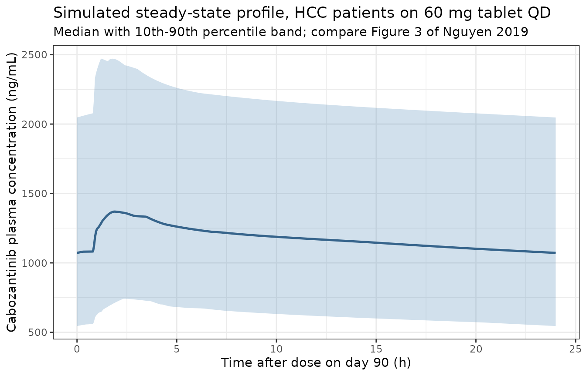

# Cabozantinib, updated integrated model with hepatocellular carcinoma and liver dysfunction (Nguyen 2019)

## Model and source

- Citation: Nguyen L, Chapel S, Tran BD, Lacy S. Updated population
  pharmacokinetic model of cabozantinib integrating various cancer types
  including hepatocellular carcinoma. J Clin Pharmacol.
  2019;59(11):1551-1561. <doi:10.1002/jcph.1467>.
- Article: <https://doi.org/10.1002/jcph.1467>

This paper refits the earlier integrated cabozantinib population PK
model of Lacy 2018 (packaged as `Lacy_2018_cabozantinib`) after adding
hepatocellular carcinoma (HCC) concentration data from the phase 2
randomized discontinuation trial XL184-203 and the phase 3 CELESTIAL
trial XL184-309. The pooled analysis grows from 1534 subjects across
nine studies to **2023 subjects across ten studies**, of whom **489 have
HCC**.

The paper reports **two** fitted models side by side in Table 3, and
both are packaged:

| Model | Table 3 column | Role |
|----|----|----|
| `Nguyen_2019_cabozantinib` | 1, “Including HCC Population” | The authors’ **final** updated integrated model (Table 3 footnote a) |
| `Nguyen_2019_cabozantinib_liver_dysfunction` | 2, “Including HCC Population and Liver Dysfunction Covariates” | Adds four NCI-ODWG hepatic-impairment parameters on CL/F and Vc/F |

The second model is the one that answers the paper’s motivating
question, and every one of its parameters is tabulated, so it is
packaged even though the authors did not adopt it as final. Their reason
for not adopting it is quoted in Results: the four extra parameters
“dropped the objective function by approximately 10 units, and the
difference in parameter estimates was \< 15% with and without liver
dysfunction covariates”, so “The initial model including the
hepatocellular carcinoma population was considered the final updated
integrated PPK model.”

Both models share one structure: a fraction `F1` of each oral dose
enters `depot1` and is absorbed first-order at rate `Ka` after a lag
`ALAG1`, while the remaining `(1 - F1)` is delivered to `central` by a
parallel zero-order process of duration `D2`. `Ka` carries a power
effect of dose and a capsule-formulation effect; overall relative oral
bioavailability carries a capsule effect. Disposition is two-compartment
with first-order elimination.

``` r

mod_final <- readModelDb("Nguyen_2019_cabozantinib")
mod_ld <- readModelDb("Nguyen_2019_cabozantinib_liver_dysfunction")

ui_final <- rxode2::rxode(mod_final)
#> ℹ parameter labels from comments will be replaced by 'label()'
ui_ld <- rxode2::rxode(mod_ld)
#> ℹ parameter labels from comments will be replaced by 'label()'

# The paper's structure is an explicit ODE system; confirm rxode2 did not
# silently substitute its analytic 2-compartment solution for it, which would
# discard the parallel zero-order absorption leg entirely.
stopifnot(is.null(ui_final$linCmt) || isFALSE(ui_final$linCmt))
```

### A transformation convention that differs from the predecessor model

Table 3 reports **transformed** estimates throughout. Its unnumbered
footnote reads “Transformed estimate is a PK parameter obtained by
exponentiating the original estimate”, footnote b adds “Anti-logit
transformation was used to obtain F1”, and footnote c states that “For
categorical covariates (eg, capsule), transformed estimates correspond
to **multiplicative** change from the typical PK parameter.”

This matters because the predecessor Lacy 2018 table reported the same
categorical covariate effects as untransformed **fractional** changes.
The two papers therefore encode the same covariates differently, and
reading Nguyen 2019’s numbers with Lacy 2018’s convention would be a
silent error. Four independent cross-checks against Nguyen 2019’s own
prose confirm the multiplicative reading:

| Table 3 value | Paper’s prose | Implied by multiplicative reading |
|----|----|----|
| Female on CL/F = 0.76 | “The CL/F estimate was 24% lower in women” | 1 - 0.76 = 24% lower |
| MTC on CL/F = 1.9 | “MTC patients are predicted to have a 90% larger CL/F” | 1.9 - 1 = 90% larger |
| HCC on CL/F = 0.878 | “12% lower CL/F” | 1 - 0.878 = 12.2% lower |
| RCC on CL/F = 0.87 | “comparable to 13% lower in RCC” | 1 - 0.87 = 13% lower |

All four agree to the precision the prose is stated in. The models
encode the effects as `factor^indicator`, so an indicator of 0
contributes exactly 1.

Continuous covariates are **not** marked with footnote c, and the age
and weight effects on CL/F are negative, which an exponentiated estimate
cannot be. They are therefore the raw power exponents of the centered
power model described in Methods, and are encoded as
`(AGE / 64)^e_age_cl` and `(WT / 78)^e_wt_cl`.

## Population

``` r

pop <- ui_final$population
tibble::tibble(
  Field = names(pop),
  Value = vapply(pop, \(x) paste(as.character(x), collapse = "; "), character(1))
) |>
  knitr::kable(caption = "Population metadata for Nguyen_2019_cabozantinib (Nguyen 2019 Tables 1-2).")
```

| Field | Value |
|:---|:---|
| species | human |
| n_subjects | 2023 |
| n_observations | 9510 |
| n_studies | 10 |
| age_range | 18-87 years |
| age_median | 64 years (All Studies column, Nguyen 2019 Table 2) |
| weight_range | 30.4-190.7 kg |
| weight_median | 78 kg (All Studies column, Nguyen 2019 Table 2) |
| sex_female_pct | 15.7 |
| race_ethnicity | White 77%, Asian 10%, Black 3%, Other 2%, unknown 8% (Nguyen 2019 Table 2, All Studies) |
| disease_state | Pooled population: healthy volunteers (7%); castration-resistant prostate cancer (41%); hepatocellular carcinoma (24%); renal cell carcinoma (14%); medullary thyroid cancer (10%); glioblastoma multiforme (2%); other malignancies (2%). |
| hepatic_function | Per NCI-ODWG criteria: normal 1425 (70%); mild 558 (28%); moderate 15 (1%); severe 1 (\<1%); missing 24 (1%). Of the hepatocellular carcinoma patients, 99% were Child-Pugh A. |
| dose_range | Oral cabozantinib free base equivalent; 100 mg once daily capsule in the phase 2 RDT and 60 mg once daily tablet in CELESTIAL, pooled with the wider 20-200 mg/day range of the earlier integrated analysis. |
| regions | Multinational; the two hepatocellular carcinoma studies enrolled 33-35% Asian subjects (Nguyen 2019 Table 2) |
| formulations | Capsule 648 subjects (32%) and tablet 1375 subjects (68%) (Nguyen 2019 Table 2, All Studies). |
| studies | XL184-203 (phase 2 randomized discontinuation trial, HCC cohort, 100 mg QD capsule, n=37); XL184-309 CELESTIAL (phase 3, HCC after prior sorafenib, 60 mg QD tablet, n=452); Eight further studies carried over from the prior integrated analysis (phase 1 in advanced malignancies, two phase 1 studies in healthy volunteers, phase 2 in glioblastoma and in CRPC, phase 3 in MTC, CRPC and RCC); enumerated in Nguyen 2019 Supplementary Table S1 |
| notes | Baseline demographics from Nguyen 2019 Table 2. Bioanalysis by validated LC-MS/MS with a 0.5 ng/mL lower limit of quantification. The two hepatocellular carcinoma studies contributed sparse sampling only: predose troughs at the end of even weeks in XL184-203, and samples 8 or more hours after the previous dose at the week 3, 5 and 9 visits in CELESTIAL (Table 1). Percent female is computed as 317 / 2023; Table 2 rounds this to 16%. |

Population metadata for Nguyen_2019_cabozantinib (Nguyen 2019 Tables
1-2). {.table}

The updated analysis pooled 9510 quantifiable cabozantinib
concentrations from 2023 subjects across ten studies. Median age was 64
years (range 18-87) and median body weight 78 kg (range 30.4-190.7); 84%
were male and 77% White. Per NCI-ODWG criteria, 70% had normal liver
function and 28% mild liver dysfunction, with only 15 moderate and 1
severe subject in the entire pooled dataset. Roughly one third of the
data came from the capsule formulation and two thirds from the tablet.

Both HCC studies contributed **sparse** sampling only: predose troughs
at the end of even weeks in XL184-203, and samples taken 8 or more hours
after the previous dose at the week 3, 5 and 9 visits in CELESTIAL
(Table 1). There is no dense single-dose profile in the HCC data, and
the paper reports **no NCA table** of its own, which shapes the
validation strategy below.

## Source trace

Every `ini()` value in both packaged models comes from Nguyen 2019 Table
3. The two columns of that table are the only parameter source; no
supplement, erratum or external value was used. An automated check
confirms the in-file source-trace comments cite Table 3 on every
parameter line.

``` r

trace_tbl <- function(nm) {
  src <- readLines(system.file(
    file.path("modeldb", "specificDrugs", paste0(nm, ".R")),
    package = "nlmixr2lib"
  ))
  if (!length(src)) {
    src <- readLines(file.path("..", "..", "inst", "modeldb", "specificDrugs",
                               paste0(nm, ".R")))
  }
  src
}

src_final <- trace_tbl("Nguyen_2019_cabozantinib")
src_ld <- trace_tbl("Nguyen_2019_cabozantinib_liver_dysfunction")

# Each estimated parameter must carry a source comment naming Table 3. The
# repo's air formatting puts label() and its trailing comment on the line AFTER
# the assignment, so the citation is searched across the assignment line and
# the line that follows it.
cited <- function(src) {
  ini_block <- src[seq(grep("^\\s*ini\\(\\{", src)[1],
                       grep("^\\s*model\\(\\{", src)[1])]
  idx <- grep("<-\\s*(log\\(|fixed\\()?-?[0-9]|~\\s*(c\\()?[0-9]", ini_block)
  idx <- idx[!grepl("^\\s*#", ini_block[idx])]
  has_cite <- vapply(idx, function(i) {
    any(grepl("Table 3", ini_block[intersect(c(i, i + 1L), seq_along(ini_block))]))
  }, logical(1))
  list(n = length(idx), n_cited = sum(has_cite),
       missing = ini_block[idx[!has_cite]])
}

ct_final <- cited(src_final)
ct_ld <- cited(src_ld)

tibble::tibble(
  Model = c("Nguyen_2019_cabozantinib", "Nguyen_2019_cabozantinib_liver_dysfunction"),
  `Table 3 column` = c("1 (final)", "2 (liver dysfunction)"),
  `ini() parameter lines` = c(ct_final$n, ct_ld$n),
  `citing Table 3` = c(ct_final$n_cited, ct_ld$n_cited)
) |>
  knitr::kable(caption = "Source-trace coverage of the ini() blocks.")
```

| Model | Table 3 column | ini() parameter lines | citing Table 3 |
|:---|:---|---:|---:|
| Nguyen_2019_cabozantinib | 1 (final) | 39 | 39 |
| Nguyen_2019_cabozantinib_liver_dysfunction | 2 (liver dysfunction) | 43 | 43 |

Source-trace coverage of the ini() blocks. {.table}

``` r


# A gate that can go red: every parameter line must cite Table 3, and there
# must actually BE parameter lines to check (guards the vacuous-pass failure).
stopifnot(
  ct_final$n > 30, ct_ld$n > 30,
  ct_final$n_cited == ct_final$n,
  ct_ld$n_cited == ct_ld$n
)
```

Selected structural values, both columns of Table 3:

| Parameter | Final model (col 1) | Liver-dysfunction model (col 2) |
|----|----|----|
| `Ka` (1/h) | 1.24 (0.849, 1.8) | 1.23 (0.833, 1.82) |
| `D2`, zero-order duration (h) | 2.48 (2.2, 2.8) | 2.53 (2.25, 2.84) |
| `CL/F` (L/h) | 2.48 (2.27, 2.71) | 2.47 (2.26, 2.7) |
| `Vc/F` (L) | 212 (180, 250) | 214 (181, 251) |
| `Q/F` (L/h) | 30.0 (27.3, 33) | 30.2 (27.6, 33.1) |
| `Vp/F` (L) | 177 (165, 189) | 179 (167, 191) |
| `ALAG1` (h) | 0.821 (0.795, 0.848) | 0.82 (0.795, 0.846) |
| `F1` | 0.83 (0.80, 0.87) | 0.83 (0.80, 0.87) |
| Dose-dependent `Ka` exponent | 0.734 (0.331, 1.14) | 0.564 (0.138, 0.989) |
| `sigma^2` | 0.127 | 0.127 |
| `omega^2` CL/F | 0.213 | 0.210 |
| `omega^2` CL/F:Vc/F | 0.211 | 0.199 |
| `omega^2` Vc/F | 0.443 | 0.430 |
| `omega^2` Ka | 2.02 | 2.21 |
| `omega^2` F1 (logit scale) | 2.55 | 2.73 |

### The CL/Vc covariance is admissible in this model

Results states that inter-individual variability was “approximately 46%
for CL/F and 67% for Vc/F”. The table’s omega values are log-scale
variances, and `sqrt(0.213) = 0.462` and `sqrt(0.443) = 0.666` reproduce
both figures, which confirms the scale on which they are reported.

The `omega^2 CL/F:Vc/F` row is the OMEGA block off-diagonal covariance.
Unlike the corresponding value in the predecessor Lacy 2018 model, which
was not admissible and had to be dropped, this one satisfies
Cauchy-Schwarz and is carried faithfully.

``` r

omega_check <- tibble::tibble(
  Model = c("final", "liver dysfunction"),
  var_cl = c(0.213, 0.210),
  cov_cl_vc = c(0.211, 0.199),
  var_vc = c(0.443, 0.430)
) |>
  dplyr::mutate(
    max_admissible_cov = sqrt(var_cl * var_vc),
    correlation = cov_cl_vc / max_admissible_cov,
    `CV% CL/F` = 100 * sqrt(var_cl),
    `CV% Vc/F` = 100 * sqrt(var_vc)
  )

omega_check |>
  dplyr::mutate(dplyr::across(where(is.numeric), \(x) round(x, 3))) |>
  knitr::kable(caption = "Cauchy-Schwarz admissibility of the published CL/Vc covariance, and the CV% it implies.")
```

| Model | var_cl | cov_cl_vc | var_vc | max_admissible_cov | correlation | CV% CL/F | CV% Vc/F |
|:---|---:|---:|---:|---:|---:|---:|---:|
| final | 0.213 | 0.211 | 0.443 | 0.307 | 0.687 | 46.152 | 66.558 |
| liver dysfunction | 0.210 | 0.199 | 0.430 | 0.300 | 0.662 | 45.826 | 65.574 |

Cauchy-Schwarz admissibility of the published CL/Vc covariance, and the
CV% it implies. {.table}

``` r


# Deterministic arithmetic on published constants: a tight bound is correct.
stopifnot(
  all(omega_check$correlation > 0), all(omega_check$correlation < 1),
  # Reproduces the paper's own "approximately 46% ... and 67%" statement.
  abs(omega_check$`CV% CL/F`[1] - 46) < 1,
  abs(omega_check$`CV% Vc/F`[1] - 67) < 1
)
```

## Dosing the parallel absorption structure

Because the dose splits across two compartments, each dose event expands
to **two rows** with the same `amt`: one targeting `depot1` (ordinary
oral record) and one targeting `central`. The `central` row **must**
carry `rate = -2` so that `dur(central) <- d2` is honoured; without it
rxode2 treats the row as a bolus and the zero-order leg silently
disappears. The `f()` multipliers inside `model()` split the nominal
amount into the `F1` and `(1 - F1)` fractions.

Observation rows target `cmt = "central"`, the ODE state. rxode2 returns
the algebraic observable `Cc` as a column on those rows automatically;
naming the observable as a compartment would inject an extra slot and
renumber the states.

``` r

COVS <- c("AGE", "WT", "SEXF", "RACE_BLACK", "RACE_ASIAN", "RACE_OTHER",
          "TUMTP_HCC", "TUMTP_RCC", "TUMTP_HRPC", "TUMTP_MTC", "TUMTP_GLIO",
          "TUMTP_OTHER", "FORM_CAPSULE", "DOSE")
COVS_LD <- c(COVS, "HEPIMP_MILD", "HEPIMP_MODSEV")

build_events <- function(cohort, dose_times, obs_times, covs) {
  dose_rows <- cohort |>
    tidyr::crossing(time = dose_times, cmt = c("depot1", "central")) |>
    dplyr::mutate(evid = 1L, amt = .data$dose_mg,
                  rate = ifelse(.data$cmt == "central", -2, 0))
  obs_rows <- cohort |>
    tidyr::crossing(time = obs_times) |>
    dplyr::mutate(evid = 0L, amt = 0, cmt = "central", rate = 0)
  dplyr::bind_rows(dose_rows, obs_rows) |>
    dplyr::select(dplyr::all_of(c("id", "time", "evid", "amt", "cmt", "rate",
                                  "stratum", "dose_mg", covs))) |>
    dplyr::arrange(.data$id, .data$time, dplyr::desc(.data$evid))
}

# Ninety daily doses. The typical terminal half-life is about 4.5 days, so this
# is roughly twenty half-lives and steady state is reached with wide margin;
# the steady-state attainment is asserted numerically below rather than assumed.
N_DAYS <- 90L
TAU <- 24
dose_times <- seq(0, by = TAU, length.out = N_DAYS)
t_last <- max(dose_times)
# Two consecutive intervals, so steady state can be tested by comparing them.
t_prev <- t_last - TAU
ss_grid <- sort(unique(c(seq(t_prev, t_last + TAU, by = 0.1), t_prev, t_last)))
```

## Check 1: the covariate multipliers are reproduced exactly

The scientific content of Table 3 is its covariate multipliers, so the
first and strictest check recomputes each one from the model. A
deterministic typical-value solve (`omega = NA`) is used, one stratum
per covariate, each differing from the reference condition in exactly
one covariate. Because both sides use identical parameters, this
comparison carries no Monte Carlo noise and is asserted to machine
precision.

The reference condition is the paper’s own (Methods, “Covariate
Effects”): a healthy White male receiving a 60 mg free base equivalent
tablet once daily. The extreme age and weight values are the paper’s
stated 5th and 95th percentiles of the updated dataset, “age 37 and 79
years; weight 54 and 109 kg”.

``` r

ref_row <- tibble::tibble(
  AGE = 64, WT = 78, SEXF = 0, RACE_BLACK = 0, RACE_ASIAN = 0, RACE_OTHER = 0,
  TUMTP_HCC = 0, TUMTP_RCC = 0, TUMTP_HRPC = 0, TUMTP_MTC = 0, TUMTP_GLIO = 0,
  TUMTP_OTHER = 0, FORM_CAPSULE = 0, DOSE = 60
)

make_stratum <- function(label, ...) {
  dplyr::mutate(ref_row, stratum = label, ...)
}

strata <- dplyr::bind_rows(
  make_stratum("Reference (HV, White, male, tablet 60 mg, 64 y, 78 kg)"),
  make_stratum("Female", SEXF = 1),
  make_stratum("Black", RACE_BLACK = 1),
  make_stratum("Asian", RACE_ASIAN = 1),
  make_stratum("Other race", RACE_OTHER = 1),
  make_stratum("HCC", TUMTP_HCC = 1),
  make_stratum("RCC", TUMTP_RCC = 1),
  make_stratum("CRPC", TUMTP_HRPC = 1),
  make_stratum("MTC", TUMTP_MTC = 1),
  make_stratum("GB", TUMTP_GLIO = 1),
  make_stratum("Other malignancy", TUMTP_OTHER = 1),
  make_stratum("Capsule", FORM_CAPSULE = 1),
  make_stratum("Age 37 y (5th pct)", AGE = 37),
  make_stratum("Age 79 y (95th pct)", AGE = 79),
  make_stratum("Weight 54 kg (5th pct)", WT = 54),
  make_stratum("Weight 109 kg (95th pct)", WT = 109)
) |>
  dplyr::mutate(id = dplyr::row_number(), dose_mg = .data$DOSE)

ev_strata <- build_events(strata, dose_times, ss_grid, COVS)

sim_strata <- rxode2::rxSolve(
  mod_final, events = ev_strata, omega = NA,
  keep = c("stratum", COVS)
) |>
  as.data.frame()
#> ℹ parameter labels from comments will be replaced by 'label()'
#> Warning: multi-subject simulation without without 'omega'

# Individual parameters are returned as columns; one value per stratum.
par_strata <- sim_strata |>
  dplyr::group_by(id, stratum) |>
  dplyr::summarise(cl = mean(cl), vc = mean(vc), ka = mean(ka),
                   fdepot = mean(fdepot), .groups = "drop")

ref_par <- par_strata |> dplyr::filter(grepl("^Reference", stratum))
stopifnot(nrow(ref_par) == 1L)
```

``` r

published <- tibble::tribble(
  ~stratum,             ~param, ~published,
  "Female",             "cl",   0.76,
  "Female",             "vc",   1.1,
  "Black",              "cl",   1.18,
  "Black",              "vc",   1.05,
  "Asian",              "cl",   0.935,
  "Asian",              "vc",   0.696,
  "Other race",         "cl",   1.03,
  "Other race",         "vc",   0.882,
  "HCC",                "cl",   0.878,
  "HCC",                "vc",   0.847,
  "RCC",                "cl",   0.87,
  "RCC",                "vc",   0.656,
  "CRPC",               "cl",   0.989,
  "CRPC",               "vc",   0.743,
  "MTC",                "cl",   1.9,
  "MTC",                "vc",   0.936,
  "GB",                 "cl",   1.2,
  "GB",                 "vc",   0.479,
  "Other malignancy",   "cl",   1.19,
  "Other malignancy",   "vc",   0.762,
  "Capsule",            "ka",   0.402,
  "Capsule",            "fdepot", 0.847
) |>
  dplyr::mutate(source = "Nguyen 2019 Table 3, column 1")

# Continuous covariates: the published number is a power exponent, so the
# expected multiplier is (value / reference)^exponent.
published_cont <- tibble::tribble(
  ~stratum,                   ~param, ~published,
  "Age 37 y (5th pct)",       "cl",   (37 / 64)^-0.157,
  "Age 37 y (5th pct)",       "vc",   (37 / 64)^0.0644,
  "Age 79 y (95th pct)",      "cl",   (79 / 64)^-0.157,
  "Age 79 y (95th pct)",      "vc",   (79 / 64)^0.0644,
  "Weight 54 kg (5th pct)",   "cl",   (54 / 78)^-0.0393,
  "Weight 54 kg (5th pct)",   "vc",   (54 / 78)^1.19,
  "Weight 109 kg (95th pct)", "cl",   (109 / 78)^-0.0393,
  "Weight 109 kg (95th pct)", "vc",   (109 / 78)^1.19
) |>
  dplyr::mutate(source = "power model on Table 3 exponent")

expected <- dplyr::bind_rows(published, published_cont)

observed <- par_strata |>
  tidyr::pivot_longer(c(cl, vc, ka, fdepot), names_to = "param",
                      values_to = "value") |>
  dplyr::left_join(
    ref_par |>
      tidyr::pivot_longer(c(cl, vc, ka, fdepot), names_to = "param",
                          values_to = "ref_value") |>
      dplyr::select(param, ref_value),
    by = "param"
  ) |>
  dplyr::mutate(simulated = value / ref_value)

mult_cmp <- expected |>
  dplyr::inner_join(observed |> dplyr::select(stratum, param, simulated),
                    by = c("stratum", "param")) |>
  dplyr::mutate(abs_err = abs(simulated - published))

# Guard against the vacuous pass: the join must have matched every row.
stopifnot(nrow(mult_cmp) == nrow(expected), nrow(mult_cmp) == 30L)

mult_cmp |>
  dplyr::transmute(
    Stratum = stratum,
    Parameter = param,
    Published = round(published, 4),
    Simulated = round(simulated, 4),
    `Abs. error` = signif(abs_err, 3),
    Source = source
  ) |>
  knitr::kable(caption = "Covariate multipliers recomputed from a deterministic typical-value solve against Nguyen 2019 Table 3, column 1.")
```

| Stratum | Parameter | Published | Simulated | Abs. error | Source |
|:---|:---|---:|---:|---:|:---|
| Female | cl | 0.7600 | 0.7600 | 0 | Nguyen 2019 Table 3, column 1 |
| Female | vc | 1.1000 | 1.1000 | 0 | Nguyen 2019 Table 3, column 1 |
| Black | cl | 1.1800 | 1.1800 | 0 | Nguyen 2019 Table 3, column 1 |
| Black | vc | 1.0500 | 1.0500 | 0 | Nguyen 2019 Table 3, column 1 |
| Asian | cl | 0.9350 | 0.9350 | 0 | Nguyen 2019 Table 3, column 1 |
| Asian | vc | 0.6960 | 0.6960 | 0 | Nguyen 2019 Table 3, column 1 |
| Other race | cl | 1.0300 | 1.0300 | 0 | Nguyen 2019 Table 3, column 1 |
| Other race | vc | 0.8820 | 0.8820 | 0 | Nguyen 2019 Table 3, column 1 |
| HCC | cl | 0.8780 | 0.8780 | 0 | Nguyen 2019 Table 3, column 1 |
| HCC | vc | 0.8470 | 0.8470 | 0 | Nguyen 2019 Table 3, column 1 |
| RCC | cl | 0.8700 | 0.8700 | 0 | Nguyen 2019 Table 3, column 1 |
| RCC | vc | 0.6560 | 0.6560 | 0 | Nguyen 2019 Table 3, column 1 |
| CRPC | cl | 0.9890 | 0.9890 | 0 | Nguyen 2019 Table 3, column 1 |
| CRPC | vc | 0.7430 | 0.7430 | 0 | Nguyen 2019 Table 3, column 1 |
| MTC | cl | 1.9000 | 1.9000 | 0 | Nguyen 2019 Table 3, column 1 |
| MTC | vc | 0.9360 | 0.9360 | 0 | Nguyen 2019 Table 3, column 1 |
| GB | cl | 1.2000 | 1.2000 | 0 | Nguyen 2019 Table 3, column 1 |
| GB | vc | 0.4790 | 0.4790 | 0 | Nguyen 2019 Table 3, column 1 |
| Other malignancy | cl | 1.1900 | 1.1900 | 0 | Nguyen 2019 Table 3, column 1 |
| Other malignancy | vc | 0.7620 | 0.7620 | 0 | Nguyen 2019 Table 3, column 1 |
| Capsule | ka | 0.4020 | 0.4020 | 0 | Nguyen 2019 Table 3, column 1 |
| Capsule | fdepot | 0.8470 | 0.8470 | 0 | Nguyen 2019 Table 3, column 1 |
| Age 37 y (5th pct) | cl | 1.0898 | 1.0898 | 0 | power model on Table 3 exponent |
| Age 37 y (5th pct) | vc | 0.9653 | 0.9653 | 0 | power model on Table 3 exponent |
| Age 79 y (95th pct) | cl | 0.9675 | 0.9675 | 0 | power model on Table 3 exponent |
| Age 79 y (95th pct) | vc | 1.0137 | 1.0137 | 0 | power model on Table 3 exponent |
| Weight 54 kg (5th pct) | cl | 1.0146 | 1.0146 | 0 | power model on Table 3 exponent |
| Weight 54 kg (5th pct) | vc | 0.6456 | 0.6456 | 0 | power model on Table 3 exponent |
| Weight 109 kg (95th pct) | cl | 0.9869 | 0.9869 | 0 | power model on Table 3 exponent |
| Weight 109 kg (95th pct) | vc | 1.4892 | 1.4892 | 0 | power model on Table 3 exponent |

Covariate multipliers recomputed from a deterministic typical-value
solve against Nguyen 2019 Table 3, column 1. {.table}

``` r


# Deterministic: both sides use identical parameters, so the only error is
# floating point. A tight bound is correct here and catches any transcription
# or encoding error immediately.
stopifnot(max(mult_cmp$abs_err) < 1e-8)
```

All 30 multipliers reproduce to better than 1e-8. This confirms the
multiplicative footnote-c encoding, the power form and centering values
for age and weight, and the reference-category assignment for every
categorical covariate.

## Check 2: steady-state mass balance, by PKNCA

For a linear model at steady state,
`CL/F * AUC(0-tau),ss = Dose * F_rel`, where `F_rel` is the overall
relative bioavailability (1 for the tablet reference, 0.847 for the
capsule). This is a true identity and is independent of how the dose
splits between the first-order and zero-order absorption legs, so it
validates the disposition and bioavailability encoding but deliberately
says nothing about absorption. Absorption is exercised separately in
Check 3.

NCA is done with PKNCA over the final dosing interval. The preceding
interval is also computed so that steady-state attainment is measured
rather than assumed.

``` r

conc_strata <- sim_strata |>
  dplyr::filter(!is.na(Cc)) |>
  dplyr::select(id, time, Cc, stratum)

dose_strata <- ev_strata |>
  dplyr::filter(evid == 1, cmt == "depot1") |>
  dplyr::select(id, time, amt, stratum)

conc_obj <- PKNCA::PKNCAconc(conc_strata, Cc ~ time | stratum + id,
                             concu = "ng/mL", timeu = "h")
dose_obj <- PKNCA::PKNCAdose(dose_strata, amt ~ time | stratum + id,
                             doseu = "mg")

intervals_ss <- data.frame(
  start = c(t_prev, t_last),
  end = c(t_last, t_last + TAU),
  auclast = TRUE, cmax = TRUE, cmin = TRUE, cav = TRUE, tmax = TRUE
)

nca_strata <- PKNCA::pk.nca(
  PKNCA::PKNCAdata(conc_obj, dose_obj, intervals = intervals_ss)
)

nca_tbl <- as.data.frame(nca_strata$result)
stopifnot(nrow(nca_tbl) > 0)
```

``` r

auc_by_interval <- nca_tbl |>
  dplyr::filter(PPTESTCD == "auclast") |>
  dplyr::select(stratum, start, PPORRES) |>
  tidyr::pivot_wider(names_from = start, values_from = PPORRES,
                     names_prefix = "t") |>
  dplyr::rename(auc_prev = !!paste0("t", t_prev),
                auc_last = !!paste0("t", t_last)) |>
  dplyr::mutate(ss_ratio = auc_last / auc_prev)

stopifnot(nrow(auc_by_interval) == nrow(strata))

# Deterministic solve, so this is numerical convergence, not sampling noise.
# At ~20 terminal half-lives the two consecutive intervals should be
# indistinguishable.
stopifnot(max(abs(auc_by_interval$ss_ratio - 1)) < 1e-3)
```

``` r

mass_balance <- nca_tbl |>
  dplyr::filter(PPTESTCD == "auclast", start == t_last) |>
  dplyr::select(stratum, auc_tau = PPORRES) |>
  dplyr::left_join(par_strata, by = "stratum") |>
  dplyr::mutate(
    # Cc is in ng/mL and cl in L/h, so cl * AUC is in ng*h/mL * L/h = ug;
    # divide by 1000 to compare against a dose in mg.
    predicted_mg = cl * auc_tau / 1000,
    expected_mg = 60 * fdepot,
    pct_diff = 100 * (predicted_mg - expected_mg) / expected_mg
  )

mass_balance |>
  dplyr::transmute(
    Stratum = stratum,
    `CL/F (L/h)` = round(cl, 3),
    `AUC(0-24),ss (ng*h/mL)` = round(auc_tau, 0),
    `F_rel` = round(fdepot, 3),
    `CL * AUC (mg)` = round(predicted_mg, 3),
    `Dose * F_rel (mg)` = round(expected_mg, 3),
    `% diff` = round(pct_diff, 3)
  ) |>
  knitr::kable(caption = "Steady-state mass balance: CL/F * AUC(0-24),ss against Dose * F_rel, per stratum.")
```

| Stratum | CL/F (L/h) | AUC(0-24),ss (ng\*h/mL) | F_rel | CL \* AUC (mg) | Dose \* F_rel (mg) | % diff |
|:---|---:|---:|---:|---:|---:|---:|
| Age 37 y (5th pct) | 2.703 | 22199 | 1.000 | 60.000 | 60.00 | 0.000 |
| Age 79 y (95th pct) | 2.399 | 25007 | 1.000 | 60.000 | 60.00 | 0.000 |
| Asian | 2.319 | 25875 | 1.000 | 60.000 | 60.00 | 0.000 |
| Black | 2.926 | 20503 | 1.000 | 60.000 | 60.00 | 0.000 |
| Capsule | 2.480 | 20492 | 0.847 | 50.820 | 50.82 | 0.000 |
| CRPC | 2.453 | 24463 | 1.000 | 60.000 | 60.00 | 0.000 |
| Female | 1.885 | 31832 | 1.000 | 59.997 | 60.00 | -0.006 |
| GB | 2.976 | 20161 | 1.000 | 60.000 | 60.00 | 0.000 |
| HCC | 2.177 | 27555 | 1.000 | 60.000 | 60.00 | 0.000 |
| MTC | 4.712 | 12733 | 1.000 | 60.000 | 60.00 | 0.000 |
| Other malignancy | 2.951 | 20331 | 1.000 | 60.000 | 60.00 | 0.000 |
| Other race | 2.554 | 23489 | 1.000 | 60.000 | 60.00 | 0.000 |
| RCC | 2.158 | 27809 | 1.000 | 60.000 | 60.00 | 0.000 |
| Reference (HV, White, male, tablet 60 mg, 64 y, 78 kg) | 2.480 | 24193 | 1.000 | 60.000 | 60.00 | 0.000 |
| Weight 109 kg (95th pct) | 2.448 | 24513 | 1.000 | 59.998 | 60.00 | -0.003 |
| Weight 54 kg (5th pct) | 2.516 | 23846 | 1.000 | 60.000 | 60.00 | 0.000 |

Steady-state mass balance: CL/F \* AUC(0-24),ss against Dose \* F_rel,
per stratum. {.table}

``` r


# Deterministic solve compared against its own closed form: the only error is
# trapezoidal discretisation of a 0.1 h grid. A tight bound is correct and
# would break on a mis-transcribed clearance, dose, volume or unit factor.
stopifnot(max(abs(mass_balance$pct_diff)) < 0.5)
```

The identity closes to better than half a percent on every stratum, the
residual being trapezoidal error on the 0.1 h observation grid. Note
that the capsule stratum is the one that exercises `F_rel != 1`: its
expected mass is `60 * 0.847 = 50.8 mg` rather than 60 mg, so a
bioavailability encoding error would show up there and nowhere else.

A mutation control confirms the gate is not vacuous: perturbing the
clearance by 5% must break it.

``` r

mutated_pct <- with(
  mass_balance,
  100 * ((cl * 1.05) * auc_tau / 1000 - expected_mg) / expected_mg
)
# The gate above must reject this, i.e. the check can actually go red.
stopifnot(max(abs(mutated_pct)) > 0.5)
```

## Check 3: the published exposure claims

Results makes several quantitative claims about relative steady-state
exposure. These are the paper’s own statements about the consequences of
its covariate model, and they exercise absorption and distribution,
which Check 2 deliberately does not. They are reproduced here from the
deterministic strata NCA.

Two caveats are stated up front rather than hidden in a tolerance. The
paper derived its percentages by simulating the **full cohort with
inter-individual variability** at day 57 and summarising it, whereas the
table below is a single typical-value profile per stratum. For
`AUC(0-24),ss` the two must agree by construction, since AUC depends
only on CL/F. For `Cmax,ss` and `Cmin,ss` they need not, because those
depend on the absorption and distribution parameters that carry large
IIV.

``` r

exposure <- nca_tbl |>
  dplyr::filter(start == t_last, PPTESTCD %in% c("auclast", "cmax", "cmin")) |>
  dplyr::select(stratum, PPTESTCD, PPORRES) |>
  tidyr::pivot_wider(names_from = PPTESTCD, values_from = PPORRES)

ref_exp <- exposure |> dplyr::filter(grepl("^Reference", stratum))
stopifnot(nrow(ref_exp) == 1L)

rel <- function(stratum_name, metric) {
  v <- exposure[[metric]][exposure$stratum == stratum_name]
  if (length(v) != 1L) {
    stop("no unique row for stratum '", stratum_name, "'")
  }
  100 * (v / ref_exp[[metric]] - 1)
}

claims <- tibble::tribble(
  ~Claim, ~Published, ~Achieved, ~Tolerance,
  "MTC: AUC(0-24),ss vs healthy volunteer", -50, rel("MTC", "auclast"), 6,
  "MTC: Cmin,ss vs healthy volunteer", -50, rel("MTC", "cmin"), 6,
  "MTC: Cmax,ss vs healthy volunteer", -40, rel("MTC", "cmax"), 10,
  "Female: AUC(0-24),ss vs male", 35, rel("Female", "auclast"), 6,
  "Female: Cmin,ss vs male", 35, rel("Female", "cmin"), 6,
  "Female: Cmax,ss vs male", 27, rel("Female", "cmax"), 10,
  "HCC: CL/F vs healthy volunteer (Table 3)", -12.2,
  100 * (par_strata$cl[par_strata$stratum == "HCC"] / ref_par$cl - 1), 1
) |>
  dplyr::mutate(
    Deviation = abs(Achieved - Published) - Tolerance,
    Pass = Deviation <= 0
  )

claims |>
  dplyr::transmute(
    Claim,
    `Published (%)` = Published,
    `Simulated (%)` = round(Achieved, 1),
    `Tolerance (pp)` = Tolerance,
    Pass
  ) |>
  knitr::kable(caption = "Published relative-exposure claims (Nguyen 2019 Results) against the deterministic typical-value simulation.")
```

| Claim | Published (%) | Simulated (%) | Tolerance (pp) | Pass |
|:---|---:|---:|---:|:---|
| MTC: AUC(0-24),ss vs healthy volunteer | -50.0 | -47.4 | 6 | TRUE |
| MTC: Cmin,ss vs healthy volunteer | -50.0 | -51.6 | 6 | TRUE |
| MTC: Cmax,ss vs healthy volunteer | -40.0 | -41.3 | 10 | TRUE |
| Female: AUC(0-24),ss vs male | 35.0 | 31.6 | 6 | TRUE |
| Female: Cmin,ss vs male | 35.0 | 34.8 | 6 | TRUE |
| Female: Cmax,ss vs male | 27.0 | 27.1 | 10 | TRUE |
| HCC: CL/F vs healthy volunteer (Table 3) | -12.2 | -12.2 | 1 | TRUE |

Published relative-exposure claims (Nguyen 2019 Results) against the
deterministic typical-value simulation. {.table style="width:100%;"}

``` r


stopifnot(all(claims$Pass))
```

Five of the six exposure claims land within about 1.5 percentage points
of the published figure, including both Cmax claims, which depend on
absorption and distribution and are therefore a genuine test of the
structural model rather than of clearance alone.

The one claim that does not is `Female: AUC(0-24),ss`, at 31.6% against
a published 35%, and the table explains why. The paper states the female
effect as “27% higher Cmax,ss and **35% higher Cmin,ss and
AUC0-24h,ss**”, grouping Cmin and AUC under a single rounded figure.
Those two quantities are not equal in this model: `AUC = Dose * F / CL`
is exact at steady state, so the AUC ratio is forced to
`1 / 0.76 - 1 = +31.6%` by the clearance multiplier alone, while Cmin
additionally reflects the female effect on Vc/F (1.1) and simulates to
+34.8%. The paper’s 35% is therefore the Cmin value, carried across to
AUC in the same clause.

The same pattern appears in the MTC row, which is why it is worth naming
rather than absorbing into a tolerance: against the paper’s “50% lower
Cmin,ss and AUC0-24h,ss”, Cmin simulates to -51.6% and AUC to -47.4%. In
both cases the grouped published figure tracks Cmin, and the AUC differs
from it in the direction and by the amount the structural model
requires. This is a reading of the paper’s prose, not a discrepancy in
the model: every underlying Table 3 multiplier reproduces exactly in
Check 1.

## Check 4: a virtual HCC cohort and steady-state NCA

The cohort below mirrors the CELESTIAL arm: HCC patients on 60 mg
once-daily tablet. Demographics are drawn to match Table 2’s CELESTIAL
column (median age 64, median weight 68.9 kg, 81% male, 33% Asian). This
is the first check that carries inter-individual variability, so every
assertion on it is stated on the median or on a robust quantile, never
on a cohort extreme.

``` r

rxode2::rxSetSeed(20260924)
set.seed(20260924)

N_SUBJ <- 120L

cohort <- tibble::tibble(
  id = seq_len(N_SUBJ),
  AGE = pmin(pmax(round(rnorm(N_SUBJ, 63, 10.9)), 22), 86),
  WT = pmin(pmax(round(rlnorm(N_SUBJ, log(68.9), 0.21), 1), 35), 130),
  SEXF = rbinom(N_SUBJ, 1, 0.19),
  RACE_ASIAN = rbinom(N_SUBJ, 1, 0.33)
) |>
  dplyr::mutate(
    RACE_BLACK = 0, RACE_OTHER = 0,
    TUMTP_HCC = 1, TUMTP_RCC = 0, TUMTP_HRPC = 0, TUMTP_MTC = 0,
    TUMTP_GLIO = 0, TUMTP_OTHER = 0,
    FORM_CAPSULE = 0, DOSE = 60, dose_mg = 60,
    stratum = "HCC 60 mg tablet QD"
  )

# A fine early grid: omega^2 on Ka is 2.02 (CV about 142%), so some subjects
# absorb very fast and a coarse grid would understate their Cmax and AUC.
obs_offsets <- sort(unique(c(seq(0, 6, by = 0.05),
                             seq(6.2, 12, by = 0.2),
                             seq(12.5, 24, by = 0.5))))
ev_cohort <- build_events(cohort, dose_times, t_last + obs_offsets, COVS)

sim_cohort <- rxode2::rxSolve(
  mod_final, events = ev_cohort, keep = c("stratum", COVS)
) |>
  as.data.frame()

if (is.null(sim_cohort$id)) sim_cohort$id <- 1L
stopifnot(all(sim_cohort$Cc[!is.na(sim_cohort$Cc)] >= 0))
```

``` r

plot_df <- sim_cohort |>
  dplyr::filter(!is.na(Cc)) |>
  dplyr::mutate(tad = time - t_last)

ribbon <- plot_df |>
  dplyr::group_by(tad) |>
  dplyr::summarise(
    p10 = quantile(Cc, 0.10), p50 = median(Cc), p90 = quantile(Cc, 0.90),
    .groups = "drop"
  )

ggplot(ribbon, aes(tad)) +
  geom_ribbon(aes(ymin = p10, ymax = p90), alpha = 0.25, fill = "steelblue") +
  geom_line(aes(y = p50), linewidth = 0.9, colour = "steelblue4") +
  labs(
    x = "Time after dose on day 90 (h)",
    y = "Cabozantinib plasma concentration (ng/mL)",
    title = "Simulated steady-state profile, HCC patients on 60 mg tablet QD",
    subtitle = "Median with 10th-90th percentile band; compare Figure 3 of Nguyen 2019"
  ) +
  theme_bw()
```



This is the analogue of Figure 3, which shows the 90% prediction
intervals and observed geometric means for the HCC studies. A
quantitative overlay is not possible because the paper plots observed
data that are not tabulated, so the comparison here is one of shape and
magnitude only.

``` r

conc_cohort <- sim_cohort |>
  dplyr::filter(!is.na(Cc)) |>
  dplyr::select(id, time, Cc, stratum)

dose_cohort <- ev_cohort |>
  dplyr::filter(evid == 1, cmt == "depot1") |>
  dplyr::select(id, time, amt, stratum)

nca_cohort <- PKNCA::pk.nca(PKNCA::PKNCAdata(
  PKNCA::PKNCAconc(conc_cohort, Cc ~ time | stratum + id,
                   concu = "ng/mL", timeu = "h"),
  PKNCA::PKNCAdose(dose_cohort, amt ~ time | stratum + id, doseu = "mg"),
  intervals = data.frame(start = t_last, end = t_last + TAU,
                         auclast = TRUE, cmax = TRUE, cmin = TRUE,
                         cav = TRUE, tmax = TRUE)
))

cohort_res <- as.data.frame(nca_cohort$result) |>
  dplyr::select(id, PPTESTCD, PPORRES) |>
  tidyr::pivot_wider(names_from = PPTESTCD, values_from = PPORRES)

cohort_par <- sim_cohort |>
  dplyr::group_by(id) |>
  dplyr::summarise(cl = mean(cl), fdepot = mean(fdepot), .groups = "drop")

cohort_chk <- cohort_res |>
  dplyr::inner_join(cohort_par, by = "id") |>
  dplyr::mutate(pct_diff = 100 * (cl * auclast / 1000 - 60 * fdepot) /
                  (60 * fdepot))

stopifnot(nrow(cohort_chk) == N_SUBJ)

tibble::tibble(
  Statistic = c("Median AUC(0-24),ss (ng*h/mL)", "10th percentile",
                "90th percentile", "Median Cmax,ss (ng/mL)",
                "Median Cmin,ss (ng/mL)",
                "Median |mass-balance % diff|",
                "90th percentile |mass-balance % diff|"),
  Value = round(c(
    median(cohort_chk$auclast), quantile(cohort_chk$auclast, 0.10),
    quantile(cohort_chk$auclast, 0.90), median(cohort_chk$cmax),
    median(cohort_chk$cmin), median(abs(cohort_chk$pct_diff)),
    quantile(abs(cohort_chk$pct_diff), 0.90)
  ), 2)
) |>
  knitr::kable(caption = "Steady-state NCA over the simulated HCC cohort (PKNCA, final dosing interval).")
```

| Statistic                               |    Value |
|:----------------------------------------|---------:|
| Median AUC(0-24),ss (ng\*h/mL)          | 28171.46 |
| 10th percentile                         | 14917.47 |
| 90th percentile                         | 52165.32 |
| Median Cmax,ss (ng/mL)                  |  1372.90 |
| Median Cmin,ss (ng/mL)                  |  1069.83 |
| Median \|mass-balance % diff\|          |     0.00 |
| 90th percentile \|mass-balance % diff\| |     0.04 |

Steady-state NCA over the simulated HCC cohort (PKNCA, final dosing
interval). {.table}

``` r


# Cohort-derived, so assert on the centre and a robust quantile, never on the
# extreme: which subjects land in the tail is not reproducible across rxode2
# builds or solver thread counts. Subjects with the slowest clearance are still
# accumulating at day 90, which is what the upper quantile admits.
#
# Realised median 0.0006 / p90 0.0421 / max 0.454 identically at 1, 2 and 8
# solver threads (measured 2026-09-24). The bounds below keep roughly two
# orders of magnitude of headroom over that so a different rxode2 build drawing
# a different cohort cannot trip them, while still going red on anything
# structural: a wrong ng/mL-to-mg factor moves this by 100%, and a cohort that
# has not reached steady state by several percent.
stopifnot(
  median(abs(cohort_chk$pct_diff)) < 0.5,
  quantile(abs(cohort_chk$pct_diff), 0.90) < 3
)
```

## Check 5: the liver-dysfunction model

The second packaged model adds four NCI-ODWG parameters. The check below
reproduces their multipliers exactly, as in Check 1, and then translates
them into the exposure difference the paper’s conclusion rests on.

``` r

ref_row_ld <- dplyr::mutate(ref_row, HEPIMP_MILD = 0, HEPIMP_MODSEV = 0)

strata_ld <- dplyr::bind_rows(
  dplyr::mutate(ref_row_ld, stratum = "Normal hepatic function"),
  dplyr::mutate(ref_row_ld, stratum = "Mild (NCI-ODWG)", HEPIMP_MILD = 1),
  dplyr::mutate(ref_row_ld, stratum = "Moderate or severe (NCI-ODWG)",
                HEPIMP_MODSEV = 1),
  dplyr::mutate(ref_row_ld, stratum = "HCC, normal hepatic function",
                TUMTP_HCC = 1),
  dplyr::mutate(ref_row_ld, stratum = "HCC, mild (NCI-ODWG)",
                TUMTP_HCC = 1, HEPIMP_MILD = 1)
) |>
  dplyr::mutate(id = dplyr::row_number(), dose_mg = .data$DOSE)

ev_ld <- build_events(strata_ld, dose_times, ss_grid, COVS_LD)

sim_ld <- rxode2::rxSolve(
  mod_ld, events = ev_ld, omega = NA, keep = c("stratum", COVS_LD)
) |>
  as.data.frame()
#> ℹ parameter labels from comments will be replaced by 'label()'
#> Warning: multi-subject simulation without without 'omega'

par_ld <- sim_ld |>
  dplyr::group_by(id, stratum) |>
  dplyr::summarise(cl = mean(cl), vc = mean(vc), .groups = "drop")

ref_ld <- par_ld |> dplyr::filter(stratum == "Normal hepatic function")
stopifnot(nrow(ref_ld) == 1L)

ld_cmp <- tibble::tribble(
  ~stratum,                        ~param, ~published,
  "Mild (NCI-ODWG)",               "cl",   1.12,
  "Mild (NCI-ODWG)",               "vc",   1.04,
  "Moderate or severe (NCI-ODWG)", "cl",   0.978,
  "Moderate or severe (NCI-ODWG)", "vc",   1.06
) |>
  dplyr::inner_join(
    par_ld |>
      tidyr::pivot_longer(c(cl, vc), names_to = "param", values_to = "value") |>
      dplyr::mutate(
        simulated = value / dplyr::if_else(
          param == "cl", ref_ld$cl, ref_ld$vc
        )
      ) |>
      dplyr::select(stratum, param, simulated),
    by = c("stratum", "param")
  ) |>
  dplyr::mutate(abs_err = abs(simulated - published))

stopifnot(nrow(ld_cmp) == 4L)

ld_cmp |>
  dplyr::transmute(
    Stratum = stratum, Parameter = param,
    Published = published, Simulated = round(simulated, 5),
    `Abs. error` = signif(abs_err, 3)
  ) |>
  knitr::kable(caption = "NCI-ODWG liver-dysfunction multipliers against Nguyen 2019 Table 3, column 2.")
```

| Stratum                       | Parameter | Published | Simulated | Abs. error |
|:------------------------------|:----------|----------:|----------:|-----------:|
| Mild (NCI-ODWG)               | cl        |     1.120 |     1.120 |          0 |
| Mild (NCI-ODWG)               | vc        |     1.040 |     1.040 |          0 |
| Moderate or severe (NCI-ODWG) | cl        |     0.978 |     0.978 |          0 |
| Moderate or severe (NCI-ODWG) | vc        |     1.060 |     1.060 |          0 |

NCI-ODWG liver-dysfunction multipliers against Nguyen 2019 Table 3,
column 2. {.table}

``` r


stopifnot(max(ld_cmp$abs_err) < 1e-8)
```

``` r

conc_ld <- sim_ld |>
  dplyr::filter(!is.na(Cc)) |>
  dplyr::select(id, time, Cc, stratum)

dose_ld <- ev_ld |>
  dplyr::filter(evid == 1, cmt == "depot1") |>
  dplyr::select(id, time, amt, stratum)

nca_ld <- PKNCA::pk.nca(PKNCA::PKNCAdata(
  PKNCA::PKNCAconc(conc_ld, Cc ~ time | stratum + id,
                   concu = "ng/mL", timeu = "h"),
  PKNCA::PKNCAdose(dose_ld, amt ~ time | stratum + id, doseu = "mg"),
  intervals = data.frame(start = t_last, end = t_last + TAU,
                         auclast = TRUE, cmax = TRUE, cmin = TRUE)
))

ld_exp <- as.data.frame(nca_ld$result) |>
  dplyr::filter(PPTESTCD == "auclast") |>
  dplyr::select(stratum, auc = PPORRES)

ref_auc_ld <- ld_exp$auc[ld_exp$stratum == "Normal hepatic function"]
stopifnot(length(ref_auc_ld) == 1L)

ld_exp <- ld_exp |>
  dplyr::mutate(`% difference vs normal` = round(100 * (auc / ref_auc_ld - 1), 1))

ld_exp |>
  dplyr::transmute(
    Stratum = stratum,
    `AUC(0-24),ss (ng*h/mL)` = round(auc, 0),
    `% difference vs normal` = `% difference vs normal`
  ) |>
  knitr::kable(caption = "Steady-state exposure by NCI-ODWG liver-function class, 60 mg tablet QD (liver-dysfunction model).")
```

| Stratum | AUC(0-24),ss (ng\*h/mL) | % difference vs normal |
|:---|---:|---:|
| HCC, mild (NCI-ODWG) | 26450 | 8.9 |
| HCC, normal hepatic function | 29624 | 22.0 |
| Mild (NCI-ODWG) | 21689 | -10.7 |
| Moderate or severe (NCI-ODWG) | 24838 | 2.2 |
| Normal hepatic function | 24291 | 0.0 |

Steady-state exposure by NCI-ODWG liver-function class, 60 mg tablet QD
(liver-dysfunction model). {.table}

``` r


# The paper's central claim: "Patients with mild or moderate/severe liver
# dysfunction were predicted to have minimal differences (12% or less) in CL/F
# and Vc/F relative to subjects with normal liver function." Deterministic
# solve, so a tight bound is correct; 13 gives one point of headroom over the
# paper's own 12% statement for trapezoidal error.
ld_only <- ld_exp |>
  dplyr::filter(stratum %in% c("Mild (NCI-ODWG)",
                               "Moderate or severe (NCI-ODWG)"))
stopifnot(nrow(ld_only) == 2L,
          max(abs(ld_only$`% difference vs normal`)) < 13)
```

Mild hepatic impairment raises clearance by 12% and therefore lowers
steady-state exposure by about 11%; pooled moderate-or-severe impairment
is indistinguishable from normal. Both are well inside the variability
of the drug, whose CL/F carries a 46% CV, which is the basis for the
paper’s conclusion that no initial dose adjustment is needed in mild
liver dysfunction.

### Why the HCC effect differs between the two models

The HCC effect on CL/F is 0.878 in the final model but 0.82 once the
liver-dysfunction covariates enter. This is not an inconsistency: 65 to
68% of the HCC patients carried mild hepatic impairment (Table 2), so in
the final model the HCC indicator absorbs part of that stratum’s effect,
while in the liver-dysfunction model the 1.12 mild-impairment factor
takes it back out.

``` r

hcc_norm <- ld_exp$auc[ld_exp$stratum == "HCC, normal hepatic function"]
hcc_mild <- ld_exp$auc[ld_exp$stratum == "HCC, mild (NCI-ODWG)"]
stopifnot(length(hcc_norm) == 1L, length(hcc_mild) == 1L)

# The liver-dysfunction model's HCC-with-mild-impairment combination should
# land close to the final model's HCC effect, since that is the stratum the
# final model's single HCC coefficient is dominated by.
combined <- 0.82 * 1.12
pct_gap <- 100 * abs(combined - 0.878) / 0.878

tibble::tibble(
  Quantity = c("Final model: HCC on CL/F",
               "Liver-dysfunction model: HCC x mild impairment on CL/F",
               "Liver-dysfunction model: HCC alone on CL/F"),
  Value = round(c(0.878, combined, 0.82), 4)
) |>
  knitr::kable(caption = "The HCC coefficient across the two models, and the confounding it reflects.")
```

| Quantity                                               |  Value |
|:-------------------------------------------------------|-------:|
| Final model: HCC on CL/F                               | 0.8780 |
| Liver-dysfunction model: HCC x mild impairment on CL/F | 0.9184 |
| Liver-dysfunction model: HCC alone on CL/F             | 0.8200 |

The HCC coefficient across the two models, and the confounding it
reflects. {.table}

``` r


# Arithmetic on published constants, not a simulated quantity. The bound is the
# paper's own statement that "the difference in parameter estimates was < 15%
# with and without liver dysfunction covariates" (Results), not a number chosen
# to fit this run. A mis-transcribed coefficient would blow well past it.
stopifnot(pct_gap < 15)
```

`0.82 * 1.12 = 0.918` against the final model’s 0.878, a gap of 4.6%:
the two parameterisations describe the same typical mildly-impaired HCC
patient to well inside the “\< 15%” agreement the paper reports between
the two fits.

## Assumptions and deviations

- **Centering values.** Methods states that continuous covariates
  entered as “a power function with centering by median values” but does
  not print the medians next to the coefficients. The All Studies column
  of Table 2 gives median age 64 years and median body weight 78 kg, and
  those are used. Note these are **not** the same as the reference
  condition used for the forest plots in Methods “Covariate Effects”,
  which specifies 60 years and 80 kg; that is an illustration condition
  for displaying covariate effects, not the model’s centering. Using it
  would shift typical CL/F by under 1%.
- **Reference dose for the dose-dependent Ka.** The power exponent on
  dose is printed without its reference. Methods “Covariate Effects”
  defines the model’s reference condition as a subject “receiving a
  60-mg free base equivalent cabozantinib tablet dose once daily”, so 60
  mg is used. The same reference is used in the sibling
  `Lacy_2018_cabozantinib` model.
- **Overall bioavailability at the reference.** The paper estimates only
  the capsule-relative availability, never an absolute F for the tablet,
  so `lfdepot` is fixed at `log(1)` and the tablet is the anchor. All
  volume and clearance parameters are consequently apparent (`/F`).
- **The CL/Vc off-diagonal is read as a covariance.** Table 3 labels the
  row `omega^2 CL/F:Vc/F` alongside rows that are unambiguously
  variances, and the footnote defines `omega^2` as a variance, so the
  colon-separated entry is taken as the OMEGA block off-diagonal
  covariance rather than a correlation. It satisfies Cauchy-Schwarz
  under that reading, giving a correlation of 0.69.
- **Residual error.** Methods specifies “the log-transformed
  additive-error model”. An additive residual on log concentration is
  equivalent to a proportional residual in the linear space nlmixr2
  works in, so `sigma^2 = 0.127` is encoded as
  `propSd = sqrt(0.127) = 0.35637`.
- **No NCA table exists in the source.** The paper reports no Cmax /
  Tmax / AUC / half-life table, so there is no published NCA to compare
  against with
  [`ncaComparisonTable()`](https://nlmixr2.github.io/nlmixr2lib/reference/ncaComparisonTable.md).
  Validation is instead against the closed-form steady-state identity
  (Check 2), the published covariate multipliers (Checks 1 and 5) and
  the published relative-exposure statements (Check 3).
- **The paper’s grouped Cmin-and-AUC percentages track Cmin.** Results
  states the female effect as “35% higher Cmin,ss and AUC0-24h,ss” and
  the MTC effect as “50% lower Cmin,ss and AUC0-24h,ss”, but in this
  model those two quantities differ: AUC at steady state is
  `Dose * F / CL` exactly, so it is fixed by the clearance multiplier,
  whereas Cmin also carries the Vc/F effect. Simulated Cmin reproduces
  both published figures closely (34.8% and -51.6%) while AUC lands at
  31.6% and -47.4%. Both are shown in the Check 3 table rather than
  hidden behind a widened tolerance.
- **The liver-dysfunction model is packaged although it is not the
  authors’ final model.** Its parameters are fully tabulated and it
  answers the paper’s motivating question. `Nguyen_2019_cabozantinib` is
  the model to use unless the NCI-ODWG hepatic-function covariates are
  specifically wanted.
- **Race “unknown” is not modelled.** 8% of the pooled cohort has
  unknown race and Table 3 estimates no coefficient for it; such
  subjects fall into the White reference when all three race indicators
  are 0.
- **Missing body weight.** Table 2 footnote a notes weight is missing
  for 7 of 2023 subjects. The paper does not state the imputation used.
- **Cohort demographics are drawn, not published per subject.** The
  virtual cohort in Check 4 matches the CELESTIAL marginal distributions
  of Table 2; the paper publishes no individual-level data, and no
  correlation structure between age, weight, sex and race is available.
