# Myostatin / activin inhibitors for Duchenne muscular dystrophy, QSP (Nguyen 2020)

## Model and source

Nguyen et al. (2020) built a quantitative systems pharmacology (QSP)
model of the myostatin / activin A / ActRIIB axis to support the
development of FS-EEE-Fc, an engineered follistatin-Fc fusion protein
that neutralises both myostatin and activin A, for Duchenne muscular
dystrophy (DMD). The same model structure is parameterised for four
compounds in humans and for FS-EEE-Fc in three preclinical species. Each
parameterisation is packaged as its own model file:

| Model | Compound | Species | Parameters | Sub-models |
|----|----|----|----|----|
| `Nguyen_2020_fseeefc_qsp` | FS-EEE-Fc | human (projection) | Tables 1-2 | PK, ligands, muscle, FSH |
| `Nguyen_2020_taldefgrobepAlfa_qsp` | anti-myostatin adnectin BMS-986089 (taldefgrobep alfa) | human | Tables 1-2 | PK, ligands, muscle, FSH |
| `Nguyen_2020_ramatercept_qsp` | ACE-031 (ramatercept, ActRIIB-Fc) | human | Tables 1-2 | PK, ligands, muscle, FSH |
| `Nguyen_2020_domagrozumab_qsp` | domagrozumab (PF-06252616) | human | Tables 1-2 | PK (IV), ligands, muscle, FSH |
| `Nguyen_2020_fseeefc_mouse_qsp` | FS-EEE-Fc | mouse | Tables S3-S4 | PK (IV), ligands, muscle |
| `Nguyen_2020_fseeefc_rat_qsp` | FS-EEE-Fc | ovariectomised rat | Tables S3-S4 | PK (IV), ligands, FSH |
| `Nguyen_2020_fseeefc_monkey_qsp` | FS-EEE-Fc | cynomolgus monkey | Tables S3-S4 | PK, ligands |

``` r

model_names <- c(
  fseeefc = "Nguyen_2020_fseeefc_qsp",
  adnectin = "Nguyen_2020_taldefgrobepAlfa_qsp",
  ace031 = "Nguyen_2020_ramatercept_qsp",
  domagrozumab = "Nguyen_2020_domagrozumab_qsp",
  mouse = "Nguyen_2020_fseeefc_mouse_qsp",
  rat = "Nguyen_2020_fseeefc_rat_qsp",
  monkey = "Nguyen_2020_fseeefc_monkey_qsp"
)
mods <- lapply(model_names, function(nm) rxode2::rxode2(readModelDb(nm)))
```

- Citation: Nguyen HQ, Iskenderian A, Ehmann D, Jasper P, Zhang Z, Rong
  H, Welty D, Narayanan R. Leveraging Quantitative Systems Pharmacology
  Approach into Development of Human Recombinant Follistatin Fusion
  Protein for Duchenne Muscular Dystrophy. CPT Pharmacometrics Syst
  Pharmacol. 2020;9(6):342-352. <doi:10.1002/psp4.12518>. Model
  equations from the deposited R Markdown (run_QSPmodel.Rmd,
  Supplementary Information).
- Article: <https://doi.org/10.1002/psp4.12518>
- Open access at Europe PMC:
  <https://europepmc.org/article/PMC/PMC7306616>

**Human FS-EEE-Fc.** QSP. Myostatin / activin A / ActRIIB
systems-pharmacology model for the engineered follistatin-Fc fusion
protein FS-EEE-Fc in humans (Nguyen 2020), used to project the human
efficacious dose for Duchenne muscular dystrophy. Drug disposition
follows the Shah & Betts (2012) platform antibody model reduced to
plasma plus the interstitial space of muscle, anterior pituitary and
‘other tissues’, linked by lymph flow with vascular and lymphatic
reflection coefficients. Latent (propeptide-bound) and mature myostatin
are made in muscle and cleaved in muscle and plasma; latent and mature
activin A are made in plasma, muscle and pituitary. The drug binds both
mature ligands (drug-ligand complexes are cleared like free drug); the
free ligands bind the ActRIIB receptor in muscle and in the pituitary.
Total muscle ActRIIB occupancy drives an indirect-response muscle-volume
change (%) and pituitary ActRIIB occupancy drives plasma FSH. System
parameters are from Table 1, compound parameters from Table 2 (FS-EEE-Fc
column, projected from cynomolgus-monkey PK), and the muscle / FSH
pharmacodynamic parameters are the ones calibrated on the anti-myostatin
adnectin (muscle) and ACE-031 (FSH) clinical data and carried over to
FS-EEE-Fc by the authors. Deterministic: no inter-individual variability
and no residual error. All ligand, receptor and FSH states start at the
drug-free steady state, so a dose can be given at time 0.

The supplement deposits the authors’ own RxODE implementation of the
human FS-EEE-Fc model (R Markdown `run_QSPmodel.Rmd`), which is the
source for the model equations. The printed tables are the source for
the parameter values.

## Population

No subject-level data were fitted with a population model. The human
compound parameters were estimated by fitting the QSP model to
**digitised aggregate** literature data: the anti-myostatin adnectin
BMS-986089 in healthy volunteers (PK, free myostatin and thigh-muscle
volume; Figure 2), ACE-031 in healthy postmenopausal women (PK and serum
FSH; Figure 3), and domagrozumab in healthy volunteers (PK; Figure S4).
The FS-EEE-Fc human model is a **projection**: its PK parameters were
scaled from a cynomolgus-monkey fit, and its muscle and FSH links are
the adnectin and ACE-031 estimates. The preclinical parameters come from
in-house FS-EEE-Fc studies: IV PK and a twice-weekly IV muscle-mass
study in mice, single IV doses with serum FSH in ovariectomised rats,
and IV/SC PK in male cynomolgus monkeys (Supplementary Methods). All
human doses use a single reference body weight of 71 kg, as in the
deposited code. The preclinical models use the reference body weights of
Table S4 (0.028, 0.28 and 6.2 kg).

The same information is available programmatically, e.g.
`readModelDb("Nguyen_2020_fseeefc_qsp")()$population`.

## Source trace

Every `ini()` value carries an in-file comment naming its table and row.
The table below groups them.

| Equation / parameter | Value (human) | Source location |
|----|----|----|
| All ODEs (drug, complexes, ligands, receptors) | n/a | Deposited `run_QSPmodel.Rmd`, “QSP model equations” chunk |
| `d/dt(muscle_growth)` | n/a | Supplementary Methods equation for d(%MuscleGrowth)/dt; deposited code |
| `d/dt(fsh)` | n/a | Deposited code (the Supplementary Methods equation prints a `1 -` term; see deviations) |
| `vplasma`, `vmuscle`, `vpituitary` | 3.126, 3.91, 5.4e-5 L | Table 1 (System) |
| `lf_muscle`, `lf_pituitary`, `lf_other` | 0.33469, 1.34e-6, 0.29689 L/h | Table 1 (0.335, 1.34e-6, 0.297); deposited code for the extra digits |
| `mw_myo`, `mw_ppmyo`, `mw_act`, `mw_ppact` | 25000, 80000, 25000, 80000 g/mol | Table 1 |
| `ksyn_ppmyo`, `kcleave_ppmyo_muscle`, `kcleave_ppmyo_plasma` | 0.809821, 0.069768, 0.01 | Table 1 (0.809, 0.0698, 0.01); deposited code |
| `kdeg_ppmyo`, `kdeg_myo` | 0.346574 1/h | Table 1 (0.346); deposited code |
| `sigma_v_myo`, `sigma_is_myo`, `sigma_v_act`, `sigma_is_act` | 0.7, 0.2, 0.7, 0.2 | Table 1 with footnotes a-b |
| `kon_myo_actriib`, `koff_myo_actriib` | 1.328, 0.124 | Table 1 (Sako 2010) |
| `ksyn_ppact_pituitary`, `ksyn_ppact_plasma`, `ksyn_ppact_muscle` | 9.1e-6, 0.120279, 0.069841 | Table 1 (9.1e-6, 0.12, 0.0698); deposited code |
| `kcleave_ppact`, `kdeg_ppact`, `kdeg_act` | 3113.17, 1.38629, 2.07944 1/h | Table 1 (3,113, 1.386, 2.08); deposited code |
| `kon_act_actriib`, `koff_act_actriib` | 14.90, 0.533 | Table 1 (Sako 2010) |
| `bl_actriib` | 0.138 nM | Table 1 |
| `mw_drug`, `lka`, `lfdepot`, `vother`, `kdeg_drug` | per compound | Table 2 (one column per compound) |
| `kdeg_md`, `kdeg_ad` | per compound | Table 2 |
| `kon_drug_myo`, `koff_drug_myo`, `kon_drug_act`, `koff_drug_act` | per compound | Table 2 with footnotes d, e, g, i |
| `sigma_v_drug`, `sigma_is_drug` | per compound | Table 2 with footnotes f, h |
| `vmax_muscle`, `h_muscle`, `ro50_muscle`, `kdeg_muscle` | 0.005, 6, 23.36, 0.0002 | Table 2 (adnectin / ACE-031 columns) |
| `vmax_fsh`, `h_fsh`, `ro50_fsh`, `kdeg_fsh` | 25.75, 1.80, 21.78, 1.00 | Table 2 (adnectin / ACE-031 columns) |
| Preclinical system parameters | per species | Table S3 |
| Preclinical compound, muscle and FSH parameters | per species | Table S4 |

## Implementation notes

**States and units.** The drug in plasma is the amount state `central`
(mg), and the subcutaneous reservoir is `depot` (mg, with `f(depot)`
equal to the bioavailability). Doses are therefore given in mg, as mg/kg
times the reference body weight. Every other state is a concentration in
nM, exactly as in the deposited code, where each balance is written as a
flux in nmol/h divided by the volume of its space. `Cc` is **total**
drug in plasma (free plus bound to myostatin or activin, ng/mL), the
quantity the serum assays measured and Figure 4c plots. `Cfree` is
ligand-free drug, the deposited code’s `Drug_p_ngml`. The two differ
only when drug concentrations fall to the nM range of the ligands, as at
the tail of the low-dose preclinical profiles.

**Drug-free steady state.** The deposited code starts every ligand at
1e-6 nM and runs the model drug-free for 1000 h before the first dose.
The packaged models instead start at the analytic drug-free steady
state, so a dose can be given at time 0. Without drug, the
receptor-binding fluxes are zero at steady state. The latent- and
mature-ligand balances then form a linear system with plasma as the hub,
which `model()` solves in closed form. The receptors are partitioned by
binding equilibrium with the total conserved at `bl_actriib`, and FSH
starts at its Hill-driven steady state. The steady state is recomputed
from the parameters on every solve, so overriding any system parameter
keeps the start consistent.

**Muscle growth.** `muscle_growth` is the percent change in muscle
volume (in the mouse, muscle mass inferred from body weight). As in the
deposited code, it starts at 0 when dosing starts. Because the baseline
receptor occupancy is not zero, the indirect-response term drifts slowly
toward a small positive value even without drug. The drift is shown in
the placebo check below.

**Equivalence with the deposited code.** Before packaging, the
maintainers ran the authors’ deposited RxODE code, unchanged apart from
replacing `fmax()` with [`max()`](https://rdrr.io/r/base/Extremes.html),
for 25 weekly subcutaneous doses of 3 mg/kg (the code’s default
regimen). They then ran the packaged human FS-EEE-Fc model with the
code’s values for the four receptor rate constants and the two
complex-degradation rates (see deviations). Drug concentration agreed to
a relative error of 6e-6, and muscle growth to 0.0013 percentage points,
over the whole 25-week course.

## Validation 1: drug-free steady state (Tables S1 and S2)

``` r

ss_tab <- bind_rows(lapply(names(mods), function(k) {
  s <- as.data.frame(rxSolve(mods[[k]], et(c(0, 2000))))
  data.frame(
    model = k,
    ro_total_0 = s$ro_muscle[1],
    ro_myo_0 = s$ro_muscle_myo[1],
    ro_act_0 = s$ro_muscle_act[1],
    ro_total_2000 = s$ro_muscle[2],
    myo_total_plasma = s$myo_total_plasma[1],
    myo_free_plasma = s$myo_free_plasma[1],
    act_free_plasma = s$act_free_plasma[1],
    myo_muscle = s$myo_muscle[1] * 25,
    act_pituitary = s$act_pituitary[1] * 25,
    drift = max(abs(unlist(s[2, c("myo_plasma", "act_plasma", "ppmyo_muscle", "actriib_muscle")]) /
      unlist(s[1, c("myo_plasma", "act_plasma", "ppmyo_muscle", "actriib_muscle")]) - 1))
  )
}))

# Table S2: simulated ActRIIB occupancy at baseline (%)
table_s2 <- data.frame(
  model = c("mouse", "rat", "monkey", "fseeefc"),
  pub_total = c(90.6, 70.9, 53.2, 50.7),
  pub_myo = c(70.8, 59, 40.5, 38.9),
  pub_act = c(19.8, 11.9, 12.7, 11.8)
)
chk_s2 <- inner_join(table_s2, ss_tab, by = "model")
chk_s2 |>
  select(model, pub_total, ro_total_0, pub_myo, ro_myo_0, pub_act, ro_act_0) |>
  mutate(across(where(is.numeric), \(x) round(x, 2))) |>
  rename(
    "Model" = model, "Total RO, Table S2" = pub_total, "Total RO, sim" = ro_total_0,
    "Myostatin RO, Table S2" = pub_myo, "Myostatin RO, sim" = ro_myo_0,
    "Activin RO, Table S2" = pub_act, "Activin RO, sim" = ro_act_0
  ) |>
  knitr::kable(caption = "Baseline ActRIIB receptor occupancy (%), Table S2 vs simulation.")
```

| Model | Total RO, Table S2 | Total RO, sim | Myostatin RO, Table S2 | Myostatin RO, sim | Activin RO, Table S2 | Activin RO, sim |
|:---|---:|---:|---:|---:|---:|---:|
| mouse | 90.6 | 90.58 | 70.8 | 70.80 | 19.8 | 19.79 |
| rat | 70.9 | 70.90 | 59.0 | 58.97 | 11.9 | 11.93 |
| monkey | 53.2 | 53.18 | 40.5 | 40.49 | 12.7 | 12.69 |
| fseeefc | 50.7 | 50.69 | 38.9 | 38.93 | 11.8 | 11.76 |

Baseline ActRIIB receptor occupancy (%), Table S2 vs simulation.
{.table}

``` r


stopifnot(
  # The steady state is a fixed point of the ODEs: nothing moves in 2000 h.
  all(ss_tab$drift < 1e-6),
  # Table S2 prints one decimal (59 for the rat myostatin share, 0 decimals).
  all(abs(chk_s2$ro_total_0 - chk_s2$pub_total) < 0.06),
  all(abs(chk_s2$ro_act_0 - chk_s2$pub_act) < 0.06),
  all(abs(chk_s2$ro_myo_0 - chk_s2$pub_myo) < c(0.06, 0.5, 0.06, 0.06))
)
```

The Table S2 occupancies are reproduced to the printed precision in all
four species. They are sensitive to every ligand synthesis, cleavage,
degradation, lymph-flow and volume parameter, and to the receptor
affinities, so this is a strong check on the Table 1 and Table S3
transcription. The steady-state ligand levels are the authors’
calibration targets from Table S1:

``` r

table_s1 <- data.frame(
  model = c("fseeefc", "monkey", "rat", "mouse"),
  pub_myo_total = c(8.7, 10, 24, 81),
  pub_myo_free = c(0.44, 0.5, 1.2, 4.05),
  pub_act = c(0.50, 0.4, 0.2, 0.1),
  pub_myo_muscle = c(1.74, 2, 4.8, 16.2),
  pub_act_pit = c(2.0, 1.6, 18.6, 13.6)
)
inner_join(table_s1, ss_tab, by = "model") |>
  transmute(
    model,
    myo_total = sprintf("%.3g / %.3g", pub_myo_total, myo_total_plasma),
    myo_free = sprintf("%.3g / %.3g", pub_myo_free, myo_free_plasma),
    act = sprintf("%.3g / %.3g", pub_act, act_free_plasma),
    myo_muscle = sprintf("%.3g / %.3g", pub_myo_muscle, myo_muscle),
    act_pit = sprintf("%.3g / %.3g", pub_act_pit, act_pituitary)
  ) |>
  rename(
    "Model" = model, "Plasma ppMyo+Myo" = myo_total, "Plasma myostatin" = myo_free,
    "Plasma activin" = act, "Muscle myostatin" = myo_muscle, "Pituitary activin" = act_pit
  ) |>
  knitr::kable(caption = "Baseline levels (ng/mL), Table S1 target / simulated steady state.")
```

| Model | Plasma ppMyo+Myo | Plasma myostatin | Plasma activin | Muscle myostatin | Pituitary activin |
|:---|:---|:---|:---|:---|:---|
| fseeefc | 8.7 / 7.58 | 0.44 / 0.445 | 0.5 / 0.458 | 1.74 / 1.84 | 2 / 2.01 |
| monkey | 10 / 8.69 | 0.5 / 0.426 | 0.4 / 0.397 | 2 / 2.02 | 1.6 / 1.6 |
| rat | 24 / 25.7 | 1.2 / 1.29 | 0.2 / 0.197 | 4.8 / 4.73 | 18.6 / 17.7 |
| mouse | 81 / 80.7 | 4.05 / 3.85 | 0.1 / 0.108 | 16.2 / 17.5 | 13.6 / 13.7 |

Baseline levels (ng/mL), Table S1 target / simulated steady state.
{.table}

The simulated steady states sit close to the Table S1 targets (the table
lists the literature targets the rates were tuned toward, not model
output). The largest gap is human total circulating myostatin, 7.6 vs
8.7 ng/mL.

## Validation 2: human calibrations (Figures 2-3, Table 3)

``` r

bw_human <- 71
solve_df <- function(mod, ev, params = NULL) {
  as.data.frame(rxSolve(mod, ev, params = params))
}
```

### Anti-myostatin adnectin (Figure 2)

``` r

adn_pk <- bind_rows(lapply(c(5, 15, 45, 90, 180), function(d) {
  solve_df(mods$adnectin, et(amt = d, cmt = "depot") |> et(seq(0, 800, by = 4))) |>
    mutate(dose = paste(d, "mg"), conc_nM = Cc / 76, free_myo_pct = 100 * myo_free_plasma / myo_free_plasma[1])
}))
adn_mus <- bind_rows(lapply(c(0, 15, 45, 90, 180), function(d) {
  ev <- if (d > 0) et(amt = d, cmt = "depot", ii = 168, addl = 11) |> et(seq(0, 1400, by = 10)) else et(seq(0, 1400, by = 10))
  solve_df(mods$adnectin, ev) |> mutate(dose = if (d > 0) paste(d, "mg QW") else "placebo")
}))
adn_pk$dose <- factor(adn_pk$dose, levels = paste(c(5, 15, 45, 90, 180), "mg"))
adn_mus$dose <- factor(adn_mus$dose, levels = c(paste(c(180, 90, 45, 15), "mg QW"), "placebo"))

p1 <- ggplot(filter(adn_pk, time >= 1), aes(time, conc_nM, colour = dose)) +
  geom_line() +
  scale_y_log10() +
  labs(x = "Time (h)", y = "Adnectin serum concentration (nM)", colour = NULL)
p2 <- ggplot(adn_pk, aes(time, free_myo_pct, colour = dose)) +
  geom_line() +
  labs(x = "Time (h)", y = "Free myostatin (% of baseline)", colour = NULL)
p3 <- ggplot(adn_mus, aes(time, muscle_growth)) +
  geom_line() +
  facet_wrap(~dose, nrow = 1) +
  labs(x = "Time (h)", y = "Muscle volume (% change)")
print(p1)
```

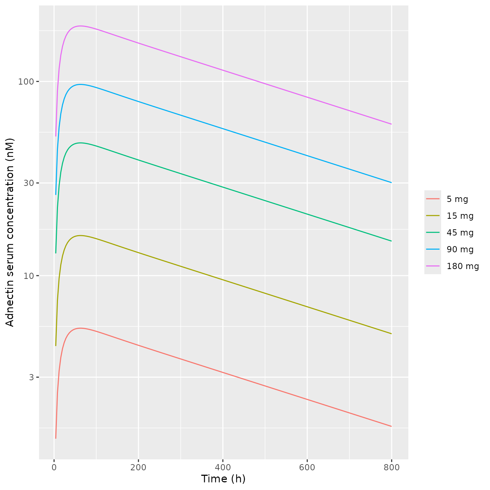

``` r

print(p2)
```

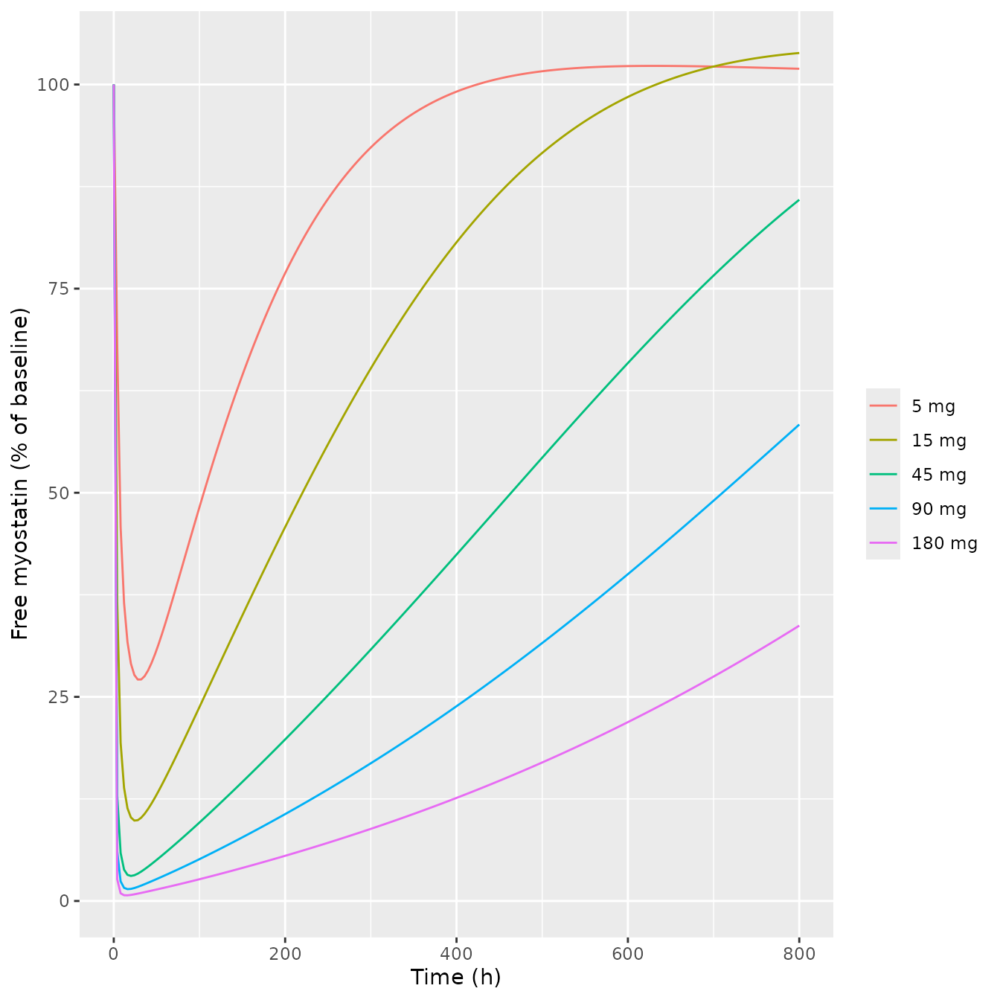

``` r

print(p3)
```

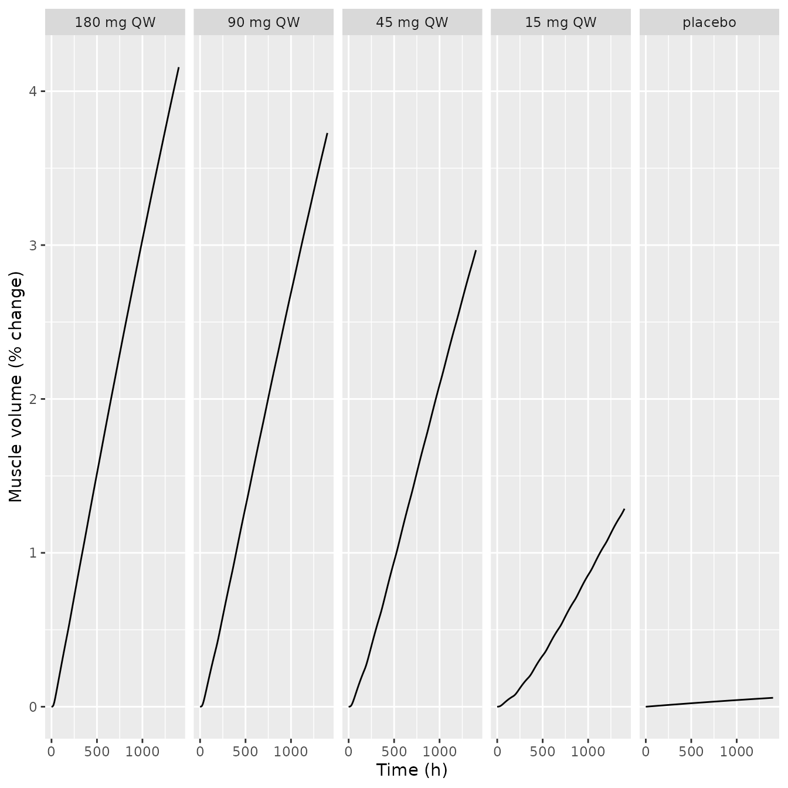

Replicates Figure 2 of Nguyen 2020 (single subcutaneous doses of 5-180
mg for PK and free myostatin; weekly doses for muscle volume). The
simulated peaks (about 5 nM at 5 mg and 190 nM at 180 mg) and the
dose-ordered suppression and recovery of free myostatin match the
published panels. Muscle volume at 1300 h is compared below with the
fitted curves, read off the lower panels of Figure 2 by the maintainers
(approximate):

``` r

fig2_read <- data.frame(dose = paste(c(180, 90, 45, 15), "mg QW"), fig2 = c(4.2, 3.8, 3.0, 1.0))
adn_mus |>
  filter(time == 1300, dose != "placebo") |>
  transmute(dose = as.character(dose), sim = round(muscle_growth, 2)) |>
  inner_join(fig2_read, by = "dose") |>
  rename("Regimen" = dose, "Simulated (%)" = sim, "Figure 2 curve (%)" = fig2) |>
  knitr::kable(caption = "Muscle-volume change at 1300 h, weekly adnectin.")
```

| Regimen   | Simulated (%) | Figure 2 curve (%) |
|:----------|--------------:|-------------------:|
| 15 mg QW  |          1.18 |                1.0 |
| 45 mg QW  |          2.76 |                3.0 |
| 90 mg QW  |          3.48 |                3.8 |
| 180 mg QW |          3.88 |                4.2 |

Muscle-volume change at 1300 h, weekly adnectin. {.table}

### ACE-031 (Figure 3 and Table 3)

``` r

ace <- bind_rows(lapply(c(0.3, 1, 3), function(d) {
  solve_df(mods$ace031, et(amt = d * bw_human, cmt = "depot") |> et(seq(0, 2880, by = 4))) |>
    mutate(dose = paste(d, "mg/kg"))
}))
ggplot(filter(ace, time >= 1, time <= 1400), aes(time, Cc, colour = dose)) +
  geom_line() +
  scale_y_log10() +
  labs(x = "Time (h)", y = "ACE-031 serum concentration (ng/mL)", colour = NULL)
```

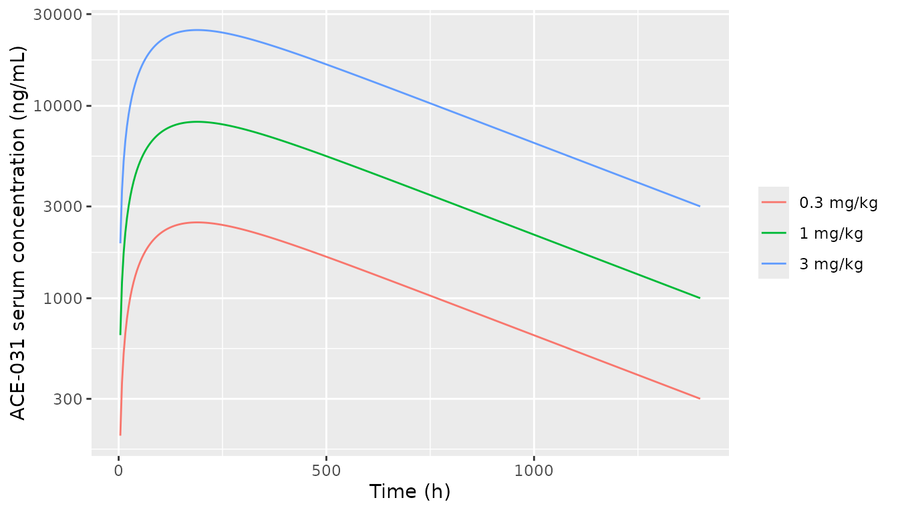

``` r

ggplot(filter(ace, time <= 1400), aes(time, fsh)) +
  geom_line() +
  facet_wrap(~dose) +
  labs(x = "Time (h)", y = "Plasma FSH (ng/mL)")
```

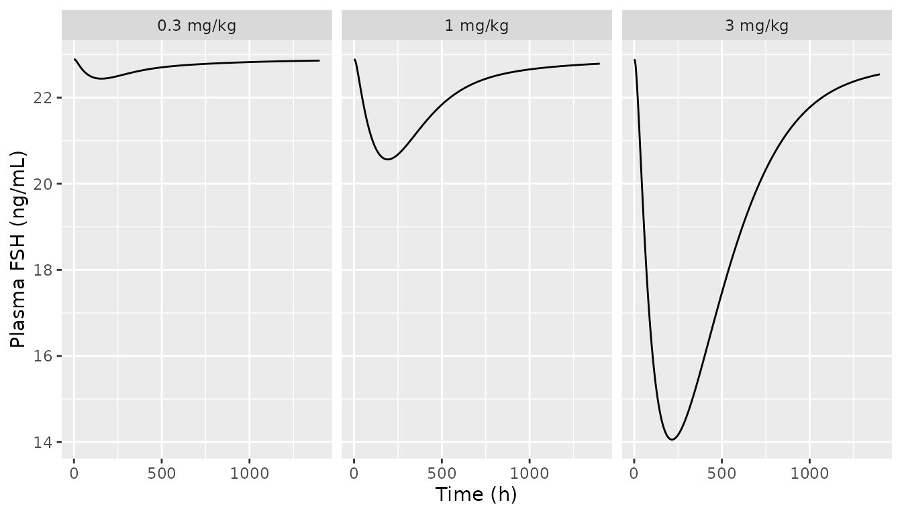

Replicates Figure 3 of Nguyen 2020 (single subcutaneous doses). The PK
matches the published curves: Cmax of about 1900, 7400 and 24000 ng/mL
at 0.3, 1 and 3 mg/kg. The model’s baseline FSH is 22.9 ng/mL, against
about 24-25 ng/mL in the published panels.

``` r

ace_summary <- ace |>
  group_by(dose) |>
  summarise(
    mg_peak = max(muscle_growth),
    fsh_nadir_pct = 100 * (min(fsh) / first(fsh) - 1),
    .groups = "drop"
  )
knitr::kable(
  ace_summary |>
    mutate(across(where(is.numeric), \(x) round(x, 2))) |>
    rename("Dose" = dose, "Peak muscle-volume change (%)" = mg_peak, "FSH nadir (% change)" = fsh_nadir_pct),
  caption = "ACE-031 single subcutaneous dose: muscle volume and FSH."
)
```

| Dose      | Peak muscle-volume change (%) | FSH nadir (% change) |
|:----------|------------------------------:|---------------------:|
| 0.3 mg/kg |                          0.22 |                -1.97 |
| 1 mg/kg   |                          1.44 |               -10.17 |
| 3 mg/kg   |                          3.15 |               -38.59 |

ACE-031 single subcutaneous dose: muscle volume and FSH. {.table}

``` r

ace_3 <- ace_summary$mg_peak[ace_summary$dose == "3 mg/kg"]
stopifnot(abs(ace_3 - 3.14) < 0.05)
```

Table 3 reports simulated muscle-volume increases of 2.0% (1 mg/kg) and
3.14% (3 mg/kg) for ACE-031. The packaged model reproduces the 3 mg/kg
value (3.15%). At 3 mg/kg the FSH nadir, -39%, is also close to the 43%
decrease observed after a single 3 mg/kg dose. The 1 mg/kg value does
**not** reproduce: the model gives 1.44%, 28% below the printed 2.0%.
The same dose shows a shallower FSH dip than the 1 mg/kg panel of Figure
3 (-10% vs about -30%). The PK at 1 mg/kg matches Figure 3, and the gap
is unchanged with the deposited code’s receptor rate constants (1.45%).
It therefore looks like a feature of the authors’ 1 mg/kg simulation
that cannot be recovered from the paper, not a transcription error in
the model.

### Domagrozumab (Table 3)

Table 3 gives a simulated increase of 5.64% for domagrozumab 10 mg/kg
but does not state the regimen. The simulations below bracket plausible
intravenous regimens:

``` r

dom_regimens <- list(
  "single dose" = et(amt = 10 * bw_human, cmt = "central"),
  "q4w x 3" = et(amt = 10 * bw_human, cmt = "central", ii = 672, addl = 2),
  "q2w x 6" = et(amt = 10 * bw_human, cmt = "central", ii = 336, addl = 5)
)
dom_tab <- bind_rows(lapply(names(dom_regimens), function(r) {
  s <- solve_df(mods$domagrozumab, dom_regimens[[r]] |> et(seq(0, 2880, by = 24)))
  data.frame(regimen = r, day85 = s$muscle_growth[s$time == 85 * 24], peak = max(s$muscle_growth))
}))
dom_tab |>
  mutate(across(where(is.numeric), \(x) round(x, 2))) |>
  rename("10 mg/kg IV regimen" = regimen, "Muscle change at day 85 (%)" = day85, "Peak within 120 days (%)" = peak) |>
  knitr::kable(caption = "Domagrozumab 10 mg/kg: simulated muscle-volume change (Table 3 simulated 5.64%).")
```

| 10 mg/kg IV regimen | Muscle change at day 85 (%) | Peak within 120 days (%) |
|:--------------------|----------------------------:|-------------------------:|
| single dose         |                        2.92 |                     2.98 |
| q4w x 3             |                        5.31 |                     6.26 |
| q2w x 6             |                        5.79 |                     7.37 |

Domagrozumab 10 mg/kg: simulated muscle-volume change (Table 3 simulated
5.64%). {.table}

The published 5.64% lies between the single-dose value and the
multiple-dose values, which is consistent. It cannot be checked more
closely without the regimen.

## Validation 3: FS-EEE-Fc in preclinical species (Figures S5-S6)

``` r

mouse_pk <- solve_df(mods$mouse, et(amt = 1 * 0.028, cmt = "central") |> et(c(0.083, seq(1, 168, by = 1)))) |>
  mutate(study = "mouse 1 mg/kg IV")
rat_pk <- bind_rows(lapply(c(0.1, 1, 10), function(d) {
  solve_df(mods$rat, et(amt = d * 0.28, cmt = "central") |> et(c(0.083, seq(1, 400, by = 1)))) |>
    mutate(study = paste("rat", d, "mg/kg IV"))
}))
monkey_pk <- bind_rows(
  lapply(c(0.3, 3, 30), function(d) {
    solve_df(mods$monkey, et(amt = d * 6.2, cmt = "central") |> et(c(0.083, seq(1, 1008, by = 1)))) |>
      mutate(study = paste("monkey", d, "mg/kg IV"))
  }),
  solve_df(mods$monkey, et(amt = 3 * 6.2, cmt = "depot") |> et(seq(0, 1008, by = 1))) |>
    mutate(study = "monkey 3 mg/kg SC")
)
ggplot(filter(bind_rows(mouse_pk, rat_pk, monkey_pk), time >= 1), aes(time, Cc, colour = study)) +
  geom_line() +
  scale_y_log10() +
  labs(x = "Time (h)", y = "Total FS-EEE-Fc in serum (ng/mL)", colour = NULL)
```

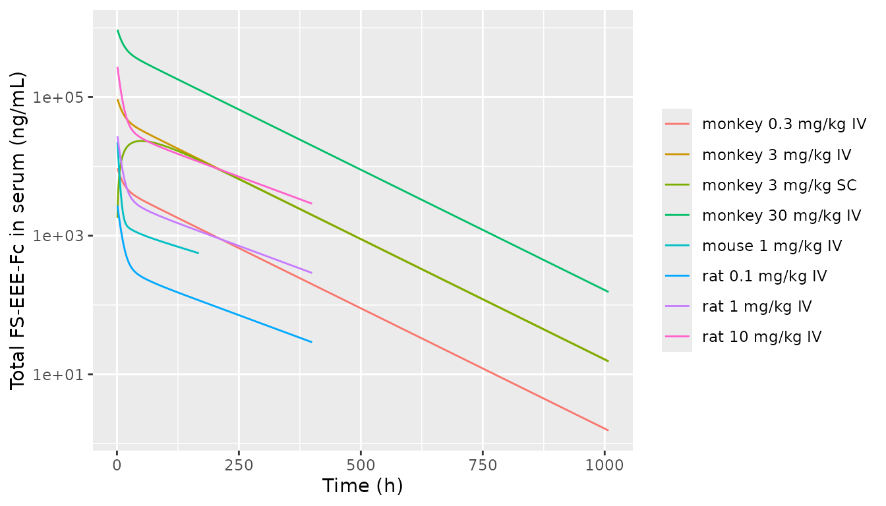

Replicates Figure S5 (mouse and monkey PK) and the unlabelled FS-EEE-Fc
0.1/1/10 mg/kg PK panel of the supplement. That panel’s initial
concentrations (about 3e3, 3e4 and 3e5 ng/mL) identify it as the rat.
Concentrations read off the published fitted lines by the maintainers
(approximate) are compared below. This is where total drug and free drug
separate: at 0.1 mg/kg the free drug at 400 h is less than half the
total, and only the total matches the published line.

``` r

pk_read <- data.frame(
  study = c("mouse 1 mg/kg IV", "rat 0.1 mg/kg IV", "rat 1 mg/kg IV", "rat 10 mg/kg IV", "monkey 3 mg/kg IV", "monkey 30 mg/kg IV"),
  time = c(168, 400, 400, 400, 840, 1008),
  fig = c(500, 30, 300, 3000, 50, 120)
)
bind_rows(mouse_pk, rat_pk, monkey_pk) |>
  inner_join(pk_read, by = c("study", "time")) |>
  transmute(study, time, fig, Cc = signif(Cc, 3), Cfree = signif(Cfree, 3)) |>
  rename("Study" = study, "Time (h)" = time, "Published line (ng/mL)" = fig, "Simulated total, Cc" = Cc, "Simulated free, Cfree" = Cfree) |>
  knitr::kable(caption = "FS-EEE-Fc preclinical PK, published fitted lines vs simulation.")
```

| Study | Time (h) | Published line (ng/mL) | Simulated total, Cc | Simulated free, Cfree |
|:---|---:|---:|---:|---:|
| mouse 1 mg/kg IV | 168 | 500 | 558 | 339.0 |
| rat 0.1 mg/kg IV | 400 | 30 | 29 | 11.2 |
| rat 1 mg/kg IV | 400 | 300 | 290 | 142.0 |
| rat 10 mg/kg IV | 400 | 3000 | 2900 | 2380.0 |
| monkey 3 mg/kg IV | 840 | 50 | 59 | 11.4 |
| monkey 30 mg/kg IV | 1008 | 120 | 154 | 30.0 |

FS-EEE-Fc preclinical PK, published fitted lines vs simulation. {.table}

``` r

mouse_mus <- bind_rows(lapply(c(0, 1, 3, 10, 50), function(d) {
  ev <- if (d > 0) et(amt = d * 0.028, cmt = "central", ii = 84, addl = 7) |> et(seq(0, 672, by = 6)) else et(seq(0, 672, by = 6))
  solve_df(mods$mouse, ev) |> mutate(dose = if (d > 0) paste(d, "mg/kg") else "vehicle")
}))
rat_fsh <- bind_rows(lapply(c(1, 3, 10), function(d) {
  solve_df(mods$rat, et(amt = d * 0.28, cmt = "central") |> et(seq(0, 336, by = 1))) |> mutate(dose = paste(d, "mg/kg"))
}))
ggplot(mouse_mus, aes(time / 24, muscle_growth, colour = dose)) +
  geom_line() +
  labs(x = "Time (day)", y = "Muscle mass (% change)", colour = "IV twice weekly")
```

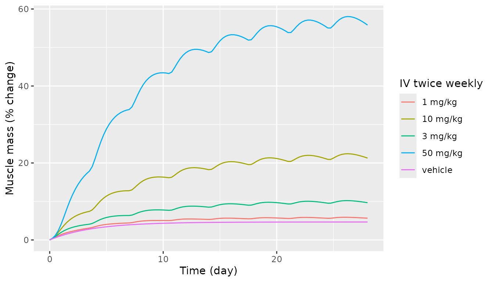

``` r

ggplot(rat_fsh, aes(time, fsh, colour = dose)) +
  geom_line() +
  labs(x = "Time (h)", y = "FSH (ng/mL)", colour = "Single IV dose")
```

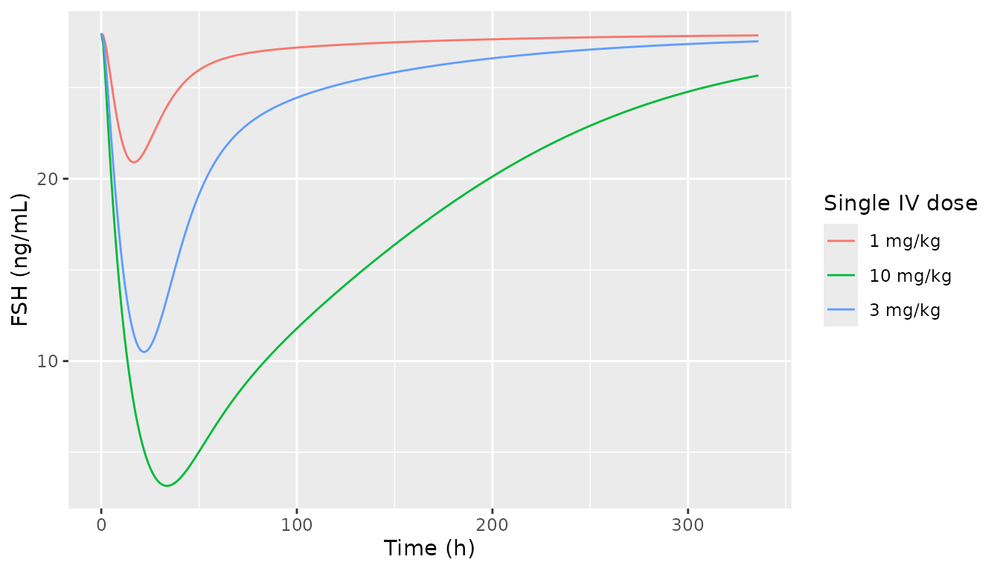

``` r


mouse_d28 <- mouse_mus |> filter(time == 672)
rat_nadir <- rat_fsh |> group_by(dose) |> summarise(nadir = min(fsh), t_nadir = time[which.min(fsh)], .groups = "drop")
knitr::kable(
  data.frame(
    dose = mouse_d28$dose, sim = round(mouse_d28$muscle_growth, 1),
    fig = c(NA, 6, 10, 19, 55)
  ) |> rename("Mouse dose (IV twice weekly)" = dose, "Day-28 muscle mass, sim (%)" = sim, "Figure S6A (%)" = fig),
  caption = "Mouse muscle mass at day 28 (Figure S6A read by the maintainers, approximate)."
)
```

| Mouse dose (IV twice weekly) | Day-28 muscle mass, sim (%) | Figure S6A (%) |
|:-----------------------------|----------------------------:|---------------:|
| vehicle                      |                         4.7 |             NA |
| 1 mg/kg                      |                         5.7 |              6 |
| 3 mg/kg                      |                         9.7 |             10 |
| 10 mg/kg                     |                        21.3 |             19 |
| 50 mg/kg                     |                        55.8 |             55 |

Mouse muscle mass at day 28 (Figure S6A read by the maintainers,
approximate). {.table}

``` r

knitr::kable(
  rat_nadir |>
    mutate(fig_nadir = c(21.5, 11, 3.5)[match(dose, c("1 mg/kg", "3 mg/kg", "10 mg/kg"))], nadir = round(nadir, 1)) |>
    rename("Rat dose (single IV)" = dose, "FSH nadir, sim (ng/mL)" = nadir, "Time of nadir, sim (h)" = t_nadir, "Figure S6B nadir (ng/mL)" = fig_nadir),
  caption = "Ovariectomised-rat FSH nadir (Figure S6B read by the maintainers, approximate)."
)
```

| Rat dose (single IV) | FSH nadir, sim (ng/mL) | Time of nadir, sim (h) | Figure S6B nadir (ng/mL) |
|:---|---:|---:|---:|
| 1 mg/kg | 20.9 | 17 | 21.5 |
| 10 mg/kg | 3.2 | 34 | 3.5 |
| 3 mg/kg | 10.5 | 22 | 11.0 |

Ovariectomised-rat FSH nadir (Figure S6B read by the maintainers,
approximate). {.table}

Replicates Figures S6A and S6B. The mouse muscle-mass curves reach about
6, 10, 21 and 56% at day 28 (published fitted curves about 6, 10, 19 and
55%). The rat FSH nadirs, about 21, 10.5 and 3 ng/mL at 17-34 h from a
baseline of 28 ng/mL, match Figure S6B. The vehicle curve shows the
drug-free drift of the indirect-response term in the mouse. Mouse
baseline occupancy is 91%, so the term settles within days at about
4.7%. The published data likewise start near 3%.

## Model applications to FS-EEE-Fc (Figure 4)

``` r

fs_dual <- bind_rows(
  solve_df(mods$fseeefc, et(amt = 3 * bw_human, cmt = "depot", ii = 168, addl = 5) |> et(seq(0, 2000, by = 4))) |>
    mutate(case = "Myostatin + activin inhibitor"),
  solve_df(mods$fseeefc, et(amt = 3 * bw_human, cmt = "depot", ii = 168, addl = 5) |> et(seq(0, 2000, by = 4)),
    params = c(koff_drug_act = 6e5)
  ) |>
    mutate(case = "Myostatin inhibitor")
)
ggplot(fs_dual, aes(time, ro_muscle, colour = case)) +
  geom_line() +
  labs(x = "Time (h)", y = "ActRIIB total RO in muscle (%)", colour = NULL)
```

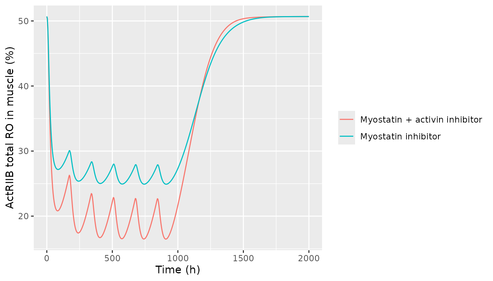

``` r

ro_trough <- fs_dual |>
  filter(time > 500, time < 1000) |>
  group_by(case) |>
  summarise(ro_min = min(ro_muscle), .groups = "drop")
knitr::kable(ro_trough |> mutate(ro_min = round(ro_min, 1)) |> rename("Case" = case, "Minimum muscle RO under dosing (%)" = ro_min))
```

| Case                          | Minimum muscle RO under dosing (%) |
|:------------------------------|-----------------------------------:|
| Myostatin + activin inhibitor |                               16.5 |
| Myostatin inhibitor           |                               24.9 |

Replicates the idea of Figure 4a (six weekly 3 mg/kg subcutaneous doses;
the published dose is not stated). Here the myostatin-only molecule is
the same model with activin binding switched off (`koff_drug_act` set to
the “arbitrary high” 6e5 1/h that Table 2 uses for the myostatin-only
compounds). Adding activin neutralisation lowers the minimum muscle
occupancy by about 8 percentage points, against about 10 in the paper.

``` r

fs_doses <- c(1, 3, 5, 10, 30)
fs <- bind_rows(lapply(fs_doses, function(d) {
  solve_df(mods$fseeefc, et(amt = d * bw_human, cmt = "depot", ii = 168, addl = 25) |> et(seq(0, 180 * 24, by = 6))) |>
    mutate(dose = factor(paste(d, "mg/kg"), levels = paste(rev(fs_doses), "mg/kg")))
}))
ggplot(filter(fs, time >= 24), aes(time / 24, Cc, colour = dose)) +
  geom_line() +
  scale_y_log10(limits = c(1e3, 1e6)) +
  labs(x = "Time (day)", y = "Total drug in plasma (ng/mL)", colour = "Weekly SC")
```

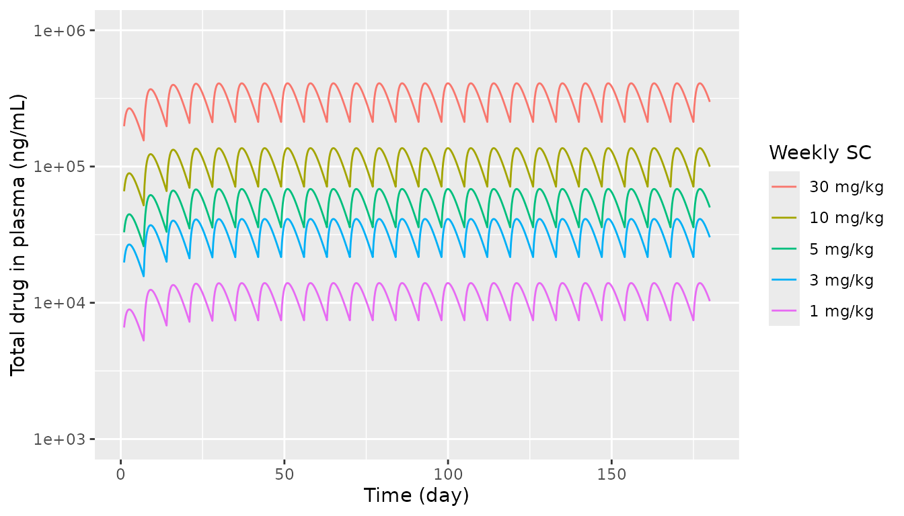

``` r

ggplot(fs, aes(time / 24, muscle_growth, colour = dose)) +
  geom_line() +
  geom_hline(yintercept = 7, linetype = "dashed") +
  labs(x = "Time (day)", y = "Muscle volume (% change)", colour = "Weekly SC")
```

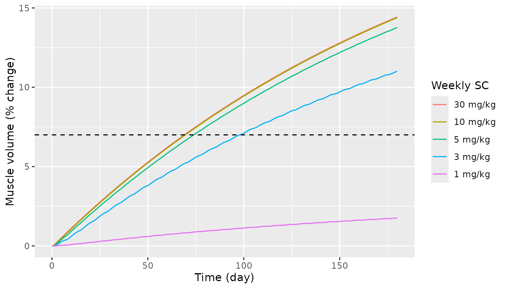

``` r


fs_120 <- fs |> filter(time == 120 * 24) |> select(dose, mg120 = muscle_growth)
fs_180 <- fs |> filter(time == 180 * 24) |> select(dose, mg180 = muscle_growth)
fs_tab <- inner_join(fs_120, fs_180, by = "dose") |> arrange(desc(dose))
knitr::kable(
  fs_tab |>
    mutate(fig4d_180 = c(1.3, 9.5, 13, 13.3, 13.5), across(where(is.numeric), \(x) round(x, 1))) |>
    rename("Weekly SC dose" = dose, "Day 120 (%)" = mg120, "Day 180 (%)" = mg180, "Figure 4d, day 180 (%)" = fig4d_180),
  caption = "FS-EEE-Fc muscle-volume projection (Figure 4d read by the maintainers, approximate)."
)
```

| Weekly SC dose | Day 120 (%) | Day 180 (%) | Figure 4d, day 180 (%) |
|:---------------|------------:|------------:|-----------------------:|
| 1 mg/kg        |         1.3 |         1.8 |                    1.3 |
| 3 mg/kg        |         8.2 |        11.0 |                    9.5 |
| 5 mg/kg        |        10.4 |        13.8 |                   13.0 |
| 10 mg/kg       |        10.9 |        14.4 |                   13.3 |
| 30 mg/kg       |        10.9 |        14.4 |                   13.5 |

FS-EEE-Fc muscle-volume projection (Figure 4d read by the maintainers,
approximate). {.table}

``` r

stopifnot(
  # 1 mg/kg weekly stays far below the 7% efficacy threshold ...
  fs_tab$mg180[fs_tab$dose == "1 mg/kg"] < 7,
  # ... and 3 mg/kg and above cross it within the 24-week horizon.
  all(fs_tab$mg180[fs_tab$dose != "1 mg/kg"] > 7)
)
```

Replicates Figures 4c and 4d of Nguyen 2020. The weekly profiles span
the published 1e4-1e5+ ng/mL range and order by dose. The muscle-volume
projection reproduces the paper’s conclusion: 1 mg/kg weekly is far
short of the 7% efficacy threshold, 3 mg/kg crosses it before day 120
(8.2% at day 120), and 5 mg/kg and above approach the same plateau. The
simulated day-180 values run about 0.5-1.5 percentage points above the
curves read off Figure 4d. The deposited code’s parameter values do not
close the gap (they raise the projection slightly; see the sensitivity
section).

## PKNCA: single-dose exposure of the human compounds

Nguyen 2020 reports no NCA parameters, so there is no
published-vs-simulated NCA table. The block below records the
typical-value single-dose exposure of each human model at a
representative dose, grouped by compound.

``` r

nca_runs <- list(
  "FS-EEE-Fc 3 mg/kg SC" = list(mod = mods$fseeefc, ev = et(amt = 3 * bw_human, cmt = "depot"), dose = 3 * bw_human),
  "Adnectin 180 mg SC" = list(mod = mods$adnectin, ev = et(amt = 180, cmt = "depot"), dose = 180),
  "ACE-031 3 mg/kg SC" = list(mod = mods$ace031, ev = et(amt = 3 * bw_human, cmt = "depot"), dose = 3 * bw_human),
  "Domagrozumab 10 mg/kg IV" = list(mod = mods$domagrozumab, ev = et(amt = 10 * bw_human, cmt = "central"), dose = 10 * bw_human)
)
nca_conc <- bind_rows(lapply(names(nca_runs), function(k) {
  r <- nca_runs[[k]]
  solve_df(r$mod, r$ev |> et(c(0, 1, 2, 4, 8, 12, seq(24, 2016, by = 24)))) |>
    transmute(id = 1L, time, Cc = Cc / 1000, treatment = k)
})) |>
  filter(!is.na(Cc))
nca_dose <- data.frame(id = 1L, time = 0, treatment = names(nca_runs), amt = vapply(nca_runs, `[[`, numeric(1), "dose"))
conc_obj <- PKNCAconc(nca_conc, Cc ~ time | treatment + id, concu = "ug/mL", timeu = "h")
dose_obj <- PKNCAdose(nca_dose, amt ~ time | treatment + id, doseu = "mg")
intervals <- data.frame(start = 0, end = Inf, cmax = TRUE, tmax = TRUE, aucinf.obs = TRUE, half.life = TRUE)
nca_res <- pk.nca(PKNCAdata(conc_obj, dose_obj, intervals = intervals))
as.data.frame(nca_res) |>
  filter(PPTESTCD %in% c("cmax", "tmax", "aucinf.obs", "half.life")) |>
  select(treatment, PPTESTCD, PPORRES) |>
  mutate(PPORRES = signif(PPORRES, 3)) |>
  pivot_wider(names_from = PPTESTCD, values_from = PPORRES) |>
  rename("Treatment" = treatment, "Cmax (ug/mL)" = cmax, "Tmax (h)" = tmax, "AUC0-inf (h*ug/mL)" = aucinf.obs, "t1/2 (h)" = half.life) |>
  knitr::kable(caption = "Typical-value single-dose NCA of total drug.")
```

| Treatment                | Cmax (ug/mL) | Tmax (h) | t1/2 (h) | AUC0-inf (h\*ug/mL) |
|:-------------------------|-------------:|---------:|---------:|--------------------:|
| ACE-031 3 mg/kg SC       |         24.8 |      192 |      367 |               18800 |
| Adnectin 180 mg SC       |         14.6 |       72 |      433 |               10000 |
| Domagrozumab 10 mg/kg IV |        227.0 |        0 |      493 |              153000 |
| FS-EEE-Fc 3 mg/kg SC     |         26.5 |       72 |      109 |                5650 |

Typical-value single-dose NCA of total drug. {.table}

## Sensitivity to the table-versus-code parameter differences

The packaged models use the printed tables. Two groups of values differ
from the deposited human FS-EEE-Fc code. Changing them has little effect
on the projection:

``` r

code_values <- c(
  kon_myo_actriib = 0.6, koff_myo_actriib = 0.6 * 0.0935,
  kon_act_actriib = 0.6, koff_act_actriib = 0.6 * 0.0357,
  kdeg_md = 0.008, kdeg_ad = 0.008
)
ev_code <- et(amt = 3 * bw_human, cmt = "depot", ii = 168, addl = 24) |> et(seq(0, 25 * 168, by = 24))
s_tab <- solve_df(mods$fseeefc, ev_code)
s_code <- solve_df(mods$fseeefc, ev_code, params = code_values)
knitr::kable(data.frame(
  quantity = c("Total drug at the last dose (ng/mL)", "Muscle-volume change at the last dose (%)"),
  tables = signif(c(tail(s_tab$Cc, 1), tail(s_tab$muscle_growth, 1)), 4),
  code = signif(c(tail(s_code$Cc, 1), tail(s_code$muscle_growth, 1)), 4)
) |> rename("Quantity (3 mg/kg weekly x 25)" = quantity, "Published tables" = tables, "Deposited-code values" = code))
```

| Quantity (3 mg/kg weekly x 25) | Published tables | Deposited-code values |
|:---|---:|---:|
| Total drug at the last dose (ng/mL) | 21650.00 | 21190.00 |
| Muscle-volume change at the last dose (%) | 10.79 | 10.89 |

## Assumptions and deviations

- **FSH equation.** The Supplementary Methods print
  `dFSH/dt = Vmax_FSH * (1 - RO^h / (RO^h + RO50^h)) - kdeg_FSH * FSH`.
  The deposited code uses `Vmax_FSH * RO^h / (RO^h + RO50^h)`, so FSH
  production rises with pituitary occupancy. Only the code’s form makes
  FSH fall when an activin trap lowers pituitary occupancy, which is the
  43% ACE-031 decrease the text describes and the direction of Figures 3
  and S6B. The printed form would raise FSH. The packaged models use the
  code’s form. Table 2 labels RO50_FSH “%RO leads to 50% FSH decrease”,
  which is consistent with this.
- **Receptor rate constants.** Table 1 (and Table S3) give kon/koff =
  1.328 1/(nM h) / 0.124 1/h for myostatin-ActRIIB and 14.90 / 0.533 for
  activin-ActRIIB. The deposited code uses kon = 0.6 with the same
  dissociation constants (93.5 and 35.7 pM). The packaged models use the
  tables. The steady state depends only on the dissociation constants
  and is identical either way. The effect on the projection is shown
  above.
- **Complex degradation for FS-EEE-Fc.** Table 2 prints k_deg_MD =
  k_deg_AD = 0.006 1/h (“assumed ~ k_deg_drug”), while k_deg_drug =
  0.008 1/h and the deposited code clears complexes at k_deg_drug. The
  packaged human FS-EEE-Fc model uses the printed 0.006. For every other
  compound and species the two values are equal.
- **Extra digits from the code.** Where the deposited code carries more
  digits than Table 1 (lymph flows, ligand synthesis, cleavage and
  degradation rates), the code value is used. Every such value rounds to
  the printed one.
- **Synthesis-rate units.** Table 1 prints the ligand synthesis rates in
  1/hour, but the code adds them to the amount balance directly
  (nmol/h). The labels use nmol/h.
- **Drug-free run-in replaced by an analytic steady state.** See
  Implementation notes. The authors’ 1000 h run-in and the analytic
  start are the same fixed point of the ODEs, and the check above shows
  no drift over 2000 h. The deposited code’s mass-balance bookkeeping
  states and its `Percent_Free_Myo` output (normalised by a hard-coded
  `Dummy1 = 0.01945`) are not reproduced. They do not feed back on any
  other state. Free myostatin is available as `myo_free_plasma`.
- **Muscle-growth start.** As in the code, `muscle_growth` starts at 0
  at the first dose and includes a slow drug-free drift toward the
  baseline-occupancy steady state: about 0.24% over years in humans, but
  about 4.7% within days in mice.
- **Domagrozumab route.** Table 2 prints F = 0.75 but no ka for
  domagrozumab, so only intravenous dosing into `central` is encoded.
  The mouse and rat also have no ka or F in Table S4 and are IV-only.
- **Preclinical assumptions.** Table S3 does not repeat the molecular
  weights of the ligands, so the Table 1 values are used. The ActRIIB
  concentration (0.138 nM) is printed once for all species and applied
  to each. The degradation rates and reflection coefficients apply to
  every tissue, per the table footnotes. Only the mouse carries a muscle
  sub-model and only the rat an FSH sub-model, because only those were
  parameterised (Table S4).
- **Table 3, ACE-031 1 mg/kg.** Not reproduced (1.44% vs 2.0%); see
  Validation 2.
- **Values read off figures.** The published comparison values in the
  tables above (Figures 2, 4d, S5, S6) were read off the figures by the
  maintainers. They are approximate and are shown for orientation only.
  None of them enters a model parameter.
