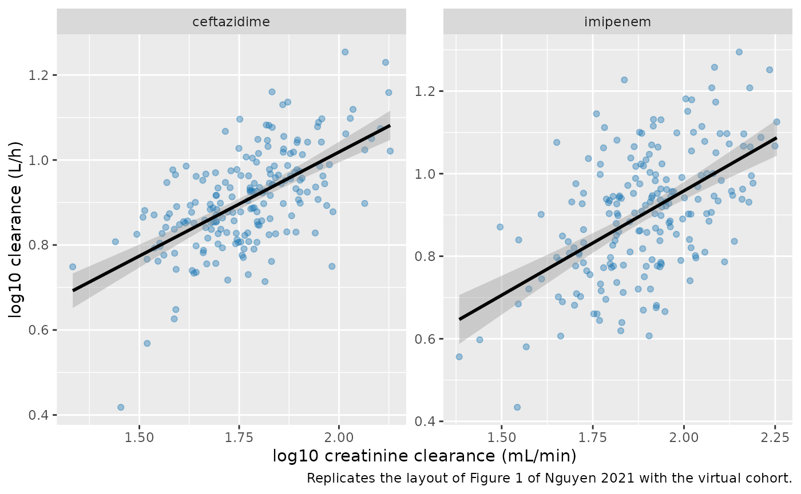
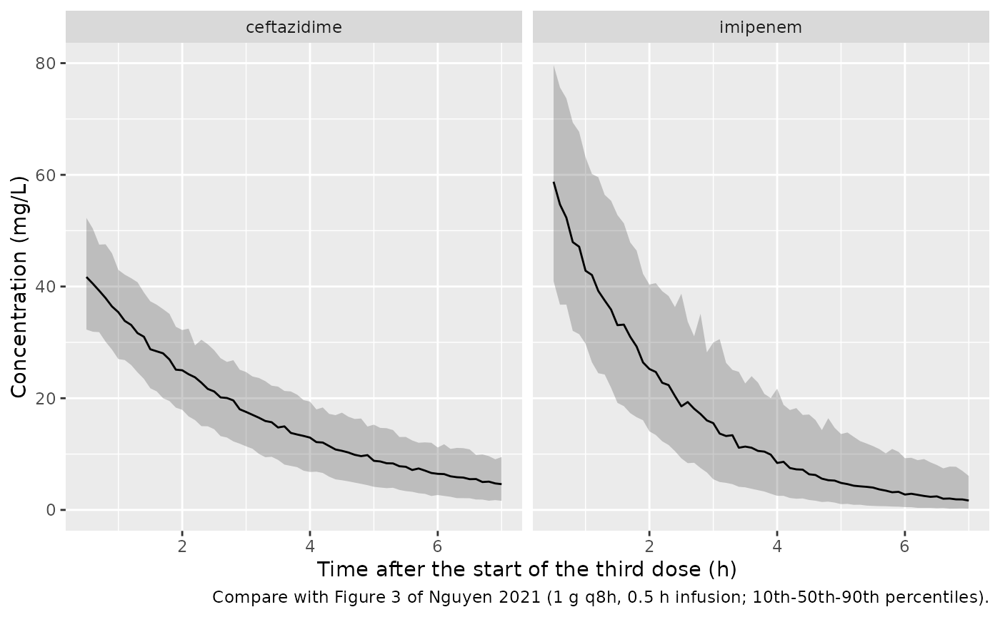
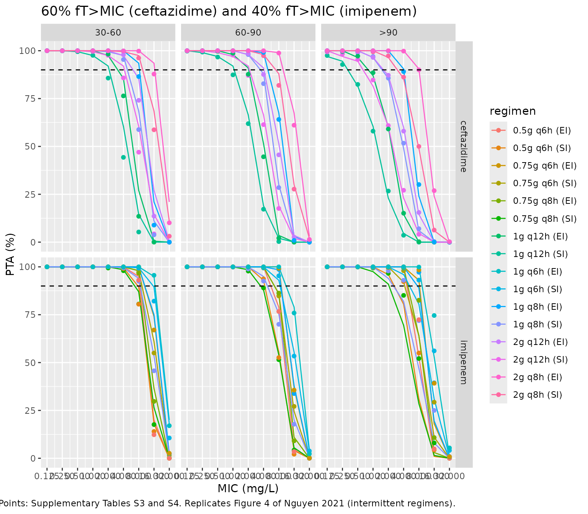

# Ceftazidime and imipenem in AECOPD (Nguyen 2021)

## Model and source

- Citation: Nguyen TM, Ngo TH, Truong AQ, Vu DH, Le DC, Vu NB, Can TN,
  Nguyen HA, Phan TP, Van Bambeke F, Vidaillac C, Ngo QC. Population
  pharmacokinetics and dose optimization of ceftazidime and imipenem in
  patients with acute exacerbations of chronic obstructive pulmonary
  disease. Pharmaceutics. 2021;13(4):456.
  <doi:10.3390/pharmaceutics13040456>.
- Description (ceftazidime): One-compartment IV population PK model for
  ceftazidime in 50 Vietnamese adults hospitalised for acute
  exacerbations of chronic obstructive pulmonary disease (Nguyen 2021).
  Clearance scales as a power of Cockcroft-Gault creatinine clearance
  (reference 69.02 mL/min, the observation-weighted cohort mean), the
  only covariate retained; the volume of distribution carries no
  covariate. Inter-individual variability is exponential on clearance
  and volume, and residual error is proportional. Fitted in Monolix
  alongside a separate imipenem model from the same study
  (Nguyen_2021_imipenem).
- Description (imipenem): One-compartment IV population PK model for
  imipenem in 44 Vietnamese adults hospitalised for acute exacerbations
  of chronic obstructive pulmonary disease (Nguyen 2021). Clearance
  scales as a power of Cockcroft-Gault creatinine clearance (reference
  75.54 mL/min, the observation-weighted cohort mean), the only
  covariate retained; the volume of distribution carries no covariate.
  Inter-individual variability is exponential on clearance and volume,
  and residual error is proportional. Fitted in Monolix alongside a
  separate ceftazidime model from the same study
  (Nguyen_2021_ceftazidime).
- Article: <https://doi.org/10.3390/pharmaceutics13040456>
- Supplement (Tables S1-S4, Figures S1-S4):
  <https://www.mdpi.com/1999-4923/13/4/456/s1>

Nguyen 2021 is a prospective, sparsely sampled population PK study of
two anti-pseudomonal beta-lactams in patients hospitalised for acute
exacerbations of chronic obstructive pulmonary disease (AECOPD) at Bach
Mai Hospital, Hanoi. The two drugs were given to **different patients**
(50 on ceftazidime, 44 on imipenem) and were modelled separately in
Monolix 2019R1, so the paper contributes two independent model files
that share this one article:

- `Nguyen_2021_ceftazidime`
- `Nguyen_2021_imipenem`

Both final models are one-compartment with first-order elimination,
exponential inter-individual variability on clearance and volume,
proportional residual error, and a power effect of Cockcroft-Gault
creatinine clearance on clearance. The paper then uses the models for a
Monte Carlo probability-of-target-attainment (PTA) analysis, which is
reproduced below.

The imipenem model was first added to this package from the Zhang 2025
imipenem systematic review (see the [Zhang 2025 review
article](https://nlmixr2.github.io/nlmixr2lib/articles/Zhang_2025_imipenem_model_review.md));
it has since been re-verified against this primary publication, and
every value now traces to Nguyen 2021 directly.

## Population

| Characteristic                 | Ceftazidime         | Imipenem            |
|:-------------------------------|:--------------------|:--------------------|
| Patients (samples)             | 50 (97)             | 44 (84)             |
| Age, years                     | 69 (63-77)          | 65 (60-72)          |
| Male, n (%)                    | 47 (94)             | 41 (93)             |
| Total body weight, kg          | 51 (47-57)          | 50 (47-55)          |
| Fat-free mass, kg              | 45 (41-47)          | 43 (40-46)          |
| Body mass index, kg/m^2        | 19.49 (17.55-21.44) | 19.51 (18.22-19.51) |
| CLcr (Cockcroft-Gault), mL/min | 62.9 (49.0-76.8)    | 76.6 (57.5-96.6)    |
| Respiratory distress, n (%)    | 17 (34)             | 29 (66)             |
| Invasive ventilation, n (%)    | 7 (14)              | 13 (30)             |
| Most common regimen            | 1 g q8h (78%)       | 1 g q8h (55%)       |

Median (IQR) or n (%). Nguyen 2021 Table 1. {.table}

All patients met the GOLD 2020 definition of an acute exacerbation and
received the study antibiotic for at least three consecutive days; none
required intensive care. The cohort is small-bodied (median weight about
50 kg) and almost entirely male. Two plasma samples were drawn per
patient, one at least 30 min after the end of the third infusion and one
1-2 h before the fourth dose. Infusion durations varied between patients
(Supplementary Figure S1). The same information is available
programmatically from each model’s `population` metadata, for example
`readModelDb("Nguyen_2021_ceftazidime")()$population`.

## Source trace

The per-parameter origin is also recorded as an in-file comment next to
each `ini()` entry in
`inst/modeldb/specificDrugs/Nguyen_2021_ceftazidime.R` and
`inst/modeldb/specificDrugs/Nguyen_2021_imipenem.R`.

| Equation / parameter | Ceftazidime | Imipenem | Source location |
|----|----|----|----|
| `lcl` (CL at reference CLcr, L/h) | `log(8.74)` | `log(7.88)` | Table 2; Results 3.3 |
| `lvc` (V, L) | `log(23.7)` | `log(15.1)` | Table 2; Results 3.3 |
| `e_crcl_cl` (power exponent on CLcr) | `0.485` | `0.532` | Table 2 row ‘beta CLCRCG on CL’; Results 3.3 equations |
| CLcr reference (mL/min) | `69.02` | `75.54` | Results 3.3 equations; centring rule in Methods 2.3, Eq. 2 |
| `etalcl` (variance) | `0.208^2` | `0.294^2` | Table 2 ‘omega CL (%)’; omega defined as the SD of eta in Methods 2.3 |
| `etalvc` (variance) | `0.13^2` | `0.107^2` | Table 2 ‘omega V (%)’; as above |
| `propSd` | `0.121` | `0.233` | Table 2 ‘b (%)’; proportional error selected in Table S1 |
| `cl <- exp(lcl + etalcl) * (CRCL/ref)^e_crcl_cl` |  |  | Methods 2.3 Eq. 1 and 2; Results 3.3 |
| `d/dt(central) <- -kel * central`, `Cc <- central / vc` |  |  | Methods 2.3 (one compartment, first-order elimination); Table S1 |

## Typical-value checks

A deterministic typical-value solve is compared with the published
parameters: for a single 1 g dose infused over 0.5 h, dose / AUC(0-inf)
must return the clearance of the covariate equation, and the terminal
half-life must equal `log(2) * V / CL`. The check is run at the
reference creatinine clearance and across a grid, so it also confirms
the power-covariate algebra.

``` r

caz <- readModelDb("Nguyen_2021_ceftazidime")
imi <- readModelDb("Nguyen_2021_imipenem")
mods <- list(ceftazidime = caz, imipenem = imi)

pub <- tibble::tribble(
  ~drug,         ~cl_ref, ~v,   ~crcl_ref, ~beta,
  "ceftazidime", 8.74,    23.7, 69.02,     0.485,
  "imipenem",    7.88,    15.1, 75.54,     0.532
)

crcl_grid <- c(30, 60, 90, 120)
typ_grid <- tidyr::crossing(pub, CRCL = c(crcl_grid, 69.02, 75.54)) |>
  dplyr::filter(!(drug == "ceftazidime" & CRCL == 75.54),
                !(drug == "imipenem" & CRCL == 69.02)) |>
  dplyr::mutate(
    id = dplyr::row_number(),
    treatment = sprintf("%s, CLcr %.2f", drug, CRCL),
    cl_expected = cl_ref * (CRCL / crcl_ref)^beta
  )

# A zeroRe() model solved for several subjects makes rxode2 warn about a
# multi-subject simulation without omega. That is intended here, so only
# that warning is muffled and any other warning still surfaces.
muffle_no_omega <- function(w) {
  if (grepl("without 'omega'", conditionMessage(w), fixed = TRUE)) {
    invokeRestart("muffleWarning")
  }
}

obs_times <- sort(unique(c(seq(0, 2, by = 0.05), seq(2, 48, by = 0.25))))

typ_events <- function(row) {
  dplyr::bind_rows(
    data.frame(id = row$id, time = 0, amt = 1000, rate = 2000, evid = 1L),
    data.frame(id = row$id, time = obs_times, amt = NA_real_, rate = NA_real_,
               evid = 0L)
  ) |>
    dplyr::mutate(cmt = "central", CRCL = row$CRCL, treatment = row$treatment)
}

typ_sim <- lapply(split(typ_grid, typ_grid$drug), function(g) {
  ev <- dplyr::bind_rows(lapply(seq_len(nrow(g)), function(i) typ_events(g[i, ])))
  withCallingHandlers(
    rxode2::rxSolve(rxode2::zeroRe(mods[[g$drug[1]]]), events = ev,
                    keep = "treatment", rtol = 1e-10, atol = 1e-12,
                    returnType = "data.frame"),
    warning = muffle_no_omega
  )
}) |>
  dplyr::bind_rows()
#> ℹ parameter labels from comments will be replaced by 'label()'
#> ℹ omega/sigma items treated as zero: 'etalcl', 'etalvc'
#> ℹ parameter labels from comments will be replaced by 'label()'
#> ℹ omega/sigma items treated as zero: 'etalcl', 'etalvc'

conc_typ <- typ_sim |>
  dplyr::filter(!is.na(Cc)) |>
  dplyr::mutate(Cc = pmax(Cc, 0)) |>
  dplyr::group_by(id) |>
  dplyr::filter(time <= time[which.max(Cc)] | Cc >= 1e-6 * max(Cc)) |>
  dplyr::ungroup() |>
  dplyr::select(id, time, Cc, treatment)
dose_typ <- typ_grid |>
  dplyr::transmute(id, time = 0, amt = 1000, treatment)

nca_typ <- PKNCA::pk.nca(PKNCA::PKNCAdata(
  PKNCA::PKNCAconc(conc_typ, Cc ~ time | treatment + id),
  PKNCA::PKNCAdose(dose_typ, amt ~ time | treatment + id),
  intervals = data.frame(start = 0, end = Inf, aucinf.obs = TRUE,
                         half.life = TRUE)
))

typ_chk <- as.data.frame(nca_typ$result) |>
  dplyr::filter(PPTESTCD %in% c("aucinf.obs", "half.life")) |>
  dplyr::select(treatment, PPTESTCD, PPORRES) |>
  tidyr::pivot_wider(names_from = PPTESTCD, values_from = PPORRES) |>
  dplyr::left_join(typ_grid, by = "treatment") |>
  dplyr::mutate(
    cl_sim = 1000 / aucinf.obs,
    thalf_expected = log(2) * v / cl_expected,
    cl_rel_err = cl_sim / cl_expected - 1,
    thalf_rel_err = half.life / thalf_expected - 1
  )

typ_chk |>
  dplyr::select(treatment, cl_expected, cl_sim, thalf_expected, half.life) |>
  dplyr::rename(
    "Drug, CLcr (mL/min)" = treatment,
    "CL, published equation (L/h)" = cl_expected,
    "CL = dose / AUCinf (L/h)" = cl_sim,
    "t1/2 = log(2) V / CL (h)" = thalf_expected,
    "t1/2, PKNCA (h)" = half.life
  ) |>
  knitr::kable(digits = 3, caption = "Typical-value clearance and half-life recovered from the solved profiles.")
```

| Drug, CLcr (mL/min) | CL, published equation (L/h) | CL = dose / AUCinf (L/h) | t1/2 = log(2) V / CL (h) | t1/2, PKNCA (h) |
|:---|---:|---:|---:|---:|
| ceftazidime, CLcr 120.00 | 11.429 | 11.430 | 1.437 | 1.437 |
| ceftazidime, CLcr 30.00 | 5.835 | 5.835 | 2.816 | 2.816 |
| ceftazidime, CLcr 60.00 | 8.166 | 8.166 | 2.012 | 2.012 |
| ceftazidime, CLcr 69.02 | 8.740 | 8.740 | 1.880 | 1.880 |
| ceftazidime, CLcr 90.00 | 9.941 | 9.941 | 1.653 | 1.653 |
| imipenem, CLcr 120.00 | 10.080 | 10.081 | 1.038 | 1.038 |
| imipenem, CLcr 30.00 | 4.821 | 4.821 | 2.171 | 2.171 |
| imipenem, CLcr 60.00 | 6.971 | 6.972 | 1.501 | 1.501 |
| imipenem, CLcr 75.54 | 7.880 | 7.880 | 1.328 | 1.328 |
| imipenem, CLcr 90.00 | 8.650 | 8.650 | 1.210 | 1.210 |

Typical-value clearance and half-life recovered from the solved
profiles. {.table}

``` r


# Both sides use the same typical parameters, so the only difference is
# numerical (ODE tolerance, trapezoid rule and the log-linear tail
# extrapolation), and a tight bound is appropriate.
stopifnot(
  nrow(typ_chk) == 10,
  max(abs(typ_chk$cl_rel_err)) < 2e-3,
  max(abs(typ_chk$thalf_rel_err)) < 2e-3
)
```

## Virtual cohorts

For each drug, 200 virtual patients are drawn with base R, so the cohort
is identical on every machine. Cockcroft-Gault creatinine clearance is
log-normal with the Table 1 median and a log-scale SD taken from the
interquartile range. The random effects are drawn from the published
omegas and passed to the typical-value model as data columns (`etalcl`,
`etalvc`), so the simulation below does not depend on rxode2’s random
number stream.

``` r

set.seed(20210327)
n_per_drug <- 200L
cohort_spec <- tibble::tribble(
  ~drug,         ~crcl_med, ~crcl_q1, ~crcl_q3, ~om_cl, ~om_v, ~prop_sd,
  "ceftazidime", 62.9,      49.0,     76.8,     0.208,  0.13,  0.121,
  "imipenem",    76.6,      57.5,     96.6,     0.294,  0.107, 0.233
)

draw_cohort <- function(spec, n, id_offset) {
  sdlog <- (log(spec$crcl_q3) - log(spec$crcl_q1)) / (2 * qnorm(0.75))
  tibble::tibble(
    id = id_offset + seq_len(n),
    drug = spec$drug,
    CRCL = exp(rnorm(n, log(spec$crcl_med), sdlog)),
    etalcl = rnorm(n, 0, spec$om_cl),
    etalvc = rnorm(n, 0, spec$om_v)
  )
}
cohort <- dplyr::bind_rows(
  draw_cohort(cohort_spec[1, ], n_per_drug, 0L),
  draw_cohort(cohort_spec[2, ], n_per_drug, n_per_drug)
)
stopifnot(!anyDuplicated(cohort$id))
cohort |>
  dplyr::group_by(drug) |>
  dplyr::summarise(
    `CLcr median` = median(CRCL),
    `CLcr Q1` = quantile(CRCL, 0.25),
    `CLcr Q3` = quantile(CRCL, 0.75),
    .groups = "drop"
  ) |>
  knitr::kable(digits = 1, caption = "Virtual-cohort creatinine clearance (mL/min); compare Table 1.")
```

| drug        | CLcr median | CLcr Q1 | CLcr Q3 |
|:------------|------------:|--------:|--------:|
| ceftazidime |        59.6 |    47.6 |    72.7 |
| imipenem    |        79.7 |    62.3 |   101.4 |

Virtual-cohort creatinine clearance (mL/min); compare Table 1. {.table}

## Simulation

Every patient receives the most common study regimen, 1 g every 8 h,
here as a 0.5 h infusion, for nine doses. The window after the third
dose (16-24 h) corresponds to the study’s sampling window; the last
interval (64-72 h) is used for the steady-state NCA.

``` r

ss_times <- seq(0, 72, by = 0.1)
make_ss_events <- function(coh) {
  doses <- tidyr::crossing(coh, time = seq(0, 64, by = 8)) |>
    dplyr::mutate(amt = 1000, rate = 2000, evid = 1L)
  obs <- tidyr::crossing(coh, time = ss_times) |>
    dplyr::mutate(amt = NA_real_, rate = NA_real_, evid = 0L)
  dplyr::bind_rows(doses, obs) |>
    dplyr::mutate(cmt = "central") |>
    dplyr::arrange(id, time, dplyr::desc(evid))
}

# zeroRe() plus eta columns in the data: rxode2 uses the per-subject etas
# supplied as data (the omegas are treated as zero).
solve_with_etas <- function(mod, ev, ...) {
  withCallingHandlers(
    suppressMessages(rxode2::rxSolve(
      rxode2::zeroRe(mod), events = ev,
      rtol = 1e-8, atol = 1e-10, returnType = "data.frame", ...
    )),
    warning = muffle_no_omega
  )
}

sim_drug <- function(d) {
  ev <- make_ss_events(dplyr::filter(cohort, drug == d))
  solve_with_etas(mods[[d]], ev, keep = "drug")
}
sim <- dplyr::bind_rows(lapply(c("ceftazidime", "imipenem"), sim_drug))

# The supplied etas must actually reach the individual parameters. This is
# a same-parameter identity (numerical error only), so the bound is tight.
cl_check <- sim |>
  dplyr::distinct(id, drug, cl, vc) |>
  dplyr::left_join(cohort, by = c("id", "drug")) |>
  dplyr::left_join(pub, by = "drug") |>
  dplyr::mutate(
    cl_expected = cl_ref * exp(etalcl) * (CRCL / crcl_ref)^beta,
    v_expected = v * exp(etalvc)
  )
stopifnot(
  nrow(cl_check) == 2 * n_per_drug,
  max(abs(cl_check$cl / cl_check$cl_expected - 1)) < 1e-8,
  max(abs(cl_check$vc / cl_check$v_expected - 1)) < 1e-8,
  sd(log(cl_check$cl)) > 0.1
)
```

### Individual clearance versus creatinine clearance (Figure 1)

Figure 1 of the paper regresses the log10 of each patient’s empirical
Bayes clearance on the log10 of creatinine clearance and prints the
fitted slopes, 0.4893 for ceftazidime and 0.5321 for imipenem. They are
close to the model’s covariate exponents (0.485 and 0.532), as expected
when the clearance random effect is independent of creatinine clearance.
The same regression on the virtual cohort recovers the exponent to
within its sampling error.

``` r

fig1_pub <- tibble::tibble(drug = c("ceftazidime", "imipenem"),
                           slope_pub = c(0.4893, 0.5321))
fig1_fit <- cl_check |>
  dplyr::group_by(drug) |>
  dplyr::summarise(
    slope_sim = unname(coef(lm(log10(cl) ~ log10(CRCL)))[2]),
    .groups = "drop"
  ) |>
  dplyr::left_join(fig1_pub, by = "drug")
fig1_fit |>
  dplyr::rename("Drug" = drug, "Slope, virtual cohort" = slope_sim,
                "Slope, Figure 1" = slope_pub) |>
  knitr::kable(digits = 3)
```

| Drug        | Slope, virtual cohort | Slope, Figure 1 |
|:------------|----------------------:|----------------:|
| ceftazidime |                 0.489 |           0.489 |
| imipenem    |                 0.506 |           0.532 |

``` r


ggplot(cl_check, aes(log10(CRCL), log10(cl))) +
  geom_point(alpha = 0.4, colour = "#1f77b4") +
  geom_smooth(method = "lm", formula = y ~ x, colour = "black") +
  facet_wrap(~drug, scales = "free") +
  labs(x = "log10 creatinine clearance (mL/min)", y = "log10 clearance (L/h)",
       caption = "Replicates the layout of Figure 1 of Nguyen 2021 with the virtual cohort.")
```



``` r


# The standard error of the slope is omega_CL / (sd(log10 CRCL) * sqrt(n)),
# about 0.10 for ceftazidime and 0.12 for imipenem with n = 200; 0.3 is
# well over two standard errors, and the draw is fixed by set.seed().
stopifnot(all(abs(fig1_fit$slope_sim - fig1_fit$slope_pub) < 0.3))
```

### Concentration-time profile after the third dose (Figure 3)

Figure 3 of the paper is a visual predictive check over roughly 0.5-7 h
after the dose, pooling patients with different doses and infusion
durations. With no observed data available, the plot below shows the
10th, 50th and 90th percentiles of simulated observations (individual
predictions with the proportional residual error applied in base R)
after the third 1 g, 0.5 h dose.

``` r

fig3 <- sim |>
  dplyr::filter(time >= 16.5, time <= 23) |>
  dplyr::left_join(cohort_spec, by = "drug") |>
  dplyr::mutate(tad = time - 16,
                dv = Cc * (1 + prop_sd * rnorm(dplyr::n())))
fig3 |>
  dplyr::group_by(drug, tad) |>
  dplyr::summarise(
    p10 = quantile(dv, 0.1), p50 = median(dv), p90 = quantile(dv, 0.9),
    .groups = "drop"
  ) |>
  ggplot(aes(tad, p50)) +
  geom_ribbon(aes(ymin = p10, ymax = p90), alpha = 0.25) +
  geom_line() +
  facet_wrap(~drug) +
  labs(x = "Time after the start of the third dose (h)",
       y = "Concentration (mg/L)",
       caption = "Compare with Figure 3 of Nguyen 2021 (1 g q8h, 0.5 h infusion; 10th-50th-90th percentiles).")
```



``` r


fig3_5h <- fig3 |>
  dplyr::filter(abs(tad - 5) < 1e-8) |>
  dplyr::group_by(drug) |>
  dplyr::summarise(median_5h = median(Cc), .groups = "drop")
knitr::kable(fig3_5h, digits = 1,
             caption = "Median simulated concentration 5 h after the start of the third dose (mg/L).")
```

| drug        | median_5h |
|:------------|----------:|
| ceftazidime |         9 |
| imipenem    |         5 |

Median simulated concentration 5 h after the start of the third dose
(mg/L). {.table}

The simulated medians 5 h after the dose sit close to the observed
medians in Figure 3 (about 9 mg/L for ceftazidime and about 5 mg/L for
imipenem, read from the plot). The paper’s early (1-3 h) medians are
higher than the 0.5 h-infusion profile above because many study patients
received longer infusions (Supplementary Figure S1).

## PKNCA validation

The paper reports no NCA table, so the steady-state NCA below checks the
model against itself: over the final 8-h interval, `AUCtau` must equal
dose divided by each patient’s own clearance.

``` r

nca_conc <- sim |>
  dplyr::filter(!is.na(Cc), time >= 64) |>
  dplyr::mutate(Cc = pmax(Cc, 0), treatment = paste(drug, "1 g q8h")) |>
  dplyr::select(id, time, Cc, treatment)
nca_dose <- sim |>
  dplyr::distinct(id, drug) |>
  dplyr::transmute(id, time = 64, amt = 1000,
                   treatment = paste(drug, "1 g q8h"))

nca_ss <- PKNCA::pk.nca(PKNCA::PKNCAdata(
  PKNCA::PKNCAconc(nca_conc, Cc ~ time | treatment + id),
  PKNCA::PKNCAdose(nca_dose, amt ~ time | treatment + id),
  intervals = data.frame(start = 64, end = 72, cmax = TRUE, cmin = TRUE,
                         auclast = TRUE)
))

summary(nca_ss) |> knitr::kable(caption = "Steady-state NCA, 1 g q8h as a 0.5 h infusion (64-72 h).")
```

| start | end | treatment           | N   | auclast      | cmax          | cmin          |
|------:|----:|:--------------------|:----|:-------------|:--------------|:--------------|
|    64 |  72 | ceftazidime 1 g q8h | 200 | 124 \[26.8\] | 42.2 \[12.9\] | 2.89 \[107\]  |
|    64 |  72 | imipenem 1 g q8h    | 200 | 125 \[36.2\] | 60.1 \[11.7\] | 0.799 \[367\] |

Steady-state NCA, 1 g q8h as a 0.5 h infusion (64-72 h). {.table}

``` r


ss_chk <- as.data.frame(nca_ss$result) |>
  dplyr::filter(PPTESTCD == "auclast") |>
  dplyr::select(id, auclast = PPORRES) |>
  dplyr::left_join(dplyr::distinct(cl_check, id, cl), by = "id") |>
  dplyr::mutate(ratio = auclast * cl / 1000)
# Numerical-only identity: the residual comes from the linear-up/log-down
# trapezoid on a 0.1-h grid and from the approach to steady state of the
# slowest-clearing subjects (exp(-k * 64) with k >= 0.09 1/h).
stopifnot(
  nrow(ss_chk) == 2 * n_per_drug,
  max(abs(ss_chk$ratio - 1)) < 0.01
)
```

## Probability of target attainment (Figure 4, Tables S3 and S4)

The paper simulates 1000 patients per regimen in mlxR and reports, for
each creatinine-clearance stratum (30-60, 60-90 and above 90 mL/min),
the percentage reaching 100% fT\>MIC and 60% (ceftazidime) or 40%
(imipenem) fT\>MIC, with free fractions of 0.86 (ceftazidime) and 0.80
(imipenem), at 72 h. The short infusion (SI) is 0.5 h and the extended
infusion (EI) 3 h; the continuous infusion (CI) is a loading dose (2 g
ceftazidime, 1 g imipenem) followed by 6 g or 4 g per 24 h.

Here each stratum has 200 base-R virtual patients with creatinine
clearance uniform over the stratum (90-150 mL/min for the open top
stratum), and fT\>MIC is evaluated on the individual predictions over
the last dosing interval before 72 h (48-72 h for CI). The published
tables are transcribed from Supplementary Tables S3 and S4.

``` r

mics <- c(0.125, 0.25, 0.5, 1, 2, 4, 8, 16, 32)
pta_cols <- c("stratum", "regimen",
              paste0("full_", mics), paste0("partial_", mics))
caz_pub <- tibble::tribble(
  ~s, ~r, ~a1, ~a2, ~a3, ~a4, ~a5, ~a6, ~a7, ~a8, ~a9, ~b1, ~b2, ~b3, ~b4, ~b5, ~b6, ~b7, ~b8, ~b9,
  "30-60", "1g q12h (SI)", 94.6, 87.2, 64.9, 40.3, 14.2, 1.4, 0.1, 0, 0, 100, 99.9, 99.5, 97.6, 85.7, 44.3, 5.3, 0.1, 0,
  "30-60", "2g q12h (SI)", 98.1, 95.2, 87.7, 71.2, 42.8, 13.9, 1.2, 0, 0, 100, 100, 100, 99.6, 97.6, 85.8, 47, 4.3, 0,
  "30-60", "1g q8h (SI)", 100, 99.7, 98.9, 92.7, 72.1, 34.8, 5.6, 0, 0, 100, 100, 100, 100, 99.7, 95.4, 58.8, 3.8, 0,
  "30-60", "2g q8h (SI)", 100, 99.9, 99.6, 98.3, 94, 75.3, 34.2, 4, 0, 100, 100, 100, 100, 100, 99.7, 96.2, 58.7, 3.1,
  "30-60", "1g q12h (EI)", 98.7, 95.3, 85.7, 62.7, 27.7, 4, 0, 0, 0, 100, 100, 100, 99.9, 98.2, 76.4, 13.5, 0, 0,
  "30-60", "2g q12h (EI)", 99.8, 99, 95.6, 83.9, 60.3, 27.4, 3.1, 0.1, 0, 100, 100, 100, 100, 100, 97.9, 74.1, 13.6, 0,
  "30-60", "1g q8h (EI)", 100, 100, 100, 99, 92.2, 65.4, 15.4, 0.1, 0, 100, 100, 100, 100, 100, 99.9, 86.5, 8.9, 0,
  "30-60", "2g q8h (EI)", 99.9, 99.9, 99.9, 99.8, 99.3, 94.5, 67.4, 16.1, 0.3, 100, 100, 100, 100, 100, 99.9, 99.8, 87.8, 10.1,
  "30-60", "6g q24h (CI)", 100, 100, 100, 100, 100, 100, 100, 99.3, 26.4, 100, 100, 100, 100, 100, 100, 100, 99.3, 26.4,
  "60-90", "1g q12h (SI)", 81.6, 64.7, 38.3, 14.2, 1.6, 0, 0, 0, 0, 99.8, 99.3, 96.7, 87.4, 61.9, 17.2, 0.3, 0, 0,
  "60-90", "2g q12h (SI)", 91.7, 81.1, 64, 39, 15.7, 2.5, 0, 0, 0, 100, 100, 99.8, 97.7, 87.1, 61.4, 17.6, 0.3, 0,
  "60-90", "1g q8h (SI)", 99.8, 97.8, 91.1, 77.8, 47.1, 12.3, 0.4, 0, 0, 100, 100, 100, 100, 98, 82.8, 28.5, 0.2, 0,
  "60-90", "2g q8h (SI)", 99.9, 99.6, 97.4, 91.9, 76.4, 44, 10.8, 0.5, 0, 100, 100, 100, 100, 99.9, 97.4, 81.9, 27.7, 0.5,
  "60-90", "1g q12h (EI)", 92.8, 80.2, 59.4, 32, 7.5, 0.6, 0, 0, 0, 100, 100, 99.7, 98.7, 87.7, 44.6, 2.1, 0, 0,
  "60-90", "2g q12h (EI)", 96.9, 92, 81.1, 60.1, 31.8, 8.2, 0.3, 0, 0, 100, 100, 100, 99.9, 98.5, 87.6, 45.6, 2.6, 0,
  "60-90", "1g q8h (EI)", 100, 99.9, 99.3, 95.8, 77.5, 34.1, 2.7, 0, 0, 100, 100, 100, 100, 100, 99.1, 64.1, 0.9, 0,
  "60-90", "2g q8h (EI)", 100, 100, 99.9, 99.2, 94.6, 75.9, 34.6, 2.5, 0.1, 100, 100, 100, 100, 100, 100, 98.8, 61.1, 1.4,
  "60-90", "6g q24h (CI)", 100, 100, 100, 100, 100, 100, 100, 96.3, 6.7, 100, 100, 100, 100, 100, 100, 100, 96.3, 6.7,
  ">90", "1g q12h (SI)", 49, 30.4, 13.2, 3, 0.2, 0, 0, 0, 0, 97.5, 92.8, 82.4, 58, 26.7, 3.6, 0, 0, 0,
  ">90", "2g q12h (SI)", 67.4, 50.1, 30.4, 15.4, 3.6, 0.3, 0, 0, 0, 99.4, 98.3, 95.4, 84.7, 60.9, 27.1, 4.1, 0.2, 0,
  ">90", "1g q8h (SI)", 94.1, 86.2, 71.2, 46.2, 18, 1.9, 0, 0, 0, 100, 99.6, 99.1, 97, 85.7, 51.7, 7, 0, 0,
  ">90", "2g q8h (SI)", 97.8, 94.9, 86.8, 70.1, 44.7, 14.6, 1.5, 0, 0, 100, 100, 99.9, 99.4, 97.3, 86.2, 50, 6.3, 0,
  ">90", "1g q12h (EI)", 69, 49.4, 27.6, 8.6, 1.7, 0, 0, 0, 0, 99.9, 99.6, 97.2, 88.5, 59.1, 15.1, 0.2, 0, 0,
  ">90", "2g q12h (EI)", 83.2, 68.9, 50.5, 27, 8.6, 1.6, 0, 0, 0, 100, 99.9, 99.5, 96.5, 87.2, 58, 15.5, 0.3, 0,
  ">90", "1g q8h (EI)", 99.8, 97.9, 91.4, 74.6, 44.9, 10.5, 0.4, 0, 0, 100, 100, 100, 100, 99.9, 89.1, 30.1, 0.1, 0,
  ">90", "2g q8h (EI)", 100, 99.7, 98.3, 91.6, 76.1, 44.1, 10.6, 0.4, 0, 100, 100, 100, 100, 100, 99.8, 90, 26.9, 0.2,
  ">90", "6g q24h (CI)", 100, 100, 100, 100, 100, 100, 100, 77.4, 1, 100, 100, 100, 100, 100, 100, 100, 77.4, 1
)
imi_pub <- tibble::tribble(
  ~s, ~r, ~a1, ~a2, ~a3, ~a4, ~a5, ~a6, ~a7, ~a8, ~a9, ~b1, ~b2, ~b3, ~b4, ~b5, ~b6, ~b7, ~b8, ~b9,
  "30-60", "0.75g q8h (SI)", 96.9, 93.3, 84.5, 69.2, 44.3, 15.8, 2.3, 0.2, 0, 100, 100, 100, 100, 99.4, 98, 80.6, 17.6, 0.2,
  "30-60", "0.5g q6h (SI)", 99.4, 98.6, 96.1, 85.9, 62.5, 30.1, 5.6, 0, 0, 100, 100, 100, 100, 100, 99.1, 80.5, 14, 0,
  "30-60", "1g q8h (SI)", 97.9, 95, 89.1, 77.5, 54.3, 25.8, 8.5, 0.8, 0.1, 100, 100, 100, 100, 100, 99.5, 92.5, 45.7, 2.3,
  "30-60", "0.75g q6h (SI)", 99.8, 99.6, 97.8, 92.1, 77.6, 52.4, 17.9, 1, 0, 100, 100, 100, 100, 100, 100, 97.3, 55, 1.6,
  "30-60", "1g q6h (SI)", 99.9, 99.7, 98.7, 96.2, 86.9, 62.8, 31.5, 4.5, 0.3, 100, 100, 100, 100, 100, 99.9, 99.3, 82.1, 10.6,
  "30-60", "0.75g q8h (EI)", 99.7, 98.7, 95, 87.2, 68.1, 35.4, 9, 0.4, 0, 100, 100, 100, 100, 100, 100, 96.7, 29.7, 0,
  "30-60", "0.5g q6h (EI)", 100, 99.7, 99.5, 97.6, 89.3, 60.9, 15.9, 0.4, 0, 100, 100, 100, 100, 100, 100, 93.1, 12.3, 0,
  "30-60", "1g q8h (EI)", 99.4, 99, 97.6, 91.7, 77.7, 50, 18.1, 2.2, 0, 100, 100, 100, 100, 100, 100, 99.7, 67, 2.4,
  "30-60", "0.75g q6h (EI)", 100, 99.9, 99.8, 99.1, 96.5, 81.1, 44.1, 7.3, 0, 100, 100, 100, 100, 100, 100, 100, 67, 2.6,
  "30-60", "1g q6h (EI)", 100, 100, 99.9, 99.7, 98.2, 92.5, 64.8, 19.7, 0.6, 100, 100, 100, 100, 100, 100, 100, 95.6, 17,
  "30-60", "4g q24h (CI)", 100, 100, 100, 100, 100, 100, 100, 81.6, 8.2, 100, 100, 100, 100, 100, 100, 100, 81.6, 8.2,
  "60-90", "0.75g q8h (SI)", 86.9, 75.8, 58.8, 38.7, 16.4, 4, 0.3, 0, 0, 100, 100, 100, 99.9, 97.8, 89, 51.5, 4.3, 0,
  "60-90", "0.5g q6h (SI)", 96.4, 90.5, 79.1, 60.8, 32.6, 9.3, 0.4, 0, 0, 100, 100, 100, 100, 99.7, 93.7, 52.6, 2.1, 0,
  "60-90", "1g q8h (SI)", 87.9, 78.3, 65, 47.8, 25.9, 8.9, 1.3, 0.1, 0, 100, 100, 100, 99.9, 98.9, 92.6, 70, 17.8, 0.3,
  "60-90", "0.75g q6h (SI)", 98.8, 95.8, 88.4, 76.2, 51.2, 24.5, 4.6, 0.2, 0, 100, 100, 100, 100, 99.9, 99.4, 84.8, 27.1, 0.3,
  "60-90", "1g q6h (SI)", 98.6, 97.2, 92.7, 82.1, 60.6, 34.1, 10.4, 0.8, 0.1, 100, 100, 100, 100, 99.9, 99.5, 95.3, 53.4, 3.8,
  "60-90", "0.75g q8h (EI)", 96.8, 91.9, 82.6, 65.9, 39.4, 14.1, 1.3, 0.1, 0, 100, 100, 100, 100, 100, 99.9, 86.3, 9.1, 0.1,
  "60-90", "0.5g q6h (EI)", 99.9, 99.4, 97.5, 89.3, 67.5, 30.7, 4.4, 0, 0, 100, 100, 100, 100, 100, 100, 76.7, 3.5, 0,
  "60-90", "1g q8h (EI)", 98.8, 95.1, 86.6, 71, 46.2, 20, 3.2, 0.1, 0, 100, 100, 100, 100, 100, 100, 98.7, 33.8, 0.1,
  "60-90", "0.75g q6h (EI)", 99.8, 99.8, 99, 95.8, 84.8, 53.8, 16.3, 0.5, 0, 100, 100, 100, 100, 100, 100, 99.2, 35.6, 0.1,
  "60-90", "1g q6h (EI)", 100, 99.9, 99.5, 97.8, 89.6, 66.5, 29.4, 4.4, 0, 100, 100, 100, 100, 100, 100, 100, 75.9, 2.3,
  "60-90", "4g q24h (CI)", 100, 100, 100, 100, 100, 100, 100, 54.9, 1.3, 100, 100, 100, 100, 100, 100, 100, 54.9, 1.3,
  ">90", "0.75g q8h (SI)", 82.6, 73.3, 58.7, 40.1, 21.4, 7.3, 0.7, 0, 0, 100, 100, 99.9, 99.4, 96.6, 85.1, 52.1, 8, 0,
  ">90", "0.5g q6h (SI)", 94.5, 89.5, 79.4, 60.9, 37, 13.2, 1.8, 0, 0, 100, 100, 100, 99.9, 99.2, 92.3, 55, 4.3, 0,
  ">90", "1g q8h (SI)", 87.5, 79.5, 66.9, 51.1, 29.9, 13.6, 2.9, 0.3, 0, 100, 100, 100, 99.7, 97.9, 93, 71.9, 25, 0.9,
  ">90", "0.75g q6h (SI)", 97.2, 93.1, 85.5, 71.7, 52.3, 26.6, 6.5, 0.8, 0, 100, 100, 100, 99.9, 99.7, 98, 82.6, 29.3, 0.8,
  ">90", "1g q6h (SI)", 98, 95.9, 90.7, 79.4, 62.4, 36.4, 12.2, 1.5, 0, 100, 100, 100, 100, 100, 99.4, 93.1, 56.1, 4.1,
  ">90", "0.75g q8h (EI)", 94.8, 89.3, 80.3, 63.5, 40.7, 15.1, 2.2, 0.1, 0, 100, 100, 100, 100, 100, 99.7, 82.5, 10.8, 0.1,
  ">90", "0.5g q6h (EI)", 99.7, 98.7, 95.1, 86, 64.6, 33.5, 6.1, 0.3, 0, 100, 100, 100, 100, 100, 100, 72.4, 4.9, 0,
  ">90", "1g q8h (EI)", 96.8, 92.9, 83.2, 69.8, 50.2, 24.6, 7.1, 0.6, 0, 100, 100, 100, 100, 100, 100, 97.2, 39.4, 0.7,
  ">90", "0.75g q6h (EI)", 99.9, 98.9, 97.4, 93.1, 80.2, 55.8, 21.4, 2.7, 0, 100, 100, 100, 100, 100, 100, 98.4, 39.2, 0.8,
  ">90", "1g q6h (EI)", 99.9, 99.7, 98.9, 96.2, 86.6, 65.2, 31.3, 7.2, 0.4, 100, 100, 100, 100, 100, 100, 99.9, 74.6, 5.4,
  ">90", "4g q24h (CI)", 100, 100, 100, 100, 100, 100, 96.2, 32.5, 0.5, 100, 100, 100, 100, 100, 100, 96.2, 32.5, 0.5
)
names(caz_pub) <- pta_cols
names(imi_pub) <- pta_cols
published_pta <- dplyr::bind_rows(
  dplyr::mutate(caz_pub, drug = "ceftazidime"),
  dplyr::mutate(imi_pub, drug = "imipenem")
) |>
  tidyr::pivot_longer(-c(drug, stratum, regimen),
                      names_to = c("target", "mic"), names_sep = "_",
                      values_to = "pta_pub") |>
  dplyr::mutate(mic = as.numeric(mic))
stopifnot(nrow(published_pta) == (27 + 33) * 18)
```

``` r

pta_regimens <- published_pta |>
  dplyr::distinct(drug, regimen) |>
  tidyr::extract(regimen, c("dose_g", "tau", "route"),
                 "^([0-9.]+)g q([0-9]+)h \\((SI|EI|CI)\\)$",
                 remove = FALSE, convert = TRUE) |>
  dplyr::mutate(dur = unname(c(SI = 0.5, EI = 3, CI = 24)[route]))
stopifnot(!anyNA(pta_regimens$dose_g), !anyNA(pta_regimens$dur))

strata <- tibble::tribble(
  ~stratum, ~lo, ~hi,
  "30-60",  30,  60,
  "60-90",  60,  90,
  ">90",    90,  150
)

set.seed(20210456)
n_per_stratum <- 200L
pta_subjects <- tidyr::crossing(drug = c("ceftazidime", "imipenem"),
                                strata) |>
  dplyr::left_join(cohort_spec, by = "drug") |>
  dplyr::rowwise() |>
  dplyr::reframe(
    drug = drug, stratum = stratum,
    id = seq_len(n_per_stratum),
    CRCL = runif(n_per_stratum, lo, hi),
    etalcl = rnorm(n_per_stratum, 0, om_cl),
    etalvc = rnorm(n_per_stratum, 0, om_v)
  )

pta_events <- function(subj, reg) {
  loading <- c(ceftazidime = 2000, imipenem = 1000)[[reg$drug]]
  if (reg$route == "CI") {
    window <- c(48, 72)
    doses <- dplyr::bind_rows(
      data.frame(time = 0, amt = loading, rate = 0),
      data.frame(time = c(0, 24, 48), amt = reg$dose_g * 1000,
                 rate = reg$dose_g * 1000 / 24)
    )
  } else {
    window <- c(72 - reg$tau, 72)
    doses <- data.frame(time = seq(0, 72 - reg$tau, by = reg$tau),
                        amt = reg$dose_g * 1000,
                        rate = reg$dose_g * 1000 / reg$dur)
  }
  doses$evid <- 1L
  obs <- data.frame(time = seq(window[1], window[2], by = 0.05),
                    amt = NA_real_, rate = NA_real_, evid = 0L)
  tidyr::crossing(subj, dplyr::bind_rows(doses, obs)) |>
    dplyr::mutate(cmt = "central") |>
    dplyr::arrange(id, time, dplyr::desc(evid))
}

pta_one <- function(reg, st) {
  subj <- dplyr::filter(pta_subjects, drug == reg$drug, stratum == st) |>
    dplyr::select(id, CRCL, etalcl, etalvc)
  ev <- pta_events(subj, reg)
  out <- solve_with_etas(mods[[reg$drug]], ev)
  win_start <- if (reg$route == "CI") 48 else 72 - reg$tau
  out <- out[out$time >= win_start, ]
  fu <- c(ceftazidime = 0.86, imipenem = 0.80)[[reg$drug]]
  partial <- c(ceftazidime = 0.6, imipenem = 0.4)[[reg$drug]]
  dplyr::bind_rows(lapply(mics, function(m) {
    ft <- tapply(fu * out$Cc > m, out$id, mean)
    data.frame(
      drug = reg$drug, stratum = st, regimen = reg$regimen, mic = m,
      target = c("full", "partial"),
      pta_sim = 100 * c(mean(ft == 1), mean(ft >= partial))
    )
  }))
}

pta_sim <- dplyr::bind_rows(lapply(seq_len(nrow(pta_regimens)), function(i) {
  dplyr::bind_rows(lapply(strata$stratum, function(st) pta_one(pta_regimens[i, ], st)))
}))

pta_cmp <- dplyr::inner_join(published_pta, pta_sim,
                             by = c("drug", "stratum", "regimen", "mic", "target")) |>
  dplyr::mutate(diff = pta_sim - pta_pub)
stopifnot(nrow(pta_cmp) == nrow(published_pta))
```

``` r

pta_cmp |>
  dplyr::filter(target == "partial", !grepl("CI", regimen)) |>
  dplyr::mutate(stratum = factor(stratum, c("30-60", "60-90", ">90"))) |>
  ggplot(aes(mic, colour = regimen)) +
  geom_line(aes(y = pta_sim)) +
  geom_point(aes(y = pta_pub)) +
  geom_hline(yintercept = 90, linetype = 2) +
  scale_x_log10(breaks = mics) +
  facet_grid(drug ~ stratum) +
  labs(x = "MIC (mg/L)", y = "PTA (%)",
       title = "60% fT>MIC (ceftazidime) and 40% fT>MIC (imipenem)",
       caption = paste("Lines: simulated here. Points: Supplementary Tables S3 and S4.",
                       "Replicates Figure 4 of Nguyen 2021 (intermittent regimens)."))
```



``` r

pta_summary <- pta_cmp |>
  dplyr::group_by(drug, target) |>
  dplyr::summarise(
    cells = dplyr::n(),
    median_abs_diff = median(abs(diff)),
    p90_abs_diff = quantile(abs(diff), 0.9),
    mean_diff = mean(diff),
    .groups = "drop"
  )
pta_summary |>
  dplyr::rename("Drug" = drug, "Target" = target, "Cells" = cells,
                "Median |sim - published| (points)" = median_abs_diff,
                "90th percentile |sim - published|" = p90_abs_diff,
                "Mean sim - published" = mean_diff) |>
  knitr::kable(digits = 1, caption = "Agreement with Supplementary Tables S3 and S4, all regimens, strata and MICs. 'full' = 100% fT>MIC; 'partial' = 60% (ceftazidime) or 40% (imipenem) fT>MIC.")
```

| Drug | Target | Cells | Median \|sim - published\| (points) | 90th percentile \|sim - published\| | Mean sim - published |
|:---|:---|---:|---:|---:|---:|
| ceftazidime | full | 243 | 0.7 | 7.6 | 1.8 |
| ceftazidime | partial | 243 | 0.1 | 5.2 | 1.1 |
| imipenem | full | 297 | 1.2 | 14.9 | -1.8 |
| imipenem | partial | 297 | 0.0 | 6.3 | -0.7 |

Agreement with Supplementary Tables S3 and S4, all regimens, strata and
MICs. ‘full’ = 100% fT\>MIC; ‘partial’ = 60% (ceftazidime) or 40%
(imipenem) fT\>MIC. {.table}

``` r


pta_cmp |>
  dplyr::filter(target == "partial", mic %in% c(8, 16)) |>
  dplyr::select(drug, stratum, regimen, mic, pta_pub, pta_sim) |>
  dplyr::rename("Drug" = drug, "CLcr stratum" = stratum, "Regimen" = regimen,
                "MIC (mg/L)" = mic, "PTA, published (%)" = pta_pub,
                "PTA, simulated (%)" = pta_sim) |>
  knitr::kable(digits = 1, caption = "Partial-target PTA at the MICs where the regimens separate.")
```

| Drug | CLcr stratum | Regimen | MIC (mg/L) | PTA, published (%) | PTA, simulated (%) |
|:---|:---|:---|---:|---:|---:|
| ceftazidime | 30-60 | 1g q12h (SI) | 8 | 5.3 | 14.5 |
| ceftazidime | 30-60 | 1g q12h (SI) | 16 | 0.1 | 0.0 |
| ceftazidime | 30-60 | 2g q12h (SI) | 8 | 47.0 | 60.5 |
| ceftazidime | 30-60 | 2g q12h (SI) | 16 | 4.3 | 14.5 |
| ceftazidime | 30-60 | 1g q8h (SI) | 8 | 58.8 | 68.5 |
| ceftazidime | 30-60 | 1g q8h (SI) | 16 | 3.8 | 11.0 |
| ceftazidime | 30-60 | 2g q8h (SI) | 8 | 96.2 | 97.5 |
| ceftazidime | 30-60 | 2g q8h (SI) | 16 | 58.7 | 68.5 |
| ceftazidime | 30-60 | 1g q12h (EI) | 8 | 13.5 | 27.0 |
| ceftazidime | 30-60 | 1g q12h (EI) | 16 | 0.0 | 0.5 |
| ceftazidime | 30-60 | 2g q12h (EI) | 8 | 74.1 | 85.5 |
| ceftazidime | 30-60 | 2g q12h (EI) | 16 | 13.6 | 27.0 |
| ceftazidime | 30-60 | 1g q8h (EI) | 8 | 86.5 | 93.5 |
| ceftazidime | 30-60 | 1g q8h (EI) | 16 | 8.9 | 21.0 |
| ceftazidime | 30-60 | 2g q8h (EI) | 8 | 99.8 | 100.0 |
| ceftazidime | 30-60 | 2g q8h (EI) | 16 | 87.8 | 93.5 |
| ceftazidime | 30-60 | 6g q24h (CI) | 8 | 100.0 | 100.0 |
| ceftazidime | 30-60 | 6g q24h (CI) | 16 | 99.3 | 99.0 |
| ceftazidime | 60-90 | 1g q12h (SI) | 8 | 0.3 | 2.0 |
| ceftazidime | 60-90 | 1g q12h (SI) | 16 | 0.0 | 0.0 |
| ceftazidime | 60-90 | 2g q12h (SI) | 8 | 17.6 | 19.0 |
| ceftazidime | 60-90 | 2g q12h (SI) | 16 | 0.3 | 2.0 |
| ceftazidime | 60-90 | 1g q8h (SI) | 8 | 28.5 | 30.0 |
| ceftazidime | 60-90 | 1g q8h (SI) | 16 | 0.2 | 2.0 |
| ceftazidime | 60-90 | 2g q8h (SI) | 8 | 81.9 | 88.0 |
| ceftazidime | 60-90 | 2g q8h (SI) | 16 | 27.7 | 30.0 |
| ceftazidime | 60-90 | 1g q12h (EI) | 8 | 2.1 | 3.5 |
| ceftazidime | 60-90 | 1g q12h (EI) | 16 | 0.0 | 0.0 |
| ceftazidime | 60-90 | 2g q12h (EI) | 8 | 45.6 | 51.5 |
| ceftazidime | 60-90 | 2g q12h (EI) | 16 | 2.6 | 3.5 |
| ceftazidime | 60-90 | 1g q8h (EI) | 8 | 64.1 | 67.5 |
| ceftazidime | 60-90 | 1g q8h (EI) | 16 | 0.9 | 3.0 |
| ceftazidime | 60-90 | 2g q8h (EI) | 8 | 98.8 | 99.0 |
| ceftazidime | 60-90 | 2g q8h (EI) | 16 | 61.1 | 67.5 |
| ceftazidime | 60-90 | 6g q24h (CI) | 8 | 100.0 | 100.0 |
| ceftazidime | 60-90 | 6g q24h (CI) | 16 | 96.3 | 97.5 |
| ceftazidime | \>90 | 1g q12h (SI) | 8 | 0.0 | 0.0 |
| ceftazidime | \>90 | 1g q12h (SI) | 16 | 0.0 | 0.0 |
| ceftazidime | \>90 | 2g q12h (SI) | 8 | 4.1 | 4.5 |
| ceftazidime | \>90 | 2g q12h (SI) | 16 | 0.2 | 0.0 |
| ceftazidime | \>90 | 1g q8h (SI) | 8 | 7.0 | 6.0 |
| ceftazidime | \>90 | 1g q8h (SI) | 16 | 0.0 | 0.0 |
| ceftazidime | \>90 | 2g q8h (SI) | 8 | 50.0 | 49.0 |
| ceftazidime | \>90 | 2g q8h (SI) | 16 | 6.3 | 6.0 |
| ceftazidime | \>90 | 1g q12h (EI) | 8 | 0.2 | 0.0 |
| ceftazidime | \>90 | 1g q12h (EI) | 16 | 0.0 | 0.0 |
| ceftazidime | \>90 | 2g q12h (EI) | 8 | 15.5 | 14.5 |
| ceftazidime | \>90 | 2g q12h (EI) | 16 | 0.3 | 0.0 |
| ceftazidime | \>90 | 1g q8h (EI) | 8 | 30.1 | 24.0 |
| ceftazidime | \>90 | 1g q8h (EI) | 16 | 0.1 | 0.0 |
| ceftazidime | \>90 | 2g q8h (EI) | 8 | 90.0 | 90.5 |
| ceftazidime | \>90 | 2g q8h (EI) | 16 | 26.9 | 24.0 |
| ceftazidime | \>90 | 6g q24h (CI) | 8 | 100.0 | 100.0 |
| ceftazidime | \>90 | 6g q24h (CI) | 16 | 77.4 | 77.5 |
| imipenem | 30-60 | 0.75g q8h (SI) | 8 | 80.6 | 87.0 |
| imipenem | 30-60 | 0.75g q8h (SI) | 16 | 17.6 | 26.5 |
| imipenem | 30-60 | 0.5g q6h (SI) | 8 | 80.5 | 89.5 |
| imipenem | 30-60 | 0.5g q6h (SI) | 16 | 14.0 | 18.0 |
| imipenem | 30-60 | 1g q8h (SI) | 8 | 92.5 | 94.0 |
| imipenem | 30-60 | 1g q8h (SI) | 16 | 45.7 | 53.5 |
| imipenem | 30-60 | 0.75g q6h (SI) | 8 | 97.3 | 98.0 |
| imipenem | 30-60 | 0.75g q6h (SI) | 16 | 55.0 | 61.0 |
| imipenem | 30-60 | 1g q6h (SI) | 8 | 99.3 | 99.5 |
| imipenem | 30-60 | 1g q6h (SI) | 16 | 82.1 | 89.5 |
| imipenem | 30-60 | 0.75g q8h (EI) | 8 | 96.7 | 98.0 |
| imipenem | 30-60 | 0.75g q8h (EI) | 16 | 29.7 | 36.5 |
| imipenem | 30-60 | 0.5g q6h (EI) | 8 | 93.1 | 95.0 |
| imipenem | 30-60 | 0.5g q6h (EI) | 16 | 12.3 | 20.0 |
| imipenem | 30-60 | 1g q8h (EI) | 8 | 99.7 | 100.0 |
| imipenem | 30-60 | 1g q8h (EI) | 16 | 67.0 | 75.0 |
| imipenem | 30-60 | 0.75g q6h (EI) | 8 | 100.0 | 100.0 |
| imipenem | 30-60 | 0.75g q6h (EI) | 16 | 67.0 | 74.0 |
| imipenem | 30-60 | 1g q6h (EI) | 8 | 100.0 | 100.0 |
| imipenem | 30-60 | 1g q6h (EI) | 16 | 95.6 | 95.0 |
| imipenem | 30-60 | 4g q24h (CI) | 8 | 100.0 | 100.0 |
| imipenem | 30-60 | 4g q24h (CI) | 16 | 81.6 | 90.5 |
| imipenem | 60-90 | 0.75g q8h (SI) | 8 | 51.5 | 54.0 |
| imipenem | 60-90 | 0.75g q8h (SI) | 16 | 4.3 | 5.5 |
| imipenem | 60-90 | 0.5g q6h (SI) | 8 | 52.6 | 55.5 |
| imipenem | 60-90 | 0.5g q6h (SI) | 16 | 2.1 | 4.0 |
| imipenem | 60-90 | 1g q8h (SI) | 8 | 70.0 | 75.5 |
| imipenem | 60-90 | 1g q8h (SI) | 16 | 17.8 | 20.0 |
| imipenem | 60-90 | 0.75g q6h (SI) | 8 | 84.8 | 86.0 |
| imipenem | 60-90 | 0.75g q6h (SI) | 16 | 27.1 | 24.5 |
| imipenem | 60-90 | 1g q6h (SI) | 8 | 95.3 | 93.0 |
| imipenem | 60-90 | 1g q6h (SI) | 16 | 53.4 | 55.5 |
| imipenem | 60-90 | 0.75g q8h (EI) | 8 | 86.3 | 86.0 |
| imipenem | 60-90 | 0.75g q8h (EI) | 16 | 9.1 | 11.0 |
| imipenem | 60-90 | 0.5g q6h (EI) | 8 | 76.7 | 79.0 |
| imipenem | 60-90 | 0.5g q6h (EI) | 16 | 3.5 | 4.5 |
| imipenem | 60-90 | 1g q8h (EI) | 8 | 98.7 | 98.5 |
| imipenem | 60-90 | 1g q8h (EI) | 16 | 33.8 | 38.0 |
| imipenem | 60-90 | 0.75g q6h (EI) | 8 | 99.2 | 100.0 |
| imipenem | 60-90 | 0.75g q6h (EI) | 16 | 35.6 | 37.0 |
| imipenem | 60-90 | 1g q6h (EI) | 8 | 100.0 | 100.0 |
| imipenem | 60-90 | 1g q6h (EI) | 16 | 75.9 | 79.0 |
| imipenem | 60-90 | 4g q24h (CI) | 8 | 100.0 | 100.0 |
| imipenem | 60-90 | 4g q24h (CI) | 16 | 54.9 | 59.5 |
| imipenem | \>90 | 0.75g q8h (SI) | 8 | 52.1 | 28.5 |
| imipenem | \>90 | 0.75g q8h (SI) | 16 | 8.0 | 1.5 |
| imipenem | \>90 | 0.5g q6h (SI) | 8 | 55.0 | 31.0 |
| imipenem | \>90 | 0.5g q6h (SI) | 16 | 4.3 | 1.0 |
| imipenem | \>90 | 1g q8h (SI) | 8 | 71.9 | 47.0 |
| imipenem | \>90 | 1g q8h (SI) | 16 | 25.0 | 8.0 |
| imipenem | \>90 | 0.75g q6h (SI) | 8 | 82.6 | 64.0 |
| imipenem | \>90 | 0.75g q6h (SI) | 16 | 29.3 | 11.0 |
| imipenem | \>90 | 1g q6h (SI) | 8 | 93.1 | 80.5 |
| imipenem | \>90 | 1g q6h (SI) | 16 | 56.1 | 31.0 |
| imipenem | \>90 | 0.75g q8h (EI) | 8 | 82.5 | 64.0 |
| imipenem | \>90 | 0.75g q8h (EI) | 16 | 10.8 | 3.0 |
| imipenem | \>90 | 0.5g q6h (EI) | 8 | 72.4 | 53.0 |
| imipenem | \>90 | 0.5g q6h (EI) | 16 | 4.9 | 1.0 |
| imipenem | \>90 | 1g q8h (EI) | 8 | 97.2 | 89.0 |
| imipenem | \>90 | 1g q8h (EI) | 16 | 39.4 | 19.5 |
| imipenem | \>90 | 0.75g q6h (EI) | 8 | 98.4 | 93.0 |
| imipenem | \>90 | 0.75g q6h (EI) | 16 | 39.2 | 18.0 |
| imipenem | \>90 | 1g q6h (EI) | 8 | 99.9 | 100.0 |
| imipenem | \>90 | 1g q6h (EI) | 16 | 74.6 | 53.0 |
| imipenem | \>90 | 4g q24h (CI) | 8 | 96.2 | 94.5 |
| imipenem | \>90 | 4g q24h (CI) | 16 | 32.5 | 33.0 |

Partial-target PTA at the MICs where the regimens separate. {.table
style="width:100%;"}

Most cells sit at 0% or 100% for any plausible model, so the gate below
uses only the informative cells, those the paper reports strictly
between 5% and 95%.

``` r

pta_informative <- pta_cmp |>
  dplyr::filter(pta_pub > 5, pta_pub < 95) |>
  dplyr::group_by(drug, stratum) |>
  dplyr::summarise(cells = dplyr::n(), median_abs_diff = median(abs(diff)),
                   median_diff = median(diff), .groups = "drop")
pta_informative |>
  dplyr::rename("Drug" = drug, "CLcr stratum" = stratum, "Cells" = cells,
                "Median |sim - published| (points)" = median_abs_diff,
                "Median sim - published (points)" = median_diff) |>
  knitr::kable(digits = 1, caption = "Agreement on the informative cells (published PTA between 5% and 95%).")
```

| Drug | CLcr stratum | Cells | Median \|sim - published\| (points) | Median sim - published (points) |
|:---|:---|---:|---:|---:|
| ceftazidime | 30-60 | 45 | 10.8 | 10.8 |
| ceftazidime | 60-90 | 50 | 4.2 | 4.2 |
| ceftazidime | \>90 | 59 | 1.6 | -0.9 |
| imipenem | 30-60 | 57 | 5.9 | 5.9 |
| imipenem | 60-90 | 61 | 2.4 | 2.3 |
| imipenem | \>90 | 74 | 16.6 | -16.6 |

Agreement on the informative cells (published PTA between 5% and 95%).
{.table}

``` r


gate_60_90 <- dplyr::filter(pta_informative, stratum == "60-90")
gate_all <- pta_cmp |>
  dplyr::filter(pta_pub > 5, pta_pub < 95) |>
  dplyr::group_by(drug) |>
  dplyr::summarise(median_abs_diff = median(abs(diff)), .groups = "drop")
# The cohort is drawn with base R, so these numbers are identical on every
# machine. Measured: 60-90 mL/min stratum (which contains both reference
# creatinine clearances) 4.2 points for ceftazidime and 2.4 for imipenem;
# all informative cells 3.9 and 6.4. As a mutation control, multiplying
# either drug's typical clearance by 1.5 or 0.75 moved its 60-90 median to
# 28-45 points and its all-cell median to 12.6-43.9 points, so both bounds
# fail on a clearance error of that size.
stopifnot(
  nrow(gate_60_90) == 2,
  all(gate_60_90$median_abs_diff < 8),
  all(gate_all$median_abs_diff < 10)
)
```

The agreement is closest in the 60-90 mL/min stratum. In the 30-60
mL/min stratum the simulation runs 6-11 points above the published
values, which suggests the published cohort sat higher within that
stratum than the uniform distribution assumed here. The largest
discrepancy is the imipenem stratum above 90 mL/min, where the
simulation runs about 17 points below the paper. There the published
values are almost the same as, and for some regimens higher than, the
60-90 mL/min values (for example 0.75 g q8h SI at MIC 8 mg/L: 51.5% at
60-90 and 52.1% above 90 mL/min). With a positive clearance exponent,
every patient above 90 mL/min clears the drug faster than the same
patient would at 60-90 mL/min, so the top stratum must show a clearly
lower PTA whatever its creatinine-clearance distribution. This stratum
of Table S4 therefore cannot be reproduced from the published model; it
is reported here and left out of the stratum-level gate.

## Assumptions and deviations

- **IIV scale.** Methods 2.3 defines `omega` as the standard deviation
  of the log-normal random effect (the Monolix convention), so the Table
  2 percentages are taken as SDs and squared: `etalcl ~ 0.208^2` and
  `etalvc ~ 0.13^2` for ceftazidime, `0.294^2` and `0.107^2` for
  imipenem. The imipenem file previously read the same percentages, via
  the Zhang 2025 review, as apparent CVs (`log(1 + CV^2)`); the primary
  settles it, and the imipenem variances are now 4% (CL) and 0.6% (V)
  larger.
- **Imipenem IIV: text versus table.** Results 3.3 gives the imipenem
  IIV as 12.9% (V) and 30% (CL), while Table 2 gives 10.7% and 29.4%.
  The ceftazidime values agree between text and table (13% and 20.8%).
  The Table 2 values are used; they also agree with the Zhang 2025
  review.
- **Table 2 typographic slip.** The imipenem bootstrap 97.5% bound for
  Vd is printed as `17284`; it is evidently 17.284 L. It is not used by
  the model.
- **Covariate centring values.** The reference creatinine clearances
  (69.02 and 75.54 mL/min) are the observation-weighted means described
  in Methods 2.3, printed in the Results 3.3 equations, and are not the
  Table 1 medians (62.9 and 76.6 mL/min).
- **Creatinine clearance scale.** Cockcroft-Gault in raw mL/min (not
  normalised to 1.73 m^2), supplied in the canonical `CRCL` column.
- **Race.** The paper does not tabulate race or ethnicity; the
  single-site Hanoi cohort is recorded as Asian.
- **Infusion duration.** The study’s infusion durations varied between
  patients and are not tabulated, so the model takes the infusion
  duration from the event table. Figure 3 is compared qualitatively with
  a 0.5 h infusion profile.
- **PTA simulation.** The published PTA simulation does not state how
  creatinine clearance was distributed inside each stratum, nor an upper
  limit for the top stratum; uniform distributions (30-60, 60-90 and
  90-150 mL/min) were assumed. fT\>MIC is computed on individual
  predictions (no residual error) over the last dosing interval before
  72 h, and the continuous-infusion loading dose is given as a bolus
  (the Table S3 footnote says so for ceftazidime; the imipenem loading
  dose is treated the same way). The published tables list a 0.75 g q8h
  imipenem regimen that is not named in Methods 2.4; it is simulated as
  tabulated.
- **Screened covariates.** Age, sex, weight, fat-free mass, body mass
  index, serum creatinine, diuretic use and invasive ventilation are
  recorded as `covariatesDataExcluded` in both files (Supplementary
  Table S2). The Anthonisen score, respiratory distress and the MDRD-4
  estimate were also screened and are described in `population$notes`.
- No correction notice is linked to this article in Europe PMC as of
  2026-09-28.
