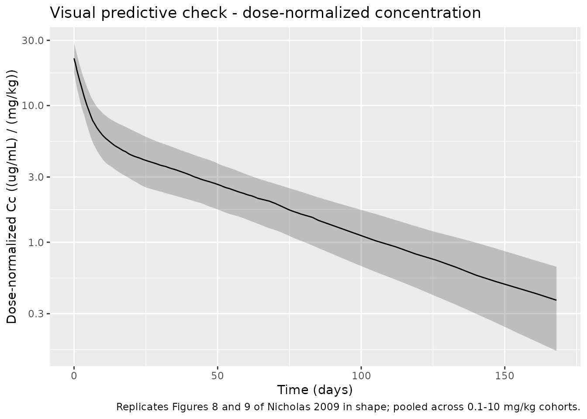
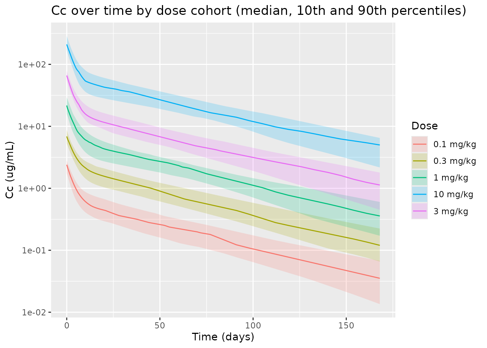

# Ponezumab (Nicholas 2009)

## Model and source

- Citation: Nicholas T, Knebel W, Gastonguay MR, Bednar MM, Billing B,
  Landen JW, Kupiec JW, Corrigan B, Laurencot R, Zhao Q. Preliminary
  population pharmacokinetic modeling of PF-04360365, a humanized
  anti-amyloid monoclonal antibody, in patients with mild-to-moderate
  alzheimer’s disease. Alzheimers Dement. 2009;5(4 Suppl):P425.
  <doi:10.1016/j.jalz.2009.04.270>
- Description: Two-compartment intravenous population PK model for
  PF-04360365 (ponezumab), a humanized anti-amyloid IgG2 delta-a
  monoclonal antibody, in adults with mild-to-moderate Alzheimer’s
  disease; allometric body-weight scaling with estimated exponents on
  every disposition parameter and a full 4x4 inter-individual block on
  (CL, V1, V2, Q) (Nicholas 2009 preliminary popPK)
- Article:
  [doi:10.1016/j.jalz.2009.04.270](https://doi.org/10.1016/j.jalz.2009.04.270)
- Open-access conference poster (Metrum/Pfizer):
  <https://metrumrg.com/wp-content/uploads/2018/08/PK_modeling_in_mild_-_mod.pdf>

Nicholas 2009 is a conference poster presented at the Alzheimer’s
Association International Conference 2009 and indexed in the Alzheimer’s
and Dementia supplement. It describes a preliminary two-compartment
intravenous population PK model for PF-04360365 (later named ponezumab),
a humanized anti-amyloid IgG2 delta-a monoclonal antibody developed by
Pfizer (Rinat) and discontinued after Phase II.

## Population

Nicholas 2009 fit the model to plasma PK data from 26 patients with
mild-to-moderate Alzheimer’s disease (Mini Mental State Examination
score 16-26) in a randomized, double-blind, placebo-controlled,
dose-escalation study (a further 11 placebo subjects were not used in
the analysis). Single intravenous doses of PF-04360365 spanning 0.1 to
10 mg/kg were administered. Patients were aged 60 to 80 years; weight
and sex distributions are not tabulated in the poster.

Plasma drug concentrations were measured by ELISA over an analytical
range of 156 to 10,000 ng/mL with intra- and inter-assay precisions
within 10 percent and accuracy (percent relative error) at or below 16.0
percent. Concentrations below the lower limit of quantification or
otherwise missing were excluded from the analysis, and subjects with no
quantifiable concentrations were dropped from the fit. The poster states
that covariate analysis was limited to the effect of body weight
(allometric scaling on every disposition parameter, with reference 70
kg) because the small sample size and narrow age range did not support
broader covariate exploration.

The same information is available programmatically via
`readModelDb("Nicholas_2009_ponezumab")$population`.

## Source trace

The per-parameter origin is recorded as an in-file comment next to each
`ini()` entry in `inst/modeldb/specificDrugs/Nicholas_2009_ponezumab.R`.
The table below collects them in one place for review.

| Equation / parameter | Value | Source location |
|----|----|----|
| `lcl` (CL at WT=70 kg) | 0.00684 L/h | Nicholas 2009 Table 1 Theta_1 (6% SE; 95% CI 0.00597-0.00771) |
| `lvc` (V1 at WT=70 kg) | 3.16 L | Nicholas 2009 Table 1 Theta_2 (3% SE; 95% CI 2.95-3.37) |
| `lq` (Q at WT=70 kg) | 0.0210 L/h | Nicholas 2009 Table 1 Theta_3 (10% SE; 95% CI 0.0170-0.0250) |
| `lvp` (V2 at WT=70 kg) | 5.34 L | Nicholas 2009 Table 1 Theta_4 (8% SE; 95% CI 4.49-6.18) |
| `e_wt_cl` (WT exp on CL) | 0.911 | Nicholas 2009 Table 1 Theta_5 (37% SE; 95% CI 0.370-1.45) |
| `e_wt_vc` (WT exp on V1) | 0.573 | Nicholas 2009 Table 1 Theta_6 (34% SE; 95% CI 0.194-0.951) |
| `e_wt_q` (WT exp on Q) | 0.236 | Nicholas 2009 Table 1 Theta_7 (126% SE; 95% CI -0.346-0.817) |
| `e_wt_vp` (WT exp on V2) | 0.590 | Nicholas 2009 Table 1 Theta_8 (54% SE; 95% CI -0.0288-1.20) |
| OMEGA 4x4 block on (CL, V1, V2, Q) | see file | Nicholas 2009 Table 1 inter-individual variance; full block omega per Methods |
| `propSd` (proportional SD) | 0.0999 | Nicholas 2009 Table 1 sigma^2 prop = 0.00998 (11% SE); SD = sqrt(0.00998) |
| `d/dt(central) <- -kel*central - k12*central + k21*peripheral1` | n/a | Nicholas 2009 Methods: “two-compartment model … implemented using ADVAN 3 TRANS4” |
| `d/dt(peripheral1) <- k12*central - k21*peripheral1` | n/a | Nicholas 2009 Methods: ADVAN3 TRANS4 |
| Reference weight 70 kg for the allometric power scaling | 70 kg | Nicholas 2009 Methods: “Allometric scaling was implemented using a reference weight of 70 kg.” |
| Exponential IIV (log-normal) on disposition parameters | n/a | Nicholas 2009 Methods: “Inter-individual random effects were modeled with exponential variance models. Covariance was described with a full block omega matrix.” |
| Proportional residual error structure | n/a | Nicholas 2009 Methods: “a proportional error model was utilized for the residual error model.” |

## Virtual cohort

The original observed data are not publicly available. The figures below
use a virtual population whose dose distribution spans the published
0.1-10 mg/kg range and whose body-weight distribution approximates a
typical mild-to-moderate Alzheimer’s disease cohort (median 70 kg, range
about 50-100 kg). The published study enrolled 26 active subjects across
the dose-escalation cohorts; we use 25 subjects per dose level (well
below the 200-per-arm validation cap) to characterise the typical-value
response and the inter-individual spread at each dose.

``` r

set.seed(20260625L)

dose_levels_mgkg <- c(0.1, 0.3, 1, 3, 10)
n_per_dose       <- 25L

make_cohort <- function(n, dose_mgkg, id_offset) {
  weights <- pmax(pmin(stats::rnorm(n, mean = 70, sd = 12), 100), 50)
  tibble::tibble(
    id      = id_offset + seq_len(n),
    WT      = weights,
    dose_mgkg = dose_mgkg,
    amt_mg    = dose_mgkg * weights
  )
}

subjects <- dplyr::bind_rows(
  lapply(seq_along(dose_levels_mgkg), function(i) {
    make_cohort(
      n         = n_per_dose,
      dose_mgkg = dose_levels_mgkg[i],
      id_offset = (i - 1L) * n_per_dose
    )
  })
)

# Dose row: single IV bolus into central at time 0.
dose_rows <- subjects |>
  dplyr::mutate(
    time = 0,
    evid = 1L,
    amt  = amt_mg,
    cmt  = "central",
    treatment = paste0(dose_mgkg, " mg/kg")
  ) |>
  dplyr::select(id, time, evid, amt, cmt, WT, dose_mgkg, treatment)

# Observation grid: dense early for Cmax/distribution, then weekly to ~day 85
# and biweekly out to ~day 168 to characterise the terminal phase.
obs_times_h <- c(
  seq(0, 24, by = 2),
  seq(48, 24 * 7, by = 12),
  seq(24 * 8, 24 * 85, by = 24),
  seq(24 * 91, 24 * 168, by = 24 * 7)
)

obs_rows <- tidyr::expand_grid(
  subjects |> dplyr::select(id, WT, dose_mgkg) |>
    dplyr::mutate(treatment = paste0(dose_mgkg, " mg/kg")),
  time = obs_times_h
) |>
  dplyr::mutate(
    evid = 0L,
    amt  = NA_real_,
    cmt  = "central"
  ) |>
  dplyr::select(id, time, evid, amt, cmt, WT, dose_mgkg, treatment)

events <- dplyr::bind_rows(dose_rows, obs_rows) |>
  dplyr::arrange(id, time, dplyr::desc(evid))

stopifnot(!anyDuplicated(unique(events[, c("id", "time", "evid")])))
```

## Simulation

``` r

mod <- readModelDb("Nicholas_2009_ponezumab")
sim <- rxode2::rxSolve(mod, events = events, keep = c("WT", "dose_mgkg", "treatment")) |>
  as.data.frame()
#> ℹ parameter labels from comments will be replaced by 'label()'
```

For deterministic replication (no between-subject variability), zero out
the random effects:

``` r

mod_typical <- mod |> rxode2::zeroRe()
#> ℹ parameter labels from comments will be replaced by 'label()'
sim_typical <- rxode2::rxSolve(mod_typical, events = events,
                               keep = c("WT", "dose_mgkg", "treatment")) |>
  as.data.frame()
#> ℹ omega/sigma items treated as zero: 'etalcl', 'etalvc', 'etalvp', 'etalq'
#> Warning: multi-subject simulation without without 'omega'
```

## Replicate published figures

### Figure 8/9 - Visual predictive check (dose-normalized concentration)

Nicholas 2009 Figures 8 and 9 present visual predictive checks for
plasma PF-04360365 concentrations with 80% prediction intervals. Figure
8 covers day 1 to 85, and Figure 9 covers all post-dose data. Both plot
dose-normalised concentrations on a log scale. The replication here is
the 80% prediction interval (5th and 95th percentiles) of the simulated
dose-normalised concentration over time, pooled across the 0.1-10 mg/kg
range. The poster does not provide per-time-point reference values, so
this replication is qualitative (shape of the median + bounds) rather
than a point comparison.

``` r

vpc_dn <- sim |>
  dplyr::filter(!is.na(Cc)) |>
  dplyr::mutate(time_day = time / 24,
                Cc_dn    = ifelse(Cc > 0, Cc / dose_mgkg, NA_real_)) |>
  dplyr::group_by(time_day) |>
  dplyr::summarise(
    Q05 = stats::quantile(Cc_dn, 0.10, na.rm = TRUE),
    Q50 = stats::quantile(Cc_dn, 0.50, na.rm = TRUE),
    Q95 = stats::quantile(Cc_dn, 0.90, na.rm = TRUE),
    .groups = "drop"
  )

ggplot(vpc_dn, aes(time_day, Q50)) +
  geom_ribbon(aes(ymin = Q05, ymax = Q95), alpha = 0.25) +
  geom_line() +
  scale_y_log10() +
  labs(
    x = "Time (days)",
    y = "Dose-normalized Cc ((ug/mL) / (mg/kg))",
    title = "Visual predictive check - dose-normalized concentration",
    caption = "Replicates Figures 8 and 9 of Nicholas 2009 in shape; pooled across 0.1-10 mg/kg cohorts."
  )
```



### Concentration-time curves by dose

A complementary view shows median concentrations per dose group on a log
y-axis. The proportional spacing of the curves and the parallel terminal
slopes are consistent with linear two-compartment disposition as
described in Nicholas 2009 Results (“The PK profile of PF-04360365
appeared linear”).

``` r

by_dose <- sim |>
  dplyr::filter(!is.na(Cc)) |>
  dplyr::mutate(time_day = time / 24,
                Cc       = ifelse(Cc > 0, Cc, NA_real_)) |>
  dplyr::group_by(treatment, dose_mgkg, time_day) |>
  dplyr::summarise(
    Q05 = stats::quantile(Cc, 0.10, na.rm = TRUE),
    Q50 = stats::quantile(Cc, 0.50, na.rm = TRUE),
    Q95 = stats::quantile(Cc, 0.90, na.rm = TRUE),
    .groups = "drop"
  )

ggplot(by_dose, aes(time_day, Q50, colour = treatment, fill = treatment)) +
  geom_ribbon(aes(ymin = Q05, ymax = Q95), alpha = 0.20, colour = NA) +
  geom_line() +
  scale_y_log10() +
  labs(
    x = "Time (days)",
    y = "Cc (ug/mL)",
    colour = "Dose",
    fill = "Dose",
    title = "Cc over time by dose cohort (median, 10th and 90th percentiles)"
  )
```



## PKNCA validation

Nicholas 2009 does not tabulate NCA parameter values, so the PKNCA
results below stand on their own as an internal validation of the
simulation output: the proportionality of Cmax and AUC to dose confirms
the linearity reported in the paper, and the terminal half-life is
consistent with the disposition parameters in Table 1.

``` r

sim_nca <- sim |>
  dplyr::filter(!is.na(Cc)) |>
  dplyr::select(id, time, Cc, treatment)

# Guarantee a time = 0 row per (id, treatment); for an IV bolus delivered at
# time 0 the simulation already reports Cc at t = 0 (= dose / vc) but defend
# explicitly so the PKNCA AUC anchor is never lost.
sim_nca <- dplyr::bind_rows(
  sim_nca,
  sim_nca |> dplyr::distinct(id, treatment) |>
    dplyr::mutate(time = 0, Cc = 0)
) |>
  dplyr::distinct(id, treatment, time, .keep_all = TRUE) |>
  dplyr::arrange(id, treatment, time)

dose_df <- events |>
  dplyr::filter(evid == 1) |>
  dplyr::select(id, time, amt, treatment)

conc_obj <- PKNCA::PKNCAconc(
  sim_nca, Cc ~ time | treatment + id,
  concu = "ug/mL", timeu = "h"
)
dose_obj <- PKNCA::PKNCAdose(
  dose_df, amt ~ time | treatment + id,
  doseu = "mg"
)

intervals <- data.frame(
  start       = 0,
  end         = Inf,
  cmax        = TRUE,
  tmax        = TRUE,
  aucinf.obs  = TRUE,
  half.life   = TRUE,
  clast.obs   = TRUE,
  lambda.z    = TRUE
)

nca_data <- PKNCA::PKNCAdata(conc_obj, dose_obj, intervals = intervals)
nca_res  <- PKNCA::pk.nca(nca_data)

nca_summary <- as.data.frame(nca_res$result) |>
  dplyr::group_by(treatment, PPTESTCD) |>
  dplyr::summarise(
    median = stats::median(PPORRES, na.rm = TRUE),
    q05    = stats::quantile(PPORRES, 0.05, na.rm = TRUE),
    q95    = stats::quantile(PPORRES, 0.95, na.rm = TRUE),
    .groups = "drop"
  ) |>
  dplyr::filter(PPTESTCD %in% c("cmax", "tmax", "aucinf.obs", "half.life")) |>
  dplyr::mutate(parameter = nlmixr2lib::ncaParamLabel(PPTESTCD)) |>
  dplyr::select(treatment, parameter, median, q05, q95)

knitr::kable(
  nca_summary,
  digits  = 3,
  caption = "Simulated NCA per dose cohort (median, 5th and 95th percentiles)."
)
```

| treatment | parameter    |     median |       q05 |        q95 |
|:----------|:-------------|-----------:|----------:|-----------:|
| 0.1 mg/kg | AUC0-∞ (obs) |   1050.902 |   613.673 |   1446.248 |
| 0.1 mg/kg | Cmax         |      2.396 |     1.579 |      2.971 |
| 0.1 mg/kg | t½           |   1035.202 |   625.434 |   1403.955 |
| 0.1 mg/kg | Tmax         |      0.000 |     0.000 |      0.000 |
| 0.3 mg/kg | AUC0-∞ (obs) |   3450.033 |  2261.395 |   5175.814 |
| 0.3 mg/kg | Cmax         |      6.863 |     5.184 |      9.001 |
| 0.3 mg/kg | t½           |    979.353 |   745.844 |   1228.773 |
| 0.3 mg/kg | Tmax         |      0.000 |     0.000 |      0.000 |
| 1 mg/kg   | AUC0-∞ (obs) |  10476.486 |  7027.789 |  12722.366 |
| 1 mg/kg   | Cmax         |     21.661 |    15.604 |     30.390 |
| 1 mg/kg   | t½           |    996.327 |   732.396 |   1365.527 |
| 1 mg/kg   | Tmax         |      0.000 |     0.000 |      0.000 |
| 10 mg/kg  | AUC0-∞ (obs) | 102000.707 | 78913.094 | 140779.845 |
| 10 mg/kg  | Cmax         |    209.720 |   163.761 |    297.831 |
| 10 mg/kg  | t½           |   1089.342 |   753.141 |   1571.804 |
| 10 mg/kg  | Tmax         |      0.000 |     0.000 |      0.000 |
| 3 mg/kg   | AUC0-∞ (obs) |  26209.590 | 20216.116 |  36549.136 |
| 3 mg/kg   | Cmax         |     65.986 |    52.691 |     81.093 |
| 3 mg/kg   | t½           |    975.609 |   748.563 |   1387.755 |
| 3 mg/kg   | Tmax         |      0.000 |     0.000 |      0.000 |

Simulated NCA per dose cohort (median, 5th and 95th percentiles).
{.table}

A linearity check: Cmax and AUC0-inf should scale linearly with dose,
within Monte Carlo noise.

``` r

linearity <- as.data.frame(nca_res$result) |>
  dplyr::filter(PPTESTCD %in% c("cmax", "aucinf.obs")) |>
  dplyr::left_join(
    subjects |> dplyr::select(id, dose_mgkg),
    by = "id"
  ) |>
  dplyr::group_by(dose_mgkg, PPTESTCD) |>
  dplyr::summarise(median = stats::median(PPORRES, na.rm = TRUE),
                   .groups = "drop") |>
  tidyr::pivot_wider(names_from = PPTESTCD, values_from = median) |>
  dplyr::mutate(
    cmax_per_mgkg       = cmax / dose_mgkg,
    aucinf_obs_per_mgkg = aucinf.obs / dose_mgkg
  )

knitr::kable(
  linearity,
  digits  = c(2, 3, 1, 4, 2),
  caption = "Dose-normalised median Cmax and AUC0-inf by cohort. Approximately constant values indicate linear disposition (Nicholas 2009 Results)."
)
```

| dose_mgkg | aucinf.obs |  cmax | cmax_per_mgkg | aucinf_obs_per_mgkg |
|----------:|-----------:|------:|--------------:|--------------------:|
|       0.1 |   1050.902 |   2.4 |       23.9586 |            10509.02 |
|       0.3 |   3450.033 |   6.9 |       22.8759 |            11500.11 |
|       1.0 |  10476.486 |  21.7 |       21.6610 |            10476.49 |
|       3.0 |  26209.590 |  66.0 |       21.9954 |             8736.53 |
|      10.0 | 102000.707 | 209.7 |       20.9720 |            10200.07 |

Dose-normalised median Cmax and AUC0-inf by cohort. Approximately
constant values indicate linear disposition (Nicholas 2009 Results).
{.table}

## Assumptions and deviations

- Body-weight distribution: the poster does not tabulate weights for the
  26 subjects. The virtual cohort uses a truncated normal distribution
  centred at 70 kg (mean 70, SD 12, clamped to 50-100 kg) to span
  typical adult mild-to-moderate AD weights. The allometric reference
  weight 70 kg is taken from Nicholas 2009 Methods.
- Dose levels: the poster reports a single intravenous dose range of
  0.1-10 mg/kg without specifying which dose levels were used. The
  virtual cohort uses 0.1, 0.3, 1, 3, and 10 mg/kg as representative
  single doses spanning the reported range.
- Sex, race / ethnicity, and region distributions are not tabulated in
  the poster and are not used as covariates in the model.
- Concentration units: the poster reports concentrations in ng/mL on the
  ELISA scale (analytical range 156-10,000 ng/mL). The model encodes
  concentrations as Cc = central / vc in mg/L = ug/mL given dose in mg
  and volume in L. Plots and tables therefore display ug/mL; multiplying
  by 1000 converts to ng/mL on the poster scale.
- The poster does not tabulate numerical NCA parameter values; the PKNCA
  section presents simulated NCA without a published reference for
  comparison.
- The poster notes that Theta_7 (allometric exponent on Q) and Theta_8
  (allometric exponent on V2) are imprecisely estimated (95% CIs
  crossing or near zero). These point estimates are encoded as reported;
  the imprecision is documented in the source-trace table.
- IV bolus dosing is used in the simulation. The poster does not state
  whether the doses were given as bolus or short infusion; for a mAb the
  difference at typical sampling resolution is negligible, and the model
  is parameterised by CL/V1/Q/V2 without an explicit infusion
  compartment.
