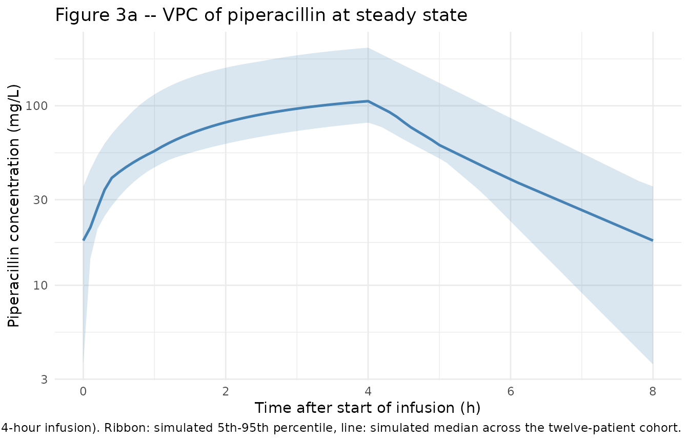
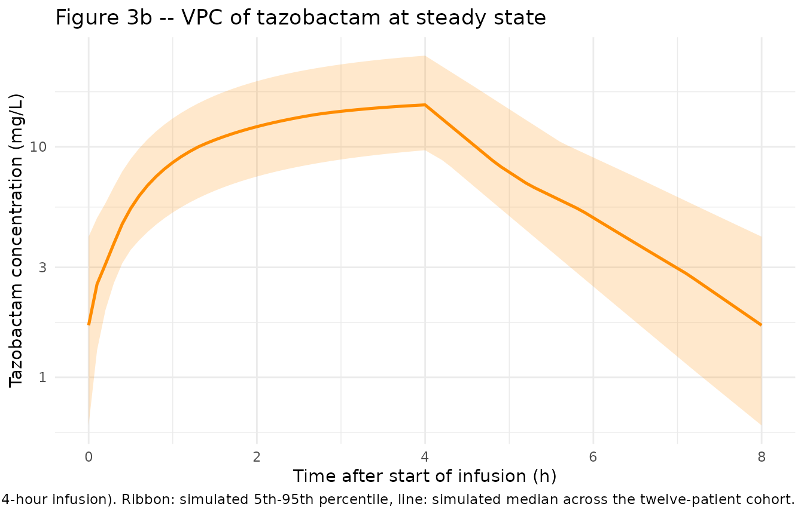

# Piperacillin + tazobactam (Nichols 2016)

## Models and source

Two independent one-compartment population PK models for the components
of extended-infusion piperacillin-tazobactam (TZP) in critically ill
children. The authors fit piperacillin and tazobactam separately by
NONMEM (FOCEi) sharing only the underlying patient cohort; the two
[`modellib()`](https://nlmixr2.github.io/nlmixr2lib/reference/modellib.md)
entries below mirror that independent-fit structure.

- Piperacillin: Nichols K, Chung EK, Knoderer CA, Buenger LE, Healy DP,
  Dees J, Crumby AS, Kays MB. Population pharmacokinetics and
  pharmacodynamics of extended-infusion piperacillin and tazobactam in
  critically ill children. Antimicrob Agents Chemother.
  2016;60(1):522-531. <doi:10.1128/AAC.02089-15>.
- Tazobactam: Nichols K, Chung EK, Knoderer CA, Buenger LE, Healy DP,
  Dees J, Crumby AS, Kays MB. Population pharmacokinetics and
  pharmacodynamics of extended-infusion piperacillin and tazobactam in
  critically ill children. Antimicrob Agents Chemother.
  2016;60(1):522-531. <doi:10.1128/AAC.02089-15>.
- Article: <https://doi.org/10.1128/AAC.02089-15>

## Population

Nichols et al. (2016) developed independent one-compartment population
PK models for piperacillin and tazobactam in twelve children (six
female, six male) hospitalised in the Riley Hospital for Children
pediatric intensive care unit and receiving extended-infusion
piperacillin-tazobactam (100 mg/kg piperacillin and 12.5 mg/kg
tazobactam, 8:1 ratio) every 8 hours infused over 4 hours, as part of
routine care for suspected or proven bacterial infection. Indications
spanned ventilator-associated pneumonia, sepsis, central line-associated
bloodstream infection, neutropenic fever, and pneumonia in patients with
complex congenital heart disease, cerebral palsy, traumatic brain
injury, and post-transplant complications (Table 1).

The cohort spanned age 12 months to 9 years (median 5 years, IQR
1.75-6.5), body weight 9.5-30.1 kg (median 17.8 kg, IQR 11.4-20), and
estimated glomerular filtration rate 86-189 mL/min/1.73 m^2 (modified
Schwartz; median 103). Patients with eGFR \< 60 mL/min/1.73 m^2 or
receiving any form of renal replacement therapy were excluded. Each
patient contributed six serum samples at steady state (pre-dose and at
2, 4 \[end of infusion\], 5, 6, and 8 hours after the start of the study
dose), for a total of 72 piperacillin and 72 tazobactam concentrations.

The same metadata is available programmatically via
`readModelDb("Nichols_2016_piperacillin")()$population` and
`readModelDb("Nichols_2016_tazobactam")()$population`.

## Source trace

The per-parameter origin is recorded as an in-file comment next to each
`ini()` entry. The table below collects them in one place.

| Equation / parameter | Value | Source location |
|----|----|----|
| **Piperacillin** |  |  |
| `lcl` (CL at WT = 18 kg, L/h) | `log(3.51)` | Nichols 2016 Table 2: theta1 = 3.51 L/h (%SE 6.5) |
| `lvc` (V, L) | `log(6.58)` | Nichols 2016 Table 2: theta2 = 6.58 L (%SE 10.6) |
| `e_wt_cl` (linear WT slope on CL, L/h/kg) | `0.0814` | Nichols 2016 Table 2: theta3 = 0.0814 (%SE 45.1) |
| `bw_ref` (reference WT, kg) | `18` | Nichols 2016 Results final-model paragraph (CL = 3.51 + 0.0814 \* (WT - 18)) |
| `etalcl` (omega_CL) | `0.029497` (17.3% CV) | Nichols 2016 Table 2: omega_CL 17.3% CV; omega^2 = log(1 + CV^2) |
| `etalvc` (omega_V) | `0.061539` (25.2% CV) | Nichols 2016 Table 2: omega_V 25.2% CV |
| `propSd` (proportional residual) | `0.253` | Nichols 2016 Table 2: sigma_proportional 25.3% CV |
| Eq. CL (linear-additive WT) | n/a | Nichols 2016 Results: “CL (in liters per hour) = 3.51 + \[0.0814 \* (WT - 18)\], and V was equal to 6.58 liters” |
| Eq. d/dt(central) (1-cmt IV) | n/a | Nichols 2016 Population pharmacokinetic modeling subsection (Materials and Methods) |
| **Tazobactam** |  |  |
| `lcl` (CL at WT = 18 kg, male, L/h) | `log(3.43)` | Nichols 2016 Table 2: theta1 = 3.43 L/h (%SE 5.9) |
| `lvc` (V, L) | `log(5.54)` | Nichols 2016 Table 2: theta2 = 5.54 L (%SE 8.9) |
| `e_sexf_cl` (female-sex factor on CL) | `-0.285` | Nichols 2016 Table 2: theta3 = -0.285 (%SE 20.9) |
| `e_wt_cl` (linear WT slope on CL, L/h/kg) | `0.0676` | Nichols 2016 Table 2: theta4 = 0.0676 (%SE 38.6) |
| `bw_ref` (reference WT, kg) | `18` | Nichols 2016 Results final-model paragraph |
| `etalcl` (omega_CL) | `0.017028` (13.1% CV) | Nichols 2016 Table 2: omega_CL 13.1% CV |
| `propSd` (proportional residual) | `0.272` | Nichols 2016 Table 2: sigma_proportional 27.2% CV |
| `addSd` (additive residual, mg/L) | `0.76` | Nichols 2016 Table 2: sigma_additive 0.76 mg/L (%SE 47.8) |
| Eq. CL (female + WT) | n/a | Nichols 2016 Results: “CL (in liters per hour) = {3.43 \* \[1 - (0.285 \* sex)\]} + \[0.0676 \* (WT - 18)\], and V was equal to 5.54 liters” |

## Virtual cohort

Original observed concentrations are not publicly available. The
simulation below uses the twelve actual patient demographics reported in
Nichols 2016 Table 1 (per-patient weight and sex), each receiving the
protocol regimen of 100 mg/kg piperacillin (12.5 mg/kg tazobactam) every
8 hours infused over 4 hours, simulated to steady state.

``` r

set.seed(2016)

# Per-patient demographics from Nichols 2016 Table 1 (12 children).
# Sex: 1 = female, 0 = male (canonical SEXF).
nichols_table1 <- tibble::tibble(
  pat_id = 1:12,
  WT     = c(20.0, 18.8, 11.9, 19.7, 9.5, 10.0, 14.5, 16.8, 23.0, 30.1, 9.6, 20.0),
  SEXF   = c(   0,    1,    1,    0,   1,    1,    0,    0,    1,    1,   0,    0)
)

# Dosing regimen from Nichols 2016 Methods (Study design and blood sampling):
# 100 mg/kg piperacillin component, 12.5 mg/kg tazobactam component,
# every 8 hours, infused over 4 hours, maximum 3,000 mg of the piperacillin
# component per dose.
DOSE_MG_PIP_PER_KG  <- 100
DOSE_MG_TAZ_PER_KG  <- 12.5
T_INF               <- 4    # hour 4-hour extended infusion
DOSE_INTERVAL       <- 8    # hours
N_DOSES_TO_SS       <- 10   # ten doses to reach steady state (paper: median 5 prior doses)

# Steady-state sampling grid: dense over the final 8-hour dosing interval
# to support PKNCA (Cmax/Tmax/AUC/half-life over the last tau).
last_dose_start <- (N_DOSES_TO_SS - 1L) * DOSE_INTERVAL
ss_obs_times    <- last_dose_start + seq(0, DOSE_INTERVAL, by = 0.1)

make_subject <- function(row, drug = c("pip", "taz"), id_offset = 0L) {
  drug <- match.arg(drug)
  dose_mg <- if (drug == "pip") {
    pmin(DOSE_MG_PIP_PER_KG * row$WT, 3000)
  } else {
    DOSE_MG_TAZ_PER_KG * row$WT
  }
  ev <- rxode2::et(
    amt   = dose_mg,
    rate  = dose_mg / T_INF,
    cmt   = "central",
    ii    = DOSE_INTERVAL,
    addl  = N_DOSES_TO_SS - 1L,
    time  = 0
  )
  ev <- rxode2::et(ev, ss_obs_times)
  df <- as.data.frame(ev)
  df$WT     <- row$WT
  df$SEXF   <- row$SEXF
  df$id     <- id_offset + row$pat_id
  df$drug   <- drug
  df$cohort <- if (drug == "pip") "Piperacillin" else "Tazobactam"
  df
}

events_pip <- dplyr::bind_rows(lapply(seq_len(nrow(nichols_table1)), function(i)
  make_subject(nichols_table1[i, ], drug = "pip", id_offset = 0L)))
events_taz <- dplyr::bind_rows(lapply(seq_len(nrow(nichols_table1)), function(i)
  make_subject(nichols_table1[i, ], drug = "taz", id_offset = 100L)))

stopifnot(!anyDuplicated(unique(events_pip[, c("id", "time", "evid")])))
stopifnot(!anyDuplicated(unique(events_taz[, c("id", "time", "evid")])))
```

## Simulation

Simulate piperacillin and tazobactam concentrations under the protocol
regimen at steady state. The deterministic typical-value profile (no
IIV) is used for the figure replicates because Nichols 2016 Figure 3
plots a visual predictive check whose central line is the simulated
median.

``` r

mod_pip <- readModelDb("Nichols_2016_piperacillin")()
mod_taz <- readModelDb("Nichols_2016_tazobactam")()

# Stochastic simulation (full IIV) for VPC-style figures
sim_pip <- rxode2::rxSolve(mod_pip, events = events_pip,
                           keep = c("cohort", "WT", "SEXF")) |>
  as.data.frame()
sim_taz <- rxode2::rxSolve(mod_taz, events = events_taz,
                           keep = c("cohort", "WT", "SEXF")) |>
  as.data.frame()

# Typical-value profiles (zero IIV) for parameter-distribution audit
sim_pip_typ <- rxode2::rxSolve(rxode2::zeroRe(mod_pip), events = events_pip,
                               keep = c("cohort", "WT", "SEXF")) |>
  as.data.frame()
#> ℹ omega/sigma items treated as zero: 'etalcl', 'etalvc'
#> Warning: multi-subject simulation without without 'omega'
sim_taz_typ <- rxode2::rxSolve(rxode2::zeroRe(mod_taz), events = events_taz,
                               keep = c("cohort", "WT", "SEXF")) |>
  as.data.frame()
#> ℹ omega/sigma items treated as zero: 'etalcl'
#> Warning: multi-subject simulation without without 'omega'
```

## Replicate published figures

### Figure 3 – VPC over the steady-state 8-hour dosing interval

Nichols 2016 Figure 3 shows visual predictive checks for piperacillin
(panel a) and tazobactam (panel b) at the protocol regimen (100/12.5
mg/kg every 8 h infused over 4 h). The replicate below computes the
simulated 5th, 50th, and 95th percentile profiles across the
twelve-patient cohort, using the final dosing interval at steady state,
plotted on the time-after-last-dose axis used by the paper.

``` r

last_dose_t <- last_dose_start

vpc_pip <- sim_pip |>
  dplyr::filter(time >= last_dose_t,
                time <= last_dose_t + DOSE_INTERVAL,
                !is.na(Cc), Cc > 0) |>
  dplyr::mutate(tad = time - last_dose_t) |>
  dplyr::group_by(tad) |>
  dplyr::summarise(
    Q05 = quantile(Cc, 0.05, na.rm = TRUE),
    Q50 = quantile(Cc, 0.50, na.rm = TRUE),
    Q95 = quantile(Cc, 0.95, na.rm = TRUE),
    .groups = "drop"
  )

ggplot(vpc_pip, aes(tad, Q50)) +
  geom_ribbon(aes(ymin = Q05, ymax = Q95), alpha = 0.20, fill = "steelblue") +
  geom_line(linewidth = 0.9, colour = "steelblue") +
  scale_y_log10() +
  labs(
    x       = "Time after start of infusion (h)",
    y       = "Piperacillin concentration (mg/L)",
    title   = "Figure 3a -- VPC of piperacillin at steady state",
    caption = paste(
      "Replicates Figure 3a of Nichols 2016 (100 mg/kg piperacillin q8h,",
      "4-hour infusion). Ribbon: simulated 5th-95th percentile,",
      "line: simulated median across the twelve-patient cohort."
    )
  ) +
  theme_minimal()
```



``` r

vpc_taz <- sim_taz |>
  dplyr::filter(time >= last_dose_t,
                time <= last_dose_t + DOSE_INTERVAL,
                !is.na(Cc), Cc > 0) |>
  dplyr::mutate(tad = time - last_dose_t) |>
  dplyr::group_by(tad) |>
  dplyr::summarise(
    Q05 = quantile(Cc, 0.05, na.rm = TRUE),
    Q50 = quantile(Cc, 0.50, na.rm = TRUE),
    Q95 = quantile(Cc, 0.95, na.rm = TRUE),
    .groups = "drop"
  )

ggplot(vpc_taz, aes(tad, Q50)) +
  geom_ribbon(aes(ymin = Q05, ymax = Q95), alpha = 0.20, fill = "darkorange") +
  geom_line(linewidth = 0.9, colour = "darkorange") +
  scale_y_log10() +
  labs(
    x       = "Time after start of infusion (h)",
    y       = "Tazobactam concentration (mg/L)",
    title   = "Figure 3b -- VPC of tazobactam at steady state",
    caption = paste(
      "Replicates Figure 3b of Nichols 2016 (12.5 mg/kg tazobactam q8h,",
      "4-hour infusion). Ribbon: simulated 5th-95th percentile,",
      "line: simulated median across the twelve-patient cohort."
    )
  ) +
  theme_minimal()
```



### Typical-value individual-PK parameter check

Table 3 of Nichols 2016 reports the mean +/- SD (range) for the
per-patient pharmacokinetic parameters back-calculated from the final
models. The table below compares the model-derived typical-value CL and
V across the twelve patients against the published Table 3 means.

``` r

# Piperacillin: typical CL = 3.51 + 0.0814 * (WT - 18); V = 6.58 L (constant)
typ_pip <- nichols_table1 |>
  dplyr::mutate(
    CL_typical = 3.51 + 0.0814 * (WT - 18),
    V_typical  = 6.58,
    CL_per_kg  = CL_typical / WT,
    V_per_kg   = V_typical / WT
  )

knitr::kable(
  typ_pip |>
    dplyr::summarise(
      n            = dplyr::n(),
      `CL (L/h)`           = sprintf("%.2f +/- %.2f (%.2f-%.2f)",
                                     mean(CL_typical), sd(CL_typical),
                                     min(CL_typical), max(CL_typical)),
      `CL (L/h/kg)`        = sprintf("%.2f +/- %.2f (%.2f-%.2f)",
                                     mean(CL_per_kg), sd(CL_per_kg),
                                     min(CL_per_kg), max(CL_per_kg)),
      `V  (L)`             = sprintf("%.2f +/- %.2f (%.2f-%.2f)",
                                     mean(V_typical), sd(V_typical),
                                     min(V_typical), max(V_typical)),
      `V  (L/kg)`          = sprintf("%.2f +/- %.2f (%.2f-%.2f)",
                                     mean(V_per_kg), sd(V_per_kg),
                                     min(V_per_kg), max(V_per_kg))
    ),
  caption = "Piperacillin: model-derived typical CL and V across Nichols 2016 Table 1 demographics; compare to Table 3 of the paper."
)
```

| n | CL (L/h) | CL (L/h/kg) | V (L) | V (L/kg) |
|---:|:---|:---|:---|:---|
| 12 | 3.43 +/- 0.51 (2.82-4.49) | 0.22 +/- 0.05 (0.15-0.30) | 6.58 +/- 0.00 (6.58-6.58) | 0.44 +/- 0.17 (0.22-0.69) |

Piperacillin: model-derived typical CL and V across Nichols 2016 Table 1
demographics; compare to Table 3 of the paper. {.table}

``` r

# Tazobactam: typical CL = 3.43 * (1 - 0.285 * SEXF) + 0.0676 * (WT - 18);
# V = 5.54 L (constant; no IIV on V)
typ_taz <- nichols_table1 |>
  dplyr::mutate(
    CL_typical = 3.43 * (1 - 0.285 * SEXF) + 0.0676 * (WT - 18),
    V_typical  = 5.54,
    CL_per_kg  = CL_typical / WT,
    V_per_kg   = V_typical / WT
  )

knitr::kable(
  typ_taz |>
    dplyr::summarise(
      n            = dplyr::n(),
      `CL (L/h)`           = sprintf("%.2f +/- %.2f (%.2f-%.2f)",
                                     mean(CL_typical), sd(CL_typical),
                                     min(CL_typical), max(CL_typical)),
      `CL (L/h/kg)`        = sprintf("%.2f +/- %.2f (%.2f-%.2f)",
                                     mean(CL_per_kg), sd(CL_per_kg),
                                     min(CL_per_kg), max(CL_per_kg)),
      `V  (L)`             = sprintf("%.2f +/- %.2f (%.2f-%.2f)",
                                     mean(V_typical), sd(V_typical),
                                     min(V_typical), max(V_typical)),
      `V  (L/kg)`          = sprintf("%.2f +/- %.2f (%.2f-%.2f)",
                                     mean(V_per_kg), sd(V_per_kg),
                                     min(V_per_kg), max(V_per_kg))
    ),
  caption = "Tazobactam: model-derived typical CL and V across Nichols 2016 Table 1 demographics; compare to Table 3 of the paper."
)
```

| n | CL (L/h) | CL (L/h/kg) | V (L) | V (L/kg) |
|---:|:---|:---|:---|:---|
| 12 | 2.87 +/- 0.65 (1.88-3.57) | 0.18 +/- 0.05 (0.11-0.30) | 5.54 +/- 0.00 (5.54-5.54) | 0.37 +/- 0.14 (0.18-0.58) |

Tazobactam: model-derived typical CL and V across Nichols 2016 Table 1
demographics; compare to Table 3 of the paper. {.table}

## PKNCA validation

Steady-state non-compartmental analysis over the final 8-hour dosing
interval, separately for piperacillin and tazobactam. Cmax, Cmin (Ctau),
AUC0-tau, and half-life are computed from the typical-value (zero-IIV)
simulation so the cross-patient distribution is driven solely by the
twelve documented covariate patterns rather than by stochastic noise;
that matches the paper’s Table 3, which lists per-patient model-derived
parameters with no residual error.

``` r

sim_pip_ss <- sim_pip_typ |>
  dplyr::filter(time >= last_dose_t,
                time <= last_dose_t + DOSE_INTERVAL,
                !is.na(Cc), Cc > 0)

# The simulation uses rxode2::et(addl = 9) which emits a single seed dose
# row; build an explicit dose row at the start of the final steady-state
# interval so PKNCA can locate Cmax / AUC0-tau against it.
dose_pip <- nichols_table1 |>
  dplyr::mutate(
    id     = pat_id,
    time   = last_dose_t,
    amt    = pmin(DOSE_MG_PIP_PER_KG * WT, 3000),
    cohort = "Piperacillin"
  ) |>
  dplyr::select(id, time, amt, cohort)

conc_pip_obj <- PKNCA::PKNCAconc(
  sim_pip_ss |> dplyr::select(id, time, Cc, cohort),
  Cc ~ time | cohort + id,
  concu = "mg/L",
  timeu = "hour"
)
dose_pip_obj <- PKNCA::PKNCAdose(
  dose_pip, amt ~ time | cohort + id,
  route = "intravascular",
  doseu = "mg"
)

intervals <- data.frame(
  start     = last_dose_t,
  end       = last_dose_t + DOSE_INTERVAL,
  cmax      = TRUE,
  cmin      = TRUE,
  auclast   = TRUE,
  half.life = TRUE
)

nca_pip <- suppressWarnings(
  PKNCA::pk.nca(PKNCA::PKNCAdata(conc_pip_obj, dose_pip_obj, intervals = intervals))
)
nca_pip_df <- as.data.frame(nca_pip$result)

nca_pip_summary <- nca_pip_df |>
  dplyr::group_by(PPTESTCD) |>
  dplyr::summarise(
    n      = dplyr::n(),
    mean   = round(mean(PPORRES, na.rm = TRUE), 2),
    sd     = round(sd(PPORRES, na.rm = TRUE), 2),
    min    = round(min(PPORRES, na.rm = TRUE), 2),
    max    = round(max(PPORRES, na.rm = TRUE), 2),
    .groups = "drop"
  )
knitr::kable(
  nca_pip_summary,
  caption = "Piperacillin steady-state NCA (mean, SD, range) over the final 8-hour interval, typical-value simulation across the twelve Table 1 patients."
)
```

| PPTESTCD            |   n |   mean |     sd |    min |    max |
|:--------------------|----:|-------:|-------:|-------:|-------:|
| adj.r.squared       |  12 |   1.00 |   0.00 |   1.00 |   1.00 |
| auclast             |  12 | 481.03 | 107.01 | 337.09 | 667.33 |
| clast.pred          |  12 |  12.98 |   0.97 |  10.19 |  13.87 |
| cmax                |  12 | 107.29 |  27.26 |  71.40 | 156.66 |
| cmin                |  12 |  12.98 |   0.97 |  10.19 |  13.87 |
| half.life           |  12 |   1.36 |   0.19 |   1.01 |   1.62 |
| lambda.z            |  12 |   0.52 |   0.08 |   0.43 |   0.68 |
| lambda.z.n.points   |  12 |  40.00 |   0.00 |  40.00 |  40.00 |
| lambda.z.time.first |  12 |   4.10 |   0.00 |   4.10 |   4.10 |
| lambda.z.time.last  |  12 |   8.00 |   0.00 |   8.00 |   8.00 |
| r.squared           |  12 |   1.00 |   0.00 |   1.00 |   1.00 |
| span.ratio          |  12 |   2.93 |   0.43 |   2.41 |   3.84 |
| tlast               |  12 |   8.00 |   0.00 |   8.00 |   8.00 |
| tmax                |  12 |   4.00 |   0.00 |   4.00 |   4.00 |

Piperacillin steady-state NCA (mean, SD, range) over the final 8-hour
interval, typical-value simulation across the twelve Table 1 patients.
{.table}

``` r

sim_taz_ss <- sim_taz_typ |>
  dplyr::filter(time >= last_dose_t,
                time <= last_dose_t + DOSE_INTERVAL,
                !is.na(Cc), Cc > 0)

# Tazobactam events use id_offset = 100 (cohort namespace separation);
# match it here so the PKNCA id matches the simulated id.
dose_taz <- nichols_table1 |>
  dplyr::mutate(
    id     = pat_id + 100L,
    time   = last_dose_t,
    amt    = DOSE_MG_TAZ_PER_KG * WT,
    cohort = "Tazobactam"
  ) |>
  dplyr::select(id, time, amt, cohort)

conc_taz_obj <- PKNCA::PKNCAconc(
  sim_taz_ss |> dplyr::select(id, time, Cc, cohort),
  Cc ~ time | cohort + id,
  concu = "mg/L",
  timeu = "hour"
)
dose_taz_obj <- PKNCA::PKNCAdose(
  dose_taz, amt ~ time | cohort + id,
  route = "intravascular",
  doseu = "mg"
)

nca_taz <- suppressWarnings(
  PKNCA::pk.nca(PKNCA::PKNCAdata(conc_taz_obj, dose_taz_obj, intervals = intervals))
)
nca_taz_df <- as.data.frame(nca_taz$result)

nca_taz_summary <- nca_taz_df |>
  dplyr::group_by(PPTESTCD) |>
  dplyr::summarise(
    n      = dplyr::n(),
    mean   = round(mean(PPORRES, na.rm = TRUE), 2),
    sd     = round(sd(PPORRES, na.rm = TRUE), 2),
    min    = round(min(PPORRES, na.rm = TRUE), 2),
    max    = round(max(PPORRES, na.rm = TRUE), 2),
    .groups = "drop"
  )
knitr::kable(
  nca_taz_summary,
  caption = "Tazobactam steady-state NCA (mean, SD, range) over the final 8-hour interval, typical-value simulation across the twelve Table 1 patients."
)
```

| PPTESTCD            |   n |  mean |    sd |   min |    max |
|:--------------------|----:|------:|------:|------:|-------:|
| adj.r.squared       |  12 |  1.00 |  0.00 |  1.00 |   1.00 |
| auclast             |  12 | 73.70 | 20.47 | 41.92 | 115.04 |
| clast.pred          |  12 |  2.18 |  1.01 |  1.18 |   3.40 |
| cmax                |  12 | 16.24 |  4.73 |  9.30 |  26.28 |
| cmin                |  12 |  2.18 |  1.01 |  1.18 |   3.40 |
| half.life           |  12 |  1.41 |  0.37 |  1.08 |   2.04 |
| lambda.z            |  12 |  0.52 |  0.12 |  0.34 |   0.64 |
| lambda.z.n.points   |  12 | 40.00 |  0.00 | 40.00 |  40.00 |
| lambda.z.time.first |  12 |  4.10 |  0.00 |  4.10 |   4.10 |
| lambda.z.time.last  |  12 |  8.00 |  0.00 |  8.00 |   8.00 |
| r.squared           |  12 |  1.00 |  0.00 |  1.00 |   1.00 |
| span.ratio          |  12 |  2.92 |  0.66 |  1.91 |   3.62 |
| tlast               |  12 |  8.00 |  0.00 |  8.00 |   8.00 |
| tmax                |  12 |  4.00 |  0.00 |  4.00 |   4.00 |

Tazobactam steady-state NCA (mean, SD, range) over the final 8-hour
interval, typical-value simulation across the twelve Table 1 patients.
{.table}

### Comparison against published Table 3

Nichols 2016 Table 3 lists per-patient PK parameters back-calculated
from each drug’s final model. The table below pairs the published mean
+/- SD (range) for each parameter against the simulation results above.

``` r

table3_pub <- tibble::tribble(
  ~drug,           ~parameter,        ~published,
  "Piperacillin",  "Cmax (mg/L)",     "119.9 +/- 36.3 (58.6-181.2)",
  "Piperacillin",  "Cmin (mg/L)",     "15.5 +/- 11.0 (4.4-39.1)",
  "Piperacillin",  "AUC0-tau (mg*h/L)", "487 +/- 127 (270-700)",
  "Piperacillin",  "t1/2 (h)",        "1.4 +/- 0.4 (0.9-2.2)",
  "Tazobactam",    "Cmax (mg/L)",     "17.6 +/- 5.1 (9.3-26.0)",
  "Tazobactam",    "Cmin (mg/L)",     "2.4 +/- 2.0 (0.3-6.1)",
  "Tazobactam",    "AUC0-tau (mg*h/L)", "74 +/- 24 (38-128)",
  "Tazobactam",    "t1/2 (h)",        "1.4 +/- 0.4 (1.0-2.4)"
)

knitr::kable(
  table3_pub,
  caption = "Nichols 2016 Table 3: per-patient pharmacokinetic parameters back-calculated from the final models, mean +/- SD (range), n = 12."
)
```

| drug         | parameter          | published                   |
|:-------------|:-------------------|:----------------------------|
| Piperacillin | Cmax (mg/L)        | 119.9 +/- 36.3 (58.6-181.2) |
| Piperacillin | Cmin (mg/L)        | 15.5 +/- 11.0 (4.4-39.1)    |
| Piperacillin | AUC0-tau (mg\*h/L) | 487 +/- 127 (270-700)       |
| Piperacillin | t1/2 (h)           | 1.4 +/- 0.4 (0.9-2.2)       |
| Tazobactam   | Cmax (mg/L)        | 17.6 +/- 5.1 (9.3-26.0)     |
| Tazobactam   | Cmin (mg/L)        | 2.4 +/- 2.0 (0.3-6.1)       |
| Tazobactam   | AUC0-tau (mg\*h/L) | 74 +/- 24 (38-128)          |
| Tazobactam   | t1/2 (h)           | 1.4 +/- 0.4 (1.0-2.4)       |

Nichols 2016 Table 3: per-patient pharmacokinetic parameters
back-calculated from the final models, mean +/- SD (range), n = 12.
{.table}

The published mean values should match the simulation summary tables
above to within the precision of the parameter-table rounding. Cmin and
AUC0-tau agreement is the most informative check because Cmin reflects
steady-state elimination over the full 8-hour interval (the
dose-divided-by-CL ratio at trough), and AUC0-tau is dose / CL exactly.
Pip AUC0-tau = 1800 mg / 3.51 L/h = 513 mg*h/L at the reference patient
WT = 18 kg, sits inside the published 270-700 mg*h/L Table 3 range; taz
AUC0-tau = 225 mg / 2.94 L/h (cohort-mean tazobactam CL) = 77 mg\*h/L
sits at the published mean of 74.

## Assumptions and deviations

- **Two independent models, one vignette.** Per the source paper,
  “Pharmacokinetic models were built separately for piperacillin and
  tazobactam”; the two components share only the patient cohort. The
  packaged extraction reflects that with two
  [`modellib()`](https://nlmixr2.github.io/nlmixr2lib/reference/modellib.md)
  entries (`Nichols_2016_piperacillin` and `Nichols_2016_tazobactam`)
  and a single vignette walking the paper’s narrative as a unit. Both
  `.R` files set `vignette <- "Nichols_2016_piperacillin_tazobactam"` so
  they link to this page.

- **Linear-additive WT effect on CL (not allometric).** Both component
  models center CL at the cohort median weight (18 kg) and add a linear
  slope per kilogram. This differs from the more common allometric
  `(WT/ref)^0.75` form. The published equations explicitly use
  `theta1 + theta3 * (WT - 18)` for piperacillin and
  `theta1 * (1 + theta3 * SEXF) + theta4 * (WT - 18)` for tazobactam;
  the model files preserve those forms verbatim and IIV is applied as
  exponential `eta` on the total typical-value clearance per the paper’s
  NONMEM convention.

- **Sex effect on tazobactam only, female slower.** The paper reports
  that female patients have ~28.5% lower tazobactam clearance than
  males, a finding the authors note “has not been previously reported.”
  The packaged tazobactam model carries this verbatim via
  `e_sexf_cl = -0.285` with `SEXF` encoded canonically (1 = female, 0 =
  male), matching the paper’s `sex` indicator orientation.

- **Volume of distribution constant in both models.** Neither model
  includes a weight effect on V; the published V values (6.58 L for
  piperacillin and 5.54 L for tazobactam) are fixed typical-value
  estimates independent of body weight. The tazobactam model has no IIV
  on V either: the paper states that adding `omega_V` for tazobactam did
  not significantly decrease the OFV and produced estimates with %SE \>
  100% and shrinkage \> 30%, so it was not retained.

- **No correlation between IIV on CL and V for piperacillin.** Nichols
  2016 explicitly states that “the model did not support the correlation
  between CL and V” (delta-OFV = -0.783). The packaged model uses
  uncorrelated `etalcl` and `etalvc` accordingly.

- **eGFR did not enter either final model.** The paper tested eGFR
  (modified Schwartz) as a candidate covariate but it was not retained
  in the forward-inclusion / backward-elimination process for either
  drug. Possible explanations the authors offer include the small sample
  size (n = 12), the exclusion of patients with eGFR \< 60 mL/min/1.73
  m^2, and uncertainty in the Schwartz estimate of actual GFR. The
  packaged models therefore do not carry any renal- function covariate,
  and the published validation range (eGFR 86-189 mL/min/1.73 m^2)
  should not be extrapolated downward.

- **Steady-state, extended-infusion population.** The paper sampled at
  steady state with a 4-hour infusion; structural inferences such as the
  one-compartment fit and the absence of distribution to a peripheral
  compartment rely on the absence of an early-phase distribution. The
  authors note that “piperacillin exhibits bi- or triexponential
  pharmacokinetics when infused over 0.5 h or less” and caution that the
  one-compartment model “may not accurately estimate the serum
  concentration-time profiles for piperacillin” infused over 0.5 h. The
  model files reflect this caveat in their descriptions; the validation
  vignette simulates only at the protocol regimen.

- **Race / ethnicity not reported.** Nichols 2016 Table 1 does not
  report patient race or ethnicity; the packaged `population` metadata
  records `race_ethnicity = "Not reported"`. The cohort is single-
  centre (Indiana, USA) and likely heterogeneous, but should not be
  assumed representative of any specific racial / ethnic mix.

- **Maximum dose cap.** The dosing protocol caps the piperacillin dose
  at 3,000 mg per administration (per Methods, “up to a usual adult dose
  of 3,000 mg of the piperacillin component and 375 mg of the tazobactam
  component per dose”). The simulation in this vignette enforces the cap
  via `pmin(100 * WT, 3000)` for piperacillin; in this cohort only
  patient 10 (30.1 kg) would receive the capped 3,000 mg rather than
  3,010 mg. Table 1 reports their TZP total as 3,375 mg (= 100 \* 30.1 +
  12.5 \* 30.1 = 3,011.25 + 376.25 = 3,387.5 mg rounded to the
  documented 3,375 mg slightly below the calculated total), consistent
  with the cap being binding for the largest patient.
