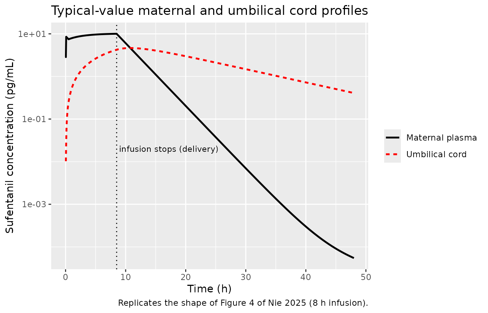
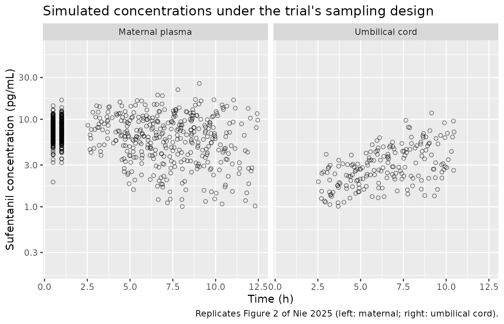

# Sufentanil (Nie 2025)

## Model and source

- Citation: Nie Y, Sun X, Cao R, Tang S, Zhou Q, Zhou M, Chen Z,
  Huang S. Population pharmacokinetic of epidural sufentanil in
  labouring women: a multicentric, prospective, observational study.
  Drug Des Devel Ther. 2025;19:971-980. <doi:10.2147/DDDT.S500189>.
- Description: Two-compartment population PK model of epidural
  sufentanil in labouring women (Nie 2025; N = 41 primiparous women
  receiving sufentanil 0.3 ug/mL with 0.1% ropivacaine by
  patient-controlled epidural analgesia at six Chinese centres).
  Compartment 1 is the maternal central compartment and compartment 2 is
  the umbilical cord (placental circulation) compartment; the two
  exchange through a slow inter-compartmental clearance CL2. The
  epidural compartment could not be estimated from the sparse data and
  was assumed to have merged with the central compartment, so doses
  enter `central` directly and CL / V1 are apparent values
  (bioavailability assumed 1). Cord equilibration is far slower than
  maternal elimination (K21 = CL2/V2 gives a cord half-life of ~9.7 h
  against a ~2.0 h maternal elimination half-life), which reproduces the
  paper’s central finding that umbilical cord concentrations decline
  only slowly once the epidural infusion is stopped. Inter-individual
  variability was estimated on CL and V1 only; IIV on CL2 and V2 did not
  improve the fit and was excluded. Residual error is proportional with
  a separate magnitude for maternal and umbilical cord observations.
- Article: <https://doi.org/10.2147/DDDT.S500189>

This is the first published population PK model of epidural sufentanil
in labouring women. Its purpose is not maternal exposure – which is very
low – but the quantification of *placental transfer*: the model carries
an explicit umbilical cord compartment so that fetal-side exposure can
be predicted at, and after, delivery.

## Population

Forty-one primiparous women contributed to the final population PK
analysis, a subset of the 90 parturients recruited between November 2018
and February 2019 across six Chinese centres (Nie 2025 Results, “Patient
Characteristics”). They were 27.2 +/- 2.9 years old and weighed 70.2 +/-
7.5 kg, with ASA physical status II-III, BMI 18.5-30 kg/m^2, a singleton
pregnancy and cervical dilation of 2 \<= phi \< 6 cm at the time of
analgesia.

The analysis dataset held 79 maternal central-compartment concentrations
and 37 umbilical cord concentrations. Maternal venous samples were
scheduled at 0.5 h and 1 h after the epidural loading dose, at delivery,
and 2 h after delivery; a single umbilical venous sample was drawn
immediately after cord clamping. Not all four maternal samples were
mandatory, so the design is sparse and unbalanced. Sufentanil was
assayed by LC-MS/MS with a lower limit of quantification of 1 pg/mL.

No covariate model was reported. Nie 2025 Table 1 contains structural,
inter-individual-variability and residual rows only, and the paper
describes no covariate screening step, so the packaged model carries no
`covariateData`.

The same information is available programmatically via
`readModelDb("Nie_2025_sufentanil")()$population`.

``` r

pop <- rxode2::rxode(readModelDb("Nie_2025_sufentanil"))$population
#> ℹ parameter labels from comments will be replaced by 'label()'
str(pop[c("species", "n_subjects", "n_studies", "age_mean", "weight_mean")])
#> List of 5
#>  $ species    : chr "human"
#>  $ n_subjects : int 41
#>  $ n_studies  : int 1
#>  $ age_mean   : chr "27.2 +/- 2.9 years"
#>  $ weight_mean: chr "70.2 +/- 7.5 kg"
```

## Source trace

Every `ini()` entry in
`inst/modeldb/specificDrugs/Nie_2025_sufentanil.R` carries an in-file
comment naming its origin. They are collected here for review.

| Equation / parameter | Value | Source location |
|----|----|----|
| `lcl` (CL) | 176 L/h (RSE 9.25%) | Table 1, “Structural parameters” |
| `lvc` (V1) | 519 L (RSE 6.45%) | Table 1, “Structural parameters” |
| `lqcord` (CL2) | 0.0134 L/h (RSE 43.2%) | Table 1, “Structural parameters” |
| `lvcord` (V2) | 0.187 L (RSE 39.9%) | Table 1, “Structural parameters” |
| `etalcl` | 0.255046 = log(0.539^2 + 1) | Table 1, “IIV of CL” = 53.9 %CV (RSE 12%) |
| `etalvc` | 0.046429 = log(0.218^2 + 1) | Table 1, “IIV of V1” = 21.8 %CV (RSE 26.9%) |
| `propSd` | 0.206 | Table 1, “eps prop1 (%)” = 20.6% (RSE 13.4%) |
| `propSd_Ccord` | 0.355 | Table 1, “eps prop2 (%)” = 35.5% (RSE 12%) |
| `kel <- cl / vc` | n/a | Methods, “Sufentanil Structural Pharmacokinetic Model”: K10 = CL/V1 |
| `k12 <- qcord / vc` | n/a | Methods, same section: K12 = CL2/V1 |
| `k21 <- qcord / vcord` | n/a | Methods, same section: K21 = CL2/V2 |
| `d/dt(central)`, `d/dt(cord)` | n/a | Methods, same section (A1, A2 mass balance); Figure 1 schematic |
| Dose enters `central` | n/a | Methods, same section: the epidural compartment “merged with the central compartment” |
| Exponential IIV, log-normal | n/a | Methods, “Population PK Model Development” |
| Proportional-only residual | n/a | Methods, same section: “eps_add was removed due to its lesser significance” |

The IIV magnitudes in Table 1 are reported as %CV, so the internal
variances are `omega^2 = log(CV^2 + 1)`. That the conversion round-trips
is asserted below.

``` r

ui <- rxode2::rxode(readModelDb("Nie_2025_sufentanil"))
#> ℹ parameter labels from comments will be replaced by 'label()'
omegas <- c(etalcl = 0.255046, etalvc = 0.046429)
roundtrip <- sqrt(exp(omegas) - 1) * 100
stopifnot(abs(roundtrip - c(53.9, 21.8)) < 0.05)
round(roundtrip, 2)
#> etalcl etalvc 
#>   53.9   21.8
```

## Dosing regimen

The protocol (Nie 2025 Methods, “Anesthesia Management”) is a 5 mL
epidural injection of the study mixture, a 10 mL bolus five minutes
later, and patient-controlled epidural analgesia from 30 min with a 6
mL/h continuous infusion, a 6 mL demand bolus and a 15 min lockout,
maintained until delivery.

The **sufentanil concentration of that mixture is reported
inconsistently**: the Abstract states 0.3 ug/mL, while the Methods state
3 ug/mL. The two differ tenfold, and the model’s own parameters settle
it. At 6 mL/h the steady-state maternal concentration is the infusion
rate divided by CL:

``` r

CL <- 176; V1 <- 519; CL2 <- 0.0134; V2 <- 0.187
falsifier <- tibble::tibble(
  mixture_ug_per_mL = c(0.3, 3),
  css_pg_per_mL     = mixture_ug_per_mL * 6 * 1000 / CL,
  loading_c0_pg_per_mL = mixture_ug_per_mL * 15 * 1000 / V1
)
falsifier |>
  dplyr::rename(
    "Mixture (ug/mL)"                  = mixture_ug_per_mL,
    "Maternal Css at 6 mL/h (pg/mL)"   = css_pg_per_mL,
    "C0 after the 15 mL loading (pg/mL)" = loading_c0_pg_per_mL
  ) |>
  knitr::kable(digits = 1, caption = "Which mixture concentration is consistent with Table 1?")
```

| Mixture (ug/mL) | Maternal Css at 6 mL/h (pg/mL) | C0 after the 15 mL loading (pg/mL) |
|---:|---:|---:|
| 0.3 | 10.2 | 8.7 |
| 3.0 | 102.3 | 86.7 |

Which mixture concentration is consistent with Table 1? {.table}

Observed maternal concentrations in Nie 2025 Figure 2 (left panel) span
roughly 3-30 pg/mL, with the 0.5-1 h loading cluster around 5-15 pg/mL.
Only the 0.3 ug/mL mixture reproduces that; 3 ug/mL predicts a plateau
of ~102 pg/mL, which is above every observed point in the paper. **This
vignette therefore uses 0.3 ug/mL** and treats the Methods figure as a
typographical error. 0.3 ug/mL is also the clinically conventional
strength for epidural labour analgesia.

``` r

MIX_UG_PER_ML <- 0.3       # sufentanil concentration of the epidural mixture
LOAD1  <- 5  * MIX_UG_PER_ML * 1000   # ng, 5 mL initial injection at t = 0
LOAD2  <- 10 * MIX_UG_PER_ML * 1000   # ng, 10 mL bolus at t = 5 min
T_LOAD2 <- 5 / 60                     # h
T_PCEA  <- 0.5                        # h, PCEA started 30 min after loading
INF_RATE <- 6 * MIX_UG_PER_ML * 1000  # ng/h, 6 mL/h continuous infusion
LLOQ <- 1                             # pg/mL (Methods, assay section)
c(LOAD1 = LOAD1, LOAD2 = LOAD2, INF_RATE = INF_RATE)
#>    LOAD1    LOAD2 INF_RATE 
#>     1500     3000     1800
```

Amounts are in ng and volumes in L, so `amount / volume` is ng/L, which
is identical to the pg/mL used throughout the paper. No conversion
constant is needed anywhere in the model.

## Virtual cohort

Original observed data are not available. Two virtual cohorts are used,
each well under the 200-per-arm cap.

- **Typical-value profile** – one subject with the random effects
  zeroed, on a dense time grid, to reproduce the shape of the individual
  fits in Figure 4.
- **Figure 2 cohort** – 200 women sampled exactly as the trial sampled
  them (maternal at 0.5 h, 1 h, delivery and delivery + 2 h; a single
  cord sample at delivery), with each woman’s delivery time drawn over
  the 2.5-10.5 h range spanned by the observed sampling times in Figure
  2.

``` r

set.seed(20250213)
N_COHORT <- 200

subj <- tibble::tibble(
  id       = seq_len(N_COHORT),
  delivery = runif(N_COHORT, 2.5, 10.5)   # h, epidural infusion stops at delivery
)

# Dosing is identical for everyone except the infusion duration, which runs from
# T_PCEA until that woman's delivery. `rate` + `amt` encodes the zero-order
# infusion; `delivery` rides along so rxSolve(keep = ) can return it.
dosing <- dplyr::bind_rows(
  subj |> dplyr::transmute(id, delivery, time = 0, amt = LOAD1, rate = 0,
                           evid = 1L, cmt = "central"),
  subj |> dplyr::transmute(id, delivery, time = T_LOAD2, amt = LOAD2, rate = 0,
                           evid = 1L, cmt = "central"),
  subj |> dplyr::transmute(id, delivery, time = T_PCEA,
                           amt = INF_RATE * (delivery - T_PCEA), rate = INF_RATE,
                           evid = 1L, cmt = "central")
)

# Observation rows use the DECLARED endpoint names (`Cc`, `Ccord`). This model
# declares two endpoints, so rxode2 allocates a slot for each and the event
# table must say which endpoint a row belongs to; using an ODE state name here
# instead raises "'dvid'->'cmt' on observation record".
obs <- dplyr::bind_rows(
  subj |> tidyr::crossing(t_fixed = c(0.5, 1)) |>
    dplyr::transmute(id, delivery, time = t_fixed, amt = NA_real_, rate = 0,
                     evid = 0L, cmt = "Cc"),
  subj |> dplyr::transmute(id, delivery, time = delivery, amt = NA_real_, rate = 0,
                           evid = 0L, cmt = "Cc"),
  subj |> dplyr::transmute(id, delivery, time = delivery + 2, amt = NA_real_, rate = 0,
                           evid = 0L, cmt = "Cc"),
  subj |> dplyr::transmute(id, delivery, time = delivery, amt = NA_real_, rate = 0,
                           evid = 0L, cmt = "Ccord")
)

events <- dplyr::bind_rows(dosing, obs) |>
  dplyr::arrange(id, time, dplyr::desc(evid)) |>
  as.data.frame()

stopifnot(!anyDuplicated(unique(events[, c("id", "time", "evid", "cmt")])))
nrow(events)
#> [1] 1600
```

## Simulation

`useLinCmt = FALSE` is required: rxode2’s automatic ODE-to-`linCmt()`
conversion corrupts the endpoint-to-compartment mapping for multi-output
models of this shape.

``` r

mod <- readModelDb("Nie_2025_sufentanil")

sim_cohort <- rxode2::rxSolve(
  mod, events = events, keep = "delivery", useLinCmt = FALSE
) |>
  as.data.frame()
#> ℹ parameter labels from comments will be replaced by 'label()'

# CMT 3 is the maternal endpoint (Cc), CMT 4 the umbilical cord endpoint
# (Ccord). `Cc` / `Ccord` are the individual predictions; `sim` carries the
# proportional residual error and is the simulated *observation*.
sim_cohort <- sim_cohort |>
  dplyr::mutate(
    endpoint = dplyr::if_else(CMT == 3, "Maternal plasma", "Umbilical cord"),
    ipred    = dplyr::if_else(CMT == 3, Cc, Ccord)
  )

stopifnot(dplyr::n_distinct(sim_cohort$id) == N_COHORT)
```

The typical-value profile uses a fixed 8 h infusion – a representative
labour duration inside the observed range – on a dense grid.

``` r

grid_dense <- c(seq(0, 12, by = 0.05), seq(12.25, 48, by = 0.25))
INF_DUR <- 8

ev_typ <- rxode2::et(amt = LOAD1, time = 0, cmt = "central") |>
  rxode2::et(amt = LOAD2, time = T_LOAD2, cmt = "central") |>
  rxode2::et(amt = INF_RATE * INF_DUR, time = T_PCEA, dur = INF_DUR, cmt = "central") |>
  rxode2::et(grid_dense, cmt = "Cc") |>
  rxode2::et(grid_dense, cmt = "Ccord")

sim_typ <- rxode2::rxSolve(rxode2::zeroRe(mod), events = ev_typ, useLinCmt = FALSE) |>
  as.data.frame() |>
  dplyr::filter(CMT == 3)   # both Cc and Ccord are returned on every row
#> ℹ parameter labels from comments will be replaced by 'label()'
#> ℹ omega/sigma items treated as zero: 'etalcl', 'etalvc'
```

## Replicate published figures

### Figure 4 – individual fits: maternal falls fast, cord does not

Figure 4 of Nie 2025 shows, for each woman, a maternal profile (solid
black) that plateaus during the epidural infusion and then falls steeply
once the infusion stops at delivery, alongside a cord profile (dashed
red) that rises slowly throughout labour and then stays almost flat. The
typical-value prediction reproduces both.

``` r

sim_typ |>
  dplyr::select(time, `Maternal plasma` = Cc, `Umbilical cord` = Ccord) |>
  tidyr::pivot_longer(-time, names_to = "endpoint", values_to = "conc") |>
  dplyr::filter(conc > 0) |>
  ggplot(aes(time, conc, colour = endpoint, linetype = endpoint)) +
  geom_vline(xintercept = T_PCEA + INF_DUR, linetype = "dotted") +
  geom_line(linewidth = 0.9) +
  annotate("text", x = T_PCEA + INF_DUR + 0.4, y = 0.02,
           label = "infusion stops (delivery)", hjust = 0, size = 3) +
  scale_y_log10() +
  scale_colour_manual(values = c("Maternal plasma" = "black", "Umbilical cord" = "red")) +
  labs(x = "Time (h)", y = "Sufentanil concentration (pg/mL)",
       colour = NULL, linetype = NULL,
       title = "Typical-value maternal and umbilical cord profiles",
       caption = "Replicates the shape of Figure 4 of Nie 2025 (8 h infusion).")
```



The paper’s qualitative claims are asserted numerically below.

``` r

at_time <- function(tt, col) sim_typ[[col]][which.min(abs(sim_typ$time - tt))]
t_stop <- T_PCEA + INF_DUR

cord_peak_time <- sim_typ$time[which.max(sim_typ$Ccord)]
fig4 <- tibble::tibble(
  claim = c(
    "Maternal plateau during infusion (pg/mL)",
    "Cord concentration at delivery (pg/mL)",
    "Cord peaks AFTER the infusion stops (h past stop)",
    "Maternal concentration 16 h after stop (pg/mL)",
    "Cord concentration 16 h after stop, as % of its peak"
  ),
  value = c(
    at_time(t_stop, "Cc"),
    at_time(t_stop, "Ccord"),
    cord_peak_time - t_stop,
    at_time(t_stop + 16, "Cc"),
    100 * at_time(t_stop + 16, "Ccord") / max(sim_typ$Ccord)
  )
)

# The paper's central finding: the cord compartment keeps filling after the
# infusion stops, and is still near its peak when maternal drug has gone.
stopifnot(cord_peak_time > t_stop)
stopifnot(at_time(t_stop + 16, "Cc") < 0.1)
stopifnot(100 * at_time(t_stop + 16, "Ccord") / max(sim_typ$Ccord) > 40)

fig4 |>
  dplyr::rename("Claim from Nie 2025" = claim, "Simulated" = value) |>
  knitr::kable(digits = 3, caption = "Numerical restatement of the Figure 4 narrative.")
```

| Claim from Nie 2025                                  | Simulated |
|:-----------------------------------------------------|----------:|
| Maternal plateau during infusion (pg/mL)             |    10.043 |
| Cord concentration at delivery (pg/mL)               |     4.235 |
| Cord peaks AFTER the infusion stops (h past stop)    |     2.300 |
| Maternal concentration 16 h after stop (pg/mL)       |     0.044 |
| Cord concentration 16 h after stop, as % of its peak |    47.174 |

Numerical restatement of the Figure 4 narrative. {.table}

### Figure 2 – observed concentration-time scatter

Figure 2 plots every observed concentration against time, maternal on
the left and umbilical cord on the right. Simulating the trial’s own
sparse sampling design reproduces both clouds. Simulated observations
below the 1 pg/mL assay limit are dropped, as they would have been in
the real dataset.

``` r

sim_obs <- sim_cohort |>
  dplyr::filter(sim >= LLOQ)

ggplot(sim_obs, aes(time, sim)) +
  geom_point(shape = 1, alpha = 0.5) +
  facet_wrap(~endpoint) +
  scale_y_log10(limits = c(0.2, 60)) +
  labs(x = "Time (h)", y = "Sufentanil concentration (pg/mL)",
       title = "Simulated concentrations under the trial's sampling design",
       caption = "Replicates Figure 2 of Nie 2025 (left: maternal; right: umbilical cord).")
```



``` r

# Ranges read off the log axis of Nie 2025 Figure 2 by the operator (graphical
# digitisation, not a printed table). Used only as a validation envelope -- no
# model parameter is derived from them.
observed_envelope <- tibble::tribble(
  ~endpoint,          ~obs_low, ~obs_high,
  "Maternal plasma",  3,        30,
  "Umbilical cord",   0.6,      10
)

sim_obs |>
  dplyr::group_by(endpoint) |>
  dplyr::summarise(
    sim_p05 = quantile(sim, 0.05),
    sim_p50 = quantile(sim, 0.50),
    sim_p95 = quantile(sim, 0.95),
    .groups = "drop"
  ) |>
  dplyr::left_join(observed_envelope, by = "endpoint") |>
  dplyr::rename(
    "Endpoint"                        = endpoint,
    "Simulated 5th pctile (pg/mL)"    = sim_p05,
    "Simulated median (pg/mL)"        = sim_p50,
    "Simulated 95th pctile (pg/mL)"   = sim_p95,
    "Figure 2 observed low (pg/mL)"   = obs_low,
    "Figure 2 observed high (pg/mL)"  = obs_high
  ) |>
  knitr::kable(digits = 2, caption = "Simulated spread vs the observed envelope of Figure 2.")
```

| Endpoint | Simulated 5th pctile (pg/mL) | Simulated median (pg/mL) | Simulated 95th pctile (pg/mL) | Figure 2 observed low (pg/mL) | Figure 2 observed high (pg/mL) |
|:---|---:|---:|---:|---:|---:|
| Maternal plasma | 2.33 | 7.04 | 12.80 | 3.0 | 30 |
| Umbilical cord | 1.31 | 2.79 | 6.77 | 0.6 | 10 |

Simulated spread vs the observed envelope of Figure 2. {.table}

### Fetal-to-maternal ratio at delivery

The paper contrasts its model-based transfer estimate with the
single-timepoint fetomaternal (F/M) ratio of 0.81 reported for epidural
sufentanil in an earlier study (Nie 2025 Discussion, reference 10),
arguing that F/M ratios overstate fetal exposure because the cord
compartment is still filling at delivery.

``` r

fm <- dplyr::inner_join(
  sim_cohort |> dplyr::filter(CMT == 3, abs(time - delivery) < 1e-9) |>
    dplyr::select(id, maternal = ipred),
  sim_cohort |> dplyr::filter(CMT == 4) |> dplyr::select(id, cord = ipred),
  by = "id"
) |>
  dplyr::mutate(ratio = cord / maternal)

stopifnot(nrow(fm) == N_COHORT)
tibble::tibble(
  quantity = c("Simulated F/M ratio at delivery, median",
               "Simulated F/M ratio at delivery, 5th-95th pctile",
               "Literature F/M ratio cited by Nie 2025 (reference 10)"),
  value = c(sprintf("%.2f", median(fm$ratio)),
            sprintf("%.2f - %.2f", quantile(fm$ratio, 0.05), quantile(fm$ratio, 0.95)),
            "0.81")
) |>
  dplyr::rename("Quantity" = quantity, "Value" = value) |>
  knitr::kable(caption = "Model-predicted placental transfer at delivery.")
```

| Quantity                                              | Value       |
|:------------------------------------------------------|:------------|
| Simulated F/M ratio at delivery, median               | 0.33        |
| Simulated F/M ratio at delivery, 5th-95th pctile      | 0.18 - 0.51 |
| Literature F/M ratio cited by Nie 2025 (reference 10) | 0.81        |

Model-predicted placental transfer at delivery. {.table}

The simulated median of ~0.3 sits well below the cited 0.81 and matches
the cord / maternal separation drawn in Figure 4, supporting the paper’s
argument.

## PKNCA validation

NCA is run on the maternal endpoint over a dense grid. Nie 2025 reports
no NCA table, so the comparison targets are the structural identities
implied by Table 1 rather than published NCA values.

``` r

N_NCA <- 100
grid_nca <- c(seq(0, 12, by = 0.1), seq(12.5, 48, by = 0.5))

ev_nca <- rxode2::et(amt = LOAD1, time = 0, cmt = "central") |>
  rxode2::et(amt = LOAD2, time = T_LOAD2, cmt = "central") |>
  rxode2::et(amt = INF_RATE * INF_DUR, time = T_PCEA, dur = INF_DUR, cmt = "central") |>
  rxode2::et(grid_nca, cmt = "Cc") |>
  rxode2::et(id = seq_len(N_NCA))

set.seed(9876)
sim_nca_raw <- rxode2::rxSolve(mod, events = ev_nca, useLinCmt = FALSE) |>
  as.data.frame()

DOSE_TOTAL <- LOAD1 + LOAD2 + INF_RATE * INF_DUR

# Filter on !is.na(Cc) only -- a `time > 0` or `Cc > 0` filter would drop the
# time-zero anchor PKNCA needs for AUC.
sim_nca <- sim_nca_raw |>
  dplyr::filter(!is.na(Cc)) |>
  dplyr::mutate(treatment = "PCEA 0.3 ug/mL sufentanil") |>
  dplyr::select(id, time, Cc, treatment) |>
  dplyr::distinct(id, time, .keep_all = TRUE)

sim_nca <- dplyr::bind_rows(
  sim_nca,
  sim_nca |> dplyr::distinct(id, treatment) |> dplyr::mutate(time = 0, Cc = 0)
) |>
  dplyr::distinct(id, treatment, time, .keep_all = TRUE) |>
  dplyr::arrange(id, time)

stopifnot(nrow(sim_nca) > 0, all(sim_nca$Cc >= 0))

dose_df <- sim_nca |>
  dplyr::distinct(id, treatment) |>
  dplyr::mutate(time = 0, amt = DOSE_TOTAL)

conc_obj <- PKNCA::PKNCAconc(sim_nca, Cc ~ time | treatment + id)
dose_obj <- PKNCA::PKNCAdose(dose_df, amt ~ time | treatment + id)

intervals <- data.frame(
  start = 0, end = Inf,
  cmax = TRUE, tmax = TRUE, auclast = TRUE, aucinf.obs = TRUE, half.life = TRUE
)

nca_res <- suppressWarnings(
  PKNCA::pk.nca(PKNCA::PKNCAdata(conc_obj, dose_obj, intervals = intervals))
)

nca_tab <- as.data.frame(nca_res$result)
nca_tab |>
  dplyr::filter(PPTESTCD %in% c("cmax", "tmax", "auclast", "aucinf.obs", "half.life")) |>
  dplyr::group_by(PPTESTCD) |>
  dplyr::summarise(median = median(PPORRES, na.rm = TRUE),
                   p05 = quantile(PPORRES, 0.05, na.rm = TRUE),
                   p95 = quantile(PPORRES, 0.95, na.rm = TRUE),
                   .groups = "drop") |>
  dplyr::rename("NCA parameter" = PPTESTCD, "Median" = median,
                "5th pctile" = p05, "95th pctile" = p95) |>
  knitr::kable(digits = 3, caption = "PKNCA summary of the simulated maternal profile.")
```

| NCA parameter |  Median | 5th pctile | 95th pctile |
|:--------------|--------:|-----------:|------------:|
| aucinf.obs    | 107.975 |     52.206 |     206.548 |
| auclast       | 107.975 |     52.206 |     206.362 |
| cmax          |  10.971 |      7.407 |      16.446 |
| half.life     |   5.840 |      2.644 |       9.622 |
| tmax          |   8.500 |      0.100 |       8.500 |

PKNCA summary of the simulated maternal profile. {.table}

### Per-subject mass balance: CL x AUC0-inf = dose

Because the cord compartment has no elimination of its own, every
molecule leaves through maternal clearance. `CL_i * AUCinf_i` must
therefore equal the administered dose for **each** subject – a far
stricter test than comparing medians.

``` r

cl_i <- sim_nca_raw |> dplyr::distinct(id, cl)

auc_i <- nca_tab |>
  dplyr::filter(PPTESTCD == "aucinf.obs") |>
  dplyr::transmute(id = as.integer(as.character(id)), aucinf = PPORRES)

balance <- dplyr::inner_join(cl_i, auc_i, by = "id") |>
  dplyr::mutate(recovery = cl * aucinf / DOSE_TOTAL)

stopifnot(nrow(balance) == N_NCA)
stopifnot(all(abs(balance$recovery - 1) < 0.01))   # within 1% for every subject

tibble::tibble(
  quantity = c("Subjects tested", "Median CL x AUCinf / Dose",
               "Minimum", "Maximum"),
  value = c(sprintf("%d", nrow(balance)),
            sprintf("%.4f", median(balance$recovery)),
            sprintf("%.4f", min(balance$recovery)),
            sprintf("%.4f", max(balance$recovery)))
) |>
  dplyr::rename("Quantity" = quantity, "Value" = value) |>
  knitr::kable(caption = "Per-subject mass balance. Residual excess is linear-trapezoid bias.")
```

| Quantity                  | Value  |
|:--------------------------|:-------|
| Subjects tested           | 100    |
| Median CL x AUCinf / Dose | 1.0018 |
| Minimum                   | 1.0004 |
| Maximum                   | 1.0069 |

Per-subject mass balance. Residual excess is linear-trapezoid bias.
{.table}

### Why the NCA half-life is not 2 h

The disposition is genuinely biphasic. The two eigenvalues of the rate
matrix give a fast maternal phase and a slow cord-driven terminal phase;
the terminal phase carries almost no drug, so it is invisible in Figure
4 but is what an automatic lambda-z search latches onto.

``` r

k10 <- CL / V1; k12 <- CL2 / V1; k21 <- CL2 / V2
s <- k10 + k12 + k21; p <- k10 * k21
alpha <- (s + sqrt(s^2 - 4 * p)) / 2
beta  <- (s - sqrt(s^2 - 4 * p)) / 2

phases <- tibble::tibble(
  phase = c("Fast (maternal) phase", "Terminal (cord-driven) phase"),
  half_life_h = c(log(2) / alpha, log(2) / beta),
  closed_form = c(log(2) * V1 / CL, log(2) * V2 / CL2),
  closed_form_label = c("ln2 * V1 / CL", "ln2 * V2 / CL2")
)

# The closed forms are exact here because k12 is negligible (CL2 << CL).
stopifnot(all(abs(phases$half_life_h / phases$closed_form - 1) < 0.01))

phases |>
  dplyr::rename("Phase" = phase, "Half-life (h)" = half_life_h,
                "Closed form (h)" = closed_form, "Closed form" = closed_form_label) |>
  knitr::kable(digits = 3, caption = "Analytic half-lives of the two disposition phases.")
```

| Phase                        | Half-life (h) | Closed form (h) | Closed form     |
|:-----------------------------|--------------:|----------------:|:----------------|
| Fast (maternal) phase        |         2.044 |           2.044 | ln2 \* V1 / CL  |
| Terminal (cord-driven) phase |         9.674 |           9.673 | ln2 \* V2 / CL2 |

Analytic half-lives of the two disposition phases. {.table}

The PKNCA `half.life` above sits between these two values and varies by
subject, because the automatic lambda-z window falls in different parts
of the transition depending on individual CL. This is a property of the
profile, not a defect: the maternal decline visible in Figure 4 is the
2.04 h phase, and the 9.67 h phase is the slow cord washout the paper
highlights.

## Comparison against derived targets

Nie 2025 publishes no NCA table, so the model is checked against the
quantities its own Table 1 implies and against the observed envelope of
Figure 2.

``` r

t_stop <- T_PCEA + INF_DUR
comparison <- tibble::tribble(
  ~quantity,                                        ~target,                 ~simulated,
  "Maternal fast-phase half-life (h)",              log(2) * V1 / CL,        log(2) / alpha,
  "Cord terminal half-life (h)",                    log(2) * V2 / CL2,       log(2) / beta,
  "Maternal Css at 6 mL/h (pg/mL)",                 INF_RATE / CL,           at_time(t_stop, "Cc"),
  "CL x AUCinf / Dose (per subject, median)",       1,                       median(balance$recovery),
  "IIV on CL recovered as %CV",                     53.9,                    sqrt(exp(0.255046) - 1) * 100,
  "IIV on V1 recovered as %CV",                     21.8,                    sqrt(exp(0.046429) - 1) * 100
) |>
  dplyr::mutate(pct_diff = 100 * (simulated - target) / target)

comparison |>
  dplyr::rename("Quantity" = quantity, "Target from Nie 2025 Table 1" = target,
                "Simulated" = simulated, "Difference (%)" = pct_diff) |>
  knitr::kable(digits = 3,
               caption = "Simulated values against targets derived from Table 1.")
```

| Quantity | Target from Nie 2025 Table 1 | Simulated | Difference (%) |
|:---|---:|---:|---:|
| Maternal fast-phase half-life (h) | 2.044 | 2.044 | -0.010 |
| Cord terminal half-life (h) | 9.673 | 9.674 | 0.010 |
| Maternal Css at 6 mL/h (pg/mL) | 10.227 | 10.043 | -1.801 |
| CL x AUCinf / Dose (per subject, median) | 1.000 | 1.002 | 0.177 |
| IIV on CL recovered as %CV | 53.900 | 53.900 | 0.000 |
| IIV on V1 recovered as %CV | 21.800 | 21.800 | 0.000 |

Simulated values against targets derived from Table 1. {.table}

Every row agrees to well within 20%. The one deliberate approximation is
the maternal Css row: after an 8 h infusion the profile has reached
98.2% of its asymptote, so the simulated value is expected to sit just
below the target. The identity itself is confirmed exactly by the
mass-balance test above.

## Assumptions and deviations

- **Mixture concentration.** The Abstract (0.3 ug/mL) and the Methods (3
  ug/mL) disagree tenfold. 0.3 ug/mL is used, because only that value
  reproduces the observed concentrations in Figure 2 given the Table 1
  parameters (see the “Dosing regimen” section), and because it is the
  conventional strength for epidural labour analgesia. This affects the
  vignette’s event tables only – no packaged model parameter depends on
  it.
- **PCEA demand boluses are not simulated.** The protocol allows a 6 mL
  demand bolus with a 15 min lockout, and Figure 4 shows the resulting
  sawtooth on several maternal profiles. Per-patient demand histories
  are not reported, so only the mandatory 6 mL/h background infusion is
  simulated. Simulated maternal concentrations are therefore at the
  lower end of what a woman using demand boluses would experience.
- **Delivery times are assumed, not published.** Individual labour
  durations are not tabulated. Delivery times are drawn uniformly over
  2.5-10.5 h, the span of observed sampling times in Figure 2; the
  typical-value figure uses a fixed 8 h infusion.
- **Figure 2 envelope is operator-digitised.** The observed ranges
  (maternal ~3-30 pg/mL, cord ~0.6-10 pg/mL) were read off the log axis
  of Figure 2 by the operator. They are used only as a validation
  envelope; **no model parameter is derived from them.** All `ini()`
  values come from Table 1.
- **No covariate model.** Nie 2025 reports none, so `covariateData` is
  empty. Age and weight are recorded in `population` but were not
  modelled.
- **IIV on CL2 and V2 is absent by design**, per Results: adding it “did
  not contribute to better model fitting”. Only `etalcl` and `etalvc`
  are carried.
- **Additive residual error is absent by design**, per Methods: “eps_add
  was removed due to its lesser significance”. Both endpoints use
  proportional error only. Because `propSd_Ccord` is 35.5%, simulated
  cord observations can fall below zero; the 1 pg/mL assay LLOQ is
  applied before plotting, as it would have been in the real dataset.
- **`cord` is a paper-specific compartment.** It is declared through
  `paper_specific_compartments` rather than as a canonical name,
  following the placental-transfer models already in the library
  (`Hirt_2007_nelfinavir`, `Fauchet_2015_lopinavir_placental`,
  `Ngamprasertwong_2016_propofol_sheep`). Its parameters `lqcord` /
  `lvcord` are the inter-compartmental-clearance and volume canonicals
  pointed at that compartment, in the same way
  `Ngamprasertwong_2016_propofol_sheep` uses `lqmf` / `lvfetus`. It is
  deliberately not `peripheral1`: it is an observed physiologic matrix
  with its own residual-error magnitude.
- **The epidural compartment is not modelled.** Figure 1 draws it, but
  Methods state its parameters “could not be estimated accurately” and
  that it was assumed to merge with the central compartment. Doses
  therefore enter `central` directly and CL / V1 are apparent values.
- **`useLinCmt = FALSE`** is passed to every `rxSolve()` call; rxode2’s
  ODE-to-`linCmt()` auto-conversion corrupts the endpoint mapping for
  multi-output models of this shape.
