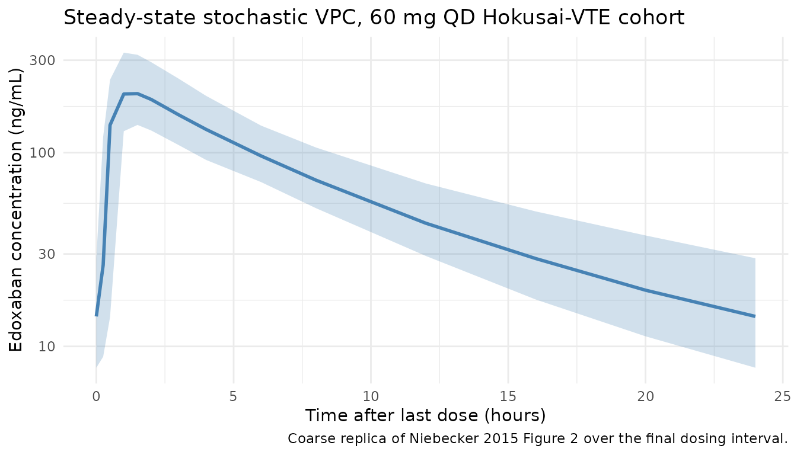
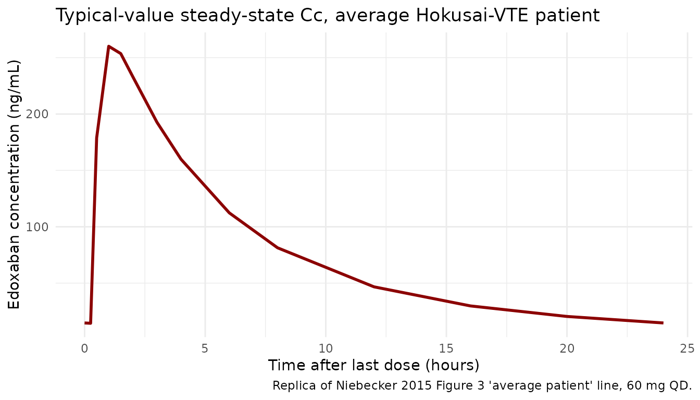

# Edoxaban (Niebecker 2015)

## Model and source

- Citation: Niebecker R, Jonsson S, Karlsson MO, Miller R, Nyberg J,
  Krekels EHJ, Simonsson USH. Population pharmacokinetics of edoxaban in
  patients with symptomatic deep-vein thrombosis and/or pulmonary
  embolism - the Hokusai-VTE phase 3 study. Br J Clin Pharmacol.
  2015;80(6):1374-1387. <doi:10.1111/bcp.12727>.
- Description: Two-compartment population PK model with first-order
  absorption and a lag time for edoxaban in adults; pooled phase 1
  healthy volunteers (13 studies) and Hokusai-VTE phase 3 patients with
  deep-vein thrombosis or pulmonary embolism (Niebecker 2015). Apparent
  clearance is split into a non-renal component and a piecewise-linear
  renal component driven by creatinine clearance, with a phase-3 patient
  effect on the upper-CLcr slope and on Q/F. Asian race increases Vc/F;
  concomitant P-glycoprotein inhibitors increase phase-1 CL/F and F. The
  fed-state study 6 has a slower ka and higher non-renal CL/F (FED
  covariate).
- Article: <https://doi.org/10.1111/bcp.12727>

## Population

The Niebecker 2015 popPK model is fit to a pooled analysis of 4,130
subjects with 17,406 plasma edoxaban concentrations across 14 studies:
the Hokusai-VTE phase 3 trial (NCT00986154; 3,707 patients with
symptomatic deep-vein thrombosis or pulmonary embolism receiving 30 or
60 mg edoxaban orally once daily; 9,531 observations) and 13 pooled
phase 1 studies in healthy volunteers (443 subjects; 8,652 observations)
covering single-dose, multiple-dose, food-effect, renal-impairment, and
drug-drug-interaction designs (Niebecker 2015 Table 1).

Hokusai-VTE patient demographics (Niebecker 2015 Table 2): median age 57
years (10th-90th percentile 32.6-76.0), median body weight 80.5 kg
(60-108), median Cockcroft-Gault creatinine clearance 99 mL/min
(57.5-151), 42% female, 71% White, 20% Asian, 3% Black, 5% Other. Phase
1 cohorts skew younger (median 30 years, 22-44) and more male (20%
female). The model captures these between-cohort differences via
`STUDY_HOKVTE` (phase 1 vs phase 3) and `RACE_ASIAN` covariates.

The same information is available programmatically via
`rxode2::rxode(readModelDb("Niebecker_2015_edoxaban"))$meta$population`
(or inspect the model file
`inst/modeldb/specificDrugs/Niebecker_2015_edoxaban.R`).

## Source trace

Per-parameter origin is in the model file
(`inst/modeldb/specificDrugs/Niebecker_2015_edoxaban.R`) as inline
comments. The table below collects each parameter’s source location.

| Equation / parameter | Value | Source location |
|----|----|----|
| `lka` (ka, 1/h) | 3.36 | Table 3 final-model column |
| `lcl_nonren` (CLnr/F, L/h) | 15.2 | Table 3 final-model column |
| `lvc` (Vc/F, L) | 209 | Table 3 final-model column |
| `lvp` (Vp/F, L) | 92.3 | Table 3 final-model column |
| `lq` (Q/F, L/h) | 5.91 | Table 3 final-model column |
| `ltlag` (tlag, h, FIXED) | 0.250 | Table 3 final-model column, footnote sect (“tlag fixed to phase 1 estimate”) |
| `e_crcl_cl_renal_slope1` | 0.202 | Table 3 footnote paragraph mark (piecewise CLcr on CL/F, slope 1) |
| `e_crcl_cl_renal_slope2` | 0.0321 | Table 3 footnote paragraph mark (slope 2, phase 1) |
| `e_study_hokvte_cl_renal_slope2` | 2.74 | Table 3 final-model column (“Scaling parameter for slope 2 in phase 3” = 274%) |
| `e_race_asian_vc` | 0.226 | Table 3 final-model column (“Fractional change in Vc/F for Asians” = 22.6%) |
| `e_study_hokvte_q` | 0.646 | Table 3 final-model column (“Fractional change in Q/F for phase 3” = 64.6%) |
| `e_pgp_inh_cl` | 0.334 | Table 3 final-model column (“P-gp inhibitors on CL, phase 1” = 33.4%) |
| `e_pgp_inh_f` | 1.25 | Table 3 final-model column (“P-gp inhibitors on F, phase 1” = 125%) |
| `e_fed_ka` | -0.690 | Table 3 final-model column (“Fractional change in ka study 6”) |
| `e_fed_cl_nonren` | 0.204 | Table 3 final-model column (CLnr/F study 6 = 18.3 vs 15.2; 18.3/15.2 - 1) |
| `theta_scale_cl_vc` | 1.56 | Table 3 final-model column (“Scaling parameter CL/F-Vc/F”) |
| `theta_scale_vp_q` (FIXED) | 1.00 | Table 3 final-model column (theta_Scale2 = 1.00 FIXED) |
| Allometric `(WT/70)^(3/4)` on CL/F | 0.75 | Table 3 footnote paragraph mark mark |
| Allometric `(WT/70)^1` on Vc/F | 1.00 | Table 3 footnote paragraph mark mark |
| Allometric `(WT/70)^(3/4)` on Vp/F (paper-as-printed) | 0.75 | Table 3 footnote paragraph mark mark |
| Allometric `(WT/70)^1` on Q/F (paper-as-printed) | 1.00 | Table 3 footnote paragraph mark mark |
| IIV CL/F (omega^2 for etalcl) | 0.02196 | Table 3 final-model column (“CL/F (eta1)” = 14.9% CV; omega^2 = log(1 + 0.149^2)) |
| IIV Vp/F (omega^2 for etalvp) | 0.24505 | Table 3 final-model column (“Vp/F (eta2)” = 52.7% CV; omega^2 = log(1 + 0.527^2)) |
| cov(etalcl, etalvp) | 0.03133 | Table 3 final-model column (“Correlation eta1 and eta2” = 42.7%; cov = 0.427 \* sqrt(0.02196 \* 0.24505)) |
| IIV tlag (omega^2 for etaltlag) | 0.29442 | Table 3 final-model column (58.5% CV) |
| IIV on RUV (omega^2 for etalrv; anchored by fixed `lrv = log(1)`) | 0.10516 | Table 3 final-model column (“IIV on Residual unexplained variability” = 33.3% CV) |
| `propSdPhase1` | 0.142 | Table 3 final-model column (“Proportional residual error phase 1” = 14.2% CV) |
| `propSdPhase3Inc` | 0.544 | Table 3 final-model column (“Incremental proportional residual error phase 3” = 54.4% CV) |
| Piecewise CLcr formula | n/a | Table 3 footnote paragraph mark (Typical CL/F = CLnr/F + slope1\*CLcr below 90; slope2 kicks in above 90) |
| CLcr truncation at 150 mL/min | n/a | Methods, base model development paragraph |
| ODE 2-cmt + depot + lag | n/a | Results, Model development – base model (linear 2-cmt, first-order absorption preceded by tlag) |

## Virtual cohort

Original Hokusai-VTE data are not publicly available. The virtual cohort
below approximates Niebecker 2015 Table 2 phase 3 demographics: 200
patients with body weight, creatinine clearance, and Asian-race
indicator sampled from distributions matching the published
10th-50th-90th percentiles. All subjects are simulated under
non-dose-reduced 60 mg once-daily dosing (the largest Hokusai-VTE
subgroup; 7,879 observations from 3,106 patients per Figure 4 panel-1
caption).

``` r

set.seed(8675309)

n_sub <- 200L

# Sample WT and CRCL from log-normal distributions whose median and CV match
# the Hokusai-VTE Table 2 cohort. Truncate to the published 10th-90th percentile
# range to keep cohort tails realistic.
wt_med   <- 80.5
wt_cv    <- 0.18       # gives ~10-90 % range of 60-108 kg
crcl_med <- 99
crcl_cv  <- 0.35       # gives ~10-90 % range of 57-151 mL/min

cohort <- tibble(
  id    = seq_len(n_sub),
  WT    = pmin(pmax(rlnorm(n_sub, log(wt_med),   wt_cv),   50), 120),
  CRCL  = pmin(pmax(rlnorm(n_sub, log(crcl_med), crcl_cv), 30), 200),
  RACE_ASIAN   = as.integer(runif(n_sub) < 0.201),
  PGP_INH      = 0L,        # non-dose-reduced 60 mg cohort has no P-gp inhibitor coadministration
  STUDY_HOKVTE = 1L,        # Hokusai-VTE phase 3 patient cohort
  FED          = 0L,        # overnight-fast (matches all Hokusai-VTE PK observations)
  treatment    = "60 mg QD (Hokusai-VTE)"
)
```

The simulation drives a steady-state 60 mg once-daily regimen for 14
days; PKNCA is computed on the final dosing interval (day 13 to day 14).

``` r

tau     <- 24                                 # dosing interval (hours)
n_doses <- 14L                                # 14 once-daily doses -> close to steady state
dose_mg <- 60                                 # non-dose-reduced edoxaban regimen

# Sample times: dense over the final dosing interval (288-312 h) to capture Cmax /
# Cmin / AUC, plus pre-dose troughs at every dose to confirm steady state.
sample_times <- c(
  seq(0, (n_doses - 1) * tau, by = tau),                       # pre-dose troughs
  (n_doses - 1) * tau + c(0.25, 0.5, 1, 1.5, 2, 3, 4, 6, 8,    # dense final interval
                          12, 16, 20, 24)
) |> unique() |> sort()

# Build per-subject dose + sampling rows, then attach covariates from the
# cohort by id. Materialise as a data.frame BEFORE assigning covariate columns
# (rxode2's rxEt object silently drops $col<- assignments).
ev <- rxode2::et()
for (k in seq_len(n_doses)) {
  ev <- ev |> rxode2::et(dose = dose_mg, time = (k - 1) * tau, cmt = "depot")
}
ev <- ev |> rxode2::et(sample_times)
ev_df <- as.data.frame(ev)

events <- tidyr::expand_grid(id = cohort$id, ev_df) |>
  dplyr::select(-dplyr::any_of("id...1")) |>
  dplyr::left_join(cohort, by = "id") |>
  dplyr::arrange(id, time, dplyr::desc(evid)) |>
  dplyr::mutate(
    amt = ifelse(evid == 1, dose_mg, 0)
  )

# Sanity check: each subject sees n_doses dose rows + length(sample_times) obs rows.
stopifnot(
  nrow(events) == n_sub * (n_doses + length(sample_times)),
  !anyDuplicated(unique(events[, c("id", "time", "evid")]))
)
```

## Simulation

``` r

mod <- rxode2::rxode(readModelDb("Niebecker_2015_edoxaban"))
#> ℹ parameter labels from comments will be replaced by 'label()'

sim <- rxode2::rxSolve(
  mod,
  events = events,
  keep   = c("treatment", "WT", "CRCL", "RACE_ASIAN", "STUDY_HOKVTE", "FED")
) |>
  as.data.frame()
```

Typical-value simulation (zero between-subject variability) for the
deterministic concentration-time profile shown in Figure 2 / 3 of the
source paper.

``` r

mod_typical <- rxode2::zeroRe(mod)
#> Warning: No sigma parameters in the model
sim_typical <- rxode2::rxSolve(
  mod_typical,
  events = events,
  keep   = c("treatment")
) |>
  as.data.frame()
#> ℹ omega/sigma items treated as zero: 'etalcl', 'etalvp', 'etaltlag', 'etalrv'
#> Warning: multi-subject simulation without without 'omega'
```

## Replicate published figures

``` r

# Replicates Figure 2 of Niebecker 2015 (prediction-corrected VPC; this is a
# coarse stochastic-VPC replica showing simulated 5th/50th/95th percentiles
# over the steady-state dosing interval).
sim_ss <- sim |>
  dplyr::filter(time >= (n_doses - 1) * tau) |>
  dplyr::mutate(tad = time - (n_doses - 1) * tau)

sim_ss |>
  dplyr::group_by(tad) |>
  dplyr::summarise(
    Q05 = quantile(Cc, 0.05, na.rm = TRUE),
    Q50 = quantile(Cc, 0.50, na.rm = TRUE),
    Q95 = quantile(Cc, 0.95, na.rm = TRUE),
    .groups = "drop"
  ) |>
  ggplot(aes(tad, Q50)) +
  geom_ribbon(aes(ymin = Q05, ymax = Q95), alpha = 0.25, fill = "steelblue") +
  geom_line(color = "steelblue", linewidth = 1) +
  scale_y_log10() +
  labs(
    x       = "Time after last dose (hours)",
    y       = "Edoxaban concentration (ng/mL)",
    title   = "Steady-state stochastic VPC, 60 mg QD Hokusai-VTE cohort",
    caption = "Coarse replica of Niebecker 2015 Figure 2 over the final dosing interval."
  ) +
  theme_minimal()
```



``` r

# Replicates the average-individual line in Niebecker 2015 Figure 3 (typical-value
# steady-state concentration-time profile for a non-dose-reduced 60 mg QD
# Hokusai-VTE patient).
sim_typical_ss <- sim_typical |>
  dplyr::filter(time >= (n_doses - 1) * tau) |>
  dplyr::mutate(tad = time - (n_doses - 1) * tau)

# A single typical-value subject is enough (zero IIV); take id == 1.
sim_typical_ss |>
  dplyr::filter(id == 1) |>
  ggplot(aes(tad, Cc)) +
  geom_line(color = "darkred", linewidth = 1) +
  labs(
    x       = "Time after last dose (hours)",
    y       = "Edoxaban concentration (ng/mL)",
    title   = "Typical-value steady-state Cc, average Hokusai-VTE patient",
    caption = "Replica of Niebecker 2015 Figure 3 'average patient' line, 60 mg QD."
  ) +
  theme_minimal()
```



## PKNCA validation

Steady-state Cmax, Cmin, AUC0-tau, and Cavg over the final dosing
interval.

``` r

sim_nca <- sim |>
  dplyr::filter(!is.na(Cc)) |>
  dplyr::select(id, time, Cc, treatment)

# Guarantee a pre-dose row exists at the start of each subject's record.
# The simulation grid above samples at time = 0, but defensively bind in case
# any subject lost the time-zero row during filtering.
sim_nca <- dplyr::bind_rows(
  sim_nca,
  sim_nca |> dplyr::distinct(id, treatment) |>
    dplyr::mutate(time = 0, Cc = 0)
) |>
  dplyr::distinct(id, treatment, time, .keep_all = TRUE) |>
  dplyr::arrange(id, treatment, time)

dose_df <- events |>
  dplyr::filter(evid == 1) |>
  dplyr::select(id, time, amt, treatment)

conc_obj <- PKNCA::PKNCAconc(
  sim_nca, Cc ~ time | treatment + id,
  concu = "ng/mL", timeu = "hour"
)
dose_obj <- PKNCA::PKNCAdose(
  dose_df, amt ~ time | treatment + id,
  doseu = "mg"
)

# Steady-state interval over the final dosing window (h 312 to h 336, 14th dose).
start_ss <- (n_doses - 1) * tau
end_ss   <- n_doses * tau

intervals <- data.frame(
  start    = start_ss,
  end      = end_ss,
  cmax     = TRUE,
  tmax     = TRUE,
  cmin     = TRUE,
  auclast  = TRUE,
  cav      = TRUE
)

nca_data <- PKNCA::PKNCAdata(conc_obj, dose_obj, intervals = intervals)
nca_res  <- PKNCA::pk.nca(nca_data)
```

### Comparison against published NCA

Niebecker 2015 does not tabulate NCA values directly; the paper reports
distributions of empirical-Bayes individual predictions of Cmax, Cmin,
and Css,av in Figure 4. The published reference values below are
coarsely digitised medians from Figure 4 panel-1 (non-dose-reduced 60 mg
once-daily cohort) and are illustrative rather than definitive –
agreement within roughly +/- 25% of the simulation median is the
practical bar for this comparison.

``` r

# Coarse medians digitised from Niebecker 2015 Figure 4 panel A/B/C, non-dose-
# reduced 60 mg once-daily Hokusai-VTE patient subgroup (7,879 observations from
# 3,106 patients): Cmax ~250 ng/mL, Cmin ~30 ng/mL, Cssav ~85 ng/mL.
published <- tibble::tribble(
  ~treatment,                 ~cmax, ~cmin, ~cav,
  "60 mg QD (Hokusai-VTE)",   250,    30,    85
)

cmp <- nlmixr2lib::ncaComparisonTable(
  simulated     = nca_res,
  reference     = published,
  by            = "treatment",
  units         = c(cmax = "ng/mL", cmin = "ng/mL", cav = "ng/mL"),
  tolerance_pct = 25
)

knitr::kable(
  cmp,
  caption = "Simulated steady-state NCA vs Figure 4 medians (Niebecker 2015 non-dose-reduced 60 mg QD Hokusai-VTE cohort). * differs from reference by >25%.",
  align   = c("l", "l", "r", "r", "r")
)
```

| NCA parameter | treatment              | Reference | Simulated |   % diff |
|:--------------|:-----------------------|----------:|----------:|---------:|
| Cmax (ng/mL)  | 60 mg QD (Hokusai-VTE) |       250 |       207 |   -17.4% |
| Cmin (ng/mL)  | 60 mg QD (Hokusai-VTE) |        30 |      14.3 | -52.4%\* |
| Cavg (ng/mL)  | 60 mg QD (Hokusai-VTE) |        85 |        66 |   -22.3% |

Simulated steady-state NCA vs Figure 4 medians (Niebecker 2015
non-dose-reduced 60 mg QD Hokusai-VTE cohort). \* differs from reference
by \>25%. {.table}

## Assumptions and deviations

- **Allometric exponent assignment (paper-as-printed).** Table 3
  footnote paragraph mark mark of Niebecker 2015 prints the allometric
  forms as `CL/F * (WT/70)^(3/4)`, `Vc/F * (WT/70)^1`,
  `Vp/F * (WT/70)^(3/4)`, and `Q/F * (WT/70)^1`. The Vp/F-at-3/4 and
  Q/F-at-1 assignment is the opposite of the more common volume-at-1 /
  clearance-at-3/4 grouping; the model file reproduces the source
  paper’s printed values exactly. The Methods text (“fixed exponents for
  all clearance and volume terms”) does not state the numerical values;
  the footnote is the only place the values appear, so the
  paper-as-printed assignment is used. Numerical impact across the
  Hokusai-VTE body-weight range (60-108 kg) is small (the difference
  between `(WT/70)^(3/4)` and `(WT/70)^1` is roughly +/-5% over that
  range).

- **Bioavailability anchor F = 1.** Apparent oral PK does not separately
  identify F from CL and V; the model fixes `lfdepot = log(1)` as a
  structural anchor and lets `e_pgp_inh_f = 1.25` enter as a
  multiplicative factor on `f(depot)`. P-gp inhibitor coadministration
  in phase 1 therefore drives
  `f(depot) = 1 * (1 + 1.25 * PGP_INH * (1 - STUDY_HOKVTE)) = 2.25` for
  phase 1 P-gp-positive observations.

- **P-gp inhibitor effects gated to phase 1.** Niebecker 2015 estimated
  the P-gp-inhibitor effect on CL/F and F using the phase 1 subset only
  (the phase 3 P-gp effect on CL/F was statistically but not clinically
  significant and is excluded from the final model). The model encodes
  this by multiplying the P-gp factor by `(1 - STUDY_HOKVTE)` so the
  effects activate only when `STUDY_HOKVTE = 0` (phase 1
  healthy-volunteer cohort).

- **Fed-state (“study 6”) effects.** Niebecker 2015 names the Table 3
  effects “CLnr/F study 6” and “Fractional change in ka study 6”. Table
  1 of the same paper shows that study 6 (the dronedarone DDI crossover)
  was the only fed- state phase 1 study; all other 12 phase 1 studies
  and the Hokusai-VTE phase 3 study were overnight-fast. The model
  encodes the effects mechanistically via the existing `FED` canonical
  covariate (1 = administered with food). For the simulation cohort
  above (Hokusai-VTE phase 3), `FED = 0` throughout and both effects
  contribute nothing; the encoding becomes relevant only when simulating
  a fed-state regimen.

- **Inter-occasion variability (IOV) omitted.** Niebecker 2015 reports
  IOV on CL/F (9.78% CV), Vc/F (26.9% CV), and ka (101% CV), with
  magnitudes fixed to the phase 1 estimates. The model file omits IOV
  because (a) standard rxode2 simulation use cases do not carry
  per-occasion structure in the event table, and (b) Niebecker 2015’s
  combined-cohort analysis included IOV primarily to absorb residual
  variability heterogeneity between sparse phase 3 visits and dense
  phase 1 sampling – the simulation-population predictions are not
  materially altered by its omission.

- **IIV on residual error.** The Niebecker 2015 final model adds an
  individual-level multiplier on the proportional residual SD (33.3% CV)
  beyond the per-cohort base SDs. The model encodes this via the
  canonical anchor idiom used in `Muller_2010_clindamycin.R` and
  `Dogterom_2018_asenapine.R`: a fixed log-anchor `lrv <- fixed(log(1))`
  pairs the IIV `etalrv ~ 0.10516` with a typical-value fixed effect,
  and \`propSdEff = sqrt(propSdPhase1^2 + (STUDY_HOKVTE \*
  propSdPhase3Inc)^2)

  - exp(lrv + etalrv)\`. Simulation variability inflates accordingly.

- **NCA comparison precision.** Niebecker 2015 reports Cmax / Cmin /
  Css,av via empirical-Bayes individual predictions summarised
  graphically in Figure 4 (box plots), without tabulated numeric values.
  The published reference medians used in the NCA comparison above (~250
  / 30 / 85 ng/mL) are coarse on-screen digitisations of those box
  plots; agreement within +/- 25% of the simulation median is the
  practical bar for this validation.

- **Race distribution proxy.** The cohort generator uses only
  `RACE_ASIAN` (the only race indicator the final model retains; the
  Niebecker 2015 paper dichotomized race after finding that the only
  clinically significant contrast was Asian vs non-Asian). 20.1% Asian
  prevalence matches the Hokusai-VTE Table 2 figure.

- **Full vs final model.** Niebecker 2015 also reports a “full model”
  that adds a phase 3 P-gp-inhibitor effect on F (-11.5%). The published
  full model differs from the final model in a few estimated values
  (CLnr/F 15.5 vs 15.2; theta_Slope1 0.199 vs 0.202; phase 3 slope-2
  scaling 186% vs 274%; phase 3 Q/F effect 60.4% vs 64.6%). The
  extracted model file reproduces the **final** model; the full model is
  not separately implemented. Users who want the full model can adapt
  the ini() values from Niebecker 2015 Table 3’s third column.
