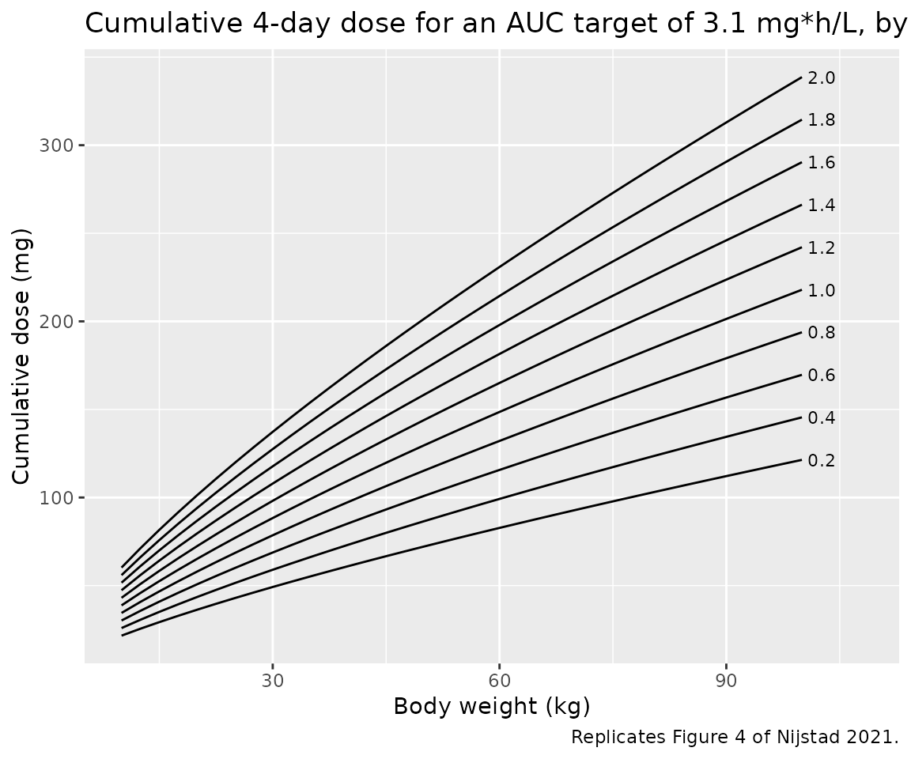
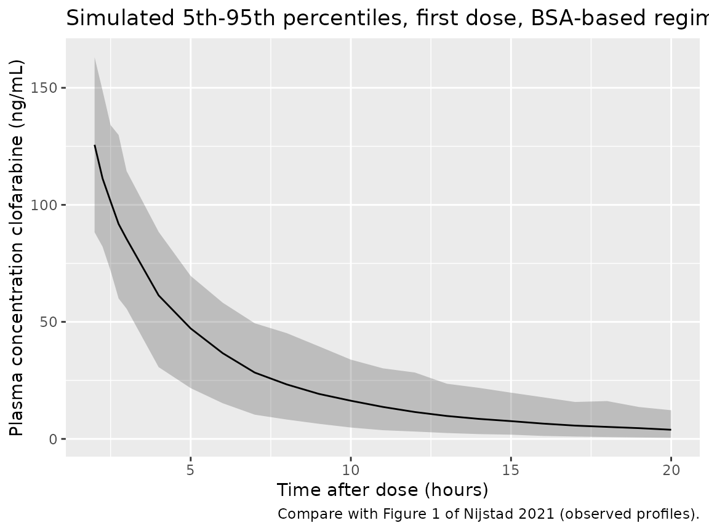
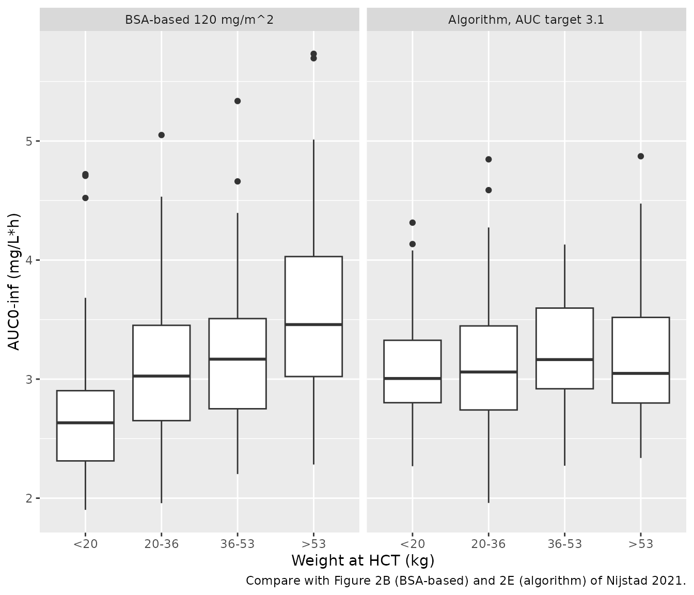
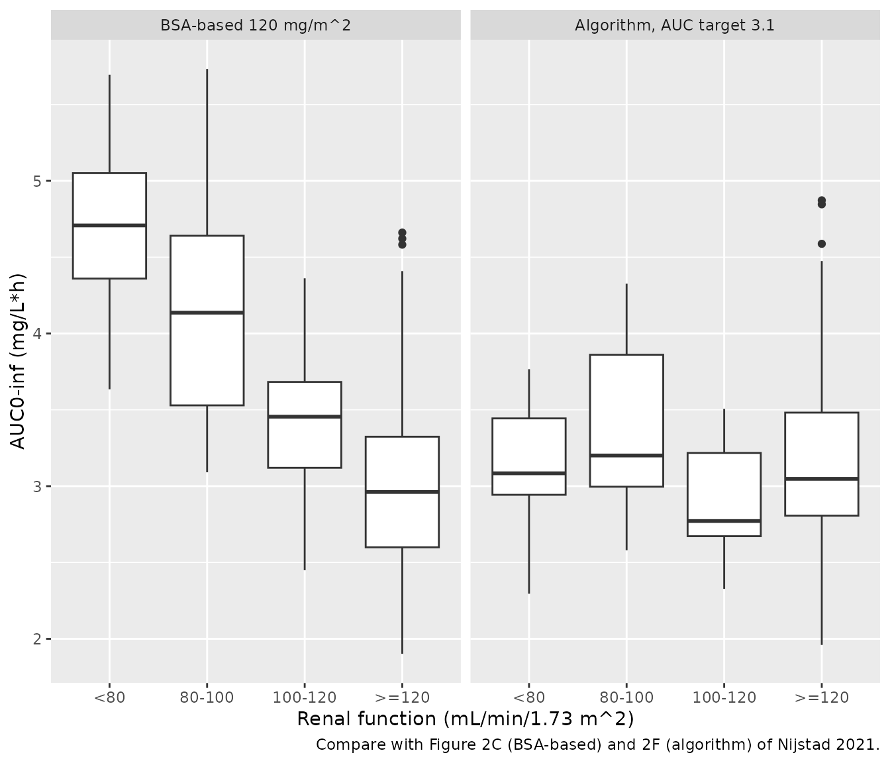

# Clofarabine (Nijstad 2021)

## Model and source

- Citation: Nijstad AL, Nierkens S, Lindemans CA, Boelens JJ, Bierings
  M, Versluys AB, van der Elst KCM, Huitema ADR. Population
  pharmacokinetics of clofarabine for allogeneic hematopoietic cell
  transplantation in paediatric patients. Br J Clin Pharmacol.
  2021;87(8):3218-3226. <doi:10.1111/bcp.14738>
- Description: Two-compartment IV population PK model for clofarabine in
  children (0.5-18 years) and one adult receiving
  clofarabine-fludarabine-busulfan myeloablative conditioning before
  allogeneic hematopoietic cell transplantation (Nijstad 2021; n = 81,
  805 plasma concentrations). Clearance is split into a non-renal arm
  (24.0 L/h at 70 kg) and a renal arm (29.8 L/h at 70 kg and normal
  renal function) scaled by relative renal function RF = (absolute eGFR
  in L/h x 70/WT) / 6 L/h, so CL = (CL_nonrenal + CL_renal x RF) x
  (WT/70)^0.75. Central and peripheral volumes scale with WT^1 and Q
  with WT^0.75 (exponents fixed, 70 kg reference). IIV on CL, V1 and Q;
  inter-occasion variability on CL and V2 with each of the four daily
  doses as its own occasion; proportional residual error.
- Article: <https://doi.org/10.1111/bcp.14738> (open access)

Nijstad et al. pooled the clofarabine concentrations measured in the
plasma samples drawn for routine busulfan therapeutic drug monitoring
during clofarabine-fludarabine-busulfan conditioning before allogeneic
hematopoietic cell transplantation (HCT). The final model is a linear
two-compartment model in which total clearance is split into a non-renal
arm and a renal arm that is proportional to the relative renal function
`RF`:

- `CL = (CL_nonrenal + CL_renal x RF) x (WT/70)^0.75`
- `RF = (eGFR (L/h) x 70/WT) / eGFR_STD`, with `eGFR_STD = 6 L/h` (100
  mL/min)
- `V1 = V1_70kg x (WT/70)`, `V2 = V2_70kg x (WT/70)`,
  `Q = Q_70kg x (WT/70)^0.75`

The authors then turn the model into a dosing algorithm (Section 3.5 Eq.
5): `Dose = AUC_target x (24.0 + 29.8 x RF) x (WT/70)^0.75`, where
`Dose` is the cumulative four-day dose.

## Population

Nijstad 2021 Table 1 describes 81 patients (80 children aged 0.5-18
years and one adult aged 37.8 years; median age 11.1 years, IQR
5.5-14.8) who received myeloablative conditioning at the University
Medical Centre Utrecht and the Princess Maxima Center for Pediatric
Oncology between October 2011 and January 2019. Median body weight was
36.6 kg (range 6.6-102.9, IQR 20.1-53.5), 37% were female, and five
patients were younger than 12 months. Indications were ALL (49%), AML
(35%), myelodysplastic syndrome (10%), CML (2%) and other (4%). The
BSA-normalized renal function (Schwartz for children, Cockcroft-Gault
for adults, capped at 140 mL/min/1.73 m^2) had a median of 140
mL/min/1.73 m^2 (range 69.3-140, IQR 123.1-140); no patient had moderate
or severe renal impairment. Every patient received a cumulative 120
mg/m^2 clofarabine as four once-daily 1-h infusions (Day -5 to Day -2),
each directly followed by a 1-h fludarabine infusion and a 3-h busulfan
infusion. The 805 plasma samples (median 10 per patient) were mostly
drawn 5-8 h after the end of the clofarabine infusion on day 1 or 2 and
on day 4.

The same information is available programmatically via
`readModelDb("Nijstad_2021_clofarabine")()$population`.

## Source trace

The per-parameter origin is recorded as an in-file comment next to each
`ini()` entry in
`inst/modeldb/specificDrugs/Nijstad_2021_clofarabine.R`. The table below
collects them in one place.

| Equation / parameter | Value | Source location |
|----|----|----|
| `lcl_nonren` (CL non-renal, 70 kg) | log(24.0) L/h | Table 2 |
| `lcl_renal` (CL renal, 70 kg, RF = 1) | log(29.8) L/h | Table 2 |
| `lvc` (V1, 70 kg) | log(268) L | Table 2 |
| `lvp` (V2, 70 kg) | log(186) L | Table 2 |
| `lq` (Q, 70 kg) | log(33.2) L/h | Table 2 |
| `etalcl` | 17.8% -\> 0.031192 | Table 2 ‘IIV CL’ |
| `etalvc` | 12.6% -\> 0.015751 | Table 2 ‘IIV V1’ |
| `etalq` | 64.5% -\> 0.347854 | Table 2 ‘IIV Q’ |
| `etaiov_cl_1` … `etaiov_cl_4` | 9.7% -\> 0.009365 | Table 2 ‘IOV CL’; one occasion per dose (Section 2.2) |
| `etaiov_vp_1` … `etaiov_vp_4` | 39.1% -\> 0.142264 | Table 2 ‘IOV V2’; one occasion per dose (Section 2.2) |
| `propSd` | 0.083 | Table 2 ‘Proportional residual error’ |
| `CL = (CL_nonrenal + CL_renal x RF) x (WT/70)^0.75` | n/a | Table 2 formula; Section 2.3 Eq. 3 |
| `RF = eGFR (L/h) x 70/WT / 6` | n/a | Table 2 formula; Section 2.3 Eq. 2 (eGFR_STD = 6 L/h) |
| `V1`, `V2` ~ `(WT/70)^1`; `Q` ~ `(WT/70)^0.75` | n/a | Table 2 formulas; Section 3.2 (exponents fixed) |
| `Pi = Ppop x exp(eta_i)` | n/a | Section 2.2 Eq. 1 |
| Two-compartment linear model, 1-h IV infusion | n/a | Sections 2.1, 3.2 |

## Typical-value checks

These checks use the model’s own parameters without random effects, so
they are exact and carry tight tolerances.

``` r

mod <- readModelDb("Nijstad_2021_clofarabine")
mod_typ <- rxode2::zeroRe(mod)
#> ℹ parameter labels from comments will be replaced by 'label()'
#> Warning: some etas defaulted to non-mu referenced, possible parsing error: etaiov_cl_1, etaiov_cl_2, etaiov_cl_3, etaiov_cl_4, etaiov_vp_1, etaiov_vp_2, etaiov_vp_3, etaiov_vp_4
#> as a work-around try putting the mu-referenced expression on a simple line
#> Warning: some etas defaulted to non-mu referenced, possible parsing error: etaiov_cl_1, etaiov_cl_2, etaiov_cl_3, etaiov_cl_4, etaiov_vp_1, etaiov_vp_2, etaiov_vp_3, etaiov_vp_4
#> as a work-around try putting the mu-referenced expression on a simple line

# One 1-h infusion per subject; the individual parameter columns (cl, vc, q,
# vp, rf) come back on every output row.
typ_params <- function(wt, crcl) {
  ev <- data.frame(
    id = seq_along(wt), time = 0, evid = 1, amt = 1, rate = 1,
    cmt = "central", WT = wt, CRCL = crcl, OCC = 1
  )
  ev <- dplyr::bind_rows(ev, dplyr::mutate(ev, time = 1, evid = 0, amt = 0, rate = 0))
  out <- rxode2::rxSolve(mod_typ, events = ev, returnType = "data.frame")
  # rxSolve omits the id column when only one subject is solved.
  if (!"id" %in% names(out)) out$id <- 1L
  out |>
    dplyr::group_by(id) |>
    dplyr::slice(1) |>
    dplyr::ungroup() |>
    dplyr::select(id, cl, vc, q, vp, rf)
}

# A 70 kg subject with an absolute eGFR of 100 mL/min (6 L/h) has RF = 1.
p70 <- typ_params(70, 100)
#> ℹ omega/sigma items treated as zero: 'etalcl', 'etalvc', 'etalq', 'etaiov_cl_1', 'etaiov_cl_2', 'etaiov_cl_3', 'etaiov_cl_4', 'etaiov_vp_1', 'etaiov_vp_2', 'etaiov_vp_3', 'etaiov_vp_4'
stopifnot(abs(p70$rf - 1) < 1e-12)

k10 <- p70$cl / p70$vc
k12 <- p70$q / p70$vc
k21 <- p70$q / p70$vp
s <- k10 + k12 + k21
lambda <- (s + c(1, -1) * sqrt(s^2 - 4 * k10 * k21)) / 2
thalf <- log(2) / lambda
renal_frac <- 29.8 / p70$cl

typical_checks <- tibble::tibble(
  Quantity = c("Total CL at 70 kg, RF = 1 (L/h)", "Renal share of CL (%)",
               "Alpha half-life (h)", "Beta half-life (h)"),
  Model = c(p70$cl, 100 * renal_frac, thalf[1], thalf[2]),
  Paper = c(24.0 + 29.8, 55, 1.7, 8.1),
  `Paper source` = c("Table 2 (24.0 + 29.8)", "Section 3.3 'approximately 55%'",
                     "Section 3.3", "Section 3.3")
)
knitr::kable(typical_checks, digits = 2,
             caption = "Typical-value quantities reported in the text of Nijstad 2021.")
```

| Quantity                        | Model | Paper | Paper source                    |
|:--------------------------------|------:|------:|:--------------------------------|
| Total CL at 70 kg, RF = 1 (L/h) | 53.80 |  53.8 | Table 2 (24.0 + 29.8)           |
| Renal share of CL (%)           | 55.39 |  55.0 | Section 3.3 ‘approximately 55%’ |
| Alpha half-life (h)             |  1.66 |   1.7 | Section 3.3                     |
| Beta half-life (h)              |  8.07 |   8.1 | Section 3.3                     |

Typical-value quantities reported in the text of Nijstad 2021. {.table}

``` r


stopifnot(
  abs(p70$cl - 53.8) < 1e-9,
  round(100 * renal_frac) == 55,
  round(thalf[1], 1) == 1.7,
  round(thalf[2], 1) == 8.1
)
```

### Figure 4: the dosing algorithm

The cumulative dose that gives a target cumulative AUC is
`AUC_target x CL` for a linear model. Recomputing it from the model’s
typical clearance reproduces Eq. 5 and Figure 4 (AUC target 3.1
mg\*h/L).

``` r

grid <- tidyr::expand_grid(WT = seq(10, 100, by = 2.5), RF = seq(0.2, 2, by = 0.2)) |>
  # Invert RF = (CRCL * 0.06) * (70 / WT) / 6 to get the absolute eGFR in mL/min.
  dplyr::mutate(CRCL = RF * 6 * WT / 70 / 0.06)
gp <- typ_params(grid$WT, grid$CRCL)
#> ℹ omega/sigma items treated as zero: 'etalcl', 'etalvc', 'etalq', 'etaiov_cl_1', 'etaiov_cl_2', 'etaiov_cl_3', 'etaiov_cl_4', 'etaiov_vp_1', 'etaiov_vp_2', 'etaiov_vp_3', 'etaiov_vp_4'
#> Warning: multi-subject simulation without without 'omega'
grid <- grid |>
  dplyr::mutate(
    cl_model = gp$cl,
    dose_model = 3.1 * cl_model,
    dose_eq5 = 3.1 * (24.0 + 29.8 * RF) * (WT / 70)^0.75
  )
stopifnot(
  max(abs(gp$rf - grid$RF)) < 1e-9,
  max(abs(grid$dose_model / grid$dose_eq5 - 1)) < 1e-9
)

# End points of the RF = 0.2 and RF = 2.0 curves read off Figure 4 at 100 kg
# (about 122 mg and 340 mg).
end_pts <- grid |> dplyr::filter(WT == 100, RF %in% c(0.2, 2)) |> dplyr::pull(dose_model)
stopifnot(abs(end_pts[1] - 122) < 5, abs(end_pts[2] - 340) < 8)

ggplot(grid, aes(WT, dose_model, group = RF)) +
  geom_line() +
  geom_text(data = dplyr::filter(grid, WT == 100),
            aes(label = sprintf("%.1f", RF)), hjust = -0.2, size = 3) +
  scale_x_continuous(limits = c(10, 108)) +
  labs(x = "Body weight (kg)", y = "Cumulative dose (mg)",
       title = "Cumulative 4-day dose for an AUC target of 3.1 mg*h/L, by RF",
       caption = "Replicates Figure 4 of Nijstad 2021.")
```



### Cumulative AUC after the algorithm dose

An independent check through the ODE solver: dosing a typical subject
with the Eq. 5 dose (split into four equal daily 1-h infusions) must
give a cumulative `AUC0-inf` of 3.1 mg\*h/L.

``` r

typ_subj <- tibble::tibble(id = 1:3, WT = c(12, 36.6, 70), RF = c(1.8, 1.4, 1)) |>
  dplyr::mutate(CRCL = RF * 6 * WT / 70 / 0.06,
                dose_total = 3.1 * (24.0 + 29.8 * RF) * (WT / 70)^0.75)
obs_times <- sort(unique(c(seq(0, 96, by = 0.1), seq(96, 240, by = 1))))
ev_typ <- dplyr::bind_rows(
  tidyr::expand_grid(typ_subj, time = c(0, 24, 48, 72)) |>
    dplyr::mutate(evid = 1, amt = dose_total / 4, rate = dose_total / 4, cmt = "central"),
  tidyr::expand_grid(typ_subj, time = obs_times) |>
    dplyr::mutate(evid = 0, amt = 0, rate = 0, cmt = "central")
) |>
  dplyr::mutate(OCC = pmin(floor(time / 24), 3) + 1) |>
  dplyr::arrange(id, time, dplyr::desc(evid))

sim_typ <- rxode2::rxSolve(mod_typ, events = ev_typ, rtol = 1e-10, atol = 1e-12,
                           returnType = "data.frame")
#> ℹ omega/sigma items treated as zero: 'etalcl', 'etalvc', 'etalq', 'etaiov_cl_1', 'etaiov_cl_2', 'etaiov_cl_3', 'etaiov_cl_4', 'etaiov_vp_1', 'etaiov_vp_2', 'etaiov_vp_3', 'etaiov_vp_4'
#> Warning: multi-subject simulation without without 'omega'
conc_typ <- sim_typ |>
  dplyr::filter(!is.na(Cc)) |>
  dplyr::mutate(Cc = pmax(Cc, 0), treatment = "typical") |>
  dplyr::select(id, time, Cc, treatment)
dose_typ <- ev_typ |>
  dplyr::filter(evid == 1) |>
  dplyr::mutate(treatment = "typical") |>
  dplyr::select(id, time, amt, treatment)
nca_typ <- PKNCA::pk.nca(PKNCA::PKNCAdata(
  PKNCA::PKNCAconc(conc_typ, Cc ~ time | treatment + id),
  PKNCA::PKNCAdose(dose_typ, amt ~ time | treatment + id),
  intervals = data.frame(start = 0, end = Inf, aucinf.obs = TRUE)
))
auc_typ <- as.data.frame(nca_typ) |>
  dplyr::filter(PPTESTCD == "aucinf.obs") |>
  dplyr::select(id, aucinf = PPORRES) |>
  dplyr::left_join(typ_subj, by = "id")
knitr::kable(auc_typ, digits = 3,
             caption = "Typical-value cumulative AUC0-inf (mg*h/L) after the Eq. 5 dose; target 3.1.")
```

|  id | aucinf |   WT |  RF |    CRCL | dose_total |
|----:|-------:|-----:|----:|--------:|-----------:|
|   1 |    3.1 | 12.0 | 1.8 |  30.857 |     64.122 |
|   2 |    3.1 | 36.6 | 1.4 |  73.200 |    125.270 |
|   3 |    3.1 | 70.0 | 1.0 | 100.000 |    166.780 |

Typical-value cumulative AUC0-inf (mg\*h/L) after the Eq. 5 dose; target
3.1. {.table}

``` r

stopifnot(max(abs(auc_typ$aucinf / 3.1 - 1)) < 0.01)
```

## Virtual cohort

The observed data are not public. The virtual cohort approximates Table
1:

- Body weight: log-normal with median 36.6 kg and log-SD 0.73 (from the
  IQR 20.1-53.5), truncated to the observed 6.6-102.9 kg.
- BSA-normalized eGFR: 12 of 81 patients (15%) had a value below 120
  mL/min/1.73 m^2 in Figure 2C (3 below 80, 6 at 80-100, 3 at 100-120);
  the remainder is split between the 140 cap (60%) and 120-140 (25%),
  which matches the Table 1 median of 140 and puts the first quartile
  near 128.
- BSA from the weight-only Costeff formula
  `BSA = (4 WT + 7) / (WT + 90)`.
- Absolute eGFR (the model’s `CRCL` column, mL/min) = BSA-normalized
  eGFR x BSA / 1.73.

Two dosing arms use the same 200 virtual patients: the clinical
BSA-based regimen (30 mg/m^2 once daily for 4 days as 1-h infusions) and
the paper’s algorithm dose for a cumulative AUC target of 3.1 mg\*h/L
(Eq. 5), split into four equal daily infusions. Each dose opens a new
occasion (`OCC` 1-4).

``` r

set.seed(20210314)
n_sub <- 200

wt <- numeric(0)
while (length(wt) < n_sub) {
  draw <- exp(rnorm(n_sub, log(36.6), 0.73))
  wt <- c(wt, draw[draw >= 6.6 & draw <= 102.9])
}
wt <- wt[seq_len(n_sub)]

egfr_band <- sample(c("lt80", "80-100", "100-120", "120-140", "140"), n_sub,
                    replace = TRUE, prob = c(3, 6, 3, 0.25 * 81, 0.60 * 81))
egfr_norm <- dplyr::case_when(
  egfr_band == "lt80" ~ runif(n_sub, 69.3, 80),
  egfr_band == "80-100" ~ runif(n_sub, 80, 100),
  egfr_band == "100-120" ~ runif(n_sub, 100, 120),
  egfr_band == "120-140" ~ runif(n_sub, 120, 140),
  TRUE ~ 140
)

subjects <- tibble::tibble(
  id = seq_len(n_sub),
  WT = wt,
  BSA = (4 * wt + 7) / (wt + 90),
  EGFR_NORM = egfr_norm
) |>
  dplyr::mutate(
    CRCL = EGFR_NORM * BSA / 1.73,
    RF = CRCL * 0.06 * (70 / WT) / 6,
    dose_bsa = 4 * 30 * BSA,
    dose_alg = 3.1 * (24.0 + 29.8 * RF) * (WT / 70)^0.75
  )

obs_grid <- sort(unique(c(
  as.vector(outer(c(0, 24, 48, 72), c(seq(0, 3, by = 0.25), 4:23), "+")),
  seq(96, 144, by = 2)
)))

make_arm <- function(subj, dose_col, treatment, id_offset) {
  subj <- subj |>
    dplyr::mutate(id = id + id_offset, treatment = treatment,
                  daily = .data[[dose_col]] / 4)
  doses <- tidyr::expand_grid(subj, time = c(0, 24, 48, 72)) |>
    dplyr::mutate(evid = 1, amt = daily, rate = daily, cmt = "central")
  obs <- tidyr::expand_grid(subj, time = obs_grid) |>
    dplyr::mutate(evid = 0, amt = 0, rate = 0, cmt = "central")
  dplyr::bind_rows(doses, obs) |>
    # Each observation carries the occasion of the dose that preceded it.
    dplyr::mutate(OCC = pmin(floor(time / 24), 3) + 1) |>
    dplyr::select(id, time, evid, amt, rate, cmt, WT, CRCL, OCC,
                  treatment, BSA, EGFR_NORM)
}

events <- dplyr::bind_rows(
  make_arm(subjects, "dose_bsa", "BSA-based 120 mg/m^2", 0L),
  make_arm(subjects, "dose_alg", "Algorithm, AUC target 3.1", n_sub)
) |>
  dplyr::arrange(id, time, dplyr::desc(evid))
stopifnot(!anyDuplicated(events[, c("id", "time", "evid")]))

summary(subjects[, c("WT", "BSA", "EGFR_NORM", "CRCL", "RF", "dose_bsa", "dose_alg")])
#>        WT              BSA           EGFR_NORM           CRCL       
#>  Min.   : 7.134   Min.   :0.3658   Min.   : 71.98   Min.   : 18.74  
#>  1st Qu.:23.156   1st Qu.:0.8804   1st Qu.:125.04   1st Qu.: 63.24  
#>  Median :35.557   Median :1.1885   Median :140.00   Median : 86.58  
#>  Mean   :40.631   Mean   :1.2231   Mean   :128.76   Mean   : 90.98  
#>  3rd Qu.:56.785   3rd Qu.:1.5951   3rd Qu.:140.00   3rd Qu.:119.04  
#>  Max.   :99.649   Max.   :2.1387   Max.   :140.00   Max.   :172.17  
#>        RF            dose_bsa        dose_alg     
#>  Min.   :0.6842   Min.   : 43.9   Min.   : 44.98  
#>  1st Qu.:1.4566   1st Qu.:105.6   1st Qu.:110.45  
#>  Median :1.7357   Median :142.6   Median :140.32  
#>  Mean   :1.7498   Mean   :146.8   Mean   :144.10  
#>  3rd Qu.:2.0503   3rd Qu.:191.4   3rd Qu.:179.38  
#>  Max.   :2.9050   Max.   :256.6   Max.   :242.16
```

## Simulation

``` r

sim <- rxode2::rxSolve(
  mod, events = events,
  keep = c("treatment", "WT", "EGFR_NORM"),
  maxsteps = 1e6,
  returnType = "data.frame"
)
#> ℹ parameter labels from comments will be replaced by 'label()'
#> Warning: some etas defaulted to non-mu referenced, possible parsing error: etaiov_cl_1, etaiov_cl_2, etaiov_cl_3, etaiov_cl_4, etaiov_vp_1, etaiov_vp_2, etaiov_vp_3, etaiov_vp_4
#> as a work-around try putting the mu-referenced expression on a simple line
stopifnot(!anyNA(sim$Cc))
```

### Figure 1: concentrations after the first dose

Figure 1 of the paper overlays every observed dose profile (in ng/mL)
against time after the start of the infusion. The observed curves run
from about 40-150 ng/mL at 2.5 h to 15-100 ng/mL at 5-6 h and 5-20 ng/mL
at 15-18 h.

``` r

fig1 <- sim |>
  dplyr::filter(treatment == "BSA-based 120 mg/m^2", time >= 2, time <= 20) |>
  dplyr::mutate(Cc_ng = 1000 * sim) |>
  dplyr::group_by(time) |>
  dplyr::summarise(
    Q05 = quantile(Cc_ng, 0.05), Q50 = median(Cc_ng), Q95 = quantile(Cc_ng, 0.95),
    .groups = "drop"
  )
ggplot(fig1, aes(time, Q50)) +
  geom_ribbon(aes(ymin = Q05, ymax = Q95), alpha = 0.25) +
  geom_line() +
  labs(x = "Time after dose (hours)", y = "Plasma concentration clofarabine (ng/mL)",
       title = "Simulated 5th-95th percentiles, first dose, BSA-based regimen",
       caption = "Compare with Figure 1 of Nijstad 2021 (observed profiles).")
```



``` r


# The simulated median at 2.5 h and 6 h sits inside the observed band.
q_at <- function(t) fig1$Q50[which.min(abs(fig1$time - t))]
stopifnot(q_at(2.5) > 40, q_at(2.5) < 150, q_at(6) > 15, q_at(6) < 100)
```

## PKNCA validation

The paper’s exposure metric is the cumulative `AUC_T0-inf` over all four
doses. With a single interval from the first dose to infinity, PKNCA
returns exactly that (the four doses and the terminal extrapolation
after the last one).

``` r

conc_df <- sim |>
  dplyr::filter(!is.na(Cc)) |>
  dplyr::mutate(Cc = pmax(Cc, 0)) |>
  dplyr::select(id, time, Cc, treatment)
dose_df <- events |>
  dplyr::filter(evid == 1) |>
  dplyr::select(id, time, amt, treatment)

nca_one <- function(trt) {
  PKNCA::pk.nca(PKNCA::PKNCAdata(
    PKNCA::PKNCAconc(dplyr::filter(conc_df, treatment == trt), Cc ~ time | treatment + id),
    PKNCA::PKNCAdose(dplyr::filter(dose_df, treatment == trt), amt ~ time | treatment + id),
    intervals = data.frame(start = 0, end = Inf, aucinf.obs = TRUE, half.life = TRUE)
  ))
}
nca_bsa <- nca_one("BSA-based 120 mg/m^2")
nca_alg <- nca_one("Algorithm, AUC target 3.1")

auc <- dplyr::bind_rows(as.data.frame(nca_bsa), as.data.frame(nca_alg)) |>
  dplyr::filter(PPTESTCD == "aucinf.obs") |>
  dplyr::select(id, treatment, aucinf = PPORRES) |>
  dplyr::left_join(
    dplyr::distinct(sim, id, WT, EGFR_NORM),
    by = "id"
  )
stopifnot(nrow(auc) == 2 * n_sub, !anyNA(auc$aucinf))

auc |>
  dplyr::group_by(treatment) |>
  dplyr::summarise(
    median = median(aucinf), p2.5 = quantile(aucinf, 0.025),
    p97.5 = quantile(aucinf, 0.975), min = min(aucinf), max = max(aucinf),
    .groups = "drop"
  ) |>
  knitr::kable(digits = 2, caption = "Simulated cumulative AUC0-inf (mg*h/L).")
```

| treatment                 | median | p2.5 | p97.5 |  min |  max |
|:--------------------------|-------:|-----:|------:|-----:|-----:|
| Algorithm, AUC target 3.1 |   3.06 | 2.28 |  4.33 | 1.96 | 4.87 |
| BSA-based 120 mg/m^2      |   3.11 | 2.05 |  4.93 | 1.90 | 5.73 |

Simulated cumulative AUC0-inf (mg\*h/L). {.table}

### Comparison against published exposure

Figure 2A and 2D print the median cumulative `AUC_T0-inf` for the trial
doses (observed; 3.1 mg*h/L, range 1.8-6.0) and for the algorithm doses
(calculated from the individual clearances; 3.1 mg*h/L, range 2.1-4.7).
The simulated medians of both arms reproduce the published 3.1 mg\*h/L,
and the simulated exposure is narrower under the algorithm than under
BSA-based dosing, as in the paper.

``` r

published <- tibble::tribble(
  ~treatment,                  ~aucinf.obs,
  "BSA-based 120 mg/m^2",      3.1,
  "Algorithm, AUC target 3.1", 3.1
)
cmp <- nlmixr2lib::ncaComparisonTable(
  simulated = dplyr::bind_rows(as.data.frame(nca_bsa), as.data.frame(nca_alg)),
  reference = published,
  by = "treatment",
  params = "aucinf.obs",
  units = c(aucinf.obs = "mg*h/L"),
  tolerance_pct = 20
)
knitr::kable(cmp, caption = "Simulated vs. published median cumulative AUC0-inf. * differs by >20%.")
```

| NCA parameter          | treatment                 | Reference | Simulated | % diff |
|:-----------------------|:--------------------------|:----------|:----------|:-------|
| AUC0-∞ (obs) (mg\*h/L) | BSA-based 120 mg/m^2      | 3.1       | 3.11      | +0.4%  |
| AUC0-∞ (obs) (mg\*h/L) | Algorithm, AUC target 3.1 | 3.1       | 3.06      | -1.3%  |

Simulated vs. published median cumulative AUC0-inf. \* differs by \>20%.
{.table}

``` r


# Spread of exposure: the paper reports that the algorithm narrows the range
# (2.1-4.7 vs 1.8-6.0 mg*h/L). Compare robust quantile widths, not extremes.
width <- tapply(auc$aucinf, auc$treatment, function(x) diff(quantile(x, c(0.05, 0.95))))
width
#> Algorithm, AUC target 3.1      BSA-based 120 mg/m^2 
#>                  1.907020                  2.499688
# Both arms are the same 200 virtual patients, so the random effects are
# shared and only the covariate-driven part of the spread differs. The
# algorithm removes the weight / renal-function component; the ratio was
# about 0.7 when this was written.
stopifnot(width[["Algorithm, AUC target 3.1"]] < 0.95 * width[["BSA-based 120 mg/m^2"]])

med <- tapply(auc$aucinf, auc$treatment, median)
stopifnot(
  # Algorithm arm: the dose is computed from the model's own typical CL, so
  # the median depends only on the random effects (median exp(-eta) = 1).
  # A mis-transcribed CL arm moves it by >= 10%.
  abs(med[["Algorithm, AUC target 3.1"]] / 3.1 - 1) < 0.06,
  # BSA arm: depends also on the virtual cohort's weight / eGFR / BSA
  # assumptions, so the envelope is wider.
  abs(med[["BSA-based 120 mg/m^2"]] / 3.1 - 1) < 0.15
)
```

### Figure 2: exposure by weight and renal function

``` r

auc_cat <- auc |>
  dplyr::mutate(
    treatment = factor(treatment, levels = c("BSA-based 120 mg/m^2", "Algorithm, AUC target 3.1")),
    wt_band = cut(WT, c(0, 20, 36, 53, Inf), labels = c("<20", "20-36", "36-53", ">53")),
    rf_band = cut(EGFR_NORM, c(0, 80, 100, 120, Inf), right = FALSE,
                  labels = c("<80", "80-100", "100-120", ">=120"))
  )
p_wt <- ggplot(auc_cat, aes(wt_band, aucinf)) +
  geom_boxplot() +
  facet_wrap(~treatment) +
  labs(x = "Weight at HCT (kg)", y = "AUC0-inf (mg/L*h)",
       caption = "Compare with Figure 2B (BSA-based) and 2E (algorithm) of Nijstad 2021.")
p_rf <- ggplot(auc_cat, aes(rf_band, aucinf)) +
  geom_boxplot() +
  facet_wrap(~treatment) +
  labs(x = "Renal function (mL/min/1.73 m^2)", y = "AUC0-inf (mg/L*h)",
       caption = "Compare with Figure 2C (BSA-based) and 2F (algorithm) of Nijstad 2021.")
p_wt
```



``` r

p_rf
```



Figure 2B shows a lower median exposure in the lightest children (about
2.5 mg*h/L below 20 kg against about 3.2-3.3 mg*h/L in the heavier
quartiles, read from the boxplots by the maintainers), and Figure 2C a
higher exposure below 80 mL/min/1.73 m^2. Both follow from the model
structure. They are checked on typical values rather than on the
simulated cohort, because the cohort’s small subgroups make a race
between noisy medians:

``` r

typ_bsa <- tibble::tibble(
  WT = c(12, 45, 12, 45),
  EGFR_NORM = c(140, 140, 75, 75)
) |>
  dplyr::mutate(
    BSA = (4 * WT + 7) / (WT + 90),
    CRCL = EGFR_NORM * BSA / 1.73
  )
typ_bsa$cl <- typ_params(typ_bsa$WT, typ_bsa$CRCL)$cl
#> ℹ omega/sigma items treated as zero: 'etalcl', 'etalvc', 'etalq', 'etaiov_cl_1', 'etaiov_cl_2', 'etaiov_cl_3', 'etaiov_cl_4', 'etaiov_vp_1', 'etaiov_vp_2', 'etaiov_vp_3', 'etaiov_vp_4'
#> Warning: multi-subject simulation without without 'omega'
typ_bsa <- dplyr::mutate(typ_bsa, auc = 120 * BSA / cl)
knitr::kable(typ_bsa, digits = 2,
             caption = "Typical-value cumulative AUC (mg*h/L) after 120 mg/m^2.")
```

|  WT | EGFR_NORM |  BSA |   CRCL |    cl |  auc |
|----:|----------:|-----:|-------:|------:|-----:|
|  12 |       140 | 0.54 |  43.64 | 26.60 | 2.43 |
|  45 |       140 | 1.39 | 112.10 | 54.54 | 3.05 |
|  12 |        75 | 0.54 |  23.38 | 17.22 | 3.76 |
|  45 |        75 | 1.39 |  60.05 | 37.22 | 4.47 |

Typical-value cumulative AUC (mg\*h/L) after 120 mg/m^2. {.table}

``` r

stopifnot(
  # Lighter child, same normalized eGFR: lower exposure (Figure 2B).
  typ_bsa$auc[1] / typ_bsa$auc[2] < 0.95,
  # Same child, eGFR 75 vs 140 mL/min/1.73 m^2: higher exposure (Figure 2C).
  typ_bsa$auc[4] / typ_bsa$auc[2] > 1.2
)
```

## Assumptions and deviations

- **Omega scale.** Table 2 prints the IIV and IOV as percentages without
  stating whether they are CV% or 100 x the SD of eta. They are read as
  CV% and converted with `omega^2 = log(CV^2 + 1)`. The two readings
  differ materially only for the 64.5% IIV on Q (0.348 vs 0.416) and the
  39.1% IOV on V2 (0.142 vs 0.153).
- **Occasions.** The paper defines each dose and its sampling as an
  occasion. The four once-daily doses give occasions 1-4, and one IOV
  variance per parameter is shared across them (occasions 2-4 are fixed
  equal to occasion 1). rxode2 has no `| occ` random-effect level, so
  the occasion etas are selected by indicator variables; rxode2
  therefore reports that these etas are not mu-referenced. This has no
  effect on simulation.
- **Absolute eGFR.** The model’s renal covariate is the absolute eGFR
  (L/h in the paper), stored in mL/min in the `CRCL` column and
  converted in `model()`. The paper computes a BSA-normalized, capped
  Schwartz / Cockcroft-Gault estimate first and does not print how it
  was expressed as an absolute value; the virtual cohort multiplies by
  BSA / 1.73. The cap at 140 mL/min/1.73 m^2 and the birth-to-1.5-year
  ramp are part of the covariate derivation, not of the model; the
  virtual cohort samples the already-capped BSA-normalized eGFR directly
  from the Table 1 distribution.
- **Body surface area.** Needed only to compute the clinical dose and
  the absolute eGFR of the virtual cohort. The weight-only Costeff
  formula is used because the paper reports no heights.
- **Renal function distribution.** Reconstructed from the Table 1 median
  / IQR and the Figure 2C category counts; age, sex and eGFR are not
  correlated with weight in the virtual cohort.
- **Figure 2 subgroup medians** were read from the boxplots by the
  maintainers and are used only qualitatively.
- **Maturation.** The Rhodin postmenstrual-age maturation function was
  tested and not retained, so the model carries none. The paper included
  no patient under 6 months; extrapolation to young infants is not
  supported.
- No erratum or correction notice was found for this article (EuropePMC
  search, 2026-09-28).
