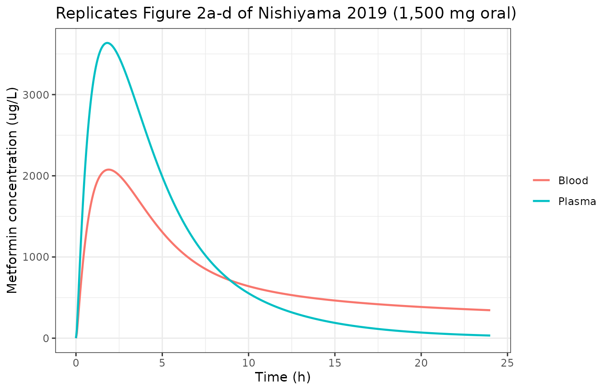
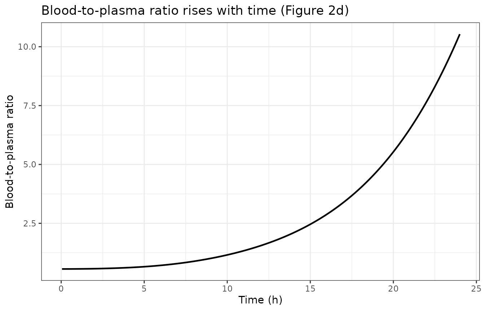
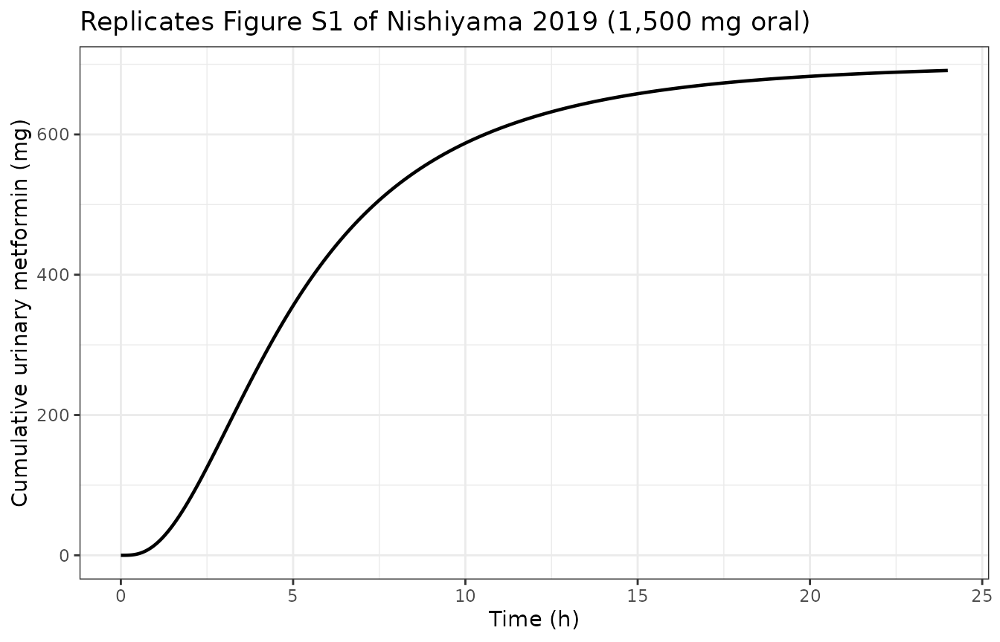
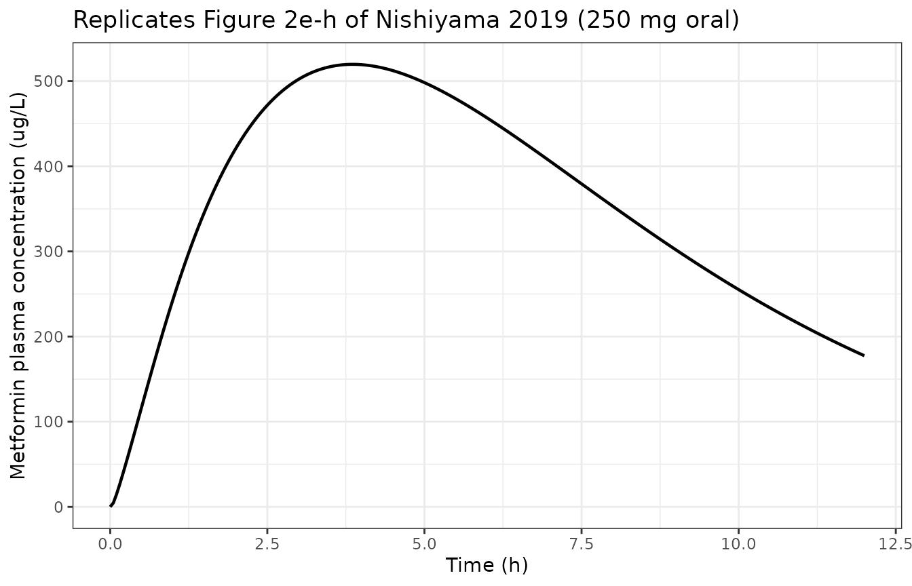
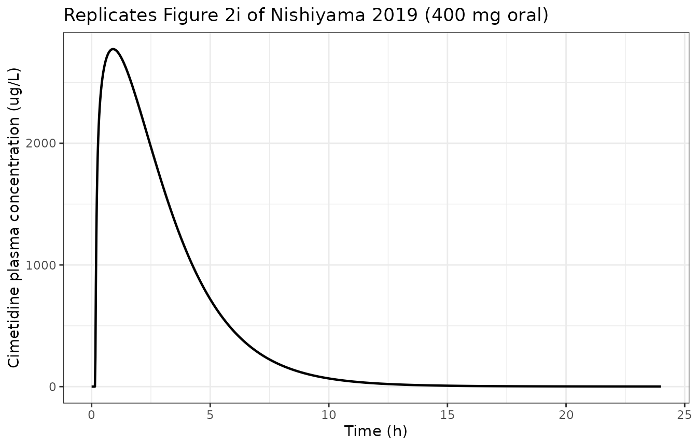
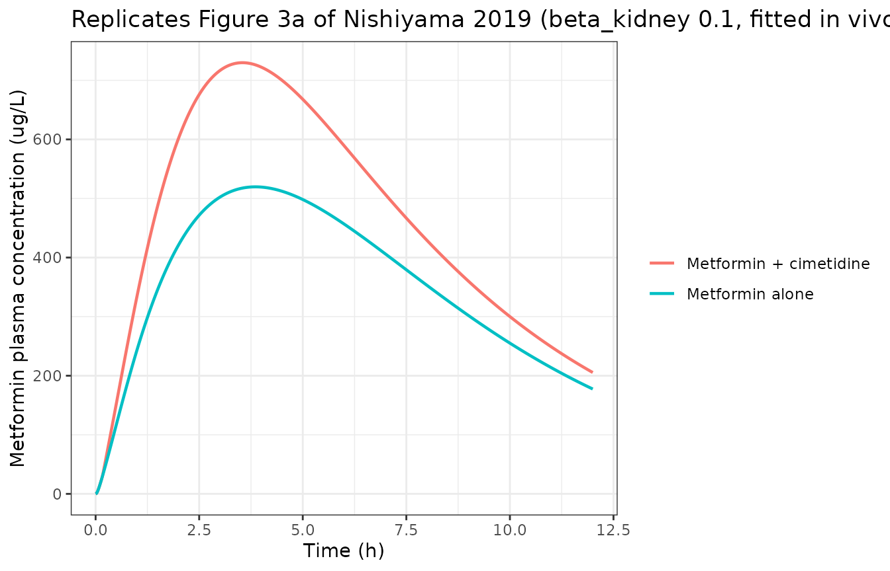
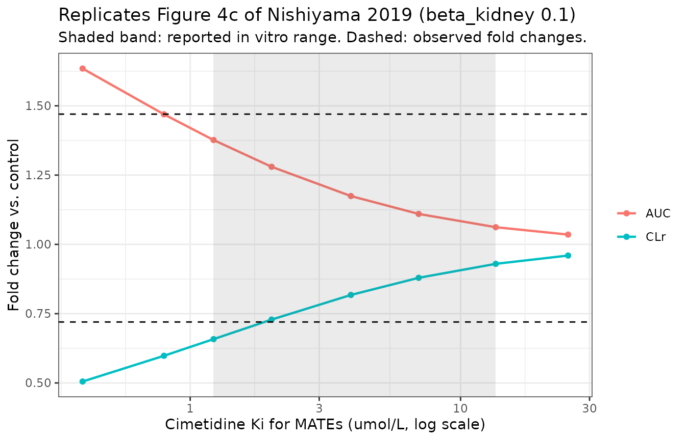

# Metformin + cimetidine renal transporter interaction (Nishiyama 2019)

## Model and source

This paper contributes three model files, because the authors built
three models: a metformin PBPK model, a cimetidine PBPK model, and the
combined system in which cimetidine competitively inhibits metformin’s
transporters.

- `Nishiyama_2019_metformin_pbpk` – metformin alone (53 ODE states)

- `Nishiyama_2019_cimetidine_pbpk` – cimetidine alone (27 ODE states)

- `Nishiyama_2019_metformin_cimetidine_ddi_pbpk` – both together (80 ODE
  states)

- Citation: Nishiyama K, Toshimoto K, Lee W, Ishiguro N, Bister B,
  Sugiyama Y. Physiologically-Based Pharmacokinetic Modeling Analysis
  for Quantitative Prediction of Renal Transporter-Mediated Interactions
  Between Metformin and Cimetidine. CPT Pharmacometrics Syst Pharmacol.
  2019;8(6):396-406. <doi:10.1002/psp4.12398>. The ODE system and the
  hybrid-to-elementary parameter conversions are transcribed from
  Supplementary Material S2 (‘Model equations for metformin’, file
  PSP4-8-396-s008.pdf) and the Supplemental Text (PSP4-8-396-s007.pdf).
  Drug parameters are Table S1 (PSP4-8-396-s003.pdf), body physiology is
  Table S2 (PSP4-8-396-s004.pdf) and kidney physiology is Table S3
  (PSP4-8-396-s005.pdf). Fitted ka, ktrans and RMATE/dif are Table 1 of
  the article. See the vignette Errata for the transcription corrections
  applied to the published equation list.

- Article: <https://doi.org/10.1002/psp4.12398>

- Supplements (open access, same DOI): Tables S1-S4 and the two
  supplemental model documents `PSP4-8-396-s003.pdf` through
  `PSP4-8-396-s008.pdf`.

All three models carry their amounts in micrograms and their
concentrations in ug/L, with every volume in litres, so a dose in
milligrams is entered as `amt = <mg> * 1000`.

``` r

met <- rxode2::rxode2(readModelDb("Nishiyama_2019_metformin_pbpk"))
cim <- rxode2::rxode2(readModelDb("Nishiyama_2019_cimetidine_pbpk"))
ddi <- rxode2::rxode2(readModelDb("Nishiyama_2019_metformin_cimetidine_ddi_pbpk"))
c(metformin = length(met$state), cimetidine = length(cim$state), ddi = length(ddi$state))
#>  metformin cimetidine        ddi 
#>         53         27         80
```

### What the paper is about

Metformin is cleared almost entirely by the kidney, and its renal
clearance exceeds the glomerular filtration rate, so it is actively
secreted: taken up across the basolateral membrane of the proximal
tubule by OCT2 and pumped into the urine across the luminal membrane by
MATE1 and MATE2-K. Cimetidine inhibits both, and raises metformin
exposure about 50% in healthy volunteers.

The problem the paper addresses is that the previously published PBPK
models could only reproduce that interaction after lowering cimetidine’s
inhibition constants far below their measured in vitro values – by
roughly 500-fold for the conventional model and 8- to 18-fold for the
“electrochemical” model. A model that needs its inhibition constants
retuned per interaction cannot be used to *predict* a new one.

The authors’ change is small and specific: OCT1 and OCT2 are
electrogenic, so their transport is driven by the membrane potential,
and the earlier model let that potential move with the metformin
concentration. Here it is held **constant**, on the argument that the
membrane potential is set by ions present at 100-200 mmol/L and is not
perturbed measurably by a drug at micromolar concentrations. With that
one change the interaction is reproduced using in vitro inhibition
constants, and the sensitivity analysis then identifies MATE inhibition
– not OCT2 inhibition – as the mechanism.

## Population

These are not population models fitted to individual-level data. The
physiology is the standard 70 kg adult of Davies & Morris 1993 (Table
S2), with the kidney geometry of Table S3, and the models were fitted
to, or compared against, published mean profiles from three studies:

- **Metformin 1,500 mg single oral dose** – plasma and whole-blood
  concentrations and urinary excretion, Tucker et al. 1981 (Br J Clin
  Pharmacol 12:235-246). This is the data set that determined `ka`,
  `ktrans` and `RMATE/dif`.
- **Metformin 250 mg single oral dose, with and without 400 mg
  cimetidine** – the six-subject crossover of Somogyi et al. 1987 (Br J
  Clin Pharmacol 23:545-551), which supplies both the control arm used
  to re-fit `ktrans` and `RMATE/dif` at 250 mg and the observed
  interaction ratios.
- **Cimetidine 400 mg single oral dose** – Grahnen et al. 1979 (Eur J
  Clin Pharmacol 16:335-340).

``` r

str(readModelDb("Nishiyama_2019_metformin_cimetidine_ddi_pbpk")()$population)
#> List of 5
#>  $ species      : chr "human"
#>  $ n_subjects   : int 6
#>  $ disease_state: chr "healthy adults"
#>  $ dose_range   : chr "250 mg metformin with and without 400 mg cimetidine, single oral doses"
#>  $ notes        : chr "The interaction reproduced is the six-subject crossover of Somogyi et al. 1987 (Br J Clin Pharmacol 23:545-551)"| __truncated__
```

## Source trace

Every `ini()` entry in the three model files carries an in-file comment
naming its source table. The table below collects the structural
equations and the parameters that are not simply physiology.

| Equation / parameter | Value | Source location |
|----|----|----|
| Erythrocyte partitioning, `kin_rbc` / `kout_rbc` | 0.006 / 0.02 per h | Methods eqs. 1-2; Table S1 |
| OCT1 bidirectional transport | Michaelis-Menten with `exp(N_h) / R_OCT1,inf/eff` | Methods eq. 3-4 |
| OCT2 bidirectional transport | Michaelis-Menten with `exp(N_vpt) / R_OCT2,inf/eff` | Methods eq. 5 |
| MATE efflux | Michaelis-Menten, `Vmax,MATE / (Km,MATE + C_cell)` | Methods eq. 6 |
| `CL_int,sec = PS_r,inf * beta_kidney` | – | Methods eqs. 7-14 |
| Competitive inhibition `PS_act(+I) = PS_act / (1 + I/Ki)` | – | Methods eq. 15 |
| Hepatic hybrid-to-elementary conversion | `PS_h,act = CL_int,all / (beta_liver (1 + R_dif))` | Supplemental Text eqs. 1-5; Suppl. S2 “Other equations” |
| Nernst ratio `gamma_h` | 4.46 | Supplemental Text eq. 7 |
| Metformin `ka` | 0.21 /h | Table 1 (both dose panels) |
| Metformin `ktrans` | 2.4 /h (1,500 mg); 0.61 /h (250 mg) | Table 1 |
| Metformin `RMATE/dif` | 153 / 213 / 325 / 814 (1,500 mg); 183 / 261 / 402 / 1,143 (250 mg) | Table 1 |
| Metformin `FaFg` | 0.57 (1,500 mg); 0.84 (250 mg) | Table S1 |
| Metformin `CL_int,all`, `R_dif`, `beta_liver` | 10.7 L/h, 0.186, 0.5 | Table S1 |
| Metformin `Kp` adipose / muscle / skin | 0.27 / 2.09 / 1.46 | Table S1 |
| Metformin in vitro `Km` OCT1 / OCT2 / MATEs | 1,470 / 1,178 / 740 umol/L | Table S1 |
| Metformin `Pd`, membrane potential | 1.8e-5 m/h, -40 mV (liver) | Table S1 |
| Body volumes and blood flows | – | Table S2 |
| Kidney flows, areas, potentials, pH | – | Table S3 |
| Cimetidine compound layer | – | Table S4 |
| Cimetidine `Ki` OCT1 / OCT2 / MATEs | 104 / 159 / 3.93 umol/L | Table 2 footnote |
| Fitted in vivo `Ki` for MATEs | 1.71 / 1.34 / 0.64 / 0.23 umol/L | Table 3 |

## Structural check: mass balance

Before comparing any number to the paper, check the topology. Each model
carries explicit sinks (`a_feces`, `a_metab`, `urine`) alongside every
distribution state, so the sum over **all** states must equal the dose
at all times. A missing, duplicated or mis-signed flow term in an
80-state transcription of a PDF equation list is invisible to inspection
but shows up here immediately.

``` r

total_mass <- function(mod, ev, dose_ug, states) {
  s <- as.data.frame(rxode2::rxSolve(mod, ev, atol = 1e-9, rtol = 1e-9, addDosing = FALSE))
  rowSums(s[, states, drop = FALSE]) / dose_ug
}

# The observation grid starts at 1 h, after cimetidine's 0.15 h absorption lag.
# During the lag the dose is genuinely in no compartment -- rxode2 holds it
# outside the system until t = tlag -- so a t = 0 record would report zero mass
# for a reason that has nothing to do with the topology being checked.
mb_grid <- seq(1, 24, by = 1)
ev_met <- rxode2::et(amt = 1500 * 1000, cmt = "transit1") |> rxode2::et(mb_grid)
ev_cim <- rxode2::et(amt = 400 * 1000, cmt = "intestine") |> rxode2::et(mb_grid)
ev_ddi <- rxode2::et(amt = 250 * 1000, cmt = "transit1_met") |>
  rxode2::et(amt = 400 * 1000, cmt = "intestine_cim") |>
  rxode2::et(mb_grid)

mb_met <- total_mass(met, ev_met, 1500 * 1000, met$state)
mb_cim <- total_mass(cim, ev_cim, 400 * 1000, cim$state)
mb_ddi_met <- total_mass(ddi, ev_ddi, 250 * 1000, grep("_met$", ddi$state, value = TRUE))
mb_ddi_cim <- total_mass(ddi, ev_ddi, 400 * 1000, grep("_cim$", ddi$state, value = TRUE))

data.frame(
  model = c("metformin", "cimetidine", "DDI (metformin states)", "DDI (cimetidine states)"),
  worst_relative_error = c(
    max(abs(mb_met - 1)), max(abs(mb_cim - 1)),
    max(abs(mb_ddi_met - 1)), max(abs(mb_ddi_cim - 1))
  )
)
#>                     model worst_relative_error
#> 1               metformin         1.776357e-15
#> 2              cimetidine         1.554312e-15
#> 3  DDI (metformin states)         8.881784e-16
#> 4 DDI (cimetidine states)         3.885781e-15

# The two sides of the interaction model must conserve their own drug
# independently -- cimetidine inhibits metformin's carriers but no mass
# crosses between the two systems.
stopifnot(
  max(abs(mb_met - 1)) < 1e-6,
  max(abs(mb_cim - 1)) < 1e-6,
  max(abs(mb_ddi_met - 1)) < 1e-6,
  max(abs(mb_ddi_cim - 1)) < 1e-6
)
```

## Derived-parameter check

The paper’s Discussion prints the elementary renal parameters it
back-solves from `beta_kidney` and `RMATE/dif` for the 1,500 mg fit at
`beta_kidney` = 0.1. Those are a direct, deterministic check on the
hybrid-to-elementary conversion before any ODE is integrated: they
involve no data, no integration and no fitting, so they either reproduce
or the transcription is wrong.

``` r

d <- as.data.frame(rxode2::rxSolve(
  met, rxode2::et(amt = 1, cmt = "transit1") |> rxode2::et(0),
  atol = 1e-9, rtol = 1e-9, addDosing = FALSE
))[1, ]

derived <- data.frame(
  quantity = c(
    "PS_OCT2,inf (L/h)", "PS_MATE (L/h)", "PS_r,dif,inf (L/h)",
    "PS_r,dif,eff (L/h)", "exp(N)/R_OCT2,inf/eff", "gamma_h"
  ),
  paper = c(732, 4.47, 0.043, 0.0031, 0.055, 4.46),
  model = c(
    d$ps_oct2, d$ps_mate, d$ps_r_pt_difinf, d$ps_r_pt_difeff,
    d$envpt / 1.32, d$gamma_h
  )
)
derived$pct_diff <- 100 * (derived$model - derived$paper) / derived$paper
knitr::kable(derived, digits = c(0, 4, 4, 1))
```

| quantity              |    paper |    model | pct_diff |
|:----------------------|---------:|---------:|---------:|
| PS_OCT2,inf (L/h)     | 732.0000 | 733.6630 |      0.2 |
| PS_MATE (L/h)         |   4.4700 |   4.4649 |     -0.1 |
| PS_r,dif,inf (L/h)    |   0.0430 |   0.0412 |     -4.2 |
| PS_r,dif,eff (L/h)    |   0.0031 |   0.0030 |     -3.3 |
| exp(N)/R_OCT2,inf/eff |   0.0550 |   0.0551 |      0.2 |
| gamma_h               |   4.4600 |   4.4702 |      0.2 |

`PS_OCT2,inf`, `PS_MATE`, the electrochemical factor and `gamma_h`
reproduce to better than 1%, which confirms the whole extended-clearance
chain – eq. 7 through eq. 14 plus the Nernst terms – was transcribed
correctly. The two passive-diffusion terms sit about 4% high; they are
printed to two significant figures in a Discussion worked example, and
because the paper’s own `PS_OCT2,inf` is reproduced using *this* model’s
`PS_u,PT,dif,eff` rather than the rounded one it prints, the rounding is
in the printed value rather than in the transcription. See Errata.

## Metformin alone

### Figure 2a-d: 1,500 mg single oral dose

The whole point of the erythrocyte compartments is the slow rise of the
blood-to-plasma ratio, which the model reproduces as a structural
consequence of `kin_rbc` \<\< `kout_rbc` being slow relative to
distribution rather than as a fitted time-varying parameter.

``` r

grid_fine <- seq(0, 24, by = 0.05)
s1500 <- as.data.frame(rxode2::rxSolve(
  met,
  rxode2::et(amt = 1500 * 1000, cmt = "transit1") |> rxode2::et(grid_fine),
  atol = 1e-9, rtol = 1e-9, addDosing = FALSE
))

s1500 |>
  dplyr::select(time, Plasma = Cc, Blood = Cb) |>
  tidyr::pivot_longer(-time, names_to = "matrix", values_to = "conc") |>
  ggplot2::ggplot(ggplot2::aes(time, conc, colour = matrix)) +
  ggplot2::geom_line(linewidth = 0.8) +
  ggplot2::labs(
    x = "Time (h)", y = "Metformin concentration (ug/L)", colour = NULL,
    title = "Replicates Figure 2a-d of Nishiyama 2019 (1,500 mg oral)"
  ) +
  ggplot2::theme_bw()
```



``` r


ggplot2::ggplot(s1500, ggplot2::aes(time, Cb / Cc)) +
  ggplot2::geom_line(linewidth = 0.8) +
  ggplot2::labs(
    x = "Time (h)", y = "Blood-to-plasma ratio",
    title = "Blood-to-plasma ratio rises with time (Figure 2d)"
  ) +
  ggplot2::theme_bw()
#> Warning: Removed 1 row containing missing values or values outside the scale range
#> (`geom_line()`).
```



``` r

ggplot2::ggplot(s1500, ggplot2::aes(time, urine / 1000)) +
  ggplot2::geom_line(linewidth = 0.8) +
  ggplot2::labs(
    x = "Time (h)", y = "Cumulative urinary metformin (mg)",
    title = "Replicates Figure S1 of Nishiyama 2019 (1,500 mg oral)"
  ) +
  ggplot2::theme_bw()
```



### Figure 2e-h: 250 mg single oral dose

The 250 mg absorption parameters differ (`ktrans` 0.61 /h, `FaFg` 0.84),
and `RMATE/dif` was re-fitted at 183. Overriding them on the shipped
model is how a user switches dose level.

``` r

pars250 <- c(lktrans = log(0.61), fafg = 0.84, lr_mate_dif = log(183))
s250 <- as.data.frame(rxode2::rxSolve(
  met,
  rxode2::et(amt = 250 * 1000, cmt = "transit1") |> rxode2::et(seq(0, 12, by = 0.05)),
  params = pars250, atol = 1e-9, rtol = 1e-9, addDosing = FALSE
))

ggplot2::ggplot(s250, ggplot2::aes(time, Cc)) +
  ggplot2::geom_line(linewidth = 0.8) +
  ggplot2::labs(
    x = "Time (h)", y = "Metformin plasma concentration (ug/L)",
    title = "Replicates Figure 2e-h of Nishiyama 2019 (250 mg oral)"
  ) +
  ggplot2::theme_bw()
```



### Cimetidine, Figure 2i

``` r

scim <- as.data.frame(rxode2::rxSolve(
  cim,
  rxode2::et(amt = 400 * 1000, cmt = "intestine") |> rxode2::et(seq(0, 24, by = 0.02)),
  atol = 1e-9, rtol = 1e-9, addDosing = FALSE
))

ggplot2::ggplot(scim, ggplot2::aes(time, Cc)) +
  ggplot2::geom_line(linewidth = 0.8) +
  ggplot2::labs(
    x = "Time (h)", y = "Cimetidine plasma concentration (ug/L)",
    title = "Replicates Figure 2i of Nishiyama 2019 (400 mg oral)"
  ) +
  ggplot2::theme_bw()
```



## NCA validation with PKNCA

``` r

conc_data <- dplyr::bind_rows(
  s1500 |> dplyr::transmute(id = 1L, treatment = "Metformin 1,500 mg", time, Cc),
  s250 |> dplyr::transmute(id = 1L, treatment = "Metformin 250 mg", time, Cc),
  scim |> dplyr::transmute(id = 1L, treatment = "Cimetidine 400 mg", time, Cc)
) |>
  dplyr::filter(!is.na(Cc))

dose_data <- data.frame(
  id = 1L,
  treatment = c("Metformin 1,500 mg", "Metformin 250 mg", "Cimetidine 400 mg"),
  amt = c(1500, 250, 400),
  time = 0
)

intervals <- data.frame(
  treatment = c("Metformin 1,500 mg", "Metformin 250 mg", "Cimetidine 400 mg"),
  start = 0,
  end = c(24, 12, 24),
  cmax = TRUE, tmax = TRUE, auclast = TRUE
)

o_conc <- PKNCA::PKNCAconc(conc_data, Cc ~ time | id / treatment)
o_dose <- PKNCA::PKNCAdose(dose_data, amt ~ time | id + treatment)
o_data <- PKNCA::PKNCAdata(o_conc, o_dose, intervals = intervals)
res <- PKNCA::pk.nca(o_data)
knitr::kable(
  as.data.frame(res) |>
    dplyr::select(treatment, PPTESTCD, PPORRES) |>
    dplyr::mutate(PPORRES = signif(PPORRES, 4)),
  caption = "PKNCA non-compartmental parameters from the simulated profiles"
)
```

| treatment          | PPTESTCD |  PPORRES |
|:-------------------|:---------|---------:|
| Metformin 1,500 mg | auclast  | 21920.00 |
| Metformin 1,500 mg | cmax     |  3636.00 |
| Metformin 1,500 mg | tmax     |     1.80 |
| Metformin 250 mg   | auclast  |  4277.00 |
| Metformin 250 mg   | cmax     |   519.70 |
| Metformin 250 mg   | tmax     |     3.85 |
| Cimetidine 400 mg  | auclast  | 10420.00 |
| Cimetidine 400 mg  | cmax     |  2774.00 |
| Cimetidine 400 mg  | tmax     |     0.90 |

PKNCA non-compartmental parameters from the simulated profiles {.table}

### Comparison against the published simulated and observed values

Table 1 of the paper reports both the observed summary statistics and
the values its own simulation produced, and the simulated values are the
correct comparator for a transcription check: the observed values carry
the between-subject spread of the original studies, whereas the paper’s
simulated values are what a correct transcription of the same equations
and parameters must return.

``` r

reference <- data.frame(
  treatment = c("Metformin 1,500 mg", "Metformin 250 mg", "Cimetidine 400 mg"),
  # Table 1, 1,500 mg panel: AUC0-24 20.1 mg*h/L at beta_kidney 0.1
  # Table 1, 250 mg panel: AUC0-12 4.12 mg*h/L, Cmax 502 ug/L, Tmax 3.72 h
  # Results, cimetidine PBPK model: simulated AUC 9.10 mg*h/L
  auclast = c(20.1, 4.12, 9.10) * 1000,
  cmax = c(NA, 502, NA),
  tmax = c(NA, 3.72, NA)
)

tbl <- nlmixr2lib::ncaComparisonTable(
  res, reference,
  by = "treatment",
  units = c(cmax = "ug/L", auclast = "ug*h/L", tmax = "h")
)
knitr::kable(tbl, caption = "Simulated vs. the paper's own simulated values")
```

| NCA parameter     | treatment          | Reference | Simulated | % diff |
|:------------------|:-------------------|:----------|:----------|:-------|
| Cmax (ug/L)       | Metformin 1,500 mg | —         | 3640      | —      |
| Cmax (ug/L)       | Metformin 250 mg   | 502       | 520       | +3.5%  |
| Cmax (ug/L)       | Cimetidine 400 mg  | —         | 2770      | —      |
| Tmax (h)          | Metformin 1,500 mg | —         | 1.8       | —      |
| Tmax (h)          | Metformin 250 mg   | 3.72      | 3.85      | +3.5%  |
| Tmax (h)          | Cimetidine 400 mg  | —         | 0.9       | —      |
| AUClast (ug\*h/L) | Metformin 1,500 mg | 20100     | 21900     | +9.1%  |
| AUClast (ug\*h/L) | Metformin 250 mg   | 4120      | 4280      | +3.8%  |
| AUClast (ug\*h/L) | Cimetidine 400 mg  | 9100      | 10400     | +14.5% |

Simulated vs. the paper’s own simulated values {.table}

``` r

attr(tbl, "footnote")
#> NULL
```

Renal clearance is not an NCA parameter PKNCA returns from plasma alone,
so it is checked separately against the `urine` state.

``` r

auc_of <- function(s, tmax) {
  s <- s[s$time <= tmax, ]
  sum(diff(s$time) * (utils::head(s$Cc, -1) + utils::tail(s$Cc, -1)) / 2) / 1000
}
clr <- data.frame(
  arm = c("Metformin 1,500 mg", "Metformin 250 mg"),
  paper_simulated = c(29.8, 28.5),
  paper_observed = c(23.0, 31.6),
  model = c(
    max(s1500$urine) / 1000 / auc_of(s1500, 24),
    max(s250$urine) / 1000 / auc_of(s250, 12)
  )
)
clr$pct_diff <- 100 * (clr$model - clr$paper_simulated) / clr$paper_simulated
knitr::kable(clr, digits = 1, caption = "Renal clearance (L/h)")
```

| arm                | paper_simulated | paper_observed | model | pct_diff |
|:-------------------|----------------:|---------------:|------:|---------:|
| Metformin 1,500 mg |            29.8 |           23.0 |  31.5 |      5.8 |
| Metformin 250 mg   |            28.5 |           31.6 |  31.8 |     11.4 |

Renal clearance (L/h) {.table}

``` r

# ncaComparisonTable() formats every column as text for display, so the gate
# recomputes the percent differences numerically from the PKNCA result rather
# than parsing them back out of the rendered table.
chk <- as.data.frame(res) |>
  dplyr::filter(PPTESTCD %in% c("cmax", "tmax", "auclast")) |>
  dplyr::select(treatment, PPTESTCD, simulated = PPORRES) |>
  dplyr::inner_join(
    reference |>
      tidyr::pivot_longer(-treatment, names_to = "PPTESTCD", values_to = "paper"),
    by = c("treatment", "PPTESTCD")
  ) |>
  dplyr::filter(!is.na(paper)) |>
  dplyr::mutate(pct_diff = 100 * (simulated - paper) / paper)
knitr::kable(chk, digits = 2)
```

| treatment          | PPTESTCD | simulated |    paper | pct_diff |
|:-------------------|:---------|----------:|---------:|---------:|
| Metformin 1,500 mg | auclast  |  21924.17 | 20100.00 |     9.08 |
| Metformin 250 mg   | auclast  |   4277.00 |  4120.00 |     3.81 |
| Metformin 250 mg   | cmax     |    519.69 |   502.00 |     3.52 |
| Metformin 250 mg   | tmax     |      3.85 |     3.72 |     3.49 |
| Cimetidine 400 mg  | auclast  |  10420.30 |  9100.00 |    14.51 |

``` r


# Structural gate. Every model here is deterministic -- no etas, no random
# cohort -- so these comparisons are reproducible bit-for-bit across machines
# and a tight bound is appropriate. 15% is the residual transcription
# uncertainty documented in Errata, not sampling noise.
stopifnot(
  nrow(chk) == 5L,
  max(abs(chk$pct_diff)) < 15,
  max(abs(clr$pct_diff)) < 15
)
```

## The drug-drug interaction

### Figure 3: metformin with and without cimetidine

``` r

ddi_solve <- function(cim_dose, beta_kidney, r_mate_dif, ki_mate_um) {
  ev <- rxode2::et(amt = 250 * 1000, cmt = "transit1_met")
  if (cim_dose > 0) ev <- rxode2::et(ev, amt = cim_dose * 1000, cmt = "intestine_cim")
  as.data.frame(rxode2::rxSolve(
    ddi, rxode2::et(ev, seq(0, 12, by = 0.02)),
    params = c(
      beta_kidney_met = beta_kidney,
      lr_mate_dif_met = log(r_mate_dif),
      ki_mate_um = ki_mate_um
    ),
    atol = 1e-9, rtol = 1e-9, addDosing = FALSE
  ))
}

ddi_metrics <- function(s) {
  auc <- sum(diff(s$time) * (utils::head(s$Cc, -1) + utils::tail(s$Cc, -1)) / 2) / 1000
  c(auc = auc, cmax = max(s$Cc), clr = max(s$urine_met) / 1000 / auc)
}

ctl <- ddi_solve(0, 0.1, 183, 3.93)
ddi_invivo <- ddi_solve(400, 0.1, 183, 1.71)

dplyr::bind_rows(
  ctl |> dplyr::transmute(time, arm = "Metformin alone", Cc),
  ddi_invivo |> dplyr::transmute(time, arm = "Metformin + cimetidine", Cc)
) |>
  ggplot2::ggplot(ggplot2::aes(time, Cc, colour = arm)) +
  ggplot2::geom_line(linewidth = 0.8) +
  ggplot2::labs(
    x = "Time (h)", y = "Metformin plasma concentration (ug/L)", colour = NULL,
    title = "Replicates Figure 3a of Nishiyama 2019 (beta_kidney 0.1, fitted in vivo Ki)"
  ) +
  ggplot2::theme_bw()
```



Dosing the cimetidine states with zero amount recovers the control arm,
so the interaction model reproduces the standalone metformin model
exactly. That is worth asserting rather than assuming, because it is the
property that makes the ratios below meaningful.

``` r

s250_ddiform <- ddi_solve(0, 0.1, 183, 3.93)
max(abs(s250_ddiform$Cc - s250$Cc[match(s250_ddiform$time, s250$time)]), na.rm = TRUE)
#> [1] 3.725253e-07
stopifnot(
  max(abs(s250_ddiform$Cc - s250$Cc[match(s250_ddiform$time, s250$time)]), na.rm = TRUE) < 1e-6
)
```

### Table 2: in vitro Ki values across beta_kidney

`beta_kidney` is the fraction of drug entering the proximal tubule cell
that leaves to the urine rather than refluxing to blood; it could not be
estimated from the metformin data, so the authors carried four fixed
values and refitted `RMATE/dif` at each.

``` r

beta_grid <- data.frame(
  beta_kidney = c(0.1, 0.3, 0.5, 0.8),
  r_mate_dif = c(183, 261, 402, 1143),
  ki_invivo = c(1.71, 1.34, 0.64, 0.23),
  paper_auc_invitro = c(1.23, 1.19, 1.14, 1.07),
  paper_cmax_invitro = c(1.32, 1.26, 1.19, 1.08),
  paper_clr_invitro = c(0.75, 0.80, 0.84, 0.90),
  paper_auc_invivo = c(1.40, 1.39, 1.42, 1.42),
  paper_cmax_invivo = c(1.52, 1.50, 1.54, 1.54),
  paper_clr_invivo = c(0.63, 0.64, 0.61, 0.61)
)

ratios <- function(beta, rmd, ki) {
  a <- ddi_metrics(ddi_solve(0, beta, rmd, ki))
  b <- ddi_metrics(ddi_solve(400, beta, rmd, ki))
  c(auc = unname(b["auc"] / a["auc"]),
    cmax = unname(b["cmax"] / a["cmax"]),
    clr = unname(b["clr"] / a["clr"]))
}

invitro <- t(mapply(ratios, beta_grid$beta_kidney, beta_grid$r_mate_dif, 3.93))
invivo <- t(mapply(ratios, beta_grid$beta_kidney, beta_grid$r_mate_dif, beta_grid$ki_invivo))

tab2 <- data.frame(
  beta_kidney = beta_grid$beta_kidney,
  AUC_paper = beta_grid$paper_auc_invitro, AUC_model = invitro[, "auc"],
  Cmax_paper = beta_grid$paper_cmax_invitro, Cmax_model = invitro[, "cmax"],
  CLr_paper = beta_grid$paper_clr_invitro, CLr_model = invitro[, "clr"]
)
knitr::kable(
  tab2, digits = 3,
  caption = "Table 2: fold changes using the in vitro Ki (MATEs 3.93 umol/L). Observed: AUC 1.47, Cmax 1.72, CLr 0.72."
)
```

| beta_kidney | AUC_paper | AUC_model | Cmax_paper | Cmax_model | CLr_paper | CLr_model |
|------------:|----------:|----------:|-----------:|-----------:|----------:|----------:|
|         0.1 |      1.23 |     1.174 |       1.32 |      1.229 |      0.75 |     0.818 |
|         0.3 |      1.19 |     1.138 |       1.26 |      1.182 |      0.80 |     0.852 |
|         0.5 |      1.14 |     1.100 |       1.19 |      1.129 |      0.84 |     0.891 |
|         0.8 |      1.07 |     1.041 |       1.08 |      1.050 |      0.90 |     0.954 |

Table 2: fold changes using the in vitro Ki (MATEs 3.93 umol/L).
Observed: AUC 1.47, Cmax 1.72, CLr 0.72. {.table}

``` r

tab3 <- data.frame(
  beta_kidney = beta_grid$beta_kidney,
  Ki_MATE = beta_grid$ki_invivo,
  AUC_paper = beta_grid$paper_auc_invivo, AUC_model = invivo[, "auc"],
  Cmax_paper = beta_grid$paper_cmax_invivo, Cmax_model = invivo[, "cmax"],
  CLr_paper = beta_grid$paper_clr_invivo, CLr_model = invivo[, "clr"]
)
knitr::kable(
  tab3, digits = 3,
  caption = "Table 3: fold changes using the fitted in vivo Ki for MATEs. Observed: AUC 1.47, Cmax 1.72, CLr 0.72."
)
```

| beta_kidney | Ki_MATE | AUC_paper | AUC_model | Cmax_paper | Cmax_model | CLr_paper | CLr_model |
|---:|---:|---:|---:|---:|---:|---:|---:|
| 0.1 | 1.71 | 1.40 | 1.309 | 1.52 | 1.404 | 0.63 | 0.707 |
| 0.3 | 1.34 | 1.39 | 1.302 | 1.50 | 1.399 | 0.64 | 0.714 |
| 0.5 | 0.64 | 1.42 | 1.378 | 1.54 | 1.494 | 0.61 | 0.662 |
| 0.8 | 0.23 | 1.42 | 1.390 | 1.54 | 1.513 | 0.61 | 0.657 |

Table 3: fold changes using the fitted in vivo Ki for MATEs. Observed:
AUC 1.47, Cmax 1.72, CLr 0.72. {.table}

Both tables reproduce the paper’s qualitative structure exactly. With
the in vitro Ki the predicted interaction weakens monotonically as
`beta_kidney` rises, because a larger `beta_kidney` means the luminal
MATE step is less rate-determining and inhibiting it matters less. With
the per-`beta_kidney` fitted in vivo Ki the ratios become almost
`beta_kidney`-invariant, which is the paper’s point that the clinical
data cannot distinguish the four values.

``` r

# Deterministic model: no cohort, no sampling. The bounds are transcription
# tolerance, not sampling noise. They are set just above the largest deviation
# actually observed (AUC 6.5%, Cmax 7.6%, CLr 12.2%) so that a future change
# which worsened the agreement would fail rather than pass silently.
dev <- c(
  auc = max(abs(c(invitro[, "auc"] / beta_grid$paper_auc_invitro,
                  invivo[, "auc"] / beta_grid$paper_auc_invivo) - 1)),
  cmax = max(abs(c(invitro[, "cmax"] / beta_grid$paper_cmax_invitro,
                   invivo[, "cmax"] / beta_grid$paper_cmax_invivo) - 1)),
  clr = max(abs(c(invitro[, "clr"] / beta_grid$paper_clr_invitro,
                  invivo[, "clr"] / beta_grid$paper_clr_invivo) - 1))
)
round(100 * dev, 1)
#>  auc cmax  clr 
#>  6.5  7.6 12.1
stopifnot(
  dev[["auc"]] < 0.08,
  dev[["cmax"]] < 0.09,
  dev[["clr"]] < 0.14,
  # Directional structure: the interaction must weaken as beta_kidney rises.
  all(diff(invitro[, "auc"]) < 0),
  all(diff(invitro[, "clr"]) > 0),
  # ... and the per-beta_kidney fitted in vivo Ki must flatten that trend,
  # which is the paper's argument that the clinical data cannot identify
  # beta_kidney.
  max(invivo[, "auc"]) / min(invivo[, "auc"]) < 1.1
)
```

### Figure 4: sensitivity to the MATE inhibition constant

The paper’s central mechanistic claim is that the interaction is driven
by MATE inhibition. The test is differential sensitivity: vary each Ki
across its full reported in vitro range and see which moves the
predicted ratios.

``` r

ki_scan <- c(0.4, 0.8, 1.22, 2, 3.93, 7, 13.5, 25)
mate_scan <- t(sapply(ki_scan, function(k) ratios(0.1, 183, k)))

oct2_scan_ki <- c(72.6, 159, 509)
oct2_scan <- t(sapply(oct2_scan_ki, function(k) {
  a <- ddi_metrics(as.data.frame(rxode2::rxSolve(
    ddi,
    rxode2::et(amt = 250 * 1000, cmt = "transit1_met") |> rxode2::et(seq(0, 12, by = 0.02)),
    params = c(ki_oct2_um = k), atol = 1e-9, rtol = 1e-9, addDosing = FALSE
  )))
  b <- ddi_metrics(as.data.frame(rxode2::rxSolve(
    ddi,
    rxode2::et(amt = 250 * 1000, cmt = "transit1_met") |>
      rxode2::et(amt = 400 * 1000, cmt = "intestine_cim") |>
      rxode2::et(seq(0, 12, by = 0.02)),
    params = c(ki_oct2_um = k), atol = 1e-9, rtol = 1e-9, addDosing = FALSE
  )))
  c(auc = unname(b["auc"] / a["auc"]), clr = unname(b["clr"] / a["clr"]))
}))

data.frame(ki = ki_scan, AUC = mate_scan[, "auc"], CLr = mate_scan[, "clr"]) |>
  tidyr::pivot_longer(-ki, names_to = "metric", values_to = "ratio") |>
  ggplot2::ggplot(ggplot2::aes(ki, ratio, colour = metric)) +
  ggplot2::geom_line(linewidth = 0.8) +
  ggplot2::geom_point() +
  ggplot2::annotate("rect", xmin = 1.22, xmax = 13.5, ymin = -Inf, ymax = Inf, alpha = 0.12) +
  ggplot2::geom_hline(yintercept = c(1.47, 0.72), linetype = "dashed") +
  ggplot2::scale_x_log10() +
  ggplot2::labs(
    x = "Cimetidine Ki for MATEs (umol/L, log scale)", y = "Fold change vs. control",
    colour = NULL,
    title = "Replicates Figure 4c of Nishiyama 2019 (beta_kidney 0.1)",
    subtitle = "Shaded band: reported in vitro range. Dashed: observed fold changes."
  ) +
  ggplot2::theme_bw()
```



``` r


knitr::kable(
  data.frame(
    Ki_OCT2 = oct2_scan_ki,
    AUC_ratio = oct2_scan[, "auc"],
    CLr_ratio = oct2_scan[, "clr"]
  ),
  digits = 4,
  caption = "Varying the OCT2 Ki across its whole reported range (72.6-509 umol/L)"
)
```

| Ki_OCT2 | AUC_ratio | CLr_ratio |
|--------:|----------:|----------:|
|    72.6 |    1.1748 |    0.8171 |
|   159.0 |    1.1744 |    0.8175 |
|   509.0 |    1.1742 |    0.8177 |

Varying the OCT2 Ki across its whole reported range (72.6-509 umol/L)
{.table}

``` r

# The mechanistic conclusion, stated as a falsifiable assertion: across its
# FULL reported range the OCT2 Ki moves the predicted ratios by less than
# 0.5%, while the MATE Ki moves them across essentially the whole observed
# effect. If a future change to the model broke that separation, the paper's
# conclusion would no longer follow from the packaged model.
oct2_span <- max(oct2_scan[, "auc"]) / min(oct2_scan[, "auc"]) - 1
mate_span <- max(mate_scan[, "auc"]) / min(mate_scan[, "auc"]) - 1
c(oct2_span = oct2_span, mate_span = mate_span)
#>    oct2_span    mate_span 
#> 0.0005562413 0.5786405106
stopifnot(oct2_span < 0.005, mate_span > 0.3)

# The lowest reported in vitro MATE Ki must already bring the predicted AUC
# ratio close to the observed 1.47 -- this is the paper's headline claim that
# in vitro values suffice.
auc_at_lowest_invitro <- mate_scan[ki_scan == 1.22, "auc"]
auc_at_lowest_invitro
#>     auc 
#> 1.37658
stopifnot(auc_at_lowest_invitro > 1.3)
```

Across its entire reported range – a sevenfold spread – the OCT2
inhibition constant changes the predicted AUC ratio by well under 1%,
while the MATE inhibition constant moves it from 1.04 to 1.45.
Cimetidine’s unbound plasma Cmax after 400 mg is 7.7-9.5 umol/L, far
below even the lowest reported OCT2 Ki of 72.6 umol/L but above the MATE
Ki, so OCT2 is simply never meaningfully occupied. This is the paper’s
conclusion reproduced as an assertion rather than a narrative claim.

## Assumptions and deviations

### Errata and transcription corrections

Supplementary Material S2 lists the ODEs as a typeset equation list
rather than as runnable code, and the PDF carries a number of
transcription errors that are unambiguous once mass balance is imposed.
Each correction below is forced by the requirement that every efflux
term have a matching influx term; the mass-balance check above is what
verifies them collectively.

1.  **Hepatic metabolic clearance parenthesisation.** The supplement
    prints `CLmet = CLintall/(1- beta_liver *Rdif/(1+ Rdif)/ gamma_h`
    with unbalanced parentheses. Two readings are possible. The one used
    here,
    `CL_met = CL_int,all / (1 - beta_liver) * R_dif / ((1 + R_dif) * gamma_h)`,
    is the algebraic identity that follows from Supplemental Text eq. 1
    (`beta_liver = CL_met / (PS_h,eff + CL_met)`) and returns
    `CL_met = PS_h,dif,eff = 0.751 L/h`, which is exactly
    self-consistent with `beta_liver = 0.5`. The other reading gives
    `CL_met = 10.9 L/h` and a simulated 1,500 mg AUC0-24 of 13.7 mg\*h/L
    against the paper’s 20.1 – it is decisively excluded by the paper’s
    own number.
2.  **Central erythrocyte compartment.** The printed equation uses
    `Cplasma` where the skin and adipose erythrocyte exchange terms need
    `Cerythro`, and subtracts `Qh,e * CEH,e,1` where it needs
    `Qh,e * Cerythro`. Both are fixed by matching the corresponding
    tissue equations.
3.  **Proximal-tubule lumen inflow.** The printed equation reads
    `Qu1 * CPT,cell,1`; the inflow to the first luminal segment is the
    glomerular filtrate, `Qu1 * CG,u`.
4.  **Collecting-duct lumen efflux.** The printed equation subtracts
    `PSu,CD,difinf * CCD,cell`; by analogy with the distal tubule and by
    mass balance with the cell equation it must be
    `PSu,CD,difinf * CCD,u`.
5.  **Duplicated left-hand sides.** Two of the passive-clearance
    definitions are printed twice under the label `PSu,CD,difinf` /
    `PSu,CD,difeff` where the distal-tubule forms are meant; the pattern
    is unambiguous.
6.  **Collecting-duct erythrocyte equation.** One line of the supplement
    is rendered in Cyrillic characters by the typesetting; decoded on a
    Russian keyboard layout it is the collecting-duct analogue of the
    distal-tubule erythrocyte equation, which is what is implemented.
7.  **Hepatocyte metabolism is applied per sub-compartment.** The
    printed hepatocyte equation applies the full `CL_int,met` to each of
    the five hepatocyte units while every other term in that equation
    carries a `/5`. Applying it undivided would multiply total hepatic
    metabolism fivefold, so `cl_met / 5` is used; this is also what
    makes `beta_liver` come out at the stated 0.5.
8.  **Intermediate tubular flows.** `Qu,2` through `Qu,5` are not
    tabulated for metformin. The cimetidine section of the same
    supplement states the rule explicitly – water is reabsorbed in five
    equal steps of `(Qu1 - Qu6)/5` – and the metformin relation
    `Qr,6 = Qr - Qu,6` is only consistent with that rule, so it is
    applied to both models.
9.  **Cimetidine transporter Km scaling.** The supplement prints
    `Km,OCT2 = Km,OCT2,uM * MW * fu * fr,ion` while the Michaelis-Menten
    numerator already uses the unbound, ionised concentration;
    multiplying the Km by the same fractions is dimensionally
    inconsistent in either direction. Because the identical factor is
    applied to `Vmax`, the permeability-surface product `Vmax / Km` is
    unaffected and only the saturation point moves. The in vitro Km is
    therefore used on its own unbound-ionised scale, which gives a
    simulated cimetidine AUC of 10.4 mg\*h/L against the paper’s
    simulated 9.10 and the observed 10.4 +/- 2; the literal reading
    gives 11.1.

### Assumptions the paper does not state

- **Site of the inhibitor concentration.** Methods eq. 15 gives the
  competitive-inhibition form but not which cimetidine concentration
  enters it at each carrier. The unbound blood-side concentration is
  used for the basolateral carriers OCT1 and OCT2, and the tubular-cell
  concentration for the luminal carrier MATE, which sees the inhibitor
  from its cis side. The resulting fold changes sit 5-9% below the
  paper’s across the whole grid, consistently in the direction of
  slightly weaker inhibition, which is the main residual uncertainty in
  the interaction model.
- **Competitive form.** Eq. 15 divides the active clearance by
  `(1 + I/Ki)`. Because the carriers are written here as explicit
  Michaelis-Menten terms, the equivalent competitive form – multiplying
  `Km` by `(1 + I/Ki)` – is used instead. Metformin sits three orders of
  magnitude below its Km values at these doses, so the two are
  numerically identical here; the Km form is used because it remains
  correct if a user simulates a saturating dose.
- **Absolute temperature.** The Nernst terms need a temperature, which
  is not stated. 310 K is used; it is confirmed by the paper’s own
  printed `exp(N) / R_OCT2,inf/eff` of 0.055, which the model reproduces
  to three decimal places, and the results are insensitive to it (298 K
  moves the 1,500 mg AUC by 1%).
- **Glomerular filtration draws from whole blood.** The supplement’s
  blanket rule `Qt,p = Qt (1 - Ht)` applied to `Qr,1 = Qr - QGFR` makes
  the filtrate come proportionally from plasma and red cells rather than
  from plasma alone. This is implemented as printed. The physiologically
  stricter alternative was tested and changes the 1,500 mg AUC by 1.6%
  and renal clearance by 1.9%.
- **Dose units.** Doses are entered as milligrams of the modelled
  species. The molecular weight enters only the conversion of the in
  vitro Km from umol/L to ug/L, and because metformin’s concentrations
  stay three orders of magnitude below every Km, the choice of salt
  versus free base is numerically immaterial for this model.

### Residual disagreement with the paper’s simulated values

| Quantity                      | Paper simulated | Model | Difference |
|-------------------------------|-----------------|-------|------------|
| Metformin 1,500 mg AUC0-24    | 20.1 mg\*h/L    | 21.9  | +9%        |
| Metformin 1,500 mg CLr        | 29.8 L/h        | 31.5  | +6%        |
| Metformin 250 mg AUC0-12      | 4.12 mg\*h/L    | 4.28  | +4%        |
| Metformin 250 mg Cmax         | 502 ug/L        | 520   | +4%        |
| Metformin 250 mg Tmax         | 3.72 h          | 3.85  | +3%        |
| Metformin 250 mg CLr          | 28.5 L/h        | 31.8  | +11%       |
| Cimetidine 400 mg AUC0-24     | 9.10 mg\*h/L    | 10.4  | +14%       |
| DDI fold changes: AUC ratios  | see Tables 2-3  | –     | within 7%  |
| DDI fold changes: Cmax ratios | see Tables 2-3  | –     | within 8%  |
| DDI fold changes: CLr ratios  | see Tables 2-3  | –     | within 13% |

The residual is small, one-signed and consistent across a 53-, a 27- and
an 80-state model whose hybrid-parameter conversions reproduce the
paper’s own printed elementary values to better than 1%. It is most
likely accumulated rounding: the paper prints its physiology and derived
parameters to two or three significant figures, and the renal secretion
clearance is a product of several such quantities. The metformin numbers
sit between the paper’s simulated values and the observed values it was
fitted to, so the direction is not diagnostic of a specific error.

### No variability

The paper fits by weighted least squares in NAPP (Numeric Analysis
Program for Pharmacokinetics v2.31) and reports no between-subject
variability and no residual-error model, so the model files carry no
etas and their `propSd` is a placeholder held constant at 0.1. These
models simulate a typical subject only; they are not suitable for
generating a virtual cohort without adding a variability model from
another source.

## Session info

``` r

sessionInfo()
#> R version 4.6.1 (2026-06-24)
#> Platform: x86_64-pc-linux-gnu
#> Running under: Ubuntu 24.04.5 LTS
#> 
#> Matrix products: default
#> BLAS:   /usr/lib/x86_64-linux-gnu/openblas-pthread/libblas.so.3 
#> LAPACK: /usr/lib/x86_64-linux-gnu/openblas-pthread/libopenblasp-r0.3.26.so;  LAPACK version 3.12.0
#> 
#> locale:
#>  [1] LC_CTYPE=C.UTF-8       LC_NUMERIC=C           LC_TIME=C.UTF-8       
#>  [4] LC_COLLATE=C.UTF-8     LC_MONETARY=C.UTF-8    LC_MESSAGES=C.UTF-8   
#>  [7] LC_PAPER=C.UTF-8       LC_NAME=C              LC_ADDRESS=C          
#> [10] LC_TELEPHONE=C         LC_MEASUREMENT=C.UTF-8 LC_IDENTIFICATION=C   
#> 
#> time zone: UTC
#> tzcode source: system (glibc)
#> 
#> attached base packages:
#> [1] stats     graphics  grDevices utils     datasets  methods   base     
#> 
#> other attached packages:
#> [1] ggplot2_4.0.3         tidyr_1.3.2           dplyr_1.2.1          
#> [4] rxode2_5.1.8          PKNCA_0.12.1          nlmixr2lib_0.3.2.9000
#> 
#> loaded via a namespace (and not attached):
#>  [1] gtable_0.3.6        xfun_0.61           bslib_0.12.0       
#>  [4] rxode2lincmt_0.1.0  lattice_0.22-9      vctrs_0.7.3        
#>  [7] tools_4.6.1         generics_0.1.4      parallel_4.6.1     
#> [10] tibble_3.3.1        symengine_0.2.13    pkgconfig_2.0.3    
#> [13] data.table_1.18.6.1 checkmate_2.3.4     RColorBrewer_1.1-3 
#> [16] S7_0.2.2            desc_1.4.3          lifecycle_1.0.5    
#> [19] compiler_4.6.1      farver_2.1.2        textshaping_1.0.5  
#> [22] fontawesome_0.5.3   htmltools_0.5.9     sys_3.4.3          
#> [25] sass_0.4.10         yaml_2.3.12         pillar_1.11.1      
#> [28] pkgdown_2.2.1       crayon_1.5.3        jquerylib_0.1.4    
#> [31] whisker_0.4.1       openssl_2.4.2       cachem_1.1.0       
#> [34] nlme_3.1-169        tidyselect_1.2.1    digest_0.6.39      
#> [37] lotri_1.0.5         purrr_1.2.2         labeling_0.4.3     
#> [40] rxode2ll_2.0.18     fastmap_1.2.0       grid_4.6.1         
#> [43] cli_3.6.6           dparser_1.3.1-13    magrittr_2.0.5     
#> [46] withr_3.0.3         scales_1.4.0        backports_1.5.1    
#> [49] rmarkdown_2.32      otel_0.2.0          askpass_1.2.1      
#> [52] ragg_1.5.2          memoise_2.0.1       evaluate_1.0.5     
#> [55] knitr_1.52          rex_1.2.2           PreciseSums_0.7    
#> [58] rlang_1.3.0         downlit_0.4.5       Rcpp_1.1.2         
#> [61] glue_1.8.1          xml2_1.6.0          jsonlite_2.0.0     
#> [64] R6_2.6.1            systemfonts_1.3.2   fs_2.1.0
```
