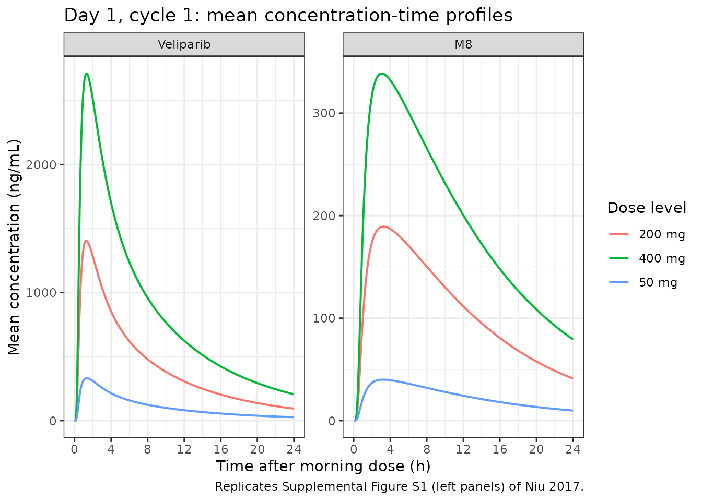
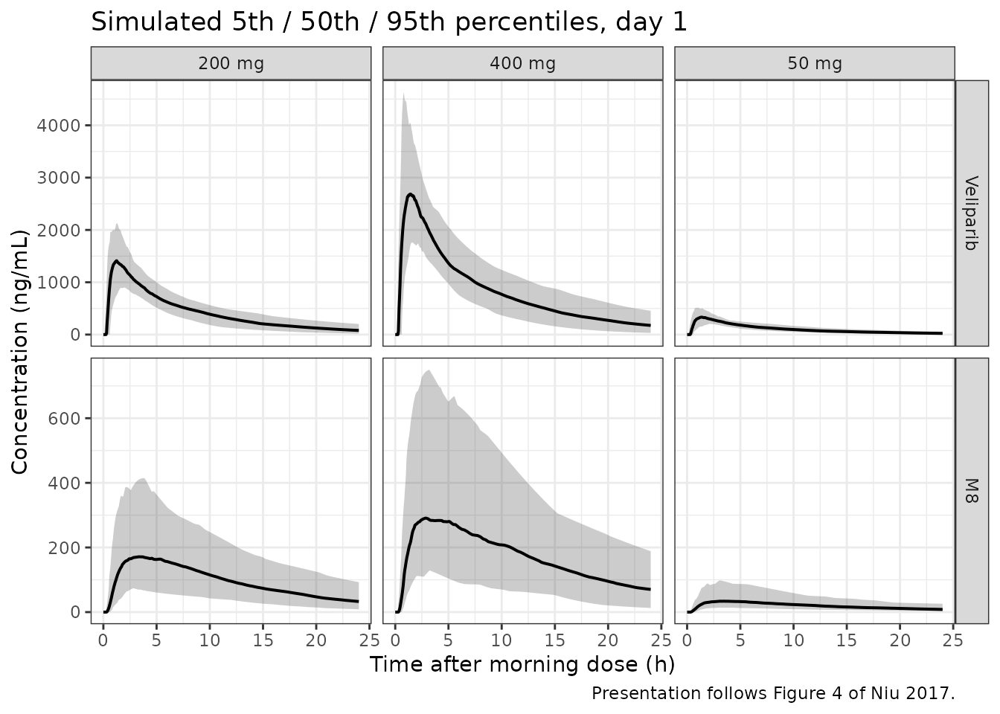

# Veliparib and its M8 metabolite (Niu 2017)

## Model and source

    #> ℹ parameter labels from comments will be replaced by 'label()'

- Citation: Niu J., Scheuerell C., Mehrotra S., Karan S., Puhalla S.,
  Kiesel B. F., Ji J., Chu E., Gopalakrishnan M., Ivaturi V., Gobburu
  J., Beumer J. H. (2017). Parent-metabolite pharmacokinetic modeling
  and pharmacodynamics of veliparib (ABT-888), a PARP inhibitor, in
  patients with BRCA 1/2-mutated cancer or PARP-sensitive tumor types.
  The Journal of Clinical Pharmacology 57(8):977-987.
  <doi:10.1002/jcph.892>.

- Description: Joint parent plus metabolite population PK model for the
  oral PARP inhibitor veliparib (ABT-888) and its primary active
  metabolite M8, in patients with BRCA 1/2-mutated cancer or
  PARP-sensitive tumor types. Veliparib disposition is two-compartment
  with first-order absorption and an absorption lag time; total apparent
  clearance CL/F is split into a renal arm CLR/F = CL/F \* frenal, which
  is a power function of Cockcroft-Gault creatinine clearance, and a
  non-renal arm CLNR/F = CL/F \* fm, which is the formation clearance
  that is assumed to produce all of the M8. M8 is described by a
  two-compartment model with first-order formation. Lean body mass
  enters as a power function on the veliparib central volume of
  distribution. The renal and metabolised fractions were not
  identifiable from these data and were held at frenal = 0.7 and fm =
  1 - frenal = 0.3 from a published mass-balance study.

- Article: <https://doi.org/10.1002/jcph.892>

Niu 2017 fitted veliparib (ABT-888) and its primary active metabolite M8
**simultaneously** in a single joint model, so this paper contributes
one model file (`Niu_2017_veliparib`) rather than a separate parent and
metabolite model.

The structure, reproduced from Niu 2017 Figure 1, is:

                     Parent Periph.          M8 Periph.
                         Vp/F                  Vp_met
                           ^                      ^
                      Q/F  |                 Qmet |
                           v                      v
      Dose --Ka,tlag--> Parent Central --------> M8 Central
                         Vc/F        CLNR/F        Vc_met
                           |        = CL/F*fm        |
                    CLR/F  |                         | CLmet
                 = CL/F *  v                         v
                 frenal *
                 (CLCR/95)^p

The single estimated total apparent clearance `CL/F` is split into a
renal arm (`CLR/F`, the only arm carrying the creatinine-clearance
covariate) and a non-renal arm (`CLNR/F`), which is the formation
clearance feeding M8. The two arms carry **separate** between-subject
random effects, which is what Table 2’s distinct `omega CLR/F` and
`omega CLNR/F` rows report.

## Population

The model was developed from a phase 1 multicentre, randomised,
open-label dose-escalation study of chronically dosed single-agent
veliparib in patients with *BRCA 1/2*-mutated cancer or PARP-sensitive
tumour types (ClinicalTrials.gov NCT00892736). Seventy-one patients were
enrolled; **67 contributed veliparib pharmacokinetic samples and form
the modelled population**, of whom 38 also contributed M8 samples. A
further 41 patients contributed 295 PAR measurements in peripheral blood
mononuclear cells for the exploratory pharmacodynamic analysis. In total
1214 veliparib and 656 M8 plasma concentrations were fitted.

The cohort was almost entirely female (69/71, 97%), consistent with a
*BRCA*-enriched breast and ovarian cancer population, with mean age 53.5
years (range 28.0-84.0), mean total body weight 74.9 kg (45.0-119), mean
lean body mass 47.6 kg (36.6-63.7) and mean Cockcroft-Gault creatinine
clearance 95.2 mL/min (48.5-120). ECOG performance status was 0 in 61%,
1 in 31% and 2 in 8%. Patients were treated at one of nine AM/PM dose
levels from 50/50 to 500/500 mg twice daily; only the morning dose was
given on day 1, with twice-daily dosing from day 2 (Niu 2017 Table 1 and
Methods “Subjects, Study Design, and Treatment”).

Two data-handling rules from Table 1’s footnote are part of the fitted
model and are reproduced in the virtual cohort below: Cockcroft-Gault
CLCR estimates above 120 mL/min were **assigned 120 mL/min** (this
affected 20 of the 71 patients), and the covariate centring constants
are the cohort central values, 95 mL/min for CLCR and 48 kg for LBM.

The same information is available programmatically via
`readModelDb("Niu_2017_veliparib")()$population`.

## Source trace

The per-parameter origin is recorded as an in-file comment next to each
`ini()` entry in `inst/modeldb/specificDrugs/Niu_2017_veliparib.R`. The
table below collects them in one place for review.

| Equation / parameter | Value | Source location |
|----|----|----|
| Model structure (2-cmt parent + 2-cmt metabolite, first-order absorption with lag) | n/a | Figure 1; Results paragraphs 2-3 |
| `lka` (Ka) | 2.02 1/h | Table 2 |
| `ltlag` (tlag) | 0.272 h | Table 2 |
| `lvc` (Vc/F) | 99.2 L | Table 2 |
| `lvp` (Vp/F) | 47.8 L | Table 2 |
| `lq` (Q/F) | 17.9 L/h | Table 2 |
| `lcl` (CL/F) | 17.3 L/h | Table 2 |
| `fm` | 0.3 (held) | Table 2 “fm 0.3 (fix)”; Figure 1 legend `fm = 1 - frenal` |
| `frenal` (derived as `1 - fm`) | 0.7 (held) | Table 2 “frenal 0.7 (fix)”; Methods “Base Model” |
| `lvc_m8` (Vc_met) | 23.6 L | Table 2 |
| `lvp_m8` (Vp_met) | 51.4 L | Table 2 |
| `lq_m8` (Qmet) | 29.0 L/h | Table 2 |
| `lcl_m8` (CLmet) | 22.8 L/h | Table 2 |
| `e_lbm_vc` (power_LBM) | 1.21 | Table 2; Equation 7 |
| `e_crcl_cl_renal` (power_CLcr) | 0.903 | Table 2; Equation 5 |
| `CLR/F = CL/F * frenal * (CLCR/95)^p` | n/a | Equation 5 |
| `CLNR/F = CL/F * fm` | n/a | Equation 6 |
| `Vc/F = Vc/F * (LBM/48)^p` | n/a | Equation 7 |
| IIV, exponential `theta * exp(eta)` | n/a | Equation 1 |
| Covariate form, median-centred power | n/a | Equation 3 |
| `etalka` .. `etalcl_m8` (9 variances) | Table 2 CV% squared | Table 2 “Between-subject variability” |
| No IIV on Q, Qmet | n/a | Results; Supplemental Table S1 runs 112, 113 |
| No IIV correlation block | n/a | Results (dropped: condition number 1e8) |
| `propSd` (veliparib) | 0.251 | Table 2 “CMultStdev 25.1%” |
| `addSd` (veliparib) | 0.607 ng/mL | Table 2 |
| `propSd_m8` | 0.251 \* 0.808 \* 1.00 = 0.202808 | Table 2 notes (CMultStdev \* Ratio \* MultStdev) |
| `addSd_m8` | 3.37 ng/mL | Table 2 |
| Population metadata | n/a | Table 1; Results paragraph 1 |
| Unit convention (ng/mL, no MW correction) | n/a | Methods “Software and Estimation Methods” |

## Structural verification

Before any stochastic simulation, the packaged model is checked against
closed forms that follow from the published equations. These use
`zeroRe()` so both sides of every comparison use the *same* parameter
values – the residual difference is pure ODE-solver error, so tight
bounds are appropriate here (and are deliberately not used for the Monte
Carlo checks further down).

``` r

mod  <- readModelDb("Niu_2017_veliparib")
modz <- rxode2::zeroRe(rxode2::rxode(mod))
#> ℹ parameter labels from comments will be replaced by 'label()'

# Event table helper. Observation rows carry the ODE-state name in `cmt` plus
# `dvid = 1L`; the model has two endpoints (Cc, Cc_m8) so rxode2 needs the
# endpoint disambiguated. Both observables are returned as columns regardless.
mk_events <- function(dose, times, LBM = 48, CRCL = 95, id = 1L,
                      dose_times = 0) {
  dplyr::bind_rows(
    data.frame(id = id, time = dose_times, amt = dose, evid = 1L,
               cmt = "depot", dvid = NA_integer_),
    data.frame(id = id, time = times, amt = NA_real_, evid = 0L,
               cmt = "central", dvid = 1L)
  ) |>
    dplyr::mutate(LBM = LBM, CRCL = CRCL) |>
    dplyr::arrange(id, time, dplyr::desc(evid))
}

solve_typ <- function(ev) {
  rxode2::rxSolve(modz, ev, returnType = "data.frame",
                  useLinCmt = FALSE, atol = 1e-12, rtol = 1e-12)
}

trapz <- function(x, y) sum(diff(x) * (utils::head(y, -1) + utils::tail(y, -1)) / 2)

# A window of ~110 terminal half-lives is not useful (the tail decays into
# solver noise); the parent terminal half-life is about 6.6 h, so 720 h is used
# only for these closed-form AUC checks where high accuracy is wanted, and the
# NCA below uses a 120 h (about 18 half-life) window instead.
tgrid <- seq(0, 720, by = 0.05)
ref   <- solve_typ(mk_events(400, tgrid))
#> ℹ omega/sigma items treated as zero: 'etalka', 'etaltlag', 'etalvc', 'etalvp', 'etalcl_renal', 'etalcl_nonren', 'etalvc_m8', 'etalvp_m8', 'etalcl_m8'

structural <- tibble::tibble(
  Quantity = c(
    "Vc/F at LBM = 48 kg (L)",
    "CLR/F at CLCR = 95 mL/min (L/h)",
    "CLNR/F (L/h)",
    "Total CL/F (L/h)",
    "Veliparib AUC(0-inf) after 400 mg (ng*h/mL)",
    "M8 AUC(0-inf) after 400 mg (ng*h/mL)"
  ),
  Simulated = c(ref$vc[1], ref$cl_renal[1], ref$cl_nonren[1],
                ref$cl_renal[1] + ref$cl_nonren[1],
                trapz(ref$time, ref$Cc), trapz(ref$time, ref$Cc_m8)),
  `Closed form` = c(
    99.2,                        # Table 2 Vc/F, since (48/48)^1.21 = 1
    17.3 * 0.7,                  # Eq. 5 at the centring value
    17.3 * 0.3,                  # Eq. 6
    17.3,                        # Table 2 CL/F
    1000 * 400 / 17.3,           # Dose / CL, x1000 ng per ug
    1000 * 400 * 0.3 / 22.8      # Dose * fm / CLmet
  ),
  check.names = FALSE
) |>
  dplyr::mutate(`% diff` = 100 * (Simulated - `Closed form`) / `Closed form`)

knitr::kable(structural, digits = c(0, 4, 4, 5),
             caption = "Packaged model against closed forms derived from Niu 2017 Equations 5-7 and Table 2.")
```

| Quantity | Simulated | Closed form | check.names | % diff |
|:---|---:|---:|:---|---:|
| Vc/F at LBM = 48 kg (L) | 99.200 | 99.200 | FALSE | 0 |
| CLR/F at CLCR = 95 mL/min (L/h) | 12.110 | 12.110 | FALSE | 0 |
| CLNR/F (L/h) | 5.190 | 5.190 | FALSE | 0 |
| Total CL/F (L/h) | 17.300 | 17.300 | FALSE | 0 |
| Veliparib AUC(0-inf) after 400 mg (ng\*h/mL) | 23122.193 | 23121.387 | FALSE | 0 |
| M8 AUC(0-inf) after 400 mg (ng\*h/mL) | 5263.158 | 5263.158 | FALSE | 0 |

Packaged model against closed forms derived from Niu 2017 Equations 5-7
and Table 2. {.table}

``` r


stopifnot(all(abs(structural$`% diff`) < 0.01))
```

The two AUC identities are the load-bearing checks. `AUC = Dose / CL`
confirms the parent mass balance, and `AUC_M8 = Dose * fm / CLmet`
confirms that the formation flux out of the parent central compartment
arrives in the M8 central compartment intact – i.e. that the `CLNR/F`
arm is wired to the metabolite and not to an elimination sink.

Three further structural properties the paper asserts:

``` r

auc_ref <- trapz(ref$time, ref$Cc)

# (a) Dose proportionality from 50 to 500 mg (Niu 2017 Discussion: "Dose
#     proportionality in dose level from 50 to 500 mg was supported here").
dose_prop <- vapply(c(50, 100, 200, 300, 400, 500), function(d) {
  s <- solve_typ(mk_events(d, tgrid))
  trapz(s$time, s$Cc) / d
}, numeric(1))
#> ℹ omega/sigma items treated as zero: 'etalka', 'etaltlag', 'etalvc', 'etalvp', 'etalcl_renal', 'etalcl_nonren', 'etalvc_m8', 'etalvp_m8', 'etalcl_m8'
#> ℹ omega/sigma items treated as zero: 'etalka', 'etaltlag', 'etalvc', 'etalvp', 'etalcl_renal', 'etalcl_nonren', 'etalvc_m8', 'etalvp_m8', 'etalcl_m8'
#> ℹ omega/sigma items treated as zero: 'etalka', 'etaltlag', 'etalvc', 'etalvp', 'etalcl_renal', 'etalcl_nonren', 'etalvc_m8', 'etalvp_m8', 'etalcl_m8'
#> ℹ omega/sigma items treated as zero: 'etalka', 'etaltlag', 'etalvc', 'etalvp', 'etalcl_renal', 'etalcl_nonren', 'etalvc_m8', 'etalvp_m8', 'etalcl_m8'
#> ℹ omega/sigma items treated as zero: 'etalka', 'etaltlag', 'etalvc', 'etalvp', 'etalcl_renal', 'etalcl_nonren', 'etalvc_m8', 'etalvp_m8', 'etalcl_m8'
#> ℹ omega/sigma items treated as zero: 'etalka', 'etaltlag', 'etalvc', 'etalvp', 'etalcl_renal', 'etalcl_nonren', 'etalvc_m8', 'etalvp_m8', 'etalcl_m8'

# (b) LBM acts on Vc/F only, so it must move Cmax but NOT AUC.
lbm_hi  <- solve_typ(mk_events(400, tgrid, LBM = 60))
#> ℹ omega/sigma items treated as zero: 'etalka', 'etaltlag', 'etalvc', 'etalvp', 'etalcl_renal', 'etalcl_nonren', 'etalvc_m8', 'etalvp_m8', 'etalcl_m8'
lbm_vc  <- lbm_hi$vc[1]

# (c) M8-to-parent exposure ratio = fm * CL/F / CLmet.
ratio_sim <- trapz(ref$time, ref$Cc_m8) / auc_ref

tibble::tibble(
  Property = c("AUC/dose constant over 50-500 mg (max spread, %)",
               "Vc/F at LBM = 60 kg vs 99.2*(60/48)^1.21 (% diff)",
               "AUC change when LBM 48 -> 60 kg (%)",
               "M8:parent AUC ratio vs fm*CL/CLmet (% diff)"),
  Value = c(
    100 * (max(dose_prop) - min(dose_prop)) / mean(dose_prop),
    100 * (lbm_vc - 99.2 * (60 / 48)^1.21) / (99.2 * (60 / 48)^1.21),
    100 * (trapz(lbm_hi$time, lbm_hi$Cc) - auc_ref) / auc_ref,
    100 * (ratio_sim - 0.3 * 17.3 / 22.8) / (0.3 * 17.3 / 22.8)
  )
) |>
  knitr::kable(digits = 5, caption = "Further structural properties.")
```

| Property                                           |    Value |
|:---------------------------------------------------|---------:|
| AUC/dose constant over 50-500 mg (max spread, %)   |  0.00000 |
| Vc/F at LBM = 60 kg vs 99.2\*(60/48)^1.21 (% diff) |  0.00000 |
| AUC change when LBM 48 -\> 60 kg (%)               | -0.00082 |
| M8:parent AUC ratio vs fm\*CL/CLmet (% diff)       | -0.00347 |

Further structural properties. {.table}

``` r


stopifnot(
  100 * (max(dose_prop) - min(dose_prop)) / mean(dose_prop) < 0.01,
  abs(lbm_vc - 99.2 * (60 / 48)^1.21) < 1e-8,
  abs(trapz(lbm_hi$time, lbm_hi$Cc) - auc_ref) / auc_ref < 1e-4,
  abs(ratio_sim - 0.3 * 17.3 / 22.8) < 1e-4
)
```

### Renal-function covariate: a discrepancy inside the paper

Niu 2017 Discussion states: *“According to our covariate model, patients
with mild (~25% decrease in CLCR) and moderate (~50% decrease in CLCR)
renal function are associated with ~10% and ~20% increase in veliparib
exposure, respectively.”* That sentence is **not reproducible from the
paper’s own Equation 5**, and the table below shows why. Because
Equation 5, Figure 1 and Table 2 all agree with each other and only the
Discussion prose disagrees, the equation is what the model file encodes.

``` r

renal <- lapply(c(1.00, 0.75, 0.50), function(f) {
  crcl <- 95 * f
  s <- solve_typ(mk_events(400, tgrid, CRCL = crcl))
  tibble::tibble(
    `CLCR (mL/min)` = crcl,
    `Change in CLCR (%)` = 100 * (f - 1),
    `CL/F (L/h)` = s$cl_renal[1] + s$cl_nonren[1],
    `CL/F closed form` = 17.3 * 0.7 * (crcl / 95)^0.903 + 17.3 * 0.3,
    `Exposure increase (%)` = 100 * (trapz(s$time, s$Cc) / auc_ref - 1)
  )
}) |> dplyr::bind_rows()
#> ℹ omega/sigma items treated as zero: 'etalka', 'etaltlag', 'etalvc', 'etalvp', 'etalcl_renal', 'etalcl_nonren', 'etalvc_m8', 'etalvp_m8', 'etalcl_m8'
#> ℹ omega/sigma items treated as zero: 'etalka', 'etaltlag', 'etalvc', 'etalvp', 'etalcl_renal', 'etalcl_nonren', 'etalvc_m8', 'etalvp_m8', 'etalcl_m8'
#> ℹ omega/sigma items treated as zero: 'etalka', 'etaltlag', 'etalvc', 'etalvp', 'etalcl_renal', 'etalcl_nonren', 'etalvc_m8', 'etalvp_m8', 'etalcl_m8'

renal$`Paper Discussion claims (%)` <- c(0, 10, 20)

knitr::kable(renal, digits = 3,
             caption = "Equation 5 reproduced exactly, against the exposure claim in the paper's Discussion.")
```

| CLCR (mL/min) | Change in CLCR (%) | CL/F (L/h) | CL/F closed form | Exposure increase (%) | Paper Discussion claims (%) |
|---:|---:|---:|---:|---:|---:|
| 95.00 | 0 | 17.300 | 17.300 | 0.000 | 0 |
| 71.25 | -25 | 14.530 | 14.530 | 19.067 | 10 |
| 47.50 | -50 | 11.666 | 11.666 | 48.291 | 20 |

Equation 5 reproduced exactly, against the exposure claim in the paper’s
Discussion. {.table style="width:100%;"}

``` r


# The equation is reproduced exactly; that is what is asserted.
stopifnot(all(abs(renal$`CL/F (L/h)` - renal$`CL/F closed form`) < 1e-8))
```

The implemented model gives a **+19.1%** and **+48.3%** exposure
increase for a 25% and 50% fall in CLCR, against the Discussion’s “~10%”
and “~20%”. Note the arithmetic is straightforward and does not depend
on this implementation: at CLCR = 71.25 mL/min, Equation 5 gives
`CLR/F = 17.3 * 0.7 * 0.75^0.903 = 9.34 L/h`, so
`CL/F = 9.34 + 5.19 = 14.53 L/h` and the exposure ratio is
`17.3 / 14.53 = 1.19`. Because the non-renal arm is only 30% of total
clearance, a renal-arm exponent near 1 necessarily produces an exposure
change substantially larger than the Discussion’s figures. See
“Assumptions and deviations” below.

## Virtual cohort

Original observed data are not publicly available. The cohort below
approximates the Table 1 demographics: lean body mass and
Cockcroft-Gault creatinine clearance are drawn to match the reported
means and ranges, and CLCR is capped at 120 mL/min exactly as the paper
did before estimation.

Three of the nine studied dose levels are simulated, spanning the range:
50/50, 200/200 and 400/400 mg. 100 subjects per arm is well inside the
200/arm cap.

``` r

set.seed(20170808)
n_per_arm <- 100L
dose_levels <- c(50, 200, 400)

# Sampling grid, out to 120 h (about 18 parent terminal half-lives -- long
# enough for AUC(0-inf) extrapolation, short enough that the tail has not
# decayed into solver noise). The absorption phase is sampled at 0.05 h
# because IIV on Ka is large (omega = 0.781): the fastest-absorbing subjects
# peak well before the population tmax of about 1.4 h, and a 0.25 h grid
# under-resolves their peak badly enough to cost 0.9% on the AUC = Dose/CL
# identity asserted below. At 0.05 h that error drops to below 0.05%.
obs_times <- sort(unique(c(
  seq(0, 6, by = 0.05), seq(6, 24, by = 0.25), seq(25, 120, by = 1)
)))

make_cohort <- function(n, dose, id_offset = 0L) {
  subj <- tibble::tibble(
    id = id_offset + seq_len(n),
    # Table 1 (Total): LBM mean 47.6 kg, range 36.6-63.7.
    LBM = pmin(pmax(stats::rnorm(n, mean = 47.6, sd = 5.2), 36.6), 63.7),
    # Table 1 (Total): CLCR mean 95.2 mL/min, range 48.5-120, capped at 120.
    CRCL = pmin(pmax(stats::rnorm(n, mean = 95.2, sd = 17.5), 48.5), 120),
    treatment = paste0(dose, " mg")
  )
  dplyr::bind_rows(
    subj |> dplyr::mutate(time = 0, amt = dose, evid = 1L,
                          cmt = "depot", dvid = NA_integer_),
    tidyr::crossing(subj, time = obs_times) |>
      dplyr::mutate(amt = NA_real_, evid = 0L, cmt = "central", dvid = 1L)
  ) |>
    dplyr::arrange(id, time, dplyr::desc(evid))
}

events <- dplyr::bind_rows(
  lapply(seq_along(dose_levels), function(i) {
    make_cohort(n_per_arm, dose_levels[i], id_offset = (i - 1L) * n_per_arm)
  })
)

stopifnot(!anyDuplicated(unique(events[, c("id", "time", "evid")])))
```

## Simulation

``` r

sim <- rxode2::rxSolve(
  mod, events = events,
  keep = c("treatment"),
  useLinCmt = FALSE
) |>
  as.data.frame()
#> ℹ parameter labels from comments will be replaced by 'label()'

# No solver artefacts in the tail before NCA sees them.
stopifnot(all(sim$Cc >= 0, na.rm = TRUE), all(sim$Cc_m8 >= 0, na.rm = TRUE))
```

### Single-dose concentration-time profiles

Replicates the shape of Supplemental Figure S1 (left panels, day 1 of
cycle 1), which plots mean veliparib and M8 plasma concentration versus
time after the morning dose by dose level. Only the morning dose was
given on day 1, so the day-1 data are a single-dose profile.

``` r

sim |>
  dplyr::filter(time <= 24) |>
  dplyr::select(id, time, treatment, Veliparib = Cc, M8 = Cc_m8) |>
  tidyr::pivot_longer(c(Veliparib, M8), names_to = "Analyte",
                      values_to = "conc") |>
  dplyr::mutate(Analyte = factor(Analyte, levels = c("Veliparib", "M8"))) |>
  dplyr::group_by(time, treatment, Analyte) |>
  dplyr::summarise(mean_conc = mean(conc), .groups = "drop") |>
  ggplot(aes(time, mean_conc, colour = treatment)) +
  geom_line(linewidth = 0.7) +
  facet_wrap(~Analyte, scales = "free_y") +
  scale_x_continuous(breaks = seq(0, 24, by = 4)) +
  labs(x = "Time after morning dose (h)", y = "Mean concentration (ng/mL)",
       colour = "Dose level",
       title = "Day 1, cycle 1: mean concentration-time profiles",
       caption = "Replicates Supplemental Figure S1 (left panels) of Niu 2017.") +
  theme_bw()
```



### Prediction interval

Replicates the presentation of Figure 4 (visual predictive check),
showing the 5th, 50th and 95th percentiles of the simulated profiles.
Niu 2017 has no digitised observed data available here, so this shows
the model’s own predictive distribution rather than an overlay.

``` r

sim |>
  dplyr::filter(time <= 24) |>
  dplyr::select(id, time, treatment, Veliparib = Cc, M8 = Cc_m8) |>
  tidyr::pivot_longer(c(Veliparib, M8), names_to = "Analyte",
                      values_to = "conc") |>
  dplyr::mutate(Analyte = factor(Analyte, levels = c("Veliparib", "M8"))) |>
  dplyr::group_by(time, treatment, Analyte) |>
  dplyr::summarise(
    Q05 = stats::quantile(conc, 0.05),
    Q50 = stats::quantile(conc, 0.50),
    Q95 = stats::quantile(conc, 0.95),
    .groups = "drop"
  ) |>
  ggplot(aes(time, Q50)) +
  geom_ribbon(aes(ymin = Q05, ymax = Q95), alpha = 0.25) +
  geom_line(linewidth = 0.7) +
  facet_grid(Analyte ~ treatment, scales = "free_y") +
  labs(x = "Time after morning dose (h)", y = "Concentration (ng/mL)",
       title = "Simulated 5th / 50th / 95th percentiles, day 1",
       caption = "Presentation follows Figure 4 of Niu 2017.") +
  theme_bw()
```



## PKNCA validation

One PKNCA block per output, as the model has two.

``` r

nca_input <- function(conc_col) {
  d <- sim |>
    dplyr::filter(!is.na(.data[[conc_col]])) |>
    dplyr::select(id, time, treatment, Cc = dplyr::all_of(conc_col))
  # Guarantee a time = 0 row per subject; pre-dose Cc = 0 is correct for an
  # extravascular dose. Existing time = 0 rows win.
  dplyr::bind_rows(
    d,
    d |> dplyr::distinct(id, treatment) |> dplyr::mutate(time = 0, Cc = 0)
  ) |>
    dplyr::distinct(id, treatment, time, .keep_all = TRUE) |>
    dplyr::arrange(id, treatment, time)
}

dose_df <- events |>
  dplyr::filter(evid == 1) |>
  dplyr::select(id, time, amt, treatment)

dose_obj <- PKNCA::PKNCAdose(dose_df, amt ~ time | treatment + id,
                             doseu = "mg")

intervals <- data.frame(
  start = 0, end = Inf,
  cmax = TRUE, tmax = TRUE, aucinf.obs = TRUE, half.life = TRUE,
  cl.obs = TRUE
)

run_nca <- function(conc_col) {
  conc_obj <- PKNCA::PKNCAconc(nca_input(conc_col), Cc ~ time | treatment + id,
                               concu = "ng/mL", timeu = "h")
  PKNCA::pk.nca(PKNCA::PKNCAdata(conc_obj, dose_obj, intervals = intervals))
}

nca_parent <- run_nca("Cc")
nca_m8     <- run_nca("Cc_m8")
```

### Per-subject identities

The strongest available check: for every simulated subject, the
NCA-derived exposure must reproduce that subject’s *own* drawn
clearances. Both sides use the same realised parameters, so these are
exact identities and are asserted tightly.

``` r

subj_par <- sim |>
  dplyr::group_by(id, treatment) |>
  dplyr::summarise(cl_renal = dplyr::first(cl_renal),
                   cl_nonren = dplyr::first(cl_nonren),
                   cl_m8 = dplyr::first(cl_m8),
                   .groups = "drop") |>
  dplyr::mutate(cl_total = cl_renal + cl_nonren) |>
  dplyr::left_join(dose_df |> dplyr::select(id, amt), by = "id")

auc_of <- function(res) {
  as.data.frame(res$result) |>
    dplyr::filter(PPTESTCD == "aucinf.obs") |>
    dplyr::select(id, auc = PPORRES)
}

ident <- subj_par |>
  dplyr::left_join(auc_of(nca_parent) |> dplyr::rename(auc_p = auc), by = "id") |>
  dplyr::left_join(auc_of(nca_m8)     |> dplyr::rename(auc_m = auc), by = "id") |>
  dplyr::mutate(
    # AUC(0-inf) = 1000 * Dose / CL_total
    pred_p = 1000 * amt / cl_total,
    # AUC_M8(0-inf) = 1000 * Dose * CLNR / (CL_total * CLmet)
    pred_m = 1000 * amt * cl_nonren / (cl_total * cl_m8),
    err_p = 100 * (auc_p - pred_p) / pred_p,
    err_m = 100 * (auc_m - pred_m) / pred_m
  )

stopifnot(nrow(ident) == n_per_arm * length(dose_levels), !anyNA(ident$err_p),
          !anyNA(ident$err_m))

tibble::tibble(
  Identity = c("Veliparib AUC(0-inf) = 1000 * Dose / CL/F",
               "M8 AUC(0-inf) = 1000 * Dose * CLNR/F / (CL/F * CLmet)"),
  `n subjects` = nrow(ident),
  `max |% error|` = c(max(abs(ident$err_p)), max(abs(ident$err_m)))
) |>
  knitr::kable(digits = 4,
               caption = "Per-subject exact identities across the whole cohort.")
```

| Identity | n subjects | max \|% error\| |
|:---|---:|---:|
| Veliparib AUC(0-inf) = 1000 \* Dose / CL/F | 300 | 0.0434 |
| M8 AUC(0-inf) = 1000 \* Dose \* CLNR/F / (CL/F \* CLmet) | 300 | 0.0166 |

Per-subject exact identities across the whole cohort. {.table}

``` r


# Bound set just above the accuracy actually achieved on this sampling grid
# (parent 0.043%, M8 0.017%), so it catches a regression rather than merely
# passing. The residual is trapezoidal error in the absorption phase, not
# model error: both sides use the same realised parameters.
stopifnot(max(abs(ident$err_p)) < 0.1, max(abs(ident$err_m)) < 0.1)
```

### Comparison against published values

Niu 2017 reports no NCA table of its own, but it reports the final
model’s typical `CL/F` (Table 2) and, in the Discussion, an external NCA
comparator for `CL/F` from an earlier veliparib study (reference 23; 18
L/h). The comparison below is run on a **typical-value** subject at the
reference covariates (`zeroRe()`, LBM 48 kg, CLCR 95 mL/min), so the
simulated side is the model’s own typical prediction and the comparison
is exact rather than Monte Carlo.

``` r

# Each dose level is a separate single-subject solve. A typical-value cohort has
# exactly one subject per scenario -- bundling the three dose levels into one
# multi-subject solve would add nothing and makes rxode2 warn that a
# multi-subject simulation carries no omega (which is the whole point of
# zeroRe()).
typ_events <- lapply(seq_along(dose_levels), function(i) {
  mk_events(dose_levels[i], obs_times, id = i) |>
    dplyr::mutate(treatment = paste0(dose_levels[i], " mg"))
})

sim_typ <- lapply(typ_events, function(ev) {
  rxode2::rxSolve(modz, ev, keep = c("treatment"), useLinCmt = FALSE) |>
    as.data.frame() |>
    dplyr::mutate(id = ev$id[1])
}) |>
  dplyr::bind_rows()
#> ℹ omega/sigma items treated as zero: 'etalka', 'etaltlag', 'etalvc', 'etalvp', 'etalcl_renal', 'etalcl_nonren', 'etalvc_m8', 'etalvp_m8', 'etalcl_m8'
#> ℹ omega/sigma items treated as zero: 'etalka', 'etaltlag', 'etalvc', 'etalvp', 'etalcl_renal', 'etalcl_nonren', 'etalvc_m8', 'etalvp_m8', 'etalcl_m8'
#> ℹ omega/sigma items treated as zero: 'etalka', 'etaltlag', 'etalvc', 'etalvp', 'etalcl_renal', 'etalcl_nonren', 'etalvc_m8', 'etalvp_m8', 'etalcl_m8'

typ_events <- dplyr::bind_rows(typ_events)

typ_conc <- sim_typ |>
  dplyr::filter(!is.na(Cc)) |>
  dplyr::select(id, time, treatment, Cc)
typ_conc <- dplyr::bind_rows(
  typ_conc,
  typ_conc |> dplyr::distinct(id, treatment) |> dplyr::mutate(time = 0, Cc = 0)
) |>
  dplyr::distinct(id, treatment, time, .keep_all = TRUE) |>
  dplyr::arrange(id, treatment, time)

typ_dose <- typ_events |>
  dplyr::filter(evid == 1) |>
  dplyr::select(id, time, amt, treatment)

nca_typ <- PKNCA::pk.nca(PKNCA::PKNCAdata(
  PKNCA::PKNCAconc(typ_conc, Cc ~ time | treatment + id,
                   concu = "ng/mL", timeu = "h"),
  PKNCA::PKNCAdose(typ_dose, amt ~ time | treatment + id, doseu = "mg"),
  intervals = intervals
))

# PKNCA computes cl.obs as dose / AUC in the units it was given, i.e.
# mg / (ng*h/mL). Since 1 mg = 1e6 ng and 1 mL = 1e-3 L, that unit is
# 1000 L/h, so rescale to L/h before comparing against the paper's L/h value.
# (Left unconverted this reads as 0.0173 against 17.3 -- a spurious -99.9%.)
typ_result <- as.data.frame(nca_typ$result) |>
  dplyr::mutate(PPORRES = ifelse(PPTESTCD == "cl.obs", PPORRES * 1000, PPORRES))

published <- tibble::tribble(
  ~treatment,  ~cl.obs, ~aucinf.obs,
  "50 mg",     17.3,    1000 *  50 / 17.3,
  "200 mg",    17.3,    1000 * 200 / 17.3,
  "400 mg",    17.3,    1000 * 400 / 17.3
)

cmp <- nlmixr2lib::ncaComparisonTable(
  simulated = typ_result,
  reference = published,
  by        = "treatment",
  units     = c(cl.obs = "L/h", aucinf.obs = "ng*h/mL"),
  tolerance_pct = 20
)

knitr::kable(
  cmp,
  caption = paste("Typical-value NCA against the Niu 2017 Table 2 CL/F of",
                  "17.3 L/h and the AUC it implies. * differs by >20%."),
  align = c("l", "l", "r", "r", "r")
)
```

| NCA parameter           | treatment | Reference | Simulated | % diff |
|:------------------------|:----------|----------:|----------:|-------:|
| AUC0-∞ (obs) (ng\*h/mL) | 50 mg     |      2890 |      2890 |  +0.0% |
| AUC0-∞ (obs) (ng\*h/mL) | 200 mg    |     11600 |     11600 |  +0.0% |
| AUC0-∞ (obs) (ng\*h/mL) | 400 mg    |     23100 |     23100 |  +0.0% |
| CL/F (L/h)              | 50 mg     |      17.3 |      17.3 |  -0.0% |
| CL/F (L/h)              | 200 mg    |      17.3 |      17.3 |  -0.0% |
| CL/F (L/h)              | 400 mg    |      17.3 |      17.3 |  -0.0% |

Typical-value NCA against the Niu 2017 Table 2 CL/F of 17.3 L/h and the
AUC it implies. \* differs by \>20%. {.table}

The `CL/F` row is the substantive check: its reference is Niu 2017 Table
2’s published estimate, and recovering it end-to-end confirms the whole
parameters-to-ODE-to-NCA chain including the ng/mL unit conversion. The
AUC row re-expresses that same identity in exposure units – its
reference is *derived* from the published `CL/F`, so it is not an
independent number.

Niu 2017’s Discussion does supply one genuinely external comparator: an
NCA `CL/F` of 18 L/h and `Vd/F` of 145 L from an earlier veliparib study
(reference 23).

``` r

cl_sim <- typ_result |>
  dplyr::filter(PPTESTCD == "cl.obs") |>
  dplyr::pull(PPORRES) |>
  mean()
vd_model <- 99.2 + 47.8  # Table 2 Vc/F + Vp/F

tibble::tibble(
  Quantity = c("CL/F (L/h)", "Vd/F = Vc/F + Vp/F (L)"),
  `This model` = c(cl_sim, vd_model),
  `Niu 2017 Discussion` = c(17.3, 147),
  `External NCA (ref. 23)` = c(18, 145)
) |>
  dplyr::mutate(`% diff vs external NCA` =
                  100 * (`This model` - `External NCA (ref. 23)`) /
                  `External NCA (ref. 23)`) |>
  knitr::kable(digits = 2,
               caption = "Model against the external NCA comparator quoted by Niu 2017.")
```

| Quantity | This model | Niu 2017 Discussion | External NCA (ref. 23) | % diff vs external NCA |
|:---|---:|---:|---:|---:|
| CL/F (L/h) | 17.3 | 17.3 | 18 | -3.89 |
| Vd/F = Vc/F + Vp/F (L) | 147.0 | 147.0 | 145 | 1.38 |

Model against the external NCA comparator quoted by Niu 2017. {.table}

``` r


# Vd/F is quoted from the model parameters rather than from NCA on purpose:
# after an oral dose Vz and Vss are not cleanly separable by NCA, so an
# NCA-derived volume would not be comparable to the paper's Vc/F + Vp/F sum.
stopifnot(abs(cl_sim - 17.3) / 17.3 < 0.01,
          abs(vd_model - 147) < 0.05)
```

``` r

as.data.frame(nca_parent$result) |>
  dplyr::filter(PPTESTCD %in% c("cmax", "tmax", "aucinf.obs", "half.life")) |>
  dplyr::group_by(treatment, PPTESTCD) |>
  dplyr::summarise(Median = stats::median(PPORRES),
                   `5th` = stats::quantile(PPORRES, 0.05),
                   `95th` = stats::quantile(PPORRES, 0.95),
                   .groups = "drop") |>
  dplyr::mutate(Parameter = nlmixr2lib::ncaParamLabel(PPTESTCD)) |>
  dplyr::select(Parameter, treatment, Median, `5th`, `95th`) |>
  dplyr::rename("Dose level" = treatment) |>
  knitr::kable(digits = 2,
               caption = "Simulated veliparib NCA across the virtual cohort (n = 100 per arm).")
```

| Parameter    | Dose level |   Median |      5th |     95th |
|:-------------|:-----------|---------:|---------:|---------:|
| AUC0-∞ (obs) | 200 mg     | 11034.84 |  7156.10 | 16455.07 |
| Cmax         | 200 mg     |  1432.93 |   972.73 |  2179.46 |
| t½           | 200 mg     |     6.15 |     3.85 |    11.00 |
| Tmax         | 200 mg     |     1.35 |     0.70 |     2.60 |
| AUC0-∞ (obs) | 400 mg     | 23149.43 | 13815.85 | 34989.23 |
| Cmax         | 400 mg     |  2738.73 |  1874.94 |  4712.26 |
| t½           | 400 mg     |     6.76 |     3.70 |    11.68 |
| Tmax         | 400 mg     |     1.35 |     0.70 |     2.61 |
| AUC0-∞ (obs) | 50 mg      |  2847.15 |  1659.06 |  4557.10 |
| Cmax         | 50 mg      |   349.49 |   220.42 |   528.07 |
| t½           | 50 mg      |     6.84 |     4.20 |    12.34 |
| Tmax         | 50 mg      |     1.40 |     0.70 |     3.06 |

Simulated veliparib NCA across the virtual cohort (n = 100 per arm).
{.table}

### Exposure range against Figure 6

Figure 6 plots PARP inhibition against **model-predicted individual
veliparib and M8 plasma concentrations at the PBMC sampling times**
(pre-dose, 2, 4, 8 and 24 h after the morning dose). Its x-axis is
therefore an independent read-out of the concentration range this very
model predicts, and is usable as a check even though no PD model is
packaged. The highest binned mean in Figure 6 sits near 2100 ng/mL for
veliparib and near 420 ng/mL for M8.

``` r

# Post-dose PBMC sampling times only: the day-1 pre-dose sample is identically
# zero here (first dose of the study) and is not informative for a
# concentration-range comparison. This is NOT a PKNCA input.
pbmc_times <- c(2, 4, 8, 24)

pbmc <- sim |>
  dplyr::filter(time %in% pbmc_times)

rng <- tibble::tibble(
  Analyte = c("Veliparib", "M8"),
  `Median (ng/mL)` = c(stats::median(pbmc$Cc), stats::median(pbmc$Cc_m8)),
  `95th pctile (ng/mL)` = c(stats::quantile(pbmc$Cc, 0.95),
                            stats::quantile(pbmc$Cc_m8, 0.95)),
  `Max (ng/mL)` = c(max(pbmc$Cc), max(pbmc$Cc_m8)),
  `Highest Figure 6 bin mean` = c(2100, 420)
)

knitr::kable(rng, digits = 1,
             caption = paste("Simulated concentrations at the PBMC sampling times",
                             "against the concentration range spanned by Figure 6."))
```

| Analyte | Median (ng/mL) | 95th pctile (ng/mL) | Max (ng/mL) | Highest Figure 6 bin mean |
|:---|---:|---:|---:|---:|
| Veliparib | 381.0 | 2377.7 | 4103.7 | 2100 |
| M8 | 85.4 | 432.4 | 949.5 | 420 |

Simulated concentrations at the PBMC sampling times against the
concentration range spanned by Figure 6. {.table}

``` r


# The paper's highest binned mean must lie inside the range this model predicts
# over the same doses and sampling times; a mis-scaled model (a factor-of-1000
# unit error, say) would miss this by orders of magnitude.
stopifnot(
  max(pbmc$Cc)    > 2100, stats::median(pbmc$Cc)    < 2100,
  max(pbmc$Cc_m8) >  420, stats::median(pbmc$Cc_m8) <  420
)
```

Both binned means fall between the simulated median and maximum, as
expected for a bin mean drawn from pooled across-dose, across-time
individual predictions. This is a coarse but genuinely independent check
on the model’s concentration scale – in particular on the ng/mL unit
conversion in `model()`.

## Assumptions and deviations

- **Residual-error correlation between veliparib and M8 is not
  encoded.** Niu 2017 accounted for the expected correlation between the
  parent and metabolite residual errors (shared LC-MS internal standard,
  same matrix) “using a fixed-effect correlation term”. nlmixr2 has no
  idiomatic encoding for cross-endpoint residual correlation, so the two
  error models are independent here. The residual **magnitudes** are
  preserved exactly; only the coupling is lost. Same deviation and
  rationale as `Jonsson_2015_edoxaban` (edoxaban/M4) and
  `Svensson_2014_bedaquiline` (BDQ/M2).

- **M8 proportional residual error is a product, not a tabulated
  number.** Table 2 leaves the M8 proportional-error row blank and
  supplies the recipe in its notes: `CMultStdev * Ratio * MultStdev`
  with `MultStdev` held at 100%. This gives
  `0.251 * 0.808 * 1.00 = 0.202808`, which is what `propSd_m8` carries.

- **IIV scale.** Table 2’s between-subject rows are labelled “omega …
  (CV%)”. Niu 2017 Equation 1 defines `omega` as the square root of the
  variance of `eta`, so the tabulated percentage is read as `omega` on
  the approximate standard-deviation scale and each variance is
  `(CV%/100)^2` – not the exact log-normal `log(CV^2 + 1)`. Two things
  corroborate this: the row label names `omega` rather than “IIV”, and
  Table 2’s `%RSE` column (computed from the bootstrap) runs at roughly
  twice the RSE implied by its own bootstrap CI, which is the signature
  of a variance-scale RSE printed beside an SD-scale estimate. If the
  alternative reading were intended, every IIV here would be modestly
  overstated (e.g. `omega_Ka` 0.781 rather than 0.690).

- **The Discussion’s renal-impairment exposure figures are not
  reproducible from Equation 5.** As shown above, Equation 5 gives
  +19.1% and +48.3% exposure increases for 25% and 50% falls in CLCR,
  against the “~10%” and “~20%” in the Discussion. Equation 5, Equation
  6, Figure 1 and Table 2 are mutually consistent, and only the prose
  sentence disagrees, so the equation is encoded and the prose is
  flagged rather than fitted to. Users quoting Niu 2017’s
  renal-impairment statement should verify it independently.

- **Abstract and Table 2 disagree on the volume split.** The Abstract
  reports `Vc/F = 98.7 L` and `Vp/F = 48.3 L`; Table 2 reports 99.2 L
  and 47.8 L. Both pairs sum to the 147 L the Discussion quotes for
  `Vd/F`, so only the split differs. Table 2 is used because it is the
  final-parameter table, carries `%RSE` and bootstrap confidence
  intervals, and its bootstrap medians (99.1 and 47.5 L) corroborate it.

- **Veliparib additive residual error is poorly determined.** Table 2
  gives 0.607 ng/mL as the point estimate but a bootstrap median of
  0.183 with a 95% interval of 0 to 0.607. The point estimate is
  encoded, per the convention of using the reported final estimate;
  users doing residual-error-sensitive work should be aware the term is
  close to unidentified.

- **`frenal` is derived, not stored.** Table 2 lists
  `frenal = 0.7 (fix)` and `fm = 0.3 (fix)` as two entries, but Figure
  1’s legend defines `fm = 1 - frenal`. Only `fm` is carried in `ini()`,
  with `frenal <- 1 - fm` in `model()`, so the two cannot drift apart.
  Both were held at literature values because the fraction metabolised
  was not identifiable from these data (Methods, “Base Model”).

- **M8 disposition parameters are apparent in two senses.** They are
  apparent with respect to the parent’s unknown oral bioavailability
  `F`, and they assume *all* non-renally-cleared veliparib becomes M8.
  Niu 2017’s Discussion notes the true fraction reaching M8 is probably
  nearer 22% (30% non-renal times a 72% CYP2D6 share), which would
  rescale `Vc_met`, `Vp_met`, `Qmet` and `CLmet` by `0.3 / 0.22`.

- **No pharmacodynamic model is packaged.** The paper’s title names
  pharmacodynamics, but the PD analysis is explicitly exploratory: an
  Emax model was attempted and *not* presented as a result. Niu 2017
  reports only that “an extremely low IC50 (30 ng/mL) was estimated with
  low precision” because “the doses studied were higher such that PAR
  inhibition was approaching a plateau even with the lowest dose”,
  concluding “therefore, only exploratory exposure-PAR results are
  presented”. No `Imax`, no baseline and no residual error are reported
  anywhere in the paper or supplement, so the Emax model is not
  reconstructible without inventing parameters, and Figure 6 is a binned
  quintile plot rather than a fitted curve. Per the “exclude sensitivity
  analyses and results the authors did not report as final” policy, the
  PD layer is documented here rather than encoded. The reported IC50 of
  30 ng/mL is recorded for completeness; note it is far below the
  concentrations in Figure 6 (lowest bin mean near 100 ng/mL), so an
  Emax curve with that IC50 would be essentially flat across the
  observed range and would not reproduce the declining trend the figure
  shows – which is the authors’ own stated reason for not presenting it.

- **Virtual-cohort covariate distributions are assumed.** Niu 2017
  reports means and ranges but no distributional form or LBM/CLCR
  correlation. LBM and CLCR are drawn independently from normals matched
  to the reported means, truncated to the reported ranges, with CLCR
  additionally capped at 120 mL/min as the paper did. Body-composition
  formula for LBM is not restated by the paper (it cites Cheymol 2000),
  so a user recomputing LBM from height and weight must choose an
  equation and record which.

- **Race and ethnicity are not reported** in Niu 2017 Table 1 and are
  therefore absent from the model’s `population` metadata and from the
  virtual cohort.
