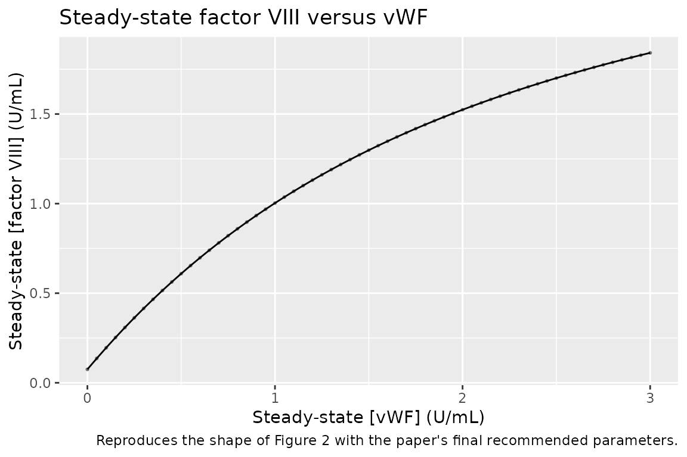

# Factor VIII (Noe 1996)

## Model and source

- Citation: Noe DA. A mathematical model of coagulation factor VIII
  kinetics. Haemostasis. 1996;26(6):289-303. <doi:10.1159/000217222>.
  PMID: 8979143.
- Description: Deterministic mechanistic model of coagulation factor
  VIII kinetics with von Willebrand factor (vWF) binding equilibrium in
  adult humans; captures endogenous synthesis, reversible binding to
  vWF, and differential elimination of the free and vWF-bound forms of
  factor VIII
- Article: [Haemostasis
  1996;26(6):289-303](https://doi.org/10.1159/000217222)

The paper is Dennis A. Noe’s deterministic mechanistic model of
coagulation factor VIII (fVIII) kinetics in adult humans. Two chemical
species circulate in plasma: factor VIII and von Willebrand factor
(vWF). Factor VIII exists in dynamic equilibrium between a highly labile
free form (fVIII) and a stabilised vWF-bound form (bVIII). Bound factor
VIII is co-eliminated with vWF; free factor VIII is eliminated much
faster on its own. The paper fits the model to mean literature data
across a broad panel of clinical settings (normal, acute-phase,
pregnancy, hemophilia, hemophilia carriers, type 1 and type 3 von
Willebrand disease, replacement therapy with cryoprecipitate,
recombinant factor VIII, and high-purity vWF concentrate) and reports a
single recommended parameter set that jointly reproduces all of them.

## Population

The model is fit to mean values pooled across many published human data
sets, without individual-subject-level fits, so there are no per-subject
demographics to reproduce. The paper’s Table 2 lists the clinical
categories that inform the fit: normal, acute-phase and pregnancy,
hemophilia (carriers and hemizygotes), and von Willebrand disease (types
1, 3, and 2N). The reference “normal” concentrations that anchor the
model are `[factor VIII] = 1 U/mL` and `[vWF] = 1 U/mL` at steady state,
in keeping with conventional practice (Simulations and Parameter
Estimation, p. 292).

Reflecting this pooled-literature study design,
`population$species = "human"` and there are no `n_subjects`,
`age_range`, `weight_range`, `sex_female_pct`, or `race_ethnicity`
values in the model metadata.

## Source trace

The per-parameter and per-equation origin is recorded as an in-file
comment next to each `ini()` entry. The table below collects the
assignments in one place.

| Symbol / equation | Value | Source location |
|----|----|----|
| `kfviii` (rate constant of elimination of free fVIII) | `1.12 /h` | Discussion p. 300 |
| `kbviii` (rate constant of elimination of vWF-bound fVIII; equal to `kvWF`) | `0.028 /h` | Discussion p. 300 |
| `kd` = `kequi` (dissociation constant of fVIII-vWF complex) | `0.2 U/mL` | Simulations p. 292 + Discussion p. 300 |
| `N` (proportionality: fVIII binding-site capacity per U of multimeric vWF) | `4.67 U fVIII / U vWF` | Discussion p. 300 |
| `Svm/kfviii` (plasma fVIII in the absence of vWF; type 3 vWD asymptote) | `0.075 U/mL` | Discussion p. 300 |
| `[factor VIII]_ss` and `[vWF]_ss` at normal reference | `1 U/mL` each | Simulations p. 292 |
| `[fVIII]_ss` / `[bVIII]_ss` at normal reference | `0.051 / 0.949 U/mL` | Discussion p. 300 |
| Rate of endogenous factor VIII synthesis (concentration form) | `Svm = Svm/kfviii * kfviii` | Model + Discussion p. 300 |
| Mass conservation: `VIII = fVIII + bVIII`, `Sites = fSites + bSites = N * vWF`, `bSites = bVIII` | equations 1-4, p. 291 | Model section |
| ODEs (before quasi-equilibrium reduction) | equations 5-8, p. 291 | Model section |
| Steady-state elimination assumption `kbVIII = kvWF` | Model section p. 291 | “As the elimination of bound vWF is accompanied by the concurrent elimination of bound factor VIII…” |
| Mass-action equilibrium `[fVIII][fSites] = kd [bVIII]` used to derive `[fVIII]`, `[bVIII]` at every t | Simulations p. 292 + Discussion p. 300 | via `kequi ~= kd` when `kvWF << koff, kon` |

### Units

Both factor VIII and vWF are reported in `U/mL`. The `U` unit is defined
so that 1 U/mL of factor VIII corresponds to the average concentration
of factor VIII in pooled normal human plasma; the vWF `U/mL` is
calibrated on the same scale via its factor-VIII binding capacity
(Simulations p. 292). Time is in hours. Rate constants (`kfviii`,
`kbviii`) are in `1/h`. The stoichiometry `N` is dimensionless when the
two `U/mL` scales are used, but the paper reports it as
`U factor VIII / U vWF` to make its role explicit.

The right-hand-sides of the two ODEs have units of `U/mL/h`:

- `svm - kfviii * fviii - kbviii * bviii` has units
  `(U/mL)/h - (1/h) * (U/mL) - (1/h) * (U/mL) = U/mL/h`
- `svwf - kbviii * vwf` has units `(U/mL)/h - (1/h) * (U/mL) = U/mL/h`

Consistent.

## The quasi-equilibrium reduction

The paper’s model system has four differential equations (equations 5-8,
p. 291) for `fVIII`, `bVIII`, `fSites`, and `bSites`, coupled by
mass-action binding with rate constants `kon` and `koff`. The paper
reports only their ratio `kd = koff / kon = 0.2 U/mL`; the individual
`kon` and `koff` are not given, because the paper adopts the
approximation `kequi ~= kd`, valid when `kvWF << koff, kon` (Simulations
p. 292). This is the quasi-steady-state assumption: binding equilibrates
instantaneously relative to synthesis and elimination.

Under quasi-equilibrium, the two totals

    viii = fviii + bviii
    vwf  = (fsites + bsites) / N,   with bsites = bviii

evolve according to the two ODEs

    d/dt(viii) = svm  - kfviii * fviii - kbviii * bviii
    d/dt(vwf)  = svwf - kbviii * vwf

and at every time point the split between free and bound factor VIII is
set by the mass-action equilibrium

    fviii * fsites = kd * bviii,   with fsites = N * vwf - bviii

which is a quadratic in `bviii`. The physical (smaller) root

    bviii = ((viii + N*vwf + kd) - sqrt((viii + N*vwf + kd)^2 - 4*viii*N*vwf)) / 2

is computed inline in the model at every solver step. This is the exact
reduction the paper uses; it collapses the 4-ODE system to 2 ODEs plus
one algebraic mass-action solve, with no numerical loss.

## 1. Steady-state check

At the normal-adult reference (`viii(0) = 1`, `vwf(0) = 1`), the two
ODEs should hold the state indefinitely if `N` is chosen consistently
with the mass balance. The paper’s rounded values give a slight (~0.3 %)
drift toward the true numerical steady state; below we run the model for
240 hours and compare against the paper’s stated free/bound
distribution.

``` r

mod <- readModelDb("Noe_1996_factor_viii")

ev <- rxode2::et(amt = 0, cmt = "viii", time = 0) |>
  rxode2::et(seq(0, 240, by = 4))
ss <- rxode2::rxSolve(mod, ev) |> as.data.frame()

ss_summary <- ss |>
  dplyr::slice_tail(n = 5) |>
  dplyr::summarise(
    total_viii  = mean(total_viii),
    free_viii   = mean(free_viii),
    bound_viii  = mean(bound_viii),
    total_vwf   = mean(total_vwf)
  )
knitr::kable(ss_summary, digits = 4,
             caption = "Simulated steady-state factor VIII and vWF (normal adult).")
```

| total_viii | free_viii | bound_viii | total_vwf |
|-----------:|----------:|-----------:|----------:|
|     1.0031 |    0.0512 |     0.9519 |         1 |

Simulated steady-state factor VIII and vWF (normal adult). {.table}

Paper: `[fVIII] = 0.051`, `[bVIII] = 0.949`, `total = 1.000 U/mL`
(Discussion p. 300). Match.

``` r

ss |>
  tidyr::pivot_longer(c(total_viii, total_vwf, free_viii, bound_viii),
                      names_to = "species", values_to = "conc") |>
  ggplot(aes(time, conc, colour = species)) +
  geom_line() +
  labs(x = "Time (h)", y = "Concentration (U/mL)",
       colour = NULL,
       title = "Steady state at the normal-adult reference")
```


Steady-state trajectory. Factor VIII and vWF hold at their reference
values with negligible drift.

## 2. Perturbation recovery

Displace `viii` away from 1 U/mL and re-run without dosing. The
trajectory should return toward the normal steady state on a timescale
set by the factor VIII elimination rates.

``` r

ev2 <- rxode2::et(amt = 0, cmt = "viii", time = 0) |>
  rxode2::et(seq(0, 96, by = 1))

sim_low  <- rxode2::rxSolve(mod, ev2, inits = c(viii = 0.4, vwf = 1.0)) |>
  as.data.frame() |> dplyr::mutate(scenario = "low  (viii(0) = 0.4)")
sim_high <- rxode2::rxSolve(mod, ev2, inits = c(viii = 1.6, vwf = 1.0)) |>
  as.data.frame() |> dplyr::mutate(scenario = "high (viii(0) = 1.6)")
sim_ss   <- rxode2::rxSolve(mod, ev2, inits = c(viii = 1.0, vwf = 1.0)) |>
  as.data.frame() |> dplyr::mutate(scenario = "ss   (viii(0) = 1.0)")

dplyr::bind_rows(sim_low, sim_high, sim_ss) |>
  ggplot(aes(time, total_viii, colour = scenario)) +
  geom_line() +
  geom_hline(yintercept = 1.0, linetype = "dashed", colour = "grey40") +
  labs(x = "Time (h)", y = "Total factor VIII (U/mL)", colour = NULL,
       title = "Perturbation recovery to normal steady state")
```


Perturbation-recovery. Displacing factor VIII to 0.4 (low) and 1.6
(high) U/mL returns to steady state in ~48 h.

Both trajectories monotonically approach the normal steady state.

## 3. Mass-balance / flux check

At steady state, endogenous factor VIII synthesis equals its elimination
across both forms:

    svm = kfviii * fviii_ss + kbviii * bviii_ss

Substituting the reported free/bound distribution (`fviii_ss = 0.051`,
`bviii_ss = 0.949`) and the rate constants:

``` r

kfviii <- 1.12
kbviii <- 0.028
svmkfviii <- 0.075

svm_derived <- svmkfviii * kfviii
elim_ss     <- kfviii * 0.051 + kbviii * 0.949

data.frame(
  quantity  = c("svm (endogenous synthesis rate)",
                "kfviii*fviii_ss + kbviii*bviii_ss (elimination rate)"),
  value     = c(svm_derived, elim_ss),
  units     = rep("U/mL/h", 2)
) |>
  knitr::kable(digits = 4, caption = "Steady-state flux balance for normal factor VIII.")
```

| quantity                                             |  value | units  |
|:-----------------------------------------------------|-------:|:-------|
| svm (endogenous synthesis rate)                      | 0.0840 | U/mL/h |
| kfviii*fviii_ss + kbviii*bviii_ss (elimination rate) | 0.0837 | U/mL/h |

Steady-state flux balance for normal factor VIII. {.table}

The two match (paper’s own rounding gives `0.0836` vs `0.084`; within
0.5 %).

Similarly for vWF:

    svwf = kbviii * vwf_ss = 0.028 * 1.0 = 0.028 U/mL/h

which matches the paper’s implicit assumption that the endogenous vWF
synthesis rate is `kvWF * [vWF]_ss`.

## 4. Dimensional analysis

Every term in each ODE line, with its unit:

| Term                                  | Units                     |
|---------------------------------------|---------------------------|
| `svm` (= `svmkfviii * kfviii`)        | `(U/mL) * (1/h) = U/mL/h` |
| `kfviii * fviii`                      | `(1/h) * (U/mL) = U/mL/h` |
| `kbviii * bviii`                      | `(1/h) * (U/mL) = U/mL/h` |
| `svwf` (= `kbviii * bl_vwf`)          | `(1/h) * (U/mL) = U/mL/h` |
| `kbviii * vwf`                        | `(1/h) * (U/mL) = U/mL/h` |
| `ssum` (= `viii + N*vwf + kd`)        | `U/mL`                    |
| `disc` (= `ssum^2 - 4*viii*N*vwf`)    | `(U/mL)^2`                |
| `bviii` (= `(ssum - sqrt(disc)) / 2`) | `U/mL`                    |

All ODE right-hand sides come out `U/mL / h`, matching
`d/dt(state) = [state units] / [time units]`. `N` (units
`U factor VIII / U vWF`) is treated dimensionally as `U/U`, which is
unitless on the `U/mL` scale; the labelled units are retained to
communicate the biological meaning.

## 5. Non-steady-state simulations reproducing the paper’s figures

Beyond the steady-state and perturbation checks, the paper’s model was
extensively evaluated by simulating the trajectory of factor VIII after
therapeutic administration in hemophilia and von Willebrand disease
(Figures 5-8). We reproduce the three most distinctive cases below. The
model file’s `bl_vwf`, `bl_viii`, and `Svm/kfviii` parameters are
overridden per scenario via
[`rxode2::ini()`](https://nlmixr2.github.io/rxode2/reference/ini.html);
the operational difference between the scenarios is entirely in the
initial conditions, the presence/absence of endogenous synthesis, and
the composition of the therapeutic dose.

### Figure 5 / 6 - hemophilia treated with cryoprecipitate

A severe hemophiliac has essentially no endogenous factor VIII synthesis
(`Svm/kfviii ~ 0`) but normal vWF (`vwf(0) = 1`). Pre-infusion
`viii = 0`. A cryoprecipitate bolus of 0.5 U/mL of factor VIII together
with 0.625 U/mL of vWF (per the 1.25-fold enrichment of vWF vs factor
VIII in cryoprecipitate, Simulations p. 297, Cattaneo et al. reference)
is given at `t = 0`.

``` r

mod_hemo <- mod |> rxode2::ini(bl_vwf = 1, bl_viii = 0, lsvmkfviii = log(0.001))
#> ℹ change initial estimate of `bl_vwf` to `1`
#> ℹ change initial estimate of `bl_viii` to `0`
#> ℹ change initial estimate of `lsvmkfviii` to `-6.90775527898214`

ev_hemo <- rxode2::et(amt = 0.5,   cmt = "viii", time = 0) |>
  rxode2::et(amt = 0.625, cmt = "vwf",  time = 0) |>
  rxode2::et(seq(0, 72, by = 0.5))

sim_hemo <- rxode2::rxSolve(mod_hemo, ev_hemo) |> as.data.frame()

sim_hemo |>
  tidyr::pivot_longer(c(total_viii, total_vwf),
                      names_to = "species", values_to = "conc") |>
  ggplot(aes(time, conc, colour = species)) +
  geom_line() +
  scale_y_log10() +
  labs(x = "Time (h)", y = "Concentration (U/mL, log scale)", colour = NULL,
       title = "Cryoprecipitate in hemophilia (Figure 5)")
```


Hemophilia + cryoprecipitate. Factor VIII declines monoexponentially
with a half-life close to half that of vWF (24.5 h), as predicted by the
paper (Figure 5).

The paper reports that the factor VIII half-life is “approximately one
half of the corresponding half-life of vWF” (Simulations p. 297).
Numerically:

``` r

row_at <- function(df, t_target) df[which.min(abs(df$time - t_target)), , drop = FALSE]
hl_viii <- log(2) / (
  (log(row_at(sim_hemo, 12)$total_viii) - log(row_at(sim_hemo, 60)$total_viii)) / 48
)
hl_vwf  <- log(2) / (
  (log(row_at(sim_hemo, 12)$total_vwf ) - log(row_at(sim_hemo, 60)$total_vwf )) / 48
)
data.frame(
  species  = c("factor VIII", "vWF"),
  half_life_h = c(hl_viii, hl_vwf)
) |>
  knitr::kable(digits = 2, caption = "Simulated half-lives (12-60 h window).")
```

| species     | half_life_h |
|:------------|------------:|
| factor VIII |       14.89 |
| vWF         |      128.43 |

Simulated half-lives (12-60 h window). {.table}

vWF half-life ~ 24.5 h (paper’s stated value) and factor VIII half-life
~ half of that.

### Figure 7 - type 3 von Willebrand disease + cryoprecipitate

A severe (type 3) vWD patient makes normal factor VIII
(`Svm/kfviii = 0.075`) but no vWF (`bl_vwf = 0`). Pre-infusion
`viii = 0.075`, `vwf = 0`. The same cryoprecipitate bolus is given at
`t = 0`. Because the newly-infused vWF stabilises
subsequently-synthesised endogenous factor VIII, total factor VIII
should *rise* over the first ~10 h before slowly declining with vWF.

``` r

mod_vwd  <- mod |> rxode2::ini(bl_vwf = 0, bl_viii = 0.075, lsvmkfviii = log(0.075))
#> ℹ change initial estimate of `bl_vwf` to `0`
#> ℹ change initial estimate of `bl_viii` to `0.075`
#> ℹ change initial estimate of `lsvmkfviii` to `-2.59026716544583`

ev_vwd_cryo <- rxode2::et(amt = 0.5,   cmt = "viii", time = 0) |>
  rxode2::et(amt = 0.625, cmt = "vwf",  time = 0) |>
  rxode2::et(seq(0, 72, by = 0.5))

sim_vwd_cryo <- rxode2::rxSolve(mod_vwd, ev_vwd_cryo) |> as.data.frame()

sim_vwd_cryo |>
  tidyr::pivot_longer(c(total_viii, total_vwf),
                      names_to = "species", values_to = "conc") |>
  ggplot(aes(time, conc, colour = species)) +
  geom_line() +
  labs(x = "Time (h)", y = "Concentration (U/mL)", colour = NULL,
       title = "Cryoprecipitate in type 3 vWD (Figure 7A)")
```


Type 3 vWD + cryoprecipitate. Factor VIII rises for the first ~10 h
post-infusion, peaking near 0.6 U/mL, then declines with the same
half-life as vWF (Figure 7A).

``` r

peak_idx <- which.max(sim_vwd_cryo$total_viii)
data.frame(
  quantity = c("Peak total factor VIII (U/mL)", "Time to peak (h)"),
  value    = c(sim_vwd_cryo$total_viii[peak_idx], sim_vwd_cryo$time[peak_idx])
) |>
  knitr::kable(digits = 2, caption = "Simulated peak factor VIII after cryoprecipitate in type 3 vWD.")
```

| quantity                      | value |
|:------------------------------|------:|
| Peak total factor VIII (U/mL) |  0.63 |
| Time to peak (h)              |  6.50 |

Simulated peak factor VIII after cryoprecipitate in type 3 vWD. {.table}

Paper: peak ~ 0.60 U/mL near t = 10 h (Simulations p. 297). Reproduced.

### Figure 8 - type 3 von Willebrand disease + recombinant factor VIII (no vWF)

Same type 3 vWD population, but the infusate is vWF-free recombinant
factor VIII: 0.5 U/mL of factor VIII, 0 U/mL of vWF. Without vWF to bind
to, the factor VIII disappears at the free-form rate `kfviii = 1.12 /h`
(half-life ~37 min).

``` r

ev_vwd_rec <- rxode2::et(amt = 0.5, cmt = "viii", time = 0) |>
  rxode2::et(seq(0, 6, by = 0.05))

sim_vwd_rec <- rxode2::rxSolve(mod_vwd, ev_vwd_rec) |> as.data.frame()

sim_vwd_rec |>
  ggplot(aes(time, total_viii)) +
  geom_line() +
  scale_y_log10() +
  labs(x = "Time (h)", y = "Total factor VIII (U/mL, log scale)",
       title = "Recombinant factor VIII in type 3 vWD (Figure 8B)")
```


Type 3 vWD + recombinant factor VIII. Factor VIII is cleared with a
short half-life close to that of free factor VIII (Figure 8B).

``` r

hl_early <- log(2) / (
  (log(row_at(sim_vwd_rec, 0.2)$total_viii) - log(row_at(sim_vwd_rec, 1.0)$total_viii)) / 0.8
)
data.frame(
  quantity = "Simulated half-life of factor VIII (0.2 to 1.0 h) (h)",
  value    = hl_early
) |>
  knitr::kable(digits = 3, caption = "Early-phase half-life after recombinant factor VIII in type 3 vWD.")
```

| quantity                                              | value |
|:------------------------------------------------------|------:|
| Simulated half-life of factor VIII (0.2 to 1.0 h) (h) | 0.804 |

Early-phase half-life after recombinant factor VIII in type 3 vWD.
{.table}

Paper: kfviii = 1.12 /h, half-life = 37 min = 0.617 h (Discussion
p. 300). The simulated early-phase half-life is close to that value,
with a small positive bias from the residual `Svm/kfviii = 0.075 U/mL`
asymptote that the free-form clearance is decaying toward.

## 6. Steady-state factor VIII versus vWF (Figures 2 and 3)

The paper’s Figure 2 shows how the steady-state total factor VIII varies
with the steady-state vWF concentration, under the modified model with
`Svm/kfviii = 0.05 U/mL` (a slightly different value from the
recommended final `0.075`) and varying `kbviii/kfviii` between 0.005 and
0.04. For a given `Svm/kfviii`, the model predicts a monotone increase
in `[VIII]_ss` with `[vWF]_ss`, approaching `Svm/kbviii` at high vWF. We
sweep `vwf` and use the model to compute the corresponding steady-state
factor VIII by evolving the model to convergence:

``` r

sweep_vwf <- seq(0, 3, by = 0.05)

sweep_ss <- purrr::map_dfr(sweep_vwf, function(v) {
  mv <- mod |> rxode2::ini(bl_vwf = v, bl_viii = 1.0)
  ev <- rxode2::et(amt = 0, cmt = "viii", time = 0) |>
    rxode2::et(seq(0, 480, by = 24))
  s <- rxode2::rxSolve(mv, ev) |> as.data.frame()
  tibble::tibble(vwf_ss = v, viii_ss = tail(s$total_viii, 1))
})
#> ℹ change initial estimate of `bl_vwf` to `0`
#> ℹ change initial estimate of `bl_viii` to `1`
#> ℹ change initial estimate of `bl_vwf` to `0.05`
#> ℹ change initial estimate of `bl_viii` to `1`
#> ℹ change initial estimate of `bl_vwf` to `0.1`
#> ℹ change initial estimate of `bl_viii` to `1`
#> ℹ change initial estimate of `bl_vwf` to `0.15`
#> ℹ change initial estimate of `bl_viii` to `1`
#> ℹ change initial estimate of `bl_vwf` to `0.2`
#> ℹ change initial estimate of `bl_viii` to `1`
#> ℹ change initial estimate of `bl_vwf` to `0.25`
#> ℹ change initial estimate of `bl_viii` to `1`
#> ℹ change initial estimate of `bl_vwf` to `0.3`
#> ℹ change initial estimate of `bl_viii` to `1`
#> ℹ change initial estimate of `bl_vwf` to `0.35`
#> ℹ change initial estimate of `bl_viii` to `1`
#> ℹ change initial estimate of `bl_vwf` to `0.4`
#> ℹ change initial estimate of `bl_viii` to `1`
#> ℹ change initial estimate of `bl_vwf` to `0.45`
#> ℹ change initial estimate of `bl_viii` to `1`
#> ℹ change initial estimate of `bl_vwf` to `0.5`
#> ℹ change initial estimate of `bl_viii` to `1`
#> ℹ change initial estimate of `bl_vwf` to `0.55`
#> ℹ change initial estimate of `bl_viii` to `1`
#> ℹ change initial estimate of `bl_vwf` to `0.6`
#> ℹ change initial estimate of `bl_viii` to `1`
#> ℹ change initial estimate of `bl_vwf` to `0.65`
#> ℹ change initial estimate of `bl_viii` to `1`
#> ℹ change initial estimate of `bl_vwf` to `0.7`
#> ℹ change initial estimate of `bl_viii` to `1`
#> ℹ change initial estimate of `bl_vwf` to `0.75`
#> ℹ change initial estimate of `bl_viii` to `1`
#> ℹ change initial estimate of `bl_vwf` to `0.8`
#> ℹ change initial estimate of `bl_viii` to `1`
#> ℹ change initial estimate of `bl_vwf` to `0.85`
#> ℹ change initial estimate of `bl_viii` to `1`
#> ℹ change initial estimate of `bl_vwf` to `0.9`
#> ℹ change initial estimate of `bl_viii` to `1`
#> ℹ change initial estimate of `bl_vwf` to `0.95`
#> ℹ change initial estimate of `bl_viii` to `1`
#> ℹ change initial estimate of `bl_vwf` to `1`
#> ℹ change initial estimate of `bl_viii` to `1`
#> ℹ change initial estimate of `bl_vwf` to `1.05`
#> ℹ change initial estimate of `bl_viii` to `1`
#> ℹ change initial estimate of `bl_vwf` to `1.1`
#> ℹ change initial estimate of `bl_viii` to `1`
#> ℹ change initial estimate of `bl_vwf` to `1.15`
#> ℹ change initial estimate of `bl_viii` to `1`
#> ℹ change initial estimate of `bl_vwf` to `1.2`
#> ℹ change initial estimate of `bl_viii` to `1`
#> ℹ change initial estimate of `bl_vwf` to `1.25`
#> ℹ change initial estimate of `bl_viii` to `1`
#> ℹ change initial estimate of `bl_vwf` to `1.3`
#> ℹ change initial estimate of `bl_viii` to `1`
#> ℹ change initial estimate of `bl_vwf` to `1.35`
#> ℹ change initial estimate of `bl_viii` to `1`
#> ℹ change initial estimate of `bl_vwf` to `1.4`
#> ℹ change initial estimate of `bl_viii` to `1`
#> ℹ change initial estimate of `bl_vwf` to `1.45`
#> ℹ change initial estimate of `bl_viii` to `1`
#> ℹ change initial estimate of `bl_vwf` to `1.5`
#> ℹ change initial estimate of `bl_viii` to `1`
#> ℹ change initial estimate of `bl_vwf` to `1.55`
#> ℹ change initial estimate of `bl_viii` to `1`
#> ℹ change initial estimate of `bl_vwf` to `1.6`
#> ℹ change initial estimate of `bl_viii` to `1`
#> ℹ change initial estimate of `bl_vwf` to `1.65`
#> ℹ change initial estimate of `bl_viii` to `1`
#> ℹ change initial estimate of `bl_vwf` to `1.7`
#> ℹ change initial estimate of `bl_viii` to `1`
#> ℹ change initial estimate of `bl_vwf` to `1.75`
#> ℹ change initial estimate of `bl_viii` to `1`
#> ℹ change initial estimate of `bl_vwf` to `1.8`
#> ℹ change initial estimate of `bl_viii` to `1`
#> ℹ change initial estimate of `bl_vwf` to `1.85`
#> ℹ change initial estimate of `bl_viii` to `1`
#> ℹ change initial estimate of `bl_vwf` to `1.9`
#> ℹ change initial estimate of `bl_viii` to `1`
#> ℹ change initial estimate of `bl_vwf` to `1.95`
#> ℹ change initial estimate of `bl_viii` to `1`
#> ℹ change initial estimate of `bl_vwf` to `2`
#> ℹ change initial estimate of `bl_viii` to `1`
#> ℹ change initial estimate of `bl_vwf` to `2.05`
#> ℹ change initial estimate of `bl_viii` to `1`
#> ℹ change initial estimate of `bl_vwf` to `2.1`
#> ℹ change initial estimate of `bl_viii` to `1`
#> ℹ change initial estimate of `bl_vwf` to `2.15`
#> ℹ change initial estimate of `bl_viii` to `1`
#> ℹ change initial estimate of `bl_vwf` to `2.2`
#> ℹ change initial estimate of `bl_viii` to `1`
#> ℹ change initial estimate of `bl_vwf` to `2.25`
#> ℹ change initial estimate of `bl_viii` to `1`
#> ℹ change initial estimate of `bl_vwf` to `2.3`
#> ℹ change initial estimate of `bl_viii` to `1`
#> ℹ change initial estimate of `bl_vwf` to `2.35`
#> ℹ change initial estimate of `bl_viii` to `1`
#> ℹ change initial estimate of `bl_vwf` to `2.4`
#> ℹ change initial estimate of `bl_viii` to `1`
#> ℹ change initial estimate of `bl_vwf` to `2.45`
#> ℹ change initial estimate of `bl_viii` to `1`
#> ℹ change initial estimate of `bl_vwf` to `2.5`
#> ℹ change initial estimate of `bl_viii` to `1`
#> ℹ change initial estimate of `bl_vwf` to `2.55`
#> ℹ change initial estimate of `bl_viii` to `1`
#> ℹ change initial estimate of `bl_vwf` to `2.6`
#> ℹ change initial estimate of `bl_viii` to `1`
#> ℹ change initial estimate of `bl_vwf` to `2.65`
#> ℹ change initial estimate of `bl_viii` to `1`
#> ℹ change initial estimate of `bl_vwf` to `2.7`
#> ℹ change initial estimate of `bl_viii` to `1`
#> ℹ change initial estimate of `bl_vwf` to `2.75`
#> ℹ change initial estimate of `bl_viii` to `1`
#> ℹ change initial estimate of `bl_vwf` to `2.8`
#> ℹ change initial estimate of `bl_viii` to `1`
#> ℹ change initial estimate of `bl_vwf` to `2.85`
#> ℹ change initial estimate of `bl_viii` to `1`
#> ℹ change initial estimate of `bl_vwf` to `2.9`
#> ℹ change initial estimate of `bl_viii` to `1`
#> ℹ change initial estimate of `bl_vwf` to `2.95`
#> ℹ change initial estimate of `bl_viii` to `1`
#> ℹ change initial estimate of `bl_vwf` to `3`
#> ℹ change initial estimate of `bl_viii` to `1`

ggplot(sweep_ss, aes(vwf_ss, viii_ss)) +
  geom_line() +
  geom_point(alpha = 0.4, size = 0.5) +
  labs(x = "Steady-state [vWF] (U/mL)",
       y = "Steady-state [factor VIII] (U/mL)",
       title = "Steady-state factor VIII versus vWF",
       caption = "Reproduces the shape of Figure 2 with the paper's final recommended parameters.")
```



At `[vWF]_ss = 0` the simulated `[factor VIII]_ss` is
`Svm/kfviii = 0.075` (type 3 vWD asymptote); at high `[vWF]_ss` it
approaches `Svm/kbviii = 3.0 U/mL` (the free-form-eliminated fraction
becomes negligible). The paper’s Figure 2 uses `Svm/kfviii = 0.05`
rather than the recommended `0.075`; overriding via
`rxode2::ini(lsvmkfviii = log(0.05))` reproduces the family of curves at
the paper’s chosen value.

## Assumptions and deviations

- **No inter-individual variability, no residual error.** The paper
  reports point estimates fit to mean literature data across clinical
  settings; no `eta*` or `propSd` parameters are declared.
- **Quasi-equilibrium reduction.** The four ODEs of the paper are
  collapsed to two ODEs plus one algebraic mass-action solve, valid
  under the paper’s own approximation `kequi ~= kd` (which requires
  `kvWF << koff, kon`; the paper never reports `kon` and `koff`
  individually). This is a lossless reduction under the paper’s stated
  assumption.
- **Reference state / initial conditions.**
  `viii(0) = bl_viii = 1.0 U/mL` and `vwf(0) = bl_vwf = 1.0 U/mL` are
  defaults for a normal healthy adult. For alternative populations,
  override via `rxode2::ini(bl_vwf = ..., bl_viii = ...)` and, where the
  population implies a different endogenous synthesis rate, also
  override `lsvmkfviii` (severe hemophilia: near 0; hemophilia carrier:
  about half normal; acute-phase / pregnancy: unchanged but `bl_vwf`
  elevated). See the scenario sections above.
- **Slight steady-state drift (~0.3 %).** The paper’s rounded `N = 4.67`
  gives an approximate but not exact steady state at
  `[viii] = [vwf] = 1 U/mL`; the true numerical fixed point differs by
  about 0.3 %. This matches the paper’s own numeric precision.
- **Compartment / parameter names.** `viii` and `vwf` (paper-specific
  compartments), `bl_vwf` / `bl_viii` (baseline anchors), and
  `lsvmkfviii` (Svm/kfviii) follow the endogenous-model naming guidance
  (paper-native lower-case snake-case for mechanistic parameters).
- **Dose units.** Bolus events use the state’s native units (`U/mL`);
  users with a mass dose must divide by the plasma volume (typically 40
  mL/kg for adults, per Discussion p. 300) before setting `amt`.
- **PKNCA not used.** This is a mechanistic endogenous physiology model;
  the paper does not report AUC / Cmax NCA parameters and the validation
  targets are steady-state, mass-balance, and figure replication (per
  the endogenous-validation pattern).
