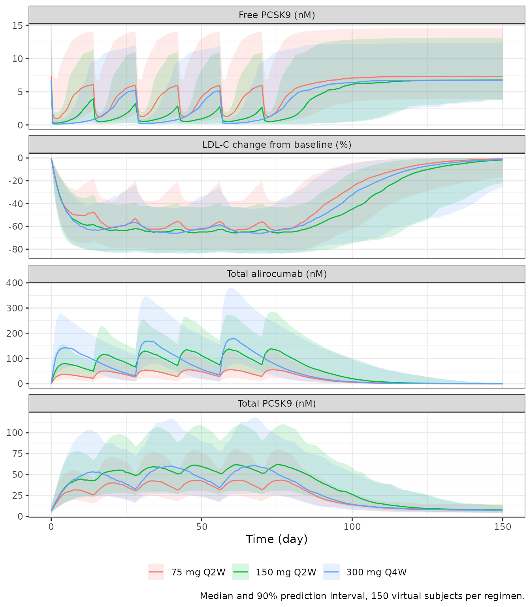
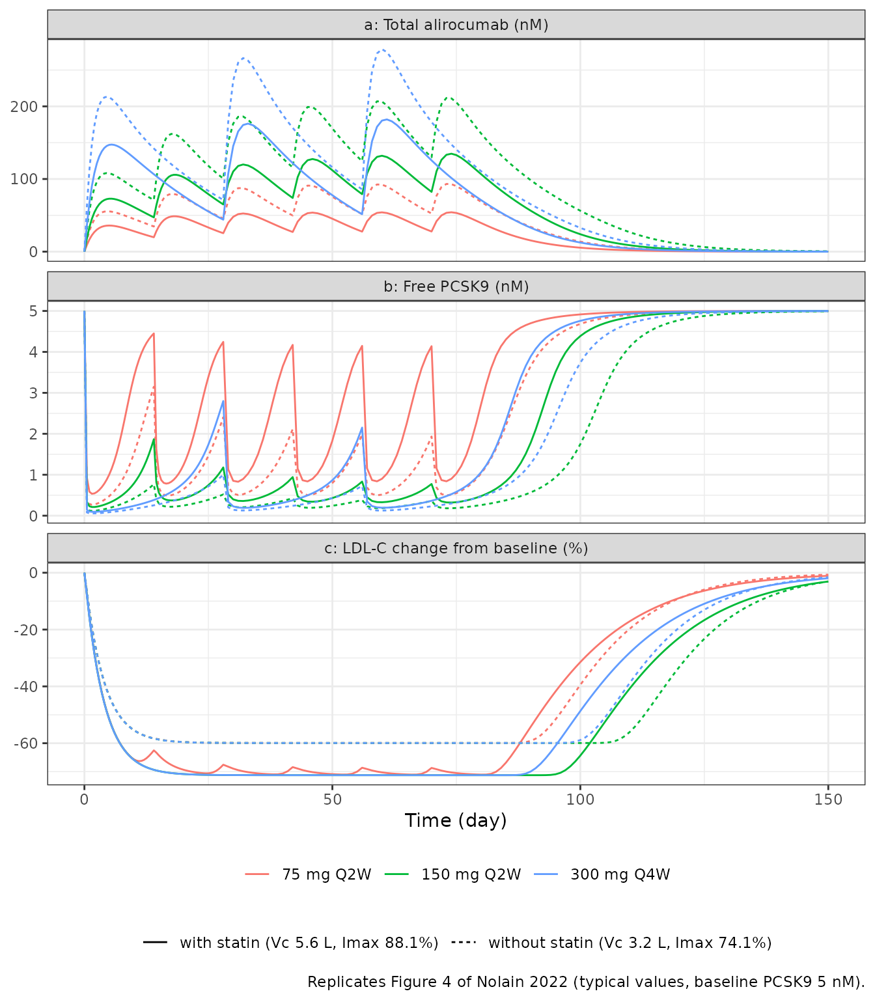

# Alirocumab, PCSK9 and LDL-C TMDD-QSS PK/PD (Nolain 2022)

## Model and source

- Citation: Nolain P, Djebli N, Brunet A, Fabre D, Khier S. Combined
  Semi-mechanistic Target-Mediated Drug Disposition and
  Pharmacokinetic-Pharmacodynamic Models of Alirocumab, PCSK9, and
  Low-Density Lipoprotein Cholesterol in a Pooled Analysis of Randomized
  Phase I/II/III Studies. Eur J Drug Metab Pharmacokinet.
  2022;47:789-802. <doi:10.1007/s13318-022-00787-4>
- Article: [Eur J Drug Metab Pharmacokinet 47:789-802
  (2022)](https://doi.org/10.1007/s13318-022-00787-4) (open access)

Nolain et al. 2022 fitted, in one step, a joint model of total
alirocumab, total PCSK9 and LDL cholesterol (LDL-C) to nine phase I-III
studies. The pharmacokinetic layer is a two-compartment
quasi-steady-state (QSS) target-mediated drug disposition (TMDD) model
in which alirocumab binds its circulating target PCSK9; the
pharmacodynamic layer is an indirect-response model in which **free
PCSK9** (not the drug) inhibits LDL-C degradation through a steep
sigmoid Imax function. Removing free PCSK9 therefore speeds up LDL-C
clearance from its pre-treatment rate `kout(0)` towards `kout`.

``` r

mod <- readModelDb("Nolain_2022_alirocumab")
ui <- rxode2::rxode2(mod)
#> ℹ parameter labels from comments will be replaced by 'label()'
ui
#>  ── rxode2-based free-form 5-cmt ODE model ────────────────────────────────────── 
#>  ── Initalization: ──  
#> Fixed Effects ($theta): 
#>                  lcl                  lvc                   lq 
#>           -1.5095926            1.1631508           -0.5851900 
#>                  lvp                  lka          logitfdepot 
#>            0.9593502           -1.0613165            0.7583712 
#>                ltlag                lkint                lkdeg 
#>           -3.5648935           -2.0635682            0.2926696 
#>                  lkd                  lk1                lkout 
#>           -0.5447272            6.3261495           -1.3470736 
#>            logitimax                lki50                lhill 
#>            1.0511726            1.7967470            2.4510051 
#>   e_conmed_statin_vc e_conmed_statin_imax   e_tpcsk9_base_ki50 
#>            1.7500000            0.1400000            0.9300000 
#>                addSd               propSd  addSd_Ctotal_target 
#>            0.4260000            0.2550000            1.0700000 
#> propSd_Ctotal_target            addSd_ldl           propSd_ldl 
#>            0.2790000            5.7100000            0.1420000 
#> 
#> Omega ($omega): 
#>                etalcl etalkint etalkdeg etalvc etalka etalogitfdepot etalkout
#> etalcl           0.27   0.0000    0.000 0.0000  0.000          0.000    0.000
#> etalkint         0.00   0.0554    0.000 0.0000  0.000          0.000    0.000
#> etalkdeg         0.00   0.0000    0.124 0.0000  0.000          0.000    0.000
#> etalvc           0.00   0.0000    0.000 0.0648  0.000          0.000    0.000
#> etalka           0.00   0.0000    0.000 0.0000  0.344          0.000    0.000
#> etalogitfdepot   0.00   0.0000    0.000 0.0000  0.000          0.626    0.000
#> etalkout         0.00   0.0000    0.000 0.0000  0.000          0.000    0.256
#> etalogitimax     0.00   0.0000    0.000 0.0000  0.000          0.000    0.000
#> etalki50         0.00   0.0000    0.000 0.0000  0.000          0.000    0.000
#>                etalogitimax etalki50
#> etalcl                0.000  0.00000
#> etalkint              0.000  0.00000
#> etalkdeg              0.000  0.00000
#> etalvc                0.000  0.00000
#> etalka                0.000  0.00000
#> etalogitfdepot        0.000  0.00000
#> etalkout              0.000  0.00000
#> etalogitimax          0.146  0.00000
#> etalki50              0.000  0.00578
#> attr(,"lotriLabels")
#> [1] "Table 4 omega2 CL 0.270 (55.7%)"        
#> [2] "Table 4 omega2 kclear 0.0554 (23.9%)"   
#> [3] "Table 4 omega2 kdeg 0.124 (36.4%)"      
#> [4] "Table 4 omega2 Vc 0.0648 (25.9%)"       
#> [5] "Table 4 omega2 ka 0.344 (64.1%)"        
#> [6] "Table 4 omega2 F 0.626 (logit scale)"   
#> [7] "Table 4 omega2 kout 0.256 (54.0%)"      
#> [8] "Table 4 omega2 Imax 0.146 (logit scale)"
#> [9] "Table 4 omega2 IC50 0.00578 (7.61%)"    
#> attr(,"lotriFix")
#>                etalcl etalkint etalkdeg etalvc etalka etalogitfdepot etalkout
#> etalcl          FALSE    FALSE    FALSE  FALSE  FALSE          FALSE    FALSE
#> etalkint        FALSE    FALSE    FALSE  FALSE  FALSE          FALSE    FALSE
#> etalkdeg        FALSE    FALSE    FALSE  FALSE  FALSE          FALSE    FALSE
#> etalvc          FALSE    FALSE    FALSE  FALSE  FALSE          FALSE    FALSE
#> etalka          FALSE    FALSE    FALSE  FALSE  FALSE          FALSE    FALSE
#> etalogitfdepot  FALSE    FALSE    FALSE  FALSE  FALSE          FALSE    FALSE
#> etalkout        FALSE    FALSE    FALSE  FALSE  FALSE          FALSE    FALSE
#> etalogitimax    FALSE    FALSE    FALSE  FALSE  FALSE          FALSE    FALSE
#> etalki50        FALSE    FALSE    FALSE  FALSE  FALSE          FALSE    FALSE
#>                etalogitimax etalki50
#> etalcl                FALSE    FALSE
#> etalkint              FALSE    FALSE
#> etalkdeg              FALSE    FALSE
#> etalvc                FALSE    FALSE
#> etalka                FALSE    FALSE
#> etalogitfdepot        FALSE    FALSE
#> etalkout              FALSE    FALSE
#> etalogitimax          FALSE    FALSE
#> etalki50              FALSE    FALSE
#> 
#> States ($state or $stateDf): 
#>   Compartment Number Compartment Name
#> 1                  1            depot
#> 2                  2          central
#> 3                  3      peripheral1
#> 4                  4     total_target
#> 5                  5              ldl
#>  ── Multiple Endpoint Model ($multipleEndpoint): ──  
#>            variable                          cmt                          dvid*
#> 1            Cc ~ …            cmt='Cc' or cmt=6            dvid='Cc' or dvid=1
#> 2 Ctotal_target ~ … cmt='Ctotal_target' or cmt=7 dvid='Ctotal_target' or dvid=2
#> 3           ldl ~ …           cmt='ldl' or cmt=5           dvid='ldl' or dvid=3
#>   * If dvids are outside this range, all dvids are re-numered sequentially, ie 1,7, 10 becomes 1,2,3 etc
#> 
#>  ── μ-referencing ($muRefTable): ──  
#>         theta            eta level
#> 1         lcl         etalcl    id
#> 2         lvc         etalvc    id
#> 3         lka         etalka    id
#> 4 logitfdepot etalogitfdepot    id
#> 5       lkint       etalkint    id
#> 6       lkdeg       etalkdeg    id
#> 7       lkout       etalkout    id
#> 8       lki50       etalki50    id
#> 
#>  ── Model (Normalized Syntax): ── 
#> function() {
#>     compartmentData <- list(depot = list(analyte = "alirocumab", 
#>         units = "nmol", specimen = "administration site", verified = TRUE), 
#>         central = list(analyte = "alirocumab (total: free + PCSK9-bound)", 
#>             units = "nmol", specimen = "serum", verified = TRUE), 
#>         peripheral1 = list(analyte = "alirocumab (free)", units = "nmol", 
#>             specimen = "not applicable", verified = TRUE), total_target = list(analyte = "PCSK9 (total: free + alirocumab-bound)", 
#>             units = "nmol", specimen = "serum", verified = TRUE), 
#>         ldl = list(analyte = "low-density lipoprotein cholesterol", 
#>             units = "mg/dL", specimen = "serum", verified = TRUE))
#>     covariateData <- list(TPCSK9_BASE = list(description = "Baseline (pre-dose) total serum PCSK9 concentration, time-fixed per subject", 
#>         units = "nM", type = "continuous", reference_category = NULL, 
#>         notes = "Nolain 2022 uses the individual observed baseline total PCSK9 twice: (1) as the initial condition and synthesis anchor of the total-PCSK9 state (Ptot(0) = [Ptot]baseline * Vc; ksyn = kdeg * [Ptot]baseline; Table 3) and in kout(0) (Table 3), and (2) as the covariate TBSPCSK9 on the free-PCSK9 IC50, power form centred on the dataset median 6.99 nM (Eq. 6). Units are nM in this model, not the register default ng/mL. Modelling dataset mean 7.66 nM (SD 3.06), range 2.36-19.6 nM (Table 2). The paper's a priori effect of TBSPCSK9 on kdeg (Eq. 7) was removed in the covariate-reduction step (Sect. 3.2.2) and is not encoded.", 
#>         source_name = "TBSPCSK9"), LDLC = list(description = "Baseline (pre-dose) LDL cholesterol, time-fixed per subject", 
#>         units = "mg/dL", type = "continuous", reference_category = NULL, 
#>         notes = "Individual observed baseline LDL-C ([LDLC]baseline, Table 3). Sets the initial condition of the `ldl` turnover state and, through the pre-treatment steady state kin = kout(0) * [LDLC]baseline, the zero-order LDL-C production rate. Because the model is linear in the state, percent change from baseline is independent of this value. Modelling dataset mean 140 mg/dL (SD 33.1), range 88.5-356 (Table 2).", 
#>         source_name = "[LDLC]baseline"), CONMED_STATIN = list(description = "Concomitant statin therapy", 
#>         units = "(binary)", type = "binary", reference_category = "0 (no statin)", 
#>         notes = "STATIN = 1 with statin co-administration, 0 otherwise (Eqs. 3 and 5). Multiplicative 1.75-fold effect on Vc (Eq. 3) and additive +0.140 effect on the typical Imax (Eq. 5; 74.1% -> 88.1%). The a priori statin effect on kout (Eq. 4) was removed in the covariate-reduction step (Sect. 3.2.2) and is not encoded. 60.9% of the modelling dataset received a statin (Table 2).", 
#>         source_name = "STATIN"))
#>     covariatesDataExcluded <- list(SEXF = list(description = "Female sex indicator", 
#>         units = "(binary)", type = "binary", reference_category = "0 (male)", 
#>         notes = "Additive effect of female sex on Imax (Eq. 5; SEX = 1 for women) was included a priori in the full fixed-effects model but removed in the reduction step as not clinically relevant (Sect. 3.2.2, Fig. 2c). No final-model estimate is reported.", 
#>         source_name = "SEX"))
#>     description <- "Semi-mechanistic population PK/PD model for alirocumab, total PCSK9 and LDL cholesterol in healthy adults and adults with hypercholesterolaemia (Nolain 2022). Two-compartment alirocumab disposition with first-order SC absorption (lag time, logit-normal bioavailability), quasi-steady-state target-mediated drug disposition (TMDD-QSS) binding to PCSK9 with zero-order PCSK9 synthesis, and an indirect-response (type II, inhibition of loss) LDL-C model in which free PCSK9 inhibits LDL-C degradation through a sigmoid Imax function. Statin co-administration increases Vc and Imax; baseline total PCSK9 scales the free-PCSK9 IC50."
#>     population <- list(species = "human", n_subjects = 527L, 
#>         n_studies = 9L, n_observations = 13731L, phases = "Phase I, II and III", 
#>         age_range = "18-75 years", age_mean = "52.5 years (SD 13.0)", 
#>         weight_range = "45.8-154 kg", weight_mean = "80.6 kg (SD 16.4)", 
#>         sex_female_pct = 46.9, disease_state = "Healthy volunteers (28.5%) and patients with hypercholesterolaemia (71.5%), all with LDL-C >= 100 mg/dL; 30.0% heterozygous familial hypercholesterolaemia.", 
#>         co_medication = "Statin 60.9% (low dose 38.5%, high dose 22.4%), ezetimibe 12.9%, fibrate 4.74%; 29.8% alirocumab alone.", 
#>         dose_range = "Single IV doses 0.3-12 mg/kg (one phase I study, NCT01026597); SC 50-300 mg single dose or Q2W/Q4W for up to 104 weeks.", 
#>         pcsk9_baseline = "Baseline total PCSK9 mean 7.66 nM (SD 3.06), range 2.36-19.6 nM; median 6.99 nM (Sect. 3.2.2).", 
#>         ldlc_baseline = "Baseline LDL-C mean 140 mg/dL (SD 33.1), range 88.5-356 mg/dL.", 
#>         renal_function = "MDRD creatinine clearance mean 109 mL/min/1.73 m^2 (SD 30.4), range 38.1-253.", 
#>         notes = "Modelling dataset (Table 1 upper block, Table 2 first column). An external validation dataset of 2273 patients from four further phase II/III studies (Table 1 lower block) was used for MAP-Bayesian predictive checks only.")
#>     reference <- "Nolain P, Djebli N, Brunet A, Fabre D, Khier S. Combined Semi-mechanistic Target-Mediated Drug Disposition and Pharmacokinetic-Pharmacodynamic Models of Alirocumab, PCSK9, and Low-Density Lipoprotein Cholesterol in a Pooled Analysis of Randomized Phase I/II/III Studies. Eur J Drug Metab Pharmacokinet. 2022;47:789-802. doi:10.1007/s13318-022-00787-4"
#>     units <- list(time = "day", dosing = "mg", concentration = "nM")
#>     vignette <- "Nolain_2022_alirocumab"
#>     ini({
#>         lcl <- -1.50959257746438
#>         label("Linear clearance of free alirocumab CL (L/day)")
#>         lvc <- 1.16315080980568
#>         label("Central volume of distribution Vc without statin (L)")
#>         lq <- -0.585190039054853
#>         label("Inter-compartmental clearance of free alirocumab Q (L/day)")
#>         lvp <- fix(0.959350221334602)
#>         label("Peripheral volume of free alirocumab Vp (L)")
#>         lka <- -1.06131650392441
#>         label("First-order SC absorption rate constant ka (1/day)")
#>         logitfdepot <- 0.758371203364668
#>         label("Logit of absolute SC bioavailability F (F = 0.681)")
#>         ltlag <- -3.56489347433295
#>         label("SC absorption lag time LAG (day)")
#>         lkint <- -2.06356819252355
#>         label("Rate constant for alirocumab-PCSK9 complex clearance kclear (1/day)")
#>         lkdeg <- 0.29266961396282
#>         label("First-order degradation rate constant of free PCSK9 kdeg (1/day)")
#>         lkd <- fix(-0.544727175441672)
#>         label("Equilibrium dissociation constant kD = koff/kon (nM)")
#>         lk1 <- fix(6.3261494731551)
#>         label("Association rate constant kon of the drug-target complex (1/nM/day)")
#>         lkout <- -1.34707364796661
#>         label("First-order LDL-C degradation rate constant during treatment kout (1/day)")
#>         logitimax <- 1.05117256359655
#>         label("Logit of maximal inhibition of LDL-C degradation by free PCSK9 without statin (Imax = 0.741)")
#>         lki50 <- 1.79674701073909
#>         label("Free PCSK9 concentration giving half of Imax at the median baseline total PCSK9, IC50 (nM)")
#>         lhill <- 2.45100509811232
#>         label("Hill coefficient gamma of the free-PCSK9 Imax function (unitless)")
#>         e_conmed_statin_vc <- 1.75
#>         label("Multiplicative factor on Vc with statin co-administration, Vc = theta * factor^STATIN (unitless)")
#>         e_conmed_statin_imax <- 0.14
#>         label("Additive increment in typical Imax with statin co-administration (fraction)")
#>         e_tpcsk9_base_ki50 <- 0.93
#>         label("Power exponent of baseline total PCSK9 (TPCSK9_BASE / 6.99 nM) on IC50 (unitless)")
#>         addSd <- c(0, 0.426)
#>         label("Additive residual error, total alirocumab (nM)")
#>         propSd <- c(0, 0.255)
#>         label("Proportional residual error, total alirocumab (fraction)")
#>         addSd_Ctotal_target <- c(0, 1.07)
#>         label("Additive residual error, total PCSK9 (nM)")
#>         propSd_Ctotal_target <- c(0, 0.279)
#>         label("Proportional residual error, total PCSK9 (fraction)")
#>         addSd_ldl <- c(0, 5.71)
#>         label("Additive residual error, LDL-C (mg/dL)")
#>         propSd_ldl <- c(0, 0.142)
#>         label("Proportional residual error, LDL-C (fraction)")
#>         etalcl ~ 0.27
#>         label("Table 4 omega2 CL 0.270 (55.7%)")
#>         etalkint ~ 0.0554
#>         label("Table 4 omega2 kclear 0.0554 (23.9%)")
#>         etalkdeg ~ 0.124
#>         label("Table 4 omega2 kdeg 0.124 (36.4%)")
#>         etalvc ~ 0.0648
#>         label("Table 4 omega2 Vc 0.0648 (25.9%)")
#>         etalka ~ 0.344
#>         label("Table 4 omega2 ka 0.344 (64.1%)")
#>         etalogitfdepot ~ 0.626
#>         label("Table 4 omega2 F 0.626 (logit scale)")
#>         etalkout ~ 0.256
#>         label("Table 4 omega2 kout 0.256 (54.0%)")
#>         etalogitimax ~ 0.146
#>         label("Table 4 omega2 Imax 0.146 (logit scale)")
#>         etalki50 ~ 0.00578
#>         label("Table 4 omega2 IC50 0.00578 (7.61%)")
#>     })
#>     model({
#>         mw_alirocumab <- 146000
#>         nmol_per_mg <- 1e+06/mw_alirocumab
#>         cl <- exp(lcl + etalcl)
#>         vc <- exp(lvc + etalvc) * e_conmed_statin_vc^CONMED_STATIN
#>         q <- exp(lq)
#>         vp <- exp(lvp)
#>         ka <- exp(lka + etalka)
#>         fdepot <- expit(logitfdepot + etalogitfdepot, 0, 1)
#>         tlag <- exp(ltlag)
#>         kint <- exp(lkint + etalkint)
#>         kdeg <- exp(lkdeg + etalkdeg)
#>         kd <- exp(lkd)
#>         k1 <- exp(lk1)
#>         kss <- kd + kint/k1
#>         kout <- exp(lkout + etalkout)
#>         imax_typ <- expit(logitimax, 0, 1) + e_conmed_statin_imax * 
#>             CONMED_STATIN
#>         imax <- expit(logit(imax_typ, 0, 1) + etalogitimax, 0, 
#>             1)
#>         ki50 <- exp(lki50 + etalki50) * (TPCSK9_BASE/6.99)^e_tpcsk9_base_ki50
#>         hill <- exp(lhill)
#>         kel <- cl/vc
#>         kcp <- q/vc
#>         kpc <- q/vp
#>         ksyn <- kdeg * TPCSK9_BASE
#>         kout0 <- kout * (1 - imax * TPCSK9_BASE^hill/(ki50^hill + 
#>             TPCSK9_BASE^hill))
#>         kin <- kout0 * LDLC
#>         atot <- central/vc
#>         ptot <- total_target/vc
#>         qss_a <- atot - ptot - kss
#>         qss_s <- sqrt(qss_a^2 + 4 * kss * atot)
#>         if (qss_a < 0) {
#>             afree <- 2 * kss * atot/(qss_s - qss_a)
#>         }
#>         else {
#>             afree <- (qss_a + qss_s)/2
#>         }
#>         fbound <- afree/(kss + afree)
#>         pfree <- ptot * (1 - fbound)
#>         cplx <- ptot * fbound
#>         d/dt(depot) <- -ka * depot
#>         d/dt(central) <- ka * depot - (kel + kcp) * afree * vc + 
#>             kpc * peripheral1 - kint * total_target * fbound
#>         d/dt(peripheral1) <- kcp * afree * vc - kpc * peripheral1
#>         d/dt(total_target) <- ksyn * vc - kdeg * total_target - 
#>             (kint - kdeg) * total_target * fbound
#>         d/dt(ldl) <- kin - kout * (1 - imax * pfree^hill/(ki50^hill + 
#>             pfree^hill)) * ldl
#>         total_target(0) <- TPCSK9_BASE * vc
#>         ldl(0) <- LDLC
#>         f(depot) <- fdepot * nmol_per_mg
#>         alag(depot) <- tlag
#>         f(central) <- nmol_per_mg
#>         Cc <- atot
#>         Ctotal_target <- ptot
#>         Cc ~ add(addSd) + prop(propSd)
#>         Ctotal_target ~ add(addSd_Ctotal_target) + prop(propSd_Ctotal_target)
#>         ldl ~ add(addSd_ldl) + prop(propSd_ldl)
#>     })
#> }
```

## Population

The modelling dataset held 527 alirocumab-treated subjects (13,731
observations) from nine studies (Table 1): healthy volunteers (28.5%)
and patients with primary hypercholesterolaemia (71.5%; 30.0%
heterozygous familial hypercholesterolaemia), all with LDL-C \>= 100
mg/dL. Mean (SD) characteristics (Table 2): age 52.5 (13.0) years, body
weight 80.6 (16.4) kg, 46.9% female, baseline total PCSK9 7.66 (3.06) nM
(median 6.99 nM), baseline LDL-C 140 (33.1) mg/dL. 60.9% were on a
statin, 12.9% on ezetimibe and 4.7% on a fibrate. Alirocumab was given
SC at 50-300 mg (single dose, Q2W or Q4W) and, in one phase I study, IV
at 0.3-12 mg/kg.

The same information is available as `ui$population`.

## Source trace

Every `ini()` value carries an in-file comment naming its location in
the paper. The equations follow Table 3.

| Element | Value | Source |
|----|----|----|
| CL | 0.221 L/day | Table 4 |
| Vc (no statin) | 3.20 L | Table 4 |
| Q | 0.557 L/day | Table 4 |
| Vp | 2.61 L (fixed) | Table 4, Sect. 3.2.1 |
| ka | 0.346 /day | Table 4 |
| F | 68.1% (logit-normal) | Table 4, Sect. 3.2.1 |
| LAG | 0.0283 day | Table 4 |
| kclear (`kint`) | 0.127 /day | Table 4 |
| kdeg | 1.34 /day | Table 4 |
| kD (`kd`) | 0.58 nM (fixed, in vitro) | Table 4, Table 3 |
| kon (`k1`) | 559 /nM/day (fixed) | Table 4, Sect. 3.2.1 |
| kout | 0.260 /day | Table 4 |
| Imax (no statin) | 74.1% (logit-normal) | Table 4 |
| IC50 of free PCSK9 (`ki50`) | 6.03 nM | Table 4 |
| Hill coefficient gamma | 11.6 | Table 4 |
| Statin on Vc | x 1.75 | Table 4, Eq. 3 |
| Statin on Imax | \+ 0.140 | Table 4, Eq. 5 |
| Baseline total PCSK9 on IC50 | (TBSPCSK9 / 6.99)^0.930 | Table 4, Eq. 6 |
| IIV variances (CL, kclear, kdeg, Vc, ka, F, kout, Imax, IC50) | 0.270, 0.0554, 0.124, 0.0648, 0.344, 0.626, 0.256, 0.146, 0.00578 | Table 4 |
| Residual error (add / prop) | alirocumab 0.426 nM / 25.5%; PCSK9 1.07 nM / 27.9%; LDL-C 5.71 mg/dL / 14.2% | Table 4 |
| Depot, total alirocumab, peripheral ODEs | – | Table 3 |
| kss = kD + kclear / kon; QSS free drug | – | Table 3 |
| Total PCSK9 ODE, ksyn = kdeg \* \[Ptot\]baseline, Ptot(0) = \[Ptot\]baseline \* Vc | – | Table 3 |
| LDL-C ODE, kout(0), kin = kout(0) \* \[LDLC\]baseline | – | Table 3 |

## Virtual cohort

Covariates are drawn to match Table 2: 61% statin users, baseline total
PCSK9 log-normal with mean 7.66 nM and SD 3.06 nM truncated to the
observed 2.36-19.6 nM, and baseline LDL-C log-normal with mean 140 mg/dL
and SD 33.1 mg/dL truncated to 88.5-356 mg/dL. The three regimens are
the ones the paper simulates in Figure 4: 75 mg SC Q2W, 150 mg SC Q2W
and 300 mg SC Q4W, each for 12 weeks.

``` r

rxode2::rxSetSeed(20221016)
n_per_arm <- 150

rlnorm_ms <- function(n, mean, sd, lo, hi) {
  sdlog <- sqrt(log(1 + (sd / mean)^2))
  x <- rlnorm(n, log(mean) - sdlog^2 / 2, sdlog)
  pmin(pmax(x, lo), hi)
}

regimens <- tibble::tribble(
  ~treatment,    ~amt, ~ii, ~ndose,
  "75 mg Q2W",     75,  14,      6,
  "150 mg Q2W",   150,  14,      6,
  "300 mg Q4W",   300,  28,      3
)

cov <- tibble(id = seq_len(n_per_arm * nrow(regimens))) |>
  mutate(
    treatment = rep(regimens$treatment, each = n_per_arm),
    CONMED_STATIN = rbinom(n(), 1, 0.609),
    TPCSK9_BASE = rlnorm_ms(n(), 7.66, 3.06, 2.36, 19.6),
    LDLC = rlnorm_ms(n(), 140, 33.1, 88.5, 356)
  )

obs_times <- sort(unique(c(seq(0, 28, by = 0.5), seq(29, 150, by = 1))))

make_events <- function(cov, regimens, obs_times) {
  doses <- cov |>
    inner_join(regimens, by = "treatment") |>
    group_by(id) |>
    reframe(
      treatment = treatment, CONMED_STATIN = CONMED_STATIN,
      TPCSK9_BASE = TPCSK9_BASE, LDLC = LDLC,
      time = seq(0, by = ii[1], length.out = ndose[1]), amt = amt[1]
    ) |>
    mutate(evid = 1L, cmt = "depot", dvid = NA_integer_)
  obs <- tidyr::crossing(cov, time = obs_times) |>
    mutate(amt = 0, evid = 0L, cmt = "central", dvid = 1L)
  bind_rows(doses, obs) |>
    arrange(id, time, desc(evid)) |>
    select(id, time, evid, amt, cmt, dvid, treatment, CONMED_STATIN, TPCSK9_BASE, LDLC)
}

events <- make_events(cov, regimens, obs_times)
```

## Simulation

Observation rows sit on the `central` state with `dvid = 1`; rxode2
returns every model output (total alirocumab `Cc`, total PCSK9
`Ctotal_target`, `ldl`, free PCSK9 `pfree`) on each of those rows.
Concentrations below are individual predictions (between-subject
variability, no residual error).

``` r

sim <- rxode2::rxSolve(ui, events, sigma = NA, keep = "treatment",
                       returnType = "data.frame") |>
  mutate(
    treatment = factor(treatment, levels = regimens$treatment),
    ldl_pct = 100 * (ldl / LDLC - 1)
  )
stopifnot(!anyNA(sim$Cc), !anyNA(sim$ldl))
```

``` r

vpc <- sim |>
  select(treatment, time, `Total alirocumab (nM)` = Cc,
         `Total PCSK9 (nM)` = Ctotal_target, `Free PCSK9 (nM)` = pfree,
         `LDL-C change from baseline (%)` = ldl_pct) |>
  pivot_longer(-c(treatment, time), names_to = "output") |>
  group_by(treatment, time, output) |>
  summarise(q05 = quantile(value, 0.05), q50 = median(value),
            q95 = quantile(value, 0.95), .groups = "drop")

ggplot(vpc, aes(time, q50, colour = treatment, fill = treatment)) +
  geom_ribbon(aes(ymin = q05, ymax = q95), alpha = 0.15, colour = NA) +
  geom_line() +
  facet_wrap(~output, ncol = 1, scales = "free_y") +
  labs(x = "Time (day)", y = NULL, colour = NULL, fill = NULL,
       caption = "Median and 90% prediction interval, 150 virtual subjects per regimen.") +
  theme_bw() + theme(legend.position = "bottom")
```



## Replicate published figures

### Figure 4: typical profiles by regimen

Figure 4 shows typical alirocumab, free PCSK9 and LDL-C profiles for the
three regimens with a baseline free PCSK9 of 5 nM (read off Figure 4b).
The paper does not state whether these curves are for a statin user, so
both covariate states are drawn here.

``` r

typ_cov <- tidyr::crossing(treatment = regimens$treatment, CONMED_STATIN = 0:1) |>
  mutate(id = row_number(), TPCSK9_BASE = 5, LDLC = 140)
typ_events <- make_events(typ_cov, regimens, obs_times)
typ <- rxode2::rxSolve(ui, typ_events, omega = NA, sigma = NA,
                       keep = "treatment", returnType = "data.frame") |>
  mutate(
    treatment = factor(treatment, levels = regimens$treatment),
    statin = ifelse(CONMED_STATIN == 1, "with statin (Vc 5.6 L, Imax 88.1%)",
                    "without statin (Vc 3.2 L, Imax 74.1%)"),
    ldl_pct = 100 * (ldl / LDLC - 1)
  )

typ |>
  select(treatment, statin, time, `a: Total alirocumab (nM)` = Cc,
         `b: Free PCSK9 (nM)` = pfree, `c: LDL-C change from baseline (%)` = ldl_pct) |>
  pivot_longer(-c(treatment, statin, time), names_to = "panel") |>
  ggplot(aes(time, value, colour = treatment, linetype = statin)) +
  geom_line() +
  facet_wrap(~panel, ncol = 1, scales = "free_y") +
  labs(x = "Time (day)", y = NULL, colour = NULL, linetype = NULL,
       caption = "Replicates Figure 4 of Nolain 2022 (typical values, baseline PCSK9 5 nM).") +
  theme_bw() + theme(legend.position = "bottom", legend.box = "vertical")
```



The values digitised from Figure 4 fall between the two typical curves:

``` r

fig4 <- typ |>
  group_by(treatment, CONMED_STATIN) |>
  summarise(
    cmax_first = max(Cc[time < 14]),
    pfree_day14 = pfree[time == 13.5],
    ldl_plateau = min(ldl_pct),
    .groups = "drop"
  )

fig4_75 <- fig4 |> filter(treatment == "75 mg Q2W") |> arrange(CONMED_STATIN)
fig4_digitised <- c(cmax_first = 43, pfree_day14 = 4.1, ldl_plateau = -68.6)

fig4_75 |>
  select(CONMED_STATIN, cmax_first, pfree_day14, ldl_plateau) |>
  mutate(across(-CONMED_STATIN, ~ signif(.x, 3))) |>
  bind_rows(tibble(CONMED_STATIN = NA, !!!as.list(fig4_digitised))) |>
  mutate(Curve = c("Model, no statin", "Model, statin", "Figure 4 (digitised)")) |>
  select(Curve, `First-dose Cmax (nM)` = cmax_first,
         `Free PCSK9 before dose 2 (nM)` = pfree_day14,
         `LDL-C plateau (%)` = ldl_plateau) |>
  knitr::kable(caption = "75 mg SC Q2W, baseline PCSK9 5 nM.")
```

| Curve | First-dose Cmax (nM) | Free PCSK9 before dose 2 (nM) | LDL-C plateau (%) |
|:---|---:|---:|---:|
| Model, no statin | 55.5 | 2.96 | -59.9 |
| Model, statin | 35.9 | 4.39 | -71.0 |
| Figure 4 (digitised) | 43.0 | 4.10 | -68.6 |

75 mg SC Q2W, baseline PCSK9 5 nM. {.table}

``` r


stopifnot(
  # Each digitised value lies inside the [statin, no-statin] typical envelope.
  fig4_digitised[["cmax_first"]] > fig4_75$cmax_first[2],
  fig4_digitised[["cmax_first"]] < fig4_75$cmax_first[1],
  fig4_digitised[["pfree_day14"]] > fig4_75$pfree_day14[1],
  fig4_digitised[["pfree_day14"]] < fig4_75$pfree_day14[2],
  fig4_digitised[["ldl_plateau"]] > fig4_75$ldl_plateau[2],
  fig4_digitised[["ldl_plateau"]] < fig4_75$ldl_plateau[1]
)
```

### Figure 2: size of each retained covariate effect

Figure 2 quantifies each covariate relationship by switching it on alone
at 75 mg Q2W and reading alirocumab AUC over weeks 10-12 and the LDL-C
decrease at week 12, relative to a reference subject (no statin,
baseline PCSK9 at the median 6.99 nM). The paper reports an AUC decrease
of about 45% for the statin effect on Vc (Sect. 3.2.2); the LDL-C
distributions for the statin effects on Vc and on Imax are centred near
-20% and +20% (Fig. 2a; 42% and 48% probability of exceeding a 20%
change). The AUC is computed with PKNCA.

``` r

fig2_scenarios <- list(
  "Reference" = list(mod = ui, statin = 0, ic50_pcsk9 = 6.99),
  "Statin on Vc only" = list(mod = rxode2::ini(ui, e_conmed_statin_imax = 0), statin = 1, ic50_pcsk9 = 6.99),
  "Statin on Imax only" = list(mod = rxode2::ini(ui, e_conmed_statin_vc = 1), statin = 1, ic50_pcsk9 = 6.99),
  "IC50 at baseline PCSK9 9.10 nM (p75) only" = list(mod = ui, statin = 0, ic50_pcsk9 = 9.10)
)
#> ℹ change initial estimate of `e_conmed_statin_imax` to `0`
#> ℹ change initial estimate of `e_conmed_statin_vc` to `1`

fig2_cov <- tibble(id = 1L, treatment = "75 mg Q2W", CONMED_STATIN = 0L,
                   TPCSK9_BASE = 6.99, LDLC = 140)
fig2_events <- make_events(fig2_cov, regimens, seq(0, 84, by = 0.25))

fig2_sim <- bind_rows(lapply(names(fig2_scenarios), function(nm) {
  sc <- fig2_scenarios[[nm]]
  # The p75 scenario moves only the covariate inside the IC50 equation (Eq. 6)
  # and keeps the PCSK9 turnover at the median baseline, as Figure 2b does.
  m <- rxode2::ini(sc$mod, lki50 = log(6.03 * (sc$ic50_pcsk9 / 6.99)^0.930))
  ev <- mutate(fig2_events, CONMED_STATIN = sc$statin)
  rxode2::rxSolve(m, ev, omega = NA, sigma = NA, returnType = "data.frame") |>
    mutate(scenario = nm, id = 1L)
}))
#> ℹ change initial estimate of `lki50` to `1.79674701073909`
#> ℹ change initial estimate of `lki50` to `1.79674701073909`
#> ℹ change initial estimate of `lki50` to `1.79674701073909`
#> ℹ change initial estimate of `lki50` to `2.04207529800678`

conc_obj <- PKNCA::PKNCAconc(
  fig2_sim |> filter(!is.na(Cc)) |> select(scenario, id, time, Cc),
  Cc ~ time | scenario + id
)
dose_obj <- PKNCA::PKNCAdose(
  fig2_events |> filter(evid == 1) |> select(id, time, amt) |>
    tidyr::crossing(scenario = names(fig2_scenarios)),
  amt ~ time | scenario + id
)
fig2_nca <- PKNCA::pk.nca(PKNCA::PKNCAdata(
  conc_obj, dose_obj,
  intervals = data.frame(start = 70, end = 84, auclast = TRUE, cmax = TRUE)
))

fig2_tab <- as.data.frame(fig2_nca$result) |>
  filter(PPTESTCD == "auclast") |>
  select(scenario, auc = PPORRES) |>
  left_join(
    fig2_sim |> filter(time == 84) |> transmute(scenario, ldl_drop = 100 * (1 - ldl / 140)),
    by = "scenario"
  ) |>
  mutate(
    auc_change = 100 * (auc / auc[scenario == "Reference"] - 1),
    ldl_change = 100 * (ldl_drop / ldl_drop[scenario == "Reference"] - 1)
  ) |>
  arrange(factor(scenario, levels = names(fig2_scenarios)))

fig2_tab |>
  mutate(across(where(is.numeric), ~ round(.x, 1))) |>
  select(Scenario = scenario, `AUC wk 10-12 (nM*day)` = auc,
         `AUC change (%)` = auc_change, `LDL-C decrease wk 12 (%)` = ldl_drop,
         `Change in LDL-C decrease (%)` = ldl_change) |>
  knitr::kable()
```

| Scenario | AUC wk 10-12 (nM\*day) | AUC change (%) | LDL-C decrease wk 12 (%) | Change in LDL-C decrease (%) |
|:---|---:|---:|---:|---:|
| Reference | 986.7 | 0.0 | 62.0 | 0.0 |
| Statin on Vc only | 559.2 | -43.3 | 48.5 | -21.8 |
| Statin on Imax only | 986.7 | 0.0 | 74.0 | 19.4 |
| IC50 at baseline PCSK9 9.10 nM (p75) only | 986.7 | 0.0 | 18.0 | -71.0 |

``` r


get_row <- function(nm) fig2_tab[fig2_tab$scenario == nm, ]
stopifnot(
  # Statin on Vc: paper reports approximately -45% AUC.
  abs(get_row("Statin on Vc only")$auc_change - (-45)) < 5,
  # Statin effects on LDL-C decrease: Figure 2a centres near -20% and +20%.
  abs(get_row("Statin on Vc only")$ldl_change - (-20)) < 5,
  abs(get_row("Statin on Imax only")$ldl_change - 20) < 5,
  # Imax does not enter the PK, so its AUC equals the reference up to the
  # ODE solver tolerance.
  abs(get_row("Statin on Imax only")$auc_change) < 0.01
)
```

For the IC50 relationship the paper states that subjects with a baseline
PCSK9 at or above 9.10 nM would have a lipid-lowering effect reduced by
about 60% versus the median subject (Sect. 3.2.2); Figure 2b shows a
wide distribution centred near -60%. Moving only the IC50 covariate
gives a reduction of 71% with the typical parameters, inside the spread
of Figure 2b (which reflects the uncertainty of the estimates, and in
particular of the steep Hill coefficient).

Note that this is a property of the single relationship, not of a real
high-PCSK9 subject. In the full model a higher baseline PCSK9 also
raises the total-PCSK9 initial condition and `kout(0)`. Because the IC50
exponent (0.930) is close to 1, the ratio of baseline PCSK9 to IC50
hardly changes, and the week-12 LDL-C reduction at 9.10 nM is only a few
percent smaller than at the median:

``` r

p75_full <- rxode2::rxSolve(ui, mutate(fig2_events, TPCSK9_BASE = 9.10),
                            omega = NA, sigma = NA, returnType = "data.frame")
ref_full <- rxode2::rxSolve(ui, fig2_events, omega = NA, sigma = NA, returnType = "data.frame")
round(100 * (1 - c(median_6.99 = ref_full$ldl[ref_full$time == 84],
                   p75_9.10 = p75_full$ldl[p75_full$time == 84]) / 140), 1)
#> median_6.99    p75_9.10 
#>          62          57
```

## Mechanistic checks

Without drug the system must stay at its pre-treatment steady state
(total PCSK9 at baseline, LDL-C at baseline). With free PCSK9 fully
suppressed, the LDL-C turnover settles at `kin / kout`, so the maximal
fractional reduction is `Imax * H0` with
`H0 = P0^gamma / (IC50^gamma + P0^gamma)` evaluated at the baseline
PCSK9 `P0`. At the median baseline (6.99 nM) that is 62.8% without a
statin and 74.6% with one, consistent with the “up to 62.7%” LDL-C
reduction the paper cites from the clinical programme.

``` r

mech_cov <- tidyr::crossing(treatment = c("none", "300 mg Q2W"), CONMED_STATIN = 0:1) |>
  mutate(id = row_number(), TPCSK9_BASE = 6.99, LDLC = 140)
mech_regimens <- tibble(treatment = c("none", "300 mg Q2W"), amt = c(0, 300), ii = 14, ndose = c(1, 12))
mech <- rxode2::rxSolve(ui, make_events(mech_cov, mech_regimens, seq(0, 168, by = 1)),
                        omega = NA, sigma = NA, keep = "treatment", returnType = "data.frame")

imax_typ <- c(0.741, 0.741 + 0.140)
h0 <- 1 / (1 + (6.03 / 6.99)^11.6)
closed_form <- 100 * imax_typ * h0

mech_summary <- mech |>
  group_by(treatment, CONMED_STATIN) |>
  summarise(
    ptot_range = diff(range(Ctotal_target)),
    ldl_range = diff(range(ldl)),
    max_ldl_drop = 100 * (1 - min(ldl) / 140),
    .groups = "drop"
  )
mech_summary |> mutate(closed_form = closed_form[CONMED_STATIN + 1]) |> knitr::kable(digits = 3)
```

| treatment  | CONMED_STATIN | ptot_range | ldl_range | max_ldl_drop | closed_form |
|:-----------|--------------:|-----------:|----------:|-------------:|------------:|
| 300 mg Q2W |             0 |     65.533 |    87.901 |       62.786 |      62.786 |
| 300 mg Q2W |             1 |     64.989 |   104.508 |       74.649 |      74.649 |
| none       |             0 |      0.000 |     0.000 |        0.000 |      62.786 |
| none       |             1 |      0.000 |     0.000 |        0.000 |      74.649 |

``` r


untreated <- filter(mech_summary, treatment == "none")
treated <- filter(mech_summary, treatment == "300 mg Q2W") |> arrange(CONMED_STATIN)
stopifnot(
  # The same drawn parameters on both sides: pure numerical error, so tight.
  all(untreated$ptot_range < 1e-6),
  all(untreated$ldl_range < 1e-6),
  all(abs(treated$max_ldl_drop - closed_form) < 0.5)
)
```

## PKNCA validation

The paper reports no non-compartmental summaries. PKNCA is run on total
alirocumab for the first dosing interval and the last (twelfth week) Q2W
interval of the virtual cohort, grouped by regimen.

``` r

nca_conc <- sim |>
  filter(!is.na(Cc)) |>
  select(id, treatment, time, Cc)
nca_dose <- events |>
  filter(evid == 1) |>
  select(id, treatment, time, amt)

intervals <- bind_rows(
  data.frame(treatment = c("75 mg Q2W", "150 mg Q2W"), start = 0, end = 14),
  data.frame(treatment = "300 mg Q4W", start = 0, end = 28),
  data.frame(treatment = c("75 mg Q2W", "150 mg Q2W"), start = 70, end = 84),
  data.frame(treatment = "300 mg Q4W", start = 56, end = 84)
) |>
  mutate(cmax = TRUE, tmax = TRUE, auclast = TRUE, cmin = TRUE)

nca <- PKNCA::pk.nca(PKNCA::PKNCAdata(
  PKNCA::PKNCAconc(nca_conc, Cc ~ time | treatment + id),
  PKNCA::PKNCAdose(nca_dose, amt ~ time | treatment + id),
  intervals = intervals
))

as.data.frame(nca$result) |>
  group_by(treatment, start, end, PPTESTCD) |>
  summarise(median = signif(median(PPORRES), 3), .groups = "drop") |>
  pivot_wider(names_from = PPTESTCD, values_from = median) |>
  select(Regimen = treatment, Start = start, End = end,
         `Cmax (nM)` = cmax, `Tmax (day)` = tmax,
         `Cmin (nM)` = cmin, `AUClast (nM*day)` = auclast) |>
  knitr::kable(caption = "Median NCA of total alirocumab in the virtual cohort.")
```

| Regimen    | Start | End | Cmax (nM) | Tmax (day) | Cmin (nM) | AUClast (nM\*day) |
|:-----------|------:|----:|----------:|-----------:|----------:|------------------:|
| 150 mg Q2W |     0 |  14 |      82.3 |       4.50 |       0.0 |               895 |
| 150 mg Q2W |    70 |  84 |     140.0 |       4.00 |      75.3 |              1600 |
| 300 mg Q4W |     0 |  28 |     148.0 |       4.50 |       0.0 |              2520 |
| 300 mg Q4W |    56 |  84 |     184.0 |       4.00 |      34.6 |              3050 |
| 75 mg Q2W  |     0 |  14 |      38.9 |       4.75 |       0.0 |               397 |
| 75 mg Q2W  |    70 |  84 |      56.3 |       4.00 |      28.9 |               632 |

Median NCA of total alirocumab in the virtual cohort. {.table}

## Assumptions and deviations

- **Molecular weight.** Nolain 2022 doses in nmol and does not state the
  alirocumab molecular weight. The model accepts doses in mg and
  converts with 146,000 g/mol, the approximate molecular weight on the
  Praluent label (the value also used by `Sokolov_2019_antipcsk9_qsp`).
  `Djebli_2017_alirocumab` uses 144,100 g/mol; the 1.3% difference is
  negligible against the 68.1% bioavailability.
- **IV dosing.** IV doses go to `central` in mg and are converted to
  nmol with the same factor (bioavailability 1). The paper’s IV infusion
  term `In(t)` is reproduced by an infusion record on `central`.
- **Statin effect on Imax.** Eq. 5 adds the statin coefficient to the
  typical Imax (74.1% + 14.0% = 88.1%, matching the 88% in the abstract
  and Sect. 3.2.3). The logit-normal between-subject variability is
  applied around that sum.
- **Free-drug QSS root.** Table 3’s free alirocumab expression is
  evaluated in the algebraically identical form
  `2 kss [Atot] / (sqrt(.) - a)` when `a = [Atot] - [Ptot] - kss` is
  negative, which avoids cancellation when the drug is far below the
  target.
- **Parameter names.** The paper’s complex clearance rate `kclear` is
  stored as the canonical `kint`, `kon` as `k1`, `kD` as `kd`, and the
  IC50 of **free PCSK9** (a target concentration, not a drug
  concentration) as `ki50`.
- **Dropped covariates.** The statin effect on kout, the sex effect on
  Imax and the baseline-PCSK9 effect on kdeg were tested a priori and
  removed in the covariate reduction step (Sect. 3.2.2); they are not
  encoded.
- **Figure 4 covariates.** Figure 4 does not state the statin status of
  the simulated subject. Its curves fall between the no-statin and
  statin typical curves for every panel read (first-dose peak, free
  PCSK9 before dose 2, LDL-C plateau), and a population median with the
  dataset’s 61% statin mix does not reproduce them either. The figure is
  therefore compared as an envelope, not point by point.
- **Supplement.** The supplement (base-model estimates, VPCs) was not
  used; the final model is fully specified by Table 3, Eqs. 3-7 and
  Table 4.
- **Virtual cohort.** Baseline PCSK9 and LDL-C are drawn independently
  from log-normal distributions matched to the Table 2 means and SDs;
  the correlation between them is not reported.
