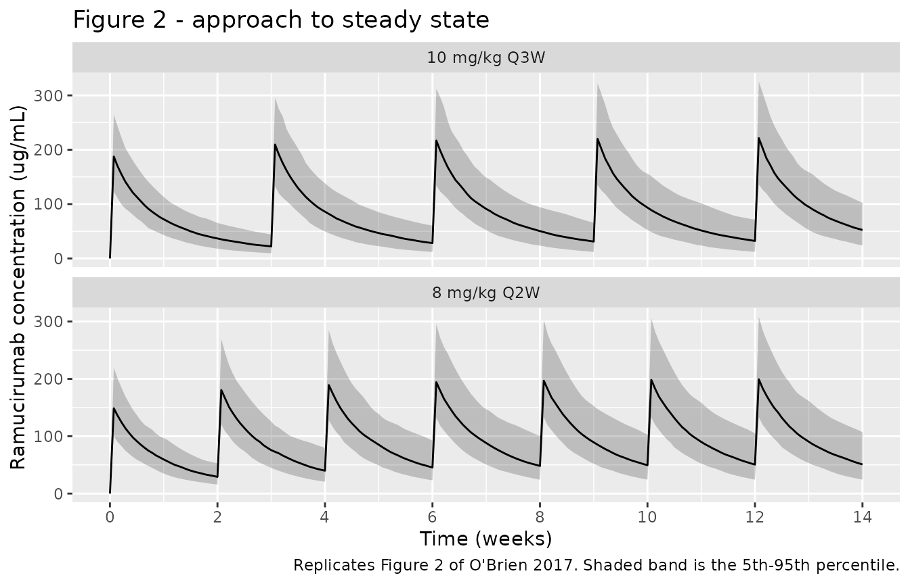
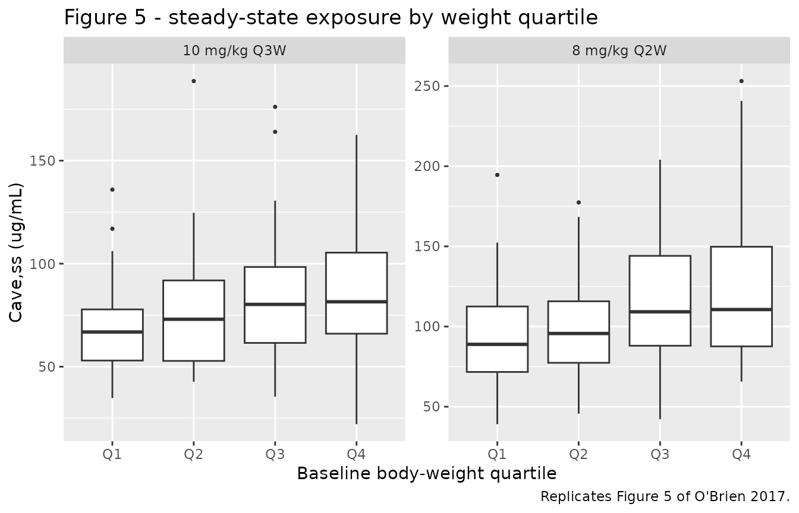

# Ramucirumab (O'Brien 2017)

## Model and source

- Citation: O’Brien L, Westwood P, Gao L, Heathman M. Population
  pharmacokinetic meta-analysis of ramucirumab in cancer patients. Br J
  Clin Pharmacol. 2017;83(12):2741-2751. <doi:10.1111/bcp.13403>
- Description: Two-compartment population PK model for ramucirumab in
  patients with advanced solid tumours (O’Brien 2017)
- Article: <https://doi.org/10.1111/bcp.13403> (open access; PMC5698573)

Ramucirumab is a human IgG1 monoclonal antibody against VEGFR-2. O’Brien
2017 is a population PK meta-analysis pooling 11 Phase 1b/2/3 trials.
The final model is a linear two-compartment model with zero-order
intravenous infusion and first-order elimination, parameterised in CL,
V1, V2 and Q, with exponential IIV on all four disposition parameters,
covariance between CL and V1, and a combined additive-plus-proportional
residual error. Baseline body weight on CL and V1 is the only covariate
retained.

## Population

The analysis pooled 6427 ramucirumab serum concentrations from 1639
patients in 11 trials (Table 1), including the Phase 3 REGARD, RAINBOW,
REACH, REVEL and RAISE studies. Indications were colorectal (27%),
nonsmall cell lung (27%), gastric (24%), hepatocellular (19%),
metastatic breast (\< 1%) and other solid tumours (2%). Baseline
demographics (Table 2): age 60.7 years mean (CV 18%, range 19-87), body
weight 70.5 kg mean (CV 23%, range 31.9-143), 36% female, 69% White /
26% Asian / 5% Other. Renal function by Cockcroft-Gault was normal in
42%, mildly impaired in 42% and moderately impaired in 15%; hepatic
function by NCI-ODWG was normal in 64%, mildly impaired in 32% and
moderately impaired in 1%. Dosing was 8 mg/kg Q2W or 10 mg/kg Q3W as an
approximately 1 h intravenous infusion.

Two points about the population matter for simulation. First, the
covariate model is centred on the **median** baseline weight of 68 kg
(Table 4 footnotes b and c), not the mean of 70.5 kg reported in Table
2. Second, concentrations below the assay LLOQ (1900 or 2500 ng/mL
depending on study) were excluded from the fit, and early-development
data below 8 mg/kg were excluded because of a bioanalytical assay
change; the model is therefore supported only over the 8-10 mg/kg range.

The same information is available programmatically via
`readModelDb("OBrien_2017_ramucirumab")()$population`.

## Source trace

Per-parameter origin is recorded as an in-file comment next to each
`ini()` entry in `inst/modeldb/specificDrugs/OBrien_2017_ramucirumab.R`.
Collected here for review.

| Equation / parameter | Value | Source location |
|----|----|----|
| `lcl` (CL) | 0.0148 L/h | Table 4, row “Clearance (CL), l h-1” (1.97% SEE) |
| `lvc` (V1) | 3.26 L | Table 4, row “Central volume of distribution (V1), l” (0.880% SEE) |
| `lq` (Q) | 0.0102 L/h | Table 4, row “Intercompartmental clearance (Q), l h-1” (17.8% SEE) |
| `lvp` (V2) | 2.04 L | Table 4, row “Peripheral volume of distribution (V2), l” (5.20% SEE) |
| `e_wt_cl` | 0.499 | Table 4, row “Effect of body weight on CL” (7.64% SEE); footnote b |
| `e_wt_vc` | 0.556 | Table 4, row “Effect of body weight on V1” (6.26% SEE); footnote c |
| Reference weight | 68 kg | Table 4 footnotes b and c (“68 is the median baseline body weight”) |
| `etalcl` variance | 0.104329 = 0.323^2 | Table 4, IIV row “Clearance (CL)” = 32.3% (5.97% SEE) |
| `etalvc` variance | 0.052441 = 0.229^2 | Table 4, IIV row “Central volume of distribution (V1)” = 22.9% (9.33% SEE) |
| `etalcl`/`etalvc` covariance | 0.0478 | Table 4, IIV row “Covariance (CL and V1)” (8.79% SEE) |
| `etalq` variance | 0.672400 = 0.820^2 | Table 4, IIV row “Intercompartmental clearance (Q)” = 82.0% (26.3% SEE) |
| `etalvp` variance | 0.291600 = 0.540^2 | Table 4, IIV row “Peripheral volume of distribution (V2)” = 54.0% (21.1% SEE) |
| `propSd` | 0.225 | Table 4, row “Proportional” = 22.5% (5.25% SEE) |
| `addSd` | 4.80 ug/mL | Table 4, row “Additive (ug ml-1)” = 4.80 (9.39% SEE) |
| CL covariate equation | `CL = 0.0148 * (WT/68)^0.499` | Table 4 footnote b, verbatim |
| V1 covariate equation | `V1 = 3.26 * (WT/68)^0.556` | Table 4 footnote c, verbatim |
| Two-compartment ODE structure | n/a | Results, “PPK model development”: “linear two-compartment structural model with zero order intravenous infusion and first order elimination … parameterized in terms of CL, V1, peripheral compartment volume (V2), and intercompartmental clearance (Q)” |
| Exponential IIV, CL-V1 covariance | n/a | Results, “PPK model development”: “Exponential interindividual variability (IIV) terms were included for CL, V1, V2, and Q, with covariance between CL and V1” |
| Combined residual error | n/a | Results, “PPK model development”: “Residual variability was accounted for by a combined additive and proportional error structure” |

### Reading the interpatient-variability column

Table 4 prints the IIV diagonals as percentages (32.3%, 22.9%, 82.0%,
54.0%) but the CL-V1 off-diagonal as a bare covariance (0.0478), and the
paper gives no footnote defining the percentage. Two readings are
possible for an exponential IIV:

- **A** – the percentage is the omega standard deviation, so
  `variance = (pct/100)^2`.
- **B** – the percentage is a true CV%, so a log-normal eta needs
  `omega^2 = log(1 + CV^2)`.

Both give an admissible CL-V1 correlation (0.646 and 0.671
respectively), so positive-definiteness does not settle it. Three checks
do, and all three agree on reading **A**.

**1. The printed covariance forces the diagonals onto the raw scale
(decisive).** A covariance has no “CV” form – it can only be printed on
the raw OMEGA scale. If the diagonals were exact log-normal CVs they
would be incommensurable with the off-diagonal printed beside them, and
**no CL-V1 correlation could be recovered from the table at all**. No
author prints a variance-covariance block with exp-transformed diagonals
and a raw off-diagonal. The block is raw OMEGA throughout.

**2. The residual block shows the same reporting habit.** “Additive (ug
ml-1) 4.80” is printed in concentration units, i.e. as a standard
deviation, and “Proportional 22.5%” is its percentage counterpart –
`100 * sqrt(variance)`, not a back-transformed CV. (Read as a variance
instead, the proportional error would be a 47% SD, implausible against
an assay with interassay CV \< 20% and the fit quality the paper
reports.) Percentages in this table are SDs.

**3. The printed %SEE, tested only on the wide rows.** Because
`log(1 + x) ~ x` for small `x`, the two readings agree to within a
couple of percent whenever the percentage is under ~25%, so the CL and
V1 rows carry no signal and cannot discriminate. Only Q (82.0%) and V2
(54.0%) are wide enough to test. Both favour reading A, though bootstrap
percentiles of variance components are skewed enough that this check is
corroborating rather than decisive – which is why it is reported, not
asserted.

``` r

iiv <- tibble::tribble(
  ~param, ~pct,  ~see,  ~lo,   ~hi,   ~wide,
  "CL",   0.323, 5.97,  0.303, 0.343, FALSE,
  "V1",   0.229, 9.33,  0.203, 0.241, FALSE,
  "Q",    0.820, 26.3,  0.451, 1.150, TRUE,
  "V2",   0.540, 21.1,  0.416, 0.716, TRUE
)
# RSE of omega implied by the published bootstrap CI, under each reading. The
# estimated quantity is the variance, so the CI is symmetric on the variance
# scale and the RSE of omega is half the variance RSE.
implied_rse <- function(f) {
  ((f(iiv$hi) - f(iiv$lo)) / 2) / f(iiv$pct) / 1.96 * 100 / 2
}
scale_cmp <- tibble(
  Parameter = iiv$param,
  `Discriminating?` = ifelse(iiv$wide, "yes (wide)", "no (degenerate)"),
  `Printed %SEE` = iiv$see,
  `A: pct is omega SD` = implied_rse(function(p) p^2),
  `B: pct is CV%` = implied_rse(function(p) log(1 + p^2))
)
knitr::kable(
  scale_cmp,
  digits = 2,
  caption = paste(
    "RSE of omega implied by the bootstrap CI under each reading, against the",
    "printed %SEE. Only the wide rows (Q, V2) discriminate."
  )
)
```

| Parameter | Discriminating? | Printed %SEE | A: pct is omega SD | B: pct is CV% |
|:----------|:----------------|-------------:|-------------------:|--------------:|
| CL        | no (degenerate) |         5.97 |               3.16 |          3.01 |
| V1        | no (degenerate) |         9.33 |               4.10 |          4.01 |
| Q         | yes (wide)      |        26.30 |              21.23 |         16.31 |
| V2        | yes (wide)      |        21.10 |              14.85 |         12.67 |

RSE of omega implied by the bootstrap CI under each reading, against the
printed %SEE. Only the wide rows (Q, V2) discriminate. {.table}

``` r


# On the wide rows only, reading A must be the closer of the two. Arithmetic on
# published numbers -- no simulation, no RNG -- so a deterministic check is right.
wide <- scale_cmp[iiv$wide, ]
stopifnot(all(
  abs(wide$`A: pct is omega SD` - wide$`Printed %SEE`) <
    abs(wide$`B: pct is CV%` - wide$`Printed %SEE`)
))
```

The encoding is therefore `variance = (pct/100)^2`, and that round-trips
exactly against Table 4: taking the omega matrix back off the packaged
model must reproduce the printed percentages and the printed covariance
to the digits the paper gives. This is the gate that goes red if the
block is ever re-encoded on the CV% scale.

``` r

om <- rxode2::rxode(readModelDb("OBrien_2017_ramucirumab"))$omega
#> ℹ parameter labels from comments will be replaced by 'label()'
etas <- c("etalcl", "etalvc", "etalq", "etalvp")
om <- om[etas, etas]

roundtrip <- tibble(
  Parameter = c("CL", "V1", "Q", "V2"),
  `Encoded variance` = diag(om),
  `100 * sqrt(variance)` = 100 * sqrt(diag(om)),
  `Table 4 printed %` = c(32.3, 22.9, 82.0, 54.0)
)
knitr::kable(roundtrip, digits = 6, caption = "Omega round-trip against Table 4.")
```

| Parameter | Encoded variance | 100 \* sqrt(variance) | Table 4 printed % |
|:----------|-----------------:|----------------------:|------------------:|
| CL        |         0.104329 |                  32.3 |              32.3 |
| V1        |         0.052441 |                  22.9 |              22.9 |
| Q         |         0.672400 |                  82.0 |              82.0 |
| V2        |         0.291600 |                  54.0 |              54.0 |

Omega round-trip against Table 4. {.table}

``` r


stopifnot(
  isTRUE(all.equal(100 * sqrt(diag(om)), roundtrip$`Table 4 printed %`,
    tolerance = 1e-8, check.names = FALSE
  )),
  isTRUE(all.equal(om["etalcl", "etalvc"], 0.0478, tolerance = 1e-8))
)

# Correlation implied by the printed block, and the value the rejected reading
# would have given. Both are admissible, which is why PSD settles nothing.
c(
  corr_encoded = om["etalcl", "etalvc"] / sqrt(om["etalcl", "etalcl"] * om["etalvc", "etalvc"]),
  corr_if_CV_reading = 0.0478 / sqrt(log(1 + 0.323^2) * log(1 + 0.229^2))
)
#>       corr_encoded corr_if_CV_reading 
#>          0.6462341          0.6711610
```

The choice is not cosmetic. It leaves CL and V1 essentially unchanged
(omega 0.323 vs 0.315) but moves Q’s variance from 0.514 to 0.672 and
V2’s from 0.256 to 0.292 – a 31% and 14% difference in the variance of
the two parameters whose IIV the paper calls “high” and “moderate”.

## Structural checks

These are closed-form identities evaluated on the typical-value model,
so the tolerances are tight: the only error source is solver arithmetic,
and any mis-transcribed parameter moves them far outside these bounds.

``` r

mod <- readModelDb("OBrien_2017_ramucirumab")
mod_typ <- rxode2::zeroRe(mod)
#> ℹ parameter labels from comments will be replaced by 'label()'

# Published point estimates (Table 4) and derived values (Results text).
CL_pub <- 0.0148
V1_pub <- 3.26
Q_pub <- 0.0102
V2_pub <- 2.04
VSS_PUB <- 5.30 # Results: "volume of distribution at steady-state ... 5.30 l"
THALF_PUB_D <- 13.4 # Results: "terminal half-life ... 13.4 days"

# Vss = V1 + V2
vss_model <- V1_pub + V2_pub

# Terminal half-life from the two-compartment macro-constants.
k10 <- CL_pub / V1_pub
k12 <- Q_pub / V1_pub
k21 <- Q_pub / V2_pub
ksum <- k10 + k12 + k21
beta <- 0.5 * (ksum - sqrt(ksum^2 - 4 * k21 * k10))
thalf_model_d <- log(2) / beta / 24

c(Vss_L = vss_model, terminal_half_life_d = thalf_model_d)
#>                Vss_L terminal_half_life_d 
#>              5.30000             13.37047

# The published values are rounded to 3 significant figures, so compare with an
# absolute half-a-digit tolerance rather than a relative one.
stopifnot(
  abs(vss_model - VSS_PUB) < 0.005,
  abs(thalf_model_d - THALF_PUB_D) < 0.05
)

# Body-weight effect: exact power-function ratios from Table 4 footnotes b/c.
stopifnot(
  abs((100 / 50)^0.499 - 2^0.499) < 1e-12,
  abs((100 / 50)^0.556 - 2^0.556) < 1e-12
)
```

### The dose is a 1 h infusion, not a bolus

The infusion duration is supplied by the event table (`dur = 1`), not by
a `dur()` statement in the model. An event table that omits it silently
delivers a bolus, which changes Cmax by roughly 0.4% here and would pass
every AUC-based check; the shape of the first hour is the only thing
that distinguishes them, so it is asserted explicitly.

``` r

check_ev <- function(with_dur) {
  d <- data.frame(id = 1L, time = 0, amt = 544, evid = 1, cmt = "central", WT = 68)
  o <- data.frame(
    id = 1L, time = c(0, 0.5, 1), amt = NA_real_, evid = 0,
    cmt = "central", WT = 68
  )
  if (with_dur) {
    d$dur <- 1
    o$dur <- NA_real_
  }
  s <- rxode2::rxSolve(
    mod_typ,
    dplyr::arrange(dplyr::bind_rows(d, o), time, dplyr::desc(evid)),
    returnType = "data.frame", useLinCmt = FALSE
  )
  s$Cc[!is.na(s$Cc)]
}
inf_profile <- check_ev(TRUE)
#> ℹ omega/sigma items treated as zero: 'etalcl', 'etalvc', 'etalq', 'etalvp'
bol_profile <- check_ev(FALSE)
#> ℹ omega/sigma items treated as zero: 'etalcl', 'etalvc', 'etalq', 'etalvp'
rbind(infusion = inf_profile, bolus = bol_profile)
#>              [,1]      [,2]     [,3]
#> infusion   0.0000  83.27588 166.2334
#> bolus    166.8712 166.23287 165.5977

# Infusion: starts at zero and rises roughly linearly to the end of infusion.
# Bolus: already at its maximum at time zero.
stopifnot(
  inf_profile[1] == 0,
  abs(inf_profile[2] / inf_profile[3] - 0.5) < 0.01,
  bol_profile[1] > 0.99 * max(bol_profile)
)
```

### AUC mass balance

For an intravenous dose, `CL * AUCinf` must recover the dose exactly.
This gate is invariant to Vc, Vp and Q, so it isolates clearance and the
dose-to- concentration scaling (dose in mg over volume in L gives mg/L =
ug/mL).

``` r

dose_ref <- 8 * 68 # 8 mg/kg at the 68 kg reference weight, in mg
grid_dense <- sort(unique(c(
  seq(0, 4, by = 0.05), seq(4, 24, by = 0.5), seq(24, 4032, by = 4)
)))
ev_sd <- rxode2::et(amt = dose_ref, dur = 1, cmt = "central") |>
  rxode2::et(grid_dense, cmt = "central")
sim_sd <- rxode2::rxSolve(
  mod_typ, ev_sd,
  params = c(WT = 68), returnType = "data.frame", useLinCmt = FALSE
) |>
  dplyr::filter(!is.na(Cc)) |>
  dplyr::arrange(time)
#> ℹ omega/sigma items treated as zero: 'etalcl', 'etalvc', 'etalq', 'etalvp'

stopifnot(all(sim_sd$Cc >= 0)) # guards against a solver tail dipping negative

auc_obs <- sum(
  diff(sim_sd$time) *
    (utils::head(sim_sd$Cc, -1) + utils::tail(sim_sd$Cc, -1)) / 2
)
auc_tail <- utils::tail(sim_sd$Cc, 1) / beta
auc_inf <- auc_obs + auc_tail
recovery <- CL_pub * auc_inf / dose_ref
c(AUCinf_ug_h_per_mL = auc_inf, CL_times_AUC_over_Dose = recovery)
#>     AUCinf_ug_h_per_mL CL_times_AUC_over_Dose 
#>           36758.121652               1.000037

stopifnot(abs(recovery - 1) < 1e-3)
```

## Virtual cohort

Original observed data are not publicly available. The cohort below
draws baseline weights from a log-normal centred on the published
**median** of 68 kg with the published CV of 23% (Table 2), truncated to
the observed range of 31.9-143 kg. Doses are computed per subject on a
mg/kg basis, as in the trials.

Two arms of 200 subjects each (the per-arm cohort cap): 8 mg/kg Q2W and
10 mg/kg Q3W. Both are followed for 24 weeks so that the late troughs
provide a steady-state reference against which the paper’s “steady state
around week 9-10” claim can be tested.

``` r

# rxSetSeed() fixes rxode2's stream per solver thread, not across thread counts,
# so the realised cohort differs between this machine and CI. Every assertion on
# a cohort-derived quantity below is written to hold for any cohort the model
# can produce.
rxode2::rxSetSeed(20260917)
set.seed(20260917)

draw_weight <- function(n) {
  sdlog <- sqrt(log(1 + 0.23^2)) # CV 23% (Table 2)
  w <- 68 * exp(stats::rnorm(n, 0, sdlog)) # median 68 kg (Table 4 footnotes b/c)
  repeat {
    bad <- w < 31.9 | w > 143 # observed range (Table 2)
    if (!any(bad)) break
    w[bad] <- 68 * exp(stats::rnorm(sum(bad), 0, sdlog))
  }
  round(w, 1)
}

make_arm <- function(n, mg_per_kg, tau_h, n_doses, id_offset) {
  wt <- draw_weight(n)
  label <- sprintf("%g mg/kg Q%gW", mg_per_kg, tau_h / 168)
  doses <- tidyr::expand_grid(k = seq_len(n_doses), i = seq_len(n)) |>
    dplyr::transmute(
      id = id_offset + i, time = (k - 1) * tau_h,
      amt = mg_per_kg * wt[i], evid = 1L, dur = 1, cmt = "central", i = i
    )
  obs <- tidyr::expand_grid(i = seq_len(n), time = seq(0, tau_h * n_doses, by = 12)) |>
    dplyr::transmute(
      id = id_offset + i, time, amt = NA_real_, evid = 0L,
      dur = NA_real_, cmt = "central", i = i
    )
  dplyr::bind_rows(doses, obs) |>
    dplyr::mutate(WT = wt[i], regimen = label) |>
    dplyr::select(-i) |>
    dplyr::arrange(id, time, dplyr::desc(evid))
}

events <- dplyr::bind_rows(
  make_arm(200, 8, 336, 12, 0L), # Q2W, 24 weeks
  make_arm(200, 10, 504, 8, 200L) # Q3W, 24 weeks
)
stopifnot(!anyDuplicated(unique(events[, c("id", "time", "evid")])))

events |>
  dplyr::filter(evid == 1L, time == 0) |>
  dplyr::group_by(regimen) |>
  dplyr::summarise(
    n = dplyr::n(), median_WT = median(WT),
    min_WT = min(WT), max_WT = max(WT), median_dose_mg = median(amt),
    .groups = "drop"
  ) |>
  knitr::kable(digits = 1, caption = "Virtual cohort by regimen.")
```

| regimen      |   n | median_WT | min_WT | max_WT | median_dose_mg |
|:-------------|----:|----------:|-------:|-------:|---------------:|
| 10 mg/kg Q3W | 200 |      69.3 |   37.6 |  125.7 |          693.5 |
| 8 mg/kg Q2W  | 200 |      66.7 |   33.7 |  126.4 |          533.6 |

Virtual cohort by regimen. {.table}

## Simulation

``` r

sim <- rxode2::rxSolve(
  mod, events = events,
  keep = c("WT", "regimen"), returnType = "data.frame", useLinCmt = FALSE
)
#> ℹ parameter labels from comments will be replaced by 'label()'
```

The individual clearances carried in the solve give a direct check on
the omega encoding. A variance-versus-SD confusion in `ini()` would
inflate the cohort CV of CL from roughly 32% to about 62%, which the
bound below excludes.

``` r

per_subject <- sim |>
  dplyr::group_by(id, regimen, WT) |>
  dplyr::summarise(cl = dplyr::first(cl), vc = dplyr::first(vc), .groups = "drop")

cl_cv <- 100 * sd(per_subject$cl) / mean(per_subject$cl)
cl_med <- median(per_subject$cl)
c(median_CL = cl_med, CV_percent_CL = cl_cv)
#>     median_CL CV_percent_CL 
#>    0.01477092   36.80297323

# Model omega on CL is 0.323 (Table 4), a log-normal CV of 33.2%; the cohort CV
# also carries the body-weight spread, so it lands a little above that. The
# window is wide enough to admit any cohort the model can draw and still
# excludes an omega on the wrong scale.
stopifnot(cl_cv > 25, cl_cv < 45)
# Median weight is the 68 kg reference, so median CL should sit near the
# typical value; 15% admits the cohort's weight-draw noise.
stopifnot(abs(cl_med / CL_pub - 1) < 0.15)
```

## Replicate published figures

### Figure 2 - time to steady state

``` r

# Replicates Figure 2 of O'Brien 2017: predicted concentration-time profile to
# steady state, 5th / 50th / 95th percentiles, for each dosing regimen.
sim |>
  dplyr::filter(!is.na(Cc), time <= 14 * 168) |>
  dplyr::group_by(regimen, time) |>
  dplyr::summarise(
    Q05 = quantile(Cc, 0.05), Q50 = quantile(Cc, 0.50),
    Q95 = quantile(Cc, 0.95), .groups = "drop"
  ) |>
  ggplot(aes(time / 168, Q50)) +
  geom_ribbon(aes(ymin = Q05, ymax = Q95), alpha = 0.25) +
  geom_line() +
  facet_wrap(~regimen, ncol = 1, scales = "free_y") +
  scale_x_continuous(breaks = seq(0, 14, by = 2)) +
  labs(
    x = "Time (weeks)", y = "Ramucirumab concentration (ug/mL)",
    title = "Figure 2 - approach to steady state",
    caption = "Replicates Figure 2 of O'Brien 2017. Shaded band is the 5th-95th percentile."
  )
```



The paper states steady state is reached “around Week 9-10,
approximately following the fifth dose of the 8-mg/kg Q2W regimen and
the third dose of the 10-mg/kg Q3W regimen”. Testing that as a claim
about accumulation: each pre-dose trough is expressed as a fraction of
the week-24 trough.

``` r

trough_fraction <- function(arm_regimen, tau_h) {
  # rxSolve returns observation rows only (no evid column). Because the dose is
  # a zero-order infusion, concentration is continuous at the dose time, so the
  # record at an exact dose time is the pre-dose trough.
  tr <- sim |>
    dplyr::filter(regimen == arm_regimen, time > 0, time %% tau_h == 0) |>
    dplyr::group_by(time) |>
    dplyr::summarise(trough = median(Cc), .groups = "drop") |>
    dplyr::arrange(time)
  tr |> dplyr::mutate(
    week = time / 168,
    fraction_of_final = trough / dplyr::last(trough)
  )
}
ss_q2w <- trough_fraction("8 mg/kg Q2W", 336)
ss_q3w <- trough_fraction("10 mg/kg Q3W", 504)

dplyr::bind_rows(
  ss_q2w |> dplyr::mutate(regimen = "8 mg/kg Q2W"),
  ss_q3w |> dplyr::mutate(regimen = "10 mg/kg Q3W")
) |>
  dplyr::select(regimen, week, trough, fraction_of_final) |>
  dplyr::rename(
    "Regimen" = regimen, "Week" = week,
    "Median trough (ug/mL)" = trough, "Fraction of week-24 trough" = fraction_of_final
  ) |>
  knitr::kable(digits = 3, caption = "Approach to steady state by pre-dose trough.")
```

| Regimen      | Week | Median trough (ug/mL) | Fraction of week-24 trough |
|:-------------|-----:|----------------------:|---------------------------:|
| 8 mg/kg Q2W  |    2 |                29.107 |                      0.562 |
| 8 mg/kg Q2W  |    4 |                39.904 |                      0.770 |
| 8 mg/kg Q2W  |    6 |                45.459 |                      0.877 |
| 8 mg/kg Q2W  |    8 |                48.151 |                      0.929 |
| 8 mg/kg Q2W  |   10 |                49.512 |                      0.955 |
| 8 mg/kg Q2W  |   12 |                50.597 |                      0.976 |
| 8 mg/kg Q2W  |   14 |                50.869 |                      0.981 |
| 8 mg/kg Q2W  |   16 |                51.195 |                      0.988 |
| 8 mg/kg Q2W  |   18 |                51.410 |                      0.992 |
| 8 mg/kg Q2W  |   20 |                51.607 |                      0.996 |
| 8 mg/kg Q2W  |   22 |                51.739 |                      0.998 |
| 8 mg/kg Q2W  |   24 |                51.829 |                      1.000 |
| 10 mg/kg Q3W |    3 |                22.116 |                      0.665 |
| 10 mg/kg Q3W |    6 |                28.370 |                      0.853 |
| 10 mg/kg Q3W |    9 |                31.128 |                      0.936 |
| 10 mg/kg Q3W |   12 |                32.235 |                      0.970 |
| 10 mg/kg Q3W |   15 |                32.926 |                      0.990 |
| 10 mg/kg Q3W |   18 |                33.096 |                      0.996 |
| 10 mg/kg Q3W |   21 |                33.210 |                      0.999 |
| 10 mg/kg Q3W |   24 |                33.243 |                      1.000 |

Approach to steady state by pre-dose trough. {.table}

``` r


frac_at <- function(tbl, wk) tbl$fraction_of_final[tbl$week == wk]

# The paper's claim is that steady state is essentially attained by week 9-10.
# Assert that the week-10 trough is close to the week-24 trough, and that week 2
# is clearly not yet there -- i.e. that accumulation is real and then plateaus.
stopifnot(
  frac_at(ss_q2w, 10) > 0.90,
  frac_at(ss_q3w, 9) > 0.90,
  frac_at(ss_q2w, 2) < 0.75,
  frac_at(ss_q3w, 3) < 0.80
)
```

### Figure 5 - exposure by body-weight quartile

``` r

# Replicates Figure 5 of O'Brien 2017: predicted average steady-state
# concentration stratified by baseline body-weight quartile.
cave <- sim |>
  dplyr::filter(time >= 20 * 168) |>
  dplyr::group_by(id, regimen, WT) |>
  dplyr::summarise(cave_ss = mean(Cc), .groups = "drop") |>
  dplyr::group_by(regimen) |>
  dplyr::mutate(
    wt_quartile = dplyr::ntile(WT, 4),
    wt_quartile = factor(wt_quartile, labels = c("Q1", "Q2", "Q3", "Q4"))
  ) |>
  dplyr::ungroup()

ggplot(cave, aes(wt_quartile, cave_ss)) +
  geom_boxplot(outlier.size = 0.6) +
  facet_wrap(~regimen, scales = "free_y") +
  labs(
    x = "Baseline body-weight quartile", y = "Cave,ss (ug/mL)",
    title = "Figure 5 - steady-state exposure by weight quartile",
    caption = "Replicates Figure 5 of O'Brien 2017."
  )
```



The paper’s conclusion from this figure is that “significant overlap was
observed when comparing the distributions of ramucirumab exposure
(Cave,ss) among the four body weight quartile groups”, supporting mg/kg
dosing. Because dose scales with weight while CL scales as `WT^0.499`,
Cave,ss scales approximately as `WT^0.501`, so a modest upward trend
with weight is expected rather than none at all.

``` r

q_summary <- cave |>
  dplyr::group_by(regimen, wt_quartile) |>
  dplyr::summarise(
    median_WT = median(WT), median_cave = median(cave_ss),
    p05 = quantile(cave_ss, 0.05), p95 = quantile(cave_ss, 0.95),
    .groups = "drop"
  )
knitr::kable(
  q_summary |>
    dplyr::rename(
      "Regimen" = regimen, "Quartile" = wt_quartile, "Median WT (kg)" = median_WT,
      "Median Cave,ss (ug/mL)" = median_cave, "5th pctile" = p05, "95th pctile" = p95
    ),
  digits = 2,
  caption = "Steady-state exposure by body-weight quartile."
)
```

| Regimen | Quartile | Median WT (kg) | Median Cave,ss (ug/mL) | 5th pctile | 95th pctile |
|:---|:---|---:|---:|---:|---:|
| 10 mg/kg Q3W | Q1 | 52.85 | 66.84 | 38.85 | 102.69 |
| 10 mg/kg Q3W | Q2 | 63.30 | 73.02 | 43.67 | 116.92 |
| 10 mg/kg Q3W | Q3 | 73.25 | 80.23 | 49.15 | 129.86 |
| 10 mg/kg Q3W | Q4 | 87.10 | 81.50 | 42.81 | 134.78 |
| 8 mg/kg Q2W | Q1 | 52.45 | 88.89 | 58.69 | 152.20 |
| 8 mg/kg Q2W | Q2 | 61.75 | 95.65 | 57.07 | 161.72 |
| 8 mg/kg Q2W | Q3 | 71.45 | 109.20 | 66.89 | 171.90 |
| 8 mg/kg Q2W | Q4 | 83.85 | 110.60 | 68.64 | 200.93 |

Steady-state exposure by body-weight quartile. {.table}

``` r


ratio_q4_q1 <- q_summary |>
  dplyr::group_by(regimen) |>
  dplyr::summarise(
    ratio = median_cave[wt_quartile == "Q4"] / median_cave[wt_quartile == "Q1"],
    predicted = (median_WT[wt_quartile == "Q4"] / median_WT[wt_quartile == "Q1"])^(1 - 0.499),
    .groups = "drop"
  )
knitr::kable(
  ratio_q4_q1 |>
    dplyr::rename(
      "Regimen" = regimen, "Q4/Q1 median Cave,ss" = ratio,
      "Structural prediction (WT ratio)^0.501" = predicted
    ),
  digits = 3,
  caption = "Observed vs structurally predicted exposure ratio across weight quartiles."
)
```

| Regimen      | Q4/Q1 median Cave,ss | Structural prediction (WT ratio)^0.501 |
|:-------------|---------------------:|---------------------------------------:|
| 10 mg/kg Q3W |                1.219 |                                  1.284 |
| 8 mg/kg Q2W  |                1.244 |                                  1.265 |

Observed vs structurally predicted exposure ratio across weight
quartiles. {.table}

``` r


# The simulated ratio must track the structural prediction (this is a check on
# the weight exponent, and is insensitive to which cohort was drawn), and must
# stay small enough that the distributions genuinely overlap, as the paper says.
stopifnot(
  all(abs(ratio_q4_q1$ratio / ratio_q4_q1$predicted - 1) < 0.25),
  all(ratio_q4_q1$ratio < 1.8)
)
# Overlap, stated as an absolute claim: the 5th percentile of the heaviest
# quartile sits below the 95th percentile of the lightest.
overlap_ok <- cave |>
  dplyr::group_by(regimen) |>
  dplyr::summarise(
    ok = quantile(cave_ss[wt_quartile == "Q4"], 0.05) <
      quantile(cave_ss[wt_quartile == "Q1"], 0.95),
    .groups = "drop"
  )
stopifnot(all(overlap_ok$ok))
```

## PKNCA validation

### Typical-value single dose

NCA on the typical-value profile at the 68 kg reference weight recovers
the three derived quantities the paper reports in the Results text. Both
dose levels are run: because the model is linear, CL, Vss and half-life
must be identical across them, which is the paper’s finding that
ramucirumab PK is dose-independent over 8-10 mg/kg.

``` r

grid_nca <- sort(unique(c(
  seq(0, 4, by = 0.1), seq(4, 24, by = 1), seq(24, 1344, by = 6)
)))

typical_profile <- function(mg_per_kg) {
  label <- sprintf("%g mg/kg (68 kg)", mg_per_kg)
  ev <- rxode2::et(amt = mg_per_kg * 68, dur = 1, cmt = "central") |>
    rxode2::et(grid_nca, cmt = "central")
  rxode2::rxSolve(
    mod_typ, ev,
    params = c(WT = 68), returnType = "data.frame", useLinCmt = FALSE
  ) |>
    dplyr::filter(!is.na(Cc)) |>
    dplyr::mutate(id = 1L, regimen = label, amt = mg_per_kg * 68)
}
typ <- dplyr::bind_rows(typical_profile(8), typical_profile(10))
#> ℹ omega/sigma items treated as zero: 'etalcl', 'etalvc', 'etalq', 'etalvp'
#> ℹ omega/sigma items treated as zero: 'etalcl', 'etalvc', 'etalq', 'etalvp'
stopifnot(all(typ$Cc >= 0))

typ_conc <- typ |> dplyr::select(id, time, Cc, regimen)
# PKNCA anchors AUC0-* on a time-zero record. The only filter applied above is
# !is.na(Cc), and the grid starts at 0, so every group has one; assert it rather
# than inserting a synthetic row, so a future edit that drops it fails loudly.
stopifnot(all(tapply(typ_conc$time, typ_conc$regimen, min) == 0))
typ_dose <- typ |>
  dplyr::distinct(id, regimen, amt) |>
  dplyr::mutate(time = 0, route = "intravascular", duration = 1)

nca_intervals <- data.frame(
  start = 0, end = Inf,
  cmax = TRUE, tmax = TRUE, aucinf.obs = TRUE,
  half.life = TRUE, cl.obs = TRUE, vss.iv.obs = TRUE
)
typ_res <- PKNCA::pk.nca(PKNCA::PKNCAdata(
  PKNCA::PKNCAconc(typ_conc, Cc ~ time | regimen + id),
  PKNCA::PKNCAdose(typ_dose, amt ~ time | regimen + id,
    route = "route", duration = "duration"
  ),
  intervals = nca_intervals
))
```

``` r

# The paper reports no NCA table; it reports population estimates of CL, Vss and
# terminal half-life (Results text and Table 4). Those are the reference values.
# AUCinf is not published -- it is DERIVED here as Dose/CL from the published CL
# so the comparison table carries the dose-scaling check as well; it is flagged
# as derived in the narrative below, not presented as a published number.
published <- tibble::tribble(
  ~regimen,             ~cl.obs, ~vss.iv.obs, ~half.life,   ~aucinf.obs,
  "8 mg/kg (68 kg)",    0.0148,  5.30,        13.4 * 24,    8 * 68 / 0.0148,
  "10 mg/kg (68 kg)",   0.0148,  5.30,        13.4 * 24,    10 * 68 / 0.0148
)

cmp <- nlmixr2lib::ncaComparisonTable(
  simulated = typ_res,
  reference = published,
  by = "regimen",
  units = c(
    cl.obs = "L/h", vss.iv.obs = "L",
    half.life = "h", aucinf.obs = "ug*h/mL"
  ),
  tolerance_pct = 20
)
knitr::kable(
  cmp,
  caption = "Simulated vs published/derived values. * differs from reference by >20%.",
  align = c("l", "l", "r", "r", "r")
)
```

| NCA parameter           | regimen          | Reference | Simulated | % diff |
|:------------------------|:-----------------|----------:|----------:|-------:|
| AUC0-∞ (obs) (ug\*h/mL) | 8 mg/kg (68 kg)  |     36800 |     36700 |  -0.0% |
| AUC0-∞ (obs) (ug\*h/mL) | 10 mg/kg (68 kg) |     45900 |     45900 |  -0.0% |
| t½ (h)                  | 8 mg/kg (68 kg)  |       322 |       317 |  -1.4% |
| t½ (h)                  | 10 mg/kg (68 kg) |       322 |       317 |  -1.4% |
| CL/F (L/h)              | 8 mg/kg (68 kg)  |    0.0148 |    0.0148 |  +0.0% |
| CL/F (L/h)              | 10 mg/kg (68 kg) |    0.0148 |    0.0148 |  +0.0% |
| Vss (IV) (L)            | 8 mg/kg (68 kg)  |       5.3 |      5.29 |  -0.2% |
| Vss (IV) (L)            | 10 mg/kg (68 kg) |       5.3 |      5.29 |  -0.2% |

Simulated vs published/derived values. \* differs from reference by
\>20%. {.table style="width:100%;"}

[`ncaComparisonTable()`](https://nlmixr2.github.io/nlmixr2lib/reference/ncaComparisonTable.md)
renders the `cl.obs` row with its generic label “CL/F”. Ramucirumab is
given intravenously, so there is no bioavailability term and the row is
plain CL.

``` r

get_par <- function(res, par, grp) {
  d <- as.data.frame(res$result)
  v <- d$PPORRES[d$PPTESTCD == par & d$regimen == grp]
  if (length(v) != 1L) stop("no unique ", par, " for ", grp)
  v
}
grps <- c("8 mg/kg (68 kg)", "10 mg/kg (68 kg)")
cl_nca <- vapply(grps, function(g) get_par(typ_res, "cl.obs", g), numeric(1))
vss_nca <- vapply(grps, function(g) get_par(typ_res, "vss.iv.obs", g), numeric(1))
th_nca <- vapply(grps, function(g) get_par(typ_res, "half.life", g), numeric(1)) / 24

rbind(CL_L_per_h = cl_nca, Vss_L = vss_nca, half_life_d = th_nca)
#>             8 mg/kg (68 kg) 10 mg/kg (68 kg)
#> CL_L_per_h       0.01480644       0.01480644
#> Vss_L            5.28920056       5.28920056
#> half_life_d     13.21316878      13.21316878

# Deterministic (zeroRe) profiles: tight tolerances are correct here.
stopifnot(
  all(abs(cl_nca / CL_pub - 1) < 0.01),
  all(abs(vss_nca / VSS_PUB - 1) < 0.02),
  # NCA lambda.z is fitted over a window that is still faintly biexponential,
  # so it reads ~1.4% short of the analytic 13.37 d. 5% keeps headroom while
  # still catching a mis-transcribed Q or V2.
  all(abs(th_nca / THALF_PUB_D - 1) < 0.05)
)
# Dose-independence: the two dose levels must agree to solver precision.
stopifnot(
  abs(diff(cl_nca)) / mean(cl_nca) < 1e-6,
  abs(diff(vss_nca)) / mean(vss_nca) < 1e-6,
  abs(diff(th_nca)) / mean(th_nca) < 1e-6
)
```

### Cohort NCA versus the published post hoc summary

The paper also reports the mean individual post hoc estimates: CL 0.0148
L/h (CV 30%), Vss 5.36 L (CV 15%) and half-life 13.9 days (CV 20%).
Running NCA on per-subject single-dose profiles gives the simulated
counterpart. The simulated cohort carries the full model IIV with no
shrinkage, whereas post hoc estimates are shrunk toward the typical
value, so the simulated CVs are expected to be somewhat larger.

``` r

first_doses <- events |>
  dplyr::filter(evid == 1L, time == 0) |>
  dplyr::select(id, amt, WT, regimen)
grid_cohort <- sort(unique(c(
  seq(0, 4, by = 0.5), seq(6, 24, by = 6), seq(24, 1344, by = 12)
)))
ev_cohort <- dplyr::bind_rows(
  first_doses |>
    dplyr::mutate(time = 0, evid = 1L, dur = 1, cmt = "central"),
  tidyr::expand_grid(
    first_doses |> dplyr::select(id, WT, regimen), time = grid_cohort
  ) |>
    dplyr::mutate(amt = NA_real_, evid = 0L, dur = NA_real_, cmt = "central")
) |>
  dplyr::arrange(id, time, dplyr::desc(evid))

sim_cohort <- rxode2::rxSolve(
  mod, ev_cohort,
  keep = c("WT", "regimen"), returnType = "data.frame", useLinCmt = FALSE
)
nca_conc <- sim_cohort |>
  dplyr::filter(!is.na(Cc)) |>
  dplyr::select(id, time, Cc, regimen)
stopifnot(nrow(nca_conc) > 0, all(nca_conc$Cc >= 0))
# Time-zero anchor, as above: assert rather than patch in a synthetic record.
stopifnot(all(tapply(nca_conc$time, nca_conc$id, min) == 0))

nca_dose <- ev_cohort |>
  dplyr::filter(evid == 1L) |>
  dplyr::select(id, time, amt, regimen) |>
  dplyr::mutate(route = "intravascular", duration = 1)

cohort_res <- suppressWarnings(PKNCA::pk.nca(PKNCA::PKNCAdata(
  PKNCA::PKNCAconc(nca_conc, Cc ~ time | regimen + id),
  PKNCA::PKNCAdose(nca_dose, amt ~ time | regimen + id,
    route = "route", duration = "duration"
  ),
  intervals = nca_intervals
)))

cohort_tab <- as.data.frame(cohort_res$result) |>
  dplyr::filter(PPTESTCD %in% c("cl.obs", "vss.iv.obs", "half.life")) |>
  dplyr::mutate(PPORRES = ifelse(PPTESTCD == "half.life", PPORRES / 24, PPORRES)) |>
  dplyr::group_by(PPTESTCD) |>
  dplyr::summarise(
    n = sum(!is.na(PPORRES)),
    median = median(PPORRES, na.rm = TRUE),
    cv_pct = 100 * sd(PPORRES, na.rm = TRUE) / mean(PPORRES, na.rm = TRUE),
    .groups = "drop"
  ) |>
  dplyr::mutate(
    published_mean = c(0.0148, 13.9, 5.36)[match(PPTESTCD, c("cl.obs", "half.life", "vss.iv.obs"))],
    published_cv = c(30, 20, 15)[match(PPTESTCD, c("cl.obs", "half.life", "vss.iv.obs"))]
  )

cohort_tab |>
  dplyr::rename(
    "Parameter" = PPTESTCD, "N" = n, "Simulated median" = median,
    "Simulated CV%" = cv_pct, "Published post hoc mean" = published_mean,
    "Published post hoc CV%" = published_cv
  ) |>
  knitr::kable(
    digits = 3,
    caption = paste(
      "Cohort NCA vs the published post hoc summary.",
      "CL in L/h, Vss in L, half-life in days."
    )
  )
```

| Parameter | N | Simulated median | Simulated CV% | Published post hoc mean | Published post hoc CV% |
|:---|---:|---:|---:|---:|---:|
| cl.obs | 400 | 0.015 | 33.788 | 0.015 | 30 |
| half.life | 400 | 14.293 | 45.296 | 13.900 | 20 |
| vss.iv.obs | 400 | 5.431 | 26.275 | 5.360 | 15 |

Cohort NCA vs the published post hoc summary. CL in L/h, Vss in L,
half-life in days. {.table}

``` r


pull_stat <- function(par, col) cohort_tab[[col]][cohort_tab$PPTESTCD == par]

# Cohort-derived: bounds are on magnitude and are wide enough for any cohort the
# model can draw. Every subject must yield an estimate -- a zero-row or
# all-NA NCA would otherwise make these pass vacuously.
stopifnot(all(cohort_tab$n == 400))
stopifnot(
  abs(pull_stat("cl.obs", "median") / 0.0148 - 1) < 0.20,
  abs(pull_stat("vss.iv.obs", "median") / 5.36 - 1) < 0.20,
  abs(pull_stat("half.life", "median") / 13.9 - 1) < 0.20
)
# Simulated CVs carry no shrinkage, so they should exceed the post hoc CVs but
# remain the same order of magnitude.
stopifnot(
  pull_stat("cl.obs", "cv_pct") > 20, pull_stat("cl.obs", "cv_pct") < 60,
  pull_stat("vss.iv.obs", "cv_pct") > 10, pull_stat("vss.iv.obs", "cv_pct") < 45
)
```

## Assumptions and deviations

- **Interpatient-variability scale.** Table 4 prints IIV as percentages
  with no defining footnote. They are encoded on the raw OMEGA scale
  (`variance = (pct/100)^2`), because the same block prints the CL-V1
  off-diagonal as a bare covariance, which is commensurable with the
  diagonals only if those are raw OMEGA too; the residual block’s
  “Additive (ug/mL)” and “Proportional 22.5%” pair shows the same habit,
  and the two wide IIV rows agree. The full arbitration, the rejected
  CV% reading (`omega^2 = log(CV^2 + 1)`), and an asserted round-trip
  against Table 4 are in the “Reading the interpatient-variability
  column” section above.
- **Reference weight.** 68 kg, the population **median**, taken verbatim
  from Table 4 footnotes b and c. Table 2’s 70.5 kg is the mean and is
  not the covariate-model reference.
- **Weight distribution.** The paper reports mean 70.5 kg, CV 23% and
  range 31.9-143 kg (Table 2) but not the distributional shape. A
  log-normal centred on the 68 kg median with CV 23%, truncated to the
  observed range, is used. It reproduces a mean near 70 kg, but the true
  cohort shape is unknown.
- **Q and V2 carry no covariate.** Table 4 lists body-weight effects on
  CL and V1 only; Q and V2 are encoded without weight scaling, as
  printed.
- **Covariates screened but not retained.** Sex, serum albumin, tumour
  burden (SLD), creatinine clearance, lactate dehydrogenase and ECOG
  performance status were evaluated and rejected. They are recorded in
  the model file’s `covariatesDataExcluded` metadata with the paper’s
  reported effect sizes, and are deliberately absent from `model()`. In
  particular, sex reached statistical significance on V1 (10% lower in
  females) but was dropped as not clinically relevant; the packaged
  model follows the paper’s final model and omits it.
- **No AUC or Cmax is published.** The paper reports CL, Vss and
  terminal half-life, not an NCA table. The comparison table’s
  `aucinf.obs` reference is **derived** as Dose/CL from the published CL
  of 0.0148 L/h; it is not an independently published value, and the
  corresponding row therefore tests dose scaling rather than reproducing
  a printed number.
- **Prior NCA half-life is not a validation target.** The paper’s
  Discussion notes that earlier noncompartmental analyses of Phase 1/2
  data gave a terminal half-life of 6-9 days versus roughly 2 weeks from
  this model, attributing the difference to inadequate sampling duration
  in those studies. The model’s 13.4 days is the correct target; the 6-9
  day NCA figure is not.
- **Dosing route and duration.** Doses are given as 1 h intravenous
  infusions via the event table’s `dur` column. The model contains no
  `dur()` statement, so an event table that omits `dur` will silently
  deliver a bolus; the “The dose is a 1 h infusion, not a bolus” section
  asserts this explicitly.
- **BLQ handling.** Concentrations below the assay LLOQ were excluded
  from the original fit. The simulations here are unfiltered, so they
  extend below the LLOQ in the late tail; this matters for the NCA
  half-life window, which is fitted over concentrations that the
  original analysis would partly have discarded.
- **Steady-state reference.** The paper’s “steady state around week
  9-10” claim is tested against the week-24 trough from a 24-week
  simulation rather than against an analytic steady state, so the gate
  is a statement about accumulation plateauing, matching what Figure 2
  shows.
